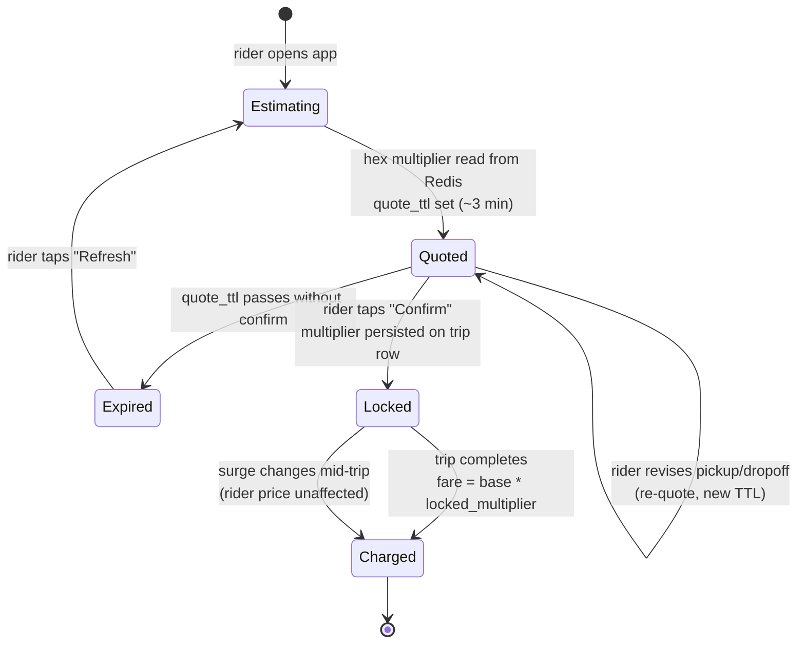

# Uber Deep Dive — Surge Pricing

**Date:** 2026-04-29 | **Updated:** 2026-04-29
**Tags:** `system-design` `case-study` `uber` `deep-dive` `pricing` `marketplace`

## Table of Contents

- [Summary](#summary)
- [Overview — Why Surge Exists](#overview--why-surge-exists)
- [Demand-Supply Ratio](#demand-supply-ratio)
  - [Per-Hex, Per-Time-Slice Granularity](#per-hex-per-time-slice-granularity)
  - [What Goes Into the Numerator and Denominator](#what-goes-into-the-numerator-and-denominator)
  - [Imbalance Signal vs Raw Counts](#imbalance-signal-vs-raw-counts)
- [Multiplier Formula](#multiplier-formula)
  - [The Mapping From Imbalance to Price](#the-mapping-from-imbalance-to-price)
  - [Predictive vs Reactive Surge](#predictive-vs-reactive-surge)
  - [Hex Resolution and Smoothing Across Neighbors](#hex-resolution-and-smoothing-across-neighbors)
- [Smoothing — Avoid Flicker](#smoothing--avoid-flicker)
  - [Hysteresis: Raise Fast, Lower Slow](#hysteresis-raise-fast-lower-slow)
  - [Spatial Smoothing](#spatial-smoothing)
  - [Temporal EMA and Pulse Cadence](#temporal-ema-and-pulse-cadence)
- [Rider vs Driver Pricing](#rider-vs-driver-pricing)
- [Surge Map Visualization](#surge-map-visualization)
- [Price Elasticity](#price-elasticity)
- [Regulatory Caps](#regulatory-caps)
- [Deactivation — Storms and Special Events](#deactivation--storms-and-special-events)
- [Honored Surge — Locked at Request Time](#honored-surge--locked-at-request-time)
- [Experiment Platform — Surge Variants](#experiment-platform--surge-variants)
- [Anti-Patterns](#anti-patterns)
- [Related](#related)
- [References](#references)

## Summary

**Surge pricing** is Uber's real-time, geo-localized price-multiplier that nudges a two-sided marketplace toward equilibrium when demand outpaces supply. The system computes a **demand-supply ratio per H3 hexagon per ~30s pulse**, maps it through a smoothed function to a multiplier (typically `1.0×` to `~3.0×`, capped by city policy), and writes the result to a hot store (Redis, geo-keyed) where the rider quote path and the driver heatmap both read from. The multiplier serves three purposes simultaneously: **demand suppression** (some riders defer or substitute), **supply attraction** (drivers reposition into hot hexes), and **rationing** (when no price clears the market, surge at least selects who-most-wants-the-ride). The hard engineering problems are not the formula but everything around it: **smoothing** so the map doesn't flicker (hysteresis, spatial blur, EMA), **honored surge** so the rider's quoted multiplier is locked even if the market shifts mid-trip, **deactivation** during disasters or regulator-defined emergencies, and an **experimentation platform** that can A/B price elasticity curves without wrecking driver earnings on the control arm. Uber Engineering's posts ["Engineering Real-Time Predictive Surge Pricing"](https://www.uber.com/blog/engineering-surge-pricing/) and the academic line that started with [Bimpikis, Candogan, Saban (2019)](https://web.stanford.edu/~kostasb/publications/spatial_pricing.pdf) describe the production architecture and the economic theory respectively. This doc walks through both layers so the formula stops feeling magical and the operational concerns stop feeling like footnotes.

## Overview — Why Surge Exists

A ride-hailing marketplace has a peculiar physics: **supply is mobile but slow, demand is mobile and fast, and inventory is perishable**. A driver who is idle in hex `A` cannot move to hex `B` instantly — the repositioning takes minutes. A rider who fails to find a ride in hex `B` is gone in seconds — they call a friend, take a bus, or walk. The clearing mechanism in a flat-price world is **queue length**: more riders pile up, ETAs balloon, riders abandon. That mechanism is silent (riders just leave), unfair (no preference for who values the ride most), and inefficient (drivers in adjacent hexes don't get the signal).

A price-based mechanism flips all three properties:

- **Loud signal.** A multiplier is a number both sides can see and act on.
- **Self-selecting.** Riders who value the ride less than the new price drop out; those who value it more remain. Allocation tilts toward willingness-to-pay, which is a defensible-if-uncomfortable rationing rule.
- **Cross-hex signal.** Drivers in cool hexes see a heatmap and choose to reposition — without anyone telling them to.

Why is this hard?

1. **The market is hyperlocal.** Times Square at 11:50 PM is a different market from a residential neighborhood three miles away. You cannot price a city as one zone.
2. **The market is hyper-temporal.** Demand jumps an order of magnitude when a stadium event ends. A flat price cannot adapt; a slow-moving price ends up wrong twice (too low at peak, too high after).
3. **Public perception is hostile.** "Price gouging" is a real and recurring news story. Riders hate variable pricing in the abstract even when they accept it in practice.
4. **Regulation is local.** Some cities (NYC, Delhi, Sao Paulo) cap multipliers; some require deactivation during declared emergencies; some forbid surge entirely for certain trip types (airport queues, school routes).
5. **The system runs at ~10⁵ requests/second across hundreds of cities.** Latency budget is a few hundred ms for the rider's fare quote.

The rest of this document peels each layer apart: the **inputs** (demand-supply ratio), the **mapping** (multiplier formula), the **stabilizers** (smoothing), the **two-sided communication** (rider vs driver pricing), the **operational levers** (caps, deactivation, honored surge), and the **research surface** (experiment platform).

## Demand-Supply Ratio

### Per-Hex, Per-Time-Slice Granularity

The unit of pricing is **(H3 hex × time slice)**, not the city. Uber uses [H3](https://h3geo.org/) — a hierarchical hexagonal global grid — at multiple resolutions for different concerns. For surge, the canonical resolution is around **res 7 to res 8** (`~5 km²` and `~0.7 km²` respectively); the parent doc's data model uses res 7 for the Redis-cached `surge_zone` table. The exact resolution is a per-city tuning parameter — dense urban cores (NYC, San Francisco) often run a finer resolution than sprawling suburbs.

```text
city ─┬─ res 6 (megazone, used for trends and analytics)
      ├─ res 7 (~5 km²,  used for surge in most cities)
      ├─ res 8 (~0.7 km², used in dense cores)
      └─ res 9 (~0.1 km², used for ETA and pickup, not surge)
```

Why hexagons and not squares? Three reasons:
- **Equidistant neighbors.** Each hex has six neighbors at the same edge-distance. Squares have four neighbors at distance 1 and four diagonals at distance √2 — every neighbor query has to handle two cases. Hexes don't.
- **Smoother spatial smoothing.** Convolutions over hexagonal grids avoid the directional bias squares have.
- **Hierarchical containment.** H3 cells nest cleanly so you can switch resolution per city without re-projecting data.

The time slice is **a sliding window of recent activity**, typically 1–5 minutes wide, advanced every **pulse interval** (~30s). The output is the same 2D field — `(hex, slice) → multiplier` — refreshed continuously.

### What Goes Into the Numerator and Denominator

The naïve formulation is `demand / supply`. The production formulation is more careful. Schematically:

```text
demand_signal[hex, t]  =  weighted_sum(
    open_requests_in_hex[t],
    sessions_with_request_intent_in_hex[t],   // app open, fare estimate viewed
    eyeballs[t],                              // app open without estimate (lower weight)
    historical_demand_at_this_time[t],        // baseline / forecast
)

supply_signal[hex, t]  =  weighted_sum(
    available_drivers_in_hex[t],
    drivers_en_route_in_hex[t],               // matched but not yet picked up
    drivers_inbound_from_neighbor_hexes[t],   // discounted by ETA
    historical_supply_at_this_time[t],
)

ratio[hex, t]  =  demand_signal[hex, t] / max(supply_signal[hex, t], floor)
```

A few observations:

- **`max(.., floor)`** prevents division-by-zero blow-up: if there are zero drivers in a hex, we don't return `+∞`, we return a large but bounded ratio. The floor is also a defense against the adversarial "all drivers go offline" attack — if a clique of drivers tries to manufacture surge by simultaneously logging off, the floor keeps the multiplier from spiking unrealistically.
- **Eyeballs are weak demand.** A user who opened the app and bounced is a fraction of a request; the weight is tuned offline, often on a fraction-of-a-conversion basis.
- **Inbound drivers reduce effective scarcity.** A driver who is 2 minutes from this hex and uncommitted is partial supply, weighted by `1 / (1 + ETA_minutes / τ)`.
- **Historical baseline matters for cold hexes.** A residential hex may have 0 requests in the current 60s but reliably has 3 requests/min at this hour. Comparing the live signal to its baseline is what allows **predictive surge** to fire before the queue forms.

### Imbalance Signal vs Raw Counts

A common bug in early surge implementations is to surge based on **request count alone** without supply context. That fires surge in hexes with low absolute volume just because supply happened to dip — a single driver going home for the day in a quiet suburb should not produce a 1.7× multiplier. **The decision must be a ratio**, and the ratio should be informed by both an absolute-volume floor (don't surge if `requests < N`) and a stability check (don't surge if the imbalance is shorter than the smoothing window).

A worked numerical example for a single hex over one pulse:

```text
Inputs at t (hex 882a100d2dfffff, downtown core, 18:32 local):
    open_requests             = 24
    sessions_with_intent      = 41   (weight 0.25 → 10.25)
    eyeballs                  = 88   (weight 0.05 → 4.4)
    historical_baseline       = 18   (weight 0.30 → 5.4)
    available_drivers         = 6
    drivers_en_route          = 4    (weight 0.7 → 2.8)
    inbound_neighbors_<3min   = 5    (weight 0.4 → 2.0)
    historical_supply         = 14   (weight 0.30 → 4.2)
    floor                     = 3.0

demand_signal  = 24 + 10.25 + 4.4 + 5.4               = 44.05
supply_signal  = 6  + 2.8   + 2.0 + 4.2                = 15.0
ratio          = 44.05 / max(15.0, 3.0)                = 2.94
```

The hex is running at roughly 2.94× the demand its supply can serve in equilibrium. The next stage decides what multiplier turns that into the cleared market — almost certainly not `2.94×`, because that's the imbalance, not the price that closes it.

The output of this stage is a single float per hex per pulse: the **imbalance score**. The next stage turns it into a price.

## Multiplier Formula

### The Mapping From Imbalance to Price

The published shape of the function is conceptually:

```text
multiplier(hex, t) = clamp(
    f( imbalance_score[hex, t],
       elasticity_estimate[hex, hour, day_of_week],
       neighbor_smoothing_term,
       hysteresis_term ),
    1.0,                          // never below 1.0× (no "negative" surge)
    city_cap[hex.city]            // regulatory ceiling
)
```

Where `f` is monotonic non-decreasing in the imbalance score, smooth (so small input changes don't flip discrete output bands), and incorporates an estimate of price elasticity (see [Price Elasticity](#price-elasticity) below). The outputs are typically **discretized to user-friendly values** — 1.1×, 1.2×, 1.3×, ..., 1.5×, 1.7×, 2.0×, 2.5×, 3.0× — rather than continuous reals, so that the rider sees a "round" multiplier.

A simplified worked example of `f`:

```text
imbalance = demand_signal / max(supply_signal, floor)

raw_multiplier = 1.0 + α * max(0, imbalance - 1.0) ^ β

# α and β are per-city, fitted from historical conversion data:
#   α controls the slope at the equilibrium boundary
#   β controls the curvature (β > 1 is "lazy" — small imbalances barely move the price)

smoothed = raw_multiplier * (1 - w_neighbor) + neighbor_avg * w_neighbor
adjusted = hysteresis(prev_multiplier, smoothed)
final    = discretize(clamp(adjusted, 1.0, city_cap))
```

Real implementations are more sophisticated — Uber Engineering describes ML models that predict the *future* imbalance over a short horizon and price against the prediction rather than the current snapshot. The conceptual shape, though, is unchanged: `imbalance → smooth function → clamp → discretize`.

Continuing the worked example with `α = 0.45`, `β = 0.6`, neighbor avg = `1.6`, `w_neighbor = 0.3`:

```text
imbalance      = 2.94
raw_multiplier = 1.0 + 0.45 * (2.94 - 1.0) ^ 0.6
               = 1.0 + 0.45 * 1.94 ^ 0.6
               = 1.0 + 0.45 * 1.50
               = 1.675

smoothed       = 0.7 * 1.675 + 0.3 * 1.6 = 1.6525
hysteresis_in  = 1.40   (the previous pulse's value)
since smoothed > hysteresis_in: raise immediately
adjusted       = 1.6525
clamped        = min(1.6525, city_cap=2.5) = 1.6525
discretized    = 1.7    (snap up to the next user-visible band)

final_multiplier = 1.7×
```

The same hex one pulse earlier might have been at `1.4×`; one pulse later, with imbalance dropping to 2.1, the smoothed raw might fall to 1.45 — but hysteresis would only let the displayed multiplier *decay* by ~`0.05` per pulse, so the rider on the next pulse would still see `1.65×`. That asymmetry is the smoothing layer at work.

### Predictive vs Reactive Surge

Two regimes coexist:

- **Reactive surge.** Compute imbalance from current open requests and available drivers; surge to clear the current backlog. Simple, well-understood, but always lagging — by the time you've raised price, the riders who left have already left.
- **Predictive surge.** Forecast demand and supply for the next `T` minutes (using a model trained on historical patterns, weather, events, day-of-week, time-of-day) and surge **ahead of** the imbalance, so by the time demand peaks the supply has already repositioned. This is the central contribution of [Uber Engineering's "Real-Time Predictive Surge Pricing"](https://www.uber.com/blog/engineering-surge-pricing/) — the system anticipates the wave instead of riding behind it.

The blend in production is typically `0.6 * predictive + 0.4 * reactive` (numbers are illustrative), with the predictive component dominating when the model has strong signal (recurring patterns) and the reactive component taking over when an unexpected event happens (a sudden storm).

### Hex Resolution and Smoothing Across Neighbors

A 1.5× hex sitting next to a 1.0× hex is a **driver gravity well**: drivers will sit on the edge. That's both a UX problem (the heatmap looks like a quilt) and an economic problem (drivers cluster on borders, refusing rides on the cool side). The fix is **spatial smoothing** during the multiplier computation — see the next section.

The chosen H3 resolution trades precision for stability:
- Coarser hex → fewer, larger zones → more stable multipliers, less precise targeting.
- Finer hex → many small zones → precise but flickery; needs heavier smoothing.

Most cities settle at res 7. Dense cores may run res 8 with stronger neighbor weighting.

## Smoothing — Avoid Flicker

A surge map that flickers between 1.0× and 1.7× every pulse is worse than no surge at all: drivers don't trust it, riders see different prices on consecutive refreshes, and the dispatcher gets noise. Production surge applies three independent smoothing layers.

### Hysteresis: Raise Fast, Lower Slow

The asymmetric update rule:

```text
if new_multiplier > current_multiplier:
    current_multiplier = new_multiplier                  # raise immediately
else:
    current_multiplier = max(
        new_multiplier,
        current_multiplier - decay_per_pulse             # lower gradually
    )
```

Why asymmetric?
- **Raising fast** is correct: a sudden surge of demand should be priced now, not in 90s. Underpricing peak periods burns money on the table and makes the queue worse.
- **Lowering slowly** is correct: drivers who repositioned in response to surge need time to be rewarded. If the multiplier collapses the moment they arrive, they got punished for following the signal — they will not follow it next time. Hysteresis is, in part, a **commitment device** to drivers.

A typical decay is on the order of `0.1× per minute`, so a 2.0× hex takes ~10 minutes to relax to 1.0× even if the imbalance disappeared instantly.

### Spatial Smoothing

Compute a multiplier over the **k-ring** of neighbors and blend:

```text
smoothed[hex] = (1 - w) * raw[hex] + w * mean(raw[hex.k_ring(1)])
```

with `w ∈ [0.2, 0.4]` typically. This:
- Removes sharp boundary thrash between adjacent hexes.
- Implicitly says "if my neighbors are surging, I am part of the surge" — so a driver entering the heatmap region from any direction sees consistent prices.
- Costs at most one extra hash lookup per neighbor, fast on H3.

For finer resolutions, a 2-ring or Gaussian blur with falloff `exp(-d² / σ²)` works better than a uniform 1-ring average.

### Temporal EMA and Pulse Cadence

On top of hysteresis (which prevents downward thrash), an **exponential moving average** dampens upward noise:

```text
ema[hex, t] = γ * raw[hex, t] + (1 - γ) * ema[hex, t-1]
```

with `γ ∈ [0.4, 0.7]`. Smaller `γ` = more dampened, slower to respond. The combination of EMA + hysteresis + spatial blur is what gives the surge map its smooth "blob" appearance instead of looking like static.

The **pulse interval** itself is a knob:
- Too short (`< 10s`) → the system reacts to noise, multipliers flicker.
- Too long (`> 60s`) → the system reacts to history, quotes go stale, riders see wrong prices.
- The published Uber number is around **30 seconds**, which is a defensible compromise. The parent doc (`design-uber.md` §5) calls this out explicitly: "Pulse interval too short → jitter; too long → stale and unfair. ~30s is a common compromise."

## Rider vs Driver Pricing

A subtle but load-bearing fact: **the rider and the driver may see different multipliers for the same trip.** They are computed from different inputs, communicated differently, and serve different purposes.

```text
rider_quote = base_fare * rider_surge_multiplier(hex, t)
driver_payout = base_payout * driver_incentive_multiplier(hex, t)
take_rate    = (rider_quote - driver_payout) / rider_quote
```

Reasons the two diverge:

1. **Different signals.** Rider surge responds to a longer time horizon (so the quote doesn't oscillate during checkout). Driver heatmap can be more reactive (drivers want fresh signal to reposition).
2. **Different units.** Rider surge is a **multiplier on fare**. Driver incentives in many markets are **flat-dollar bonuses for completing a trip from a hot zone**, not a multiplier — easier to understand on the driver side, less perceived "gouging".
3. **Take-rate management.** Uber's take rate (the platform's cut) varies with surge level. In some markets, surge revenue is partially shared with drivers and partially captured by the platform; in others, drivers get the full surge. Regulation sometimes mandates the split.
4. **Promotions and credits.** Riders may have credits, codes, or subscription discounts that further alter their effective price; these never affect what the driver sees.

This split is a frequent source of confusion in interview discussions. The system does not have one "surge number" that both parties read; it has **two related but separately governed numbers** with shared inputs but different presentation, persistence, and update cadence.

## Surge Map Visualization

The driver app shows a **heatmap of surge zones** — typically rendered with a sequential color ramp (yellow → orange → red as the multiplier rises) and 5–7 discrete bands. Implementation notes:

- **The map is read from the same Redis cache** the rider quote path reads from (or a downsampled snapshot of it). One source of truth.
- **Hex polygons are computed client-side** from the cell IDs to keep wire size small. The server pushes `{cell_id, band}` tuples, not GeoJSON.
- **Updates push via the persistent driver connection** (the same WebSocket / streaming connection used for dispatch), with debounce so the screen updates once per pulse rather than smoothly.
- **Bands are coarsened** for display (1.0–1.2 = no color, 1.2–1.5 = yellow, 1.5–2.0 = orange, etc.) — drivers don't need three decimal places.
- **Time-of-day forecast overlay** shows expected surge over the next hour, so a driver can decide whether to position themselves now.

UX trade-offs:
- **Showing too many bands** makes the map noisy and encourages drivers to chase tiny boundary differences.
- **Showing too few bands** loses signal — a 1.2× and a 2.0× hex shouldn't look the same.
- **Showing the underlying multiplier as a number on tap** is correct; showing it everywhere is overload.

The rider app has a **single-cell view**: it shows the multiplier (or "fares are higher right now") for the rider's pickup hex only, on the fare-estimate screen. Riders never see a heatmap — the broader spatial information is not actionable for them.

## Price Elasticity

Surge only works because demand has a **finite price elasticity**: when the price goes up, some riders defer, substitute, or abandon, freeing up the queue. If elasticity were zero (everyone takes the ride at any price), surge would only redistribute earnings without clearing the market; if elasticity were infinite (one cent extra and everyone leaves), surge would never fire because the threshold would never be reached.

The elasticity estimate `ε(hex, hour, dow)` is a per-segment **conversion-rate model**:

```text
P(rider books | quoted multiplier = m, hex, hour, dow, rider_segment) = sigmoid(... m ...)
```

Inputs include:
- The base conversion rate (probability of book without surge) for this hex × hour × day-of-week.
- The historical book-rate at each multiplier level.
- Rider features (rare or aggregate, never PII): trip purpose proxy, recent ride frequency, time-of-day preference.
- Substitution availability (transit, weather — if it's pouring rain, elasticity is low).

The model is trained on **observed bookings vs quotes** — every fare estimate that the rider sees is a labeled data point (`saw m, booked y/n`). This is also why **showing rider experiments** is so sensitive: the very act of showing different prices generates the data that calibrates the model.

Two production properties matter:

- **Elasticity is non-stationary.** Rush-hour elasticity is lower (riders are committed) than late-night elasticity (riders have alternatives). The model is segmented, not global.
- **Elasticity is endogenous.** Surge availability changes rider behavior — if riders learn surge ends at 8 PM, demand piles up at 7:55. The model has to be retrained as users adapt.

The pricing function uses elasticity to find the multiplier that **maximizes expected throughput × price subject to the constraint that the queue clears**. In practice this is approximated by a lookup table or a per-city fitted curve — a closed-form optimization is not the bottleneck; data quality is.

A toy elasticity table for one hex/hour segment might look like:

| Multiplier | P(book) | Expected riders/min | Expected revenue/min |
|------------|---------|---------------------|----------------------|
| 1.0× | 0.85 | 14.5 | 14.5 × base |
| 1.2× | 0.78 | 13.3 | 15.9 × base |
| 1.5× | 0.65 | 11.0 | 16.5 × base |
| 1.7× | 0.55 | 9.4 | 16.0 × base |
| 2.0× | 0.42 | 7.1 | 14.3 × base |
| 2.5× | 0.28 | 4.8 | 11.9 × base |

The local revenue maximum sits around `1.5×` here — but the system also has to clear the queue (riders left over reduce future demand and damage retention), which can push the chosen multiplier off the revenue peak in either direction depending on supply.

## Regulatory Caps

Surge is **regulated, sometimes hard-capped, sometimes banned**. The system must encode policy as a first-class operational lever, not as something patched on at the application layer.

Examples of policy mechanisms encountered in production:

- **City-level multiplier ceilings.** Some jurisdictions cap surge at e.g. `2.0×`, `1.5×`, or `1.25×` outside emergency declarations. The cap is a `clamp` at the very end of the multiplier pipeline.
- **Class-of-service caps.** Premium product tiers (Black, Lux) sometimes have higher caps than economy tiers; school routes, accessibility-required trips, and disability-routed rides may have caps of `1.0×` (no surge).
- **Time-of-day caps.** Some markets cap or ban surge during specific hours (early-morning commute, school dismissal).
- **Geographic exclusions.** Certain hexes (airports with managed queues, hospital pickup zones) may be set to `1.0×` regardless of imbalance because the queue mechanism is taken over by the operator.
- **Emergency declarations.** During declared emergencies (natural disaster, public-safety event), surge is **deactivated entirely** in the affected geography for the duration of the declaration.

Implementation pattern:

```text
final_multiplier = min(
    raw_multiplier,
    rules_engine.cap(hex, product_class, time, declared_emergencies)
)
```

The rules engine is a **policy service** with its own deploy cadence (config changes, not code changes), audit log, and override controls. **Pricing engineers do not reach into the policy service**; policy is owned by ops/legal. The price computation is a pure function of imbalance and config; the config is owned elsewhere.

A note on transparency: regulators and journalists periodically audit Uber's pricing for compliance. The audit-log requirement means every quote is reproducible — given the inputs at time `t`, you can replay the exact multiplier the rider saw. This is non-negotiable, and the experiment platform (next section) has to honor it.

## Deactivation — Storms and Special Events

There are events where surge **must be turned off**, fast, in specific geographies. Examples:

- **Natural disaster.** A hurricane evacuation, a flood, a wildfire. Public outcry and FTC scrutiny make this non-negotiable; Uber learned in the 2014 Sydney hostage crisis that automatic surge during disaster looks like profiteering even if the model is following its rules.
- **Special declared events.** A terrorist attack, a public-health emergency, a major civic disruption.
- **Internal anomaly.** The pricing model produced something the safety system flagged as broken — flat the multiplier and investigate.

Mechanism:

1. **A deactivation flag** is a city-and-hex-scoped config: `disable_surge(geofence, until=t)`.
2. The **rules engine** reads the flag at multiplier-compute time. If set, `final_multiplier = 1.0` regardless of imbalance.
3. **Driver heatmap is muted** in the same geofence — you don't show drivers a hot zone they can't profit from.
4. **In-app banners** explain ("Surge has been temporarily disabled for the [Event] in [Region]"). Riders deserve a reason; drivers deserve a reason.
5. **Pulse continues to compute the imbalance** — it is just not exposed as a multiplier. Internal dashboards still see the underlying state for ops and post-event analysis.

The deactivation system is a **kill switch**, and like all kill switches it is exercised by **a small set of authenticated operators** with a paged audit trail. It is **not a developer-deployable change** — the latency from "operator decides" to "field is off" must be seconds, not deploy-cycles.

A subtler operational pattern: surge is sometimes **partially deactivated** — caps are tightened (e.g. cap drops from `3.0×` to `1.5×`) for the duration of a less-severe disruption. Same mechanism, different config value.

## Honored Surge — Locked at Request Time

When a rider sees a fare estimate at multiplier `m` and taps "Confirm", the system **locks** `m` for that ride. This is **honored surge**. Properties:

- **The quoted multiplier is part of the trip record.** It is not re-read from Redis at trip-end. The fare is `base * quoted_m + adjustments`, where `quoted_m` is whatever the rider agreed to.
- **Mid-trip surge changes do not affect the rider.** If the multiplier in the pickup hex jumps from 1.5× to 2.5× while the rider's trip is en route, the rider still pays 1.5×.
- **The driver may see a different number.** Driver compensation is governed by separate rules (see [Rider vs Driver Pricing](#rider-vs-driver-pricing)); the driver may receive a bonus that's a function of the *current* surge at pickup, not the rider's locked surge.
- **Quote staleness has a TTL.** The estimate the rider sees is valid for ~1–5 minutes; tapping "Request" after the quote expires triggers a re-quote, which is then locked.

Why is this load-bearing? Two reasons:

1. **Trust.** A rider who agreed to 1.5× and ended up paying 2.5× because the market moved during their trip will never use the product again. Honored surge is a contract.
2. **Operational simplicity.** Trip-end pricing depends only on the trip record, not on the live state of a far-away hex Redis. Settlement, refunds, and disputes all run against an immutable quote. The alternative — recomputing the price at trip-end — introduces a wide class of bugs and is forbidden.

Implementation:

```text
on rider_request_confirm:
    quoted = read_redis(surge_zone, hex_at_pickup)
    create_trip(
        rider_id, ...,
        quoted_multiplier = quoted.multiplier,
        quoted_at = now(),
        quote_ttl = quoted.expires_at,
    )
    enforce: quoted_at < quote_ttl
```

The trip row carries `quoted_multiplier` as an immutable column. The fare-finalization service reads it and never reaches back to Redis for surge.

The lifecycle of a quote, illustrated:



The transition from `Quoted` → `Locked` is the contract. Once a multiplier is locked, no live surge value can override it. The same locked value is what shows on the receipt, what payment authorizes against, and what dispute resolution sees.

Edge cases:

- **Driver re-route to a different pickup.** If the driver is reassigned mid-pickup-leg to a hex with a different surge, the rider's quote is unchanged. The reassignment is internal.
- **Rider edits drop-off mid-trip.** The base fare changes (longer route → more dollars), but the multiplier on top is the locked one.
- **Stacked rides (UberPool / Share).** Each rider has their own quoted multiplier locked at their own request time. The driver sees a per-rider compensation breakdown.
- **Driver cancels, rider re-matches.** A new match in the same trip context typically preserves the original quote until the quote TTL expires; after that the rider is re-quoted (and may see surge change before re-confirming).

## Experiment Platform — Surge Variants

Uber's experimentation platform (XP, internally) is a heavyweight piece of infrastructure: thousands of concurrent experiments, deterministic bucketing, opaque configuration to the application, statistical-significance tooling. Surge experiments are some of the most sensitive runs on it.

What gets experimented on:

- **Elasticity curves.** New conversion-rate models against the production model. Treatment riders see prices computed from the candidate model; control riders see the production model.
- **Smoothing parameters.** Different pulse intervals, EMA `γ`, hysteresis decay rates. Direct effect on driver behavior — risky to A/B without driver-side guardrails.
- **Multiplier discretization.** Showing 1.4× vs rounding to 1.5× — a UX experiment that interacts with conversion.
- **Predictive vs reactive blending weight.** Tested per-city.
- **Communication treatments.** "Fares are higher" vs "1.5× surge" vs "Demand is high" — language experiments that change the behavioral response without changing the price.
- **Cap experiments.** What happens if the city cap is `2.5×` vs `2.0×`? Long-run, high-stakes; usually run only after legal sign-off.

Key constraints:

- **Driver-side fairness.** A driver should not be the control for a rider experiment that lowers their earnings. Driver compensation is held constant or the experiment is run as a paired-zone design (matched hexes assigned to treatment/control with covariate balancing).
- **Long horizons.** The interesting effects (driver supply response, rider habit formation) take days or weeks. Short-window A/B can mislead by missing the equilibrium response.
- **Audit reproducibility.** Every quoted multiplier must be reproducible from the experiment assignment + inputs at quote time. The experiment ID is recorded on the trip; the policy used by that ID is immutable in config history. Regulatory inquiry must be answerable.
- **No PII leak through bucketing.** Bucket assignment is keyed on `hash(rider_id, experiment_salt)` — stable but opaque.

The published architecture does not expose the exact statistical machinery, but the public-facing parts (experimentation tooling, [Bayesian A/B](https://www.uber.com/blog/), [CUPED variance reduction](https://www.uber.com/blog/)) are documented in Uber Engineering posts. The principle relevant to surge is: **the price the rider sees is a function of (imbalance, policy, experiment assignment)**, and all three are captured at quote time and locked for the trip.

## Anti-Patterns

**Surge from raw request count without supply context.** A single driver going off-shift in a quiet hex should not produce a 1.7× multiplier. The decision must be a ratio with a volume floor (`requests > N`) and a duration floor (`imbalance held for > pulse × M`). The parent doc calls this out explicitly: "Surge based on raw request count without supply context. You'll surge a cell with no demand if a few drivers go offline. Multiplier must be a ratio."

**Recomputing the multiplier at trip-end.** Honored surge is a contract; rereading Redis at fare finalization breaks it. Lock the quote at request time. The trip row is the source of truth for billing.

**Symmetric hysteresis (raise and lower at the same speed).** Drivers who repositioned in response to surge will get punished for following the signal. Raise fast, lower slow. The decay is a commitment device.

**Letting the multiplier go below 1.0× ("inverse surge"/discount).** Tempting in cool periods, dangerous in practice — a 0.8× multiplier is a discount that compounds with rider promotions and can produce negative driver economics. Discounts are a *separate* mechanism, governed by promotions infrastructure, not a generalization of surge.

**No regulatory cap.** Surge that ignores city policy is a lawsuit, a press cycle, and a market exit waiting to happen. The cap is a hard `clamp` at the end of the pipeline, not a soft hint.

**Driver heatmap that flickers.** Drivers who can't trust the heatmap stop responding to it; the supply-side of the loop dies. Spatial smoothing + EMA + hysteresis are not optional.

**Conflating rider surge and driver compensation.** They are computed and communicated separately. A document or interview that uses "the surge multiplier" as a single number is leaving the marketplace's load-bearing detail on the floor.

**Disabling deactivation paths in cold-start.** An immature deployment might skip the kill-switch / config-flag surface "for now". The first crisis (storm, civil event) will be the test, and the test will go badly. Build the off switch first, the on logic second.

**Running rider-facing experiments without driver-side guardrails.** A 5% conversion-rate lift in the rider arm that comes out of driver earnings is not a win; it's a transfer. Pair experiments with driver-earnings monitoring, and reject treatments that move that metric beyond a tolerance.

**Treating elasticity as static.** Riders and drivers adapt. The model retrains; the experimental arms expire; the segmentation is reviewed. A surge engine on autopilot will drift.

**Publishing the multiplier as a continuous real.** "1.2873×" looks like the system is making things up. Discretize to user-friendly bands.

**Assuming the formula is the hard part.** The mapping from imbalance to multiplier is a dozen lines of code. The hard parts are: smoothing, honored surge, deactivation, rider/driver split, elasticity estimation, regulatory caps, experimentation discipline, and operational override. Spend interview time on those.

## Related

- [Design Uber (parent)](../design-uber.md) — overview of the full system, where surge fits among matching, ETA, payments, and tracking
- [Matching & Dispatch deep dive](./matching-and-dispatch.md) — the consumer of the surge state; surge biases dispatch toward hot hexes by influencing driver supply
- [Connection Scaling for Real-Time Apps](../../real-time/whatsapp/connection-scaling.md) — the fan-out pattern behind the driver heatmap subscription
- [Design DoorDash](../design-doordash.md) — same surge pattern applied to a three-sided marketplace (rider-driver-merchant); pricing levers extend to delivery fees and merchant promotions
- [Top-K Heavy Hitters](../../data-structures/count-min-sketch-and-top-k.md) — the kind of probabilistic counting useful for hot-hex analytics off the surge data plane
- [Distributed Rate Limiting](../../infrastructure/rate-limiting.md) — sibling pattern for protecting the surge compute path itself from overload during demand spikes

## References

- Uber Engineering, ["Engineering Real-Time Predictive Surge Pricing"](https://www.uber.com/blog/engineering-surge-pricing/) — the canonical Uber post describing the production architecture, hex grids, predictive vs reactive components, and pulse cadence
- Uber Engineering blog index, [https://www.uber.com/blog/engineering/](https://www.uber.com/blog/engineering/) — surge, dispatch, and marketplace posts; the "Marketplace" tag covers the operations side of pricing
- Uber Engineering, ["H3: Uber's Hexagonal Hierarchical Spatial Index"](https://www.uber.com/blog/h3/) — the geospatial substrate underneath surge zones; explains hex-vs-square trade-offs and resolution levels
- H3 documentation, [https://h3geo.org/](https://h3geo.org/) — the open-source library; reference for `k-ring`, `compactCells`, and resolution-area mappings
- Kostas Bimpikis, Ozan Candogan, and Daniela Saban, ["Spatial Pricing in Ride-Sharing Networks"](https://web.stanford.edu/~kostasb/publications/spatial_pricing.pdf) (Operations Research, 2019) — the formal economic analysis of surge as a spatial-pricing problem in a network of locations
- Juan Camilo Castillo, Dan Knoepfle, and Glen Weyl, ["Surge Pricing Solves the Wild Goose Chase"](https://papers.ssrn.com/sol3/papers.cfm?abstract_id=2890666) (EC '17) — analytical treatment of why surge prevents the equilibrium where drivers chase distant requests until everyone loses
- M. Keith Chen and Michael Sheldon, ["Dynamic Pricing in a Labor Market: Surge Pricing and Flexible Work on the Uber Platform"](https://www.anderson.ucla.edu/faculty_pages/keith.chen/papers/SurgeAndFlexibleWork_WorkingPaper.pdf) — empirical analysis of how surge affects driver hours and earnings
- Jonathan Hall, Cory Kendrick, and Chris Nosko, ["The Effects of Uber's Surge Pricing: A Case Study"](https://web.archive.org/web/20210928020646/https://faculty.chicagobooth.edu/-/media/faculty/cory-kendrick/research/effects_of_ubers_surge_pricing.pdf) — Uber-authored case study of the New Year's Eve 2014/2015 surge incident; useful as a primary source on outage-driven pricing failure modes
- Federal Trade Commission, ["Dynamic Pricing in the Sharing Economy"](https://www.ftc.gov/news-events/events/2015/06/sharing-economy-issues-facing-platforms-participants-regulators) — regulatory perspective and case material informing the cap and deactivation patterns
- Liyan Yang and Itai Gurvich, ["Pricing in a Two-Sided Service Marketplace"](https://www0.gsb.columbia.edu/faculty/igurvich/papers.html) — theoretical underpinning for the asymmetric rider/driver pricing surface
