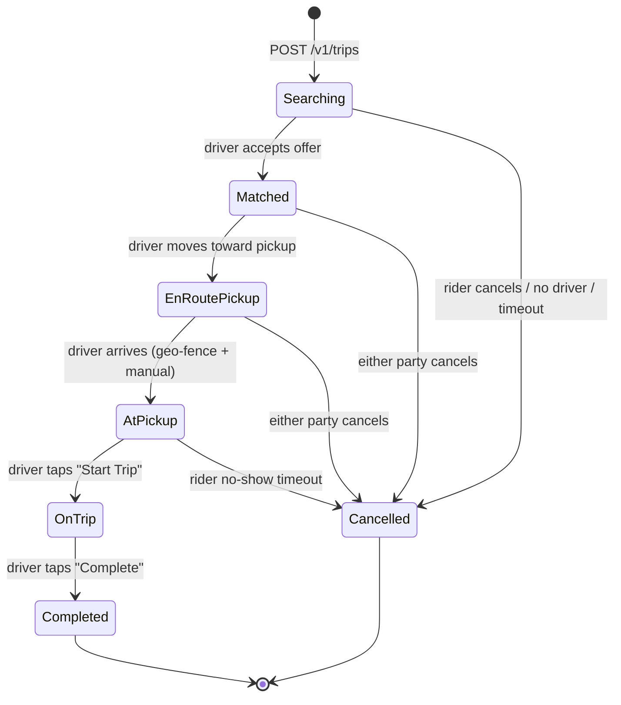

# Uber Deep Dive — Trip State Machine

**Date:** 2026-04-29 | **Updated:** 2026-04-29
**Tags:** `system-design` `case-study` `uber` `deep-dive` `state-machine` `saga`

## Table of Contents

- [Summary](#summary)
- [Overview — Why a Trip Is the Hardest CRUD You Will Ever Write](#overview--why-a-trip-is-the-hardest-crud-you-will-ever-write)
- [Trip Lifecycle States](#trip-lifecycle-states)
  - [Canonical State Diagram](#canonical-state-diagram)
  - [State Definitions](#state-definitions)
  - [Allowed and Forbidden Transitions](#allowed-and-forbidden-transitions)
- [State Transitions in Practice](#state-transitions-in-practice)
  - [The Transition API Contract](#the-transition-api-contract)
  - [Optimistic Concurrency on the Trip Row](#optimistic-concurrency-on-the-trip-row)
  - [Guards, Invariants, and Side Effects](#guards-invariants-and-side-effects)
- [Idempotency — Mobile Networks Lie](#idempotency--mobile-networks-lie)
  - [Idempotency Keys on Every Endpoint](#idempotency-keys-on-every-endpoint)
  - [Conditional Updates as a Second Line of Defense](#conditional-updates-as-a-second-line-of-defense)
  - [Inbox Pattern for Inbound Events](#inbox-pattern-for-inbound-events)
- [Storage — From MySQL to Schemaless to Postgres](#storage--from-mysql-to-schemaless-to-postgres)
  - [Why Schemaless Was Built](#why-schemaless-was-built)
  - [The Trigger and Append-Only Cell Model](#the-trigger-and-append-only-cell-model)
  - [The Postgres Re-Platform (Docstore / Schemaless v2)](#the-postgres-re-platform-docstore--schemaless-v2)
- [Event Sourcing for Audit and Replay](#event-sourcing-for-audit-and-replay)
  - [The Trip Event Log](#the-trip-event-log)
  - [Outbox Pattern Bridges DB and Kafka](#outbox-pattern-bridges-db-and-kafka)
  - [Replay, Backfill, and Disputes](#replay-backfill-and-disputes)
- [Cancellation Race Conditions](#cancellation-race-conditions)
  - [Rider Cancels While Driver Accepts](#rider-cancels-while-driver-accepts)
  - [Both Sides Cancel "First"](#both-sides-cancel-first)
  - [Driver Marks Arrived While Rider Cancels](#driver-marks-arrived-while-rider-cancels)
- [Compensation Saga — When Payment Fails After Completion](#compensation-saga--when-payment-fails-after-completion)
  - [The Trip-as-Saga Mental Model](#the-trip-as-saga-mental-model)
  - [What Compensations Actually Look Like](#what-compensations-actually-look-like)
  - [Why Cadence / Temporal](#why-cadence--temporal)
- [Fare Lock — Quoted, Locked, Reconciled](#fare-lock--quoted-locked-reconciled)
  - [Upfront Fare vs Time-and-Distance](#upfront-fare-vs-time-and-distance)
  - [What "Locking" Actually Means](#what-locking-actually-means)
  - [Adjustments After Completion](#adjustments-after-completion)
- [Multi-Leg Trips — Uber Pool / UberX Share](#multi-leg-trips--uber-pool--uberx-share)
  - [State Per Leg, Trip Container at the Top](#state-per-leg-trip-container-at-the-top)
  - [Joining a Live Trip Without Rewriting History](#joining-a-live-trip-without-rewriting-history)
- [HA Replication — Region Failover Without Time Travel](#ha-replication--region-failover-without-time-travel)
  - [Active-Active vs Active-Passive](#active-active-vs-active-passive)
  - [Conflict Avoidance via Sticky Routing](#conflict-avoidance-via-sticky-routing)
  - [Failover Drills and Inconsistency Windows](#failover-drills-and-inconsistency-windows)
- [Anti-Patterns](#anti-patterns)
- [Related](#related)
- [References](#references)

## Summary

A trip at Uber is a long-running, durable workflow that must survive flaky mobile networks, conflicting cancellations, payment failures, region failovers, and angry support tickets six months later. The right mental model is **not** "a row in a `trips` table" — it is a **finite state machine with idempotent transitions, event-sourced for audit, persisted in a horizontally scalable KV store (Schemaless / Docstore), and orchestrated as a saga (Cadence / Temporal) with explicit compensating actions for every step**. Optimistic concurrency on a `version` column resolves cancellation races; idempotency keys plus the inbox pattern absorb retries; the outbox pattern publishes state-change events to Kafka without dual-write hazards; fares are locked in at request time and reconciled at completion. Multi-leg products (Pool / Share) push the same machine onto each leg with a parent trip container holding cross-leg state. The lessons generalize to any business workflow that crosses services, money, and humans: model the state explicitly, make every transition idempotent, treat the event log as the source of truth, and design the compensations before you ship the happy path.

## Overview — Why a Trip Is the Hardest CRUD You Will Ever Write

Naively a trip looks like four columns: `rider_id`, `driver_id`, `status`, `fare`. In production it is anything but. Every transition involves at least three actors (rider phone, driver phone, server) on three different network paths, any of which can drop a packet, retry, time out, or arrive out of order. The state must be:

- **Durable** — once a driver has tapped "Start Trip", the rider cannot be charged twice and the driver cannot be unmatched.
- **Auditable** — six months later a customer disputes a charge and the support agent needs the exact sequence: who tapped what, when, with which fare quote.
- **Replicated** — a region failover during peak hours must not lose in-flight trips.
- **Composable with payments** — the trip is the trigger for charging the rider, paying the driver, and applying loyalty / promo / split-fare logic. If any of those fail downstream, the trip's "completed" state must reconcile.

The naive `UPDATE trips SET status = 'completed' WHERE id = ?` is the root cause of the 3 a.m. incident where a driver got paid twice, a rider got refunded into the negative, and the support agent has no idea what actually happened.

The architecture below is what falls out when you take each of those constraints seriously.

## Trip Lifecycle States

### Canonical State Diagram



(The Uber product has more granular sub-states — _Driver Assigned_, _Driver Arriving_, _Driver Waiting_ — but they collapse cleanly onto the eight above.)

### State Definitions

| State | Meaning | Side effects on entry |
|-------|---------|-----------------------|
| `Searching` | Rider posted a request; matching service is offering it to drivers. | Hold a rider's payment-method auth (no charge yet); start surge-locked fare quote. |
| `Matched` | A driver accepted; the trip is bound to that driver. | Push notification to rider with driver/vehicle info; reduce driver's available capacity in supply index. |
| `EnRoutePickup` | Driver started moving toward pickup. | Begin map streaming to rider; arm pickup ETA model. |
| `AtPickup` | Driver entered pickup geo-fence (or manually pressed arrived). | Start wait-time meter; arm rider no-show timer. |
| `OnTrip` | Driver tapped "Start Trip" with rider in vehicle. | Begin metered fare components (time + distance) if not pure upfront; freeze pickup wait charge. |
| `Completed` | Driver tapped "Complete" at destination. | Trigger payment saga; release rider auth → capture; pay driver; emit receipts. |
| `Cancelled` | Either side cancelled, or system cancelled (timeout, no driver). | Apply cancellation policy (free vs fee); release driver back to dispatch pool; release auth. |

### Allowed and Forbidden Transitions

The transition table is small and **must** be checked on the server, never trusted from the client:

| From → To | Trigger | Notes |
|-----------|---------|-------|
| `Searching → Matched` | Driver `POST /accept` | Only one accept wins; others see 409 Conflict. |
| `Searching → Cancelled` | Rider cancel **or** dispatch timeout (~3–10 min). | If timeout, `cancelled_by = 'system'`. |
| `Matched → EnRoutePickup` | Driver presses "Start Navigation" or vehicle moves > N meters. | Some products auto-advance on motion. |
| `Matched → Cancelled` | Rider cancel, driver cancel, system cancel. | Cancel policy depends on `now - matched_at`. |
| `EnRoutePickup → AtPickup` | Geofence entry **or** driver tap. | Belt + suspenders; geofence can lie in urban canyons. |
| `AtPickup → OnTrip` | Driver tap "Start Trip". | Rider must be in vehicle (encoded in driver UX). |
| `AtPickup → Cancelled` | Rider no-show timer fires (~5 min after arrival). | `cancelled_by = 'driver'`, fee applies. |
| `OnTrip → Completed` | Driver tap "Complete". | Triggers payment saga. |
| Anything → `Cancelled` _(early states only)_ | — | After `OnTrip`, you cannot cancel — you can only complete and refund. |
| `Completed → *` | — | Terminal. |
| `Cancelled → *` | — | Terminal. |

The "after `OnTrip` you can only complete" rule is critical: it means no race exists between a rider hitting "cancel" and the driver hitting "complete" once the trip is in progress. The cancel button is hidden from the rider UI in `OnTrip` for exactly this reason.

## State Transitions in Practice

### The Transition API Contract

Every state-change endpoint follows the same shape:

```http
POST /v1/trips/{trip_id}/transitions
Idempotency-Key: 7e0c4a52-...
{
  "to_state": "matched",
  "actor": "driver:42",
  "expected_version": 3,
  "context": {
    "driver_location": { "lat": ..., "lon": ... },
    "accepted_at": "2026-04-29T10:33:14.214Z"
  }
}
```

Server logic, in order:

1. Look up `(trip_id, idempotency_key)` in the inbox table — if present, return the stored response unchanged.
2. Load the current trip row (with `version`).
3. Validate the requested transition is in the allowed table for the current state.
4. Check the actor is authorized (only the assigned driver can `OnTrip`; only the rider can rider-cancel; etc.).
5. Run the transition guard (cancellation policy, geo-fence check, etc.).
6. `UPDATE trips SET status = ?, version = version + 1 WHERE id = ? AND version = ?` — if rowcount = 0, return 409.
7. Insert into the outbox (same DB transaction) the state-change event.
8. Insert into the inbox `(trip_id, idempotency_key) → response`.
9. Commit. Return 200 with the new state and version.

This is the **base** flow. Every Uber state-change endpoint ever written is some variation on it.

### Optimistic Concurrency on the Trip Row

Pessimistic locks (`SELECT ... FOR UPDATE`) work but bottleneck on hot trips and cascade badly during DB hiccups. Uber uses **optimistic concurrency** via a monotonic `version` column:

```sql
UPDATE trips
SET status = 'on_trip',
    version = version + 1,
    on_trip_at = $now
WHERE id = $trip_id
  AND version = $expected_version
  AND status = 'at_pickup';
```

If two transitions race (driver "start trip" vs system "rider no-show"), the second one finds `version` has moved, gets `0 rows affected`, and the application logic re-loads, re-evaluates, and either retries or reports the resulting state to the caller. No row is corrupted; no lock is held across a network call.

Because the transition includes `AND status = 'at_pickup'`, you also get a free guard against transitioning out of an unexpected state — a defense-in-depth against bugs in step 3.

### Guards, Invariants, and Side Effects

A clean state machine separates three things:

- **Guards** — preconditions that must hold (correct actor, geo-fence satisfied, cancellation window).
- **The transition itself** — the conditional `UPDATE` that flips the state and bumps the version.
- **Side effects** — outbox writes, push notifications, analytics events.

Mixing them is the source of the "we sent the wrong push notification at 3 a.m." bug. The discipline that scales is:

1. Validate guards _before_ touching the DB.
2. Run the transition + outbox write in a single transaction.
3. Side effects fire only after commit, _and only by reading the outbox_ — never inline. (See [Event Sourcing for Audit and Replay](#event-sourcing-for-audit-and-replay).)

## Idempotency — Mobile Networks Lie

A driver in a parking garage taps "Start Trip". The phone has 0.5 bars; the request times out client-side. The driver taps again. Without idempotency, the second tap could:

- Double-charge the rider's pickup wait fee.
- Double-emit `TripStarted` to Kafka and double-trigger pricing analytics.
- Skip the rider's no-show timer cancellation.

The fix is layered.

### Idempotency Keys on Every Endpoint

The mobile client generates a UUID per logical user action. Every retry of that action carries the **same** key. The server keeps an inbox table:

```sql
CREATE TABLE trip_inbox (
  trip_id      UUID,
  idempo_key   UUID,
  request_hash BYTEA,
  response     JSONB,
  created_at   TIMESTAMPTZ,
  PRIMARY KEY (trip_id, idempo_key)
) PARTITION BY HASH (trip_id);
```

On every transition request:

- If `(trip_id, idempo_key)` exists and `request_hash` matches → return the stored response.
- If it exists but the hash differs → 409 Conflict (different intent under the same key — the client has a bug).
- If it does not exist → process the request, write the row, return.

Retention is typically ~24 h — long enough to absorb mobile re-tries, short enough not to bloat. Stripe popularized this exact pattern in their public API; it is the same shape Uber uses internally.

### Conditional Updates as a Second Line of Defense

Even if idempotency keys leak (bug, missing header, replay from a stale client), the conditional `UPDATE` from the previous section catches duplicates: the second one finds `version` has moved and is a no-op. **Two layers**: the inbox catches the same request twice; the conditional update catches a different request that conflicts.

### Inbox Pattern for Inbound Events

The trip service does not just receive HTTP calls — it also consumes Kafka events from upstream services (matching, payments, support tools). Kafka guarantees at-least-once, so duplicates are routine. The same `(source, event_id)` inbox table that protects HTTP endpoints protects the consumer.

The general rule, as the [distributed transactions doc](../../../data-consistency/distributed-transactions.md) puts it: _a saga without idempotent steps is not actually a saga, it's a corruption generator with extra steps._

## Storage — From MySQL to Schemaless to Postgres

### Why Schemaless Was Built

Trip data hit two problems that vanilla MySQL did not handle gracefully at Uber's growth rate:

- **Write throughput**: tens of thousands of trip-state mutations per second across the fleet; sharding MySQL by trip_id worked, but app-level resharding was painful.
- **Schema migration**: trip rows accumulated columns rapidly, and online schema changes on huge MySQL tables blocked operations.

In 2014 Uber published [_Designing Schemaless, Uber Engineering's Scalable Datastore Using MySQL_](https://www.uber.com/blog/schemaless-part-one-mysql-datastore/), describing a sharded, append-only KV layer **built on top of MySQL** that exposed a simple `(row_key, column_name, ref_key) → cell` model. Every "update" appended a new cell with a higher `ref_key`; reads always returned the highest `ref_key` per `(row_key, column_name)`. This gave Uber:

- Trivial horizontal sharding on `row_key` (the trip id).
- A built-in audit trail (every mutation was visible by replaying cells).
- An easy story for downstream consumers via _triggers_ — Schemaless emitted events on every cell write.

### The Trigger and Append-Only Cell Model

A simplified mental model of the cell layout:

```text
row_key=trip-123
  column=status     ref_key=1 → {"v":"searching","at":t0}
  column=status     ref_key=2 → {"v":"matched","at":t1,"driver":"d-42"}
  column=status     ref_key=3 → {"v":"on_trip","at":t2}
  column=fare_quote ref_key=1 → {"upfront": 12.40, "currency":"USD","ts":t0}
  column=driver_id  ref_key=1 → "d-42"
```

The current trip is the projection over the highest `ref_key` per column; the history is the full set of cells, naturally event-sourced. Triggers turned cell writes into Kafka events for downstream services — this is the Schemaless equivalent of the outbox pattern, baked into the storage engine.

### The Postgres Re-Platform (Docstore / Schemaless v2)

Schemaless v1 ran on MySQL under the hood. Years later, Uber published [_Schemaless Rewrite_](https://eng.uber.com/schemaless-rewrite/) (now also tracked under the modern Engineering blog index) describing a re-platforming effort that consolidated multiple datastore stacks. The lessons applicable to the trip service:

- The **API stayed stable** — appendable cells with a `ref_key`. Application code did not need to know whether MySQL or Postgres backed it.
- **Postgres' richer indexing and partial indexes** simplified secondary lookups (e.g., active trips by driver) that previously required separate indexes maintained out-of-band.
- **Logical replication** (Postgres native) gave a cleaner CDC story than the MySQL binlog tooling.

For learning purposes, the takeaway is **not** "use Schemaless" — it is "design your storage so that the trip is an append-only sequence of state cells with a derived current state, and treat reads as projections." That model survives storage swaps. Whether you back it with Postgres + an outbox + Debezium, with DynamoDB + DynamoDB Streams, or with Kafka + RocksDB state stores is an implementation choice.

## Event Sourcing for Audit and Replay

### The Trip Event Log

Every state transition appends an event:

```json
{
  "trip_id": "trip-123",
  "event_id": "evt-789",
  "type": "trip.transitioned",
  "from_state": "at_pickup",
  "to_state": "on_trip",
  "actor": "driver:d-42",
  "version": 5,
  "occurred_at": "2026-04-29T10:41:02.118Z",
  "context": { "lat": 37.78, "lon": -122.41, "device": "iOS-...", "idempo": "..." }
}
```

The event log is **the** source of truth. The trip row is a cached projection. If the projection is ever wrong (a bug, a partial restore, a corrupted index), it can be rebuilt from the event log.

### Outbox Pattern Bridges DB and Kafka

The trip service must atomically (a) commit the state change and (b) publish the event to Kafka. The naive "DB then Kafka" dual-write fails in the all-too-common case where the DB commit succeeds and the Kafka publish fails — leaving the world inconsistent.

The fix is the **transactional outbox pattern**: in the same transaction that updates the trip row, insert a row into an outbox table. A separate publisher (Debezium / a custom relay) tails the outbox via CDC and publishes to Kafka with at-least-once semantics. Consumers downstream (payments, notifications, analytics, fraud) deduplicate by `event_id` using the inbox pattern.

For a fuller treatment see [Distributed Transactions — Sagas and Outbox](../../../data-consistency/distributed-transactions.md). For the Uber-flavored specifics, the Schemaless trigger model effectively builds the outbox into the storage engine; the Postgres-era equivalent is a literal `outbox` table + Debezium.

### Replay, Backfill, and Disputes

Because the event log is durable and ordered per trip, several powerful operations fall out:

- **Disputes**: a support agent can pull the entire trip history with timestamps and contexts. "Did the driver mark arrived before the rider asked to cancel?" becomes a deterministic query, not a guess.
- **Reprocessing**: when a downstream consumer ships a bug (e.g., driver-pay calculation), it can be replayed against the historical event log to compute the correct value.
- **Backfill**: new analytics pipelines can be bootstrapped by replaying the existing log instead of waiting for new traffic.

This is the operational payoff of event sourcing: the cost of writing every state transition to a log pays for itself the first time you need to argue with a regulator about what happened on March 14th.

## Cancellation Race Conditions

These are the tier-one bugs in any ride-hailing trip system. They look small in design, ruin your weekend in production.

### Rider Cancels While Driver Accepts

Sequence:

```text
t0  Rider posts trip → state Searching
t1  Driver D1 accepts (in-flight)
t2  Rider taps Cancel  (in-flight)
t3  Server receives D1 accept first
t3' Server receives rider cancel
```

Without optimistic concurrency, both writes "succeed" and you have a `Matched` row that the rider believes is `Cancelled`. The driver heads to a no-op pickup; the rider gets a "we matched you" notification after they cancelled. Support tickets ensue.

With the version-conditioned UPDATE:

- D1's accept commits first: trip is `Matched`, version 2.
- Rider's cancel arrives expecting version 1 (or no version) → conditional update fails → application reads current state, sees `Matched`, runs the `Matched → Cancelled` rule (which is allowed) and emits a new transition. Driver D1 gets a "trip cancelled" push, returns to dispatch pool. Cancel-fee policy fires (within 2 minutes of match → free; per Uber's actual product policy this varies, but encoded as a transition guard).

The race is **converted into a sequenced pair of valid transitions** rather than a corruption. This is the whole point of optimistic concurrency on a state machine.

### Both Sides Cancel "First"

What if rider and driver both press cancel simultaneously? Whoever's request gets to the DB first wins the version bump; the second sees the row in `Cancelled` and treats their request as idempotent ("already cancelled, ok"). The `cancelled_by` field records the winner; downstream policy (free vs fee) reads that field. Fine.

### Driver Marks Arrived While Rider Cancels

This one is subtler:

```text
t0  state EnRoutePickup
t1  Driver fires geo-fence "AtPickup" event
t2  Rider hits Cancel
```

If the rider cancel reaches the server first, the trip moves to `Cancelled` and the driver's geo-fence event arrives finding state `Cancelled` — the application treats it as a stale event, drops it, and emits an analytics event for "geofence after cancel" (useful for tracking how often this happens).

If the driver's geo-fence reaches the server first, state is `AtPickup`. Rider cancel arrives — `AtPickup → Cancelled` is a legal transition with `cancelled_by = 'rider'`. The cancel-fee policy at this point depends on whether wait time has elapsed.

Either way, no corruption. The state machine plus version + valid transition table closes the door on the bad outcomes.

## Compensation Saga — When Payment Fails After Completion

### The Trip-as-Saga Mental Model

A trip ending is **not** a single transaction — it is a saga whose final steps live across services:

```text
1. Trip → Completed                 (trip-svc, local txn)
2. Capture rider auth                (payment-svc, external)
3. Apply promo / loyalty             (loyalty-svc, local txn)
4. Compute driver pay                (pay-svc, external pay rails)
5. Emit receipt                      (notif-svc)
6. Tax / regulatory reporting        (downstream pipelines)
```

Any of 2–5 can fail. The trip is already `Completed` — you cannot "rollback" by un-driving the rider. The right model is the **saga pattern**: each step has a compensating action, the workflow runs durably, and partial failures are reconciled by compensations rather than rollbacks.

This is exactly why Uber built [Cadence](https://cadenceworkflow.io/) (now spinout [Temporal](https://docs.temporal.io/workflows)) — to express these long-running, multi-service workflows as code with durable state and explicit compensation logic.

### What Compensations Actually Look Like

| Step | Forward action | Compensation |
|------|----------------|--------------|
| Capture auth | `payment.capture(auth_id)` | `payment.refund(charge_id)` |
| Apply loyalty earn | `loyalty.earn(rider, miles)` | `loyalty.reverse_earn(txn_id)` |
| Compute driver pay | `driver_pay.queue(amount)` | `driver_pay.cancel(payout_id)` (only if not yet disbursed) |
| Emit receipt | `notif.send_receipt(...)` | _no compensation; an "amended receipt" forward action instead_ |

Two important invariants:

- **Idempotent everywhere** — every forward and every compensation must be retry-safe (the idempotency-key + inbox layer from earlier protects them).
- **Compensations are themselves saga steps** — they can fail, and if they do, the workflow either retries or escalates to operations.

Designing compensations is part of the original design, not a bolt-on. _If you cannot describe how to undo step N before you implement step N, you do not yet understand step N._

### Why Cadence / Temporal

Hand-rolling sagas in plain microservices means you reinvent durable timers, retries with backoff, signal handling for human input ("rider disputes the fare"), versioning of in-flight workflows, and observability into what's running. The set of failure modes is enormous and most production incidents in this area come from missing one of them.

Cadence/Temporal gives you, for free:

- Persistent workflow state (a workflow that crashed mid-run resumes where it left off).
- Deterministic replay (workflow code re-executes from the event history; non-deterministic steps must be activities).
- First-class signals, queries, and timers.
- Visibility tools (which workflows are stuck, what activity failed, retry counts).

For Uber, _every long-running trip side effect that crosses services is a Cadence workflow_. The trip state machine itself is small enough to live in the trip service; the post-completion saga is the big one.

## Fare Lock — Quoted, Locked, Reconciled

### Upfront Fare vs Time-and-Distance

Uber supports both:

- **Upfront fare** (the dominant model in many markets) — at request time, a fare is computed from estimated route, duration, surge, product, promotions, taxes. The rider sees and accepts this number. _It does not change mid-trip._
- **Time-and-distance** (legacy / certain markets / some products) — the rider sees an estimated range; the actual fare is computed from the metered duration and distance at completion.

The state machine is identical; what differs is _when_ the fare is determined and what is locked.

### What "Locking" Actually Means

When the rider posts a trip, the trip-svc snapshots the **fare context**: surge multiplier, promo codes, base/per-min/per-mile rates, applicable taxes, and the route estimate. This snapshot is stored as part of the trip record and is **immutable** for the lifetime of the trip.

If surge changes between request and pickup, the rider does not see a different price. If the route changes (driver detour), upfront fare does not change for the rider; instead, a separate "price adjustment" workflow may apply post-trip if the actual route diverges materially (Uber publishes its rules; abuse detection looks for drivers gaming long routes).

For time-and-distance products, only the rate card and surge multiplier are locked; final fare is computed at `Completed` from the metered ride.

In both cases, the locking is just **another field on the trip row**, and the fare quote service is _not_ consulted at completion — it was consulted at request time and the answer was persisted.

### Adjustments After Completion

Adjustments (driver-reported toll, route correction, support refund) are **not** a state transition on the trip — they are a separate `fare_adjustment` event linked to the trip, emitted into the same event log, and reconciled by the payment saga. The trip row's `Completed` state is terminal; financial state is separate.

This is the "completed but not settled" distinction that confuses many home-grown ride-hailing clones: they conflate the lifecycle state with the financial state and end up unable to handle a refund without "uncompleting" a trip.

## Multi-Leg Trips — Uber Pool / UberX Share

Uber Pool / UberX Share assigns multiple unrelated riders to a single driver, each with their own pickup and dropoff. The state machine is more interesting here.

### State Per Leg, Trip Container at the Top

The model: a **shared ride container** owns the driver and the route plan; each rider has their own **leg** with its own state machine running in parallel.

```text
SharedRide(sr-99)
├── leg-A (rider R1)  state: OnTrip      (pickup done, en-route to dropoff)
├── leg-B (rider R2)  state: AtPickup    (just got in)
└── leg-C (rider R3)  state: Searching   (still being matched into the route)
```

Each leg's state machine is the same eight-state diagram. The container coordinates:

- Route ordering (driver's next stop is the head of an ordered queue).
- Per-leg fare locks (each rider has their own upfront fare snapshot).
- Cancellation propagation (if all legs cancel, the container can release the driver; if one cancels mid-trip, the route is recomputed).

### Joining a Live Trip Without Rewriting History

The hard transition is "match a new rider into a live shared ride." The container's state mutates (add a leg), but no existing leg's state changes. The new leg starts in `Searching → Matched` immediately because the driver was already chosen; the route plan is updated; the existing legs may see ETA updates due to the detour.

In event-sourcing terms: the new leg appends a `LegAdded` event to the container's log; existing legs append `RouteUpdated` events. No history is rewritten; the projection is recomputed.

The compensations are similarly per-leg: a payment failure for leg-B has no effect on leg-A's already-completed payment, because they are independent saga instances tied by container id.

## HA Replication — Region Failover Without Time Travel

A trip in flight when a region goes down cannot be lost. Uber's HA story for trip state is:

### Active-Active vs Active-Passive

- **Active-passive** (simpler, common pattern): trips are owned by a primary region; a standby region tails replication and stands ready to take over. RPO is whatever replication lag is (target: seconds). Failover is initiated by ops, not automatic at the trip level.
- **Active-active with sticky ownership**: trips can be created in either region, but each individual trip is **pinned** to one region for the duration of its lifetime (sticky on `trip_id`'s hash). Failover redirects new trips to the surviving region; in-flight trips on the failed region are recovered from the latest replicated state. This is the model that scales globally without inter-region coordination on every transition.

Schemaless and Docstore both replicate cells across regions; the trip-svc directs writes to the trip's home region using consistent hashing.

### Conflict Avoidance via Sticky Routing

Sticky routing eliminates the "two regions both think they own the trip" problem. The rider and driver phones are routed (via DNS / GSLB / edge gateways) to the trip's home region. If the home region fails, ownership is reassigned by an operator-driven failover, and clients reconnect to the new home.

This avoids needing CRDT-style merge logic on the trip state — which is good, because state machines do not merge cleanly.

### Failover Drills and Inconsistency Windows

Cross-region replication is asynchronous. There is always an **inconsistency window** during failover: transitions that committed in the failed region but had not yet replicated are lost from the survivor's perspective.

Uber's [observability and resilience](https://www.uber.com/blog/) practices include regular failover drills (sometimes called "DR fire drills" or chaos exercises) that exercise this path. The trip service is designed so that, during failover, the worst case is a small number of trips reverting by a few seconds — never a corruption or a duplicate completion.

The downstream payment saga is the safety net: payments are idempotent and keyed by the trip's eventual `Completed` event id, so a re-emitted completion (because the survivor replays the log) does not double-charge.

## Anti-Patterns

- **Treating the trip as a single mutable row.** It is a state machine with a history. Storing only the current row throws away the audit trail and makes disputes a guess.
- **Trusting the client to send a valid next state.** Always validate against the allowed transitions table on the server. The client may be on a stale build, malicious, or just buggy.
- **No idempotency keys on transition endpoints.** Mobile networks retry. Without keys, retries are corruption.
- **Pessimistic locks on the trip row.** Hot trips bottleneck; lock waits cascade during DB hiccups. Use optimistic concurrency on a `version` column.
- **Dual-writing DB and Kafka.** This loses messages on partial failure. Use the outbox pattern.
- **Designing the happy path of the post-trip saga and adding compensations later.** Compensations are part of the contract. Without them, partial failures become silent corruption (charged but no receipt; refunded twice; driver paid for a cancelled trip).
- **Conflating trip state with financial state.** Adjustments and refunds are events linked to the trip, not state transitions on the trip. A `Completed` trip can have many `FareAdjusted` events later.
- **Long-running orchestrators stored in memory.** A single pod restart loses every in-flight trip. Use Cadence/Temporal or persist the workflow state.
- **Cross-region writes without sticky ownership.** Two regions both updating the same trip is a CRDT problem you do not want; pin each trip to a home region.
- **Letting cancellation policy live in the client.** "If we just hide the cancel button after 2 minutes" is not a policy — it is a UI suggestion. Encode the policy as a server-side transition guard so the answer is the same regardless of which app version requested it.
- **Skipping replay tests.** If the event log is the source of truth, replay must reconstruct the projection bit-for-bit. Test it in CI.

## Related

- [Designing Uber](../design-uber.md) — parent case study with the full architecture and the section this deep-dive expands.
- [Distributed Transactions — 2PC, 3PC, Sagas, and the Outbox Pattern](../../../data-consistency/distributed-transactions.md) — the saga and outbox patterns that the post-trip workflow is built on.
- [Matching and Dispatch](matching-and-dispatch.md) — the upstream service that drives the `Searching → Matched` transition _(planned)_.
- [Designing DoorDash](../design-doordash.md) — same playbook applied to delivery: courier dispatch + a multi-stage state machine + payment saga.

## References

- [Schemaless, Part One — Trip Datastore (Uber Engineering blog, 2014)](https://www.uber.com/blog/schemaless-part-one-mysql-datastore/) — the original Schemaless writeup describing the cell-and-trigger model used by trip storage.
- [Schemaless, Part Two — Architecture (Uber Engineering blog)](https://www.uber.com/blog/schemaless-sql-database/) — the architecture deep-dive on Schemaless internals.
- [Schemaless Rewrite (Uber Engineering)](https://eng.uber.com/schemaless-rewrite/) — the re-platforming effort and lessons learned from running Schemaless at Uber scale.
- [Project Mezzanine — The Great Migration (Uber Engineering)](https://www.uber.com/blog/mezzanine-migration/) — Uber's earlier migration of the trip store from Postgres to Schemaless, with the operational lessons that motivated the rewrite.
- [Cadence — Open-source workflow engine](https://cadenceworkflow.io/) — the durable workflow engine Uber built to coordinate trip lifecycle and payment sagas.
- [Temporal — Workflows and Activities](https://docs.temporal.io/workflows) — the spinout from Cadence; current best-in-class for orchestrated sagas.
- [Chris Richardson — Saga Pattern (microservices.io)](https://microservices.io/patterns/data/saga.html) — the canonical pattern reference; clear orchestration vs choreography treatment.
- [Chris Richardson — Transactional Outbox Pattern (microservices.io)](https://microservices.io/patterns/data/transactional-outbox.html) — the de facto reference for outbox + CDC.
- [Caitie McCaffrey — Distributed Sagas: A Protocol for Coordinating Microservices](https://www.youtube.com/watch?v=0UTOLRTwOX0) — modern saga protocol talk; the reference that re-popularized the 1987 paper.
- [Hector Garcia-Molina and Kenneth Salem — _Sagas_ (1987)](https://www.cs.cornell.edu/andru/cs711/2002fa/reading/sagas.pdf) — the original Princeton paper that named the pattern.
- [Pat Helland — _Life Beyond Distributed Transactions: An Apostate's Opinion_](https://www.ics.uci.edu/~cs223/papers/cidr07p15.pdf) — the entity-based-eventual-consistency argument that underlies the trip-as-saga model.
- [Stripe — Idempotency on the API](https://docs.stripe.com/api/idempotent_requests) — the canonical implementation of idempotency keys on a financial API; the model Uber's transition endpoints follow.
- [Martin Kleppmann — _Designing Data-Intensive Applications_, Chapters 7 and 11](https://dataintensive.net/) — transactions, replication, and stream processing; the textbook foundation for everything above.
- [Uber Engineering blog index](https://www.uber.com/blog/engineering/) — current home of Uber engineering posts (some older `eng.uber.com` URLs redirect here).
