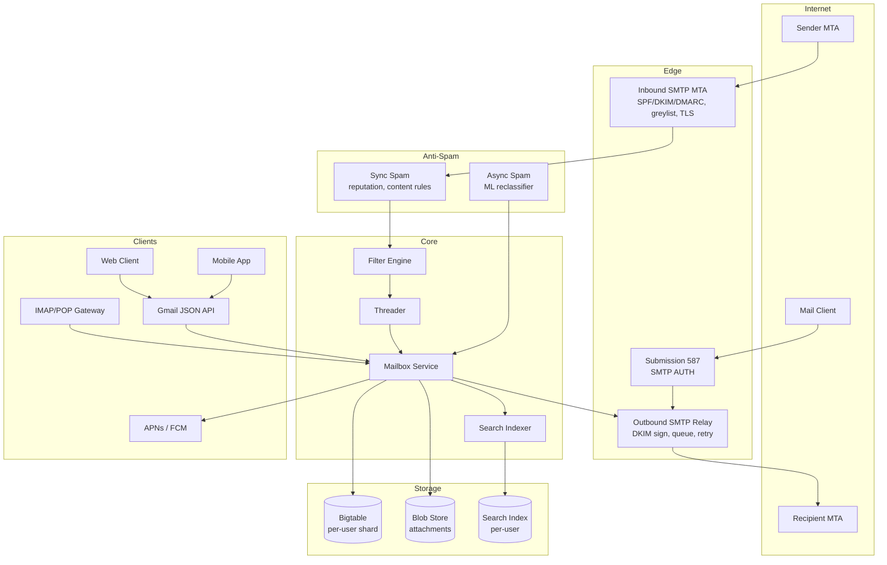
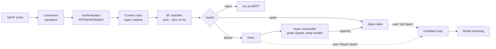

# Design Gmail — SMTP Edge, Anti-Spam, Per-User Search, and Tagged Mailboxes at Planetary Scale

**Date:** 2026-04-25 | **Updated:** 2026-04-25
**Tags:** `system-design` `case-study` `gmail` `email` `smtp` `imap`

## Table of Contents

- [Summary](#summary)
- [Functional Requirements](#functional-requirements)
- [Non-Functional Requirements](#non-functional-requirements)
- [Capacity Estimation](#capacity-estimation)
- [API Design](#api-design)
- [Data Model](#data-model)
- [High-Level Architecture](#high-level-architecture)
- [Deep Dives](#deep-dives)
  - [SMTP Edge — Inbound and Outbound MTAs](#smtp-edge--inbound-and-outbound-mtas)
  - [Anti-Spam Pipeline](#anti-spam-pipeline)
  - [Message Storage — Bigtable-Backed Mailbox](#message-storage--bigtable-backed-mailbox)
  - [Threading Algorithm](#threading-algorithm)
  - [Search at Scale — Per-User Inverted Index](#search-at-scale--per-user-inverted-index)
  - [Labels vs Folders — Gmail's Tagged Model](#labels-vs-folders--gmails-tagged-model)
  - [Filters and Server-Side Rules](#filters-and-server-side-rules)
  - [Attachment Handling](#attachment-handling)
  - [IMAP and POP Backward Compatibility](#imap-and-pop-backward-compatibility)
  - [Multi-Region Replication and Disaster Recovery](#multi-region-replication-and-disaster-recovery)
  - [Push Notifications to Mobile](#push-notifications-to-mobile)
- [Bottlenecks and Trade-offs](#bottlenecks-and-trade-offs)
- [Anti-Patterns](#anti-patterns)
- [Related](#related)
- [References](#references)

## Summary

Gmail is a planetary-scale messaging platform that hides three very different jobs behind one familiar inbox: **a public SMTP relay** that interoperates with every mail server on the internet, **a per-user durable store** that retains years of message history with millisecond search, and **a real-time client backend** that drives mobile and web clients. The hard problems are not the protocols — RFC 5321 (SMTP), RFC 5322 (IMF), and RFC 9051 (IMAP4rev2) are well specified — but the operational scale: ingesting hundreds of billions of messages per day while filtering >50% of inbound traffic as spam, indexing every word for instant search across years of mail per user, and presenting a tagged-not-foldered mailbox over a legacy folder protocol. This case study walks through the architecture that supports those constraints.

## Functional Requirements

- **Send mail** to any internet recipient (outbound SMTP relay) and to internal Gmail recipients (short-circuit delivery).
- **Receive mail** from any internet sender via inbound SMTP, with SPF/DKIM/DMARC verification.
- **Threading** — group messages into conversations using `Message-ID`, `In-Reply-To`, and `References` headers plus subject normalization.
- **Search** across the user's full mailbox (years of mail) by sender, recipient, subject, body, attachment metadata, label, and date — with sub-second latency.
- **Labels** rather than folders — multiple tags per message; system labels (Inbox, Sent, Trash, Spam, Starred, Important) plus user-defined labels.
- **Filters / server-side rules** — match-and-act rules executed on every incoming message (label, archive, forward, mark read, delete).
- **Spam detection** — sync (block at SMTP edge) and async (post-delivery reclassification) stages, with user feedback loop ("Report Spam" / "Not Spam").
- **Attachments** — handle small inline parts and large attachments (Drive integration past ~25 MB).
- **IMAP, POP3, SMTP submission** for legacy clients (Thunderbird, Outlook, Apple Mail).
- **JSON Mail API** (Gmail API) for native clients and third-party integrations.
- **Mobile + web sync** — consistent unread counts, labels, and read-state across all clients in near real-time, with push to mobile (APNs/FCM).
- **Vacation responder, signature, undo send, snooze, scheduled send.**

## Non-Functional Requirements

- **Durability** — zero message loss after SMTP `250 OK`; mail is a system of record.
- **Availability** — 99.9%+ SLA for the consumer product, 99.9% Apps SLA for paid Workspace; targets push toward 99.99% for the API plane.
- **Send latency** — internal Gmail-to-Gmail delivery in seconds; external delivery bound by remote MTA, but local enqueue acknowledged in <1s.
- **Search latency** — p50 <100 ms, p99 <500 ms across the user's full mailbox, including just-arrived mail.
- **Spam filtering** — >99% spam catch rate with <0.1% false-positive rate.
- **Storage scale** — exabyte-class total; per-user quotas of 15 GB free, up to 5 TB+ for Workspace.
- **Privacy and compliance** — at-rest encryption, in-transit TLS (STARTTLS, MTA-STS), GDPR / CCPA data export and deletion, eDiscovery for Workspace.
- **Abuse resistance** — outbound rate limiting, reputation systems, and content scanning to keep the sending IPs trusted by the rest of the internet.

## Capacity Estimation

Order-of-magnitude figures suitable for whiteboard sizing:

| Quantity | Estimate |
|---|---|
| Active users | 1.8 B |
| Mails received per user per day (post-spam) | ~20 |
| Mails sent per user per day | ~5 |
| Inbound mails/day (post-spam) | 1.8B × 20 ≈ 3.6 × 10¹⁰ |
| Inbound mails/day (pre-spam, ~50% filtered) | ~7 × 10¹⁰ |
| Outbound mails/day | 1.8B × 5 ≈ 9 × 10⁹ |
| Avg message size on disk (compressed, headers + body, dedup'd attachments) | ~50 KB |
| Daily new storage (post-spam) | 3.6 × 10¹⁰ × 50 KB ≈ 1.8 PB/day |
| Annual storage growth | ~650 PB/yr |
| Peak inbound RPS (3× avg, daily peak) | 7 × 10¹⁰ / 86400 × 3 ≈ 2.4 M msgs/sec |
| Search index size per user (unique terms × postings) | ~5–20% of mail size |

Two design implications fall out immediately. First, **storage is dominated by attachments**, so deduplicating attachments by content hash is mandatory. Second, **search index size is comparable to the mail itself**, so the index must shard per-user and reuse the same replication topology as the mailbox — no global inverted index.

## API Design

Gmail exposes three coexisting API surfaces:

### 1. SMTP (RFC 5321) — Internet-Facing

Inbound and outbound MTA protocol. Receives mail on port 25 (server-to-server) and accepts authenticated submissions on 465/587. Implementation typically forks of Postfix-like MTAs hardened with custom policy daemons.

```text
S: 220 mx.google.com ESMTP
C: EHLO sender.example.com
S: 250-mx.google.com ... STARTTLS, SIZE 157286400, 8BITMIME, ...
C: MAIL FROM:<alice@example.com>
C: RCPT TO:<bob@gmail.com>
C: DATA
C: <RFC 5322 message body with headers + MIME parts>
C: .
S: 250 2.0.0 OK queued
```

### 2. IMAP4rev2 (RFC 9051) and POP3 — Legacy Clients

Stateful folder-and-flag protocol. Gmail implements an IMAP gateway that translates `\Seen`, `\Flagged`, folder moves, and `EXPUNGE` into label and state operations on the underlying tagged mailbox.

### 3. Gmail API — JSON over HTTPS

Native modern API for the web client, mobile apps, and integrations.

```http
GET  /gmail/v1/users/me/messages?q=from:alice+has:attachment&maxResults=50
GET  /gmail/v1/users/me/messages/{id}?format=full
POST /gmail/v1/users/me/messages/send
POST /gmail/v1/users/me/messages/{id}/modify  { "addLabelIds": ["IMPORTANT"], "removeLabelIds": ["UNREAD"] }
GET  /gmail/v1/users/me/threads/{id}
POST /gmail/v1/users/me/watch  { "topicName": "projects/.../topics/gmail" }   # push to Pub/Sub
```

History tokens (`historyId`) provide an incremental change stream so clients only fetch deltas — the same primitive the IMAP gateway uses to translate `IDLE` notifications.

## Data Model

```text
Message {
  id              string          // opaque, unique within user
  thread_id       string          // see Threading
  user_id         uint64
  rfc822_blob     ref<BlobStore>  // raw RFC 5322 message (compressed, encrypted)
  headers         map<string,list<string>>   // parsed for query speed
  message_id_hdr  string          // RFC 5322 Message-ID
  in_reply_to     string
  references      []string
  size_bytes      uint32
  internal_date   timestamp
  label_ids       set<string>     // INBOX, UNREAD, STARRED, custom-123, ...
  attachments     []AttachmentRef
  spam_score      float
  history_id      uint64          // monotonic per-user
}

Thread {
  id              string
  user_id         uint64
  message_ids     []string         // ordered by date
  participants    set<string>
  subject_norm    string
  label_ids       set<string>      // union of constituent messages
  last_history_id uint64
}

Label {
  id              string           // system or user-N
  user_id         uint64
  name            string
  type            enum(SYSTEM, USER)
  visibility      enum(SHOW, HIDE, SHOW_IF_UNREAD)
}

UserMailbox {
  user_id         uint64
  storage_quota   bytes
  storage_used    bytes
  history_id      uint64           // global tip
  filters         []Filter
  vacation        VacationSettings
}

Attachment {
  content_hash    sha256           // dedup key
  blob_ref        ref<BlobStore>
  size_bytes      uint64
  mime_type       string
}

SearchIndex { /* per-user inverted index, see deep dive */ }
```

The `rfc822_blob` is the system of record. Parsed `headers`, `label_ids`, and `history_id` are derived projections optimized for the query plane.

## High-Level Architecture



The dataflow has three primary paths: **inbound** (Internet → MTA → spam → filters → threader → mailbox), **outbound** (client → submission → relay → Internet), and **read** (client → API → mailbox / search).

## Deep Dives

### SMTP Edge — Inbound and Outbound MTAs

The SMTP edge is the trust boundary between Gmail and the rest of the internet. It must accept mail from any compliant MTA, reject obvious abuse cheaply, and never lose a message it `250 OK`s.

**Inbound MTA responsibilities:**

- **Connection-level filtering.** IP reputation lookups (Gmail-internal + DNSBL-style signals), connection rate limiting, and TLS negotiation (STARTTLS preferred, MTA-STS for opportunistic-to-required policy).
- **Greylisting** is largely retired at Gmail's scale because reputation signals are stronger and add no latency, but smaller MTAs still rely on temp-failing first-time `(IP, sender, recipient)` triples.
- **SPF (RFC 7208)** — verify the sending IP is authorized for the `MAIL FROM` envelope domain via DNS `TXT` lookup.
- **DKIM (RFC 6376)** — verify the `DKIM-Signature` header signs the relevant headers and body using the public key from the signing domain's DNS.
- **DMARC (RFC 7489)** — combine SPF and DKIM results with the `From:` domain's published policy (`p=none|quarantine|reject`) to decide alignment, and emit aggregate (`rua`) and forensic (`ruf`) reports.
- **Size and rate limits** at `MAIL FROM` and `RCPT TO` — fail fast before reading `DATA`.
- **Hand-off** — once the MTA accepts `DATA` and writes the message to durable queue (replicated, fsync'd), it returns `250 OK`. Everything after that is the platform's responsibility.

**Outbound relay responsibilities:**

- **DKIM-sign** every outbound message with the appropriate per-domain key.
- **Per-IP, per-domain, per-user rate limiting** to protect Gmail's sending reputation. A single compromised account cannot blast millions of messages.
- **Smart retry** — bounded exponential backoff per recipient domain, separate queues per destination so a slow `yahoo.com` doesn't block `microsoft.com`.
- **Bounce handling** — interpret 4xx (transient, retry) vs 5xx (permanent, NDR back to sender), feed bounces into the suppression list and reputation system.

### Anti-Spam Pipeline

Gmail filters >50% of all inbound mail as spam or abuse. The pipeline is layered with a strict latency budget — the SMTP transaction must close in seconds — and uses both synchronous (block at the door) and asynchronous (reclassify after delivery) stages.



Key ideas:

- **Sync stage budget**: ~hundreds of ms total. Reject the worst traffic at SMTP with 5xx so the sender's MTA queues a bounce — important for phishing campaigns where rejection is preferable to silent quarantine.
- **Bayesian + ML**. Historically Bayesian token classification ([Sahami et al. 1998](https://www.aaai.org/Papers/Workshops/1998/WS-98-05/WS98-05-009.pdf)); modern Gmail uses deep models (TensorFlow-based per the [2019 Google announcement](https://workspaceupdates.googleblog.com/2019/02/an-update-on-gmails-tensorflow-protections.html)) trained on per-user feedback as well as global signals.
- **Sender reputation** is decisive. New domains and IPs start neutral and earn (or lose) reputation via authentication compliance, complaint rates, and engagement signals. This is why DKIM/SPF/DMARC adoption matters even for small senders.
- **Content scanning** — URL reputation (Safe Browsing), attachment AV scanning, embedded-image OCR for image-only spam, and homograph detection for spoofed display names.
- **Async reclassification** runs minutes to hours later using signals unavailable at delivery time (delivery graph patterns, sibling-message clustering across users, user actions on similar mail). It can move mail from Inbox to Spam — but rarely the reverse, since false positives that hide important mail are far more damaging than false negatives.
- **Feedback loop** — every "Report Spam" / "Not Spam" click trains both the per-user model and contributes (with privacy controls) to global features.

### Message Storage — Bigtable-Backed Mailbox

Gmail stores mailboxes on Bigtable ([Chang et al. 2006](https://research.google/pubs/bigtable-a-distributed-storage-system-for-structured-data/)), which is a sparse, distributed, sorted map indexed by `(row_key, column, timestamp)`. The schema sketched at industry talks is roughly:

```text
row_key   = user_id || message_id     // co-locate one user's mail
column families:
  raw:           rfc822 blob (or pointer to blob store for large bodies)
  headers:       parsed header columns
  labels:        one column per label, value = bool
  state:         read/unread, important, starred
  thread:        thread_id, position
  history:       per-mutation history_id
```

Why this works at Gmail's scale:

- **Per-user locality.** All of one user's mail lives in a contiguous row range, so listing the inbox or scanning by date is a range scan on a single tablet (mostly). Cross-user queries don't exist in the consumer product.
- **Append-mostly workload.** New mail is an insert; reads dominate; updates are limited to label and state changes (which are small column writes). Bigtable's LSM-tree storage handles this well.
- **Tablet sharding** is automatic. Heavy users get their own tablet; light users share. No manual resharding.
- **Compression** at the column-family level — header tokens compress extremely well across many messages from the same sender.
- **Replication.** Bigtable replication (and Spanner-backed metadata for transactional needs) gives multi-region durability.

The actual `rfc822` payload often lives in a separate blob store (Colossus / GFS-class) with a pointer in Bigtable, especially for larger messages. See [object-and-blob-storage](../../building-blocks/object-and-blob-storage.md) for the general pattern.

### Threading Algorithm

Threading turns a flat stream of messages into conversations. The algorithm is essentially [Jamie Zawinski's message-threading scheme](https://www.jwz.org/doc/threading.html) refined for the modern era:

1. **Primary signal: header chain.** Each RFC 5322 message has a unique `Message-ID`. Replies set `In-Reply-To: <parent-message-id>` and accumulate ancestors in `References: <root> <...> <parent>`. Walk the chain — if any referenced ID matches a message already in the user's mailbox, attach to that thread.
2. **Subject normalization fallback.** When headers are missing or broken (common from mobile clients and mailing lists), normalize the subject by stripping `Re:`, `Fwd:`, `[list-name]` prefixes, then group by `(normalized_subject, participant_set, time_window)`. The time window matters — two emails 18 months apart with the same subject are not the same thread.
3. **Per-user threading.** Threads are scoped to the recipient's mailbox. Alice's view of a conversation can have a different shape than Bob's view because they received different subsets of the messages.
4. **Thread ID stability.** Once assigned, a `thread_id` is sticky. New messages join the existing thread; threads do not split retroactively even if a header chain reveals two threads were misjoined.

The threading service runs synchronously in the inbound pipeline (after spam, before final mailbox commit) so the `thread_id` is set before the user ever sees the message.

### Search at Scale — Per-User Inverted Index

Search is the feature that defines Gmail's UX. The constraints:

- **Sub-100 ms p50** across the user's full mailbox.
- **Real-time** — a message that arrived 200 ms ago must be searchable now.
- **Years of mail** per heavy user.
- **No cross-user queries** (privacy + scale).

The architecture leans on three ideas:

1. **Per-user inverted index, not global.** A global index over hundreds of billions of messages is infeasible and would leak across-user signals. Instead, every user has their own small inverted index. A power user's index might be a few GB; an average user's is far smaller. Each index lives in the same Bigtable shard region as the mailbox, so the indexer can write transactionally with the mailbox commit.
2. **Real-time indexing in the write path.** When a message lands, the indexer tokenizes the body, headers, attachment text (extracted from PDFs/Docs), normalizes (lowercase, accent fold), and writes postings keyed by `(user_id, term) → posting list of (message_id, fields, positions)`. Because the index is per-user, a single new message updates only that user's structures.
3. **Operator-driven query planning.** Gmail's query language — `from:`, `to:`, `subject:`, `has:attachment`, `label:`, `before:`, `after:`, `filename:`, `larger:`, `is:unread` — maps each operator to a different index dimension. The planner intersects posting lists in increasing-cardinality order. `from:specific-person before:2020 has:attachment` is fast because every operator is selective.

For the general pattern see [search-systems](../../building-blocks/search-systems.md).

### Labels vs Folders — Gmail's Tagged Model

Gmail's distinguishing UX choice from 2004: **labels, not folders.** A message has a set of labels; "moving to Trash" is just adding the `TRASH` label and removing `INBOX`. "Archive" is removing `INBOX` while keeping the message in `[Gmail]/All Mail` (a virtual view of "everything not in Trash or Spam").

Implementation:

- **Labels are sets, not paths.** Each message row has a `labels` column family with one cell per label. Queries are predicates over those cells.
- **System labels** (`INBOX`, `SENT`, `TRASH`, `SPAM`, `DRAFT`, `STARRED`, `UNREAD`, `IMPORTANT`, `CHAT`) have special meaning to the rest of the system — e.g., `SPAM` excludes from search by default, `TRASH` triggers 30-day deletion.
- **Thread labels are the union** of the labels on the constituent messages; a thread shows up in `Inbox` if at least one of its messages has the `INBOX` label.
- **Counts** (unread per label) are maintained as derived counters updated on every label mutation, snapshot periodically to recover from drift.

### Filters and Server-Side Rules

Filters execute on every inbound message **after spam classification, before final delivery**. A filter is an `(if condition, then actions)` rule where condition is a Gmail-search expression and actions include: skip Inbox, apply label, mark read, star, forward to, delete, never spam, always mark important.

Server-side execution is non-negotiable for Gmail:

- **Mobile and IMAP clients can't run client-side rules** the way Outlook can — the user expects rules to apply uniformly across web, iOS, Android, and IMAP.
- **Performance.** Filters compile to the same operator set as search, so evaluation is a few index lookups against a single message — sub-millisecond.
- **Auditability.** A `filtered-by` annotation on the message records which filter applied which action, so users can debug "why did this end up in archive?".

### Attachment Handling

Inline attachments (small parts) live in the message blob. Large attachments take a different path:

- **Soft cap of 25 MB** for direct attachment in the message body. Above that, Gmail rewrites the message to insert a Drive link and stores the actual content in Drive.
- **Content-hash deduplication.** Attachments are keyed by `sha256(content)`. If 10,000 users receive the same 5 MB PDF newsletter, it is stored once, with 10,000 references. Massive storage win for newsletters and broadcast mail.
- **AV scanning** runs on the attachment blob; the verdict is cached by content hash so a known-bad PDF is rejected for everyone instantly.
- **Inline image rewriting.** External `` references are proxied through Google's image proxy, both for privacy (hide the recipient's IP from the sender) and to cache and scan the image.

### IMAP and POP Backward Compatibility

IMAP is a folder-and-flags protocol; Gmail is a label-and-state platform. The IMAP gateway translates between them:

- **Folders are virtual views over labels.** `INBOX` is "messages with the INBOX label". Custom folder `Work/Reports` is "messages with the `Work/Reports` label". Moving a message between folders translates to label add/remove.
- **`\Seen`, `\Flagged`, `\Answered`** map to `UNREAD` (inverse), `STARRED`, and a per-message answered bit.
- **`EXPUNGE`** removes the IMAP folder's label; the message remains in `[Gmail]/All Mail` unless trashed.
- **`UIDVALIDITY` and UIDs** must be stable. The gateway maintains a per-(user, folder) UID map and assigns monotonically increasing UIDs as messages join the folder.
- **`IDLE` push** is implemented over the same `historyId` change stream the API uses.
- **POP3** is mostly stateless and only sees the inbox — simpler, but still has to handle the "leave on server" toggle and the legacy single-pass download model.

This translation layer is one of the more thankless services: it must perfectly emulate decades of IMAP client quirks while sitting on top of a fundamentally different data model.

### Multi-Region Replication and Disaster Recovery

Mail is a system of record. Loss is unacceptable. The replication strategy:

- **Synchronous replication within a region** for the mailbox commit. The inbound pipeline does not return `250 OK` to the sending MTA until the message is durable on multiple replicas in the primary region.
- **Asynchronous cross-region replication** for disaster recovery. RPO is measured in seconds; some operations (like the metadata index used by search) may be eventually consistent across regions.
- **Multi-master writes for label changes** — eventually consistent across regions with last-writer-wins for label sets. Conflicts are rare and benign.
- **Stronger consistency for state machines** — drafts, sends, and quota counters lean on Spanner-class TrueTime semantics where serialization actually matters.
- **Recovery drills.** Region failover is exercised regularly. The user-visible degradation during failover is at most a few seconds of stalled sends and possibly delayed delivery of in-flight inbound mail.

See [disaster-recovery](../../reliability/disaster-recovery.md) for the general framework — Gmail is in the "Tier 0" RPO-near-zero, RTO-minutes category for the read path, and "no acknowledged loss" for the write path.

### Push Notifications to Mobile

Mobile clients hold an idle connection to APNs (iOS) or FCM (Android), not directly to Gmail. The mailbox service publishes a "you have new mail" notification through:

```text
Mailbox commit → Pub/Sub topic per-user → Push fanout service → APNs / FCM → device wake
```

Notifications carry just a `historyId` hint. The client wakes, calls `users.history.list` with its last known `historyId`, and pulls the deltas. This pattern keeps push payloads tiny (good for battery and bandwidth) and means the client always reconciles authoritative state from the server, not from notification content. The Gmail API also exposes the same primitive to third parties via the `users.watch` Pub/Sub integration.

## Bottlenecks and Trade-offs

| Bottleneck | Trade-off |
|---|---|
| Per-user search index size | Faster local search, but no cross-user search and significant aggregate index storage. The right call for privacy and scale. |
| Sync vs async spam | Sync stage must be fast (<100 ms) so it can't run heavy models; async stage runs heavy models but can't reject at SMTP. Two-stage is the only way to get both rejection and accuracy. |
| Bigtable schema choice | `user_id` as row-key prefix gives perfect locality for one user but no efficient way to ask cross-user questions (e.g., "everyone who got this newsletter"). Such queries require separate offline pipelines. |
| Threading sticky `thread_id` | Predictable UX, but occasional misjoined threads can never be split retroactively. |
| Labels over folders | Cleaner data model, but IMAP gateway must paper over the impedance mismatch forever. |
| Outbound rate limits | Protects sending reputation, but power users (mailing lists, transactional senders) hit limits and must move to Workspace + dedicated relays or third-party ESPs. |
| Strong durability on write path | Adds tens of ms to inbound latency before `250 OK`, which is acceptable for SMTP. Same constraint applied to a chat product would be too slow. |
| Per-region failover | Sub-minute RTO for reads, but during failover, in-flight inbound SMTP transactions may temporarily 4xx and rely on sender retry. |

## Anti-Patterns

- **Storing one mail per file in a filesystem (Maildir at scale).** Works for small mail servers; collapses at billions of users due to inode pressure, fsync amplification, and lack of compression.
- **Single global inverted index.** Privacy-hostile and intractable. Every user gets their own.
- **Folder-only model exposed in the data layer.** Gmail's labels-first model proved that the legacy folder concept was a UI choice, not a storage requirement. Don't bake folders into the schema.
- **Synchronous heavy ML in the SMTP transaction.** SMTP timeouts are short; senders will retry and double-deliver. Heavy work belongs after `250 OK`.
- **Trusting `From:`.** The `From:` header is freely forgeable. SPF/DKIM/DMARC alignment with the `From:` domain is the only reliable identity signal.
- **Acknowledging mail before durable replication.** A power outage or rack failure between `250 OK` and durable write loses mail forever. The sender will not retry.
- **Letting one slow recipient domain block the outbound queue.** Per-destination queues are essential; one stuck queue must not poison the others.
- **Deleting from `TRASH` immediately.** A 30-day grace period covers user mistakes and is now an industry-standard expectation.
- **Treating the IMAP gateway as second-class.** Many of Gmail's most loyal power users live in IMAP clients. The gateway's correctness affects retention.
- **Indexing only the body.** Modern users search for sender, attachment filename, and date as often as body terms — the index must cover all of them with operator-aware planning.

## Related

- [search-systems](../../building-blocks/search-systems.md) — per-user inverted indexes, real-time indexing, operator-aware query planning.
- [object-and-blob-storage](../../building-blocks/object-and-blob-storage.md) — content-hash dedup for attachments, blob/metadata split, immutable chunks.
- [disaster-recovery](../../reliability/disaster-recovery.md) — RPO/RTO targets, multi-region replication, failover drills.

## References

- [RFC 5322 — Internet Message Format](https://datatracker.ietf.org/doc/html/rfc5322)
- [RFC 5321 — Simple Mail Transfer Protocol](https://datatracker.ietf.org/doc/html/rfc5321)
- [RFC 9051 — Internet Message Access Protocol (IMAP) — Version 4rev2](https://datatracker.ietf.org/doc/html/rfc9051)
- [RFC 1939 — Post Office Protocol — Version 3 (POP3)](https://datatracker.ietf.org/doc/html/rfc1939)
- [RFC 7208 — Sender Policy Framework (SPF)](https://datatracker.ietf.org/doc/html/rfc7208)
- [RFC 6376 — DomainKeys Identified Mail (DKIM) Signatures](https://datatracker.ietf.org/doc/html/rfc6376)
- [RFC 7489 — Domain-based Message Authentication, Reporting, and Conformance (DMARC)](https://datatracker.ietf.org/doc/html/rfc7489)
- [RFC 8461 — SMTP MTA Strict Transport Security (MTA-STS)](https://datatracker.ietf.org/doc/html/rfc8461)
- [Bigtable: A Distributed Storage System for Structured Data — Chang et al., OSDI 2006](https://research.google/pubs/bigtable-a-distributed-storage-system-for-structured-data/)
- [Spanner: Google's Globally-Distributed Database — Corbett et al., OSDI 2012](https://research.google/pubs/spanner-googles-globally-distributed-database-2/)
- [Gmail API documentation (Google Developers)](https://developers.google.com/gmail/api)
- [Gmail API — Push Notifications](https://developers.google.com/gmail/api/guides/push)
- [Gmail IMAP extensions](https://developers.google.com/gmail/imap/imap-extensions)
- [Jamie Zawinski — Message Threading](https://www.jwz.org/doc/threading.html)
- [An update on Gmail's TensorFlow protections (Workspace Updates, 2019)](https://workspaceupdates.googleblog.com/2019/02/an-update-on-gmails-tensorflow-protections.html)
- [How Hotmail and Gmail use machine learning to fight spam — historical Bayesian work, Sahami et al., 1998](https://www.aaai.org/Papers/Workshops/1998/WS-98-05/WS98-05-009.pdf)
- [The Gmail engineering team on building search — High Scalability writeup](http://highscalability.com/youtube-architecture)
