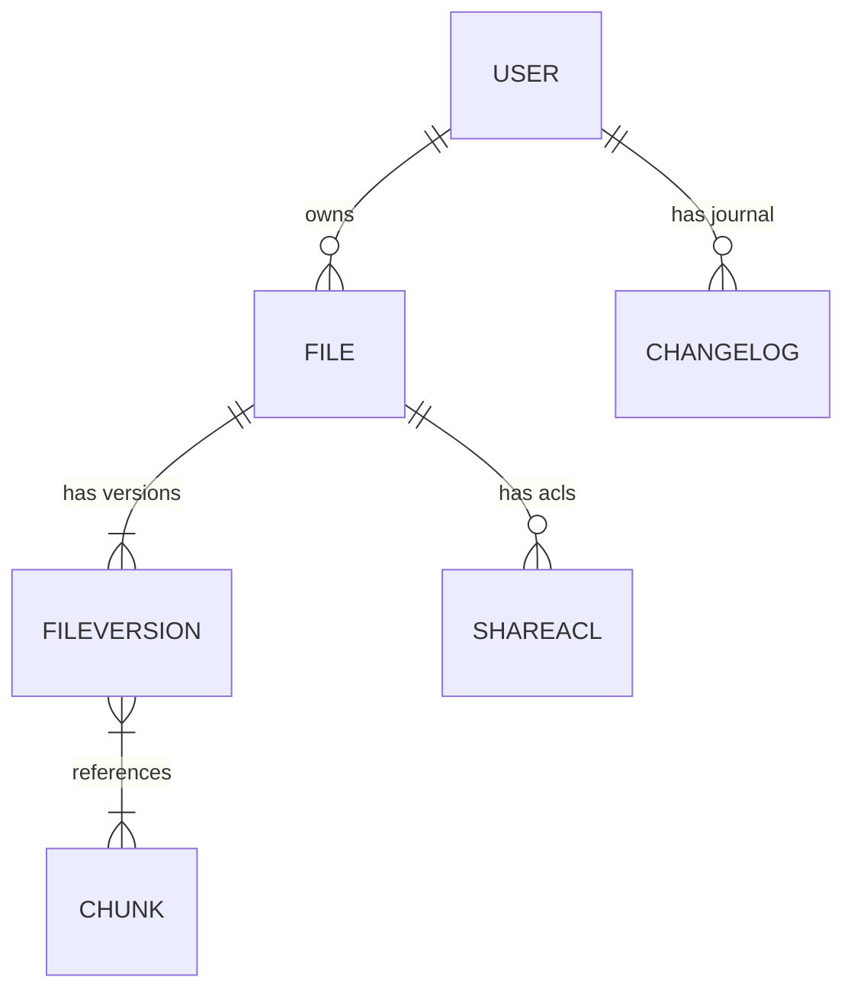
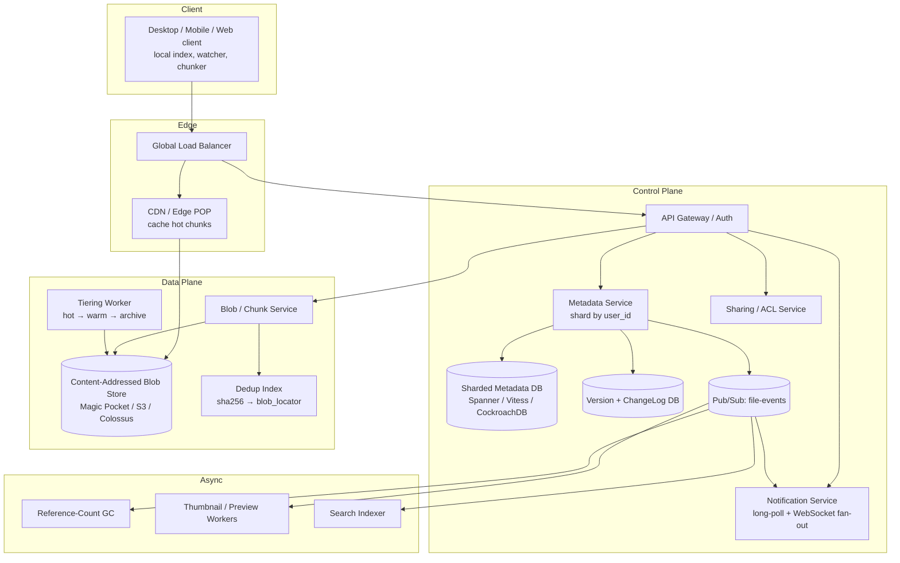

# Design Google Drive / Dropbox — Chunked, Content-Addressed File Sync at Planet Scale

**Date:** 2026-04-25 | **Updated:** 2026-04-25
**Tags:** `system-design` `case-study` `google-drive` `dropbox` `file-sync` `chunking`

## Table of Contents

- [Summary](#summary)
- [Functional Requirements](#functional-requirements)
- [Non-Functional Requirements](#non-functional-requirements)
- [Capacity Estimation](#capacity-estimation)
- [API Design](#api-design)
- [Data Model](#data-model)
- [HLD Diagram](#hld-diagram)
- [Deep Dives](#deep-dives)
  - [Chunking](#chunking)
  - [Content-Addressed Storage and Deduplication](#content-addressed-storage-and-deduplication)
  - [Delta Sync](#delta-sync)
  - [Metadata DB Design](#metadata-db-design)
  - [Sync Protocol — Cursors and Long-Poll](#sync-protocol--cursors-and-long-poll)
  - [Conflict Resolution](#conflict-resolution)
  - [Version History](#version-history)
  - [Sharing and ACL](#sharing-and-acl)
  - [Mobile Constraints](#mobile-constraints)
  - [Storage Tiering](#storage-tiering)
- [Bottlenecks and Trade-offs](#bottlenecks-and-trade-offs)
- [Anti-Patterns](#anti-patterns)
- [Related](#related)
- [References](#references)

## Summary

Google Drive and Dropbox solve the same hard problem: keep an arbitrary tree of files identical across many devices, while users edit them concurrently, lose connectivity, share them with others, and accumulate hundreds of millions of files per power user. The architectural answer that has converged across the industry has three pillars:

1. **Chunk every file** into fixed-size (~4 MB) immutable blocks.
2. **Store each chunk by the SHA-256 of its contents** in a content-addressed blob store (Dropbox's Magic Pocket, Google's Colossus + Bigtable).
3. **Keep a small, fast metadata DB** that maps `(file path, version) → ordered list of chunk hashes`, plus a per-user *change log* that clients consume via a cursor.

Once those three are in place, every other feature — version history, deduplication, delta sync, shared folders, link sharing, mobile selective sync, archival tiering — is a thin layer on top of immutable chunks plus mutable metadata. This doc walks the design from requirements through deep dives, with the trade-offs a senior backend engineer is expected to defend in an interview or on a real RFC.

## Functional Requirements

| # | Requirement | Notes |
|---|-------------|-------|
| F1 | **Upload** files of arbitrary size (KB to TB). | Resumable; client can fail mid-upload and continue. |
| F2 | **Download** files (full or partial / range). | Range fetch is required for streaming previews and for delta sync. |
| F3 | **Sync** a local folder ↔ cloud folder across N devices. | Bidirectional; eventually consistent. |
| F4 | **Real-time multi-device sync.** | Edit on laptop → phone sees the change in seconds. |
| F5 | **Offline edits.** | Client must be usable with no network; reconcile on reconnect. |
| F6 | **Share** files and folders with ACLs. | Read / comment / edit; user, group, link-sharing, expiry. |
| F7 | **Version history.** | Restore to a prior version of any file (typically 30–180 days). |
| F8 | **Move / rename / delete** that propagate across devices. | Deletes are soft (trash) for a grace period. |
| F9 | **Search** by filename and (later) by content. | Out of scope below; usually a separate Elasticsearch / Vespa pipeline. |
| F10 | **Mobile clients** with constrained bandwidth, battery, and storage. | Selective sync, deferred upload, thumbnail-first preview. |

Out of scope for this HLD: collaborative real-time editing of document *contents* (that is Google Docs / OT-CRDT territory — see [`design-google-docs.md`](../real-time/design-google-docs.md)). Drive syncs *files*; Docs edits *characters*.

## Non-Functional Requirements

| Dimension | Target | Why it matters |
|-----------|--------|----------------|
| Durability | **≥ 11 nines (99.999999999%) annual**, matching S3 and Magic Pocket. | A consumer photo lost is brand-defining. |
| Availability | 99.99% for control plane, 99.95%+ for blob fetch. | Users notice 5 minutes of "can't open file." |
| Scale | Billions of users × thousands of files each → **trillions of chunks**, **exabytes** of stored bytes. | Dropbox's Magic Pocket already operates at exabyte scale. |
| Sync latency p95 | < 5 s from edit to remote-device notification. | Push/long-poll, not periodic poll. |
| Upload throughput | Saturate user uplink for large files; parallel chunks. | TB-class video uploads must work overnight. |
| Bandwidth efficiency | **Only changed chunks** travel the wire. | A 1 GB Photoshop save where 4 MB changed must transfer ~4 MB, not 1 GB. |
| Conflict rate | "Same file edited on two devices offline" must be rare and never silently lose data. | Default to "create conflicted copy", never merge binary blobs. |
| Security | Encryption in transit (TLS 1.3) and at rest (per-chunk envelope keys). | Compliance + attack surface. |
| Cost | Storage cost dominates; tier cold data, dedup what is safe to dedup. | At exabyte scale, single-digit-percent storage savings = millions of dollars/year. |

## Capacity Estimation

Back-of-envelope numbers a candidate should be able to defend.

```
Users                       1B registered, 200M DAU
Avg files / user            10 000
Avg file size                500 KB (long-tail; lots of small docs + a few huge videos)
                             Median ~30 KB, mean dragged up by media

Total file count            1B × 10 000 = 10^13 files (10 trillion)
Total logical storage       1B × 10 000 × 500 KB ≈ 5 EB

Chunk size                   4 MB
Chunks per file (mean)       1 (most files < 4 MB) — chunk count ≈ file count for small files;
                             huge files dominate chunk count for very long tail.
Total physical chunks        ~10^13 plus large-file chunks (call it 2 × 10^13)

Dedup ratio                 1.3–2× depending on policy (see deep dive)
Net stored bytes             2.5–4 EB after dedup, before erasure-coding overhead
Erasure-coded overhead       1.4× (e.g. 10+4 Reed–Solomon)
On-disk bytes                3.5–5.5 EB

Sync notifications
  DAU                        200M
  Edits / DAU / day          50 (across all devices)
  Edits / sec (peak ~3× avg) ~350K notifications/sec → fan-out to ~3 devices each
                             ≈ 1M sync deltas/sec at peak

Bandwidth
  Avg upload / DAU / day     200 MB → 200M × 200 MB / 86400 ≈ 460 GB/s ≈ 3.7 Tbps egress-ish
  Peak burst                 5–10× average — design for ~30 Tbps ingress at peak
```

These are *order-of-magnitude* numbers and are deliberately rough. The point of the estimate is to justify the architectural choices that follow — sharded metadata, dedicated blob store, async fan-out, edge POPs.

## API Design

Two surfaces: a **control / metadata REST API** and a **sync / notification API**. Blob bytes themselves go to a **dedicated blob endpoint** with pre-signed URLs so they never traverse the metadata path.

### Control plane (REST, JSON)

```
POST   /v1/files                     # create file (returns file_id, upload_session_id)
PUT    /v1/upload/{session}/chunks   # upload a single chunk (sha256 in header)
POST   /v1/upload/{session}/commit   # commit ordered chunk list → new version
GET    /v1/files/{id}                # metadata
GET    /v1/files/{id}/content        # 302 redirect to pre-signed blob URL
GET    /v1/files/{id}/versions       # version list
POST   /v1/files/{id}/restore        # restore to version N

POST   /v1/files/{id}/move
DELETE /v1/files/{id}                # soft-delete (trash)

POST   /v1/shares                    # create share entry (file or folder, ACL)
GET    /v1/shares?cursor=...
DELETE /v1/shares/{id}

POST   /v1/links                     # public sharing link with permissions/expiry
```

Bytes never go through the API tier. A successful `POST /v1/files` returns a session id and the client `PUT`s chunks **directly to the blob service** (or to a pre-signed S3-style URL) using **multipart-upload semantics**: 5 MB minimum per part, parts uploaded in parallel, retry only failed parts, then a single commit.

### Sync plane

```
GET  /v1/sync/cursor                 # bootstrap: snapshot of user's tree, returns cursor
GET  /v1/sync/delta?cursor=...       # paginated changes since cursor
POST /v1/sync/longpoll  body={cursor, timeout}
                                     # blocks up to ~30s, returns 200 when there is a change
WS   /v1/sync/stream                 # WebSocket alternative: server pushes delta events
```

The delta call returns one of three entry kinds per path:

```json
{ "path": "/photos/2026/img_001.jpg",
  "kind": "upsert",
  "metadata": {
    "id": "f_abc",
    "version": 17,
    "size": 4_812_544,
    "mtime": "2026-04-25T10:14:02Z",
    "chunks": ["sha256:...", "sha256:...", "sha256:..."]
  }}

{ "path": "/photos/old/", "kind": "delete" }      // path and everything beneath it gone
{ "path": "/notes.md",  "kind": "rename", "from": "/n.md" }
```

This is exactly the contract Dropbox's `/delta` and `list_folder/continue` APIs expose. The cursor is opaque, monotonic, and **per user**; the server side is a journal of metadata mutations indexed by `(user_id, sequence)`.

## Data Model

Five core entities. Three in a sharded relational/NewSQL store, one in a blob store, one in a journal/log.

```
User           (id, email, plan, root_folder_id, ...)
File           (id, owner_id, parent_id, name,
                current_version_id, mime, size, mtime, deleted_at,
                ...indexed by (owner_id, parent_id, name) UNIQUE...)
FileVersion    (id, file_id, version_no, size, mtime,
                chunk_list TEXT[],   -- ordered SHA-256 chunk hashes
                created_by, created_at)
Chunk          (sha256 PK, size, refcount, blob_locator, created_at)
                -- "blob_locator" = (zone, bucket, offset) into Magic-Pocket-style store
ShareACL       (id, resource_id, resource_kind, principal, role, expires_at)
ChangeLog      (user_id, seq BIGINT, kind, path, payload_json)
                -- per-user monotonic journal driving the delta API
```

Two key invariants:

- **Files are mutable; chunks and versions are immutable.** Every save creates a new `FileVersion` with a new ordered list of chunk hashes. Old versions stay until garbage collected by retention policy.
- **A chunk's identity *is* its content.** `sha256(bytes) = primary key`. The same 4 MB block uploaded twice from anywhere is stored once (subject to the dedup policy below).



## HLD Diagram



The flow on a save:

1. Client diffs the local file against its last-known version, identifies changed chunks, computes their SHA-256.
2. Client `POST`s the new chunk list to the metadata service. Service responds with **which hashes it does not already have** ("missing chunks").
3. Client uploads only those missing chunks directly to the blob service (parallel multipart).
4. Client commits the new version. Metadata service writes a new `FileVersion` and appends entries to the user's `ChangeLog`.
5. Notification service consumes the change-log topic and fans out to the user's other devices via long-poll/WebSocket.

A read is the inverse: fetch metadata → resolve chunk list → fetch chunks (CDN-cached for hot ones, direct from blob store for cold) → reassemble locally.

## Deep Dives

### Chunking

A 1 GB file uploaded as one HTTP request is a non-starter: any network blip wastes the whole transfer, and a 4 KB diff requires re-sending 1 GB. So every file is split into **fixed-size chunks**.

| Choice | Trade-off |
|--------|-----------|
| 4 MB fixed | Simple, parallelizable, matches S3 multipart minimum (5 MB) and Magic Pocket's block size. Loses dedup if bytes shift inside a file (insertions cascade across chunks). |
| Variable / content-defined chunking (Rabin fingerprints) | Robust to insertions — better dedup for code, archives, VM images. More CPU on the client. Used by `restic`, Hugging Face XET, and some backup systems. |

For consumer file sync (Drive, Dropbox), **fixed 4 MB** is the canonical choice. The dedup loss from byte-shift edits is small in practice (most edits are append/overwrite of the same offsets), and the engineering simplicity is enormous.

The chunk size sits at a sweet spot:
- **Big enough** that metadata overhead is negligible: a 4 GB movie is only 1 000 chunk hashes (32 KB of metadata).
- **Small enough** that a single chunk fits comfortably in RAM, completes within a TCP retransmit window, and a failed upload retries cheaply.
- **Aligned with multipart upload** of the underlying object store (S3 minimum part = 5 MB, but Dropbox's own Magic Pocket uses 4 MB blocks).

The client computes `sha256(chunk_bytes)` while reading. Only the hash list goes to the metadata service first; the bytes themselves are uploaded only if the server reports the hash missing. This is the core bandwidth-saving primitive.

### Content-Addressed Storage and Deduplication

In a content-addressed store, the **key is a hash of the value**. Once `sha256:a3f5...` is written, it never changes and its content is fixed. Two consequences:

1. **Free integrity check.** Any bit-flip on disk or in transit is detected by re-hashing.
2. **Free deduplication.** If two users upload the same 4 MB block, the hash matches; we store it once, increment a refcount.

#### Dedup scope — privacy vs cost

| Scope | Storage savings | Risk |
|-------|-----------------|------|
| **Within a single file** | Modest; helps zero-padded files, archives. | None. |
| **Per user** (across that user's files) | 1.2–1.5× typical. | None — user only deduplicates against themselves. |
| **Cross-user / global** | 2–4× possible, especially for popular files (movies, OS images, software installers). | **Privacy attack: confirmation-of-file**. An attacker who has a copy of a sensitive file (e.g. a leaked document) can probe whether *any* user has uploaded it by attempting upload and observing the "you already have this chunk" response. Dropbox publicly faced criticism for this in the 2010s. |

The defensive industry standard today is **per-user deduplication** for consumer products, with cross-user dedup only inside a tightly controlled trust boundary (e.g. enterprise tenant). The dedup index is keyed `(user_id, sha256)` instead of just `sha256`, and the blob itself may even be stored with a per-user envelope key so identical plaintext yields different ciphertext.

A second safeguard regardless of scope: **never reveal "missing or present" information until after the client has proven possession of the chunk** (proof-of-possession via challenge–response). This blocks the confirmation attack even when global dedup is enabled.

#### Reference counting and GC

Because chunks are shared, deletion is tricky. We do not delete a chunk when a file referencing it is deleted; we decrement its refcount and let an asynchronous garbage collector sweep when refcount = 0 *and* all retention windows (version history, trash) have expired. Refcount maintenance must be transactional with the metadata write — otherwise a crash between "decrement" and "delete" loses data.

### Delta Sync

Chunking gives delta sync almost for free: a save uploads only the chunks whose hash changed. But that only handles *replacement* edits cleanly — a 1 GB file where the user prepended one byte would shift every subsequent chunk and re-upload everything.

For the cases where it matters (large append-only logs, Photoshop saves that rewrite the whole file), the **rsync algorithm** of Tridgell and Mackerras (1996) provides a smarter primitive:

1. Server sends the client a list of **rolling-hash** (Adler-32-derived) plus **strong hash** (MD5/SHA) for every block of its current version.
2. Client scans its new file with the same rolling window, comparing rolling hashes byte-by-byte (cheap because of the rolling property: window slide is O(1)).
3. On a rolling-hash match, client confirms with the strong hash. Matches are sent as "use block N from the existing version"; non-matches are sent as literal bytes.

The result: client transmits exactly the *novel* bytes plus tiny block references, no matter how the new bytes are positioned in the file. In practice, Drive and Dropbox use a hybrid: fixed chunks for the common case, rsync-style deltas opt-in for very large files in their pro/business tiers. The rolling-hash insight is also why **content-defined chunking** beats fixed chunking for VM images and tarballs.

### Metadata DB Design

The metadata service is the hottest path: every API call hits it, every sync delta is generated from it.

- **Shard by `user_id`.** A user's files, versions, share entries, and change log live in the same shard so reads and the journal append are local. Cross-user shares require an additional lookup (see Sharing).
- **Tech.** NewSQL (Spanner, CockroachDB) for strong consistency on a single user's writes, with horizontal scale. Vitess-on-MySQL is the Dropbox-y choice. DynamoDB/Bigtable can work for the path → file-id index but pushes complexity into the application for transactional version commits.
- **Schemas to think about**
  - `files (owner_id, file_id) → row`, with a secondary index on `(owner_id, parent_id, name)` to resolve paths.
  - `file_versions (file_id, version_no) → chunk_list`. Append-only.
  - `change_log (user_id, seq) → entry`. Strictly increasing per user; this is the source of truth for the cursor-based sync API.

Path resolution (`/photos/2026/img.jpg → file_id`) walks parent links. To avoid N round-trips, clients keep a **local materialized tree** and only ask the server for deltas; server-side path lookups are short for occasional API users.

### Sync Protocol — Cursors and Long-Poll

The sync API is where the user-visible "real-time-ness" lives.

```
client                                      server
  | --- GET /sync/delta?cursor=null  --->  |   bootstrap
  | <-- {entries:[…], cursor:"c1"}    ---  |
  |                                        |
  | --- POST /sync/longpoll {cursor:c1} -> |  blocks up to 30s
  |                                        |   waits on user's pub/sub topic
  |                                        |
  | <-- {changes:true}  -------------------|
  | --- GET /sync/delta?cursor=c1   ---->  |
  | <-- {entries:[…], cursor:"c2"}  -----  |
```

Key properties:

- The cursor is **opaque** to the client and **monotonic per user**. Internally, it encodes `(user_id, seq, shard_epoch)`.
- `delta` is **idempotent** — replaying with the same cursor yields the same entries, so a crashing client that retries cannot corrupt state.
- `longpoll` is a *signal* call (returns "yes there are changes") and never returns the changes themselves — that keeps the long-poll endpoint cheap (no DB load per held connection beyond a topic subscription) and lets the *real* `delta` call be served by an aggressively cached path.
- WebSockets are an alternative for app-level clients that already need a persistent connection; Drive's web app uses them, while the desktop daemon historically used HTTP long-poll because it traverses corporate proxies more cleanly.

Server-side fan-out: when a user's metadata changes, the metadata service writes the change log row **and** publishes to the user's pub/sub topic (`user:{id}:changes`). The notification service, which holds the long-poll connections and WebSockets, subscribes per active user and wakes the relevant connections.

### Conflict Resolution

Two devices edit the same file offline. Both sync. What happens?

**Drive and Dropbox both default to: never merge binary content; always keep both.**

Concretely:

1. Each client tracks the `version_id` it based its local edit on.
2. On commit, the client sends `(file_id, base_version, new_chunk_list)`.
3. Server compares `base_version` to `current_version`. If they match → fast-forward, write new version, done.
4. If they do not match → **conflicted copy**: server writes the new version as a sibling file, e.g. `report (Alice's conflicted copy 2026-04-25).docx`. The original keeps the other device's update.

This trades a small UX cost (the user sees two files and must reconcile) for an enormous correctness guarantee: no binary blob is ever merged by guessing. For text-like content, layered apps (Docs) implement OT/CRDT *on top* of the sync layer — that is a different problem with character-level granularity.

Three subtle points:

- **Renames + edits race.** Rename A→B on device 1, edit A on device 2. Server should treat the edit as targeting the file's `id` (stable), not its path, so the edit lands on B.
- **Folder deletes.** If device 1 deletes `/foo/` while device 2 adds `/foo/x.jpg`, the typical resolution is to revive `/foo/` and keep `x.jpg`. Don't silently drop the user's add.
- **Clock skew is irrelevant.** Conflict detection uses `base_version_id`, not wall-clock timestamps. Vector clocks are unnecessary for the per-file-per-user case.

### Version History

Because chunks are immutable and content-addressed, version history is *almost free*:

- Every save creates a new `FileVersion` row with a new chunk list. Old chunks remain referenced by old versions.
- A "restore to version N" operation copies that version's chunk list into a new current version. No bytes move.
- Storage cost of version history = sum over chunks of `(unique chunks added by each version)`, which for typical office documents is small (each save shares most chunks with the previous one).

Retention is policy: 30 days for free tier, 180 days for pro, indefinite for some enterprise plans. Garbage collection runs on the chunk refcount: when a version is purged, it decrements refcounts on its chunks; a background worker deletes chunks whose refcount has been zero for some safety window.

### Sharing and ACL

Three sharing models live in the same ACL table:

| Kind | Model |
|------|-------|
| Direct user/group share | `share(resource_id, principal=user_or_group, role)` |
| Shared folder / Team Drive | Resource is the folder; ACL inherited by descendants. Quota typically charged to the folder's owner, not the consumer. |
| Public link | A `link_id` with an opaque secret; ACL row has `principal=link:{id}`, plus optional expiry, password, view-only. |

Authorization on every read/write request:

```
permission = highest_role_among(
    direct_acl(user, resource),
    inherited_acl(user, ancestor_folders_of(resource)),
    link_acl(link_secret, resource)        // if request carries a link secret
)
```

Subtleties that bite real systems:

- **Inherited ACL is expensive** if you walk ancestors on every read. Fix with **denormalized effective-ACL caches** keyed by `(user_id, resource_id)`, invalidated by an event on the share-change topic.
- **"Sharing with everyone in domain"** at large companies fans out to millions of effective grants. Resolve at evaluation time, not at write time.
- **Removing access** must invalidate any pre-signed URLs that user already obtained — those are time-limited tokens, but the cap should be short (minutes) and high-value resources should require a server-side check, not a pure pre-signed URL.

### Mobile Constraints

Mobile is not "desktop with a smaller screen." It changes the architecture:

- **Selective sync.** A phone never holds the user's full Drive on disk. The client downloads only what is opened, and shows ghost entries for everything else. The protocol therefore must support **metadata-only sync** (the change log without bytes) plus **on-demand chunk fetch**.
- **Thumbnail-first.** Image and video metadata payloads include a small (e.g. 200 KB) thumbnail blob URL fetched eagerly; the original is fetched only on tap. This is why thumbnail generation is a critical async worker on the server side.
- **Deferred upload.** Photo backup queues uploads until Wi-Fi + charging. Client must persist queue across restarts and resume multipart uploads from any partial state.
- **Aggressive backoff and chunked retries.** Cellular networks drop frequently; the client uses small (1–4 MB) parts and exponential backoff per part, never per file.
- **Battery.** Long-poll favored over keep-alive WebSockets because cellular radio wakeups are expensive. Or push notifications via APNs/FCM trigger a one-shot delta fetch rather than holding any connection at all.

### Storage Tiering

Access patterns for file sync are wildly skewed: a user's last week of edits is hot, last month is warm, last year is cold, and most data older than that is read effectively never.

A typical three-tier scheme:

| Tier | Media | Latency | Cost | Use |
|------|-------|---------|------|-----|
| Hot | NVMe / SSD blob store, replicated 3× across zones | < 50 ms | High | Last 30 days of writes, currently-shared content |
| Warm | HDD blob store, EC 10+4 across zones | < 200 ms | Medium | 30 d – 1 y |
| Archive | SMR HDDs or tape (Glacier / GCS Archive / Magic Pocket cold tier) | seconds to hours | Very low | Cold versions, deleted-but-retained data |

Movement is async and driven by an access-time signal on each chunk. Dropbox publicly described moving to **SMR drives** in Magic Pocket for cold storage, and an internal cold tier with delayed-restore semantics — a chunk in cold storage might take seconds to "thaw" before a download. Erasure coding (Reed–Solomon, e.g. 10+4) replaces 3× replication in the warm and cold tiers, dropping storage overhead from 3× to ~1.4× while retaining the same durability target.

Reads for deeply-cold versions are explicitly slower in the UI ("Restoring older version, this may take a moment"), which is an acceptable trade for the cost reduction.

## Bottlenecks and Trade-offs

| Decision | Win | Cost / risk |
|----------|-----|-------------|
| **4 MB fixed chunks** | Simple, parallel, dedup-friendly. | Byte-shift insertions hurt dedup; need rsync-style or CDC for some workloads. |
| **Per-user dedup, not global** | Closes the confirmation-of-file privacy attack. | Foregoes ~2× of potential cross-user storage savings. |
| **Cursor-based delta API + long-poll** | Idempotent, replayable, traverses proxies. | Must keep a per-user monotonic journal and prune it carefully. |
| **Conflicted-copy on conflict** | Never silently loses data. | Sometimes confusing UX (two files appear). |
| **Sharded metadata by user_id** | Linear scale on the most common access pattern. | Cross-user shares need extra lookups; team drives strain a single shard. |
| **Pre-signed URLs for blob bytes** | Offloads bandwidth from API tier to CDN/S3. | Token lifetime is a security trade — too long = stale ACL, too short = client retry storms. |
| **Blob store as content-addressed CAS** | Free integrity, free dedup, append-only simplicity. | Garbage collection is now a hard distributed problem; refcount maintenance must be transactional. |
| **Erasure coding 10+4 instead of 3× replication** | ~50% storage cost reduction. | Reconstruct on read is more CPU; small reads amplify. Acceptable in the warm/cold tiers, not the hot path. |
| **Long-poll over WebSocket on mobile** | Battery and proxy friendly. | Slightly higher tail latency for sync notifications. |

## Anti-Patterns

- **Storing whole files in the metadata DB or in BLOB columns.** Conflates the two scaling problems (metadata QPS vs storage bytes) that the architecture explicitly separates.
- **Re-uploading whole files on each save.** Misses the entire point of chunking + content-addressed storage.
- **Identifying chunks by random UUID instead of content hash.** Forfeits dedup, free integrity, and idempotent client retries.
- **Polling for changes on a timer.** Burns battery on mobile, hammers the API tier, and produces seconds-to-minutes of avoidable sync lag. Long-poll or push.
- **Doing path-based authorization at write time only.** ACL changes won't propagate. Authorize on every read/write against the live ACL.
- **Letting a single user's change-log grow unbounded.** Heavy users edit billions of entries over years. Compact old log entries past the cursor horizon, and snapshot-then-truncate.
- **Cross-user dedup without proof-of-possession.** Enables the confirmation-of-file attack.
- **Treating a "rename" as "delete + create".** Loses version history and forces clients to re-upload the whole file. Renames must mutate the `path` column on the same `file_id`.
- **Locking files for "exclusive editing"** instead of conflicted-copy. Dropbox tried this for Office files; it is fragile and confusing. Optimistic concurrency + conflicted-copy beats locks for binary files.
- **Strong global consistency on the metadata DB.** Unnecessary across users; expensive across regions. Strong consistency *within a user shard*, eventual across the planet, is the right contract.
- **Skipping thumbnail generation on the server.** Forces every mobile client to fetch full images for previews — kills bandwidth and battery.

## Related

- [`../../building-blocks/object-and-blob-storage.md`](../../building-blocks/object-and-blob-storage.md) — the underlying CAS / blob primitive this design rests on.
- [`../../building-blocks/distributed-file-systems-and-erasure-coding.md`](../../building-blocks/distributed-file-systems-and-erasure-coding.md) — how the blob tier achieves 11-nines durability at < 1.5× overhead.
- [`../real-time/design-google-docs.md`](../real-time/design-google-docs.md) — the *different* problem of collaboratively editing the bytes inside a file (OT/CRDT), layered on top of a sync system like this one.
- [`../../building-blocks/caching-layers.md`](../../building-blocks/caching-layers.md) — chunk-level CDN caching for hot reads.
- [`../../building-blocks/message-queues-and-brokers.md`](../../building-blocks/message-queues-and-brokers.md) — the pub/sub fabric behind notification fan-out.

## References

- Dropbox Engineering, [*Inside the Magic Pocket*](https://dropbox.tech/infrastructure/inside-the-magic-pocket) — the original architectural overview of Dropbox's exabyte blob store.
- Dropbox Engineering, [*Scaling to exabytes and beyond*](https://dropbox.tech/infrastructure/magic-pocket-infrastructure) — multi-zone replication, durability targets, hardware choices.
- Dropbox Engineering, [*Improving storage efficiency in Magic Pocket*](https://dropbox.tech/infrastructure/improving-storage-efficiency-in-magic-pocket-our-immutable-blob-store) — erasure coding, cold tiering, SMR adoption.
- Dropbox Engineering, [*Low-latency notification of Dropbox file changes*](https://dropbox.tech/developers/low-latency-notification-of-dropbox-file-changes) — the long-poll + cursor delta design that this doc's sync API mirrors.
- Dropbox Engineering, [*Efficiently enumerating Dropbox with /delta*](https://dropbox.tech/developers/efficiently-enumerating-dropbox-with-delta) — semantics of the delta cursor, idempotency, and entry kinds.
- Andrew Tridgell & Paul Mackerras, [*The rsync algorithm* (TR-CS-96-05, 1996)](https://www.samba.org/rsync/tech_report/) — the rolling-hash + strong-hash delta primitive cited in the Delta Sync section.
- Google Cloud Blog, [*A peek behind Colossus, Google's file system*](https://cloud.google.com/blog/products/storage-data-transfer/a-peek-behind-colossus-googles-file-system) — the storage substrate behind Drive, with Bigtable-backed metadata.
- AWS Documentation, [*Uploading and copying objects using multipart upload in Amazon S3*](https://docs.aws.amazon.com/AmazonS3/latest/userguide/mpuoverview.html) — the canonical chunked-upload protocol, including part size limits and retry semantics.
- InfoQ, [*Magic Pocket: Dropbox's Exabyte-Scale Blob Storage System (QCon SF 2022)*](https://www.infoq.com/presentations/magic-pocket-dropbox/) — talk-form deep dive, useful for the operational and durability detail.
- Design Gurus, [*How would you implement content-addressable storage at scale?*](https://www.designgurus.io/answers/detail/how-would-you-implement-contentaddressable-storage-at-scale) — concise framing of CAS trade-offs (chunk size, dedup scope, refcount GC).
