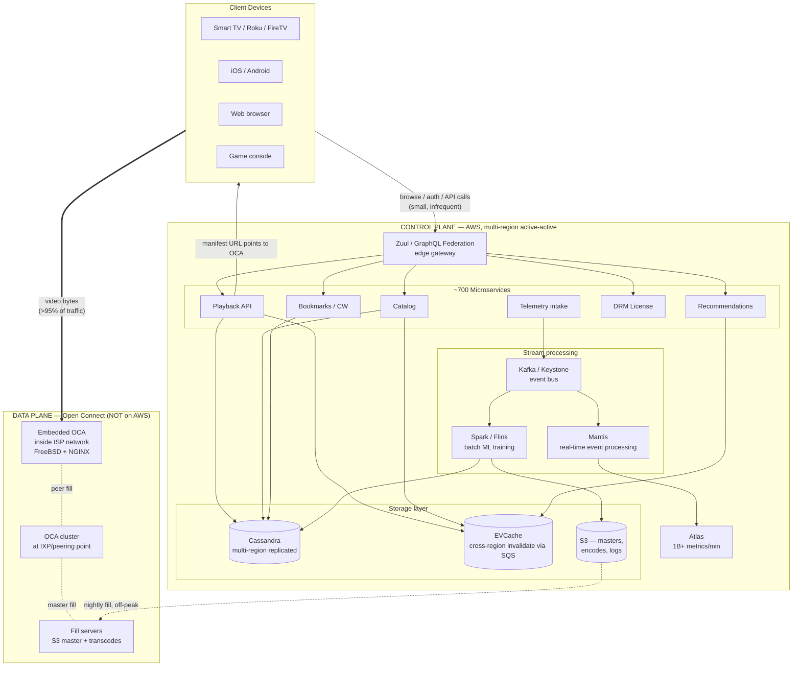

# Design Netflix — Global Video Streaming with Open Connect, Microservices, and Active-Active Resilience

**Date:** 2026-04-25 | **Updated:** 2026-04-25
**Tags:** `system-design` `case-study` `netflix` `video-streaming` `open-connect`

## Table of Contents

- [Summary](#summary)
- [Functional Requirements](#functional-requirements)
- [Non-Functional Requirements](#non-functional-requirements)
- [Capacity Estimation](#capacity-estimation)
- [API Design](#api-design)
- [Data Model](#data-model)
- [High-Level Design](#high-level-design)
- [Deep Dives](#deep-dives)
  - [Open Connect — Netflix's Purpose-Built CDN](#open-connect--netflixs-purpose-built-cdn)
  - [Content Preparation Pipeline (Encoding Ladder, Per-Title, AV1)](#content-preparation-pipeline-encoding-ladder-per-title-av1)
  - [Viewing-Session Tracking and ABR](#viewing-session-tracking-and-abr)
  - [Recommendation System and Personalized Artwork](#recommendation-system-and-personalized-artwork)
  - [Microservices Architecture on AWS](#microservices-architecture-on-aws)
  - [Chaos Engineering — Where It Was Born](#chaos-engineering--where-it-was-born)
  - [Multi-Region Active-Active for the Control Plane](#multi-region-active-active-for-the-control-plane)
  - [DRM (Widevine, FairPlay, PlayReady)](#drm-widevine-fairplay-playready)
  - [Regional Licensing Constraints](#regional-licensing-constraints)
- [Bottlenecks and Trade-offs](#bottlenecks-and-trade-offs)
- [Anti-Patterns](#anti-patterns)
- [Related](#related)
- [References](#references)

## Summary

Netflix is two systems stitched together. The **control plane** — search, browse, recommendations, billing, profiles, playback authorization — runs as ~700 microservices across multiple AWS regions in active-active. The **data plane** — the bytes of video — does *not* run on AWS. It runs on **Open Connect Appliances (OCAs)**: bare-metal FreeBSD/NGINX boxes that Netflix ships free of charge to ISPs, embedded inside the ISP's own network. >95% of Netflix video bytes are delivered from an OCA inside the viewer's ISP, often one network hop away.

This split is the single most important architectural decision Netflix ever made. It decouples the cost and reliability of *streaming* (which scales with bandwidth and is solved by physical locality) from the cost and reliability of *control* (which scales with subscriber metadata and is solved by horizontal sharding on AWS). When an AWS region fails, OCAs keep streaming. When an OCA fails, neighbors take over. The two failure domains barely overlap.

The other defining ideas: **per-title encoding** (every title gets a custom bitrate ladder, not a fixed one), **personalized artwork** (the thumbnail you see for *House of Cards* is chosen by an ML model based on your history), **chaos engineering** (born here — Chaos Monkey kills production instances on purpose), and **EVCache + Cassandra** as the multi-region storage backbone with cross-region invalidation over SQS.

## Functional Requirements

| # | Requirement | Notes |
|---|---|---|
| F1 | Browse catalog | Personalized rows; varies by country (licensing) |
| F2 | Search titles | Title, actor, genre, fuzzy matching; multilingual |
| F3 | Watch a title | Adaptive bitrate streaming (ABR) over HTTP; instant start |
| F4 | Recommendations | Trending, "Because you watched X", "Top 10 in your country", "Continue Watching" |
| F5 | Multiple profiles per account | Up to 5 profiles; each with own viewing history and recommendations |
| F6 | Downloads for offline viewing | Encrypted local storage on mobile; expires per licensing rules |
| F7 | Parental controls | PIN-locked profiles; age-restricted content filtering |
| F8 | Multi-device sync | Resume from where you left off across devices; "Continue Watching" |
| F9 | Subtitles and dubbing | Multiple languages per title; user selects defaults |
| F10 | Quality settings | Auto / data-saver / HD / 4K based on plan and bandwidth |

**Out of scope for this doc:** payments and billing, content acquisition workflows, the studio production tools, ads-supported tier specifics.

## Non-Functional Requirements

| Concern | Target |
|---|---|
| **Availability (control plane)** | 99.99% per region; multi-region active-active for survival of full regional loss |
| **Availability (streaming)** | OCA-served traffic survives AWS regional outages entirely |
| **Time to first frame** | < 2 seconds on broadband globally |
| **Rebuffer ratio** | < 0.5% of playtime; AV1 reduces this by ~45% vs AVC/HEVC |
| **Bandwidth** | Hundreds of Tbps globally at peak; ~15% of global internet downstream traffic |
| **Storage (catalog masters + encodes)** | Multi-petabyte per region; tens of PB cached on OCAs globally |
| **Regional licensing** | Catalog must vary per country; geo-IP enforced at API edge |
| **DRM** | Studio-mandated; Widevine L1 / FairPlay HW / PlayReady SL3000 required for HD/4K |
| **Latency (browse/search)** | p99 < 200ms; p50 < 50ms |
| **Personalization freshness** | Recommendations updated within hours of new viewing events |

## Capacity Estimation

Working at ~280M subscribers (2025) and growing.

```text
Subscribers:                  280,000,000
Avg watch time per sub/day:   2 hours
Total watch hours/day:        560,000,000
Peak concurrent streams:      ~100M (US/EU prime time overlap)

Average bitrate (mix of SD/HD/4K, post-AV1):  ~3 Mbps
Peak egress:                                  100M × 3 Mbps = 300 Tbps

Catalog size:                 ~17,000 titles × ~50 encodes (codec × resolution × DRM)
                              ≈ 1M+ encoded files
Master + encodes storage:     multi-PB per region in AWS S3
OCA fleet storage:            ~280 PB across 60+ IXP sites + thousands of embedded OCAs

Viewing telemetry events:     hundreds of billions/day
                              (heartbeats, ABR switches, pause/resume, errors)
Metadata writes/sec (peak):   millions (viewing position updates, recommendation cache)
```

The key number: **300 Tbps of peak egress**. No public cloud egress pricing makes that economical. That single number is why Open Connect exists.

## API Design

Netflix's edge sits behind **Zuul** (now its successor) and is fronted increasingly by **GraphQL Federation** — each microservice owns a GraphQL subgraph and the federated gateway composes them. Older REST endpoints still exist for clients that haven't migrated.

```http
# Browse a personalized homepage (GraphQL Federation)
POST /graphql
{
  "query": "query Home($profileId: ID!, $country: String!) {
    home(profileId: $profileId, country: $country) {
      rows { title type titles { id artwork(profileId: $profileId) { url } } }
    }
  }"
}

# Authorize and start playback — returns manifest URL + DRM license URL + OCA hint
POST /v1/playback/start
{
  "profileId": "p_123",
  "titleId": "t_456",
  "deviceCapabilities": {
    "codecs": ["av1", "hevc", "h264"],
    "drm": ["widevine_l1", "playready_sl3000"],
    "maxResolution": "3840x2160",
    "hdr": ["dolby_vision", "hdr10"]
  }
}
→ {
  "manifestUrl": "https://oca-12.ix.netflix.net/.../manifest.dash",
  "licenseUrl": "https://api.netflix.com/v1/drm/widevine/license",
  "sessionId": "s_abc",
  "heartbeatIntervalMs": 30000
}

# Viewing telemetry — fire-and-forget, batched on client
POST /v1/telemetry/playback
{
  "sessionId": "s_abc",
  "events": [
    { "ts": 1700000000, "type": "heartbeat", "positionMs": 120000, "bitrate": 6000 },
    { "ts": 1700000030, "type": "abr_switch", "from": 6000, "to": 12000, "reason": "bw_up" },
    { "ts": 1700000045, "type": "rebuffer", "durationMs": 800 }
  ]
}

# Continue Watching across devices
GET /v1/profiles/{profileId}/continue-watching
→ [{ "titleId": "t_456", "positionMs": 1234567, "deviceLastUsed": "tv_lg_123" }]
```

**Why GraphQL Federation:** the homepage needs data from ~20 services (catalog, ratings, artwork, personalization, licensing, downloads). Federation lets the gateway issue one request to the client and parallelize internally without each service having to know about the others.

## Data Model

```sql
-- Title metadata (Cassandra, partitioned by titleId, replicated to all regions)
title (
  title_id              uuid PRIMARY KEY,
  type                  text,      -- movie | series | season | episode
  title_translations    map<text, text>,   -- "en" -> "Stranger Things"
  synopsis_translations map<text, text>,
  duration_ms           bigint,
  release_year          int,
  cast                  list<uuid>,
  genres                list<text>,
  available_regions     set<text>,         -- ISO country codes per current license window
  license_windows       map<text, frozen<window>>, -- per-country start/end
  created_at            timestamp
);

-- Encoding artifacts (Cassandra; one row per renditioned file)
encoding (
  title_id    uuid,
  codec       text,         -- av1 | hevc | avc
  resolution  text,         -- 3840x2160 | 1920x1080 | ...
  bitrate_kbps int,
  drm_system  text,         -- widevine | fairplay | playready
  hdr_format  text,
  manifest_url text,
  segment_base text,
  PRIMARY KEY (title_id, codec, resolution, bitrate_kbps, drm_system)
);

-- Profile (per-account, up to 5)
profile (
  profile_id      uuid PRIMARY KEY,
  account_id      uuid,
  display_name    text,
  avatar_url      text,
  maturity_level  text,
  language_pref   text,
  is_kids         boolean,
  pin_hash        text             -- nullable; for parental lock
);

-- Viewing session (Cassandra; partitioned by profile_id, clustered by started_at DESC)
viewing_session (
  profile_id     uuid,
  session_id     timeuuid,
  title_id       uuid,
  started_at     timestamp,
  last_position_ms bigint,
  completed      boolean,
  device_id      text,
  bitrate_avg    int,
  rebuffer_count int,
  PRIMARY KEY (profile_id, session_id)
) WITH CLUSTERING ORDER BY (session_id DESC);

-- Recommendation cache (EVCache; profile_id -> serialized homepage rows)
-- TTL: a few hours; recomputed by offline batch + online bandit refresh

-- Bookmark / continue-watching (Cassandra; cross-region replicated)
bookmark (
  profile_id     uuid,
  title_id       uuid,
  position_ms    bigint,
  updated_at     timestamp,
  PRIMARY KEY (profile_id, title_id)
);
```

**Why Cassandra:** Netflix's persistence layer of choice. Multi-directional, multi-datacenter async replication is built in — writes in `us-east-1` propagate to `eu-west-1` automatically. Tunable consistency (LOCAL_QUORUM is the default for most paths) lets you trade off latency vs durability per query.

**Why EVCache:** Netflix's memcached-based distributed cache, with cross-region invalidation over SQS. When `us-east-1` writes, an SQS message tells `eu-west-1` to invalidate its local copy so the next read recomputes or falls through to Cassandra. This keeps regional reads sub-millisecond without forcing strong consistency on the cache.

## High-Level Design



The two boxes labeled *Data Plane* and *Control Plane* never share a request path during steady-state playback. The control plane only issues a *manifest URL* and a *DRM license* — both small. Every video segment after that goes client ↔ OCA, bypassing AWS.

## Deep Dives

### Open Connect — Netflix's Purpose-Built CDN

Open Connect is the single most important system Netflix runs. It is a private CDN built specifically for video, owned end-to-end by Netflix.

**Three deployment tiers:**

1. **Embedded OCAs** — physical 1U/2U servers shipped *free* by Netflix to ISPs that meet a traffic threshold (~5 Gbps of Netflix traffic). The ISP racks them in their own data center, provides power and connectivity, and Netflix manages them remotely. Traffic from the ISP's subscribers is served by an OCA *inside the ISP's network* — often within one network hop.
2. **IXP-deployed OCAs** — clusters at major Internet Exchange Points where Netflix peers directly with hundreds of ISPs.
3. **Fill servers** — pull masters and renditions from AWS S3 once, then act as origins for the OCA fleet.

**Hardware:** commodity x86 in custom Netflix-designed chassis, packed with NVMe and high-density HDD storage (some OCAs hold ~280 TB). Software stack: **FreeBSD + NGINX**, tuned heavily — Netflix has contributed major performance improvements upstream to FreeBSD's TCP stack and `sendfile` paths.

**Pre-positioning during off-peak hours:** OCAs are filled at night when ISP and Netflix bandwidth is cheapest. Popular content predicted by the recommendation system gets cached aggressively at the edge before anyone presses play. By the time prime time hits, the bytes are already inside the ISP.

**Traffic steering with BGP:** OCAs are *directed-cache* devices — they only serve clients whose IP prefixes have been advertised to the OCA via BGP by the ISP. The ISP retains full control. The Netflix client gets a manifest URL pointing at a specific OCA, chosen by a steering service that considers OCA health, capacity, content availability, and proximity.

**Result:** >95% of Netflix bytes globally are served from an OCA inside (or directly peered with) the viewer's ISP. AWS egress is reserved for the small control-plane traffic. This is the unfair advantage no one else in streaming has at the same scale.

### Content Preparation Pipeline (Encoding Ladder, Per-Title, AV1)

A new title is delivered as a master file (often ProRes or IMF, hundreds of GB or terabytes). Netflix processes it into ~50+ rendered files: combinations of codec × resolution × bitrate × DRM × HDR format.

**Per-title encoding (2015):** instead of using a fixed bitrate ladder for every title, Netflix runs each title through an analysis pass that measures content complexity. *My Little Pony* needs far less bitrate at 1080p than *Mad Max: Fury Road*. The encoder produces a custom ladder per title. Result: ~20% bandwidth savings at the same quality, or higher quality at the same bandwidth.

**Per-shot / per-scene encoding (later refinement):** complexity is measured shot-by-shot inside a title. Quiet dialogue scenes get lower bitrate; chase scenes get higher. The shot-level ladder is reassembled into a single playable stream.

**AV1 rollout:** as of late 2025, AV1 powers ~30% of Netflix VOD streaming. AV1 encodes use ~one-third less bandwidth than AVC or HEVC at equivalent quality. Sessions on AV1 see ~45% fewer rebuffering events. AV1 also includes **Film Grain Synthesis** — grain is stripped before encoding and resynthesized at the decoder from a few parameters, preserving cinematic look at a fraction of the bitrate.

**The encode farm:** runs as massive parallel batch on AWS using EC2 Spot, leveraging GPU and CPU instances. Output goes to S3, then fills the OCA fleet over the next days.

### Viewing-Session Tracking and ABR

Once playback starts, the client owns adaptive bitrate (ABR). The client measures throughput per segment, observes buffer fullness, and decides which rendition to fetch next. The server doesn't push — the client pulls. This is HTTP-based ABR (DASH or HLS), not real-time protocols.

**Telemetry pipeline:**

- Client batches events: heartbeats every ~30s, plus events for play, pause, seek, ABR switches, rebuffer starts/ends, quality complaints, errors.
- Posted to the telemetry intake service, which writes to **Kafka (Keystone)**.
- **Mantis** consumes the stream for real-time signals: regional health dashboards, anomaly detection, "is this title broken right now," real-time autoscaling of the playback service.
- **Spark/Flink** batch jobs consume the same stream for ML training data, business reporting, and recommendation feature engineering.
- Bookmark updates (last position) hit Cassandra so any device can resume.

**Heartbeats serve three jobs:** detect stalled clients, drive Continue Watching, and feed ABR analytics back into encoding decisions.

### Recommendation System and Personalized Artwork

Netflix's homepage has nothing fixed. Every row, every title, every *thumbnail* is personalized.

**Layered algorithms:**

- **Trending now** — global and country-level popularity with time decay.
- **Because you watched X** — collaborative filtering with embeddings; similar-item retrieval over watch history.
- **Top 10 in your country** — country-localized rankings.
- **Continue Watching** — bookmarks ordered by recency.
- **Top picks for you** — deep-learning ranker combining user embeddings, content embeddings, contextual features (device, time of day, day of week).
- **Multi-armed bandits** — contextual bandits decide which row goes where on your homepage and which thumbnail you see, balancing exploration vs exploitation.

**Personalized artwork:** a CNN-based model picks, per user per title, the thumbnail most likely to make *you* click. Two viewers of *House of Cards* may see entirely different artwork — one optimized for "strong female lead" preference, another for "political drama" preference. Reported to lift CTR 20–30%. Approximately 75–80% of all viewing comes from algorithmic surfacing, not search.

**Recommendation cache:** precomputed batch recommendations land in EVCache keyed by profile. Online bandit signals re-rank in real time. The cache is invalidated cross-region via SQS when watch history updates.

### Microservices Architecture on AWS

Roughly 700 microservices in production. Original Netflix OSS stack — much of it now in maintenance mode, with successors:

| Concern | Original (Netflix OSS) | Current direction |
|---|---|---|
| Service discovery | Eureka | Still used / k8s-native discovery |
| Edge gateway | Zuul | Zuul 2 / GraphQL Federation |
| Client-side LB | Ribbon | gRPC native LB |
| Circuit breaker | Hystrix | Resilience4j / new internal solutions |
| Config | Archaius | Internal successors |
| Telemetry | Atlas + Spectator | Atlas remains; 1B+ metrics/min |
| Stream processing | Mantis (custom) | Mantis still core |
| Event bus | Keystone (Kafka-based) | Keystone |

Spring Cloud Netflix gave the wider Java ecosystem access to these tools, but as of Spring Cloud Greenwich most are in maintenance mode — Netflix has moved on internally to newer tools. **Eureka** and **Atlas** remain actively developed.

**Why so many services:** each team owns a clearly-bounded domain (catalog, ratings, billing, autoplay, search, parental controls, etc.). Independent deploy cycles. Independent SLAs. The cost is operational complexity — observability, dependency management, distributed tracing — which is why Atlas and Mantis exist.

### Chaos Engineering — Where It Was Born

Chaos engineering as a discipline was invented at Netflix.

- **Chaos Monkey (2011, open-sourced 2012):** randomly terminates EC2 instances *in production* during business hours. Forces every service to be resilient to instance loss.
- **The Simian Army:** Latency Monkey (injects latency), Conformity Monkey (kills non-conformant instances), Doctor Monkey (health checks), Janitor Monkey (cleans up unused resources), Security Monkey, **Chaos Gorilla** (kills an entire AZ), **Chaos Kong** (kills an entire region).
- The escalation from Monkey → Gorilla → Kong is what *forced* Netflix's architecture to be active-active across regions. You can't survive a full regional outage if you've never experienced one — so they cause one on purpose.

The principle: failures that aren't exercised regularly are failures you don't actually handle. Push the failure into business hours when humans are awake, and either it works or you learn something.

See [`../reliability/chaos-engineering-and-game-days.md`](../../reliability/chaos-engineering-and-game-days.md).

### Multi-Region Active-Active for the Control Plane

Netflix runs the control plane active-active across multiple AWS regions (historically `us-east-1`, `us-west-2`, `eu-west-1`). DNS-based routing (Route 53 + custom logic) sends each request to the nearest healthy region. State is replicated across regions:

- **Cassandra** uses native multi-DC asynchronous replication. Local reads/writes go through `LOCAL_QUORUM`. Cross-region replication is eventually consistent, typically converging within hundreds of ms.
- **EVCache** replicates writes to remote regions and uses **SQS-based invalidation** to keep regional caches fresh — when `us-east-1` writes, an SQS message tells `eu-west-1` to drop its cached copy.
- **Stateless services** are deployed identically per region, autoscaled independently.

When a region fails or is taken offline (sometimes via Chaos Kong), traffic shifts to surviving regions. Netflix has shown they can do this within ~7 minutes for the entire global subscriber base.

**Critically, OCAs are independent.** A regional AWS outage doesn't stop video streaming — OCAs already have the bytes. Only new playback authorizations route through whichever region is healthy. Mid-playback sessions keep going untouched.

See [`../reliability/multi-region-architectures.md`](../../reliability/multi-region-architectures.md).

### DRM (Widevine, FairPlay, PlayReady)

Studio licenses *require* DRM. Netflix supports all three major systems concurrently because no single system covers every device:

| DRM | Vendor | Devices |
|---|---|---|
| **Widevine** | Google | Android, Chrome, ChromeOS, most smart TVs |
| **FairPlay** | Apple | Safari (macOS/iOS), iOS app, Apple TV |
| **PlayReady** | Microsoft | Edge, Xbox, Windows, many smart TVs |

**Security tiers matter:** for HD/4K, studios require the *hardware* level — Widevine L1, FairPlay HW, PlayReady SL3000. These run decryption inside a Trusted Execution Environment (TEE); decrypted frames never enter normal system memory, blocking screen capture. Devices that only support software DRM are capped at SD.

Netflix runs its own DRM license servers — `licenseUrl` in the playback response. The client requests a license per session; the license is bound to the device and the session, expires, and can be revoked.

For downloads, the encrypted file plus a time-limited license is stored locally. Licenses expire per studio rules (commonly 7 days idle, or 48 hours after first play).

### Regional Licensing Constraints

Netflix's catalog varies dramatically by country — a title may be on Netflix US but not Netflix UK because Netflix doesn't hold UK rights. The platform enforces this at multiple layers:

- **Catalog API filters** by the requestor's country (geo-IP at the edge, plus account billing country).
- **License windows** are stored per-title per-country in Cassandra: start date, end date, allowed bitrates, allowed DRM systems.
- **Manifest generation** excludes renditions a country isn't licensed for (e.g., 4K requires extra rights in some markets).
- **VPN detection** to discourage geo-circumvention (not perfect; an arms race).
- The catalog is *displayed* differently per country too — same row title may surface different titles, ordered by what's licensed locally.

This is one of the messiest parts of the system and a constant source of edge cases.

### Personalized Thumbnails — How Deep It Goes

The thumbnail problem is bigger than it looks. Netflix's research found visual artwork accounts for ~82% of attention when browsing. So:

- For each title, hundreds to thousands of candidate thumbnails are pre-generated (different scenes, different cast members, different framings).
- A contextual bandit chooses, per user per session, which thumbnail to show.
- The bandit observes whether you clicked, whether you finished watching, whether you abandoned. It updates online.
- The same title can present a romance-genre thumbnail to one viewer and an action-genre thumbnail to another, on the same row, on the same homepage.

This is genuinely a hard ML system — the action space is huge and the feedback signal is noisy. Result: 20–30% click-through lift over a fixed thumbnail.

## Bottlenecks and Trade-offs

| Bottleneck | Mitigation | Trade-off |
|---|---|---|
| **AWS egress cost at streaming scale** | Open Connect — own CDN, ISP-embedded | Massive capex; deep ISP partnership work |
| **Cross-region write latency** | Async replication; LOCAL_QUORUM | Brief read-your-writes inconsistencies cross-region |
| **Cache stampede on popular titles** | EVCache with request coalescing; pre-warm | Memory cost; staleness window on invalidate |
| **Cold-start for new content** | Pre-position to OCAs based on predicted demand | Wasted fill bandwidth for titles that flop |
| **Tail latency from microservice fan-out** | Hystrix/Resilience4j circuit breakers; hedged requests; bulkheads | Some requests served degraded |
| **Catalog complexity per region** | Catalog service computes per-country views; aggressive caching | Complex invalidation when licenses change |
| **DRM key server availability** | Multi-region; client retries with backoff | Brief license fetch failures during regional flip |
| **Mantis / Kafka backpressure during incidents** | Bounded queues; sampling for non-critical streams | Lose fidelity on telemetry during incidents |
| **OCA fill bandwidth** | Off-peak fill; tiered fill (master → IXP → embedded) | Few-day lag for new titles to fully propagate |

## Anti-Patterns

- **Serving video bytes from your origin / cloud.** At Netflix scale, AWS egress costs would be ruinous. Even at 1/100th the scale, a CDN is non-negotiable. Don't reinvent video delivery on a generic web stack.
- **Single bitrate ladder for all titles.** Complexity varies wildly. A fixed ladder over-encodes simple content and under-encodes complex content. Per-title (or per-shot) is the modern baseline.
- **Synchronous cross-region writes.** If your write path requires acknowledgment from `us-east-1` and `eu-west-1` before returning, you've coupled your global latency to your slowest region. Async multi-region replication (Cassandra-style) plus local quorum is the Netflix answer.
- **One DRM, one device family.** Pick one DRM and you've cut off a major device platform. Production streaming = all three.
- **Trusting the client without DRM for premium tiers.** Studios will pull licenses. Hardware DRM tier matters as much as the DRM choice.
- **Treating recommendations as a batch-only system.** Pure batch recommendations get stale within hours. Layer real-time bandits over batch precomputation.
- **Static thumbnails on a personalized product.** If everything else is personalized, the cover art is the highest-leverage surface left.
- **Skipping chaos testing.** "We didn't test failover and we don't know if it works." That isn't an architecture; it's a hope. Game days. Chaos Monkey. Chaos Kong.
- **Coupling streaming reliability to control-plane reliability.** Netflix's biggest insight: separate the failure domains. A control-plane outage shouldn't stop a movie that's already playing.
- **Treating regional licensing as an afterthought.** It pervades the catalog API, manifest generation, search, recommendations, even artwork rights. Bake it into the data model from day one.

## Related

### Deep-Dive Companions

- [Open Connect CDN](netflix/open-connect.md) — purpose-built ISP-deployed CDN, OCAs, pre-fill, peering economics
- [Encoding Pipeline](netflix/encoding-pipeline.md) — bitrate ladder, per-title/per-shot, AV1, HDR/Dolby Vision
- [Viewing Session and ABR](netflix/viewing-session-and-abr.md) — HLS/DASH, BOLA/MPC, stall avoidance, resume tokens
- [Recommendation System](netflix/recommendation-system.md) — recall+ranking, personalized rows/artwork, contextual bandits
- [Microservices on AWS](netflix/microservices-on-aws.md) — 8-year migration, Hystrix/Eureka/Zuul, Spinnaker, deploy cadence
- [Chaos Engineering](netflix/chaos-engineering.md) — Chaos Monkey, Simian Army, FIT, ChAP, steady-state hypothesis
- [Multi-Region Active-Active](netflix/multi-region-active-active.md) — 3 AWS regions, Cassandra, Chaos Kong, regional evacuation
- [DRM](netflix/drm.md) — CENC, Widevine/FairPlay/PlayReady, EME, key ladder, per-tier security

### Cross-References

- [`design-youtube.md`](./design-youtube.md) — UGC video at scale; different problem (uploads, copyright, livestreaming) but same CDN and ABR fundamentals
- [`../../reliability/multi-region-architectures.md`](../../reliability/multi-region-architectures.md) — active-active patterns
- [`../../reliability/chaos-engineering-and-game-days.md`](../../reliability/chaos-engineering-and-game-days.md) — Chaos Monkey, Simian Army, game day practice
- [`../../reliability/failure-modes-and-fault-tolerance.md`](../../reliability/failure-modes-and-fault-tolerance.md) — circuit breakers, bulkheads, hedged requests

## References

- Netflix Open Connect — [Overview PDF](https://openconnect.netflix.com/Open-Connect-Overview.pdf), [Open Connect home](https://openconnect.netflix.com/), [Appliances](https://openconnect.netflix.com/en/appliances/)
- APNIC — ["Netflix content distribution through Open Connect"](https://blog.apnic.net/2018/06/20/netflix-content-distribution-through-open-connect/)
- Netflix Tech Blog — ["Active-Active for Multi-Regional Resiliency"](http://techblog.netflix.com/2013/12/active-active-for-multi-regional.html)
- Netflix Tech Blog — ["Global Cloud — Active-Active and Beyond"](http://techblog.netflix.com/2016/03/global-cloud-active-active-and-beyond.html)
- Netflix Tech Blog — ["Per-Title Encode Optimization"](http://techblog.netflix.com/2015/12/per-title-encode-optimization.html)
- Netflix Tech Blog — ["AV1 — Now Powering 30% of Netflix Streaming"](https://netflixtechblog.com/av1-now-powering-30-of-netflix-streaming-02f592242d80)
- High Scalability — ["Netflix: What Happens When You Press Play?"](https://highscalability.com/netflix-what-happens-when-you-press-play/)
- Netflix Open Source — [netflix.github.io](https://netflix.github.io/), [Chaos Monkey](https://netflix.github.io/chaosmonkey/)
- Wikipedia — [Chaos engineering](https://en.wikipedia.org/wiki/Chaos_engineering), [Open Connect](https://en.wikipedia.org/wiki/Open_Connect)
- Spring Cloud Netflix — [project page](https://spring.io/projects/spring-cloud-netflix/)
- Mantis — ["The Past and Present of Stream Processing: Netflix's Custom-Built Mantis"](https://taogang.medium.com/the-past-and-present-of-stream-processing-part-9-netflixs-custom-built-mantis-7b2ea3cbc2ec)
