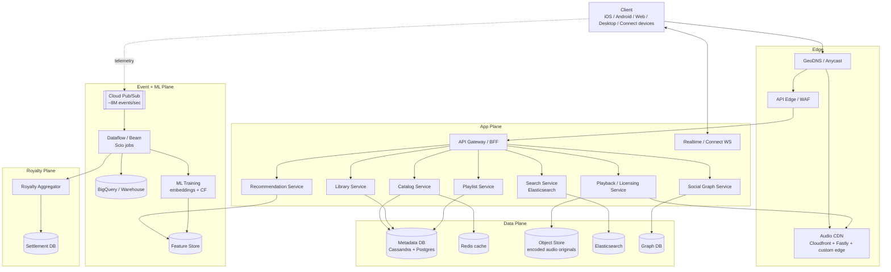

# Design Spotify — HLD Case Study (Audio Streaming, Recommendations, and Royalty-Accurate Listen Tracking)

**Date:** 2026-04-25 | **Updated:** 2026-04-25
**Tags:** `system-design` `case-study` `spotify` `audio-streaming` `music`
**LLD Twin:** [Spotify (LLD) — Playlist, Library, Streaming Session Classes](../../../low-level-design/case-studies/social-content/design-spotify.md) — class-level OOD with entities, relationships, and patterns.


## Table of Contents

- [Summary](#summary)
- [Functional Requirements](#functional-requirements)
- [Non-Functional Requirements](#non-functional-requirements)
- [Capacity Estimation](#capacity-estimation)
- [API Design](#api-design)
- [Data Model](#data-model)
- [HLD Diagram](#hld-diagram)
- [Deep Dives](#deep-dives)
  - [1. Audio CDN — Pre-Positioning the Long Tail](#1-audio-cdn--pre-positioning-the-long-tail)
  - [2. Encoding Ladder and Adaptive Streaming](#2-encoding-ladder-and-adaptive-streaming)
  - [3. Listen Tracking — Kafka/Pub-Sub Pipeline for Royalties](#3-listen-tracking--kafkapub-sub-pipeline-for-royalties)
  - [4. Recommendation System — Discover Weekly](#4-recommendation-system--discover-weekly)
  - [5. Playlist and Library Service](#5-playlist-and-library-service)
  - [6. Search — Elasticsearch with Fuzzy and Popularity Boost](#6-search--elasticsearch-with-fuzzy-and-popularity-boost)
  - [7. Offline Mode — DRM and Time-Limited Keys](#7-offline-mode--drm-and-time-limited-keys)
  - [8. Social Graph and Friend Activity](#8-social-graph-and-friend-activity)
  - [9. Royalty Calculation — Pro-Rata Pool](#9-royalty-calculation--pro-rata-pool)
- [Bottlenecks and Trade-offs](#bottlenecks-and-trade-offs)
- [Anti-Patterns](#anti-patterns)
- [Related](#related)
- [References](#references)

## Summary

Spotify is a global, on-demand audio streaming service. From an HLD perspective, three problems dominate: **deliver audio with sub-500ms time-to-first-byte at planet scale**, **personalize a 100M+ track catalog per user**, and **count every play accurately enough to settle royalties** with rights holders. The system blends an edge-cached CDN for audio bytes with a metadata plane (catalog, playlists, library, social), a recommendation pipeline (collaborative filtering + content embeddings), and an event-delivery pipeline ingesting hundreds of billions of events per day for analytics, personalization, and royalty accounting.

The architectural lessons are consistent: **separate the hot read path (catalog browse, play start) from the heavy write path (listen events, ML training)**, **push static-ish bytes to the edge and keep dynamic decisions central**, and **idempotency over exactly-once** for any pipeline that touches money.

## Functional Requirements

| # | Capability | Notes |
|---|------------|-------|
| 1 | **Search** | Tracks, albums, artists, playlists, podcasts; tolerant to typos; autocomplete as user types |
| 2 | **Play** | Tap a track → audio starts in < 500 ms, adapts to network |
| 3 | **Playlists** | User-created, collaborative, algorithmic (Discover Weekly, Daily Mix, Release Radar) |
| 4 | **Library** | Saved tracks/albums/podcasts, recently played, play history |
| 5 | **Follow artists** | Notifications on new releases (drives Release Radar) |
| 6 | **Recommendations** | Home feed, "Made for You", radio/autoplay continuation |
| 7 | **Offline mode** | Premium users download tracks; encrypted, license-bound |
| 8 | **Social / share** | Share to friends, Friend Activity sidebar, share to social networks |
| 9 | **Podcasts** | Same playback path; episode-level resume; subscriptions |

Out of scope for this HLD: ad targeting, payment/subscription billing, video podcasts, live audio (Greenroom-style), full Marketplace.

## Non-Functional Requirements

| Concern | Target |
|---------|--------|
| Time-to-first-audio | p50 < 200 ms, p99 < 500 ms |
| Playback rebuffer ratio | < 1% of session time |
| Search latency | p99 < 100 ms (typing-keystroke responsive) |
| Catalog availability | 99.95% (browse / play) |
| Listen-event durability | At-least-once, deduplicated downstream; **no lost play counts** that affect royalties |
| Royalty accuracy | Per-stream counts must reconcile to published royalty pools monthly |
| Global reach | Edge presence in every major market; tolerate 1 region failure |
| Offline | Up to 30 days without re-auth (Premium), then license refresh required |

## Capacity Estimation

Order-of-magnitude figures for an interview answer:

```text
Subscribers:          ~600M MAUs, ~250M Premium
Concurrent streams:   ~30M peak (5% of MAU concurrent at busy hour)
Catalog:              ~100M tracks, ~5M podcast episodes
Avg track size:       ~3.5 MB at 96 kbps (free), ~12 MB at 320 kbps (Premium)
Encoding ladder:      4 bitrates × 100M tracks ≈ 4–5 PB origin storage
                      + popular-tier replicated to regional caches (~20% subset)
Listen events:        ~500B events/day total telemetry
                      ~5B "stream completed" events/day (royalty-relevant)
                      Peak ingest: ~8M events/sec
Egress bandwidth:     30M streams × ~80 kbps avg = ~2.4 Tbps sustained
Search QPS:           ~1M queries/sec at peak (every keystroke)
Playlist reads:       ~100x writes; library reads ~1000x writes
```

Two conclusions fall out: **bandwidth, not compute, is the dominant cost**, and **the metadata DB must serve a read-heavy workload that dwarfs the write rate**.

## API Design

A pragmatic mix of REST for catalog/library, WebSocket for realtime presence/Connect, and a streaming protocol for the audio bytes.

### Catalog and Library (REST)

```http
GET  /v1/search?q={query}&types=track,album,artist,playlist&limit=20
GET  /v1/tracks/{trackId}
GET  /v1/albums/{albumId}/tracks
GET  /v1/artists/{artistId}/top-tracks?market=US
GET  /v1/me/library/tracks?cursor={c}&limit=50
PUT  /v1/me/library/tracks            { "ids": ["..."] }
DEL  /v1/me/library/tracks            { "ids": ["..."] }
GET  /v1/me/playlists
POST /v1/me/playlists                  { "name": "...", "public": false }
PUT  /v1/playlists/{id}/tracks         { "uris": [...], "position": 0 }
GET  /v1/recommendations?seed_tracks=...&seed_genres=...
```

### Playback Authorization

```http
POST /v1/playback/license
  body: { trackId, deviceId, capabilities: { codecs: [...], maxBitrate } }
  resp: {
    manifestUrl: "https://audio-cdn.../track/abc/manifest.m3u8",
    licenseToken: "<JWT, 5min ttl>",
    chosenBitrate: 256
  }
```

The client never gets a permanent URL. Each session asks the playback service which CDN edge and which encoding ladder to use, and receives a short-lived signed token consumed by the edge.

### Streaming (HLS / DASH or proprietary segmented protocol)

```text
GET https://audio-cdn.spotify.example/track/{id}/manifest.m3u8?token=...
GET https://audio-cdn.spotify.example/track/{id}/96/seg-0.aac
GET https://audio-cdn.spotify.example/track/{id}/256/seg-1.aac
```

Segments are typically 5–10 s of audio. The client switches bitrate between segments based on observed throughput.

### Offline Download

```http
POST /v1/me/offline/tracks    { ids: [...] }
  resp: { downloadJobId, manifest: [{trackId, url, encryptedKeyId}] }
GET  /v1/me/offline/license/{encryptedKeyId}
  resp: { licenseBlob, expiresAt }     # bound to deviceId, refreshed periodically
```

### Realtime (WebSocket)

```text
wss://realtime.spotify.example/connect
  → presence updates, Spotify Connect device handoff,
    Friend Activity push, collaborative playlist edits
```

### Listen Telemetry (fire-and-forget, batched)

```http
POST /v1/events                 # batched, gzipped, retried with backoff
  body: [
    { type: "track_started",   trackId, ts, contextUri, deviceId, userId },
    { type: "track_completed", trackId, ts, msPlayed, completionRatio },
    { type: "skip",            trackId, ts, msPlayed, reason }
  ]
```

The client retries on failure with persistent local buffering — telemetry must not block playback.

## Data Model

Catalog metadata lives in a polyglot store: relational source-of-truth for entities, denormalized read replicas for hot lookups, and a graph store for social.

```text
track
  id (uuid)               PK
  isrc                    UNIQUE        -- standard recording identifier
  title
  album_id (FK)
  primary_artist_id (FK)
  duration_ms
  explicit                bool
  available_markets       text[]
  audio_features          jsonb         -- danceability, energy, tempo...
  popularity_score        int           -- recomputed nightly
  release_date
  encoding_status         enum

album
  id, title, artist_id, release_date, label, image_urls[]

artist
  id, name, genres[], popularity, followers_count, image_urls[]

playlist
  id, owner_id, name, description, public bool, collaborative bool,
  snapshot_id, image_url, created_at, updated_at

playlist_track  (denormalized for read speed)
  playlist_id, track_id, position, added_at, added_by

user_library_track
  user_id, track_id, saved_at
  PK (user_id, track_id)
  -- partitioned by user_id for fast "my saves" reads

listen_event  (immutable, append-only, fed by client telemetry)
  event_id (ULID)         dedup key
  user_id
  track_id
  context_uri             -- playlist:..., album:..., artist:radio:...
  started_at
  ms_played
  completion_ratio
  device_id
  country
  product (free|premium)

follow_edge  (graph)
  follower_user_id, followee_artist_or_user_id, since
```

The `listen_event` stream is the single source of truth from which **play counts, royalties, recommendations, and Wrapped** are derived.

## HLD Diagram



The split is intentional. The **synchronous request path** (search, browse, play start) terminates close to the user. The **asynchronous event path** sinks every action into Pub/Sub, where ML, royalty, and analytics jobs can take their time.

## Deep Dives

### 1. Audio CDN — Pre-Positioning the Long Tail

Music streaming has a brutal popularity distribution: a tiny fraction of tracks accounts for the bulk of plays, and the rest are an extremely long tail. A good CDN strategy treats them differently.

- **Hot tier**: top ~1% of catalog (by rolling 30-day plays) is **pre-positioned** in every regional edge. These tracks should be cache-hits 99%+ of the time.
- **Warm tier**: regional edges hold a country-popularity slice. A K-pop catalog gets pinned to APAC edges; a Latin catalog to LATAM. Cache TTLs are long (days).
- **Cold tier**: deep catalog reaches origin via cache-miss pull on first play in a region, then warms its way out at TTL-controlled cost.
- **Multi-CDN**: production systems typically front-end with multiple providers (Cloudfront, Fastly, Akamai) plus a custom edge in some POPs. A traffic director shifts load based on per-region health, cost, and rebuffer telemetry.
- **Connection optimization**: Spotify publicly reported moving to BBR congestion control to smooth out streaming over lossy networks (see references). Edge tuning matters as much as cache strategy.

The licensing endpoint hands out **short-lived, segment-scoped signed URLs**. That keeps copy-and-share attacks bounded and lets the playback service inject a different bitrate ladder per device or market without reissuing canonical IDs.

See [`../../building-blocks/object-and-blob-storage.md`](../../building-blocks/object-and-blob-storage.md) for origin storage patterns. See [`design-netflix.md`](design-netflix.md) for the analogous video case — the difference is that Spotify's working set is much smaller (audio is ~30× cheaper per second than video) but **far more random-access** because users skip aggressively.

### 2. Encoding Ladder and Adaptive Streaming

Each track is transcoded once at ingest into a fixed ladder. Spotify historically used **Ogg Vorbis**; AAC is common for compatibility with iOS / web / cars.

| Tier | Bitrate | Use |
|------|---------|-----|
| Low | 24 kbps | Cellular fallback, free tier |
| Normal | 96 kbps | Default mobile |
| High | 160 kbps | Default desktop |
| Very High | 320 kbps | Premium audiophile |
| Lossless (HiFi) | ~1411 kbps FLAC | Premium tier where offered |

The client implements adaptive bitrate selection (similar in spirit to HLS / DASH). Unlike video where ladder steps span an order of magnitude in bandwidth, audio steps are smaller — quality improvements above 160 kbps are subtle to most listeners, so the dominant signal for switching is **buffer health**, not perceived quality.

A 5-second segment size is a sensible default: small enough to switch ladders quickly, large enough to amortize HTTP overhead.

### 3. Listen Tracking — Kafka/Pub-Sub Pipeline for Royalties

The most distinctive thing Spotify has publicly written about is its **event delivery system**. The 2016 architecture used Kafka; in 2016–2019 they migrated to **Google Cloud Pub/Sub** for the firehose and **Dataflow + Scio** for processing (see references). At reported peaks the system handles **~8M events/sec** and **~500B events/day** (~70 TB compressed).

```text
Client SDK
  → batches events to local disk (durable across app crash / offline)
  → POST /v1/events when network available (gzipped, retried)
  → API edge writes to Pub/Sub topic per event family

Pub/Sub
  → Dataflow streaming jobs (Scio):
       deduplicate by event_id
       enrich with track / user metadata via side-input lookups
       fan out into:
         - real-time aggregates (counts → BigTable)
         - feature store updates (recently played, skip rate)
         - warehouse loads (BigQuery)
         - royalty pipeline
```

**Idempotency** is the architectural commitment. Every event carries a client-generated ULID; Dataflow deduplicates on a sliding window. Exactly-once is a property of the **derived state**, not of network delivery, and is what royalty accounting requires.

A "stream" for royalty purposes is defined as **≥30 s of playback** (see references). The pipeline emits a `royalty_qualified_play` event only after the completion event satisfies that bar. Skips and partial plays still flow into recommendations but don't pay out.

See [`../../building-blocks/message-queues-and-brokers.md`](../../building-blocks/message-queues-and-brokers.md) for the broader pattern.

### 4. Recommendation System — Discover Weekly

Discover Weekly is the canonical "Made for You" surface: ~30 personalized tracks delivered to ~100M users every Monday. Three signals power it.

1. **Collaborative filtering**: matrix factorization on the user × track play matrix produces user and track latent vectors. Users who listen to similar things end up close in vector space; tracks recommended to user U are near U in vector space and far from the things U has already saturated on.
2. **Content-based filtering**: convolutional neural networks ingest raw audio (mel spectrograms) and produce track embeddings capturing tempo, timbre, energy, key. This is how brand-new tracks with no plays get recommended at all — the cold-start fix for collaborative filtering.
3. **NLP signals**: scrape blog posts, playlists, and editorial copy to enrich tracks with cultural context (which tracks get talked about together as "lo-fi hip hop" even if their audio embeddings differ).

The serving path:

```text
Nightly:  CF + content vectors stored in Bigtable / feature store
          per-user candidate set computed (top-K nearest tracks not yet played)
Hourly:   re-rank candidates using a model that scores predicted satisfaction
          (skip rate, completion rate, save rate of similar users on this track)
Monday:   ~30-track playlist materialized per user; pushed to playlist service
```

Spotify publicly described moving Discover Weekly to **Google Cloud Bigtable** to make this feasible — the original "do everything Sunday night" approach didn't scale to 100M+ users. The pre-compute happens days ahead of release.

For "right-now" recommendations (Home feed, autoplay/radio), candidates come from the same feature store but are scored online with low-latency models in the recommendation service.

### 5. Playlist and Library Service

Reads dominate. A user's library is read on app open, on every search "save" check, on Connect device handoff, on Wrapped, on share. Writes (save, unsave, reorder) are comparatively rare.

Optimizations:

- **Denormalize playlist_tracks**: store the full ordered list with snapshot IDs. A playlist edit produces a new snapshot rather than mutating in place — cheaper for caches and gives free undo/version history.
- **Partition library by user_id**: every user owns a small slice; cross-user queries are rare.
- **Write-through cache** in Redis with long TTLs; invalidate on mutation via the same service that did the write.
- **Collaborative playlists**: edits flow over the realtime channel using CRDT-like ordering or operational transforms so two clients editing simultaneously converge.

The tradeoff: snapshot-per-edit blows up storage, so old snapshots are GC'd after a retention window.

### 6. Search — Elasticsearch with Fuzzy and Popularity Boost

Search is **typing-keystroke responsive**. Every character must hit a sub-100ms response, ideally sub-50ms.

Architecture:

- **Inverted index** in Elasticsearch over title, artist name, album, podcast, playlist name; multilingual analyzers per market.
- **Edge-grams** (`spo`, `spot`, `spoti`...) power autocomplete.
- **Phonetic + fuzzy matching** so "btls" finds "Beatles" and "drk sd of th mn" finds "Dark Side of the Moon".
- **Popularity boost**: each entity has a popularity score recomputed nightly from listen events. The ranker mixes textual relevance with popularity, recency (Release Radar pressure), and per-user personalization (your prior plays).
- **Multi-tier caching**: top global queries served from CDN; regional hot queries from Redis; cold queries hit Elasticsearch.

A single-character query like `t` is essentially a top-popular lookup, served from cache. Long-tail queries with many tokens hit the index but match few entities and stay fast.

See [`../../building-blocks/search-systems.md`](../../building-blocks/search-systems.md) for the general pattern; see [`design-youtube.md`](design-youtube.md) for the analogous title-search setup at video scale.

### 7. Offline Mode — DRM and Time-Limited Keys

Offline isn't "give the user a file". It's "give them an encrypted blob and a license that has to be refreshed".

```text
Premium client requests download:
  1. Server returns encrypted segment URLs + per-track key references
  2. Client fetches encrypted bytes (any CDN edge will do)
  3. Client requests license blob, bound to:
       - userId
       - deviceId (hardware-rooted where possible)
       - subscription validity timestamp
       - expiresAt (e.g., 30 days)
  4. Player decrypts via DRM CDM (Widevine on Android/web,
     FairPlay on Apple, PlayReady on some platforms)
  5. Periodic re-check: client must come online before expiresAt
     to refresh license, otherwise offline tracks stop playing
```

Key properties:

- Encrypted bytes are not playable without a fresh license, so even rooted/jailbroken devices can't simply copy them off.
- Licenses are device-bound; sharing your account with five devices doesn't grant infinite offline mirrors — there's a per-account device cap.
- Subscription cancellation propagates: at next license refresh the server refuses to mint a new license.

This is the same general approach Netflix uses for video; the difference is that Spotify's offline catalog can be enormous (a Premium user could download a 10,000-track library) and therefore the **license refresh is not just a stream-start event**, it's a periodic background sync.

### 8. Social Graph and Friend Activity

The follow/follower graph is a relatively classic graph workload:

- **Edge store**: `(follower, followee, since)` partitioned by follower for "what artists do I follow" and a reverse index for "who follows me".
- **Friend Activity sidebar**: a fan-out-on-write timeline. When a friend plays a track, an event lands in your activity feed (capped to last N items). The fan-out is bounded by the size of your friend list, which is small; this is unlike Twitter where celebrities have 100M followers.
- **Privacy**: every play emits both a "personal listen" event (always logged for royalty) and an optional "social broadcast" (only if user has private session disabled and is sharing with friends).

Notification on artist new release uses a separate fanout: when a track is released, the artist service emits "release published" → consumer joins against the follower index → pushes to Release Radar generation per follower.

### 9. Royalty Calculation — Pro-Rata Pool

Royalty model (the business reality, simplified):

```text
For each rights-holder R, in each market M, in month T:
  R.payout = (R.qualifying_streams_in_M_T / total_qualifying_streams_in_M_T)
           × revenue_pool(M, T)
           × negotiated_rate_share(R)
```

This is "pro-rata pool": each stream is a fractional claim on the pool. Per-stream rates published in the press (~$0.003–$0.005, see references) are an emergent average, not a rate Spotify pays per stream.

Architectural requirements:

- **Idempotent counts**: a duplicated event must not double-count.
- **Auditability**: every stream that contributed to a payout must be traceable to a `(user, track, timestamp, country, product_tier)`.
- **Eligibility filter**: as of 2024 Spotify excluded tracks under 1,000 annual streams from royalty payouts; the pipeline applies this gate before settlement.
- **Reconciliation**: monthly batch run produces a per-rights-holder statement; mismatches against label-side accounting must resolve. This is the reason exactly-once-derived-state is non-negotiable.

The royalty pipeline is the **terminal sink** of the listen-event stream. It runs as a series of Dataflow jobs against a frozen partition (the previous month) so re-runs are deterministic.

## Bottlenecks and Trade-offs

| Bottleneck | Mitigation | Trade-off |
|------------|------------|-----------|
| Cold-start latency for first play in a region | Pre-position popular catalog, warm regional caches | Storage cost grows with catalog × regions |
| Long-tail track delivery from origin | Multi-CDN, lazy hydration | Slower TTFB on first play of obscure tracks |
| Listen-event firehose (8M/s peak) | Pub/Sub + Dataflow, batch + dedupe at sink | Higher end-to-end latency from play to count |
| Search per-keystroke QPS | Multi-tier cache, edge-gram indexing | Index size, costlier autocomplete refresh |
| Royalty exactness vs throughput | Idempotent IDs, dedup window, monthly reconcile | Real-time counts are estimates; final counts settle later |
| Offline storage on device | DRM-bound encrypted blobs | Higher complexity; some user-perceived "why won't this play offline" |
| ML model freshness | Hourly online re-rank; nightly batch retrain | Recommendations slightly trail real listening behavior |
| Collaborative-playlist conflicts | CRDT-style ordering over realtime WS | Edge cases on flaky networks (ghost moves) |
| Hot artist release spike | Pre-warmed catalog rows, surge capacity in playback service | Forecasting effort per major drop |
| Region failure | Active-active across regions for metadata; CDN failover | Cross-region replication lag for non-royalty state |

## Anti-Patterns

- **Trusting client-reported play counts as ground truth.** Counts must be deduplicated and validated server-side; a malicious client can replay events.
- **Computing recommendations synchronously on request.** Discover Weekly-style surfaces are pre-computed; trying to do it inline kills tail latency.
- **One global SQL master for the catalog.** A 100M-track catalog with 600M users does not survive a single primary; partition aggressively, denormalize for reads.
- **Stateful audio sessions tied to a single backend.** Playback should be resumable from any edge; license + position must travel with the user.
- **"Exactly once" event delivery as a goal.** Spotify's published architecture explicitly chose at-least-once + idempotent processing. Pursuing exactly-once at the network layer wastes engineering for a property the application can guarantee at the sink.
- **One bitrate for all networks.** Adaptive ladder is mandatory; mobile/cellular without it is a rebuffer disaster.
- **Treating podcasts as a clone of music.** Episode-level resume, dynamic ad insertion, and very different listening patterns (long sessions, low skip rate) deserve their own playback paths even if the storage layer is shared.
- **Storing every event in a relational DB.** The firehose is for an append-only log → stream processor → warehouse. Putting it in OLTP is an outage waiting to happen.
- **Skipping the 30-second royalty gate.** Without a strict definition of "qualifying play", royalty pools become a fraud target.

## Related

- [`design-youtube.md`](design-youtube.md) — the video analog: massive UGC, transcoding ladder, recommendation feed
- [`design-netflix.md`](design-netflix.md) — premium curated content, larger working set, different ladder economics
- [`../../building-blocks/object-and-blob-storage.md`](../../building-blocks/object-and-blob-storage.md) — origin storage for encoded audio
- [`../../building-blocks/message-queues-and-brokers.md`](../../building-blocks/message-queues-and-brokers.md) — Pub/Sub and Kafka patterns behind event delivery
- [`../../building-blocks/search-systems.md`](../../building-blocks/search-systems.md) — Elasticsearch ranking and autocomplete patterns
- [`../../building-blocks/caching-layers.md`](../../building-blocks/caching-layers.md) — multi-tier cache design (CDN → regional Redis → service-local)

## References

- [Spotify's Event Delivery — The Road to the Cloud (Part I)](https://engineering.atspotify.com/2016/02/spotifys-event-delivery-the-road-to-the-cloud-part-i) — Spotify Engineering
- [Spotify's Event Delivery — The Road to the Cloud (Part II)](https://engineering.atspotify.com/2016/03/spotifys-event-delivery-the-road-to-the-cloud-part-ii) — Spotify Engineering
- [Spotify's Event Delivery — Life in the Cloud (2019)](https://engineering.atspotify.com/2019/11/spotifys-event-delivery-life-in-the-cloud) — Spotify Engineering, post-Pub/Sub migration
- [Why Spotify migrated its event delivery from Kafka to Cloud Pub/Sub](https://cloud.google.com/blog/products/gcp/spotifys-journey-to-cloud-why-spotify-migrated-its-event-delivery-system-from-kafka-to-google-cloud-pubsub) — Google Cloud Blog
- [Big Data Processing at Spotify: The Road to Scio (Part 1)](https://engineering.atspotify.com/2017/10/big-data-processing-at-spotify-the-road-to-scio-part-1) — Spotify Engineering
- [Smoother Streaming with BBR](https://engineering.atspotify.com/2018/08/smoother-streaming-with-bbr) — Spotify Engineering, on TCP congestion control for streaming
- [How We Use Backstage at Spotify](https://engineering.atspotify.com/2020/4/how-we-use-backstage-at-spotify) — Spotify Engineering, internal developer platform
- [Backstage Architecture Overview](https://backstage.io/docs/overview/architecture-overview/) — for the microservices catalog backbone
- [The Little Hack That Could: The Story of Spotify's Discover Weekly](https://spectrum.ieee.org/the-little-hack-that-could-the-story-of-spotifys-discover-weekly-recommendation-engine) — IEEE Spectrum
- [Inside Spotify's Recommendation System (2025 Update)](https://www.music-tomorrow.com/blog/how-spotify-recommendation-system-works-complete-guide) — Music Tomorrow
- [Spotify Royalties: Streams, the 30-second rule, and the 2024 1,000-stream threshold](https://soundcamps.com/spotify-royalties-calculator/) — industry summary
- [Spotify Web API Reference — Search](https://developer.spotify.com/documentation/web-api/reference/search) — public API surface
