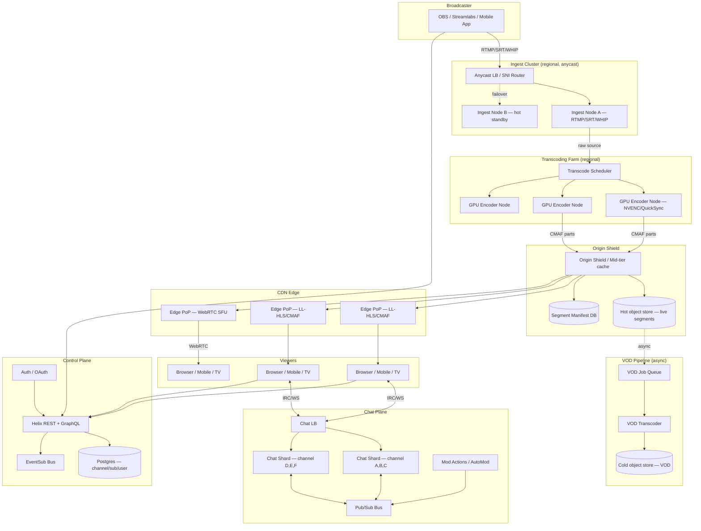

# Design Twitch — Live Ingest, Low-Latency Delivery, Chat at Viewer Scale, VOD

**Date:** 2026-04-25 | **Updated:** 2026-04-25
**Tags:** `system-design` `case-study` `twitch` `live-streaming` `low-latency`

## Table of Contents

- [Summary](#summary)
- [Functional Requirements](#functional-requirements)
- [Non-Functional Requirements](#non-functional-requirements)
- [Capacity Estimation](#capacity-estimation)
- [API Design](#api-design)
- [Data Model](#data-model)
- [HLD Diagram](#hld-diagram)
- [Deep Dives](#deep-dives)
  - [1. Live Ingest — RTMP, SRT, WebRTC](#1-live-ingest--rtmp-srt-webrtc)
  - [2. Transcoding Farm — Bitrate Ladder and Hardware Encoders](#2-transcoding-farm--bitrate-ladder-and-hardware-encoders)
  - [3. Low-Latency Delivery — LL-HLS, CMAF, WebRTC](#3-low-latency-delivery--ll-hls-cmaf-webrtc)
  - [4. HLS Playlist Updates and Edge Cache TTL Trade-Offs](#4-hls-playlist-updates-and-edge-cache-ttl-trade-offs)
  - [5. Chat at Viewer Scale](#5-chat-at-viewer-scale)
  - [6. Clips — Real-Time Marking, Async Render](#6-clips--real-time-marking-async-render)
  - [7. VOD Pipeline](#7-vod-pipeline)
  - [8. Subscriptions, Bits, Ads, Monetization](#8-subscriptions-bits-ads-monetization)
  - [9. Pre-Roll Ad Insertion at Edge (SSAI)](#9-pre-roll-ad-insertion-at-edge-ssai)
  - [10. Failover — Ingest, Transcode, Edge, Viewer](#10-failover--ingest-transcode-edge-viewer)
- [Bottlenecks and Trade-Offs](#bottlenecks-and-trade-offs)
- [Anti-Patterns](#anti-patterns)
- [Related](#related)
- [References](#references)

## Summary

Twitch is a real-time live-streaming platform where each broadcaster pushes a single source feed and tens of thousands to hundreds of thousands of concurrent viewers watch with **glass-to-glass latency targets between sub-second and a few seconds**. The hard parts are not the storage of video — that part is well understood and mostly resembles [YouTube's VOD pipeline](./design-youtube.md) — but rather the **end-to-end real-time path**: a push protocol stable enough to survive bad uplinks, a transcoding farm that fans one source into a quality ladder within seconds, a CDN that supports **partial-segment / chunked CMAF transfer** rather than only fully-formed segments, and a chat fan-out plane that scales independently from video and lands messages with single-digit-millisecond intra-channel latency. The platform must also archive every stream into VOD, snapshot Clips on demand, insert pre-roll ads at the edge (SSAI), and gracefully fail over ingest, transcode, and edge layers without the viewer noticing.

This document lays out the high-level architecture for a Twitch-shaped system at senior-backend depth — the protocols on each hop, where state lives, where the latency budget gets spent, and the trade-offs that force the design.

## Functional Requirements

| Capability | Description |
|---|---|
| **Live ingest** | Broadcaster pushes a single high-bitrate source via **RTMP, SRT, or WebRTC** to the nearest regional ingest cluster. |
| **Transcoding** | Source is transcoded into a multi-bitrate **ABR ladder** (source, 1080p60, 720p60, 720p30, 480p, 360p, 160p audio-only) within a few seconds. |
| **Low-latency delivery** | Viewers receive the ladder via **LL-HLS / CMAF chunked transfer** or WebRTC, glass-to-glass between ~0.3s (WebRTC) and ~3–5s (LL-HLS). |
| **Chat at scale** | IRC-flavoured pub/sub with channel-scoped fan-out, slow mode, sub-only mode, mod tools, emote rendering. |
| **VOD** | Every live stream is archived to object storage, re-transcoded for VOD-optimised encoding, browseable timeline. |
| **Clips** | Any viewer can mark a 30–60s window from the live stream and produce a standalone shareable VOD asset. |
| **Subscriptions** | Tier 1 / 2 / 3 paid subs, gifted subs, sub-only chat, sub badges/emotes. |
| **Monetization** | Bits (cheers), pre-roll and mid-roll ads, channel points, payouts to creators. |
| **Discovery** | Browse by category/game, follow, raids, host mode, recommendations. |

## Non-Functional Requirements

| Dimension | Target |
|---|---|
| **Glass-to-glass latency** | p50 ≤ 5s for LL-HLS, p50 ≤ 1s for WebRTC mode, classic HLS fallback ≤ 15s. |
| **Quality** | Up to 1080p60 source, 6 Mbps source bitrate typical, 8 Mbps cap. |
| **Per-stream concurrency** | Top streams sustain 200k–500k+ concurrent viewers; long tail mostly under 1k. |
| **Platform concurrency** | Millions of concurrent viewers across hundreds of thousands of live channels. |
| **Chat latency** | p99 ≤ 300ms intra-channel fan-out for messages of any visible length. |
| **Availability** | 99.95%+ for the watch path; ingest can degrade with retry/reconnect within 10s. |
| **Durability of VOD** | 11 9s on object storage (S3-class). |
| **Global reach** | CDN PoPs across continents; ingest PoPs on every major continent for short broadcaster RTT. |
| **Cost** | Egress is the dominant variable cost. CDN tiered caching is essential, not optional. |

## Capacity Estimation

Let's size this with realistic numbers.

**Ingest side.** Assume **300k concurrent live channels** in a peak hour. Average source bitrate 4 Mbps (mix of 1080p60 streamers, mobile/IRL streamers, and lower-bitrate just-chatting channels). Aggregate ingest = 300k × 4 Mbps = **1.2 Tbps** of inbound video. This is split across regional ingest clusters; if you have 30 globally and they balance roughly evenly, that is **~40 Gbps per region**, comfortably handled by a few ingest server racks per region.

**Transcoding side.** Each ingest stream becomes a **5–6 rendition ABR ladder**. Even with NVENC / dedicated hardware encoders on Tesla/T4/L4-class accelerators, you typically dedicate **one GPU slot per concurrent transcode job for the popular streams** and downscale or skip transcoding for the long tail. Twitch has historically shipped policies like "only transcode partner / popular streams" because transcoding 300k concurrent ladders is otherwise economically unviable. Budget roughly **20–40 transcodes per GPU node** depending on the chip and codec (H.264 vs HEVC vs AV1). At ~20% of streams transcoded, that is 60k transcoded streams × ~5 renditions = **300k encode tasks** running concurrently — roughly 7,500–15,000 GPU-class nodes regionally.

**Egress side.** This is the dominant cost line. **15M concurrent viewers × 3 Mbps average effective bitrate** = **45 Tbps of egress**. CDN tiered cache has to be doing real work — you need very high origin offload (95%+) so the transcoding farm and origin shield are not paying for every viewer.

**Storage (VOD).** 300k channels × ~4 hours/day average × 4 Mbps = ~17 PB of new VOD raw segments per day at source-bitrate; in practice, after VOD-side re-encoding and retention policy (e.g., 14 days for non-sub, 60 days for sub, indefinite for highlights/clips), steady-state holdings are in the **hundreds of petabytes** to low single-digit exabytes range.

**Chat side.** Average messages-per-second per active viewer is small (well under 0.1 mps), but **fan-out** is the killer. A 200k-viewer channel generating 50 mps has to fan out 50 × 200,000 = **10M outbound messages per second on that one channel**. Multiply across the platform's top hundred channels and you have a chat plane sized in the hundreds of millions of mps.

## API Design

Twitch is multi-protocol by necessity. Each plane uses what fits.

### Ingest (broadcaster → ingest server)

| Protocol | Why it exists | Notes |
|---|---|---|
| **RTMP** | Industry default; OBS/Streamlabs/XSplit ship RTMP out of the box. | TCP-based; head-of-line blocking on packet loss; no FEC. Twitch's primary ingest historically. |
| **SRT** | UDP-based with ARQ + FEC; survives bad uplinks (mobile, satellite, transcontinental). | Twitch added experimental SRT ingest; widely used in pro broadcast since ~2017. |
| **WebRTC ingest (WHIP)** | Sub-second glass-to-glass when paired with WebRTC playback; native in browsers. | Standardised as IETF WHIP (RFC 9725 family). |
| **HLS ingest (rare)** | Last-resort path for tools that only speak HLS push. | Higher latency, less common. |

```
# RTMP push URL (example shape)
rtmp://{ingest-region}.twitch.tv/app/{stream-key}

# WHIP (WebRTC) push URL
POST https://ingest.twitch.tv/whip/{stream-key}
Content-Type: application/sdp
{SDP offer body}
```

### Playback (CDN edge → viewer)

| Protocol | Latency | Use |
|---|---|---|
| **LL-HLS over HTTP/2** | ~2–5s glass-to-glass | Default for browsers, mobile apps, smart TVs. |
| **HLS (classic)** | ~10–20s | Fallback for old players. |
| **CMAF (chunked transfer)** | ~2–3s | Underlying container; LL-HLS uses CMAF "parts". |
| **WebRTC playback** | ~0.3–1s | "Low Latency" mode for interactive use cases. |
| **DASH** | Comparable to HLS | Less common on Twitch; some markets/devices. |

```
# Master playlist (HLS)
GET https://video-edge-{pop}.{region}.hls.ttvnw.net/v1/playlist/{channel}.m3u8

# Media playlist with LL-HLS extensions (RFC 8216bis)
GET https://video-edge-{pop}.{region}.hls.ttvnw.net/v1/playlist/{channel}/720p60.m3u8
  → returns playlist with EXT-X-PART, EXT-X-PRELOAD-HINT, EXT-X-SERVER-CONTROL

# Segment / part fetch (CMAF)
GET https://video-edge-{pop}.{region}.hls.ttvnw.net/v1/segment/{channel}/720p60/{n}.m4s
GET https://video-edge-{pop}.{region}.hls.ttvnw.net/v1/segment/{channel}/720p60/{n}.{p}.m4s
```

### Control plane (clients → API)

| Surface | Protocol |
|---|---|
| **Helix (public REST)** | `https://api.twitch.tv/helix/...` — channels, streams, clips, subscriptions. |
| **GraphQL (internal)** | First-party clients use a GraphQL endpoint; not officially supported for third parties. |
| **EventSub (webhooks/WebSocket)** | Push notifications for stream state, follows, subs, raids. |

### Chat protocol

Twitch chat is **IRCv3-flavoured** — a real IRC server (the wire format) with custom CAP extensions for tags, badges, emotes, and bits. There is also a newer WebSocket-native pub/sub system (PubSub / EventSub WebSocket), but the IRC path remains the primary chat protocol.

```
# Connect (TLS WebSocket)
wss://irc-ws.chat.twitch.tv:443

# Authenticate
PASS oauth:{token}
NICK {username}
CAP REQ :twitch.tv/tags twitch.tv/commands twitch.tv/membership

# Join a channel
JOIN #ninja

# Send a message
PRIVMSG #ninja :hello world

# Receive (server → client) with tags
@badge-info=subscriber/12;color=#FF4500;display-name=Foo;emotes=;... \
  :foo!foo@foo.tmi.twitch.tv PRIVMSG #ninja :hello world
```

## Data Model

Sketch of the core entities — partitioned where each one needs to scale independently.

```sql
-- Channel metadata (small, hot-read)
CREATE TABLE channel (
    channel_id         BIGINT PRIMARY KEY,
    user_id            BIGINT NOT NULL,
    title              TEXT,
    category_id        BIGINT,
    language           TEXT,
    is_mature          BOOLEAN,
    is_partner         BOOLEAN,
    created_at         TIMESTAMPTZ
);

-- Live stream session (one per "go live")
CREATE TABLE stream (
    stream_id          BIGINT PRIMARY KEY,
    channel_id         BIGINT NOT NULL REFERENCES channel,
    started_at         TIMESTAMPTZ NOT NULL,
    ended_at           TIMESTAMPTZ,
    ingest_region      TEXT,
    source_bitrate_bps BIGINT,
    avg_concurrent     INT,
    peak_concurrent    INT
);

-- Segment manifest (live + VOD); one row per CMAF segment per rendition
-- Sharded by stream_id; very high write rate during live
CREATE TABLE segment (
    stream_id          BIGINT NOT NULL,
    rendition          TEXT NOT NULL,           -- '1080p60', '720p30', ...
    seq                BIGINT NOT NULL,         -- monotonically increasing
    pts_start_ms       BIGINT NOT NULL,
    duration_ms        INT NOT NULL,
    object_key         TEXT NOT NULL,           -- s3://.../stream/{id}/720p30/{seq}.m4s
    is_init            BOOLEAN DEFAULT FALSE,
    PRIMARY KEY (stream_id, rendition, seq)
);

-- Chat message (sharded by channel_id; archived to cold storage after a TTL)
CREATE TABLE chat_message (
    message_id         UUID PRIMARY KEY,
    channel_id         BIGINT NOT NULL,
    user_id            BIGINT NOT NULL,
    sent_at            TIMESTAMPTZ NOT NULL,
    body               TEXT,
    flags              JSONB                    -- bits, sub-only, mod-action, etc.
);

-- Subscriber (subscriptions)
CREATE TABLE subscription (
    subscription_id    BIGINT PRIMARY KEY,
    channel_id         BIGINT NOT NULL,
    user_id            BIGINT NOT NULL,
    tier               SMALLINT NOT NULL,       -- 1, 2, 3
    is_gifted          BOOLEAN,
    gifter_user_id     BIGINT,
    started_at         TIMESTAMPTZ,
    expires_at         TIMESTAMPTZ
);

-- Clip (snapshot of a 30-60s live window)
CREATE TABLE clip (
    clip_id            UUID PRIMARY KEY,
    channel_id         BIGINT NOT NULL,
    stream_id          BIGINT NOT NULL,
    creator_user_id    BIGINT NOT NULL,
    pts_start_ms       BIGINT NOT NULL,
    duration_ms        INT NOT NULL,
    title              TEXT,
    vod_object_key     TEXT,                    -- post-render
    state              TEXT,                    -- pending, rendering, ready, failed
    created_at         TIMESTAMPTZ NOT NULL
);
```

Twitch publicly described running a **PostgreSQL fleet** for transactional metadata of exactly this shape, scaled via vertical sharding by entity type plus horizontal sharding for the hottest tables (chat archive, sub history). Bulk video metadata and analytics fan out into time-series stores (DynamoDB, Cassandra, Redshift) instead of staying in Postgres.

## HLD Diagram



## Deep Dives

### 1. Live Ingest — RTMP, SRT, WebRTC

The ingest layer is the **most fragile** part of the system because it terminates the broadcaster's home connection, which is asymmetric, often congested, and at the mercy of consumer ISPs.

**RTMP (TCP).** The historical default. Adobe published the RTMP spec in 2009. RTMP runs over a single TCP connection; if a packet is lost, head-of-line blocking stalls the entire stream until retransmission completes. There is no built-in FEC. RTMP is fine on a wired connection; it is hostile on flaky mobile.

**SRT (Secure Reliable Transport).** Open-sourced by Haivision. Runs over UDP, adds **ARQ (selective retransmit)** with a configurable latency budget (typically 120–500ms) and optional FEC. SRT was designed for long-distance contribution feeds — exactly the broadcaster-to-cloud use case. The crucial property is that lost packets either get retransmitted within the latency budget or are dropped (and concealed downstream); the stream does not stall like RTMP. Twitch added experimental SRT ingest specifically because RTMP was the worst part of the IRL/mobile streamer experience.

**WebRTC ingest (WHIP).** Standardised as **WHIP — WebRTC-HTTP Ingestion Protocol**. Encodes the SDP offer/answer exchange as a single HTTP POST, which removes the legacy ICE-server-discovery dance and makes WebRTC ingest practical for production. WebRTC pairs with WebRTC playback for sub-second end-to-end latency, but the codec/feature menu is constrained (H.264 baseline/main, Opus audio).

**Ingest server design.** Each region runs a cluster of ingest nodes behind an anycast load balancer that routes by stream key. The ingest node:
1. Authenticates the stream key against the control plane.
2. Demuxes the elementary streams (H.264/AAC for RTMP, more flexible for SRT/WHIP).
3. Re-packages into **fragmented MP4 / CMAF** for downstream transcoding.
4. Publishes the source rendition into the segment manifest and the hot object store.
5. Emits a `stream.online` event on EventSub.

A single broadcaster connects to **one ingest node**, but the upstream fan-out from that ingest node to N transcoder workers is the parallelisation point.

### 2. Transcoding Farm — Bitrate Ladder and Hardware Encoders

Transcoding turns one source rendition into a **5–6 step ABR ladder**:

| Rendition | Resolution | FPS | Video bitrate | Use |
|---|---|---|---|---|
| Source | up to 1920×1080 | up to 60 | up to 8 Mbps | Pass-through for top-tier viewers |
| 1080p60 | 1920×1080 | 60 | 6 Mbps | Premium/sub-only on some channels |
| 720p60 | 1280×720 | 60 | 3 Mbps | Default high-quality on broadband |
| 720p30 | 1280×720 | 30 | 1.8 Mbps | Mid-tier |
| 480p | 854×480 | 30 | 1.0 Mbps | Mobile / constrained bandwidth |
| 360p | 640×360 | 30 | 0.6 Mbps | Constrained mobile |
| 160p audio-only | — | — | 64 kbps Opus/AAC | Low-bandwidth fallback |

**Hardware path.** Software encoders (libx264) are too slow and too power-hungry at scale. Twitch and similar platforms use **dedicated hardware encoders** — NVIDIA NVENC on T4/L4-class GPUs, Intel QuickSync on Xeon E-class chips, or custom ASICs. Hardware encoders give 10–30× more streams per box than libx264 at acceptable quality.

**The "transcode budget" problem.** Transcoding every channel is uneconomical. Historically, Twitch only transcoded **partner channels and channels above a popularity threshold**; everyone else got pass-through source-only delivery. The platform later reworked this with more aggressive partial transcoding for affiliates, but the principle stands: **you pick where to spend silicon**. An economic policy shaped a user-visible behaviour ("non-partners only have source quality") that took years to relax.

**Scheduler.** The transcode scheduler is a control loop that:
- Ingests `stream.online` events.
- Looks up policy (partner/affiliate/popular?).
- Picks GPU nodes that have capacity in the same region as the ingest.
- Assigns the ladder.
- Reschedules on GPU node failure within seconds.

### 3. Low-Latency Delivery — LL-HLS, CMAF, WebRTC

This is the hardest single piece.

**Classic HLS** chunks media into 6-second `.ts` segments. By the time the segment is finished encoding, uploaded, and a manifest update is fetched, **end-to-end latency is 15–30s**. That kills the chat-stream interaction loop that defines Twitch.

**CMAF (Common Media Application Format, ISO/IEC 23000-19)** changed the game by defining a fragmented MP4 container with explicit **chunk** boundaries inside a segment. A 4-second segment can contain twenty 200ms chunks. Combined with **HTTP/1.1 chunked transfer encoding**, the encoder can flush each 200ms chunk to origin → CDN → player **before the surrounding segment is complete**. The player decodes chunks as they arrive.

**LL-HLS (Apple's Low-Latency HLS, RFC 8216bis)** standardised the manifest-side protocol around CMAF chunked transfer. Key extensions:

| Tag | Purpose |
|---|---|
| `EXT-X-PART` | Declares a sub-segment "part" (e.g., 200ms) within the current segment. |
| `EXT-X-PRELOAD-HINT` | Tells the player which next part/segment to start fetching before it's announced. |
| `EXT-X-SERVER-CONTROL` | Declares server features (`HOLD-BACK`, `PART-HOLD-BACK`, `CAN-BLOCK-RELOAD`). |
| `EXT-X-RENDITION-REPORT` | Report on other renditions for fast ABR switching. |
| Blocking playlist reload (`_HLS_msn=N&_HLS_part=K`) | Player asks server to **hold the GET open** until that part is available — eliminates polling. |

The blocking playlist reload is the magic: the player issues `GET playlist.m3u8?_HLS_msn=42&_HLS_part=3`, the **CDN edge holds the connection** until part 3 of segment 42 exists, then responds. This requires the CDN to support partial-segment delivery and long-poll style holds. **Standard "fetch full segment then cache" CDNs cannot do LL-HLS.** Twitch's CDN partners (Akamai, Fastly, plus Twitch's own edge fleet) had to ship LL-HLS-aware origin shields.

**WebRTC mode.** For sub-second use cases (interactive streams, real-time gaming sessions), Twitch routes viewers to a **WebRTC SFU (selective forwarding unit)** at the edge instead of an HLS edge. The SFU receives the source feed once and selectively forwards to N viewers. WebRTC runs over UDP with built-in jitter buffering and FEC; latency is typically **300–800ms glass-to-glass**. The trade-off: WebRTC is far more expensive per viewer than HLS (stateful sessions, no pure-cache CDN), and codec/DRM/ad-insertion stories are weaker.

### 4. HLS Playlist Updates and Edge Cache TTL Trade-Offs

The core tension: **manifests change every part-duration (~200ms)**, but CDNs were built to cache things for seconds-to-hours.

If the edge caches the manifest for too long, players see a stale view of available parts and either re-buffer or fall behind live. If the edge caches for too short, **every playlist GET is a cache miss to origin**, and a 200k-viewer channel reloading playlists every 200ms generates **a million origin RPS** — origin melts.

The mitigations:

1. **Short, time-bound TTLs.** Manifests get `Cache-Control: max-age=1, stale-while-revalidate=2` style headers. Edge holds the response briefly, revalidates in the background, but is willing to serve a slightly stale manifest if the origin is slow.
2. **Blocking playlist reload (LL-HLS).** Instead of clients polling at fixed intervals, they issue blocking requests with `_HLS_msn` and `_HLS_part` query params. The edge **coalesces** all viewers waiting for the same `(msn, part)` into a single in-flight origin request and broadcasts the response. This reduces origin RPS from `viewers × poll_rate` to `1 × part_rate`.
3. **Tiered cache (origin shield).** A mid-tier cache layer sits between edge PoPs and origin. Edge misses go to shield; shield consolidates and serves to all edges in its region.
4. **Segment URL stability.** Segments themselves are immutable once written. They get long TTL (`Cache-Control: max-age=86400, immutable`) and benefit from full CDN caching.

The asymmetric pattern — **immutable segments with long TTL, hot-mutating manifests with blocking reload** — is the canonical LL-HLS deployment.

### 5. Chat at Viewer Scale

Chat is its own system, deliberately decoupled from video.

**Wire protocol — IRC.** Twitch chat speaks **IRCv3 with custom CAP extensions**. Every message is tagged with badges, colour, emotes, sub status, bits, mod flags. The wire format is line-based UTF-8 over TLS WebSocket (`wss://irc-ws.chat.twitch.tv:443`) or raw TLS sockets (`irc.chat.twitch.tv:6697`).

**Sharding by channel.** Each channel is owned by **one chat server shard**. Joins/leaves and PRIVMSG land on that shard, which is the authoritative serialiser for the channel's message order. The shard publishes outgoing messages onto a **pub/sub bus** (Kafka, NATS, or a custom multicast plane), and **fan-out edge servers** subscribe to channels they have viewers for and push to those viewers' WebSocket connections.

**Why this shape.**
- A single 200k-viewer channel cannot fan out from one server's NIC. You need horizontal fan-out across many edge nodes, each holding a fraction of the viewer connections.
- A single shard can serialise message order for a channel of arbitrary viewer count because the **inbound message rate** scales with the number of *chatters* (small), not viewers.
- Decoupling the order-of-record (shard) from the broadcast plane (edge fan-out) lets you scale them independently.

**Slow mode, sub-only mode, follower-only mode** are all enforced on the shard before publishing: simple per-user rate-limiting tables in Redis-class fast storage.

**Mod tools and AutoMod.** AutoMod runs an ML classifier over inbound messages with low millisecond latency; flagged messages are held in a moderation queue surfaced to the channel's mods. Manual mod actions (`/timeout`, `/ban`, `/delete`) are propagated as **chat protocol commands** so every viewer's client retroactively hides the offending message.

**Backpressure.** A viewer with a slow connection must not block the fan-out edge from sending to other viewers. Edges drop messages on per-connection backpressure thresholds and may emit a `RECONNECT` directive that forces the client to resync from a snapshot.

### 6. Clips — Real-Time Marking, Async Render

A Clip is a 30–60 second window of the live stream that any viewer can mark. The interesting design fact is that **clipping is mostly free at clip time** because the system already has the segments in the live origin store.

Flow:
1. Viewer hits "Clip". Client posts `POST /clips` with `{channel_id, viewer_pts_ms}`.
2. Service writes a **clip stub** with `state=pending` and computes the segment range that covers the requested window.
3. Async worker picks up the stub, **fetches the relevant CMAF segments from the live origin store**, concatenates them into a standalone fMP4, optionally re-encodes to a clip-friendly bitrate ladder, and writes to a clip-specific object key.
4. Worker updates `state=ready` and emits an EventSub event.
5. Title editing / trimming / sharing happens against the now-immutable clip asset.

The "trick" is that step 3 is reading from the same hot object store the live edges already use. There is no need to capture the live stream in a parallel pipeline.

### 7. VOD Pipeline

Every live stream gets archived. The pipeline is **fully async** because viewer-perceived live latency must not be affected.

1. As the live transcoder writes CMAF segments to the hot object store, it also writes a **manifest of the full session** keyed by `stream_id`.
2. When the broadcaster ends the stream (or on idle timeout), a `stream.offline` event lands on the bus.
3. A VOD worker:
   - Reads the live segments end-to-end.
   - **Re-encodes for VOD-optimised compression** — live encoding optimises for low-latency low-jitter; VOD can use 2-pass encoding, longer GOPs, better psy-visual tuning, often HEVC or AV1.
   - Writes to cold object store under a stable VOD object key.
   - Records VOD metadata (chapters, thumbnails, transcript) in the control plane.
4. The VOD becomes browseable at `https://www.twitch.tv/videos/{vod_id}`.

VOD playback uses **classic HLS** (latency doesn't matter), benefits from full CDN caching, and is essentially the same shape as [YouTube's playback pipeline](./design-youtube.md). The hot object store ([blob storage](../../building-blocks/object-and-blob-storage.md)) backing live segments has shorter retention (hours-days), the cold VOD store is the long-tail home (months-years).

### 8. Subscriptions, Bits, Ads, Monetization

This plane is a fairly conventional commerce/payments stack bolted to the live system through events.

**Subscription tiers.** Tier 1 ($4.99), Tier 2 ($9.99), Tier 3 ($24.99) at canonical US pricing. Each tier unlocks emotes, badges, sub-only chat (when channel-enabled), and ad-free viewing for the channel. Subs are recurring billing handled by a payments service that emits `subscription.granted` / `subscription.expired` events.

**Gifted subs.** A user buys N subs and the system distributes them to viewers (random or directed). The gift action is a single payment with a fan-out side-effect: N rows in the `subscription` table, N events on the bus.

**Bits (cheers).** Pre-purchased virtual currency. Cheering N bits emits a chat message tagged with `bits=N` and triggers a creator payout. Bits decouple the payment system (heavyweight, transactional) from the chat system (lightweight, real-time).

**Ads.** Pre-roll, mid-roll, and pre-stream pre-roll. Ad inventory is sold through a programmatic ad exchange; ad creatives are pre-cached at edge PoPs. Ad insertion happens at the edge via SSAI (next section).

### 9. Pre-Roll Ad Insertion at Edge (SSAI)

There are two ad-insertion strategies:

| Strategy | Where | Pros | Cons |
|---|---|---|---|
| **CSAI** (Client-Side) | Player swaps to ad URL | Simple, easy targeting | Ad blockers defeat it; jarring buffer/swap on transition |
| **SSAI** (Server-Side, "stitched") | CDN edge / origin shield | Ad blockers can't tell ads from content; smooth playback | Per-viewer manifest manipulation; harder targeting |

Twitch leans heavily on **SSAI**. The flow:
1. Viewer requests a manifest.
2. The edge consults the ad decisioning service with `{viewer_id, channel_id, geo, ...}` → returns a list of ad creatives + duration.
3. The edge **rewrites the manifest** to interleave the ad segments with the live segments, transparently to the player.
4. Ad segments are pre-encoded into the **same ABR ladder** as the live ladder so that ABR switching across the ad↔content boundary doesn't visibly stutter.
5. SCTE-35 markers in the source stream signal where mid-roll breaks may happen; the edge inserts ads at those marker points.

The hardest part of SSAI is **codec/timestamp continuity** across ad-content transitions — different encoders, different GOP boundaries, different audio codecs all have to be normalised so the decoder sees a continuous stream.

### 10. Failover — Ingest, Transcode, Edge, Viewer

**Ingest failure.** The broadcaster's RTMP/SRT connection terminates on a single ingest node. If that node crashes, the broadcaster's encoder sees a TCP/UDP disconnect and retries against the same DNS name. Anycast routes them to the next-best node; the broadcaster's reconnect typically completes in 2–5 seconds. The transcoding farm sees a `stream.gap` event and either bridges with a "stream is reconnecting" filler or accepts a brief outage.

**Transcode failure.** A GPU node failure mid-stream loses one or more renditions. The scheduler reschedules on a healthy node; viewers on the affected rendition see ABR fall back to a working one (e.g., 720p60 → 720p30) within one segment duration.

**Edge failure.** A CDN PoP outage: anycast / DNS / GSLB shifts viewers to the next-nearest PoP. Players reconnect, fetch a fresh manifest, and resume. This is the most common failure and the most invisible to users — modern CDNs handle it within seconds.

**Viewer reconnection.** Players implement exponential backoff with jitter, prefer to resume from the live edge rather than from where they were (live is the point), and use `EXT-X-RENDITION-REPORT` to switch rendition without re-fetching the master playlist.

**Chat reconnection.** IRC clients reconnect on socket loss. The shard sends a snapshot of the recent message history (typically the last 100 messages) so the client UI looks continuous. Sequence numbers / message IDs let clients deduplicate across the gap.

## Bottlenecks and Trade-Offs

| Trade-off | The choice | The cost |
|---|---|---|
| **Latency vs. economics** | LL-HLS gets ~3s; WebRTC gets ~0.5s but at much higher per-viewer cost. | Twitch reserves WebRTC for premium / interactive use cases. |
| **Transcode every stream vs. transcode top tier** | Historically only partners + popular streams. | Long-tail viewers get only source-quality, hurting playback on slow connections. |
| **Origin RPS vs. manifest freshness** | Blocking reload + tiered shield collapses origin RPS by ~1000×. | Requires LL-HLS-aware CDN; commodity CDNs don't suffice. |
| **CMAF chunked transfer vs. legacy HLS .ts** | CMAF chunks → 5× lower latency. | Older clients can't play CMAF; you carry both pipelines for years. |
| **Chat shard per channel vs. distributed quorum** | One-shard ownership = simple ordering. | Shard outage = channel chat outage; need fast failover. |
| **SSAI vs. CSAI** | SSAI defeats ad blockers and feels smooth. | Per-viewer manifest manipulation is computationally heavy; harder to debug. |
| **Hot live store vs. cold VOD store** | Two object stores, async pipeline between them. | Cost of double storage during the migration window. |
| **Postgres for metadata vs. NoSQL** | Twitch publicly stayed on Postgres for transactional metadata. | Sharding/partitioning effort grows with the catalog. |

## Anti-Patterns

| Anti-pattern | Why it's wrong |
|---|---|
| **"Just use S3 + CloudFront"** for live | S3 is not designed for sub-second part publication and CloudFront's default cache behaviour fights LL-HLS. Need an LL-HLS-aware origin shield + edge. |
| **Single global ingest cluster** | Broadcaster RTT to a single region kills SRT's latency budget on intercontinental contributions. Regional ingest is mandatory. |
| **Treating chat as a video-system feature** | Chat scales differently (RPS-bound, not bandwidth-bound), needs its own deploy/scale/failover story. Coupling it to the video plane creates blast-radius problems. |
| **Polling the manifest** at fixed intervals | Pre-LL-HLS players polled every segment-duration. With 200ms parts, naive polling = 5 RPS per viewer = unsustainable. Use blocking reload. |
| **Live transcoding parameters reused for VOD** | Live encoding optimises for low-latency / low-jitter; VOD wants slower 2-pass encoders for compression efficiency. Re-encoding is a separate stage. |
| **Synchronous Clip rendering** | Blocking the viewer's "Clip" click on a render job creates a poor UX and a thundering herd at viral moments. Stub the Clip immediately, render async. |
| **Storing every chat message in the primary metadata DB** | Chat history is high-volume, low-value-per-row, and TTL-friendly. It belongs in a dedicated time-series / chat archive, not the same Postgres that holds channels. |
| **CSAI for everything** | Loses to ad blockers, feels janky on transition. SSAI is table stakes for a platform of this scale. |
| **Same CDN behaviour for manifests and segments** | Manifests need short TTL + blocking reload; segments need long TTL + immutable. Treating them the same either melts origin or shows stale playback. |
| **"We'll add WebRTC later"** as a retrofit | Adding sub-second mode after the LL-HLS pipeline is built means rebuilding edge, transport, ad insertion, and DRM. Decide early which channels need it. |

## Related

- [Design YouTube — VOD Pipeline, Recommendations, and Search](./design-youtube.md)
- [Design Live Comments — Real-Time Pub/Sub Fan-Out](../real-time/design-live-comments.md)
- [Object and Blob Storage — Building Block](../../building-blocks/object-and-blob-storage.md)

## References

1. **Apple, "HTTP Live Streaming 2nd Edition" — RFC 8216bis (Low-Latency HLS extensions).** Authoritative spec for `EXT-X-PART`, `EXT-X-PRELOAD-HINT`, blocking playlist reload, and `EXT-X-SERVER-CONTROL`. <https://datatracker.ietf.org/doc/draft-pantos-hls-rfc8216bis/>
2. **RFC 8216 — HTTP Live Streaming.** The original HLS spec; foundation everything LL-HLS extends. <https://datatracker.ietf.org/doc/html/rfc8216>
3. **ISO/IEC 23000-19 — Common Media Application Format (CMAF).** Defines the fragmented MP4 container and chunk model that makes LL-HLS and DASH-LL feasible. <https://www.iso.org/standard/85623.html>
4. **SRT Alliance — SRT Protocol Technical Overview.** Open spec, ARQ + FEC design, latency-budget controls. <https://www.srtalliance.org/> and <https://github.com/Haivision/srt>
5. **RFC 9725 — WebRTC-HTTP Ingestion Protocol (WHIP).** WebRTC ingest standardised for live broadcast contribution. <https://datatracker.ietf.org/doc/rfc9725/>
6. **Twitch Engineering Blog — "How Twitch Uses PostgreSQL."** Schema sharding, replication topology, and operational lessons for transactional metadata. <https://blog.twitch.tv/en/tags/engineering/>
7. **Twitch Engineering — "Live Video Transmuxing/Transcoding: FFmpeg vs Twitch's Implementation."** Explains the transcoding-as-a-service architecture and economics. <https://blog.twitch.tv/en/2017/10/10/live-video-transmuxing-transcoding-f-fmpeg-vs-twitch-transcoder-part-i-489c1c125f28/>
8. **AWS Interactive Video Service (IVS) Documentation.** Twitch's productised engine sold through AWS — API, latency tiers, ingest/playback URLs, low-latency vs. real-time mode. <https://docs.aws.amazon.com/ivs/>
9. **Twitch IRC / Chat Documentation — Developer Site.** IRC capabilities, tags, message types, rate limits, mod commands. <https://dev.twitch.tv/docs/irc/>
10. **Akamai / Fastly engineering writeups on LL-HLS at the edge.** Origin shield design, blocking-reload coalescing, manifest cache TTL trade-offs.
