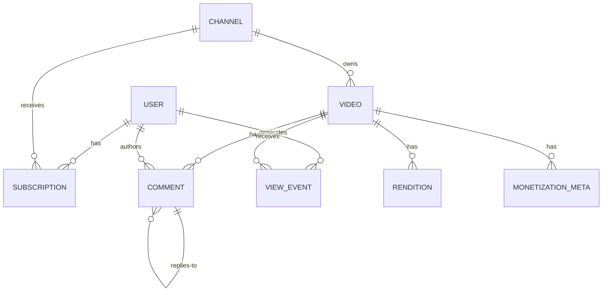
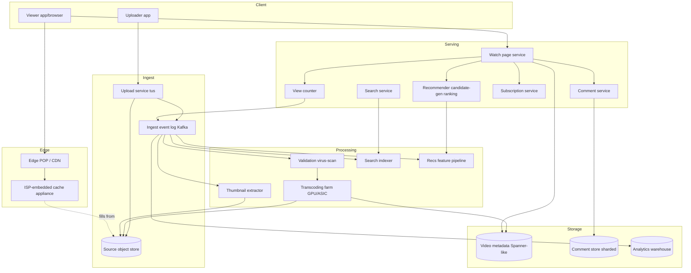

# Design YouTube — Upload, Transcoding, ABR, CDN, Recommendations, View Counting

**Date:** 2026-04-25 | **Updated:** 2026-04-25
**Tags:** `system-design` `case-study` `youtube` `video` `transcoding` `cdn`

## Table of Contents

- [Summary](#summary)
- [Functional Requirements](#functional-requirements)
- [Non-Functional Requirements](#non-functional-requirements)
- [Capacity Estimation](#capacity-estimation)
- [API Design](#api-design)
- [Data Model](#data-model)
- [High-Level Architecture](#high-level-architecture)
- [Deep Dive: Upload Pipeline](#deep-dive-upload-pipeline)
- [Deep Dive: Transcoding Fan-Out](#deep-dive-transcoding-fan-out)
- [Deep Dive: ABR Delivery (HLS / DASH / LL-HLS)](#deep-dive-abr-delivery-hls--dash--ll-hls)
- [Deep Dive: CDN Strategy](#deep-dive-cdn-strategy)
- [Deep Dive: View Counting](#deep-dive-view-counting)
- [Deep Dive: Comment System](#deep-dive-comment-system)
- [Deep Dive: Recommendations](#deep-dive-recommendations)
- [Deep Dive: Search](#deep-dive-search)
- [Deep Dive: Live Streaming](#deep-dive-live-streaming)
- [Deep Dive: Monetization](#deep-dive-monetization)
- [Bottlenecks & Trade-offs](#bottlenecks--trade-offs)
- [Anti-Patterns](#anti-patterns)
- [Related](#related)
- [References](#references)

## Summary

YouTube is the world's largest user-generated video platform: roughly 500 hours of video uploaded per minute, multi-billion daily views, sub-second startup latency, and global reach across constrained mobile links and gigabit fiber alike. The system must absorb a heavy **write path** (uploads, transcoding, indexing) while serving an asymmetric, fan-out-heavy **read path** (watch, recommendations, comments) from edge POPs that prefer to never miss the cache.

The core architectural moves are: (1) **chunked resumable upload** so flaky mobile uploads recover gracefully, (2) **massively parallel transcoding fan-out** that produces an adaptive ladder per source video plus modern codecs (H.264/VP9/AV1), (3) **adaptive bitrate delivery** via HLS/DASH manifests served from a **deeply embedded CDN** (Google's edge network, peering-rich and ISP-co-located like Netflix Open Connect), (4) **two-stage recommendations** (candidate generation → ranking) trained on watch-time as the optimization signal, and (5) **stateful view counting** that has to balance instant feedback for creators against fraud detection — the famous "stuck at 301 views" problem.

This doc is sized for a senior backend engineer prepping HLD interviews or onboarding to a video platform team. It assumes you understand sharding, replication, CDNs, Kafka-style logs, and basic ML serving.

## Functional Requirements

In scope:

| Capability | Notes |
|---|---|
| **Upload** | Resumable chunked upload up to ~256 GB / 12 hours per file; metadata edit; thumbnails; subtitles |
| **Watch** | ABR streaming; resume position; quality override; closed captions; speed control |
| **Search** | Keyword search across title/description/transcript; channel search; filters (date, duration, type) |
| **Comments** | Threaded comments (1-level reply nesting in the public UI); likes; pin; soft moderation; spam holdback |
| **Subscribe** | Channel subscription; subscription feed; notification opt-in |
| **Recommendations** | Home feed; up-next watch-page rail; "shorts" feed |
| **Monetization** | Pre-roll, mid-roll, post-roll ads; Super Chat for live; channel memberships; revenue share to creator |
| **Live streaming** | RTMP/SRT ingest; LL-HLS playback; live chat; DVR window; auto-archive to VOD |
| **Analytics** | Per-video views, watch-time, retention curves, traffic sources, demographics for creators |

Explicitly out of scope for this HLD: rights management deep dive (Content ID), Shorts vertical feed UX, Premium subscription billing, kids-mode policy, YouTube TV (linear), creator studio uploader UI specifics.

## Non-Functional Requirements

| NFR | Target |
|---|---|
| Read availability (watch path) | 99.95%+ regionally; degraded mode acceptable (lower bitrate, stale recs) over hard failure |
| Write availability (upload) | 99.9%; resumable so transient failures don't cost the user the upload |
| Video start time (P50) | < 1.0 s on broadband; < 2.5 s on 4G |
| Rebuffer ratio | < 0.5% of watch time |
| ABR ladder | At minimum 144p / 240p / 360p / 480p / 720p / 1080p; 1440p/2160p/4320p where source supports |
| Codec coverage | H.264 baseline for all (compat); VP9 for popular content; AV1 promoted by popularity tier |
| Live latency | RTMP ingest 15–45 s typical; LL-HLS 3–5 s when client/CDN supports it |
| Geographic reach | All inhabited continents; CDN POPs co-located inside ISP networks where possible |
| Durability of source masters | 11 nines (object storage class) — losing the upload master is unrecoverable |
| Data freshness for recs | Watch events visible to candidate generation within minutes; ranking model retrained daily |

## Capacity Estimation

Order-of-magnitude only — these are interview-grade napkin numbers, not Google internals.

**Daily active viewers**

```
DAU                 ≈ 2 × 10⁹
Avg watch time/DAU  ≈ 30 min/day
Total watch time    ≈ 10⁹ hours/day
```

**Upload rate**

```
~500 hours of video uploaded per minute
   = 30,000 hours/hour
   ≈ 720,000 hours/day
Avg source bitrate (mixed) ≈ 8 Mbps (1080p H.264-ish)
Source bytes/day ≈ 720,000 × 3600 × 8e6 / 8 = 2.6 PB/day raw uploads
```

**Storage growth (after transcoding fan-out)**

A typical encoding ladder produces roughly 6–8× the source size when you sum every renditions' bytes (multiple resolutions × multiple codecs × possibly two segment durations for LL-HLS). Modern per-title encoding tames this.

```
Encoded storage growth ≈ 2.6 PB × ~5 (effective amortized fan-out) ≈ 13 PB/day
Annual growth          ≈ ~5 EB/year of encoded content
```

This is why YouTube tiers transcoding by popularity: cold-tail uploads get only the cheap ladder; hits get the premium ladder including AV1.

**Egress bandwidth**

```
Aggregate watch    ≈ 10⁹ hr/day × 3600 s/hr = 3.6 × 10¹² s/day = 4.2 × 10⁷ s of video served per second average
Avg playback       ≈ 1.5 Mbps (mix of mobile and desktop, ABR-adjusted)
Egress avg         ≈ 4.2e7 × 1.5e6 / 8 ≈ 7.9 TB/s average
Peak (3× avg)      ≈ ~24 TB/s
```

These numbers are why **most egress must come from inside the ISP's network** (embedded caches), not from a centralized origin. You cannot move 24 TB/s out of a handful of datacenters across global transit links — both economically and physically.

**Read/write ratio**

```
Reads (views/day)  ≈ 5 × 10¹⁰  (10⁹ hr ÷ ~10 min avg view length × 8 fragments per session conservatively)
Writes (uploads)   ≈ ~5 × 10⁷ uploads/day
Read:Write ratio   ≈ 1000:1   (heavily read-skewed; design for read fan-out first)
```

## API Design

### Upload (resumable, tus-style)

```
POST   /api/v3/uploads
       Headers: Upload-Length, Upload-Metadata (title, channel, base64 KV), Tus-Resumable: 1.0.0
       → 201 Location: /api/v3/uploads/{upload_id}

HEAD   /api/v3/uploads/{upload_id}
       → 200, Upload-Offset: <bytes_received>

PATCH  /api/v3/uploads/{upload_id}
       Headers: Upload-Offset, Content-Type: application/offset+octet-stream
       Body: chunk bytes
       → 204, Upload-Offset: <new_offset>
```

Once `Upload-Offset == Upload-Length`, the upload service emits an `upload.completed` event onto the ingest pipeline. Clients may use the **Concatenation extension** of tus to upload N chunks in parallel and finalize with a `Final` upload that stitches them — this is how mobile apps achieve fast cellular uploads.

### Watch

```
GET /api/v3/videos/{video_id}
    → { id, title, description, channel, publishedAt, durationSec,
        statistics:{views,likes}, manifestUrl, captions:[…] }

GET https://manifests.ytcdn.com/{video_id}/master.m3u8
    → HLS master playlist (variant streams)

GET https://manifests.ytcdn.com/{video_id}/dash.mpd
    → DASH MPD
```

The manifest URL is signed and short-lived (HMAC token bound to viewer IP region + expiry). The master playlist references variant playlists per quality; variant playlists reference 2–6 s media segments delivered by edge caches.

### Comments

```
GET  /api/v3/videos/{video_id}/comments?cursor=...&order=top|newest
POST /api/v3/videos/{video_id}/comments  { text, parentId? }
POST /api/v3/comments/{comment_id}/like
DELETE /api/v3/comments/{comment_id}     (creator/mod only)
```

Cursor-based pagination over a (videoId, ranking_score, comment_id) compound key — never offset pagination at this scale.

### Subscriptions / Likes

```
POST   /api/v3/channels/{channel_id}/subscribe
DELETE /api/v3/channels/{channel_id}/subscribe
POST   /api/v3/videos/{video_id}/like     { value: 1 | -1 | 0 }
```

### Recommendations

```
GET /api/v3/feed/home
GET /api/v3/videos/{video_id}/up-next
```

Server returns a ranked list of `{video_id, score, debug_signals?}`. The client never sees the candidate-generation slate, only the ranked top-N.

## Data Model



**video** (sharded by `video_id`)

```
video_id          BYTES PK    // base64-ish, ~11 chars in URL
channel_id        BYTES
title             TEXT
description       TEXT
duration_sec      INT
status            ENUM(processing, public, unlisted, private, removed)
published_at      TIMESTAMP
master_object_id  BYTES       // pointer to source in object store
search_doc_version INT
```

**rendition** (one row per (video_id, codec, resolution, container))

```
video_id, codec, resolution, container  // composite PK
manifest_url       TEXT
avg_bitrate_kbps   INT
file_size_bytes    BIGINT
created_at         TIMESTAMP
```

**channel**

```
channel_id        BYTES PK
owner_user_id     BYTES
display_name      TEXT
sub_count_cached  BIGINT      // periodically reconciled, not source of truth
created_at        TIMESTAMP
monetization_tier ENUM(none, ypp, partner)
```

**comment** (sharded by `video_id` so a single video's comment thread lives on one shard)

```
comment_id        BYTES PK
video_id          BYTES
parent_id         BYTES NULL
author_user_id    BYTES
text              TEXT
ranking_score     FLOAT       // for "Top comments" sort
moderation_state  ENUM(visible, holdback, hidden, removed)
created_at        TIMESTAMP
```

**subscription** (small row, hot read path)

```
subscriber_user_id, channel_id  // composite PK
subscribed_at  TIMESTAMP
notify_level   ENUM(none, personalized, all)
```

**view_event** (append-only, write-mostly — Kafka topic + ClickHouse/BigQuery)

```
event_id         UUID
video_id         BYTES
viewer_user_id   BYTES NULL    // null for anon
session_id       BYTES
ts               TIMESTAMP
watch_ms         INT
position_ms      INT
quality          STRING
client_ip_hash   BYTES         // hashed for dedup, not stored raw
device_class     STRING
```

**monetization_meta**

```
video_id          BYTES PK
ad_eligible       BOOL
ad_categories     STRING[]
midroll_cuepoints INT[]        // seconds
content_id_match  STRING NULL  // copyrighted segment claim
revenue_share_pct INT          // standard 55 to creator post-fee
```

## High-Level Architecture



The watch-page request hits a regional app server that fans out in parallel to: metadata lookup, recommendations, comment first-page, and view-count increment. Manifest and segments are served from edge caches that pre-fill from the source object store.

## Deep Dive: Upload Pipeline

### Why resumable matters

A 4 GB phone upload over LTE has a non-trivial chance of dropping mid-stream. Without resumability, the user re-uploads from byte zero every time — unusable. The **tus.io resumable upload protocol** standardizes this: client `POST`s a creation request advertising total length, then `PATCH`es bytes at offsets, and can `HEAD` to discover the server's last-received offset after a network blip.

```
Client              Upload-Service           Object-Store
  |   POST /uploads (Length=4GB, metadata)   |
  |--------------------------------->|       |
  |   201 Location: /uploads/abc123  |       |
  |<---------------------------------|       |
  |   PATCH /uploads/abc123 Offset=0 |       |
  |   [chunk 0..16MB)                |       |
  |--------------------------------->|--->writeChunk
  |   204 Upload-Offset=16MB         |       |
  |<---------------------------------|       |
  |  ✗ network drop                  |       |
  |   HEAD /uploads/abc123           |       |
  |--------------------------------->|       |
  |   200 Upload-Offset=16MB         |       |
  |<---------------------------------|       |
  |   PATCH offset=16MB ...          |       |
```

Tus mandates a minimum chunk size of 5 MiB (matches S3 multipart-upload minimum) so backends can stream chunks straight into multipart parts of an object store. The **Concatenation extension** lets the client upload N chunks in parallel onto separate URIs and finalize them into one logical upload — useful when the bottleneck is per-connection throughput rather than total bandwidth.

### Validation gate

Before transcoding spends a single GPU cycle, every upload runs through:

1. **Format probe** (ffprobe-equivalent) to confirm the file is decodable. Quarantine garbage early.
2. **Virus / malware scan** on the raw bytes (signatures + heuristics).
3. **Hash-and-lookup** for known infringing fingerprints (Content ID hash). A pre-emptive match here can short-circuit the pipeline.
4. **Policy classifier** (ML) for obvious banned categories — sexually explicit, violent gore, child safety triggers — before the video is ever published.

Only on pass does the pipeline emit `upload.validated` onto Kafka, fanning into transcoding, thumbnail extraction, search indexing, and analytics feature pipelines in parallel.

## Deep Dive: Transcoding Fan-Out

The source master is one file. The watch path needs many: across resolutions (144p–4320p), codecs (H.264, VP9, AV1), and container/segment formats (HLS .ts, fMP4, DASH segments, possibly LL-HLS short segments). For one popular upload that's easily **30+ output renditions**.

### Encoding ladder

A naive ladder picks fixed (resolution, bitrate) pairs. A modern **per-title** encoding ladder analyzes the source's complexity (motion, grain, cuts) and emits a custom ladder — a talking-heads vlog gets a leaner ladder than a 4K nature documentary. This is purely a cost optimization but at YouTube's scale it's enormous.

```
Source (10 GB, 4K HDR, ProRes-ish proxy)
       │
       ▼
   [scene split + complexity analyze]
       │
       ▼
   ┌────────────┬────────────┬────────────┬────────────┐
   │  H.264     │  H.264     │   VP9      │   AV1      │
   │  144p      │  ...       │   1080p    │   1080p    │
   │  240p      │  1080p     │   2160p    │   2160p    │
   │  480p      │  1440p     │   4320p    │  (popular) │
   │  720p      │  2160p     │            │            │
   └────────────┴────────────┴────────────┴────────────┘
       │  per (codec, resolution): segment + manifest
       ▼
   Object store + CDN pre-fill
```

### Parallelism strategy

A single 4-hour 4K source is split into **GOP-aligned chunks** (typically 2–10 s each) and each chunk is encoded **independently** on a worker. A coordinator stitches the encoded chunks into the final per-rendition output. This shards the encoding job from "one 4-hour serial encode" into thousands of independently-scheduled tasks across a GPU/ASIC farm — the same pattern as MapReduce, applied to video.

GOP alignment matters because adaptive bitrate switching only happens at IDR (key) frame boundaries; if chunks aren't GOP-aligned, the player can't switch quality mid-segment.

### Codec tiering by popularity

Encoding AV1 in software costs an order of magnitude more CPU than H.264. YouTube reserves the expensive codecs for content that will recoup the cost in saved egress:

| Tier | Trigger | Codecs produced |
|---|---|---|
| Cold | All uploads on publish | H.264 baseline ladder |
| Warm | After ~10⁴ views | + VP9 |
| Hot | After ~10⁶ views, or upload from a known-popular channel | + AV1 |

The bandwidth savings on a viral video easily justify a hardware AV1 re-encode. A long-tail upload that gets 50 views never gets the AV1 treatment — it's cheaper to ship the slightly larger H.264 bytes.

### Hardware acceleration

At YouTube's scale, software encoders on commodity CPUs are not viable. YouTube has publicly described **VCU (Video Coding Unit)** custom ASICs designed specifically for this transcoding workload, claiming order-of-magnitude perf-per-watt improvements over CPU encoding for the heavy codecs.

## Deep Dive: ABR Delivery (HLS / DASH / LL-HLS)

The viewer's player adapts quality every few seconds based on measured throughput, buffer level, and CPU. Two manifest formats dominate.

### HLS (HTTP Live Streaming)

Apple-defined; specified in **RFC 8216**. The master playlist (`.m3u8`) lists variant streams; each variant has its own playlist enumerating media segments (.ts or fMP4):

```
#EXTM3U
#EXT-X-VERSION:7
#EXT-X-STREAM-INF:BANDWIDTH=2500000,RESOLUTION=1280x720,CODECS="avc1.4d401f"
720p/index.m3u8
#EXT-X-STREAM-INF:BANDWIDTH=5500000,RESOLUTION=1920x1080,CODECS="avc1.640028"
1080p/index.m3u8
#EXT-X-STREAM-INF:BANDWIDTH=12000000,RESOLUTION=3840x2160,CODECS="av01.0.13M.08"
2160p_av1/index.m3u8
```

```
720p/index.m3u8
#EXTM3U
#EXT-X-TARGETDURATION:6
#EXT-X-MEDIA-SEQUENCE:0
#EXTINF:6.0,
seg00000.ts
#EXTINF:6.0,
seg00001.ts
...
#EXT-X-ENDLIST
```

### DASH (MPEG-DASH)

ISO/IEC 23009-1 standard. Manifest is XML (`.mpd`) describing **periods → adaptation sets → representations → segments**. Codec-agnostic and patent-licensed differently than HLS, which is why DASH is preferred outside the Apple ecosystem.

In practice YouTube serves both: DASH to web/Android, HLS to iOS/tvOS. A single source produces both manifests over the same underlying segment files when CMAF (Common Media Application Format) is used — fMP4 segments shared across both manifest types.

### Quality adaptation

Player-side ABR algorithms (BOLA, MPC, throughput-based) decide which variant to fetch next. Key inputs:

- Current buffer occupancy (low → switch down aggressively)
- Estimated throughput from recent segment fetches
- Screen size and CPU capability (no point streaming 4K to a 480p viewport)
- User's manual override ("force 720p")

### LL-HLS for live

Classic HLS adds 20–60 s of latency: the player must wait for full segments to be packaged and listed in the playlist. **Low-Latency HLS** (drafted into the HLS 2nd-edition spec) introduces:

- **Partial segments** (~200 ms each) advertised before the full segment is closed.
- **Blocking playlist reload** — the client requests the playlist at a sequence number not yet published, and the server holds the request open until it can respond.
- **Preload hints** so the client can issue a request for the next partial before the playlist confirms it.

Net result: 3–5 s glass-to-glass latency, bridging the gap between RTMP/WebRTC and traditional HLS without giving up CDN cacheability.

## Deep Dive: CDN Strategy

You cannot serve YouTube's egress from a few datacenters. The architecture has three layers:

```
[Origin: source masters + canonical encoded renditions]
            │
            │  pre-position on schedule (off-peak fill)
            ▼
[Regional cache fleet — peering-rich edge POPs]
            │
            │  fill on miss; eventual prefetch for trending
            ▼
[ISP-embedded appliances — inside the ISP's network, often inside the metro]
            │
            ▼
[Subscriber's last-mile link]
```

### ISP-embedded caches

Same model Netflix popularized with **Open Connect Appliances**: bake commodity 1U/2U boxes packed with NVMe and 10/100/400G NICs, ship them free of charge to qualifying ISPs, and let them pre-load with the most popular content during off-peak hours. Google's edge network does the equivalent for YouTube.

Why ISPs accept these boxes: they save the ISP transit costs (egress they'd otherwise pay for) and improve customer-perceived video quality. Why YouTube/Netflix love it: ~95% of streaming traffic never crosses the public internet backbone for the consumer-facing leg.

### Content placement / pre-positioning

Not every video lives on every cache. Placement strategy:

- **Tail content** (most uploads): served from regional caches on demand, fetched from origin on miss.
- **Trending content**: predictively pushed to embedded appliances **before** the viral curve takes off — recommendations system feeds the CDN scheduler signals about what's about to spike.
- **Popular catalog content**: rotated through embedded appliances daily based on locality (a Spanish-language hit gets pushed to LATAM caches first).

### Manifest vs segment caching

Manifests are small and short-lived: cached briefly at edge with short TTL because they may rev when new renditions complete. Segments are large, immutable, and content-addressable: cache forever, key on URL hash.

### Token-signed URLs

Manifests are signed with a short-lived HMAC bound to viewer IP/region. Geo-blocked content (rights-restricted) is enforced at the edge by validating the token before serving the manifest. Segments themselves are not individually signed (too much edge CPU for too little benefit) — the security boundary is at manifest fetch time.

## Deep Dive: View Counting

Counting views looks trivial. It is not. The product requires:

1. **Instant feedback for the creator** — they want to see "1, 2, 3 views" as their video gains traction.
2. **Honest counts shown publicly** — bot farms, click farms, and organic refreshing all need to be deduplicated.
3. **Eventual consistency at scale** — there is no row-locking a global counter for 5 × 10¹⁰ daily increments.

### The two-phase approach

YouTube famously displayed "301+ views" for years before reconciliation. The mechanism (paraphrased; YouTube has not publicly disclosed exact internals):

- **Phase 1: fast count, capped.** From upload to ~300 views, every play increments a fast in-memory counter (Memcached / regional counter shard). The displayed count tracks this counter with sub-second latency. The cap of ~300 is a heuristic — below this threshold, fraud is a rounding error and freshness wins.
- **Phase 2: locked verification.** At ~300 views the public counter is **frozen** at "301" while the verification pipeline runs. Each `view_event` is now run through a fraud filter:
  - Cookie / device-fingerprint dedup (one cookie counts once per N hours).
  - IP rate limiting (no more than K views per /24 per minute on the same video).
  - Watch-time threshold (a "view" requires ~30 s of actual playback; the player reports back).
  - Behavioral models (does this session look like a bot — no mouse movement, no scroll, perfect timing?).
- **Phase 3: batch consolidation.** Verified views are tallied and the public count is unfrozen, periodically updated from the analytics warehouse rather than from the live event stream. Creators see the verified count climb.

### Architecture

```
Player heartbeat ──► Edge view-event collector ──► Kafka(view_events)
                                                        │
                                            ┌───────────┼─────────────┐
                                            ▼           ▼             ▼
                                  fast counter    fraud filter   warehouse
                                  (Memcached)     (Flink job)    (BigQuery)
                                       │              │              │
                                       └──► public counter ◄─────────┘
```

The fast counter gives sub-second freshness for low-view videos; the warehouse gives auditable verified counts for high-view videos. The "fraud filter" stage is the actual hard problem — it's an evolving ML system, not a fixed set of rules.

### Why ~300 specifically (historically)

Below ~300, the absolute fraud impact is small (a creator can't meaningfully monetize 50 fake views), so optimize for freshness. Above 300, monetization, recommendations, and reputational signals start to depend on the count, so optimize for honesty. The threshold has reportedly evolved and is no longer a hard "301" but the two-phase pattern remains.

## Deep Dive: Comment System

### Sharding

Comments are sharded by `video_id`. All comments and replies for one video live on one shard. This makes the canonical query — "first page of comments for video X" — a single-shard read with no scatter-gather.

Trade-off: a video that goes viral with 1M+ comments creates a hot shard. Mitigation: replicate the hot shard's primary across multiple read replicas; cache the top-K comments aggressively at the edge keyed on `(video_id, sort_order, page_token)`.

### Threading

Public YouTube allows only **one level** of nesting (replies to top-level comments, no replies-to-replies in the displayed UI). This is a deliberate UX simplification that also caps the depth of any thread query — `parent_id` is either NULL or a top-level comment ID.

### Ranking

Top comments are sorted by a learned `ranking_score` combining:

- Like count (with time decay)
- Reply count
- Author signals (creator's reply, channel-verified author)
- Anti-spam signals (recent account, low-effort text)
- Watch-time impact (do users who read this comment watch longer?)

### Holdback / moderation

Comments enter the system in `holdback` state if they trip an anti-spam classifier or contain words on the creator's blocklist. They're invisible to the public but visible to the creator in the moderation queue. This decouples publication from comment ingestion — creators see the abuse attempt but the audience never does.

## Deep Dive: Recommendations

The 2016 paper *Deep Neural Networks for YouTube Recommendations* (Covington, Adams, Sargin) defined the public reference architecture: **two-stage** recall + ranking.

### Stage 1: Candidate generation

Goal: from a corpus of billions of videos, narrow to ~hundreds of plausible candidates per user in tens of milliseconds.

Approach (per the paper):
- Each video gets a high-dimensional embedding learned from co-watch and co-search behavior (analogous to word2vec for videos).
- The user is represented by a **fixed-size** vector aggregating their watch history embeddings, search-token embeddings, demographic features, and geographic/device features.
- The model is trained as a multi-class classification: "given this user state, which video did they watch next?"
- At serve time the user vector is computed once per request; candidates are retrieved by **approximate nearest neighbor** (ScaNN or similar) in the video embedding space.

This is essentially **learned retrieval**: the embedding space encodes "users who watched X tend to also watch Y" without needing to enumerate co-watch pairs.

### Stage 2: Ranking

Goal: from the ~hundreds of candidates, score each against this specific user-context pair and return a sorted list.

- A separate deep neural network, richer feature set (impression context, user × video cross features, device, time-of-day, prior interactions with this video/channel).
- The optimization target is **expected watch time**, not click-through. A video the user clicks but immediately abandons is a worse recommendation than one they watch to completion. The paper formalizes this as weighted logistic regression where the positive examples are weighted by observed watch time.
- The output is a per-impression score; videos are sorted and the top-N returned.

### Why two stages

A single-stage "score every video against every user" is ~10⁹ × 10⁹ = 10¹⁸ operations per recommendation refresh. Infeasible. Two-stage cuts the ranking cost to N_users × N_candidates ≈ 10⁹ × 10² per cycle, with the cheap-but-imprecise candidate-generation stage doing the broad filter.

### Watch-time as signal

Optimizing for clicks rewards clickbait. Optimizing for watch time rewards videos people actually consume — and is harder to game because completion behavior is harder to fake than clicks. This single decision shaped a decade of platform behavior.

### Freshness pipeline

User-event log → feature store (online + offline) → candidate generation index updated near-real-time → ranking model retrained daily on the previous day's logged impressions and outcomes.

## Deep Dive: Search

Search has a similar shape to recs but the user's query is explicit.

### Index layers

1. **Inverted index** over title, description, channel name, manually-entered tags. Lucene/Elasticsearch-style postings lists, sharded by document.
2. **Transcript index** over auto-generated captions — searchable spoken content. Lower-weight than title/description in ranking but enormous for niche queries.
3. **Embedding index** for semantic search. A BERT-style encoder embeds queries and video metadata; ANN lookup catches "videos about jet engines" matching a video titled "How a turbofan works." Modern YouTube search blends keyword and semantic results.

### Ranking

Classical TF-IDF / BM25 features feed a learned ranker that also incorporates:

- View count, like ratio, watch-time-per-view (popularity signals).
- Channel authority, freshness, language match.
- Personalization: the same query from two users returns different orders based on their history.

### Index update path

`upload.validated` event → indexer reads metadata → builds doc → publishes to a primary index shard → near-real-time replication to query replicas. Median time from publish to searchable: minutes, not hours.

## Deep Dive: Live Streaming

### Ingest

Creators push live with **RTMP** or **SRT** to a YouTube ingest endpoint:

```
rtmp://a.rtmp.youtube.com/live2/{stream_key}
```

RTMP is 1990s-vintage but dominant because every encoder (OBS, hardware encoders, mobile apps) speaks it. The ingest server authenticates the stream key, accepts the H.264/AAC stream, and pipes it into the live transcoding pipeline.

### Real-time transcoding

The ingest stream is one resolution at one bitrate. The platform must produce a live ABR ladder in real time. This is the same fan-out problem as VOD transcoding but with a hard wall-clock deadline: a 6 s segment must be encoded in < 6 s or the pipeline falls behind. GPU/ASIC encoders are mandatory at scale.

### Distribution

Transcoded segments are written into HLS and DASH manifests in near-real-time. **LL-HLS** with partial segments achieves 3–5 s viewer latency. The CDN treats live manifests as short-TTL (seconds) and live segments as immutable.

### Live chat

Reuses the platform's real-time messaging infrastructure (long-poll/WebSocket fan-out service). Chat messages are sharded by `live_stream_id`. Super Chat (paid messages) runs through the payments path before being injected into the chat stream.

### DVR window

Viewers joining a live stream can rewind up to ~12 hours. The DVR window is just a sliding window of the same segments served to the live edge of the manifest — no separate storage path.

### Auto-archive

When the stream ends, the accumulated segments are concatenated into a VOD master, re-transcoded with the higher-quality VOD ladder, and the live URL transparently transitions to the VOD URL. The viewer experience is seamless; the watch URL doesn't change.

## Deep Dive: Monetization

### Ad insertion

Pre-roll, mid-roll, post-roll ads are stitched into the manifest. Two implementations:

- **Server-side ad insertion (SSAI):** the ad is concatenated into the manifest's segment list at packaging time; from the player's perspective ad and content are one continuous stream. Better completion rates, harder to ad-block.
- **Client-side ad insertion (CSAI):** the player calls an ad decision service (VAST/VMAP), fetches the ad creative separately, and switches manifests. More flexible targeting; easier to skip/block.

YouTube uses a mix; mobile apps favor SSAI for completion, web favors CSAI for targeting flexibility.

### Mid-roll cuepoints

Long videos (8+ minutes traditionally) get mid-roll ad slots. The creator picks cuepoints (or the platform auto-detects scene boundaries — never insert an ad mid-sentence). Cuepoints are stored on the `monetization_meta` row and the ad decisioning service consults them at playback.

### Ad auction

For each impression slot, an internal auction runs against eligible ad campaigns: budget remaining, targeting match, quality score, bid. The winner's creative is served. This is its own subsystem (closer to a search-ads or display-ads stack than to a video stack) and deserves its own HLD.

### Revenue share

Standard YouTube Partner Program split is roughly 55% to the creator after platform fee, paid monthly via the ad-revenue ledger. The creator dashboard shows estimated daily earnings (eventually consistent — the audited monthly statement is the source of truth).

### Content ID

Uploaded videos are fingerprinted against a rights-holder catalog (audio + video hashes). Matches can be configured to: block playback, monetize on behalf of the rights holder (creator gets nothing), or share revenue. Content ID is its own multi-petabyte fingerprint matching system.

## Bottlenecks & Trade-offs

| Concern | Pressure point | Trade-off chosen |
|---|---|---|
| Egress bandwidth | Centralized origin cannot serve global watch traffic | ISP-embedded caches; ~95% of traffic served inside ISP networks |
| Transcoding cost | Encoding every upload to every codec is uneconomic | Tiered encoding by popularity; AV1 only for hits |
| View count freshness vs honesty | Instant counts invite fraud; honest counts are slow | Two-phase: fast count below ~300, frozen verification phase, then warehouse-backed |
| Hot shard on viral video | One viral video's comments / views overwhelm one shard | Read replicas, edge cache for top-K comments, write coalescing for view counter |
| Recs latency vs quality | Scoring 10⁹ videos per request is impossible | Two-stage: ANN candidate generation + DNN ranking on ~100s |
| Live latency vs reliability | RTMP→HLS chain has ~30 s baseline latency | LL-HLS with partial segments for 3–5 s; classic HLS as fallback |
| Storage of all renditions | Naive ladder is 10× source; multiplied across ~10⁹ videos | Per-title encoding ladder; aggressive cold-tier policy for long-tail content |
| Search index freshness | Newly uploaded videos must appear in search quickly | Near-real-time indexer with eventually-consistent secondary replicas |

## Anti-Patterns

- **Synchronous transcoding on the upload request.** Even a 30 s mobile clip can take minutes to transcode to a full ladder. Always async via a job queue.
- **Storing view counts in a single row with a global lock.** No relational DB will survive 10⁵+ writes/sec on one row. Shard, or use a counter service designed for this (e.g., counting Bloom filters + reconciliation jobs).
- **One CDN, one provider, one region.** Single-CDN architectures cannot meet YouTube's reach or resilience requirements. Multi-CDN with origin failover is table stakes.
- **Caching segments with short TTL.** Segments are content-addressable and immutable; cache them effectively forever. Apply short TTLs only to manifests.
- **Recommending purely on click-through.** Optimizes for clickbait, degrades long-term retention. Optimize on watch time or explicit positive signals (likes, completed views).
- **Scatter-gather for comment threads.** Don't shard comments by `comment_id` if your dominant query is "all comments for video X" — that turns one query into a fan-out across every shard. Shard by `video_id`.
- **No fraud window for view counting.** Without a verification phase, view counts become a competitive signal that is trivially gameable, polluting recommendations downstream.
- **Manifest-rewrite per request.** Every personalization decision (ad insertion, geo-block, language preference) can tempt you to render the manifest dynamically per request. This kills cacheability. Push personalization to the player or to a small wrapper manifest that references heavily-cached variants.
- **Treating live and VOD as separate systems with separate APIs.** They share segment formats, manifests, transcoding, and CDN. The seam should be at the ingest layer, not the playback layer.

## Related

- [`design-netflix.md`](./design-netflix.md) — closely related; Netflix is VOD-only, OTT-focused, with a cleaner content catalog (no UGC) but the CDN, transcoding, and ABR concerns overlap heavily. Comparing the two is the fastest way to internalize "what's general about media streaming" vs "what's specific to UGC."
- [`design-spotify.md`](./design-spotify.md) — same delivery shape (manifests, segments, CDN, recs) but for audio. Smaller payloads, longer sessions, no transcoding ladder of nearly the same complexity. The recommendations split (candidate gen + ranking) is structurally similar.
- [`../../scalability/sharding-strategies.md`](../../scalability/sharding-strategies.md) — the comment-by-video and view-event-by-video sharding choices in this doc are direct applications of those patterns.
- [`../../scalability/read-write-splitting-and-cache-strategies.md`](../../scalability/read-write-splitting-and-cache-strategies.md) — the manifest/segment caching policy and the metadata-replica fan-out for watch pages.
- [`../../async/`](../../async/) — the upload → transcode → index pipeline is a textbook event-driven workflow.

## References

- Covington, P., Adams, J., & Sargin, E. (2016). [*Deep Neural Networks for YouTube Recommendations*](https://research.google/pubs/deep-neural-networks-for-youtube-recommendations/). RecSys '16.
- Apple. [HTTP Live Streaming developer site](https://developer.apple.com/streaming/) and [HLS Authoring Specification for Apple Devices](https://developer.apple.com/documentation/http-live-streaming/hls-authoring-specification-for-apple-devices).
- Pantos, R., & May, W. (2017). [RFC 8216 — HTTP Live Streaming](https://datatracker.ietf.org/doc/html/rfc8216). IETF.
- Pantos et al. [HTTP Live Streaming 2nd Edition (draft-pantos-hls-rfc8216bis)](https://datatracker.ietf.org/doc/draft-pantos-hls-rfc8216bis/) — covers LL-HLS partial segments and blocking playlist reload.
- ISO/IEC. [ISO/IEC 23009-1:2022 — Dynamic Adaptive Streaming over HTTP (DASH), Part 1: Media presentation description and segment formats](https://www.iso.org/standard/83314.html). [Spec overview at MPEG.org](https://www.mpeg.org/standards/MPEG-DASH/).
- tus working group. [tus.io resumable upload protocol 1.0.x](https://tus.io/protocols/resumable-upload) and [draft IETF Resumable Uploads Protocol](https://www.ietf.org/archive/id/draft-tus-httpbis-resumable-uploads-protocol-00.html). Reference server: [tusd](https://github.com/tus/tusd).
- YouTube Engineering. [Reimagining video infrastructure to empower YouTube](https://blog.youtube/inside-youtube/new-era-video-infrastructure/) — covers VCU ASICs and transcoding at scale.
- Google for Developers. [YouTube Live Streaming Ingestion Protocol Comparison](https://developers.google.com/youtube/v3/live/guides/ingestion-protocol-comparison) — RTMP/SRT/HLS ingest characteristics.
- Netflix. [Open Connect Overview (PDF)](https://openconnect.netflix.com/Open-Connect-Overview.pdf) — canonical reference for ISP-embedded CDN appliances; YouTube's edge is conceptually similar.
- APNIC Blog. [Netflix content distribution through Open Connect](https://blog.apnic.net/2018/06/20/netflix-content-distribution-through-open-connect/) — independent overview of the embedded-cache model.
