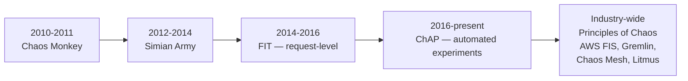
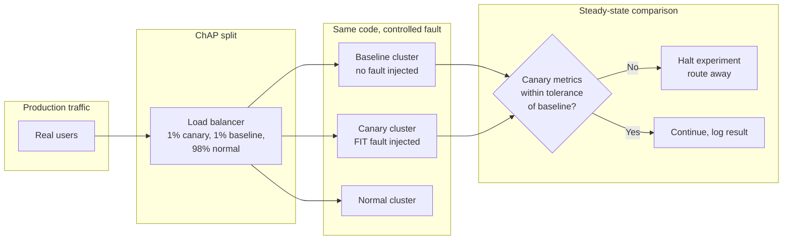

# Netflix Deep Dive — Chaos Engineering

**Date:** 2026-04-29 | **Updated:** 2026-04-29
**Tags:** `system-design` `case-study` `netflix` `deep-dive` `chaos-engineering` `reliability`

## Table of Contents

- [Summary](#summary)
- [Overview](#overview)
- [Chaos Monkey Origin](#chaos-monkey-origin)
- [Simian Army](#simian-army)
- [Principles of Chaos](#principles-of-chaos)
- [FIT — Failure Injection Testing](#fit--failure-injection-testing)
- [ChAP — Chaos Automation Platform](#chap--chaos-automation-platform)
- [Steady-State Hypothesis](#steady-state-hypothesis)
- [Experiment Scoping — Variation and Blast Radius](#experiment-scoping--variation-and-blast-radius)
- [Production vs Staging](#production-vs-staging)
- [Observability Prerequisites](#observability-prerequisites)
- [Post-Mortem Culture](#post-mortem-culture)
- [Failure Modes Chaos Surfaces](#failure-modes-chaos-surfaces)
- [Anti-Patterns](#anti-patterns)
- [What Chaos Engineering Buys Netflix](#what-chaos-engineering-buys-netflix)
- [Related](#related)
- [References](#references)

## Summary

Chaos engineering as a discipline did not exist before Netflix. It was invented during the company's 2010–2011 migration from on-premise data centers to AWS, when the engineering team realized they had moved onto infrastructure where instances would die without warning and there was no way to predict it. The pragmatic answer was to make instance death so routine — by killing instances on purpose, in production, every weekday — that no team could afford to build a service that did not survive it. That was Chaos Monkey.

What started as a single tool grew into the **Simian Army** (a fleet of failure-injecting agents), then matured into **FIT (Failure Injection Testing)** for request-level fault injection, and finally into **ChAP (Chaos Automation Platform)**, a hypothesis-driven experiment runner integrated with Netflix's deployment platform. Along the way, Netflix engineers — together with peers from companies adopting the practice — co-authored the [Principles of Chaos](https://principlesofchaos.org/), which codified the discipline as steady-state hypothesis, varied real-world events, production execution, continuous automation, and minimized blast radius.

The intellectual contribution that puts chaos engineering on this short list of Netflix-invented disciplines is that it reframed reliability work from *design effort* to *experimental verification*. Before chaos, resilience was something you argued about in design reviews and hoped you got right. After chaos, resilience is a property you continuously measure with experiments that produce falsifiable results. That reframing — from design intent to experimental verification — is what makes chaos engineering more than a clever tool; it is a methodological commitment that has reshaped how production-grade software organizations think about reliability.

This document is the deep-dive companion to the Chaos Engineering subsection of [`../design-netflix.md`](../design-netflix.md). For the language-agnostic discipline (game days, blast radius, abort criteria, tools), see [`../../../reliability/chaos-engineering-and-game-days.md`](../../../reliability/chaos-engineering-and-game-days.md).

## Overview

There is a useful framing to begin with. Most reliability work in software companies is *prophylactic* — engineers design retries, timeouts, replicas, fallbacks, and redundancy because they imagine failure modes and try to handle them in advance. Most reliability work in software companies is also *unverified* — the team designs the prophylactic and then never tests it, or tests it once at ship time, because testing it is hard, requires production conditions, and has a non-trivial chance of causing the very outage the prophylactic was meant to prevent. This combination — prophylactic-but-unverified — produces resilience that exists on paper and dissolves when needed. Chaos engineering's central move is to *demand verification* and to invent the tooling and culture that makes verification routine and safe.

Three observations frame why Netflix specifically — and not, say, a bank — invented this practice:

1. **Streaming has a cost asymmetry of seconds.** When a viewer presses Play, the system has roughly a second of patience before the experience visibly degrades. There is no graceful "please wait, we're failing over." Either the manifest URL works and bytes start flowing, or the user is annoyed. That tight budget meant Netflix had to confront the long tail of distributed failure modes earlier than most.
2. **AWS migration was an ongoing exposure.** Between 2008 (the famous database corruption that took the DVD-shipping system down for three days) and 2011, Netflix was deliberately moving onto a substrate where instances disappear without warning. The migration was a forcing function — *every* service had to handle EC2 instance loss, or the move would fail.
3. **Active-active across regions was an aspiration, not a property.** You cannot test a regional failover by reading a runbook. You can only test it by causing one. Chaos Monkey scaled into Chaos Gorilla (AZ kill) and Chaos Kong (region kill) precisely because the only way to know whether a regional failover *actually* worked was to do it on purpose during business hours.

The result is a discipline that is now industry standard. AWS sells a managed Fault Injection Service. CNCF hosts Chaos Mesh and Litmus. Banks, payment processors, and SaaS companies run game days. The vocabulary — steady-state, blast radius, hypothesis, abort criteria — comes from Netflix's experience writing it down.

It is worth noting what the discipline is *not*. It is not stress testing — stress testing pushes a system to its load limits, which is a different question. It is not failure-mode-and-effect analysis (FMEA) — FMEA is an analytical exercise where engineers imagine failure modes and reason about consequences. It is not penetration testing — pen testing looks for security vulnerabilities. Chaos engineering is the discipline of deliberately injecting realistic faults into running systems and measuring whether the system continues to satisfy its customer-facing contracts. It complements all of the above; it replaces none of them.



A note on positioning. Chaos engineering is not the *only* reliability practice Netflix invented or championed — circuit breakers (Hystrix), bulkheads, fallback hierarchies, fast-fail RPC budgets, regional traffic steering, EVCache cross-region invalidation, Active-Active for the control plane — all of these are part of the same intellectual lineage. What sets chaos engineering apart is that it is the **verification layer** for everything else. Hystrix is a circuit breaker; chaos engineering is the discipline that proves your circuit breaker actually opens when the dependency dies. Bulkheads are an isolation pattern; chaos engineering is what tells you whether your bulkheads actually contain the blast. Active-Active is an architecture; Chaos Kong is what tells you whether the architecture survives a region loss. Read this document with that lens — every tool below is either a way to inject a real-world fault or a way to verify a hypothesis about how your real system responds.

## Chaos Monkey Origin

The story Netflix tells most often: in 2008, a database corruption took down DVD shipping for three days. The post-mortem was unambiguous — the system had a single point of failure that nobody had tested for, because testing for it required intentionally breaking the database. By 2010, the company was migrating to AWS, where SPOFs would be cheap to introduce and impossible to predict — EC2 instances die, AZs lose connectivity, regions hiccup. The team needed an answer that did not rely on engineers thinking ahead about every failure mode.

Chaos Monkey was that answer:

- A scheduled job that wakes up during weekday business hours.
- It picks a service, then picks one of that service's running EC2 instances at random.
- It calls the EC2 API and terminates the instance.
- It repeats, daily, for every service that opts in.

The design choices were deliberate:

- **Business hours only.** If something breaks, the team that owns the service is awake to see it. A 3am instance kill is just an outage.
- **Production, not staging.** Staging does not have real traffic, real call patterns, real cross-service load. The goal was to find real bugs, which only exist in real load.
- **One instance at a time.** The blast radius is the smallest unit of failure that EC2 actually delivers. Killing many instances at once is a different (larger) experiment.
- **Opt-in.** Teams enable Chaos Monkey on their services. Top-down mandates breed resentment; opt-in makes it cultural.

The forcing function worked. Within a couple of years, every service Netflix ran on AWS was, by construction, resilient to single-instance loss — because if it was not, Chaos Monkey would have already broken it during business hours and the on-call engineer would have fixed it. Single-instance kill went from "scary failure mode" to "uninteresting daily background event."

The cultural shift this caused inside Netflix is harder to reproduce than the tool itself. Engineers stopped writing "what if this instance dies?" comments because the answer was self-evident — the system already handled it, every day, without paging anyone. Architecture reviews stopped including "single point of failure" as a discussion item below the cluster level, because clusters that had SPOFs would not have survived the previous week. The chaos discipline collapsed a category of design conversation into a routine operational artifact. That is what people mean when they say "Chaos Monkey changed how Netflix builds software": not that engineers think about failure more, but that they have to think about a much narrower band of failure modes because the boring ones are continuously and automatically eliminated.

The 2011 announcement and the 2012 open-source release ("[The Netflix Simian Army](https://netflixtechblog.com/the-netflix-simian-army-16e57fbab116)") put the tool and the philosophy in front of the industry. The repository at [github.com/Netflix/chaosmonkey](https://github.com/Netflix/chaosmonkey) was rewritten in 2016 to integrate with Netflix's [Spinnaker](https://spinnaker.io) deployment platform; the original codebase had outlived its design and the rewrite reflected what Netflix actually used internally. The current Chaos Monkey is a much smaller tool than the original — most of the discovery surface has migrated to FIT and ChAP — but the symbolic role remains: every service that opts into chaos starts with instance termination, the same primitive that started the discipline.

A subtle implementation detail worth highlighting: Chaos Monkey targets *random* instances, not specific instances chosen for any reason. Randomization matters. If the killer always targeted the youngest instance, autoscalers would learn to defer scale-down to avoid being killed, distorting capacity. If it always targeted the oldest, services would skew toward instance churn. Random targeting produces the cleanest signal: any instance can die at any time, which is exactly EC2's actual semantic. The tool's design mirrors the failure mode it is exercising.

Another implementation detail: Chaos Monkey terminates via the EC2 API, not via SIGKILL on the running process. This is deliberate. EC2 termination is the actual production failure mode — when AWS reclaims an instance, you do not get a graceful shutdown signal in many failure shapes. Process-level signals (SIGTERM, SIGKILL) are kinder than what the cloud actually delivers when the underlying hypervisor dies or the network drops. By using the EC2 API, Chaos Monkey simulates the cloud's actual semantics rather than a softer approximation, which makes the experiment a faithful test of what production failure looks like.

The opt-in mechanism Netflix uses for Chaos Monkey reveals another design choice. Each service team owns a Chaos Monkey configuration that lists the AWS auto-scaling groups and instance populations the killer can target. The team sets the schedule, the time windows, the probability, and any exclusions (for example, "do not kill instances during the first hour after a deploy"). This per-team configurability is what makes the tool politically sustainable inside Netflix — teams adopt it on their own terms with their own safety constraints, rather than having a centrally-mandated killer thrust upon them. The cultural pattern that emerged is that *not opting in* becomes uncomfortable as more teams adopt and demonstrate value, but the choice remains the team's. Top-down chaos work tends to produce resentment; opt-in chaos work tends to produce ownership.

## Simian Army

Single-instance kill is one failure mode. Real distributed systems exhibit dozens. Between roughly 2012 and 2014, Netflix's chaos team expanded Chaos Monkey into a fleet of monkeys — each one targeting a different failure shape. The collective name was the **Simian Army**.

| Monkey | Target | What it does |
| --- | --- | --- |
| **Chaos Monkey** | EC2 instances | Kills one instance per service per business day. The original. |
| **Latency Monkey** | RPC calls | Injects artificial latency into service-to-service calls. Forces clients to handle slow dependencies, not just dead ones. |
| **Conformity Monkey** | Configuration drift | Detects instances that do not conform to best practices (missing tags, outdated images, wrong security groups) and shuts them down. |
| **Doctor Monkey** | Health probes | Polls instance health endpoints and removes unhealthy instances from service. |
| **Janitor Monkey** | Unused resources | Identifies and removes unused AWS resources — orphaned EBS volumes, unattached ENIs, stale snapshots. Cost discipline as a form of chaos. |
| **Security Monkey** | Configuration vulnerabilities | Scans for security misconfigurations (public S3 buckets, overly permissive security groups). |
| **10-18 Monkey** | Localization | Tests services across multiple geographies and languages (the name comes from "L10n-i18n"). |
| **Chaos Gorilla** | AZ-level | Simulates an entire Availability Zone going dark. Forces multi-AZ resilience. |
| **Chaos Kong** | Region-level | Simulates an entire AWS region going dark. Forces multi-region active-active to actually work. |

The escalation from Monkey → Gorilla → Kong is the most architecturally consequential part of the lineage. **Chaos Kong is the reason Netflix's control plane is active-active across regions.** You cannot run a Kong exercise quarterly and survive it without genuine cross-region replication, regional traffic steering, and decoupled data planes. Every architectural property of the control plane was either born from or hardened by surviving Kong.

A few specifics about Chaos Kong worth pulling out:

- **The exercise drains traffic from a region rather than literally killing AWS resources.** Netflix's traffic-steering layer (DNS-based, with custom logic on top) reroutes all subscriber traffic away from the target region. The instances in the drained region keep running but stop receiving requests. From the rest of the system's perspective, the region is dark.
- **The drain happens at the steering layer first, then propagates inward.** If the failover works, no service inside the drained region observes the drain — they simply see traffic stop arriving. If the failover fails, services in the drained region see a flood of dying requests as steering tries to redirect them.
- **The other regions absorb the load.** This is the test. If `us-east-1` is drained, the load that was going there now hits `us-west-2` and `eu-west-1`. Their autoscalers must respond, their caches must warm, their dependencies must absorb the increase. If any of them has been quietly under-provisioned, the Kong exercise reveals it.
- **The state in the drained region must converge with the surviving regions on return.** When the drain ends and traffic flows back, Cassandra's multi-DC replication must reconcile any writes that happened while the region was offline. If reconciliation has bugs (it has, historically), the Kong exercise produces them in the open where they can be fixed.
- **The exercise is run during business hours.** Same reason as Chaos Monkey. If something fails, the on-call engineers are awake to respond. A regional drain at 3am is just an outage; a regional drain at 11am is a controlled experiment.

Reportedly, Netflix can shift its global subscriber base out of a failing region within roughly seven minutes. That number was not a design goal — it was a result of running Kong repeatedly, finding the steps that took longest, and shortening them. Continuous chaos at the regional scale is what produced the seven-minute number.

A few of these tools have been retired or absorbed into other systems. Conformity Monkey, Janitor Monkey, and Security Monkey were repackaged into the [Swabbie](https://github.com/spinnaker/swabbie) project inside Spinnaker. Latency Monkey's request-level mission was subsumed by FIT (next section). What remains is the cultural framing: every category of failure should have a named, automated, scheduled tool that exercises it.

A useful pattern to extract from the Simian Army taxonomy: the failure surface is multidimensional. Instance death is one dimension. Latency is another. Configuration drift is a third. Resource exhaustion is a fourth. Geographical exposure is a fifth. Each dimension benefits from its own dedicated tool because the *abort criteria* and *blast radius* characteristics differ. Chaos Monkey can run continuously because instance death is the smallest unit of failure EC2 produces. Chaos Kong cannot, because regional failure inherently has a much larger blast radius and requires coordination across teams. The Simian Army is, more than anything, an early articulation that chaos engineering is not a single tool but a *toolkit*, with each tool sized to a specific failure dimension.

The Latency Monkey deserves a special note because its lessons recur throughout distributed systems. Killed instances are easy to reason about — calls fail fast, clients retry elsewhere, the load balancer notices, the dead instance is removed. Slow dependencies are catastrophic by comparison. Threads block, queues fill, retries pile on top of slow requests, downstream services get DOS'd by upstream retries. Latency Monkey was the first tool to put this experience inside Netflix at scale, and it is the failure mode that drove most of Hystrix's design — bounded thread pools, circuit breakers, fast-fail timeouts, fallback chains. There is a direct line from "Latency Monkey kept finding things that fell apart slowly" to "Netflix open-sourced Hystrix and the rest of the industry adopted bulkheads."

## Principles of Chaos

By 2015, enough companies were trying to copy what Netflix was doing — often badly — that the discipline needed a written specification. Casey Rosenthal (then engineering manager of Netflix's Chaos team), Lorin Hochstein, Aaron Blohowiak, and others co-authored the [Principles of Chaos Engineering](https://principlesofchaos.org/). The document is short, deliberately. The five principles:

1. **Build a hypothesis around steady-state behavior.** Define what "the system is working" looks like as a measurable, customer-facing metric. Do not start with the failure injection — start with the measurement that will tell you whether the system survived it.
2. **Vary real-world events.** Inject failures that actually happen in production: instance death, dependency timeouts, certificate expiry, dependency 500s, packet loss, AZ partitions. Do not invent exotic failure modes when you have not exercised the common ones.
3. **Run experiments in production.** Eventually. Staging environments lack real traffic shapes, real data distributions, real dependency latency tails, and real cache behavior. Start in staging if you must, but the goal is production with bounded blast radius.
4. **Automate experiments to run continuously.** A one-time experiment tells you the system was resilient on Tuesday. Continuous experiments tell you the system *stays* resilient as it changes.
5. **Minimize blast radius.** Every experiment must have a smallest-possible scope, a defined abort criterion, and a way to halt within seconds. This is the rule that separates chaos engineering from outages.

These principles are reinforced by Netflix engineers and collaborators in the O'Reilly book **[*Chaos Engineering: System Resiliency in Practice*](https://www.oreilly.com/library/view/chaos-engineering/9781492043850/)** (Casey Rosenthal & Nora Jones, 2020), which expands the early 2017 O'Reilly report into a book-length treatment with case studies from Netflix, Google, Slack, LinkedIn, Capital One, and others. If you read one source on the topic, this is it.

A useful mental model: the principles describe **what makes a chaos experiment scientific**. A hypothesis you can falsify, a measurement that proves or disproves it, a varied realistic perturbation, continuous repetition, and a bounded scope. Stripped of the metaphor about monkeys and gorillas, that is just experimental method applied to production software.

It is worth dwelling on why each principle is on the list rather than reading them as a checklist. The hypothesis-around-steady-state principle exists because the most common failure mode of early chaos work was *running an experiment without knowing how to evaluate it*. Without a steady-state metric, the team injects a fault, observes the dashboard for a few minutes, sees nothing dramatic, and concludes "we are resilient." That conclusion is unfounded — the experiment had no falsifiable claim, so it could not have been wrong, so it could not have proved anything. The principle exists to push the practitioner into the discipline of pre-committing to a measurement before any fault is injected.

The varied-real-world-events principle exists because the second most common failure mode of early chaos work was *injecting exotic faults that nobody encounters in production*. Cosmic-ray bit flips, Byzantine consensus violations, simultaneous total power loss across all data centers — these are interesting failure modes but they are not the failure modes that take real systems down. The failure modes that matter are the boring ones: a single instance dies, a single dependency gets slow, a single AZ loses connectivity, a single certificate expires, a single deploy ships a regression. The principle exists to refocus practitioners on real-world fault distributions.

The production principle exists because the third most common failure mode of early chaos work was *staying in staging forever*. Staging is a beautiful sandbox where every experiment passes, every fault is handled, and every fallback works. Production is where real load shape, real cache behavior, real dependency latency tails, and real edge-case data exist. The principle exists to push experiments into the only environment where the answers are real.

The continuous-automation principle exists because resilience is not a state but a moving target. The system you tested in March is not the system you have in June. Every deploy is a potential regression. Continuous chaos catches regressions; one-time chaos only catches the snapshot.

The minimize-blast-radius principle exists because chaos engineering and outages share a substrate (production) and the only thing distinguishing them is intent and bounding. Without bounding, the discipline is indistinguishable from negligence. The principle exists to keep the practice safe enough to be sustainable.

## FIT — Failure Injection Testing

Killing an instance is a coarse experiment. By 2014, the chaos team needed something finer. The question was: *what happens when this specific RPC, from this specific service, to this specific dependency, fails for this specific subset of users?* Answering that with a Monkey-level tool was impossible. You would have to kill a node and accept that everything talking to it would be affected.

**FIT (Failure Injection Testing)** was Netflix's answer. It is a request-scoped fault injection layer integrated into the inter-service RPC stack. The mechanism:

1. Engineers define a **failure scenario**: which service, which dependency, what failure mode (timeout, exception, slow response, specific HTTP status), and which users.
2. Requests carry a context header that flows through the service mesh.
3. When a designated request arrives at a designated injection point, the FIT integration short-circuits the real call and returns the configured failure.
4. Other requests pass through untouched — the same service handles real traffic and synthetic-failure traffic side by side.

This is how Netflix tests fallback paths in production without breaking production. A FIT scenario can target *one user account* — usually an internal test account — and verify that the recommendation service's fallback to a static homepage works, the playback service's fallback to a default bitrate ladder works, the cart's fallback to non-personalized artwork works. The blast radius is one user. The signal is real production behavior.

FIT also subsumes Latency Monkey's role. Instead of injecting latency at the network layer (which hits everyone), FIT injects latency at the RPC layer for designated requests only. Same observation — *what does my system do when this dependency is slow?* — at a finer grain.

A worked example. Netflix's recommendation service has multiple fallback layers: personalized recommendations from the ranker, cached precomputed lists from EVCache, and a global trending list as the last resort. The team owns three properties: the ranker, the cache, the static fallback. The hypothesis "if the ranker fails, the homepage still loads from the cache" is testable in many ways, but the cleanest way is FIT. Mark a single internal user account, configure FIT to fail every ranker call from that account, log in as that account, observe whether the homepage loads. If the cache fallback works, the page loads with cached recommendations. If the cache also fails, the global trending list appears. If nothing appears, the bug is in the fallback wiring — and it is the team's bug to fix, found at zero cost to real users.

This pattern — *use a designated test account to drive synthetic failure scenarios through a real production stack* — is a generalization of canary testing to fault scenarios. The blast radius is bounded by the account dimension. The signal is real production behavior, not a staging approximation. Netflix has internal accounts dedicated specifically to FIT scenarios; their viewing history is synthetic, their playback events are tagged, and they exist solely to be the population against which experiments fire.

The Netflix Tech Blog article ["FIT: Failure Injection Testing"](https://netflixtechblog.com/fit-failure-injection-testing-35d8e2a9bb2) is the canonical reference. The pattern has since been replicated by many service mesh implementations — Istio's fault injection, Linkerd's request-level chaos, AWS App Mesh's fault injection — all of which descend conceptually from FIT. If you adopt a service mesh in 2026, the request-level fault injection feature you find in the docs traces back to this Netflix engineering work.

## ChAP — Chaos Automation Platform

By 2016, Netflix had Chaos Monkey, the Simian Army, and FIT. What it did *not* have was a way for engineers to safely run experiments without becoming chaos experts themselves. Setting up a FIT scenario required understanding the request mesh, the failure injection format, the rollout safeguards, and the observability surface. Most teams did not, and would not, invest the time.

**ChAP (Chaos Automation Platform)**, introduced in the Tech Blog post ["ChAP: Chaos Automation Platform"](https://netflixtechblog.com/chap-chaos-automation-platform-53e6d528371f) (and later expanded in ["Chaos Engineering Upgraded"](https://netflixtechblog.com/chaos-engineering-upgraded-878d341f15fa)), is the layer that closes that gap. ChAP provides:

- **A self-service experiment definition UI.** Service owners describe a hypothesis, the dependency to fail, the failure mode, and the steady-state metric.
- **Canary-style traffic splitting.** ChAP spawns two clusters of the target service: a *baseline* and a *canary*. Both receive a small slice of real production traffic. The canary has the fault injected via FIT; the baseline does not.
- **Automated comparison.** ChAP compares the canary cluster's steady-state metrics (success rate, latency, error rate) to the baseline's. If the canary degrades beyond a configured threshold, ChAP automatically halts the experiment and routes traffic away.
- **Integration with Spinnaker and continuous delivery.** Experiments can be tied to deploy pipelines — every deploy of a high-criticality service runs a chaos experiment as part of the rollout.
- **A library of experiment templates.** Common scenarios (kill a dependency, slow it down, return errors) are pre-built so service owners do not have to author them from scratch.

The architectural breakthrough is the **canary/baseline split**. Earlier chaos work injected failure into the live service and watched aggregate metrics. ChAP isolates the failure to a small group of instances and compares them directly to a control group running the same code at the same time. The signal is much cleaner — any difference between canary and baseline is the experiment's effect, not background noise from a deploy or a popular show launching.

ChAP is the realization of the third and fourth Principles of Chaos: experiments run in production, continuously, at low blast radius, with automated abort. It is the productionization of chaos engineering as a *platform feature* rather than a *manual practice*.

The canary/baseline split is worth lingering on because it is the experimental-method breakthrough that makes ChAP a step-change rather than an incremental improvement. Earlier chaos work compared *post-injection* metrics to *pre-injection* metrics — the obvious approach but a noisy one, because production is changing constantly. A new movie launches, a regional traffic surge happens, a deploy ships, an upstream provider has a hiccup, and the comparison is contaminated by all of it. The canary/baseline architecture eliminates the time dimension entirely. Both clusters serve traffic at the same moment, so any difference between them is *the experimental effect* and only the experimental effect. This is the same insight as A/B testing at platforms like Google or Facebook applied to fault injection rather than feature evaluation. Borrowing the experimental discipline of online experimentation gave ChAP a signal-to-noise ratio that earlier chaos tools could not match.

A practical consequence: ChAP can detect *small* effects. An earlier-generation chaos tool might only notice "the system fell over" when SPS dropped 30% globally. ChAP can notice "the canary cluster's p99 went from 180ms to 220ms" because it is comparing canary to baseline directly with statistical confidence. Subtle resilience regressions — fallback paths that work but slowly, retry budgets that succeed but at the cost of latency, circuit breakers that open eventually but not within their SLO — are catchable by ChAP and were not catchable by earlier tools.

Two more architectural notes on ChAP. First, the canary cluster runs *the same code* as the baseline cluster — they differ only in the FIT-injected fault. This means ChAP results are not contaminated by code differences. If the team had any urge to "test the new circuit breaker logic by deploying it to the canary," ChAP would not be the place — that is a deploy canary, not a chaos canary, and conflating the two destroys the experimental clarity. Netflix maintains the discipline that ChAP is purely about fault behavior, not deployed code variation. Second, the steady-state metrics ChAP compares are *per-cluster*, not aggregate. The comparator does not look at global SPS; it looks at SPS for the canary cluster vs SPS for the baseline cluster, computed against the same time window. This gives statistical power because the two samples are paired in time and exposure conditions, with the only difference being the fault injection. Standard A/B testing techniques — confidence intervals, sequential testing — apply here.

The integration with Spinnaker is also worth pulling out. ChAP experiments can be configured to run as a stage in a Spinnaker deployment pipeline. A typical configuration: deploy a new version to a canary cluster, run normal canary analysis (does the new version perform similarly to the baseline?), then run a *chaos* canary analysis (does the new version remain resilient to a designated failure?). If both pass, promote. If either fails, rollback. This makes resilience a property that is *enforced at deploy time*, not retroactively discovered after a real incident. Few engineering organizations have this kind of resilience-as-deploy-gate machinery; it is one of the more advanced points on the chaos engineering maturity curve.



## Steady-State Hypothesis

Every chaos experiment at Netflix begins with the same question: **what does it look like when the system is working?** Not "the dashboard is green" — green dashboards lag, lie, and reflect engineers' attention rather than user experience. The steady-state metric is a customer-facing, quantitative, continuously-measurable signal.

Examples Netflix has used publicly:

- **SPS (Stream Starts Per Second).** A clean macro signal. Drops in SPS during a chaos experiment imply users are pressing Play and not getting bytes — the only failure mode that ultimately matters for a streaming service.
- **Playback success rate** for a particular client family or country.
- **Manifest fetch latency** at the p99 — slow manifests delay first frame.
- **API success rate** for a specific endpoint (e.g., `POST /v1/playback/start`) at a specific bitrate tier.

The hypothesis is a falsifiable statement about the steady-state metric under the experimental perturbation:

```text
Hypothesis: When we inject a 500ms latency into the recommendations
            service for 1% of canary traffic, SPS for that 1% remains
            within 2% of baseline, and the recommendations fallback
            (static rows) is served within 1.5s p99.

Steady-state metric: SPS, measured every 30s.

Abort: SPS for canary drops more than 5% below baseline for 60 seconds,
       OR p99 manifest fetch exceeds 3s,
       OR the canary cluster paging alert fires.

Duration: 10 minutes, then automatic recovery.
```

A worked extension. Suppose the team runs this experiment and the hypothesis is *falsified* — SPS in the canary cluster drops by 8% during the injection. What does that tell them, and what do they do?

First, the falsification is *information*, not failure. The system did not behave the way the team thought it did. The post-mortem is the place to figure out why. Common causes the team might find:

- The recommendation fallback was not actually wired into the manifest path. The 500ms recommendation latency was on the critical path for manifest assembly, so manifest p99 went up too, and clients with short manifest timeouts gave up.
- The fallback existed but was bound to a stale cache that, under the slowness, served a thumbnail page from an EVCache that had been invalidated. The experience was technically up but visibly degraded.
- The recommendation service had a circuit breaker, but the breaker's threshold was 5 seconds. The 500ms slowdown was below the breaker's threshold, so the breaker never opened, and clients timed out individually.

Each of these is a finding. Each becomes an action item: rewire the fallback, fix the cache invalidation, lower the circuit breaker threshold. Each fix is verified by re-running the experiment after deploy and confirming the hypothesis now holds. The chaos discipline is not "the experiment passed, we're done" — it is "the experiment surfaced a discrepancy, we updated the system, we re-ran the experiment, the discrepancy is gone." Closure is a property of the loop, not of any individual run.

Notice three properties:

- **The metric is customer-facing.** SPS is what the customer experiences, not what the operator hopes is true.
- **The hypothesis is quantitative.** "Within 2%" is testable. "Approximately the same" is not.
- **The abort criterion is pre-committed.** Before injecting, the experiment runner has decided what *too much* harm looks like. This prevents the very human urge to let the experiment continue while users complain, hoping it improves.

The general practice is documented in [`../../../reliability/chaos-engineering-and-game-days.md#steady-state-definition`](../../../reliability/chaos-engineering-and-game-days.md#steady-state-definition). What is Netflix-specific is the choice of SPS as the canonical macro metric — a single number that reflects the company's mission ("people are watching things") and is sensitive to almost every kind of degradation.

A pattern that recurs at every company adopting chaos engineering: picking the right steady-state metric is harder than it looks. The metric must be *causal* — degradation in the metric must be caused by something the team can act on. SPS is causal because it integrates over so many failure modes that any of them moving will show up. CPU utilization is not causal because CPU can be high or low for reasons unrelated to user experience. Request count is not causal because it could be high during a normal traffic spike and low during a real outage. The discipline of picking a steady-state metric is the discipline of picking the *one* number that summarizes whether your customers are getting what they came for.

For services that do not have a single mission-summarizing metric like SPS, the equivalent is harder to construct. Common patterns: success rate of the most important endpoint, p99 latency of the highest-traffic call path, conversion rate through a critical funnel, time-to-first-byte for a hero page. The criterion is *the metric that, if it moves, the team would page someone*. If a metric moving by 5% would not change anyone's behavior, it is the wrong metric for steady-state.

Three properties any steady-state metric should have:

1. **Continuously measurable.** You can compute it in a one-minute or five-minute window without exporting CSVs or running batch jobs. If the metric has hour-level latency, you cannot run an experiment that aborts in seconds — by the time the metric tells you the system is broken, the experiment is over and the damage is done.
2. **Customer-perceptible.** The metric must reflect something a user actually experiences. CPU is not customer-perceptible. Memory utilization is not customer-perceptible. Stream Starts Per Second is — when SPS drops, real people are pressing Play and not getting their movie. The principle of customer-perceptibility is what keeps chaos experiments grounded in "are users harmed by this experiment" rather than "are some internal metrics moving in interesting ways."
3. **Robust to natural variation.** The metric must be stable enough during normal operation that an experimental perturbation produces a visible signal. If SPS naturally varies by 30% throughout the day, a 5% experimental effect will be invisible. Netflix uses ratio-based comparisons (canary vs baseline) precisely to factor out time-of-day effects and isolate the experimental signal.

Picking the right steady-state metric is often the hardest single step in starting a chaos program. Many teams underestimate it and end up with a metric that gives them a false sense of safety — the experiment "passed" because the metric did not move, but the metric did not move because it could not have moved given the perturbation. Choosing a metric that is *sensitive to the experimental fault* is part of designing the experiment.

## Experiment Scoping — Variation and Blast Radius

Two scoping concepts shape every chaos experiment at Netflix. They are independent dimensions and they must be reasoned about separately.

**Variation** is *what is varied between the experimental and control conditions*. In a ChAP canary/baseline split, the variation is the failure injection — the canary cluster has it, the baseline cluster does not. In a Chaos Monkey instance kill, the variation is the instance population — one instance has been killed, the others have not. In a Latency Monkey RPC injection, the variation is the latency profile — calls flagged for injection wait an extra 500ms, others do not. The discipline of variation is *vary one thing at a time*. If the experiment changes both the failure injection and a deploy and a config rollout simultaneously, the team cannot tell which change produced the observed effect. Netflix's freeze rules around chaos experiments — no concurrent deploys to the affected service during a ChAP run — exist to enforce single-variable variation.

**Blast radius** is *the population of users, requests, or resources affected by the experiment*. Blast radius is bounded along multiple axes simultaneously:

| Axis | Smallest blast radius | Largest blast radius |
| --- | --- | --- |
| **User population** | Single tagged internal account | All users in a region |
| **Request fraction** | 0.01% of traffic | 100% of traffic |
| **Service population** | One canary cluster of N=2 instances | All instances of a service |
| **Geographic scope** | Single AZ | Single region (Kong-level) |
| **Time** | 30-second injection | Hours-long sustained drill |
| **Dependency depth** | One specific RPC failure mode | All calls to a dependency family |

The expansion rule: *only widen one axis at a time, and only after the previous level was green.* If a 1% traffic experiment was clean, the next experiment is 10% traffic at the same other-axis settings. If 10% is clean, expand to 100%. Or, hold traffic at 1% and widen the geographic scope from one AZ to two. Skipping a step on one axis or widening multiple axes simultaneously is the surest way to cause a real incident inside a chaos experiment.

A worked example. The team wants to test what happens when the recommendation service fails entirely.

1. **First experiment:** FIT-inject a hard failure for one tagged internal account. Variation: one user. Blast radius: that user's traffic only. Verify the homepage falls back to static rows.
2. **Second experiment:** FIT-inject a hard failure for 0.1% of real users via a request hash. Verify aggregate SPS for that 0.1% stays within tolerance of the rest. Blast radius widened along the user-population axis.
3. **Third experiment:** ChAP-style canary cluster — spawn a canary of the recommendation service that returns errors, send 1% of traffic to it. Verify the calling services' fallbacks fire correctly. Blast radius widened along the service-population axis.
4. **Fourth experiment:** Chaos Gorilla — drain the recommendation service entirely from one AZ. Verify cross-AZ routing absorbs the load. Blast radius widened along the geographic axis.
5. **Fifth experiment:** Schedule a quasi-Kong drill where the recommendation service is unavailable region-wide for 10 minutes during low-traffic hours. Verify the global fallback chain. Blast radius widened to its maximum along the geographic axis.

Each step expands one axis. Each step is contingent on the previous step being green. The pattern produces a graceful exploration of the resilience surface without ever risking a customer-visible outage from the experiment itself.

The discipline of explicit blast radius is also what allows chaos experiments to live in continuous automation. A ChAP experiment that runs every deploy of a high-criticality service runs at 1% blast radius indefinitely; expanding to 10% requires human approval; expanding to 100% requires a calendar event. The graduated automation lets the system catch resilience regressions on every deploy without ever exposing more than 1% of users to any individual experiment.

## Production vs Staging

The third Principle of Chaos is *run experiments in production*, and Netflix is the loudest exponent of it. Why?

- **Staging has the wrong load shape.** Real Netflix traffic is bursty around show launches, sticky around catalog browsing, and peaked at regional prime times. Synthetic load tests cannot reproduce the way a *Stranger Things* premiere stresses the recommendation service or how an Apple TV firmware update changes the manifest fetch distribution overnight.
- **Staging has the wrong data shape.** Real Cassandra clusters in production have hot partitions where one popular series concentrates reads. Real EVCache clusters have skewed key distributions. Staging's synthetic data does not exhibit these.
- **Staging has the wrong dependency latency tails.** A staging dependency that responds in 50ms in 99% of calls might respond in 5s in 0.01% — and the 0.01% is the failure mode that takes you down at scale. Synthetic dependencies do not naturally produce these tails.
- **Staging encourages "the test passed" complacency.** A green run in staging is reassuring but tells you very little about production. Engineers who must run experiments in production stay honest about what they have actually verified.

Netflix's pragmatic stance, reinforced by ChAP's canary/baseline architecture: **start in staging if it accelerates feedback, but graduate every experiment to production with a bounded blast radius.** The blast radius is what makes production-chaos safe — not the staging boundary.

There is one important asterisk. Some experiments are too coarse to run in production even with bounding — for example, a Chaos Kong region-kill exercise. Netflix runs these on a calendar, communicates them widely, and treats them as quasi-game-days. The Tech Blog has hinted at simulated regional drills using `us-east-1`'s synthetic traffic mirror as well as real region drains. The point is not "every experiment is unscoped in production"; it is "no experiment lives forever in staging."

The graduation pattern Netflix has documented publicly:

1. **First run in staging** if the experiment is novel or the failure mode is not previously characterized. Use staging to verify the tooling works, the abort criteria fire, the recovery procedure succeeds. Staging is the venue for *learning to run the experiment*, not for *learning what the experiment teaches*.
2. **First production run in canary cluster** with the smallest possible blast radius — a single tagged user, a single internal account, 0.1% of traffic. The signal here is whether the experiment behaves the way staging predicted.
3. **Expand blast radius incrementally.** From 0.1% to 1% to 10%. Each expansion only happens after the previous level was green for one full experiment cycle.
4. **Eventual continuous automation.** The experiment becomes a background job in ChAP, runs every deploy or on a schedule, and only pages someone when the steady-state metric breaks tolerance.

The graduation discipline is what keeps production chaos from being indistinguishable from incidents. Skipping a step in the graduation is the most common path to "we caused an outage trying to verify resilience" — the failure mode that gets chaos programs killed inside organizations that adopted them too quickly.

## Observability Prerequisites

Chaos engineering without observability is vandalism. Netflix's chaos lineage co-evolved with its observability stack — there is a reason the same engineering organization builds [Atlas](https://github.com/Netflix/atlas) (one billion metrics per minute), [Mantis](https://netflix.github.io/mantis/) (real-time stream processing), and ChAP. The discipline depends on being able to answer, in real time, during the experiment:

| Question | Mechanism at Netflix |
| --- | --- |
| What is my steady-state metric *right now*? | Atlas live time-series, second-level granularity for SPS and per-service signals. |
| Is the metric inside or outside the threshold? | ChAP-defined automatic comparators against the baseline cluster. |
| Which service / dependency / shard is responsible? | Distributed tracing through Edgar / Mantis-driven anomaly detection. |
| Did the regression start when the experiment started? | Time-aligned overlay of experiment start/stop annotations on Atlas dashboards. |
| Is the system recovering after I aborted? | Continued real-time observation post-abort; ChAP holds the experiment record open. |

If a service team cannot answer those questions for their own service, they are not yet ready for chaos. Netflix's internal expectation is that any service running a ChAP experiment must export at minimum:

- Histogram metrics on RPC latency (not just averages — averages hide the long tail that chaos experiments specifically target).
- Per-endpoint success rate counters.
- Distributed trace IDs that propagate across the service mesh.
- A health probe that distinguishes "process running" from "process able to serve real requests" (the second is harder than it sounds; many services pass a `/health` check while their database connection pool is exhausted).

This is not Netflix-specific. The general observability prerequisites for chaos work are listed in [`../../../reliability/chaos-engineering-and-game-days.md#observability-prerequisites`](../../../reliability/chaos-engineering-and-game-days.md#observability-prerequisites). What is Netflix-specific is the *internal infrastructure* — Atlas, Mantis, Edgar — that operationalizes them at the scale where ChAP can run.

A useful inversion: chaos engineering's adoption is a forcing function for observability investment. A team that says "we want to run chaos experiments" but cannot answer the basic real-time questions above will discover, in the process of trying, that their observability is the actual bottleneck. The discovery is the value. Many teams that begin a chaos engineering program end up spending the first quarter on observability work — instrumenting the right metrics, tagging the right traces, building the right dashboards — because they cannot run a credible experiment until that foundation exists. This is not a detour from chaos engineering; it is part of it. The discipline insists on the prerequisites because there is no point in having a fault-injection capability without the verification capability that makes the injection meaningful.

## Post-Mortem Culture

The chaos discipline is half technology and half culture. The technology pieces — Chaos Monkey, FIT, ChAP — only produce value if the organization treats their findings as inputs to learning rather than as evidence to assign blame. Netflix's public stance, like Google's and Etsy's, is the **blameless post-mortem**: incidents and chaos-experiment surprises are treated as systems-and-process failures, never as individual ones.

Concretely, the discipline at Netflix and its peers includes:

- **Action items with owners and dates.** A post-mortem produces 5–15 concrete commitments. They are tracked. They close. The same scenario is re-run after they close to verify the fix worked.
- **Public blast radius reporting.** When a chaos experiment caused customer-visible impact (rare, but it happens), the team writes it up internally. The expectation is "we learned X about our system" rather than "Joe ran a bad experiment."
- **Incidents and chaos-experiment results are filed in the same template.** This is intentional — the format normalizes the practice of treating both as data.
- **Re-runnability is the gold standard for closure.** A post-mortem is not closed because the action items are merged. It is closed when the same experiment, run after the fix, no longer produces the failure.

This culture is also why Netflix talks about chaos engineering publicly. Engineers who discover that the recommendation service's fallback was broken in 2017 want to describe it on a Tech Blog, give a talk at a conference, share the fix. That is only possible when the surrounding norm is *we celebrate finding the bug, not we punish the engineer who tripped over it*.

A more concrete cultural artifact: the post-mortem document at Netflix-style companies typically opens with a *what surprised us* section, not a *who did what wrong* section. The first paragraph is "we believed X; the experiment showed Y; here is why our belief was wrong." That framing makes the document about the system's misunderstanding rather than the engineer's mistake. The action items that follow are about updating the model — usually code or runbooks or alerts — to reflect what the experiment showed. This is the same epistemic stance as a science lab updating its theory after a falsifying experiment, and it is not an accident that the language of chaos engineering ("hypothesis", "falsify", "experiment") is the language of science. The cultural posture and the technical practice are the same thing pointed at two facets of the same problem.

For the cultural prerequisites in general — leadership buy-in, blameless norms, ownership boundaries — see [`../../../reliability/chaos-engineering-and-game-days.md#cultural-prerequisites`](../../../reliability/chaos-engineering-and-game-days.md#cultural-prerequisites).

A useful test for whether a team has the cultural prerequisites in place: can a junior engineer file a post-mortem that names a specific senior engineer's commit as the trigger of an incident, without anyone losing their composure or feeling the need to push back on the wording? If yes, the team is ready to run chaos experiments and learn from them. If no, the team should fix the cultural baseline first — chaos work in a blame-prone culture turns into either theater (everyone runs experiments that succeed) or weaponization (the chaos team uses experiments to embarrass other teams). Both outcomes destroy the discipline.

A complementary test: when a chaos experiment surfaces a bug, does the conversation focus on *why we believed the system worked* rather than *whose code is wrong*? The first framing produces system-level fixes (better testing, better monitoring, better fallback design). The second framing produces individual-level fixes (one engineer fixes one bug) and leaves the underlying knowledge gap intact. Sustained chaos programs depend on the first framing being the default mode of conversation.

## Failure Modes Chaos Surfaces

A practical reading of Netflix's public material — Tech Blog posts, conference talks, the O'Reilly book — yields a recurring catalogue of failure modes that chaos experiments tend to surface in their first runs. These are not Netflix-specific; they show up in nearly every team's first quarter of chaos work. They are listed here because the chaos experiments above are the *vehicle* through which they get discovered, and the catalogue is what makes the vehicle worth running.

**Retry storms.** Service A retries Service B with no backoff. Service B retries Service C the same way. A 5-second blip in C becomes a 5-minute outage in A because everyone is hammering simultaneously. Chaos experiments that introduce dependency latency consistently surface this — the latency injection itself is small, but the retry amplification produced by the system is large. The fix is *bounded retries with jitter*, *retry budgets*, and *circuit breakers that open before retries stack*. See [`../../basic/rate-limiter/failure-modes.md`](../../basic/rate-limiter/failure-modes.md) for a deeper failure-mode catalogue including retry storms and rate-limiter interactions.

**Cascading timeouts.** Service A has a 30-second timeout. Service B has a 10-second timeout. Service C has a 5-second budget. When C gets slow, B times out at 10 seconds, A retries (because it still has 20 seconds left), and the request volume doubles. The healthy timeout discipline — *budgets shrink as you go deeper* — is rarely enforced naturally. Latency injection chaos surfaces it because the inner timeout fires before the outer one and the cascade reveals itself in metrics.

**Health checks that lie.** The endpoint returns 200 even when the database connection pool is exhausted. The pod is `Ready` in Kubernetes but cannot serve real requests because its caches are cold. The instance passes the load-balancer health check but its dependency credentials have expired. Chaos experiments that kill instances followed by traffic ramp-up consistently find this — the health check says "yes, ready" and the load balancer routes traffic, but the first few requests fail because the instance was not actually ready.

**Graceful shutdown is fictional.** SIGTERM is sent, the process exits in 2 milliseconds, in-flight requests are dropped. Or SIGTERM is sent and the process hangs for 30 seconds, getting SIGKILL'd mid-shutdown with clients seeing connection resets. Chaos Monkey-style experiments find this in the first week — the difference between *graceful shutdown working* and *graceful shutdown not working* is exactly visible in the request error rate during the experiment window.

**Hidden dependencies.** "I didn't know we called that service." A lookup table that nobody maintains anymore but is still in the request path. An analytics pipeline that the homepage briefly waits on. A shared library that hits an undocumented endpoint. Chaos experiments that disable a "minor" dependency reveal it was on the critical path of a major flow. The dependency map in the team's head is incomplete; the chaos experiment is what reveals the gap.

**Cache stampedes.** When a hot cache key expires, every request that needs it queries the underlying datastore simultaneously. Under steady-state, the stampede is invisible because the cache repopulates and absorbs subsequent traffic. Under chaos — where the cache layer might be experiencing latency injection — the stampede pattern can reveal that the system has no request coalescing or stampede protection. The fix is *cache stampede prevention via singleflight, locks, or probabilistic early refresh*. Chaos experiments routinely surface this pattern in cache-heavy services.

**Fallback rot.** The fallback path was written two years ago, was tested once when it shipped, and has not been exercised since. By now it calls a deprecated API, depends on a service that has been retired, or returns a format the current client cannot parse. The first FIT-style fallback experiment is the moment this becomes visible — the dependency fails, the fallback fires, and the fallback also fails because nobody has run it in production since 2024.

**Connection-pool exhaustion.** Under normal load, the database connection pool size is comfortable. Under fault — when the database is slow and connections are held longer — the pool fills, requests queue, and the queue drives latency through the roof. Chaos experiments that introduce database latency consistently surface this. The fix is usually some combination of *bounded queues with fast rejection*, *connection pool sizing tied to actual load*, and *circuit breakers that open before the pool fills*.

**Configuration drift.** Two replicas of the same service have different configurations because somebody patched one in production and forgot to roll it into the deploy pipeline. Conformity Monkey was created specifically to catch this. Chaos experiments occasionally surface it indirectly — the experiment hits a configuration-drifted instance and produces an inconsistent result that prompts investigation.

**Decision authority is undefined.** This is an organizational failure mode that game days surface, not chaos experiments. "Should we fail over the region?" — silence. "Should we abort the experiment?" — silence. The team has not decided in advance who has the authority. Game days surface this in the form of a long pause where everyone looks at each other.

**Runbooks are wrong.** Chaos exposes runbooks the way a fire drill exposes evacuation routes that have been blocked by office furniture. The runbook says to fail over to standby; the standby has been decommissioned. The runbook says to drain traffic via a console URL; the URL is from 2022 and 404s. The runbook assumes a step that nobody does anymore. The first chaos experiment that requires running a recovery procedure during the experiment finds the runbook bug.

**Alerts page the wrong person.** The on-call rotation in PagerDuty has not been updated since the team reorg. Or the alert routes to a Slack channel nobody monitors at 3am. Or the alert includes a link to a dashboard that has been deleted. Chaos experiments that fire real alerts (rather than suppressing them) reveal these gaps because the alert *should* page someone and either does not, or pages the wrong person, or arrives without the context the responder needs to act.

The catalogue is generative. A team beginning a chaos program can use it as a checklist of what to test for: try injecting latency and see if retry storms emerge; try killing an instance and see if graceful shutdown works; try failing a fallback and see if the fallback's fallback works. The first quarter of chaos work is rarely about whether the system is resilient — it is about discovering which of these failure modes the system has, so they can be fixed before the system needs to survive them.

A useful follow-up observation: the failure modes above tend to compound. A retry storm during a graceful-shutdown bug during a configuration drift produces a much worse outage than any of them in isolation. Real production incidents are usually multi-failure events — three or four of these compounding inside a single window — and that is why systems that look healthy under single-fault chaos can still fail catastrophically under real-world conditions. This is one of the open frontiers of chaos engineering: how to compose chaos experiments to test multi-fault scenarios safely. ChAP and similar platforms are evolving toward this, but the discipline is younger here than at single-fault chaos.

## Anti-Patterns

The Netflix-specific anti-patterns, distilled from the public Tech Blog and the [O'Reilly book](https://www.oreilly.com/library/view/chaos-engineering/9781492043850/):

- **Adopting Chaos Monkey without adopting the principles.** Many teams have stood up an instance-killer, watched it produce no incidents for a quarter, and concluded "we are resilient." They are not. They have only verified the *one* failure mode the killer exercises. Without Latency Monkey-style timing failures, FIT-style dependency failures, and Kong-style regional failures, the organization has bought a single drill and called it a workshop.
- **Skipping the steady-state metric.** Killing pods and watching for "it didn't crash" is observation, not experimentation. Without a falsifiable hypothesis tied to a customer-facing metric, the team learns stories, not properties. This is the most common failure mode in early chaos adoption.
- **Running chaos against services the team does not own.** Central reliability teams that run experiments against product teams' services without their consent breed resentment and produce performative resilience. Netflix's pattern is the opposite — chaos is run *with* product teams, on services *they* own, against SLOs *they* signed.
- **Confusing failure injection with progress.** Successfully killing a pod is not a win. The win is: kill the pod, falsify the hypothesis, find the bug, fix the bug, re-run the experiment, see the hypothesis hold. Teams that count "chaos experiments run" without counting "issues found and closed" are scoring participation, not results.
- **No abort plan.** ChAP enforces this, but ad-hoc chaos experiments often skip it. If the only stop button is "wait for the experiment to end on its own," the team is not in control of the experiment.
- **Treating game days as theater.** Calendar-driven Kong-style exercises that always succeed because everyone has been told what's coming and prepared specifically for it produce a false sense of resilience. Real game days have a real *unknown* — what happens, what fails, who responds, how long it takes — and a real chance the system does not survive.
- **Skipping graduated rollout.** Going from staging directly to 100% production traffic for a fault is the surest way to cause a real incident inside a chaos experiment. Every blast-radius axis must expand incrementally, with the previous expansion green for a full cycle before the next one is attempted. Skipping steps is the cause of nearly every "chaos experiment caused an outage" story.
- **Ignoring the failure-mode catalogue.** Teams that only test instance kills miss the failure modes that actually take real systems down: latency, retries, fallbacks, hidden dependencies, runbook rot. The Simian Army taxonomy is generative for a reason — each monkey targets a different dimension and skipping a dimension leaves a blind spot.
- **Investing only in the killer half of the discipline.** Building a fault-injection framework without building the steady-state observability framework is half the system. Many teams set up Chaos Monkey, run it, observe nothing, and conclude they are resilient. They have built the wrong half. The harder half is the verification surface — the dashboards, the comparators, the abort criteria, the steady-state metrics. Without those, the fault injection is just damage.
- **No rate-limiter discipline on retry storms.** Chaos experiments routinely surface retry-storm cascades. If the failure injection induces a downstream slowdown and clients respond by hammering with un-budgeted retries, the experiment may turn into an outage. See [`../../basic/rate-limiter/failure-modes.md`](../../basic/rate-limiter/failure-modes.md) for the failure-mode catalogue chaos experiments tend to produce.
- **Skipping the post-mortem.** The experiment is the easy part. The value is in the action items. Without follow-through, you have spent engineer-hours to learn something and then forgotten it.
- **Coupling chaos to a release blocker.** ChAP integrates with Spinnaker, but chaos results that block deploys without recourse become a political problem rather than an engineering one. Chaos signals should *inform* release decisions, not unilaterally block them.
- **Failing to treat chaos as continuous.** A quarterly game day is better than nothing, but resilience is not a checkbox. The system you tested in Q1 is not the system you have in Q3 — every deploy is a potential regression, which is exactly why ChAP runs continuously rather than on a calendar.

It is also worth naming a meta-anti-pattern: *adopting chaos engineering as a checkbox for an audit or compliance requirement, without internalizing the discipline*. Some companies adopt chaos because a security framework or regulator asks "do you test for resilience?" and chaos engineering is the answer that satisfies the auditor. The adoption is visible (a few experiments are run, written up, filed) but the underlying discipline is absent (no continuous experiments, no falsified hypotheses leading to fixes, no cultural shift). The result is reliability theater. The discipline only produces value when the organization treats experimental verification of resilience as a real engineering investment, not as a compliance artifact.

## What Chaos Engineering Buys Netflix

A reasonable question to close on: what has this discipline actually produced for Netflix that the company would not otherwise have? Some observations from the public record:

- **Active-active across regions.** Without Chaos Kong forcing the issue quarterly, multi-region active-active would likely be aspirational rather than operational. The seven-minute global traffic shift Netflix can execute is the result of running Kong, finding the slow steps, and shortening them — repeatedly, over years.
- **Decoupling of streaming and control planes.** The Open Connect / AWS split is the architectural masterpiece of Netflix. It works because chaos experiments verified, ahead of time, that an AWS regional outage would not stop ongoing playback. The decoupling existed in design from early on; chaos verified it stayed decoupled as the system grew.
- **Hardened fallback paths.** Every fallback path Netflix runs has been exercised in production via FIT or ChAP. The ones that did not work were fixed; the ones that worked are continuously re-verified. Compared to industry baseline — where fallbacks tend to rot in months — Netflix's fallback chains are unusually reliable.
- **A culture of experimentation.** The discipline of pre-committing to a hypothesis, abort criteria, and steady-state metric is now part of how Netflix engineers reason about *any* change, not just chaos experiments. Feature rollouts, infrastructure migrations, deploy pipelines — all of them benefit from the experimental discipline that chaos work normalized.
- **An open-source legacy.** Chaos Monkey, Hystrix, Eureka, Atlas, Spinnaker — Netflix's reliability and chaos tools have shaped how the industry builds resilient systems. Even where Netflix has retired or replaced them internally, the conceptual templates persist in tools like AWS FIS, Chaos Mesh, Litmus, and Gremlin. The open-sourcing decision was itself an investment — it created an industry of engineers who shared a vocabulary and a mental model with Netflix engineers, lowering the cost of hiring, contributing to upstream tools, and collaborating on the discipline's evolution.
- **Public credibility on reliability.** Netflix can publicly commit to availability targets and disaster recovery capabilities because the company has the experimental record to back them up. This is unusual; most companies' reliability claims rest on optimistic estimates rather than continuous experimental verification.
- **A talent pipeline.** Engineers who learned to think experimentally about reliability at Netflix have brought the discipline to Slack, LinkedIn, Capital One, AWS, and dozens of smaller companies. The intellectual diaspora is one of Netflix's largest contributions to the industry. The names attached to the [Principles of Chaos](https://principlesofchaos.org/) and to the O'Reilly book — Casey Rosenthal, Nora Jones, Lorin Hochstein, Aaron Blohowiak, Ali Basiri — were Netflix engineers when much of the work happened, and went on to shape chaos programs across the industry afterward.
- **A measurable reduction in time-to-detection for resilience regressions.** Without continuous chaos, a regression in a fallback path or circuit breaker would only be caught the next time the dependency actually failed in production — possibly weeks or months later, possibly during the regression's worst-case manifestation. With ChAP running every deploy, regressions are caught within minutes of the deploy that introduced them. The shift from "weeks to detection" to "minutes to detection" compounds: every regression caught early is a regression that does not get layered atop other regressions in the same code path.

The cumulative compound effect over fifteen years is significant. The control plane being active-active is not free; the OCAs being independent of AWS is not free; the fallback chains working is not free. Each of these properties was paid for in chaos engineering effort — engineer-hours spent designing experiments, running them, finding bugs, fixing them, re-running. The chaos discipline is the mechanism by which the company turned engineer-hours into resilience properties on a continuing basis. That is the buy.

There is a related buy that often goes unrecognized: chaos engineering reduces the *cost* of operating a complex distributed system once it is in place. Without continuous chaos, every novel failure mode eventually becomes a real incident — engineers paged at 3am, post-mortems written under duress, customers visibly affected. With continuous chaos, most of those failure modes are caught by experiments running during business hours, fixed by engineers who are awake and not under stress, and never become customer incidents. The on-call burden drops measurably. The morale of the engineering team improves measurably. The ability of the engineering team to deploy frequently — without fearing each deploy might silently break a fallback path — improves measurably. These second-order effects compound over years and are often the strongest internal argument for sustaining chaos investment when budget pressure mounts.

## Related

- [`../design-netflix.md`](../design-netflix.md) — parent case study; this doc deep-dives the Chaos Engineering subsection.
- [`../../../reliability/chaos-engineering-and-game-days.md`](../../../reliability/chaos-engineering-and-game-days.md) — language-agnostic discipline: principles, blast radius, abort criteria, game day structure, tools.
- [`../../basic/rate-limiter/failure-modes.md`](../../basic/rate-limiter/failure-modes.md) — retry storms, cascading timeouts, back-pressure failure modes that chaos experiments routinely surface.
- [`../../real-time/whatsapp/connection-scaling.md`](../../real-time/whatsapp/connection-scaling.md) — how connection-oriented systems exercise their failure modes; comparable engineering discipline applied to a different domain.
- [`../../real-time/whatsapp/end-to-end-encryption.md`](../../real-time/whatsapp/end-to-end-encryption.md) — sibling case-study deep dive in the real-time category; useful comparison for how protocol-driven properties differ from chaos-verified properties.

A reading suggestion. If you are encountering chaos engineering for the first time, the order that has worked for many engineers is: read [Principles of Chaos](https://principlesofchaos.org/) first (it is short — fifteen minutes), then read this deep dive for the Netflix-specific lineage and tooling, then read the sibling [`../../../reliability/chaos-engineering-and-game-days.md`](../../../reliability/chaos-engineering-and-game-days.md) for the language-agnostic practice, then read the O'Reilly book by Rosenthal and Jones for case studies and depth. The sequence builds from principles to history to practice to detail, which mirrors how the discipline itself was built.

## References

### Netflix primary sources

- **Netflix Tech Blog — "5 Lessons We've Learned Using AWS"** (2010). [https://netflixtechblog.com/5-lessons-weve-learned-using-aws-1f2a28588e4c](https://netflixtechblog.com/5-lessons-weve-learned-using-aws-1f2a28588e4c) — the post that introduced Chaos Monkey publicly.
- **Netflix Tech Blog — "The Netflix Simian Army"** (2011). [https://netflixtechblog.com/the-netflix-simian-army-16e57fbab116](https://netflixtechblog.com/the-netflix-simian-army-16e57fbab116) — the catalog of Latency Monkey, Conformity Monkey, Doctor Monkey, Janitor Monkey, Security Monkey, 10-18 Monkey, Chaos Gorilla.
- **Netflix Tech Blog — "FIT: Failure Injection Testing"** (2014). [https://netflixtechblog.com/fit-failure-injection-testing-35d8e2a9bb2](https://netflixtechblog.com/fit-failure-injection-testing-35d8e2a9bb2) — request-level fault injection through the RPC mesh.
- **Netflix Tech Blog — "ChAP: Chaos Automation Platform"** (2017). [https://netflixtechblog.com/chap-chaos-automation-platform-53e6d528371f](https://netflixtechblog.com/chap-chaos-automation-platform-53e6d528371f) — canary/baseline experiment runner.
- **Netflix Tech Blog — "Chaos Engineering Upgraded"** (2015 / 2017 update). [https://netflixtechblog.com/chaos-engineering-upgraded-878d341f15fa](https://netflixtechblog.com/chaos-engineering-upgraded-878d341f15fa) — the maturation from Chaos Monkey to hypothesis-driven chaos.
- **Netflix Tech Blog — "AWSome Disaster Recovery"** and Chaos Kong write-ups, accessible from the [Tech Blog index](https://netflixtechblog.com/).
- **GitHub — Netflix/chaosmonkey.** [https://github.com/Netflix/chaosmonkey](https://github.com/Netflix/chaosmonkey) — the open-source 2016 rewrite integrated with Spinnaker.
- **GitHub — Netflix/SimianArmy** (archived). [https://github.com/Netflix/SimianArmy](https://github.com/Netflix/SimianArmy) — historical original Simian Army codebase.
- **Netflix Open Source — netflix.github.io.** [https://netflix.github.io/](https://netflix.github.io/) — broader landing page for Netflix OSS, including chaos and resilience tools.

### Discipline references

- **Principles of Chaos Engineering.** [https://principlesofchaos.org/](https://principlesofchaos.org/) — the canonical short specification, co-authored by Netflix engineers and collaborators.
- **Casey Rosenthal & Nora Jones — *Chaos Engineering: System Resiliency in Practice*.** O'Reilly, 2020. [https://www.oreilly.com/library/view/chaos-engineering/9781492043850/](https://www.oreilly.com/library/view/chaos-engineering/9781492043850/) — book-length treatment with case studies from Netflix, Google, Slack, LinkedIn, Capital One, and others. The successor to the earlier 2017 O'Reilly *Chaos Engineering* report.
- **Casey Rosenthal et al. — *Chaos Engineering: Building Confidence in System Behavior through Experiments*.** O'Reilly Report, 2017. [https://www.oreilly.com/library/view/chaos-engineering/9781491988459/](https://www.oreilly.com/library/view/chaos-engineering/9781491988459/) — the original short report.

### Talks and external commentary

- **Adrian Cockcroft** (former Netflix Cloud Architect) — talks on Netflix's AWS migration and chaos engineering's origins. Search "Adrian Cockcroft Netflix chaos" on YouTube; multiple QCon and re:Invent talks document the 2010–2014 era from a leadership perspective.
- **AWS Fault Injection Service — User Guide.** [https://docs.aws.amazon.com/fis/latest/userguide/what-is.html](https://docs.aws.amazon.com/fis/latest/userguide/what-is.html) — the managed evolution of the Chaos Monkey idea, branded by AWS. Useful as a worked example of how Netflix's discipline became infrastructure.
- **Gremlin — Documentation.** [https://www.gremlin.com/docs/](https://www.gremlin.com/docs/) — commercial chaos platform; provides a UI catalogue of attack types reflecting the Simian Army taxonomy.
- **Chaos Mesh — Documentation.** [https://chaos-mesh.org/docs/](https://chaos-mesh.org/docs/) — CNCF Kubernetes-native chaos platform.
- **Litmus — Documentation.** [https://docs.litmuschaos.io/](https://docs.litmuschaos.io/) — CNCF chaos engineering framework.

### Netflix observability stack (chaos prerequisites)

- **Atlas — Netflix telemetry platform.** [https://github.com/Netflix/atlas](https://github.com/Netflix/atlas) — billion-metrics-per-minute time series, the live-dashboard substrate for chaos experiments.
- **Mantis — Netflix stream processing.** [https://netflix.github.io/mantis/](https://netflix.github.io/mantis/) — real-time event processing used for chaos-experiment anomaly detection.
- **Spinnaker.** [https://spinnaker.io](https://spinnaker.io) — Netflix's continuous delivery platform; ChAP integrates here so chaos experiments run as part of deploy pipelines.
- **Hystrix — Netflix circuit breaker library.** [https://github.com/Netflix/Hystrix](https://github.com/Netflix/Hystrix) — circuit breakers, bulkheads, fallbacks, and request collapsing. The pattern library that chaos experiments verify; the failure-mode discoveries from Latency Monkey and FIT are part of what motivated Hystrix's design.
- **Resilience4j.** [https://resilience4j.readme.io/](https://resilience4j.readme.io/) — modern successor / contemporary to Hystrix; the patterns are the same and chaos-engineering verification applies identically.

### Companion reading

- [`../../../reliability/multi-region-architectures.md`](../../../reliability/multi-region-architectures.md) — what Chaos Kong forces you to actually build.
- [`../../../reliability/failure-modes-and-fault-tolerance.md`](../../../reliability/failure-modes-and-fault-tolerance.md) — circuit breakers, bulkheads, hedged requests, and the Hystrix-lineage patterns that chaos experiments verify.
- [`../../../reliability/disaster-recovery.md`](../../../reliability/disaster-recovery.md) — DR plans whose components are validated by chaos and game-day exercises.
- [`../../basic/rate-limiter/failure-modes.md`](../../basic/rate-limiter/failure-modes.md) — retry storms, cascading timeouts, back-pressure failure modes that chaos experiments routinely surface in real systems.
