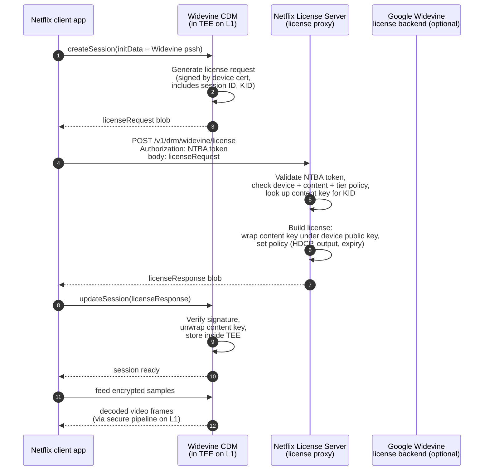
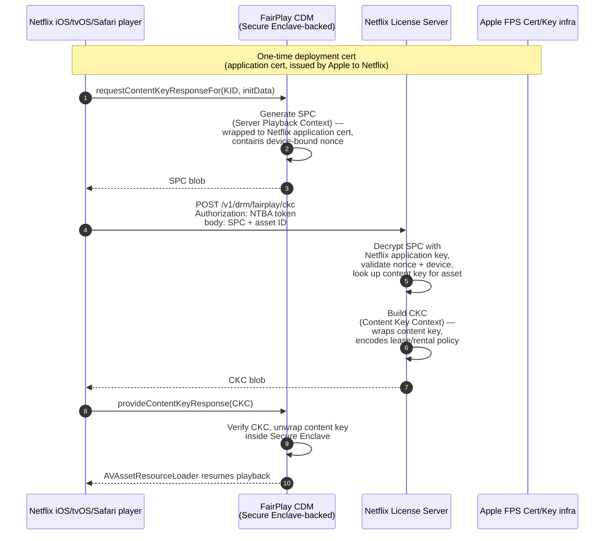
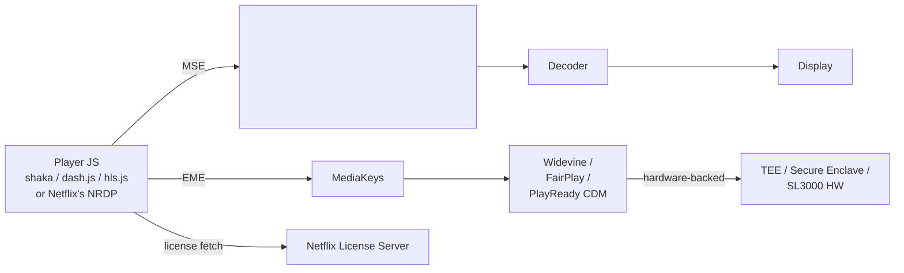
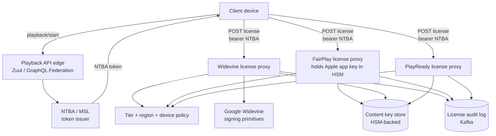
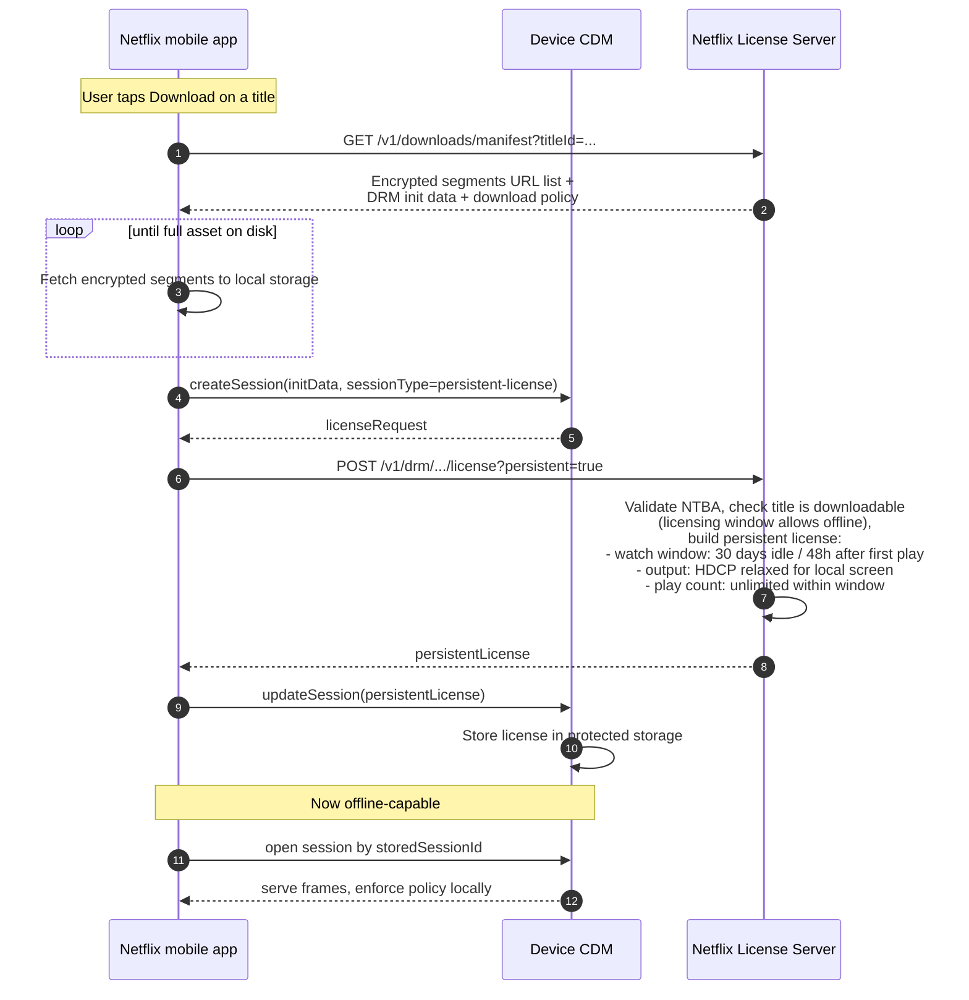
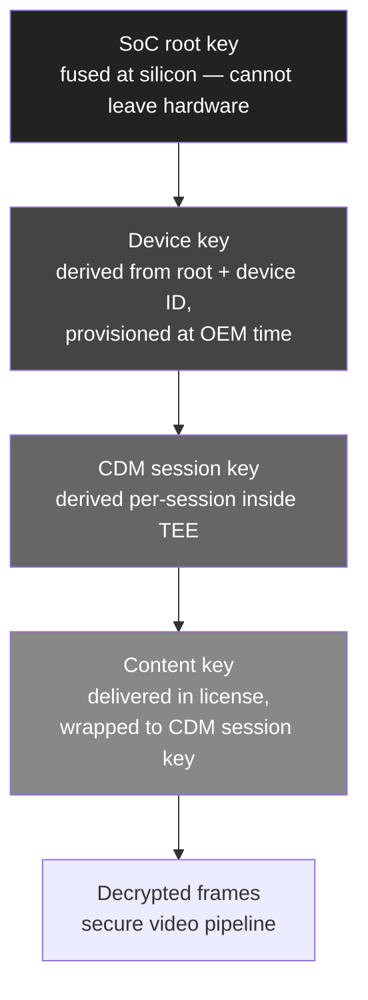

# Netflix Deep Dive — DRM (Widevine, FairPlay, PlayReady)

**Date:** 2026-04-29 | **Updated:** 2026-04-29
**Tags:** `system-design` `case-study` `netflix` `deep-dive` `drm` `security`

## Table of Contents

- [Summary](#summary)
- [Overview](#overview)
- [Common Encryption (CENC)](#common-encryption-cenc)
- [Widevine — Google](#widevine--google)
- [FairPlay Streaming — Apple](#fairplay-streaming--apple)
- [PlayReady — Microsoft](#playready--microsoft)
- [EME, DASH, and HLS Integration](#eme-dash-and-hls-integration)
- [License Server Architecture](#license-server-architecture)
- [Key Rotation per Session](#key-rotation-per-session)
- [Offline Downloads with DRM](#offline-downloads-with-drm)
- [Output Protection (HDCP)](#output-protection-hdcp)
- [Revocation](#revocation)
- [Per-Tier Security (4K → L1, SD → L3)](#per-tier-security-4k--l1-sd--l3)
- [Anti-Patterns](#anti-patterns)
- [Related](#related)
- [References](#references)

## Summary

Studio licenses force Netflix to ship DRM, but no single DRM system covers every device. The production answer is **Common Encryption (CENC, ISO/IEC 23001-7)**: encrypt the media *once* with AES-128 (CTR or CBCS), produce one packaged stream, and let three different DRM systems — **Widevine** (Google: Android, Chrome, ChromeOS, most TVs), **FairPlay Streaming** (Apple: Safari/iOS/tvOS), and **PlayReady** (Microsoft: Edge/Xbox/Windows/many smart TVs) — each wrap and deliver the *same* content key under their own license format. The browser/OS-level glue is **EME (Encrypted Media Extensions)**; the container glue is **DASH** (`cenc:` boxes) for Widevine/PlayReady and **HLS** (`#EXT-X-KEY` / `#EXT-X-SESSION-KEY`) for FairPlay.

Where Netflix gets opinionated is two places. First, **per-tier security**: studios contractually require the *hardware-rooted* security level for HD/4K — Widevine **L1**, FairPlay HW (Secure Enclave), PlayReady **SL3000** — so decrypted frames never leave a Trusted Execution Environment. Devices stuck on software DRM are capped at SD/480p. Second, the license itself is wrapped in Netflix's **NTBA (Netflix Token-Based Authentication)** envelope: a short-lived MSL/NTBA-signed token authorizes the license request, binds it to a session, device, and content, and lets Netflix revoke or rotate independently of the underlying CDM. Add HDCP for output protection, per-session content keys with rotation, time-limited offline licenses, and CRL-based device revocation, and you have the actual shape of Netflix DRM.

## Overview

DRM in 2026 is not one thing. It is at minimum:

1. A **packaging convention** — CENC — so the bytes of the encrypted file work for everyone.
2. A **client component** called a CDM (Content Decryption Module) sitting inside the browser/OS/SoC, exposing a standard JS API (EME) on the web.
3. A **license server** the CDM talks to, which authorizes the play and ships down a wrapped content key.
4. A **trust chain** running from a hardware root (the SoC's TEE / Secure Enclave / SL3000 chipset) up through the device cert, the CDM, and the license, ending at the studio's contractual requirement.
5. **Output protection** (HDCP) so the analog-hole / HDMI capture path is also locked.
6. **Revocation** so a single jailbroken device or leaked key doesn't compromise the whole fleet.

Netflix did not invent any of this. What Netflix did is operate it at extreme scale — every supported device family (smart TVs going back a decade, Xboxes, iPads, Chromebooks, FireTVs, Rokus, Android phones across thousands of SoCs) needs the right DRM with the right security level for the content tier it is requesting. The license server has to handle hundreds of thousands of `licenseUrl` requests per second at peak. Mistakes are expensive: a flaw in the security level enforcement and Netflix loses the studio license for the entire 4K catalog.

This doc walks through each piece, with explicit attention to where Netflix's choices differ from a textbook OTT deployment.

## Common Encryption (CENC)

Common Encryption (**ISO/IEC 23001-7**, MPEG-CENC) is the spec that makes "encrypt once, play with multiple DRMs" possible. Without it you would package the same movie three times — once per DRM — and that would explode storage, fill bandwidth, and CDN cache footprints by 3x.

CENC defines encrypted-media boxes inside ISO BMFF (the MP4 family) and fragmented MP4 (used by both DASH and HLS-fMP4). The encrypted samples are protected with **AES-128**. Two modes are standard:

| Mode | AES variant | Encrypted portion of each sample | Used by | Notes |
|------|-------------|----------------------------------|---------|-------|
| **`cenc`** (CTR) | AES-128-CTR | Full sample, with subsamples skipping NAL/sample headers | Widevine, PlayReady (historically) | Counter-mode; bit-exact length preserved. The "classic" CENC mode. |
| **`cbcs`** | AES-128-CBC with constant IV per sample, **pattern encryption** (1 of every 10 16-byte blocks encrypted by default) | Sparse, pattern-based across the sample | **FairPlay**, modern Widevine, modern PlayReady | Required for Apple — FairPlay only supports CBCS. Pattern encryption makes hardware H.264/H.265 decoders happy because IDR slice structure is preserved. |

The historical pain point: **CTR vs CBCS were not interchangeable**. Apple shipped only CBCS; Widevine shipped only CTR until ~2018. That meant a single CENC stream that worked on Apple did *not* work on older Widevine, and vice versa. Today both Widevine (recent versions) and PlayReady support CBCS, so the modern Netflix packaging strategy is **CBCS for everything**, with one fallback CTR variant for legacy Widevine/PlayReady devices that haven't upgraded their CDMs.

Pattern encryption deserves a closer look. Encrypting *every* byte of a high-bitrate 4K stream is computationally expensive on cheap SoCs. CBCS encrypts only **1 out of every 10** 16-byte AES blocks (by default — the pattern is configurable: `crypt_byte_block`/`skip_byte_block`). Cipher security holds because the encrypted blocks act as a structural lock — without them, the stream decodes to garbage. Decoders see less crypto work; phones get longer battery life; cheap TV SoCs can keep up.

**Per-track keys.** CENC supports multiple keys per stream — typically one for video and one for audio, or one per video rendition. The MP4 `pssh` (Protection System Specific Header) box carries DRM-system-specific data (one `pssh` per DRM system), and the `tenc` and `senc` boxes carry the key ID (`KID`) and per-sample IVs. The CDM looks at the `pssh` matching its system UUID, fetches the matching key, and decrypts.

```text
ISO BMFF fragmented MP4 (CENC)
├── moov / trak / mdia / minf / stbl / stsd
│   └── encv (encrypted video sample entry)
│       └── sinf
│           ├── frma   (original format: avc1 / hvc1 / av01)
│           ├── schm   (scheme: cenc or cbcs)
│           └── schi
│               └── tenc (default KID, default IV size, pattern)
├── moof
│   ├── traf
│   │   ├── senc      (per-sample IV, optional subsample ranges)
│   │   └── saio/saiz (auxiliary info offsets/sizes)
└── mdat              (encrypted samples)

pssh (Protection System Specific Header):
  one box per DRM system, each containing system-specific init data
  - Widevine pssh   (system ID edef8ba9-79d6-4ace-a3c8-27dcd51d21ed)
  - PlayReady pssh  (system ID 9a04f079-9840-4286-ab92-e65be0885f95)
  - FairPlay        (handled differently in HLS — no pssh; KEYFORMAT URI)
```

For Netflix specifically: ingest is one master, packaging produces a single CENC-CBCS DASH manifest plus an HLS variant referencing the same fMP4 segments under FairPlay's HLS scheme. The OCA stores one set of bytes. Three CDMs unlock them.

## Widevine — Google

Widevine is owned by Google and is the broadest-reach DRM — Android (basically all of it), Chrome, ChromeOS, Firefox (via the Widevine CDM plugin), most smart TVs, Roku, FireTV, Chromecast, Android TV, and many embedded set-top devices.

**Three security levels** (the property studios actually negotiate on):

| Level | Where decryption + decode happen | Where the content key lives | Allowed content tier (Netflix) |
|-------|-----------------------------------|-----------------------------|--------------------------------|
| **L1** | Both inside the TEE (Trusted Execution Environment, e.g., ARM TrustZone) — frames never enter the normal-world OS | Inside TEE | HD, UHD/4K, HDR |
| **L2** | Decryption inside TEE, decode outside | Inside TEE | Typically capped at HD; treated as HD-only by some studios |
| **L3** | Both in normal-world software | In normal-world memory (still obfuscated) | SD only — frames are in regular RAM and can be captured |

Most production Android phones with a recent Snapdragon/Exynos/Tensor SoC are L1. L3 is the path for emulators, rooted devices, browser implementations without HW backing, and some low-end devices. Netflix enforces this server-side: when the playback API receives a `deviceCapabilities.drm = ["widevine_l3"]` claim, the manifest it returns omits HD/UHD renditions entirely.

**License flow:**



Inside the license, Widevine encodes:

- **Content key(s)** wrapped to the device's public key.
- **Output controls** — required HDCP version, allow/deny on analog out, screen-recording flags.
- **Usage policy** — license duration, rental window for offline, allowed playback duration.
- **Renewal info** — heartbeat URL and interval if the license must be re-validated mid-session.

Netflix terminates Widevine licenses on its own servers. Google operates a hosted license backend, but at Netflix's scale the proxy + policy live in-house — Netflix needs to enforce its own NTBA, its own per-account tier check, its own session binding, and route the actual key wrapping through Google's signing/wrapping primitives only where it must.

## FairPlay Streaming — Apple

FairPlay Streaming (FPS) is Apple's DRM for HLS. It is the only DRM that works on Safari (macOS/iOS/iPadOS), the iOS/iPadOS Netflix app's native player, and Apple TV's tvOS app. There is no FairPlay equivalent on Android or Windows.

Architecturally FairPlay differs from Widevine/PlayReady in three meaningful ways:

1. **HLS-only delivery.** FairPlay binds to HLS via `#EXT-X-KEY` / `#EXT-X-SESSION-KEY` tags with `KEYFORMAT="com.apple.streamingkeydelivery"`. There is no DASH FairPlay deployment in production.
2. **CBCS only.** FairPlay never supported CTR. This is *the* reason CBCS exists in CENC.
3. **Hardware root in Secure Enclave.** Modern Apple devices (A7 and later iPhones/iPads, T2 Macs, Apple Silicon) terminate the FairPlay key derivation inside the Secure Enclave. There is no software-only "L3" equivalent — if the device hits the FPS code path it is hardware-backed, full stop. Older legacy paths fall back to software-only FairPlay but those devices are below Netflix's HD floor.

**License (key) flow:**



Two important consequences:

- **The Netflix license server holds an Apple-issued application certificate and private key.** Compromise of that key is a critical incident — Apple can revoke it and Netflix has to re-deploy, but in the meantime any future SPCs issued against it are at risk. The key lives in an HSM with very tight IAM.
- **SPC is per-session and includes a nonce**, so a captured CKC cannot be replayed against a different session — the Secure Enclave binds it to the SPC it generated.

Offline (downloads) on iOS uses **persistent FairPlay keys** with a separate `AVContentKeySession` flow; the CKC is marked persistent and encodes a rental/lease window. See [Offline Downloads](#offline-downloads-with-drm) below.

## PlayReady — Microsoft

PlayReady is Microsoft's DRM. It targets Edge (Chromium), Xbox, Windows (UWP and Win32), many smart TVs (Samsung, LG, Sony — most have both Widevine and PlayReady CDMs), Roku-class STBs, and embedded Linux media devices via the PlayReady SDK.

PlayReady's security tiers are different from Widevine's three-level scheme:

| Level | What it means | Netflix tier |
|-------|---------------|---------------|
| **SL150** | Test / development | Not used in production |
| **SL2000** | Software-protected: keys and decryption in normal world (obfuscated) | SD only |
| **SL3000** | Hardware-protected: keys and decryption in TEE; secure video path | HD, UHD/4K, HDR |

Studios mirror their Widevine-L1 / FairPlay-HW requirements onto **PlayReady SL3000** for HD/4K. SL2000 = SD ceiling.

**Container support.** PlayReady is unusual in supporting *both* PIFF (the legacy Smooth Streaming format) and CENC-DASH/HLS. Modern Netflix uses CENC-CBCS for PlayReady on DASH. Older smart TVs that speak Smooth Streaming + PlayReady PIFF are the long tail Netflix still supports — same content key, different container manifest.

**License flow** is structurally the same as Widevine: client-generated license challenge (XML, base64-encoded) → license server → license response containing wrapped content key plus a policy XML (`PlayReadyHeader`) describing output protection, playback duration, persistent vs streaming, etc.

What makes PlayReady distinctive operationally:

- **Domains** — PlayReady supports a "domain" concept where multiple devices can share a single domain key, originally designed for household device pools. Netflix does not lean on this in its standard playback flow but it shows up in some downloads / family-sharing patterns historically.
- **Compliance and Robustness Rules** are explicit and Microsoft-published. SL3000 has detailed requirements about secure video paths, OEMcrypto-style provisioning, and HDCP enforcement.
- **Xbox is a major target.** Xbox uses PlayReady (not Widevine) as its primary DRM for Netflix, Disney+, and other apps. The console's hardware path is SL3000.

## EME, DASH, and HLS Integration

The browser/JS-side glue is **EME (Encrypted Media Extensions)**, a W3C spec that exposes a uniform JavaScript API for encrypted media regardless of which CDM is underneath.



The flow on the web:

```javascript
// Simplified EME flow — Netflix's player wraps this; the shape is standard.
const config = [{
  initDataTypes: ['cenc'],
  videoCapabilities: [{ contentType: 'video/mp4; codecs="hvc1.2.4.L153.B0"',
                        robustness: 'HW_SECURE_ALL' }], // Widevine L1 hint
  audioCapabilities: [{ contentType: 'audio/mp4; codecs="ec-3"' }],
  persistentState: 'optional',
  sessionTypes: ['temporary'],
}];

const access = await navigator.requestMediaKeySystemAccess('com.widevine.alpha', config);
const mediaKeys = await access.createMediaKeys();
await videoElement.setMediaKeys(mediaKeys);

videoElement.addEventListener('encrypted', async (event) => {
  const session = mediaKeys.createSession();
  session.addEventListener('message', async (msg) => {
    const license = await fetchLicenseFromNetflix(msg.message); // the NTBA-wrapped POST
    await session.update(license);
  });
  await session.generateRequest(event.initDataType, event.initData);
});
```

The `robustness` field is how the page asks for a security level. Widevine maps `SW_SECURE_CRYPTO` → L3, `HW_SECURE_CRYPTO` / `HW_SECURE_DECODE` / `HW_SECURE_ALL` → L1. PlayReady uses `3000` / `2000` literally. FairPlay does not expose levels — there is one path.

Container-side:

- **DASH (`.mpd`)** carries CENC `pssh` boxes inline plus `<ContentProtection>` elements per DRM system. Netflix uses DASH for Widevine and PlayReady on browsers, smart TVs, and Android/Chrome.
- **HLS (`.m3u8`)** uses `#EXT-X-KEY` / `#EXT-X-SESSION-KEY` with multiple `KEYFORMAT` entries — `com.apple.streamingkeydelivery` for FairPlay, `urn:uuid:edef8ba9-...` for Widevine, and the matching PlayReady URN. Netflix uses HLS for FairPlay on Apple platforms (and offers HLS-fMP4 with multi-DRM tags for cross-platform Apple-friendly scenarios).

The Netflix client on TVs, consoles, and mobile native apps is **NRDP (Netflix Ready Device Platform)**, not a generic HTML5 player. NRDP runs the same logical EME-equivalent flow but talks to the SoC's vendor-supplied CDM directly through Netflix's certified integration — that's how Netflix verifies that a device actually has L1/SL3000/HW FairPlay before admitting it to the HD/4K tier.

## License Server Architecture

Netflix's license server isn't a single service — it's a fleet of license proxies behind the playback API, one logical service per DRM system, all sharing the same authentication and policy layer.



What lives where:

- **Playback API** authorizes the *play* (subscription valid, region allows the title, device caps match a rendition tier) and mints an **NTBA token** scoped to: account, profile, device, title, session ID, expiry (typically minutes).
- **License proxies** (one per DRM) accept the CDM challenge plus the NTBA token. They do not re-authenticate the user — they trust the NTBA. They look up the content key for the requested KID, check policy (HDCP requirement, 4K-allowed, output controls), build the DRM-specific license, and return it.
- **Content keys** live in an HSM-backed vault, indexed by KID. Keys are generated at packaging time and never leave the HSM in plaintext — wrap operations happen inside.
- **Auditing** — every license issuance hits a Kafka topic for fraud detection, anomaly detection, and compliance reporting back to studios.

**Multi-region active-active.** License proxies run in every Netflix AWS region. A Route 53 / GSLB layer routes the client to the nearest healthy region. If a region fails mid-playback, the *current* license is already on the device — playback continues. Only renewals or new sessions hit the alternate region. This is why HD/4K licenses commonly carry generous renewal windows: regional failover should not interrupt a movie.

**Latency budget.** The license fetch sits between manifest fetch and first frame. Target: p50 < 100ms, p99 < 400ms, including TLS, NTBA validation, key lookup, license build, and return. License responses are small (kilobytes). The license proxy is heavily cached on the *policy* side (per-title + per-tier policy is stable for hours/days) and uncached on the key-wrapping side (each request gets a fresh wrap).

## Key Rotation per Session

Modern Netflix DRM does not give a single content key a long lifetime. Two layers of rotation exist:

**1. Per-session key derivation.** Every license is bound to a session ID. Even for the same title, two devices (or the same device starting a new session) get distinct license envelopes — same underlying content KID, but the wrapping is bound per-session and the license is non-replayable across sessions.

**2. Key rotation inside a single playback.** Long content (a movie, a long episode) can be packaged with **multiple content keys**, each protecting a span of segments. The DASH manifest signals key changes; the CDM is told to fetch a new license (or pre-fetched a license bundle covering the next key). This limits the blast radius of a single leaked key — a key lifted from a compromised device only decrypts the segment span it covered, not the whole movie.

```mermaid
gantt
    title Per-title key rotation across a 90-min movie
    dateFormat  X
    axisFormat  %Mm
    section Key A (KID_A)
    Segments 0–15 min :0, 15
    section Key B (KID_B)
    Segments 15–45 min :15, 30
    section Key C (KID_C)
    Segments 45–75 min :45, 30
    section Key D (KID_D)
    Segments 75–90 min :75, 15
```



The CENC `tenc` and `senc` boxes carry the active KID per fragment, so the client knows which key it needs. The license server can issue a single license covering all the KIDs at once (smaller round-trips) or stagger licenses (smaller exposure window per leak).

**Why this matters.** Without rotation, one compromised L3 device with a software CDM exploit could exfiltrate one content key and that key would decrypt the entire title forever. With rotation, the attacker has to maintain compromise across the title's full length to get the full content. Combined with revocation (below), the economics of stream-ripping shift significantly.

Netflix's actual rotation policy is content-tier-dependent — premium 4K originals rotate more aggressively than catalog SD content. The packaging system records which titles got which rotation policy, so re-encoded releases can be re-keyed without touching unrelated catalog.

## Offline Downloads with DRM

Downloads complicate DRM in three ways: the encrypted file is on the device, the license must work offline, and licensing rules (rental window, watch-once vs unlimited-within-window) must be enforced by the client without contacting the server.

**The persistent license.** All three DRM systems support **persistent licenses** — the CDM stores the (encrypted) license in protected storage on the device. Widevine calls them "offline licenses"; FairPlay calls them "persistent content keys"; PlayReady calls them "persistent licenses" with an explicit `PERSIST` flag in the `PlayReadyHeader`.

Netflix's downloads flow:



**Policy details studios commonly require:**

- A maximum offline lifetime (e.g., 30 days idle).
- A "first play" countdown (e.g., 48 hours from first decode to license expiry).
- A play count or unlimited-within-window.
- Geographic enforcement: the license is issued under the user's licensed region; if they fly somewhere the title isn't available, the offline license is still valid (already issued) but new downloads of region-locked content will fail.
- **No analog out** for some titles even on local screens; the license sets HDCP requirements that match the device's display path.

**Security implications.** A jailbroken device with a software-CDM exploit can in principle extract a stored persistent license. This is exactly why Netflix limits which security levels can request *persistent* licenses — Widevine L3 is allowed to download only SD; HD/4K downloads require L1 (or HW-FairPlay / SL3000), where the license is sealed in TEE-controlled storage that resists extraction.

## Output Protection (HDCP)

Encrypting the segments isn't enough — once the device decodes a frame, that frame eventually leaves over a display interface (HDMI, DisplayPort, MHL, internal MIPI). **HDCP (High-bandwidth Digital Content Protection)** is the link-layer encryption between source (your STB / phone / laptop) and sink (TV / monitor / projector / receiver).

| HDCP version | Required for | Netflix policy |
|--------------|---------------|-----------------|
| **HDCP 1.x** | SD content | Acceptable |
| **HDCP 2.2** | HD content (1080p) | Required for HD on external displays |
| **HDCP 2.2 / 2.3** | 4K, HDR (Dolby Vision, HDR10) | Required for 4K. Studios contractually mandate HDCP 2.2+. |

The DRM license carries an output-protection policy. The CDM enforces it: at start-of-play and continuously, the CDM verifies that the active display path is at the required HDCP version. If you plug an old AVR in between your Apple TV and your 4K HDR set and that AVR doesn't speak HDCP 2.2, the stream downshifts to 1080p (or fails entirely, depending on the title).

Why "downshift to 1080p" instead of "fail"? Because there's no HDCP 1.x → 2.2 universal floor for 1080p — many cheap monitors and older equipment present HDCP 1.4. Netflix's manifest-side selection matches the rendition tier the license allows. The license engine sees the device + display path's HDCP version (reported by the CDM) and can either:

1. Mark the license HDCP-required and let the CDM block playback if HDCP fails.
2. Mark the license HDCP-flexible and let the player pick a lower rendition.

Different content has different rules. A typical Netflix Original 4K UHD title is HDCP 2.2 mandatory at the 4K tier. A 1080p episode of catalog content might allow HDCP 1.4 with a degradation-allowed flag.

**HDCP revocation** is part of the system: HDCP receivers (TVs, AVRs) carry a System Renewability Message (SRM) version. Revoked devices show up in updated SRMs distributed via DRM licenses. A TV with a broken HDCP implementation found in the wild can be added to the revocation list and refused HDCP 2.2 connections going forward.

**The analog hole.** Once frames hit the display, a high-quality camera pointed at the screen can re-record. DRM cannot prevent this. What it does is raise the cost — captured-from-screen content is visibly worse than a clean rip, and *that gap* is what HDCP plus DRM together preserve.

## Revocation

Three revocation surfaces:

**1. Device cert revocation.** Every CDM has a per-device cert (Widevine OEMcrypto provisioning, FairPlay device cert, PlayReady individualization). When a specific device or device class is found to be compromised — keys leaked, security bypass demonstrated, security level falsified — its cert chain can be added to a CRL (Certificate Revocation List). License servers reject requests from those certs.

For Widevine, OEMs ship CDM updates revoking compromised SoCs; Google maintains the upstream CRL. Netflix consumes this and additionally maintains its own deny-list for devices it has independently observed as misbehaving (e.g., a smart TV model with a piracy-tool firmware mod in the wild).

**2. CDM version revocation.** A specific CDM version (Widevine 14.x with a known exploit, e.g.) can be marked as not-acceptable for HD/4K. The license server downshifts those clients to SD until they update.

**3. License revocation.** A specific outstanding license can be invalidated — useful when an account is detected sharing credentials at scale or when chargebacks/fraud invalidate a session retroactively. The CDM rejects the (revoked) license on next renewal heartbeat.

**Operational reality.** Revocation only helps for *honest* devices that respect the CRL. A fully compromised device with an extracted root key can ignore the CRL — but then it doesn't have access to *new* keys, because the license server stops issuing them to that cert. This is the actual game: contain the leak so it can't follow the catalog forward.

**The Widevine L3 keybox leak (2017–2018).** Widevine L3's keybox extraction was demonstrated and published. Tools exist that, given an L3 keybox, can decrypt streams the L3 device requested. Netflix's response: L3 was already capped at SD by policy; the leak meant nothing for the HD/4K catalog. This is why the per-tier policy *exists* — it survived a complete L3 compromise without exposing premium content.

## Per-Tier Security (4K → L1, SD → L3)

The studio contracts boil down to a matrix:

| Content tier | Widevine | FairPlay | PlayReady | HDCP | Other |
|--------------|----------|----------|-----------|------|-------|
| SD (≤ 480p) | L3 acceptable | SW or HW | SL2000 | None or 1.x | Most permissive |
| HD (1080p) | L1 only | HW (Secure Enclave) | SL3000 | HDCP 2.2 | Persistent licenses (downloads) require L1/HW |
| UHD / 4K | L1 only | HW | SL3000 | HDCP 2.2/2.3 | Often additionally restricted to specific SoCs studios audited |
| HDR (Dolby Vision, HDR10) | L1 + secure decode | HW + secure compositor | SL3000 + secure video path | HDCP 2.2/2.3 | Same |

Enforcement happens at three points:

1. **Manifest generation** — the playback API knows the device's claimed security level and *omits* renditions the device isn't entitled to. A Widevine L3 client never even sees the 1080p URL.
2. **License policy** — even if a device requests a key for an HD KID, the license server checks the device's security level claim (signed by Google/Apple/Microsoft via the CDM cert) and refuses if it doesn't meet the bar.
3. **Client enforcement** — the CDM itself, on L1 / HW / SL3000, will not output HD frames over an insecure decode path. Defense in depth.

Netflix also tracks newly certified SoCs explicitly — a new Snapdragon variant launching with L1 has to be added to the allow-list for premium content after Netflix's device team verifies the integration. This is why brand-new phones occasionally launch supporting Netflix at HD only and get bumped to 4K a few weeks later.

### Key Ladder

A "key ladder" is the chain of keys from hardware root to the actual content key. Each level wraps the next:



Properties of a real ladder:

- **Lower keys never see plaintext of higher keys.** The SoC root is unreachable to software. The device key is derivable only inside the TEE.
- **Compromise at a lower level doesn't compromise higher levels.** Lifting a single content key (the bottom rung) does not yield the device key.
- **Rotation is granular.** Content keys rotate per-session/per-segment without re-provisioning the device.

Widevine, FairPlay, and PlayReady all implement key ladders rooted in their respective hardware modules. The ladder is what makes "HW security level" mean something — without it, "L1" would be marketing.

### Netflix's NTBA License Token

NTBA stands for **Netflix Token-Based Authentication** (sometimes referenced alongside / as an evolution of Netflix's MSL — Message Security Layer). It is the envelope around every license request that ties the DRM transaction back to the Netflix subscriber and session.

What an NTBA-protected license request looks like, conceptually:

```text
POST /v1/drm/widevine/license HTTP/2
Host: api.netflix.com
Authorization: Bearer NTBA <signed token>
Content-Type: application/octet-stream

<Widevine license request blob from CDM>

Where the NTBA token contains (signed, opaque to the client):
  - account_id
  - profile_id
  - device_id          (provisioned at app install)
  - session_id
  - title_id + KID
  - tier_claim         (security level the device proved to playback API)
  - region
  - exp                (short — minutes)
  - jti                (unique nonce; replay guard)
```

Why a Netflix-specific layer on top of the DRM challenge:

- **Replay protection.** A captured Widevine challenge could otherwise be re-submitted from a different account. NTBA's `jti` + `session_id` binding prevents that.
- **Tier enforcement.** The license server checks `tier_claim` against the requested KID's policy *before* doing the expensive key wrap.
- **Independent revocation.** Netflix can revoke NTBA tokens (account compromise, fraud) without touching the underlying CDM cert chain.
- **Audit context.** Every license issuance is auditable back to a specific user session — required for studio reporting and for fraud investigation.
- **Cross-DRM uniformity.** Widevine, FairPlay, and PlayReady have completely different challenge formats, but the NTBA wrapping is the same — one auth code path covers all three.

NTBA's signing key lives in an HSM. The token TTL is short (minutes) so leaked tokens have a small replay window. NTBA tokens are scoped narrowly — a token issued for one title cannot be used to fetch a license for another title.

## Anti-Patterns

- **Packaging the same content three times, once per DRM.** This was the pre-CENC default and is now indefensible — 3x the storage, 3x the CDN cache footprint, 3x the encoding pipeline complexity. Use CENC.
- **Picking CTR when you also need to support FairPlay.** FairPlay is CBCS-only. If you need Apple, your packaging mode is CBCS. (Modern Widevine/PlayReady support CBCS, so CBCS is the universal answer in 2026.)
- **Treating Widevine L3 as good enough for HD.** It is not. Studios will pull the catalog. The keybox is extractable. L3 = SD ceiling, period.
- **No security level enforcement at the manifest layer.** Trusting the *client* to honor "you can only play SD" is naive. The manifest API must omit HD/4K renditions for L3 / SL2000 / SW-FairPlay devices.
- **Long-lived content keys.** A single content key that protects a whole movie for years means a single leak compromises that movie forever. Rotate per-session; rotate within the title; re-key on re-release.
- **License servers without revocation infrastructure.** The day after a popular device is jailbroken, you need to be able to add it to a deny-list and have license issuance reject it. Without that pipeline, the breach is permanent.
- **Skipping HDCP enforcement.** Decrypted frames going out an HDCP-1.4 link is a captured 1080p rip in 24 hours. If the studio license requires HDCP 2.2 for HD, the CDM has to enforce it; the player must downshift if the link is below.
- **Holding the FairPlay application private key on application servers.** The Apple-issued FPS key is the crown jewel of your FairPlay deployment. HSM, narrowly scoped IAM, audit every signing op. Compromise is a critical incident.
- **Persistent licenses with no expiry.** A "watch forever offline" license issued once and never expiring means a single device extraction is a permanent leak. Even rental-model offline licenses need a hard ceiling (Netflix's 30-day idle / 48-hour first-play windows are typical).
- **Letting EME `robustness` go unset.** Some browsers default to whatever the CDM offers. If you ask for `''` you may get L3 on a device that also has L1, and you've left HD/4K on the table. Always specify the minimum acceptable robustness.
- **Re-using NTBA tokens across titles or sessions.** The whole point of NTBA is binding. Reuse defeats it. Tokens are per-title, per-session, short-lived, and single-use for license issuance.
- **Trusting client-reported `deviceCapabilities` without cryptographic backing.** A client that *claims* `widevine_l1` must prove it via the actual Widevine challenge (signed by an L1 device cert). Otherwise an attacker just lies and gets 4K licenses on a software player.
- **Treating DRM as set-and-forget.** Widevine, FairPlay, and PlayReady all evolve. New CDM versions, new revocation lists, new security levels (Widevine occasionally adds intermediate levels), new container modes. The DRM team needs an ongoing operational role, not a one-time integration.

## Related

- [`../design-netflix.md`](../design-netflix.md) — parent case study; DRM section.
- [`./encoding-pipeline.md`](./encoding-pipeline.md) — sibling deep dive on the encoding pipeline; CENC packaging happens there before it lands at the OCAs and the license server reads keys produced by that pipeline.
- [`../../../security/encryption-at-rest-and-in-transit.md`](../../../security/encryption-at-rest-and-in-transit.md) — foundational encryption / KMS / envelope encryption; the license server's key vault and the per-session key derivation reuse all of these primitives.
- [`./connection-scaling.md`](../real-time/whatsapp/connection-scaling.md) — different problem (WhatsApp connection scaling) but useful for thinking about scaling stateful per-session servers.
- W3C EME spec, ISO/IEC 23001-7 — the underlying standards (see References below).

## References

- W3C, ["Encrypted Media Extensions"](https://www.w3.org/TR/encrypted-media/) — the EME spec; the JS API every browser-side DRM integration uses.
- ISO/IEC, ["Information technology — MPEG systems technologies — Part 7: Common encryption in ISO base media file format files"](https://www.iso.org/standard/68042.html) — ISO/IEC 23001-7, the CENC standard. Defines `cenc` (CTR) and `cbcs` modes, `pssh` boxes, sample auxiliary info.
- Google, ["Widevine DRM"](https://developers.google.com/widevine) — Widevine developer landing page; OEMcrypto, CDM versions, license proxy integration.
- Google, ["Widevine Modular DRM Security Levels"](https://developers.google.com/widevine/drm/overview) — the L1/L2/L3 definitions.
- Apple, ["FairPlay Streaming"](https://developer.apple.com/streaming/fps/) — FairPlay developer overview, SDK request, SPC/CKC concepts.
- Apple, ["HTTP Live Streaming Authoring Specification"](https://developer.apple.com/documentation/http-live-streaming/http-live-streaming-hls-authoring-specification-for-apple-devices) — HLS keys, `#EXT-X-KEY` formats, fMP4 + FairPlay.
- Microsoft, ["PlayReady DRM"](https://learn.microsoft.com/en-us/playready/) — PlayReady documentation home; SL2000 / SL3000, CENC support, license format.
- Microsoft, ["PlayReady Compliance and Robustness Rules"](https://www.microsoft.com/playready/licensing/compliance/) — the contractual security requirements for SL3000 hardware.
- DASH-IF, ["DASH-IF Implementation Guidelines: Content Protection Information Exchange Format (CPIX)"](https://dashif.org/guidelines/) — practical guidelines for DASH + CENC + multi-DRM packaging.
- IETF, ["HTTP Live Streaming"](https://www.rfc-editor.org/rfc/rfc8216) — RFC 8216, base HLS spec; key delivery semantics.
- W3C, ["Media Source Extensions"](https://www.w3.org/TR/media-source-2/) — MSE; the byte-feeding side of the EME pair.
- Netflix Tech Blog, ["MSL: Message Security Layer"](https://github.com/Netflix/msl) — Netflix's open-source MSL reference, foundational to NTBA-style token authentication.
- Netflix Tech Blog, ["How Netflix Directs 1% of its Traffic for Faster App Startups"](https://netflixtechblog.com/) — context on Netflix's edge auth and token issuance patterns.
- DRM Today / castLabs, ["Common Encryption explained"](https://castlabs.com/blog/common-encryption-explained/) — readable practitioner explainer of CENC modes and pattern encryption.
- Wikipedia, ["High-bandwidth Digital Content Protection"](https://en.wikipedia.org/wiki/High-bandwidth_Digital_Content_Protection) — HDCP versions, SRM, revocation mechanism.
- Wikipedia, ["Widevine"](https://en.wikipedia.org/wiki/Widevine), ["FairPlay"](https://en.wikipedia.org/wiki/FairPlay), ["PlayReady"](https://en.wikipedia.org/wiki/PlayReady) — broad reference summaries with deployment history.
