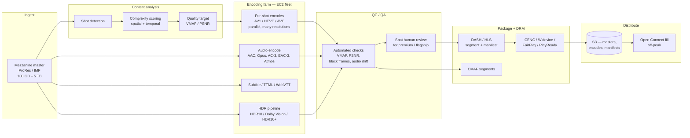
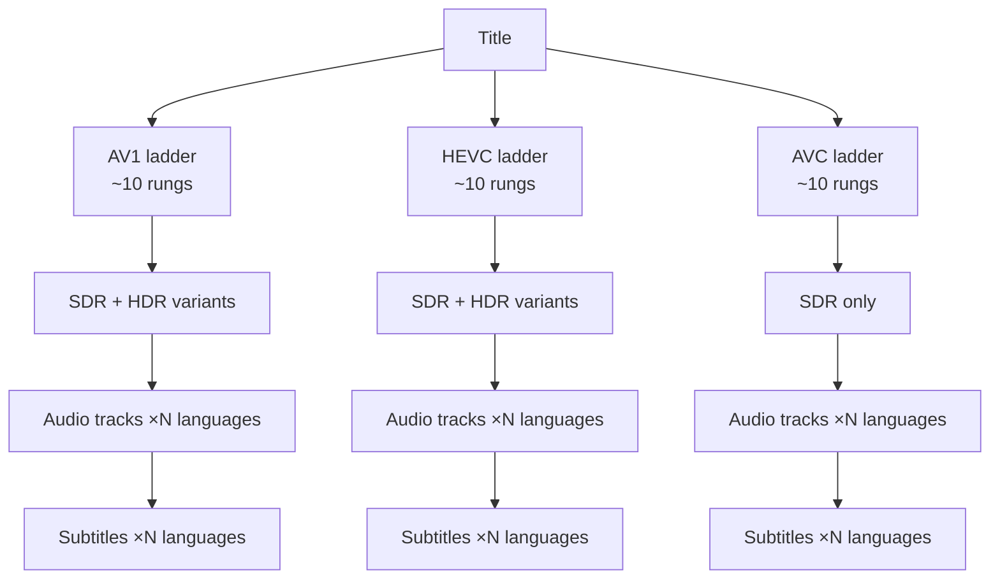
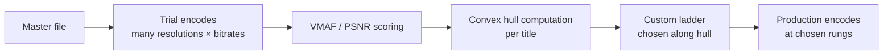
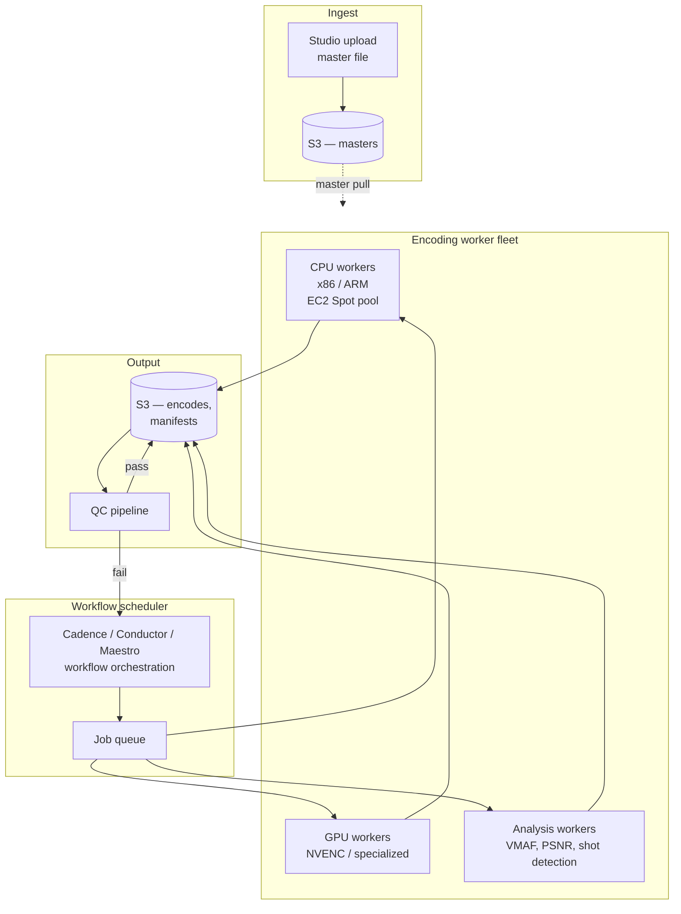

# Netflix Deep Dive — Encoding Pipeline (Bitrate Ladder, Per-Title, Per-Shot, AV1)

**Date:** 2026-04-29 | **Updated:** 2026-04-29
**Tags:** `system-design` `case-study` `netflix` `deep-dive` `encoding` `video`

> Companion to [`../design-netflix.md`](../design-netflix.md). Goes deep on the **Content Preparation Pipeline** subsection: how a master file becomes ~50+ playable renditions, why per-title and per-shot encoding exist, why Netflix bet on AV1, and what the encoding farm actually looks like.

## Table of Contents

- [Summary](#summary)
- [Overview — What "Encoding Pipeline" Actually Means](#overview--what-encoding-pipeline-actually-means)
- [The Bitrate Ladder](#the-bitrate-ladder)
- [Fixed vs Per-Title Encoding (2015)](#fixed-vs-per-title-encoding-2015)
- [Per-Shot / Optimized Shot-Based Encoding (2018)](#per-shot--optimized-shot-based-encoding-2018)
- [Codec Migration — H.264 → HEVC → AV1](#codec-migration--h264--hevc--av1)
- [AV1 — First-Class Support Since 2020](#av1--first-class-support-since-2020)
- [The Encoding Farm](#the-encoding-farm)
- [QC and QA Validation Pipeline](#qc-and-qa-validation-pipeline)
- [Encoding Cost vs Storage Savings vs Egress Savings](#encoding-cost-vs-storage-savings-vs-egress-savings)
- [Metadata Generation (Thumbnails, Audio, Subtitles)](#metadata-generation-thumbnails-audio-subtitles)
- [HDR and Dolby Vision Pipeline](#hdr-and-dolby-vision-pipeline)
- [Anti-Patterns](#anti-patterns)
- [Related](#related)
- [References](#references)

## Summary

A new title arrives at Netflix as a **mezzanine master** — typically Apple ProRes or an IMF (Interoperable Master Format) package — at hundreds of GB to several TB. It leaves the encoding pipeline as **~50–100+ rendition files**: every reasonable combination of *codec × resolution × bitrate × audio language × subtitle language × DRM system × HDR format*. That artifact set is what fills S3, then fills Open Connect Appliances (OCAs), then ultimately reaches a viewer's device.

The pipeline is built on three big ideas Netflix popularized:

1. **Per-title encoding (2015)** — every title gets a custom bitrate ladder based on its content complexity. *My Little Pony* and *Mad Max: Fury Road* should not be encoded with the same bitrate steps.
2. **Per-shot / optimized shot-based encoding (2018)** — push the granularity below the title. Each shot gets its own encoding decisions, and the per-shot decisions reassemble into a single playable stream.
3. **Aggressive codec migration** — H.264/AVC (universal floor) → HEVC (2016, mobile/4K) → AV1 (first-class since 2020, ~30% of streaming by late 2025). Each generation cuts ~30–50% bitrate at the same quality.

Underneath it all sits a **massively parallel encoding farm on AWS**, running on EC2 (heavy use of Spot capacity), with a **QC pipeline** that checks every rendition against the master before it ships. The trade is unsubtle: spend a lot of CPU once during encoding to spend a lot less bandwidth forever during streaming. At Netflix's scale (hundreds of Tbps peak egress), the math is overwhelming in favor of more encoding.

## Overview — What "Encoding Pipeline" Actually Means



The pipeline runs **once per title** (plus re-runs when a new codec or DRM tier becomes important). Output lives forever in S3 and is **fanned out lazily to OCAs** as titles get popular.

The two cost dials are very different:

- **Encoding** — pay once, in CPU/GPU hours on AWS.
- **Streaming** — pay forever, in Tbps of egress.

So the pipeline aggressively over-spends on encoding to under-spend on streaming.

## The Bitrate Ladder

A **bitrate ladder** is the set of `(resolution, bitrate)` pairs the encoder produces for a given title. The client's adaptive bitrate (ABR) algorithm picks one rung at a time based on bandwidth and buffer state, switching up or down at segment boundaries.

A typical Netflix ladder for a 1080p title (per codec) might look like this — *illustrative*, real ladders are now per-title and per-shot:

| Resolution | Bitrate (kbps) | Use case |
|---|---|---|
| 320×240 | 235 | Cellular, severe throttling |
| 384×288 | 375 | Cellular, low |
| 512×384 | 560 | Mobile, mid |
| 512×384 | 750 | Mobile, good |
| 640×480 | 1050 | SD baseline |
| 720×480 | 1750 | SD / DVD-tier |
| 1280×720 | 2350 | HD light |
| 1280×720 | 3000 | HD standard |
| 1920×1080 | 4300 | FHD light |
| 1920×1080 | 5800 | FHD standard |

That's ~10 rungs *per codec*. Now multiply by codec families (AVC, HEVC, AV1), audio languages, HDR formats, and DRM systems, and a single 4K HDR title can produce north of 100 distinct deliverable files.



The **client receives a manifest** (DASH MPD or HLS playlist) that lists the rungs the device + license window allows, then pulls segment-by-segment from an OCA. ABR is fully client-driven — the server just serves bytes.

### Why ladders, not single bitrates

- **Heterogeneous networks.** A subscriber on fiber, a subscriber on a flaky cellular link, and a subscriber tethering through hotel Wi-Fi see vastly different throughput. One bitrate fits none.
- **Heterogeneous devices.** A 4K OLED TV, a 1080p laptop, a 360p phone in dark mode — the encoder doesn't know which it'll feed, so it produces enough rungs that the client can pick.
- **Mid-stream switching.** Throughput swings during a session. ABR switches up when the buffer fills and bandwidth measurements rise, and down when buffer drains.
- **Codec tiering.** Different devices support different codecs. A 2014 smart TV might only decode H.264; a 2022 phone has AV1 in hardware; a 2018 set-top has HEVC.

## Fixed vs Per-Title Encoding (2015)

Until ~2015, every streaming service (Netflix included) used a **fixed bitrate ladder** — one ladder, applied to every title regardless of content. This is operationally simple: you build the encoder pipeline once, you know exactly what the output will look like, you store predictable segment counts.

It is also wasteful. Animated content with flat colors and slow motion (think *Avatar: The Last Airbender*) contains far less spatial and temporal complexity than live-action with film grain, motion blur, and rapid cuts (think *Black Mirror: Bandersnatch*). A fixed ladder either:

- **Over-encodes simple content** — *My Little Pony* at 1080p doesn't need 5800 kbps; you could ship the same perceptual quality at 2500 kbps and save half the bandwidth.
- **Under-encodes complex content** — *Mad Max: Fury Road* at 1080p might need 8000 kbps to hit the same quality the ladder caps at 5800 kbps.

### Netflix's per-title innovation

In **December 2015**, Netflix published *Per-Title Encode Optimization* (Netflix Tech Blog, Aniyappan Aaron / Anne Aaron et al.). The idea:

1. **Encode the title at many `(resolution, bitrate)` pairs**, not just the standard ladder rungs.
2. **Score each encode** using **PSNR** (and later **VMAF**, Netflix's own perceptual metric).
3. **Compute a convex hull** in the (bitrate, quality) plane — the Pareto front of "best quality you can get at any given bitrate for this title".
4. **Pick the optimal ladder rungs** along that convex hull.



**Result reported in 2015:** ~20% bandwidth savings at the same perceptual quality, OR equivalent quality reached at much lower bitrates on bandwidth-constrained networks. For a service that pushes hundreds of Tbps, 20% savings is enormous.

The trade-off is encoding compute. Per-title roughly doubles the analysis-pass cost (you now run dozens of trial encodes, not one ladder). At Netflix's volume that pays for itself in egress savings within hours.

### VMAF — Netflix's perceptual quality metric

PSNR (peak signal-to-noise ratio) is mathematically clean but doesn't track human perception well — high-grain content gets penalized for the grain even though humans expect grain. SSIM is closer but still imperfect.

Netflix built **VMAF** (Video Multi-method Assessment Fusion) — open-sourced — which fuses multiple per-pixel features (DLM detail loss, VIF visual information fidelity, motion) using a model trained against subjective human scores. VMAF outputs a 0–100 score that correlates much better with what humans actually perceive.

VMAF is the metric that makes per-title (and later per-shot) optimization meaningful. Without a reliable perceptual metric, you can't tell whether the ladder you picked is actually better for the viewer.

## Per-Shot / Optimized Shot-Based Encoding (2018)

Per-title says: *each title gets its own ladder*. **Per-shot** says: *each shot inside a title gets its own ladder, and the per-shot decisions are stitched into a playable stream*.

In **March 2018**, Netflix published *Optimized Shot-Based Encodes for 4K* (and later for the broader catalog). The mechanics:

1. **Shot detection** — automatically segment the title at scene/shot boundaries.
2. **Per-shot complexity analysis** — compute the convex hull *per shot*, not per title.
3. **Per-shot encoding decisions** — a low-motion dialogue shot can use a low bitrate; a high-motion chase shot uses a higher bitrate.
4. **Reassembly into a single bitstream** — the encoder respects GOP boundaries and ensures the stitched output is a valid, seekable, ABR-compatible stream. Each ABR rendition is still one continuous file the client streams.

```mermaid
gantt
    title Per-shot bitrate allocation across one title
    dateFormat X
    axisFormat %s

    section Shots
    Quiet dialogue (low complexity)    :s1, 0, 60
    Action sequence (high complexity)  :s2, 60, 30
    Establishing wide (medium)         :s3, 90, 20
    Quiet dialogue (low)               :s4, 110, 40
    Climax fight (very high)           :s5, 150, 50

    section Bitrate (kbps, illustrative)
    2200 kbps  :a1, 0, 60
    6500 kbps  :a2, 60, 30
    3800 kbps  :a3, 90, 20
    2200 kbps  :a4, 110, 40
    7800 kbps  :a5, 150, 50
```



### Why this matters

- **Average bitrate drops** without average quality dropping. Across a 90-minute film, the encoder spends bits where they actually matter (action, fast motion, fine detail) and saves bits where they don't (talking heads, slow pans, dark scenes).
- **Tail bitrates rise** for the genuinely complex shots, fixing the under-encoding problem for action-heavy content.
- **Per-shot composes with per-codec.** You run the per-shot analysis once and apply it to AVC, HEVC, and AV1 ladders.

Per-shot pushed savings further past per-title — published Netflix numbers cite additional double-digit-percent reductions on heterogeneous content.

### The complications per-shot introduces

- **GOP alignment.** ABR streams need consistent segment boundaries across renditions so the client can switch mid-stream. Per-shot encoding has to align shot boundaries with segment boundaries (or insert IDR frames at segment boundaries) to keep the stream switchable.
- **Encoder consistency.** Stitched shots must share encoder state assumptions (e.g., same color space, same HDR metadata, same audio sync) so the decoder doesn't glitch at shot boundaries.
- **QC complexity.** Each shot is its own encode decision; QC has to validate each shot *and* the stitched whole.

## Codec Migration — H.264 → HEVC → AV1

Codecs improve roughly every 8–10 years. Each generation cuts ~30–50% bitrate at the same perceptual quality, at the cost of much heavier encode and (usually) decode.

| Codec | Year standardized | Royalty model | Adoption status at Netflix | Bitrate vs prev |
|---|---|---|---|---|
| **H.264 / AVC** | 2003 | Patent pool (MPEG LA) | Universal floor; every supported device decodes it | baseline |
| **VP9** | 2013 | Royalty-free (Google) | Limited — used for some web/Android paths | ~30% better than AVC |
| **HEVC / H.265** | 2013 | Patent pool (multiple, fragmented) | Used since ~2016 for 4K, mobile | ~40–50% better than AVC |
| **AV1** | 2018 (AOM) | **Royalty-free** (Alliance for Open Media) | First-class since 2020; ~30% of streaming by late 2025 | ~30% better than HEVC |
| **VVC / H.266** | 2020 | Patent pool | Watching, not yet deployed at scale | ~30–50% better than HEVC |

### Why migrations are slow

- **Device install base lag.** A codec is only useful when the device can decode it — ideally in hardware to stay within the device's power and thermal budget. Software decoding works but eats battery.
- **Hardware decoder licensing.** Chipset vendors (Qualcomm, MediaTek, Apple, Samsung) have to ship silicon with the new decoder. That takes years to penetrate the install base.
- **Encoding is harder than decoding.** A new codec's encoder takes years to mature — early HEVC encoders were slow and produced inferior output to mature x264. The same was true of early AV1.
- **You ship every codec at once.** You can't drop H.264 because some device on the network still depends on it. So the catalog grows: the same title is in your storage as AVC, HEVC, *and* AV1, plus per-codec ladders.

### The decision matrix

For each title and rendition, the encoder picks codecs based on:

- **Device capability** the client advertises in the playback request.
- **Resolution / HDR target** — 4K HDR at low bitrate is only feasible in HEVC or AV1, not AVC.
- **License terms** — some studios specifically gate codecs (e.g., 4K only allowed in HEVC or AV1, not AVC).
- **Storage and encoding budget** — premium / flagship titles get the full codec matrix; long-tail catalog might skip AV1 initially.

## AV1 — First-Class Support Since 2020

AV1 is the codec Netflix bet hardest on, for three reasons that actually matter:

1. **Royalty-free.** AV1 is from the Alliance for Open Media (Netflix is a founding member, alongside Google, Amazon, Microsoft, Mozilla, Apple, others). No per-device, per-stream, or per-encoded-hour patent pool fees, unlike HEVC's tangled royalty situation.
2. **Bitrate efficiency.** ~20–30% better than HEVC, ~50%+ better than AVC, at the same perceptual quality.
3. **Film Grain Synthesis.** A first-class AV1 feature: strip natural film grain before encoding (it compresses badly because it's high-frequency noise), encode the grain-free signal at a much lower bitrate, and **resynthesize grain at decode time** from a few parameters. The result preserves cinematic look at a fraction of the bitrate. Critical for grain-heavy content like *The Crown*, *Marriage Story*, classic film restorations.

### AV1 adoption timeline at Netflix

- **2018** — AV1 1.0 codec spec finalized by AOM.
- **February 2020** — Netflix announces AV1 streaming for Android with a software decoder. Limited rollout, but proof of concept.
- **November 2021** — AV1 hardware decoders begin shipping in mainstream devices (newer Android flagships, smart TVs, Apple devices arrive later).
- **2022–2024** — gradual ramp; AV1 covers more of the catalog, more device classes.
- **November 2025** (per Netflix blog) — **AV1 powers ~30% of all Netflix VOD streaming**, with sessions on AV1 showing **~45% fewer rebuffer events** than equivalent AVC sessions (because lower bitrate = fits more comfortably in available bandwidth = fewer ABR downshifts).

### Why fewer rebuffers

ABR downshifts happen when the buffer drains because incoming throughput is below the rendition's bitrate. AV1 lets the encoder hit the same perceptual quality with ~30% less bitrate. So:

- A bandwidth-constrained user who'd be stuck at the 720p AVC rung can ride at 1080p AV1.
- The buffer drains slower (less bitrate per segment) → fewer downshift events → fewer rebuffer events.
- The aggregate effect across hundreds of millions of sessions is the ~45% rebuffer reduction Netflix reports.

### AV1 encoding cost is non-trivial

The cost is at the encoder. AV1 encoding is **5–10× more compute-expensive than HEVC**, which is itself ~3× more than AVC. At Netflix's catalog size, this is a real bill — paid once, in EC2 hours, against a forever savings in egress and rebuffer-rate-driven churn. The math still wins.

## The Encoding Farm

The encoding farm runs on AWS — primarily **EC2**, with extensive use of **Spot instances** for the analysis and trial encoding stages where work is preemptible.

### Architecture sketch



### Key properties

- **Massively parallel.** A single 4K title may fan out to **thousands of concurrent encoding jobs** — every shot × every codec × every rendition × every audio/subtitle track is its own job.
- **Spot-heavy.** The trial encoding and analysis stages (running encodes that may be thrown away to compute the convex hull) run on Spot. Production encodes that produce the final shipped renditions tend to run on On-Demand or Reserved capacity to avoid preemption mid-job.
- **Idempotent and resumable.** A worker that's preempted mid-encode shouldn't corrupt the pipeline. Jobs are checkpointed, output is written atomically, and orchestration retries failed jobs on different capacity.
- **Workflow orchestration.** Netflix uses **Cadence**-style workflow engines (the lineage from Uber's Cadence; Netflix's internal evolution is **Maestro**, with **Conductor** as the older OSS lineage) to define encoding workflows declaratively — "ingest → analyze → encode-N-renditions → QC → publish".
- **GPU vs CPU.** Most encoding at Netflix has historically been CPU-based with software encoders (x264, x265, libaom-av1, SVT-AV1). GPU-encoded paths exist for specific stages but software CPU encodes generally produce better quality for the same bitrate, and Netflix optimizes for quality.

### Cost considerations

- A premium 4K HDR title's full encoding ladder might cost **thousands of dollars** in CPU time on AWS Spot.
- A mid-tier 1080p SDR title is much cheaper — tens to low-hundreds of dollars.
- Across the catalog, the encoding farm bill is *real* but is dwarfed by what egress would cost without per-title and per-shot optimization. The encoding farm is one of the highest-ROI compute spends Netflix has.

### See also

- [`../design-netflix.md`](../design-netflix.md) — for how the encoded outputs reach the OCAs.
- [`open-connect.md`](./open-connect.md) — for fill protocol and OCA topology.
- [`../../building-blocks/object-and-blob-storage.md`](../../building-blocks/object-and-blob-storage.md) — for the S3 storage layer underneath.

## QC and QA Validation Pipeline

Encoding produces millions of files per year. **Some of them are subtly broken** — frame drops, audio drift, color shifts, banding, chroma subsampling mistakes, HDR metadata corruption. A broken rendition can ship to OCAs and serve to viewers before anyone notices unless QC catches it.

### Automated QC checks

| Check | What it catches | How |
|---|---|---|
| **VMAF / PSNR vs master** | Quality regressions | Score every rendition against the master; flag if below per-rung target |
| **Frame count match** | Dropped or duplicated frames | Compare frame count between master and encode |
| **Audio sync drift** | A/V drift past tolerance | Cross-correlate audio markers across renditions |
| **Black frames / freeze** | Encoding artifacts | Detect runs of identical or zero-luma frames |
| **HDR metadata** | Tone mapping breakage | Validate SEI / Dolby Vision metadata structure |
| **Color space / range** | BT.709 vs BT.2020 mismatch | Check encoder flags and pixel statistics |
| **Bitrate envelope** | Encoder misconfiguration | Verify peak / average bitrates within target |
| **Manifest validity** | DASH / HLS manifest errors | Parse and validate against spec |
| **Segment boundary alignment** | ABR switch failures | Verify GOP boundaries align across renditions |
| **DRM packaging** | License/key mismatch | Verify CENC encryption and key IDs |

### Human spot-checks

For flagship and tentpole content (*Stranger Things* premieres, *Squid Game* season drops, *House of Cards*-tier originals), **humans review** select renditions before publish. The cost of shipping a broken encode for a tentpole is high enough to justify the review.

For the long tail of catalog content, automated QC is the only gate.

### Failure handling

- A rendition that fails QC is **rejected and re-queued** with the workflow engine. The original is held back from publish.
- A *systematic* failure across renditions (e.g., shot detection misfires across an entire title) **blocks publish** entirely until investigated.
- QC results feed back into encoder improvement work — patterns of failure on certain content types drive encoder retuning.

## Encoding Cost vs Storage Savings vs Egress Savings

This is the central trade-off the entire pipeline is built around.

```text
ENCODING COST              STORAGE COST             EGRESS COST
(pay once, CPU hours)  →   (pay forever, $/GB/mo) → (pay forever, $/GB)
     small                    medium                    huge
```

Every optimization in the pipeline trades the first column for reductions in the third column.

### The numbers, qualitatively

| Optimization | Encoding cost change | Storage cost change | Egress cost change |
|---|---|---|---|
| **Single fixed ladder, AVC only** | Baseline | Baseline | Baseline |
| **Per-title ladder, AVC only** | +2× | ~same | -20% |
| **Per-shot ladder, AVC only** | +3–5× | ~same | -25–35% |
| **Adding HEVC ladder** | +50% | +40% | -30% (when HEVC delivered) |
| **Adding AV1 ladder** | +5–10× per title | +30% | -50% (when AV1 delivered) |
| **Film grain synthesis (AV1)** | small | small | -10–15% on grain content |

The total picture: **encoding got 5–10× more expensive over the last decade**, and **egress got 40–60% cheaper per session at the same perceptual quality**. At Netflix's volume — hundreds of Tbps peak — that ratio is a no-brainer.

### Why egress dominates the math

```text
Egress cost example (illustrative, not Netflix's exact figures):
  Sub watches 2 hr/day × 365 days = 730 hr/yr
  Average bitrate (modern): ~3 Mbps = ~1.35 GB/hr
  Annual data per sub: ~985 GB

  At 280M subs: ~2.76 × 10^14 GB/yr = ~276 PB/yr of data delivered
```

A 30% reduction in average bitrate from per-shot + AV1 = ~80 PB/yr less data shipped at the same quality. Even at $0.001/GB internal cost, that's an enormous number per year.

### Where storage matters

Storage *is* cheap, but at this volume it adds up. The catalog with full per-codec ladders runs to **multi-petabyte per region** in S3, plus tens of petabytes cached across the OCA fleet. Lifecycle rules (hot for popular titles, cold storage for long-tail and historical encodes) keep this under control.

## Metadata Generation (Thumbnails, Audio, Subtitles)

A "rendition" isn't just video. The pipeline also produces:

### Thumbnails

- **Per-frame thumbnails** at sparse intervals for the scrub-bar preview ("trick play").
- **Per-title hero artwork candidates** — hundreds to thousands of stills per title, automatically extracted at scene boundaries, used as input to the personalized-artwork ML system. See [`design-netflix.md`](../design-netflix.md) → *Personalized Thumbnails*.
- **Multi-resolution thumbnails** so devices with different display sizes get appropriately-sized assets.

### Audio tracks

- **Multiple languages.** A title with global distribution may ship 30+ audio tracks (dubbed languages, Director's commentary, descriptive audio for accessibility).
- **Multiple codecs.** AAC for compatibility, AC-3 / E-AC-3 / Dolby Atmos for surround setups, Opus on web, descriptive-audio variants.
- **Loudness-normalized.** Netflix targets specific loudness levels (per ATSC A/85 / EBU R128) so volume doesn't jump between titles.

### Subtitles and closed captions

- **TTML** (Timed Text Markup Language) for high-fidelity captions with positioning, color, font.
- **WebVTT** for web players.
- **CEA-608/708** for legacy embedded captions.
- **Multiple languages.** Same title can ship 30+ subtitle languages.
- **Forced narratives** (subtitles only for foreign-language sections of an otherwise-English title).
- **Style guides** are enforced — consistent positioning, line-length limits, reading-rate caps.

### How metadata is shipped

The DASH manifest (or HLS playlist) lists all variants — video renditions, audio tracks, subtitle tracks. The client picks based on user preferences and device capabilities. The actual segments live on OCAs alongside the video segments.

## HDR and Dolby Vision Pipeline

HDR (High Dynamic Range) is its own pipeline branch. The master is delivered in an HDR-capable format (often DPX sequences or IMF with HDR metadata), and the encoder must:

1. **Preserve the HDR signal** through encoding without crushing highlights or banding the gradients.
2. **Carry the HDR metadata** correctly through the format. Different HDR systems have different metadata models:

| Format | Metadata model | Carried in |
|---|---|---|
| **HDR10** | Static metadata (one MaxCLL/MaxFALL per title) | SEI messages in HEVC/AV1 bitstream |
| **HDR10+** | Dynamic metadata (per-scene tone mapping) | SEI extensions |
| **Dolby Vision** | Dynamic metadata (per-frame, much richer) | Sidecar XML or in-bitstream RPU |

3. **Produce SDR fallback renditions** for devices that don't support HDR — typically by tone-mapping the HDR master to BT.709 SDR with proper peak-luminance handling, *not* by stripping HDR metadata from an HDR encode (which produces ugly-looking SDR).

4. **Produce per-codec HDR renditions** — HDR10 in HEVC and AV1 (AVC doesn't really support HDR meaningfully); Dolby Vision in HEVC and AV1.

### Dolby Vision specifics

Dolby Vision has a layered model:

- **Profile 5** — single-layer, in-bitstream metadata. Common on streaming.
- **Profile 7** — dual-layer (base + enhancement). Used for UHD Blu-ray; less for streaming.
- **Profile 8** — single-layer with HDR10 fallback baked in, so the same bitstream serves DV-capable and HDR10-only devices without re-encoding.

Netflix supports Dolby Vision Profile 5 (and increasingly 8) on devices that license DV decode.

### Why HDR is hard

- **Color space.** HDR is BT.2020, SDR is BT.709. Conversion between them is non-trivial and easy to get wrong.
- **Tone mapping.** Mapping a 1000-nit (or 4000-nit, or 10000-nit) HDR master to a 100-nit SDR display requires per-scene decisions to avoid washed-out shadows or clipped highlights.
- **Display calibration variance.** Consumer HDR displays vary wildly in peak brightness (300 nits to 4000 nits). Dynamic-metadata systems (HDR10+, Dolby Vision) carry per-scene hints so the display can adapt; HDR10 does not.
- **Encoder bugs.** SEI metadata is easy to corrupt. QC has to specifically validate HDR metadata on every rendition.

## Anti-Patterns

| Anti-pattern | Why it hurts | What Netflix does instead |
|---|---|---|
| **One bitrate ladder for the whole catalog** | Over-encodes simple content, under-encodes complex content. Wastes bandwidth and quality at both ends. | Per-title (2015) and per-shot (2018) ladders. |
| **Single codec, single device class** | Cuts off platforms or wastes bandwidth on platforms that could use better codecs. | Multi-codec matrix: AVC (universal), HEVC (mobile/4K), AV1 (modern devices). |
| **Optimizing PSNR instead of perception** | High-grain content gets penalized for grain that humans actually want to see. Optimization picks the wrong ladder. | VMAF, trained against subjective scores, drives optimization. |
| **No QC pipeline** | Subtle encode bugs ship and serve to millions before anyone notices. | Automated VMAF / sync / metadata checks per rendition; human review for tentpole content. |
| **Encoding once and never revisiting** | Codec advances (AV1, VVC) and quality-target updates are unreachable for legacy titles. | Periodic re-encodes when codec or quality targets shift. |
| **Storing only the latest codec** | Breaks playback on devices that don't support the latest codec. | Keep all codec generations until install-base coverage allows retirement. |
| **Treating HDR as "SDR with brighter pixels"** | Banding, washed-out shadows, broken metadata. SDR fallbacks look terrible. | Distinct HDR pipeline with proper tone mapping, dynamic-metadata support, and SDR fallback that's its own encode. |
| **Bundling audio/subtitle generation with video encoding** | Slow, fragile, and breaks if any one branch fails. | Parallel pipelines for video, audio, subtitles, thumbnails — each with its own QC. |
| **Skipping the abandoned-MPU lifecycle rule** (S3 cost trap) | Failed multipart uploads of mezzanine masters silently rack up cost. | Lifecycle rule aborts incomplete MPUs after N days. |
| **Putting QC after publish instead of before** | Broken encode reaches OCAs, fans out to viewers, gets noticed in support tickets, has to be rolled back. | QC gates publish — failed renditions never reach the OCA fill path. |
| **Running production encodes on Spot capacity** | Preemption mid-encode of a multi-hour 4K HDR job wastes hours of work and delays publish. | Trial / analysis encodes on Spot; final production encodes on On-Demand / Reserved. |
| **Not film-grain-synthesizing on grainy content under AV1** | Grain compresses badly; bitrate balloons or quality tanks. | AV1 Film Grain Synthesis: strip → encode → resynthesize at decode. |

## Related

- [`../design-netflix.md`](../design-netflix.md) — the parent case study; this doc expands the *Content Preparation Pipeline* subsection.
- [`open-connect.md`](./open-connect.md) — where these encoded files end up; the OCA fill protocol and topology.
- [`../../building-blocks/object-and-blob-storage.md`](../../building-blocks/object-and-blob-storage.md) — the S3 layer the masters and encodes live in.
- [`../../building-blocks/cdn-and-edge-networks.md`](../../building-blocks/cdn-and-edge-networks.md) — generic CDN concepts behind Open Connect.
- [`../design-youtube.md`](../design-youtube.md) — sister UGC video case study; YouTube has very different encoding pressures (uploads/min vs Netflix's curated catalog).

## References

- Netflix Tech Blog — *Per-Title Encode Optimization* (Dec 2015): https://netflixtechblog.com/per-title-encode-optimization-7e99442b62a2
- Netflix Tech Blog — *Optimized shot-based encodes: Now Streaming!* (Mar 2018): https://netflixtechblog.com/optimized-shot-based-encodes-now-streaming-4b9464204830
- Netflix Tech Blog — *More Efficient Mobile Encodes for Netflix Downloads* (Dec 2016): https://netflixtechblog.com/more-efficient-mobile-encodes-for-netflix-downloads-625d7b082909
- Netflix Tech Blog — *Toward A Practical Perceptual Video Quality Metric* (VMAF, Jun 2016): https://netflixtechblog.com/toward-a-practical-perceptual-video-quality-metric-653f208b9652
- Netflix Tech Blog — *AV1 — now streaming!* (Feb 2020): https://netflixtechblog.com/netflix-now-streaming-av1-on-android-d5264a515202
- Netflix Tech Blog — *Optimized Shot-Based Encodes for 4K* (Mar 2018): https://netflixtechblog.com/optimized-shot-based-encodes-for-4k-now-streaming-47b516b10bbb
- Netflix Tech Blog — *AV1: Now Powering 30% of Netflix Streaming*: https://netflixtechblog.com/av1-now-powering-30-of-netflix-streaming-02f592242d80
- Alliance for Open Media — AV1 codec landing page: https://aomedia.org/av1/
- AV1 Specification (AOM, official): https://aomediacodec.github.io/av1-spec/av1-spec.pdf
- AV1 Bitstream and Decoding Process Specification: https://aomediacodec.github.io/av1-spec/
- VMAF on GitHub (Netflix open source): https://github.com/Netflix/vmaf
- FFmpeg documentation: https://ffmpeg.org/documentation.html
- FFmpeg AV1 encoding (libaom-av1, SVT-AV1, rav1e): https://trac.ffmpeg.org/wiki/Encode/AV1
- DASH-IF (Dynamic Adaptive Streaming over HTTP, Industry Forum): https://dashif.org/
- ISO/IEC 23009-1 (DASH standard): https://www.iso.org/standard/79329.html
- Apple HLS Authoring Specification: https://developer.apple.com/documentation/http-live-streaming/http-live-streaming-hls-authoring-specification-for-apple-devices
- Dolby Vision Profiles and Levels (Dolby developer docs): https://professionalsupport.dolby.com/s/article/What-is-Dolby-Vision-Profile
- ITU-R BT.2100 (HDR signal parameters): https://www.itu.int/rec/R-REC-BT.2100
- EBU R128 (loudness normalization): https://tech.ebu.ch/publications/r128
