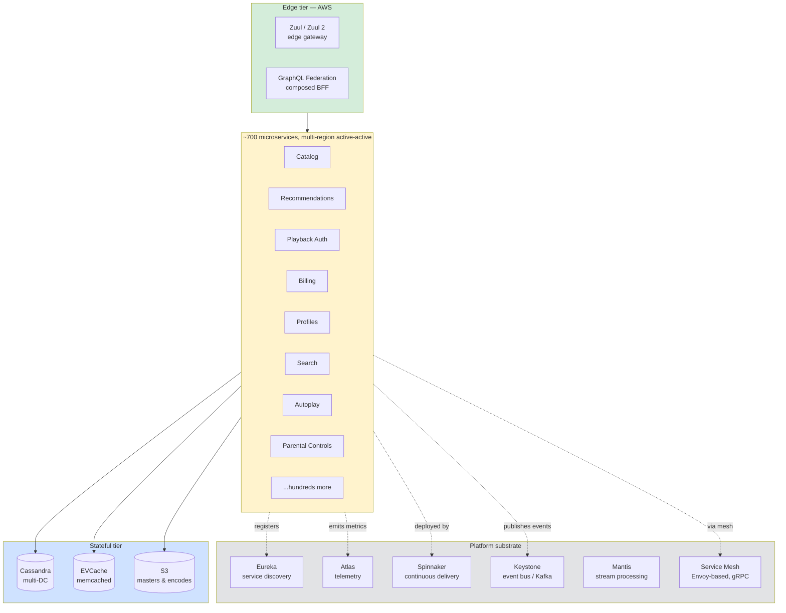
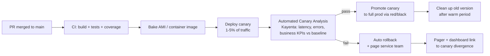
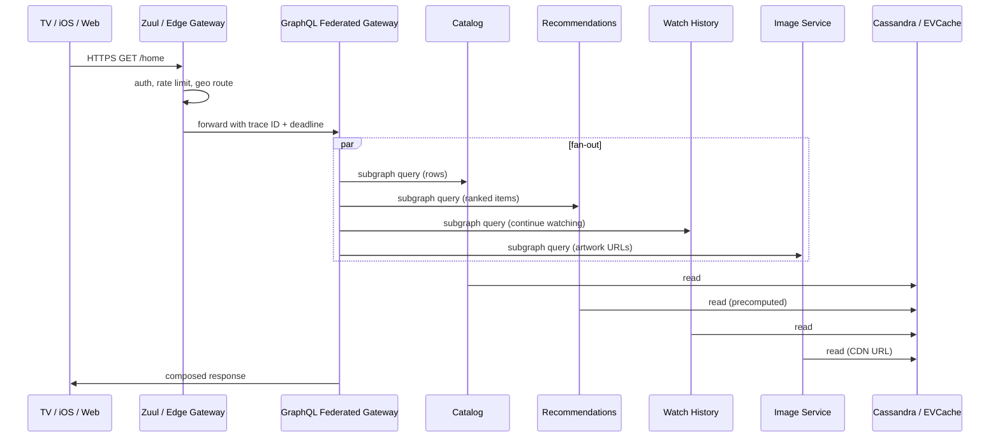

# Netflix Deep Dive — Microservices on AWS

**Date:** 2026-04-29 | **Updated:** 2026-04-29
**Tags:** `system-design` `case-study` `netflix` `deep-dive` `microservices` `aws`

## Summary

Netflix is the canonical microservices reference for a reason: somewhere around **700 production services** running across multiple AWS regions in active-active, deployed thousands of times per day, with a platform investment that the public copy-paste version of "microservices" almost always omits. The story has two acts. Act one is **the AWS migration** — an eight-year, datacenter-to-cloud effort completed in early 2016, triggered by a 2008 datacenter database corruption that took streaming offline for three days. Act two is **the platform tax** — the OSS generation (Hystrix, Eureka, Ribbon, Zuul, Archaius) Netflix built and open-sourced because the operational fixed cost of running hundreds of services was unbearable without it, and the modern generation (Spinnaker for delivery, Atlas for telemetry, Mantis for stream processing, plus internal mesh tooling) that replaced or augmented the OSS layer once the industry caught up. The architectural lessons that survive: **smart endpoints with dumb pipes**, **resilience as a first-class concern** (the bulkhead and circuit-breaker patterns crystallised at Netflix), **chaos engineering as routine practice** (Chaos Monkey was born here, in 2011), and **multi-region active-active** as the only credible answer to "what if AWS loses a region?" This deep dive companion to the parent Netflix case study unpacks the migration timeline, the OSS legacy and what replaced it, the deployment cadence and inter-service communication patterns, and the anti-patterns that show up when the platform investment is skipped.

## Table of Contents

- [Summary](#summary)
- [Overview](#overview)
- [Migration to AWS](#migration-to-aws)
- [OSS Legacy Stack](#oss-legacy-stack)
- [Modern Stack](#modern-stack)
- [Service Mesh Adoption](#service-mesh-adoption)
- [Multi-Region Active-Active](#multi-region-active-active)
- [Chaos Engineering — Origin Story](#chaos-engineering--origin-story)
- [Deployment Cadence](#deployment-cadence)
- [Inter-Service Communication Patterns](#inter-service-communication-patterns)
- [Observability Stack](#observability-stack)
- [Anti-Patterns](#anti-patterns)
- [Related](#related)
- [References](#references)

## Overview

> **Companion to:** [Design Netflix — Global Video Streaming](../design-netflix.md). The parent doc has the full system context (data plane vs control plane, encoding pipeline, recommendations, DRM). This deep dive zooms in on the control-plane microservices architecture on AWS — the pieces called out in that case study's "Microservices Architecture on AWS," "Multi-Region Active-Active," and "Chaos Engineering" sections. Read the parent first if you have not.

Netflix's control plane — search, browse, recommendations, billing, profiles, autoplay, parental controls, playback authorization — runs as a fleet of roughly 700 microservices on AWS. The number is a public estimate Netflix has cited for years; the exact count moves daily as services are spawned, merged, and retired. What matters is the shape: **each service is owned by one small team, deploys independently, owns its data, and exposes versioned contracts.** No service team needs another team's permission to ship code.

The control plane is **not** the streaming plane. Video bytes do not flow through AWS — they flow through **Open Connect Appliances (OCAs)** embedded inside ISP networks. AWS hosts the metadata, the recommendations, the licensing handshake, and the URLs that point clients at the right OCA. That separation is the single most important architectural decision Netflix ever made; without it, the AWS bill and the AWS reliability surface would both be unmanageable. See the parent doc for the data-plane / control-plane split.

The interesting architectural surface is the **platform substrate** — the boxes on the right. Without them, 700 services is a death sentence. With them, 700 services is a roadmap.

## Migration to AWS

The migration to AWS is the single most-cited cloud migration in the industry, and the dates matter:

| Date | Event |
|------|-------|
| **August 2008** | Database corruption in Netflix's own datacenter takes streaming offline for ~3 days. The DVD-shipping side of the business survives; streaming does not. |
| **2008–2009** | Decision to migrate to AWS. Reasoning: undifferentiated heavy lifting (racks, power, networking) was not Netflix's core competency, and a vertically-scaled relational DB on Netflix-owned hardware had just proven catastrophic. |
| **2010** | First customer-facing services move to AWS. The streaming control plane begins running on EC2 + Cassandra. |
| **2011** | Chaos Monkey is built and deployed in production. |
| **2012** | Hystrix, Eureka, Ribbon, and most of the early Netflix OSS suite are open-sourced. |
| **January 2016** | Netflix announces the migration is complete. The last datacenter workload — billing — moved to AWS. **Eight years end-to-end.** |
| **2016 onward** | Modern stack (Spinnaker open-sourced 2015; Atlas, Mantis published; service mesh adoption begins) |

Two things stand out:

**It took eight years.** Not eight months. Not even two years. The migration ran in parallel with feature work, in parallel with subscriber growth from ~10M to ~75M, and in parallel with the global expansion to 130+ countries (early 2016). The number of executives who pitch "we'll be on the cloud by Q3" without understanding this is large.

**The trigger was a reliability event, not a cost story.** Netflix did not move to AWS because AWS was cheaper — it moved because owning hardware had failed catastrophically and AWS offered horizontally-scalable infrastructure with regional isolation. Cost optimisation came later (Spot, Reserved Instances, and the encode farm running on EC2 Spot are major line-items today), but the original motivation was **scale-out reliability via cattle-not-pets infrastructure.**

Architectural decisions made during the migration that still hold:

- **Cassandra over relational.** The 2008 corruption was on a single-master relational DB. Netflix replaced it with Cassandra — peer-to-peer, multi-master, cross-DC asynchronous replication. The model fit the access pattern: high write throughput, eventually-consistent reads, no global transactions across the catalog. The Oracle license bills also did not survive the analysis. The deeper move was philosophical: pick a data store whose **failure modes match the operational model you can actually run**, rather than buying the strongest consistency guarantee and paying for it on every write.
- **Stateless application services.** Every microservice is stateless; state lives in Cassandra, EVCache, or S3. Any instance can be replaced; autoscaling and chaos events become safe. A pod that holds session state in process memory is a pet; a pod that reads session state from EVCache on each request is cattle. The discipline applies recursively: nothing important lives only in one process.
- **Region as the failure unit.** From the start, the architecture assumes a region can disappear. Multi-region active-active was not a v2 retrofit; it was a Day 1 constraint. The corollary: there is no "primary region" for control-plane services. Writes go to the local region; replication is asynchronous; no region is special.
- **Cattle, not pets.** No SSH-into-the-box debugging. No hand-tuned servers. AMIs are baked, deployed, and replaced. Failure response is "kill it and let autoscaling replace it." If a node looks bad, it is terminated, not investigated. Investigation happens on aggregated metrics and traces, not on a hand-picked outlier.
- **Immutable infrastructure.** Each deploy bakes a fresh AMI (and now container image) — the running fleet is replaced, not patched. The implication is that runtime configuration must be externalised (Archaius / dynamic config), because patching a config file on a running box is forbidden.

The migration also forced a deep cultural shift to **"you build it, you run it"** — service teams own production. There is no separate ops team taking pages on behalf of dev. That cultural shift is what made the rest of the platform investment possible; without on-call ownership, nobody has the incentive to fix flaky services. The platform team builds the substrate (Spinnaker, Atlas, the mesh); the service team builds the service and is paged when it breaks. The two are different jobs with different career ladders.

What the migration deliberately did *not* do:

- **No lift-and-shift.** Netflix did not move VMs from datacenter to AWS unchanged. Every service was rebuilt around the cloud-native primitives (autoscaling groups, regional isolation, S3, Cassandra). Lift-and-shift would have moved the datacenter problem into AWS at higher cost. Many enterprise migrations skip this step and then wonder why their AWS bill is higher than their datacenter bill.
- **No multi-cloud.** Netflix runs on AWS, with brief experimental work elsewhere. The decision was deliberate: multi-cloud doubles the platform investment for limited reliability gain when chaos engineering and active-active across AWS regions already cover the failure modes that matter. Multi-cloud is a much harder bet than its advocates usually admit.
- **No big-bang cutover.** Each service migrated on its own timeline. The DVD-shipping side stayed on the datacenter for years after streaming had moved. The billing service was the *last* migration and ran in parallel for an extended period before cutover. The principle: pick the smallest movable unit, prove it in production, then move the next one. The cost of running parallel infrastructure during the migration was real but bounded; the cost of a botched big-bang would have been existential.

A useful framing for any team contemplating a major migration: **the migration is itself a feature your team is shipping**, and it competes with every other feature for engineering capacity. It needs a roadmap, milestones, observability, rollback plans, and on-call coverage just like a product launch. Treating it as "background infrastructure work" is how migrations slip by years and produce hybrid environments that nobody can debug. Netflix's migration succeeded because it was prioritised at the executive level and resourced like a product, not because the engineers were uniquely talented.

## OSS Legacy Stack

Between 2010 and ~2015, Netflix was the only large engineering org running hundreds of microservices on AWS, and the tools to do it sanely did not exist. So they built them, and then open-sourced most of the suite. The pattern: **solve the operational problem internally, then ship it to the community.**

The classic Netflix OSS suite:

| Component | Purpose | Status (2026) |
|-----------|---------|---------------|
| **Hystrix** | Circuit breaker, bulkhead, fallback for synchronous calls | Archived. Maintenance mode since 2018, repository archived. Replaced internally by lighter-weight resilience patterns; replaced externally by Resilience4j. |
| **Eureka** | Client-side service discovery registry | Still actively maintained. Used internally and widely externally via Spring Cloud. Increasingly augmented or replaced by Kubernetes-native discovery. |
| **Ribbon** | Client-side load balancer (round-robin, weighted, etc.) | Maintenance mode. Replaced by gRPC's native client-side load balancing internally; Spring Cloud LoadBalancer is the external successor. |
| **Zuul** | Edge gateway (auth, routing, observability, traffic shaping) | Zuul 2 (async, Netty-based) shipped 2018; still actively used at the edge alongside GraphQL Federation for newer surfaces. |
| **Archaius** | Dynamic configuration (runtime config changes without redeploy) | Maintenance mode. Internal successors and Spring Cloud Config externally. |
| **Servo** → **Spectator** | Application metrics instrumentation | Spectator is current. Spectator emits to Atlas. |

Why each one mattered:

**Hystrix** crystallised the **circuit breaker** and **bulkhead** patterns for the industry. Before Hystrix, "what happens when service B is slow and service A is in a tight retry loop calling it?" was answered by "production goes down." Hystrix wrapped every dependency call in a command with a timeout, a circuit breaker (open after N failures, half-open after a cooldown), a thread pool or semaphore to bound concurrency (the bulkhead), and a fallback. The patterns survived even though the library is now archived — Resilience4j is the modern Java port of the same ideas, with a smaller footprint and reactive support. The Netflix announcement that Hystrix was going into maintenance mode in 2018 was not a retreat from the patterns; it was an admission that the library had grown heavyweight and the team's internal needs had shifted to lighter-weight, asynchronous-friendly alternatives.

**Eureka** is a peer-to-peer service registry: instances register themselves, send heartbeats, and clients pull the registry locally and load-balance against it. The peer-to-peer replication and the **self-preservation mode** (don't deregister instances en masse during a network partition) were specifically designed for AWS's failure modes, where a transient network blip might otherwise drain an entire AZ from the registry. Compared to ZooKeeper-based discovery, Eureka explicitly chooses **AP over CP** — the registry favours availability over consistency, and stale entries are preferable to a dark registry. This is the right trade-off for service discovery at scale.

The reasoning is worth making explicit: if the registry is the single source of truth for "where is service X?" and the registry is unavailable, *no requests can be routed*. A consistent-but-down registry causes a global outage; a stale-but-up registry causes some routes to fail and retries to recover. The latter is strictly preferable. The same calculus drives the choice of multi-master Cassandra over single-master Postgres, and DNS-based regional routing over a centralised global router.

**Zuul** is the edge: every external request hits Zuul before reaching a service. It does authentication, request routing, geographic routing, A/B test traffic splitting, retry policy, request shadowing, and edge-level chaos injection. Zuul 1 was synchronous (one thread per connection, blocking I/O); Zuul 2 is asynchronous (Netty-based, event-loop, non-blocking) and was specifically built to handle the connection-counting problem at edge scale. Zuul was the inspiration for Spring Cloud Gateway and influenced the design of many modern edge gateways.

**Ribbon** was client-side load balancing — instead of going through a hardware load balancer, each client (service A calling service B) embeds the registry client and picks an instance directly. This avoids a network hop and a SPOF. Modern gRPC has client-side LB built in, so Ribbon's role has shrunk; but the architectural choice — **client-side over hardware LB** — survived.

**Archaius** addressed dynamic config: runtime knobs that can be flipped without a deploy. Feature flags, kill switches, traffic ratios, retry budgets, timeout values. Netflix has long used dynamic config aggressively as a **degradation lever** during incidents — turn off the recommendation re-ranker, fall back to last-known list, route traffic away from the broken region.

What the OSS stack got right:

- **Resilience patterns are a first-class concern, not an afterthought.** Every dependency call goes through a wrapper that has a timeout, a circuit breaker, and a fallback. There is no "and then it called the database without a timeout" in production code.
- **Client-side discovery and LB.** No central LB SPOF. No DNS TTL games. Clients pull the registry, cache it, and route directly.
- **AP-over-CP for cross-cutting infrastructure.** A discovery registry that is stale-but-available is strictly better than a registry that is fresh-but-down.

What it got wrong (in retrospect):

- **Heavy per-call instrumentation.** Hystrix command objects and thread-pool isolation were expensive. At p99, the library was a measurable fraction of latency. Modern alternatives (Resilience4j's semaphore-based isolation, gRPC's native deadlines) are lighter.
- **Synchronous-first.** Most of the OSS suite assumes blocking I/O. Async/reactive (Project Reactor, Netty event loops) was retrofitted later, with friction.
- **Library-per-language proliferation.** A Java service mesh in libraries means that every new language (Python for ML, Node for some BFFs) needs a re-implementation of the same patterns. This is the gap that **service mesh** later filled.

Spring Cloud Netflix took the OSS suite to the wider Java ecosystem. As of Spring Cloud Greenwich (2019), most of the Spring Cloud Netflix integrations are in maintenance mode — Eureka and Atlas are the survivors — and Spring Cloud has migrated to its own load balancer, Spring Cloud Gateway, and Resilience4j as the recommended successors.

There is a meta-lesson in the OSS suite's lifecycle worth naming. Netflix open-sourced these tools when they were the only org running at this shape, and the industry adopted them because nothing else existed. As Kubernetes, Envoy, gRPC, and OpenTelemetry matured, the industry's commodity baseline caught up to (and in places surpassed) the Netflix-specific OSS layer. Netflix's response was to **shift internally to the commodity baseline rather than maintain a parallel Netflix-only stack.** Hystrix went into maintenance mode not because it was wrong, but because Resilience4j and the service mesh did the same job with less code. Ribbon was retired because gRPC's native LB does what Ribbon did. Eureka survives because the AP-over-CP design choice is still differentiated against most alternatives.

The pattern for any platform team to study: **build only what is genuinely differentiated for your scale; adopt commodity infrastructure for everything else.** The mistake is to keep maintaining a Netflix-vintage tool because it is "ours" when the industry has moved on. Netflix has been disciplined about this; many other large engineering orgs have not.

## Modern Stack

The modern Netflix platform replaces or augments the OSS layer. The headline tools:

**Spinnaker — continuous delivery.** Open-sourced 2015, jointly built with Google. Spinnaker is a multi-cloud CD platform: pipeline definitions, immutable AMI/container deploys, **canary analysis**, automated rollback, and red/black or blue/green deployment strategies. Every Netflix service team uses Spinnaker to ship code; "deploy" is a button that runs a pipeline, bakes an image, rolls a canary, runs automated canary analysis (ACA — comparing canary metrics against baseline), and either promotes or rolls back. The tool exists because at hundreds of services and thousands of deploys per day, hand-rolled pipelines are not survivable. See [https://spinnaker.io/](https://spinnaker.io/) for the documentation.

**Atlas — telemetry.** Atlas is a dimensional time-series database built for high-cardinality, low-latency operational metrics. The published numbers are in the **billion-metrics-per-minute** range. Atlas favours short retention at high resolution (current state and recent past) over long retention; a separate system handles archival. The query language (Atlas stack-language) is built for dashboards and alerts, not ad-hoc analytics. Spectator is the client library that emits metrics from services into Atlas. Together they replace the older Servo + custom-DB pipeline.

**Mantis — stream processing.** A custom stream-processing platform for operational use cases: real-time anomaly detection, drilldown into live error streams, ad-hoc queries against in-flight event firehoses. Mantis sits next to Keystone (the Kafka-based event bus) — Keystone moves events durably; Mantis answers "what is happening right now and why?" in seconds. Mantis is what makes "your service started erroring 30 seconds ago, here's the per-region breakdown" possible without dumping to a data warehouse and waiting.

**Keystone — event pipeline.** Kafka-based, Netflix's internal event bus. Service A emits events; service B consumes them. Keystone handles partitioning, routing, schema registry, and cross-region replication. This is the substrate for asynchronous communication between services — domain events that update a customer's watch history, viewing telemetry that drives recommendations, billing events.

**Titus — container scheduler.** Netflix's own scheduler, originally Mesos-based, more recently Kubernetes-aware. Titus runs the container fleet; service teams declare what they want; Titus places it. Titus exists because at Netflix scale, generic Kubernetes scheduling did not match the operational shape (immutable AMIs, AWS-native autoscaling groups, deep integration with Spinnaker). The industry has caught up; the gap has narrowed. Most enterprises adopting microservices today should default to Kubernetes (or a managed equivalent) rather than building a Titus.

**Cosmos / Conductor — workflow orchestration.** For batch and long-running workflows (the video encode pipeline, content lifecycle workflows), Netflix uses orchestrators rather than synchronous chains. Conductor was open-sourced; Cosmos is the modern internal evolution. The lesson generalises: **anything that takes longer than a single HTTP timeout should not be a synchronous chain of services.** Model it as a workflow with explicit state, retries, compensations.

The pattern across the modern stack: **lighter-weight where the OSS layer was heavy, more language-agnostic where the OSS layer was Java-centric, more reactive/async where the OSS layer was blocking.** The shift from Hystrix's thread-pool bulkheads to semaphore-based isolation; the shift from Servo's per-metric overhead to Spectator's batched emission; the shift from Ribbon's per-call balancing to gRPC's native LB and service mesh — all the same direction.

The other pattern worth naming: **the OSS suite was language-coupled (Java); the modern stack is language-agnostic (sidecars, gRPC, Protobuf).** Netflix's internal language story has broadened — Python for ML and data, Node for some BFFs, Go for proxies and infrastructure tooling, Java still for most OLTP services. The mesh and gRPC are the lingua franca that lets these coexist without re-implementing resilience six times.

## Service Mesh Adoption

The service mesh question at Netflix is "how do you replace the per-language client library suite (Hystrix + Eureka + Ribbon + ...) with a sidecar that every language can use?"

The motivation matters. The OSS suite was effectively a **service mesh implemented as Java libraries** — each service linked Hystrix, Eureka client, Ribbon, Spectator, and got resilience, discovery, LB, and metrics for free. The cost was that every change to the resilience layer required coordinating an upgrade across hundreds of services, and any service in a non-Java language had to re-implement the same surface. The sidecar model moves the same logic to a co-located proxy (Envoy), giving every language the same behaviour through the same control plane. The library-per-language tax disappears.

The answer Netflix has converged on (publicly described in their tech blog and conference talks) is an **Envoy-based mesh, gRPC-first**, with internal control-plane tooling rather than off-the-shelf Istio. The reasons are operational: at Netflix's scale and Netflix's specific platform integrations (Eureka, Spinnaker, Atlas), the off-the-shelf control plane was a poor fit, and the marginal value of adopting it over building a custom one was negative.

What the mesh provides:

- **mTLS between services** without per-service certificate management.
- **Per-call retry, timeout, circuit-breaking** in the sidecar — no library required.
- **Traffic shaping** (canary routing, traffic shifting between versions) configured centrally.
- **Telemetry uniformity** — every call emits a span and metrics from the sidecar, regardless of the service's language.
- **Service-to-service identity** propagated via SPIFFE-style IDs in mTLS certs, avoiding token-based auth on every internal call.

What the mesh does not replace at Netflix:

- **Application-level resilience patterns.** Fallbacks, degraded responses, hedged requests — these stay in the service.
- **Domain-aware retry budgets.** "Retry exactly once for an idempotent read; never retry a payment." That logic lives in the service, not the mesh.
- **Schema evolution.** Protobuf field rules and deprecation policies are owned by the service team.

The mesh is for **transport concerns**; the service is for **business concerns**. The line is the same one drawn in the SOA / ESB lesson — the moment the mesh starts holding business logic (a routing rule that depends on the contents of the payload, a transformation that rewrites field names), it becomes a new ESB and the failure mode follows.

The honest current state is that the mesh adoption inside Netflix has been incremental rather than big-bang. Some services run with the full sidecar; others still rely on Eureka + library-based clients. The transition is multi-year, and the platform team's job is to make the migration path so easy (auto-injection, automatic feature parity) that service teams have no incentive to stay on the old stack. The same transition is happening at most large engineering orgs that adopted Netflix OSS in the 2014–2018 window.

See [Service Mesh As An Architectural Decision](../../../architectural-styles/service-mesh-as-architectural-decision.md) for the broader pattern.

## Multi-Region Active-Active

Multi-region active-active is the only way Netflix survives a regional AWS outage with the streaming experience intact. The current public picture: traffic flows simultaneously through `us-east-1`, `us-west-2`, and `eu-west-1`, with regional capacity sized to absorb the failure of any one region.

The architectural pieces:

- **Cassandra** runs as a multi-DC cluster. Writes go to local quorum (`LOCAL_QUORUM`); cross-region replication is asynchronous and eventually consistent. Convergence is typically hundreds of milliseconds. The choice of `LOCAL_QUORUM` over `EACH_QUORUM` is deliberate — local writes succeed even when a peer region is degraded.
- **EVCache** (Netflix's memcached layer) replicates writes to remote regions and uses **SQS-based invalidation messages** to keep regional caches coherent. When a write in `us-east-1` invalidates a cached entry, an SQS message tells `eu-west-1` to drop its copy.
- **Stateless services** are deployed identically per region, autoscaled independently. The region is the unit of capacity planning.
- **DNS-based routing** (Route 53 + custom logic) sends each request to the nearest healthy region. Health is measured per region; failover is a routing change, not a deploy.
- **OCAs are independent of AWS regions.** A control-plane regional failure does not stop video bytes from flowing — the OCAs already have the encodes, and a mid-playback session does not need the control plane to keep delivering segments.

The famous public number is **~7 minutes for global traffic shift** when a region is taken offline. That number is what enables Chaos Kong (next section) to be safe to run.

The hard part of active-active is not the routing; it is the **data**. Every state-changing operation must be authoritatively replicated, conflict-resolution policy must be defined per dataset (last-write-wins, vector clocks, application-level merge), and the application code must tolerate stale reads in the gap window. Netflix invests heavily in **idempotency keys** for state-changing endpoints precisely because cross-region async replication makes "did this write actually happen everywhere?" a hard question.

A subtle property worth naming: **Netflix's active-active is asymmetric in steady state.** Each user is "sticky" to a region — Route 53 routes them by geography to their nearest healthy region. Cross-region traffic is the exception, not the norm. This matters for cache hit rates (EVCache in `us-east-1` is warm for east-coast users) and for replication lag tolerance (a user reading their own writes from their own region's Cassandra hits `LOCAL_QUORUM` — fresh — without waiting for cross-region replication). The hard cases are the user who travels between regions and the user whose region just failed over; both are tolerated via session-level read-your-writes patterns rather than global linearizability.

The cost of running active-active is roughly **N × the per-region capacity** to absorb the failure of any one region. With three regions and the ability to lose one, each region runs at ~67% capacity in steady state — 33% of compute is "idle insurance." This is the single largest line item that "just put it on a CDN" advice misses; the insurance is the price of survival, and Netflix pays it deliberately.

See [Multi-Region Architectures](../../../reliability/multi-region-architectures.md) for the broader pattern.

## Chaos Engineering — Origin Story

Chaos engineering as a discipline was invented at Netflix. The timeline:

- **2010** — Netflix is migrating to AWS and starts seeing AWS-specific failure modes (instance termination, AZ-level events). The team realises they need to test these in production, because reproducing them in staging is fundamentally impossible.
- **2011** — **Chaos Monkey** is built. It runs during business hours, randomly terminating EC2 instances in production. The principle: every service must be resilient to losing a random instance, and the only way to enforce that is to actually do it. Open-sourced **2012**.
- **2012–2014** — The **Simian Army** expands: Latency Monkey (injects RPC latency), Conformity Monkey (terminates instances that fail conformity checks), Doctor Monkey (health checks), Janitor Monkey (cleans up unused resources), Security Monkey (compliance checks).
- **2014** — **Chaos Gorilla** kills an entire AWS Availability Zone in production. The escalation forces every service to be multi-AZ.
- **2014–2015** — **Chaos Kong** kills an entire AWS region. This is what forced multi-region active-active. You cannot survive a region failure if you have never experienced one; so the team makes it happen on purpose, on a schedule.
- **2015 onward** — **ChAP (Chaos Automation Platform)** runs targeted, hypothesis-driven failure experiments rather than blunt instance termination. Inject latency into call X for 1% of traffic for 10 minutes; measure the user-visible impact.

The principle that makes chaos engineering more than "let's break things":

> Failures that are not exercised regularly are failures you do not actually handle.

If your runbook says "in case of regional failure, traffic will fail over within 7 minutes," and you have never actually failed a region, the runbook is fiction. Run Chaos Kong on a Tuesday afternoon. Either it works, or you learn what is broken. Either outcome is useful.

The cultural prerequisites are easy to undersell:

- **Push the failure into business hours.** A 3 AM real outage is solved by a tired person; a 2 PM scheduled chaos event is solved by the team that owns the affected service. The signal-to-noise is dramatically better.
- **Bound the blast radius.** ChAP's hypothesis-driven approach is the modern answer: pick a small percentage of traffic, define an abort condition, run for a bounded time. If the impact crosses a threshold, abort automatically.
- **Make it cheaper to be resilient than to opt out.** If a service team can mark themselves "exempt from chaos," they will, and the architecture will rot. Netflix's answer: chaos is opt-out only with a strong justification, and exemptions get reviewed.
- **Chaos requires observability first.** A chaos experiment without metrics is vandalism. Atlas, tracing, and Mantis are prerequisites — without them, you cannot tell whether the experiment succeeded, failed safely, or caused undetected damage. The order of investment is non-negotiable: observability, then chaos.
- **The runbook is part of the experiment.** A chaos event that reveals "we don't know how to roll back" is more valuable than one that reveals "we need to add a retry." The first time you exercise a runbook should not be at 3 AM.

The Netflix lesson that generalises beyond Netflix: **chaos engineering is a forcing function on architecture quality.** Once Chaos Kong is on the schedule, multi-region active-active stops being a "v2" item; it becomes Tuesday's deadline. Once Chaos Monkey is running, every service is forced to be resilient to instance loss. The architectural quality is enforced by the failure schedule, not by code review.

See [Chaos Engineering and Game Days](../../../reliability/chaos-engineering-and-game-days.md) for the broader pattern.

## Deployment Cadence

The headline number from Netflix engineering talks: **multiple deploys per day per service**, across hundreds of services, summing to thousands of production deploys per day across the platform. Some services deploy continuously on every merge; others deploy on a daily cadence. There is no central release calendar.

What makes that cadence safe:

- **Spinnaker pipelines.** Every service has a CD pipeline: build → bake AMI/container → deploy canary → automated canary analysis (ACA) → promote or rollback. The pipeline runs on every merge that crosses a threshold (test pass, lint pass, coverage). Rollback is automatic when canary metrics deviate.
- **Automated canary analysis (ACA).** A canary instance receives a small fraction of traffic; its metrics (latency, error rate, business KPIs) are statistically compared against the baseline (current production). If the canary is significantly worse, the deploy is automatically rolled back. Kayenta is the open-sourced ACA component.
- **Red/black (blue/green) deploys.** New version stands up alongside old version; traffic flips when ready; old version stays warm for fast rollback. Netflix's specific dialect uses this with autoscaling-group swaps.
- **Feature flags as a separate axis from deploy.** A deployed-but-disabled feature is an artefact, not a release. Releases happen via flag flips, often gradually (1% → 5% → 25% → 100%) with each step measured. This decouples deploy risk from release risk.
- **Backwards-compatible APIs.** Producers can ship new fields; consumers can ignore unknown fields. Deprecations are explicit and gated. Without this discipline, multiple-deploys-per-day is a contract-breaking treadmill.
- **Owned on-call.** The team that ships the deploy is the team that gets paged if it fails. The incentive structure for "is this deploy safe?" is internal, not enforced by a release management board.

The rate is enabled by the platform; the safety is enabled by the patterns. **Netflix can deploy thousands of times per day because their canary analysis is statistically rigorous, their rollback is automated, and their on-call ownership is honest.** Without those, "deploy fast" becomes "break fast." The reverse engineering of the cadence ("how do they ship so often?") usually skips the platform investment that makes it possible.

A concrete shape of a Spinnaker pipeline:

The pipeline is cookie-cutter across services — a service team's pipeline is not a custom project, it is a template instantiation with service-specific parameters. New services inherit the deploy story.

Two specific Netflix patterns worth highlighting because they are widely under-adopted:

- **Sticky canary cohorts.** A canary should not just receive 1% of random traffic; it should receive 1% of *consistently sampled* traffic, so that user-level metrics (sessions started, abandons) are comparable. Random per-request canary routing pollutes session-level KPIs.
- **Automated rollback with a delay.** A canary that looks bad for 30 seconds may be a one-off; a canary that looks bad for 5 minutes is a regression. The rollback decision is averaged over a window. Without the window, deploys flap. Without rollback, regressions ship.
- **Production traffic, not synthetic.** Canaries receive real traffic. Synthetic load tests are useful for capacity planning, but a synthetic load cannot reproduce the long tail of real-world request shapes that will actually find regressions. The cost of using real traffic is that the affected user count must be bounded; the benefit is that the comparison is meaningful.
- **Region-staggered rollouts.** A change rolls to one region first; only after it is healthy does it propagate. This bounds the blast radius of a regression that the canary failed to detect. The rollout pace is itself tunable per service — a payments service might roll over hours; a recommendation re-rank might roll in minutes.

The deploy cadence number is misleading without the qualifier: **most deploys are no-op for users.** A new build that adds a log line, refactors an internal method, or updates a dependency does not change user-visible behaviour. The thousands-per-day count includes those. The user-visible feature changes are gated separately by feature flags and rolled gradually. The cadence is about reducing the *deploy-to-observable-effect* distance, not about shipping new features every minute.

## Inter-Service Communication Patterns

Within Netflix, services talk to each other in several ways:

**Synchronous request/response — gRPC.** The current default for service-to-service request/response is gRPC. Protobuf contracts, native client-side load balancing, deadlines propagated end-to-end, bidirectional streaming when needed. Older surfaces still use REST/JSON; new internal services default to gRPC. The migration from Hystrix-wrapped REST clients to gRPC + service mesh is a multi-year effort.

**Asynchronous events — Keystone (Kafka).** Domain events flow over Keystone. A profile update emits an event; the recommendations service consumes it; the search index re-indexes. Producers do not know who consumes; consumers do not know who produces. This decoupling is what allows independent deploys without coordinated releases.

**GraphQL Federation at the edge.** External clients (web, mobile) increasingly hit a GraphQL Federated gateway. Each microservice owns a GraphQL subgraph; the gateway composes them at the edge. This solves the **client-driven aggregation problem**: an iOS home screen needs data from 12 services, and without aggregation, that's 12 round trips on a flaky LTE connection. With federation, it is one request that fans out internally and composes the response. Apollo Federation is the protocol; Netflix has been a major contributor to its evolution.

**Backend-for-Frontend (BFF).** Earlier than GraphQL Federation, Netflix used per-device-class BFFs (one for web, one for iOS, one for Android, one for TV). Each BFF aggregates the services its client needs and shapes the response for that surface. BFFs survive even with GraphQL Federation, because some surfaces (TV devices with limited compute) need pre-shaped responses rather than client-side selection. The principle: the device class is a real architectural seam — a TV cannot do what an iPhone can, and pretending they consume the same API is a tax paid in either CPU on the device or bandwidth on the wire.

**Falcor (legacy).** Before GraphQL Federation, Netflix used Falcor — a Netflix-built JSON-graph protocol for client-driven data fetching. Falcor solved roughly the same problem as GraphQL: let the client describe what it needs and have the server fetch from many backends. The industry converged on GraphQL; Netflix migrated. Falcor is a useful historical reference for "why client-driven aggregation is necessary at this scale," but new work uses GraphQL Federation.

**Resilience patterns at every call site.** Whether the call is gRPC, REST, or via the mesh, the contract is the same:

- A **deadline** propagates from the edge inward. If a request budget is 500 ms, every internal call is bounded by the remaining budget. No internal call ever blocks indefinitely.
- A **fallback** is defined for every dependency. If recommendations is down, fall back to a last-known list cached in EVCache. If billing is down, fail closed (refuse to authorize new playback) but let mid-playback continue.
- A **circuit breaker** (now mesh-managed in many cases, formerly Hystrix-managed) opens after consecutive failures and half-opens after a cooldown. While open, the fallback runs; the upstream service is given time to recover.
- A **bulkhead** (concurrency cap) prevents one slow dependency from exhausting the calling service's threads. Originally Hystrix thread pools; now typically semaphores in mesh or in lightweight resilience libraries.
- **Hedged requests** — for read paths, send two requests to two replicas after a short delay; take the first response. Trades a small extra cost for tail-latency reduction.
- **Idempotency keys** — for write paths, every state-changing call carries a key. Duplicate retries are deduplicated server-side. Without this, retries corrupt state.

A worked example of the resilience patterns combined: a playback authorization request comes in at Zuul with a 1500 ms deadline. Zuul forwards to the GraphQL gateway with the remaining budget. The gateway fans out to playback-auth, license-server, and CDN-routing services. Each fan-out call has its own deadline (say 400 ms) bounded by the parent budget. The license-server call is wrapped in a circuit breaker — if it has been failing, the breaker is open and a cached license is returned (degraded but functional). The CDN-routing call is hedged — two requests to two regions, take the first response. The playback-auth call is non-hedged because it is a write; instead, it carries an idempotency key so a retry is safe. If everything succeeds, the user starts playing in 600 ms; if license-server is down, the user starts playing with last-known DRM in 700 ms; if CDN-routing is degraded, one region answers and the user gets a slightly suboptimal CDN selection. The user almost always gets a response; the worst case is a degraded experience, not an outage.

This is the difference between a system that *handles* failures and one that *propagates* them. Netflix's resilience investment is what keeps the failure local to the service that broke, rather than letting it cascade to the user.

The order of preference inside Netflix is asynchronous-first where the domain allows it (event-driven flows, eventually-consistent projections), synchronous gRPC where a fresh response is required (playback authorization, billing decisions). The dangerous middle ground — long synchronous chains where service A calls B calls C calls D — is actively engineered out, because end-to-end p99 multiplies along the chain and any link's outage propagates upward.

A concrete sketch of a typical "homepage load" request flow:

Three things to notice:

1. **Fan-out, not chain.** GraphQL Federation parallelises the calls. Total latency is `max(subqueries)`, not `sum(subqueries)`.
2. **Deadline propagation.** The deadline set at Zuul (say 1500 ms) propagates to every subquery. A slow subquery cannot block the response past the budget; it returns null/fallback and the page renders incomplete rather than not at all.
3. **Cache-first reads.** Most subgraph queries are EVCache hits with Cassandra as fallback. The hot path does not touch Cassandra under steady-state load; it touches the in-memory cache layer.

This is the shape that lets Netflix render a home screen in hundreds of milliseconds despite 20+ services contributing to the response.

## Observability Stack

Observability at 700-services scale is its own engineering discipline. The components:

- **Atlas** — operational metrics, dimensional time series, billion-metrics-per-minute scale. Real-time dashboards and alerts. Spectator client library on every service.
- **Mantis** — real-time event-stream queries. "What is happening right now in this dimension?" answered in seconds against the live event firehose.
- **Distributed tracing** — Netflix has its own internal tracing system, with broad OpenTelemetry adoption underway. Every external request gets a trace ID at Zuul; the ID propagates through every internal hop. Sampled traces (because storing every span at this scale is prohibitive) are analysed for latency hotspots.
- **Structured logging** — every log line is JSON with trace ID, request ID, service name, version. Correlates with traces and metrics.
- **Edge observability** — Zuul records request-level data (latency, error class, downstream service) at the edge. This is the canonical view of "what is the user experiencing?" because it is the first internal hop.
- **Per-deploy canary analysis (Kayenta)** — automated statistical comparison of canary vs baseline metrics, gating Spinnaker deploys.

The principle that ties them together: **observability is not "logs"; it is the joint ability to ask new questions about production without shipping new code.** Metrics for known questions; traces for cross-service flow; logs for forensic detail; Mantis for real-time exploratory questions. A platform team owns each pillar and a per-service standard library makes instrumentation cheap.

The cost is real. Spectator + Atlas + tracing are not free in CPU or in storage; the platform team negotiates retention and cardinality budgets. "Why are my metrics getting dropped?" usually means "your cardinality is too high" — a high-cardinality label (user ID in a metric, request ID in a counter) explodes the dimensional space and makes Atlas miserable. The discipline of **bounded cardinality** (no unique IDs as labels; instead, log them with traces) is part of the platform's operational rules.

A workable observability budget at this scale follows a 1/10/100 ratio:

| Pillar | Coverage | Cost shape |
|--------|----------|------------|
| **Metrics (Atlas)** | 100% of requests, low-cardinality labels | Cheap per request, expensive in cardinality |
| **Traces** | 1–5% sampled at the edge, head-based + tail-based for errors | Moderate per sampled request |
| **Logs** | Bounded structured logs at error/warn level; full debug on demand | Expensive per request; storage-bound |
| **Mantis** | Ad-hoc, on-demand queries against live event firehose | Allocated per query, not per request |

The hierarchy of "what do I look at when something is broken" usually goes:

1. **Atlas dashboard** — has the SLO budget burned? Is error rate up? Is latency up?
2. **Trace exemplars** — pick a slow trace; follow it across services; find the link that ate the time.
3. **Mantis query** — "show me the errors in the last 60 seconds grouped by downstream service." Real-time.
4. **Structured logs with the trace ID** — the forensic detail.
5. **Service-specific dashboards** — domain KPIs (start-play success rate, recommendation latency).

Each step narrows the search space. A team that goes straight to logs without checking metrics is debugging in the dark.

A second observability principle Netflix has publicly emphasised: **alert on symptoms, not causes.** A user-visible symptom (start-play success rate dropped below 99.5%) is what should page; an internal cause (Cassandra's p99 read latency exceeded 200 ms) is a *signal* but not always an *alert*, because the system may have absorbed it. Alerts on causes proliferate; alerts on symptoms are bounded by the SLO budget. Pages should map roughly 1:1 with "the customer is having a bad time"; signals can be much richer in dashboards without pinging a human.

The third practical rule: **trace IDs everywhere, or none of it works.** A request that crosses 20 services without carrying a trace ID end-to-end is unobservable. The trace ID is generated at Zuul, propagated as an HTTP header (or gRPC metadata), logged with every structured log line, and emitted with every span. A team that drops the header on an internal call has just blinded the debugger for every request that passes through them. The platform's job is to make propagation automatic (libraries, sidecars); the service team's job is to not break it.

## Anti-Patterns

The anti-patterns below are not hypothetical. Each one shows up regularly in postmortems, design reviews, and consulting engagements where a team has tried to "do microservices like Netflix" without the platform investment. Read them as a checklist of what to avoid, not as a list of strawmen.

- **Cargo-culting Netflix microservices without the platform.** A 30-engineer startup adopts "the Netflix architecture" — Spring Cloud Netflix, 40 services, no observability, no on-call rotation, manual deploys. Result: distributed monolith, weekly outages, no debugging story. **Fix:** start with a modular monolith. Adopt the patterns (resilience, idempotency, contract-first) inside the monolith. Extract services only when prerequisites are met. See [Monolith To Microservices](../../../architectural-styles/monolith-to-microservices.md).

- **Hystrix everywhere, fallbacks nowhere.** Wrapping every call in a `@HystrixCommand` annotation but having `() -> { throw new RuntimeException(); }` as the fallback. The circuit breaker opens; the fallback throws; the caller propagates the exception; the customer sees an error page. **Fix:** every fallback must return a degraded-but-usable response. If you cannot define a fallback, you have not understood the dependency.

- **Synchronous chains that pretend to be microservices.** Service A calls B calls C calls D, all blocking. End-to-end p99 is the sum; one slow service kills everyone upstream. **Fix:** flatten via async events; use BFFs to fan out in parallel; identify the "hot synchronous chain" with tracing and break it.

- **Skipping the migration timeline.** Promising "we'll be on AWS by end of year" without acknowledging the operational rework, the data-store refactor, the cultural shift to "you build it, you run it," and the platform investment. **Fix:** plan in years, not quarters. Migrate one bounded context at a time. The Netflix migration took eight years, in parallel with feature work.

- **Single-region "active-active" that nobody has tested.** Two regions, but all the writes go to one and the other is a hot standby that has never received production traffic. **Fix:** route a real percentage of traffic to the secondary continuously; failover is not a hypothesis. Run Chaos Kong (or its smaller cousin) on a schedule.

- **Chaos engineering theatre.** A "chaos day" once a year in staging. **Fix:** chaos is continuous, in production, during business hours, with bounded blast radius. ChAP-style hypothesis-driven experiments, not annual fire drills.

- **Letting the platform layer own business logic.** "We added a routing rule in the mesh that rewrites the user ID format." This is reinventing the ESB. **Fix:** the mesh owns transport (mTLS, retries, traffic shifting). Business logic lives in services. The line is sharp.

- **High-cardinality metrics that look at user IDs.** A counter labelled by user ID explodes Atlas. The metric is dropped or the bill spikes. **Fix:** unique IDs go in traces and logs, not metrics. Metric labels are bounded enums (region, service, error class).

- **Service-per-engineer.** "Let's give every engineer a service." Twelve services owned by twelve engineers, each one going on vacation breaks something. **Fix:** services are owned by *teams* (two-pizza teams, ~6–10 engineers). One engineer cannot own a service, because one engineer cannot run an on-call rotation.

- **Polyglot for the sake of polyglot.** "We chose Rust for the new service because we wanted to learn Rust." Now there is one Rust service in a Java fleet, and nobody else can on-call it. **Fix:** language heterogeneity has a real cost (toolchain, observability, debugging, hiring). Use the lingua franca by default; choose a different language only when there is a specific, named gain (Python for ML, Go for proxies).

- **Eureka + ZooKeeper + Consul + DNS — three discovery mechanisms.** Each service team picked their favourite; nothing is consistent. **Fix:** discovery is platform-owned. One mechanism per environment. Migration paths exist; "everyone's flavour" does not.

- **The 700 services number used as a target.** A team reads "Netflix has 700 services" and treats it as a goal. Service count is an *outcome* of organisational structure and bounded contexts, not a *target*. **Fix:** count two-pizza teams, not services. The right service count is "as many as the teams can own with on-call coverage." For a 30-person org, that is closer to 5–8 services, not 700.

- **No idempotency on retry-prone endpoints.** Mesh-level retries are enabled; the endpoint is not idempotent; duplicate writes corrupt state. **Fix:** idempotency keys end-to-end. Every state-changing endpoint accepts a key; duplicates are deduplicated server-side. This is non-negotiable in a network where retries are routine.

- **Treating the mesh as an excuse to skip resilience design.** "The mesh handles retries." That covers transport-level retries, not domain-level fallbacks. A mesh retry of a hopeless call still fails the user. **Fix:** mesh retries are for transient failures (TCP reset, brief unavailability); the service still owns the fallback semantics for the user-visible outcome.

- **Conflating "deployed" with "released."** A team ships a build to prod and considers the feature launched. Without feature flags, the feature is exposed to 100% of users immediately, with no gradual rollout. Any regression hits everybody. **Fix:** decouple deploy from release. Deploy is a code/binary change; release is a flag flip. Roll the flag gradually; measure each step.

- **No SLOs, only alerts.** A service has 200 alerts and no SLO. Every page is "this metric crossed its threshold," with no link to user impact. Pages proliferate; teams stop responding. **Fix:** define an SLO per service (start-play success rate, recommendation latency p99). Alerts come from SLO budget burn, not from raw-metric thresholds. Pages map to user impact, dashboards keep the rest visible.

## What To Take Away If You Are Not Netflix

Most teams reading this case study are not running 700 services across multiple AWS regions, and never will be. The useful generalisations:

1. **The architecture and the team structure are the same decision.** You cannot bolt microservices onto an org that doesn't have product-aligned teams with full operational ownership. Fix Conway first.
2. **Resilience is non-negotiable in any distributed system.** Timeout every call, fall back on every dependency, idempotency-key every write. The Hystrix patterns survive even though the library is archived; pick a modern equivalent (Resilience4j, the mesh) and apply them everywhere.
3. **Observability before chaos, before scale, before everything.** You cannot debug what you cannot see. Atlas, traces, and structured logs are platform investments — fund them as such.
4. **Multi-region is expensive.** If your reliability target genuinely requires it, pay the cost honestly (N × capacity, replication policies, idempotency, async data) rather than half-doing it. A region that has never received production writes is not a failover region.
5. **Service count is an outcome, not a target.** The right number of services is the number your teams can own with on-call coverage. For most orgs, that is much smaller than 700.
6. **Migrations take years.** Plan accordingly. Run things in parallel; cut over gradually; treat the migration as a product with milestones, not background work.
7. **Open source what you have to build, adopt what the industry has commoditised.** Netflix's discipline of retiring its own OSS (Hystrix, Ribbon) when the industry caught up is rarer than it should be. Don't maintain a parallel stack out of pride.

## Related

- [Design Netflix — Global Video Streaming](../design-netflix.md) — the parent case study, including the Open Connect data plane, the playback flow, and the encoding pipeline. The microservices section of the parent is what this doc expands on.
- [Monolith, Modular Monolith, SOA, Microservices](../../../architectural-styles/monolith-to-microservices.md) — the format mirror for this deep dive, and the architectural decision framework. Read this first if microservices vs modular monolith is still an open question for your team.
- [Chaos Engineering and Game Days](../../../reliability/chaos-engineering-and-game-days.md) — the discipline Chaos Monkey started, generalised into a practice your team can adopt.
- [Service Mesh As An Architectural Decision](../../../architectural-styles/service-mesh-as-architectural-decision.md) — the modern answer to cross-cutting concerns that the OSS library suite tried to solve in code.
- [Service Discovery](../../../architectural-styles/service-discovery.md) — Eureka in context, AP-vs-CP discovery trade-offs, and the alternatives.
- [Multi-Region Architectures](../../../reliability/multi-region-architectures.md) — the active-active pattern Netflix runs, and what it costs to operate.
- [Failure Modes and Fault Tolerance](../../../reliability/failure-modes-and-fault-tolerance.md) — circuit breakers, bulkheads, fallbacks, and the resilience vocabulary Hystrix popularised.
- [Sidecar Pattern](../../../architectural-styles/sidecar-pattern.md) — how the mesh is implemented per-pod.

## References

- Netflix Tech Blog, ["Completing the Netflix Cloud Migration"](https://about.netflix.com/en/news/completing-the-netflix-cloud-migration) (Yury Izrailevsky, Stevan Vlaovic, Ruslan Meshenberg; February 11, 2016) — the official announcement that the eight-year migration to AWS finished, with the 2008 datacenter database corruption framing. The canonical citation for the migration timeline.
- Netflix Tech Blog, ["Netflix Chaos Monkey Upgraded"](https://netflixtechblog.com/netflix-chaos-monkey-upgraded-1d679429be5d) (2016) — the evolution from Chaos Monkey 1 to 2, plus the principles.
- Netflix Tech Blog, ["The Netflix Simian Army"](https://netflixtechblog.com/the-netflix-simian-army-16e57fbab116) (2011) — the original framing of Chaos Monkey, Latency Monkey, and the rest.
- Netflix Tech Blog, ["Open Sourcing Hystrix"](https://netflixtechblog.com/introducing-hystrix-for-resilience-engineering-13531c1ab362) (2012) — the rationale for Hystrix and the bulkhead/circuit-breaker patterns.
- Netflix Tech Blog, ["Hystrix Goes Into Maintenance Mode"](https://github.com/Netflix/Hystrix#hystrix-status) — the project status note on the Hystrix GitHub README confirming the library is in maintenance mode and pointing to Resilience4j as a successor.
- Hystrix on GitHub: [https://github.com/Netflix/Hystrix](https://github.com/Netflix/Hystrix) — archived repository, README documents the maintenance status.
- Eureka on GitHub: [https://github.com/Netflix/eureka](https://github.com/Netflix/eureka) — actively maintained service registry. Wiki includes the AP-over-CP design rationale and self-preservation mode.
- Zuul on GitHub: [https://github.com/Netflix/zuul](https://github.com/Netflix/zuul) — Zuul 2 (Netty/async) and the architecture notes.
- Spinnaker — [https://spinnaker.io/](https://spinnaker.io/) — official documentation for the continuous delivery platform jointly developed by Netflix and Google. Concepts pages cover pipelines, canary analysis (Kayenta), deployment strategies.
- Netflix Tech Blog, ["Automated Canary Analysis at Netflix with Kayenta"](https://netflixtechblog.com/automated-canary-analysis-at-netflix-with-kayenta-3260bc7acc69) (2018) — how ACA gates deploys.
- Netflix Tech Blog, ["Atlas — Insight at Netflix Scale"](https://netflixtechblog.com/introducing-atlas-netflixs-primary-telemetry-platform-bd31f4d8ed9a) (2014) — the Atlas telemetry platform.
- Netflix Tech Blog, ["Stream-processing with Mantis"](https://netflixtechblog.com/stream-processing-with-mantis-78af913f51a6) (2016) — Mantis architecture and use cases.
- Netflix Tech Blog, ["Keystone Real-time Stream Processing Platform"](https://netflixtechblog.com/keystone-real-time-stream-processing-platform-a3ee651812a) (2018) — the Kafka-based event pipeline.
- Adrian Cockcroft talks on Netflix microservices and cloud-native architecture — including ["Microservices Workshop"](https://www.slideshare.net/slideshow/microservices-workshop-all-topics-deep-dive/57701123) and the ["Migrating to Microservices"](https://www.youtube.com/watch?v=k_4ovYnmGgA) Goto talks. Cockcroft was Netflix's Chief Cloud Architect during the migration; his talks are the canonical narrative of why the architecture took the shape it did.
- Sam Newman, _Building Microservices_, 2nd edition (O'Reilly, 2021) — the general microservices reference; chapters on deployment cadence, communication patterns, and resilience are directly informed by Netflix practice.
- Werner Vogels, ["A Conversation with Werner Vogels"](https://queue.acm.org/detail.cfm?id=1142065) (ACM Queue, 2006) — Amazon's "you build it, you run it" framing, which Netflix adopted wholesale during the AWS migration.
- Resilience4j project — [https://resilience4j.readme.io/](https://resilience4j.readme.io/) — the modern Java port of the Hystrix patterns; lighter-weight, semaphore-based bulkheads, reactive support.
- Apollo Federation — [https://www.apollographql.com/docs/federation/](https://www.apollographql.com/docs/federation/) — the GraphQL federation specification Netflix uses at the edge for client aggregation.
