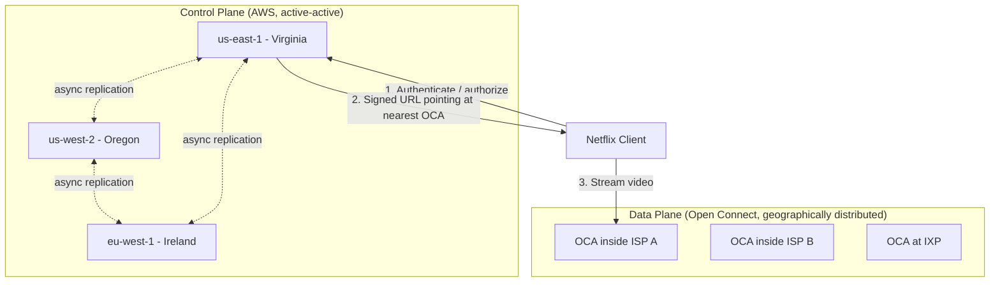
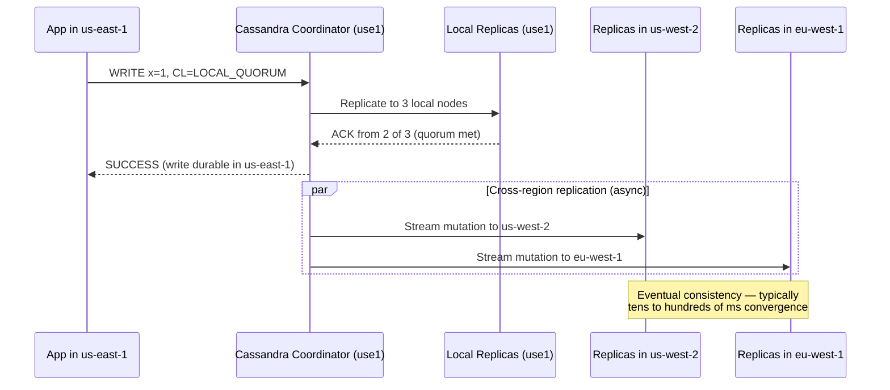
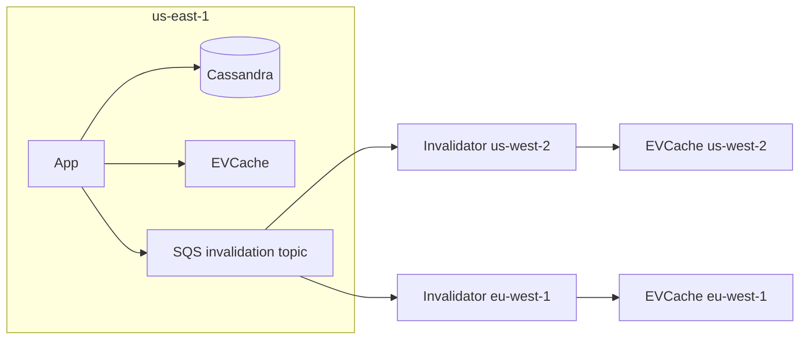
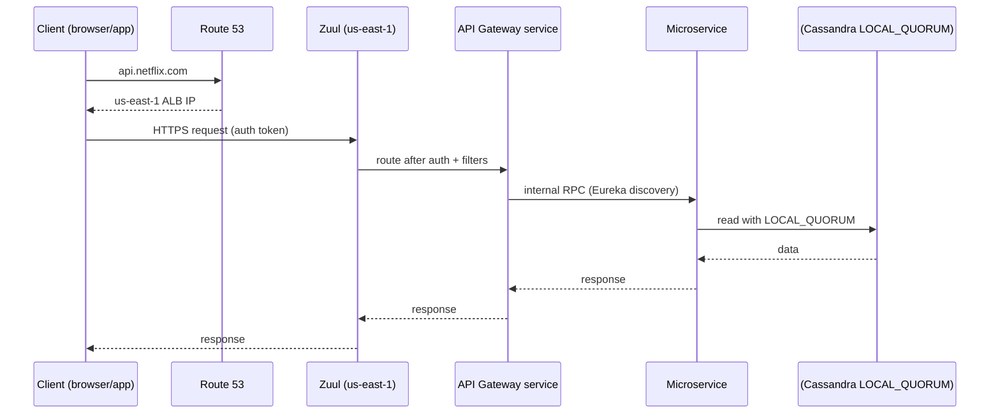
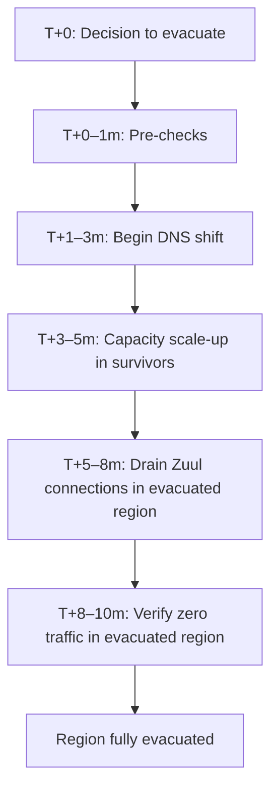

# Netflix Deep Dive — Multi-Region Active-Active

**Date:** 2026-04-29 | **Updated:** 2026-04-29
**Tags:** `system-design` `case-study` `netflix` `deep-dive` `multi-region` `ha`

## Table of Contents

- [Summary](#summary)
- [Overview](#overview)
- [Three AWS Regions](#three-aws-regions)
- [Cassandra Topology](#cassandra-topology)
- [Request Routing](#request-routing)
- [Regional Evacuation](#regional-evacuation)
- [Chaos Kong](#chaos-kong)
- [Data Consistency](#data-consistency)
- [Control Plane vs Data Plane](#control-plane-vs-data-plane)
- [The 2012 Christmas Eve Outage](#the-2012-christmas-eve-outage)
- [Anti-Patterns](#anti-patterns)
- [Related](#related)
- [References](#references)

## Summary

Netflix's multi-region active-active architecture is the canonical reference implementation of "survive a full AWS region outage with zero customer-visible downtime." Three AWS regions — `us-east-1` (Virginia), `us-west-2` (Oregon), and `eu-west-1` (Ireland) — each run a complete copy of the control plane: ~700 microservices, the Cassandra ring, the EVCache fleet, the Zuul edge layer. Any of the three can absorb 100% of global traffic. Failover is rehearsed in production via Chaos Kong. The current published failover budget is under ten minutes for a complete regional evacuation of every subscriber on Earth, and Netflix has demonstrated runs as fast as ~7 minutes.

The architecture exists because Netflix lived through a Christmas Eve 2012 ELB outage in `us-east-1` that took streaming offline for hours. The lesson — "you cannot survive a regional failure if your control plane has only ever lived in one region" — drove a multi-year program (2013–2016) to make every stateful tier multi-region-aware, every routing decision region-agnostic, and every deploy pipeline capable of pushing identical code to three regions in lockstep. The data plane (the bytes of video themselves) is *not* part of this story: video is delivered by Open Connect appliances inside ISPs, on a completely different topology and a completely different failure model.

This document is a deep dive into how the control plane achieves active-active: the regional topology, the Cassandra multi-DC replication, the Route 53 + Zuul routing path, the regional evacuation runbook, the Chaos Kong testing discipline, and the consistency model that makes it all hold together. For the broader theory of multi-region architectures (active-passive, MRR-SRW, cell-based, the cost matrix), see [`../../../reliability/multi-region-architectures.md`](../../../reliability/multi-region-architectures.md).

## Overview

A useful frame: Netflix's system is composed of two failure-independent halves stitched together at the playback handshake.

| Plane | What lives here | Topology | Failure model |
|---|---|---|---|
| Control plane | Search, browse, recommendations, profiles, billing, playback authorization, DRM license issuance | Active-active across 3 AWS regions | Designed to lose a full region with no user-visible impact |
| Data plane | The actual video bytes | ~17,000+ Open Connect Appliances (OCAs) inside ISPs worldwide | Designed for hundreds of edge node failures simultaneously; client retries to next-nearest OCA |

The control plane is what this document covers. It runs entirely on AWS (with some specific exceptions like the encoding farm and corporate systems) and is multi-region-active-active. The data plane runs on Netflix-owned hardware *outside* AWS, deep inside ISP networks, and is **geographically distributed** rather than active-active in the AWS sense. The two are coupled only at the moment a client requests a manifest: the control plane authenticates the user, applies regional licensing, and hands back signed URLs that point at OCAs. Once playback starts, the control plane is no longer in the bit path.

The reason this matters for the multi-region story: the two halves can fail independently. A `us-east-1` outage degrades the control plane (and is absorbed by failing over to other AWS regions). A bad transit peering with Comcast degrades the data plane in the affected metro (and is absorbed by re-steering clients to a different OCA). The architecture would not work if either half tried to be both. This separation is foundational and is sometimes missed when people analyze Netflix as "just a microservices shop."



The control plane absorbs the AWS dependency. The data plane absorbs the ISP-network dependency. Active-active is the answer for the first; geographic distribution is the answer for the second.

## Three AWS Regions

Netflix runs the production control plane in three AWS regions:

| Region | AWS code | Role | Footprint |
|---|---|---|---|
| US East | `us-east-1` (Virginia) | Original region; serves Americas and historically the largest share of traffic | Tens of thousands of EC2 instances; full microservice fleet; full Cassandra ring |
| US West | `us-west-2` (Oregon) | Second active region; serves Americas and absorbs us-east-1 traffic during evacuations | Full mirror of us-east-1 |
| EU West | `eu-west-1` (Ireland) | Serves EMEA; absorbs cross-Atlantic traffic during Americas evacuations | Full mirror, including EU-specific data residency where applicable |

Each region is designed to **carry 100% of global traffic**. This is the load-bearing design choice. If you only provision regions to ~50% headroom each, the loss of one region during peak hours overwhelms the survivors and you cascade into a global outage. Netflix provisions each region to absorb the full load and pays the standby capacity cost. With three regions in active-active, capacity utilization at steady state is roughly one-third per region, climbing toward 50% during evacuation drills.

A few important notes on the topology:

- **APAC.** Netflix does not publicly run a fourth full active-active control plane region in Asia-Pacific. APAC user requests are typically served by `us-west-2` or `eu-west-1` depending on which is closer over the network. The data-plane bytes (the actual video) are still served from OCAs inside the user's ISP — Asia-Pacific has dense OCA coverage, just not a control-plane region of its own.
- **Region symmetry.** Each region runs the same code, the same service mesh, the same Cassandra schemas, the same EVCache topology. Asymmetry between regions is treated as a bug. Spinnaker (Netflix's deployment platform) enforces multi-region pipelines as the default for production services.
- **Zone diversity inside a region.** Within each region, services span multiple AWS Availability Zones. Chaos Gorilla (the predecessor to Chaos Kong) tests AZ-level failure tolerance. Active-active is the outer ring; multi-AZ is the inner ring.

The choice of three regions instead of two is deliberate. Two-region active-active means losing one region forces 100% of traffic onto the other — and if the survivor is already running near 50% utilization, you've doubled its load with zero headroom. Three regions means losing one shifts ~50% extra to each of the survivors, which is a much more comfortable headroom curve. It also means you can lose a region *and* a partial outage in another, and still serve traffic.

### What "Each Region Is a Mirror" Actually Costs

A frequent question: how is this not 3x the AWS bill? The honest answer is that it does cost more — meaningfully more — and Netflix accepts that as the price of regional independence. Some of the cost is dampened, however:

- **Reserved instance and savings-plan commitments** apply per-region; Netflix can shape commitments to match the steady-state regional split (~33% each at three-region steady state).
- **Stateless tiers auto-scale per region.** They run lean during normal hours and scale up only when needed (especially during peak viewing hours and during evacuations).
- **Cassandra is sized for capacity at full evacuation absorption,** which means Cassandra capacity is the largest fixed cost — no auto-scaling magic erases it.
- **Cross-region data transfer is real money.** Cassandra mutations replicating across regions and SQS invalidation messages add up. Netflix invests heavily in encoding-pipeline efficiency, hot-path schema design, and selective replication to keep this in check.

The net effect is something on the order of 2–2.5x what a single-region equivalent would cost — not 3x — but every year the team revisits whether the bill is justified. The answer for Netflix is unambiguously yes; for a smaller business with simpler reliability requirements, the math may not work.

## Cassandra Topology

Cassandra is the persistence layer of choice at Netflix and has been since 2010. The reasons it fits the multi-region brief:

- **Native multi-DC replication.** Cassandra clusters can span multiple data centers (in this context, AWS regions), with asynchronous replication between them out of the box. Writes to `us-east-1` propagate to `us-west-2` and `eu-west-1` automatically.
- **Tunable per-query consistency.** Each read or write specifies its own consistency level. `LOCAL_QUORUM` for the common path (fast, region-local), `EACH_QUORUM` for the rare cross-region-strict path, `LOCAL_ONE` for low-stakes idempotent reads.
- **No single primary.** Every node in every region can accept writes. There is no "promote a standby" step on regional failure — surviving regions just keep accepting writes.
- **Built for partition tolerance.** AP system in CAP terms: under network partition, Cassandra continues to accept reads and writes, accepting eventual consistency as the trade-off.

### The Multi-DC Replication Model

A Cassandra cluster at Netflix is configured with three "data centers" (Cassandra's term — these map to AWS regions). The keyspace replication strategy is `NetworkTopologyStrategy` with replication factor 3 per region.

```cql
-- Illustrative (Netflix-style) keyspace definition
CREATE KEYSPACE viewing_history
WITH replication = {
  'class': 'NetworkTopologyStrategy',
  'us_east_1': 3,
  'us_west_2': 3,
  'eu_west_1': 3
};
```

This means:

- Every row has 9 replicas total (3 per region × 3 regions).
- Local reads with `LOCAL_QUORUM` need 2 of the 3 local replicas to ack — typical latency: single-digit milliseconds within an AZ-aware ring.
- Cross-region replication is asynchronous. A write committed at `LOCAL_QUORUM` in `us-east-1` is durable in `us-east-1` immediately and converges to `us-west-2` and `eu-west-1` typically within tens to hundreds of milliseconds.
- A regional failure does not lose data: each region holds a full copy of the keyspace.

### Replication Path



The trick: **the write returns to the application as soon as the local quorum is met**. The cross-region propagation happens in the background. This is the only way to keep p99 write latency in the single-digit milliseconds. The cost is that for a small window (replication lag), a read in `eu-west-1` immediately after a write in `us-east-1` may not see the new value.

### EVCache Cross-Region Invalidation

Cassandra is the durable store; EVCache (Netflix's memcached fork) sits in front of it for sub-millisecond reads. Per-region caches are independent, but writes that mutate cached state need to invalidate cached copies in *other* regions. Netflix solves this with an SQS-based invalidation pipeline: a write in `us-east-1` posts a message to an SQS topic, and per-region invalidator daemons in `us-west-2` and `eu-west-1` consume the message and delete the affected cache key locally. The next read in those regions falls through to Cassandra and refills the cache with the new value.

This is a deliberately weak coupling. The invalidation is best-effort and asynchronous; cache TTLs catch any messages that get lost. The strong coupling — the source of truth — is Cassandra. The cache is reconstructible.



### Schema and Hot-Partition Discipline

Multi-region Cassandra adds a discipline tax on schema design: every keyspace must be designed assuming any region can take any write at any time. Concretely:

- **Wide-row hot partitions** become global hot partitions. A poorly partitioned counter (e.g., partitioning by `day` instead of by `(day, user_id_hash)`) hammers the same physical replica set in every region. Schema review at Netflix is heavily focused on partition key design.
- **Time-to-live (TTL).** Every row has an explicit TTL where possible — viewing-history rows might TTL after years, telemetry after weeks. TTL keeps cross-region replication volume bounded.
- **No global counters that increment at high frequency.** These get redesigned into local counters that aggregate eventually, or moved to a different store entirely.

## Request Routing

How does a user request find the right region? The path has three layers.

### Layer 1: DNS — Route 53

Netflix uses Route 53 with **latency-based routing** as the primary mechanism. Each region exposes a regional ALB (Application Load Balancer); Route 53 health checks probe each region's edge endpoint, and DNS resolution returns the IP of whichever region has the lowest measured latency from the resolver's network position *and* is currently passing health checks.

```text
api.netflix.com -> Route 53
  - latency record: us-east-1 ALB, healthcheck=use1-edge
  - latency record: us-west-2 ALB, healthcheck=usw2-edge
  - latency record: eu-west-1 ALB, healthcheck=euw1-edge
```

When all three regions are healthy, a Comcast resolver in Virginia gets the `us-east-1` record, a Sky resolver in London gets `eu-west-1`, and a Comcast Seattle resolver gets `us-west-2`. When a region's health check fails, Route 53 stops returning that region's record. New DNS lookups skip the unhealthy region.

The catch every multi-region design has to face: **DNS TTLs lie**. Netflix sets short TTLs (typically 60 seconds), but corporate networks, ISPs, and especially mobile clients cache DNS aggressively and ignore TTLs in the wild. A health-check-driven DNS failover is *not* sub-second; it has a long tail of stale resolutions for many minutes. This is fine for active-active because surviving regions can still serve those stragglers — they just connect to a healthy region eventually. It would be unacceptable for active-passive, where the wrong region answers and gives errors.

### Layer 2: Edge — Zuul

Once a request lands in a region, Zuul is the front door. Zuul is Netflix's open-source dynamic edge proxy: it terminates TLS, runs authentication, applies routing rules, dispatches to the appropriate microservice, and emits per-request telemetry.

Zuul's role in the multi-region story:

- **Region-affinity routing.** Zuul can shed traffic to other regions if the local region is overloaded or evacuating. During Chaos Kong, Zuul is one of the levers used to mass-redirect traffic.
- **Header-based routing for tests.** Zuul recognizes special headers used in canary deployments and chaos experiments to force-route specific requests to specific regions.
- **Circuit breaking with Hystrix.** Each downstream service call is wrapped in a circuit breaker. If a downstream service in `us-east-1` is failing, Zuul fails fast at the edge rather than tying up threads waiting on dead backends.

### Layer 3: Service Mesh — Eureka + Ribbon

Inside the region, services discover each other through Eureka (Netflix's service registry) and route requests via Ribbon (client-side load balancer). This is region-local: a service in `us-east-1` does not normally talk to services in `us-west-2`. Cross-region coupling at the service-call level would tie regional latency budgets together and defeat the active-active premise.

Cross-region traffic is reserved for:

1. **Cassandra replication** (background, async).
2. **EVCache invalidation messages** over SQS.
3. **Specific operational tooling** (deploys, observability rollups).

The diagram for a healthy request:



## Regional Evacuation

A regional evacuation is the deliberate, controlled removal of a region from the serving rotation. It is how Netflix tests failover, how it survives partial regional degradations, and how it absorbs catastrophic failures. The published target is **under 10 minutes for global evacuation**, and Netflix has publicly demonstrated runs as low as ~7 minutes for shifting all traffic away from a region.

### Evacuation Phases



The phases:

1. **Decision and pre-checks.** Either a human operator triggers it (chaos drill, planned maintenance, observed instability) or automated health-check thresholds fire. Pre-checks confirm that the surviving regions are healthy and have headroom for the additional load.
2. **DNS shift.** Route 53 records for the evacuated region are marked unhealthy or removed from the rotation. New DNS lookups now resolve to surviving regions.
3. **Capacity scale-up.** Auto-scaling groups in surviving regions are signaled to scale up ahead of the incoming traffic. This pre-warming prevents the cascade where evacuated traffic floods cold survivors and causes secondary failures.
4. **Connection draining.** Zuul in the evacuated region stops accepting new connections and gracefully closes existing ones. Mobile clients with persistent connections get a clean disconnect and reconnect to a healthy region on retry.
5. **Verification.** Telemetry dashboards confirm that the evacuated region's incoming RPS has dropped to zero. Cassandra in that region continues to receive replication traffic from the survivors but serves no user traffic.

### Why "<10 minutes" Is Hard

Naive multi-region setups achieve 30–60 minute failovers because:

- **DNS TTL tail.** Stale resolutions persist for many minutes.
- **Cold survivor capacity.** Without pre-warming, the survivors fall over under the surge.
- **Zuul thread pools.** Long-lived connections to a failing region tie up resources unless explicitly drained.
- **Cassandra coordination.** If you're trying to *also* failover writes (e.g., promote a single primary), that adds 5–15 minutes alone. Netflix sidesteps this by being write-anywhere on Cassandra.

Netflix's <10-minute number works because:

- DNS shift starts in parallel with capacity scale-up in survivors.
- Cassandra requires no promotion — the survivors are already accepting writes.
- Zuul connection draining is fast because most user connections are short-lived (HTTP/2 or HTTP/1.1 with reasonable timeouts) and the long-lived ones (EventStream-style) are designed to reconnect.
- The runbook is automated end-to-end — Spinnaker pipelines and per-region tooling make the evacuation a one-button operation.

The runbook is so well-rehearsed because of Chaos Kong.

## Chaos Kong

Chaos Kong is the regional-evacuation chaos test. It is the largest of Netflix's "Simian Army" of chaos tools, in escalating order of blast radius:

| Tool | Blast radius | Frequency |
|---|---|---|
| Chaos Monkey | Single EC2 instance | Continuous, business hours |
| Chaos Gorilla | Single Availability Zone | Periodic |
| Chaos Kong | Entire AWS region | Periodic, planned |

Chaos Kong runs in production. Real customers are served. The exercise is to evacuate a real production region (typically `us-east-1`) and confirm that no customers experience degradation. After the evacuation holds steady for the desired window, the region is brought back into rotation.

### Why Run It in Production

The argument for production chaos testing is uncomfortable but correct: a DR runbook that has only been tested in staging is not validated. Staging environments inevitably differ from production in subtle ways — traffic mix, hardware affinity, downstream service load, third-party API call patterns. The first time a runbook hits real production traffic is the wrong time to discover that the dependencies don't behave as assumed.

The risk-mitigation is layered:

- **Capacity planning.** Survivors are confirmed healthy and at low utilization before the exercise begins.
- **Abort criteria.** If error rates climb past defined thresholds during the evacuation, the exercise is aborted immediately and the region is brought back online.
- **Communications.** Engineering and customer-support teams are pre-notified. The exercise window is chosen during low-traffic periods (mid-week mornings UTC, not Friday night peak).
- **Continuous instrumentation.** Per-region success rates, p99 latencies, and customer-error rates are watched in real time. Deviations are caught within seconds.

### What Chaos Kong Reveals

The first few Chaos Kong runs surfaced bugs that had hidden for years: a service that hard-coded a regional Cassandra cluster, a configuration file that pointed to `us-east-1` URLs from `eu-west-1`, a Hystrix circuit breaker tuned wrong such that survivors drowned in failed cross-region calls. Each finding became a fix and a regression test. After several years of running Chaos Kong on a regular schedule, the runbook is boring — which is the goal.

The cultural artifact is just as important as the technical artifact. When senior engineers sign off on a multi-region design, the validating question is: "Does it survive a Kong run?" Not: "Did it pass review?"

### Cadence and Scope

Chaos Kong is not run continuously — unlike Chaos Monkey, which runs every business day, Kong is scheduled. The exact cadence has evolved publicly: roughly quarterly large-scope drills with smaller per-region exercises in between. A large drill might evacuate `us-east-1` for a window of an hour or more; a smaller exercise might evacuate a subset of services to validate a recent code change.

Each Kong run produces an after-action review. The artifacts include:

- A timeline showing decision points and the lag between automated signal and human response.
- Per-service success-rate graphs for the evacuated and surviving regions.
- A list of anomalies — every service whose behavior deviated from expectation, even if customers were unaffected.
- Action items assigned to service owners, tracked to completion before the next drill.

The discipline of "every anomaly becomes an action item" is what keeps the architecture from rotting. Without it, the unused failover path silently accrues bugs that only surface during a real outage.

## Data Consistency

Active-active across regions has a consistency model that is **eventual**, with Cassandra-style tunable knobs for the rare paths that need stronger guarantees.

### Default: Eventual Consistency Across Regions

The common path:

- **Write** to the local region with `LOCAL_QUORUM`. Returns in single-digit milliseconds.
- **Read** in the same region with `LOCAL_QUORUM`. Reads-your-own-writes within a region.
- **Read** in another region: may not see the write yet. Convergence is typically tens to hundreds of milliseconds; under degraded networks it can stretch to seconds.

For Netflix's domain, this is fine. A user who pauses a show in `us-east-1` and resumes ten minutes later from `us-west-2` will absolutely see the bookmark — replication lag is sub-second in steady state. A user who pauses and resumes within a half-second from a different region might briefly see the old position. The product can absorb this; the bookmark UI doesn't claim sub-second cross-device sync.

### Tunable Consistency

Cassandra exposes per-query consistency. A few patterns Netflix uses:

| Path | Read CL | Write CL | Rationale |
|---|---|---|---|
| Viewing history (common) | LOCAL_QUORUM | LOCAL_QUORUM | Fast, region-local; eventual cross-region OK |
| Bookmark / continue-watching | LOCAL_QUORUM | LOCAL_QUORUM | Same as above |
| Title metadata (read-mostly) | LOCAL_ONE or LOCAL_QUORUM | LOCAL_QUORUM | Cache-friendly, low write rate |
| Account state mutations during sign-up | LOCAL_QUORUM | LOCAL_QUORUM with explicit cross-region read-after-write | Verify in destination region before continuing flow |
| Billing / payment-relevant state | LOCAL_QUORUM with idempotency keys | LOCAL_QUORUM | Application-layer idempotency tolerates duplicate writes during cross-region propagation |

Cross-region strong consistency (`EACH_QUORUM`) is *available* and used sparingly. The latency cost is a full inter-region round-trip — typically 70–150ms — on every operation, plus the coupling of regional latency budgets. The discipline is: only reach for cross-region strict consistency when the domain genuinely demands it (and even then, prefer application-layer idempotency over distributed-quorum reads).

### Conflict Resolution

When two regions accept writes for the same row at almost the same time, Cassandra resolves with **last-write-wins** by timestamp. The risks:

- **Clock skew.** Inter-region clock drift can mean the "later" write by the wall clock loses to the "earlier" one whose host happened to be ahead. NTP discipline matters.
- **Lost updates.** Two regions both update field X; the loser is silently overwritten. For Netflix's primary entities (viewing rows, recommendations, preferences) this is acceptable: the loss is bounded and recovers on the next user interaction.

Money-handling paths do not rely on LWW. Account balance changes, billing events, and entitlement grants flow through dedicated services that use idempotency keys and at-least-once event delivery, with downstream deduplication. The pattern is: make every write idempotent; let it be retried; let convergence happen naturally; do not let two regions race for "who decided first."

## Control Plane vs Data Plane

This deserves a dedicated section because the active-active story is sometimes mis-applied to the wrong half of the system.

### Control Plane — Active-Active Across AWS Regions

Everything covered above. Three AWS regions, each carrying full traffic, Cassandra multi-DC replication, Route 53 + Zuul routing, evacuated within minutes via Chaos Kong-validated runbooks.

The control plane handles:
- Authentication, session management.
- Search, browse, recommendations.
- Personalized artwork selection.
- Playback authorization, manifest signing, DRM license issuance.
- Billing, profiles, preferences, viewing history.

Data volume per request is small (KB-scale). Latency budget is interactive (<100ms p99 for most paths). Replication lag of tens of milliseconds is acceptable.

### Data Plane — Geographically Distributed via Open Connect

The data plane is the actual video streaming. Bytes are served from **Open Connect Appliances (OCAs)**: bare-metal servers running FreeBSD + custom NGINX, shipped to ISPs free of charge, deployed inside the ISP's network or at internet exchange points (IXPs). There are tens of thousands of OCAs globally, each holding 100+ TB of pre-positioned video.

Key differences from the control plane:

- **Topology is geographic, not regional.** OCAs live as close to viewers as physically possible — inside the ISP, often one network hop from the customer's home router. This is a per-ISP topology, not an AWS-region topology.
- **Distribution is content-aware.** Popular titles are pushed to many OCAs ahead of demand using Netflix's prefill algorithms; long-tail content is fetched on-demand from upstream OCAs or origin shields.
- **No active-active in the AWS sense.** OCAs are not synchronized peers in a global ring. Each OCA holds the content most relevant to its local viewers; failover between OCAs is handled by the client's manifest, which lists multiple sources ranked by health and proximity.
- **Failure model.** A single OCA failure costs nothing; the client retries against the next-best OCA listed in its manifest. Netflix tolerates hundreds of simultaneous OCA failures without user impact.

The data plane is what makes Netflix work at >95% bytes-served-from-ISP economics. The control plane is what makes the data plane addressable. They share almost no infrastructure, almost no failure domains, and almost no operational tooling — and that separation is by design.

| Property | Control plane | Data plane |
|---|---|---|
| Hosted on | AWS (us-east-1, us-west-2, eu-west-1) | Netflix-owned hardware inside ISPs / at IXPs |
| Scale unit | AWS region | Individual OCA |
| Replication | Cassandra multi-DC, async | Pre-positioned content + on-demand fill |
| Failover trigger | Regional health-check or human-driven evacuation | Client-side manifest re-selection |
| Failover time | <10 minutes for full regional evac | Per-segment, sub-second on the client |
| Consistency model | Eventual, tunable | N/A (read-only static content) |
| Bytes per request | KB | MB to GB per video segment, billions globally per day |

Treating these as one architectural problem is the most common analysis mistake when discussing Netflix.

## The 2012 Christmas Eve Outage

The active-active architecture has a specific origin story. On Christmas Eve 2012, Netflix streaming went offline for hours. The cause was an Elastic Load Balancer (ELB) failure in AWS `us-east-1`, the only region the control plane lived in at the time.

### What Happened

The public AWS post-mortem — and the Netflix engineering follow-ups — describe the chain:

1. AWS engineers, while doing maintenance work, accidentally executed a destructive operation against the ELB control plane data in `us-east-1`. ELB state was deleted.
2. ELBs in `us-east-1` began failing one by one as their underlying state was lost or could not be re-derived.
3. Netflix's control plane, which routed all production traffic through ELBs in `us-east-1`, lost the ability to direct user requests.
4. Streaming was impacted across the Americas and Europe for hours during peak holiday viewing.

Customers couldn't browse, couldn't authenticate, couldn't start new playback sessions. Existing sessions partially survived but new starts and resumes failed.

### Why It Mattered

Netflix's pre-2012 multi-region story was essentially "we can move to another region if we have to." But "moving" meant promoting a cold standby, replaying state, redirecting clients — measured in hours, not minutes. The ELB outage demonstrated that this was unacceptable. The lesson was generalized: **any single regional dependency, even one as deep in the stack as ELB control-plane state, can take down a single-region service. The only defense is to actually run the service in multiple regions, simultaneously, all the time.**

### What Changed After 2012

The active-active program — published in stages on the Netflix Tech Blog from 2013 through 2016 — was a multi-year, multi-team effort. The key workstreams:

- **Cassandra multi-region keyspaces.** Every keyspace was migrated to `NetworkTopologyStrategy` with replicas in multiple regions. This itself was a year-plus migration with careful schema review and rolling deploys.
- **Stateless service multi-region deploys.** Spinnaker pipelines were extended to deploy every production service to every region as the default.
- **EVCache cross-region invalidation.** The SQS-based pipeline was built to keep regional caches loosely coherent.
- **Zuul evolution.** Zuul gained the routing primitives needed for regional shedding, header-based test routing, and circuit-breaking on cross-region calls.
- **Chaos Kong.** Built specifically to verify the program. The first Kong runs found dozens of latent assumptions about region-locality. Each was fixed.
- **Operational discipline.** Runbooks, dashboards, alerting, on-call training. The architecture is only as good as the team's ability to operate it.

The first Tech Blog announcement in 2013 — "Active-Active for Multi-Regional Resiliency" — described the goal. The 2016 follow-up — "Global Cloud — Active-Active and Beyond" — declared the program complete. Every public post-mortem since has shown the architecture earning its keep: when AWS has a regional incident, Netflix evacuates and serves. The 2012 Christmas Eve outage has not had a sequel.

The cultural lesson runs deeper than the technical one. The Netflix engineering organization treats "the architecture lets us survive a regional outage" as a property to be continuously verified, not as a one-time achievement. Chaos Kong runs are not a stunt; they are the verification mechanism. An architecture that goes a year without being exercised is an architecture that has decayed.

## Anti-Patterns

The Netflix active-active model is widely admired and widely mis-copied. Common anti-patterns from teams trying to reproduce it:

- **Active-active without testing failover.** The "we have three regions" diagram on the architecture wiki, with no Chaos Kong, no quarterly DR drill, no production evacuation. The first time the runbook gets tested is during a real incident, and the runbook fails. Rule: if you've never failed over, you don't have a multi-region system; you have a configuration file. See [`chaos-engineering.md`](./chaos-engineering.md) for the discipline that makes this real.

- **Synchronous cross-region writes for everything.** "Eventually consistent is scary, let's just do quorum-across-regions everywhere." Now every write pays the inter-region RTT (70–150ms) and your interactive UI feels broken. Netflix's answer: tunable consistency, default to local quorum, escalate only where the domain demands it.

- **Ignoring replication lag in the application contract.** Code that reads in `eu-west-1` immediately after writing in `us-east-1` and expects to see the value will fail intermittently. Application contracts must explicitly tolerate read-after-write inconsistencies across regions, or pin the read to the originating region until convergence is confirmed.

- **Single-region dependencies hidden inside a "multi-region" service.** A microservice that calls a single-region payment provider, a single-region search index, or a single-region feature flag service is single-region in practice. Multi-region is an end-to-end property; a hidden chokepoint kills it.

- **Insufficient survivor capacity.** Provisioning each region to ~50% utilization and assuming "two regions can handle the load." During an evacuation, the survivors are now at 100% utilization with no headroom for traffic spikes, GC pauses, or normal jitter. Cascading failure follows. Provision each region to absorb full load if you're going active-active.

- **Treating active-active as a deploy-pipeline problem.** Putting copies of the application in three regions does not make them active-active. The data layer is the work. If Cassandra (or whatever you're using) is single-region, you are not active-active no matter how many regions you've deployed the stateless tier to.

- **Replicating the data plane the same way as the control plane.** Trying to push video bytes through the same active-active ring as user state. Netflix doesn't do this because it doesn't make sense — video distribution is a fundamentally different problem with different physics (CDN-style geographic distribution, not multi-master write convergence).

- **Skipping the failback rehearsal.** Cutting traffic away from a region is the easy part. Bringing it back — re-warming caches, catching up replication, re-balancing connections, validating the region is healthy enough to re-accept traffic — is the harder part. The failback runbook must be exercised too.

- **Letting region-asymmetry creep in.** Region A gets the new feature first, region B has a different Cassandra schema during the migration window, region C is running a slightly different microservice version. Each asymmetry is an evacuation hazard. The discipline is: same code, same schema, same config, every region, all the time, or you don't ship.

- **Multi-region for marketing.** "Survives regional failure" makes great sales copy. If the engineering investment isn't real, it's worse than honest single-region: you've created false expectations and hidden risk.

## Related

- Parent case study: [`../design-netflix.md`](../design-netflix.md) — the full Netflix system design including encoding, recommendations, Open Connect, and DRM.
- Sibling deep-dive (chaos engineering at Netflix): [`./chaos-engineering.md`](./chaos-engineering.md) — Simian Army, Chaos Monkey through Chaos Kong, game-day discipline.
- Reliability theory: [`../../../reliability/multi-region-architectures.md`](../../../reliability/multi-region-architectures.md) — topologies, replication strategies, geo-routing, failover mechanics, cost trade-offs.
- Reliability theory: [`../../../reliability/chaos-engineering-and-game-days.md`](../../../reliability/chaos-engineering-and-game-days.md) — chaos engineering principles independent of Netflix.
- Reliability theory: [`../../../reliability/disaster-recovery.md`](../../../reliability/disaster-recovery.md) — RTO/RPO, runbooks, DR drills.
- Reliability theory: [`../../../reliability/network-partitions-and-split-brain.md`](../../../reliability/network-partitions-and-split-brain.md) — cross-region partition handling.
- Reliability theory: [`../../../reliability/failure-modes-and-fault-tolerance.md`](../../../reliability/failure-modes-and-fault-tolerance.md) — broader failure-mode taxonomy.

## References

- Netflix Tech Blog — *Active-Active for Multi-Regional Resiliency* (2013). <https://netflixtechblog.com/active-active-for-multi-regional-resiliency-c47719f6685b>
- Netflix Tech Blog — *Global Cloud — Active-Active and Beyond* (2016). <https://netflixtechblog.com/global-cloud-active-active-and-beyond-15828968fe6e>
- Netflix Tech Blog — *A State of Xen — Chaos Monkey & Cassandra* (2014). <https://netflixtechblog.com/a-state-of-xen-chaos-monkey-cassandra-9b50e83c10e7>
- Netflix Tech Blog — *Chaos Engineering Upgraded* (Chaos Kong details) (2015). <https://netflixtechblog.com/chaos-engineering-upgraded-878d341f15fa>
- Netflix Tech Blog — *The Netflix Simian Army* (2011). <https://netflixtechblog.com/the-netflix-simian-army-16e57fbab116>
- Netflix Tech Blog — *Open Sourcing Zuul 2* (2018). <https://netflixtechblog.com/open-sourcing-zuul-2-82ea476cb2b3>
- Netflix Tech Blog — *Application Data Caching using SSDs* (EVCache architecture). <https://netflixtechblog.com/application-data-caching-using-ssds-5bf25df851ef>
- Netflix Tech Blog — *Building Netflix's Distributed Tracing Infrastructure* (regional tooling context). <https://netflixtechblog.com/building-netflixs-distributed-tracing-infrastructure-bb856c319304>
- Apache Cassandra — *Multi-Datacenter Replication* documentation. <https://cassandra.apache.org/doc/latest/cassandra/architecture/dynamo.html>
- Apache Cassandra — *Configuring Replication* (NetworkTopologyStrategy). <https://cassandra.apache.org/doc/latest/cassandra/managing/operating/topo_changes.html>
- DataStax — *Multi-Datacenter Replication Best Practices*. <https://docs.datastax.com/en/dse/6.8/dse-arch/datastax_enterprise/dbArch/archDataDistributeReplication.html>
- AWS — *Summary of the December 24, 2012 Amazon ELB Service Event*. <https://aws.amazon.com/message/680587/>
- Netflix Open Source — *Chaos Monkey on GitHub*. <https://github.com/Netflix/chaosmonkey>
- Netflix Open Source — *Eureka service registry*. <https://github.com/Netflix/eureka>
- Netflix Open Source — *Hystrix circuit breaker*. <https://github.com/Netflix/Hystrix>
- Netflix Open Source — *EVCache*. <https://github.com/Netflix/EVCache>
- Netflix Open Source — *Spinnaker* (multi-region deployment platform). <https://spinnaker.io/>
- Adrian Cockcroft — *Cloud Native — Netflix Architecture* (talk). <https://www.infoq.com/presentations/netflix-architecture-2014/>
