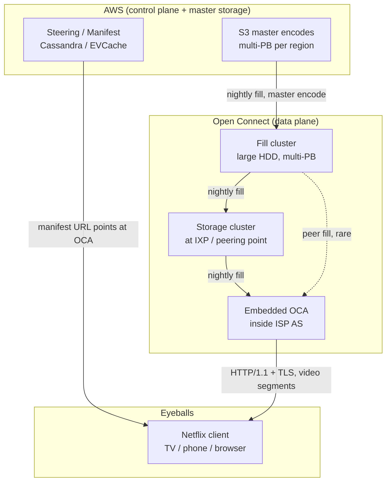
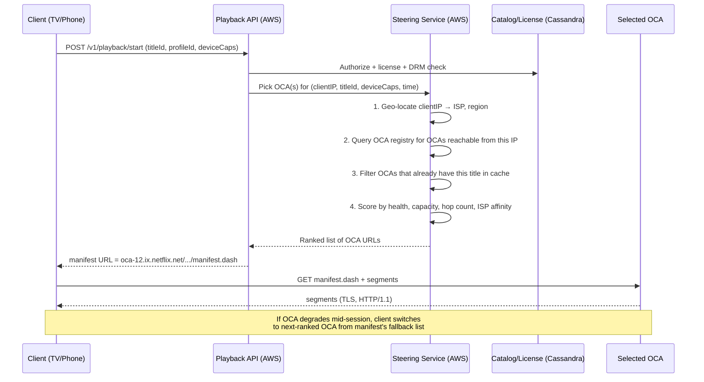
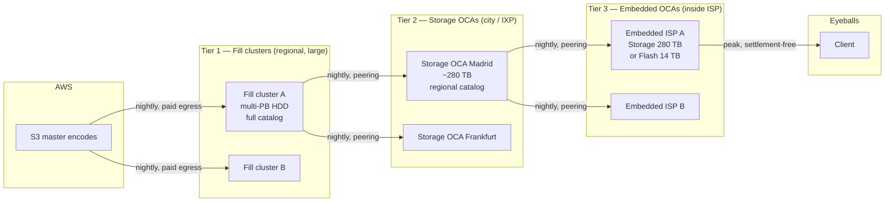

# Netflix Deep Dive — Open Connect CDN

**Date:** 2026-04-29 | **Updated:** 2026-04-29
**Tags:** `system-design` `case-study` `netflix` `deep-dive` `cdn` `open-connect`

## Summary

Netflix's video bytes do not flow out of AWS. They flow out of **Open Connect Appliances (OCAs)** — bare-metal FreeBSD + NGINX boxes that Netflix designs in-house and **ships free of charge to ISPs**, who rack them in their own data centers. >95% of all Netflix bytes are served from an OCA inside the viewer's ISP, often a single network hop away from the eyeball. AWS handles the small control-plane traffic — sign-in, browse, search, recommendations, playback authorization, telemetry — but the multi-hundred-Tbps firehose of encoded segments leaves Netflix's S3 origin once, fans out into a tree of fill servers, then **pre-positions popular titles overnight** into thousands of OCAs worldwide before anyone presses play.

This doc unpacks the design choices that make that work: the OCA hardware lineage and why it runs FreeBSD, the overnight pre-fill schedule and how popularity prediction drives it, the BGP-driven steering that keeps each ISP's traffic inside its own AS, the fill cluster vs storage cluster split, the manifest-generation flow that hands a client a specific OCA URL at playback start, and the cost economics that made building Open Connect cheaper than renting Akamai at the scale Netflix reached. It is a CDN built for one workload — large, immutable, pre-published video objects with a steep popularity curve — and that single-purpose design is precisely what makes it cheaper and faster than a general-purpose CDN at the same byte volumes.

## Table of Contents

- [Summary](#summary)
- [Overview](#overview)
- [OCA Hardware](#oca-hardware)
- [Pre-Fill Schedule](#pre-fill-schedule)
- [Cacheability of Encoded Segments](#cacheability-of-encoded-segments)
- [ISP Peering Economics](#isp-peering-economics)
- [Routing Logic](#routing-logic)
- [Fill Cluster vs Storage Cluster](#fill-cluster-vs-storage-cluster)
- [Popularity-Based Pre-Positioning](#popularity-based-pre-positioning)
- [Manifest Generation](#manifest-generation)
- [Build vs Rent — Why Not Akamai](#build-vs-rent--why-not-akamai)
- [Cost Analysis](#cost-analysis)
- [Anti-Patterns](#anti-patterns)
- [Related](#related)
- [References](#references)

## Overview

Open Connect is a **purpose-built private CDN** — owned end-to-end by Netflix, deployed across three tiers, and optimised for one workload class: pre-published, immutable, large-object, popularity-skewed video.

Three deployment tiers:

1. **Embedded OCAs.** Physical 1U/2U/4U servers shipped *free* by Netflix to qualifying ISPs (typically those moving more than ~5 Gbps of Netflix traffic). The ISP racks them, supplies power and 100GbE uplinks, and Netflix manages them remotely. Traffic from the ISP's own subscribers is served by an OCA inside the ISP's network — usually one or two router hops from the eyeball.
2. **IXP-deployed OCAs.** Clusters at major Internet Exchange Points (IXPs) such as AMS-IX, DE-CIX, LINX, Equinix Ashburn, where Netflix peers directly with hundreds of ISPs that don't qualify for embedded boxes. From the IXP, traffic enters each ISP via a settlement-free peering link.
3. **Fill servers.** A small number of large-storage clusters that pull masters and renditions from AWS S3 once, then act as origins for the OCA fleet. Fill servers themselves never serve a single end user — only other OCAs.



Two principles drive the whole design:

- **Decouple control from bytes.** Streaming bandwidth scales with subscriber count and bitrate; control traffic scales with subscriber metadata. Different scaling laws → different infrastructures. AWS handles control. OCAs handle bytes.
- **Move the bytes once, serve them many times.** Master files and encoded renditions leave AWS exactly once per OCA, overnight, when bandwidth is cheap. After that, every viewer's request is satisfied from local SSD/HDD without crossing Netflix's WAN.

## OCA Hardware

An OCA is not a generic 1U server with caching software bolted on. Netflix designs the hardware spec, sources from ODMs (Quanta, Wiwynn, others), and tunes FreeBSD specifically for it. Hardware iterations track the same trajectory as Netflix's catalog growth:

| Generation | Era | Storage | Network | Notes |
|---|---|---|---|---|
| Gen 1 (Storage) | ~2012 | 36× 3 TB HDD = 108 TB raw | 2× 10 GbE | First embedded OCA; HDD-only; long tail catalog |
| Gen 2 (Storage) | ~2014–2015 | 36× 6 TB HDD ≈ 216 TB | 2× 10 GbE | Higher density, same shape |
| Gen 3 (Storage / Flash) | ~2016 | Mixed: 14× 8 TB HDD + NVMe SSD tier | 2× 40 GbE | Tiered: hot titles on NVMe, long-tail on HDD |
| Flash OCA | ~2018+ | All-NVMe, ~14 TB | 2× 100 GbE | Dense flash; for hot-content sites where IO is the limit |
| Storage OCA | ~2018+ | ~280 TB HDD | 2× 100 GbE | "Big bin" — full catalog cache for large embedded sites |
| Newer Storage OCA | ~2020+ | ~360 TB HDD + NVMe metadata | 2× 100 GbE | Higher-density HDDs; multi-actuator drives |
| 800 Gbps OCA | 2024 | NVMe-dense | 2× 400 GbE | Demonstrated 800 Gbps from one box in Netflix Tech Blog tests |

Software stack:

- **FreeBSD** for the OS. Netflix has contributed major upstream improvements: kernel TLS (`KTLS`), `sendfile(2)` over async I/O, NUMA-aware memory allocators, in-kernel TLS offload to NIC. Kernel TLS lets the kernel encrypt and DMA-transmit a file without bouncing bytes through userspace — the whole pipeline is `read from disk → DMA into NIC → TLS-encrypt on the NIC or in kernel → wire`. That is where the 800 Gbps single-box number comes from.
- **NGINX** in userland for HTTP/1.1 + TLS termination, request parsing, and steering. Custom modules added by Netflix.
- **No general-purpose workloads.** OCAs run video serving, period. No edge compute, no logic, no auth tokens issued at the OCA. The OCA validates a signed URL and serves the byte range.

The shape of an OCA is wide and shallow: lots of disks or NVMe, two big network ports, and just enough CPU to feed them. Most OCA chassis are bandwidth-bound long before they are CPU-bound — the goal is to saturate the NICs.

### Why FreeBSD, not Linux

This question gets asked at every interview. The honest answer is path dependence + technical fit:

- **Path dependence.** Open Connect's predecessor at Netflix — and Limelight, Yahoo's old CDN, several others — already ran FreeBSD. The on-call engineers knew it. The kernel-TLS work happened in FreeBSD because Netflix's kernel engineers were FreeBSD committers.
- **Mature `sendfile(2)` with `SF_NODISKIO` and async semantics.** A web-CDN workload is more diverse; Linux's `splice/sendfile` is fine for it. Netflix's workload is "read this file, encrypt with TLS, push to NIC, do not let userspace see the bytes." FreeBSD's async `sendfile` plus kernel-TLS plus NIC-offload TLS gives a cleaner zero-copy path than the equivalent Linux pipeline as it stood when Netflix made the call.
- **No license complications for proprietary modifications.** Netflix ships kernel changes back upstream as a matter of policy, but BSD-licensed kernels carry zero risk if a particular module stays internal for competitive reasons.
- **Smaller surface area to harden.** An OCA does one thing. FreeBSD's tighter base system (no systemd, no distribution churn) is easier to stabilize for a single-purpose appliance fleet that updates on Netflix's schedule, not Ubuntu's.

The performance trick that matters: **kernel TLS** (`KTLS`) lets the kernel do TLS record encryption inline with `sendfile`, so the userland NGINX never touches the bytes after the file handle is opened. Combined with NIC-offload TLS on supported Mellanox / Chelsio cards, a single `sendfile` syscall results in DMA from disk to NIC with encryption performed on the wire. That eliminates the userspace-buffer-and-copy step that bottlenecks generic web servers and is what unlocked first 100 Gbps and later 400+ Gbps from single boxes.

A useful read-rate sanity check:

```text
Storage OCA (HDD-heavy):
  280 TB raw, ~95% catalog hit ratio, 2× 100 GbE = 200 Gbps wire rate
  Sequential HDD read ≈ 200 MB/s × 36 drives ≈ 7.2 GB/s ≈ 57 Gbps aggregate
  → HDDs cap throughput. NVMe metadata + SSD caching of hot titles raises effective wire rate.

Flash OCA (all-NVMe):
  ~14 TB, smaller catalog footprint, 2× 100 GbE
  NVMe sequential read ≈ 7 GB/s per drive × N → easily saturates 200 Gbps
  → CPU + TLS + NIC offload becomes the bottleneck.
```

## Pre-Fill Schedule

The defining property of Netflix's CDN is that it is **proactively filled, not reactively populated**. A general-purpose CDN like Cloudflare or Fastly is reactive: a cache miss at the edge pulls from origin and populates the cache. Open Connect inverts that: by the time a viewer hits play, the bytes are already on the OCA serving them — there is no on-demand origin pull.

Why pre-fill at all? Two reasons:

1. **Predictable popularity.** Netflix knows tomorrow's most-watched titles with high precision — yesterday's plays + recommendation system signals + new release schedule. A handful of titles drive the long tail of viewing on any given day. Pre-positioning them at every OCA before peak guarantees zero origin fetches during peak.
2. **Off-peak bandwidth is free-ish.** Netflix peering links and ISP capacity sit largely idle from 02:00–08:00 local time. Filling a 280 TB OCA at 100 Gbps takes ~6 hours. ISPs prefer this — it's traffic during the trough they're already paying for.

The pre-fill cycle:

```text
00:00 (HQ): Popularity predictor publishes tomorrow's "what to fill" manifest
            per OCA (or per OCA cluster). Inputs:
              - last 7 days of plays per title per region
              - new releases launching tomorrow
              - schedule of expiring licensed content (drop)
              - per-OCA storage budget and current contents
            Output: a delta — what to add, what to evict.

02:00 local: OCA wakes a fill worker that walks the delta list. For each
             missing chunk, pulls from a chosen fill source:
              - first try: a peer OCA in the same site (intra-rack, free)
              - second: an OCA at the same IXP / metro (peering, ~free)
              - third: a regional fill cluster
              - last: the AWS S3 master encode (paid egress)

08:00 local: Fill window closes; OCA returns to serving traffic.

20:00 local: Peak hour. OCA serves at 100 Gbps from local SSD/HDD.
             Origin fetches: ~0.
```

The fill plan is delivered as a manifest per OCA from a central control plane. The OCA pulls; the control plane never pushes bytes. This decoupling means a control-plane outage during the day does not stop streaming — the OCA keeps serving what it filled the previous night.

Fill traffic itself is also CDN-served. An OCA in Madrid fills primarily from the IXP cluster at Madrid-IX, not from Virginia. Netflix's WAN egress from S3 happens once per region per night per chunk, not once per OCA per chunk — this **fan-out tree** is the whole game economically.

### The 24h fill-and-serve cycle

A simplified clock for an embedded OCA in a single ISP:

```text
Time (local)  | Activity                               | Bandwidth shape
--------------|----------------------------------------|---------------------------
00:00 – 02:00 | Idle (most subs asleep)                | Egress trickle
02:00 – 08:00 | Pre-fill window                        | INGRESS heavy: 50–100 Gbps
              | - Pull deltas from peer / IXP / S3     | EGRESS low
              | - Validate hashes, atomic rename       |
08:00 – 19:00 | Daytime serving                        | Light egress, mostly mobile
              |                                        | + back-catalog browsing
19:00 – 23:00 | Prime-time peak                        | EGRESS heavy: 80–200 Gbps
              | - 100% of bytes from local cache       | INGRESS ~0
              | - Origin fetches: should be zero       |
23:00 – 00:00 | Tail-off                               | Egress decline
```

The two flows never compete: ingress dominates from 02:00–08:00, egress dominates from 19:00–23:00. The OCA's NIC capacity is sized for the egress peak; the same capacity is reused for the ingress window because it's idle then.

If pre-fill misses something — an unexpected viral spike, a recommender change that surfaced an old title — the OCA can fill on-demand from a peer at the IXP during the day. This is more expensive (it competes with serving traffic) but it's a safety net, not the main path. Netflix's published telemetry suggests **>99% of bytes served at peak come from pre-fill, not on-demand fill**.

## Cacheability of Encoded Segments

Netflix's catalog is structurally ideal for caching. Compare with a typical web-CDN workload:

| Property | Web CDN object | Netflix segment |
|---|---|---|
| Mutability | Often dynamic; vary on cookies, geo, A/B | Fully immutable once published |
| TTL | Seconds to days; revalidation common | Effectively infinite within a license window |
| Object size | KB to MB | 2–10 second segments, ~0.5–10 MB each |
| Popularity distribution | Long tail of dynamic URLs | Heavy power-law on a few thousand titles |
| Pre-publish predictability | Low — content is created/edited on-demand | High — entire catalog is published days in advance |
| Total catalog size | Per customer: GB to TB | Total Netflix encoded corpus: tens of PB |

Netflix's encoded outputs are **content-addressable and immutable**: a segment for `Stranger Things S04E01, AV1, 1080p, segment 042` has a fixed URL and never changes. Once it's on an OCA, no purge logic is needed; if it's deprecated (license expires, re-encoded), the new version gets a new URL and the old one is evicted to make room.

This is what allows the pre-fill model to work. A reactive CDN can't pre-fill if it doesn't know what URLs will be requested. Netflix knows every URL in advance because every URL is just `(title, codec, resolution, segment_index)` and the title list is a slow-moving database.

The catalog-shape constants worth memorising:

- ~5,000–15,000 active titles in the global catalog at any time (varies by region due to licensing).
- Each title fans out to ~50+ rendered files (codec × resolution × bitrate × DRM × HDR variants).
- Each rendered file is split into 2–10 second segments → ~600–1800 segments per title per rendition.
- Total encoded corpus: tens of PB.
- A fully populated Storage OCA at 280–360 TB holds **most of the regionally relevant catalog**. A Flash OCA holds only the hot head — typically 2,000–5,000 titles — and falls back to a peer OCA for the long tail.

## ISP Peering Economics

Why do ISPs put a Netflix-owned box inside their network for free? Because the alternative is paying for transit.

Without Open Connect, every Netflix stream into an ISP is **inbound transit traffic** the ISP pays for — from a transit provider (Cogent, Level 3 / Lumen, Telia) at ~$0.30–$1.50 per Mbps/month of 95th-percentile commit, billions of bits at peak. With Open Connect:

| Cost category | Without OCA | With OCA |
|---|---|---|
| Transit bandwidth bought from upstream | Pays for full peak Netflix traffic | Eliminated for Netflix bytes |
| Internal backhaul to subscribers | Same in both cases | Same |
| Peering port capacity | Must size for Netflix surge | Reduced or freed up |
| Power + space for the OCA | $0 | ~1–8 kW per OCA + rack U |
| Capex for the OCA itself | N/A | $0 (Netflix buys it) |

For an ISP moving 100 Gbps of Netflix at peak, eliminating that as transit can save **hundreds of thousands of dollars per year**. The OCA's power and space cost are a rounding error in comparison.

Netflix gets in return:

- **Bytes delivered closer to the eyeball** → better ABR-measured throughput, fewer rebuffers, ability to push higher bitrates / 4K. Quality of experience (QoE) directly correlates with retention.
- **No transit costs on Netflix's side either.** Netflix does not pay an upstream to deliver into the ISP — the OCA sits inside the ISP's network.
- **Insulation from public-internet congestion.** Internet middle-mile congestion (cross-Atlantic cables, undersea breaks, BGP misconfigurations) doesn't affect a stream that never crosses the public middle mile.

The deal is **mutual settlement-free peering** at scale, packaged as a hardware deployment. Both sides save on transit; both sides care about the same metric (smooth playback).

For ISPs that don't qualify for an embedded OCA — they're too small, or don't want to host hardware — Netflix offers **settlement-free peering at major IXPs**. Open Connect publishes its peering policy publicly: any ISP, any size, can peer with Netflix's AS (AS2906) at any IXP where both are present.

## Routing Logic

When a client presses play, here is the chain that decides which OCA's URL ends up in the client's manifest.



A few details that matter:

**OCA selection is BGP-aware.** OCAs are *directed-cache* devices: an OCA only serves clients whose IP prefixes have been advertised to that OCA via BGP from the ISP. The ISP retains full control — they can withdraw prefixes from a specific OCA at any time and Netflix's steering will route those clients elsewhere. The ISP basically declares "this OCA serves these prefixes," and Netflix respects that.

**Manifest contains a fallback list, not a single URL.** Real-world practice: the manifest includes the primary OCA plus 2–4 alternates. The client falls over without going back to the steering service if the primary degrades — measured by buffering events or HTTP errors mid-segment.

**Steering uses recent telemetry, not just BGP.** Netflix's playback telemetry (every rebuffer, every ABR switch) feeds back into steering. If an OCA is showing elevated rebuffers across many concurrent viewers, the steering service down-weights it before any human notices. This is closed-loop **active probing of the data plane from the control plane**.

**Geo-IP misroutes happen.** Mobile carrier IP geolocation is rough — a mobile IP block in Mumbai may resolve to "India" with no further granularity. Netflix supplements with active client-side measurement: the client may be handed two OCA URLs and probe both, picking the lower-latency one. This is RUM-based steering layered on top of BGP-based steering.

## Fill Cluster vs Storage Cluster

Inside Open Connect, OCAs are not interchangeable boxes. They specialize.



Roles:

- **Fill clusters** never serve end users. They are large-storage peering-rich nodes that pull from AWS S3 and re-distribute to the OCA fleet. Concentrating S3 egress into a small number of fill clusters means S3 egress is paid once per region per night per chunk, not once per OCA.
- **Storage clusters at IXPs** serve as both peer fill sources for embedded OCAs and as direct serving nodes for ISPs that don't host an embedded OCA. They hold a near-complete regional catalog.
- **Embedded OCAs** inside ISP networks are the last mile. They specialize by hardware: a **Storage OCA** holds the regional catalog (long tail and head); a **Flash OCA** holds only the hottest content and falls back to a peer Storage OCA via the IXP for the long tail.

Most large ISPs end up with a *cluster* of embedded OCAs — a mix of one or two Storage OCAs and several Flash OCAs. The Flash OCAs absorb the steep popularity curve at high bandwidth; the Storage OCAs hold the catalog tail and act as peer fill sources for the Flash OCAs.

This separation is the same idea as **edge cache + regional shield** in a generic CDN, except that Netflix builds the shield as a different physical box optimized for storage, while general CDNs use the same hardware in two roles.

## Popularity-Based Pre-Positioning

The pre-fill manifest per OCA is generated by a popularity model that looks at:

- **Recent plays** per title per region per device class.
- **Recommendation system outputs** — titles being heavily surfaced are about to be heavily watched. The recommender's output is itself a leading indicator of demand.
- **Release calendar** — a new season of a hit show drops at midnight; the box must be filled before midnight, not at midnight when the herd arrives.
- **Trailers and promotions** — a title with heavy trailer impressions gets pre-warmed even before it premieres.
- **Geographic licensing** — content licensed only in a country gets filled only in OCAs serving that country. This is enforced at fill-list generation time, not at serve time.
- **Storage budget** — each OCA has finite bytes; the model produces an LRU-with-popularity-prior eviction list.

The output per OCA per night is a delta:

```json
{
  "oca_id": "oca-emb-isp123-mad-04",
  "fill_window_start": "2026-04-30T02:00:00+02:00",
  "fill_window_end":   "2026-04-30T08:00:00+02:00",
  "bytes_to_add": 14_500_000_000_000,
  "bytes_to_evict": 12_800_000_000_000,
  "add": [
    {"title": "stranger-things-s5", "renditions": ["av1-1080p", "av1-2160p", "hevc-1080p"], "priority": 1},
    {"title": "the-crown-s6",       "renditions": ["av1-1080p", "av1-720p"],                "priority": 2},
    ...
  ],
  "evict": [
    {"title": "old-licensed-doc-2018", "reason": "license-expired-2026-04-30"},
    ...
  ]
}
```

The model lives in the AWS control plane. Its training set is the same telemetry stream that feeds the recommendation system — every play, every pause, every quality switch, batched into Kafka (Keystone), processed via Flink/Spark.

A subtle but important property: **the popularity prediction does not need to be perfect**. Even if an OCA misses a fill of some unexpected hit, fallback paths exist — the OCA can fill on-demand from a peer OCA at the IXP during the day. What the model needs to get right is the **head of the distribution**, where the bandwidth lives. Missing on the long tail is cheap.

## Manifest Generation

When a client requests playback, the API produces a DASH (`.mpd`) or HLS (`.m3u8`) manifest. The manifest is the document that tells the client which renditions exist, where each segment lives, and how to switch between them.

A simplified DASH manifest excerpt:

```xml
<MPD type="static" mediaPresentationDuration="PT1H30M">
  <Period>
    <AdaptationSet contentType="video" mimeType="video/mp4">
      <Representation id="av1-1080p-3000k" codecs="av01.0.08M.08" bandwidth="3000000" width="1920" height="1080">
        <BaseURL>https://oca-12.ix.netflix.net/.../av1-1080p/</BaseURL>
        <BaseURL>https://oca-7.ix.netflix.net/.../av1-1080p/</BaseURL>  <!-- fallback -->
        <SegmentTemplate media="seg_$Number$.m4s" startNumber="1" duration="2"/>
      </Representation>
      <Representation id="av1-720p-1500k" ...>
        <BaseURL>https://oca-12.ix.netflix.net/.../av1-720p/</BaseURL>
        ...
      </Representation>
    </AdaptationSet>
  </Period>
</MPD>
```

Generation flow:

1. **Authorize** — verify the user, profile, device, and country license.
2. **Select renditions** — based on `deviceCapabilities` (codecs, DRM level, resolution, HDR support) and the network class (mobile, broadband). 4K is gated on Widevine L1 / FairPlay HW / PlayReady SL3000 for studio compliance.
3. **Pick OCAs** — steering returns a ranked list per rendition. The same OCA usually serves all renditions of a title because it has all of them filled, but during fallback the renditions may be on different OCAs.
4. **Sign URLs** — segment URLs are signed (HMAC over path + expiry + clientIP/deviceID). The OCA validates signatures locally; no per-request callout to AWS.
5. **Build the manifest document** — emit `.mpd` or `.m3u8` with primary + fallback `<BaseURL>`s per rendition.
6. **Return** the manifest URL to the client.

Two design choices worth noting:

- **Fallback URLs are inline in the manifest.** The client switches OCAs without re-asking the API. This is critical because the API runs in AWS, and a regional AWS impairment must not stop in-flight playback. The manifest contains everything the client needs for the rest of the session.
- **Manifests are short-lived but cacheable per session.** Manifest TTL is the playback session length plus a small slack (license expiry); the URL itself is the cache key. The manifest is regenerated on every `/playback/start` call.

The manifest is the **handoff document** between control plane and data plane. After it is delivered, AWS does not touch the session. Telemetry comes back fire-and-forget.

## Build vs Rent — Why Not Akamai

Netflix used Akamai, Limelight, and Level 3 between 2007 and 2012. Then it built Open Connect.

Why? Three reasons, in order of importance.

**1. Cost at the byte volumes Netflix reached.**

In 2011–2012 Netflix was already a top-2 driver of internet traffic in North America. CDN list pricing for video at that scale was on the order of cents per GB at the time. At ~20 PB delivered per month per region (and still growing), that becomes a nine-figure annual bill that scales with subscriber growth. A one-time $50–100M capex plus ~$10M/year in opex to ship and operate OCAs collapsed the unit cost of bytes by an order of magnitude — and the savings compounded as subscribers grew. (See [Cost Analysis](#cost-analysis) below for unit math.)

**2. Workload mismatch with general-purpose CDNs.**

Akamai and Cloudflare optimize for billions of small dynamic objects, complex cache key handling (cookies, vary headers), edge compute, and short TTLs. Netflix's workload is the opposite: a few thousand large immutable files, no cookies, no A/B variations, no dynamic responses. Netflix didn't need 90% of what a general CDN sells, and it needed things general CDNs didn't offer:

- **Pre-fill scheduling** at the petabyte scale based on Netflix's own popularity prediction.
- **ISP-embedded boxes** with BGP-driven directed-cache semantics.
- **FreeBSD + kernel TLS** for raw bytes-per-second per box.
- **Direct relationship with ISPs** for peering and traffic engineering.
- **Per-title encoding integration** — the encoder ladder feeds directly into the CDN's storage planning.

A purpose-built CDN tuned to one workload beats a general-purpose CDN doing the same workload, given enough scale to amortize the build.

**3. Strategic control of QoE.**

ABR rebuffer rate, time-to-first-frame, and 4K availability are leading indicators of churn. When you outsource the data path, you outsource the QoE knob — you can tune around the third party but not through it. With Open Connect, Netflix can experiment with new codecs (AV1 rollout, film grain synthesis), new transport (HTTP/3, QUIC), new ABR strategies (server-side hints, predictive buffer planning), and new hardware (NVMe density, 400 GbE NICs) on its own roadmap. The 800 Gbps single-box demonstration in 2024 happened because Netflix designs the box.

The decision **only makes sense above a scale threshold**. Below it, building a CDN is foolish — capex is fixed, ops staff is fixed, and you don't have the byte volume to amortize them. Netflix crossed the threshold around 2012. Most companies never will; for them, renting Cloudflare/Fastly/Akamai is structurally correct.

## Cost Analysis

Order-of-magnitude unit economics, sanitized from public talks and re:Invent disclosures.

### What Netflix would pay if it ran on AWS CloudFront / Akamai

```text
Peak egress:                   300 Tbps  (mix of SD/HD/4K, ~3 Mbps avg)
Monthly egress at peak shape:  ~30 EB (exabytes) per month — global
                               (rough: 300 Tbps × 0.4 utilization × 30 days)

CloudFront list price (volume tier, large customer, video):
                               ~$0.02–$0.05 per GB
At $0.03 / GB:                 30 EB × $0.03 / GB = $900M / month
                                                  = $10.8B / year

Akamai / Cloudflare with a heavy video discount:
                               ~$0.005–$0.01 per GB
At $0.007 / GB:                30 EB × $0.007 / GB = $210M / month
                                                   = $2.5B / year
```

These are deliberately pessimistic upper bounds — heavily-negotiated enterprise contracts with committed-use discounts come down further. Public estimates in the 2017–2020 range suggested Netflix's hypothetical CDN bill (had it stayed on third-party CDNs) would be **$500M–$2B/year** at the byte volumes it reached.

### What Open Connect actually costs

Capex per OCA (rough, from public Netflix Tech Blog hardware breakdowns):

```text
Storage OCA (~280 TB, 2× 100 GbE):  ~$25k–$50k per box
Flash OCA (~14 TB NVMe, 2× 100 GbE): ~$15k–$30k per box
800 Gbps OCA (NVMe-dense, 400 GbE):  ~$60k–$100k per box

Fleet: estimated ~17,000 OCAs deployed globally across 175+ countries.
Annualized capex (5-year amortization, ~$30k avg):
                                     17,000 × $30k / 5 = ~$100M / year
```

Opex:

```text
S3 egress (one-time fill from origin):
  Total catalog ~30 PB encoded; refreshed/expanded ~2 PB / month
  At AWS S3 egress $0.05/GB: 2 PB × $0.05/GB = $100k / month = $1.2M / year
  (Filling happens via S3 Inter-Region Replication and direct-connect, lowering further.)

Network operations + ISP relationships:    ~$10–20M / year
Software engineering for Open Connect:     ~$30–50M / year (rough)
```

Annual total Open Connect run rate: **on the order of $150–200M/year**, against a notional $2B+ alternative bill. The break-even point is plainly already several years in the past.

### Why the math works

```text
3rd-party CDN bill scales with bytes:        cost ∝ bytes_per_year
Open Connect bill scales with deployment:    cost ∝ #OCAs (slow growth)

Bytes per year grow much faster than #OCAs because each new OCA gets
denser (HDD growth, NVMe density) and faster NICs (10 → 40 → 100 → 400 GbE).
A single box now serves what a rack of older boxes served.

The longer Netflix runs, the bigger the gap.
```

This is the dynamic that justifies building a CDN: third-party costs grow linearly with bytes; in-house CDN costs grow logarithmically with bytes (because hardware density grows faster than catalog).

## Anti-Patterns

1. **Building Open Connect when you don't need it.** A streaming startup at 100 Gbps peak should not buy hardware. The fixed costs of running a fleet (ops, hardware, ISP relationships) dwarf savings vs a third-party CDN at low byte volumes. The break-even is multi-Tbps and multi-PB-per-month.
2. **Reactive caching for video.** Treating video segments like generic web objects (origin pull on miss) wastes bandwidth and pushes origin to cope with concurrent cold misses on premieres. Pre-fill is non-optional once you have predictability.
3. **Same hardware spec everywhere.** The Storage / Flash split exists because one hardware shape can't optimise for both "long tail catalog footprint" and "hot bitrate firehose." Forcing one design wastes capex.
4. **Treating manifests as static.** Hard-coding a single OCA URL in the manifest with no fallback list means every OCA degradation is a session interruption. Always emit fallbacks; let the client failover without round-tripping the control plane.
5. **DNS-based steering only.** DNS caches are unpredictable, especially in mobile networks behind carrier-grade NAT. Encode OCA selection in the manifest URL itself; let the client follow what the API picked.
6. **Filling boxes from a single origin.** If every OCA fills from S3, S3 egress becomes the bill. Use a fan-out tree: S3 → fill cluster → IXP storage cluster → embedded OCA. Each tier amortizes the next.
7. **Hosting the OCA outside the ISP.** A box at "an Equinix near the ISP" still pays for transit into the ISP. The economic value comes from being **inside** the ISP's AS, on the ISP's own network.
8. **Charging the ISP.** Open Connect is free for the ISP because both sides save on transit and both sides care about QoE. Charging breaks the economic alignment that makes the program work.
9. **Encrypting renditions per user.** DRM keys vary per session, but the encrypted bytes themselves must not. If you re-encrypt segments per session, you destroy cacheability and the entire CDN model collapses. Use envelope encryption: segments encrypted with a content key, content key delivered separately under a session-bound license.
10. **Skipping pre-positioning for "long-tail" content.** The long tail is small in bandwidth but large in catalog footprint. Pre-fill it on Storage OCAs (cheap HDD) at low priority; fall back to peer OCA fill if missed. Don't pull from S3 mid-day for catalog tail — that's where the per-byte CloudFront-equivalent cost shows up.
11. **Ignoring license expiries in the eviction model.** A title whose license expires at midnight should be evicted at midnight regardless of popularity. Conflating popularity-LRU with license expiry leaks stale renditions and risks contractual exposure.
12. **Letting the OCA fall over instead of advertising less BGP.** If an OCA degrades, the right move is for the OCA's BGP session to withdraw or down-prefer routes, not to keep accepting traffic and dropping segments. A withdrawn route is a known-good failure; a degraded server is a stealth one.
13. **Cross-region serving as the default.** A New York viewer should never be served from an OCA in Frankfurt unless every nearer OCA has failed. Cross-region paths inflate latency, reintroduce middle-mile congestion exposure, and consume Netflix's WAN egress.
14. **Putting business logic on the OCA.** The OCA validates a signed URL and serves bytes. No A/B testing, no logging beyond serving stats, no auth issuance. Keep the data plane dumb; the control plane stays smart.
15. **Treating the OCA as a Linux box.** FreeBSD is the platform precisely because of `sendfile`, kernel TLS, and the in-tree NIC drivers Netflix has tuned. Porting to a different OS would forfeit the per-box performance edge that makes the build-vs-rent math work.

## Related

- [Design Netflix](../design-netflix.md) — the parent case study; this doc is the deep dive on the Open Connect data plane.
- [Design a CDN](../../distributed-infra/design-cdn.md) — generic CDN design with anycast, hierarchies, purge, and edge compute. Open Connect is a purpose-built specialization of those concepts for video.
- [Caching Layers](../../../building-blocks/caching-layers.md) — the cache-hierarchy theory underlying both Open Connect's fill tree and a generic CDN's tiered cache.
- [Design YouTube](../design-youtube.md) — a peer system that relies on Google's edge fleet (a different tradeoff: built atop Google's existing global PoP infrastructure rather than ISP-embedded boxes).
- [Design Twitch](../design-twitch.md) — live streaming on the same kind of segmented HTTP delivery, but with low-latency manifests and origin-shielded ingest, where pre-fill is impossible because content is generated live.
- [BGP and the Internet Backbone](../../../networking/routing/bgp-overview.md) — the protocol underneath BGP-aware steering and ISP route advertisement to OCAs.

## References

- [Netflix Open Connect — official site](https://openconnect.netflix.com/) — public landing page with deployment options, peering policy, and the high-level pitch to ISPs.
- [Open Connect Deployment Guide (PDF)](https://openconnect.netflix.com/Open-Connect-Overview.pdf) — Netflix's own brochure-style overview of the program and OCA hardware lineage.
- [Open Connect Peering Policy](https://openconnect.netflix.com/en/peering/) — public peering policy for AS2906; defines the IXPs and conditions under which any ISP can peer with Netflix.
- [Netflix Tech Blog — How Netflix Content is Delivered](https://netflixtechblog.com/) (search "Open Connect") — the Tech Blog series on Open Connect: hardware iterations, FreeBSD optimizations, fill scheduling, peering economics. Multiple posts; the original "How Netflix Content is Delivered" post and successors are the canonical primary source.
- [Netflix Tech Blog — Serving 100 Gbps from an Open Connect Appliance](https://netflixtechblog.com/serving-100-gbps-from-an-open-connect-appliance-cdb51dda3b99) — Drew Gallatin's post on the FreeBSD + NIC + kernel TLS work that pushed per-OCA throughput.
- [Netflix Tech Blog — Towards 800 Gbps from a single OCA](https://netflixtechblog.com/) (Drew Gallatin / FreeBSD developer summit talks, 2024) — the demonstration of 800 Gbps from one box via NUMA-aware kernel TLS and 400 GbE.
- [FreeBSD Foundation — Netflix and FreeBSD](https://freebsdfoundation.org/) — published case studies and donor profiles describing the upstream contributions: kernel TLS, async sendfile, NUMA improvements.
- [AWS re:Invent — A Day in the Life of a Netflix Engineer (multiple years)](https://www.youtube.com/results?search_query=AWS+reInvent+Netflix) — Netflix's recurring re:Invent talks on the AWS control plane and its boundary with Open Connect.
- [USENIX NSDI / SIGCOMM — Netflix Open Connect papers](https://www.usenix.org/) — peer-reviewed papers from Netflix engineers on CDN economics, popularity prediction for pre-fill, and FreeBSD performance engineering.
- [Sandvine Global Internet Phenomena Report](https://www.sandvine.com/global-internet-phenomena-report) — annual measurement of Netflix's share of global internet traffic; the basis for sizing assumptions in the cost analysis.
- [BGP and Anycast for CDNs — RFC 4786](https://www.rfc-editor.org/rfc/rfc4786.html) — operational considerations for anycast service deployment; underlies the OCA's directed-cache routing model.
- [DASH (ISO/IEC 23009-1) and HLS (RFC 8216)](https://www.rfc-editor.org/rfc/rfc8216.html) — the manifest formats that bind clients to OCA URLs and define the segment-cacheable streaming model that makes pre-fill economic.
