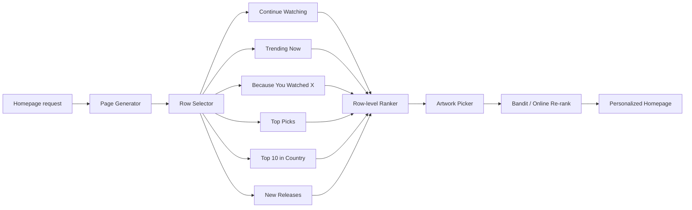

# Netflix Deep Dive — Recommendation System

**Date:** 2026-04-29 | **Updated:** 2026-04-29
**Tags:** `system-design` `case-study` `netflix` `deep-dive` `recommendations`

## Table of Contents

- [Summary](#summary)
- [Overview — A Personalized Storefront, Not a Feed](#overview--a-personalized-storefront-not-a-feed)
- [The Two-Stage Funnel — Recall and Ranking](#the-two-stage-funnel--recall-and-ranking)
- [Recall Stage — From Catalog to Candidate Sets](#recall-stage--from-catalog-to-candidate-sets)
  - [Matrix Factorization — The Netflix Prize Legacy](#matrix-factorization--the-netflix-prize-legacy)
  - [Item-Item Similarity — "Because You Watched X"](#item-item-similarity--because-you-watched-x)
  - [Deep Learning Recall — User and Item Towers](#deep-learning-recall--user-and-item-towers)
  - [Trending and Popularity-Based Recall](#trending-and-popularity-based-recall)
  - [Country and Licensing Filter](#country-and-licensing-filter)
- [Ranking Stage — Scoring Within Each Row](#ranking-stage--scoring-within-each-row)
- [Personalized Rows — The Page Itself Is a Model](#personalized-rows--the-page-itself-is-a-model)
- [Personalized Artwork — The Highest-Leverage Pixel](#personalized-artwork--the-highest-leverage-pixel)
- [Contextual Bandits — Exploration With a Budget](#contextual-bandits--exploration-with-a-budget)
- [A/B Testing Platform — XP and Quasi-Experiments](#ab-testing-platform--xp-and-quasi-experiments)
- [Cold Start — New Members, New Titles, New Markets](#cold-start--new-members-new-titles-new-markets)
- [Long-Form Watching Signal — What Netflix Learns From](#long-form-watching-signal--what-netflix-learns-from)
- [vs TikTok — Why the Same Funnel Looks Different](#vs-tiktok--why-the-same-funnel-looks-different)
- [Anti-Patterns](#anti-patterns)
- [Related](#related)
- [References](#references)

## Summary

Netflix's recommender is one of the most influential applied ML systems in the industry. It started as the public stage for collaborative filtering during the **Netflix Prize** (2006–2009), evolved into a deep-learning ranker layered over multi-source recall, and then expanded outward to personalize not just *what* you see but *how* you see it — every row on the homepage is chosen for you, every thumbnail is chosen for you, and the page is reordered for you each session. Roughly 80% of viewing comes from algorithmic surfacing rather than search (Gomez-Uribe & Hunt, 2015).

The architecture follows the now-canonical two-stage shape — cheap **candidate generation** to narrow the catalog, heavy **ranking** to score the survivors — but Netflix runs it across three nested levels: **page-level row selection**, **within-row ranking**, and **per-title artwork selection**. Each level is its own personalization problem, each is fed by precomputed batch features in EVCache plus online bandit signals, and each is governed by Netflix's experimentation platform (Quasi-Experimentation Platform, often called **XP**). The defining Netflix-specific twist — beyond the long-form catalog and the relatively small number of titles versus a UGC platform — is **personalized artwork**: the same title can present a romance still to one viewer and an action still to another, and that single pixel decision lifts click-through 20–30%.

This is a companion to the parent case study [`../design-netflix.md`](../design-netflix.md), expanded around the recommender, the page builder, and the artwork picker. The TikTok counterpart is [`../../social-media/tiktok/for-you-page.md`](../../social-media/tiktok/for-you-page.md) — same funnel shape, very different signal model, very different content properties.

## Overview — A Personalized Storefront, Not a Feed

A TikTok For-You Page is a sequential decoder: emit one item, observe the reaction, emit the next. A Netflix homepage is an **arrangement** — a 2-D grid of rows and titles where the user freely scans, hovers, scrolls, and only commits to playback after several seconds of consideration. The unit of decision is not a single item but an entire layout: which rows, in which order, populated by which titles, displayed with which artwork.

A few properties shape the system:

- **Catalog is small and curated.** Netflix has on the order of 10,000–20,000 titles globally — orders of magnitude smaller than YouTube or TikTok. There is no infinite tail of UGC. Every title is licensed and metadata-rich.
- **Sessions are long-form.** A click commits the user to 30+ minutes of viewing. The cost of a bad recommendation is high; the value of a good one is high.
- **Watching is sparse and slow.** A user might finish 3–5 titles per week. The signal density is *much* lower than short-form video, where a user emits hundreds of completion/skip signals per session.
- **Many surfaces share the model.** Browse rows, "More Like This," autoplay billboards, search ranking, and notifications all draw from the same underlying user/item representations.
- **Per-profile, not per-account.** Each subscriber has up to 5 profiles. Personalization is keyed on `profileId`, not on the billing account.

These properties push the architecture in directions that diverge from short-form recommenders: heavier reliance on batch precomputation, page-level optimization rather than per-item streaming, and a serious investment in artwork as a first-class personalization surface.

## The Two-Stage Funnel — Recall and Ranking

```text
   ~10^4 catalog titles (after country/licensing filter)
            │
            │  Stage 1: Candidate Generation (per row)
            │   - cheap, multi-source, high-recall
            │   - precomputed in batch + online refresh
            ▼
   ~10^2 candidates per row × ~10^1 rows
            │
            │  Stage 2: Ranking
            │   - deep ranker per row
            │   - re-rank within and across rows
            ▼
   Personalized page (rows × titles × artwork)
```

The funnel runs three times per page load — once at the **page level** (which rows to include and in what order), once at the **row level** (which titles populate each row, ranked), and once at the **artwork level** (which thumbnail to render per title for this user-session). All three stages share representations: the same user embedding feeds row selection, title ranking, and artwork choice.

The page is constructed lazily. The first viewport is computed at request time from EVCache-backed precomputed rows, plus an online re-rank step driven by recent activity (something started today, a profile switch, a device change). Below-the-fold rows are computed as the user scrolls. If a row's data is stale or its source service times out, the page builder degrades to the next row rather than block the whole homepage.



A useful mental model: **recall optimizes for coverage of titles you'd plausibly watch**; **ranking optimizes for which of those you'd watch *now***; **artwork optimizes for which of those you'd *click***. They have different objectives, different latency budgets, and different feedback loops.

## Recall Stage — From Catalog to Candidate Sets

Each row on the homepage corresponds to a candidate-generation strategy. Generators are independent, complementary, and cheap.

### Matrix Factorization — The Netflix Prize Legacy

The Netflix Prize (2006–2009) was a $1M public competition to improve Cinematch, Netflix's then-current recommender, by 10% RMSE on rating prediction. The winning entry — *BellKor's Pragmatic Chaos* — was an ensemble dominated by **matrix factorization** variants pioneered by Simon Funk's "Funk SVD" blog post and formalized by Koren et al.

The core idea is small and elegant. Observed user-item ratings form a sparse matrix `R`. Factor it into `R ≈ U · Vᵀ` where `U` is users-by-latent-dim and `V` is items-by-latent-dim. The dot product `u_i · v_j` predicts user `i`'s rating for item `j`. Variants add bias terms (`b_user + b_item`), regularization, time dynamics (Koren 2009), and implicit-feedback weighting (Hu, Koren, Volinsky 2008 — "weighted ALS").

What Netflix actually deployed from the Prize was *not* the full ensemble. The winning blend was too expensive to run in production, and by the time the prize was awarded, Netflix had already pivoted from DVD ratings (the Prize task) to streaming, where rating prediction matters less than ranked recommendation. But the **representational lessons** stuck: low-rank user and item embeddings, implicit-feedback objectives, and bias decomposition all remain core building blocks.

Today matrix factorization sits as one recall source among many — used to seed embeddings, to cover users with sparse content-based signals, and to provide cheap "Because You Watched X" candidates via item-item similarity in latent space.

### Item-Item Similarity — "Because You Watched X"

For each title, precompute the top-K most similar titles using:

- **Co-watch frequency** — users who completed X also completed Y, with normalization for popularity.
- **Embedding cosine similarity** — distance in the matrix-factorization or deep-learning embedding space.
- **Content-based similarity** — metadata overlap (genre, cast, director, language, runtime band, mood tags from internal taxonomy).

This is precomputed nightly per region and stored as a flat lookup. At request time, "Because You Watched X" rows are populated in O(1) per anchor title — pull last week's standout titles for the profile and look up their neighbors.

### Deep Learning Recall — User and Item Towers

Modern Netflix retrieval moved beyond pure matrix factorization to **two-tower neural networks** of the kind popularized by Covington et al. (YouTube, 2016) and Yi et al. (sampling-bias-corrected two-tower, RecSys 2019). The user tower ingests profile features, recent watch history, device, time-of-day, and country; the item tower ingests title embeddings, metadata, recency, and popularity priors. Both project to a shared `d`-dimensional space; retrieval is ANN over the item index.

Compared to TikTok's two-tower, the Netflix variant runs at much lower QPS (homepages are loaded, not feeds streamed), refreshes user embeddings on a more relaxed cadence, and weights long-form completion much more heavily than short-form skips.

### Trending and Popularity-Based Recall

- **Trending Now** — short-window popularity (last few hours) per country, with time decay.
- **Top 10 in Your Country** — daily ranking per country, used as both a row and a UI element on the title page.
- **New Releases** — newly added titles within the licensing window for the country.
- **Continue Watching** — bookmarked sessions (the playback service writes a position; Continue Watching reads it). Strictly speaking this isn't recommendation — it's recall over the user's own state — but it occupies a top row and competes with personalized recall for placement.

### Country and Licensing Filter

Every recall source runs *after* a country/licensing filter that restricts the candidate set to titles licensed for the user's region with current rights windows. Licensing pervades recall (and the rest of the system); see [parent case study](../design-netflix.md) for the data model.

A practical consequence: a recommendation algorithm that ignores licensing will happily surface titles that the catalog API will refuse to play, or worse, show artwork the studio hasn't licensed for the territory. The recall layer pre-filters against the country's current license window cache; the ranker doesn't have to know about it.

### Generator Composition

Each generator returns a small candidate set with a confidence score; the page builder merges them. The composition matters:

- **Coverage union, not intersection.** Different generators are good at different failure modes; intersecting their outputs throws away most of the value.
- **Generator-tagged candidates.** Each candidate carries its origin generator(s); the page-level model uses this for diversity and explainability ("Because You Watched X" rows must come from the matching anchor's neighbors).
- **Backstop fallbacks.** If personalized recall returns thin results (cold profile, exotic device), the page falls back to country-popularity rows so the homepage is never empty.

## Ranking Stage — Scoring Within Each Row

Once each row has its candidate set (typically 50–200 titles), a **deep ranker** scores them. The ranker is a multi-task DNN with cross-features:

| Feature group | Examples |
|---|---|
| User | profile embedding, watch history embedding, recent genres, completion-rate distribution |
| Title | embedding, metadata (cast, director, year, runtime, language, genre tags), popularity priors |
| Cross | user × title affinity (recency-weighted dot products), device × title (mobile vs TV), session context (time of day, day of week) |
| Engagement priors | predicted click rate, predicted completion rate, predicted re-watch rate |
| Diversity / freshness | days since first surfacing to this profile, recent surfacing fatigue |

Multi-task targets typically include:

- **Click probability** (will the user open the title page from this thumbnail?)
- **Play probability** (will the user start playback?)
- **Completion probability** (will the user finish the title?)
- **Long-term value** (will this title contribute to retention next month?)

The final score is a weighted combination, with weights set by the experimentation platform and re-tuned through A/B tests. Long-term retention modeling is uniquely important for Netflix because subscription churn — not session engagement — is the bottom-line metric.

The ranker scores titles **and** rows. Row-level scoring decides whether "Trending Now" should be the second row or the seventh for *this* profile *right now*. The page builder then assembles the layout subject to constraints (e.g., always show Continue Watching above the fold if non-empty, never show two "Because You Watched X" rows back-to-back).

### Multi-Task Learning vs Single-Objective

Earlier Netflix rankers were single-objective (predict play probability) with hand-tuned multipliers for diversity, recency, and freshness. The current shape is **multi-task** with shared backbone embeddings and per-task heads. This matters for two reasons:

1. **Sparse positive signals reuse a common representation.** Rare events (Add to My List, season-2 progression) benefit from features learned by frequent events (clicks, plays).
2. **Trade-offs are tunable per surface.** The "Continue Watching" row weights *recency* heavily; "Top Picks" weights *long-form completion*. Both heads share the trunk; only the head weights differ.

A practical pitfall: when one head dominates the loss, the trunk drifts toward features that serve only that head. Netflix mitigates with task balancing (uncertainty-weighted losses, GradNorm-style adjustments) and with periodic ablation tests under XP.

### Latency and Caching

The ranker isn't free. Scoring 1,500 titles per page through a deep model would burn far more than the homepage's latency budget, so the system caches aggressively:

- **Per-profile precomputed scores** for the standard candidate pool live in EVCache with a TTL of hours. The first viewport reads them directly.
- **Online re-rank** runs only on the slice that actually changed since the cache was warmed (a new completion, a profile switch, a device class change).
- **Below-the-fold rows** are computed lazily as the user scrolls.

The latency budget is dictated by the homepage SLO, not by the ranker. The ranker fits inside the budget the page builder gives it.

## Personalized Rows — The Page Itself Is a Model

Netflix's homepage is famously not a static template. The rows you see, their order, and their composition are all per-profile. The page is built by a **page-level model** that selects which rows from a pool of dozens of row generators to include, in what order, with which titles inside.

A simplified pseudocode of the page builder:

```text
candidate_rows = [
  ContinueWatchingRow(profile),
  TrendingNowRow(country),
  Top10Row(country),
  TopPicksRow(profile),                         # personalized
  BecauseYouWatchedRow(profile, anchor_title),  # one per anchor
  NewReleasesRow(country),
  GenreThemedRows(profile),                     # e.g. "Mind-Bending Sci-Fi"
  CollectionRows(country),                      # e.g. "Critically Acclaimed Dramas"
  ...
]

ranked_rows = page_ranker.score(candidate_rows, profile_features)
filtered    = apply_diversity_constraints(ranked_rows)
personalized_page = render(filtered, artwork_picker(profile))
```

Two ideas matter beyond the obvious "rank rows by score":

1. **Row diversification.** Two consecutive "Because You Watched X" rows would feel redundant. The page-level model penalizes back-to-back generators of the same kind and rewards row-type diversity.
2. **Anchor selection within row generators.** "Because You Watched *House of Cards*" is one row; "Because You Watched *The Crown*" is another. The page builder picks a small number of anchor titles per profile from recent strong completions; the more an anchor is reused on subsequent visits, the more its diversity penalty grows.

The cost of personalizing the page itself is bounded by EVCache. Each profile's homepage layout is precomputed in a batch job nightly and refreshed online when major events happen (a new completion, a profile switch, a device class change). The cache holds serialized row metadata; the page builder hydrates titles and applies the artwork picker at request time.

## Personalized Artwork — The Highest-Leverage Pixel

Netflix's research found visual artwork accounts for ~82% of attention when browsing. So they personalize that too. The Netflix Tech Blog post *Artwork Personalization at Netflix* (Chandrashekar, Amat, Basilico & Jebara, 2017) is the canonical public reference.

The setup:

- For each title, **hundreds to thousands of candidate stills** are pre-extracted from the asset (different scenes, different cast members, different framings, different emotional tones). These are evaluated for visual quality and policy compliance offline.
- A **contextual bandit** chooses, per profile per session per surface, which still to render as the title's thumbnail.
- The bandit observes the **outcome** — did the user click, did they start playback, did they finish, did they abandon — and updates online.

The action space per title is large (often hundreds of stills), the feedback is noisy (long sessions, sparse signal), and the context is rich (profile embedding, recent genres, device, surface within the page). This is genuinely hard ML, not a knob that flips between two stock images.

### Why It Works

The same title presents differently to different viewers because viewers respond to different visual cues. A romance-leaning profile may click the still that foregrounds the lead couple. An action-leaning profile may click the still with explosions or a chase. Netflix's published lift figures put the impact at **20–30% incremental clicks** versus a fixed best-still baseline.

### What's Hard About It

- **Counterfactual evaluation.** You can't show the user multiple thumbnails simultaneously. You see what they did with the one you picked, not what they would have done with the others. The bandit infrastructure has to handle this — see [contextual bandits](#contextual-bandits--exploration-with-a-budget) below.
- **Cold start per artwork.** A newly-extracted still has no engagement data. Treat as a high-uncertainty arm; explore it on a fraction of impressions.
- **Asset constraints.** Studios sometimes contractually require specific stills, talent representation rules, parental-safety filters per market, and language-localized text overlays. The bandit's action space is gated by these constraints per market.
- **Cross-surface consistency vs personalization.** Showing one still in the row and a different still on the title page is jarring. Within a session, the picker tends to commit to one still per title per surface.

### How It Connects to the Rest of the Stack

Artwork choice happens **after** ranking but **before** rendering. The ranker decides "show *House of Cards* as the second tile of the third row"; the artwork picker decides "render that tile with still #347, the close-up of Claire Underwood." The bandit reward is observed asynchronously through the standard event pipeline (Kafka/Keystone) and used to update arm statistics in near-real time.

### Asset Pipeline

Behind the bandit there's a substantial offline pipeline:

1. **Frame extraction** — sample candidate stills from the master asset at high cadence.
2. **Quality filtering** — drop stills that are blurry, transitional, or contain unsafe content.
3. **Computer-vision features** — tag stills with detected faces (cast lookup), composition, color palette, motion vs static, indoor/outdoor.
4. **Variant generation** — apply localized text overlays, language-specific title cards, aspect-ratio crops for different surfaces (mobile portrait, TV 16:9, billboard banner).
5. **Editorial review** — a human-in-the-loop step on a sample for talent representation, market-specific norms, and policy compliance.

Only stills that survive all of this enter the bandit's action space. The bandit doesn't have to learn that a blurry frame is bad; the pipeline never gives that frame as an arm.

## Contextual Bandits — Exploration With a Budget

Bandits are how Netflix balances **exploitation** (show the thing the model thinks is best) against **exploration** (gather data on alternatives so the model improves). They appear in at least three places:

- **Artwork selection** — pick a still per title per session.
- **Row-level placement** — sometimes try a less-confident row higher on the page to see whether it engages.
- **New-title discovery** — surface a freshly added title to a slice of users likely to engage, to bootstrap signal.

The contextual bandit framing: at each decision point, the system observes a context vector `x` (profile features, surface, time, etc.), picks an action `a` from a set of arms, and observes a reward `r`. Common algorithms include LinUCB, Thompson sampling with a linear or neural reward model, and ε-greedy with a learned baseline. Netflix has published on **Bayesian bandits** and counterfactual evaluation in the artwork context (Amat et al., 2018).

Two operational properties matter:

1. **Counterfactual evaluation via inverse propensity scoring (IPS).** When the bandit logs which action was taken with what probability, you can later replay candidate policies offline against the logs. This lets new bandit policies ship without a live A/B test, or with a cheaper test, by checking whether the new policy would have done better on past traffic.
2. **Reward shaping is delicate.** Click-through is fast feedback but a noisy proxy for "did the user enjoy the title." Long-form completion is the real signal but lags by hours. Netflix's bandits typically combine fast and slow rewards: optimize click-through with a constraint that the chosen still doesn't degrade downstream completion.

The bandit infrastructure piggybacks on the same online feature store, the same event bus (Keystone/Kafka), and the same observability stack (Atlas) as the rest of the recommender — there isn't a separate "bandit cluster."

### Exploration Rate and Safety

Exploration costs short-term engagement (you sometimes show a worse arm to learn about it). Netflix bounds the exploration rate per surface:

- **High-stakes surfaces** (above-the-fold billboard, push notification thumbnail) get tighter exploration — most impressions go to the high-confidence arm.
- **Lower-stakes surfaces** (deep rows, in-row tiles past the third position) tolerate more exploration because each impression is worth less.
- **Per-title cooldowns** prevent the bandit from repeatedly testing exploratory arms on the same user-title pair within a session.

The result is a system that learns continuously without degrading the median user's homepage. Without these guardrails, naive ε-greedy exploration would visibly hurt CTR on power users.

## A/B Testing Platform — XP and Quasi-Experiments

Every algorithm change at Netflix ships behind an experiment. The internal platform is **XP** — sometimes called the Quasi-Experimentation Platform. The Netflix Tech Blog has covered it in posts such as *Reimagining Experimentation Analysis at Netflix* and *Quasi-Experimentation at Netflix*.

The platform supports:

- **Standard A/B tests.** Random assignment per profile (or per account, depending on the surface), holdout cells, sequential testing with stopping rules.
- **Quasi-experiments.** When randomization is impossible — e.g., regional rollouts, pricing changes, content launches — XP supports difference-in-differences, synthetic-control, and matched-cohort analyses.
- **Allocation hierarchy.** A profile can be in multiple non-conflicting experiments simultaneously. The platform manages exclusivity rules between conflicting tests.
- **Ramp and rollback.** Tests start at 1%, ramp on a schedule, and roll back automatically on regression in guardrail metrics (retention, playback errors, billing failures).

### What Gets Measured

Recommendation experiments report on a stack of metrics:

| Metric class | Examples |
|---|---|
| Engagement | click-through, play rate, hours streamed |
| Completion | titles completed per week, retention into season 2 of a series |
| Diversity | breadth of genres watched, novelty score |
| Retention | 28-day churn, 60-day churn |
| Revenue / cost | streaming-hour cost per session, support contacts |

The headline is almost always **retention**, because Netflix's bottom line is subscription continuation. A model that increases hours streamed but increases churn is a regression. This is *very* different from an ad-funded short-form platform where session engagement is closer to revenue.

### Sample Sizes and Statistical Power

Retention metrics are slow. A 60-day churn test with a meaningful minimum-detectable-effect needs millions of profiles in each cell and runs for weeks. Netflix invested heavily in variance-reduction techniques (CUPED — *Improving the Sensitivity of Online Controlled Experiments by Utilizing Pre-Experiment Data*, Deng et al., 2013, originally from Microsoft) to make these tests practical at the cadence the business needs.

### Why "Quasi" Matters

Some changes can't be A/B tested cleanly. A new title launch is global; you can't show *Stranger Things S5* to half the world and not the other half. A regional pricing change is geographic; randomization within a market is impossible. A UI overhaul on the TV app may have a long ramp because the app updates lag.

For these, XP supports quasi-experimental designs:

- **Synthetic control** — construct a counterfactual cohort from countries/profiles that did not get the change, weighted to match the treated cohort's pre-treatment trend.
- **Difference-in-differences** — compare the change in the metric in the treated group versus an untreated baseline group, before and after the intervention.
- **Matched cohorts** — pair each treated profile with one or more untreated profiles on pre-treatment behavior, then compare post-treatment outcomes.

These don't replace A/B tests but extend the surface the platform can give an honest answer on.

## Cold Start — New Members, New Titles, New Markets

Cold start is the recommender's classic Achilles' heel. Netflix faces it in three flavors.

### New Members

A subscriber on day one has no watch history. Netflix used to ask new members to rate a handful of titles during onboarding to seed a profile vector. The current onboarding asks the new member to **pick a few titles they like** during signup; those clicks instantiate the profile embedding via the item tower, after which the standard ranker takes over. The first session falls back heavily on:

- **Country popularity** — Top 10 and Trending Now.
- **Genre preference declared at signup.**
- **Demographic priors** if any (age band, signup device class).

After ~5–10 completed titles, the member is "warm" — the personalized ranker starts producing meaningful recall.

### New Titles

A title with no engagement history can't be retrieved by collaborative filtering — there are no co-watch counts. It can be retrieved by:

- **Content embedding** — derived from metadata, cast, director, language, plus visual/audio embeddings from a small set of pre-release stills and the trailer.
- **Editorial seeding** — Netflix's content team places new titles on curated rows ("New Releases," "Coming Soon," promotional billboards) for the first few days.
- **Bandit-driven discovery** — show the new title to a small slice of users predicted to be likely fans, gather engagement data, then expand the audience as the model gains confidence.

This is also where **Open Connect pre-positioning** intersects with recommendations: titles predicted by the recommender to surge in popularity get pre-cached on edge OCAs ahead of their public release, so the bytes are already inside the ISP when the algorithmic surge hits. See parent case study.

### New Markets

When Netflix enters a new country, the historical engagement data for that country is empty. Localized rows like "Top 10 in Your Country" can't bootstrap from data. Mitigations include:

- Borrowing engagement priors from culturally adjacent countries until local signal accumulates.
- Heavier editorial curation in the first months of a market.
- Conservative artwork bandits — favor higher-confidence stills and fewer exploratory arms while baseline data is thin.

## Long-Form Watching Signal — What Netflix Learns From

The shape of the engagement signal is the deepest difference between Netflix's recommender and a short-form recommender. A TikTok user emits hundreds of completion/skip events per session; a Netflix user might emit one *play* event and one *completion* event per multi-day binge. The labeling problem is fundamentally different.

What Netflix actually logs as positive signal:

- **Play start** — clicked through and committed at least a few seconds of playback (filters out bounces).
- **Completion threshold** — watched ≥X% of runtime (X is title-type-dependent — episode vs. movie vs. unscripted).
- **Series progression** — finished S1E1, finished S1E5, finished S1, started S2.
- **Re-watch / re-engagement** — opened the title again on a subsequent day.
- **Add to My List** — explicit signal, used as a strong positive even though small in volume.
- **Long sessions vs short sessions** — total streaming hours per week is a coarse retention proxy.

What it logs as negative or weak signal:

- **Hover and bounce** — opened the title page but didn't play.
- **Started but abandoned** — played for less than a small minimum, then quit. This is a meaningful negative.
- **Skipped past in the row** — the user scrolled past without clicking (weak negative, hard to attribute).
- **Thumbs down** — explicit, rare, treated as a strong negative.

The model has to be careful about a few things short-form platforms don't worry about:

- **Series binge confounds.** A user watching all 60 episodes of a series produces 60 completion signals from one underlying preference. De-duplicate or down-weight at the series level so the model doesn't think the user "loves long episodic content" merely because they liked one show.
- **Multi-viewer profiles.** Two adults sharing a profile produce a noisy joint signal. Netflix mitigates this with per-profile architecture but can't fully eliminate it; the kids profile is a partial control surface.
- **Device-mediated taste shifts.** What a user watches on a phone at lunch is different from what they watch on a TV in the evening. The ranker uses device class as an explicit context feature.
- **Slow feedback for retention.** Engagement signals arrive in seconds; the retention signal arrives in months. Online learning is bounded by what can be inferred from short-window proxies. Long-window decisions require batch retraining.

This shapes the cadence of the entire system. Netflix doesn't run online learning at the per-second cadence of TikTok's Monolith; it runs daily-to-hourly batch retraining with online bandit overlays for fast surfaces (artwork, row order). The trade-off is justified by signal sparsity — there isn't enough fresh data per profile per minute to update a deep ranker meaningfully at TikTok's cadence.

### From Implicit to Explicit

Netflix used to lean heavily on **explicit ratings** — the famous five-star rating system, which trained Cinematch and was the target of the Netflix Prize. In 2017 they replaced it with **thumbs up / thumbs down**. The reasoning, in their own published explanations: ratings were aspirational ("I rate documentaries 5 stars but I actually watch reality TV"), low-volume, and bimodal in a way that hurt model quality. Thumbs are simpler, more honest, and produce more signal.

The deeper lesson: **implicit signal beats explicit signal at scale**. What a user actually watched, completed, and re-engaged with is a stronger predictor of future taste than what they say they like. Explicit thumbs and Add-to-My-List remain features but are no longer the primary objective. This mirrors the broader recommender-systems consensus established by Hu, Koren, Volinsky's implicit-feedback paper and reinforced by every large-scale recommender that came after.

## vs TikTok — Why the Same Funnel Looks Different

Both platforms run the two-stage funnel. The differences are in the constants.

| Dimension | Netflix | TikTok |
|---|---|---|
| Catalog size | ~10⁴ titles | ~10⁸–10⁹ videos (UGC) |
| Item lifetime | Months to years | Hours to days for trending; seconds for skipped |
| Session length | 30 min – 4 hours per play | ~30 min, ~hundreds of items |
| Items per session | 1 (sometimes 2–3 episodes) | ~hundreds |
| Signal per session | 1–3 events | hundreds of events |
| Primary signal | Long-form completion, series progression, retention | Completion rate, replay, skip latency |
| Cold-start severity | Moderate (new titles, new members) | Severe (every video is new) |
| Recall sources | MF + co-watch + two-tower + popularity + editorial | Two-tower + content + collaborative + sound + freshness |
| Ranking cadence | Hourly to daily batch + online bandits | Continuous online (Monolith) |
| Personalized artwork | Yes — central to the product | No — same vertical-video clip for all viewers |
| Page shape | 2-D grid (rows × titles) | Linear stream |
| Surface optimization | Page layout + row order + within-row + artwork | Single-item ordering |
| Headline metric | 28/60-day retention | Session length, retention |
| Latency target | 100–300 ms (homepage) | 100 ms (next-video) |

The structural takeaway: Netflix optimizes a **layout** for a viewer who'll commit hours to a single decision. TikTok optimizes a **stream** for a viewer who emits a decision every few seconds. Both use the same two-stage funnel. But Netflix invests far more in batch precomputation, page-level personalization, and artwork — while TikTok invests far more in real-time learning, ANN scale, and per-item ranking throughput.

### What Each Could Learn From the Other

- **Netflix from TikTok**: faster online learning loops on the row-order and artwork surfaces. The bandit cadence is already faster than the ranker's; pushing it further (per-minute, not per-hour) for high-traffic sessions would tighten feedback. Netflix has experimented with sequence-aware models for "what to watch next within a session" — closer to TikTok's session encoder.
- **TikTok from Netflix**: page-level optimization on long-form surfaces (TikTok's "Following" tab, LIVE rail, search results page). The two-stage funnel is universal; the layout-optimization layer above it is mostly a Netflix invention.
- **Both**: shared structural primitives (two-tower retrieval, multi-task ranking, IPS-based counterfactual evaluation, contextual bandits) — different *constants* and *cadences*, same *shape*. A team that masters one can move to the other and recognize most of the architecture.

## Anti-Patterns

- **Treating the homepage as a static template.** A homepage with fixed rows ("Trending," "New," "Action," etc.) leaves enormous engagement on the table. Make the page itself a model output.
- **Optimizing for clicks, not retention.** A model that maximizes thumbnail clicks but the user bounces back to the homepage is a regression. Retention is the only metric that pays the rent.
- **One-shot artwork per title.** Visual artwork is the highest-leverage personalization surface a streaming product has. Don't ship a single still and forget about it.
- **Pure batch recommendations with no online layer.** Batch alone goes stale within hours of a profile switch or a major completion. Layer bandits or online re-rank over batch precomputation.
- **Ignoring series-binge confounds.** If you don't down-weight repeated episodes of one series, the model will believe every viewer wants long-form episodic crime drama because *one* household does.
- **Treating new titles as recall failures.** New titles can't appear in collaborative filtering recall. If you don't have content-embedding recall and editorial seeding, every new release lands quietly.
- **Letting the ranker free-fire across surfaces.** Search, browse, autoplay, push notifications, and "More Like This" all need shared representations. Inconsistent recommendations across surfaces feel like a bug to the user.
- **A/B test culture without retention guardrails.** Engagement-positive, retention-negative tests will quietly erode the business. Every test reports retention even if its primary metric is something else.
- **Skipping counterfactual evaluation for bandits.** Without IPS replay, every new bandit policy needs an expensive live test. With it, you can prune candidate policies offline and test only the survivors.
- **Forgetting licensing.** Recall, ranking, *and* artwork rights vary per market. A model that surfaces a title that's geo-blocked, or shows artwork the studio hasn't licensed for the territory, is broken.

## Related

- [Parent case study — Designing Netflix](../design-netflix.md)
- [Sibling — TikTok For-You Page deep dive](../../social-media/tiktok/for-you-page.md) — same funnel, short-form variant.
- [`../design-youtube.md`](../design-youtube.md) — YouTube's Covington-era recommender is the academic root of much of this.
- [`../design-spotify.md`](../design-spotify.md) — long-form audio recommendation, similar batch+online structure.
- [`../../../INDEX.md`](../../../INDEX.md) — system-design index.

## References

- Gomez-Uribe, C. A., Hunt, N. *The Netflix Recommender System: Algorithms, Business Value, and Innovation.* ACM Transactions on Management Information Systems, 2015. <https://dl.acm.org/doi/10.1145/2843948>
- Chandrashekar, A., Amat, F., Basilico, J., Jebara, T. *Artwork Personalization at Netflix.* Netflix Technology Blog, 2017. <https://netflixtechblog.com/artwork-personalization-c589f074ad76>
- Amat, F., Chandrashekar, A., Jebara, T., Basilico, J. *Artwork Personalization at Netflix (Industry Talk).* RecSys 2018. <https://dl.acm.org/doi/10.1145/3240323.3241729>
- Bell, R. M., Koren, Y., Volinsky, C. *The BellKor 2008 Solution to the Netflix Prize.* AT&T Labs Research, 2008. <https://www.netflixprize.com/assets/ProgressPrize2008_BellKor.pdf>
- Koren, Y., Bell, R., Volinsky, C. *Matrix Factorization Techniques for Recommender Systems.* IEEE Computer, 2009. <https://datajobs.com/data-science-repo/Recommender-Systems-[Netflix].pdf>
- Hu, Y., Koren, Y., Volinsky, C. *Collaborative Filtering for Implicit Feedback Datasets.* ICDM 2008. <https://yifanhu.net/PUB/cf.pdf>
- Funk, S. *Try This at Home (Funk SVD blog post).* 2006. <https://sifter.org/~simon/journal/20061211.html>
- Covington, P., Adams, J., Sargin, E. *Deep Neural Networks for YouTube Recommendations.* RecSys 2016. <https://research.google/pubs/deep-neural-networks-for-youtube-recommendations/>
- Yi, X. et al. *Sampling-Bias-Corrected Neural Modeling for Large Corpus Item Recommendations.* RecSys 2019. <https://research.google/pubs/sampling-bias-corrected-neural-modeling-for-large-corpus-item-recommendations/>
- Deng, A., Xu, Y., Kohavi, R., Walker, T. *Improving the Sensitivity of Online Controlled Experiments by Utilizing Pre-Experiment Data (CUPED).* WSDM 2013. <https://www.exp-platform.com/Documents/2013-02-CUPED-ImprovingSensitivityOfControlledExperiments.pdf>
- Netflix Technology Blog. *Reimagining Experimentation Analysis at Netflix.* <https://netflixtechblog.com/reimagining-experimentation-analysis-at-netflix-71356393af21>
- Netflix Technology Blog. *Quasi-Experimentation at Netflix.* <https://netflixtechblog.com/quasi-experimentation-at-netflix-566b57d2e362>
- Netflix Technology Blog. *Learning a Personalized Homepage.* <https://netflixtechblog.com/learning-a-personalized-homepage-aa8ec670359a>
- Netflix Technology Blog. *Artwork Personalization at Netflix.* <https://netflixtechblog.com/artwork-personalization-c589f074ad76>
- Netflix Technology Blog. <https://netflixtechblog.com/>
- Netflix Research. *Recommendations.* <https://research.netflix.com/research-area/recommendations>
- Bennett, J., Lanning, S. *The Netflix Prize.* KDD Cup and Workshop, 2007. <https://www.cs.uic.edu/~liub/KDD-cup-2007/proceedings/The-Netflix-Prize-Bennett.pdf>
