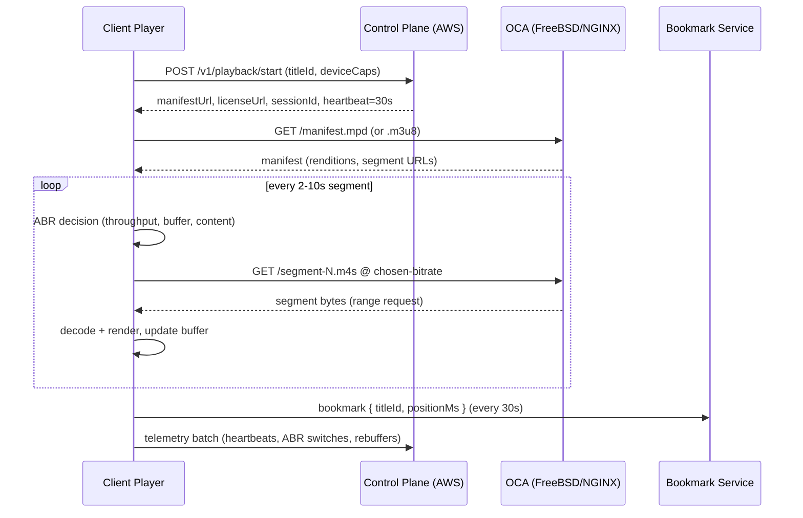
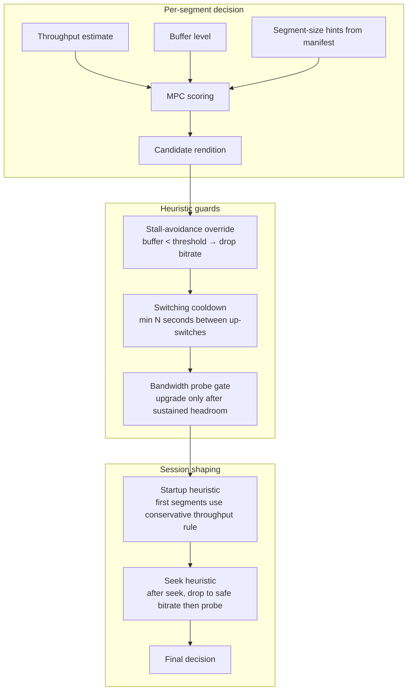
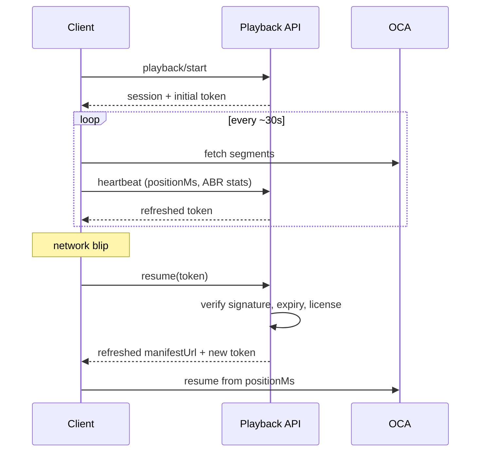
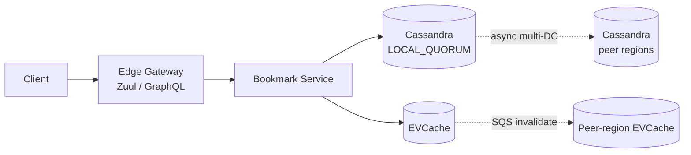
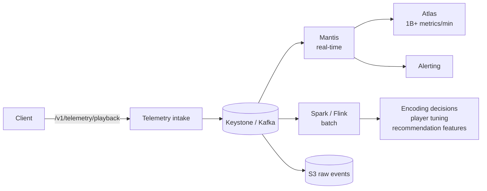

# Netflix Deep Dive — Viewing Session and ABR

**Date:** 2026-04-29 | **Updated:** 2026-04-29
**Tags:** `system-design` `case-study` `netflix` `deep-dive` `abr` `video`

## Summary

Once a Netflix client has a manifest URL pointing at an OCA, the streaming experience is no longer driven by the server. The **client** runs the show: it parses an HLS or DASH manifest enumerating renditions of the same content at different bitrates, then for every ~2–10 second segment it picks which bitrate to fetch next. That decision is the **Adaptive Bitrate (ABR)** algorithm. Get it wrong and the user sees a spinning wheel; get it right and they see crisp 4K that started playing in under two seconds.

ABR is a control problem dressed as a video problem. Three sensors feed the loop — measured **throughput**, current **buffer level** (seconds of decoded video ready to play), and **content properties** (segment sizes, encoded bitrates). Three families of algorithms balance them: **throughput-based** (fetch what your bandwidth estimate predicts you can sustain), **buffer-based** (let buffer occupancy alone drive bitrate, BBA / BOLA), and **hybrid model-predictive** (MPC, optimize a utility function over the next several segments). Netflix's player blends all three plus a stack of heuristics tuned against billions of real sessions.

In parallel, every session emits **telemetry** — heartbeats, bitrate switches, rebuffer events, error codes — into Kafka/Keystone. The client also writes **bookmarks** (last-known position) to a Cassandra-backed service so any device can resume where you left off. **Resume tokens** carry session continuity across network blips, app crashes, and device handoffs. **QoE metrics** (startup time, rebuffer ratio, average bitrate, crisp-second percentage) close the loop back into encoding decisions and player tuning.

This deep dive expands on the [Viewing-Session Tracking and ABR](../design-netflix.md#viewing-session-tracking-and-abr) section of the parent case study. The companion docs are [`encoding-pipeline.md`](./encoding-pipeline.md) for what the ABR client actually fetches and [`open-connect.md`](./open-connect.md) for where those bytes come from.

## Table of Contents

- [Summary](#summary)
- [Overview — The Client Owns Playback](#overview--the-client-owns-playback)
- [HLS vs DASH Manifests](#hls-vs-dash-manifests)
- [Buffer-Based ABR (BBA, BOLA)](#buffer-based-abr-bba-bola)
- [Throughput-Based ABR](#throughput-based-abr)
- [BOLA / MPC Hybrid](#bola--mpc-hybrid)
- [Bandwidth Probing](#bandwidth-probing)
- [Stall Avoidance](#stall-avoidance)
- [Resume Tokens](#resume-tokens)
- [Per-Device Sync and Bookmarks](#per-device-sync-and-bookmarks)
- [QoE Metrics](#qoe-metrics)
- [Netflix Player Heuristics](#netflix-player-heuristics)
- [Anti-Patterns](#anti-patterns)
- [Related](#related)
- [References](#references)

## Overview — The Client Owns Playback

The fundamental shape of HTTP adaptive streaming:



A few invariants:

- **Pull, not push.** The OCA is a dumb byte-server. Every segment is a plain HTTP `GET`. No server-driven bitrate selection, no push protocol, no WebSocket. The OCA doesn't know the client is doing ABR — it just sees range requests.
- **The control plane is out of the hot path.** After `playback/start` returns, AWS sees only telemetry batches and bookmark writes. The video bytes never touch AWS.
- **Stateless server, stateful client.** The OCA holds no per-session state. A client can re-resolve manifests, swap OCAs mid-session, or reconnect after a NAT rebinding without server coordination.
- **Manifests are short-lived references, not data.** A manifest is a few KB of XML/text describing where each segment lives. It can be re-fetched at any time.

This is the same shape as YouTube, Hulu, Disney+, Prime Video — all HTTP adaptive streaming. What differs is the encoding ladder, the CDN, and the player tuning.

## HLS vs DASH Manifests

Netflix delivers both formats because device support is split. **HLS** (RFC 8216, originally Apple) for FairPlay devices (Safari, iOS, Apple TV, AirPlay) and many smart TVs. **DASH** (MPEG-DASH, ISO/IEC 23009-1) for everything else — Android, Chrome, Edge, most game consoles, modern smart TVs. The encoding pipeline produces both packagings of the same underlying segment files.

### HLS Manifest Shape

HLS uses two layers of `.m3u8` playlists. The **master playlist** lists variants (renditions), each pointing at a **media playlist** that lists segments.

```text
# master.m3u8
#EXTM3U
#EXT-X-VERSION:6
#EXT-X-STREAM-INF:BANDWIDTH=560000,RESOLUTION=640x360,CODECS="avc1.42c01e,mp4a.40.2"
360p_avc.m3u8
#EXT-X-STREAM-INF:BANDWIDTH=2500000,RESOLUTION=1280x720,CODECS="avc1.4d401f,mp4a.40.2"
720p_avc.m3u8
#EXT-X-STREAM-INF:BANDWIDTH=6000000,RESOLUTION=1920x1080,CODECS="hvc1.2.4.L120.b0,mp4a.40.2"
1080p_hevc.m3u8
#EXT-X-STREAM-INF:BANDWIDTH=12000000,RESOLUTION=3840x2160,CODECS="av01.0.13M.10",HDR=DOLBY_VISION
4k_av1.m3u8
```

```text
# 1080p_hevc.m3u8
#EXTM3U
#EXT-X-VERSION:6
#EXT-X-TARGETDURATION:6
#EXT-X-MAP:URI="init.mp4"
#EXTINF:5.96,
seg-00001.m4s
#EXTINF:6.00,
seg-00002.m4s
#EXTINF:6.00,
seg-00003.m4s
...
#EXT-X-ENDLIST
```

Key tags the player uses for ABR:
- `BANDWIDTH` — peak bitrate for the variant. Player uses this as the *upper bound* of what to expect.
- `EXT-X-TARGETDURATION` — max segment duration. Drives buffer-level math.
- `EXTINF` — exact duration of each segment.
- `EXT-X-MAP` — initialization segment (codec config) fetched once per variant.

For low-latency live (CMAF + LL-HLS) Netflix and Apple added `#EXT-X-PART` (sub-segment chunks) and blocking playlist reload, but Netflix VOD doesn't use these — VOD is steady-state.

### DASH Manifest Shape

DASH uses a single XML **MPD** (Media Presentation Description) describing all renditions, audio tracks, subtitle tracks, and DRM hints in one document.

```xml
<MPD xmlns="urn:mpeg:dash:schema:mpd:2011" type="static" mediaPresentationDuration="PT2H1M0S">
  <Period>
    <AdaptationSet contentType="video" segmentAlignment="true">
      <Representation id="v360"  bandwidth="560000"   width="640"  height="360"  codecs="avc1.42c01e"/>
      <Representation id="v720"  bandwidth="2500000"  width="1280" height="720"  codecs="avc1.4d401f"/>
      <Representation id="v1080" bandwidth="6000000"  width="1920" height="1080" codecs="hvc1.2.4.L120.b0"/>
      <Representation id="v4k"   bandwidth="12000000" width="3840" height="2160" codecs="av01.0.13M.10"/>
      <SegmentTemplate timescale="1000" duration="6000" media="$RepresentationID$/seg-$Number$.m4s"
                      initialization="$RepresentationID$/init.mp4" startNumber="1"/>
    </AdaptationSet>
    <AdaptationSet contentType="audio" lang="en">
      <Representation id="a_en_eac3" bandwidth="384000" codecs="ec-3"/>
    </AdaptationSet>
  </Period>
</MPD>
```

DASH is more flexible than HLS:
- **One XML document** vs HLS's playlist-of-playlists. Easier to inspect, easier to author.
- **`SegmentTemplate`** lets a manifest describe thousands of segments via a URL pattern, no enumeration.
- **AdaptationSet groups** allow independent switching for video, audio, subtitle tracks (player can change audio language without re-fetching video).
- **`@minBufferTime`** signals the player how much buffer to maintain before play.

Netflix's encoding pipeline emits **CMAF** (Common Media Application Format) segment files — fragmented MP4 (`.m4s`) — that are referenced from *both* an HLS playlist and a DASH MPD. The bytes on disk on the OCA are the same; only the manifest packaging differs. That's the point of CMAF — half the storage footprint, single byte-range cache key on the OCA.

### Why It Matters for ABR

The manifest is the ABR algorithm's input. The player parses it once, then for every segment it consults the rendition list and the segment durations to decide which one to fetch. The manifest also contains hints that influence the algorithm: declared bandwidth values (treated as ceilings), HDR flags (some renditions excluded if device can't render), and codec strings (only fetch what the device can decode, established at `playback/start` from `deviceCapabilities`).

## Buffer-Based ABR (BBA, BOLA)

Buffer-based ABR makes the bitrate decision purely from **how much video the player has decoded and ready to play** — the **buffer level**, measured in seconds. The intuition: if I have 60 seconds buffered, I can afford to gamble on a higher bitrate; if I have 4 seconds, I'd better grab the safest rendition.

### BBA — Buffer-Based Algorithm (Netflix, 2014)

Netflix's seminal 2014 paper "A Buffer-Based Approach to Rate Adaptation" formalized this. The algorithm defines a **rate map**: a piecewise function `f(buffer_level) → bitrate`.

```text
buffer < 10s              → lowest rendition (safe)
10s ≤ buffer ≤ 30s        → linearly interpolate between min and max bitrate
buffer > 30s              → highest rendition (aggressive)
```

Plotted:

```text
bitrate
   |              ┌─── max
   |             /
   |           /
   |         /
   |       /
   |   ___/
   |__/
   └─────────────────── buffer level (s)
       10s    30s
```

Key insight: throughput estimation is **noisy** — TCP slow-start, segment-size variance, and ABR's own switching all confuse a "current bandwidth" measurement. Buffer level is a much cleaner signal because it integrates throughput history. If the buffer is filling, you're winning; if it's draining, you're losing.

Netflix found BBA cut rebuffers significantly versus pure throughput-based, because buffer-based naturally falls back to safe bitrates as the buffer drains, and ramps up only when the buffer is comfortably full.

### BOLA — Buffer Occupancy Lyapunov Algorithm (2016)

Spiteri et al. extended BBA into a formal optimization. BOLA frames ABR as an online optimization minimizing two costs:

1. **Stall cost** — proportional to the inverse of buffer level (low buffer = high stall risk).
2. **Quality cost** — log-utility of bitrate (more bitrate = better, but with diminishing returns).

The algorithm computes a Lyapunov function and picks at each segment the bitrate that maximizes:

```text
score(m) = V · v(m) - S(m) / buffer_level
```

Where `v(m)` is the utility of rendition `m`, `S(m)` is its size, and `V` is a tunable parameter trading off quality vs stall risk.

BOLA has provable optimality bounds: as the time horizon grows, BOLA converges to the optimal bitrate sequence within a known additive constant. In practice, dash.js (the open-source DASH reference player) ships BOLA as one of its default ABR rules, and many production players (including Netflix's, in spirit) descended from it.

### Strengths and Weaknesses

| Property | Pure buffer-based |
|---|---|
| **Stability** | Excellent — buffer is a smooth signal, switches are infrequent |
| **Stall avoidance** | Strong — algorithm naturally retreats as buffer drains |
| **Startup latency** | Poor — needs to fill the buffer before it has a signal, so initial bitrate is conservative |
| **Live streaming** | Weak — live latency budgets (~3–10s) leave no room for a 30s buffer rate map |
| **Bandwidth ramp-up** | Slow — buffer must fill before algorithm permits higher bitrate |

The startup problem is real: at the very first segment the buffer is 0, so a pure buffer-based algorithm picks the lowest rendition and the user sees blurry video until the buffer fills. Netflix and others fix this by **bootstrapping with a throughput estimate** for the first 1–2 segments, then handing off to buffer-based steady-state. This hybrid is what really runs in production.

## Throughput-Based ABR

The classical approach (used by early HLS clients and still by simpler players): estimate **available bandwidth** and pick the highest rendition whose declared bitrate is below the estimate (with a safety margin).

```text
estimate_bps = exponential_moving_average(segment_size / segment_download_time)
target_bps = estimate_bps × safety_factor   // typically 0.7–0.9
chosen_rendition = max(r in renditions where r.bitrate ≤ target_bps)
```

### Why Throughput Estimation Is Hard

Throughput from segment downloads is a **biased**, noisy signal:

- **TCP slow-start.** Short segments may finish before the connection ramps up, so measured throughput < actual capacity.
- **Segment size variance.** Per-shot encoding (and AV1) produces segments with wildly different sizes. A small segment finishes fast even on a slow link.
- **Switching feedback.** If you switch to a smaller rendition because of a low estimate, the next segment is smaller, which biases the estimate further down. This is the **death spiral** problem.
- **HTTP/2 and connection reuse.** Segments may share a connection with other in-flight requests, distorting timing.
- **Buffering at intermediaries.** Proxies, OS-level TCP buffers, and the OCA's own NGINX buffers all inflate measured throughput on the first segment.

### Smoothing Strategies

- **Harmonic mean** of recent samples (more robust to outliers than arithmetic mean).
- **Exponentially weighted moving average** with α tuned per platform — typically α=0.3 (newer samples dominate but old samples matter).
- **Sliding window** of last N samples (N = 5–10) plus a weighted median.
- **Per-segment confidence weighting** — larger segments produce more reliable estimates than tiny ones.

### When Throughput-Based Wins

- **Live streaming** where buffer must stay small (3–10s latency target). No room for a buffer-based ladder.
- **First few segments** of any session — there's no buffer history yet, so throughput is the only signal.
- **Sudden bandwidth changes** (Wi-Fi → cellular handoff). Buffer-based reacts only when the buffer drains; throughput-based reacts within one segment.

In production, throughput-based is rarely used pure — it's almost always blended with buffer-based or wrapped by an MPC layer.

## BOLA / MPC Hybrid

The state of the art combines all three signals — throughput estimate, buffer occupancy, and content properties — under a single optimization. Yin et al.'s 2015 SIGCOMM paper "A Control-Theoretic Approach for Dynamic Adaptive Video Streaming over HTTP" introduced **MPC (Model Predictive Control)** for ABR.

### MPC Setup

At every segment, MPC:

1. **Estimates throughput** for the next K segments (K typically 5).
2. **Enumerates candidate bitrate sequences** for those K segments.
3. **Simulates** each sequence forward — predicting how much buffer would result, whether stalls would occur.
4. **Scores** each sequence with a utility function:
   ```text
   U(seq) = Σ q(bitrate_i)              // quality reward
          - λ · stall_time(seq)         // stall penalty
          - μ · Σ |bitrate_i - bitrate_{i-1}|  // switching penalty
   ```
5. **Picks** the first segment of the highest-scoring sequence, then re-runs at the next segment with updated state. (This is the "model-predictive" part — replanning every step, not committing to a long sequence.)

Tunable parameters `λ` (stall aversion) and `μ` (smoothness preference) let operators dial the player's personality: aggressive (high quality, more switches) vs conservative (smoother, lower average bitrate).

### Robust MPC

The original MPC is sensitive to throughput-estimation error. **Robust MPC** computes the worst-case utility across a confidence interval of throughput estimates and optimizes that. In practice this means: if you're uncertain about bandwidth, prefer the lower bitrate. The performance hit on the optimistic case is small; the gain on the pessimistic case is large.

### How Production Players Blend

Netflix, YouTube, and Twitch don't ship pure BOLA or pure MPC. They ship blended algorithms with a layered structure:



The "algorithm" is really an *ensemble* — MPC at the core, with stall-avoidance overrides, switching dampers, and special-case handlers for startup and seeks layered on top.

## Bandwidth Probing

How does an ABR algorithm know it could sustain a higher bitrate? **By trying.** This is bandwidth probing, and it's harder than it sounds because the act of probing itself is risky.

### The Probing Dilemma

Suppose you're playing 1080p (6 Mbps) comfortably and you want to know if you can sustain 4K (12 Mbps). You can't just look at idle bandwidth, because the segment download already saturates the link. You have two choices:

1. **Speculative fetch** — download a single 4K segment as a probe. If it arrives in time, switch up. If not, you've wasted bandwidth and possibly stalled.
2. **Buffer-conditioned upgrade** — only upgrade when the buffer is large enough that a slow segment can't cause a stall.

Production players use option 2 with guardrails. Concretely:

- Wait until buffer ≥ some threshold (e.g., 30s).
- Probe up by **one rendition** at a time, never skipping levels.
- Require multiple consecutive successful segments before allowing further upgrades.
- Apply a **switching cooldown** — minimum N segments between bitrate changes.

### Hybrid Probe

Some implementations do a **partial probe**: request a small range from a higher bitrate's segment as a bandwidth check without committing to playing it. The OCA serves the byte range; the client measures throughput on that probe and only commits to switching if the probe shows headroom.

### The Down-Switch Is Always Safe

Down-switches are nearly free — the next segment will be smaller and arrive faster, building buffer. Players are aggressive about down-switches when buffer drains and conservative about up-switches when buffer fills. This asymmetry is fundamental: stalls are user-visible failures, lower quality is a soft cost.

## Stall Avoidance

A stall (rebuffer) is the worst QoE event in streaming. The user sees a spinner mid-scene. Netflix's rebuffer ratio target is < 0.5% of playtime. Several mechanisms work together to keep stalls rare.

### 1. Buffer Headroom

The player targets a buffer level (e.g., 60s for VOD, 10–30s for live). Below a low-water mark (e.g., 10s), the algorithm forces a down-switch regardless of throughput estimate. Below an emergency threshold (e.g., 4s), the player drops to the lowest rendition unconditionally.

```text
buffer_level
   60s ┤────────────  ← steady-state target
       │
   30s ┤────────────  ← upper threshold (allow up-switch)
       │
   10s ┤────────────  ← low water (force down-switch)
       │
    4s ┤────────────  ← emergency (lowest rendition)
       │
    0s ┤────────────  ← STALL
```

### 2. Aborted Downloads

If a segment is taking too long and the buffer is draining toward empty, the player **aborts the in-flight download** and re-requests at a lower bitrate. The math: if an 8 MB segment is half-downloaded after 3 seconds and buffer is at 5 seconds, completing it would take 6 more seconds and stall — better to throw away the 4 MB downloaded and fetch a 2 MB low-rendition version that finishes in 1 second.

### 3. Parallel Fetch on Seeks

After a seek, the buffer is empty. Naive reload at the user's chosen bitrate would mean ~2 seconds of black screen. Players instead:

- Fetch the lowest rendition for the *first* segment after seek (instant playback).
- In parallel, fetch the higher-rendition version of the second segment.
- After 1–2 segments, ABR's normal logic takes over.

### 4. Connection Failover

If the current OCA stops responding, the player re-resolves the manifest URL and switches to a different OCA. The control plane's steering service can return a different OCA; the manifest is re-fetched; segment downloads resume from the same byte offset within the rendition. The user experience: a brief micro-stall, then continues.

### 5. Multi-CDN Failover

For non-OCA traffic (mobile carriers without OCAs, edge cases), Netflix can fall back to commercial CDNs. The player has an ordered list of base URLs; on connection failure or high error rates it rotates to the next.

## Resume Tokens

Resume tokens are the mechanism by which a session survives **interruptions**: network blips, app backgrounding, device sleep, mid-flight OCA failover. They also enable **handoff** — start on TV, finish on phone.

### What's in a Resume Token

A resume token is the minimal state needed to reconstruct an ABR session:

```json
{
  "sessionId": "s_abc123",
  "profileId": "p_456",
  "titleId": "t_789",
  "positionMs": 1234567,
  "lastBitrate": 6000,
  "lastRendition": "v1080_hevc",
  "drmLicenseId": "lic_xyz",
  "manifestUrl": "https://oca-12.../manifest.mpd",
  "expiresAt": 1714567890,
  "signature": "..."
}
```

Properties:

- **Server-signed.** HMAC over the payload prevents the client from tampering with `positionMs` to skip ahead past intro skip restrictions or licensing windows.
- **Expiring.** Tokens have a TTL (minutes for in-session, hours for cross-device). Expired tokens force a fresh `playback/start`.
- **Bound to license.** The DRM license id is part of the token. A reused token after license expiry must re-license.
- **Bound to OCA.** The manifest URL is included so the client doesn't have to re-resolve unless it has to (e.g., the OCA failed).

### Token Lifecycle



The **heartbeat refreshes the token** so a token always reflects the recent state. When the client encounters a network failure mid-segment, it can resume locally (replay the last segment from buffer) without contacting the server. When the failure is longer (app crash, device sleep), the client uses the persisted token to call `resume`, which validates and returns a fresh token.

### Tokens vs Bookmarks

A **resume token** is *transactional* — it reflects the live session, expires fast, and includes manifest/OCA hints. A **bookmark** is *durable* — it's just (profileId, titleId, positionMs) stored in Cassandra, lives until overwritten, and powers Continue Watching across devices.

## Per-Device Sync and Bookmarks

The "Continue Watching" experience requires that watching 5 minutes of an episode on a phone updates the position visible on a TV. Netflix's bookmark service is the single source of truth.

### Data Model

Recap from the parent doc:

```sql
bookmark (
  profile_id     uuid,
  title_id       uuid,
  position_ms    bigint,
  updated_at     timestamp,
  PRIMARY KEY (profile_id, title_id)
);
```

Cassandra, partitioned by profile, replicated to all regions. One row per (profile, title) — most recent position wins.

### Write Path

The client writes bookmarks on a heartbeat schedule (every ~30s while playing) plus on terminal events (pause for >N seconds, stop, app close, error). The write path:



- **LOCAL_QUORUM** write — the local region is consistent; remote regions replicate within hundreds of ms.
- **EVCache** caches recent bookmarks for fast reads (Continue Watching shelf rendering).
- **SQS-based invalidation** — when `us-east-1` writes, an SQS message invalidates the same key in `eu-west-1`'s EVCache. The next read in `eu-west-1` either hits the freshly-replicated Cassandra row or falls through cleanly.

### Read Consistency

Two reads matter:

1. **Resume on the same device** — read your own write, but the device has the position locally anyway. Cache miss is fine.
2. **Continue Watching across devices** — eventual consistency is acceptable. If the TV shows a 30-second-stale position, the user resumes 30s earlier than they expected — annoying, not catastrophic.

Netflix doesn't strong-read on bookmarks. The cost (cross-region quorum) isn't justified by the user benefit. The policy: *prefer fast and slightly stale over slow and exact*.

### Conflict Resolution

What if two devices update the same bookmark concurrently — say, a phone plays a movie while the TV is paused on the same title? Cassandra resolves by **last-write-wins** based on the cell timestamp. To avoid clock skew nonsense, the bookmark service generates the timestamp server-side (not client-side). In practice, one device is always more recent than the other within a few seconds, and last-write-wins reflects user intent.

For "did I finish this episode" decisions (auto-advance to next episode, mark watched), the service uses thresholds — if `positionMs > duration * 0.95`, the title is considered watched, regardless of whether the bookmark recorded a clean `endOfPlay` event. This handles the "user closed the app at the credits" case.

### Privacy and Multi-Profile

Each profile has its own bookmark stream. Watching a title on the kids profile doesn't update bookmarks on the adult profile. The data model partitions by `profile_id`, so cross-profile reads are impossible at the storage layer.

## QoE Metrics

QoE = Quality of Experience. The metrics that matter to Netflix:

| Metric | What it measures | Target |
|---|---|---|
| **Time to first frame** | Tap "play" → first decoded frame on screen | < 2s broadband |
| **Rebuffer ratio** | Stall time / total playtime | < 0.5% |
| **Average bitrate** | Mean bitrate across session | Maximize within constraints |
| **Crisp seconds** | Fraction of playtime at "high enough" rendition for device | Maximize |
| **Bitrate-switch frequency** | Up/down switches per minute | Minimize |
| **Startup failure rate** | Sessions that never started playing | < 0.1% |
| **Mid-session abandonment** | Sessions ended within first 10s | < 5% on cold start |
| **Manifest fetch latency** | Time to download manifest | < 200ms |
| **License-fetch latency** | Time to acquire DRM license | < 500ms |

### Telemetry Pipeline

The client batches QoE events and posts them to the telemetry intake service.



Three consumers, three uses:

1. **Mantis** — real-time anomaly detection. "Is this title rebuffering at 10x normal rate? Page someone." "Is this region's average bitrate dropping? Investigate OCA health."
2. **Spark / Flink** — batch jobs that turn telemetry into encoding decisions ("this title's chase scenes need more bitrate at 1080p"), player heuristic tuning ("this device family prefers a faster up-switch cooldown"), and recommendation features ("user X prefers 4K and 60fps content").
3. **S3 raw events** — long-term storage for retrospective analysis, A/B test result calculation, regulatory or licensing audits.

### A/B Testing on QoE

Netflix runs continuous A/B tests on player heuristics. Two cohorts of users get slightly different MPC parameters or buffer thresholds; QoE metrics are compared after sufficient sample size. Wins ship; losses revert. This is how Netflix knows that, say, AV1 reduces rebuffer events by ~45% — they measured it on hundreds of millions of real sessions.

A/B tests are run at the player config level: the playback API includes config parameters in its response (`heartbeatIntervalMs`, ABR tuning constants, buffer thresholds), and different cohorts get different configs based on hash(profileId).

## Netflix Player Heuristics

Beyond the textbook algorithms, the production player has dozens of heuristics shaped by observation. A non-exhaustive list:

- **Per-device-class tuning.** A Roku stick has different memory and decode capabilities than a Samsung TV. ABR parameters (max buffer, rendition list, switching cooldowns) are device-specific. The playback API knows the device class from `deviceCapabilities` and returns tuned config.
- **Codec preference order.** AV1 first if device supports it (lower bitrate at same quality). HEVC second. AVC fallback. The player also considers decode power — some battery-constrained devices prefer HEVC over AV1 because hardware decoders are more efficient on HEVC.
- **HDR negotiation.** If the device supports Dolby Vision, the manifest is filtered to DV renditions. If only HDR10, those. SDR is always available as fallback.
- **Audio track switching.** Audio tracks have their own ABR (much smaller bitrate variance, but still). Audio is fetched as a separate AdaptationSet in DASH.
- **Subtitle handling.** Subtitles are tiny (kilobytes per movie). Always fetched in full once at session start.
- **Low-bandwidth opt-in.** Users with data caps can set "data saver" mode, which caps maximum rendition. The player respects the user setting over algorithmic preference.
- **Debug / diagnostic modes.** Hidden keystrokes (Shift+Alt+Ctrl+S on web) toggle a debug overlay showing bitrate, buffer level, dropped frames, CDN, and OCA hostname. Indispensable for support and debugging.

## Anti-Patterns

- **Server-side ABR.** Some early implementations had the server pick the bitrate. This forces server-side per-session state, removes the client's local knowledge of buffer and decode performance, and breaks scaling. The client owns ABR. Period.
- **Pure throughput-based ABR.** As noted, throughput estimates are noisy and biased. Pure throughput-based gives the death-spiral problem. Always blend with buffer-based or wrap with MPC.
- **Pure buffer-based ABR with no startup heuristic.** Buffer = 0 at startup means lowest rendition forever (because the algorithm needs buffer to even consider higher renditions). Bootstrap with throughput.
- **Aggressive up-switching with no cooldown.** Constant rendition switching is visible to the user as quality oscillation. Lock in a switch for at least N segments.
- **Ignoring the manifest's declared bandwidths.** They're hints from the encoder. Treat as upper bounds — never assume average bitrate equals declared bandwidth.
- **Client-trusted bookmarks.** If `positionMs` comes from the client unverified, anyone can claim they "watched" a movie to defeat licensing rules or skip enforcement. Server validates. Resume tokens carry signed positions.
- **Synchronous bookmark writes blocking the player.** Bookmarks are fire-and-forget. A bookmark API failure should not interrupt playback. Queue locally, retry, drop on persistent failure.
- **Treating bookmarks as strongly consistent globally.** Cross-region quorum on every bookmark write is overkill. Eventual consistency with EVCache invalidation is the right trade-off.
- **One ABR algorithm for VOD and live.** Live needs short buffers (latency target 3–10s); VOD wants long buffers (30–60s). The same algorithm with different parameters won't cut it — they're qualitatively different optimization problems.
- **No QoE telemetry.** "We have streaming and we don't measure rebuffer ratio." That's a black box. Telemetry is how you know your player is working.
- **No A/B harness for player config.** Player heuristics are infinite — you can't ship "the best" by intuition. Test continuously.
- **Hardcoding the segment duration.** Segment duration is in the manifest. Don't assume 10s; per-shot encoding may have varied durations.
- **Ignoring HTTP cache semantics on segments.** Segment URLs are immutable and cacheable forever. Manifests are short-lived. Get the cache headers right or the OCA's hit rate suffers.

## Related

- [`../design-netflix.md`](../design-netflix.md) — parent case study; this doc expands the Viewing-Session Tracking and ABR section.
- [`./encoding-pipeline.md`](./encoding-pipeline.md) — what the ABR client actually fetches; per-title and per-shot encoding decisions that produce the rendition ladder.
- [`./open-connect.md`](./open-connect.md) — the OCA fleet that serves segments; without OCAs, ABR has nothing to fetch from.
- [`../../communication/real-time-channels.md`](../../communication/real-time-channels.md) — ABR isn't real-time push; this doc explains the alternatives and why HTTP-pull is correct for VOD.
- [`../../../networking/transport/tcp-fundamentals.md`](../../../networking/transport/tcp-fundamentals.md) _(planned)_ — segment download performance is fundamentally TCP throughput; slow-start, congestion control, and segment size interact.

## References

- IETF — [RFC 8216: HTTP Live Streaming (HLS)](https://datatracker.ietf.org/doc/html/rfc8216)
- ISO/IEC — [23009-1:2022 MPEG-DASH (Dynamic Adaptive Streaming over HTTP)](https://www.iso.org/standard/83314.html)
- Spiteri, Urgaonkar, Sitaraman — ["BOLA: Near-Optimal Bitrate Adaptation for Online Videos" (INFOCOM 2016)](https://arxiv.org/abs/1601.06748)
- Yin, Jindal, Sekar, Sinopoli — ["A Control-Theoretic Approach for Dynamic Adaptive Video Streaming over HTTP" (SIGCOMM 2015)](https://users.ece.cmu.edu/~vsekar/papers/sigcomm15_mpc.pdf)
- Huang, Johari, McKeown, Trunnell, Watson — ["A Buffer-Based Approach to Rate Adaptation: Evidence from a Large Video Streaming Service" (Netflix, SIGCOMM 2014)](https://yuba.stanford.edu/~nickm/papers/sigcomm2014-video.pdf)
- Netflix Tech Blog — ["Per-Title Encode Optimization"](https://netflixtechblog.com/per-title-encode-optimization-7e99442b62a2)
- Netflix Tech Blog — ["AV1 — Now Powering 30% of Netflix Streaming"](https://netflixtechblog.com/av1-now-powering-30-of-netflix-streaming-02f592242d80)
- Netflix Tech Blog — ["Optimized Shot-Based Encodes for 4K"](https://netflixtechblog.com/optimized-shot-based-encodes-for-4k-now-streaming-47b516b10bbb)
- Netflix Tech Blog — ["Toward A Practical Perceptual Video Quality Metric (VMAF)"](https://netflixtechblog.com/toward-a-practical-perceptual-video-quality-metric-653f208b9652)
- Netflix Tech Blog — ["Mantis: A Platform for Building Cost-Effective, Realtime Operational Insight Applications"](https://netflixtechblog.com/open-sourcing-mantis-a-platform-for-building-cost-effective-realtime-operations-focused-5b8ff387813a)
- dash.js — [open-source DASH reference player](https://github.com/Dash-Industry-Forum/dash.js)
- Apple — [HTTP Live Streaming developer documentation](https://developer.apple.com/streaming/)
- DASH Industry Forum — [DASH-IF guidelines](https://dashif.org/guidelines/)
- CMAF — [ISO/IEC 23000-19:2024 (Common Media Application Format)](https://www.iso.org/standard/85623.html)
- Akamai — ["A Quick Guide to Video Streaming Protocols"](https://www.akamai.com/blog/edge/a-quick-guide-to-video-streaming-protocols)
