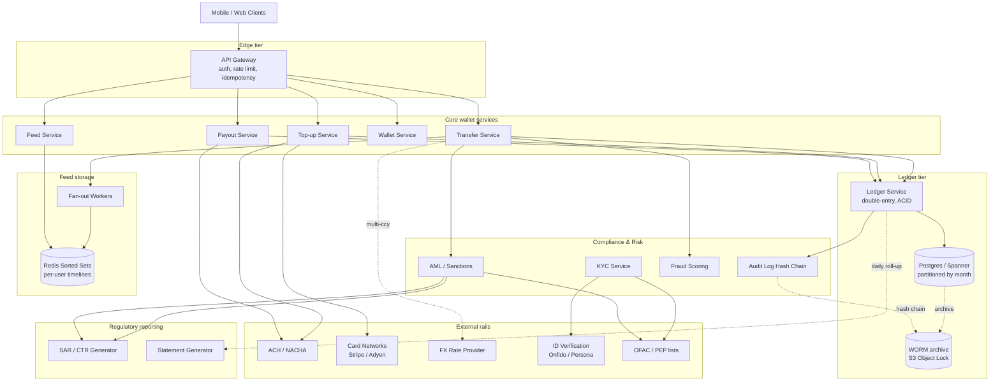
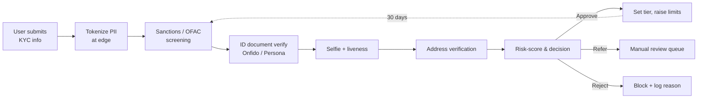

# Design a Digital Wallet — Double-Entry Ledger, P2P Transfers, KYC, and the Social Feed

**Date:** 2026-04-25 | **Updated:** 2026-04-25
**Tags:** `system-design` `case-study` `payments` `fintech` `hard`
**Difficulty:** Hard | **Type:** HLD | **Estimated read:** 35–45 min

## Table of Contents

- [Summary](#summary)
- [1. Functional Requirements](#1-functional-requirements)
- [2. Non-Functional Requirements](#2-non-functional-requirements)
- [3. Capacity Estimation](#3-capacity-estimation)
- [4. API Design](#4-api-design)
  - [Wallet & balance](#wallet--balance)
  - [Transfer & top-up](#transfer--top-up)
  - [Payout (ACH)](#payout-ach)
  - [Social feed](#social-feed)
  - [KYC](#kyc)
- [5. Data Model](#5-data-model)
  - [Account & wallet](#account--wallet)
  - [Ledger (double-entry)](#ledger-double-entry)
  - [Transactions, idempotency, limits](#transactions-idempotency-limits)
  - [Social feed](#social-feed-data)
- [6. High-Level Architecture](#6-high-level-architecture)
- [7. Deep Dives](#7-deep-dives)
  - [7.1 Double-entry ledger model](#71-double-entry-ledger-model)
  - [7.2 P2P transfer atomicity](#72-p2p-transfer-atomicity)
  - [7.3 Top-up via bank and card](#73-top-up-via-bank-and-card)
  - [7.4 KYC / AML pipeline](#74-kyc--aml-pipeline)
  - [7.5 Idempotency and exactly-once semantics](#75-idempotency-and-exactly-once-semantics)
  - [7.6 Fraud detection](#76-fraud-detection)
  - [7.7 Regulatory reporting and audit immutability](#77-regulatory-reporting-and-audit-immutability)
  - [7.8 Social feed scaling](#78-social-feed-scaling)
  - [7.9 Multi-currency and FX](#79-multi-currency-and-fx)
  - [7.10 Payout to bank (ACH)](#710-payout-to-bank-ach)
- [8. Bottlenecks & Trade-offs](#8-bottlenecks--trade-offs)
- [9. Anti-Patterns](#9-anti-patterns)
- [Related](#related)
- [References](#references)

## Summary

A digital wallet looks deceptively like a bank account with a chat-app skin, but the engineering is harder than either. You must **never create or destroy money**, every cent must be traceable to an immutable audit trail, transfers across two accounts must be atomic, top-ups and payouts cross trust boundaries (card networks, ACH), KYC/AML obligations gate every dollar, and Venmo-style products bolt a public social feed onto the most sensitive data a user owns.

This case study designs a Venmo/PayPal-class wallet: a **double-entry ledger** as source of truth, an **idempotent transfer service** wrapping two-account updates in a single ACID transaction, a **KYC/AML pipeline** with sanctions screening, **inline fraud scoring**, an **immutable audit log** sized for FinCEN's 5-year retention, **GDPR-aware PII handling**, **multi-currency** with FX captured in the ledger, and a **fan-out social feed**. The hardest invariant — *Σ(account balances) = Σ(funding inflows) − Σ(outflows)* — is the lens through which every choice gets reviewed.

## 1. Functional Requirements

The wallet must support:

- **Balance.** One wallet per user per supported currency, each with real-time available + separate pending balance for in-flight holds.
- **Top-up.** Pull funds from a linked bank (ACH debit) or card (Visa/Mastercard). Card settles instantly but is reversible for 120 days; ACH takes 1–3 business days to clear.
- **P2P transfer.** User A sends $X to B in the same currency. Atomic: both ledger sides commit or neither. Optional memo + emoji.
- **Payout.** Wallet → linked external bank via ACH (next-day or same-day US, SEPA in EU). Standard free; instant via debit-card rails (Visa Direct) carries a fee.
- **Multi-currency.** USD, EUR, GBP, etc. Cross-currency transfers route through an FX leg with captured spread; both legs hit the ledger.
- **Limits.** Per-transaction, daily, weekly, monthly caps. Tier 1 unverified = low caps; KYC tiers unlock higher.
- **KYC / AML.** ID verification (doc + selfie) and sanctions/PEP screening on signup. Ongoing transaction monitoring fires SARs on threshold trips.
- **Social feed.** Public, friends-only, or private. Public entries show actor, recipient, memo, reactions — never amount. Followers/following graph.
- **Statements.** Per-user history, filtering, monthly PDF/CSV statements.
- **Refunds & reversals.** Sender-initiated cancel pre-settlement; recipient-initiated refund (inverse transfer); chargeback handling.
- **Idempotency.** Every state-changing API takes an `Idempotency-Key`; duplicate keys return the original result.

## 2. Non-Functional Requirements

| NFR | Target | Why |
|-----|--------|-----|
| **Money invariant** | `Σ(account balances) = Σ(funding inflows) − Σ(funding outflows)` at every instant | The defining correctness property; violation = regulatory incident |
| **Transfer atomicity** | Both legs commit or neither (ACID within a region) | No "half-transfers" ever observable |
| **Audit immutability** | Append-only ledger, retained ≥ 5 years (FinCEN BSA), tamper-evident | Required for BSA recordkeeping and dispute defense ([FinCEN BSA recordkeeping][fincen-bsa]) |
| **Latency (P2P transfer)** | p50 < 300 ms, p99 < 1 s | UX expectation set by Venmo/Zelle |
| **Throughput** | 5k transfers/s sustained, 25k/s peak (Black Friday, payday) | Sized below Visa peak (~24k TPS) but realistic for a top-tier wallet |
| **Availability** | 99.99% for read; 99.95% for write (with safe degradation) | Money movement may pause briefly; balance reads must not |
| **Regulatory compliance** | FinCEN/BSA (US), GDPR (EU) PII handling, PCI-DSS for card data, SOC 2, OFAC sanctions screening | Non-negotiable; pre-launch audit gates |
| **Idempotency window** | 24 h minimum, 7 d preferred | Survives long client retries during outages |
| **Fraud decision latency** | < 200 ms inline, async deeper analysis | Must not gate UX, but must run on every transfer |
| **PII security** | At-rest encryption, field-level encryption for SSN/DOB, key rotation, GDPR right-to-erasure honored without breaking ledger | GDPR Art. 17 vs. immutable audit — see §7.7 |
| **No money creation** | Software-enforced double-entry invariants; balances cannot go negative without an explicit overdraft account | The whole design pivots on this |

## 3. Capacity Estimation

**Users.** 80M registered, 30M MAU, 5M DAU; ~50% of DAU complete ≥1 transfer/day.

**Transfers/day.**

```text
5M DAU × 1.5 tx/day ≈ 7.5M/day = 90/s avg
   peak ≈ 5,000/s (payday Friday)
   spike ≈ 25,000/s (mass refund / promo)
```

Each transfer ≥ 2 ledger entries → peak ledger writes ≈ **10k–50k rows/s**.

**Top-ups / payouts.** ACH batched by NACHA windows: ~500k debit + ~300k credit entries/day. Card: ~2M/day.

**Storage.**

```text
Ledger entry: ~250 B (ids, amount, currency, ts, refs, sig)
Daily: 7.5M × 2 + ACH + card ≈ 18M entries/day ≈ 4.5 GB/day
× 365 × 5 yr ≈ 8 TB raw, 12–15 TB indexed
PII vault (KYC docs): ~5 MB/user × 80M ≈ 400 TB (S3 + lifecycle)
```

Hot ledger: Postgres/Spanner partitioned by month. Cold: object storage with WORM retention.

**Social feed.** ~30% of transfers are public. Avg followers = 50 → peak fan-out `0.3 × 25k × 50 = 375k feed inserts/s` (drives §7.8).

**Fraud / KYC.** Every transfer scored (5k/s sustained); KYC runs on signup + threshold-crossing events (~50k full re-verifications/day).

## 4. API Design

All money-moving endpoints require an **`Idempotency-Key`** header (UUID, client-generated, retained 7 days).

### Wallet & balance

```http
GET  /v1/wallets/{wallet_id}
GET  /v1/wallets/{wallet_id}/balance
       → { available: "120.50", pending: "25.00", currency: "USD",
            as_of: "2026-04-25T10:14:22Z" }
GET  /v1/wallets/{wallet_id}/transactions?cursor=...&since=...
```

Balance reads come from a **derived projection** — never `SUM(ledger)` at request time except for reconciliation jobs. The projection updates synchronously inside the same transaction that writes the ledger entries.

### Transfer & top-up

```http
POST /v1/transfers
Idempotency-Key: 7c4f...
{
  "from_wallet_id": "wal_a",
  "to_wallet_id":   "wal_b",
  "amount":         "25.00",
  "currency":       "USD",
  "memo":           "pizza 🍕",
  "visibility":     "friends",            // public | friends | private
  "client_ts":      "2026-04-25T10:14:00Z"
}
→ 201 { "transfer_id": "txn_...", "status": "completed", "ledger_entries": [...] }

POST /v1/top-ups
Idempotency-Key: ...
{
  "wallet_id":         "wal_a",
  "funding_source_id": "src_bank_...",   // or "src_card_..."
  "amount":            "100.00",
  "currency":          "USD"
}
→ 202 { "top_up_id": "...", "status": "pending" }   // ACH
→ 201 { "top_up_id": "...", "status": "completed" } // Card (provisional)
```

Card top-ups return `completed` provisionally (funds usable immediately) but the wallet retains the ability to claw back via a chargeback-handling pathway (see §7.3).

### Payout (ACH)

```http
POST /v1/payouts
Idempotency-Key: ...
{
  "wallet_id":         "wal_a",
  "destination_id":    "dst_bank_...",
  "amount":            "500.00",
  "currency":          "USD",
  "speed":             "standard"   // standard | instant (debit-card rails, fees)
}
→ 202 { "payout_id": "po_...", "status": "submitted",
        "expected_settlement": "2026-04-28" }
```

### Social feed

```http
GET  /v1/feed/home?cursor=...        # following + public from followed users
GET  /v1/feed/public?cursor=...      # global public (Venmo's old default)
GET  /v1/users/{id}/feed             # user's own activity
POST /v1/transfers/{id}/likes
POST /v1/transfers/{id}/comments
PATCH /v1/transfers/{id}/visibility  # change visibility post-hoc
```

Feed responses **never include amount** — only actor, recipient, memo, currency code, and reactions.

### KYC

```http
POST /v1/kyc/submissions
{
  "user_id":   "...",
  "tier":      "tier_2",
  "documents": [{"type":"passport","s3_ref":"..."}, {"type":"selfie",...}],
  "address":   {...},
  "ssn_token": "tok_..."           // tokenized at edge — never raw
}
→ 202 { "submission_id": "...", "status": "in_review" }

GET  /v1/kyc/status/{user_id}
       → { "tier": "tier_2", "status": "verified", "verified_at": "..." }
```

## 5. Data Model

### Account & wallet

```sql
CREATE TABLE users (
  id              UUID PRIMARY KEY,
  email           CITEXT UNIQUE NOT NULL,
  phone           TEXT,
  kyc_tier        SMALLINT NOT NULL DEFAULT 0,
  kyc_status      TEXT NOT NULL,
  pii_vault_ref   TEXT,                    -- pointer; raw PII stored in vault
  created_at      TIMESTAMPTZ NOT NULL,
  status          TEXT NOT NULL            -- active | frozen | closed
);

CREATE TABLE wallets (
  id              UUID PRIMARY KEY,
  user_id         UUID NOT NULL REFERENCES users(id),
  currency        CHAR(3) NOT NULL,        -- ISO 4217
  available_minor BIGINT NOT NULL DEFAULT 0,  -- in minor units (cents)
  pending_minor   BIGINT NOT NULL DEFAULT 0,
  version         BIGINT NOT NULL DEFAULT 0,  -- optimistic lock
  status          TEXT NOT NULL,
  UNIQUE (user_id, currency)
);
```

Money is **always stored as integer minor units** (cents, pence). Floats are banned. Display formatting happens at the edge.

### Ledger (double-entry)

The ledger is the canonical store. All other tables are projections.

```sql
CREATE TABLE ledger_accounts (
  id              UUID PRIMARY KEY,
  type            TEXT NOT NULL,           -- 'user_wallet' | 'omnibus_bank'
                                           -- | 'fee_revenue' | 'fx_spread'
                                           -- | 'pending_ach' | 'chargeback_reserve'
  owner_ref       TEXT,                    -- user wallet id, or system identifier
  currency        CHAR(3) NOT NULL,
  normal_side     CHAR(1) NOT NULL         -- 'D' (asset/expense) or 'C' (liability/revenue)
);

CREATE TABLE ledger_entries (
  id              UUID PRIMARY KEY,
  transaction_id  UUID NOT NULL,           -- groups all legs of a logical operation
  account_id      UUID NOT NULL REFERENCES ledger_accounts(id),
  side            CHAR(1) NOT NULL CHECK (side IN ('D','C')),
  amount_minor    BIGINT NOT NULL CHECK (amount_minor > 0),
  currency        CHAR(3) NOT NULL,
  posted_at       TIMESTAMPTZ NOT NULL DEFAULT now(),
  metadata        JSONB,
  prev_hash       BYTEA,                   -- hash chain for tamper evidence
  entry_hash      BYTEA NOT NULL
);
CREATE INDEX ON ledger_entries (transaction_id);
CREATE INDEX ON ledger_entries (account_id, posted_at DESC);

-- Per-transaction invariant enforced at commit:
-- SUM(amount_minor WHERE side='D') = SUM(amount_minor WHERE side='C')  per currency
```

Ledger rows are **never updated or deleted**. Reversals and corrections are *new* entries that offset the original. The `prev_hash` field chains entries so any tampering is detectable on audit.

### Transactions, idempotency, limits

```sql
CREATE TABLE idempotency_keys (
  key             TEXT PRIMARY KEY,
  user_id         UUID NOT NULL,
  request_hash    BYTEA NOT NULL,          -- hash of request body
  response_body   JSONB,
  status_code     INTEGER,
  created_at      TIMESTAMPTZ NOT NULL,
  expires_at      TIMESTAMPTZ NOT NULL
);

CREATE TABLE transfer_limits (
  user_id         UUID NOT NULL,
  window          TEXT NOT NULL,           -- 'per_tx' | 'daily' | 'weekly' | 'monthly'
  cap_minor       BIGINT NOT NULL,
  PRIMARY KEY (user_id, window)
);

CREATE TABLE transfer_usage (
  user_id         UUID NOT NULL,
  window          TEXT NOT NULL,
  bucket_start    DATE NOT NULL,
  used_minor      BIGINT NOT NULL,
  PRIMARY KEY (user_id, window, bucket_start)
);
```

### Social feed data

```sql
CREATE TABLE transfer_posts (
  transfer_id     UUID PRIMARY KEY REFERENCES transfers(id),
  actor_id        UUID NOT NULL,
  recipient_id    UUID NOT NULL,
  memo            TEXT,
  visibility      TEXT NOT NULL,           -- public | friends | private
  created_at      TIMESTAMPTZ NOT NULL
);

CREATE TABLE follows (
  follower_id     UUID NOT NULL,
  followee_id     UUID NOT NULL,
  PRIMARY KEY (follower_id, followee_id)
);

CREATE TABLE likes (
  transfer_id     UUID NOT NULL,
  user_id         UUID NOT NULL,
  created_at      TIMESTAMPTZ NOT NULL,
  PRIMARY KEY (transfer_id, user_id)
);
```

Feed timeline materialization lives in Redis sorted sets (`feed:{user_id}` → `(score=ts, member=transfer_id)`), bounded to ~1k entries/user.

## 6. High-Level Architecture



**Transfer flow (happy path):**

1. Client `POST /v1/transfers` with `Idempotency-Key`.
2. Gateway authenticates, checks rate limit, looks up idempotency key — returns cached response on hit.
3. Transfer Service: load sender wallet, check status (active, KYC tier covers amount), check limits.
4. Inline fraud score (~50–150 ms). High-risk → step-up auth or block.
5. Begin DB transaction → Ledger Service writes 2 entries (debit sender wallet, credit recipient wallet) → updates `wallets.available_minor` projection → records idempotency response → commit.
6. Asynchronously: emit `TransferCompleted` event to Kafka → fan-out to feed workers, AML monitor, notification service.
7. Return 201 with transfer record.

## 7. Deep Dives

### 7.1 Double-entry ledger model

Double-entry is non-negotiable. The principle (codified in TigerBeetle, Stripe's internal ledger, and centuries of accounting): **every transaction has at least one debit and one credit, summing to zero per currency**. This makes "money was created" a DB constraint, not a hope.

```text
P2P transfer of $25 Alice → Bob (USD):
  DEBIT  alice_wallet  $25
  CREDIT bob_wallet    $25
  Net: 0   (invariant holds)
```

Every system actor is an account, including non-user entities:

| Account | Purpose |
|---------|---------|
| `user_wallet:{id}` | Per user wallet per currency |
| `omnibus_bank:{partner}` | Pooled bank account holding customer funds |
| `pending_ach` | Funds in flight from a user's bank, not yet cleared |
| `fee_revenue` | Fee income (instant payout, FX spread) |
| `fx_spread` | Spread on cross-currency transfers |
| `chargeback_reserve` | Held against potential card chargebacks |
| `loss` | Unrecoverable losses |

A card top-up of $100 with $0.30 fee:

```text
DEBIT  card_processor_receivable   $100.00
CREDIT user_wallet                 $99.70
CREDIT fee_revenue                 $0.30
```

The wallet schema's `available_minor` is a **projection** for speed; it must always equal `SUM(credits) − SUM(debits)` for that account when reconciled. Nightly recon; any drift = P0. See [Stripe Engineering on ledger design][stripe-ledger] and TigerBeetle's [Two-Phase Transfers][tb-twophase].

### 7.2 P2P transfer atomicity

The hard part: write two ledger rows + update two wallet projections, all atomically, even when sender and recipient hit different shards.

**Single-region, single-DB (the easy case):**

```sql
BEGIN;
  -- Lock both wallets in deterministic id order to avoid deadlock
  SELECT id, available_minor, version
    FROM wallets WHERE id IN ($from, $to)
    FOR UPDATE ORDER BY id;

  -- Validate balance + limits, else ROLLBACK

  INSERT INTO ledger_entries (...)
    VALUES ($txn, $from_acct, 'D', $amount, ...),
           ($txn, $to_acct,   'C', $amount, ...);

  UPDATE wallets SET available_minor = available_minor - $amount,
                     version = version + 1
    WHERE id = $from AND version = $sender_v;
  UPDATE wallets SET available_minor = available_minor + $amount,
                     version = version + 1
    WHERE id = $to   AND version = $recipient_v;

  INSERT INTO idempotency_keys (...) VALUES (...);
COMMIT;
```

Always lock in deterministic ID order (`LEAST(from,to)` first) to prevent deadlock when two users send to each other simultaneously.

**Cross-shard / cross-region:** different shards mean no local ACID transaction. Two patterns:

- **Saga with coordinator.** The Transfer Service: (1) reserve on sender shard (debit + "pending out"), (2) credit recipient, (3) confirm both. Step 2 failure triggers compensation. See [`../../data-consistency/distributed-transactions.md`](../../data-consistency/distributed-transactions.md).
- **TC/C two-phase reservations.** TigerBeetle's two-phase transfers natively model this: `pending` reserves balance, `post_pending` finalizes, `void_pending` cancels — cluster guarantees atomicity via consensus.

**Recommended:** route both wallets to the same shard via `hash(LEAST(sender_id, recipient_id))`, making ~95% of P2P single-shard. The rest run as sagas. For the broader theory, see [`../../data-consistency/acid-vs-base.md`](../../data-consistency/acid-vs-base.md).

### 7.3 Top-up via bank and card

Top-ups cross a trust boundary: outside money enters the omnibus account.

**Card top-up (PSP = Stripe/Adyen):** client → wallet → PSP `PaymentIntent` (Stripe `Idempotency-Key` propagated) → on `succeeded` the wallet posts:

```text
DEBIT  card_processor_receivable   $100.00
CREDIT user_wallet                 $99.70
CREDIT fee_revenue                 $0.30
```

Funds appear immediately. The entry is **provisional** for ~120 days (chargeback window). A `chargeback_reserve` (1–2% of card top-ups, sized by historical loss) absorbs disputes without clawing user balance.

**ACH top-up:** Plaid-linked account → ACH debit submitted in next NACHA window (same-day cutoffs 10:30 AM / 2:45 PM / 4:45 PM ET — [Nacha SDA][nacha-sda]) → pending entry:

```text
DEBIT  pending_ach           $500.00
CREDIT user_wallet:pending   $500.00   -- shown as 'pending' in UI
```

On settlement (T+1 to T+3): move pending → available and `omnibus_bank` debit. On return (NSF, bad routing, unauthorized — up to 60 days for unauthorized): offsetting entries. ACH NSF ~1.5% industry-wide; new users wait for clearing, trusted users get instant access against wallet float (fraud-gated).

### 7.4 KYC / AML pipeline

BSA + FinCEN's CIP require **name, DOB, address, government ID number** before opening an account; ongoing monitoring; and SARs on suspicious activity. Tiered KYC is standard:

| Tier | Verification | Limits |
|------|-------------|--------|
| **Tier 0** | Email + phone | $300/week receive only, no send |
| **Tier 1** | Name + DOB + last 4 SSN + address | $1,000/week, $5,000/month |
| **Tier 2** | Full SSN + ID document + selfie | $10,000/week, $50,000/month |
| **Tier 3** | Source of funds, enhanced due diligence | Custom |

**Pipeline:**



PII never touches the transactional DB. SSN and DOB are tokenized at the edge — the wallet stores a token; raw values live in a PII vault (HashiCorp Vault transit, or Skyflow). Field-level keys rotate annually.

**Sanctions screening** matches against OFAC SDN, EU consolidated list, UN list, and PEP databases. Fuzzy matching (Levenshtein on name + DOB + country) plus manual adjudication for ambiguous hits ([OFAC SDN List][ofac-sdn]).

**Ongoing monitoring** runs on every transfer: velocity (> N tx in T), round-dollar (structuring signal), pattern-change, counterparty risk, cash-equivalent layering (top-up → immediate payout to a different bank). Threshold trips file a SAR with FinCEN within 30 days (60 if no suspect identified) ([FinCEN SAR filing][fincen-sar]). CTRs fire on cash-equivalent activity > $10k/day per customer.

### 7.5 Idempotency and exactly-once semantics

Networks lose responses; clients retry. Without explicit idempotency, a retry creates a duplicate transfer.

Contract:

- Every state-changing endpoint takes an `Idempotency-Key` header (UUID).
- Server stores `(user_id, key) → (request_hash, response_body, status_code)`.
- Retention: 24 h min, 7 days recommended.
- On hit, matching `request_hash` → cached response; different hash → `409 Conflict`.

```python
def handle_transfer(req, idem_key, user_id):
    cached = idem_store.get(user_id, idem_key)
    if cached:
        if cached.request_hash != hash(req.body):
            return 409  # same key, different body
        return cached.status_code, cached.response_body

    with db.transaction():
        result = execute_transfer(req)
        idem_store.put(user_id, idem_key,
                       request_hash=hash(req.body),
                       response_body=result,
                       status_code=201,
                       expires_at=now() + 7d)
    return 201, result
```

The idempotency record **must commit in the same transaction as the ledger entries**. A crash between ledger commit and idempotency write yields a double charge on retry.

Queue side: exactly-once via **outbox + at-least-once delivery + idempotent consumers**. Transfer transaction inserts an `outbox` row alongside ledger entries (same DB, same commit); relay worker tails the outbox and publishes to Kafka keyed by transfer ID; consumers (fraud monitor, feed fan-out, notification) dedupe on transfer ID. See [Stripe's idempotency guide][stripe-idem] and [`../../data-consistency/distributed-transactions.md`](../../data-consistency/distributed-transactions.md).

### 7.6 Fraud detection

Fraud runs on every transfer in two passes:

**Inline (synchronous, < 200 ms budget).** Lightweight rules + a gradient-boosted model fed by ~50 features: device fingerprint risk, velocity (1m/1h/24h), geo-velocity (IP vs. last login), recipient newness, amount anomaly vs. baseline, account age, KYC tier, counterparty risk score. Outputs a score 0–1000:

| Score | Action |
|-------|--------|
| 0–600 | Allow |
| 601–800 | Step-up auth (3D-Secure for cards, biometric re-prompt) |
| 801–950 | Hold for manual review |
| 951–1000 | Block, alert SOC, suspend account |

**Asynchronous (seconds to minutes).** Streaming jobs (Flink / Kafka Streams) run graph features: money-mule detection (rapid pass-through), account takeover (behavior diff vs. baseline), synthetic identity (clusters with shared device/IP/recipient overlap). Flagged accounts hit a review queue; confirmed fraud triggers automated reversal where possible. Feature stores (Feast, Tecton) and online/offline parity matter as much as the model.

### 7.7 Regulatory reporting and audit immutability

Three constraints pull in opposite directions:

1. **FinCEN BSA recordkeeping** — 5 years, reproducible and tamper-evident ([FinCEN BSA][fincen-bsa]).
2. **GDPR Article 17** — EU users can demand erasure of personal data.
3. **Ledger is immutable** — cannot delete ledger rows.

Reconciliation:

- **PII is segregated.** Ledger stores IDs and tokens, never raw PII; the PII vault is separate, keyed by user ID.
- **Erasure deletes PII, not ledger rows.** GDPR requests overwrite vault entries with `deleted_per_gdpr_yyyy_mm_dd`. Ledger keeps user ID + amounts — anonymized but auditable.
- **WORM archive.** Daily ledger snapshots → S3 Object Lock (compliance mode), 5 years + 1 day. No one — including root — can delete during retention.
- **Hash chain.** `entry_hash = H(fields || prev_hash)`; daily Merkle root published to append-only audit log. Tampering is mathematically detectable.

**SAR / CTR generation.** Nightly job materializes regulator-formatted reports from ledger + AML signals, queued for compliance review before FinCEN BSA E-Filing submission. **Statements:** monthly PDFs generated from ledger entries, signed, retained 7 years. See [`../../data-consistency/acid-vs-base.md`](../../data-consistency/acid-vs-base.md) for the consistency theory.

### 7.8 Social feed scaling

Venmo's distinguishing (and most-criticized) feature is the public payment feed. Goal: fan out hundreds of thousands of feed inserts per second without coupling to the money path.

**Decoupled.** Feed is downstream of the ledger. Transfer commits first; outbox event drives the feed. Feed delay/outage doesn't block transfers.

**Hybrid push/pull:**

- **Push** for average users: public-transfer commit → fan-out workers insert into each follower's Redis sorted set `feed:{follower_id}`, bounded to ~1k entries with trim.
- **Pull** for celebrities (> 10k followers): no fan-out on write. Followers' home feed computed on read — merge recent transfers from heavy-tail followees with pre-pushed entries from light-tail.

Same pattern as Twitter/Mastodon timelines.

**Visibility filtering on read.** Followers can lose access (unfollow, account went private); always re-check visibility at read, not at fan-out time.

**Privacy default.** Venmo defaulted public for years and got dragged for it. Modern wallets default to **private** with explicit opt-in, and never include amounts in feed entries.

### 7.9 Multi-currency and FX

One wallet per currency per user. Cross-currency transfers are **two ledger transactions linked by a parent**:

```text
Alice USD → Bob EUR, $100, mid 0.9154, customer 0.9108 (50bps spread):

Leg 1 (USD):
  DEBIT  alice_usd_wallet   $100.00
  CREDIT fx_pool_usd        $100.00

Leg 2 (EUR):
  DEBIT  fx_pool_eur        €91.54
  CREDIT bob_eur_wallet     €91.08
  CREDIT fx_spread_eur      €0.46
```

Per-currency `fx_pool` accounts absorb intraday swings; net positions hedged externally via an FX prime broker on a periodic basis. No customer transfer depends on a synchronous external FX call.

Live rates from a provider (OANDA / internal market-data) cached at 30-second granularity. Customer-quoted rates lock for ~30 s after presentation; the wallet captures the rate at quote time.

### 7.10 Payout to bank (ACH)

Standard payout = ACH credit to a verified external bank.

Flow: validate destination (Plaid instant-link or micro-deposits) → KYC + limits check → fraud check (payout fraud = post-takeover monetization, separate model) → hold entry `DEBIT user_wallet, CREDIT pending_payout` → ACH file submitted in next NACHA window (Same-Day ACH if `same_day` and < $1M cap; else next-day) → on settlement, `DEBIT pending_payout, CREDIT omnibus_bank`. Returns (invalid routing, closed account) reverse with offsetting entries.

**Instant payout** uses Visa Direct / Mastercard Send. Settlement in seconds, ~1.5% fee captured in `fee_revenue`. Rails failure → fall back to standard ACH and refund the instant fee. Same-day ACH caps at $1M/transaction with 3 settlement windows/day; standard ACH settles next-day with no per-tx cap ([Nacha SDA][nacha-sda]).

## 8. Bottlenecks & Trade-offs

| Concern | Bottleneck | Trade-off |
|---------|-----------|-----------|
| **Ledger write throughput** | Single-leader Postgres on the transfer hot path | Shard ledger by `LEAST(sender, recipient)` hash; co-locate both legs ~95% of time; saga for the remainder |
| **Cross-shard transfers** | Distributed transaction cost | Saga + compensation rather than 2PC; explicit `pending` state visible to user |
| **Fraud latency** | 200 ms inline budget vs. richer features | Two-pass: lightweight inline + asynchronous deeper analysis with retroactive holds |
| **KYC throughput** | ID-verification provider rate limits | Multi-vendor (Onfido + Persona) with circuit breaker; queue overflow during signup spikes |
| **Feed fan-out at peak** | 375k/s feed inserts during spike | Hybrid push/pull; cap fan-out for accounts > 10k followers |
| **GDPR vs. immutability** | Article 17 demands deletion; BSA demands 5-year retention | Tokenize PII, segregate vault from ledger, anonymize ledger rows on erasure |
| **Reversibility of card top-ups** | 120-day chargeback window | Maintain `chargeback_reserve` sized by historical loss rate; never let users payout faster than risk-adjusted clearing |
| **Multi-currency liquidity** | FX pool can drift out of balance | Hedge nightly via external FX broker; the spread captured covers hedging cost + margin |
| **ACH window batching** | Same-day cutoffs introduce 2–6 h latency before payouts settle | Communicate "expected by" dates; offer instant payout as paid alternative |
| **Storage cost** | 5 years × 18M entries/day at 250 B + WORM archive | Tier hot (3 months in Postgres) vs. warm (Parquet on S3) vs. cold (Glacier with Object Lock) |
| **Reconciliation drift** | Wallet projection vs. ledger sum | Nightly reconciliation job; any drift = P0; design projections to be deterministically rebuildable from ledger |
| **Regulatory blast radius** | One bug = SAR storm or frozen accounts | Shadow-mode every change; staged rollout by KYC tier; compliance pre-review for ledger schema changes |

A useful framing: the wallet's hard NFR is not throughput or latency — it's that every dollar can be traced and the books always balance. Throughput is sized to peak; correctness is non-negotiable.

## 9. Anti-Patterns

- **Storing money as floats or doubles.** `0.1 + 0.2 != 0.3`. Always integer minor units.
- **Single-entry accounting.** "Update sender, then update recipient." Second write fails → money destroyed. Always two ledger entries summing to zero per currency.
- **Mutating ledger rows.** Reversal as `UPDATE` instead of an offsetting insert breaks audit, recon, and regulatory reporting.
- **No idempotency on transfer endpoints.** Network retry → duplicate transfer. Idempotency is a contract, not polish.
- **PII inside the ledger.** Blocks GDPR erasure without deleting financial records. Tokenize at the edge.
- **Computing `available_balance = SUM(ledger)` on every read.** Doesn't fit in a request budget at scale. Maintain a projection inside the same transaction.
- **Sync calls to ACH/card on the user request path with no timeout/queue strategy.** External rails fail; UX must not.
- **Treating fraud as batch.** By the time nightly flags a transfer, the recipient has already paid out. Inline scoring is non-optional.
- **Public-by-default social feed.** Venmo learned this the hard way.
- **Skipping shadow mode for new fraud / limit rules.** Always log-only first.
- **One Postgres for everything.** Ledger, KYC, audit, feed share one DB → one bad query takes down the wallet. Segregate failure domains.
- **Trusting the client clock.** Server-side timestamps only.
- **Storing card PANs.** PCI-DSS scope creep is a one-way door. Tokenize via the PSP.
- **Letting reconciliation drift silently.** Nightly recon must page humans within minutes of any non-zero drift.

## Related

- [`../../data-consistency/distributed-transactions.md`](../../data-consistency/distributed-transactions.md) — saga pattern, 2PC, outbox, the consistency primitives behind cross-shard transfer atomicity.
- [`../../data-consistency/acid-vs-base.md`](../../data-consistency/acid-vs-base.md) — why the ledger demands ACID and what BASE costs you in fintech.
- [`./design-payment-system.md`](./design-payment-system.md) — sibling case study covering merchant payments, PSP integration, and card authorization that the wallet's top-up flow builds on.

## References

- [FinCEN — Bank Secrecy Act recordkeeping requirements][fincen-bsa]
- [FinCEN — Suspicious Activity Reports (SARs)][fincen-sar]
- [OFAC — Specially Designated Nationals (SDN) List][ofac-sdn]
- [Nacha — Same Day ACH facts and rules][nacha-sda]
- [Stripe — Designing robust and predictable APIs with idempotency][stripe-idem]
- [Stripe Engineering — Online migrations at scale (ledger considerations)][stripe-ledger]
- [TigerBeetle — Two-Phase Transfers documentation][tb-twophase]
- [GDPR — Article 17, Right to erasure ('right to be forgotten')][gdpr-17]
- [PCI Security Standards Council — PCI-DSS v4.0][pci-dss]

[fincen-bsa]: https://www.fincen.gov/resources/statutes-regulations/bank-secrecy-act
[fincen-sar]: https://www.fincen.gov/resources/filing-information
[ofac-sdn]: https://ofac.treasury.gov/specially-designated-nationals-and-blocked-persons-list-sdn-human-readable-lists
[nacha-sda]: https://www.nacha.org/content/same-day-ach-resource-center
[stripe-idem]: https://stripe.com/blog/idempotency
[stripe-ledger]: https://stripe.com/blog/online-migrations
[tb-twophase]: https://docs.tigerbeetle.com/coding/two-phase-transfers/
[gdpr-17]: https://gdpr-info.eu/art-17-gdpr/
[pci-dss]: https://www.pcisecuritystandards.org/document_library/
