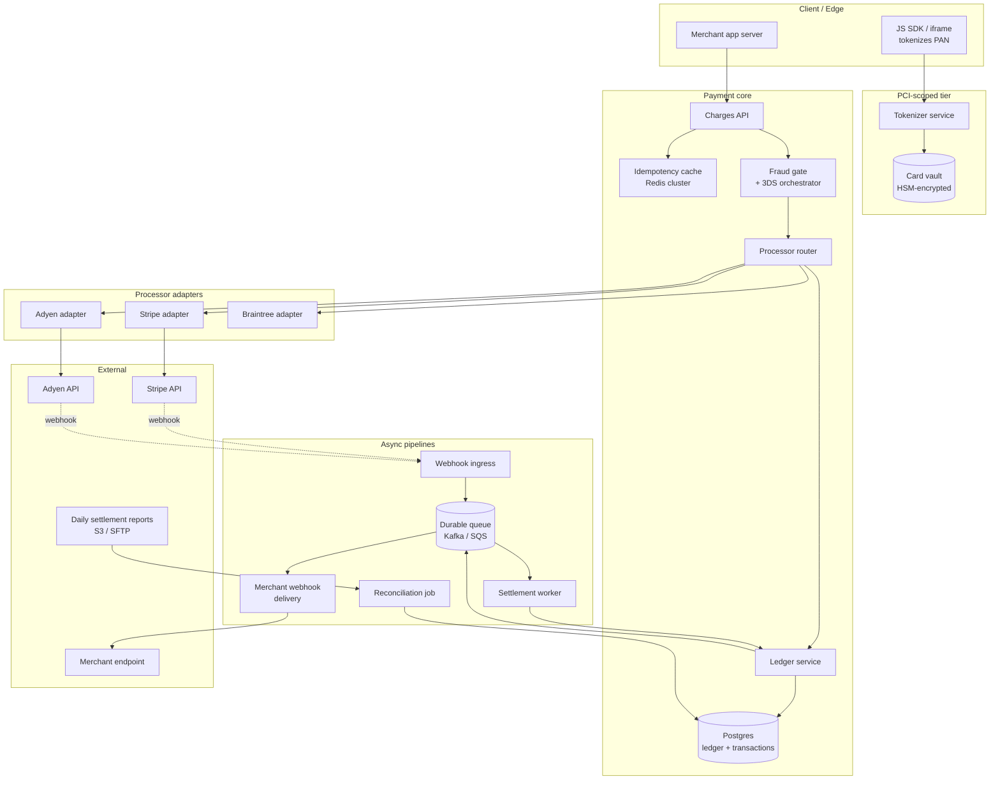

# Design a Payment System — Idempotency, Double-Entry Ledgers, and Reconciliation

**Date:** 2026-04-25 | **Updated:** 2026-04-25
**Tags:** `system-design` `case-study` `payments` `medium`
**LLD Twin:** [Payment Gateway (LLD) — Intent State Machine, Processor Adapters](../../../low-level-design/case-studies/financial/design-payment-gateway.md) — class-level OOD with entities, relationships, and patterns.

**Difficulty:** Medium | **Type:** HLD | **Estimated read:** 30–35 min

## Table of Contents

- [Summary](#summary)
- [1. Functional Requirements](#1-functional-requirements)
- [2. Non-Functional Requirements](#2-non-functional-requirements)
- [3. Capacity Estimation](#3-capacity-estimation)
- [4. API Design](#4-api-design)
  - [Charges](#charges)
  - [Refunds](#refunds)
  - [Webhooks](#webhooks)
- [5. Data Model](#5-data-model)
  - [Idempotency keys](#idempotency-keys)
  - [Transactions](#transactions)
  - [Ledger entries](#ledger-entries)
- [6. High-Level Design](#6-high-level-design)
- [7. Deep Dives](#7-deep-dives)
  - [7.1 Idempotency keys](#71-idempotency-keys)
  - [7.2 Double-entry ledger](#72-double-entry-ledger)
  - [7.3 Processor adapter pattern](#73-processor-adapter-pattern)
  - [7.4 Reconciliation against processor reports](#74-reconciliation-against-processor-reports)
  - [7.5 Fraud gates and 3DS](#75-fraud-gates-and-3ds)
  - [7.6 Webhook idempotency and ordering](#76-webhook-idempotency-and-ordering)
  - [7.7 Async settlement and currency conversion](#77-async-settlement-and-currency-conversion)
  - [7.8 PCI scope and tokenization](#78-pci-scope-and-tokenization)
- [8. Bottlenecks & Trade-offs](#8-bottlenecks--trade-offs)
- [9. Anti-Patterns](#9-anti-patterns)
- [Related](#related)
- [References](#references)

## Summary

A payment system answers a question every retry, network blip, and ambiguous webhook conspires to make hard: **did this money move, and did it move exactly once?** Every other concern — latency, throughput, beautiful APIs — is subordinate to that one. This case study designs a payment system in the shape of Stripe / Adyen / Braintree's public architectures: a thin merchant-facing API that takes idempotency keys, a double-entry ledger that is the unconditional source of truth for money, a processor adapter layer that abstracts Visa/Mastercard rails, an async settlement pipeline, and a reconciliation job that proves nightly that what we think happened actually happened on the card networks.

The design covers idempotency (client-supplied key, server-side dedup window with stored response), the double-entry invariant (every transaction = equal-and-opposite debit + credit, immutable journal), the processor adapter pattern (one common interface, per-PSP retry/backoff and webhook handlers), reconciliation against processor settlement reports (matching, breaks, write-offs), fraud gates with 3D Secure step-up, webhook idempotency, currency conversion, and PCI scope minimization via tokenization.

## 1. Functional Requirements

The system must support:

- **Create a charge.** Authorize and capture a card payment (one-step `auth+capture` or two-step `auth` then `capture` later). Always accept a client-supplied idempotency key.
- **Refund a charge.** Full or partial refund of a captured charge. Idempotent.
- **Process webhooks.** Receive asynchronous notifications from processors for `charge.succeeded`, `charge.failed`, `charge.refunded`, `dispute.opened`, `payout.paid`. Idempotent and order-tolerant.
- **Multi-processor routing.** Route a charge to one of several processors (Stripe, Adyen, Braintree, regional acquirers) based on currency, card BIN, country, and cost. Failover to a backup processor on hard failure.
- **Multi-currency.** Accept payments in any ISO 4217 currency; settle to merchant's payout currency with explicit FX recorded as a separate ledger event.
- **Strong fraud gates.** Pre-authorization rule engine, optional 3D Secure (3DS2) step-up, post-authorization adjudication (challenge / review / deny).
- **Settlement and payout.** Aggregate captured funds, compute fees, post to the merchant's balance, schedule payouts on a configured cadence.
- **Disputes and chargebacks.** Record disputes received via webhook, freeze the disputed amount, allow evidence submission, post the resolution to the ledger.
- **Audit trail.** Every state change and every ledger movement is append-only. Investigators can replay history for any charge.
- **Reporting.** Per-merchant balance, per-day revenue, per-currency exposure, reconciliation status.

## 2. Non-Functional Requirements

| NFR | Target | Why |
|-----|--------|-----|
| **Correctness** | Money never created or destroyed; every transaction balances to zero | Non-negotiable. Failure here is fraud or a regulator action. |
| **Exactly-once accounting** | A retry never creates a duplicate ledger entry | Customers and merchants both notice double-charges instantly. |
| **Audit trail** | Every state change is immutable, timestamped, attributable | Required for SOX / PCI / SOC2 / dispute defense. |
| Authorization latency | p99 < 2 s end-to-end (most spent at the processor) | Checkout abandonment scales with latency. |
| Availability | 99.99% for the charge API, 99.999% for ledger reads | Outages translate directly to lost revenue. |
| Throughput | 5 000 charges/s peak (Black Friday tier) | Drives processor adapter and ledger sizing. |
| Reconciliation lag | Daily processor report processed within 4 hours of receipt | Breaks must be investigated same-day. |
| Webhook processing | At-least-once with idempotent handlers; lag p99 < 30 s | Late webhooks must not drop or duplicate state. |
| PCI scope | Cardholder data never crosses our app servers in the clear | Reduces audit surface from "everything" to "tokenizer + iframe". |
| Encryption | TLS 1.2+ in transit, AES-256 at rest with KMS-managed keys | PCI DSS requirement (see [`../../security/encryption-at-rest-in-transit.md`](../../security/encryption-at-rest-in-transit.md)). |

The **CAP-style choice** is unambiguous: when correctness conflicts with availability, **correctness wins**. We would rather return 503 to a checkout than risk a duplicate charge.

## 3. Capacity Estimation

**Traffic.** A mid-tier processor at peak: **5 000 charges/s**, **20 000 charges/s** for Black Friday spikes, **300M charges/year**. Assume 1.5x that in webhook deliveries (auth + capture + dispute + refund all fire webhooks for the same charge).

**Ledger entries.** Each charge produces **3–6 ledger entries** (charge debit + credit, fee debit + credit, optionally FX adjustment debit + credit). At 300M charges/year ≈ **1.5–2B ledger rows/year**, ~5 KB each → **~10 TB/year** ledger growth.

**Idempotency keys.** Hot dedup window of 24 hours; assume 5x overprovisioning for retries → **~2B keys/day stored in Redis** with a 24h TTL. With 200 B per entry that's ~400 GB hot keyspace — sized as a sharded Redis Cluster with 8–16 primaries.

**Webhooks in / out.** Inbound from processors: ~10 000/s peak. Outbound to merchants: ~15 000/s peak (one charge can fire several merchant-facing events). Both need durable queues with retry budgets of hours, not seconds.

**Reconciliation batch.** Each processor delivers a daily settlement file: ~5M rows for a mid-sized processor, ~50M for a major one. Match against our ledger over ~30 minutes using parallel partitioning on `(processor_charge_id, settlement_date)`.

**Bandwidth.** Each charge ≈ 4 KB request, 8 KB response, 3 webhook deliveries × 2 KB. At 5k/s ≈ **~100 MB/s** API + webhook traffic. PCI iframe assets on the CDN dwarf this; size it accordingly.

## 4. API Design

REST + JSON for the merchant-facing surface; gRPC internally between the API tier and the ledger / processor-adapter services.

### Charges

```http
POST /v1/charges
Idempotency-Key: 9b2f8c3d-7e4a-4f6e-9c1d-8a3b2c4d5e6f
Authorization: Bearer sk_live_...
Content-Type: application/json

{
  "amount": 12999,                    // minor units (cents)
  "currency": "USD",
  "source": "tok_visa_4242_xxxxxxxx", // tokenized PAN, never raw card
  "capture": true,
  "customer": "cus_42",
  "description": "Order #1029",
  "metadata": { "order_id": "ord_1029" },
  "fraud_signals": {
    "ip": "203.0.113.42",
    "device_fingerprint": "df_…",
    "billing_address_hash": "…"
  }
}

→ 200 OK
{
  "id": "ch_1KqXv2",
  "status": "succeeded",       // succeeded | requires_action | failed
  "amount": 12999,
  "amount_captured": 12999,
  "currency": "USD",
  "processor": "stripe",
  "processor_charge_id": "py_3O…",
  "fee": 407,
  "net": 12592,
  "ledger_transaction_id": "ltx_8c2…"
}
```

Three behaviors merit calling out:

1. **`Idempotency-Key` is mandatory** for any state-changing request. Stripe's docs are explicit: idempotency keys "allow you to retry requests safely without accidentally performing the same operation twice" ([Stripe — Idempotent requests][stripe-idem]).
2. **`requires_action`** on the response means 3DS step-up — the client receives a `next_action` payload and redirects the user to the card issuer's authentication page.
3. **No raw card numbers ever appear** in this request. The `source` field is a token created by a JS SDK against the tokenizer service, which is the only PCI-scoped component (see §7.8).

### Refunds

```http
POST /v1/refunds
Idempotency-Key: rfd-9e8c-…

{
  "charge": "ch_1KqXv2",
  "amount": 5000,                    // optional; default = remaining capturable
  "reason": "requested_by_customer"
}

→ 200 OK
{
  "id": "rf_8d2…",
  "charge": "ch_1KqXv2",
  "amount": 5000,
  "status": "succeeded",
  "ledger_transaction_id": "ltx_9a1…"
}
```

A refund is a separate transaction, not a mutation of the original charge. The original charge's row is **never** modified — that's the immutable-journal rule of double-entry (§7.2).

### Webhooks

Two webhook surfaces:

**Inbound (we receive from processors):**

```http
POST /v1/webhooks/stripe
Stripe-Signature: t=1714000000,v1=…
Content-Type: application/json

{
  "id": "evt_3O…",
  "type": "charge.succeeded",
  "created": 1714000000,
  "data": { "object": { "id": "py_3O…", "amount": 12999, "status": "succeeded" } }
}

→ 200 OK   (any non-2xx triggers processor retries, sometimes for days)
```

**Outbound (we deliver to merchants):**

```http
POST https://merchant.example.com/webhook
Webhook-Id: msg_2cV3…
Webhook-Timestamp: 1714000000
Webhook-Signature: v1,k1l9b…

{
  "id": "evt_pm_3F…",
  "type": "charge.succeeded",
  "data": { "id": "ch_1KqXv2", "amount": 12999, "status": "succeeded" }
}
```

Both directions enforce **HMAC signature verification** ([Stripe — webhook signatures][stripe-sig]; [Standard Webhooks][std-webhooks]) and **replay protection** via the timestamp window. Webhook idempotency is covered in §7.6.

## 5. Data Model

Four core stores: idempotency cache (Redis), transactions (Postgres), ledger (Postgres with append-only constraints), and processor records (Postgres).

### Idempotency keys

Live for 24 hours. Stored in Redis; key durably persisted to Postgres asynchronously for audit.

```text
idempo:{merchant_id}:{key}
  → JSON {
      status:     "in_flight" | "completed",
      request_fingerprint: sha256(method + path + canonical_body),
      response_status:     200,
      response_body:       "...",
      created_at:          1714000000
    }
  TTL: 86400 s
```

**Schema in Postgres** (durable copy):

```sql
CREATE TABLE idempotency_keys (
  merchant_id           UUID NOT NULL,
  key                   TEXT NOT NULL,
  request_fingerprint   BYTEA NOT NULL,         -- sha256
  status                TEXT NOT NULL,          -- in_flight | completed
  response_status       INTEGER,
  response_body         JSONB,
  created_at            TIMESTAMPTZ NOT NULL DEFAULT now(),
  completed_at          TIMESTAMPTZ,
  expires_at            TIMESTAMPTZ NOT NULL,
  PRIMARY KEY (merchant_id, key)
);
CREATE INDEX ON idempotency_keys (expires_at) WHERE status = 'completed';
```

### Transactions

The merchant-facing aggregate. One row per charge, one row per refund, one row per dispute.

```sql
CREATE TABLE transactions (
  id                    UUID PRIMARY KEY,
  merchant_id           UUID NOT NULL,
  type                  TEXT NOT NULL,          -- charge | refund | dispute | payout
  status                TEXT NOT NULL,          -- pending | succeeded | failed | reversed
  amount_minor          BIGINT NOT NULL,        -- always positive; sign lives in the ledger
  currency              CHAR(3) NOT NULL,
  customer_id           UUID,
  source_token          TEXT,
  processor             TEXT NOT NULL,          -- stripe | adyen | braintree | …
  processor_id          TEXT,                   -- e.g. py_3O… on Stripe
  failure_code          TEXT,
  failure_reason        TEXT,
  parent_transaction_id UUID REFERENCES transactions(id),  -- refunds point to the charge
  ledger_transaction_id UUID NOT NULL,
  metadata              JSONB,
  created_at            TIMESTAMPTZ NOT NULL DEFAULT now(),
  updated_at            TIMESTAMPTZ NOT NULL DEFAULT now()
);
CREATE INDEX ON transactions (merchant_id, created_at DESC);
CREATE UNIQUE INDEX ON transactions (processor, processor_id);
```

### Ledger entries

The source of truth for money. Append-only. Every monetary movement appears as a **balanced pair** of entries that sum to zero.

```sql
CREATE TABLE ledger_transactions (
  id            UUID PRIMARY KEY,
  description   TEXT NOT NULL,
  posted_at     TIMESTAMPTZ NOT NULL DEFAULT now(),
  metadata      JSONB
);

CREATE TABLE ledger_entries (
  id                     BIGSERIAL PRIMARY KEY,
  ledger_transaction_id  UUID NOT NULL REFERENCES ledger_transactions(id),
  account_id             UUID NOT NULL,
  direction              CHAR(1) NOT NULL CHECK (direction IN ('D','C')),  -- debit / credit
  amount_minor           BIGINT NOT NULL CHECK (amount_minor > 0),
  currency               CHAR(3) NOT NULL,
  posted_at              TIMESTAMPTZ NOT NULL DEFAULT now()
);

-- Append-only enforcement
CREATE RULE ledger_entries_no_update AS ON UPDATE TO ledger_entries DO INSTEAD NOTHING;
CREATE RULE ledger_entries_no_delete AS ON DELETE TO ledger_entries DO INSTEAD NOTHING;

-- Hard balancing invariant: every transaction sums to zero per currency
CREATE OR REPLACE FUNCTION assert_balanced() RETURNS trigger AS $$
DECLARE
  delta BIGINT;
BEGIN
  SELECT SUM(CASE direction WHEN 'D' THEN -amount_minor ELSE amount_minor END)
    INTO delta
    FROM ledger_entries
   WHERE ledger_transaction_id = NEW.ledger_transaction_id
     AND currency = NEW.currency;
  IF delta <> 0 THEN
    RAISE EXCEPTION 'Ledger transaction % unbalanced: %', NEW.ledger_transaction_id, delta;
  END IF;
  RETURN NEW;
END $$ LANGUAGE plpgsql;
```

Account types follow standard accounting:

| Account | Normal balance | Increases on |
|---------|----------------|--------------|
| `merchant_balance:{m}` | Credit (we owe merchant) | Customer captures |
| `processor_clearing:{p}` | Debit (processor owes us) | Captured but not yet settled |
| `fees_revenue` | Credit | Each charge's fee |
| `chargeback_reserve` | Credit | Disputes opened |
| `merchant_payable:{m}` | Debit | Payouts in flight |

A simple charge produces two ledger transactions, four entries:

```text
ltx_charge_capture:
  D processor_clearing:stripe   12999 USD
  C merchant_balance:m_42       12592 USD
  C fees_revenue                  407 USD
                                 ----
                                    0   ← balances
```

## 6. High-Level Design



**Charge flow:**

1. SDK tokenizes the PAN against the tokenizer; the merchant app never sees the card.
2. Merchant calls `POST /v1/charges` with the token + idempotency key.
3. API checks the idempotency cache. Hit with same fingerprint → return cached response. Hit with different fingerprint → 422. Miss → record `in_flight` and continue.
4. Fraud gate scores the request; may trigger 3DS.
5. Router picks a processor (cost / BIN / country).
6. Adapter calls the external API with retries + jittered backoff.
7. On success, the ledger service writes one balanced `ledger_transaction` and one `transaction` row in the **same Postgres transaction**.
8. Idempotency entry is updated to `completed` with the cached response.
9. Async: an outbound webhook event is enqueued.

## 7. Deep Dives

### 7.1 Idempotency keys

The retry problem: the network timed out — did the charge happen? The customer presses "Submit" twice — did we charge them twice? An idempotency key turns "I don't know" into "I can ask the server."

**The protocol:**

1. Client generates a UUID per logical operation. **Same key on retry**, new key for a new operation.
2. Server hashes the request body to a `request_fingerprint`.
3. Server looks up `(merchant_id, key)`:
   - **Miss:** insert with `status = 'in_flight'`, fingerprint, return after processing.
   - **Hit, fingerprint matches, status = completed:** return cached response immediately (no side effects).
   - **Hit, fingerprint matches, status = in_flight:** return 409 `request_in_progress`. Client backs off and retries.
   - **Hit, fingerprint differs:** return 422 `idempotency_key_reuse`. Reusing a key for a different request is a client bug.
4. After processing, store the full response body and flip status to `completed`. TTL: 24h (Stripe's default).

**Atomic insertion is critical.** Use Postgres `INSERT ... ON CONFLICT DO NOTHING` and check the affected row count. Two concurrent requests with the same key must not both proceed. The `in_flight` state plus a short lock timeout handles the case where the original request crashed mid-flight — after the timeout, the next retry is allowed to take over (with the same fingerprint).

**Stripe's public guidance** ([Stripe — Idempotent requests][stripe-idem]):

> All POST requests accept idempotency keys… An idempotency key is a unique value generated by the client which the server uses to recognize subsequent retries of the same request.

For the deeper protocol, see [`../../communication/idempotency-and-exactly-once.md`](../../communication/idempotency-and-exactly-once.md).

### 7.2 Double-entry ledger

The accountant's invariant, transplanted to software:

> Every economic event produces an equal-and-opposite pair of entries. Every transaction balances to zero. The journal is append-only.

**Why double-entry beats "balance += amount":** updating a column in place leaves no audit trail, races silently drift, and a bug just loses money. With double-entry, the journal **is** the audit trail, the balance trigger catches imbalance instantly, and bugs surface as constraint violations rather than missing dollars.

**Concrete example: a $100 USD capture, $3.20 fee, $96.80 to merchant.**

```text
ledger_transaction: ltx_capture_8c2…
  D processor_clearing:stripe          10000 USD
  C merchant_balance:m_42               9680 USD
  C fees_revenue                         320 USD
                                        ----
                                          0   ← balances
```

When Stripe later settles $9 953.40 net to our bank (after their own fees we've already accrued), a second ledger transaction posts:

```text
ledger_transaction: ltx_settlement_8c2…
  D bank:operating                      9953 USD
  C processor_clearing:stripe           9953 USD
                                        ----
                                          0   ← balances
```

The `processor_clearing` account drains to zero exactly when the processor has paid us — **that is reconciliation** (§7.4).

**Multi-currency.** Each ledger transaction is balanced **per currency**. Cross-currency events post explicit FX entries through a clearing account in **two** balanced transactions, one per currency, with an FX P&L entry capturing the rate difference. Never mix currencies in one balanced pair.

**Append-only enforcement** is non-negotiable. Use Postgres rules / triggers to deny `UPDATE` and `DELETE` on `ledger_entries`. Corrections happen by **posting a reversing transaction**, not by editing history. This is the same constraint banks have used for centuries; it survives database administrators, errant ORMs, and well-meaning support engineers ([Stripe blog — Online migrations at scale / ledger][stripe-eng]; [Square engineering — Books][square-books]).

### 7.3 Processor adapter pattern

We never want our charge code to know whether it's talking to Stripe, Adyen, or Braintree. They differ in:

- Authentication (API keys vs HMAC vs OAuth)
- Idempotency semantics (Stripe uses `Idempotency-Key`; some PSPs require deterministic external IDs)
- Error taxonomy (decline codes mapped to a vendor-specific enum)
- Webhook event names and payload shapes
- Retry guidance (some publish recommended backoff)
- Capture/refund timing rules

**The interface:**

```typescript
interface ProcessorAdapter {
  authorize(input: AuthorizeRequest): Promise<AuthorizeResponse>;
  capture(input: CaptureRequest): Promise<CaptureResponse>;
  refund(input: RefundRequest): Promise<RefundResponse>;
  parseWebhook(rawBody: Buffer, headers: Record<string,string>): WebhookEvent;
  // Common, normalized error and event types — never leak vendor shapes.
}
```

Each adapter wraps the vendor SDK and **maps both ways** to our normalized model. Decline codes, for example:

| Internal code | Stripe code | Adyen reason |
|---------------|-------------|--------------|
| `card_declined` | `card_declined` | `Refused` |
| `insufficient_funds` | `insufficient_funds` | `NotEnoughBalance` |
| `expired_card` | `expired_card` | `ExpiredCard` |
| `do_not_honor` | `generic_decline` | `GenericDecline` |

**Retry / backoff policy** lives in the adapter, not the caller:

- **Connect / read timeout, 5xx, 429:** retry with exponential backoff + jitter. Stripe explicitly recommends "use exponential backoff with jitter" ([Stripe — API rate limits][stripe-rate]).
- **Network timeout on a state-changing call:** retry **with the same idempotency key**. The processor will dedupe.
- **400 / 4xx (except 429):** never retry; the request is invalid.
- Total retry budget: ~15 s for synchronous charge calls, hours for async webhook dispatch.

**Routing.** A `ProcessorRouter` chooses an adapter per request based on currency support, card BIN (route domestic cards via lower-cost domestic acquirers), cost (each processor has a fee curve), and health (a circuit breaker per adapter routes around a degraded one — see [`../../scalability/backpressure-bulkhead-circuit-breaker.md`](../../scalability/backpressure-bulkhead-circuit-breaker.md)). This is the shape Adyen, Braintree, and Stripe Terminal expose internally ([Adyen — payment routing][adyen-route]).

### 7.4 Reconciliation against processor reports

Every processor produces a daily **settlement report** — typically a CSV / Parquet via S3 or SFTP — listing every charge, refund, fee, dispute, and adjustment they processed for us. Reconciliation answers: **does our ledger match theirs?**

**The pipeline:**

1. **Ingest** — a scheduled job (Airflow / Step Functions) downloads each processor's report, validates the manifest, and lands the raw rows into a staging table.
2. **Normalize** — map vendor columns to `(processor, processor_charge_id, type, gross, fee, net, currency, posted_at)`.
3. **Match** — inner-join staged rows against `transactions` on `(processor, processor_id)`. Three outcomes: matched-and-agree (mark reconciled), matched-but-amounts-differ (break, freeze entry, open ticket), or unmatched-on-either-side (break — usually a delayed webhook, occasionally a real adjustment or duplicate).
4. **Resolve breaks** — most clear within 1–2 business days as late webhooks land; persistent ones become finance ops tickets.
5. **Post resolutions** — when a break is resolved, post a reversing or correcting ledger transaction. Never edit existing entries.

**Reconciliation makes the ledger trustworthy.** Without it, a missed webhook silently leaves `processor_clearing` permanently inflated and you discover months later that your "balance" was a lie. Stripe, Square, and Adyen all run something equivalent ([Square — books][square-books]).

For the consistency model that makes this work across the API + ledger + queue stack, see [`../../data-consistency/distributed-transactions.md`](../../data-consistency/distributed-transactions.md).

### 7.5 Fraud gates and 3DS

Fraud lives at three checkpoints.

**Pre-authorization (rule engine + ML score).** A model scores each request against `(amount, customer, ip, device, bin, mcc)`. Above a deny threshold, fail closed with `fraud_blocked`. Above a softer threshold, require 3DS step-up. Velocity checks (e.g. >N charges/24h per customer) and outlier-amount checks also escalate to 3DS rather than outright deny.

**3D Secure 2 (3DS2)** is an issuer-driven step-up: the cardholder authenticates directly with their bank (biometric, push-to-app, OTP) before the authorization is sent. It does two things at once: reduces fraud (the issuer vouched for the cardholder) and **shifts chargeback liability to the issuer** for "fraud" reason codes — often the bigger commercial reason to use it.

The `requires_action` flow: server returns `{ status: 'requires_action', next_action: { redirect_url } }`; client redirects to the issuer's ACS; issuer authenticates and posts back to our return URL; server resumes the charge with the authentication evidence; processor authorizes; ledger transaction posts.

**Post-authorization adjudication.** Even after a successful auth, async fraud signals (chargeback velocity, device link analysis) may flag a charge for review, challenge, or automatic refund. These post normal reversing ledger transactions; never mutate the original capture.

### 7.6 Webhook idempotency and ordering

Processors deliver webhooks **at-least-once and out-of-order**. Three rules:

**1. Verify the signature first.** Compare an HMAC over `timestamp + body` against the header. Reject mismatched or stale (> 5 min) timestamps to prevent replay ([Stripe — webhook signatures][stripe-sig]).

**2. Dedupe by `event_id`.**

```sql
CREATE TABLE webhook_events (
  processor   TEXT NOT NULL,
  event_id    TEXT NOT NULL,
  type        TEXT NOT NULL,
  payload     JSONB NOT NULL,
  received_at TIMESTAMPTZ NOT NULL DEFAULT now(),
  processed_at TIMESTAMPTZ,
  PRIMARY KEY (processor, event_id)
);
```

`INSERT ... ON CONFLICT DO NOTHING`. If the row already exists, ack and drop. If it inserts, enqueue for processing. The processor will redeliver if we don't 200; we ack only after the row is durably written, not after processing.

**3. Make the handler order-tolerant.** A `charge.updated` event might land before the `charge.created` event due to retry backoff. Handlers should be **idempotent state transitions**, not ordered mutations:

```text
on charge.succeeded(payload):
  upsert transaction (processor, processor_id) with status='succeeded'
  if ledger_transaction_id is null:
    post ledger transaction
    update transactions.ledger_transaction_id
  else:
    no-op (already posted)
```

Standard Webhooks codifies these conventions: signatures over `id + timestamp + payload`, replay window, mandatory IDs, idempotent handlers ([Standard Webhooks][std-webhooks]).

### 7.7 Async settlement and currency conversion

Authorization is synchronous; **settlement is not**. Funds move from the processor to our bank on a daily-to-T+2 cadence depending on processor, currency, and merchant tier.

**The settlement worker:**

1. Listens for `payout.paid` webhooks (or polls the processor's payouts API).
2. For each payout, fetches the line items: which captures are included, the fees, the FX rates if the payout currency differs from the original capture currency.
3. Posts ledger transactions:
   - **Drain `processor_clearing`** for each captured charge in the payout.
   - **Credit `bank:operating`** with the net payout.
   - **Post FX gain/loss** entries when the payout currency differs from the capture currency, using the rate from the processor's report.
4. Marks the corresponding `transactions` rows as settled.

**Currency conversion.** Two options:

| Pattern | Trade-off |
|---------|-----------|
| **Capture in customer's currency, settle in merchant's payout currency** (multi-currency clearing) | Customer pays exactly what the catalog says; merchant takes FX risk. Most common. |
| **Convert at presentation in customer's currency** (DCC) | Customer sees their currency before tap; processor takes FX margin. Customer-friendly, more fees. |

Either way, **never** apply FX in our app server using a free public exchange-rate API. Use the rate the **processor** quotes in the settlement report — that's the rate that actually moved money.

### 7.8 PCI scope and tokenization

The **PCI DSS** [scope][pci-scope] minimization principle: any system that **transmits, processes, or stores** Primary Account Numbers (PAN) is in PCI scope and subject to the full audit. Any system that doesn't, isn't.

The architectural answer is **tokenization**:

1. The cardholder enters their PAN into a vendor-supplied or self-hosted **iframe** that posts directly to the **tokenizer service**. The merchant's page hosting the iframe is out of scope (PCI SAQ-A).
2. The tokenizer encrypts the PAN with KMS-managed keys and stores it in a hardened vault. It returns an opaque, single-use or reusable **token** like `tok_visa_4242_…`.
3. All downstream services (charges API, fraud gate, ledger, processor adapters) handle only the token.
4. The processor adapter exchanges the token for the PAN at the **last possible moment** (often the processor itself stores the PAN in their own vault and we just hold their token — which is even better; we never see a PAN at all).

**Encryption.**

- TLS 1.2+ everywhere. Mutual TLS to processors when they support it.
- AES-256 at rest in the vault. Keys in KMS (AWS KMS, GCP KMS, HashiCorp Vault), envelope-encrypted, rotated quarterly.
- See [`../../security/encryption-at-rest-in-transit.md`](../../security/encryption-at-rest-in-transit.md) for the canonical setup.

**What never appears in our system:**

- Raw PAN in any log, analytics event, or error message.
- CVV2/CVC2 stored at any point — PCI explicitly forbids storage post-authorization.
- Track data from a magstripe.

Tokenization plus an iframe takes you from "every microservice is PCI-scoped" to "the tokenizer and the vault are PCI-scoped" — typically 95% reduction in audit surface. Stripe Elements, Adyen Drop-in, and Braintree Hosted Fields all exist for exactly this reason.

## 8. Bottlenecks & Trade-offs

| Concern | Bottleneck | Trade-off |
|---------|-----------|-----------|
| **Charge latency** | Synchronous processor call (often 800–1500 ms) | Most of the budget is outside our control; budget the rest of the stack tightly. |
| **Idempotency cache size** | Every state-changing request adds a key | Aggressive 24h TTL; durable copy in Postgres for audit. |
| **Ledger write throughput** | Single Postgres primary on the hot table | Partition `ledger_entries` by month + by account-prefix; consider a dedicated ledger DB (Square's "Books"). |
| **Reconciliation window** | Processor reports arrive once per day | Small persistent break window is normal; alert on aged-out breaks. |
| **Webhook delivery to merchants** | Slow or down merchant endpoints back up the queue | Per-merchant queue partitioning; circuit-break and freeze a single misbehaving merchant. |
| **Multi-region** | Money moves are anchored to the processor's region; can't easily fail over a charge mid-flight | Region-pin merchants; replicate ledger asynchronously for read scale. |
| **PCI scope expansion** | New feature accidentally logs a PAN | Hard architectural rule: only tokenizer can see PAN; static analysis to forbid PAN-shaped strings in logs. |

A useful framing: **availability of the charge API is bounded above by the worst processor's availability, plus our own**. Multi-processor failover is the only way to do meaningfully better — but failover itself is risky (different fee curves, different fraud profiles), so it's rarely fully automatic.

## 9. Anti-Patterns

- **Storing card numbers in your own database.** Pulls every system that touches the table into PCI scope. Tokenize at the edge; let the processor or a tokenization vendor hold the PAN.
- **Single-entry ledger ("just `UPDATE merchants SET balance = balance + ?`").** No audit trail, no constraint that catches drift, no reconciliation possible. When (not if) it breaks, you have no ground truth to recover from.
- **Mutating ledger entries.** "I'll just fix this row." That's now a system where any DBA or backfill script can silently rewrite money. Always post reversing entries.
- **Synchronous calls to the processor without retry-with-same-idempotency-key.** A network blip becomes a customer-visible failure when the charge actually succeeded. Worse: a naive retry without the same key creates a duplicate charge.
- **Treating the processor's response as the source of truth.** It is the source of truth for what happened on the rails. The **ledger** is the source of truth for what happened in your system. Reconcile the two; don't conflate them.
- **No idempotency on POST endpoints.** Every retry, every double-tap, every broken connection becomes a potential duplicate charge.
- **No webhook signature verification.** Anyone on the internet can send `charge.succeeded` to your endpoint and credit a fake transaction. Always HMAC-verify and replay-window-check.
- **Webhook handlers that depend on event order.** Processors retry out-of-order. Make handlers idempotent state-setters (`upsert with status`), not ordered mutations.
- **FX from a free public API.** The rate that moved money is the rate the processor quoted in the settlement report. Anything else creates phantom gains/losses.
- **Fail-open fraud gate when the model is down.** Better to fail closed (decline ambiguous charges) than to ship a Black Friday weekend with no fraud filter. Critical-path systems should fail closed; observability should fail open.
- **Logging full payloads (including tokens) at INFO.** Even tokens, while not PAN, are sensitive and should be redacted from non-debug logs.
- **Doing the ledger write and the API response in different transactions.** A crash in between is a "did we charge them?" mystery. The DB transaction must atomically update the idempotency cache, write the ledger, write the transaction row, and only then ack.

## Related

- **Idempotency protocol:** [`../../communication/idempotency-and-exactly-once.md`](../../communication/idempotency-and-exactly-once.md) — keys, fingerprints, dedup windows, exactly-once semantics across queues and APIs.
- **Distributed transactions:** [`../../data-consistency/distributed-transactions.md`](../../data-consistency/distributed-transactions.md) — Sagas, outbox pattern, and why two-phase commit is rarely the answer for payments.
- **Encryption:** [`../../security/encryption-at-rest-in-transit.md`](../../security/encryption-at-rest-in-transit.md) — TLS, AES-256, KMS-managed keys, key rotation.
- **Companion case studies:**
  - [`./design-digital-wallet.md`](./design-digital-wallet.md) — wallet-style stored-value flows where the ledger is even more central.
  - [`./design-stock-exchange.md`](./design-stock-exchange.md) — order matching with similarly strict correctness guarantees, but lower latency budgets.

## References

- [Stripe — Idempotent requests][stripe-idem]
- [Stripe — Verifying webhook signatures][stripe-sig]
- [Stripe — Engineering blog (architecture posts on ledgers, migrations, rate limiters)][stripe-eng]
- [Stripe — API rate limits and retry guidance][stripe-rate]
- [Square engineering — Books: an immutable double-entry accounting database][square-books]
- [Adyen — Payment routing and intelligent acceptance][adyen-route]
- [Standard Webhooks specification][std-webhooks]
- [PCI DSS scoping and segmentation guidance][pci-scope]

[stripe-idem]: https://docs.stripe.com/api/idempotent_requests
[stripe-sig]: https://docs.stripe.com/webhooks#verify-events
[stripe-eng]: https://stripe.com/blog/engineering
[stripe-rate]: https://docs.stripe.com/rate-limits
[square-books]: https://developer.squareup.com/blog/books-an-immutable-double-entry-accounting-database-service/
[adyen-route]: https://www.adyen.com/knowledge-hub/payment-routing
[std-webhooks]: https://www.standardwebhooks.com/
[pci-scope]: https://listings.pcisecuritystandards.org/documents/Guidance-PCI-DSS-Scoping-and-Segmentation_v1_1.pdf
