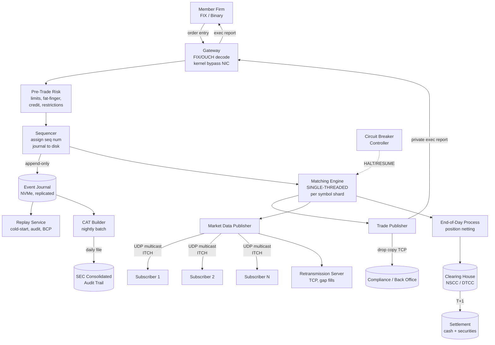
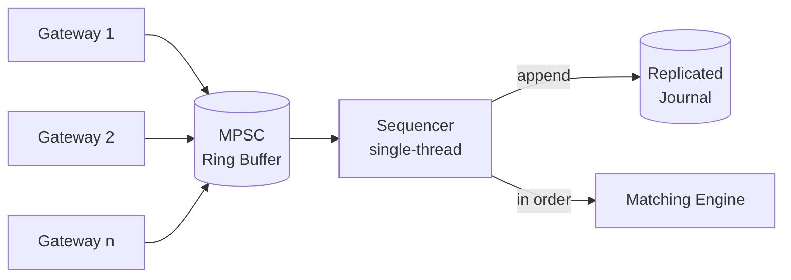

# Design an Online Stock Exchange — Order Books, Deterministic Matching, and Microsecond Market Data

**Date:** 2026-04-25 | **Updated:** 2026-04-25
**Tags:** `system-design` `case-study` `fintech` `low-latency` `hard`

## Table of Contents

- [Summary](#summary)
- [Functional Requirements](#functional-requirements)
- [Non-Functional Requirements](#non-functional-requirements)
- [Capacity Estimation](#capacity-estimation)
- [API Design](#api-design)
- [Data Model](#data-model)
- [High-Level Design](#high-level-design)
- [Deep Dives](#deep-dives)
  - [1. Order Book Data Structure — Price Levels and FIFO at Price](#1-order-book-data-structure--price-levels-and-fifo-at-price)
  - [2. Matching Engine Determinism — Single-Threaded by Design](#2-matching-engine-determinism--single-threaded-by-design)
  - [3. Sequencer Pattern — Total Ordering Before the Engine](#3-sequencer-pattern--total-ordering-before-the-engine)
  - [4. Market Data Fan-Out — Multicast Tick Distribution](#4-market-data-fan-out--multicast-tick-distribution)
  - [5. Pre-Trade Risk Checks and Circuit Breakers](#5-pre-trade-risk-checks-and-circuit-breakers)
  - [6. Settlement — T+1 / T+2 Clearing Pipeline](#6-settlement--t1--t2-clearing-pipeline)
  - [7. Audit, Replay, and Regulatory Feeds (CAT / OATS)](#7-audit-replay-and-regulatory-feeds-cat--oats)
  - [8. Order Type Semantics — Market, Limit, Stop, IOC, FOK](#8-order-type-semantics--market-limit-stop-ioc-fok)
- [Bottlenecks & Trade-offs](#bottlenecks--trade-offs)
- [Anti-Patterns](#anti-patterns)
- [Related](#related)
- [References](#references)

## Summary

An online stock exchange is the textbook example of a system where **latency, ordering, and auditability are simultaneously non-negotiable**. A single matching engine sits at the heart of the design, processing every order serially in a fixed sequence so that, given the same input stream, two engines produce byte-identical output. The rest of the architecture — sequencers in front, multicast fan-out for ticks, a separate clearing pipeline for settlement, and an immutable audit log feeding regulators — exists to feed that engine cleanly and broadcast its decisions safely.

The realistic design accepts four constraints up front:

1. **The matching engine is single-threaded.** Determinism beats raw throughput; you scale by partitioning by symbol, not by parallelizing one symbol.
2. **Total ordering is established before the engine, not inside it.** A sequencer assigns a monotonic sequence number; the engine simply applies events in order.
3. **Trade execution and settlement are different timescales.** Matching happens in microseconds; settlement happens in days (T+1 or T+2). Coupling them is a category error.
4. **Every event is journaled before it is acted on.** The exchange must be able to replay any session bit-for-bit from the audit log to satisfy regulators and recover from failure.

Once those constraints land, the architecture is a pipeline: gateway with FIX/binary protocol → pre-trade risk → sequencer → matching engine (per symbol or symbol shard) → trade output → market-data publisher (multicast) → drop copy / regulatory feed → end-of-day clearing and settlement.

## Functional Requirements

| Requirement | Notes |
|---|---|
| **Place an order** | Market, Limit, Stop, Stop-Limit, Immediate-or-Cancel (IOC), Fill-or-Kill (FOK) |
| **Cancel / replace an order** | By client order ID; idempotent; must respect price-time priority on replace |
| **Match orders** | Price-time priority (best price first; among same price, oldest first) |
| **Publish trade execution** | To both counterparties (private) and the market data feed (public) |
| **Publish quote updates** | Top-of-book and full depth on every order book change |
| **Halt and resume trading** | Per-symbol halts (news pending) and market-wide circuit breakers |
| **Post-trade clearing** | Net positions per member at end of day; submit to clearing house |
| **Settlement** | T+1 (US equities, post-2024) — cash and securities transfer 1 business day later |
| **Regulatory audit trail** | Full event log delivered to CAT (Consolidated Audit Trail) daily |
| **Drop copy** | Real-time mirror of all order/trade events to compliance and back-office |

Out of scope:
- Custody and brokerage (separate systems; exchange does not hold customer assets long-term).
- Tax reporting (broker responsibility; exchange supplies trade data).
- Public price discovery aggregation across exchanges (NMS / SIP — separate consolidator).

## Non-Functional Requirements

| NFR | Target |
|---|---|
| **Order entry → ack latency p50** | < 50 microseconds (gateway to matching ack) |
| **Order entry → ack latency p99** | < 250 microseconds |
| **Matching engine tick (per event)** | < 5 microseconds median |
| **Market data publish lag p99** | < 100 microseconds from match to wire |
| **Total ordering** | Strictly monotonic sequence per matching shard; no gaps, no reorderings |
| **Determinism** | Same input log → byte-identical trades on replay |
| **Throughput per symbol shard** | 1M+ events/sec sustained, 5M+ burst |
| **Aggregate exchange throughput** | 50M+ events/sec across all symbol shards |
| **Durability** | Every order journaled to disk before ack; zero data loss on failover |
| **Availability** | 99.999% during market hours; planned downtime outside session only |
| **Regulatory retention** | 7 years for orders, trades, and quotes (SEC Rule 17a-4) |
| **Recovery** | Cold start from journal in < 60 seconds for any single symbol shard |

The phrase to internalize: **the exchange is correct first, fast second, and durable always**. A trade that prints incorrectly is unrecoverable; a trade that prints late is merely embarrassing; a trade that is lost destroys trust in the venue.

## Capacity Estimation

### Baseline (mid-size US equity venue)

- **Listed symbols:** ~3,500 active
- **Average orders per day:** 100M (during normal sessions)
- **Peak orders per second (whole market):** 500K sustained, 5M burst on news / open / close
- **Trades per day:** ~10M (1 trade per ~10 orders due to cancels and modifies)
- **Quote updates per second:** 5–10× order rate (each book change emits an update)

### Storage

| Item | Size | 1-day volume | 7-year volume |
|---|---|---|---|
| Order event (binary, ~80 B fixed) | 80 B | 100M × 80 B = **8 GB/day** | ~20 TB |
| Trade event (~64 B) | 64 B | 10M × 64 B = 640 MB/day | ~1.6 TB |
| Quote update (~48 B) | 48 B | 1B × 48 B = **48 GB/day** | ~120 TB |
| Audit (CAT) export | ~150 B/event | 100M × 150 B = 15 GB/day | ~38 TB |

The audit log dominates retention. Compressed columnar storage (Parquet, ZSTD) brings the on-disk footprint down 5–10×, but the raw event journals must remain readable and replayable for the full retention window.

### Latency budget (order in → trade ack out)

| Hop | Budget |
|---|---|
| Network ingress (NIC, kernel bypass via DPDK / Solarflare) | 1–3 µs |
| Gateway protocol decode (FIX or binary) | 2–5 µs |
| Pre-trade risk check | 3–10 µs |
| Sequencer (assign seq num, journal) | 5–10 µs |
| Matching engine event apply | 1–5 µs |
| Trade publish + multicast send | 5–10 µs |
| **Total round-trip target** | **~50 µs p50, < 250 µs p99** |

Every component on this path is built or tuned with cache locality, lock-free queues, NUMA pinning, and disk journaling on NVMe with battery-backed write cache. Garbage-collected languages on the hot path are typically avoided in favor of C++, Rust, or the LMAX-style allocation-free Java pattern.

## API Design

The exchange exposes two protocol surfaces: **order entry** (client → exchange) and **market data** (exchange → subscribers). FIX (Financial Information eXchange) is the de facto standard for order entry; ITCH (NASDAQ's) and OUCH (NASDAQ order entry) are example binary protocols.

### Order entry — FIX 4.4 (textual) or proprietary binary

```text
# FIX New Order Single (MsgType=D)
8=FIX.4.4|9=176|35=D|49=BROKER|56=EXCH|34=215|52=20260425-13:30:01.234|
11=ORD-7f3a|55=AAPL|54=1|38=100|40=2|44=187.25|59=0|60=20260425-13:30:01.234|10=...

# Tags:
#  35=D    NewOrderSingle
#  11      ClOrdID (client-assigned, idempotency)
#  55      Symbol
#  54      Side (1=Buy, 2=Sell)
#  38      OrderQty
#  40      OrdType (1=Market, 2=Limit, 3=Stop, 4=StopLimit)
#  44      Price (limit price)
#  59      TimeInForce (0=Day, 3=IOC, 4=FOK, 1=GTC)
```

A binary equivalent (NASDAQ OUCH-style) packs the same fields into ~40–60 bytes for sub-microsecond decode:

```text
struct OUCHEnterOrder {
  uint8_t  msg_type;       // 'O'
  uint64_t client_order_id;
  uint8_t  side;           // 'B' / 'S'
  uint32_t shares;
  char     symbol[8];
  uint32_t price;          // in 1/10000 dollars
  uint32_t time_in_force;
  uint8_t  display;        // visible/hidden
  uint8_t  capacity;       // own/agency
  uint8_t  cross_type;
};
```

### Market data — ITCH-style binary multicast

```text
struct ITCHAddOrder {
  uint8_t  msg_type;        // 'A'
  uint64_t timestamp_ns;    // since midnight
  uint64_t order_ref;
  uint8_t  side;            // 'B'/'S'
  uint32_t shares;
  char     symbol[8];
  uint32_t price;
};

struct ITCHTrade {
  uint8_t  msg_type;        // 'P' (non-cross) or 'Q' (cross)
  uint64_t timestamp_ns;
  uint64_t order_ref;
  uint8_t  side;
  uint32_t shares;
  char     symbol[8];
  uint32_t price;
  uint64_t match_number;
};
```

### Subscribe semantics

Market data is **published**, not pulled. A subscriber joins a UDP multicast group (e.g., `233.10.10.1:9000` for AAPL feed group), and the exchange transmits every event once. Subscribers track sequence numbers and request gap fills via a separate TCP **retransmission server** when they detect a missing seq. This is the standard NASDAQ TotalView-ITCH pattern.

```text
JOIN 233.10.10.1:9000           # UDP multicast group for symbol shard
ON gap detected (seq jumps):
  TCP request: GET seq 1284..1290 from retrans-server
```

## Data Model

### In-memory order book (per symbol)

The book is **not** a relational table during trading hours. It is an in-memory data structure held in a single matching-engine process. Conceptually:

```text
OrderBook {
  symbol:     "AAPL"
  bids:       SortedMap<Price desc, PriceLevel>   // best bid first
  asks:       SortedMap<Price asc,  PriceLevel>   // best ask first
  by_id:      HashMap<OrderId, OrderRef>          // O(1) cancel
}

PriceLevel {
  price:      uint32
  total_qty:  uint64
  orders:     IntrusiveList<Order>                // FIFO, O(1) push/pop
}

Order {
  id:         uint64
  side:       enum
  price:      uint32
  qty_open:   uint32
  qty_filled: uint32
  ts_in:      uint64                              // for time priority
  prev, next: Order*                              // intrusive list pointers
}
```

The price levels are typically a sorted structure (red-black tree or skip list) keyed by price. Within a level, orders are a doubly linked list in arrival order — that gives O(1) FIFO matching against incoming opposite-side orders.

### Durable event journal (write-ahead, sequence-numbered)

```text
Event {
  seq:        uint64           // monotonic per shard, set by sequencer
  ts_in:      uint64           // exchange ingress timestamp (nanos)
  type:       enum {NEW, CANCEL, REPLACE, TRADE, HALT, RESUME}
  payload:    bytes            // order or trade record
  crc32:      uint32
}
```

Stored as append-only files (`shard-AAPL/000123.log`, rolled per N GB) with `fdatasync` on every write or every batch. This is the source of truth — books are reconstructable from the journal alone.

### Trade record (post-match, downstream tables)

```sql
CREATE TABLE trades (
  trade_id        BIGSERIAL PRIMARY KEY,
  match_number    BIGINT NOT NULL,
  symbol          VARCHAR(8) NOT NULL,
  price           INTEGER NOT NULL,             -- 1/10000 dollar
  shares          INTEGER NOT NULL,
  buyer_order_id  BIGINT NOT NULL,
  seller_order_id BIGINT NOT NULL,
  buyer_member    VARCHAR(8) NOT NULL,
  seller_member   VARCHAR(8) NOT NULL,
  exec_ts_ns      BIGINT NOT NULL,              -- nanoseconds since epoch
  session_date    DATE NOT NULL
) PARTITION BY RANGE (session_date);
```

This table is fed asynchronously by a journal consumer; the matching engine itself never touches a database during the trading session.

### Position / clearing record (end of day)

```sql
CREATE TABLE positions_eod (
  member_id   VARCHAR(8) NOT NULL,
  symbol      VARCHAR(8) NOT NULL,
  net_shares  BIGINT NOT NULL,    -- + long, - short
  net_value   BIGINT NOT NULL,    -- in cents
  session_date DATE NOT NULL,
  PRIMARY KEY (member_id, symbol, session_date)
);
```

## High-Level Design



### Order flow on a single trade

1. Client sends a NewOrderSingle over a persistent TCP/FIX session.
2. Gateway decodes the message in user-space (kernel bypass), validates session, enriches with member ID and exchange timestamp.
3. Pre-trade risk checks fire: credit limits, position limits, restricted-list, fat-finger price band, max-order-value.
4. Sequencer assigns a monotonic sequence number for the symbol shard, appends the event to the journal, and (only on successful disk fsync) hands it to the matching engine.
5. Matching engine applies the event. If it crosses, one or more trades are produced; each trade emits both a private execution report (to both counterparties) and a public trade message (to market data).
6. Market data publisher pushes the trade and the resulting book change onto the multicast feed.
7. Drop copy and CAT builders consume the journal asynchronously — they do not gate the live path.
8. End of day: positions are netted; clearing instructions go to NSCC; settlement (cash + securities transfer) completes T+1.

## Deep Dives

### 1. Order Book Data Structure — Price Levels and FIFO at Price

The order book must support five operations at sub-microsecond cost:

| Op | Frequency | Required complexity |
|---|---|---|
| Add order at price | Highest | O(log P) where P = number of price levels |
| Cancel order by ID | High | O(1) |
| Match incoming aggressor against best level | High | O(1) per fill |
| Find best bid / best ask | Every event | O(1) |
| Iterate top-N levels (depth feed) | Per event | O(N) |

The canonical implementation is **two sorted structures of price levels**, plus an ID hash map for cancels:

```text
bids: SortedMap<Price, PriceLevel>   (descending by price)
asks: SortedMap<Price, PriceLevel>   (ascending by price)
by_id: HashMap<OrderId, (Side, Price, OrderRef in level FIFO)>
```

Each `PriceLevel` holds an **intrusive doubly-linked list** of orders in arrival order. "Intrusive" means the linked-list pointers live inside the `Order` struct, so cancels are pure pointer surgery — no allocation, no map lookups inside the level.

```text
ON Add(order):
  level = bids/asks.get_or_create(order.price)
  level.orders.push_back(order)         # O(1)
  level.total_qty += order.qty
  by_id[order.id] = (order.side, order.price, &order)

ON Cancel(order_id):
  side, price, order_ref = by_id.remove(order_id)
  level = bids/asks.find(price)
  level.orders.unlink(order_ref)        # O(1) intrusive unlink
  level.total_qty -= order_ref.qty_open
  if level.empty: bids/asks.remove(price)

ON Match(aggressor):
  while aggressor.qty_open > 0 and best opposite level crosses price:
    resting = best_level.orders.front()
    fill = min(aggressor.qty_open, resting.qty_open)
    emit Trade(aggressor, resting, fill, resting.price)
    aggressor.qty_open -= fill
    resting.qty_open   -= fill
    if resting.qty_open == 0:
      best_level.orders.pop_front()
      if best_level.empty: bids/asks.remove(best_level.price)
```

Two implementation details that matter at scale:

- **Price as integer.** Always represent price in fixed-point integer units (e.g., 1/10000 dollar). Floating-point comparisons in a matching engine are a guaranteed bug.
- **Object pools, not allocators.** Pre-allocate `Order` and `PriceLevel` objects in pools sized to the worst-case book depth. The hot path must not allocate.

For extreme performance, some venues use a flat `Vec<PriceLevel>` indexed by `price - min_price` (constant-time best-bid lookup, dense around the market). LMAX Disruptor's design takes this further with cache-aligned ring buffers.

### 2. Matching Engine Determinism — Single-Threaded by Design

The most counterintuitive design choice: **the matching engine for a given symbol runs on one thread, on one core, with no concurrent access to its data**. This is not a limitation; it is the property the entire architecture is built to preserve.

Why?

1. **Determinism is non-negotiable.** Two replicas of the engine fed the same input log must produce identical trades, in the same order, at the same logical time. Any concurrency introduces non-determinism (lock acquisition order, memory model effects) that breaks replay.
2. **Lock-free single-threaded code is faster than locked multi-threaded code on this workload.** A modern CPU at 3.5 GHz running a tight inner loop with everything in L1/L2 cache executes the average match in 1–5 µs. Adding a lock costs 25–100 ns on the contended path, which on a 5 µs operation is 0.5–2 % overhead per acquire — and you must acquire many.
3. **Recovery becomes trivial.** To restore the book, replay the journal. Any state in the engine is a deterministic function of the input sequence; nothing else exists to reconcile.

You scale by **partitioning by symbol**. AAPL on shard 1, MSFT on shard 2, ten thousand symbols across maybe 30–50 cores on a few servers. Each shard is its own independent state machine. There is no interaction between shards because no order is ever for two symbols at once.

The LMAX Disruptor whitepaper formalized this pattern for a financial exchange: a ring buffer in front of the business logic, single producer / single consumer where possible, no contention on the hot path, mechanical sympathy with cache lines and branch predictors. The takeaway is not "use Disruptor"; it is "remove sharing from your hot path entirely."

```text
Matching loop (pseudo-C++):

for (;;) {
  Event* e = ring_buffer.consume();      // wait-free if cache-warm
  switch (e->type) {
    case NEW:    apply_new(book, e);    break;
    case CANCEL: apply_cancel(book, e); break;
    case REPL:   apply_replace(book, e); break;
  }
  // emit trades + book updates to downstream ring buffers
}
```

No mutex, no atomic on the hot path, no allocator, no GC. The cache footprint of an active book fits in a few MB; the working set stays in L2.

### 3. Sequencer Pattern — Total Ordering Before the Engine

If the matching engine is single-threaded for determinism, who decides the order of events when many gateways receive orders simultaneously? The **sequencer**.

The sequencer is a separate, single-threaded component that:

1. Receives messages from N gateway threads (one per network connection or pool).
2. Assigns a monotonically increasing sequence number per matching shard.
3. Journals the event to disk (or a replicated log) and waits for `fsync` (or quorum ack).
4. Hands the sequenced, durable event to the matching engine.



The sequencer is the **arbitration point**. It is the only place where wall-clock simultaneity is collapsed into a single linear order. Before the sequencer, "two events arriving at the same time" is a meaningful concept; after it, every event has a unique sequence number and "before/after" is total.

Two implementation patterns dominate:

- **Disk-journaled local sequencer.** A single sequencer process writes to a local NVMe journal with battery-backed write cache. fsync latency is 10–20 µs. Failover to a hot standby on heartbeat loss; standby tails the journal.
- **Replicated log (Raft / chain replication).** The sequencer is a Raft leader; events are committed only when a quorum of replicas has them on disk. Latency is higher (50–200 µs depending on topology) but the system survives a sequencer node loss without ever losing or reordering an event. See [`../../data-consistency/consensus-raft-paxos.md`](../../data-consistency/consensus-raft-paxos.md) for the consensus mechanics.

Either way, the property the sequencer provides to the matching engine is **gap-free, monotonic, durable input**. The matching engine is permitted to assume that property and contains no logic to handle violations.

### 4. Market Data Fan-Out — Multicast Tick Distribution

When a trade prints, hundreds of subscribers (broker firms, market makers, analytics shops, SIP consolidators) need to know within microseconds. TCP unicast to each subscriber would (a) put N copies of every message on the wire and (b) make the publisher's send latency dependent on the slowest subscriber. Neither is acceptable.

**Solution: UDP multicast.** The publisher sends each event once; the network (switches and routers configured for IGMP / PIM) duplicates the packet to every joined receiver. The publisher's send cost is constant in N.

```text
Publisher: send_to(multicast_group=233.10.10.1, port=9000, seq=12834, payload=...)

Subscribers: each independently receives, processes at its own pace.
If a subscriber falls behind, it falls behind alone — no back-pressure on publisher.
```

The cost: UDP is unreliable. Packets can be dropped. The protocol must handle this:

- **Sequence numbers on every message.** The subscriber tracks expected next seq; on a gap, it triggers recovery.
- **Retransmission server (TCP).** A separate process holds the last N minutes of messages in memory. Subscribers request gap fills by seq range.
- **Snapshot service.** For full book state on join (or after a long gap), subscribers request a current snapshot, then resume the live multicast at `snapshot.last_seq + 1`.
- **Two parallel feeds (A/B).** Many exchanges publish identical content on two physically separate multicast groups. Subscribers consume both and take the first arrival per seq, dropping duplicates. Loses A or B → still no gap.

NASDAQ TotalView-ITCH is the canonical reference: a binary multicast feed with sequence numbers, complemented by GLIMPSE (snapshot) and a retransmit service.

For the exchange side, the latency-sensitive part is the publisher's serialize-and-send. Modern designs use kernel-bypass (Solarflare, DPDK, RDMA) and pre-formatted message templates to keep publish-to-wire under 5 µs.

### 5. Pre-Trade Risk Checks and Circuit Breakers

Two distinct risk layers protect the system, with different scopes:

#### Pre-trade risk (per-order, microsecond budget)

Before any order reaches the matching engine, it runs a fast battery of checks:

| Check | Rationale |
|---|---|
| Credit / buying power | Member cannot place orders exceeding deposited margin. |
| Position limit | Per-symbol max long/short to avoid concentration. |
| Fat-finger price band | Reject limit prices > X% from last trade (typical: 5–10%). |
| Restricted list | Member-specific or regulatory bans on a symbol. |
| Order size cap | Reject orders larger than max share count. |
| Max order rate | Throttle members to N orders/sec to prevent runaway algos. |
| Self-trade prevention | Reject or modify orders that would match the same member's own resting order. |

These run in the gateway or a dedicated risk node, with per-member state held in shared memory and updated atomically as orders fill. Budget: 3–10 µs total. **Rejection here happens before sequence number assignment** — rejected orders never enter the book or the journal as accepted events.

#### Circuit breakers (market-wide, second-level)

Distinct from pre-trade risk: these are emergency stops that halt trading entirely.

- **Limit Up / Limit Down (LULD).** Per-symbol price bands; if the price hits the band, trading pauses 5 minutes.
- **Market-Wide Circuit Breakers (MWCB).** S&P 500 down 7% (Level 1) → 15-min halt; 13% (Level 2) → 15-min halt; 20% (Level 3) → close for the day.
- **Single-stock halts.** News pending, regulatory, exchange-discretion.

Implementation: a separate **circuit breaker controller** monitors trade prints across symbols (or subscribes to an internal index calculation), and emits HALT / RESUME events into the matching engine's input stream as ordinary sequenced events. The engine processes a HALT just like any other event — it stops accepting matchable order types until the corresponding RESUME arrives. Because halts go through the sequencer, they are deterministic and replayable.

The boundary between pre-trade risk and circuit breakers is rigid: per-order checks are member-scoped and microsecond-budgeted; circuit breakers are market-scoped and operate at the seconds/minutes timescale.

### 6. Settlement — T+1 / T+2 Clearing Pipeline

Trade execution is microseconds; settlement is days. They live in different systems with different consistency models.

**During the session:**
- Matching engine produces trade records.
- Trades stream to back-office systems via drop copy.
- Both counterparties' positions are tracked in real time for risk purposes, but **no money or stock has moved**.

**End of day (T):**
- All trades for the session are netted per (member, symbol). If member A bought 10K AAPL and sold 7K AAPL across the day, the net obligation is "receive 3K AAPL, pay 3K × VWAP cash."
- Net positions are submitted to the clearing house (in the US: NSCC, a DTCC subsidiary).
- The clearing house novates: it becomes the legal counterparty to both sides of every trade. This eliminates bilateral counterparty risk.

**T+1 (one business day later, current US standard since May 2024):**
- Cash transfers between members' bank accounts via Fedwire.
- Securities transfer in DTC's book-entry system (no physical certificates).
- Failure to deliver is rare and handled with prescribed buy-in procedures.

The exchange's role ends at end-of-day net position submission. From that point, the clearing house owns the lifecycle.

Why T+1 (and not T+0)?

- **Operational tolerance.** Brokers reconcile customer accounts overnight, identify errors, and resolve breaks before money moves.
- **Margin and risk recalculation.** The CCP recomputes margin requirements based on the day's positions.
- **Cross-border alignment.** Asian and European markets need a window for FX and custody transfers.

T+0 (instant settlement) is technically possible — crypto exchanges do it natively — but it requires every participant to pre-fund every trade, eliminating the leverage and credit float that traditional markets rely on. The trade-off is real and structural, not just inertia.

This separation is mirrored in the design of any payment system; see [`./design-payment-system.md`](./design-payment-system.md) for the equivalent split between authorization and settlement in card networks.

### 7. Audit, Replay, and Regulatory Feeds (CAT / OATS)

Every event entering the matching engine is journaled before being applied. That journal is the master record and feeds three downstream consumers:

#### Cold-start / failover replay

To start a matching engine cleanly, replay its symbol's journal from the start of session. Modern hardware does ~1 GB/s on NVMe; an 8 GB journal restores in 8 seconds. For mid-session failover, the standby has been tailing the journal continuously; cutover is sub-second.

#### Drop copy / back office

A real-time TCP feed mirrors all order events and execution reports to compliance and back-office systems. Drop copy is the source of truth for per-member position tracking and intra-day risk monitoring. It runs as an asynchronous journal consumer — never on the engine's hot path.

#### Regulatory reporting (CAT in the US)

The Consolidated Audit Trail (CAT), live since 2020, replaced the older Order Audit Trail System (OATS). CAT receives a complete record of every order lifecycle event from every exchange and broker, by 8:00 AM on T+1.

- Every order event must include: the customer ID (encrypted; the LEI / CAT-CCID), the originating broker, all routing and modification events, every fill, every cancel.
- Format: SEC-mandated CSV with strict field validation; the CAT processor (currently FINRA CAT LLC) rejects malformed records.
- Volumes are large: CAT processes ~500B events/day across the US market.

The exchange builds its CAT submission as a nightly batch job, reading the journal and a member-master database, formatting per the CAT Reporting Technical Specifications, and uploading via SFTP to FINRA CAT before the deadline.

The cross-cutting principle: **the journal is the law**. Audit, replay, drop copy, regulatory feeds — all derived. There is no scenario where the database is right and the journal is wrong; the journal is the system's single point of truth for what happened.

### 8. Order Type Semantics — Market, Limit, Stop, IOC, FOK

Each order type maps to a precise matching-engine behavior. Fuzziness here is dangerous.

| Type | Behavior |
|---|---|
| **Market** | Match immediately at best available opposite-side prices. Walks the book through as many price levels as needed to fill. Any unfilled remainder typically converts to a limit at the last fill price (or is canceled, depending on rules). |
| **Limit** | Match against any opposite-side resting at price ≤ limit (for buy) or ≥ limit (for sell). Any unfilled remainder rests on the book. |
| **Stop** | Inactive until last-trade price reaches the stop price. On trigger, becomes a market order. Stop orders are kept in a separate triggered-stop structure, not in the main book. |
| **Stop-Limit** | Like Stop but becomes a limit order on trigger. |
| **IOC (Immediate-or-Cancel)** | Match what you can immediately; cancel the remainder. Never rests on the book. |
| **FOK (Fill-or-Kill)** | Either fill the entire quantity immediately or cancel everything. No partial fills, no resting. |
| **GTC (Good-Til-Canceled)** | Limit order that persists across sessions until filled or canceled. Many US exchanges no longer support pure GTC and use Day with member-side persistence. |

The matching engine has one matching primitive — "walk opposite-side levels and fill" — and the order type determines how the result is post-processed: **rest the remainder?** (Limit) **cancel the remainder?** (IOC) **fully reverse the partial fills?** (FOK — implemented as a dry-run that checks fillable quantity before committing).

Self-trade prevention adds a wrinkle: in many venues, a match between two orders from the same member is suppressed (cancel the older, modify the newer, or reject). This must be deterministic and visible in the journal.

## Bottlenecks & Trade-offs

| Component | Bottleneck | Mitigation |
|---|---|---|
| Gateway protocol decode | FIX text parsing is slow (~20 µs/message) | Offer binary protocol (OUCH-style) for latency-sensitive members; FIX for retail / low-volume |
| Sequencer fsync | Disk fsync ~10–20 µs floor | Group commit (batch ~1000 events per fsync); battery-backed write cache; NVMe |
| Matching engine throughput | Single-threaded ceiling (~1–5M events/sec/symbol) | Shard by symbol; one engine per symbol or symbol group |
| Market data publisher | Send-to-wire latency under burst | Pre-serialize messages; kernel bypass; pre-warmed multicast routes |
| Drop copy consumer lag | Slow consumer cannot block engine | Consumer is async; bounded buffer; alert on lag, never back-pressure |
| Journal replication | Cross-DC replication adds 1–10 ms | In-DC synchronous replication; cross-DC async with bounded RPO |
| Risk checks | Per-order check cost on hot path | Held in shared-memory cache, updated by async fill-listener; lock-free reads |
| CAT batch upload | Hundreds of GB/day, T+1 deadline | Stream during the day; final reconciliation pass after market close |
| Symbol-skew load | One mega-active symbol (SPY) saturates one shard | Sub-shard SPY by price-band or order-type, with merger before publish |

The headline trade-off is **single-thread determinism vs throughput-per-symbol**. Once you accept that single-thread determinism is the property you cannot give up, every other architectural choice — sequencer, journal, multicast, sharding by symbol — falls out as a consequence. See [`../../performance-observability/performance-budgets-latency-analysis.md`](../../performance-observability/performance-budgets-latency-analysis.md) for the discipline of decomposing a tight latency budget across hops.

## Anti-Patterns

1. **Multi-threaded matching for a single symbol.** Looks like a throughput win on paper. In practice it destroys determinism, makes replay impossible, and the lock contention costs more than the parallelism gains. Shard by symbol instead.
2. **Database in the hot path.** A SQL `INSERT` on every order kills you at 1K orders/sec, never mind 1M. The matching engine talks to memory and a journal; nothing else.
3. **Sharing the order book across processes via shared memory with locks.** Same problem as multi-threading: contention plus non-determinism. If you must read from another process, give it a read-only snapshot or a feed; do not let it touch the live book.
4. **Floating-point prices.** A bug waiting to happen. `0.1 + 0.2 != 0.3` in IEEE 754. Use integer ticks (e.g., 1/10000 dollar) everywhere.
5. **Trusting wall-clock timestamps from gateways.** Clocks drift; a faster gateway can stamp a "later" event with an earlier time. Time priority must come from the sequence number, not from a timestamp.
6. **Unbounded order acceptance under stress.** A flood of orders from one bad algo can overwhelm risk checks. Per-member rate limits at the gateway are mandatory, not optional.
7. **Publishing market data over TCP with per-subscriber sockets.** N subscribers means N copies of every message and head-of-line blocking. UDP multicast plus a TCP retransmit channel is the right shape.
8. **Reconstructing the book from the trade tape.** The trade tape only shows fills, not cancels and modifies. The book is reconstructable only from the full order journal.
9. **Coupling settlement to matching.** A T+0 settlement attempt inside the matching path makes the latency-critical engine wait for funds movement. Settlement is its own pipeline, end of day.
10. **Letting one slow consumer back-pressure the publisher.** A publisher that waits for the slowest subscriber is not a publisher; it is a single point of latency for the whole market. Drop / disconnect / log; never block.
11. **Writing engine state to the journal directly.** The journal stores **inputs**, not outputs. State is a deterministic function of the inputs; storing state too means you have two sources of truth and a chance for them to disagree.
12. **Treating the audit trail as a nice-to-have.** Regulators do not ask politely. Late or incorrect CAT submissions trigger enforcement actions. Build the audit pipeline at the same time as the matching engine, not after.

## Related

- [Designing a Payment System](./design-payment-system.md) — the auth-vs-settlement split mirrors the match-vs-clearing split here; both systems separate latency-sensitive decisions from durable money movement.
- [Consensus: Raft and Paxos](../../data-consistency/consensus-raft-paxos.md) — used by the sequencer's replicated journal to provide gap-free, durable total ordering across nodes.
- [Performance Budgets and Latency Analysis](../../performance-observability/performance-budgets-latency-analysis.md) — the discipline of decomposing a sub-250-µs end-to-end latency target across protocol decode, risk, sequencing, matching, and publish.

## References

- [LMAX Architecture — Martin Fowler](https://martinfowler.com/articles/lmax.html) — single-threaded business logic with a Disruptor ring buffer; the seminal description of a high-throughput deterministic exchange.
- [The Disruptor — Concurrent Programming Framework (LMAX whitepaper)](https://lmax-exchange.github.io/disruptor/files/Disruptor-1.0.pdf) — mechanical sympathy, ring buffer design, false sharing, and lock-free producer/consumer patterns used in matching engines.
- [NASDAQ TotalView-ITCH 5.0 Specification](https://www.nasdaqtrader.com/content/technicalsupport/specifications/dataproducts/NQTVITCHSpecification.pdf) — the binary multicast market data protocol most exchanges' feeds are modeled on.
- [NASDAQ OUCH 5.0 Order Entry Protocol](https://www.nasdaqtrader.com/content/technicalsupport/specifications/TradingProducts/OUCH5.0.pdf) — the binary order entry protocol that complements ITCH for latency-critical members.
- [FIX Protocol — FIX Trading Community](https://www.fixtrading.org/standards/) — FIX 4.4 / 5.0 specifications for cross-firm order entry and execution reports.
- [SEC Consolidated Audit Trail (CAT)](https://www.catnmsplan.com/) — regulatory specification for daily lifecycle event reporting from exchanges and brokers.
- [SEC Final Rule: T+1 Settlement Cycle](https://www.sec.gov/rules/2023/02/shortening-securities-transaction-settlement-cycle) — the 2024 move from T+2 to T+1 for US securities.
- [DTCC / NSCC Continuous Net Settlement](https://www.dtcc.com/clearing-services/equities-clearing-services/cns) — the central counterparty clearing model used for US equity settlement.
- [Limit Up-Limit Down (LULD) Plan](https://www.luldplan.com/) — the price-band-based per-symbol circuit breaker mechanism in US equities.
- [NYSE Pillar Trading Platform — Architecture Overview](https://www.nyse.com/publicdocs/nyse/markets/nyse/Pillar_Trading_Platform_Overview.pdf) — production architecture of a major exchange, with sequencing, matching, and market data design choices documented.
