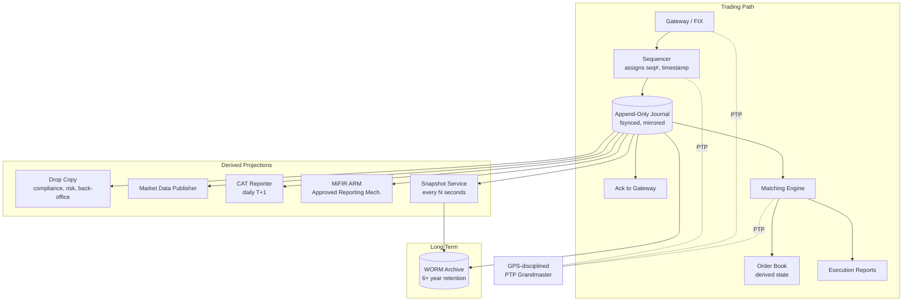
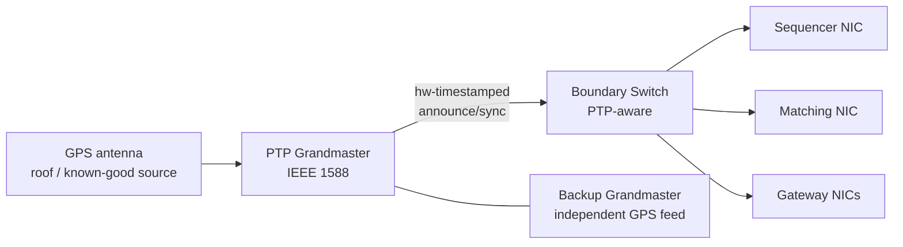

# Audit, Replay, and Regulatory Feeds — CAT, MiFID II, and Bit-Identical Reconstruction

**Date:** 2026-04-30 | **Updated:** 2026-04-30
**Tags:** `system-design` `deep-dive` `fintech` `audit` `regulation`

## Table of Contents

- [Summary](#summary)
- [Overview](#overview)
- [Journal-First Discipline — Write-Ahead Log Before Action](#journal-first-discipline--write-ahead-log-before-action)
- [The Append-Only Journal as Source of Truth](#the-append-only-journal-as-source-of-truth)
- [Synchronous Replication and Ack Boundary](#synchronous-replication-and-ack-boundary)
- [Bit-Identical Replay](#bit-identical-replay)
- [Snapshots and Bounded Recovery Time](#snapshots-and-bounded-recovery-time)
- [Consolidated Audit Trail (CAT)](#consolidated-audit-trail-cat)
- [MiFID II / MiFIR Transaction Reporting](#mifid-ii--mifir-transaction-reporting)
- [Clock Synchronization — PTP, GPS, and 100µs](#clock-synchronization--ptp-gps-and-100s)
- [Drop Copy and Real-Time Mirrors](#drop-copy-and-real-time-mirrors)
- [Best Execution Evidence](#best-execution-evidence)
- [Tape Archival and WORM Storage](#tape-archival-and-worm-storage)
- [Forensic Replay for Manipulation Investigations](#forensic-replay-for-manipulation-investigations)
- [Trade Rehearsal — Overnight Regression Replay](#trade-rehearsal--overnight-regression-replay)
- [Anti-Patterns](#anti-patterns)
- [Related](#related)
- [References](#references)

## Summary

A modern equities or futures exchange is, structurally, a deterministic state machine in front of a persistent log. The matching engine is fast and clever, but the matching engine is not the source of truth. The **journal** — the append-only, fsynced, synchronously-replicated, sequence-numbered byte stream of every accepted gateway message — is the source of truth. Books, positions, P&L, drop copies, market data feeds, and the regulatory CAT submission are all *derived state*: each one is a deterministic function of the journal up to some sequence number. This document expands the "Audit, Replay, and Regulatory Feeds" deep-dive of [`../design-stock-exchange.md`](../design-stock-exchange.md), focused on three properties the architecture must hold simultaneously: **bit-identical replay** for recovery and dispute resolution, **bounded recovery time** under crash via snapshot + journal tail, and **regulator-acceptable evidentiary chain** for CAT (US), MiFID II / MiFIR (EU), and successor regimes.

The architectural through-line: **journal before action; the journal is the truth; everything else is a projection; replay is a first-class operation, not a recovery hack**. Every property the regulators want — auditability, reconstruction, best-execution evidence, manipulation forensics, multi-decade retention — falls out of taking that discipline seriously, instrumenting the clocks well enough to keep timestamps trustworthy, and refusing to compromise the journal for performance.

## Overview

The audit / replay subsystem must satisfy a tight set of invariants that look nothing like a typical web-scale system:

| Invariant | Why it matters | Enforcement |
|---|---|---|
| Every gateway-accepted message is journaled before any visible side effect | Without this, replay can never reconstruct what actually happened | WAL discipline + sequencer ack policy |
| The journal is append-only and immutable | Mutability destroys the evidentiary chain for regulators and disputes | WORM storage, cryptographic hashing, no `DELETE`/`UPDATE` |
| Replay is deterministic and bit-identical | Recovery, regression testing, and dispute reconstruction all depend on it | Single-threaded matcher, deterministic ordering, sequence-numbered inputs |
| Timestamps are accurate to a regulator-defined tolerance | MiFID II RTS 25 mandates 100µs to UTC for HFT participants; CAT requires nanosecond granularity for proprietary trading firms | PTP grandmasters from GPS, monitored offset, timestamp at sequencer ingress |
| Records are retained for decades | SEC Rule 17a-4 and equivalents require 6+ years (and some classes longer); WORM-immutable | Archival tier with hash-chain integrity |
| Compliance, risk, and back-office consume a real-time mirror | Internal supervision and surveillance cannot lag the trading day | Drop copy fan-out from the journal |



A deliberate consequence of this layout: the matching engine and the books it produces can be discarded at any moment, and the system can rebuild the full trading-day state by replaying the journal against a fresh engine. This is not a theoretical property — it is exercised every night during the trade-rehearsal regression suite, and it is the recovery path when a primary engine crashes mid-session. The journal IS the exchange.

## Journal-First Discipline — Write-Ahead Log Before Action

The single most important rule, the one that every other guarantee in this document hinges on: **no observable effect — no book mutation, no execution report, no market-data tick, no gateway ack — happens before the input message is durably journaled and synchronously replicated.** This is the write-ahead log discipline that databases have used for decades, applied to a trading system.

The discipline rules out a class of bugs that look minor in code review but are catastrophic at audit time:

- The "fast path" that updates the book first and journals lazily — if the engine crashes mid-update, the book diverges from the journal forever.
- The async log writer that batches up to N ms — if the box dies during the window, executions exist that the journal never saw.
- The "I'll just emit market data first to keep the feed snappy" — if the journal write fails, the market saw a fill that legally never happened.

```pseudocode
def on_gateway_message(msg):
    # 1. Sequencer ingress: assign seq#, capture nanosecond timestamp
    seq = sequencer.next()
    ts  = ptp_now_ns()
    record = JournalRecord(
        seq=seq,
        ts_ns=ts,
        gateway_id=msg.gateway_id,
        client_order_id=msg.client_order_id,
        payload=msg.bytes,
        crc32c=crc32c(msg.bytes),
    )

    # 2. WAL: append, fsync, mirror to standby, await standby ack
    journal.append(record)            # disk fsync(O_DSYNC)
    standby_ack = journal.replicate_sync(record, timeout_ns=2_000_000)
    if not standby_ack:
        # standby did not ack within budget -> reject, do nothing else
        return reject(msg, reason="journal_replication_timeout")

    # 3. ONLY NOW is the message "real". Hand to engine, ack the gateway.
    engine.dispatch(record)
    gateway.ack(msg.client_order_id, seq=seq, ts_ns=ts)
```

The ordering is non-negotiable: **journal → replicate → ack → derive**. Reverse any two of those four and the evidentiary chain breaks. The cost is the latency of one fsync plus one cross-rack RTT; on a tuned NVMe + 10 GbE setup this is comfortably under 100 µs and is the floor below which a regulated venue cannot go regardless of how fast the matcher itself is.

A compliance-grade journal record carries, at minimum:

- **Sequence number** (monotonic, gap-free, assigned by the single sequencer authority)
- **Ingress timestamp** in nanoseconds, taken from the PTP-disciplined clock (see [Clock Synchronization](#clock-synchronization--ptp-gps-and-100s))
- **Gateway identity** and the gateway's own ingress timestamp (kept for round-trip-time analytics)
- **Client order ID** and **firm ID** (for CAT linkage)
- **Raw payload** of the original message exactly as the gateway received it — *not* a parsed structure, because parsers evolve and the regulator may need to re-parse with a future schema
- **Checksum** (CRC32C) of the payload to detect on-disk corruption
- **Hash chain link** — the SHA-256 of `(prev_record_hash || this_record_payload)`, so any tampering is detectable downstream (see [Tape Archival and WORM Storage](#tape-archival-and-worm-storage))

## The Append-Only Journal as Source of Truth

The journal has two operational identities in the system. To the trading hot path, it is a **WAL**: messages are written, fsynced, replicated, then dispatched to derived consumers. To the rest of the firm, it is the **system of record**: anything the engine derived (books, positions, fills, market data) can be wiped and reconstructed from the journal alone. The corollary is that the engine carries *no* state that is not also implied by the journal — no in-memory counters, no clock drifts, no random-seeded tie-breakers, nothing the journal cannot fully reproduce.

This is what gives the architecture its leverage. Any engine-level bug, corruption, or operational mistake can be repaired by replaying the journal against a fixed engine. Conversely, anything that violates "engine state is a pure function of the journal" is a defect that should fail code review.

**Why a log and not a database.** A relational database stores latest-state-by-key by design; recovering a historical state requires either temporal tables or transaction-log spelunking. A trading audit system is the opposite: latest state is a transient projection, the *sequence of changes* is what regulators and dispute-resolvers need. An append-only sequence-numbered log is the natural shape; row-store databases are an awkward fit. This is why purpose-built trading log systems — Aeron Archive, LMAX Disruptor + journaller, kdb+/tplog, custom proprietary loggers — dominate the space rather than off-the-shelf RDBMSs.

**Single-writer, multi-reader.** The journal has exactly one writer (the sequencer + journal pair) at any time. Multi-writer logs require consensus on ordering at write time, which both adds latency and complicates the deterministic-replay property. Standby journals are read-only mirrors that take over via failover, not concurrent writers. See [`./sequencer-pattern.md`](./sequencer-pattern.md) for why the single-sequencer model is the only viable shape at this latency budget.

**Files, not rows.** Journals are stored as a sequence of segment files (typically 64 MB–1 GB), each named by the starting sequence number. Segments rotate on size or time. A segment, once closed, is never re-opened for write — a property that lets the archival tier copy closed segments to WORM storage without coordination.

```text
/journal/
  /active/
    seg_00000000123456789.jnl    <-- currently being appended
  /closed/
    seg_00000000123450000.jnl
    seg_00000000123440000.jnl
    ...
  /index/
    seg_00000000123456789.idx    <-- (seq -> file_offset) lookup
```

## Synchronous Replication and Ack Boundary

A single-host journal is one disk failure away from data loss, which is unacceptable for a primary venue. The journal is **synchronously replicated** to one or more standby nodes before the gateway is acked. This is the single most expensive operation in the trading hot path and is the dominant component of the venue's wire-to-wire latency floor.

The ack rule:

> The gateway is acknowledged ONLY after the journal record is durable on the primary AND has been acknowledged as durable by at least one standby (typically a same-rack peer for latency, plus an async out-of-rack mirror for disaster scenarios).

The standby is not a replica in the eventually-consistent sense; it is a **prepared successor**. If the primary fails, the standby has every record the primary had acknowledged to a gateway, by construction. That guarantees recovery without losing any trade the world believes was confirmed.

Three replication models in real venues:

| Model | Latency cost | Failure surface |
|---|---|---|
| Local-rack sync only | ~25–50 µs (RTT + fsync) | Whole-rack power/network event loses everything in flight |
| Local-rack sync + remote async | Same as above | Local rack disasters lose seconds; remote site slightly behind |
| Local-rack sync + remote sync (cross-DC) | ~1–5 ms | Tightest durability; rules out sub-ms wire-to-wire |

Most equity venues run model 2 — sync to a same-rack standby, async to a DR site at a metropolitan distance — because the latency cost of cross-DC sync is incompatible with the wire-to-wire SLA they advertise to participants. Futures venues running on slightly looser latency budgets sometimes run model 3 for the disaster-resilience benefit.

**Failover correctness.** When the primary fails, the standby that takes over must promote without any record gaps and must reject any in-flight gateway messages whose journal status is uncertain. The protocol is roughly:

1. Cluster manager detects primary failure (heartbeat miss).
2. Surviving standby checks its highest acked seq# matches the gateway's last-received ack seq# (gateways carry this in their session state for FIX-style resends).
3. Standby promotes itself to primary, opens journal for append at `last_seq + 1`.
4. Gateways re-sync their session state via FIX resend / sequence reset.
5. Any gateway message whose ack was in flight at primary failure is re-sent by the gateway and either matches an existing journal record (idempotent on `client_order_id`) or is journaled fresh.

The corollary discipline: **gateway-side idempotency on `client_order_id`** is mandatory. Without it, failover causes duplicate orders. With it, replay and re-sync are safe.

## Bit-Identical Replay

The defining property of the system: **given the same journal as input, replaying through a frozen engine version produces the exact same outputs — same fills, same execution reports, same market data ticks, same end-of-day positions — byte-for-byte.** This is what regulators mean when they ask the venue to "reconstruct the order book at 14:23:17.084 UTC on March 7" — there is one and only one answer, and it is computable.

Determinism requires aggressive discipline:

1. **Single-threaded matcher.** Multi-threaded matchers introduce non-determinism via thread scheduling; even when the inputs and outputs are identical, intermediate orderings differ. Most engines run one matcher thread per symbol or per shard and pin it to a CPU core. See [`./matching-engine-determinism.md`](./matching-engine-determinism.md) for the long-form case.
2. **Inputs are the journal, nothing else.** The engine reads no clocks, no random numbers, no external services during matching. Time, if needed, comes from the journal record's timestamp. Tie-breakers come from the journal's sequence number.
3. **Floating-point banned in price/quantity arithmetic.** All price math is integer (in ticks) or fixed-point (scaled decimal). FP rounding is non-portable across CPU vendors and even across compiler versions on the same CPU.
4. **Stable hash and ordering primitives.** Any data structure that affects matching order — book levels, time-priority queues — must have deterministic iteration order. `std::unordered_map`-style structures with implementation-defined iteration order are out.
5. **No background GC or allocator heuristics in the hot path.** Java engines pre-allocate everything and run with disabled or pinned GC; C++ engines use object pools. Allocator behavior is not part of the deterministic surface.
6. **Pinned engine binary version.** Replay must use the *exact* engine binary that produced the original day's trades, or a binary explicitly certified as behaviorally identical. A new engine version is replayed against historical journals (see [Trade Rehearsal](#trade-rehearsal--overnight-regression-replay)) before being approved for production.

```pseudocode
def replay(journal_path, from_seq=0, to_seq=None):
    engine = MatchingEngine(version=BINARY_VERSION)
    expected = ExpectedOutputsLoader(journal_path)  # loaded for verification mode

    for record in journal_iter(journal_path, from_seq, to_seq):
        outputs = engine.dispatch(record)         # pure function: (state, input) -> (state', outputs)
        if VERIFY:
            assert outputs == expected.next(), \
                f"divergence at seq={record.seq}: {outputs} != {expected.next()}"

    return engine.snapshot()                      # final state == original state, bit-identical
```

Bit-identical replay is what makes the following operations possible:

- **Crash recovery.** Boot a fresh engine, replay from last snapshot, you are back in business with provably the same state.
- **Dispute resolution.** A participant claims their order was wrongly cancelled. Replay the relevant time window in a sandbox, walk the regulator through every state transition, with the journal as the unforgeable evidence.
- **Regression testing.** Replay an entire trading day through a candidate engine version; any divergence from production output is a regression.
- **Forensic investigation.** Surveillance suspects layering on a name. Replay the order book around the incident, observe the message sequence at nanosecond granularity, support enforcement action.

## Snapshots and Bounded Recovery Time

A pure-replay-from-zero recovery would take hours by end of day; a billion-message journal at a few µs per replayed message is far too slow when a venue must restart between sessions or recover from a mid-session failure. The standard fix is **periodic snapshots**: every N seconds (typically 30–60s, sometimes shorter for high-stakes products), the engine serializes its full state to a snapshot file, tagged with the sequence number it represents.

```text
/snapshots/
  snap_00000000123450000.bin    <-- engine state as of seq 123450000
  snap_00000000123455000.bin
  snap_00000000123460000.bin
  ...
```

Recovery becomes:

1. Find latest snapshot ≤ desired recovery point.
2. Load snapshot into fresh engine instance.
3. Replay journal records from `snap_seq + 1` forward to target.

```pseudocode
def fast_recover(target_seq):
    snap = snapshots.latest_at_or_before(target_seq)
    engine = MatchingEngine.from_snapshot(snap)
    for record in journal_iter(from_seq=snap.seq + 1, to_seq=target_seq):
        engine.dispatch(record)
    return engine
```

If a snapshot is taken every 30 seconds, the maximum tail-replay length is 30 seconds of journal — usually millions of records but seconds of wall-clock at engine native rate. Recovery time is bounded by the snapshot interval, not by the day's length.

**Snapshot consistency.** A snapshot must be taken at a quiescent point: no in-flight matches, all queued inputs drained up to a definite seq#. The simplest implementation: pause input dispatch, fork the snapshot writer with a copy-on-write view of state, resume dispatch. On modern hardware with multi-GB books, this is a few hundred microseconds — perceptible at the wire-to-wire level and so timed for non-peak windows when possible.

**Snapshot integrity.** Each snapshot embeds the `seq#` it represents and a SHA-256 of the engine state. On load, the recoverer verifies the snapshot hash and refuses to use a corrupt one (falling back to an earlier snapshot + longer replay).

**Snapshot retention.** Snapshots are themselves archived to WORM alongside the journal. They are not strictly required (the journal alone is sufficient to reconstruct any moment), but they accelerate any future "replay to time T" investigation by years of compute.

## Consolidated Audit Trail (CAT)

In the US equities and options market, the **Consolidated Audit Trail (CAT)** replaced the older **Order Audit Trail System (OATS)** in 2020 as the FINRA / SEC-mandated regulatory reporting regime. CAT requires every NMS-participating broker-dealer and exchange to report every life-cycle event of every order — receipt, route, modification, cancellation, execution — with linkage across firms, in a daily delivery to the CAT processor (FINRA CAT, LLC) by the morning of T+1.

CAT's reportable events ([CAT NMS Plan, CAT Reporting Technical Specifications](https://www.catnmsplan.com/)):

| Event type | Trigger |
|---|---|
| `MENO` — Manual Order Event | Order received by phone, etc., and manually entered |
| `MEOR` — Order Receipt (electronic) | Order accepted at the broker or exchange |
| `MEOM` — Order Modification | Order replaced or modified |
| `MEOJ` — Order Routing | Order routed to another firm or venue |
| `MEOC` — Order Cancellation | Order cancelled (by client, firm, or venue) |
| `MEOX` — Order Execution | Order partially or fully filled |
| `MEOA` — Allocation | Block trade allocated across sub-accounts |

Each record carries a substantial set of fields: timestamps (event time and processor receipt time, both to nanosecond on the venue side), originating firm ID, CAT-Reporter-ID, customer-and-account ID (CAID), order ID, parent order ID (for the linkage graph), price, quantity, side, order type, time in force, market identifier (MIC), and dozens more depending on event type. The full data dictionary runs to hundreds of fields across event variants.

```json
{
  "eventType": "MEOX",
  "eventTimestamp": "2026-04-30T14:23:17.084123456Z",
  "eventProcessingTimestamp": "2026-04-30T14:23:17.084234567Z",
  "firmROEID": "FRM-12345",
  "catReporterIMID": "CRP-987",
  "orderID": "ORD-2026-04-30-AAPL-000001234",
  "parentOrderID": "ORD-2026-04-30-AAPL-000001233",
  "symbol": "AAPL",
  "side": "B",
  "executedQuantity": 100,
  "executedPrice": "180.4500",
  "executionVenue": "MIC-XNAS",
  "executionID": "EX-2026-04-30-XNAS-7654321",
  "capacity": "P",
  "accountID": "CAID-firm-acct-hash",
  "ats_display_indicator": null,
  "...": "..."
}
```

The job of the **CAT reporter** in the venue is to project the journal into CAT records, package them per the CAT spec, and deliver them to the CAT processor by the T+1 deadline (typically 8:00 AM ET). Because the journal carries the original gateway message and the engine's exact response, the reporter is a pure projection — it never makes up data, never guesses timestamps. Mismatch errors returned by the CAT processor (failed validations, broken linkage to other firms' submissions) are repaired by re-projecting from the journal, never by patching CAT-side data.

**Linkage.** A CAT record's value is in its linkage to records from other firms. A retail customer's order at Broker A, routed to Wholesaler B, executed against an exchange's resting order, generates events at all three firms — and the regulator's reconstruction depends on those records linking via order IDs, parent IDs, and timestamps. The venue's responsibility is its slice; correct keys and accurate timestamps on its slice are what enable regulator-side stitching.

## MiFID II / MiFIR Transaction Reporting

In the EU, **MiFID II / MiFIR** imposes parallel obligations through **RTS 22 transaction reporting** ([ESMA RTS 22](https://www.esma.europa.eu/document/rts-22-reporting-obligation)). Investment firms and trading venues report executed transactions to the relevant National Competent Authority (NCA) by T+1, with 65 fields per report covering instrument identification, counterparty LEIs, decision-maker identifiers, trader IDs, algo IDs, waiver flags, short-sale flags, and execution venue.

Key differences from CAT, in shape:

- **CAT covers the order lifecycle**; MiFIR RTS 22 covers **executed transactions**, with separate order-record-keeping obligations under RTS 24.
- **CAT is centralized** at FINRA CAT, LLC; MiFIR reports flow through **Approved Reporting Mechanisms (ARMs)** to the NCA of the firm's home Member State.
- **MiFIR cares heavily about LEI** (Legal Entity Identifier, ISO 17442) for parties, decision-makers, and clients; CAT's identity model uses CAID.
- **Algo identifiers and decision-maker codes are mandatory in MiFIR**, supporting algo-trading supervision; CAT has lighter algo treatment.

In both regimes, the venue's projector consumes the journal, joins to reference data (instrument master, LEI registry, customer master), and produces the regulatory format. The journal's role is identical in both: source of truth from which the projection is computed.

**Order-book-state reporting (MiFIR RTS 24).** Trading venues are also required to maintain order-record-keeping that allows reconstruction of the order book to any point in time, which directly maps to the journal + snapshot architecture documented above. The replay capability is not a nice-to-have; it is a regulatory deliverable.

## Clock Synchronization — PTP, GPS, and 100µs

Audit timestamps are only as good as the clocks producing them. MiFID II RTS 25 ([ESMA RTS 25](https://www.esma.europa.eu/document/rts-25-clock-synchronization)) is explicit: trading venues and members engaged in HFT must keep their business clocks accurate to **100 microseconds of UTC** with **microsecond timestamp granularity**. CAT and futures markets push tighter — nanosecond granularity is now table stakes for any modern engine, with proprietary trading firms reporting at nanosecond resolution.

NTP cannot deliver this. NTP's accuracy floor is roughly 1 ms over a quiet LAN and tens of milliseconds over WAN, two to four orders of magnitude worse than what regulators require. The standard tool is **PTP (Precision Time Protocol, IEEE 1588)** in an L2 hardware-timestamped deployment.



Architecture properties that matter:

- **Two independent GPS-disciplined grandmasters**, with **independent antennas** on different sides of the building, on independent power, monitored for offset against each other. A single GPS antenna failure or spoofing event must not be a single point of failure for compliance.
- **PTP boundary clocks** on every switch in the path; **transparent clocks** as second choice. A non-PTP-aware switch in the path inflates jitter past tolerance.
- **Hardware timestamping NICs** on hosts that produce or consume audit timestamps. Software timestamping at the OS layer adds tens of microseconds of jitter that compromises the 100 µs budget.
- **Continuous monitoring** of every host's offset to grandmaster, with **alarms below a fraction of the regulator threshold** (e.g., alarm at 25 µs when 100 µs is the limit). A drifting clock can quietly produce weeks of out-of-tolerance timestamps before anyone notices, and the resulting reports may be retroactively non-compliant.
- **GPS spoofing detection.** GPS is spoofable, especially on rooftop antennas; a sudden, coordinated time jump should freeze trading rather than be quietly accepted as truth.

**Where the timestamp is taken.** The authoritative timestamp on a journal record is taken at the **sequencer ingress**, immediately after the message is read off the wire and before the journal append. This is the moment the venue commits to "I saw this message at this time." Gateway-local timestamps are also captured (for round-trip-time analytics and for the "client time vs. venue time" disclosure in execution reports), but the audit timestamp is the sequencer's.

## Drop Copy and Real-Time Mirrors

Compliance, risk, and back-office consumers cannot wait for end-of-day reports. They need a real-time, lossless, ordered mirror of every accepted message. This is the **drop copy** feed — a fan-out from the journal to internal subscribers, semantically identical to the engine's input but consumed by non-trading systems.

Drop copy consumers:

- **Real-time risk system.** Position deltas, exposure aggregation, kill-switch logic that disables a participant's gateway when limits are breached.
- **Compliance surveillance.** Pattern detectors for spoofing, layering, marking the close, wash trades, cross-account self-trades.
- **Back-office and middle-office.** Trade booking into the firm's books-and-records, P&L attribution, fee calculation, clearing-eligibility determination.
- **Regulatory reporters.** The CAT and MiFIR projectors usually run off the drop copy rather than scanning archived journal segments, for latency reasons.
- **Participant drop-copy services.** Many venues sell drop-copy to participants themselves, so a trading firm's risk system can consume an authoritative mirror of its own activity at the venue.

Critical properties:

- **Sequence-numbered and gap-detectable.** A drop-copy consumer that misses sequence numbers must be able to detect the gap and request a retransmit (or be rebuilt from the journal). A "fire and forget" UDP drop copy that silently drops messages is a compliance disaster.
- **Causally consistent with the engine output.** A drop copy that delivers an execution before the corresponding journal record is durable can lead surveillance to chase ghosts. The fan-out is gated on journal durability.
- **Multiple delivery shapes.** FIX session for back-office; binary for risk; Kafka topic for surveillance — same content, different transports, all derived from the same journal.

For settlement-side consumers, see [`./settlement-pipeline.md`](./settlement-pipeline.md), where the drop copy fans into clearing house submissions and end-of-day affirmations.

## Best Execution Evidence

Best execution is a regulatory obligation: a broker must demonstrate that customer orders were routed to obtain the best reasonably available terms (price, speed, likelihood of execution, total cost). Demonstrating it requires reconstructing **what the market looked like at the moment of the routing decision**, not just what the eventual fill price was.

The replay infrastructure makes this tractable. Given a customer's order routed at `T = 14:23:17.084123456Z`:

1. Find the snapshot ≤ T.
2. Replay journal forward to T.
3. Read the order book state for the relevant symbol at exactly T, including:
   - National Best Bid and Offer (NBBO) as of T.
   - Order book depth at the venue.
   - Pending orders ahead in time priority at the relevant prices.
4. Compare to the actual route decision and execution. Document the rationale.

```mermaid
sequenceDiagram
    participant REG as Regulator
    participant FIRM as Compliance
    participant REPLAY as Replay Cluster
    participant JNL as Journal Archive
    participant ENG as Sandboxed Engine

    REG->>FIRM: best-ex query, order ID = X, time = T
    FIRM->>REPLAY: reconstruct(symbol=AAPL, time=T)
    REPLAY->>JNL: fetch snapshot ≤ T, journal segment (T-30s, T+5s)
    JNL-->>REPLAY: snapshot + journal slice
    REPLAY->>ENG: load(snapshot); replay(slice up to T)
    ENG-->>REPLAY: book state at T
    REPLAY-->>FIRM: book + NBBO + pending queue at T
    FIRM-->>REG: best-ex evidence package
```

Two architectural consequences:

- **Replay must be safe to run in parallel with production.** Compliance investigations should not require pausing the live engine. Replay clusters are isolated environments that read journal archives; they never touch the live engine.
- **Pre-trade decision logging.** "What did the router know at the time it picked this venue?" requires logging the inputs to the routing decision (NBBO snapshot, latency estimates, ATS quote inventories) into a parallel journal. Best-ex without decision-input logging is a one-sided narrative.

## Tape Archival and WORM Storage

Regulators require records to be retained, untampered, for many years. **SEC Rule 17a-4** ([2022 amendment, 17a-4(f)](https://www.sec.gov/rules/final/2022/34-96034.pdf)) modernized the requirements: records must be either (a) preserved in a non-rewriteable, non-erasable format (WORM), or (b) preserved in an audit-trailed electronic record-keeping system with comprehensive verification logs. EU MiFIR has parallel requirements under Article 16(6) and RTS 6, with retention typically 5–7 years depending on instrument and member state.

Implementations:

- **Object storage with immutability locks.** S3 Object Lock (compliance mode), Azure Blob immutability policies, GCP Bucket Lock — all provide WORM at object-storage prices, with retention windows that cannot be shortened by anyone, including the storage account owner.
- **Hash-chained journal segments.** Each closed journal segment carries a SHA-256 hash; segment N+1's header includes segment N's hash. Periodic anchor hashes are published to an external timestamping authority (RFC 3161 trusted timestamping service, or a public blockchain anchor for some firms) so any retroactive tampering is detectable.
- **Independent trustee.** Some regimes still require an "audit trail" maintained by a third-party designated examining authority who holds independent copies and can attest to integrity. Belt-and-braces.

```pseudocode
def archive_closed_segment(seg):
    seg_bytes = read_file(seg.path)
    seg_hash  = sha256(seg_bytes)
    chain_link = sha256(prev_segment_hash + seg_hash)

    # 1. Write to WORM bucket with retention lock
    obj = worm.put(
        bucket="exchange-journal-archive",
        key=f"y={year}/m={month}/d={day}/seg_{seg.start_seq}.jnl",
        body=seg_bytes,
        retention_mode="COMPLIANCE",
        retention_until=now() + years(7),
    )

    # 2. Append hash chain entry to integrity ledger
    integrity_ledger.append(
        seg_id=seg.id,
        seg_hash=seg_hash,
        chain_link=chain_link,
        worm_object_etag=obj.etag,
        archived_at=now(),
    )

    # 3. Periodic external anchor (e.g., daily)
    if is_anchor_time():
        rfc3161_timestamp(integrity_ledger.head())
```

**Why the hash chain matters even with WORM.** WORM prevents the storage layer from being the source of tampering, but the chain protects against insider scenarios where someone with rotated keys could attempt to substitute objects before the lock activates. The chain also supports detection of bit-rot in long-lived archives — a periodic verification job re-hashes random samples and compares to the chain.

For the encryption-at-rest and key-management story underlying these archives, see [`../../../security/encryption-at-rest-and-in-transit.md`](../../../security/encryption-at-rest-and-in-transit.md).

## Forensic Replay for Manipulation Investigations

Market manipulation cases — spoofing, layering, marking the close, wash trading, momentum ignition — turn on the *sequence and timing* of orders, not just the executed prices. Investigators need to see:

- The order book state in microsecond detail across the suspect window.
- Every order placement, modification, and cancellation by the suspect across multiple symbols and possibly multiple venues.
- Whether the suspect's pattern is consistent with bona fide market making (cancels because the market moved) or with manipulation (cancels because the suspect's own deceptive orders moved a price they then traded against on the other side).

The replay infrastructure gives investigators this in two modes:

**Single-venue replay.** The investigator replays the journal of a single venue in a sandbox, observes the suspect's order flow and the resulting book state. Sufficient for venue-internal cases like layering on one book.

**Cross-venue forensic.** Manipulation often crosses venues — a spoof on Venue A to move the NBBO that's then traded against on Venue B. CAT's linkage records and SIP-distributed market data tapes (SIP CTA / UTP feeds) let investigators stitch a synchronized view across venues, but only if every venue's timestamps are accurate to the regulator's tolerance. This is why RTS 25 and CAT's nanosecond requirements are hard rules: they make cross-venue forensic possible.

**Detection vs. evidence.** Real-time surveillance systems consume the drop copy and flag suspicious patterns as they happen. Forensic replay is the deeper tool used after a flag has been raised: it produces the evidence package that supports an enforcement action (FINRA discipline, SEC referral, DOJ for criminal cases). The replay is the *evidence*, not just the detection.

## Trade Rehearsal — Overnight Regression Replay

Engine versions evolve: bug fixes, new order types, performance improvements, feature additions. Deploying a new engine to production without proving it produces identical behavior on prior data is malpractice. The standard discipline is **overnight trade rehearsal**: replay the previous trading day's full journal through the candidate engine version and compare every output, byte for byte, to production output.

```pseudocode
def overnight_rehearsal(date, candidate_engine_version):
    journal  = archive.fetch_journal(date)
    expected = archive.fetch_outputs(date)   # production outputs of that day

    candidate = MatchingEngine(version=candidate_engine_version)
    for record in journal:
        outputs = candidate.dispatch(record)
        diff = compare(outputs, expected.next())
        if diff:
            divergence_report.add(record.seq, diff)

    if divergence_report.empty():
        return PASS
    else:
        return FAIL(divergence_report)
```

Pass criteria: zero divergence, every fill, every market data tick, every reject reason, every execution ID, identical. Any divergence is a regression, even if the new behavior is "better" — because it means the new engine would have produced different trades on a real day, and the venue has no way to reason about whether participants would have been better or worse off.

**When divergence is intentional.** Sometimes a new feature legitimately changes behavior (e.g., a new order type). Those changes are gated behind feature flags or order-type dispatchers, and rehearsal replays without the new flag set must still produce identical output. Rehearsal *with* the new flag is a separate validation that exercises the feature against historical conditions, but does not enforce identity.

**Cadence.** Overnight rehearsal runs on every candidate engine build. Production deployments are gated on a clean rehearsal across at least the last N trading days (typically 5–20, including a known stress day). The rehearsal infrastructure runs on a separate cluster sized to replay a full trading day in well under the overnight window.

For the broader DR / failover playbook this rehearsal is part of, see [`../../../reliability/disaster-recovery.md`](../../../reliability/disaster-recovery.md).

## Anti-Patterns

**Log compaction on the trading journal.** Kafka-style log compaction (keeping only the latest value per key) destroys the historical sequence of events. The audit story depends on every order modification being preserved, not collapsed to the latest state. The trading journal must be retained in full for the regulatory window; compaction belongs in derived caches, never in the journal.

**Mutable history.** Any path that lets an operator "fix" a journal record after the fact — even with audit logging of the fix — is a compliance failure. The journal is append-only; corrections are *new* records (e.g., a `CORRECTION` event referencing the original seq#), never mutations.

**Lossy event types.** A journal that stores a rejected message as "rejected" without the rejection reason, or stores a cancel without the cancel source, loses information that surveillance and dispute resolution need. The journal record should carry every input field plus every engine-derived field needed to fully describe what happened.

**NTP-only timestamps.** NTP is not adequate for trading audit timestamps. RTS 25 explicitly disqualifies NTP-only setups for HFT participants. Anyone running an audit system on NTP is one offset event away from a regulatory inquiry. Run PTP from GPS-disciplined grandmasters.

**Logging on the async path.** The pattern "do the work, then enqueue a log message" sacrifices the ability to recover from any crash that occurs between the work and the log enqueue. In a trading system, the work IS the log; the engine cannot legitimately have done anything that the journal does not already prove.

**Single grandmaster.** A single GPS antenna is a single point of compliance failure. Two independent grandmasters with cross-checking and antenna diversity is the minimum.

**Software timestamps on user space.** A timestamp captured in user space passes through scheduler jitter, syscall jitter, and OS clock skew. Hardware-timestamped NICs are the difference between 100 µs compliance and silent multi-millisecond drift.

**Coupling drop copy to engine memory state.** A drop copy that's a side-effect emission from the engine's hot path (e.g., "after we mutate the book, we publish to Kafka") risks divergence if the publish fails. Drop copy consumers should derive from the journal, not from the engine's transient state.

**Storing snapshots without integrity hashes.** A corrupted snapshot loaded into a fresh engine produces an incorrect state from which all subsequent replay diverges. Snapshots must be self-validating; hash mismatches must trigger fallback to an earlier snapshot.

**Skipping clock-offset alarms below threshold.** Alarming only at the regulator-defined threshold means the system is already non-compliant by the time anyone notices. Alarm well below threshold (a quarter of it is a reasonable starting point) so operators have time to react.

**No idempotency on `client_order_id`.** Without it, a gateway resend after a transient network failure causes a duplicate order, and the journal then has two orders for what was logically one. The ack-side journal-then-reply discipline only works if the gateway side is idempotent on the unique ID.

**Treating CAT / MiFIR projectors as their own source of truth.** Storing transformed CAT records and "fixing" them in place when the regulator returns errors leads to a parallel truth that diverges from the journal. The projector is a pure function from journal to report; corrections are re-projections.

**Replay clusters reading from production journal storage.** Replay traffic at 100 GB/s scan rate against the production storage bus interferes with live trading. Replay reads from archived journal copies on a separate storage tier — the WORM archive doubles as the replay source.

**Allowing matchmaker non-determinism (multi-thread, FP arithmetic, hash maps with random ordering).** Bit-identical replay is the architectural primitive that everything else rests on; any engine-level non-determinism kills it silently and emerges as an unreproducible incident months later.

**Retention policies set "long enough."** Get the regulator-specific retention right per record type (orders vs. executions vs. messages vs. communications), per jurisdiction. Some classes of records are 3 years, some 5, some 6, some 7+, and a few classes have indefinite retention. Wrong retention is a regulatory finding even if the data still exists.

**Allowing operations staff to delete or modify journal segments under any pretext.** WORM is the architectural guarantee that this cannot happen by accident or policy violation. Operationally, the principle is: nothing about the journal is a manual process.

For the cross-cutting view of structured logging, log shipping, and observability that frames this audit pipeline as part of the broader operational telemetry, see [`../../../performance-observability/log-aggregation-and-structured-logging.md`](../../../performance-observability/log-aggregation-and-structured-logging.md).

## Related

- [`./matching-engine-determinism.md`](./matching-engine-determinism.md) — the determinism contract that makes bit-identical replay possible: single-threaded matcher, integer arithmetic, no clocks/randomness in matching, deterministic data structures.
- [`./sequencer-pattern.md`](./sequencer-pattern.md) — single-sequencer ingress that assigns the gap-free seq# and timestamp the journal record depends on.
- [`./settlement-pipeline.md`](./settlement-pipeline.md) — where the drop copy stream feeds clearing, affirmation, and settlement reconciliation downstream of the trading day.
- [`../design-stock-exchange.md`](../design-stock-exchange.md) — the parent integration HLD; this deep dive expands its "Audit, Replay, and Regulatory Feeds" subsection.
- [`../../../security/encryption-at-rest-and-in-transit.md`](../../../security/encryption-at-rest-and-in-transit.md) — encryption, key management, and HSM integration for the long-lived journal archive.
- [`../../../performance-observability/log-aggregation-and-structured-logging.md`](../../../performance-observability/log-aggregation-and-structured-logging.md) — broader log shipping, schema evolution, and structured logging patterns; trading journals are a specialized strict-discipline instance of the same family.
- [`../../../reliability/disaster-recovery.md`](../../../reliability/disaster-recovery.md) — DR strategies, RPO / RTO targets, and failover drills; rehearsal replay is a key DR tool.

## References

- FINRA CAT, ["CAT NMS Plan and Reporting Resources"](https://www.catnmsplan.com/) — official CAT specifications, technical schemas, reporting deadlines, and reportable-event definitions; the source of record for US equities/options regulatory reporting since OATS retirement in 2020.
- SEC, ["Rule 608 Information / CAT NMS Plan Filing"](https://www.sec.gov/divisions/marketreg/rule608-info-filings.shtml) — the SEC-side regulatory framework for the CAT and the historical context of OATS replacement.
- ESMA, ["RTS 22 — Reporting Obligations under MiFIR Article 26"](https://www.esma.europa.eu/document/rts-22-reporting-obligation) — the EU equivalent to CAT for transaction reporting; 65-field schema, ARM workflow, T+1 deadlines.
- ESMA, ["RTS 25 — Clock Synchronization"](https://www.esma.europa.eu/document/rts-25-clock-synchronization) — the formal source for the 100 µs / microsecond-granularity requirement that mandates PTP-class infrastructure for HFT participants.
- IEEE, ["IEEE 1588 Precision Time Protocol"](https://standards.ieee.org/ieee/1588/4355/) — the standards document for PTP, the protocol underlying any compliant trading-clock infrastructure.
- SEC, ["Rule 17a-4 — Electronic Records Preservation (2022 Amendment)"](https://www.sec.gov/rules/final/2022/34-96034.pdf) — the modern broker-dealer record retention rule, including the WORM-vs-audited-electronic-system options that drive archival design.
- DTCC, ["About DTCC and Best Execution Resources"](https://www.dtcc.com/about) — context on post-trade infrastructure and the regulatory backdrop in which best-execution evidence is produced and consumed.
- Real Logic, ["Aeron Archive — Append-only Replicated Log"](https://github.com/real-logic/aeron/wiki/Aeron-Archive) — open-source append-only log specifically designed for trading-grade journaling, used by several exchanges and trading firms; a concrete reference implementation of the WAL discipline.
- CME Group, ["CME Audit Trail"](https://www.cmegroup.com/market-regulation/audit-trail.html) — futures-side audit trail rules that complement equities/options regimes; CME's approach is widely studied as a reference architecture.
- Kleppmann, *Designing Data-Intensive Applications*, Chapters 3 ("Storage and Retrieval") and 5 ("Replication") — foundational treatment of write-ahead logs, append-only storage, and synchronous replication; the database-systems theory that trading journals adapt to a stricter latency budget.
- LMAX, ["The LMAX Architecture"](https://martinfowler.com/articles/lmax.html) — Martin Fowler's write-up of the LMAX exchange architecture, including the Disruptor pattern, single-threaded matcher, and journal-first discipline that informs much of modern exchange design.
