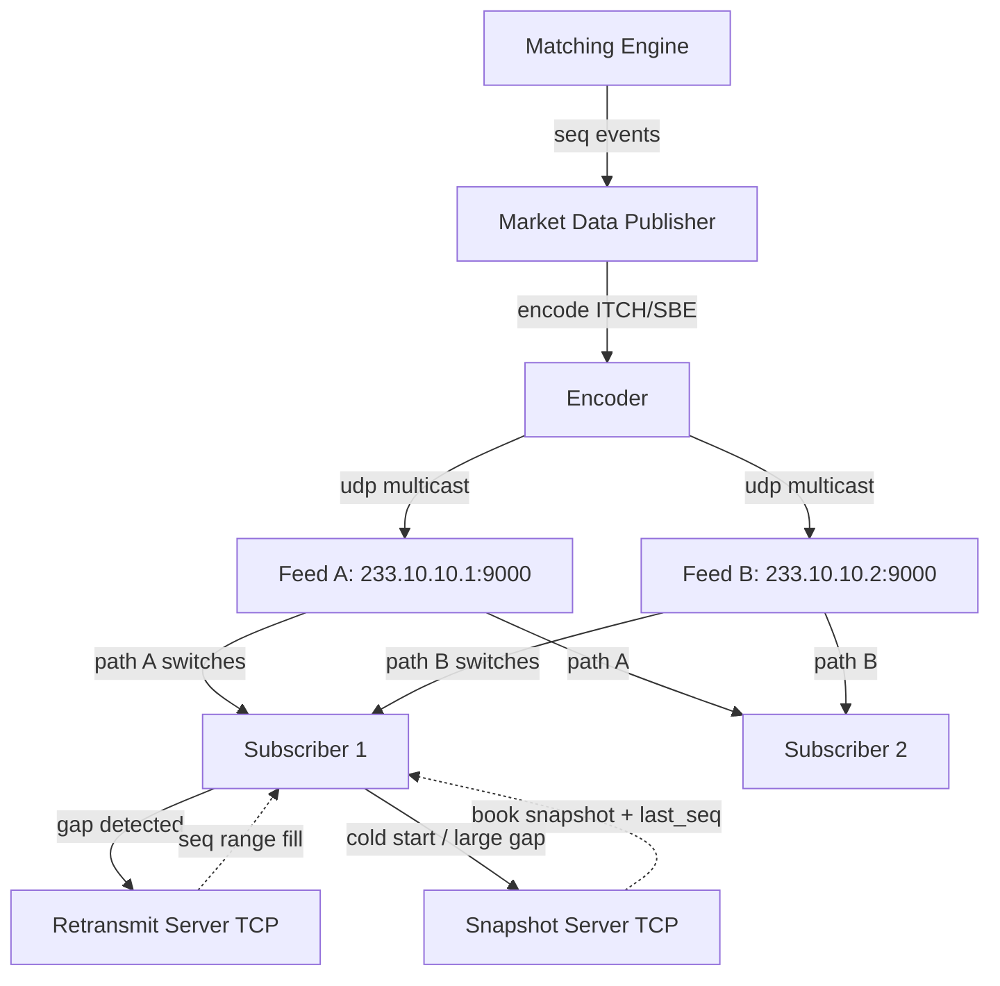

# Market Data Fan-Out — UDP Multicast, A/B Feeds, and Snapshot Recovery

**Date:** 2026-04-30 | **Updated:** 2026-04-30
**Tags:** `system-design` `deep-dive` `fintech` `networking` `multicast`

> Companion deep-dive to [Design an Online Stock Exchange](../design-stock-exchange.md), expanding § 4 *Market Data Fan-Out — Multicast Tick Distribution*. Read the parent first for the matching-engine and sequencer context that produces the events this pipeline distributes.

## Table of Contents

- [Summary](#summary)
- [Overview](#overview)
- [Why UDP Multicast Instead of TCP Unicast](#why-udp-multicast-instead-of-tcp-unicast)
- [Sequence Numbers and Gap Detection](#sequence-numbers-and-gap-detection)
- [A/B Feed Redundancy](#ab-feed-redundancy)
- [Snapshot + Incremental Recovery](#snapshot--incremental-recovery)
- [Retransmit Request Channel](#retransmit-request-channel)
- [Level 1 vs Level 2 vs Level 3 Feeds](#level-1-vs-level-2-vs-level-3-feeds)
- [Conflation for Slow Consumers](#conflation-for-slow-consumers)
- [Wire Protocols — ITCH, MDP 3.0, FIX/FAST, SBE](#wire-protocols--itch-mdp-30-fixfast-sbe)
- [Microbursts and Switch Buffer Sizing](#microbursts-and-switch-buffer-sizing)
- [Fairness and Latency Symmetry](#fairness-and-latency-symmetry)
- [Datacenter Multicast Routing and Kernel Bypass](#datacenter-multicast-routing-and-kernel-bypass)
- [Public SIP vs Private Direct Feeds](#public-sip-vs-private-direct-feeds)
- [Worked Example — Gap Detection and Snapshot Recovery](#worked-example--gap-detection-and-snapshot-recovery)
- [Anti-Patterns](#anti-patterns)
- [Related](#related)
- [References](#references)

## Summary

Market data is the **broadcast** half of an exchange. Orders flow in over reliable unicast (TCP, FIX, OUCH); ticks flow out to thousands of subscribers simultaneously over UDP multicast. The asymmetry is intentional. A matching engine that prints a trade has microseconds — not milliseconds — to inform every co-located market maker. Sending one TCP copy per subscriber would put N copies on the wire, make publish latency O(slowest receiver), and burn CPU on N independent retransmit windows. UDP multicast collapses send cost to constant in N at the price of unreliability, which the protocol claws back via dual A/B feeds, sequence numbers, periodic snapshots, and a TCP retransmit fallback. This deep-dive expands the parent case study's [Market Data Fan-Out subsection](../design-stock-exchange.md#4-market-data-fan-out--multicast-tick-distribution) into a full treatment: the network design, the gap-recovery state machine, the wire protocols (ITCH, MDP 3.0, SBE, FAST), the kernel-bypass receive paths, and the regulatory tension between private direct feeds and the public consolidated tape.

## Overview

A market data event traverses four layers between matching engine and subscriber. Each layer has its own failure mode and its own recovery posture:

1. **Generation** — the matching engine emits sequenced events (`AddOrder`, `Trade`, `CancelOrder`, `BookUpdate`) onto an internal bus. The sequence number is assigned by the [sequencer](./sequencer-pattern.md) and is **the** authoritative ordering across the symbol.
2. **Encoding** — a market data publisher serializes each event into a compact binary frame (ITCH, MDP 3.0, SBE). The frame is fixed-shape and template-driven so encode cost is constant and predictable.
3. **Multicast emission** — the publisher sends the frame to two distinct multicast groups (Feed A and Feed B), each on its own NIC, switch, and physical fiber path.
4. **Receive and reassembly** — subscribers join both groups, dedupe by sequence, detect gaps, request retransmits or snapshots when needed, and feed a clean ordered stream to their book-builder.



The decoupling is the load-bearing idea: the publisher emits at line rate without ever waiting for any subscriber. Subscribers absorb gaps individually. A slow or dead subscriber damages only itself — the publisher and every other subscriber proceed at wire speed.

## Why UDP Multicast Instead of TCP Unicast

If you have a thousand subscribers and a matching engine printing 500,000 events per second, the bandwidth math is brutal:

| Protocol | Send cost on the publisher | Wire bytes | Latency profile |
|---|---|---|---|
| TCP unicast × N | N independent connections, N retransmit windows, N congestion controllers | N × payload | Tail dominated by slowest receiver's ACK pacing |
| TCP relay tree | Publisher fans out to a few relays; relays fan out to subscribers | ~N × payload (just shifted) | Adds hops and per-hop store-and-forward |
| **UDP multicast** | One `sendto()`, switches duplicate frames | ~1 × payload at egress port | Constant; no per-receiver feedback |

The publisher under TCP fan-out is a victim of every receiver's network. A market maker on a flaky cross-connect would slow head-of-line for every other subscriber sharing that publisher socket. Worse, the kernel's TCP state machine is **on the hot path**: receive ACKs, manage windows, retransmit on loss. None of that is acceptable when your end-to-end budget from match to wire is 5 microseconds.

UDP multicast inverts the trade-off. The publisher does **one** kernel-bypassed send per event. Network hardware (managed by IGMP joins and PIM-SM routing — see [RFC 4601](https://datatracker.ietf.org/doc/html/rfc4601)) replicates the packet to every joined receiver port. Subscribers absorb cost individually. No receiver state lives on the publisher. The send is **fire-and-forget**.

The cost is unreliability. UDP makes no guarantees about delivery, ordering, or duplication. At line rate (10 / 25 / 100 / 400 GbE), packet loss in a busy datacenter is **routine**, not exceptional. Causes include:

- Microbursts overwhelming a switch egress buffer (covered below).
- Receiver NIC ring full because the host CPU was scheduled away.
- Bit errors on a degraded fiber.
- Receiver host took a context switch and the kernel dropped from the socket buffer.
- IGMP join lag at session start (you joined the group but the upstream switch's tree hasn't converged).

The protocol absorbs all of these via redundancy, not via point-to-point ACKs. That choice is the entire shape of the design.

## Sequence Numbers and Gap Detection

Every multicast frame carries a strictly monotonically increasing sequence number per channel. The subscriber's first job is to detect gaps and out-of-order arrivals.

```c
// ITCH-style binary header. Network byte order (big-endian).
// Fixed 24 bytes, hot in the receive path's L1 cache.
#pragma pack(push, 1)
struct ItchHeader {
    uint16_t length;            // payload bytes after this header
    uint16_t channel_id;        // e.g., NASDAQ TotalView channel
    uint64_t sequence_number;   // monotonic per channel
    uint64_t timestamp_ns;      // nanoseconds since session start
    uint16_t message_type;      // 'A' add, 'X' cancel, 'P' trade, etc.
    uint16_t reserved;
};

// Payload immediately follows. Example: AddOrder
struct AddOrder {
    uint64_t order_ref;
    char     side;              // 'B' or 'S'
    uint32_t shares;
    char     stock[8];
    uint32_t price;             // fixed-point, 10000 = $1.0000
};
#pragma pack(pop)
```

Why fixed-shape binary? Three reasons:

1. **Decode cost is a single struct cast.** No allocation, no parser state machine, no field lookup. Every microsecond of wire-to-book latency matters.
2. **Sizes are predictable.** You can pre-size receive ring buffers, lay out hot cache lines, and avoid surprise allocations.
3. **Endianness and alignment are explicit.** Defensive parsing of human-readable formats burns CPU you don't have.

Gap detection is mechanical:

```c
// Gap-fill state machine — one per (feed_id, channel_id) pair.
typedef enum {
    STATE_NORMAL,
    STATE_AWAITING_RETRANSMIT,
    STATE_AWAITING_SNAPSHOT,
} FeedState;

typedef struct {
    FeedState state;
    uint64_t  expected_seq;          // next seq we want
    uint64_t  highest_seen_seq;      // highest seq observed so far
    uint64_t  gap_open_ns;           // when did the current gap appear
    BufferedFrames pending;          // frames > expected_seq, held until gap fills
} ChannelState;

void on_frame(ChannelState* c, ItchHeader* h, void* payload, uint64_t now_ns) {
    if (h->sequence_number == c->expected_seq) {
        deliver_to_book(h, payload);
        c->expected_seq++;
        drain_pending_in_order(c);                    // contiguous frames buffered earlier
        return;
    }

    if (h->sequence_number < c->expected_seq) {
        // Already seen on the other feed (A/B dedupe), or stale retransmit.
        return;
    }

    // sequence_number > expected_seq → there is a gap.
    if (c->state == STATE_NORMAL) {
        c->state        = STATE_AWAITING_RETRANSMIT;
        c->gap_open_ns  = now_ns;
        request_retransmit(c->channel_id, c->expected_seq, h->sequence_number - 1);
    }

    // Buffer ahead-of-gap frames; do NOT deliver out of order.
    buffer_pending(&c->pending, h, payload);
    c->highest_seen_seq = max(c->highest_seen_seq, h->sequence_number);

    // Escalate if retransmit has been silent too long.
    if (now_ns - c->gap_open_ns > RETRANSMIT_TIMEOUT_NS) {
        c->state = STATE_AWAITING_SNAPSHOT;
        request_snapshot(c->channel_id);
    }
}
```

Two invariants this machinery preserves:

- **Subscribers never deliver out-of-order events to the book builder.** A trade event must not be applied before the order it filled has been added. If you see seq 105 before 103, you buffer 105 and wait.
- **Gaps are bounded in time.** Every gap either gets filled (via the other feed, retransmit, or snapshot) or escalates. There is no "stuck forever" state; if recovery cannot complete, the subscriber declares the feed unhealthy and trips its own circuit breaker.

The dedupe logic gets a free assist from the [sequencer pattern](./sequencer-pattern.md) on the publisher side: because the sequencer already issues globally-unique monotone numbers, the receiver's job is purely about *transport-level* gaps, not *logical* reordering.

## A/B Feed Redundancy

The single biggest reliability lever in the design: **publish the same data twice, on two physically independent paths**.

```text
Matching engine → Publisher
                  ├─ NIC A → Switch A → Feed A multicast group (233.10.10.1)
                  └─ NIC B → Switch B → Feed B multicast group (233.10.10.2)

Subscriber → NIC A → joins 233.10.10.1
          └─ NIC B → joins 233.10.10.2

Receive logic: arbitrate by sequence number, take the first arrival.
```

Properties:

| Property | Effect |
|---|---|
| Identical content, different paths | A loss event on switch A does not affect feed B; subscriber sees no gap so long as one path delivers each frame. |
| Independent failure domains | A/B should ride different physical fibers, different ToR switches, ideally different power feeds. Co-locating them defeats the purpose. |
| Per-frame arbitration | The receiver does not "fail over" between feeds; it merges them frame-by-frame. Whichever path delivers seq N first wins; the duplicate from the other feed is dropped. |
| Asymmetric latency is fine | Feed B can be 5 µs slower than Feed A on average. It still fills the gaps Feed A drops. |

Receive-side dedupe is just a tiny extension of the gap detector:

```c
void on_frame_with_ab(ChannelState* c, FeedId feed, ItchHeader* h, void* payload, uint64_t now_ns) {
    // Per-channel, regardless of which feed delivered it.
    if (h->sequence_number < c->expected_seq) {
        // Already delivered. This is the duplicate from the other feed (or a late retransmit).
        record_dedupe_event(feed, h->sequence_number);
        return;
    }
    on_frame(c, h, payload, now_ns);
}
```

The empirical loss rate after A/B arbitration in well-run datacenters is roughly **the product** of the per-feed loss rates. If each feed independently drops 0.001% of frames, the A/B feed drops ~10⁻¹⁰ — effectively never, until correlated failures (a publisher bug, a sequencer hiccup, a power event) push both paths off the rails simultaneously. The retransmit and snapshot tiers exist to handle exactly that residual.

## Snapshot + Incremental Recovery

A/B redundancy plus retransmit covers most loss. It does **not** cover:

- **Cold start.** A subscriber joining mid-session needs the current order book, not just the next event.
- **Long absence.** A subscriber that fell behind by more than the retransmit window's history (typically a few minutes) cannot rebuild from incrementals.
- **Catastrophic both-feeds loss.** Rare but real; both paths missed the same frame and the retransmit server doesn't have it old enough.

The answer is a **separate snapshot service** that periodically (every few seconds for actively-traded books, or on demand) publishes the full state of the order book along with the last sequence number it incorporates.

```text
Snapshot frame:
  channel_id          = 42
  snapshot_seq        = SNAPSHOT_REF_77            (the snapshot's own id)
  last_applied_seq    = 1_204_889                  ← the live feed seq this snapshot is current as of
  symbol              = 'AAPL    '
  bids[]              = [(price, size, order_count), ...]
  asks[]              = [(price, size, order_count), ...]
  checksum            = CRC32 of the body
```

Recovery sequence on the subscriber:

1. Receive snapshot, validate checksum, install as current book state.
2. Set `expected_seq = snapshot.last_applied_seq + 1`.
3. **Drop** any buffered frames with `seq <= snapshot.last_applied_seq` — they are already incorporated.
4. **Apply** any buffered frames with `seq > snapshot.last_applied_seq` in order.
5. Resume normal processing on the live multicast.

The snapshot can travel over its own multicast group (NASDAQ's GLIMPSE works this way) or TCP unicast. Multicast is preferred because many subscribers may be recovering simultaneously after a market-wide event, and unicast snapshots would saturate the snapshot server's NIC.

Two design choices worth flagging:

- **Snapshot cadence is a memory/recovery trade-off.** More frequent snapshots = faster recovery but more publisher cost and more bandwidth. Active books (S&P 500 names) get snapshots every 1–10 seconds; less liquid symbols get them every minute or on demand.
- **Snapshots are always *after* an incremental, never instead of.** You cannot use snapshots as the primary feed and skip the incrementals — the incremental ordering is the regulator-audited record of what happened.

## Retransmit Request Channel

For gaps that A/B redundancy did not cover, subscribers have a TCP path back to a **retransmit server** that holds the last N minutes of incrementals in a ring buffer.

```text
Subscriber → TCP open → retransmit-server.exchange.example:9100
            send: REQUEST_RETRANSMIT { channel_id=42, start_seq=1204890, end_seq=1204895 }

Retransmit server: looks up frames in ring buffer
            replies: 5 ITCH frames, seq 1204890..1204894, on the same TCP connection.

Subscriber: feeds frames into the gap-fill state machine; pending buffer drains.
```

Why TCP for retransmit?

- The request is **per-subscriber**, not broadcast. Multicast would waste bandwidth.
- The volume is small relative to the live feed (only the gap, only the affected subscriber).
- Reliable delivery is what you want here; UDP retransmit-of-UDP-loss compounds the problem.

The server's ring-buffer size is a function of **maximum tolerated gap**. If you keep 5 minutes of history at 500K events/sec, you need to buffer ~150 M frames. At 64 bytes each, that's ~10 GB — fits comfortably in RAM on a modern server.

Operational rules:

- **Rate-limit per subscriber.** A misbehaving subscriber requesting retransmits in a tight loop can DoS the retransmit server. Token bucket per `(member_id, channel_id)`.
- **Decline beyond the ring window.** If a subscriber asks for `seq 100_000_000` and the oldest frame is `1_000_000_000`, the server replies `OUT_OF_WINDOW` and the subscriber must escalate to snapshot recovery.
- **Audit the retransmit log.** Heavy retransmit traffic is itself a signal of network or subscriber pathology; alert on it.

For the highest-priority subscribers (designated market makers, exchange-internal risk systems), a parallel **always-on retransmit relay** can re-broadcast retransmits onto a third multicast group so multiple subscribers recovering from the same correlated loss share bandwidth.

## Level 1 vs Level 2 vs Level 3 Feeds

Not every subscriber needs the full order book. Exchanges publish multiple feeds at different depth tiers, each with its own bandwidth and latency profile:

| Feed | Content | Typical bandwidth | Use case |
|---|---|---|---|
| **Level 1 (Top-of-Book)** | Best bid, best ask, last trade, total volume | 1–10 Mbps per symbol cluster | Retail apps, simple displays, basic algos |
| **Level 2 (MBP — Market By Price)** | Aggregated size at each price level | 10–100 Mbps | Institutional traders, algo execution |
| **Level 3 (MBO — Market By Order)** | Every individual order, with order IDs and timestamps | 100 Mbps – several Gbps | Market makers, HFT, full-book reconstruction |

The same matching engine produces all three by emitting the **most granular** stream (Level 3 / MBO) and then a separate publisher process aggregates that into Level 2 and Level 1 derivatives. Subscribers join the multicast group matching their tier — no point in pushing Gbps of MBO traffic to a retail broker that only renders best-bid-best-ask.

Bandwidth budgets cascade from this:

- Co-located market makers consuming Level 3 expect line-rate handling, kernel bypass, and dedicated NICs.
- Level 1 subscribers can tolerate millisecond delays; the public SIP feed (CTA/UTP) is essentially Level 1 with regulatory metadata.
- Mixed-depth subscribers (e.g., "give me Level 3 for my trading symbols, Level 1 for everything else") just join the appropriate multicast groups.

This tiering is the multicast equivalent of [partitioned topics](../../../building-blocks/load-balancers-in-system-design.md) — you partition by content depth, not by load. Because joins are cheap (an IGMP membership message), subscribers can adjust depth dynamically.

## Conflation for Slow Consumers

Conflation is the deliberate **collapse** of multiple updates per symbol into the latest state, used when a subscriber cannot keep up with the full firehose. It is not the same as gap recovery — it is a contracted lower-fidelity feed.

A common case: a UI dashboard that renders the top of book at 30 frames per second. There is no point delivering 5,000 updates per second per symbol when the screen will only paint 30. The exchange (or a proxy in front of slower subscribers) coalesces.

```c
// Per-symbol conflation buffer, drained at a fixed cadence.
typedef struct {
    char     symbol[8];
    uint32_t bid_price;
    uint32_t bid_size;
    uint32_t ask_price;
    uint32_t ask_size;
    uint64_t last_updated_seq;
    bool     dirty;
} ConflatedQuote;

ConflatedQuote book[NUM_SYMBOLS];

// Hot path: every Level 1 update overwrites the in-place quote.
void on_quote(uint16_t symbol_idx, uint32_t bid_p, uint32_t bid_s,
              uint32_t ask_p, uint32_t ask_s, uint64_t seq) {
    ConflatedQuote* q = &book[symbol_idx];
    q->bid_price        = bid_p;
    q->bid_size         = bid_s;
    q->ask_price        = ask_p;
    q->ask_size         = ask_s;
    q->last_updated_seq = seq;
    q->dirty            = true;
}

// Drain timer fires at conflation cadence (e.g., every 33 ms for 30 fps).
void drain_conflated(void) {
    for (uint16_t i = 0; i < NUM_SYMBOLS; i++) {
        if (book[i].dirty) {
            send_to_slow_consumer(&book[i]);
            book[i].dirty = false;
        }
    }
}
```

Conflation rules to be explicit about:

- **Trades are usually NOT conflated.** A printed trade is a discrete event with regulatory significance (the consolidated tape). Coalescing trades hides volume. Conflation is for *quote* updates (bid/ask price-size changes), not for executions.
- **Conflation must be advertised.** The subscriber's contract says "you are receiving conflated quotes at ~30 Hz". A sophisticated consumer cannot mistake this for a full feed.
- **Level 2/3 should never be conflated by default.** The whole point of Level 2/3 is the order-by-order microstructure. Conflating it produces a Level 1 feed in disguise and lies about its content.

Conflation typically happens at a **proxy tier** between the line-rate multicast and slow consumers — not on the matching engine. The engine and primary publisher have one job: emit at line rate. Conflation is a downstream concession to bandwidth-limited downstream consumers.

## Wire Protocols — ITCH, MDP 3.0, FIX/FAST, SBE

Four protocols dominate market data on the wire. Each has different design priorities:

### ITCH (Nasdaq)

- Binary, fixed-size messages with single-character message types.
- Network byte order, no schema negotiation, no presence map — every field is always present.
- Optimized for **fast deserialization**: a `memcpy` into a struct and you're done.
- Used by Nasdaq TotalView-ITCH (Level 3 MBO), BX TotalView, PSX, and most Nasdaq OMX exchanges globally.
- Reference: [Nasdaq ITCH 5.0 specification](https://www.nasdaqtrader.com/content/technicalsupport/specifications/dataproducts/NQTVITCHspecification.pdf).

### MDP 3.0 (CME Group)

- Binary, **SBE-encoded** (Simple Binary Encoding), uses templates and schema versioning.
- Designed for futures markets with massive Level 2 depth and rapid book updates.
- Includes incremental refresh, snapshot recovery, and a market data security definition refresh.
- Recovery channels are TCP-based; live distribution is UDP multicast.
- Reference: [CME MDP 3.0 documentation](https://www.cmegroup.com/confluence/display/EPICSANDBOX/MDP+3.0).

### FIX/FAST

- **FAST** = FIX Adapted for STreaming. Compresses FIX (which is ASCII tag-value, verbose) using field-level compression: implicit fields, bit-mapped presence, delta encoding against previous values.
- Schema-driven; receiver and sender share an XML template.
- Excellent compression on slow-moving fields (e.g., symbol names, exchange codes); modest on fast-changing fields.
- Used by some equity exchanges, OPRA (options pricing) historically, and various international venues.
- Reference: [FIX/FAST specifications](https://www.fixtrading.org/standards/fast-online/).

### SBE (Simple Binary Encoding)

- Modern replacement for FAST. Fixed offsets, no compression, but minimal CPU and zero-allocation decoding.
- Schema-driven; the schema describes message templates, types, and offsets.
- Designed for **single-pass parsing** with cache-friendly memory access. Used by CME MDP 3.0 and a growing set of venues.
- Reference: [SBE specification](https://www.fixtrading.org/standards/sbe-online/).

The trade-off across these is bandwidth vs CPU vs flexibility. ITCH and SBE prioritize parse cost (CPU); FAST prioritizes wire bytes (bandwidth); FIX in plain form prioritizes nothing but human readability and is essentially unused for high-rate data. For market data on a 25/100 GbE fabric, **CPU is the bottleneck**, so ITCH and SBE win.

## Microbursts and Switch Buffer Sizing

A common production failure mode that catches teams off guard: **microbursts**. The publisher emits at sustained 1 Gbps, well within the 25 Gbps NIC capacity. But within any given 10 µs window, a burst of correlated trades (e.g., the open auction prints 5,000 events in 100 µs) hits the wire at instantaneous 50 Gbps. The egress port serializes at 25 Gbps, so 25 Gbps of frames pile into the switch's egress buffer.

If the buffer is shallow, **frames spill** — and the loss is deterministic for the receivers downstream of that egress port. A/B redundancy still helps if the bursts on path B are uncorrelated, but for a market-wide event (FOMC announcement, opening cross), bursts on both paths are correlated by definition.

Mitigations:

- **Provision deep-buffered switches** on the market data egress path. "Deep" here means tens to hundreds of MB of buffer per port group, not the few-MB shared pools on commodity switches.
- **Pace the publisher** when possible. The matching engine cannot, but downstream aggregators can introduce small inter-frame gaps that flatten the burst into something the buffer can absorb.
- **Multiple egress ports**, with traffic load-balanced across them at the publisher. A single 25 GbE port has ~2.5 µs of serialization latency per 8 KB; spreading across 4 ports cuts the queueing depth proportionally.
- **Receiver-side ring sizing**. Subscribers must size their NIC RX ring and socket buffer to absorb bursts that survive the network. A 256-frame ring at 64 bytes per frame is trivially undersized for a 5,000-frame burst.

The interaction of microbursts with kernel scheduling on receivers is a separate hazard — see [datacenter multicast routing and kernel bypass](#datacenter-multicast-routing-and-kernel-bypass).

## Fairness and Latency Symmetry

Co-located subscribers have a regulator-audited fairness contract: **two market makers in the same colo must receive the same tick within nanoseconds of each other**. This is not a soft guarantee. SEC Rule 603 ("Regulation NMS — fair and reasonable access to market data") and equivalent ESMA rules require exchanges to demonstrate latency symmetry to all subscribers paying for the same product tier.

Engineering implications:

- **Equidistant fiber.** Cross-connects from the matching engine's port to subscriber cages are cut to identical lengths. Yes, with extra coils on the shorter runs. The differential at 5 ns/m matters when the entire end-to-end budget is 5 µs.
- **Switch port symmetry.** All subscribers on the same multicast group come off the same switch (or symmetric switches), at the same hop count. You do not put one subscriber two hops upstream of another.
- **Audit logging.** Exchanges record per-port emit timestamps with nanosecond precision and publish quarterly fairness reports. Regulators audit these.
- **No subscriber-specific optimizations.** Even if you could deliver to one customer faster, you cannot — it would breach the symmetry contract.

The corollary: market data fairness is **at the egress switch**, not at the receiver's host. Once the frame is on the cross-connect, what the receiver does with it is their problem. Faster decoding via kernel bypass is permitted; faster delivery from the exchange is not.

## Datacenter Multicast Routing and Kernel Bypass

### PIM-SM and IGMP

Inside the datacenter, multicast routing is typically PIM-SM (Protocol Independent Multicast — Sparse Mode, [RFC 4601](https://datatracker.ietf.org/doc/html/rfc4601)) with a designated rendezvous point per multicast group. Subscribers signal interest via IGMPv3 join messages; switches build forwarding state via PIM joins toward the publisher.

Operational realities:

- **IGMP join latency at session start.** Joining a group can take tens of milliseconds for the upstream switch tree to converge and start forwarding to the new port. Subscribers must join *before* market open, not on demand.
- **IGMP querier health.** A failing querier (the switch responsible for periodic membership polling) can cause group memberships to time out and traffic to stop flowing. Redundant queriers are mandatory.
- **PIM RP placement.** The rendezvous point should be in the same fault domain as the publisher; an RP failure causes a multicast outage that A/B redundancy cannot mask if both feeds traverse the same RP.

### Kernel Bypass on Receivers

The receive-side bottleneck is **not the wire** — it is the kernel network stack. A single context switch from interrupt to user space is hundreds of nanoseconds; a system call is comparable; copying frames from kernel buffers to user space is more.

Production receivers use kernel bypass:

- **Solarflare ef_vi / OpenOnload** ([github.com/Xilinx-CNS/onload](https://github.com/Xilinx-CNS/onload)) — the NIC delivers frames directly into user-space ring buffers, bypassing the kernel. Receive latency drops from ~5 µs to ~500 ns.
- **DPDK** ([dpdk.org](https://www.dpdk.org/)) — Intel's open-source data-plane development kit; user-space drivers, poll-mode (no interrupts), huge pages, NUMA-aware buffer pools.
- **RDMA over Converged Ethernet** — for the most latency-sensitive receivers, RDMA verbs eliminate the OS entirely from the receive path, with NIC-direct DMA into application memory.
- **Aeron** ([github.com/real-logic/aeron](https://github.com/real-logic/aeron/wiki/Transport)) — a higher-level multicast transport library built on these primitives, used widely in low-latency trading.

Kernel bypass is not optional for serious market data consumers. The end-to-end budget from publisher emit to consumer book update is typically 10 µs at the 99th percentile, and the kernel stack alone burns more than that on a vanilla Linux host.

The publisher side runs with the same techniques on the **send** path: pre-formatted buffers, kernel-bypassed sends via NIC scatter-gather, and (often) hardware timestamping at the NIC for the audit log.

## Public SIP vs Private Direct Feeds

This is the part that is technical and political at the same time.

In the US, every NMS exchange must contribute its quotes and trades to the **Securities Information Processors** (SIPs):

- **CTA** (Consolidated Tape Association) for NYSE-listed (Tape A) and AMEX/regional (Tape B) securities.
- **UTP** (Unlisted Trading Privileges plan) for Nasdaq-listed (Tape C) securities.

The SIP aggregates feeds from all exchanges, computes the **National Best Bid and Offer (NBBO)**, and publishes the consolidated tape to data vendors and brokers at a regulated price. The SIP is what shows up in retail brokerage apps and on most public market data displays.

The SIP has **structural latency**:

1. Each exchange transmits its quotes and trades to the SIP processor's datacenter (typically Mahwah NJ for CTA; Carteret NJ for UTP).
2. The SIP processor aggregates, computes the NBBO, and republishes.
3. End-to-end SIP latency is ~500 µs to ~2 ms, dominated by inter-datacenter transit.

Compare this to a **direct feed**:

1. Subscriber colocates inside the exchange's datacenter.
2. Direct feed (TotalView-ITCH, NYSE Pillar, Cboe PITCH) arrives via cross-connect at the colo.
3. End-to-end latency is single-digit microseconds.

So a direct-feed-subscribing market maker sees a quote update **hundreds of microseconds before** a SIP-only subscriber. In that window, the market maker can cancel a quote that is about to be picked off, reprice resting orders, or hit aggressive liquidity that retail flow has not yet seen disappear. This is the "latency arbitrage" critique — most prominently raised by Michael Lewis's *Flash Boys* and the IEX exchange's response (a 350-µs speed bump on inbound orders to neutralize the gap).

Regulatory tension:

- The SEC has periodically reviewed whether SIP latency disadvantages retail investors and whether exchanges must subsidize SIP performance.
- Recent SIP modernization (IEX's bid to operate the UTP SIP, and the SEC's "Market Data Infrastructure Rule" of 2020) has shrunk SIP latency, but the structural gap against colocation remains.
- Exchanges price direct feeds aggressively; the SEC has scrutinized whether the price differential reflects cost or rent extraction.

For a system designer, the takeaway is operational rather than political: the **same matching engine** publishes both. The SIP feed is just another subscriber to the exchange's internal multicast — it gets the same data, on the same cadence, but its onward republication path is slower and outside the exchange's control.

## Worked Example — Gap Detection and Snapshot Recovery

A concrete trace. Assume one subscriber, joined to Feed A and Feed B for AAPL Level 3.

```text
T0 = 09:30:00.000_000_000

Feed A delivers: seq 100, 101, 102, 103, 104
Feed B delivers: seq 100, 101, 102, 103, 104       (duplicates dropped after dedupe)

expected_seq = 105
state        = NORMAL
```

Now a microburst hits the egress switch on path A. Frames 105–108 are dropped on Feed A but delivered on Feed B.

```text
T0+100µs

Feed A delivers: 109, 110, 111
Feed B delivers: 105, 106, 107, 108, 109, 110, 111

A/B arbitration: 105–108 from B fill the gap; 109–111 from A win the race;
duplicates from the slower feed are dropped.

expected_seq = 112
state        = NORMAL                    (no gap from receiver's POV)
```

This is the boring, common case — A/B redundancy absorbs the loss completely.

Now a **double loss**: both feeds drop 113.

```text
T0+200µs

Feed A delivers: 112, 114, 115
Feed B delivers: 112, 114, 115

After dedupe: receiver has 112, then 114, 115 buffered.
expected_seq = 113 (unfilled).
state        = AWAITING_RETRANSMIT
gap_open_ns  = T0+200µs

Receiver: REQUEST_RETRANSMIT { channel=AAPL_L3, start=113, end=113 }

T0+300µs (100µs round-trip):
Retransmit server replies: frame 113.

Receiver: applies 113, then drains 114, 115 from buffer.
expected_seq = 116
state        = NORMAL
```

Now a worst case: the subscriber's host had a long context switch and missed a few hundred frames that have already aged out of the retransmit window.

```text
T0+10s

Feed A: delivering ~120000+
Feed B: delivering ~120000+

expected_seq = 116 (subscriber was stuck for 10 seconds)
Frames in receive buffer: thousands.

REQUEST_RETRANSMIT { start=116, end=120000 }
Retransmit server: OUT_OF_WINDOW (oldest frame in ring = 119000)

Receiver escalates:
state = AWAITING_SNAPSHOT
SUBSCRIBE_SNAPSHOT { channel=AAPL_L3 }

Snapshot server multicasts (or unicasts) current book:
  snapshot_seq      = SNAP_42
  last_applied_seq  = 119_500
  bids[]            = [...]
  asks[]            = [...]

Receiver:
  installs book state
  expected_seq = 119_501
  drops buffered frames with seq <= 119_500
  applies buffered frames with seq > 119_500 in order
  state = NORMAL
```

The subscriber is now caught up. They lost the granular history of seq 116–119_500 (which the retransmit could not provide), but the **current book** is correct and they can resume normal operation. For most consumers this is acceptable — the regulatory record of those events lives in the audit log, not in any one subscriber's memory.

## Anti-Patterns

A short list of mistakes that look reasonable in a design review but fail in production:

- **TCP fan-out for ticks.** "We'll just maintain N TCP connections." You will: discover head-of-line blocking, build a relay tree to mask it, then rebuild multicast badly on top. Use multicast.
- **Single feed without A/B.** Saving on hardware by publishing one multicast group and "relying on retransmit." A single switch failure or microburst becomes a market-wide gap. A/B redundancy is the cheapest reliability you'll buy.
- **Conflating Level 2/3 by default.** A "compact" feed where you collapse multiple updates per symbol per second sounds clever until a market maker realizes their inventory is stale and they trade on yesterday's microstructure. Conflate Level 1 only, and only when explicitly contracted.
- **Unbounded receive buffers.** "Just give the kernel a 1 GB socket buffer; we won't drop." The buffer turns 5 µs of receiver lag into 30 seconds of stale ticks the consumer cannot tell are stale. Bound the buffer at one bursts-worth and drop-with-counter beyond that; let the gap-fill state machine recover.
- **TCP retransmit on the hot path.** Retransmit must be a fallback, not a primary. If you find your retransmit channel carrying significant volume in steady state, the multicast is broken and you are masking it.
- **Skipping snapshots.** "Subscribers can replay from the journal." Sure, but the journal is gigabytes per session; cold start would take minutes. Snapshots are the bounded recovery primitive.
- **Asymmetric publication latency between subscribers.** Putting a "premium tier" subscriber on a faster path than other paying subscribers of the same product. This is a regulator-detectable fairness violation.
- **One subscriber's slowness affecting another.** If your design has any shared queue, buffer, or retransmit channel where slow consumer X delays consumer Y, you have a TCP-pretending-to-be-multicast problem. Multicast is fire-and-forget; subscribers absorb cost individually.
- **Ignoring IGMP/PIM operational state.** Treating multicast as "just network plumbing" until a querier dies and nothing is being delivered. Multicast routing is a first-class operational concern with its own monitoring, alerting, and runbook.
- **Running the publisher through the kernel stack.** A publisher that emits 500K events/sec via `sendto()` syscalls will burn cycles on every send, increase tail latency, and contend with every other process on the box. Use kernel bypass on both ends.
- **Hand-rolling sequence semantics across feeds.** "Feed A and Feed B have their own sequence numbers; subscribers reconcile." No. Both feeds carry the same sequence space; arbitration is per-frame on `seq`. Independent sequence spaces is a different (worse) protocol.

## Related

- [./matching-engine-determinism.md](./matching-engine-determinism.md) — the determinism guarantees that make sequence-numbered fan-out replayable
- [./sequencer-pattern.md](./sequencer-pattern.md) — the sequencer that issues the monotone numbers consumed by this pipeline
- [../design-stock-exchange.md](../design-stock-exchange.md) — parent case study; this doc expands § 4 Market Data Fan-Out
- [../../../building-blocks/load-balancers-in-system-design.md](../../../building-blocks/load-balancers-in-system-design.md) — load balancer patterns for unicast TCP services like the retransmit and snapshot servers
- [../../../performance-observability/performance-budgets.md](../../../performance-observability/performance-budgets.md) — the microsecond-budgeting discipline that drives every choice in this pipeline

## References

1. Nasdaq — [TotalView-ITCH 5.0 specification](https://www.nasdaqtrader.com/content/technicalsupport/specifications/dataproducts/NQTVITCHspecification.pdf) — canonical binary multicast feed protocol; the reference implementation pattern for equities market data
2. CME Group — [Market Data Platform 3.0](https://www.cmegroup.com/confluence/display/EPICSANDBOX/MDP+3.0) — futures market data over SBE-encoded multicast with full snapshot and incremental recovery
3. FIX Trading Community — [FAST Protocol Specification](https://www.fixtrading.org/standards/fast-online/) — FIX Adapted for STreaming, the field-level compression encoding used historically for high-rate data
4. FIX Trading Community — [Simple Binary Encoding (SBE)](https://www.fixtrading.org/standards/sbe-online/) — modern fixed-offset binary encoding optimized for zero-allocation parsing
5. Real Logic — [Aeron Transport Documentation](https://github.com/real-logic/aeron/wiki/Transport) — open-source multicast messaging library widely used in low-latency trading systems
6. AMQP Working Group — [AMQP Specification](https://www.amqp.org/) — for comparison: a messaging standard that contrasts the broker-mediated model with peer-to-peer multicast
7. Xilinx — [Solarflare OpenOnload](https://github.com/Xilinx-CNS/onload) — kernel-bypass TCP/UDP stack used on receiver hosts for sub-microsecond delivery to user space
8. DPDK Project — [Data Plane Development Kit](https://www.dpdk.org/) — user-space packet processing framework used on both publisher and receiver sides
9. IETF — [RFC 4601: Protocol Independent Multicast — Sparse Mode (PIM-SM)](https://datatracker.ietf.org/doc/html/rfc4601) — the multicast routing protocol underlying datacenter market data fabrics
10. SEC — [Regulation NMS Rule 603](https://www.sec.gov/rules/final/34-51808.pdf) — the regulatory basis for fair-and-reasonable market data access, including the SIP and direct-feed framework
