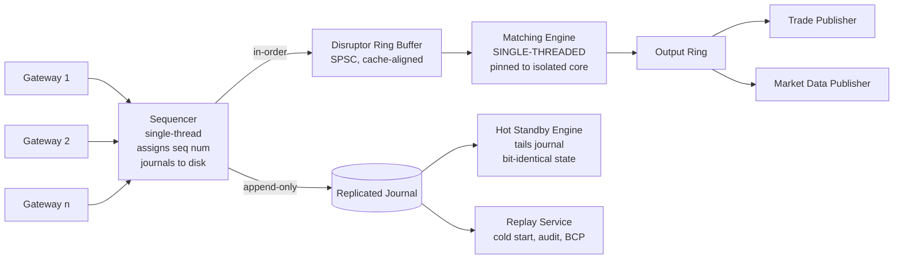

# Matching Engine Determinism — Single-Threaded Design and Bit-Identical Replay

**Date:** 2026-04-30 | **Updated:** 2026-04-30
**Tags:** `system-design` `deep-dive` `fintech` `low-latency` `determinism`

> **Parent case study:** [Design an Online Stock Exchange](../design-stock-exchange.md). This deep-dive expands "Matching Engine Determinism".

## Table of Contents

- [Summary](#summary)
- [Overview — One Thread, One Core, One Truth](#overview--one-thread-one-core-one-truth)
- [Why Determinism Beats Parallelism](#why-determinism-beats-parallelism)
- [Single-Threaded Matching from a Sequenced Input](#single-threaded-matching-from-a-sequenced-input)
- [Why Locks and Atomics Are Banned on the Hot Path](#why-locks-and-atomics-are-banned-on-the-hot-path)
- [Mechanical Sympathy — Pinning, isolcpus, nohz_full](#mechanical-sympathy--pinning-isolcpus-nohz_full)
- [Hot Path vs Cold Path Split](#hot-path-vs-cold-path-split)
- [The LMAX Disruptor Pattern](#the-lmax-disruptor-pattern)
- [Symbol Sharding for Horizontal Scale](#symbol-sharding-for-horizontal-scale)
- [Per-Shard Independence and Cross-Symbol Orders](#per-shard-independence-and-cross-symbol-orders)
- [Recovery — Replaying the Journal](#recovery--replaying-the-journal)
- [Snapshot Strategy](#snapshot-strategy)
- [Hot Standby with Deterministic Replay](#hot-standby-with-deterministic-replay)
- [Time Source — Sequencer Stamps, Not Wall Clock](#time-source--sequencer-stamps-not-wall-clock)
- [Worked Example — Two Engines, Same Input, Same Trades](#worked-example--two-engines-same-input-same-trades)
- [Anti-Patterns](#anti-patterns)
- [Related](#related)
- [References](#references)

## Summary

A matching engine is a state machine. Its transition function is `(book, event) → (book', trades)`. If that function is deterministic — same inputs produce the same outputs in the same order — every other property the exchange needs falls into place: byte-identical replay for regulators, fast cold-start from the journal, hot-standby failover with no reconciliation, audit trails that match what actually happened, and a debugging story where bugs reproduce on the first try.

The price of determinism is parallelism. A deterministic matcher for a single symbol runs on **one thread, on one core, with no concurrent access to its state**. Throughput per shard is bounded by what one core can do in a tight loop — typically 1–5 million events per second for a well-engineered C++/Rust/zero-allocation-Java implementation. You scale by **partitioning the universe of symbols** across many engines, not by parallelizing one symbol.

This deep dive expands the **Matching Engine Determinism — Single-Threaded by Design** section of the [Stock Exchange case study](../design-stock-exchange.md). It covers why determinism is the load-bearing property, how single-threaded matching is engineered (LMAX Disruptor pattern, mechanical sympathy, kernel tuning), how recovery and hot-standby work without reconciliation, and the anti-patterns that break the model — multi-threading the match loop, taking wall-clock timestamps inside the engine, allowing GC pauses on the hot path, or letting administrative actions touch the live book.

## Overview — One Thread, One Core, One Truth



The picture has three loadbearing parts:

1. **The sequencer** establishes total order before the engine. It is the only component that observes wall-clock simultaneity.
2. **The matching engine** is a deterministic function of the sequenced input. It mutates only its own in-memory book and emits trades + book updates to an output ring.
3. **The journal** is the source of truth. Books, standby state, audit feeds, and CAT submissions are all derived from it.

Everything else in the deep dive — locks, kernel tuning, sharding, snapshots, time source — is in service of preserving this property: **input log → engine → output is a pure function**, repeatable on any compatible binary, indistinguishable run-to-run.

## Why Determinism Beats Parallelism

The intuitive engineer's reaction to "1 million orders per second" is "parallelize the match." That intuition is wrong for an exchange, and the reasons are structural rather than tactical.

### Regulators require byte-identical replay

The SEC's Consolidated Audit Trail (CAT) ingests every order lifecycle event from every exchange and broker. When a regulator opens an inquiry — a market manipulation suspicion, a flash-crash post-mortem, a customer dispute — they want to know exactly what the exchange decided and why. "We can replay this session and produce the same trades" is the only acceptable answer. Anything less is operational malpractice.

A non-deterministic matcher cannot honor this. If two threads race to lock the AAPL book and the resulting trade prices depend on lock acquisition order, you cannot prove what would happen on replay. You will have an explanation, not a reproduction.

### Audit equals the journal

The exchange's audit trail is the input journal, not a separate side-log. Saying "the journal is the law" only works if the engine is a pure function of the journal. With non-determinism, the engine's state at any moment is journal + memory-model effects + scheduler decisions + GC timing — none of which are observable, and none of which are reproducible.

### Recovery becomes trivial

Cold-start a matching engine: replay the journal from the start of session, fast-forward the book, attach to the live tail. No reconciliation, no diff, no two-phase commit with a database. If the engine is deterministic, the replayed book is identical to the book that crashed.

A non-deterministic engine cannot be cold-started this way. You would need to checkpoint internal state (lock acquisition order, scheduler state, atomic counters) — which is impossible to do exactly — or accept that the recovered book might differ from the pre-crash book. Neither is acceptable.

### Debugging becomes possible

A bug in a non-deterministic system is a heisenbug. It may appear once and never again, or only under specific contention patterns. A bug in a deterministic system is a regular bug: replay the input, observe the output, single-step the engine in a debugger if necessary. Most exchange bugs are caught in pre-prod replay against historical journals — a workflow only possible because the engine is deterministic.

### Performance is not actually the trade-off you think

A naive multi-threaded matcher with per-symbol locks runs at ~200K–500K orders/sec/core because of contention overhead. A single-threaded matcher with everything in L1/L2 cache, no atomic operations, no false sharing, runs at 5M+ orders/sec on the same core. **Single-threaded is faster, not slower.** You give up nothing and gain determinism.

The real scaling axis is symbol partitioning: 5,000 listed symbols × 1M events/sec/symbol potential = 5B aggregate events/sec ceiling, far above any actual exchange's load. The engineering question is "how do I make one symbol fast" not "how do I parallelize one symbol."

## Single-Threaded Matching from a Sequenced Input

The matching loop is conceptually trivial. The discipline is keeping it that way under production pressure.

```text
# Pseudocode — matching engine main loop
# Runs on one pinned core, fed by a single-producer ring buffer.

procedure match_loop(book, in_ring, out_ring):
    while true:
        event = in_ring.consume_next()           # spin-wait or futex-wake; no lock
        case event.type:
            NEW:
                trades = apply_new(book, event)
                for t in trades:
                    out_ring.publish(TradeMsg(t))
                out_ring.publish(BookUpdate(event.symbol, book.top_levels()))

            CANCEL:
                ok = apply_cancel(book, event)
                out_ring.publish(CancelAck(event.client_order_id, ok))
                if ok:
                    out_ring.publish(BookUpdate(event.symbol, book.top_levels()))

            REPLACE:
                trades, ok = apply_replace(book, event)
                out_ring.publish(ReplaceAck(event.client_order_id, ok))
                for t in trades:
                    out_ring.publish(TradeMsg(t))
                out_ring.publish(BookUpdate(event.symbol, book.top_levels()))

            HALT:
                book.state = HALTED
                out_ring.publish(HaltMsg(event.symbol, event.reason))

            RESUME:
                book.state = ACTIVE
                out_ring.publish(ResumeMsg(event.symbol))

            SNAPSHOT_REQUEST:
                # Cold-path: snapshot the book to a side queue for an
                # asynchronous serializer; the loop itself does not block on disk I/O.
                snap = book.copy_metadata()
                snapshot_queue.publish(snap)
```

What this loop does not do is as important as what it does:

- **No malloc.** All `Order` and `PriceLevel` structs come from pre-allocated pools.
- **No system calls.** Disk I/O happens upstream (sequencer journal) and downstream (output ring consumers); the loop itself runs in user-space.
- **No locks, no atomics on shared data.** The ring buffer's hand-off is the only synchronization point, and it uses cache-line-aligned counters with memory-fence ordering — not locks.
- **No allocation-triggering operations.** No string formatting, no logging that allocates, no map resize.
- **No floating-point.** Prices and quantities are fixed-point integers.
- **No wall-clock reads.** Timestamps come from the sequencer event itself.

Every one of these "nots" exists because every one of them, when violated, has historically caused production incidents at exchanges. The matching loop is a museum of negative lessons.

## Why Locks and Atomics Are Banned on the Hot Path

Even outside multi-threading, the cost of synchronization primitives on a tight inner loop is brutal.

### The cost of a contended lock

A single uncontended atomic compare-and-swap on x86 is ~10 ns. Under contention — even just two cores fighting for the same cache line — that balloons to 100–500 ns because the cache line bounces between cores via the inter-core interconnect. On a 5 µs match operation, a single contended atomic costs 2–10% of the budget. A few of them and the budget is destroyed.

### False sharing

Two unrelated atomics that happen to share a 64-byte cache line will contend even though they are conceptually independent. The fix is **cache-line padding**: every atomic counter (head index, tail index of a ring buffer) gets its own cache line, with explicit padding bytes around it.

```java
// Java cache-line-padded sequence counter (LMAX Disruptor pattern).
// 64-byte cache line; long is 8 bytes; pad with 7 longs on each side
// to ensure neighboring fields cannot share this line.
public final class PaddedSequence {
    // pre-padding (left)
    private long p1, p2, p3, p4, p5, p6, p7;

    private volatile long value = -1L;

    // post-padding (right)
    private long p8, p9, p10, p11, p12, p13, p14;

    public long get()                 { return value; }
    public void set(long v)           { value = v; }
    public boolean compareAndSet(long expected, long updated) {
        return UNSAFE.compareAndSwapLong(this, VALUE_OFFSET, expected, updated);
    }

    private static final sun.misc.Unsafe UNSAFE = /* ... */;
    private static final long VALUE_OFFSET;
    static {
        try {
            VALUE_OFFSET = UNSAFE.objectFieldOffset(
                PaddedSequence.class.getDeclaredField("value"));
        } catch (Exception e) { throw new Error(e); }
    }
}
```

The C++ equivalent uses `alignas(64)` and `std::atomic<int64_t>`; the Rust version uses `#[repr(align(64))]`. The principle is the same: every line-shared variable gets its own cache line.

### NUMA effects

On a multi-socket server, memory reads from a remote socket's RAM cost 2–3x more than local-socket reads. If the matching engine runs on socket 0 but its book happens to be allocated on socket 1's memory, every operation pays the NUMA penalty silently. The fix is **explicit NUMA pinning** — bind the engine thread to a core, bind the memory allocation to the same NUMA node, and verify with `numactl --hardware` and `numastat`.

### What replaces locks

A single-threaded engine fed by a ring buffer needs zero locks for its state. The ring buffer's producer-consumer hand-off uses **memory fences** (loads and stores with acquire/release semantics) on a single shared sequence counter. The producer publishes by storing-with-release; the consumer observes by loading-with-acquire. Both fit in the CPU's existing memory model — no kernel involvement, no atomic RMW operations on the hot path.

## Mechanical Sympathy — Pinning, isolcpus, nohz_full

The matching engine cannot just be "a fast process." The OS must be configured to let it run uninterrupted.

### CPU pinning

The engine thread is bound to one specific core with `pthread_setaffinity_np` (or `taskset`). The core never runs anything else. This is mandatory for cache locality — moving the thread between cores invalidates L1 and L2 caches, costing thousands of cycles to re-warm.

### Isolated CPUs (isolcpus)

The Linux boot parameter `isolcpus=2,3,4,5` removes those cores from the scheduler's general pool. Nothing runs on them unless explicitly pinned. No kernel housekeeping threads, no `kworker`s, no other user processes. The engine has the core to itself.

### Tickless kernel (nohz_full)

By default Linux delivers a periodic timer interrupt to every core, even idle ones (HZ=1000 means every 1 ms). On an isolated core running a tight loop, that interrupt is pure jitter — it preempts the engine for tens of microseconds at a deterministic frequency. `nohz_full=2,3,4,5` disables the periodic tick on those cores, leaving them genuinely undisturbed when only one task is runnable.

### IRQ affinity

Network interrupts default to core 0. Move them to a non-isolated core with `/proc/irq/<N>/smp_affinity`. The matching engine's core never sees a hardware interrupt.

### Other tweaks

- **Disable hyperthreading** on engine cores (or run only one thread per physical core). The sibling thread shares L1 cache and will pollute it.
- **Disable CPU frequency scaling** (`cpupower frequency-set -g performance`). The engine runs at fixed clock — frequency transitions cost microseconds.
- **Pre-fault the heap** — touch every page at startup so the first runtime access doesn't trigger a page fault.
- **mlock the JVM heap** (or equivalent in C++/Rust) to prevent swap-out.

The full kernel-tuning recipe is documented in the Linux kernel parameters reference. See [Linux kernel-parameters.txt](https://www.kernel.org/doc/html/latest/admin-guide/kernel-parameters.html). What looks like obscure boot-time arcana is in fact directly responsible for the latency floor of every modern exchange.

## Hot Path vs Cold Path Split

The matching loop is the hot path. Everything else is the cold path. They live in different threads, different processes, often different machines.

| Concern | Hot path | Cold path |
|---|---|---|
| Match orders | yes | — |
| Apply cancels / replaces | yes | — |
| Emit trades and book updates | yes | — |
| Process HALT/RESUME events from sequencer | yes | — |
| Snapshot book to disk | — | yes |
| Persist trades to database | — | yes (journal-consumer thread) |
| Generate end-of-day reports | — | yes |
| Recompute risk limits | — | yes |
| Send drop copies | — | yes |
| Build CAT submission | — | yes (overnight batch) |
| Restart member sessions | — | yes (gateway, separate process) |
| Update in-memory configuration | — | yes (versioned snapshot, swap on event) |

The split is enforced architecturally: the hot path can only emit events to the cold path via a one-way ring buffer. The cold path can only influence the hot path via events flowing through the sequencer (e.g., a HALT message). There is no shared mutable state, no callback, no synchronous RPC.

This is also why **administrative actions go through the sequencer**. Halting AAPL is not "find the AAPL engine and call halt() on it." It is "publish a HALT event for AAPL into the sequencer; it is journaled like any order; the engine processes it in sequence." Halts replay deterministically; halts are auditable; halts cannot race with order events because they are events.

## The LMAX Disruptor Pattern

The LMAX Exchange's Disruptor pattern, published in 2010 and described in detail by [Martin Fowler](https://martinfowler.com/articles/lmax.html), formalized many of the techniques above. The Disruptor itself is a ring-buffer-based queue, but the bigger contribution is the architectural pattern: **single-threaded business logic processing events from a lock-free ring, with mechanical sympathy at every layer**.

### Ring buffer mechanics

The ring buffer is a fixed-size array of pre-allocated event slots. Producers and consumers track their progress via cache-line-padded sequence counters. The ring is sized to a power of two so modulo arithmetic becomes a bitmask.

```cpp
// C++ single-producer / single-consumer ring buffer with cache-line padding.
// Size must be power of two. No allocations after construction.

#include <atomic>
#include <array>
#include <cstdint>

constexpr size_t CACHE_LINE = 64;

template <typename T, size_t N>
class SpscRing {
    static_assert((N & (N - 1)) == 0, "N must be power of two");
    static constexpr size_t MASK = N - 1;

    // Pre-allocated slot storage; never reallocated.
    alignas(CACHE_LINE) std::array<T, N> slots_;

    // Producer-only counter on its own cache line.
    alignas(CACHE_LINE) std::atomic<uint64_t> head_{0};
    char pad1_[CACHE_LINE - sizeof(std::atomic<uint64_t>)];

    // Consumer-only counter on its own cache line.
    alignas(CACHE_LINE) std::atomic<uint64_t> tail_{0};
    char pad2_[CACHE_LINE - sizeof(std::atomic<uint64_t>)];

  public:
    // Producer: write event into next slot.
    // Returns false if the ring is full (consumer is too slow).
    bool publish(const T& event) noexcept {
        uint64_t h = head_.load(std::memory_order_relaxed);
        uint64_t t = tail_.load(std::memory_order_acquire);
        if (h - t >= N) return false;             // full
        slots_[h & MASK] = event;                 // pre-allocated slot
        head_.store(h + 1, std::memory_order_release);
        return true;
    }

    // Consumer: read next event.
    // Returns false if no event is available.
    bool consume(T& out) noexcept {
        uint64_t t = tail_.load(std::memory_order_relaxed);
        uint64_t h = head_.load(std::memory_order_acquire);
        if (t == h) return false;                 // empty
        out = slots_[t & MASK];
        tail_.store(t + 1, std::memory_order_release);
        return true;
    }
};
```

Two things to notice. First, `head_` and `tail_` each get their own cache line, eliminating false sharing between producer and consumer. Second, the slot storage `slots_` is a fixed array — the producer writes into a pre-allocated slot rather than allocating a new event object. This keeps the hot path allocation-free.

### Single producer, single consumer per stage

The Disruptor is most efficient at SPSC. Multi-producer rings exist (with a CAS on the head counter), but for the matching engine the canonical setup is:

- **N gateway threads → MPSC ring → sequencer thread.** Sequencer is single-consumer; it picks events in the order producers offered them, assigns sequence numbers, journals.
- **Sequencer → SPSC ring → matching engine.** One producer (the sequencer), one consumer (the engine).
- **Matching engine → SPSC ring → trade publisher / market data publisher.** Output rings, fan-out to multiple downstream consumers each with their own SPSC ring or an MPMC ring.

Each stage is single-threaded. Stages communicate via rings. There is no shared mutable state across stages.

### Disruptor in Java

The original Disruptor is a Java library ([`com.lmax.disruptor`](https://lmax-exchange.github.io/disruptor/disruptor.html)). On the JVM, you must additionally fight garbage collection — the matching engine cannot afford a stop-the-world pause. The LMAX recipe:

- Pre-allocate everything. No `new` on the hot path. Object pools for orders, price levels, and event records.
- Use ZGC or Shenandoah (sub-millisecond pause GCs) in modern JVMs, or tune G1 to never run on the engine core.
- Prefer primitive arrays and primitive-typed collections (Trove, Eclipse Collections) over boxed `Long`/`Integer`.
- Pin the JVM compiler threads, GC threads, and safepoint workers off the engine cores.

Aleksey Shipilëv's [JVM Anatomy Quarks](https://shipilev.net/jvm/anatomy-quarks/1-lock-coarsening/) series goes deep on the JVM-side details.

### Aeron messaging

[Aeron](https://github.com/real-logic/aeron) (from Real Logic, the same team behind LMAX) extends the Disruptor philosophy to network messaging. Same principles: pre-allocated buffers, lock-free ring backing, cache-line awareness. Aeron over UDP or shared memory is what carries events between the sequencer, engine, and publishers in many production exchanges.

## Symbol Sharding for Horizontal Scale

One core, one symbol — that is the unit of scale. With 5,000 listed symbols, you have 5,000 logical shards. The deployment question is how to map them to physical cores.

### Shard-per-symbol vs hash-based shards

- **Shard-per-symbol.** Each symbol gets a dedicated engine. Maximally simple. Wastes capacity on cold symbols; under-resourced for hot symbols.
- **Hash-based shards.** N engines, each holding a deterministic hash partition of symbols. A common choice is N = 32 or 64 across a few servers, with each engine holding 100–200 symbols. Re-sharding requires care (state migration), so the partitioning is usually fixed for the trading day.
- **Hot symbols dedicated, tail symbols pooled.** SPY, QQQ, AAPL get their own engines; the remaining 4,000+ symbols are pooled into a few hash-shard engines.

The right answer depends on the symbol-load distribution. In US equities the top 100 symbols carry roughly half the order volume, so dedicating cores to them and pooling the tail is the typical compromise.

### Skew handling

A single mega-active symbol (SPY, the S&P 500 ETF) can saturate one core. Two patterns:

- **Sub-shard by price band.** Two engines for SPY: one for the "top of book" levels (within 0.5% of last trade), one for the "deep book." Most events hit the top engine; deep-book events are rarer. Trades that cross from deep to top require a coordination protocol — typically resolved by routing the entire book through one engine and accepting the cap, or by sub-sharding only the cancel stream while keeping fills in one engine.
- **Sub-shard by order type.** Aggressive (marketable) orders on engine A; passive resting orders on engine B. Less common; the coordination is harder.

In practice, exchanges accept that one engine = one symbol's natural ceiling and engineer that one engine to be as fast as possible (5M+ events/sec) rather than splitting it.

### Cross-shard publish

Each engine produces a private trade stream. The market-data publisher reads from all engines' output rings and merges them into a single multicast feed (or one feed per symbol group). The merge is a pure tee: the publisher stamps each event with a shard-relative sequence number and a publisher-relative sequence number, broadcasts, and moves on. No reordering across shards — events from different symbols are independent and can interleave freely.

## Per-Shard Independence and Cross-Symbol Orders

The argument for sharding rests on **per-symbol independence**: a trade in AAPL does not depend on the AAPL book. Inside the engine that means the AAPL book's state is updated only by AAPL events; no synchronization with MSFT engine is needed.

This is true for vanilla single-symbol orders. It breaks for **cross-symbol orders**:

- **Basket trades.** "Buy 100 shares each of AAPL, MSFT, GOOG, atomically." Either all three legs execute or none do.
- **Pairs trades.** "Buy 100 AAPL and short 100 MSFT, atomically." Hedge desks rely on this for delta-neutral entries.
- **Spread trades** (in derivatives). "Buy the Dec future and sell the Mar future as a single transaction."

If the matching engine were responsible for atomicity across shards, the per-shard independence would be lost — every cross-symbol order would require a distributed transaction across engines, with all the latency and complexity that implies.

**The pattern: solve cross-symbol atomicity at the gateway, not at the engine.**

The gateway accepts the basket order, computes the worst-case fill quantities and prices for each leg, places **child orders** on each leg's engine in a rapid sequence, and watches the fills as they come back. If any leg fails to fill (insufficient liquidity, halted symbol), the gateway issues compensating cancels for the other legs. The matching engines see only ordinary single-symbol orders.

This pushes the atomicity guarantee out of the engine and into the gateway, where it can be implemented as a stateful saga with cancel-on-failure. The trade-off is that "atomic" basket trades are not actually atomic — there is a window where one leg has filled and another has not. Most regulated markets accept this; for true atomicity, traders use venues with all-or-none basket order types implemented at the **clearing** layer, not the matching layer.

## Recovery — Replaying the Journal

Cold start is the canonical proof that the engine is deterministic.

```text
# Replay loop pseudocode — cold start an engine from journal.
# Used at session start, or after a crash, or to warm a hot standby,
# or to replay historical sessions for audit / regression testing.

procedure replay(journal_path, snapshot_path = None, target_seq = None):
    book = OrderBook.empty()
    last_seq = 0

    if snapshot_path is not None:
        # Load nearest snapshot to fast-forward; book is restored to the
        # state at snapshot.last_seq.
        snapshot = SnapshotFile.load(snapshot_path)
        book = snapshot.book
        last_seq = snapshot.last_seq

    journal = JournalReader.open(journal_path, start_after = last_seq)

    while event = journal.next():
        if target_seq is not None and event.seq > target_seq:
            break

        # Engine applies the event with NO wall-clock reads, NO randomness,
        # NO external I/O. Output trades are buffered locally and not
        # republished — replay is silent.
        case event.type:
            NEW:      apply_new(book, event)
            CANCEL:   apply_cancel(book, event)
            REPLACE:  apply_replace(book, event)
            HALT:     book.state = HALTED
            RESUME:   book.state = ACTIVE

        last_seq = event.seq

        # Verification: every K events, hash the book and compare against
        # a checksum recorded by the original engine. If they diverge, we
        # have a determinism bug — STOP.
        if last_seq % CHECKPOINT_INTERVAL == 0:
            checksum = book.canonical_hash()
            expected = journal.recorded_checksum_at(last_seq)
            assert checksum == expected, "DETERMINISM BUG"

    return (book, last_seq)
```

The verification step is the secret. If the original engine wrote periodic book hashes into the journal (or to a side stream), the replayer can compare its computed hash against the recorded hash at every checkpoint. Any divergence proves a determinism bug — the replay produced a different book than the live engine. This is how exchange operators discover, in pre-prod, that some "harmless" code change introduced non-determinism.

## Snapshot Strategy

Pure replay from session start works at small scale. At 100M events/day, replaying everything takes minutes — acceptable for cold start at market open, painful for mid-session failover.

The fix is **periodic snapshots**:

| Aspect | Choice |
|---|---|
| Snapshot frequency | Every 30–60 seconds during session |
| Snapshot scope | Per-symbol book + last-applied sequence number |
| Snapshot mechanism | Cold-path thread copies book metadata; serializes to disk async |
| Snapshot retention | Keep last N snapshots; old ones aged out |
| Recovery time | Load latest snapshot + replay journal from `snapshot.last_seq + 1` |

The snapshot thread is **not** the matching thread. It receives a `SNAPSHOT_REQUEST` event through the sequencer; the matching thread, on processing it, copies the book's metadata (price levels, order IDs, quantities) into a side queue and continues. A separate thread (off the engine core) serializes that side queue to disk.

The matching thread does not block on disk I/O. The cost of "copy the book" is bounded — for a typical equity symbol, the live book is a few hundred KB to a few MB; copying it takes tens of microseconds.

The recovery time bound becomes:

```
recovery_time ≈ snapshot_load_time + replay_time(snapshot.last_seq → latest)
              ≈ 100 ms + 60 s × 1M events/sec / replay_rate
              ≈ 100 ms + 60 ms (at 1M event/sec replay)
              ≈ 160 ms
```

Sub-second mid-session failover is achievable with this pattern. The 60-second snapshot interval bounds the replay work to one minute of journal regardless of how long the session has been running.

## Hot Standby with Deterministic Replay

A passive engine running on a different machine consumes the **same input log** as the live engine and maintains a bit-identical book. On primary failure, the standby has nothing to recover — it is already at the live state.

```text
PRIMARY ENGINE                              STANDBY ENGINE
--------------                              --------------
sequencer assigns seq=12345                 (waits for seq=12345 from journal)
journals event to disk                      tails journal, reads seq=12345
applies event, emits trades                 applies event, suppresses trade publish
publishes trades to wire                    keeps book identical to primary
periodically writes book hash               compares its hash to primary's hash;
                                            mismatch → ALARM (determinism bug)
```

Three properties make this work:

1. **Both engines consume the same sequenced input.** No race on which event arrives first. The journal is the synchronization point.
2. **Both engines produce identical output.** Because the matching function is deterministic. The standby's output is suppressed (not published to subscribers), but it exists in memory and can be hash-compared.
3. **Failover is a publication switch.** When primary heartbeat fails, the standby starts publishing its (already-current) output. No state transfer, no resync, no reconciliation. Failover takes as long as it takes to update the publication-routing config — typically tens of milliseconds.

The real production complication is the journal's own availability. If the journal is local to the primary, a primary-side disk failure also takes out the journal. Production deployments use **replicated journals** — Raft-backed or chain-replicated — so that the standby is reading from a quorum-committed log rather than the primary's local disk. See [Sequencer Pattern](./sequencer-pattern.md) for the journal replication details.

### Catch-up after standby restart

If the standby restarts mid-session (planned maintenance, hardware fault), it loads the latest snapshot and replays from there until it catches up to the live tail. During catch-up, it is "warm" but not yet ready to fail over — the failover protocol checks that the standby is within K events of the primary before promoting it.

## Time Source — Sequencer Stamps, Not Wall Clock

The matching engine **never reads the wall clock**. Every timestamp the engine sees comes from the event itself — assigned by the sequencer at ingress and carried through the journal.

Why this matters:

- **NTP jumps.** A clock that drifts and gets corrected by NTP can move backwards. An engine that reads wall-clock for time priority could flip the order of two events that arrived microseconds apart.
- **Different machines have different clocks.** Two engines (primary + standby) running the same input log but reading their own wall clocks would produce different match results — non-determinism.
- **Replay would diverge.** A replay run a year later sees a different wall-clock value than the original session — same input event but a different "time" in the engine's view.
- **Leap seconds.** Smeared, repeated, or skipped depending on the OS configuration. Any of these break a wall-clock-dependent matcher.

The sequencer's timestamp is what the engine treats as authoritative. The sequencer does read wall-clock, exactly once, to stamp the event. From that moment on the timestamp is data, immutable, journaled, and replayable.

For time-priority matching, the **sequence number** is the actual ordering key, not the timestamp. Same-price orders are matched FIFO by arrival into the engine's input queue, which is the same as FIFO by sequence number. The timestamp is metadata for downstream consumers (audit, reporting); it does not feed back into matching decisions.

## Worked Example — Two Engines, Same Input, Same Trades

A concrete scenario to make the property tangible.

**Input log (3 events, AAPL, all at price-tick 18725 = $187.25):**

```
seq=1: NEW   side=BUY  qty=100  client=BrokerA  oid=A1
seq=2: NEW   side=SELL qty=60   client=BrokerB  oid=B1
seq=3: NEW   side=SELL qty=80   client=BrokerC  oid=C1
```

**Initial book state:** empty.

### Engine 1 (live, in NJ datacenter) processes the log:

```
After seq=1: book.bids = [{price=18725, orders=[A1(qty=100)]}], asks = []
After seq=2: trade(A1, B1, qty=60, price=18725); book.bids = [{18725, [A1(qty=40)]}], asks = []
After seq=3: trade(A1, C1, qty=40, price=18725); book.bids = [], asks = [{18725, [C1(qty=40)]}]

Trades emitted (in order):
  T1: buyer=A1, seller=B1, qty=60, price=18725, match_num=100001
  T2: buyer=A1, seller=C1, qty=40, price=18725, match_num=100002
```

### Engine 2 (standby, in CT datacenter) processes the same log:

```
After seq=1: book.bids = [{price=18725, orders=[A1(qty=100)]}], asks = []
After seq=2: trade(A1, B1, qty=60, price=18725); book.bids = [{18725, [A1(qty=40)]}], asks = []
After seq=3: trade(A1, C1, qty=40, price=18725); book.bids = [], asks = [{18725, [C1(qty=40)]}]

Trades emitted (in order):
  T1: buyer=A1, seller=B1, qty=60, price=18725, match_num=100001
  T2: buyer=A1, seller=C1, qty=40, price=18725, match_num=100002
```

The trade records are byte-identical: same buyer, same seller, same quantity, same price, same match number. The book hash after each event is identical. If you serialized both engines' book states to bytes and compared, they would match. **This is what determinism delivers.**

### What it would look like with a bug

Suppose Engine 2 has a subtle non-determinism — say, it reads the wall clock to break ties, while Engine 1 uses the sequence number. With three orders all at the same price-tick:

```
Engine 1 (correct, ties broken by seq num):
  T1: buyer=A1, seller=B1, qty=60   # B1 arrived as seq=2, earlier
  T2: buyer=A1, seller=C1, qty=40   # C1 arrived as seq=3

Engine 2 (buggy, ties broken by wall-clock):
  Wall clock saw C1 before B1 due to NTP drift.
  T1: buyer=A1, seller=C1, qty=80   # C1 fully filled
  T2: buyer=A1, seller=B1, qty=20   # B1 partially filled

Hash mismatch on first event — alarm fires.
```

The standby's hash mismatches the primary at the first checkpoint. Operations sees the alarm, the standby is taken out of rotation, and the bug is investigated before it can fail over to a corrupted state. The hash check is the safety net that catches determinism regressions before they cause bad trades.

## Anti-Patterns

1. **Multi-threaded matching for one symbol.** Looks like a throughput win; destroys determinism, makes replay impossible, and the lock contention costs more than the parallelism gains. Shard by symbol instead.
2. **Per-order locks on the order book.** Even fine-grained locking introduces non-determinism via lock-acquisition order, plus 25–100 ns per acquire times millions of acquires per second. The book is single-threaded; locks are unnecessary.
3. **Wall-clock timestamps inside the match logic.** Time priority must come from the sequence number. Reading `clock_gettime` in the hot path introduces NTP-drift bugs, replay divergence, and per-machine non-determinism.
4. **GC on the hot path.** A 100 ms stop-the-world pause is 20,000 missed match opportunities at 5M events/sec. The Java engine must use ZGC or Shenandoah, pre-allocate everything, and run with `-Xms == -Xmx` and pinned GC threads.
5. **Floating-point arithmetic for prices or quantities.** `0.1 + 0.2 != 0.3` in IEEE 754. Use integer ticks. A floating-point bug in a matching engine is millions of dollars and a regulatory enforcement action.
6. **Mutable global state shared with non-engine code.** A config table that the engine reads on every event and the cold-path occasionally writes is a race condition waiting to happen. Configuration is event-versioned: changes flow through the sequencer like any other event.
7. **Synchronous database calls from the engine.** Every `INSERT INTO trades` on the hot path adds milliseconds of disk I/O. Trades are written to the journal (which is the durable record) and asynchronously consumed into the trade database by a cold-path thread.
8. **Allocations on the hot path.** Every `new Order()` is a potential GC trigger and a cache miss. Use object pools sized to worst-case book depth.
9. **Logging that allocates.** `String.format("Trade %s @ %f x %d", ...)` allocates on every call. Use pre-formatted log templates with primitive parameters, or log structured binary records to a side ring and format off-thread.
10. **Snapshots taken on the matching thread.** Serializing the book to disk takes milliseconds; the engine must not block. Snapshot copies live in a side queue serialized by a cold-path thread.
11. **Administrative actions outside the sequencer.** "Halt AAPL" implemented as a gRPC call to the engine bypasses the journal — the halt cannot be replayed, cannot be audited, and races with order events. All admin actions are events.
12. **Cross-shard transactions in the engine.** Atomic basket trades across symbols belong at the gateway as a saga, not in the engine as a 2PC. The engine sees only single-symbol events.
13. **Hot-standby state-transfer on failover.** If the standby has to receive state from the primary at failover time, you have not built a deterministic system. The standby runs the same input log; its state is already correct. Failover is a publication-routing flip, not a state copy.
14. **Trusting the average match latency.** A p50 of 5 µs is meaningless if the p99 is 5 ms because of GC. The matching engine must hit its tail target, not its average. Use HdrHistogram and look at p99.99.
15. **Not verifying the standby's hash against the primary's.** If you do not periodically compare the two engines' book hashes, you do not actually know they are deterministic. The hash check is the proof.

## Related

- [Order Book Data Structure — Price Levels and FIFO at Price](./order-book-data-structure.md) — the in-memory data structure the deterministic engine operates on. Intrusive linked lists, sorted price-level maps, ID hash maps for O(1) cancel.
- [Sequencer Pattern — Total Ordering Before the Engine](./sequencer-pattern.md) — the component that establishes the input log the matching engine consumes deterministically.
- [Audit, Replay, and Regulatory Feeds (CAT / OATS)](./audit-replay-regulatory-feeds.md) — the regulatory motivation for byte-identical replay and the pipeline that turns the journal into CAT submissions.
- [Design an Online Stock Exchange (parent case study)](../design-stock-exchange.md) — the full system design this deep dive expands.
- [Performance Budgets and Latency Analysis](../../../performance-observability/performance-budgets.md) — the discipline of decomposing tight latency budgets across hops; the matching engine is one such hop.
- [Disaster Recovery](../../../reliability/disaster-recovery.md) — hot-standby patterns, RPO/RTO targets, and journal replication strategies that apply to exchange-grade engines.

## References

- LMAX Disruptor — Concurrent Programming Framework. <https://lmax-exchange.github.io/disruptor/disruptor.html> — the canonical ring-buffer implementation, including cache-line padding, sequence-counter design, and producer/consumer wait strategies.
- Martin Fowler. *The LMAX Architecture*. <https://martinfowler.com/articles/lmax.html> — the seminal description of single-threaded business logic with a Disruptor ring buffer in front; widely considered the reference architecture for deterministic high-throughput systems.
- Aeron messaging — Real Logic. <https://github.com/real-logic/aeron> — efficient, reliable UDP and IPC messaging with the same mechanical-sympathy principles as the Disruptor; widely deployed in financial exchanges.
- Linux kernel parameters reference (`isolcpus`, `nohz_full`, `rcu_nocbs`). <https://www.kernel.org/doc/html/latest/admin-guide/kernel-parameters.html> — the boot-time options that isolate CPUs from the scheduler and disable periodic timer ticks on dedicated cores.
- Brendan Gregg. *CPU Performance*. <https://www.brendangregg.com/perf.html> — comprehensive resource on Linux performance tuning, including CPU pinning, NUMA, perf events, and flame graphs.
- Aleksey Shipilëv. *JVM Anatomy Quark #1: Lock Coarsening*. <https://shipilev.net/jvm/anatomy-quarks/1-lock-coarsening/> — JVM-level details that affect any matching engine written in Java; the broader Quarks series covers GC, memory model, allocation, and JIT effects relevant to low-latency JVM code.
- Mike Barker (LMAX). *Mechanical Sympathy*. <https://mechanical-sympathy.blogspot.com/> — the blog that codified the term; cache-line layouts, branch prediction, false sharing, and the principles behind the Disruptor.
- CME Group. *Globex* architecture overview. <https://www.cmegroup.com/globex.html> — production-scale derivatives exchange platform; reference for symbol-sharded, deterministic matching at exchange scale.
