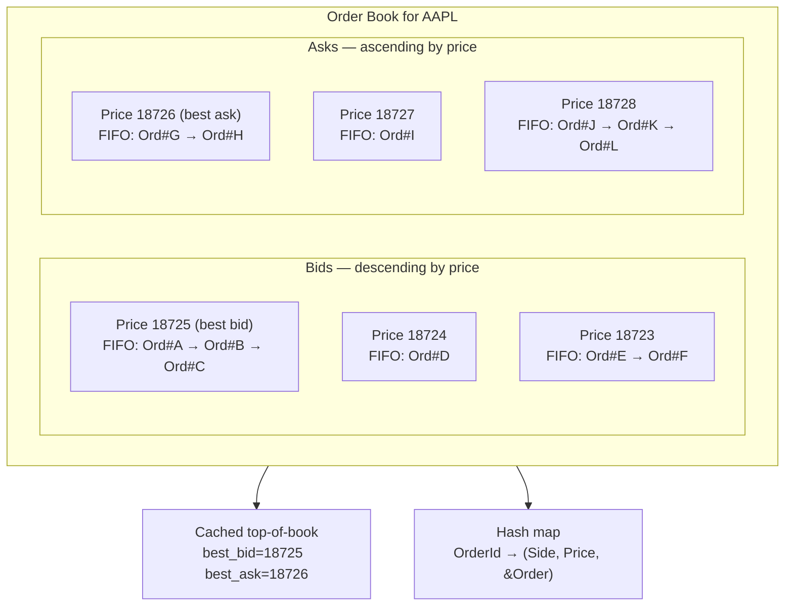
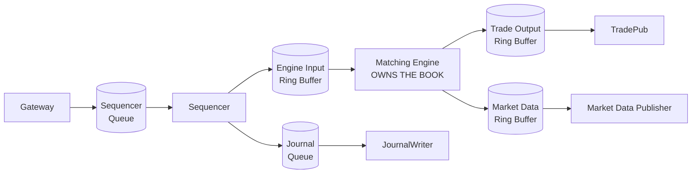

# Order Book Data Structure — Price Levels, FIFO at Price, and Cache Locality

**Date:** 2026-04-30 | **Updated:** 2026-04-30
**Tags:** `system-design` `deep-dive` `fintech` `low-latency` `data-structures`

> **Parent case study:** [Design an Online Stock Exchange](../design-stock-exchange.md). This deep-dive expands "Order Book Data Structure".

## Table of Contents

- [Summary](#summary)
- [Overview](#overview)
- [Price-Time Priority — The Two-Key Sort](#price-time-priority--the-two-key-sort)
- [The Sorted-Dictionary-of-FIFO-Queues Shape](#the-sorted-dictionary-of-fifo-queues-shape)
- [Choosing the Sorted Structure: RB-Tree vs Skip List vs Array](#choosing-the-sorted-structure-rb-tree-vs-skip-list-vs-array)
- [Intrusive Doubly-Linked List per Price Level](#intrusive-doubly-linked-list-per-price-level)
- [Top-of-Book Caching](#top-of-book-caching)
- [Cache Locality and Memory Layout](#cache-locality-and-memory-layout)
- [Arena Allocation and Object Pools](#arena-allocation-and-object-pools)
- [Order ID Index for O(1) Cancel and Modify](#order-id-index-for-o1-cancel-and-modify)
- [Tick Size and Integer Price Normalization](#tick-size-and-integer-price-normalization)
- [Iceberg / Hidden Orders — Display vs Total Quantity](#iceberg--hidden-orders--display-vs-total-quantity)
- [Aggregating Depth: Top-N Snapshot vs Full L3](#aggregating-depth-top-n-snapshot-vs-full-l3)
- [Concurrency Model — One Thread Owns the Book](#concurrency-model--one-thread-owns-the-book)
- [Worked Example: Five Orders, Partial Fills, Mid-Queue Cancel](#worked-example-five-orders-partial-fills-mid-queue-cancel)
- [Anti-Patterns](#anti-patterns)
- [Related](#related)
- [References](#references)

## Summary

The order book is the matching engine's central data structure: a **sorted dictionary keyed by price** where each value is a **FIFO queue of orders** at that price. Price-time priority — best price wins, ties broken by arrival order — is encoded directly in the layout: the sorted structure gives best-price access, the per-level doubly-linked list gives time priority and O(1) push/pop. Around that core sit four supporting structures: a hash map from order ID to in-list pointer for O(1) cancel, a cached top-of-book pair for O(1) best-bid/ask reads, an arena allocator that pre-allocates fixed-size order objects to avoid `malloc` on the hot path, and integer tick offsets that eliminate floating-point comparisons. Every operation is single-threaded by design — the matching engine owns the book exclusively, and other threads communicate via message-passing queues. This deep-dive covers the data structure choices, their cache and memory behavior at microsecond scale, and the anti-patterns that destroy determinism or latency when these constraints are not respected.

## Overview

The parent case study (`../design-stock-exchange.md`) introduces the order book as a building block sitting at the heart of the matching engine. This document opens that block.

The questions answered here:

1. **Why is the book a sorted dictionary of FIFO queues, and not something else?** What price-time priority forces.
2. **Which sorted structure should you pick?** Red-black tree vs skip list vs flat array — and why LMAX, CME, and Nasdaq all chose differently.
3. **How is the per-price-level FIFO actually implemented?** Intrusive doubly-linked lists, why "intrusive", and how to cancel in O(1).
4. **Why does cache locality dominate matching latency at microsecond scale?** Cold misses cost 80–120 ns each; that is 1–2% of your entire 5-µs budget per miss.
5. **How do you avoid `malloc` on the hot path?** Arena allocators and object pools sized to worst-case book depth.
6. **Why integer ticks, not floating-point dollars?** Determinism, byte-equality of replays, and avoiding `0.1 + 0.2 != 0.3` bugs.
7. **What does an iceberg order look like in the book?** Display quantity vs total quantity, with refresh logic on each fill.
8. **How does the engine emit depth feeds?** Top-N for L1/L2, every order event for L3.
9. **Who is allowed to touch the book?** Exactly one thread; everyone else passes messages.



The general performance discipline (latency budget per microservice hop, instrumentation) lives in [`../../../performance-observability/performance-budgets.md`](../../../performance-observability/performance-budgets.md); this doc is specifically about the in-memory data structure that occupies the smallest, tightest part of that budget.

## Price-Time Priority — The Two-Key Sort

Every regulated equity exchange in the US (and most globally) matches orders by **price-time priority**:

1. **Best price first.** A buyer at $187.26 takes precedence over a buyer at $187.25; a seller at $187.25 takes precedence over a seller at $187.26.
2. **Among orders at the same price, oldest first.** If two buyers are both bidding $187.25, the one that arrived earlier gets filled first when a seller crosses.

This is not a soft preference. It is a regulatory commitment to fairness — Reg NMS in the US, MiFID II in the EU. A matching engine that violates price-time priority is not just buggy; it is illegal. Any data-structure choice that compromises the ordering must be rejected.

The two-key sort produces the canonical shape:

```text
sort orders by (price, arrival_sequence)

  best price first   →   first to fill
  same price, oldest →   first to fill
```

Translated into a data structure: the outer key is price (sorted), the inner key is arrival sequence (FIFO). Any structure that gets you both — sorted-by-price access plus FIFO-within-price — is acceptable. The standard answer is a **sorted map of price levels**, where each level holds a **queue of orders in arrival order**.

Time priority is not encoded as a wall-clock timestamp. It is encoded as **position in the per-level FIFO**: the head of the list is, by construction, the oldest order at that price. This avoids any dependency on clock synchronization or timestamp resolution. Two orders that arrive within the same nanosecond are still ordered by the sequence number assigned by the sequencer (see the parent doc) and pushed to the back of the queue in that order.

## The Sorted-Dictionary-of-FIFO-Queues Shape

The book is conceptually:

```text
OrderBook {
  bids: SortedMap<Price desc, PriceLevel>     # best bid first
  asks: SortedMap<Price asc,  PriceLevel>     # best ask first
  by_id: HashMap<OrderId, OrderRef>           # for O(1) cancel
  best_bid: Price | NONE                      # cached top-of-book
  best_ask: Price | NONE
}

PriceLevel {
  price:      i32                              # tick offset, integer
  total_qty:  u64                              # sum of qty_open across orders
  num_orders: u32
  orders:     IntrusiveDoublyLinkedList<Order> # FIFO; head = oldest
}

Order {
  id:           u64                            # exchange-assigned unique
  side:         Side
  price:        i32                            # tick offset
  qty_open:     u32
  qty_filled:  u32
  qty_total:    u32                            # for icebergs; equals qty_open for normal
  display_qty:  u32                            # iceberg display, or qty_open for normal
  ts_seq:       u64                            # sequencer-assigned sequence
  prev, next:   *Order                         # intrusive list pointers
  level:        *PriceLevel                    # back-pointer for O(1) operations
}
```

The five hot operations and their target complexity:

| Operation | Frequency | Required cost |
|---|---|---|
| Insert at price level | Highest (every limit order) | O(log P) for new level, O(1) push if level exists |
| Cancel by ID | High | O(1) lookup + O(1) unlink |
| Match aggressor against best level | High (every crossing order) | O(1) per fill at the head of the queue |
| Read best bid / best ask | Every event | O(1) cached |
| Iterate top-N levels | Per market-data emission | O(N) starting from best |

The sorted structure handles the price axis. The intrusive linked list handles the time axis. The hash map turns "cancel order id 718" from "scan the whole book" into "follow two pointers." The cached top-of-book turns "what's the best bid" from "tree-min" into a register read.

## Choosing the Sorted Structure: RB-Tree vs Skip List vs Array

There are three realistic choices for the sorted-by-price container, with very different real-world performance profiles. Each major venue has converged on a different one based on its specific workload.

### Red-Black Tree (or `std::map`)

The textbook answer. Self-balancing binary search tree, O(log P) for all ops. `std::map<Price, PriceLevel>` in C++ or `TreeMap<Integer, PriceLevel>` in Java is the easy default.

| Pros | Cons |
|---|---|
| O(log P) guaranteed | Pointer-chasing cache misses on every traversal |
| Library support everywhere | `std::map` allocates each node separately → fragmented memory |
| Iterator stability under insert/delete | log P cache misses per op (worst case) at P ≈ 1000 levels |

A naive `std::map<int, PriceLevel>` is the **wrong** answer for a hot exchange because the default allocator places nodes wherever heap fragmentation puts them. A traversal walks pointers across 4 KB pages — every step is potentially a cache miss. At ~80 ns per L3 miss, traversing a 10-deep RB-tree path costs 800 ns, which is most of your matching budget.

The fix: a custom node pool / arena allocator that keeps tree nodes contiguous. `boost::container::flat_map` (a sorted vector) goes further and gives binary search + cache-line-friendly contiguous storage. For books with stable, narrow price ranges, this is excellent.

### Skip List

A probabilistic ordered structure with O(log P) expected. Each node has a randomized tower of forward pointers; lookup descends from top.

| Pros | Cons |
|---|---|
| Simpler concurrent variants exist (rarely needed for single-thread book) | Probabilistic guarantee, not worst-case |
| Easy to implement with a custom allocator | Pointer-heavy — same cache-miss exposure as RB-tree |
| Good range-scan performance (top-N depth iteration) | More memory per node (multiple pointers) |

Skip lists shine in concurrent contexts ([`../../../data-structures/skip-lists.md`](../../../data-structures/skip-lists.md)), but matching engine books are single-threaded, so the concurrency advantage doesn't apply. Some Java-based exchanges still pick `ConcurrentSkipListMap` for the book, but typically only because it's ergonomic in the JDK's standard library — not because of concurrency benefits at the book level.

### Flat Array of Price Levels (Tick-Indexed)

The LMAX-style approach: pre-allocate a fixed-size `Vec<PriceLevel>` indexed by `tick - tick_min`. Best bid is the highest occupied index in the bid array; best ask is the lowest in the ask array.

```text
bid_levels: [PriceLevel; MAX_TICKS]   # index 0 = lowest price
ask_levels: [PriceLevel; MAX_TICKS]
best_bid_idx: i32                      # max occupied bid index (or -1)
best_ask_idx: i32                      # min occupied ask index (or MAX_TICKS)
```

| Pros | Cons |
|---|---|
| O(1) insert at known price | Wastes memory for sparse price ranges |
| Best-price update is a small linear scan from the cached pointer | Requires bounded tick range (impractical for very wide-range instruments) |
| Cache-friendly: levels are contiguous | Must shift the window if instrument's price moves outside range |
| No pointer chasing on insert | Cold scan after a far-away print can be 50–200 levels |

LMAX uses this layout for liquid instruments where the tick range is bounded and the active band is narrow. For an equity at $187 with $0.01 ticks and a typical 1% intraday range, a window of 5,000 ticks costs ~5,000 × sizeof(PriceLevel) ≈ a few hundred KB — fits in L2 cache, all-resident. The flat layout's cache locality is irreplaceable.

For instruments with wider price ranges or sparse activity (low-priced penny stocks, options strikes), the array becomes wasteful and a tree or hybrid is used.

### CME's Approach: Doubly-Linked List per Price Level

CME's matching engine uses doubly-linked lists at the price level for the FIFO queue (the universal choice) and an intrusive sorted list of price levels rather than a tree. Insert into the price-level list is O(P) in the worst case but cache-friendly, and the typical book has a hot band of 10–30 levels, so insert is effectively constant. The trade-off is "linear-scan to find the price level" — fine because the cached top-of-book pointer means most matching reads start at the head and never traverse.

### The Selection Heuristic

| Workload | Pick |
|---|---|
| Bounded tick range, dense activity (LMAX, futures) | Flat array of price levels |
| Wide range, sparse activity, level count up to a few hundred | RB-tree with arena allocator |
| Hot band narrow with occasional far prints | Hybrid: array for hot band, tree for cold prices |
| Java JDK with ergonomics priority | ConcurrentSkipListMap (accept the hit) |

The recurring theme: **the data structure is a memory layout decision, not an asymptotic-complexity decision**. At microsecond scale, O(log N) with cache misses is slower than O(N) without them when N is small.

## Intrusive Doubly-Linked List per Price Level

Within a price level, orders are stored in arrival order in a doubly-linked list. The crucial detail: **the linked-list pointers live inside the `Order` struct itself**, not in a separate node-and-payload pair. This is called an *intrusive* list.

```rust
// Rust sketch — order owns its own list pointers
#[repr(C)]
pub struct Order {
    pub id: u64,
    pub side: Side,
    pub price_ticks: i32,
    pub qty_open: u32,
    pub qty_filled: u32,
    pub qty_total: u32,
    pub display_qty: u32,
    pub ts_seq: u64,
    // Intrusive list pointers — the Order IS its own list node
    pub prev: *mut Order,
    pub next: *mut Order,
    // Back-pointer to the level for O(1) unlink without a hashmap walk
    pub level: *mut PriceLevel,
}

#[repr(C)]
pub struct PriceLevel {
    pub price_ticks: i32,
    pub total_qty: u64,
    pub num_orders: u32,
    pub head: *mut Order,
    pub tail: *mut Order,
}
```

Why intrusive matters:

1. **No allocation on enqueue.** A non-intrusive list (`std::list<Order>`) allocates a node-wrapper for each push. The matching engine cannot tolerate `new`/`malloc` on the hot path; arena-backed intrusive lists avoid the allocator entirely.
2. **Cancellation is pointer surgery.** Given a pointer directly to the `Order`, unlinking is `prev->next = next; next->prev = prev` — three pointer writes, no allocator touch, no map walk inside the level.
3. **One cache line per order.** An `Order` struct fits in one or two cache lines. The list pointers and the order data share locality; matching reads them together.

The C++ analog uses Boost.Intrusive or hand-rolled list hooks:

```cpp
// C++ struct with intrusive hooks (hand-rolled)
struct alignas(64) Order {
    uint64_t id;
    uint8_t  side;
    uint8_t  _pad0[3];
    int32_t  price_ticks;
    uint32_t qty_open;
    uint32_t qty_filled;
    uint32_t qty_total;
    uint32_t display_qty;
    uint64_t ts_seq;
    Order*   prev;     // intrusive
    Order*   next;     // intrusive
    PriceLevel* level; // back-pointer
};
static_assert(sizeof(Order) <= 64, "Order must fit in one cache line");

struct alignas(64) PriceLevel {
    int32_t  price_ticks;
    uint32_t num_orders;
    uint64_t total_qty;
    Order*   head;     // oldest (matched first)
    Order*   tail;     // newest
    // tree/list hooks for the parent sorted structure
    PriceLevel* tree_left;
    PriceLevel* tree_right;
    PriceLevel* tree_parent;
    uint8_t     tree_color;
};
```

The `alignas(64)` matches the typical x86 cache line size (64 bytes). It prevents *false sharing* — two unrelated objects landing on the same cache line and invalidating each other's caches. False sharing is irrelevant inside a single-threaded matching engine on its own core, but the moment the book's data crosses to another thread (snapshot publisher, replication channel), false sharing on shared cache lines costs you tens of nanoseconds per access. Aligning hot structures is cheap insurance.

## Top-of-Book Caching

Most matching reads ask one question: **is the best bid ≥ the incoming sell limit?** The answer must be O(1). Walking a sorted structure for the minimum/maximum is O(log P) in the best case and full of cache misses in the worst.

Solution: cache the best-bid and best-ask prices and pointers as fields on the `OrderBook` struct.

```rust
pub struct OrderBook {
    // ... sorted structures ...
    best_bid: Option<i32>,        // tick offset, None if empty
    best_ask: Option<i32>,
    best_bid_level: *mut PriceLevel,
    best_ask_level: *mut PriceLevel,
}
```

The cache invariant: after every event (add, cancel, match), the cached values reflect the live book. Maintenance is O(1):

- **Add at price P on bid side:** if `best_bid is None or P > best_bid`, update.
- **Cancel of last order at the best-bid level:** drop the level, then walk one step in the sorted structure to the next-best bid. O(1) for tree successors / array index decrement.
- **Match consumes the entire best level:** same as above.

The matching loop reads the cached value, never the sorted structure, in the common path. Only on best-level depletion does the engine touch the tree to find the next level.

For depth feeds (top-10 levels per side every quote update), the cache is extended to a small fixed array of pointers, refreshed lazily on tier changes. The full sorted structure is only touched when those cached pointers go stale.

## Cache Locality and Memory Layout

At 5 microseconds per match operation and 80–120 ns per L3 cache miss on modern x86, **eight cache misses consume the entire matching budget**. Cache-line awareness is not micro-optimization; it is the difference between a sub-microsecond engine and a multi-microsecond engine.

### Structure-of-Arrays vs Array-of-Structures

The classic SoA-vs-AoS question: when matching iterates the FIFO of orders at a price level, what does it actually need?

- **AoS layout (Array of Structures):** `Order` structs in a contiguous array. Each iteration reads the whole `Order` — id, qty, prev, next — into the cache line. Good if matching uses most fields; wasteful if it only needs qty.

- **SoA layout (Structure of Arrays):** parallel arrays of `id[]`, `qty[]`, `prev[]`, `next[]`. Iterating only `qty[]` reads pure quantity data, no padding. Excellent for SIMD scans.

For an order book, AoS wins because:

1. The intrusive linked list naturally puts pointers next to the order data.
2. Matching reads all of `qty_open`, `qty_total`, `display_qty`, `next` on every step.
3. SoA breaks the intrusive list pattern.

What does help: **make the `Order` struct exactly cache-line sized** (64 bytes) so that loading any order pulls everything matching needs in one cache line. Pad if necessary.

### Hot Fields First

Within `Order`, place the fields matching reads most frequently first (lower offsets):

```text
offset 0   id              (8B)   ← rarely read in match loop, kept for log
offset 8   side, padding   (4B)
offset 12  price_ticks     (4B)   ← hot: compared against aggressor price
offset 16  qty_open        (4B)   ← hot: fill amount, decremented every match
offset 20  qty_filled      (4B)   ← updated every fill
offset 24  qty_total       (4B)   ← iceberg full size
offset 28  display_qty     (4B)   ← iceberg visible size
offset 32  ts_seq          (8B)   ← rarely read post-insert
offset 40  prev            (8B)   ← hot for unlink only
offset 48  next            (8B)   ← hot for FIFO traversal
offset 56  level           (8B)   ← hot for cancel back-link
```

That fits in 64 bytes exactly. The first cache line covers everything matching touches.

### Avoiding False Sharing

False sharing happens when two threads write to different fields that happen to land on the same cache line. Each write invalidates the other thread's cache copy, forcing a roundtrip to L3 or memory.

For a single-threaded matching engine, there is no false sharing on the book itself. But there are adjacent threads:

- The **journal writer** reads sequenced events from a queue.
- The **snapshot publisher** periodically snapshots the book.
- The **drop-copy emitter** reads finished trades.

Any structure shared between these threads (queues, ring buffers, snapshot pointers) must align its hot fields to 64 bytes. The LMAX Disruptor's ring buffer pads its sequence cursors with `@Contended` annotations (or manual padding) precisely to avoid false sharing between producer and consumer.

### Branch Prediction

The matching loop's inner branches (is the best level still alive? is the aggressor exhausted? is this a self-trade?) follow predictable patterns most of the time. A modern x86 branch predictor learns the pattern within the first few iterations. The pathological case — a query mix that thrashes the predictor — costs ~10 ns per mispredict. Keeping the inner loop simple and the rare branches (self-trade prevention, halts) outside the hot path keeps prediction accurate.

## Arena Allocation and Object Pools

The matching engine cannot call `malloc` on the hot path. `malloc` is:

1. **Variable-latency.** Anywhere from 50 ns to several microseconds depending on internal state (tcmalloc bins, jemalloc arenas, glibc heap).
2. **Possibly system-call.** A `brk` or `mmap` to grow the heap is microseconds and unpredictable.
3. **Lock-bearing.** Even thread-local arenas eventually take a lock under fragmentation pressure.

Solution: pre-allocate everything.

```rust
pub struct OrderArena {
    // Fixed-size pool of Order objects, aligned to cache line
    storage: Box<[Order]>,
    // Free list of unused slot indices (intrusive: next-free index lives in the slot)
    free_head: u32,
    free_count: u32,
}

impl OrderArena {
    pub fn alloc(&mut self) -> *mut Order {
        // O(1) — pop the head of the free list
        let idx = self.free_head;
        self.free_head = unsafe { (*self.slot_ptr(idx)).reinterpret_as_free_link() };
        self.free_count -= 1;
        self.slot_ptr(idx)
    }

    pub fn free(&mut self, p: *mut Order) {
        // O(1) — push to free list
        let idx = self.idx_of(p);
        unsafe { (*p).set_free_link(self.free_head) };
        self.free_head = idx;
        self.free_count += 1;
    }
}
```

Sizing: pick a worst-case order count for the symbol (e.g., 200,000 active orders for a liquid US equity), round up generously (1M slots), and pre-allocate at startup. At `sizeof(Order) = 64 B`, that is 64 MB of arena per book — entirely L3-cache-resident on a typical server, and dwarfed by the page cache of the journal.

The same treatment applies to `PriceLevel` (smaller pool, ~10K slots), the order ID hash map (open addressing on a fixed-size table), and any other hot-path struct. **Nothing on the matching loop's path is allowed to allocate.**

A subtle point: the arena is a single-threaded allocator. It is fast precisely because it doesn't synchronize. The same ownership rule that gives the book to one thread gives the arena to that thread. Cross-thread free is forbidden — finished orders are returned via a message queue, not by the consuming thread directly.

## Order ID Index for O(1) Cancel and Modify

A cancel arrives as `Cancel(order_id=718)`. The book must find the corresponding `Order` instantly. Searching the sorted price-level structure for the order would be O(P + Q) where Q is the queue length — completely unacceptable.

A side hash map `OrderId → *Order` solves it:

```rust
pub struct OrderBook {
    by_id: FixedSizeHashMap<u64, *mut Order>,  // open addressing, no allocation
    // ...
}
```

Implementation must avoid the standard library's `HashMap<u64, V>`, which allocates on the heap as it grows. A fixed-size open-addressing table with linear probing fits the bill: pre-allocate to twice the worst-case order count, use a fast hash (FxHash, xxHash3, or simply identity for monotonically-assigned IDs).

```rust
// Pseudocode for cancel_order
fn cancel_order(book: &mut OrderBook, order_id: u64) -> Result<CancelAck, RejectReason> {
    // 1. Find the order via the side index — O(1)
    let order_ptr = match book.by_id.remove(order_id) {
        Some(p) => p,
        None => return Err(RejectReason::UnknownOrder),
    };

    let order = unsafe { &mut *order_ptr };
    let level = unsafe { &mut *order.level };

    // 2. Unlink from the per-level FIFO — O(1) intrusive surgery
    if !order.prev.is_null() {
        unsafe { (*order.prev).next = order.next; }
    } else {
        level.head = order.next;
    }
    if !order.next.is_null() {
        unsafe { (*order.next).prev = order.prev; }
    } else {
        level.tail = order.prev;
    }

    // 3. Update level aggregates — O(1)
    level.num_orders -= 1;
    level.total_qty -= order.qty_open as u64;

    // 4. If level is empty, remove it from the sorted structure — O(log P)
    //    and update top-of-book if needed.
    if level.num_orders == 0 {
        let was_best_bid = (order.side == Side::Buy) && (Some(level.price_ticks) == book.best_bid);
        let was_best_ask = (order.side == Side::Sell) && (Some(level.price_ticks) == book.best_ask);

        book.remove_price_level(order.side, level.price_ticks);

        if was_best_bid { book.recompute_best_bid(); }
        if was_best_ask { book.recompute_best_ask(); }
    }

    // 5. Return the order's memory to the arena
    book.order_arena.free(order_ptr);

    Ok(CancelAck { order_id, ts: now_seq() })
}
```

Modify is the same shape with a twist: a price change must reset time priority (the order moves to the back of the new level's queue), but a quantity-down does not.

## Tick Size and Integer Price Normalization

Every price in the book is stored as an **integer tick offset**, never as a floating-point dollar value.

A tick is the minimum price increment. For US equities, regular hours: $0.01 (priced ≥ $1) or $0.0001 (priced < $1, sub-penny). For futures, it varies per contract (E-mini S&P uses 0.25 index points; ten-year Treasury futures use 1/64 of a point). The matching engine encodes prices as the count of ticks above some fixed reference.

```text
# US equity at $187.25 with $0.01 tick
price_ticks = 18725

# Reference: $0.00 → tick 0
# $187.25  → tick 18725
# $187.26  → tick 18726
```

Why integer ticks?

1. **Determinism.** `0.1 + 0.2 != 0.3` in IEEE 754. A floating-point comparison may round in one direction on intel and another on ARM. Replays will diverge. Integer arithmetic is bit-exact.
2. **Fast comparison.** `int32` comparison is one cycle. Floating-point comparison stalls the pipeline more.
3. **Hash map keys are clean.** No NaN, no -0.0, no rounding when used as a key.
4. **Tick validation is one bounds check.** Reject any order whose price isn't aligned to the tick grid.
5. **Price arithmetic never overflows.** A 32-bit integer covers $0 to $42,949,672.95 at penny ticks — comfortably more than any equity will ever quote.

Storage tip: many systems use `uint32_t` for tick offset. Some use the full integer for absolute price (e.g., 1/10000 dollar units). Either works; the rule is "no floating point in the matching engine."

The conversion from human prices to ticks happens at the gateway, before sequencing. The matching engine never sees a dollar value.

## Iceberg / Hidden Orders — Display vs Total Quantity

An iceberg order is a large order that exposes only a small visible chunk to the market. As fills consume the visible chunk, a fresh chunk is replenished from the hidden remainder.

Example: place a 100,000-share buy at $187.25 with display 1,000. The book shows 1,000 shares at $187.25. As fills consume them, the iceberg refreshes another 1,000 — until the full 100,000 is exhausted.

```text
Order {
  qty_total:    100000     # full size
  qty_open:     100000     # remaining unfilled
  display_qty:  1000       # visible portion in the level's quoted total_qty
  qty_filled:   0          # accumulating
}

# After a 600-share fill:
qty_open    = 99400
qty_filled  = 600
display_qty = 400          # visible portion shrinks until refresh

# Refresh trigger (display drops to 0):
display_qty = min(1000, qty_open) = 1000
# Time priority RESETS — refreshed slice goes to the back of the level
```

Implementation detail: the `total_qty` field on the price level reflects only the **visible** quantity across orders, not the hidden inventory. The aggregated depth feed shows the visible total. Internally, the matching loop matches against `display_qty`, decrements it on each fill, and triggers a refresh when it hits zero.

Time-priority reset on refresh is a regulatory requirement: the hidden inventory may not jump ahead of orders that have been visibly resting on the book. Each refresh is treated as a new arrival, given a new sequence number, and pushed to the tail of the queue.

Some venues offer **fully hidden** orders (no display at all) which match opportunistically when visible orders aren't enough — but they sit in a separate hidden book that the matching loop consults secondarily. This adds complexity to matching and is enabled per-venue based on regulatory permissions.

## Aggregating Depth: Top-N Snapshot vs Full L3

Three depth feed levels are universally recognized:

| Feed | Content | Update model |
|---|---|---|
| **L1 (BBO)** | Best bid, best ask, sizes | Updated on any best-level change |
| **L2 (MBP — Market By Price)** | Top-N price levels per side, aggregated total qty per level | Updated on any change to the top-N |
| **L3 (MBO — Market By Order)** | Every individual order on every level | Every event (add, cancel, fill) |

L1 falls out of the cached top-of-book pointers — emit a tick whenever they change. L2 walks the sorted structure for the top N (typically 5 or 10) levels and emits the aggregated quantities. L3 emits raw events one-for-one with the order stream.

```rust
// Pseudocode for L2 depth snapshot
fn snapshot_top_n(book: &OrderBook, side: Side, n: usize) -> Vec<DepthEntry> {
    let mut out = Vec::with_capacity(n);
    let levels = match side {
        Side::Buy => book.bids.iter_descending(),
        Side::Sell => book.asks.iter_ascending(),
    };
    for level in levels.take(n) {
        out.push(DepthEntry {
            price_ticks: level.price_ticks,
            total_qty: level.total_qty,      // visible aggregated qty
            num_orders: level.num_orders,
        });
    }
    out
}
```

The market-data publisher subscribes to the matching engine's output queue and chooses what to emit:

- A change at the best price → L1 BBO update.
- A change within top-10 levels → L2 update.
- Every event → L3 stream.

L3 is what high-frequency clients want: it lets them rebuild the book exactly. L2 is enough for most retail. L1 is the SIP / consolidated feed.

The publisher must be **read-only** with respect to the book. The standard pattern: the matching engine writes deltas to a ring buffer; the publisher consumes deltas and broadcasts. The publisher never reaches into the live book (which would force shared access and break the single-threaded ownership model).

For a full L2 snapshot at startup or recovery, the publisher requests a snapshot from the matching engine via a control message; the matching engine pauses, emits the entire top-N, and resumes.

## Concurrency Model — One Thread Owns the Book

The book is owned by **one thread**: the matching engine for that symbol. This is not negotiable:

1. **Determinism requires it.** Two threads writing to the book introduce ordering nondeterminism (lock acquisition order, memory model effects). Replays diverge.
2. **Locks cost too much.** A typical contended `pthread_mutex` is 25–100 ns. A matching operation budget of 5 µs is destroyed by a few lock acquisitions.
3. **Single-threaded code is faster in cache.** A core that owns the book exclusively keeps it warm in L1/L2 — no cache invalidations from another core writing.

Other threads communicate via **message-passing queues**, not shared memory:



The ring buffers between threads are lock-free (LMAX Disruptor pattern, or a simpler SPSC ring). The matching engine sees an in-order stream of events, applies them deterministically, and emits results downstream.

For multi-symbol exchanges, **each symbol's book is owned by one thread**; different symbols can run on different threads in parallel. Sharding by symbol is the only legitimate form of parallelism. Cross-symbol orders (basket orders, spreads) are decomposed at the gateway into per-symbol sub-orders that route to the relevant engines.

For consensus and journal replication concerns relevant to the sequencer in front of the engine, see the parent doc and the Raft/Paxos write-up; for memory ordering details when the matching thread *does* eventually share data with publishers (via lock-free queues), see Shipilëv's JMM Pragmatics under References.

## Worked Example: Five Orders, Partial Fills, Mid-Queue Cancel

Walk through the book state under a concrete sequence.

### State at t=0

Book is empty. `best_bid = None`, `best_ask = None`.

### Event 1: BUY 500 @ $187.25 (order_id=A, ts_seq=1)

Add a buy limit order at price 18725.

```text
bids: { 18725 -> Level { total=500, orders: [A:500] } }
asks: { }
best_bid = 18725
best_ask = None
by_id: { A -> &Order_A }
```

Emit L1: bid 18725 × 500.

### Event 2: BUY 300 @ $187.25 (order_id=B, ts_seq=2)

Same price. B goes to the **back** of the FIFO at 18725.

```text
bids: { 18725 -> Level { total=800, orders: [A:500, B:300] } }
best_bid = 18725
by_id: { A -> _, B -> _ }
```

Emit L1: bid 18725 × 800. (Best price unchanged, but size grew.)

### Event 3: BUY 200 @ $187.24 (order_id=C, ts_seq=3)

Lower price. New level.

```text
bids: { 18725 -> Level { total=800, orders: [A:500, B:300] },
        18724 -> Level { total=200, orders: [C:200] } }
best_bid = 18725  (unchanged — 18725 still beats 18724)
```

L1 unchanged (best didn't move). L2 emits the new level.

### Event 4: SELL 600 @ $187.25 (order_id=D, ts_seq=4) — incoming aggressor

D's limit is 18725. Best bid is 18725. They cross. Match.

Walk the FIFO at 18725:

- Head is **A:500**. Fill = min(600, 500) = 500. A fully consumed.
  - Emit Trade(buy=A, sell=D, qty=500, price=18725, match_num=1).
  - A.qty_open = 0 → pop A from FIFO, return A's memory to the arena.
  - Level total: 800 → 300.
  - D.qty_open = 600 → 100.
- New head is **B:300**. Fill = min(100, 300) = 100. Partial fill of B.
  - Emit Trade(buy=B, sell=D, qty=100, price=18725, match_num=2).
  - B.qty_open = 300 → 200. B stays at the head.
  - Level total: 300 → 200.
  - D.qty_open = 100 → 0. Aggressor exhausted.

D fully filled. No remainder, nothing rests.

```text
bids: { 18725 -> Level { total=200, orders: [B:200] },
        18724 -> Level { total=200, orders: [C:200] } }
best_bid = 18725  (still — level not depleted)
by_id: { B -> _, C -> _ }   # A removed
```

L1 emits: bid 18725 × 200. L3 emits: A removed, B size 200, two trade prints.

### Event 5: CANCEL order B (order_id=B, ts_seq=5)

B is currently mid-FIFO at level 18725. Cancel must be O(1).

1. `by_id.remove(B)` → returns `&Order_B`. O(1).
2. Order's back-pointer says level is 18725. Get pointer to that level. O(1).
3. Unlink B: B is now the head (after A was popped) and also the tail (only order). `head = NULL, tail = NULL`. O(1).
4. `level.num_orders = 0` → drop the level from the sorted structure. O(log P).
5. Was 18725 the best bid? Yes. Recompute: walk to the next bid level. Successor is 18724. `best_bid = 18724`. O(log P) tree successor.
6. Return B's memory to the arena.

```text
bids: { 18724 -> Level { total=200, orders: [C:200] } }
best_bid = 18724
by_id: { C -> _ }
```

Emit Cancel ack to B's owner. Emit L1: best bid moved from 18725 × 200 to 18724 × 200. Emit L2: 18725 level removed.

### What this trace illustrates

- **Time priority.** A was filled before B at the same price, even though both were resting; A arrived first.
- **Aggressor walks levels.** D was a 600-share sell at limit 18725. It walked the FIFO at 18725 until either it was filled or the level was exhausted at its limit price. In this trace, it exhausted at 600 = 500 + 100, so it filled completely at 18725.
- **Partial fills mid-queue.** B was partially filled (300 → 200) while remaining at the head of the level, retaining time priority for any future fills.
- **O(1) cancel mid-queue.** Cancelling B did not require scanning the level. The hash map gave the order pointer; the intrusive list gave the unlink in three pointer writes.
- **Top-of-book maintenance.** The cached `best_bid` was updated only when the level was actually depleted. Most events leave it untouched.

In a realistic engine, every step in this trace lands in 50–200 nanoseconds; the entire sequence resolves in low microseconds, fully journalled and emitted to the market data feed.

## Anti-Patterns

1. **Tree of trees over-engineering.** A red-black tree of price levels where each level is itself a red-black tree of orders by sequence number. Quadratic pointer chasing, no time-priority benefit (a doubly-linked list is already O(1) at the head), and a memory layout hostile to cache. The right shape is a sorted price-level container plus an intrusive list per level. Period.
2. **Mutex per price level.** "We'll lock just the level being mutated, so other levels can be touched concurrently." The matching engine touches multiple levels per match (walk through prices, update top-of-book), and the lock acquire/release dominates the operation. Plus you've reintroduced nondeterminism. The book is single-threaded; locks at any granularity are wrong.
3. **`std::map<double, Level>` with the default allocator.** Two simultaneous bugs: (a) floating-point as a map key (loss of byte-equality for replays, possible NaN keys), and (b) every node allocated separately on the heap, scattered across pages. Use integer ticks and a custom arena-backed sorted structure.
4. **Floating-point prices anywhere on the matching path.** `price * qty` overflows or rounds. `price1 == price2` may fail for prices that came from different code paths. Comparisons depend on FPU state. All of this is a bug factory. Integers with fixed-point semantics, always.
5. **`std::list<Order>` for the per-level FIFO.** Non-intrusive list allocates a node wrapper per order. Two cache-line touches per traversal step instead of one. And the allocator is on the hot path. Use intrusive doubly-linked lists with the pointers embedded in `Order`.
6. **Searching the book by order ID.** "Just walk the price levels and find the order." O(P × Q) where Q is queue length. At a level with 1000 orders, this is microseconds for one cancel. Always have a side hash map `OrderId → *Order`.
7. **Recomputing best bid/ask on every read.** A market-data emitter that walks the tree to find the min on every L1 update destroys cache. Cache the best price; update it incrementally on insert/depletion.
8. **Allocating on the hot path.** `new Order(...)` or any `Vec::push` that triggers reallocation. Pre-allocate everything at startup with arena allocators sized to worst-case load. The matching loop must be allocation-free.
9. **Using a wall-clock timestamp for time priority.** Two orders arriving in the same nanosecond, or two gateways with slightly skewed clocks, can produce inconsistent priorities. Use the monotonic sequence number assigned by the sequencer; it is the only reliable time-priority key.
10. **Writing to the book from the publisher thread.** A background thread that reads the book to emit market data is fine *if* it sees a snapshot. A thread that mutates state (e.g., decrementing a counter on emit) corrupts the matching engine's state and invalidates determinism. Publishers are read-only consumers of an event stream, never the live book.
11. **Aggregated qty drift.** `level.total_qty` is a denormalized sum of `qty_open` across orders in the level. Every fill, cancel, modify must update it. A single missed update produces silent incorrect depth feeds. Wrap all order-list mutations in helper functions that maintain the invariant; never touch `head/tail` directly outside those helpers.
12. **Iceberg refresh without resetting time priority.** Allowing the hidden remainder to keep its original sequence number (and stay at the head of the queue) jumps it ahead of newly-arrived visible orders at the same price. Regulators consider this a violation of price-time priority. Each refresh must take a new sequence number and join the tail.
13. **Storing positions / fills inside `Order` and querying them concurrently.** "Risk wants to know how many shares of AAPL the user has filled — let me read it from the order book." That is exactly the cross-thread read that breaks single-threaded ownership. Risk reads from a separate position cache fed by the trade output stream, never from the live book.
14. **No cap on book depth.** A bad algo can flood a price level with millions of small orders, exploding the FIFO. Per-member rate limits at the gateway prevent this; per-level depth caps at the engine are a defensive backstop. Without limits, the arena overflows and the engine panics.

## Related

- [`./matching-engine-determinism.md`](./matching-engine-determinism.md) — sibling deep-dive; how single-threaded matching achieves byte-identical replays and why the book's ownership model is exactly the right shape for it.
- [`./sequencer-pattern.md`](./sequencer-pattern.md) — sibling deep-dive; the upstream component that produces the gap-free, ordered event stream the book consumes. Time priority's sequence numbers come from there.
- [`./order-type-semantics.md`](./order-type-semantics.md) — sibling deep-dive; how each order type (limit, market, IOC, FOK, stop) maps onto the book's matching primitives and rest/cancel/reverse post-processing.
- [`../design-stock-exchange.md`](../design-stock-exchange.md) — parent case study; this doc expands the *Order Book Data Structure* deep-dive subsection.
- [`../../../data-structures/skip-lists.md`](../../../data-structures/skip-lists.md) — foundation; the probabilistic ordered structure that some Java-based engines pick for the price-level container, with concurrency variants.
- [`../../../performance-observability/performance-budgets.md`](../../../performance-observability/performance-budgets.md) — foundation; the discipline of budgeting microseconds across stages, where the order book gets the smallest, tightest slice of the entire pipeline.

## References

- LMAX Disruptor — [LMAX Exchange Disruptor documentation](https://lmax-exchange.github.io/disruptor/disruptor.html). Lock-free ring buffer design, mechanical sympathy, false sharing avoidance, and the surrounding architecture that lets a single-threaded business logic core (the matching engine) run at millions of events per second.
- Martin Thompson — [*The LMAX Architecture*](https://martinfowler.com/articles/lmax.html) (Martin Fowler, 2011). The seminal write-up on single-threaded deterministic business logic, the array-of-price-levels book layout, and the message-passing concurrency model that this doc describes.
- CME Group — [*MDP 3.0 — Market By Price (MBP) and Market By Order (MBO)*](https://www.cmegroup.com/confluence/display/EPICSANDBOX/MDP+3.0+-+Market+Data). The official spec for CME's market data feeds; describes how MBP (aggregated top-N) and MBO (per-order L3) are emitted and the underlying order book model.
- Nasdaq — [*TotalView-ITCH 5.0 Specification*](https://www.nasdaqtrader.com/content/technicalsupport/specifications/dataproducts/NQTVITCHspecification.pdf). The binary L3 multicast protocol; lets you reverse-engineer the order book model Nasdaq's matching engine maintains because the feed publishes every add, cancel, and execute event.
- Donald Knuth — *The Art of Computer Programming, Vol 3: Sorting and Searching* (Addison-Wesley, 2nd ed., 1998). Chapter 6 on searching covers RB-trees, skip lists, and hash table analysis; the analytical foundations for choosing among sorted-dictionary structures.
- Jane Street tech blog — [*Programming category*](https://blog.janestreet.com/category/programming/). Posts on building lower-latency trading engines in OCaml; concrete discussions of memory layout, cache behavior, and avoiding allocator pressure on the hot path.
- Aleksey Shipilëv — [*JMM Pragmatics*](https://shipilev.net/blog/2014/jmm-pragmatics/). Memory ordering semantics in the JVM; relevant when the matching thread eventually shares data with publishers and journal writers via lock-free queues, where memory-barrier choices determine correctness.
- Alexander Gerdesmeier — [*How to Build a Fast Limit Order Book*](https://web.archive.org/web/20110219163448/http://howtohft.wordpress.com/2011/02/15/how-to-build-a-fast-limit-order-book/). Practitioner-oriented walkthrough of order book implementation choices: doubly-linked list per level, hash map for ID lookup, top-of-book caching, and the engineering trade-offs at scale.
