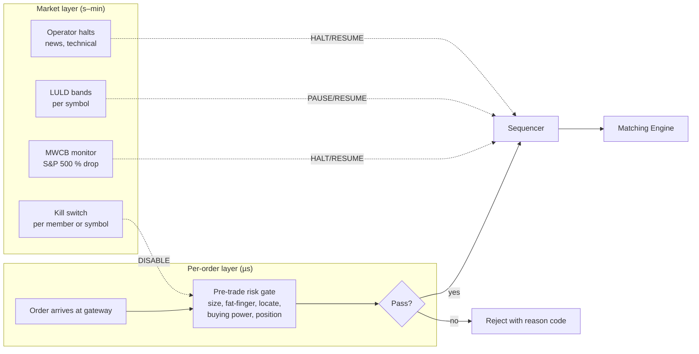

# Pre-Trade Risk and Circuit Breakers — Fat-Finger Checks, Buying Power, and Market-Wide Halts

**Date:** 2026-04-30 | **Updated:** 2026-04-30
**Tags:** `system-design` `deep-dive` `fintech` `risk` `regulation`

> **Parent case study:** [`../design-stock-exchange.md`](../design-stock-exchange.md). This is the deep-dive companion for the **Pre-Trade Risk Checks and Circuit Breakers** subsection. The parent doc sketches what the layer is and why it exists; this doc gets concrete about the checks, the data it depends on, the latency budget, the failure modes, and the regulatory regime that mandates almost every paragraph below.

## Table of Contents

- [Summary](#summary)
- [Overview — Two Risk Layers, Different Timescales](#overview--two-risk-layers-different-timescales)
- [Where the Risk Gate Sits](#where-the-risk-gate-sits)
  - [Position in the Pipeline](#position-in-the-pipeline)
  - [Why Pre-Sequencer, Not Post](#why-pre-sequencer-not-post)
  - [Latency Budget](#latency-budget)
- [Per-Order Risk Checks](#per-order-risk-checks)
  - [Max Order Size and Notional](#max-order-size-and-notional)
  - [Fat-Finger Price Bands](#fat-finger-price-bands)
  - [Restricted List](#restricted-list)
  - [Reg SHO and Short-Sale Locate](#reg-sho-and-short-sale-locate)
  - [Self-Trade Prevention](#self-trade-prevention)
- [Per-Account / Per-Firm Aggregate Checks](#per-account--per-firm-aggregate-checks)
  - [Position Limits](#position-limits)
  - [Buying Power and Exposure](#buying-power-and-exposure)
  - [Day-Trading Buying Power and PDT](#day-trading-buying-power-and-pdt)
- [State Freshness — Strict vs Eventually Consistent](#state-freshness--strict-vs-eventually-consistent)
- [Drop-on-Breach vs Reject-with-Reason](#drop-on-breach-vs-reject-with-reason)
- [Parallel Risk Engines](#parallel-risk-engines)
- [Circuit Breakers — Market-Wide Halts](#circuit-breakers--market-wide-halts)
  - [SEC Rule 80B Levels](#sec-rule-80b-levels)
  - [Limit Up / Limit Down (LULD)](#limit-up--limit-down-luld)
  - [Single-Stock Halts](#single-stock-halts)
  - [Halt as a Sequenced Event](#halt-as-a-sequenced-event)
- [Kill Switch](#kill-switch)
- [Knight Capital — The Cautionary Tale](#knight-capital--the-cautionary-tale)
- [Regulatory Regime](#regulatory-regime)
  - [SEC Rule 15c3-5 — The Market Access Rule](#sec-rule-15c3-5--the-market-access-rule)
  - [FINRA and Exchange Rules](#finra-and-exchange-rules)
- [Determinism and Auditability](#determinism-and-auditability)
- [Worked Example — One Order End-to-End](#worked-example--one-order-end-to-end)
- [Code — Risk Check State Machine](#code--risk-check-state-machine)
- [Code — Per-Account Exposure Aggregation](#code--per-account-exposure-aggregation)
- [Code — Circuit Breaker Trigger](#code--circuit-breaker-trigger)
- [Anti-Patterns](#anti-patterns)
- [Related](#related)
- [References](#references)

## Summary

Every order an exchange accepts must pass two distinct risk regimes before it can match. The first is **pre-trade risk** — per-order checks that run synchronously between the gateway and the sequencer with a single-digit-microsecond budget: max order size, notional cap, fat-finger price band, restricted list, short-sale locate, and aggregate per-account exposure (buying power, position limit, day-trading buying power). The second is **circuit breakers** — market-scoped emergency halts that operate on seconds-to-minutes timescales: SEC Rule 80B's Level 1/2/3 cascading halts on a 7%/13%/20% S&P 500 drop, per-symbol Limit Up / Limit Down bands, and discretionary single-stock halts for news, regulatory action, or technical malfunction. Both layers are non-negotiable in modern markets — the first is mandated by SEC Rule 15c3-5 ("Market Access Rule"), the second by SEC Rule 80B and the LULD plan filed under Rule 608. They exist because their absence has historically vaporized firms in minutes (Knight Capital lost $440M in 45 minutes in 2012 because a deployment misconfiguration sent unintended orders to the market without adequate pre-trade controls). Building this layer correctly means: synchronous gating in front of the sequencer, deterministic and auditable decisions, an operator kill switch that bypasses every other concern, and an explicit choice on every check between strict-consistent state (slower, never oversold) and eventually consistent state (faster, occasionally permits a small breach that downstream risk catches). Skipping any of this — either to chase latency or to favor a proprietary trading desk — is the precise pattern regulators wrote 15c3-5 to outlaw.

## Overview — Two Risk Layers, Different Timescales



The two layers do not overlap. Per-order risk is **member-scoped** and runs in line on the hot path. Circuit breakers are **market-scoped** and run as control-plane events that the sequencer interleaves with normal flow. Operators tune them independently; auditors require both.

## Where the Risk Gate Sits

### Position in the Pipeline

The order pipeline at a modern exchange is fixed in shape:

```
client → FIX/binary gateway → pre-trade risk → sequencer → matching engine → trade output
```

Pre-trade risk is **between** the gateway and the sequencer. Every order — limit, market, stop, peg, midpoint, IOC, FOK, however exotic — passes through the same gate. Cancels are usually exempt from most checks (cancellation reduces exposure), but they still pass through for symbol-shard routing and to update local state.

### Why Pre-Sequencer, Not Post

The sequencer assigns the canonical sequence number that downstream replay, audit, and clearing depend on. An order that gets a sequence number is committed to the journal as having been **considered** by the engine. Putting risk checks **after** sequencing creates a class of "ghost orders" — events that are journaled and replayable as accepted, but which the engine then drops. That breaks the determinism guarantee the sequencer exists to provide.

The rule is hard: a rejected order must be rejected before sequence number assignment. The journal contains accepted orders only; rejections live in a separate audit trail keyed by the gateway's incoming `client_order_id`.

### Latency Budget

The published budgets at modern equities exchanges:

| Hop | Budget |
|---|---|
| Gateway parse + auth | 2–5 µs |
| Pre-trade risk (full battery) | 3–10 µs |
| Sequencer | 1–2 µs |
| Matching engine | 1–5 µs |
| Trade publish (kernel-bypass) | 2–5 µs |

Risk has the fattest slice because it is the only stage that must consult external state (account balances, position cache, restricted list). Inside that 3–10 µs the implementation does **zero database calls** — every check resolves against in-process state synced asynchronously from the source of truth.

## Per-Order Risk Checks

Per-order checks evaluate the order in isolation against static or near-static rules. They do not depend on the rest of the firm's flow.

### Max Order Size and Notional

The simplest control: a per-symbol or per-product table of `max_share_count` and `max_notional_usd`. An order of 1,000,000 shares of a normally-100-share-tick stock is almost certainly a fat-finger; an order with notional > $50M from a small-broker member is almost certainly a deployment bug.

These limits are configured per **member firm** (some firms legitimately need larger sizes; institutional flow differs from retail flow) and per **product class** (futures vs equities, large-cap vs small-cap). The values are hot-loaded from a config service; changes require operator approval and are audited.

### Fat-Finger Price Bands

The classic fat-finger is a trader who types `100.00` instead of `1.0000` — a 100x error that, if accepted, can clear out the book at absurd prices. The exchange protects against this with a **price band**: reject limit orders whose price is more than `X%` away from a recent reference price.

Typical configuration:

| Class | Band |
|---|---|
| Liquid large-cap equity | ±5% from last trade or NBBO mid |
| Mid-cap equity | ±10% |
| Illiquid / wide-spread | ±20% |
| Pre-market / after-hours | tighter, e.g. ±2% |

Reference price selection matters. "Last trade" is volatile; "NBBO mid" is more stable but assumes the consolidated quote is fresh. Many exchanges blend: use NBBO mid when consolidated tape is not stale, fall back to last trade otherwise. The window is short — a few hundred milliseconds.

Market orders are checked against an implied limit derived from the current order book's protected price levels. An aggressive market order that would walk the book past the band is converted to an IOC at the band, or rejected.

### Restricted List

Some symbols a member is forbidden to trade. The list comes from multiple sources:

- **Regulatory**: SEC Rule 144, restricted issuers, sanctions lists (OFAC).
- **Member-specific**: a market-maker's own internal restricted list (positions in their employer's stock, ongoing M&A advisory engagements).
- **Exchange-imposed**: temporary halts during corporate actions.

The restricted list is loaded at session start and updated by control-plane events during the session. Reads from the hot path are pointer-equality against an interned symbol table.

### Reg SHO and Short-Sale Locate

US short selling is regulated by Reg SHO. The relevant exchange-side check: a **short-sale order must have a valid locate** — an affirmative determination from a lender that shares are available to borrow before the trade prints. Naked shorts are prohibited.

The locate is established **upstream of the exchange**, by the broker, before the order is sent. The broker stamps the order with a locate ID (or a flag indicating "long sale, no locate needed"). The exchange's job is to verify the flag is present and consistent with the order type.

Reg SHO Rule 201 also imposes a **short-sale circuit breaker**: when a stock drops 10% intraday, short sales are restricted to prices at or above the NBB (best bid) for the rest of the day plus the next. The exchange enforces this as a per-symbol band that toggles when the trigger fires.

### Self-Trade Prevention

A member's order should not match against the same member's resting order — that is wash trading and is forbidden under most exchanges' rules. Self-trade prevention (STP) is implemented at the matching engine but configured at the risk layer: orders are tagged with the member's STP group, and the engine cancels (typically the older or the smaller) when a self-match would occur.

## Per-Account / Per-Firm Aggregate Checks

Aggregate checks are stateful — the answer depends on the firm's existing positions and orders, not just the new order.

### Position Limits

Per-symbol caps on net long or short position. Set by:

- The exchange (e.g., CFTC speculative position limits in futures).
- The clearing member (concentration risk control).
- The firm itself (internal risk policy).

Calculation: `current_position + net_open_orders + new_order_qty` against the limit. The "net open orders" piece matters — a firm with a 1000-share long position and 500 shares of resting buy orders has effective max exposure of 1500 if all fill.

### Buying Power and Exposure

Buying power = cash + margin available. Each new buy order consumes buying power proportional to its notional (and the margin requirement for the product). The check is:

```
required_margin(new_order) + sum(margin(open_orders)) + sum(margin(positions)) <= buying_power
```

If false, reject. The margin model varies per product (Reg T for equities at 50% initial margin, SPAN for futures, portfolio margin for sophisticated accounts). The exchange's risk service maintains the firm's current margin number, recomputed continuously as positions change.

### Day-Trading Buying Power and PDT

US Pattern Day Trader rules (FINRA Rule 4210) impose tighter limits on accounts that day-trade frequently:

- An account flagged PDT must maintain ≥ $25,000 equity.
- Day-trading buying power = 4× maintenance margin excess (more than the 2× of standard Reg T).
- Day trades exceeding the limit must be liquidated by T+5.

Enforcement at the exchange: orders from a PDT-flagged account that would breach intraday buying power are rejected. Most of the policing is at the broker; the exchange acts as a backstop for the cases where the broker's internal controls failed.

## State Freshness — Strict vs Eventually Consistent

Aggregate checks need state. There are two ways to get it:

| Model | Latency | Risk |
|---|---|---|
| **Strict consistent** | Slow (10s–100s of µs per check; locks/RPC) | Can never oversell; throughput crater under contention |
| **Eventually consistent** | Fast (in-process cache reads) | Can briefly permit a breach during a fill burst |

Real exchanges run **eventually consistent**. The risk service holds a per-firm position cache in shared memory; an async fill listener updates the cache from the matching engine's trade stream. The lag is typically 1–10 µs after the fill prints — enough that a burst of fills against the same firm in the same microsecond can briefly show a stale exposure.

This is acceptable because:

1. The breach is bounded by the burst size (one engine cycle's worth of fills).
2. Downstream systems (clearing, end-of-day risk) re-check against a strict-consistent ledger.
3. Refresh frequency is tunable: critical limits (regulatory position caps) refresh more aggressively; soft limits (internal warnings) tolerate more lag.

The choice is made per-check, not globally. Hard regulatory limits (CFTC speculative position) live on the synchronous path with a small allowance for fill lag; soft internal limits live on the async path and tolerate more drift.

## Drop-on-Breach vs Reject-with-Reason

When a check fails, the exchange has two policy choices:

| Policy | Pros | Cons |
|---|---|---|
| **Drop silently** | Lowest latency; no information leakage about other firms | Member doesn't know why; debugging is painful; regulators dislike opacity |
| **Reject with reason code** | Member can fix and resubmit; auditable; required by 15c3-5 | Slightly higher latency (build response); reveals a tiny amount of state |

US regulators favor explicit rejects. SEC Rule 15c3-5 paragraph (c)(1)(i) requires firms (and the exchanges they connect through) to have controls that "prevent the entry of orders that exceed appropriate pre-set credit or capital thresholds, or that appear to be erroneous." The implicit assumption is that breaches are surfaced — silent drops can't be reconciled by the broker.

Standard practice: emit a FIX `Reject (3)` or `Execution Report (8)` with `OrdStatus=8 (Rejected)` and a `Text (58)` or vendor-specific reason field. Reason codes are enumerated; "fat-finger band breach" and "insufficient buying power" are distinct codes for distinct downstream handling.

## Parallel Risk Engines

When the check battery grows, a single-threaded risk function becomes the bottleneck. The architecture splits the checks across **parallel risk engines**, each owning a slice:

```
gateway → fan-out
            ├── risk engine 1: order-shape checks (size, notional, fat-finger)
            ├── risk engine 2: account state (buying power, position)
            ├── risk engine 3: regulatory (restricted list, Reg SHO, OFAC)
            └── risk engine 4: market state (LULD, halts)
         → AND-gate (all must pass)
         → sequencer
```

Each engine is independent; results are AND'd. A single fail rejects. Latency is dominated by the slowest engine, not the sum — they run concurrently. The AND-gate is a lock-free combiner that waits for all four results (or a timeout).

The fan-out also gives natural redundancy: each engine class has at least two replicas, with the gateway's combiner taking the first to respond among matching pairs (with a sanity check that they agree).

## Circuit Breakers — Market-Wide Halts

Circuit breakers are macro: they halt all trading (or trading in one symbol) for a defined duration when defined conditions trigger.

### SEC Rule 80B Levels

After the May 2010 Flash Crash, the SEC formalized market-wide circuit breakers (MWCB) tied to the S&P 500:

| Level | Trigger (S&P 500 decline from prior close) | Action |
|---|---|---|
| Level 1 | -7% | 15-minute halt (only if before 3:25 PM ET) |
| Level 2 | -13% | 15-minute halt (only if before 3:25 PM ET) |
| Level 3 | -20% | Halt for the rest of the trading day |

Level 1 and 2 do not trigger after 3:25 PM (the last 35 minutes of the regular session) — by then, the market is treated as too close to close to benefit from a pause. Level 3 always triggers regardless of time.

A halt under MWCB stops all listed equities trading on all US exchanges simultaneously. The mechanism is coordinated: the primary listing exchange (NYSE for many, Nasdaq for many) declares the halt; other exchanges are obliged by SRO rules to honor it.

### Limit Up / Limit Down (LULD)

Per-symbol price bands. If a stock's price moves outside its band for more than 15 seconds, trading is paused for 5 minutes.

Bands are calculated as a percentage of a reference price (the rolling 5-minute average), with the percentage depending on the stock's tier:

| Tier | Band (regular hours, > $3) |
|---|---|
| Tier 1 (S&P 500, Russell 1000) | ±5% |
| Tier 2 (other NMS) | ±10% |
| Stocks ≤ $3 | ±20% (tier 1) or ±20% (tier 2) — different rule |

The bands widen during the open and close auctions (10% / 20%) because volatility is higher.

LULD is enforced symbol-by-symbol; an MWCB halts everything. They compose: an LULD pause does not prevent MWCB; MWCB during a pause supersedes it.

### Single-Stock Halts

Discretionary halts, distinct from band-triggered ones:

- **Regulatory halt** (T1/T2 codes at Nasdaq): pending news from the issuer.
- **News dissemination**: halt to allow the market to digest material news.
- **Trading-system technical halt**: matching engine fault, market-data outage.
- **SEC suspension**: regulator orders trading suspended for up to 10 days (rare, usually fraud-related).

Halts are issued by the primary listing market and broadcast to all exchanges via the consolidated tape.

### Halt as a Sequenced Event

Implementation detail that matters: the halt is **not** a side-channel signal. It is a sequenced control event that flows through the same path as orders.

```
circuit breaker controller → gateway → risk → sequencer → matching engine
                                                  (HALT event with seq#=N)
```

The matching engine processes `HALT` like any other input: it stops matching, queues incoming orders (or rejects them, depending on policy), and waits for the corresponding `RESUME` event. Because the halt is sequenced, replay is deterministic: replaying the journal up to seq# N produces the engine state that includes the halt; replaying past N to a `RESUME` event resumes matching.

This is the same pattern as the trade-output stream: control and data share a sequence space, so deterministic replay covers both.

## Kill Switch

The most powerful operator control. A kill switch can:

- Disable a member firm's connectivity entirely (no new orders accepted).
- Cancel all of a member's resting orders.
- Disable trading in a specific symbol or symbol shard.
- Halt the entire matching engine.

The latency target is **milliseconds**: from operator action to effect. Implementation is a fast-path control event that bypasses normal queueing and is consumed by the gateway and matching engine immediately. Often implemented as a pre-allocated, never-blocked control channel.

The kill switch is the answer to "the algo is doing something we don't understand and getting worse every second." The Knight Capital incident (next section) is the textbook case for why this control must be both fast and well-rehearsed.

## Knight Capital — The Cautionary Tale

On August 1, 2012, Knight Capital — at the time one of the largest US equities market-makers — deployed new code to its router. Due to a deployment error, the new code was loaded onto seven of eight servers; the eighth retained an old code path that had been re-purposed for an unrelated "test" feature. When live orders flowed through, the eighth server interpreted them through the dormant code path and began sending unintended orders to the market.

Over **45 minutes**, the malfunction:

- Sent millions of unintended orders.
- Accumulated a $7B unintended long position.
- Forced Knight to liquidate at a loss of approximately **$440 million**.
- Effectively bankrupted the firm; Knight was acquired by Getco within weeks.

Multiple controls failed:

- **No effective pre-trade risk that caught aggregate exposure** building up on a single account in seconds.
- **No working kill switch** that operators could trigger fast enough.
- **No deployment automation** that would have caught the partial rollout.
- **Repurposing of unused code paths** that left a dormant feature live.

The SEC's settlement order (Release 34-70694) details the failures and led directly to stricter enforcement of Rule 15c3-5. Knight is the canonical example used in every modern exchange's pre-trade risk design review: "the system must catch what Knight didn't."

The specific lesson for this layer: **per-order checks are necessary but not sufficient**. Aggregate checks against the firm's running exposure are equally important, and they must run at the same per-order latency budget. A risk system that catches each order in isolation but doesn't notice the firm has placed 4 million of them in the last minute is the pre-Knight system.

## Regulatory Regime

### SEC Rule 15c3-5 — The Market Access Rule

Adopted 2010, effective 2011. The headline rule:

> A broker or dealer with market access… shall establish, document, and maintain a system of risk management controls and supervisory procedures reasonably designed to manage the financial, regulatory, and other risks of this business activity.

Specific requirements (paragraph (c)):

1. **Pre-set credit and capital thresholds** that prevent orders from breaching them.
2. **Erroneous order prevention** — fat-finger checks.
3. **Compliance with regulatory requirements** — Reg SHO, restricted lists, etc.
4. **Compliance with exchange rules** — order-type validity, member eligibility.

The rule explicitly outlawed "naked access" — the prior practice of brokers letting clients connect directly to exchanges using the broker's MPID without the broker's risk controls. Every order must now pass the broker's pre-trade risk; the exchange's risk layer is a second line of defense, not the only one.

### FINRA and Exchange Rules

FINRA Rule 4530 requires firms to report significant violations and operational issues; this is the post-incident reporting hook that follows every risk-system failure. FINRA Rule 4210 sets margin requirements (the buying-power and PDT inputs).

Each exchange has SRO rules that restate and tighten 15c3-5 for that venue:

- Nasdaq Rule 6140 (anti-disruptive practices).
- NYSE Rule 5.4 (clearly erroneous executions).
- CME Rule 432 (general offenses, including disorderly trading).

The exchange is required to enforce these on its own; it cannot rely solely on the broker's controls.

## Determinism and Auditability

The risk service must produce the same decision given the same inputs and same in-memory state. This is non-negotiable for several reasons:

- **Replay**: regulators may ask the exchange to reconstruct what happened in a specific microsecond window. If risk decisions are non-deterministic (depend on wall-clock time, OS scheduling, etc.), replay is impossible.
- **Audit**: every reject must be explainable. "The risk service rejected this order because position limit X was exceeded at sequence Z." Without determinism, the explanation isn't reproducible.
- **Testing**: deterministic logic is testable with replay-based test harnesses; non-deterministic logic requires probabilistic testing that accepts known false negatives.

Practical rules:

- No wall-clock time in decision logic; use sequence numbers or sequencer timestamps.
- No reliance on RNG; if randomness is needed (rare), seed deterministically.
- All inputs to a decision are journaled with the decision itself.
- The risk service's state can be reconstructed from the journal up to any sequence number.

## Worked Example — One Order End-to-End

Member firm `MM-042`, a small market-maker, sends a buy order for `MSFT 1000 @ 410.00 LIMIT IOC` at session second 12,345.123456:

```
1. T+0 µs: Gateway receives order on TCP socket.
   - Parses FIX message: clOrdID, side, qty, price, IOC flag.
   - Authenticates member: MM-042 valid, session active.

2. T+3 µs: Gateway forwards to risk fan-out.

3. T+3-13 µs (parallel):
   Engine 1 (order-shape):
     - max_qty (10000) > 1000 ✓
     - max_notional ($10M) > $410K ✓
     - fat-finger band: last trade $409.50, NBBO mid $409.75
       order price $410.00 is +0.06% — within ±5% ✓
     ⇒ PASS

   Engine 2 (account):
     - MM-042 cash + margin: $50M
     - Open buys notional: $12M
     - Position MSFT: long 5000 (~$2.05M)
     - Position limit MSFT (firm cap): 50000 — 5000 + 1000 = 6000 ✓
     - Buying power: $50M - $12M - $2.05M required margin = $35.95M > $410K ✓
     ⇒ PASS

   Engine 3 (regulatory):
     - Restricted list: MSFT not present ✓
     - Reg SHO: side=buy, locate not required ✓
     - OFAC: MM-042 not flagged ✓
     ⇒ PASS

   Engine 4 (market state):
     - MSFT not halted ✓
     - LULD band $389-$430 — order $410.00 within band ✓
     - MWCB not active ✓
     ⇒ PASS

4. T+13 µs: AND-gate sees all four PASS.

5. T+14 µs: Order forwarded to sequencer with risk-pass annotation.

6. T+15 µs: Sequencer assigns seq#=8675309, journals.

7. T+17 µs: Matching engine processes seq#=8675309.
   - Best ask $409.95 × 200 shares.
   - Match 200 @ $409.95.
   - Remaining 800 shares: IOC → cancel.

8. T+22 µs: Trade output to drop-copy + market data.

9. T+22 µs: Async fill listener updates risk engine 2's
   position cache: MSFT long → 5200, buying-power ↓ ~$82K.
```

If any of the four engines had returned FAIL, step 5 would emit a FIX Reject with the reason code instead. End-to-end risk decision: 13 µs from the gateway's receive to AND-gate completion.

## Code — Risk Check State Machine

```pseudo
enum CheckResult { PASS, REJECT(reason_code, detail) }

function check_order(order, account_state, market_state, config):
    # All checks short-circuit on first reject.

    # Engine 1: order shape
    if order.qty > config.max_qty[order.symbol]:
        return REJECT(MAX_QTY, qty=order.qty)

    if order.qty * order.price > config.max_notional[order.member]:
        return REJECT(MAX_NOTIONAL)

    ref_price = market_state.reference_price(order.symbol)
    if abs(order.price - ref_price) / ref_price > config.fat_finger_band[order.symbol]:
        return REJECT(FAT_FINGER, ref=ref_price, ord=order.price)

    # Engine 2: account state
    margin_required = order.notional * config.margin_pct[order.product]
    if margin_required + account_state.open_margin + account_state.position_margin
            > account_state.buying_power:
        return REJECT(INSUFFICIENT_BUYING_POWER)

    new_position = account_state.position[order.symbol] + signed_qty(order)
    if abs(new_position + account_state.open_qty[order.symbol]) > config.position_limit[order.symbol]:
        return REJECT(POSITION_LIMIT)

    # Engine 3: regulatory
    if order.symbol in config.restricted_list[order.member]:
        return REJECT(RESTRICTED_LIST)

    if order.side == SHORT and order.locate_id is None:
        return REJECT(REG_SHO_NO_LOCATE)

    # Engine 4: market state
    if market_state.halted(order.symbol):
        return REJECT(SYMBOL_HALTED)

    if not within_luld_band(order, market_state.luld_band(order.symbol)):
        return REJECT(LULD_BREACH)

    if market_state.mwcb_active():
        return REJECT(MARKET_HALT)

    return PASS
```

In production, the four "engines" run in parallel goroutines / threads / cores, with an AND-gate combining results. The pseudo-code shows the logical structure; physical layout favors parallelism.

## Code — Per-Account Exposure Aggregation

The position cache is updated by an async fill listener. Concurrent updates between fills and check-reads use a lock-free pattern:

```pseudo
struct AccountState:
    position: map<symbol, atomic<int64>>     # signed share count
    open_qty: map<symbol, atomic<int64>>     # in-flight orders
    open_margin: atomic<int64>               # in-flight margin
    position_margin: atomic<int64>           # margin tied up in positions
    buying_power: atomic<int64>              # cash + margin available
    seq_applied: atomic<int64>               # highest fill seq# applied

# Hot path read (called from risk check):
function snapshot(account):
    # Read all atomics; tolerate the small inconsistency between fields
    # because the check is conservative (overestimate exposure → safer).
    return {
        position: account.position[symbol].load(),
        open_qty: account.open_qty[symbol].load(),
        open_margin: account.open_margin.load(),
        position_margin: account.position_margin.load(),
        buying_power: account.buying_power.load(),
    }

# Async fill listener:
function on_fill(fill):
    account = accounts[fill.member]
    # Apply fill atomically per-field.
    account.position[fill.symbol].fetch_add(signed_qty(fill))
    delta_margin = fill.notional * margin_pct(fill.product)
    account.position_margin.fetch_add(delta_margin)
    account.open_margin.fetch_sub(delta_margin)  # was reserved at order entry
    account.open_qty[fill.symbol].fetch_sub(signed_qty(fill))
    account.seq_applied.store(fill.seq)

# Order-entry reservation (called from risk PASS):
function on_order_accepted(order):
    account = accounts[order.member]
    account.open_qty[order.symbol].fetch_add(signed_qty(order))
    margin = order.notional * margin_pct(order.product)
    account.open_margin.fetch_add(margin)

# Order-cancel/reject release:
function on_order_terminal(order, remaining_qty):
    account = accounts[order.member]
    account.open_qty[order.symbol].fetch_sub(signed_qty_of(order, remaining_qty))
    margin_released = remaining_qty * order.price * margin_pct(order.product)
    account.open_margin.fetch_sub(margin_released)
```

The pattern: reserve at order accept, release at fill or terminal, never block on the hot path. Per-field atomicity is sufficient because risk checks tolerate slight cross-field inconsistency — the margin model overestimates briefly, which only makes the check more conservative, never less.

## Code — Circuit Breaker Trigger

The MWCB controller monitors S&P 500 against the prior close. When a level triggers, it emits a HALT event:

```pseudo
function mwcb_monitor():
    loop:
        spx_now = index_calculator.current_value()
        decline_pct = (prior_close - spx_now) / prior_close

        level = level_for(decline_pct, current_time)
        # level_for returns 1, 2, 3, or NONE based on thresholds and time-of-day:
        #   if time >= 3:25 PM ET: only level 3 can trigger
        #   else: level 1 if -7%, level 2 if -13%, level 3 if -20%

        if level != NONE and level > current_active_level:
            duration = HALT_DURATION[level]   # 15min for L1/L2; rest of day for L3
            emit_halt(scope=ALL_EQUITIES, duration=duration, level=level)
            current_active_level = level
            schedule_resume_at(now + duration) if level < 3 else None

        sleep(100ms)   # monitor cadence; halts are seconds-scale, not micro

function emit_halt(scope, duration, level):
    event = HaltEvent(
        scope=scope,
        level=level,
        ts=now(),
        duration=duration,
        reason="MWCB Level " + level,
    )
    # Push into the gateway's control-event channel — picked up by sequencer
    # and broadcast to all matching engines.
    control_channel.publish(event)
    # Also notify operator and audit log.
    audit_log.append(event)

# At the matching engine:
function on_event(event):
    if event.type == HALT:
        engine.state = HALTED
        # Optionally cancel resting orders (depends on halt type).
        if event.cancel_resting:
            for order in book.all_resting():
                cancel(order, reason=HALT)
    elif event.type == RESUME:
        engine.state = OPEN
        # Resume in auction or continuous mode per policy.
        engine.start_resumption_auction()
    else:
        process_normally(event)
```

LULD has a similar shape, scoped per symbol, monitored against the rolling 5-minute reference price. Single-stock halts are operator-initiated: an operator dashboard issues an `emit_halt(scope=symbol, duration, reason)`.

## Anti-Patterns

- **Pure-async risk checks.** Orders pass through to the matching engine while a separate process "checks" them after the fact. By the time a breach is detected, the order has matched and trade prints exist. This is naked access in disguise; it is what 15c3-5 made illegal. Pre-trade risk must be **synchronous and gating**.
- **Risk service as a single point of failure with no HA.** A pre-trade risk node that goes down takes the venue down. Always run risk in active-active or hot-standby with sub-millisecond failover. The exchange should be configured to halt rather than bypass risk on a risk-service failure.
- **Per-order database query for state.** A SELECT for buying power on every order is a 500 µs latency floor. State must be in-process, kept fresh by an async listener, refreshed at session start from the source of truth.
- **"Naked access" carve-outs for proprietary flow.** Letting a market-maker's own order flow skip risk because "we trust them" is precisely what Knight did and is precisely what 15c3-5 forbids. Every order, including proprietary, passes through the same risk gate.
- **Risk decisions that depend on wall-clock time.** Replay diverges, audits fail, the same input produces different outputs at different times. Use sequence numbers and sequencer-assigned timestamps.
- **Halt as a side channel.** Sending a HALT to the matching engine through a separate signaling path (REST API, SSH, pager-driven) means halts are not in the journal and replay diverges. Halts must be sequenced control events.
- **Kill switch behind ten clicks.** When the algo is bleeding millions per minute, the kill switch must be one keystroke away on the primary operator console — and rehearsed in tabletop drills, not first used during the incident.
- **Single-engine risk with serial checks.** A single-threaded risk function that runs all checks sequentially has latency = sum of checks. Parallel engines with an AND-gate gives latency = max of checks. The math does not change at high check counts; the engineering does.
- **Loose fat-finger band reference.** Using "last trade" alone as the reference price means a single off-market trade pulls the band with it. Use a robust reference (NBBO mid, rolling average) with fallback logic.
- **Treating Reg SHO locate as the broker's problem only.** The exchange must verify the locate flag is present; brokers do fail. The exchange's defense-in-depth catches it.
- **Ignoring stale state at session start.** Positions from prior session must be loaded before the first order is accepted. A risk service that starts with empty positions and "learns" from fills will let the first orders breach limits the firm has already exhausted.
- **No audit trail for rejects.** Rejected orders must be logged with the reason code, the input that triggered the check, and the version of config in effect. "We rejected your order" without an explainable trail fails 15c3-5 and breaks broker reconciliation.
- **Same kill-switch button covers everything.** A kill switch with one option — "halt the world" — is too coarse. Granular kill: per member, per symbol shard, per product class. Operators need surgical control.
- **Configuration changes hot-loaded without operator approval.** Loosening a fat-finger band or raising a position limit during the session must require dual operator approval and be audited. A single insider with config write access is a Knight in waiting.
- **Letting circuit-breaker monitoring share threads with order processing.** A spike in order traffic must not delay MWCB monitoring; they must be on independent cores or processes.

## Related

- [`./matching-engine-determinism.md`](./matching-engine-determinism.md) — the matching engine's determinism requirement that depends on risk decisions being deterministic and journaled.
- [`./sequencer-pattern.md`](./sequencer-pattern.md) — why halts and resumes are sequenced control events, not side-channel signals.
- [`./settlement-pipeline.md`](./settlement-pipeline.md) — downstream risk: clearing-side margin and exposure controls that re-check what pre-trade risk approved.
- [`../design-stock-exchange.md`](../design-stock-exchange.md) — parent case study; pre-trade risk and circuit breakers is section 5 of the deep dives.
- [`../design-payment-system.md`](../design-payment-system.md) — fraud and risk-decisioning parallels: card fraud uses a similar pattern (synchronous risk gate, eventually-consistent state, kill switches), with looser latency budgets.
- [`../../../security/threat-modeling.md`](../../../security/threat-modeling.md) — threat modeling for financial systems; the Knight-class internal-malfunction threat is one of the canonical scenarios.
- [`../../../scalability/backpressure-bulkhead-circuit-breakers.md`](../../../scalability/backpressure-bulkhead-circuit-breakers.md) — the general "circuit breaker" pattern in distributed systems and how the exchange's market-wide circuit breaker is a domain-specialized variant.

## References

- SEC, [Rule 15c3-5: Risk Management Controls for Brokers or Dealers with Market Access](https://www.sec.gov/rules/final/2010/34-63241.pdf) — the Market Access Rule, the regulatory foundation for pre-trade risk in US markets.
- SEC, [Order approving Rule 80B amendments — market-wide circuit breakers](https://www.sec.gov/rules/sro/nyse/2012/34-67090.pdf) — the post-Flash-Crash MWCB regime (Levels 1/2/3 at -7%/-13%/-20%).
- SEC, [Rule 608 filings — Limit Up / Limit Down National Market System Plan](https://www.sec.gov/divisions/marketreg/rule608-info-filings.shtml) — the LULD plan filings and amendments.
- SEC, [Regulation SHO: Frequently Asked Questions](https://www.sec.gov/divisions/marketreg/mrfaqregsho1204.htm) — Reg SHO short-sale rules including locate requirements and Rule 201 short-sale circuit breaker.
- SEC, [Knight Capital settlement — Release No. 34-70694](https://www.sec.gov/litigation/admin/2013/34-70694.pdf) — the official record of the August 2012 incident and the controls that failed; canonical source for what pre-trade risk must catch.
- FINRA, [Rule 4530: Reporting Requirements](https://www.finra.org/rules-guidance/rulebooks/finra-rules/4530) — post-incident reporting hook; what gets reported when risk controls fail.
- FINRA, [Rule 4210: Margin Requirements](https://www.finra.org/rules-guidance/rulebooks/finra-rules/4210) — Reg T margin and PDT day-trading buying power rules that the exchange's risk service enforces as a second line.
- Nasdaq, [Trading Halts and Pauses](https://www.nasdaqtrader.com/Trader.aspx?id=TradeHalts) — operational reference for halt codes (T1, T2, M1, etc.) and dissemination.
- CME Group, [Globex Credit Controls](https://www.cmegroup.com/clearing/globex-credit-controls.html) — exchange-side pre-trade credit-control implementation; a concrete production system documented for clearing members.
- SIFMA, ["Market Access Rule" implementation guidance](https://www.sifma.org/) — industry guidance on operationalizing 15c3-5 controls (search the SIFMA library for current docs).
- Larry Harris, _Trading and Exchanges: Market Microstructure for Practitioners_ — textbook treatment of trading halts, price bands, and risk management in market design.
