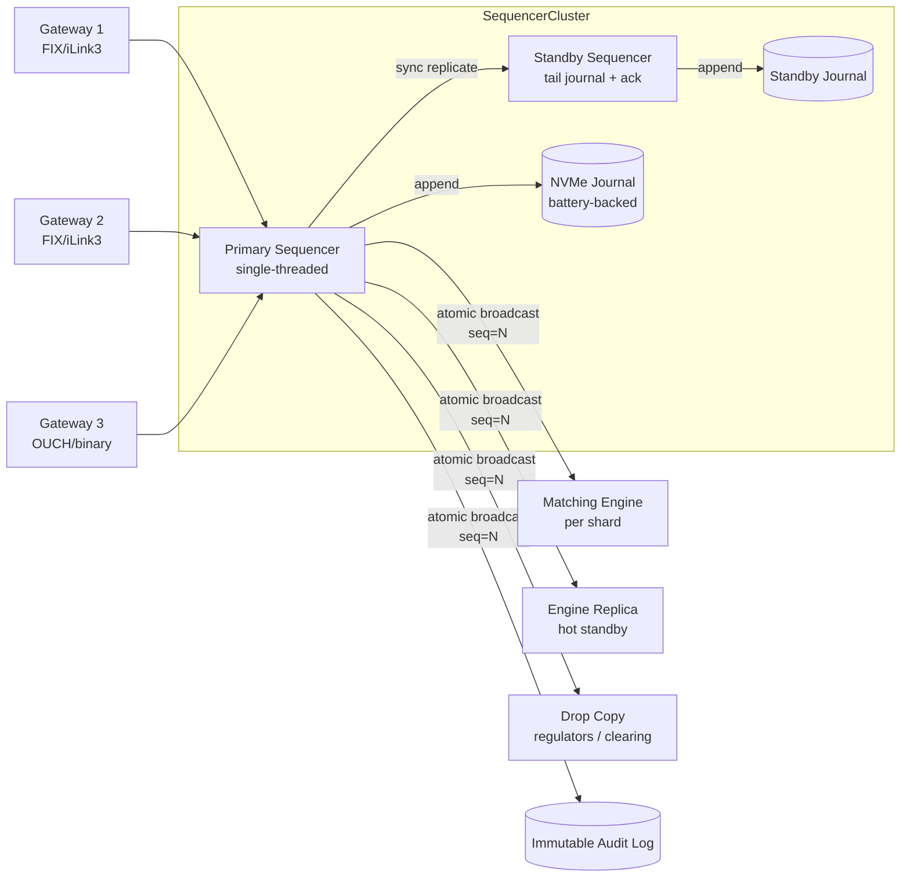

# Sequencer Pattern — Total Ordering, Gap Detection, and Sequencer Failover

**Date:** 2026-04-30 | **Updated:** 2026-04-30
**Tags:** `system-design` `deep-dive` `fintech` `ordering` `consensus`

> **Parent case study:** [Design an Online Stock Exchange](../design-stock-exchange.md). This deep-dive expands "Sequencer Pattern".

## Table of Contents

- [Summary](#summary)
- [Overview](#overview)
- [What the Sequencer Does (and Why It Sits Outside the Engine)](#what-the-sequencer-does-and-why-it-sits-outside-the-engine)
- [The Engine as a Pure Function of Its Input](#the-engine-as-a-pure-function-of-its-input)
- [Single Sequencer per Matching Shard](#single-sequencer-per-matching-shard)
- [Gateway-to-Sequencer Wire Protocol](#gateway-to-sequencer-wire-protocol)
- [Assigning the Global Sequence Number](#assigning-the-global-sequence-number)
- [Synchronous Journal Write and Atomic Broadcast](#synchronous-journal-write-and-atomic-broadcast)
- [Gap Detection at Downstream Consumers](#gap-detection-at-downstream-consumers)
- [Sequencer Replication and Failover](#sequencer-replication-and-failover)
- [Why Raft on the Hot Path Is Usually Too Slow](#why-raft-on-the-hot-path-is-usually-too-slow)
- [Aeron and Reliable Multicast as the Wire Format](#aeron-and-reliable-multicast-as-the-wire-format)
- [Timestamps: The Sequencer Is the Authoritative Clock](#timestamps-the-sequencer-is-the-authoritative-clock)
- [Crash Recovery: Snapshot Plus Journal Tail](#crash-recovery-snapshot-plus-journal-tail)
- [Admission Control and Backpressure](#admission-control-and-backpressure)
- [Worked Example: Three Gateways, Five Orders, One Flap](#worked-example-three-gateways-five-orders-one-flap)
- [Anti-Patterns](#anti-patterns)
- [Related](#related)
- [References](#references)

## Summary

The parent case study introduces the sequencer in roughly twenty lines: it accepts events from many gateways, assigns a monotonic sequence number, writes to a journal, and hands the result to a single-threaded matching engine. That summary is correct, but it elides the engineering that makes the pattern work in production: a strict ordering of "ack only after journal fsync", an atomic broadcast that fans the same byte stream to engine + replicas + drop-copy, gap detection contracts that downstream consumers rely on for replay, a failover protocol that hands off `last_known_seq + 1` without ever producing a duplicate, and a deliberate decision to **not** use Raft/Paxos on the hot path because their latency budget collapses under microsecond targets. This deep-dive expands those mechanics. The recurring theme: the sequencer is the *only* place in the exchange where simultaneity is collapsed into a linear order, and once that decision is made, every other component — engine, market data, drop copy, regulators — becomes a deterministic function of the sequencer's output stream. Get the sequencer right and the rest of the exchange becomes pleasantly boring; get it wrong and the engine inherits problems it cannot solve.

## Overview



The sequencer's job is narrow but unforgiving: read from N gateway streams, write a single ordered stream of events, and make that stream durable, gap-free, and replicable. Every microsecond it spends, the engine waits. Every event it loses or reorders, the engine produces non-deterministic output that cannot be replayed for audit.

In practice, a production exchange runs one sequencer per matching shard (where a shard is a symbol or a small group of co-traded symbols). The sequencer process pins to a CPU core, busy-waits on a multi-producer single-consumer ring buffer for inbound events, writes to a local NVMe journal (or a battery-backed RAID set), synchronously replicates to a hot standby, and only then publishes the sequenced event to the engine and its peers via a low-latency atomic broadcast (Aeron, reliable UDP multicast, or a custom protocol). The numbers are small: 5–10 µs end-to-end for the sequencer hop is achievable on commodity hardware. The discipline required to hold that number is not.

## What the Sequencer Does (and Why It Sits Outside the Engine)

A naive design might bake ordering into the matching engine itself: gateways write to a queue, the engine pulls in arrival order, done. This collapses two responsibilities — ordering and matching — into one process and breaks every property you want from the engine.

The sequencer does four things, in this order:

1. **Receive** events from N gateway connections. Each event already carries gateway-side sequencing (`gateway_id`, `gateway_seq`) so gaps in the gateway stream are detectable.
2. **Order** them. The sequencer chooses a single arrival order across all gateways. Ties (same nanosecond on different threads) are broken deterministically — typically by the order of arrival on the MPSC ring buffer.
3. **Persist** them. The chosen order is written to a journal that survives crashes. Until the journal write is durable, the event has not been "sequenced" — it is provisional.
4. **Broadcast** them. Once durable, the event is published with its global sequence number to every consumer that needs it: the matching engine, the engine's hot replica, the drop-copy stream, the audit log.

Pulling this out of the engine yields three properties the engine cannot give itself:

- **The engine becomes a pure function** of `(snapshot, ordered_event_stream)`. Given the same inputs, two engines on different machines produce byte-identical outputs. This is the foundation of replay-based audit and hot replication.
- **The engine's hot path has zero I/O.** No disk write, no network ack, no consensus round-trip. The engine reads from a ring buffer, mutates the order book, writes trades to another ring buffer, returns. Every microsecond of its budget is spent on matching logic.
- **Failover is sane.** When the engine crashes, you start a new engine, hand it the latest snapshot + journal tail, and replay. The sequencer's journal *is* the system's durability story; the engine doesn't have to maintain its own.

If you put ordering inside the engine, you lose all three. The engine now does I/O on the hot path, "deterministic replay" requires reproducing the network conditions that produced the original interleaving, and sequencer failure becomes engine failure.

## The Engine as a Pure Function of Its Input

This is the architectural payoff and worth stating explicitly. After the sequencer:

```text
engine_state(t) = fold(initial_snapshot, ordered_events[0..t], apply)
```

Where `apply` is a deterministic function: given a state and the next event, it produces the next state and a set of output events (trades, book updates, rejects). The engine is referentially transparent over its input stream.

Concrete consequences:

| Property | How sequencer enables it |
|---|---|
| **Hot replica matches primary byte-for-byte** | Both consume the same broadcast; both apply identical events in the same order |
| **End-of-day replay reproduces every trade** | Replay the journal from epoch into a fresh engine; produce identical trade tape |
| **Regulatory inquiry "show me the state at 14:32:17.984123"** | Restore nearest snapshot, replay journal up to that seq, dump book |
| **A/B testing of engine changes** | Run new engine version against same event stream offline; diff outputs |
| **Surveillance: detect spoofing/layering offline** | Replay with surveillance hooks attached; engine logic unchanged |

None of those work if ordering is non-deterministic. They all collapse to "we cannot reproduce what actually happened." That is unacceptable for a regulated venue.

See [matching-engine-determinism.md](./matching-engine-determinism.md) for the engine-side complement of this contract — what determinism requires of the engine code itself.

## Single Sequencer per Matching Shard

A common confusion: "shouldn't the sequencer be replicated for scale?" No. Replicated for **availability**, yes — that's the standby. But for **ordering**, there is exactly one sequencer that owns a shard at any instant. Two simultaneous sequencers writing to the same shard would produce two conflicting orderings, which is the failure mode the pattern exists to prevent.

The scaling axis is the shard itself: split symbols across shards so each shard has its own sequencer + engine pair. A typical equity exchange might run 4–32 matching shards, with symbols statically assigned by hash or by liquidity profile (high-volume symbols get their own shard; long-tail symbols are bucketed). The sequencers are independent — `AAPL`'s sequencer knows nothing about `MSFT`'s sequencer. There is no cross-shard ordering invariant because there is no user-visible reason for one to exist.

```text
gateways ──┬─→ shard_A (AAPL, MSFT, ...)   sequencer_A → engine_A
           ├─→ shard_B (TSLA, AMZN, ...)   sequencer_B → engine_B
           └─→ shard_N (...)                sequencer_N → engine_N
```

Each gateway routes inbound orders to the correct shard based on the symbol, then to that shard's sequencer. There is no "global sequencer" — that would be a single point of contention across the entire exchange, with cross-region RTT on every order, and it would buy nothing because no client cares about the ordering of `AAPL` trades relative to `TSLA` trades.

## Gateway-to-Sequencer Wire Protocol

The handshake between a gateway and the sequencer is a contract worth writing out. Each event the gateway sends includes:

| Field | Purpose |
|---|---|
| `gateway_id` | which gateway issued this (sequencer routes acks back) |
| `gateway_seq` | gateway-side monotonic seq, lets sequencer detect gateway gaps |
| `client_order_id` | client-supplied identity, lets sequencer/engine deduplicate retries |
| `account_id`, `symbol`, `side`, `qty`, `px`, `tif`, ... | the order semantics |
| `gateway_recv_ts_ns` | when the gateway received it from the wire (for latency monitoring) |
| `checksum` | end-to-end integrity check |

```text
+---------------+-------------+----------------+--------------+-----------+
| gateway_id(2) | gw_seq(8)   | client_oid(16) | order_body   | crc32c(4) |
+---------------+-------------+----------------+--------------+-----------+
```

Three contract points to internalize:

1. **`gateway_seq` is the gap-detection contract from the gateway side.** If a sequencer sees `(gateway_id=3, gw_seq=1004)` after `(gateway_id=3, gw_seq=1002)`, it knows it lost `1003` somewhere between gateway and sequencer. The sequencer either (a) requests retransmit from the gateway, (b) marks the gateway suspect and ejects it, or (c) panics and refuses to advance. It does not silently produce an output stream with a gap.

2. **`client_order_id` is the idempotency key.** A client that times out and retries will send the same `client_order_id` twice. The sequencer (or the engine that follows it) must dedupe. The contract: first arrival wins, second arrival is silently acknowledged with the original `(global_seq, status)`. See [exactly-once-and-idempotency.md](../../../communication/exactly-once-and-idempotency.md) for the broader pattern.

3. **`gateway_recv_ts_ns` is for monitoring, not ordering.** It is the gateway's wall clock, useful for "wire-to-engine latency" SLOs but never used to order events. Only the sequencer's chosen arrival order matters.

The wire format itself is binary and fixed-width — no FIX strings on this hop. FIX is fine at the public-facing edge of the gateway; by the time the order reaches the sequencer it has been parsed into a packed binary struct.

## Assigning the Global Sequence Number

The core sequencer loop is deceptively short:

```pseudocode
state:
  global_seq:     uint64 = last_recovered_seq        // recovered at boot
  journal:        AppendOnlyFile
  broadcaster:    AtomicMulticast                    // engine + replicas + drop copy
  inbound:        MpscRingBuffer<GatewayEvent>

loop forever:
    event = inbound.busy_wait_take()
    sequencer_recv_ts_ns = clock_monotonic_ns()

    // Optional: dedup by client_order_id (or push to engine)
    if seen_recently(event.client_order_id):
        respond_to_gateway(event.gateway_id, DUP, prior_seq=cache_lookup(...))
        continue

    // Optional: gap-check on (gateway_id, gateway_seq)
    if event.gateway_seq != expected_seq[event.gateway_id]:
        handle_gateway_gap(event)
        continue

    expected_seq[event.gateway_id] = event.gateway_seq + 1
    global_seq += 1

    sequenced = SequencedEvent {
        global_seq,
        sequencer_ts_ns = sequencer_recv_ts_ns,
        gateway_id      = event.gateway_id,
        gateway_seq     = event.gateway_seq,
        client_order_id = event.client_order_id,
        body            = event.body,
    }

    // 1. Durability first
    journal.append_and_fsync(sequenced)        // group-committed in batches

    // 2. Synchronous replication (standby must ack)
    standby.send_and_wait_ack(sequenced)       // O(50–200 µs depending on link)

    // 3. Only after both, broadcast to consumers
    broadcaster.publish(sequenced)             // engine, replicas, drop copy, audit

    // 4. Acknowledge gateway (which acks the client)
    respond_to_gateway(event.gateway_id, ACK, global_seq, sequencer_ts_ns)
```

Three details that carry the design:

**Group commit on the journal.** A single `fsync` after every event is too slow (10–20 µs floor on NVMe, not all of which is amortizable). Instead, the sequencer batches: every 1–10 µs (or every N events, whichever comes first), it issues one `fsync` covering all events in the batch. Each event in the batch becomes durable simultaneously; the gateway acks lag the events by the batch interval. This trades a few microseconds of acknowledgement latency for an order of magnitude more throughput.

**Sequence number is assigned before durability.** The sequencer chooses `global_seq` first, *then* writes the chosen number to disk. If the sequencer crashes between assignment and `fsync`, the standby (which never saw the event because there was no replication ack) takes over and reuses that `global_seq` for the next event it sequences. The number was never visible outside the failed process; no consumer will ever see two events with the same `global_seq`.

**Acknowledgement happens last.** The gateway (and, transitively, the client) is acknowledged only after the event is durable, replicated, and broadcast. If the sequencer crashes after step 3 but before step 4, the standby completes the broadcast (it has the event) and the client retries; idempotency on `client_order_id` collapses the retry to a no-op with the original `global_seq`.

## Synchronous Journal Write and Atomic Broadcast

"Atomic broadcast" is a piece of jargon that hides real engineering. The property required: every consumer of the sequencer's output sees the same events in the same order, with no gaps, no duplicates, and no ordering disagreements. Specifically:

- The matching engine must see events 1, 2, 3, 4, ...
- The hot replica engine must see events 1, 2, 3, 4, ...
- The drop-copy stream must see events 1, 2, 3, 4, ...
- The audit logger must see events 1, 2, 3, 4, ...

…all interleaved with no consumer skipping ahead or seeing a different order. In practice this is implemented by:

1. **Reliable UDP multicast** with sequence-number-based gap recovery (consumer asks for retransmit if it sees a gap). Aeron is the canonical implementation; LBM (Informatica Ultra Messaging) is a commercial alternative; LCR (LMAX) is open.
2. **A single log structure** (the journal) that all consumers read from with their own cursor. Slow consumers fall behind on their own; they don't slow the publisher.
3. **End-to-end checksums** so a corrupted packet is detected and re-requested rather than silently consumed.

The "atomic" in atomic broadcast does *not* mean "delivered in one network operation." It means: either every consumer sees event N or none does, and they all see N before N+1. The sequencer's two-step protocol (durable journal write → broadcast) provides this. If the broadcast packet is lost, consumers detect the gap from the sequence number and request retransmit from the journal; the event is recoverable because it was made durable first.

```pseudocode
// Consumer side: gap-driven retransmit
on receive(event):
    if event.global_seq == expected_seq:
        expected_seq += 1
        process(event)
    elif event.global_seq > expected_seq:
        // gap — buffer this event and request fill
        buffer[event.global_seq] = event
        request_retransmit(from=expected_seq, to=event.global_seq - 1)
    else:
        // duplicate; ignore
        return
```

This is the same protocol used by NACK-based reliable multicast in industries from finance to defense.

## Gap Detection at Downstream Consumers

Every consumer of the sequenced stream — engine, replica, drop copy, audit log, market-data publisher — runs the same gap detector:

```pseudocode
state:
  expected_seq: uint64 = checkpoint_seq + 1
  pending: Map<uint64, SequencedEvent>           // out-of-order arrivals
  retransmit_outstanding: Set<uint64>

on receive(event):
    if event.global_seq < expected_seq:
        return                                    // stale duplicate, drop
    if event.global_seq == expected_seq:
        process_in_order(event)
        expected_seq += 1
        // drain any pending events that are now in-order
        while pending.contains(expected_seq):
            process_in_order(pending.remove(expected_seq))
            expected_seq += 1
    else:
        // future event — buffer and request gap fill
        pending[event.global_seq] = event
        for missing in expected_seq .. event.global_seq - 1:
            if missing not in retransmit_outstanding:
                request_retransmit(missing)
                retransmit_outstanding.add(missing)

on retransmit_timeout(missing):
    if expected_seq <= missing:
        // still missing; escalate to journal-direct fetch
        fetch_from_sequencer_journal(missing)
        retransmit_outstanding.remove(missing)
```

Three knobs:

- **Retransmit timeout.** Too short: retransmit storms on transient packet loss. Too long: gap stalls the consumer. Typical 10–100 µs for primary retransmit, falling back to journal fetch after several attempts.
- **Pending buffer size.** If a consumer has buffered 10,000 future events without seeing the missing ones, something is structurally wrong (the publisher has died, or this consumer is on the wrong network path). Above the threshold, the consumer disconnects and re-subscribes from the latest snapshot.
- **Idempotent processing.** Stale duplicates must be safely ignored. The matching engine relies on this because retransmits during recovery can deliver an event the engine already applied.

This contract is why the sequencer **must** produce dense, gap-free sequence numbers. If the sequencer skipped numbers (e.g., because of rolled-back transactions or per-shard offsets that aren't dense), consumers could not distinguish "real gap I should fill" from "expected hole I should ignore." Density is part of the contract.

## Sequencer Replication and Failover

A single sequencer with no failover is a single point of failure for the entire shard. Replication strategies:

**Primary + hot standby with synchronous journal replication.** The most common pattern in low-latency exchanges. The standby:

- Has its own journal (separate disk, separate machine, ideally separate rack/data hall).
- Receives every event from the primary over a dedicated, low-latency link (often a separate NIC or even RDMA).
- Writes to its own journal and `fsync`s.
- Sends an ack back to the primary.

The primary does not broadcast until the standby ack arrives. This means the standby is always at most one event behind, and on failover it knows exactly where to resume.

```pseudocode
// Primary
on inbound_event(event):
    seq = ++global_seq
    sequenced = build(event, seq)
    journal.append_fsync(sequenced)
    standby_link.send(sequenced)
    standby_link.wait_ack(timeout=200µs)         // synchronous replication
    broadcaster.publish(sequenced)
    respond_to_gateway(...)

// Standby
on receive_from_primary(sequenced):
    if sequenced.global_seq != standby_expected_seq:
        // primary skipped a number — refuse and request resync
        send_nack(standby_expected_seq)
        return
    journal.append_fsync(sequenced)
    standby_expected_seq = sequenced.global_seq + 1
    send_ack(sequenced.global_seq)

// Failover (heartbeat loss from primary, or external election decision)
on become_primary():
    last_durable_seq = journal.last_appended_seq
    global_seq = last_durable_seq                // continue from here
    open_gateway_listeners()
    take_over_broadcast_address()                // VIP / IP migration
    log("Sequencer failover at seq=", last_durable_seq, ", resuming at", last_durable_seq+1)
```

**Failover handoff sketch.** The handover protocol must handle three race conditions:

1. **Split brain.** Old primary thinks it is alive but is partitioned from gateways/standby. External fencing (fencing token incremented at each promotion, rejected on every write that uses an old token) prevents the old primary from continuing to publish.
2. **Lost in-flight event.** Primary received event E, assigned seq=1234, crashed before replicating. Standby never saw 1234. Standby resumes at 1233+1 = 1234 — and reuses that number for the next event it sequences. The original E never reached any consumer (no broadcast happened), so reusing the number is safe. The client retries with the same `client_order_id`; the new primary processes it as a fresh sequence; the original is lost (which is the same outcome as a network drop, and the gateway/client retry path handles it).
3. **Almost-replicated event.** Primary assigned seq=1234, replicated to standby, standby `fsync`ed and acked, primary crashed before broadcasting. Standby has 1234 in its journal. On takeover, standby finds 1234, broadcasts it (the sequencer must broadcast its journal tail on promotion), and resumes at 1235.

The protocol invariant: **every `global_seq` value either was broadcast and is durable, or never existed from the consumer's point of view.** No consumer ever sees a "missing" sequence number that was assigned but lost.

## Why Raft on the Hot Path Is Usually Too Slow

Textbook distributed systems instinct: use Raft or Paxos for the journal. Each event becomes a Raft log entry; majority quorum acks before commit; survives any single node failure deterministically. Why don't real exchanges do this on the hot path?

**Latency floor.** A Raft commit requires:

1. Leader writes to local disk.
2. Leader sends `AppendEntries` to followers (network round trip: ~50–500 µs intra-DC, more cross-DC).
3. Followers write to disk and ack.
4. Leader counts quorum; commits; applies; replies.

Each disk write is 10–20 µs on NVMe; each network round trip is 50 µs+; the Raft critical path is at least 100–200 µs and often 500 µs+. This is fine for distributed databases (CockroachDB, etcd, TiKV) where 1–10 ms commit latency is acceptable. It is too slow for an exchange whose total budget for "client → sequencer → engine → trade reply" is around 100 µs.

**What exchanges do instead.** Custom synchronous replication that gives Raft-equivalent guarantees with hand-tuned implementations:

- Two- or three-replica synchronous fsync with NACK-style retransmit.
- Dedicated low-latency replication links (often fiber, often kernel-bypass).
- Failover decision made by an external arbiter (separate process, sometimes operations staff for the most extreme cases).
- No leader election protocol on the hot path — failover is rare, takes hundreds of milliseconds (acceptable downtime), and is initiated by external observers.

Aeron Cluster is the modern public-domain example of this trade-off space: it implements Raft, but the implementation is hyper-optimized for low latency (busy-spin polling, kernel bypass, lock-free queues, off-heap message buffers). Even so, exchanges that use Aeron Cluster typically run their most latency-critical components (matching engine inner loop) outside the cluster and use Aeron only for the journal/replication layer.

For a deeper look at the consensus mechanics being avoided here, see [consensus-raft-paxos.md](../../../data-consistency/consensus-raft-paxos.md). For the latency-budget arithmetic that drives this decision, see the parent case study's "Latency Budget" table.

## Aeron and Reliable Multicast as the Wire Format

The wire-level transport from sequencer to engine/replicas/drop-copy needs three properties simultaneously: low latency (microseconds), reliability (no silent loss), and ordered delivery (per-stream FIFO). Standard messaging brokers (Kafka, RabbitMQ, NATS) miss on at least one of these.

**Aeron** ([github.com/real-logic/aeron](https://github.com/real-logic/aeron)) is the de-facto open-source choice in low-latency Java/JVM stacks. It provides:

- UDP unicast or multicast transport (multicast preferred for fan-out to N consumers).
- Sequence numbers and NACK-based recovery; lost packets are re-requested from the publisher's log.
- Lock-free, off-heap ring buffers between publisher and transport thread.
- Single-digit-microsecond mean latency on commodity hardware; sub-100 ns within a JVM via IPC.
- Optional Aeron Cluster on top, providing Raft-based replicated state machines with the same transport properties.

The pattern is: the sequencer publishes to an Aeron channel; the engine, replica, drop copy, and audit logger each subscribe. Each subscriber maintains its own cursor; slow subscribers don't block the publisher. If a subscriber's NACK rate climbs (it is falling behind), it eventually crosses a threshold and is force-disconnected to protect the publisher's send buffer.

Other transports in production use:

- **Solarflare / Cisco Nexus reliable multicast.** Hardware-assisted; below 1 µs send-to-recv on a same-rack multicast.
- **TIBCO Rendezvous, IBM MQ Low Latency Messaging.** Older commercial reliable multicast stacks.
- **LBM (Informatica Ultra Messaging).** Commercial, widely used in finance.
- **Custom SBE (Simple Binary Encoding) over raw UDP.** Used by some HFT shops for absolute control over the wire format.

The choice matters less than the contract: ordered, reliable, low-latency, with NACK-based recovery. Whatever transport implements that is a fine sequencer broadcast layer.

## Timestamps: The Sequencer Is the Authoritative Clock

In an exchange, time is a regulated artifact. MiFID II in Europe and SEC Regulation NMS in the US require microsecond-precision timestamps on every event with traceable synchronization to UTC. The sequencer is where this gets pinned down.

**Why the sequencer, not the gateways.** Gateway clocks are good but not perfect — they sync to GPS or PTP grandmasters, drift by hundreds of nanoseconds between syncs, and disagree with each other within a small range. If you used the gateway's `gateway_recv_ts_ns` as the canonical time, you would have N slightly different clocks, and "event A happened before event B" would depend on whose clock you trusted.

The sequencer collapses this: there is one process, one clock, and `sequencer_ts_ns` is the canonical "this is when the event entered the official record" timestamp. The gateway's timestamp is preserved (it is useful for measuring wire latency and for surveillance) but the sequencer's timestamp is the one that goes on the trade tape, into the regulatory feed, and onto the audit log.

**Time source.** The sequencer host uses PTP (IEEE 1588) synchronized to a GPS-disciplined grandmaster within the data center, typically with a hardware-timestamped NIC. Sub-100 ns synchronization across the data center is standard. The sequencer reads the clock once per event (via `clock_gettime(CLOCK_MONOTONIC)` or a hardware register) and stamps the event.

**Monotonicity.** The sequencer's timestamp is required to be monotonic across the global_seq stream — event N+1's timestamp must be >= event N's. This is mostly automatic (the clock advances) but the sequencer must clamp: if two events are taken from the ring buffer in the same nanosecond, the second one gets the first one's timestamp + 1 ns. Without this, downstream consumers that sort by timestamp would disagree with consumers that sort by sequence number.

For deeper coverage of clock-synchronization patterns in distributed systems, the primary academic reference is Lamport's foundational paper (linked below); for production-grade time discipline, see operational guides on PTP and GPS-disciplined oscillators.

## Crash Recovery: Snapshot Plus Journal Tail

The sequencer's durability story is straightforward; the engine's recovery story rides on it.

```text
Engine state at time T = snapshot_at(S) + apply_journal(S+1, T)
```

Where `S` is some prior global_seq for which a snapshot was taken (typically every few minutes during the trading day, every minute during the auction, and at end-of-day), and `apply_journal(a, b)` replays journal entries `a..b` into the snapshot. Recovery is bounded by the time to read the snapshot plus the time to apply the journal tail; with snapshots every minute, the worst case is ~1 minute of journal replay, which on modern hardware is sub-second.

```pseudocode
// Engine startup or replica-promoted-to-primary
function recover_engine():
    snapshot = snapshot_store.latest()           // e.g., seq=1_000_000
    state    = deserialize(snapshot.bytes)

    // Replay the tail
    expected_seq = snapshot.seq + 1
    for event in journal.read_from(expected_seq):
        assert event.global_seq == expected_seq
        state = apply(state, event)
        expected_seq += 1

    // We are now caught up; subscribe to live broadcast
    broadcaster.subscribe(from_seq = expected_seq)
    return state
```

Two subtleties:

**Snapshot consistency.** A snapshot must be of state-after-event-S, not "some state somewhere between S-3 and S". The engine takes snapshots at sequence boundaries — typically at the gap between events when the engine is briefly idle, or by serializing a copy-on-write view of the book. The snapshot file records its `seq` value; replay uses it as the starting point.

**Journal compaction.** Journals grow forever; compaction trims old entries that have been folded into snapshots. A typical retention: keep the last 7 days of full journal locally for fast recovery, archive older journals to cheaper storage for regulatory retention (5+ years for most jurisdictions). See [audit-replay-regulatory-feeds.md](./audit-replay-regulatory-feeds.md) for the regulatory and replay angle.

## Admission Control and Backpressure

What happens when the sequencer can't keep up? Common causes:

- An order burst (news event, market open, a large algo waking up) exceeds peak-design throughput.
- The standby is slow to ack (its disk is degraded, network jitter on the replication link).
- A consumer (engine) has stalled and the broadcast back-pressure has propagated to the publisher.
- A bug or slow path has elevated per-event latency.

The sequencer's reaction must be deterministic and protective, not "queue everything and hope":

```pseudocode
// Inbound queue depth check, run on every gateway message
on inbound_message(event):
    if inbound_queue.depth() > REJECT_THRESHOLD:        // e.g., 10,000 events
        reject(event, reason="EXCHANGE_BUSY", retry_after_ms=100)
        return
    if inbound_queue.depth() > WARN_THRESHOLD:          // e.g., 5,000 events
        emit_metric("sequencer.queue_depth.warn", inbound_queue.depth())
    inbound_queue.push(event)

// Gateway propagates rejection back to client as a NewOrderReject (FIX 35=8 with OrdStatus=8)
```

Three principles:

**Reject at the edge.** A REJECT response is fast (microseconds, no engine work), and the client can retry once the exchange recovers. Accepting an order and then losing it because the queue overflowed is far worse — the client thinks the order is live and may double-trade.

**Tunable thresholds.** Different participant tiers may get different thresholds: market makers with quoting obligations get higher priority slots than retail order flow during stress. This is a regulated decision and is published in the exchange's rulebook.

**Cancel-on-disconnect and order-throttle.** Beyond admission control, the gateway typically enforces per-participant rate limits (orders per second, message rate, max open orders) and "cancel on disconnect" — if a participant's connection drops, all their resting orders are cancelled, removing risk that an unattended algo continues exposing capital.

## Worked Example: Three Gateways, Five Orders, One Flap

Concrete walkthrough. Three gateways (G1, G2, G3) handle order entry. Five orders arrive in close succession; G2 has a brief packet-loss event mid-stream.

**Setup.**
- Sequencer's `global_seq` starts at 1000.
- Each gateway maintains its own `gateway_seq`.
- Standby and primary journals are in sync at seq=1000.

**Sequence of events.**

| Wall time | Source | Event | Gateway seq | Action |
|---|---|---|---|---|
| t=0.00 ns | G1 | Order A: BUY AAPL 100 @ 150.00 | gw_seq=501 | reaches sequencer ring buffer |
| t=200 ns | G2 | Order B: SELL AAPL 50 @ 150.10 | gw_seq=802 | reaches sequencer ring buffer |
| t=500 ns | G3 | Order C: BUY MSFT 200 @ 380.00 | gw_seq=1201 | reaches sequencer ring buffer |
| t=1200 ns | G2 | Order D: SELL AAPL 30 @ 150.05 | gw_seq=803 | dropped on the wire (packet loss event) |
| t=1500 ns | G2 | Order E: BUY TSLA 10 @ 200.00 | gw_seq=804 | reaches sequencer ring buffer |

**Sequencer processing (single-threaded, draining the MPSC ring buffer).**

```text
take(A from G1): gw_seq=501 expected? yes → assign global_seq=1001 → journal → replicate → broadcast
take(B from G2): gw_seq=802 expected? assume last seen was 801, so yes → assign 1002 → ...
take(C from G3): gw_seq=1201 expected? yes → assign 1003 → ...
take(E from G2): gw_seq=804 — but expected was 803! GAP DETECTED on G2 stream
                 → request retransmit of gw_seq=803 from G2
                 → buffer E pending recovery
                 → emit metric "gateway.gap.detected"
G2 replays gw_seq=803 (Order D)
take(D from G2 retransmit): gw_seq=803 → assign 1004 → ...
take(E from G2 buffer):     gw_seq=804 → assign 1005 → ...
```

**Output stream.**

| global_seq | sequencer_ts | source | event |
|---|---|---|---|
| 1001 | t=0 + ε1 | G1 | Order A |
| 1002 | t=0 + ε2 | G2 | Order B |
| 1003 | t=0 + ε3 | G3 | Order C |
| 1004 | t=recovery | G2 | Order D (retransmitted) |
| 1005 | t=recovery + ε | G2 | Order E |

**Observations.**

1. **The output is gap-free.** Even though the wire dropped a packet, the sequencer's contract (gap-free `global_seq`) is preserved by holding the out-of-order arrival (E) until the missing predecessor (D) is recovered.
2. **Gateway flap is invisible to the engine.** The engine sees 1001, 1002, 1003, 1004, 1005 — same as if no loss had occurred. Latency is elevated for 1004 and 1005 (they wait on retransmit) but ordering is unchanged.
3. **Each gateway's gap detection is independent.** G1 and G3 streams are unaffected by G2's flap.
4. **Symbol shards sequence independently.** If MSFT and TSLA are on different shards from AAPL, this whole trace is for one shard's sequencer; the others are processing in parallel.

## Anti-Patterns

**1. Distributed sequencer with consensus per order.** Putting Raft/Paxos on the per-order critical path adds 100–500 µs per write, blowing the latency budget. Use single-leader sequencer with synchronous replication and an external promotion protocol; reserve consensus for the much-rarer leader-election event.

**2. Wall-clock-based ordering.** "Sort events by `gateway_recv_ts_ns`" produces non-determinism (different gateway clocks disagree at the nanosecond level) and worse, allows participants with cleverly-timestamped messages to game ordering. The sequencer's arrival order is the only legitimate source of order.

**3. Async journal write before broadcast acknowledgement.** The sequencer must `fsync` (or quorum-replicate) before broadcasting. If you broadcast first and the sequencer crashes before the journal write hits disk, consumers have applied an event the system has no record of — non-deterministic state divergence on recovery.

**4. Tolerating partial order at the engine.** "The engine handles slight reordering by re-sorting the input ring buffer" — this breaks engine determinism. Two replicas could re-sort differently if their input arrived in different orders, producing divergent state. The engine must trust the sequencer's order absolutely; if the input is wrong, the system is wrong.

**5. Letting consumers see different orderings.** If the matching engine and the drop-copy stream see events in different orders (because they are fed by separate publisher threads with no shared ordering), regulators get a different trade tape than what the engine actually produced. Atomic broadcast — single ordered stream, multiple subscribers — is non-negotiable.

**6. Shared sequencer across symbols at scale.** A single sequencer for the entire exchange becomes the throughput cap. Shard symbols across sequencers and accept that there is no global ordering invariant.

**7. Sequence numbers with deliberate gaps.** Some designs allocate `global_seq` ranges to gateways (G1: 1–1M, G2: 1M–2M, etc.) for "scalability." This breaks gap detection: a consumer cannot tell whether a missing seq is a real loss or an unused range. Sequencers must produce dense sequence numbers.

**8. Skipping standby ack for "performance".** "We saw P99 dip when standby acks slow down, so we made replication async." Now a primary crash loses unreplicated events; consumers may have already received them via broadcast (depending on ordering); the system has divergent state. Synchronous replication is part of the contract; tune the standby for low ack latency rather than removing the wait.

**9. Trusting `client_order_id` for ordering.** `client_order_id` is for idempotency, not ordering. Two clients can choose colliding IDs (rarely, but it happens). The sequencer's `global_seq` is the ordering authority; `client_order_id` is just a dedup key.

**10. No gap-fill mechanism on consumers.** A consumer that sees a gap and proceeds anyway has silently corrupted its state. Every consumer needs the NACK loop, and every consumer must halt or resubscribe-from-snapshot if the gap can't be filled within bounds.

**11. Single-machine sequencer with no plan for that machine's failure.** "We'll just run on the most reliable hardware we can buy" is a gamble. Even if MTBF is years, the year you lose the bet, you have an exchange-wide outage. Standby + journal replication is cheap insurance.

**12. Mixing administrative events into the engine through a side channel.** Halts, resumes, parameter changes — if these reach the engine outside the sequenced stream, the engine becomes non-replayable (the exact moment the halt happened can't be reconstructed). Inject all administrative events through the sequencer; the engine treats them like any other ordered event.

**13. Using the sequencer for non-ordering responsibilities.** Putting risk checks, fee calculation, or analytics in the sequencer process adds latency to the critical path. Risk lives upstream (gateway side); fee/analytics live downstream (drop-copy consumers). The sequencer does sequencing.

**14. End-to-end checksum gaps.** A corrupted UDP packet that passes UDP's weak checksum but is otherwise garbage will be applied as if valid. Add an application-level CRC32C (or stronger) and verify on every consumer; reject and request retransmit on mismatch.

## Related

- [Order Book Data Structure](./order-book-data-structure.md) — the engine-side data structure that consumes the sequencer's output.
- [Matching Engine Determinism](./matching-engine-determinism.md) — the engine-side complement; what determinism requires of engine code.
- [Audit, Replay, and Regulatory Feeds](./audit-replay-regulatory-feeds.md) — how the sequenced journal becomes the audit trail.
- [Design an Online Stock Exchange (parent)](../design-stock-exchange.md) — full case study with all subsections.
- [Consensus, Raft, and Paxos](../../../data-consistency/consensus-raft-paxos.md) — the consensus mechanics being deliberately avoided on the hot path.
- [Exactly-Once Semantics and Idempotency](../../../communication/exactly-once-and-idempotency.md) — the broader pattern behind `client_order_id`-based dedup.

## References

- [LMAX Disruptor — High Performance Inter-Thread Messaging Library](https://lmax-exchange.github.io/disruptor/disruptor.html) — the foundational pattern paper for single-thread + ring-buffer sequencer/engine designs in finance.
- [Aeron transport — real-logic/aeron](https://github.com/real-logic/aeron) — open-source low-latency messaging and persistence used widely as the broadcast layer in exchange architectures.
- [Aeron Cluster — real-logic/aeron Cluster wiki](https://github.com/real-logic/aeron/wiki/Cluster) — Raft-based replicated state machine on top of Aeron, used when consensus-grade durability is required.
- [Diego Ongaro and John Ousterhout, "In Search of an Understandable Consensus Algorithm" (Raft)](https://raft.github.io/raft.pdf) — canonical Raft paper; required reading for the standby/promotion protocol.
- [Leslie Lamport, "Time, Clocks, and the Ordering of Events in a Distributed System" (1978)](https://www.microsoft.com/en-us/research/uploads/prod/2016/12/Time-Clocks-and-the-Ordering-of-Events-in-a-Distributed-System.pdf) — the foundational paper on ordering in distributed systems; the sequencer pattern is one concrete instantiation of Lamport's "central process collapses partial order to total order."
- [Nasdaq INET architecture](https://www.nasdaq.com/solutions/inet) — Nasdaq's matching platform; public materials describe the sequencer + engine + multicast pipeline at production scale.
- [CME iLink 3 (binary order entry)](https://www.cmegroup.com/market-data/iLink-3/) — CME's binary order-entry protocol; the kind of wire format gateways speak before forwarding to the sequencer.
- [FIX Trading Community — FIX Protocol Standards](https://www.fixtrading.org/standards/) — public FIX specifications; reference for the gateway-edge protocol that gets parsed into sequencer-internal binary.
