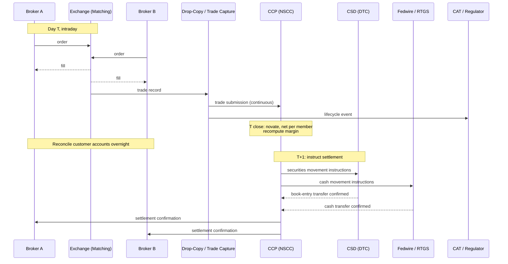

# T+1 Settlement Pipeline — Clearing, Netting, and the DTCC Plumbing

**Date:** 2026-04-30 | **Updated:** 2026-04-30
**Tags:** `system-design` `deep-dive` `fintech` `settlement` `batch`

> **Companion deep-dive** to [`../design-stock-exchange.md`](../design-stock-exchange.md), expanding the "Settlement — T+1 / T+2 Clearing Pipeline" subsection. The matching engine ends its responsibility the moment a trade is printed; this document picks up there and follows the cash and securities through clearing, netting, novation, margin, and the central-securities-depository plumbing that actually moves the money one business day later.

## Table of Contents

- [Summary](#summary)
- [Overview — Why Settlement Is Days, Not Microseconds](#overview--why-settlement-is-days-not-microseconds)
- [The Trade Lifecycle Across Systems](#the-trade-lifecycle-across-systems)
  - [Execution → Clearing → Settlement](#execution--clearing--settlement)
  - [The Three Books That Must Reconcile](#the-three-books-that-must-reconcile)
- [Settlement Cycles — T+0, T+1, T+2](#settlement-cycles--t0-t1-t2)
  - [Where Each Cycle Comes From](#where-each-cycle-comes-from)
  - [The 2024 Move From T+2 to T+1 in US Equities](#the-2024-move-from-t2-to-t1-in-us-equities)
  - [The T+0 Debate](#the-t0-debate)
- [The Central Counterparty (CCP)](#the-central-counterparty-ccp)
  - [DTCC, NSCC, LCH, CME Clearing — Who Does What](#dtcc-nscc-lch-cme-clearing--who-does-what)
  - [Novation — The CCP Becomes Both Counterparties](#novation--the-ccp-becomes-both-counterparties)
  - [Membership and Concentration Risk](#membership-and-concentration-risk)
- [Multilateral Netting](#multilateral-netting)
  - [Why Netting Reduces Gross by 95%+](#why-netting-reduces-gross-by-95)
  - [Netting Algorithm](#netting-algorithm)
  - [Continuous Net Settlement (CNS)](#continuous-net-settlement-cns)
- [Margin, Mark-to-Market, and Default Management](#margin-mark-to-market-and-default-management)
  - [Initial Margin and Variation Margin](#initial-margin-and-variation-margin)
  - [Intraday Margin Calls](#intraday-margin-calls)
  - [The Default Waterfall](#the-default-waterfall)
- [DvP — Delivery Versus Payment](#dvp--delivery-versus-payment)
  - [Why Atomicity Matters](#why-atomicity-matters)
  - [BIS DvP Models 1, 2, 3](#bis-dvp-models-1-2-3)
- [Settlement Failures and Buy-Ins](#settlement-failures-and-buy-ins)
  - [Fails-to-Deliver Tracking](#fails-to-deliver-tracking)
  - [Buy-In Mechanics](#buy-in-mechanics)
- [Cross-Border Settlement Messaging](#cross-border-settlement-messaging)
  - [SWIFT MT54x and ISO 20022](#swift-mt54x-and-iso-20022)
- [Reconciliation Pipeline](#reconciliation-pipeline)
  - [Trade Output → Confirmations → Settlement → Settled Positions](#trade-output--confirmations--settlement--settled-positions)
  - [Daily State Machine](#daily-state-machine)
- [Worked Example — Member Firm A on a Single Symbol Day](#worked-example--member-firm-a-on-a-single-symbol-day)
- [The Future — Project Ion, ASX CHESS, T+0 Experiments](#the-future--project-ion-asx-chess-t0-experiments)
- [Audit Trail Across Exchange → Clearing → Settlement](#audit-trail-across-exchange--clearing--settlement)
- [Anti-Patterns](#anti-patterns)
- [Related](#related)
- [References](#references)

## Summary

Settlement is the part of trading that does not happen on a screen — it is the part where actual cash and actual securities change hands between actual bank accounts and book-entry registers, audited by regulators, governed by statute, and built around the reality that **firms can default and goods can fail to deliver**. A US equity trade printed at 09:30:01.234 ET clears overnight at the **NSCC**, which **novates** itself in as the legal counterparty to both sides, **multilaterally nets** the day's billions of trades down to a few net obligations per member per security, recomputes **margin** against the resulting positions, and only the next business day (T+1, since May 2024) does the cash move via Fedwire and the securities move via book-entry at **DTC**. The system is days slow on purpose: those days exist for reconciliation, error correction, margin posting, and graceful default management. The matching engine's job ends at print; the settlement pipeline is its own world, with batch jobs, NSCC's Continuous Net Settlement (CNS), buy-in procedures for fails, ISO 20022 / SWIFT MT54x messages for cross-border legs, and a default waterfall that mutualizes losses across surviving members. Coupling matching to settlement is a category error; running real-time gross settlement at exchange-level scale destroys the netting efficiencies that make modern markets economically viable. This document walks the pipeline end to end — what each component is, why it exists, and what the worked numbers look like for a typical member firm at the close of a typical day.

## Overview — Why Settlement Is Days, Not Microseconds

A naive engineer reads "the matching engine prints a trade in 50 microseconds" and asks: why does the money take a day? The answer has three components, and all three are non-negotiable in a regulated market:

1. **Cash and securities are real.** A printed trade is a contractual claim, not a transfer. To complete the trade, USD must move from one bank account to another (Fedwire, in the US) and the security must move from one custody record to another (DTC's book-entry system). Both rails have their own batches, cutoffs, and reconciliation windows.
2. **Counterparty risk is a real loss event.** Between trade and settlement, the counterparty can default. A central counterparty (CCP) eats this risk by novating into both sides — but the CCP itself needs time to call margin, recompute risk, and absorb intraday losses before anyone touches actual money.
3. **Regulators audit, and the audit window costs time.** The SEC's Consolidated Audit Trail (CAT) requires complete order-lifecycle records by 8:00 AM T+1. Brokers reconcile customer accounts overnight to catch wrong-account, wrong-quantity, and out-of-balance errors before they become irreversible. Settlement that runs faster than reconciliation just propagates errors faster.

The matching engine and the settlement pipeline are decoupled by design. Matching cares about microseconds of latency and bit-exact determinism; settlement cares about reconciled state across the financial system. They share an interface (the printed trade) and nothing else. See [`./matching-engine-determinism.md`](./matching-engine-determinism.md) for the engine side and [`./pre-trade-risk-and-circuit-breakers.md`](./pre-trade-risk-and-circuit-breakers.md) for the risk gate that sits in front of it.

## The Trade Lifecycle Across Systems

### Execution → Clearing → Settlement



The execution stage is what most engineers think of when they think "stock exchange." The clearing stage is what most regulators think of. The settlement stage is what banks and custodians think of. All three are required.

### The Three Books That Must Reconcile

Three independent ledgers track the same trade and must agree at end-of-day:

| Book                | Owner                | What It Tracks                              |
|---------------------|----------------------|---------------------------------------------|
| **Trade book**      | Exchange / brokers   | Each printed trade, timestamped to the engine clock |
| **Clearing book**   | CCP (NSCC, LCH, etc.)| Net obligations per member after novation and netting |
| **Custody book**    | CSD (DTC, Euroclear) | Beneficial-ownership records of securities  |

Reconciliation between the three is a major operational job. A broker that disagrees with the CCP about its net obligation has to break the trade(s) responsible before T+1 cutoff or the discrepancy becomes a regulatory issue. See [`./audit-replay-regulatory-feeds.md`](./audit-replay-regulatory-feeds.md) for how the audit feeds make this reconciliation discoverable.

## Settlement Cycles — T+0, T+1, T+2

### Where Each Cycle Comes From

A settlement cycle is the gap between **trade date (T)** and **settlement date** — the day on which the cash and securities actually move. Different markets converged on different conventions for historical and operational reasons:

| Market / Instrument                             | Cycle | Notes |
|-------------------------------------------------|-------|-------|
| US equities                                     | T+1   | Moved from T+2 → T+1 on 2024-05-28 (SEC Final Rule) |
| US Treasuries                                   | T+1   | Already T+1 historically |
| Most European equities (UK, EU)                 | T+2   | T+2 for cash equities; some moves toward T+1 in flight |
| Japanese equities (TSE)                         | T+2   | T+1 transition under discussion |
| FX spot                                         | T+2   | "Settlement" via CLS Bank for the bulk of major-pair flow |
| Corporate bonds                                 | T+1 / T+2 | Varies by jurisdiction |
| Crypto exchanges (centralized)                  | T+0   | Internal book transfer; on-chain settlement varies |
| OTC derivatives (cleared)                       | varies| Daily margin, multi-day settlement on terminal events |

The cycle exists primarily to give the clearing house and member firms time to reconcile, recompute margin, fix breaks, and arrange the cash and securities — *not* because the technical transfer is slow.

### The 2024 Move From T+2 to T+1 in US Equities

The SEC's [final rule 34-96930](https://www.sec.gov/files/rules/final/2023/34-96930.pdf), adopted in February 2023 and effective 2024-05-28, shortened the standard settlement cycle for most US securities transactions from T+2 to T+1. The motivation was a mix of:

- **Counterparty-risk reduction.** A shorter cycle exposes participants to fewer days of mark-to-market exposure between trade and settlement, which directly reduces the margin a CCP must collect to cover that exposure.
- **GameStop fallout.** The January 2021 episode where retail brokers restricted trading was partly driven by spiking margin calls at NSCC; a shorter cycle reduces those calls.
- **Operational alignment.** US Treasuries already settled T+1; bringing equities into line simplified mixed-instrument workflows.

The transition required every brokerage, every back-office, and every cross-border desk that interfaces with US markets to compress their reconciliation windows by half. Trade affirmation (matching of broker and institutional records) had to move from T+1 morning to **T evening** — same day. Many firms had to build or buy automated affirmation tools to meet the 9:00 PM ET cutoff.

The structural cost was real: cross-border settlements where the foreign leg still settles T+2 now have a one-day mismatch, which is plugged with FX swaps or pre-funding. None of this is technically hard — it is operationally expensive at scale.

### The T+0 Debate

T+0 (same-day or instant settlement) is technically achievable and crypto markets do it natively. The argument against rolling it out across traditional markets is structural, not technological:

- **Pre-funding requirement.** T+0 means every buyer must have cash on hand before placing the order, and every seller must have the security on hand. This eliminates the **credit float** that the entire post-trade industry is built around.
- **Loss of netting.** Multilateral netting only works if there is a window during which to aggregate gross trades into net obligations. T+0 collapses that window to zero, which means every trade settles gross. Gross settlement at exchange-level volumes destroys the 95%+ reduction in payment flows that netting provides.
- **Operational error tolerance.** A wrong-account or wrong-symbol trade at T+0 is settled before anyone sees it. Reversing it requires a second trade (a "back-out"), which is operationally painful.

Project Ion (DTCC) and the canceled ASX CHESS replacement are the most ambitious recent attempts to use blockchain rails to enable optional T+0 alongside the existing T+1 default; the results, discussed below, are instructive.

## The Central Counterparty (CCP)

### DTCC, NSCC, LCH, CME Clearing — Who Does What

A **central counterparty (CCP)** is a regulated entity that interposes itself between buyer and seller after a trade is executed, becoming the legal counterparty to both sides. The major CCPs by market:

| CCP                              | Markets                                          |
|----------------------------------|--------------------------------------------------|
| **NSCC** (DTCC subsidiary)       | US equities, ETFs, corporate bonds, UITs         |
| **DTC** (DTCC subsidiary)        | US securities custody and book-entry settlement  |
| **FICC** (DTCC subsidiary)       | US Treasuries, MBS                               |
| **LCH** (LSEG subsidiary)        | Multi-asset; SwapClear is the dominant cleared-swaps venue |
| **CME Clearing**                 | Futures and options on CME / CBOT / NYMEX / COMEX|
| **EuroCCP / Cboe Clear Europe**  | European cash equities                           |
| **JSCC**                         | Japanese securities and derivatives              |

DTCC is unique in that it owns both the CCP for US equities (NSCC) **and** the central securities depository (DTC). That vertical integration is what makes DvP possible across a single legal entity — DTCC can atomically debit one custody record and credit another while the corresponding cash leg moves through Fedwire.

### Novation — The CCP Becomes Both Counterparties

When a trade is submitted to the CCP, the legal contract is **novated**: the original bilateral obligation between Broker A and Broker B is extinguished and replaced by two new obligations — Broker A ↔ CCP, and CCP ↔ Broker B. From that moment, neither broker has any contractual relationship with the other.

The economic effect is enormous:

- **Bilateral counterparty risk is eliminated.** A broker no longer cares whether the broker on the other side of its trade can pay; the broker's counterparty is the CCP.
- **The CCP concentrates risk** and is required by regulators to hold capital, default funds, and prefunded liquidity facilities to absorb that risk.
- **Anonymity is preserved.** Brokers do not need to know who they traded with; the CCP does.
- **Netting becomes possible.** Once every trade has the CCP as one side, the CCP can net the entire day's flows per member without needing per-counterparty bilateral agreements.

The trade-off, discussed below, is that the CCP becomes too-big-to-fail.

### Membership and Concentration Risk

A CCP has a small number of direct **clearing members** — typically large broker-dealers and banks. Smaller brokers and asset managers clear through a clearing member rather than directly. NSCC has roughly 60 direct clearing members; LCH SwapClear has roughly 100.

This produces a hub-and-spoke concentration: every trade in US equities terminates at NSCC, which terminates at DTC. A failure at DTCC would be a market-wide event. The Bank for International Settlements addresses this in the **Principles for Financial Market Infrastructures (PFMI)**, which spell out CCP capital, governance, and recovery requirements; see [BIS PFMI](https://www.bis.org/cpmi/publ/d101a.pdf).

## Multilateral Netting

### Why Netting Reduces Gross by 95%+

Without netting, every trade requires a gross movement: Broker A delivers 100 AAPL to Broker B, B delivers cash to A. With 1 million daily trades in AAPL across 60 members, the gross movement is 1 million distinct deliveries.

With **multilateral netting** at the CCP, each member's day in AAPL collapses to a single net position: "Member A is net long 3K AAPL across all counterparties; deliver 3K to Member A; collect $X cash from Member A." Across 60 members, AAPL day-end produces at most 60 net positions, not 1 million.

DTCC's published figures put the netting efficiency for NSCC at roughly **98% reduction** of gross trade obligations. That is the reason settlement at planet scale is even possible.

### Netting Algorithm

```python
# Multilateral netting per (member, security) for one trading day.
# Input: list of trades, each (buyer, seller, symbol, qty, price, fee)
# Output: net obligations per (member, symbol) and per member cash position.

def multilateral_net(trades):
    # Per-member, per-symbol position deltas.
    securities = defaultdict(lambda: defaultdict(int))  # member -> symbol -> qty
    cash = defaultdict(Decimal)                         # member -> cash delta

    for t in trades:
        # Buyer: receive shares, pay cash (+fees).
        securities[t.buyer][t.symbol] += t.qty
        cash[t.buyer] -= t.qty * t.price + t.fee

        # Seller: deliver shares, receive cash (-fees).
        securities[t.seller][t.symbol] -= t.qty
        cash[t.seller] += t.qty * t.price - t.fee

    # Build settlement obligations.
    obligations = []
    for member, by_symbol in securities.items():
        for symbol, net_qty in by_symbol.items():
            if net_qty == 0:
                continue
            direction = "RECEIVE" if net_qty > 0 else "DELIVER"
            obligations.append(Obligation(
                member=member,
                symbol=symbol,
                qty=abs(net_qty),
                direction=direction,
            ))

    cash_obligations = [
        CashObligation(
            member=member,
            amount=delta,
            direction="PAY" if delta < 0 else "RECEIVE",
        )
        for member, delta in cash.items() if delta != 0
    ]

    return obligations, cash_obligations
```

This is intentionally simple — it ignores fails-to-deliver carried over from the prior day, intraday novation timing, sub-account allocation, and a thousand other real-world details. The shape of the algorithm, however, is what NSCC actually runs. The point is that it is a **batch** computation: the whole day's trades go in, net obligations come out, and the CCP commits to those obligations as the basis for tomorrow's settlement.

### Continuous Net Settlement (CNS)

NSCC's **Continuous Net Settlement** is the live, multi-day version of the netting above. CNS:

- Maintains a running net obligation per (member, security).
- **Rolls fails forward.** If a member fails to deliver on T+1, the obligation does not extinguish — it accrues to the next day's net position. This reduces the operational burden of resolving each fail individually.
- Generates **stock and cash settlement instructions** to DTC and the cash side, respectively.
- Reports daily to members via the CCP membership portal and via standardized files.

CNS is the backbone of US equity settlement. See [DTCC's CNS overview](https://www.dtcc.com/clearing-services/equities-clearing-services/cns).

## Margin, Mark-to-Market, and Default Management

### Initial Margin and Variation Margin

A CCP requires every clearing member to post:

- **Initial margin (IM):** collateral covering potential future exposure on open positions, sized to cover near-worst-case price moves (e.g., a 99% confidence interval over a 2-day horizon).
- **Variation margin (VM):** daily settlement of mark-to-market gains and losses. Members with adverse moves pay VM into the CCP; members with favorable moves receive VM.

Both are enforced through margin calls. A simple VM calculation for an end-of-day equity position:

```python
def end_of_day_vm(member, positions, eod_prices, prior_eod_prices):
    """
    Variation margin = today's mark-to-market change on open positions.
    Negative VM means the member owes the CCP; positive means the CCP owes the member.
    """
    vm = Decimal("0")
    for symbol, qty in positions.items():
        prior = prior_eod_prices[symbol]
        today = eod_prices[symbol]
        delta = today - prior
        # Long position gains when price rises; short position gains when price falls.
        vm += qty * delta
    return vm

# Worked example: member long 10K AAPL, prior close $185.00, today close $182.50.
# vm = 10_000 * (182.50 - 185.00) = -$25,000 → member must wire $25,000 VM.
```

VM settles in cash through the cash leg of the settlement pipeline, typically same-day or next-morning Fedwire.

### Intraday Margin Calls

In volatile markets, end-of-day margin is not enough. CCPs run **intraday margin calculations** — typically every few hours, sometimes every minute on stress days — and issue **intraday margin calls** when a member's position breaches a threshold. Members must wire collateral within a tight window (often 30 minutes to 1 hour). Failure to meet a margin call is a default event.

This is the mechanism that drove the GameStop episode: NSCC's intraday margin requirement on a handful of brokers spiked because the volatility component of the IM model went vertical. The brokers, lacking the cash to post immediately, restricted trading on the affected symbols rather than face a default.

### The Default Waterfall

When a clearing member defaults — fails to meet a margin call, or formally enters insolvency — the CCP draws on layered loss-absorbing resources in a prescribed order:

```text
Default waterfall (in order):
1. Defaulting member's posted initial margin
2. Defaulting member's contribution to the default fund
3. CCP's "skin in the game" capital
4. Mutualized default fund (surviving members' contributions)
5. Assessment powers (the CCP can call additional capital from members)
6. Recovery / resolution (regulator-led)
```

The defaulting member's own resources are exhausted first. Only after that does the loss become **mutualized** across surviving members through the default fund. The mutualization step is what makes CCP membership a genuine risk pool: the surviving members are paying for a competitor's failure.

The CCP's risk-management job is to size IM and the default fund such that the probability of breaching the mutualized layer is vanishingly small. PFMI Principle 4 ("Credit risk") specifies "cover 2" — the CCP must hold resources sufficient to absorb the simultaneous default of its two largest members under extreme but plausible market conditions. See [DTCC Default Management](https://www.dtcc.com/risk-management/default-management).

## DvP — Delivery Versus Payment

### Why Atomicity Matters

If securities and cash move on separate tracks with no atomicity guarantee, a participant can lose to **principal risk**: deliver the security and never receive the cash, or vice versa. The 1974 Herstatt Bank failure — where the bank's counterparties had paid Deutsche Marks before Herstatt was closed and never received the offsetting US dollars — is the canonical example of why atomicity matters.

**Delivery versus Payment (DvP)** ensures the two legs are conditional on each other: the securities transfer only happens if the cash transfer happens, and vice versa. From a distributed-systems perspective, this is exactly the [atomic-commit problem](../../../data-consistency/distributed-transactions.md) — except the participants are the CSD and the central bank, not two databases.

### BIS DvP Models 1, 2, 3

The Bank for International Settlements distinguishes three DvP models in its CPMI standards:

- **Model 1 — Gross, simultaneous.** Each trade settles individually with simultaneous transfer of securities and funds. Used by Fedwire Securities for US Treasuries.
- **Model 2 — Gross securities, net cash.** Each securities transfer settles individually; cash is netted and settled in batches. NSCC/DTC uses something close to this for US equities.
- **Model 3 — Net securities, net cash.** Both legs settle on a multilateral net basis. Used by some European CSDs.

Atomicity in any of these models requires the CSD and the cash agent (Fedwire, central bank, or commercial bank) to coordinate. DTCC's vertical integration of NSCC + DTC simplifies this enormously — both legs are within one corporate group and one technical platform.

## Settlement Failures and Buy-Ins

### Fails-to-Deliver Tracking

Despite all of the above, **fails happen.** A fail-to-deliver (FTD) is a settlement obligation that did not deliver on its scheduled settlement date. Causes include:

- The selling member did not have the security in their custody account by cutoff (administrative error, or short sale not borrowed in time).
- A custody transfer broke (CSD-level operational issue).
- A linked corporate action timing issue (rights, splits, dividends in the way).

Under CNS, fails are not extinguished — they roll forward and accrue interest charges to the failing member. The SEC publishes a [fails-to-deliver dataset](https://www.sec.gov/data-research/foia-services/frequently-requested-foia-document-fails-deliver-data) twice a month; persistent fails on a single security can trigger Regulation SHO close-out requirements.

### Buy-In Mechanics

If a fail persists past a regulatory threshold (typically 13 settlement days under Reg SHO), the CCP or the receiving member can initiate a **buy-in**:

```text
Buy-in flow:
1. Receiving member files buy-in notice.
2. Failing member is given a final cure window (1–2 days).
3. If still uncured, the receiving member buys the security in the open market.
4. The cost of the buy-in is charged back to the failing member.
5. CNS extinguishes the fail.
```

Buy-ins are operationally painful and expensive — they are designed to be, so that members have economic incentive to cure fails before reaching that point.

## Cross-Border Settlement Messaging

### SWIFT MT54x and ISO 20022

Cross-border trades — a New York hedge fund buying a German stock from a London broker — involve multiple CSDs, custodians, and currencies. The standardized messages that move through this plumbing are:

| Message    | Purpose                                                |
|------------|--------------------------------------------------------|
| MT540      | Receive Free (no payment leg)                          |
| MT541      | Receive Against Payment (DvP buy)                      |
| MT542      | Deliver Free (no payment leg)                          |
| MT543      | Deliver Against Payment (DvP sell)                     |
| MT544–547  | Confirmations / status of the above                    |
| MT548      | Settlement Status and Processing Advice                |
| sese.023   | ISO 20022 successor: Securities Settlement Transaction |

ISO 20022 is gradually replacing the legacy MT format. The ISO 20022 messages are XML, richer (more structured fields, less free-text), and align with the same vocabulary used in payments (pacs / pain / camt). [ISO 20022](https://www.iso20022.org/) publishes the canonical schemas.

A cross-border equity trade typically generates a chain: the originating broker sends MT541 to its global custodian; the global custodian forwards MT541 to its sub-custodian in the target market; the sub-custodian instructs the local CSD; settlement confirmation flows back through the chain as MT544 / MT545 / MT548. Each hop is a separate operational risk point.

## Reconciliation Pipeline

### Trade Output → Confirmations → Settlement → Settled Positions

```text
T (trade date), intraday:
  Matching engine ──prints trade──> Drop-copy ──> Trade-capture system
  Trade-capture ──submits──> CCP (NSCC, continuously)
  Trade-capture ──affirms with counterparty broker (T evening cutoff for T+1)──>

T close:
  CCP novates and nets ──> CNS produces net obligations per (member, security)
  CCP runs end-of-day margin ──> margin calls issued
  Brokers reconcile customer accounts ──> identify breaks ──> file corrections

T+1 morning:
  Margin payments settle (Fedwire)
  CCP issues settlement instructions to DTC (securities) and Fedwire (cash)

T+1 by cutoff:
  DTC processes book-entry transfers
  Fedwire processes cash transfers
  Settlement confirmations flow back
  Failing trades are flagged and rolled into next day's CNS

T+1 8:00 AM:
  CAT submission deadline for full lifecycle data from prior day
```

### Daily State Machine

```python
class TradeSettlementState(Enum):
    EXECUTED        = "executed"          # printed at the matching engine
    CAPTURED        = "captured"          # in the trade-capture system
    SUBMITTED_CCP   = "submitted_ccp"     # accepted by CCP
    NOVATED         = "novated"           # CCP is now the counterparty
    NETTED          = "netted"            # absorbed into a net obligation
    INSTRUCTED      = "instructed"        # settlement instructions issued to CSD/cash agent
    SETTLED         = "settled"           # both legs confirmed
    FAILED          = "failed"            # not settled by cutoff; rolled forward
    BOUGHT_IN       = "bought_in"         # buy-in completed; fail extinguished
    CANCELLED       = "cancelled"         # broken trade; voided pre-novation

# Allowed transitions:
#   EXECUTED -> CAPTURED -> SUBMITTED_CCP -> NOVATED -> NETTED -> INSTRUCTED
#                                                                  |
#                                                                  +-> SETTLED
#                                                                  +-> FAILED -> {SETTLED next day, BOUGHT_IN}
#   any pre-NOVATED state -> CANCELLED (broken trade, both sides agree)
#   NOVATED+ states cannot be cancelled — only settled, failed, or bought in
```

The state machine is durable and recoverable per trade, the same shape as the [checkout saga state](../../e-commerce/amazon-ecommerce/checkout-saga.md) — every transition is logged, the system can resume from the last persisted state, and reconciliation works against the persisted history.

## Worked Example — Member Firm A on a Single Symbol Day

Member firm A trades AAPL throughout the day across many counterparties. At end-of-session, the gross trade list looks like:

```text
Member A intraday AAPL trades (sample):
  09:31:02   BUY   500   @ $185.10
  09:33:18   SELL  200   @ $185.20
  09:45:00   BUY   1,200 @ $185.05
  ...
  15:58:44   SELL  300   @ $184.92

Total gross: 1,000 trades involving Member A
  Gross buys:  +600,000 shares
  Gross sells: -597,000 shares
  Net:         +3,000 shares (long)
  Net cash:    -$554,910 (member owes ~$554,910 net)
```

Without netting, Member A would face 1,000 individual settlement obligations — 1,000 cash transfers, 1,000 securities transfers, 1,000 reconciliation entries. With multilateral netting at NSCC:

```text
Member A end-of-day AAPL settlement obligations:
  Securities: receive 3,000 AAPL from CCP (book-entry credit at DTC)
  Cash:       pay $554,910 to CCP (Fedwire debit)
```

**One** securities obligation, **one** cash obligation. Across all members trading AAPL, the day's entire activity collapses into ~60 securities obligations (one per member) and ~60 cash obligations.

Margin: AAPL closed down $0.40 from prior close. Member A's overnight long of 3,000 shares plus existing inventory produces a VM of:

```text
VM(AAPL) = (existing_inventory + 3,000) * (today_close - prior_close)
        = (existing_inventory + 3,000) * (-$0.40)
```

This VM is wired the next morning before settlement runs.

If a related fail from prior day exists (say Member A failed to deliver 500 AAPL on T-1 because of a custody break), CNS rolls the fail forward and Member A's obligation today becomes "receive 3,000 - 500 = 2,500 AAPL net" — the prior fail is netted against today's obligation automatically. This is the core operational benefit of CNS over per-trade settlement.

## The Future — Project Ion, ASX CHESS, T+0 Experiments

The plumbing described above is roughly forty years old in its broad shape. Two recent experiments tried to replace pieces of it with distributed-ledger technology:

**Project Ion (DTCC).** Launched into production August 2022 as a [parallel platform to CNS](https://www.dtcc.com/dtcc-connection/articles/2022/august/22/project-ion-launches-into-production), running a permissioned distributed ledger for selected US equity transactions. Ion settles on a T+1 or T+0 basis at member request, while running alongside the legacy systems as a backup. As of 2026 it remains a **shadow** platform — production live, but only a fraction of total volume — and it has demonstrated that the technical ledger problem is solvable; the harder problem is the surrounding ecosystem (custodians, brokers, downstream consumers all coupled to legacy formats).

**ASX CHESS Replacement (canceled).** The [Australian Securities Exchange](https://www.asx.com.au/about/regulation/clearing-and-settlement-services/chess-replacement) announced in 2017 a project to replace its CHESS settlement system with a Digital Asset blockchain-based platform. After multiple delays and a critical 2022 review, the project was canceled in November 2022 with **A$250M+ written off**. The lessons were largely operational: a replacement of a market-critical platform requires much higher operational confidence than a technical proof-of-concept; the testing surface, integration partners, and regulatory sign-off cost dwarf the development cost.

The takeaway is that T+0 settlement on a distributed ledger is technically feasible, but the surrounding system — netting economics, margin frameworks, default management, regulator audit, broker reconciliation — is built around a multi-day cycle. A meaningful T+0 future requires re-engineering the entire ecosystem, not just the ledger.

## Audit Trail Across Exchange → Clearing → Settlement

Every event in the lifecycle is independently logged in an immutable audit trail:

- **Exchange:** every order lifecycle event captured for [CAT](https://www.catnmsplan.com/) submission by 8:00 AM T+1.
- **CCP:** every novation, netting batch, margin call, and default-fund movement.
- **CSD:** every book-entry transfer.
- **Cash agent (Fedwire):** every wire.

Cross-system reconciliation is the regulator's job: the SEC, FINRA, and CFTC pull from each system and look for breaks. A discrepancy between the exchange's record of a trade and the CCP's record of the same trade is a finding that requires written explanation. This is why the audit pipeline ([`./audit-replay-regulatory-feeds.md`](./audit-replay-regulatory-feeds.md)) is treated as critical infrastructure equal to the matching engine itself.

## Anti-Patterns

- **Coupling matching to settlement.** Putting any settlement logic on the matching critical path destroys both — matching becomes slow and stochastic, settlement becomes coupled to engine load. Settlement is its own pipeline, period.
- **Real-time gross settlement at exchange-level scale.** Without netting, every trade requires its own securities and cash movement. Even modern rails cannot sustain this at NYSE volumes; the netting reduction is what makes the system work. Use RTGS for high-value individual transfers, not for high-volume retail trading.
- **Per-trade SWIFT messages without netting.** Cross-border trade flow that emits one MT541 per trade and never aggregates is operationally expensive and slow. Pre-netting at the broker / global custodian level is the standard pattern.
- **Treating settlement failure as a transient exception.** Fails are not retries — they are settlement obligations that missed cutoff and require explicit handling (CNS roll-forward, cure period, buy-in). Code that treats `SETTLEMENT_FAILED` as `try again next minute` will produce regulatory issues.
- **Skipping novation modeling in the trade lifecycle.** Without explicit novation states, the system cannot answer "who is the legal counterparty right now?" — which is the question regulators and risk managers ask first.
- **End-of-day margin only, no intraday.** A market that gaps 5% intraday and only computes margin at the close has already realized a day of unmargined exposure. Intraday margin calls are not optional in modern markets.
- **Coupling default-fund accounting to live settlement transactions.** Default-waterfall draws are infrequent but must be auditable independently of routine settlement; a separate ledger keeps this clean.
- **Ignoring the cross-border cycle mismatch.** US T+1 + EU T+2 produces a one-day funding gap. Pretending it does not exist creates an FX or treasury problem on Day +1.
- **Using "T+1" as a hard SLA inside the engine.** Settlement happens via the CCP and CSD on calendar days. Engine-side logic that hardcodes "settle in 86,400,000 ms" misses holidays, half-days, and exchange-specific rules. Use a market calendar service.
- **Storing the netting batch in the same database as live trade output.** The netting computation is heavy and runs end-of-day; isolate it on its own infrastructure so it cannot starve intraday systems.
- **Treating fails as a customer-facing issue.** Fails are mostly invisible to retail customers under CNS; making them visible creates fear without information. The broker resolves them silently most of the time.
- **Single audit trail mixing engine and settlement events.** Audit per stage; reconcile across stages. A single combined log is harder to reason about and harder to expose to regulators selectively.

## Related

- [`../design-stock-exchange.md`](../design-stock-exchange.md) — parent case study; this doc expands the Settlement subsection.
- [`./matching-engine-determinism.md`](./matching-engine-determinism.md) — companion deep-dive on the engine that produces the trade prints fed into the settlement pipeline.
- [`./pre-trade-risk-and-circuit-breakers.md`](./pre-trade-risk-and-circuit-breakers.md) — the gate in front of the engine; settlement-side margin calls are conceptually downstream of pre-trade risk.
- [`./audit-replay-regulatory-feeds.md`](./audit-replay-regulatory-feeds.md) — CAT, drop-copy, and the regulator-grade audit trail that spans exchange → clearing → settlement.
- [`../design-payment-system.md`](../design-payment-system.md) — the auth-vs-capture split in card networks parallels the match-vs-settle split here; both decouple latency-sensitive decisions from durable money movement; the double-entry ledger discussion in particular is directly applicable.
- [`../../../batch-and-stream/batch-vs-stream-processing.md`](../../../batch-and-stream/batch-vs-stream-processing.md) — settlement is a textbook example of why batch is the right tool for the post-trade window despite the streaming nature of trade execution.
- [`../../../data-consistency/distributed-transactions.md`](../../../data-consistency/distributed-transactions.md) — DvP atomicity is a special case of the atomic-commit problem; the saga and 2PC arguments map directly onto cross-CSD settlement.

## References

- SEC, ["Final Rule: Shortening the Securities Transaction Settlement Cycle (Release 34-96930)"](https://www.sec.gov/files/rules/final/2023/34-96930.pdf), 2023 — the rule that moved US equities from T+2 to T+1 effective 2024-05-28.
- DTCC, ["T+1 Settlement"](https://www.dtcc.com/ust1) — DTCC's overview of the transition, member readiness, and operational impact.
- DTCC, ["Continuous Net Settlement (CNS)"](https://www.dtcc.com/clearing-services/equities-clearing-services/cns) — the canonical NSCC clearing service that nets and rolls forward US equity obligations.
- DTCC, ["Default Management"](https://www.dtcc.com/risk-management/default-management) — the default waterfall and recovery framework at NSCC and FICC.
- Bank for International Settlements / CPMI-IOSCO, ["Principles for Financial Market Infrastructures"](https://www.bis.org/cpmi/publ/d101a.pdf), 2012 — the international standard for CCP, CSD, and payment-system risk management; PFMI Principle 4 (credit risk, "cover 2") is the most-cited section in CCP design.
- ISO 20022, ["Universal Financial Industry Message Scheme"](https://www.iso20022.org/) — XML-based message standard replacing legacy SWIFT MT for securities and payments; sese.023 is the securities-settlement transaction successor to MT541/543.
- LCH, ["SwapClear"](https://www.lch.com/services/swapclear) — the dominant cleared interest-rate-swap CCP; provides the reference for OTC-derivatives clearing economics.
- ASX, ["CHESS Replacement"](https://www.asx.com.au/about/regulation/clearing-and-settlement-services/chess-replacement) — the canceled blockchain-based settlement program; a working post-mortem of why technically-correct does not equal market-ready.
- DTCC, ["Project Ion Launches Into Production"](https://www.dtcc.com/dtcc-connection/articles/2022/august/22/project-ion-launches-into-production), 2022 — the live but shadow distributed-ledger settlement platform running alongside legacy CNS.
- SEC, ["Fails-to-Deliver Data"](https://www.sec.gov/data-research/foia-services/frequently-requested-foia-document-fails-deliver-data) — twice-monthly published data on fails; a useful empirical view of how often settlement actually breaks.
- Bank for International Settlements, ["Delivery Versus Payment in Securities Settlement Systems"](https://www.bis.org/cpmi/publ/d06.pdf), 1992 — the original CPMI report defining DvP Models 1, 2, 3; still the canonical reference.
- Pirrong, Craig, ["The Economics of Central Clearing: Theory and Practice"](https://www.isda.org/a/yiEDE/the-economics-of-central-clearing-theory-and-practice.pdf), ISDA Discussion Paper, 2011 — academic treatment of CCP novation, netting, and default-fund mutualization economics.
- Duffie, Darrell, ["Resolution of Failing Central Counterparties"](https://www.darrellduffie.com/uploads/policy/DuffieResolutionCCP2014.pdf), 2014 — analytical treatment of CCP recovery and resolution that informed post-2008 regulatory frameworks.
