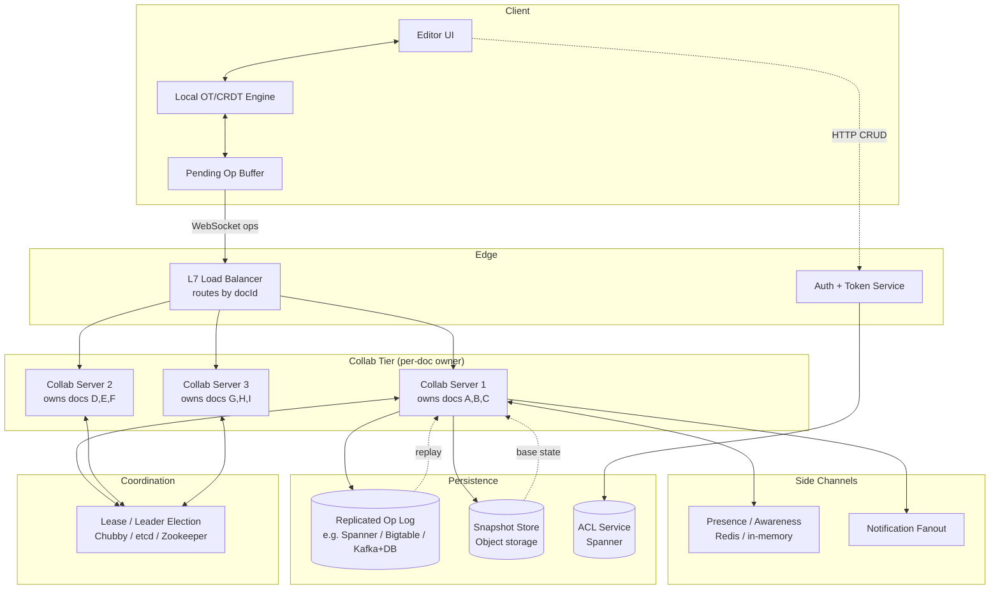

# Design Google Docs / Collaborative Editor — OT, CRDT, and the Per-Doc Sequencer

**Date:** 2026-04-25 | **Updated:** 2026-04-25
**Tags:** `system-design` `case-study` `collaborative-editor` `ot` `crdt` `real-time`

## Table of Contents

- [Summary](#summary)
- [Functional Requirements](#functional-requirements)
- [Non-Functional Requirements](#non-functional-requirements)
- [Capacity Estimation](#capacity-estimation)
- [API Design](#api-design)
- [Data Model](#data-model)
- [HLD Diagram](#hld-diagram)
- [Deep Dives](#deep-dives)
  - [OT vs CRDT — Two Roads to Convergence](#ot-vs-crdt--two-roads-to-convergence)
  - [Per-Document Single-Writer / Sequencer](#per-document-single-writer--sequencer)
  - [Snapshot + Op-Log Compaction](#snapshot--op-log-compaction)
  - [Offline Merge](#offline-merge)
  - [Cursor and Presence](#cursor-and-presence)
  - [History and Time-Travel](#history-and-time-travel)
  - [Permissions and ACL](#permissions-and-acl)
  - [Comments and Suggestions](#comments-and-suggestions)
  - [Scaling Editors per Doc](#scaling-editors-per-doc)
- [Bottlenecks and Trade-offs](#bottlenecks-and-trade-offs)
- [Anti-Patterns](#anti-patterns)
- [Related](#related)
- [References](#references)

## Summary

A collaborative editor like Google Docs lets dozens of people type into the same document simultaneously, sees their cursors, comments, and selections, replays history, and survives flaky networks. The hard part is not the UI; it is making concurrent edits **converge** to the same final state on every client without anyone noticing the negotiation. There are two well-known mechanical answers: **Operational Transformation (OT)** — used by Google Docs and Wave — where a central server linearizes operations and clients transform their pending edits against the authoritative sequence; and **Conflict-Free Replicated Data Types (CRDTs)** — used by Yjs, Automerge, Figma's variant — where every operation carries enough metadata to merge anywhere with anyone in any order. Both approaches sit on top of the same skeleton: a per-document sequencer, an op log, periodic snapshots, a WebSocket fan-out, and a transient presence channel.

This document is an HLD walkthrough of that skeleton. It assumes you've designed REST CRUD systems before and are now reaching for the harder territory: shared mutable state across many writers in real time.

## Functional Requirements

A senior interview will list these explicitly; some are easy to miss until a reviewer asks "what about offline?"

| # | Requirement | Notes |
|---|-------------|-------|
| 1 | **Multi-user concurrent editing** | N users typing into the same doc, sub-second propagation |
| 2 | **Presence** | Who is online in the doc right now, with avatar/color |
| 3 | **Live cursors and selections** | Where each user's caret is; their highlighted range |
| 4 | **Comments and suggestions** | Anchored to a range that survives later edits |
| 5 | **History / version timeline** | View any past state, restore, see who changed what |
| 6 | **Offline edits + merge on reconnect** | Type on a plane, sync when Wi-Fi returns |
| 7 | **Permissions** | Owner / editor / commenter / viewer; per-link and per-user |
| 8 | **Sharing** | Invite by email, share by link, transfer ownership |
| 9 | **Search inside doc / across docs** | Out of scope here; usually a separate index pipeline |
| 10 | **Export / import** | DOCX, PDF, ODT — separate worker fleet |

For HLD scope, focus on 1–8.

## Non-Functional Requirements

| Dimension | Target |
|-----------|--------|
| **Edit propagation latency** | p50 < 100 ms within a region, p99 < 300 ms cross-region |
| **Cursor propagation latency** | p99 < 200 ms — feels like a video game |
| **Concurrent editors per doc** | 100+ supported, soft cap ~200, fallback to read-only beyond |
| **Convergence** | Strong eventual consistency: all replicas with same op set produce same state |
| **Durability** | Zero data loss for any acknowledged op (synchronous fsync to replicated log) |
| **Availability** | 99.95% per doc; brief leader handoff acceptable |
| **Offline** | Multi-day offline edits replay correctly |
| **History retention** | Indefinite for paid tiers; minute-grain near present, coarser when older |
| **Security** | Every op authenticated and authorized; transport TLS; at-rest encryption |

## Capacity Estimation

Round numbers, the way you'd reason on a whiteboard.

- Active docs at any moment: **~10M** (Google scale; smaller startup ~100k).
- Average editors per active doc: **2–3**, P99 doc has **100+**.
- Op rate per active editor while typing: **~5 ops/sec** (one op per keystroke or small batch).
- Average doc op rate: **10 ops/sec** under collaboration; idle docs ~0.
- Aggregate ops/sec system-wide: 10M docs × ~1 op/sec amortized = **10M ops/sec** peak. Realistically far less; only a small fraction are actively edited.
- Op size on the wire: **~80–200 bytes** (JSON or compact binary with offset, length, content, metadata).
- Op log growth per doc: 5 ops/sec × 200 B × 3600 s = **~3.6 MB/hour** while collaborating; trimmed by snapshots.
- Snapshot size: a 50-page doc ≈ **~200 KB** of structured content, ~1 MB with formatting.
- WebSocket connections: 10M docs × 2 editors avg = **~20M open sockets** at peak; horizontally sharded across collab servers (200k–500k sockets per node with tuned kernel).
- Storage: snapshot + tail of op log + indexed history ≈ **~5 MB/doc** average steady state.

These numbers tell you the system is **fan-out and connection-bound**, not CPU-bound. Memory per editor (presence + buffer) and socket count per host dominate capacity planning.

## API Design

Two surfaces: an HTTP **control plane** for CRUD, sharing, and history, and a **WebSocket data plane** for the live op stream. Cursors and presence ride on a separate logical channel multiplexed over the same socket.

### HTTP — Control Plane

```http
POST   /v1/docs                          # create doc
GET    /v1/docs/{docId}                  # metadata + latest snapshot pointer
PATCH  /v1/docs/{docId}                  # rename, move
DELETE /v1/docs/{docId}                  # trash

POST   /v1/docs/{docId}/share            # add ACL entry
GET    /v1/docs/{docId}/acl
DELETE /v1/docs/{docId}/acl/{principal}

GET    /v1/docs/{docId}/snapshot?at=ts   # historical snapshot for time-travel
GET    /v1/docs/{docId}/ops?from=v&to=v  # paginated op log slice
GET    /v1/docs/{docId}/versions         # named/auto checkpoints

POST   /v1/docs/{docId}/comments         # create comment with anchor
PATCH  /v1/docs/{docId}/comments/{id}    # resolve / reply
```

### WebSocket — Op Stream

Client opens `wss://collab.example.com/v1/docs/{docId}` with a short-lived collab token issued by the auth service after ACL check.

#### Client → Server frames

```jsonc
// Send ops; baseVersion is the last server version the client knows about
{
  "type": "ops",
  "docId": "doc_abc",
  "baseVersion": 4218,
  "clientId": "c_9f3",
  "seq": 17,                      // monotonic per-client sequence
  "ops": [
    { "op": "insert", "pos": 142, "text": "hello " },
    { "op": "delete", "pos": 200, "len": 3 }
  ]
}

// Cursor + selection — separate channel, ephemeral, not durable
{ "type": "cursor", "clientId": "c_9f3", "pos": 148, "selection": [148, 160] }

// Awareness ping
{ "type": "ping" }
```

#### Server → Client frames

```jsonc
// Authoritative ack with assigned version range
{ "type": "ack", "clientId": "c_9f3", "seq": 17, "fromVersion": 4219, "toVersion": 4220 }

// Broadcast of someone else's transformed ops
{ "type": "ops", "version": 4221, "byClientId": "c_a02",
  "ops": [{ "op": "insert", "pos": 148, "text": "world" }] }

// Full presence snapshot on join, deltas afterwards
{ "type": "presence", "users": [{ "clientId": "c_a02", "name": "Lin", "color": "#3aa" }] }

// Cursor broadcast
{ "type": "cursor", "clientId": "c_a02", "pos": 153, "selection": [153, 158] }
```

### Op Format and IDs

An op carries enough metadata to be **(re)applied or transformed** against the authoritative log:

- `op`: discriminator (`insert`, `delete`, `retain`/`format`, `setAttr`)
- `pos` / `range` for textual ops; CRDT variants instead carry **logical positions** (e.g., Yjs uses `(clientId, clock)` identifiers, Automerge uses Lamport-style op IDs)
- `text` / `len` payload
- `clientId` + `seq` from client; the **server** assigns a monotonic `version` (Lamport-like)
- For OT, the `baseVersion` is critical: it tells the server which ops the client has *already* seen. The server must transform incoming ops against any ops between `baseVersion` and the current head before broadcasting.

Op IDs are typically `(clientId, seq)` so they survive reordering and dedup is trivial.

## Data Model

Three logical stores, each with very different access patterns.

### Document Snapshots — Persistent

```sql
CREATE TABLE doc_snapshot (
  doc_id      UUID NOT NULL,
  version     BIGINT NOT NULL,         -- server-assigned, monotonic per doc
  created_at  TIMESTAMPTZ NOT NULL,
  size_bytes  INT,
  blob_ref    TEXT NOT NULL,           -- pointer into object storage (GCS/S3)
  is_named    BOOLEAN DEFAULT FALSE,   -- explicit user save vs auto checkpoint
  PRIMARY KEY (doc_id, version)
);
```

Snapshots are immutable blobs in object storage; the row is metadata. Latest snapshot per doc is hot in cache.

### Op Log — Append-Only

```sql
CREATE TABLE doc_op (
  doc_id       UUID NOT NULL,
  version      BIGINT NOT NULL,        -- gapless ascending per doc_id
  client_id    TEXT NOT NULL,
  client_seq   BIGINT NOT NULL,
  op_type      SMALLINT NOT NULL,
  payload      BYTEA NOT NULL,         -- compact binary
  ts           TIMESTAMPTZ NOT NULL,
  PRIMARY KEY (doc_id, version)
);
CREATE UNIQUE INDEX doc_op_dedup ON doc_op (doc_id, client_id, client_seq);
```

The dedup index is what lets a client safely retry: the server is idempotent with respect to `(client_id, client_seq)`. Once a snapshot at version V is durable, ops with `version < V - retention` are trimmed.

### Presence — Ephemeral

Held in memory on the per-doc owner server, optionally mirrored to a Redis Cluster or a dedicated awareness CRDT. **Never persisted.** Yjs explicitly separates this as the *Awareness CRDT*; Google Docs treats presence as a side channel that does not flow through the OT pipeline.

### Comments & Suggestions

```sql
CREATE TABLE doc_comment (
  doc_id       UUID NOT NULL,
  comment_id   UUID NOT NULL,
  anchor       JSONB NOT NULL,         -- (start_op_id, end_op_id) or stable anchor
  body         TEXT,
  author       UUID,
  status       TEXT,                   -- open, resolved, deleted
  created_at   TIMESTAMPTZ,
  PRIMARY KEY (doc_id, comment_id)
);
```

The trick here is the **anchor**. A naive `(start_offset, end_offset)` breaks the moment someone inserts text earlier in the document. Real systems anchor to **op IDs** (the insert ops that produced the start/end characters), so the comment slides with the text it refers to.

## HLD Diagram



The unfamiliar pieces compared to a typical request/response service:

- **Routing by `docId`**: the LB / proxy layer must consistent-hash on doc id so all clients of the same doc land on the same collab server. Otherwise the per-doc sequencer property is lost.
- **Lease/lock service** owns the assignment of doc → server and handles failover.
- **Persistence is a log + snapshot**, not a row in a table that gets `UPDATE`'d. Every accepted op is appended.

## Deep Dives

### OT vs CRDT — Two Roads to Convergence

Both solve the same problem ("two users edit the same byte; converge"), with very different mechanics.

#### Operational Transformation (OT)

Two operations `op1` and `op2` are issued concurrently from the same base state. A **transformation function** `T(opA, opB) → (opA', opB')` rewrites them so that applying `opA` then `opB'` yields the same state as applying `opB` then `opA'`.

Classic example with text:

```
Base:           "ABC"
Alice (pos=1):  insert "X"      → "AXBC"
Bob   (pos=3):  insert "Y"      → "ABCY"
```

If the server received Alice first and assigned her version V+1, when Bob's op (at base V) arrives, the server transforms Bob's op against Alice's:

```
T(Bob.insert@3, Alice.insert@1) = Bob.insert@4
```

Now applying Bob's transformed op to "AXBC" yields "AXBCY" — same as applying Alice's to "ABCY" → "AXBCY". **Convergence achieved.**

Real OT systems must satisfy two properties:

- **TP1** (transformation property 1): for any two concurrent ops, transforming each against the other produces convergent state. Required for the central-server model.
- **TP2**: needed only for fully decentralized OT (no central server); much harder, source of decades of bugs in research papers.

Google's choice — *central server reorders ops, clients transform against authoritative tail* — only needs TP1. This is why **Google Docs uses OT, not CRDT**: it works, the server is already there, and the math is simpler in a centralized model. The Wave whitepaper documents this precisely; the Google Docs implementation in Closure Library is reportedly "substantially similar" to the Wave code, with the main difference being that the client buffers operations into a single batch while waiting for the server's ack on the last batch.

#### Conflict-Free Replicated Data Types (CRDT)

CRDTs replace transformation with **operations that commute by design**. Each character (or operation) gets a globally unique, totally orderable identifier — typically a Lamport-style `(clientId, clock)` pair — and the merge function is a deterministic function of the **set** of ops, independent of order of arrival.

For a sequence type, the canonical idea: each character has a fractional/tree position between its left and right neighbours at insert time. Merging two replicas is a set union; the renderer walks the structure in order. Two clients inserting at the "same place" produce two characters with different IDs, and the lexicographic tiebreak of IDs deterministically orders them.

Implementations:

- **Yjs**: highly optimized YATA-derived sequence CRDT, plus shared map/array types and a separate Awareness CRDT for presence. Network-agnostic; supports peer-to-peer via WebRTC, server-mediated via WebSocket, or DB-backed providers.
- **Automerge**: JSON-shaped CRDT with git-like history; rewritten from JS to Rust in 2.0 for performance. Strong focus on local-first software — the doc lives on the device and syncs opportunistically.

| | OT | CRDT |
|---|---|---|
| Topology | Central server required (in practice) | Any topology, including pure P2P |
| Op size | Small (offsets) | Larger (carries IDs / metadata) |
| Server complexity | Must transform; stateful | Can be a dumb relay |
| Offline support | Possible but painful (transform large diff queues) | Excellent — it's the design point |
| Memory per doc | Just the doc | Doc + tombstones + ID metadata |
| Used by | Google Docs, Office 365 (early) | Figma (custom CRDT-ish), Yjs apps, Automerge apps, Linear, Notion-ish |

#### Figma's pragmatic middle path

Figma intentionally **didn't** adopt a textbook OT or full CRDT. Their problem space (vector design tree, not text) let them simplify: each property on each object converges via *last-writer-wins* on a centrally assigned timestamp; uniqueness of new object IDs is guaranteed by client IDs in the ID generator; and a central authoritative server orders everything. This is sometimes called "centralized LWW with client-ID disambiguation" and proves that you don't always need the full machinery.

### Per-Document Single-Writer / Sequencer

This is the load-bearing pattern that makes everything else cheap.

- For each `docId`, exactly one server is the **owner / sequencer** at any time.
- All clients of that doc connect to that server.
- The owner owns: the in-memory authoritative document state, the version counter, the broadcast list, the presence channel, the buffered op writes to the log.
- Clients send ops with `baseVersion`. Owner transforms (OT) or merges (CRDT) and assigns the next version. Owner broadcasts to everyone else.

Why a single writer per doc is OK at scale: docs are independent. With consistent hashing on `docId`, work spreads across thousands of nodes. Each node owns thousands or tens of thousands of docs, but every individual doc is single-writer. The result is: **strong consistency per doc, horizontal scale across docs**.

#### Leadership and failover

A coordination service (Chubby at Google, etcd / Zookeeper / Consul elsewhere) hands out a **lease** for each doc to a specific server. On lease expiry or server crash:

1. The lease is reclaimed, granted to a new server.
2. New owner reads the latest snapshot from object storage, replays the op log tail to rebuild memory state.
3. Clients reconnect (LB reroutes once routing table updates), resync from their last known version.
4. In-flight ops are retried by clients (idempotent via `(clientId, seq)`).

Leader handoff is the one moment where editors briefly see a "reconnecting…" toast. Targeted at sub-second.

### Snapshot + Op-Log Compaction

The op log grows forever if untouched. The strategy:

- Every **N ops** (e.g., 1000) or **T seconds** (e.g., 60 s) since last snapshot, the owner serializes current state and writes a snapshot to object storage.
- After the snapshot is durable, ops with `version <= snapshot.version - margin` can be trimmed. The margin (say 10k ops) keeps recent history queryable cheaply.
- Named versions ("v17 — pre-launch draft") are pinned and never trimmed.
- Loading a doc = read latest snapshot + replay ops since.

This is exactly the **event sourcing + snapshot** pattern; see [../../scalability/cqrs-and-event-sourcing.md](../../scalability/cqrs-and-event-sourcing.md). The op log *is* the source of truth; snapshots are just a cache for fast recovery.

### Offline Merge

The hard one for OT systems, the natural one for CRDTs.

#### CRDT offline

Client makes edits offline; each carries its own globally unique IDs. On reconnect, exchange missing ops in either direction; the merge function does its job. No server-side transformation needed.

#### OT offline

Client buffers ops locally with their `baseVersion` snapshot. On reconnect:

1. Client says "I'm at baseVersion 4218; here are my 73 buffered ops."
2. Server has advanced to 4719. It transforms the client's 73 ops against the 501 ops the client missed (`T(client_op, server_op)` repeatedly).
3. Server applies the transformed ops, assigns versions 4720–4792, broadcasts to other clients, acks the buffering client.
4. Client transforms its *own pending* ops the symmetric way and rebases its local state to the new authoritative tail.

For very long offline sessions (many thousands of ops on each side), transformation cost grows quadratically in the worst case. Real systems put limits — Google Docs degrades to "you've been offline too long, please reload" past a threshold.

### Cursor and Presence

**Critical separation:** cursors and presence are *not* durable, *not* part of the op log, and *not* transformed against ops in the same pipeline. They are an ephemeral pub/sub channel.

- Each client publishes its cursor position at most every 50–100 ms (rate-limited).
- The collab server fans out to other clients in the same doc with no persistence.
- On disconnect, presence entry is reaped after a short TTL (e.g., 30 s).
- Cursor positions need to be **mapped through the op stream**: if Alice's cursor is at offset 142 and Bob inserts 5 chars at offset 50, Alice's broadcast cursor needs to slide to 147 on Bob's view. Yjs's Awareness CRDT handles this by storing cursors as **op-anchored** positions, not raw offsets.

See [../../communication/real-time-channels.md](../../communication/real-time-channels.md) for the broader pattern of multiplexed durable + ephemeral channels.

### History and Time-Travel

"Show me the doc at 3:42 PM yesterday" is `snapshot_just_before(t) + replay(ops_up_to(t))`. Practical implementation:

- Snapshots indexed by `(doc_id, version, created_at)`.
- Find the latest snapshot with `created_at <= t`, load it, then walk the op log forward to time `t`.
- For named versions, just load the pinned snapshot directly.
- "Who changed this paragraph?" = a blame-style query over the op log, filtering ops whose range intersects the paragraph's character IDs. Run in a background worker, not synchronously, when the user opens the version sidebar.

### Permissions and ACL

- ACL is **outside** the collab tier, in a separate authoritative service (Spanner / Postgres / dedicated auth).
- On WebSocket open, the auth service issues a short-lived **collab token** scoped to `(userId, docId, role, expiry)`. Collab server verifies on every connection, refreshes periodically.
- Roles typically: `owner`, `editor`, `commenter`, `viewer`. Plus *suggestion mode* — a special editor mode where ops are tagged as suggestions and not applied to the canonical doc until accepted. Implemented as a **proposed-op layer**: ops with `kind: suggestion` live in a side log keyed off the same anchors and merge into the main op stream only when accepted.
- Per-link sharing: the link itself encodes (or maps to) a role grant, often anonymous; expires.
- Revocation: invalidating tokens is fast (short TTL), but mid-session revocation requires the collab server to subscribe to ACL changes (CDC stream from the ACL DB) and drop sockets immediately on revoke.

### Comments and Suggestions

The interesting design constraint: a comment anchored to "the third sentence" must keep referring to that sentence even after someone inserts ten paragraphs above it.

- Anchor the comment to the **op IDs** of the boundary characters (e.g., the insert op that produced the first character of the range and the one for the last). These IDs are stable across all subsequent edits.
- If the entire anchored range is deleted, the comment becomes "orphaned" — UI shows it dimmed, attached to the nearest surviving anchor.
- Comments themselves are a separate domain — their own table, their own pub/sub topic — but they share the same auth and routing as the doc.

### Scaling Editors per Doc

Per-doc fan-out is the bottleneck. Each new editor adds:

- One WebSocket connection on the owner.
- Memory for their presence, cursor, and op buffer.
- A multiplier on broadcast cost: every op is sent N-1 times.

Practical limits:

- **~100 active editors** is comfortable; the wire goes to ~10–20 KB/s per editor under sustained typing.
- **~200** is achievable with batching, compression, delta cursors.
- Beyond that, you start to see the owner CPU pegged on JSON encoding alone.

Mitigations:

- **Op batching**: clients send at most every 50–100 ms, server coalesces broadcast frames.
- **Read-only fallback**: beyond a soft cap, new joiners receive a read-only stream from a fan-out replica that subscribes to the owner's broadcast. They can't edit but can follow live. Useful for "1000 students watching the prof live-edit a doc."
- **Dynamic shard splitting** is theoretically possible (split a doc into independently-sequenced sections) but introduces the cross-shard ordering problem. In practice, the soft cap + read-only fallback is preferred.

## Bottlenecks and Trade-offs

| Concern | OT path | CRDT path |
|---------|---------|-----------|
| **Server SPOF for a doc** | Real — the sequencer is single-writer. Mitigated by short leases + fast handoff | Less acute; any peer can serve, but most production systems still centralize for ACL + persistence |
| **Memory bloat** | Bounded by doc size | Tombstones and op IDs accumulate; needs garbage collection (e.g., Yjs's GC pass after consensus that no peer needs the tombstone) |
| **Network volume** | Lower (small offsets) | Higher (each op carries IDs) — though modern CRDT formats compress aggressively |
| **Conflict UX** | Both can produce surprising-but-consistent merges. Famously, an OT-merged paragraph where two people edited the same sentence often reads like noise. Highlighting "edited by Bob just now" is the UX coping mechanism |
| **Implementation cost** | OT correctness is a research-grade problem. Bugs in transformation functions cause silent divergence that only shows up under specific concurrent op orderings | CRDT correctness is "easier" but performance and memory are hard |
| **Auditing / blame** | Op log gives clean per-op blame | CRDT op log also gives blame, but ID-keyed traversal is heavier |
| **Cross-region latency** | Single-region sequencer means cross-region editors pay one RTT per round trip; the buffered-batch trick (Wave-style) hides most of it | Multi-master CRDT can be region-local for accept, with async cross-region merge |

See also [../../data-consistency/time-and-ordering.md](../../data-consistency/time-and-ordering.md) for the deeper foundations behind Lamport clocks and total ordering, both of which underpin OT and CRDT design.

## Anti-Patterns

Things that look reasonable in a whiteboard sketch but blow up in production.

1. **Storing the doc as a single mutable row in a SQL table.** "UPDATE docs SET content = ? WHERE id = ?" with optimistic locking. Falls over the moment two users save simultaneously; lost updates; no history. The real model is *append op*, *materialize state*.
2. **Treating cursors as durable ops.** They are 10x more frequent than edits and have no value beyond the current second. Putting them in the op log destroys throughput.
3. **Doing OT without a central server.** Pure P2P OT requires TP2, which is famously hard to get right; multiple published research papers had bugs that took years to discover. If you go decentralized, use a CRDT.
4. **Naive offset-based comment anchors.** Breaks on the very first edit before the anchor. Always anchor to op IDs.
5. **Letting the LB hash on user ID.** Two users in the same doc end up on different servers; you've now built a distributed sequencer problem you didn't need. **Always hash on `docId`.**
6. **Dropping ops on the floor when offline.** Clients must persist their pending op buffer to local storage (IndexedDB on web, file on native) so a browser crash doesn't lose work.
7. **Treating presence and ops as the same channel.** They have wildly different durability, frequency, and consistency requirements.
8. **No idempotency on ops.** Without `(clientId, seq)` dedup, a network retry double-applies the edit. Every collaborative system needs idempotent op acceptance.
9. **Snapshotting too often or too rarely.** Too often = write amplification on object storage. Too rarely = a cold-start replay walks gigabytes of ops. Tune to ops/sec per doc.
10. **Forgetting suggestion mode is a separate write path.** It must not pollute the canonical op stream until accepted, or every viewer sees half-baked edits.

## Related

- [../../scalability/cqrs-and-event-sourcing.md](../../scalability/cqrs-and-event-sourcing.md) — the snapshot + op-log pattern is event sourcing in disguise
- [../../data-consistency/time-and-ordering.md](../../data-consistency/time-and-ordering.md) — Lamport clocks, vector clocks, and why total ordering matters
- [../../communication/real-time-channels.md](../../communication/real-time-channels.md) — WebSocket / SSE patterns and the ephemeral-vs-durable channel split
- [../../data-consistency/leader-election-and-coordination.md](../../data-consistency/leader-election-and-coordination.md) — leases that elect the per-doc owner
- [../../data-consistency/quorum-and-tunable-consistency.md](../../data-consistency/quorum-and-tunable-consistency.md) — how the underlying op-log replication tunes durability vs latency

## References

- ["What's different about the new Google Docs: Making collaboration fast" — Google Drive Blog (2010)](https://drive.googleblog.com/2010/09/whats-different-about-new-google-docs.html)
- [Google Wave Operational Transformation whitepaper (Apache mirror)](https://svn.apache.org/repos/asf/incubator/wave/whitepapers/operational-transform/operational-transform.html)
- [Operational transformation — Wikipedia](https://en.wikipedia.org/wiki/Operational_transformation)
- ["How Figma's multiplayer technology works" — Figma Blog (Evan Wallace)](https://www.figma.com/blog/how-figmas-multiplayer-technology-works/)
- ["Making multiplayer more reliable" — Figma Blog](https://www.figma.com/blog/making-multiplayer-more-reliable/)
- [Yjs documentation](https://docs.yjs.dev) and [Yjs on GitHub](https://github.com/yjs/yjs)
- [Automerge — homepage and docs](https://automerge.org/) and [Automerge 2.0 release notes](https://automerge.org/blog/automerge-2/)
- ["CRDTs: The Hard Parts" — Martin Kleppmann talk](https://martin.kleppmann.com/2020/07/06/crdt-hard-parts-hydra.html)
- ["Local-first collaboration software with Automerge" — Martin Kleppmann](https://martin.kleppmann.com/2023/09/27/acm-tech-talks.html)
- ["I was wrong. CRDTs are the future" — Joseph Gentle](https://josephg.com/blog/crdts-are-the-future/)
- [Google Drive Realtime API deprecation announcement (archived)](https://developers.google.com/realtime/deprecation)
