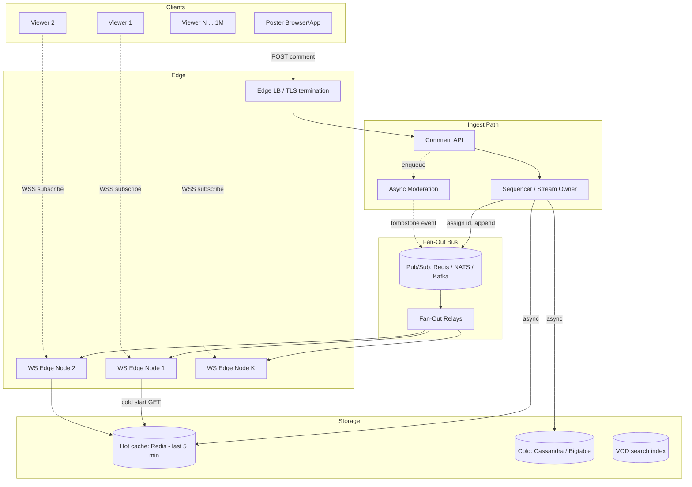
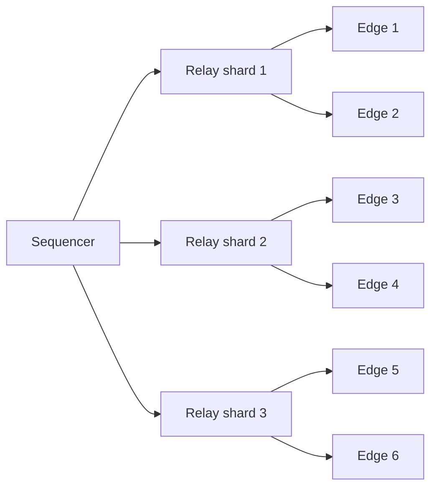
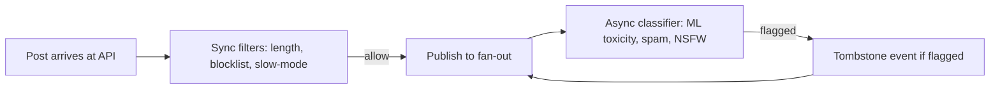

# Design Live Comments — Massive Fan-Out, Sub-Second Delivery, and Smart Sampling

**Date:** 2026-04-25 | **Updated:** 2026-04-25
**Tags:** `system-design` `case-study` `live-comments` `real-time` `fan-out`

## Table of Contents

- [Summary](#summary)
- [Functional Requirements](#functional-requirements)
- [Non-Functional Requirements](#non-functional-requirements)
- [Capacity Estimation](#capacity-estimation)
- [API Design](#api-design)
- [Data Model](#data-model)
- [High-Level Design](#high-level-design)
- [Deep Dives](#deep-dives)
  - [Fan-Out Architecture](#fan-out-architecture)
  - [Smart Sampling for High-Rate Streams](#smart-sampling-for-high-rate-streams)
  - [Ordering at Write — Sequencer per Stream](#ordering-at-write--sequencer-per-stream)
  - [Moderation Pipeline](#moderation-pipeline)
  - [Cold Start vs Live Tail](#cold-start-vs-live-tail)
  - [Slow-Mode and Per-User Cooldown](#slow-mode-and-per-user-cooldown)
  - [Backpressure When Fan-Out Saturates](#backpressure-when-fan-out-saturates)
  - [Delivery Channel — WebSocket vs SSE vs Long Poll](#delivery-channel--websocket-vs-sse-vs-long-poll)
  - [Reactions as a Separate Counter Pipeline](#reactions-as-a-separate-counter-pipeline)
- [Bottlenecks & Trade-offs](#bottlenecks--trade-offs)
- [Anti-Patterns](#anti-patterns)
- [Related](#related)
- [References](#references)

## Summary

Live comments look deceptively similar to chat, but the workload is asymmetric in a way that drives every design decision: a tiny percentage of viewers post, and **everyone else reads**. With 1M concurrent viewers and 1% writers at 1 msg/sec, a single stream produces ~10K messages/sec but must deliver **10 billion message-recipients per second**. That fan-out — not write throughput — is the system. The architecture borrows directly from Twitch (Edge + PubSub hierarchy), Discord (Elixir guild process + Manifold relay), and Slack (Channel Server + Gateway Server fan-out), and then adds **smart sampling** so the human eye doesn't drown when the rate exceeds what a viewer can read (~5–10 msg/sec).

This doc walks the HLD a senior engineer would defend in an interview or a real launch review: ingest, sequence, fan-out, sample, deliver, persist, moderate, and degrade.

## Functional Requirements

| # | Requirement | Notes |
|---|-------------|-------|
| F1 | A viewer can post a comment on a live stream | Authenticated, rate-limited |
| F2 | All viewers see new comments in near real-time | Sub-second p95 |
| F3 | A viewer can reply to a comment (single-level threading) | `parent_id` only; no deep trees on hot path |
| F4 | A viewer can like a comment | Counter pipeline, not message pipeline |
| F5 | Moderators can delete, hide, or shadow-ban | Tombstones propagate via same fan-out |
| F6 | Streamer can enable slow-mode (e.g., 30s cooldown per user) | Enforced at ingest |
| F7 | Late joiners see recent backlog (last N or last T seconds) | Cold-start fetch separate from live tail |
| F8 | Comments persist for VOD replay | Async write to durable store; live path stays hot |
| F9 | Profanity filter and spam detection | Async classifier; pre-publish budget |

**Out of scope:** DMs, polls, voice/video chat, paid super-chats (would extend the same model with payment + priority queue).

## Non-Functional Requirements

| Property | Target |
|----------|--------|
| Concurrent viewers per stream | 10K typical, **1M peak** (a Worlds final, an iPhone launch) |
| Total concurrent connections | 100M+ across all streams |
| End-to-end p95 latency (post → all viewers) | < 1s within region, < 2s cross-region |
| Ordering | Total order **per stream** (not global) |
| Write burst tolerance | 10× normal rate without dropping |
| Availability | 99.95% for delivery; 99.99% for post (durability) |
| Fairness | No single user can DoS a stream (slow-mode, rate limits) |
| Cost | Reads dominate; per-message bytes-on-wire matters |

The hard ones are **fan-out cost** (a 10K msg/sec stream × 1M viewers = 10B msg/sec to deliver) and **ordering** (viewers must not see replies before the parent).

## Capacity Estimation

**Worst-case stream: 1M concurrent viewers, 1% post, 1 msg/sec each.**

```
Writers       = 1,000,000 × 1%        = 10,000 writers
Post rate     = 10,000 × 1 msg/sec    = 10,000 msg/sec ingest
Fan-out       = 10,000 × 1,000,000    = 10,000,000,000 deliveries/sec (10 B/sec)
```

**With smart sampling capped at 5 msg/sec visible to viewers:**

```
Sampled rate  = 5 msg/sec
Fan-out       = 5 × 1,000,000        = 5,000,000 deliveries/sec (5 M/sec)
```

That's a **2000× reduction** — the entire reason sampling exists for top-tier streams.

**Bandwidth (per viewer, per stream):**

```
Comment payload   ≈ 200 bytes (JSON: id, ts, user, body, parent_id)
At 5 msg/sec       = 1 KB/sec/viewer = 8 kbps
At 1M viewers      = 8 Gbps egress per stream
```

**Storage (per stream, 4-hour broadcast):**

```
10,000 msg/sec × 14,400 sec  = 144M comments
At 200 bytes each            = ~29 GB raw, ~10 GB after compression
Hot tier (Redis/cache)       = last 5 min ≈ 600 MB
Cold tier (Cassandra/Bigtable) = full history
```

**Connections:**

- 1M concurrent WebSocket connections per popular stream
- Each Edge node holds ~50K–200K connections (kernel limits, memory)
- ⇒ 5–20 Edge nodes per popular stream, hundreds for the global system

These numbers track Twitch's published "10 billion messages a day" and Slack's "5M concurrent WebSocket sessions" envelopes — same shape, different domain.

## API Design

### REST — Post a Comment

```http
POST /v1/streams/{stream_id}/comments
Authorization: Bearer <token>
Content-Type: application/json

{
  "body": "let's go!",
  "parent_id": "01HQ... (optional, for replies)",
  "client_msg_id": "uuid-for-idempotency"
}

→ 201 Created
{
  "comment_id": "01HQABCD...",   // Snowflake-like: ts | shard | seq
  "ts": 1745601234567,
  "stream_id": "stream_42"
}
```

### REST — Cold-Start Backlog

```http
GET /v1/streams/{stream_id}/comments?before=<comment_id>&limit=50
→ 200 OK
{ "comments": [...], "has_more": true, "cursor": "..." }
```

### WebSocket — Live Tail

```
wss://edge.example.com/v1/streams/{stream_id}/live?token=...

→ Server pushes:
  { "type": "comment", "data": { id, ts, user_id, body, parent_id } }
  { "type": "delete",  "data": { comment_id } }
  { "type": "tombstone", "data": { comment_id, reason: "moderation" } }
  { "type": "rate_limit", "data": { retry_after_ms: 30000 } }
  { "type": "sampled_burst", "data": { dropped_count: 47, window_ms: 1000 } }
```

Heartbeat: server pings every 30s; client reconnects on miss.

### Reactions (separate endpoint)

```http
POST /v1/comments/{comment_id}/like  → 204
GET  /v1/comments/{comment_id}/likes → { count: 12345 }   // counter, eventually consistent
```

Likes do **not** flow through the comment fan-out path. See [Reactions as a Separate Counter Pipeline](#reactions-as-a-separate-counter-pipeline).

## Data Model

### `comments` (write-heavy, partitioned by stream)

| Column | Type | Notes |
|--------|------|-------|
| `comment_id` | bigint (Snowflake) | `ts(41) | shard(10) | seq(12)` — sortable, globally unique |
| `stream_id` | bigint | Partition key |
| `user_id` | bigint | |
| `body` | text | ≤ 500 chars on hot path |
| `parent_id` | bigint, nullable | Reply target |
| `created_at` | timestamp | Redundant with comment_id, indexed for VOD scans |
| `state` | enum | `live`, `deleted`, `shadow_banned` |
| `mod_score` | float | Async-populated by classifier |

**Partition strategy:** by `stream_id`, then time-bucketed (e.g., per-hour). This co-locates a stream's comments and lets cold storage drop old buckets cheaply. Cassandra-style: `PRIMARY KEY ((stream_id, hour_bucket), comment_id DESC)`.

### `streams` (small, frequently read)

| Column | Type | Notes |
|--------|------|-------|
| `stream_id` | bigint | PK |
| `slow_mode_seconds` | int | 0 = off |
| `chat_enabled` | bool | |
| `viewer_count` | int | Updated periodically; drives sampling threshold |
| `moderator_user_ids` | set<bigint> | |

### `user_post_log` (rate limiting, ephemeral)

| Column | Notes |
|--------|-------|
| `(stream_id, user_id) → last_post_ts` | TTL'd in Redis |

Snowflake-style IDs are non-negotiable: they give you **time-ordering for free**, support **client-side dedup**, and let cursors work without extra indexes — see Discord's writeup on storing billions of messages with the same scheme.

## High-Level Design



**Key property:** the durable write to `COLD` is **off the critical path**. Viewers see the message as soon as it crosses the bus; persistence catches up. If Cassandra is slow, chat still works.

## Deep Dives

### Fan-Out Architecture

This is the core of the system. Three components, each independently scaled:

1. **Sequencer / stream-owner process.** One logical owner per stream (or per stream shard if a single stream's writes exceed one process's capacity). This is where Discord's "guild process" and Slack's "Channel Server" pattern live. The owner:
   - Assigns the canonical `comment_id` (Snowflake)
   - Enforces slow-mode and per-user cooldown (state is local, no round-trip to Redis on hot path)
   - Publishes to the fan-out bus

2. **Pub/Sub bus.** Three viable options, all in production at scale:

   | Bus | Used by | Strength | Weakness |
   |-----|---------|----------|----------|
   | **Redis Pub/Sub** | Many startups, Phoenix.PubSub Redis adapter | Simple, fast, < 1ms pub→sub | No durability, fire-and-forget, no replay |
   | **NATS / NATS JetStream** | Cloudflare-style, modern stacks | Subject hierarchy, optional durability, low latency | Extra ops surface |
   | **Kafka** | Slack (between fanout service and ingest), LinkedIn | Durable, replayable, decouples consumers | Higher latency (10–50 ms), partition count limits |

   For the **live path**, Redis or NATS is preferred — sub-millisecond. Kafka is excellent as a **secondary durable spine** (so a fanout relay can crash and resume from offset) and for downstream consumers (VOD indexer, analytics, moderation).

3. **Edge tier (WebSocket Servers).** Hundreds of nodes, each holding 50K–200K persistent connections. Each Edge node subscribes to the bus topics for streams whose viewers it currently holds. This is **exactly** Twitch's Edge + PubSub split: PubSub fans out internally to Edge nodes, Edge fans out from there to clients over IRC/WebSocket.

**Hierarchical fan-out** — Discord's `Manifold` insight: when a sequencer publishes one message destined for 200 Edge nodes, do not call `send` 200 times to remote nodes. Instead, group destinations by node, send one message per node, and let the receiving node do the local fan-out. This turns N×M work into N + M.



### Smart Sampling for High-Rate Streams

Human reading speed caps at **~5–10 messages per second** before the chat becomes a blur. At 10K msg/sec, showing every comment is both impossible (bandwidth) and useless (unreadable).

**Sampling strategies** (composable):

1. **Reservoir sampling per N-second window.** Keep `k` random messages per second from the last second; flush. Unbiased, simple, stateless per-window.
2. **Weighted by user signal.** Higher-tier subscribers, longtime users, moderators get higher selection weight. Twitch and YouTube both do this.
3. **Per-viewer client-side throttle.** Server still pushes more than the eye reads; client renders top-K, ages out the rest. Doubles as a survivability mechanism on slow devices.
4. **Trending burst.** When 5K viewers all post "POG" in 200 ms, surface "POG ×5,000" as a single aggregate event rather than 5,000 lines.

**Where to sample:** at the **fan-out relay**, not the sequencer. The sequencer accepts and persists everything (so VOD replay has the full record); the relay decides what reaches viewers in real-time. Sampling at the sequencer would lose data forever. This separation is the system's most important invariant — see [Anti-Patterns](#anti-patterns).

**Adaptive thresholds:** sample only when `incoming_rate > visible_rate_target`. Small streams (10 viewers, 2 msg/sec) push everything through. Big streams degrade gracefully without an operator flipping a flag.

### Ordering at Write — Sequencer per Stream

Comments must appear in a consistent order **within a stream** so replies show after parents and bans land before more spam. Cross-stream order is irrelevant.

**Single-writer pattern:**

- Route all writes for `stream_id` to one sequencer process via consistent hashing.
- The process serializes writes, assigns monotonic `comment_id`, publishes.
- Within one process, ordering is trivial (single-threaded loop or actor mailbox — Discord's Elixir GenServer model).

**What about hot streams that exceed one process?** Two options:

1. **Stream sharding.** A 1M-viewer stream is split into N sub-channels (e.g., by user_id hash). Viewers see only their shard's chat. Used by Twitch for very large channels. Loses some "shared experience" but is the only way past single-core write limits.
2. **Sequence service.** A separate stamping service (think Snowflake server, or a Raft-replicated counter). Adds a hop and is vulnerable to becoming the bottleneck itself.

For most streams, option 0 — **single process per stream** — works up to tens of thousands of msg/sec. Beyond that, shard.

**Ordering across the bus:** Redis Pub/Sub and NATS preserve order per publisher. Kafka preserves order per partition. Use `stream_id` as the partition key everywhere. Edge nodes preserve order per subscription. End-to-end, viewers see the sequencer's order.

### Moderation Pipeline

Moderation must be **fast enough that bad content doesn't reach viewers, but not so fast that it blocks legitimate posts**. Budget: 50–150 ms.



**Sync layer (must complete before publish):**

- Body length (drop > 500 chars)
- Hard blocklist (slurs, known scam URLs)
- Slow-mode / cooldown
- Auth check (banned user?)

**Async layer (after publish):**

- ML toxicity classifier (Perspective API-style)
- Image/link safety
- Spam detection (rate, similarity)

If async flags it, emit a **tombstone event** through the same fan-out bus. Viewers that already saw the message get a delete op; viewers joining later never see it (it's filtered from the cold-start backlog).

**Shadow ban:** the poster sees their own message in their client (or believes they do — server returns 201 but tags as `shadow_banned`); no one else does. Fan-out filters by `state = live`. Reduces escalation; the user thinks the system is broken, not adversarial.

### Cold Start vs Live Tail

When a viewer joins mid-stream, two streams of comments must merge cleanly:

1. **Cold start:** GET last N comments (or last T seconds) from the **hot cache** (Redis sorted set keyed by stream_id, scored by ts). 50–200 messages typically.
2. **Live tail:** WebSocket subscription delivers everything from "now" onward.

**The merge problem:** the cold-start fetch and the WS subscription race. Naive solution sees duplicates or gaps.

**Pattern (the one Slack uses):**

1. Client opens WS, server immediately sends a `cursor` event with the last `comment_id` it will start streaming from.
2. Client issues `GET /comments?before=<that_cursor>&limit=50`.
3. Client renders the GET result, then appends WS events. No overlap.

Hot cache target: serve cold-start in < 50 ms (Redis ZRANGEBYSCORE on a 5-minute window is fast). Cold cache (Cassandra) is the fallback if Redis misses, with higher latency.

### Slow-Mode and Per-User Cooldown

Slow-mode is the streamer's primary spam-control tool: "users can post once every N seconds."

**Where to enforce:** at the **sequencer**, in-memory. The sequencer already owns stream state; checking `last_post_ts[user_id] + N < now` is one map lookup.

**Why not Redis?** A round-trip to Redis on every post adds 1–2 ms per write × 10K writes/sec = 10–20K Redis ops/sec **per stream** for what is essentially per-stream local state. Keep it in the process that already has the state.

**Edge cases:**

- Multi-region: if a user posts to two edges simultaneously, the sequencer sees both and rejects the second (it's still single-writer per stream).
- TTL/cleanup: evict `last_post_ts` entries when the user disconnects or after `slow_mode_seconds × 2`.
- Mod exemption: moderators bypass slow-mode. The check is `is_mod || cooldown_ok`.

Return `429 Too Many Requests` with `Retry-After-Ms` so the client can disable the post button for the right duration.

### Backpressure When Fan-Out Saturates

When the fan-out bus or an Edge node falls behind, options in increasing severity:

1. **Drop oldest.** Bounded queue per subscriber on the Edge. New messages evict old. Acceptable for chat; viewers don't need every message.
2. **Sample more aggressively.** If the relay sees its outbound queue depth growing, increase the sampling rate cutoff (e.g., from 5 msg/sec visible to 2).
3. **Disconnect slow consumers.** A viewer on a flaky 3G connection that can't drain a 100-message buffer in 5 seconds gets dropped. They reconnect and cold-start.
4. **Shed load at the sequencer.** Refuse new posts (`503 Try Again`). Last resort — breaks the poster's flow.

**Never block the sequencer on the bus.** The sequencer publishes asynchronously with a bounded outbound buffer; if the bus is wedged, drop and emit a metric. Live chat that lags by 30s is worse than chat that drops 2% of messages.

Cloudflare's Durable Objects pattern handles this at the framework level: each room is one object; if it can't keep up, that one room degrades while everyone else is unaffected — strong isolation by design.

### Delivery Channel — WebSocket vs SSE vs Long Poll

| Channel | Pros | Cons | When |
|---------|------|------|------|
| **WebSocket** | Bidirectional, low overhead per message, broad support | Stateful connection (every Edge node holds N sockets), proxy-hostile, mobile battery | Default for desktop and modern mobile clients |
| **SSE (Server-Sent Events)** | Stateless on client, auto-reconnect, works through proxies, HTTP/2 multiplexing | Server-to-client only (post via separate REST), some browser quirks | Read-heavy clients, embedded players |
| **Long poll** | Works everywhere, including ancient corporate proxies | High overhead per message, herd reconnects | Fallback only |

**Mobile:** WebSocket on foreground; switch to **push notifications + delayed cold-start** on background. Don't keep a WS open while the app is backgrounded — drains battery, gets killed by the OS, doesn't deliver messages reliably anyway. Phoenix Channels' transport abstraction handles this fallback well.

**Connection sharing:** one WS per client, multiplexed across all subscribed streams (chat + likes + moderation events on different sub-protocols/channels). Reduces connection count by N for users in many streams.

### Reactions as a Separate Counter Pipeline

A "like" is **not a comment**. Treat it as one and you've multiplied your fan-out load by 10× for no benefit (no one reads the like stream message-by-message).

**Separate pipeline:**

1. Client posts `POST /comments/{id}/like` → fire-and-forget (202 Accepted is fine).
2. Server enqueues `(comment_id, user_id, +1)` to a **counter aggregator** (Redis HINCRBY or a Kafka topic with a counter sink).
3. Edge nodes periodically (every 500 ms – 2 s) pull aggregated counts for the streams they serve and push **deltas** to viewers: `{type: "like_delta", comment_id, count: 12345}`.

**Why aggregate at intervals?** A spike of 100K likes in a second on one comment becomes one delta event, not 100K events. Identical bandwidth shape regardless of like rate.

**Idempotency:** liked-by-this-user is a set membership check (Redis SET, partitioned by `comment_id % N`). Unlike comment ordering, like order is irrelevant — we only care about the final count.

This is exactly the pattern Twitter/X used for live counter updates and what most live-poll systems do. Likes scale on a completely different axis (counters, eventual consistency) than comments (ordered, low-latency).

## Bottlenecks & Trade-offs

| Bottleneck | Mitigation | Trade-off |
|------------|------------|-----------|
| Fan-out edge bandwidth | More Edge nodes, hierarchical fan-out, sampling | Cost; sampling loses comments from live view |
| Sequencer single-writer per stream | Stream sharding for mega-streams | Loses "one shared chat" feel |
| Redis Pub/Sub: no durability | Layer Kafka behind for durable spine | Two systems to operate |
| Cassandra write lag | Keep writes async, off-critical-path | VOD replay may lag live by minutes |
| Connection count on Edge | Tune kernel limits (`somaxconn`, file descriptors), use epoll-based servers, hibernate idle WS | Complexity; some platforms don't support hibernation |
| Cross-region latency | Regional Edge tiers, regional sequencer with eventual cross-region replication | Cross-region viewers see comments later than same-region |
| Moderation false positives | Human appeal queue, reversible tombstones | Operational cost |
| Cold start on a 1M-viewer stream | Pre-warm hot cache; serve from CDN-cached snapshot for the last-30s backlog | Cache is one more thing to break |

**The biggest trade-off** is between **completeness** and **readability**. You cannot show 10K msg/sec to a human. Sampling is mandatory; the choice is whether to do it server-side (saves bandwidth) or client-side (preserves data, costs bandwidth). Production answer: both — server samples for bandwidth, client further throttles for rendering.

## Anti-Patterns

1. **Treating live comments as durable messaging first.** If you put Cassandra on the critical path before fan-out, your p95 is now Cassandra's p95. Live tail must be best-effort fast; durability follows asynchronously.
2. **Sampling at the sequencer.** Samples become the only record; VOD replay is broken; moderators can't audit. Always persist 100%, sample only at delivery.
3. **Per-message Redis call for slow-mode.** Adds a network hop per write. The sequencer already owns the state; check it locally.
4. **Likes through the comment fan-out.** Multiplies load 10× for zero user value. Counter pipeline, separate.
5. **One WebSocket per stream per user.** A user in 5 streams = 5 sockets = 5× connection cost. Multiplex.
6. **Synchronous ML moderation in the post path.** ML inference is 50–500 ms. Blocking the sequencer on it kills throughput. Async + tombstone.
7. **Global ordering across all streams.** No one needs it; the cost (single global sequencer) is enormous.
8. **Long-poll as the default delivery.** Works, but every poll round-trip is ~1 RTT + headers. At 1M viewers, header overhead alone dominates payload.
9. **Trusting client-supplied timestamps.** Clients lie, drift, and replay. Server stamps via Snowflake.
10. **No backpressure plan.** Eventually one Edge node will fall behind. Decide in advance: drop oldest, sample, or disconnect. Don't let it OOM.
11. **Storing every comment in a single Cassandra row per stream.** Hot partition; node falls over. Time-bucket the partition key (`(stream_id, hour_bucket)`).
12. **Letting moderators publish through the same fan-out path as users without priority.** A ban event must beat the spam it's banning. Use a separate priority lane.

## Related

- [Real-Time Channels — WebSocket, SSE, Long Poll](../../communication/real-time-channels.md) — the underlying transport choices that drive the Edge tier
- [Push vs Pull Architecture](../../communication/push-vs-pull-architecture.md) — why a WebSocket push model wins over a polling approach for fan-out
- [Design WhatsApp](../design-whatsapp.md) — sibling case study; chat is duplex 1:1/small-group; this doc is the asymmetric 1:N broadcast variant
- [Idempotency and Exactly-Once](../../communication/idempotency-and-exactly-once.md) — `client_msg_id` dedup on retry
- [Stream Processing](../../communication/stream-processing.md) — moderation classifier and analytics consumers downstream
- [Event-Driven Architecture](../../communication/event-driven-architecture.md) — the bus pattern at the heart of fan-out

## References

- [Twitch Engineering: An Introduction and Overview](https://blog.twitch.tv/en/2015/12/18/twitch-engineering-an-introduction-and-overview-a23917b71a25/) — Edge + PubSub hierarchical fan-out, the canonical reference
- [Twitch State of Engineering 2023](https://blog.twitch.tv/en/2023/09/28/twitch-state-of-engineering-2023/) — current scale (hundreds of billions of messages/day)
- [How Discord Scaled Elixir to 5,000,000 Concurrent Users](https://discord.com/blog/how-discord-scaled-elixir-to-5-000-000-concurrent-users) — guild process, Manifold relay, BEAM fan-out
- [Slack Engineering — Real-Time Messaging](https://slack.engineering/real-time-messaging/) — Channel Server / Gateway Server architecture, 5M+ concurrent WebSockets
- [Cloudflare Durable Objects — Build stateful real-time apps](https://developers.cloudflare.com/durable-objects/) — one-object-per-room pattern with WebSocket Hibernation
- [Cloudflare workers-chat-demo](https://github.com/cloudflare/workers-chat-demo) — reference implementation of room-as-Durable-Object
- [Phoenix Channels documentation](https://hexdocs.pm/phoenix/channels.html) — pub/sub topology, transport fallback, presence CRDT
- [Phoenix Presence](https://hexdocs.pm/phoenix/presence.html) — viewer-count and join/leave at scale via CRDT
- [How Slack Supports Billions of Daily Messages — ByteByteGo](https://blog.bytebytego.com/p/how-slack-supports-billions-of-daily) — fan-out pipeline with Kafka spine
