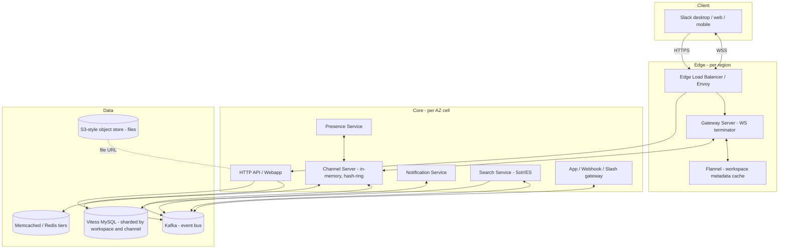

# Design Slack — Workspace-Sharded Team Chat with Channel Fan-Out, Threads, and Search

**Date:** 2026-04-25 | **Updated:** 2026-04-25
**Tags:** `system-design` `case-study` `slack` `team-chat` `real-time`
**LLD Twin:** [Chat Application (LLD) — Conversation, Participant, Message Classes](../../../low-level-design/case-studies/communication/design-chat-application-lld.md) — class-level OOD with entities, relationships, and patterns.


## Table of Contents

- [Summary](#summary)
- [Functional Requirements](#functional-requirements)
- [Non-Functional Requirements](#non-functional-requirements)
- [Capacity Estimation](#capacity-estimation)
- [API Design](#api-design)
- [Data Model](#data-model)
- [High-Level Design](#high-level-design)
- [Deep Dives](#deep-dives)
  - [1. Workspace as the Sharding Unit](#1-workspace-as-the-sharding-unit)
  - [2. Channel Fan-Out at Scale](#2-channel-fan-out-at-scale)
  - [3. Threads as a Second-Class Structure](#3-threads-as-a-second-class-structure)
  - [4. Search Architecture](#4-search-architecture)
  - [5. Presence Service](#5-presence-service)
  - [6. Notification Routing](#6-notification-routing)
  - [7. Files, Apps, and Slash Commands](#7-files-apps-and-slash-commands)
  - [8. Real-Time Event Bus Internals](#8-real-time-event-bus-internals)
- [Bottlenecks and Trade-Offs](#bottlenecks-and-trade-offs)
- [Anti-Patterns](#anti-patterns)
- [Related](#related)
- [References](#references)

## Summary

Slack is a team-collaboration chat product where the **workspace** (formerly "team") is the dominant boundary: messages, channels, files, identity, and search all live inside one workspace and rarely cross it. Unlike WhatsApp — where the unit is the user — Slack's unit is the workspace, and almost every architectural decision (sharding, caching, search indexing, presence) flows from that fact.

This case study walks through a senior-level HLD: how to keep a single workspace cohesive while supporting millions of workspaces and a long tail of large enterprises with 100K+ members; how to fan out a channel message efficiently when a single channel can have thousands of subscribers; how to bolt threads on top of a flat message stream; how to make full-text search fast and permission-safe; and how to build a real-time event bus that survives reconnects and re-sequencing. Where useful, we anchor on Slack's published architecture (Channel Servers, Gateway Servers, Flannel, Vitess, Solr, the AZ-cellular topology) and on the post-mortems where these layers have failed.

## Functional Requirements

| Capability | Description |
|---|---|
| **Workspaces** | A workspace owns its users, channels, settings, and search index. A user may belong to many workspaces; sessions are workspace-scoped. |
| **Channels (public / private)** | Public channels are discoverable workspace-wide. Private channels require explicit membership. Both are append-only message streams. |
| **Direct messages (DMs / MPDMs)** | 1:1 and small group DMs (typically up to ~9 members). DMs are modeled as channels of a special type. |
| **Threads** | Any message can be the parent of a thread. Replies live as a sibling list; the parent message holds reply count + last-reply timestamp. |
| **Mentions** | `@user`, `@channel`, `@here` trigger notification routing and unread-state changes. |
| **Reactions** | Emoji reactions are append-only events on a message; clients render aggregated counts. |
| **File uploads** | Drag-drop or paste an image / document. Files attach to a channel and become searchable. |
| **Search** | Workspace-scoped full-text search across messages and files, with permission filtering and recency vs relevance modes. |
| **Integrations / apps** | Bots, slash commands, webhooks, OAuth-installed apps, workflow automations. |
| **Notifications** | Per-channel preferences, thread subscriptions, DND windows, push (APNs/FCM), email, desktop. |
| **Presence** | Active / away indicators per user per workspace. |
| **Read state** | Per-user, per-channel "last read" cursor; unread badge counts. |

Out of scope for this HLD: huddles / voice (separate real-time media stack), Slack Connect cross-workspace channels (a federation layer on top), enterprise grid org-level admin (a workspace-of-workspaces).

## Non-Functional Requirements

- **Workspace isolation** — a noisy or misbehaving workspace must not degrade others. Cross-workspace blast radius must be bounded.
- **Real-time delivery** — p95 message delivery from sender to all online members of a channel ≤ 500 ms globally.
- **Low-latency search** — p95 search query ≤ 1 s for typical-sized workspaces; gracefully degrade for the largest.
- **Multi-region edge for global teams** — WebSocket connections terminate near users; core data plane can stay regional.
- **Durability** — zero acknowledged-message loss. Messages must be readable after sender restart, receiver reconnect, or AZ failure.
- **Availability** — target 99.99% for messaging; soft-degrade search and presence before degrading message send/receive.
- **Ordering** — per-channel total order. Cross-channel ordering is best-effort.
- **Security** — auth scoped to workspace + user; private channel ACLs enforced on read, write, and search.

## Capacity Estimation

Order-of-magnitude numbers, useful for shaping fan-out, storage, and shard math.

| Quantity | Estimate | Notes |
|---|---|---|
| Active workspaces | ~10M | Long-tail distribution: most are tiny (< 50 users), a few are huge (> 100K). |
| Daily active users | ~50M | |
| Largest enterprise workspace | ~100K members, ~50K concurrent | The "elephant" tenant that breaks naive designs. |
| Messages / day | ~10B | Roughly 100K/sec average, ~500K/sec peak. |
| Avg channels per user | ~20 | Skewed; power users sit in 200+. |
| Avg channel size | ~30 members | Long tail — `#general` in a 100K workspace fans out to 100K. |
| Avg message size | ~200 B text + metadata; files separate. | |
| Hot working set per workspace | recent ~7 days of messages | Older messages are cold; served from durable storage on miss. |
| Search index size | ~100 TB total full-text indices across workspaces. | Sharded per-workspace and per-time-bucket. |
| WebSocket connections | tens of millions concurrent globally. | One per active client per workspace. |

**Storage envelope:** at 10 B msgs/day × 250 B (msg + metadata + indexing overhead) ≈ 2.5 TB/day raw, ~1 PB/year before compression and tiering.

**Fan-out envelope:** the average message hits ~30 recipients but the *p99* hits 100K+. The system must be tuned for the tail, not the mean.

## API Design

Slack exposes three surfaces: **HTTP REST** for control-plane and history, **WebSocket (Real-Time Messaging / Events API)** for live events, and **outbound HTTP webhooks** plus **slash commands** for app integrations.

### REST (selected)

```http
POST   /api/auth.login                      → session + ws_url
POST   /api/conversations.create            { name, is_private }
POST   /api/conversations.invite            { channel, users[] }
POST   /api/chat.postMessage                { channel, text, thread_ts? }
POST   /api/chat.update                     { channel, ts, text }
POST   /api/reactions.add                   { channel, ts, name }
GET    /api/conversations.history           ?channel=…&latest=…&oldest=…&limit=…
GET    /api/conversations.replies           ?channel=…&ts=<parent_ts>
GET    /api/search.messages                 ?query=…&sort=score|timestamp
POST   /api/files.upload                    multipart → file_id, channels
POST   /api/apps.install                    OAuth code → app_token
```

Every message is identified by `(channel_id, ts)` where `ts` is a server-issued microsecond timestamp that doubles as the per-channel ordering key.

### Real-Time (WebSocket)

A client opens **one WebSocket per workspace** to a Gateway Server (GS). The connection bootstrap returns workspace metadata via Flannel (see deep dive 1). Inbound and outbound messages share a typed event envelope:

```json
// server → client
{ "type": "message", "channel": "C123", "ts": "1714000000.000100",
  "user": "U999", "text": "hi", "thread_ts": null }

{ "type": "reaction_added", "item": {"channel":"C123","ts":"1714…"},
  "user": "U999", "reaction": "tada" }

{ "type": "presence_change", "user": "U999", "presence": "active" }

// client → server
{ "type": "ping" }
{ "type": "typing", "channel": "C123" }
```

On reconnect, the client sends the last `event_id` it has seen; the server replays anything missed (deep dive 8).

### Slash commands and webhooks

```http
# Slack → app (slash command)
POST  https://app.example.com/slack
      Form: command=/deploy text=prod team_id=T1 channel_id=C2 response_url=…

# App → Slack (incoming webhook)
POST  https://hooks.slack.com/services/T1/B1/XYZ
      { "text": "build green", "channel": "#release" }
```

Slash commands have a 3-second initial-response budget; long jobs use `response_url` to send a deferred reply.

## Data Model

Five core tables, all sharded by **workspace_id** at the cluster level, with secondary **channel_id** sharding for the message hot path (Slack has explicitly migrated message storage from workspace-only sharding to channel-sharded for the largest tenants — see the Vitess writeup in the references).

```sql
workspace (
  workspace_id      BIGINT PRIMARY KEY,
  name              VARCHAR,
  plan              ENUM('free','pro','business','enterprise'),
  region            VARCHAR,            -- home region for the workspace
  created_at        TIMESTAMP
)

user (
  user_id           BIGINT,
  workspace_id      BIGINT,
  email             VARCHAR,
  display_name      VARCHAR,
  PRIMARY KEY (workspace_id, user_id)
)

channel (
  channel_id        BIGINT,
  workspace_id      BIGINT,
  name              VARCHAR,
  type              ENUM('public','private','dm','mpdm'),
  created_at        TIMESTAMP,
  PRIMARY KEY (workspace_id, channel_id)
)

channel_membership (
  channel_id        BIGINT,
  user_id           BIGINT,
  workspace_id      BIGINT,
  joined_at         TIMESTAMP,
  last_read_ts      VARCHAR,            -- per-user read cursor
  notify_pref       ENUM('all','mentions','none'),
  PRIMARY KEY (channel_id, user_id)
)

message (
  channel_id        BIGINT,
  ts                VARCHAR,            -- e.g. '1714000000.000100'
  workspace_id      BIGINT,
  user_id           BIGINT,
  text              TEXT,
  thread_ts         VARCHAR NULL,       -- parent ts if this is a reply
  reply_count       INT DEFAULT 0,      -- maintained on parent
  last_reply_ts     VARCHAR NULL,
  edited_at         TIMESTAMP NULL,
  PRIMARY KEY (channel_id, ts)
)

reaction (
  channel_id        BIGINT,
  ts                VARCHAR,            -- the reacted-to message
  user_id           BIGINT,
  emoji             VARCHAR,
  created_at        TIMESTAMP,
  PRIMARY KEY (channel_id, ts, user_id, emoji)
)

file (
  file_id           BIGINT PRIMARY KEY,
  workspace_id      BIGINT,
  uploader_id       BIGINT,
  name              VARCHAR,
  mime              VARCHAR,
  size              BIGINT,
  storage_url       VARCHAR,            -- S3-style object URL
  created_at        TIMESTAMP
)

file_share (
  file_id           BIGINT,
  channel_id        BIGINT,
  ts                VARCHAR,            -- the message that shared it
  PRIMARY KEY (file_id, channel_id, ts)
)
```

Notes:

- `ts` is the **per-channel ordering key**. It is a server-assigned microsecond timestamp; ties are broken by a sequence suffix. Clients never compute it.
- `thread_ts` is the parent `ts` for replies. A reply is just a `message` with `thread_ts` set; the parent's `reply_count` and `last_reply_ts` are denormalized for cheap thread previews.
- `channel_membership.last_read_ts` is the **only** mutable per-user state on the message hot path. Everything else is append-only.
- `reaction` is an append-only event log; clients aggregate.

## High-Level Design



Key flows:

1. **Connect**: client → LB → GS. GS authenticates the session, asks Flannel for the workspace's user/channel/bot directory, and sends a "hello" snapshot down the WebSocket.
2. **Send**: client → HTTP `chat.postMessage` → Webapp → Vitess (`message` row) → Kafka topic for the channel.
3. **Fan out**: Channel Server (the one owning that channel via the consistent-hash ring) consumes from Kafka, looks up the channel's currently-connected members, and pushes the event through the appropriate Gateway Servers.
4. **Search**: Search Service tails the same Kafka topic, indexes into the workspace's Solr index.
5. **Notify offline**: Notification Service consumes the same topic, applies user prefs / DND, dispatches APNs / FCM / email.
6. **Files**: client uploads directly to object storage with a signed URL; the `file` and `file_share` rows are written by the Webapp; a `message` event with the file reference is emitted normally.

The **AZ-cellular topology** (Slack's 2023 migration): every core service exists fully in each AZ in the home region, and traffic to a workspace is pinned to one AZ-cell. A failed AZ is drained at the edge in minutes without a global outage. See [Slack Engineering — Cellular Architecture](https://slack.engineering/slacks-migration-to-a-cellular-architecture/).

## Deep Dives

### 1. Workspace as the Sharding Unit

A workspace is the natural locality boundary: members talk to each other, search each other's history, and rarely interact with users in other workspaces. The architectural payoff is enormous if you respect that:

- **One workspace lives on one DB shard** (Vitess keyspace, channel-sharded inside). Cross-shard fan-out is the exception, not the rule.
- **One workspace's hot metadata fits in one Flannel cache instance** — users, channels, bots — keyed by `team_id`. When the first member connects, Flannel loads the team data; when the last disconnects, it evicts. This is how Slack supports very large teams without bloating the WebSocket bootstrap (a 32K-user team payload was reduced ~44× by lazy-loading via Flannel — see [Flannel: An Application-Level Edge Cache](https://slack.engineering/flannel-an-application-level-edge-cache-to-make-slack-scale/)).
- **Search index per workspace**, with time-bucketed sub-indices (see deep dive 4).
- **Cache locality**: a Channel Server holding `C-123` will almost always also hold sibling channels and DMs in the same workspace, because the consistent hash includes workspace affinity hints, not just `channel_id`.

The price you pay for workspace-sharding is the **elephant tenant problem**: a 100K-member enterprise on one shard can saturate it. Slack's published mitigation is to keep the **workspace** as the directory shard but **shard messages by channel** so the message write path scales horizontally even within one workspace. The public Vitess writeup describes exactly this re-sharding ([Scaling Datastores at Slack with Vitess](https://slack.engineering/scaling-datastores-at-slack-with-vitess/)).

Trade-off: cross-workspace features (Slack Connect, Enterprise Grid org search) need a federation layer above this, because the primary keys are workspace-scoped.

### 2. Channel Fan-Out at Scale

The naive fan-out — "for each member, push the message to their socket" — is a disaster when a channel has 50K connected members. Slack's design has three levers:

**(a) Channel Servers own channels, not users.** A consistent-hash ring maps `channel_id` → one CS instance. That CS holds in-memory:
- the recent message tail for the channel (warm cache for replays);
- the set of currently-connected members (via Gateway Server registrations).

A single CS at peak serves on the order of **16M channels** per host, and the ring has fast replacement: a new CS is ready to serve in ~20 s ([Real-Time Messaging at Slack](https://slack.engineering/real-time-messaging/)).

**(b) Edge Gateway Servers do the per-socket fan-out.** The CS does not push 50K times — it pushes **one** message per Gateway Server that has at least one subscriber, plus a member bitmap. Each GS then walks its local socket list and writes only to the relevant ones. This collapses N writes by CS into M writes (M = number of GS instances with a subscriber, typically O(tens) even for huge channels).

**(c) Smart fan-out — skip people who don't need it.** For very large channels (`#announcements` with 100K members), the system can:
- send only to **active** sockets (presence-based suppression);
- send a **lightweight "channel marked unread"** signal instead of the full message body to recipients who aren't currently viewing the channel — they fetch the body on click;
- batch low-priority events (typing indicators, presence ticks) on a longer cadence than message events.

The whole pipe is buffered through Kafka so a CS or GS restart doesn't drop messages; subscribers re-read from their last committed offset.

### 3. Threads as a Second-Class Structure

Threads are a UX overlay on a flat append-only message stream. The data model choice — `thread_ts` on each reply, `reply_count`/`last_reply_ts` on the parent — is deliberate:

- **Replies are first-class messages.** They live in the same `message` table, share the same `(channel_id, ts)` ordering, and travel through the same fan-out pipe. No separate "thread service" exists on the hot path.
- **Parent denormalization** is the trick. When a reply arrives, the parent row is updated with `reply_count++` and `last_reply_ts = reply.ts`. That's the data the channel scrollback renders ("3 replies, last reply 5 min ago"). Without this, every channel render would do an extra query per parent.
- **Thread fan-out is narrower.** A reply fans out to **thread subscribers** (parent author, anyone who replied, anyone who explicitly subscribed) and to anyone currently viewing the channel. Members who haven't engaged with the thread typically don't get a push notification — only an unread badge.
- **Editing the parent's denormalized counters is the contention point.** Two replies arriving simultaneously race on the parent row. The implementations either use an atomic `UPDATE … SET reply_count = reply_count + 1`, or maintain the counter in a Redis/memcached cell with periodic write-back to MySQL.

Open trade-off: nested threads (replies-to-replies) were rejected in the data model. A thread is two levels deep, period. This keeps the parent-update pattern bounded and avoids the recursive-tree fan-out problem you'd otherwise inherit.

### 4. Search Architecture

Search is **per-workspace, permission-filtered, and dual-mode (Recent vs Relevant)** — see [Search at Slack](https://slack.engineering/search-at-slack/).

**Index layout.** Each workspace has its own Solr index (Slack uses Solr/Lucene; Elasticsearch is similar). Inside the workspace, indices are **time-bucketed** ("for each day we have a live index"), so:

- new writes go to today's small, hot index;
- old data lives in larger immutable indices that can be merged offline;
- a query against "recent" can hit only the last few buckets;
- a workspace's growth doesn't bloat one giant shard.

This time-bucketing is what lets every customer scale evenly regardless of age: a 10-year-old workspace has many small indices instead of one huge one.

**Permission filtering happens at query time.** A search for `revenue` from user U:

1. Resolve U's channel set (public channels in the workspace + private channels U is a member of + DMs U is in). This is a fast cached lookup, not a join.
2. Add a Solr filter: `channel_id IN (…)`.
3. Execute the query with that filter and the term query.
4. Re-rank in the application layer using extra signals (author affinity, channel engagement, recency boost) that are too expensive for Solr to compute first-pass.

The two-stage retrieve-then-rerank is the standard search pattern; what's specific to Slack is the **visibility filter being part of the query, never an after-the-fact result trim**, because trimming after retrieval would leak result counts and cause empty pages for users who can't see anything.

**Indexing pipeline.** Messages flow through Kafka; a search indexer service tails the topic and writes to the workspace's current daily bucket. Indexing is near-real-time (seconds), but search is not on the message-send hot path — search degradation never blocks messaging.

For deeper search-system design, see [building-blocks/search-systems.md](../../building-blocks/search-systems.md).

### 5. Presence Service

Presence is "is user U active in workspace W right now?" — cheap, transient, and extremely chatty.

**State source.** A user is **active** if they have at least one open WebSocket and the client has reported activity in the last few minutes. A Gateway Server already knows when a socket opens / closes, so presence is a derived signal:

```
GS  ──"connect U/W"──▶  Presence Service ──update──▶  in-memory presence map
GS  ──"disconnect"──▶
GS  ──"activity ping"──▶
```

**Distribution.** Presence Service is itself sharded (by `workspace_id`). It maintains, per workspace, the set of currently-active users, and pushes **batched** presence-change events to the Channel Servers, which fan them out exactly like messages — but typically with coarser cadence (e.g. coalesce within a 5-second window) because nobody needs sub-second presence accuracy.

**Why it's hard.** A 50K-member workspace could in principle generate 50K × 50K = 2.5B presence-edge updates if you naively broadcasted. The mitigations:

- **Subscribe-on-demand**: a client only receives presence for users actually rendered in its UI (current channel members, sidebar DMs).
- **Coalesce**: a flapping connection (mobile-on-train) does not produce a flood — debounce.
- **Backoff for huge teams**: in the largest workspaces, presence falls back to "click to fetch" rather than ambient.

### 6. Notification Routing

Once a message is durably written and fanned out to live sockets, the **Notification Service** decides who gets a push, an email, or nothing. It consumes the same Kafka topic the Channel Server does and runs the routing rules:

```
For each recipient R of message M in channel C:
  if R.dnd_active(now): skip push, queue for digest
  elif M mentions R         → push (high priority)
  elif R subscribed to thread → push
  elif R.notify_pref(C) == 'all'      → push
  elif R.notify_pref(C) == 'mentions' and not mention → skip
  if R has no live socket within X min → email-on-miss after delay
```

**Delivery surfaces** are different transports with different SLAs:

- **Live WebSocket** — immediate, lossless.
- **APNs / FCM push** — for mobile clients without a live socket, with provider rate limits.
- **Email** — for users offline beyond a delay window, batched into digests for noisy channels.
- **Desktop OS notifications** — driven from the live WebSocket on the client side, not server-side.

DND (do-not-disturb) is workspace-aware (you can be DND in workspace A and not in B) and time-window-aware (default schedule + ad hoc snooze). The check is done **at routing time, not at send time**, so a user toggling DND off doesn't replay missed pushes.

### 7. Files, Apps, and Slash Commands

**Files.** Upload bypasses the message hot path: client requests a signed upload URL, PUTs directly to object storage, then posts a `chat.postMessage` referencing the `file_id`. Thumbnails and previews are generated asynchronously by a worker fleet. Access control is checked on download by re-issuing a short-lived signed URL after re-validating channel membership.

**Apps.** A Slack app is an OAuth-installed external service with a bot user and a set of scoped tokens per workspace. Installs are workspace-scoped rows; the app can post to channels via the Webapp's `chat.postMessage` (looks like a normal message internally, fan-out is identical).

**Slash commands.** `/deploy prod` is a Webapp endpoint that:

1. Validates the signing secret from the app.
2. Looks up the app's command handler URL.
3. POSTs to the handler with a `response_url` and a 3-second SLA for the synchronous `text` reply.
4. The handler can post additional async messages to the channel via `response_url` for up to 30 minutes.

**Webhooks.** Incoming webhooks are URL-keyed `chat.postMessage` shortcuts. They run through the same fan-out, with rate limits per webhook and per workspace.

The point: integrations are deliberately built **on top of** the message API, not as a separate channel. That means an app's message has the same durability, ordering, and fan-out guarantees as a human's message, and the Channel Servers don't need to know an app exists.

### 8. Real-Time Event Bus Internals

The **client-facing event protocol** has to handle reconnects, missed messages, ordering, and replay without hammering the database.

**Event types.** A small typed taxonomy:

```
message, message_changed, message_deleted
reaction_added, reaction_removed
channel_created, channel_archived, member_joined_channel
user_typing, presence_change
file_shared
```

Each event carries `team_id`, `channel_id?`, and a **monotonically increasing per-channel `event_id`** (effectively the message `ts` for message events).

**Ordering.** Total order is guaranteed **per channel only**. Across channels, the system is best-effort — a `presence_change` may interleave with a `message` from a different channel. This is the right trade: per-channel order is what users perceive; global order would force a single-writer bottleneck.

**Reconnect / replay.** The client persists the highest `event_id` it has seen per channel. On reconnect, the WebSocket handshake includes a per-channel cursor, and the Gateway Server replays any newer events. The replay source is:

1. The Channel Server's in-memory tail (covers the common short-disconnect case).
2. On miss, fall back to Vitess for older history.

**Buffering and backpressure.** Slow clients (mobile, weak Wi-Fi) get a per-socket bounded queue at the GS. If the queue overflows, the GS drops typing/presence first, then issues a "you fell behind, refetch" event and disconnects — better a fresh sync than an ever-growing backlog.

For broader real-time channel patterns (long-poll vs WS vs SSE, ordering, replay), see [communication/real-time-channels.md](../../communication/real-time-channels.md).

## Bottlenecks and Trade-Offs

These are not theoretical — most have concrete public post-mortems behind them.

| Pressure point | What goes wrong | Mitigation |
|---|---|---|
| **Cache cold-start on a quiet morning** | When millions of clients reconnect simultaneously (e.g. start of the EU work day, or after a deploy), Flannel and Channel Server caches are cold; everything stampedes Vitess. This was a contributor to the **Jan 4, 2021 outage**: scale-up triggered cache misses that cascaded into provisioning storms. | Pre-warm caches before traffic ramps; cap reconnect rate at the LB (`HTTP 429` with jitter); decouple cache layer scaling from app scaling. |
| **Scatter queries across all shards** | A query that fans out to every Vitess shard for one workspace is fine when small but pathological at scale. The **Feb 22, 2022 incident** was triggered by a memcached-fronted scatter query whose miss path read from every shard; on a cache miss it brought the database to its knees. | Re-shard the table by the query key (channel-shard messages, not workspace-shard); read only the missing rows on cache miss; allow staleness on immutable data and serve from replicas. See [The Query Strikes Again](https://slack.engineering/the-query-strikes-again/). |
| **Lookup tables that grow with active users** | `channel_membership` and similar lookup tables grow super-linearly in big workspaces. Joins against them in the hot path are landmines. | Cache the user → channels mapping in Flannel (per-workspace, eagerly invalidated on membership change). Never join in the hot path; always materialize. |
| **Elephant tenants on one shard** | One workspace with 100K active users monopolizes a Vitess shard and CS host. | Shard messages by channel within the workspace; pin the elephant workspace to its own dedicated shard set if necessary. |
| **AZ failure** | A single-AZ network event (the **June 30, 2021 incident**) causes intermittent failures that monitoring can't quickly attribute. | Cellular architecture per AZ — drain the failing cell at the edge in minutes; each cell is a complete vertical of services. |
| **Search head-of-line** | A single huge query against a giant workspace's index blocks the request queue. | Per-workspace query pool; query timeouts; degrade old-data search to async ("we'll email results"). |
| **Presence storm** | A flapping ISP causes thousands of disconnect/connect cycles per second, swamping presence fan-out. | Debounce at the GS; coalesce changes; subscribe-on-demand for presence. |
| **Webhook abuse** | A misbehaving app posts thousands of messages per second into `#general`. | Per-app and per-workspace webhook rate limits; circuit-breaker that disables the install with a notification to admins. |
| **Long-tail global users** | A user in Sydney connecting to us-east-1 sees high WS RTT. | Edge GS in multiple regions terminates the WS close to the user and tunnels to the home cell over a fat backbone. The data plane stays regional; the connection does not. |

## Anti-Patterns

- **Sharding by user instead of by workspace.** It seems flexible, but every channel read becomes a multi-shard query. Workspace locality is the whole point.
- **Joining `channel_membership` on the message read path.** Cache this (Flannel) and never join.
- **A single global presence service.** Presence must be sharded by workspace and rate-limited per channel; otherwise a busy workspace drowns out everyone.
- **Synchronous fan-out from the Webapp.** The Webapp's job is durable write + Kafka publish. Pushing to sockets from the request handler couples message latency to the slowest connected mobile client.
- **Treating threads as a separate service.** Threads are messages with a parent pointer; building a "thread service" duplicates the storage, ordering, and fan-out infrastructure with no upside.
- **Permission-filter-after-search.** Always filter inside the query. Filtering retrieved results leaks counts, breaks pagination, and surfaces empty pages.
- **Nested threads.** Two levels was a deliberate design constraint; deeper trees explode the parent-update contention and the UI affordance simultaneously.
- **One giant Solr index per workspace.** Time-bucket so that growth doesn't compound merge cost; old data becomes immutable and cheap.
- **No reconnect cursor.** Without a per-channel `event_id` the client must full-resync on every disconnect; in mobile-flap scenarios this melts the backend.
- **Cross-AZ chatty calls inside a cell.** A cell's promise is single-AZ blast radius; the moment your message path crosses AZs you've lost it.
- **Cache cold-start without warm-up.** A deploy that flushes Flannel must be followed by a paced reconnect ramp, not a thundering herd.

## Related

- [design-whatsapp.md](./design-whatsapp.md) — user-sharded messaging, end-to-end encryption, and small-group fan-out; the contrast against Slack's workspace-sharded, server-side-readable, large-group fan-out is the most instructive comparison in this directory.
- [../../communication/real-time-channels.md](../../communication/real-time-channels.md) — WebSocket vs SSE vs long-poll, ordering, reconnect, and event bus design patterns that underpin deep dive 8.
- [../../building-blocks/search-systems.md](../../building-blocks/search-systems.md) — Lucene-based search, time-bucketed indices, two-stage retrieve-then-rerank, and permission filtering, which generalize the Slack search deep dive.

## References

- [Real-Time Messaging — Slack Engineering](https://slack.engineering/real-time-messaging/) — Channel Servers, Gateway Servers, the consistent-hash ring (CHARM), and 500 ms global delivery target.
- [Flannel: An Application-Level Edge Cache to Make Slack Scale](https://slack.engineering/flannel-an-application-level-edge-cache-to-make-slack-scale/) — lazy team metadata cache, 4M concurrent connections, payload reduction for large teams.
- [Scaling Datastores at Slack with Vitess](https://slack.engineering/scaling-datastores-at-slack-with-vitess/) — workspace sharding → channel sharding migration for messages.
- [The Query Strikes Again — Slack Engineering](https://slack.engineering/the-query-strikes-again/) — Feb 22, 2022 incident: scatter-query post-mortem and the move to channel-sharded reads with replica fallback.
- [Slack's Outage on January 4th 2021 — Slack Engineering](https://slack.engineering/slacks-outage-on-january-4th-2021/) — cache cold-start cascade and reconnect storm post-mortem.
- [Slack's Migration to a Cellular Architecture](https://slack.engineering/slacks-migration-to-a-cellular-architecture/) — per-AZ cells, single-region cellular topology, blast-radius reduction.
- [Search at Slack — Slack Engineering](https://slack.engineering/search-at-slack/) — Solr-based, two-stage retrieve-then-rerank, query-time permission filtering, time-bucketed daily indices.
- [Slack API documentation](https://api.slack.com/) — REST methods, Events API, slash commands, OAuth, rate limits.
- [Slack's Migration to a Cellular Architecture — InfoQ presentation](https://www.infoq.com/presentations/slack-cellular-architecture/) — talk-form deep dive that complements the engineering blog post.
