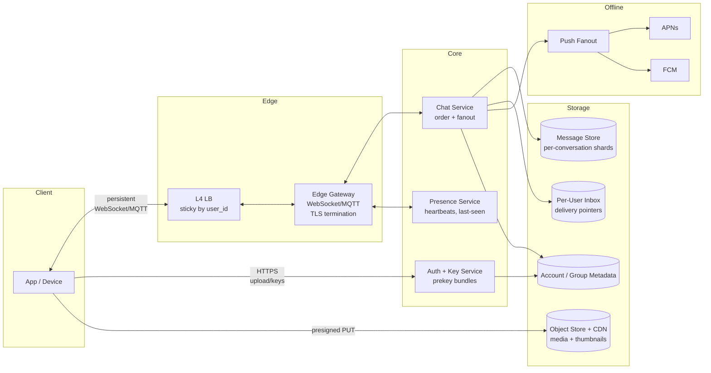
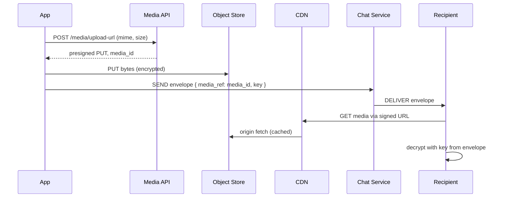

# Design WhatsApp / Chat System — HLD Case Study

**Date:** 2026-04-25 | **Updated:** 2026-04-25
**Tags:** `system-design` `case-study` `chat` `real-time` `whatsapp`
**Difficulty:** Medium | **Audience:** Senior Backend Engineer

## Table of Contents

- [Summary](#summary)
- [Functional Requirements](#functional-requirements)
- [Non-Functional Requirements](#non-functional-requirements)
- [Capacity Estimation](#capacity-estimation)
- [API Design](#api-design)
  - [Control Plane (HTTPS)](#control-plane-https)
  - [Data Plane (Persistent Connection)](#data-plane-persistent-connection)
- [Data Model](#data-model)
- [High-Level Architecture](#high-level-architecture)
- [Deep Dives](#deep-dives)
  - [1. Per-Conversation Ordering](#1-per-conversation-ordering)
  - [2. Group Chat Fanout](#2-group-chat-fanout)
  - [3. Presence Service](#3-presence-service)
  - [4. Read Receipts and Typing Indicators](#4-read-receipts-and-typing-indicators)
  - [5. Offline Delivery and Push Notifications](#5-offline-delivery-and-push-notifications)
  - [6. Media Handling](#6-media-handling)
  - [7. End-to-End Encryption](#7-end-to-end-encryption)
  - [8. Multi-Device Sync](#8-multi-device-sync)
  - [9. Connection Scaling](#9-connection-scaling)
- [Bottlenecks and Trade-Offs](#bottlenecks-and-trade-offs)
- [Anti-Patterns](#anti-patterns)
- [Related](#related)
- [References](#references)

## Summary

A WhatsApp-class chat system is fundamentally a **store-and-forward message router** wrapped in a **persistent-connection delivery fabric** with **end-to-end encryption** and **offline push fallback**. The design centers on four hard problems: keeping hundreds of millions of concurrent TCP connections alive cheaply, ordering messages deterministically inside each conversation across global shards, fanning out group messages without writing N copies on the hot path, and delivering reliably to users who are offline, on flaky networks, or signed in from multiple devices.

The architecture splits cleanly into a stateful **edge gateway tier** (terminates WebSocket/MQTT, holds the user's socket), a stateless **chat service tier** (validates, orders, fans out), a **per-conversation message store** (durable, sharded, append-only), a **per-user inbox** (recent unread + sync cursor), an **object store** (media), and a **push fanout pipeline** (APNs/FCM) for offline devices. End-to-end encryption (Signal protocol) means the server is intentionally blind to message content; it routes ciphertext envelopes and never sees plaintext.

## Functional Requirements

| Capability | Detail |
|---|---|
| **1:1 chat** | Send and receive text messages between two users with delivery + read receipts. |
| **Group chat** | Up to ~1024 members per group; server-side fanout; per-member delivery state. |
| **Presence** | Online / last-seen / typing visible to permitted contacts. |
| **Typing indicators** | Best-effort, transient, never persisted. |
| **Read receipts** | Single tick (sent), double tick (delivered), blue (read). User-toggleable. |
| **Media messages** | Images, video, voice notes, documents up to ~100 MB; thumbnails; forwarding. |
| **Offline delivery** | Messages queued when recipient offline; pushed via APNs/FCM; replayed on reconnect. |
| **End-to-end encryption** | Signal protocol; server never sees plaintext payloads; sealed sender. |
| **Multi-device** | Up to 4 linked devices per account, each with its own session keys; cross-device read state. |
| **History sync** | New devices reconcile recent history (encrypted backup or device-to-device transfer). |

Out of scope for this HLD: voice/video calls, payments, status/stories, business API.

## Non-Functional Requirements

| NFR | Target |
|---|---|
| **End-to-end latency (online → online)** | p50 < 200 ms, p99 < 1 s globally. |
| **Scale** | ~2 B users, ~500 M concurrent connections at peak. |
| **Throughput** | ~100 B messages/day → ~1.2 M msgs/sec average, ~5 M/sec peak. |
| **Durability** | A delivered message must survive single-AZ failure; lost message rate < 1 in 10⁹. |
| **Availability** | 99.99% for send/receive control plane; degraded read-only acceptable during partial outage. |
| **Privacy** | E2EE by default; server cannot decrypt; minimum metadata retention. |
| **Bandwidth efficiency** | Mobile-friendly framing (binary, MQTT-style), media via CDN, deduped on retransmit. |
| **Battery efficiency** | Heartbeats tuned per platform; coalesced wakes on mobile. |

## Capacity Estimation

**User base.** 2 B registered users, ~1 B daily active. Assume 25% concurrently connected at peak → **500 M concurrent persistent sockets**.

**Message volume.** 100 B messages/day:

```text
100,000,000,000 / 86,400 ≈ 1.16 M msgs/sec average
peak factor 4× → ~4.6 M msgs/sec
```

**Message size on the wire.** Average 100 B plaintext, ~200 B encrypted envelope (Signal headers, MAC, framing). Group fanout amplifies: average 5 recipients per message → **~5× delivery write amplification** server-side, but only 1× store amplification (one canonical record per message; per-recipient state is small).

**Bandwidth (signaling, not media).**

```text
4.6 M msgs/sec × 200 B × 5 (fanout) ≈ 4.6 GB/sec ≈ 37 Gbps egress at peak
```

**Storage (messages).** Server retains undelivered messages only (E2EE + privacy). Steady-state queue size ~hours, not years. Estimate:

```text
1% of daily traffic queued at any moment ≈ 1 B msgs × 200 B ≈ 200 GB hot
```

Plus encrypted backups (opt-in, off-server, e.g. iCloud / Google Drive) — not on the hot path.

**Storage (media).** ~10 B media messages/day × avg 500 KB ≈ **5 PB/day** to object store; lifecycle to cold tiers after N days; CDN absorbs reads.

**Connection memory.** With epoll + tuned kernel: ~10 KB/conn → **1 M conns/server ≈ 10 GB RAM** for socket bookkeeping. 500 M conns / 1 M = **500 edge servers** for connection termination (plus headroom and regional spread).

## API Design

### Control Plane (HTTPS)

Used for account ops, key registration, presigned media URLs, history pagination, group admin. REST/JSON with bearer tokens.

```http
POST /v1/auth/register            { phone, otp }
POST /v1/keys/upload              { identity_pub, signed_prekey, one_time_prekeys[] }
GET  /v1/keys/{user_id}/bundle    -> prekey bundle for session init
POST /v1/groups                   { name, members[] }
POST /v1/groups/{id}/members      { add[], remove[] }
POST /v1/media/upload-url         { mime, size } -> { put_url, media_id, expires_at }
GET  /v1/conversations/{cid}/messages?before=<seq>&limit=50
```

### Data Plane (Persistent Connection)

WhatsApp historically rides a customized **MQTT** binding over TLS; a generic design uses **WebSocket** with a binary framing (length-prefixed protobuf). The connection is **sticky** (client → same edge gateway for the life of the session).

Frame types (logical):

```protobuf
message Envelope {
  enum Type { SEND = 0; ACK = 1; DELIVER = 2; PRESENCE = 3; TYPING = 4; READ = 5; PING = 6; }
  Type     type = 1;
  string   message_id = 2;     // client-generated UUID for idempotency
  string   conversation_id = 3;
  bytes    ciphertext = 4;     // E2EE payload (server cannot decrypt)
  int64    client_ts = 5;
  int64    server_seq = 6;     // assigned by server on accept
  string   sender_device = 7;
}
```

**Send.** Client → `SEND` → edge gateway → chat service → store + fanout → `ACK { message_id, server_seq }` back to sender. ACK is the durability guarantee: once received, the server has committed.

**Receive.** Server → `DELIVER` → recipient's connected device(s). Recipient replies with `ACK` to mark delivered; client emits `READ` later.

**Idempotency.** Client `message_id` is the dedupe key end-to-end. Retransmits on flaky networks must not duplicate (see [idempotency-and-exactly-once.md](../../communication/idempotency-and-exactly-once.md)).

## Data Model

Three logical stores. All sharded by **conversation_id** (hash) so all writes for a conversation hit the same shard, which makes monotonic sequencing cheap.

**`conversations`** (small, KV):

```text
conversation_id (PK) | type (1to1|group) | created_at | group_metadata_ref
```

**`participants`** (per-conversation membership):

```text
conversation_id (PK) | user_id (SK) | role | joined_at | muted | last_read_seq
```

**`messages`** (per-conversation append-only log; THE hot table):

```text
conversation_id (PK)  -- partition key, co-locates a chat
server_seq      (CK)  -- monotonic sequence assigned by the chat service shard
message_id      (UK)  -- client UUID for idempotency
sender_user_id
sender_device_id
ts_server
payload_ciphertext   -- opaque to server
media_ref            -- nullable, points to object store
ttl                  -- optional disappearing-messages TTL
```

Index choice: a **wide-column store** like Cassandra/ScyllaDB, or a sharded RDBMS, partitioned by `conversation_id`, clustered by `server_seq DESC`. Reads are almost always "give me the last N messages of this conversation" — single-partition range scans, no cross-shard work.

**`user_inbox`** (per-user pending delivery / sync cursor):

```text
user_id (PK) | device_id (SK) | conversation_id | server_seq | enqueued_at
```

This holds **pointers**, not message bodies. When the device reconnects, it pulls each `(conversation_id, server_seq)` from `messages`. Keeps the inbox tiny and avoids data duplication.

See [sharding-strategies.md](../../scalability/sharding-strategies.md) for partition-key selection trade-offs.

## High-Level Architecture



**Flow of a 1:1 message (both online).**

1. Alice's app encrypts plaintext with Bob's session key (Signal protocol).
2. App emits `SEND` envelope on its sticky WebSocket to its edge gateway.
3. Gateway forwards to a chat service instance owning Alice's conversation shard.
4. Chat service: validates auth, assigns `server_seq` (monotonic on this shard), writes to `messages`.
5. Chat service writes a pointer into Bob's `user_inbox` and locates Bob's edge gateway via the **routing table** (a Redis or distributed registry: `user_id → gateway_id`).
6. Chat service forwards `DELIVER` to Bob's gateway, which pushes to Bob's socket.
7. Bob's app `ACK`s; gateway → chat service marks the inbox pointer delivered.
8. Sender gets `ACK { server_seq }`; UI shows two ticks.

**Flow when Bob is offline.**

1–4 identical. At step 5 the routing table reports no live session. Chat service hands the envelope to **push fanout**, which sends a wakeup notification via APNs/FCM (notification carries minimal metadata — usually just "you have a message", not the ciphertext, depending on platform). Bob's inbox pointer remains. When Bob's app reconnects, it pulls everything in its inbox in order.

## Deep Dives

### 1. Per-Conversation Ordering

The hard requirement is **monotonic order within a conversation**, not a global clock. Two reasonable approaches:

- **Server timestamps.** Cheap but unsafe — clock skew between chat service replicas violates monotonicity, and concurrent sends from different gateways can reorder.
- **Per-shard sequence numbers.** Each conversation lives on exactly one chat service shard at a time. That shard owns a monotonic counter (`server_seq`) for the conversation. All sends for that conversation route to that shard, so ordering is trivial: read the counter, increment, persist atomically alongside the message row.

Pick the second. Implementation patterns:

- Store `next_seq` per conversation alongside the message log; use a CAS / conditional update or a single-leader partition (Raft group) per shard.
- On shard handoff (rebalance, failover) drain in-flight writes before the new owner takes over, or use a **fencing token** so stale writers fail.
- Clients use `server_seq` to detect gaps on reconnect and request missing ranges.

Avoid Lamport clocks here — they solve a different problem (causal order across independent processes), not strict total order within a single conversation.

### 2. Group Chat Fanout

Two canonical fanout strategies:

| Strategy | Where the cost lives | When to use |
|---|---|---|
| **Fanout-on-write** | Server writes one row per recipient at send time. Reads are cheap. | Read-heavy social feeds (Twitter timelines). |
| **Fanout-on-read** | Server writes one canonical row; recipients read on demand. | Chat — recipients pull recent messages and care about ordering. |

WhatsApp uses **fanout-on-read for the message store + fanout-on-write for the inbox pointer**. The canonical message lives once in `messages`; each recipient gets a tiny pointer in their `user_inbox`. This decouples the cost of "how many members are in this group" from the cost of "store this message". Group of 1024 members = 1 message row + 1024 small pointer rows + N delivery attempts to currently-online sockets.

Encryption complicates fanout: with the Signal protocol's **Sender Keys** mechanism, the sender derives one symmetric sender key, distributes it pairwise the first time, then encrypts each group message **once** instead of N times. The server still routes ciphertext to N recipients but does not re-encrypt.

For very large groups (broadcast channels, communities), pairwise sender-key distribution becomes the bottleneck and you may shift to a server-assisted ratchet or accept a different security model.

See [real-time-channels.md](../../communication/real-time-channels.md) for the underlying delivery patterns.

### 3. Presence Service

Presence is **lossy, soft state**, deliberately separate from the message path.

- Each connected client sends a heartbeat to its edge gateway every ~30–60 s.
- Gateway updates a TTL'd entry: `presence:{user_id} = online`, TTL 90 s, in a Redis cluster sharded by `user_id`.
- "Last seen" = TTL-expired key's last write timestamp, retrievable from a secondary store with longer retention.
- Presence reads from contacts use a fanout-on-read model — when Alice opens Bob's chat, her client subscribes to Bob's presence channel; updates are pushed via the same WebSocket.

**Why not put presence in the message store?** Volume is too high (heartbeats from 500 M users), durability is unnecessary (a missed heartbeat just means "stale by 60 s"), and a separate service can fail without breaking messaging.

For cross-region presence, **gossip** between regional presence clusters is acceptable — eventual consistency on "last seen" is fine.

### 4. Read Receipts and Typing Indicators

These are **transient signals, not durable messages**.

- Typing: ephemeral envelope, not persisted, dropped on reconnect. Sent at most every few seconds. If a region goes down, typing dots flicker — that's fine.
- Read receipts: small state update on `participants.last_read_seq`. Can be batched and written async. Not in the hot `messages` table.

Anti-pattern: writing typing events into the same Cassandra column family as messages. It blows up the write rate and hot-spots partitions for no durability benefit.

### 5. Offline Delivery and Push Notifications

Offline delivery is store-and-forward with a wakeup channel:

1. Chat service writes the inbox pointer.
2. If no live session for the recipient, dispatch a push notification via APNs (iOS) or FCM (Android).
3. Push payload is intentionally minimal — for E2EE, the OS may receive only "1 new message" or a sealed-sender envelope the app decrypts after wakeup.
4. App wakes, reconnects, drains the inbox (all `(conversation_id, server_seq)` pointers), ACKs, and removes pointers.

Push delivery itself is best-effort; the inbox is the source of truth. Never rely on push to *deliver content* — only to *trigger reconnection*. APNs has rate caps and silent-push budgets that can throttle aggressive senders.

For users offline for days, retain inbox pointers up to a configured TTL (e.g. 30 days), then drop and let history sync handle long absences.

### 6. Media Handling

Never proxy media bytes through the chat service.



- App **encrypts the media client-side** with a random symmetric key.
- Uploads ciphertext to object storage via a **presigned URL** (no auth proxy in the hot path).
- Sends a chat message whose ciphertext payload contains `{ media_ref, decryption_key, mime, size, sha256 }`.
- Recipient downloads ciphertext via CDN, decrypts locally.
- Thumbnails generated **async** by a worker that doesn't have the decryption key — for E2EE, the client uploads its own thumbnail alongside.

This keeps the chat service stateless on the byte path, lets the CDN absorb reads, and preserves E2EE.

### 7. End-to-End Encryption

Signal protocol summary, just enough for the HLD:

- **Identity key** per device (long-lived).
- **Signed prekey** (medium-lived, rotated).
- **One-time prekeys** uploaded to the server in batches.
- **Session establishment (X3DH).** Sender fetches recipient's prekey bundle, performs a triple Diffie-Hellman, derives a shared secret. Server is the prekey delivery agent; it cannot decrypt.
- **Double Ratchet.** Every message advances symmetric and asymmetric ratchets, giving forward secrecy and post-compromise security.
- **Sender Keys** for groups (one symmetric chain per sender, distributed pairwise on first use).
- **Sealed Sender.** Outer envelope is encrypted to the recipient with sender identity hidden from the server — server only sees recipient routing info.

Server responsibilities:

- Store and serve prekey bundles (KV store, replenish when one-time keys run low).
- Route opaque ciphertext envelopes.
- Never log payloads.
- Refuse to weaken (no plaintext fallback, no escrow).

The trust model is: clients trust each other via **safety numbers** (key fingerprints) the user can verify out-of-band; the server is **untrusted for content**, **trusted for routing and metadata** (who talked to whom, when).

### 8. Multi-Device Sync

A single account can be logged in on phone + 2 desktops + 1 web. Each is a distinct **device** with its own Signal session.

Design choices:

- **Per-device session.** Sender encrypts each message N times, once per recipient device. The server fans out to each device's socket. This preserves E2EE without a central plaintext relay.
- **Server-side fanout across the user's own devices.** When Alice sends from her phone, the chat service also delivers a copy to her own desktop and web clients (encrypted to those devices' keys). This keeps her UI consistent across devices.
- **Cross-device read state.** When Alice reads on desktop, a `READ` envelope (encrypted to her other devices) syncs the read marker so her phone clears the unread badge.
- **Device linking.** New device gets a QR-code-driven key exchange with the primary device; receives identity material and recent history (often via direct device-to-device transfer or an encrypted backup, not from the server).

Trade-off: per-device encryption blows up sender CPU and bandwidth linearly with device count. WhatsApp caps at 4 linked devices for this reason.

### 9. Connection Scaling

The edge gateway is the single most resource-sensitive tier.

- **Sticky load balancing.** L4 (TCP) load balancer hashes by `user_id` (or session token) so reconnects land on the same gateway when possible. Falls back to consistent hashing across the gateway pool.
- **One TCP connection per device** held open for hours/days.
- **epoll / kqueue** event loops with a single thread per CPU core. Aim for **~1 M concurrent connections per machine** (Erlang/Elixir, Go, or tuned C++/Rust). WhatsApp famously hit 2 M+ concurrent on a single FreeBSD + Erlang box.
- **Tune kernel:** `fs.file-max`, `net.core.somaxconn`, ephemeral port range, TCP keepalive intervals.
- **Heartbeat / ping** at the application layer (~30–60 s) — needed to traverse NAT timeouts on mobile carrier networks; raw TCP keepalive is too coarse.
- **Routing table.** Distributed registry mapping `user_id → gateway_id` (Redis cluster, or a custom service like a session directory). Updated on connect/disconnect; consulted by chat service to dispatch `DELIVER`.
- **Graceful drain.** On gateway deploy, refuse new connections, signal clients to reconnect (they'll be rebalanced), wait for sockets to close, then terminate.

Erlang/Elixir is a strong fit because each connection becomes a lightweight process with isolated state and supervised crashes; OTP supervision trees naturally model "one process per session, restart on failure".

## Bottlenecks and Trade-Offs

| Bottleneck | Mitigation |
|---|---|
| **Hot conversation shard** (viral group) | Split very large groups across multiple shards; rate-limit per-conversation send; back-pressure the sender with explicit `BUSY` envelope. |
| **Routing table churn** during region failover | Use TTL'd entries + active rebroadcast; clients reconnect with exponential backoff and jitter. |
| **APNs/FCM throttling** | Coalesce notifications; respect platform budgets; don't push for every group message in a noisy group (one "you have N new messages" wakeup is enough). |
| **Cross-region latency** | Place the conversation's shard near its participants; for cross-region groups, accept a one-way trip to the leader region and replicate async. |
| **Encryption CPU on send** | Per-device fanout is O(devices); cap linked devices, batch ciphertext, use hardware AES. |
| **Storage growth** | Server stores undelivered + recent-window only; long-term history lives on devices and opt-in encrypted backups. |
| **Connection storms** on outage recovery | Staggered reconnect (server-issued reconnect token with delay), connection rate limiting at the LB. |
| **Hot prekey exhaustion** | Clients top up one-time prekeys proactively when count drops below threshold; fall back to signed prekey only (degrades forward secrecy slightly) before total exhaustion. |

Trade-offs worth naming explicitly:

- **E2EE vs server-side features.** No server-side search, no spam classifier on content, no easy moderation. Accepted in exchange for privacy.
- **Per-shard ordering vs global ordering.** No cross-conversation total order, which is fine because UX never needs it.
- **Fanout-on-read for messages, fanout-on-write for inbox pointers.** Storage cost stays linear in messages, not in `messages × group size`.
- **Sticky connections vs stateless services.** The edge tier is intentionally stateful so the rest can be stateless. Gateways become the hardest thing to deploy.

## Anti-Patterns

- **Storing plaintext on the server.** Breaks the threat model and creates a perpetual breach liability. Don't.
- **Single global message log.** Hot-spots, breaks ordering invariants, kills scalability. Always shard by conversation.
- **Polling for new messages over HTTP.** Latency, battery, and bandwidth disaster at this scale. Push over a persistent connection.
- **Fanout-on-write for the message body in groups.** N copies of a 100 MB video for a 1024-person group is unacceptable. Pointers, not payloads.
- **Treating push notifications as the delivery channel.** APNs/FCM are wakeup signals, not durable message transport. The inbox is the source of truth.
- **Reusing the message store for typing/presence.** Floods the durable store with throwaway events.
- **Globally-incrementing sequence numbers.** Becomes a synchronization choke point; per-conversation sequences are sufficient and scalable.
- **Unbounded device linking.** Per-device encryption fan-out grows linearly — cap it.
- **Unsticky load balancing for WebSockets.** Every reconnect lands on a cold gateway with no session affinity; route table thrashes.
- **Synchronous media upload through the chat service.** Turns a stateless service into a bandwidth bottleneck and couples message latency to media size.

## Related

- LLD twin: [design-chat-application-lld.md](../../../low-level-design/case-studies/communication/design-chat-application-lld.md)
- [real-time-channels.md](../../communication/real-time-channels.md) — WebSocket, SSE, MQTT, long-poll trade-offs.
- [sharding-strategies.md](../../scalability/sharding-strategies.md) — partition key selection, hot-shard mitigation.
- [idempotency-and-exactly-once.md](../../communication/idempotency-and-exactly-once.md) — client message IDs and retry safety.
- [push-vs-pull-architecture.md](../../communication/push-vs-pull-architecture.md) — when to push, when to pull.
- [dead-letter-queues-and-retries.md](../../communication/dead-letter-queues-and-retries.md) — handling persistent push failures.

## References

- Marlinspike, M. & Perrin, T. *The X3DH Key Agreement Protocol* and *The Double Ratchet Algorithm*. Signal Foundation. <https://signal.org/docs/>
- WhatsApp. *WhatsApp Encryption Overview — Technical White Paper*. <https://www.whatsapp.com/security/WhatsApp-Security-Whitepaper.pdf>
- Facebook Engineering. *Building Mobile-First Infrastructure for Messenger*. <https://engineering.fb.com/>
- High Scalability. *The WhatsApp Architecture Facebook Bought For \$19 Billion* and *How WhatsApp Grew to Nearly 500 Million Users*. <http://highscalability.com/>
- Reed, R. *That's "Billion" with a B: Scaling to the Next Level at WhatsApp* (Erlang Factory talk). <https://www.erlang-factory.com/>
- Armstrong, J. *Programming Erlang* — supervision and process-per-connection model.
- OASIS. *MQTT Version 5.0 — OASIS Standard*. <https://docs.oasis-open.org/mqtt/mqtt/v5.0/mqtt-v5.0.html>
- Apple. *Apple Push Notification Service — Sending Notification Requests to APNs*. <https://developer.apple.com/documentation/usernotifications>
- Google. *Firebase Cloud Messaging — Architectural Overview*. <https://firebase.google.com/docs/cloud-messaging/concept-options>
- Cohn-Gordon, K. et al. *A Formal Security Analysis of the Signal Messaging Protocol*. IEEE EuroS&P 2017.
