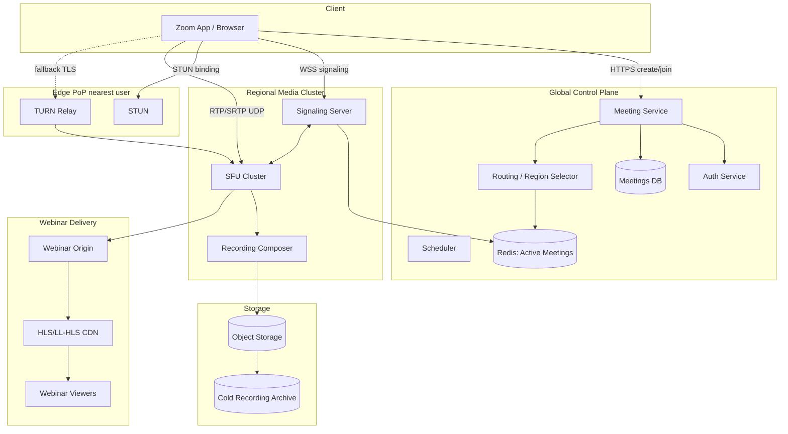

# Design Zoom — Real-Time Video Conferencing at Planet Scale

**Date:** 2026-04-25 | **Updated:** 2026-04-25
**Tags:** `system-design` `case-study` `zoom` `video-conferencing` `webrtc` `sfu`

## Table of Contents

- [Summary](#summary)
- [Functional Requirements](#functional-requirements)
- [Non-Functional Requirements](#non-functional-requirements)
- [Capacity Estimation](#capacity-estimation)
- [API Design](#api-design)
- [Data Model](#data-model)
- [High-Level Design](#high-level-design)
- [Deep Dives](#deep-dives)
  - [P2P Mesh vs MCU vs SFU](#p2p-mesh-vs-mcu-vs-sfu)
  - [The Selective Forwarding Unit](#the-selective-forwarding-unit)
  - [Simulcast vs SVC](#simulcast-vs-svc)
  - [Signaling, SDP, ICE, STUN, TURN](#signaling-sdp-ice-stun-turn)
  - [WebRTC vs Zoom's Proprietary Stack](#webrtc-vs-zooms-proprietary-stack)
  - [Geographic SFU Placement](#geographic-sfu-placement)
  - [Recording](#recording)
  - [Webinars vs Meetings](#webinars-vs-meetings)
  - [Audio Pipeline](#audio-pipeline)
  - [Quality Adaptation](#quality-adaptation)
  - [Capacity per SFU and Cluster Scaling](#capacity-per-sfu-and-cluster-scaling)
- [Bottlenecks and Trade-offs](#bottlenecks-and-trade-offs)
- [Anti-Patterns](#anti-patterns)
- [Related](#related)
- [References](#references)

## Summary

Zoom is a real-time, multi-party video conferencing system that must deliver sub-150ms mouth-to-ear latency for hundreds of millions of concurrent participants across the globe. The dominant architectural pattern is the **Selective Forwarding Unit (SFU)**: each client uploads one (or a few simulcast) encoded stream(s) to the nearest media server, and the SFU forwards an appropriate subset of those streams to every other participant — without decoding, mixing, or transcoding the media. Around that media plane sits a **control plane** (signaling, scheduling, auth, presence, recording orchestration) and a **delivery plane** (TURN relays, regional clusters, CDN egress for webinars).

The hard parts are not the obvious ones. Encoding video is solved. The interesting problems live in: (1) bandwidth estimation per receiver, (2) layer selection across simulcast or SVC, (3) NAT traversal in hostile networks, (4) packet loss recovery without head-of-line blocking, (5) global SFU placement that minimizes RTT while keeping a meeting on a single forwarding fabric, and (6) graceful degradation when a 1000-participant all-hands hits a constrained client. Zoom in particular famously diverged from WebRTC and uses a custom UDP-based protocol with subscription-based stream switching, which lets them bypass several WebRTC limitations at the cost of a heavier client.

## Functional Requirements

The system must support the user-facing capabilities of a modern conferencing product:

- **Host a meeting** — authenticated user creates a meeting, gets a join URL and numeric ID, optionally schedules it for later.
- **Join with a link or ID** — invitees authenticate (or use guest flow), are routed to the right meeting on the right SFU.
- **Real-time audio and video** — bidirectional, low-latency, adaptive bitrate, supports 1080p down to audio-only.
- **Screen share** — desktop or window or tab capture, treated as an additional video track with different encoding profile (higher resolution, lower frame rate, content-tuned codec settings).
- **In-meeting chat** — durable for the meeting lifetime, broadcast to all participants, optional persistence to user history.
- **Recording** — cloud-side composite recording (gallery view + speaker view + chat overlay) and optional local recording on host machine.
- **Breakout rooms** — host splits N participants into K sub-meetings, each backed by its own SFU room, with re-merge capability.
- **Virtual backgrounds and noise suppression** — client-side ML processing on the raw frames before encoding.
- **Large webinars** — one-to-many broadcast to 10k+ viewers, hosts and panelists are interactive, attendees are receive-only with chat/Q&A.
- **Reactions, raise hand, polling, whiteboard** — in-meeting collaboration primitives carried over the data channel or signaling.
- **End-to-end encryption (optional)** — opt-in mode where keys never reach Zoom servers; trades off cloud recording, dial-in, and some scaling features.

## Non-Functional Requirements

| Concern | Target |
|---|---|
| Mouth-to-ear latency | < 150 ms RTT median, < 250 ms p99 within a region |
| Glass-to-glass video latency | < 200 ms median |
| Resolution | 1080p30 for active speaker, 720p30 for gallery, down to 180p when constrained |
| Audio | 48 kHz Opus, ~32 kbps per stream |
| Meeting size | 1000 interactive participants per meeting; 50,000 webinar attendees |
| Concurrent meetings | Tens of millions globally during peak hours |
| Availability | 99.99% control plane, 99.9% per-region media plane |
| Geographic coverage | Sub-100ms RTT to nearest SFU for >95% of internet population |
| Packet loss tolerance | Usable up to 30% loss with FEC + NACK + jitter buffer |
| Security | DTLS-SRTP for media, TLS for signaling, optional E2EE |

The asymmetry to internalize: **latency is non-negotiable, bandwidth is elastic, quality is adaptive**. Conferencing tolerates resolution loss far better than it tolerates a 500ms stall.

## Capacity Estimation

Rough numbers for a Zoom-class deployment. Use these as order-of-magnitude reasoning, not gospel.

**Per-stream bandwidth (encoded):**

| Layer | Resolution | Bitrate |
|---|---|---|
| High | 1080p30 | 2.5–4 Mbps |
| Medium | 720p30 | 1.0–1.5 Mbps |
| Low | 360p15 | 250–400 kbps |
| Thumbnail | 180p15 | 100–150 kbps |
| Audio | 48 kHz mono | 32 kbps |

**A 4-person meeting** at 720p:
- Each client uploads 1 video (1.2 Mbps) + 1 audio (32 kbps) ≈ 1.25 Mbps up.
- Each client downloads 3 videos + 3 audios ≈ 3.7 Mbps down.
- SFU sees 4 × 1.25 Mbps = 5 Mbps in, 4 × 3.7 Mbps = ~15 Mbps out.

**A 100-person meeting** with active-speaker view (1 high + 8 thumbnails visible):
- Each client uploads 1 simulcast stack (~2.5 Mbps if camera on) + audio.
- Each client downloads 1 high (1.2 Mbps) + 8 thumbnails (1.2 Mbps) + audio = ~2.5 Mbps down.
- SFU per meeting: 100 × 2.5 Mbps in, 100 × 2.5 Mbps out = 250 Mbps in, 250 Mbps out.

**Concurrent meetings:** assume 10M concurrent participants in peak hours, average meeting size 6, that is ~1.7M concurrent meetings. At 5 Mbps in + 15 Mbps out per meeting, that is ~8.5 Tbps ingress and ~25 Tbps egress globally. Distribute across 30 regions: ~280 Gbps ingress, ~830 Gbps egress per region average. Peak regions (US-East, EU-West, AP-Northeast) carry 3–5× the average.

**Servers:** A modern SFU on commodity hardware handles ~500–1000 concurrent media streams (CPU-bound on packet processing, RTCP, encryption). At 1000 streams per box and 60M concurrent streams (10M participants × 6 average peer streams), you need ~60,000 SFU instances globally — call it 100k with headroom.

**Storage for recordings:** assume 30% of meetings record, 1 hour average, 1.5 Mbps composite. That is ~700 MB per recorded meeting. At 500k recorded meetings per day, ~350 TB/day or ~130 PB/year before retention pruning.

**TURN relays:** roughly 10–20% of clients fall back to TURN due to symmetric NAT or strict firewalls. TURN relay traffic equals the full client up+down bandwidth. Budget separately, often co-located with SFU.

## API Design

Three protocol surfaces, each tuned to its job.

**Control plane (HTTPS REST or gRPC):**

```
POST   /v1/meetings                        # create meeting
GET    /v1/meetings/{id}                   # fetch metadata
DELETE /v1/meetings/{id}                   # cancel
POST   /v1/meetings/{id}/participants      # invite
POST   /v1/meetings/{id}/recordings        # start/stop recording
GET    /v1/users/{id}/meetings             # list user's meetings
POST   /v1/auth/token                      # short-lived join token (JWT)
```

Control plane is fully HTTPS, idempotent on POST where appropriate, behind a global load balancer with regional failover.

**Signaling (WebSocket or proprietary TCP):**

Long-lived bidirectional channel from each client to its assigned signaling server. Carries:
- `join` / `leave` events
- `sdp-offer` / `sdp-answer` / `ice-candidate` for WebRTC clients
- Subscription updates: "I now want stream X at layer 2"
- Presence and roster changes
- Chat, reactions, raise-hand
- Recording status, host commands (mute all, end meeting)

Signaling is **stateful per meeting**: the signaling server holds a roster and routes events to the right SFU(s).

**Media (UDP, RTP/SRTP or proprietary):**

- WebRTC stack: RTP for media payloads, RTCP for feedback (NACK, PLI, FIR, REMB, TWCC), DTLS-SRTP for encryption, SCTP-over-DTLS for data channel.
- Zoom proprietary: custom binary UDP protocol with subscription messages and adaptive layer selection baked in. Falls back to TCP/443 with TLS in restricted networks.

**Connectivity (ICE/STUN/TURN):**

- STUN servers respond with the client's public address; cheap, stateless, ~one round trip.
- TURN servers relay all media when direct connection fails; expensive, stateful, full bandwidth.

## Data Model

Keep operational state small and ephemeral. Push durable history to async pipelines.

**Meeting (durable, in Postgres or similar):**

```
meeting_id            uuid PK
host_user_id          uuid FK
title                 text
scheduled_start       timestamptz
scheduled_duration    interval
join_password_hash    text
settings              jsonb     -- waiting room, mute on entry, E2EE, recording
created_at            timestamptz
```

**ActiveMeeting (ephemeral, in Redis or in-memory cluster):**

```
meeting_id
sfu_cluster_id        -- which regional SFU group hosts the media
signaling_node_id
participants_count
started_at
recording_state       -- off | starting | recording | uploading
breakout_parent_id
```

**Participant (ephemeral, per-session):**

```
session_id            uuid PK
meeting_id            FK
user_id               nullable for guests
display_name
joined_at
sfu_node_id           -- which SFU box owns this participant's media
ice_state
audio_muted
video_muted
role                  -- host | co-host | panelist | attendee
client_capabilities   -- codecs, max bitrate, device
```

**Stream (in-memory on the SFU):**

```
stream_id
session_id
kind                  -- audio | video | screen
codec                 -- opus | vp9 | h264 | av1
simulcast_layers      -- [{rid, width, height, max_bitrate}]
ssrc_main, ssrc_rtx
last_keyframe_seq
nack_state
```

**Recording (durable):**

```
recording_id
meeting_id
started_at, ended_at
storage_url           -- s3://recordings/yyyy/mm/dd/meeting_id/...
size_bytes
composition           -- gallery | active-speaker
encryption_key_ref
status                -- recording | processing | ready | failed
```

**ChatMessage (durable, partitioned by meeting_id):**

```
message_id
meeting_id
sender_session_id
sent_at
body
recipients            -- everyone | private user_id
```

## High-Level Design



The picture has three planes:

1. **Control plane** — global, mostly stateless services backed by durable storage. Handles auth, meeting CRUD, routing decisions ("which SFU cluster should this meeting use?"), scheduling, billing.
2. **Media plane** — regional. SFUs and signaling servers, deployed in clusters across dozens of regions. A meeting is pinned to one regional cluster (with failover), and all participants connect to it.
3. **Delivery plane** — for webinars only. The SFU emits the canonical broadcast stream to an origin, which packages it into HLS/LL-HLS segments and pushes to a CDN for fan-out to read-only viewers.

The control plane is geographically replicated and read-mostly during a meeting. The media plane is where all the real-time work happens.

## Deep Dives

### P2P Mesh vs MCU vs SFU

Three classical topologies, and the reason every modern conferencing product picks SFU.

**P2P Mesh.** Every participant opens a direct WebRTC connection to every other participant. With N participants, each one encodes N-1 outbound streams and decodes N-1 inbound streams. Traffic per client scales as O(N), CPU and bandwidth on the publisher's end blow up fast. Mesh is fine for 2-person calls and tolerable up to ~3–4. Beyond that, the publisher's uplink saturates and CPU thermals tank.

```
        A ---- B
        |\\   /|
        | \\ / |
        |  X   |
        | / \\ |
        |/   \\|
        D ---- C
```

**MCU (Multipoint Control Unit).** Every client sends one stream to a central server. The server **decodes all N streams, mixes them into one composite (gallery) stream, re-encodes it, and sends one stream back to each client**. Beautiful for the client (one in, one out) but pathological for the server: full transcode of every stream is CPU-bombing. An MCU box might handle 5–20 streams. Modern hardware with GPU transcode helps, but the economics never compete with SFU. MCUs survive in legacy SIP/H.323 bridges and in some hardware appliances.

**SFU (Selective Forwarding Unit).** Each client uploads one (or a few simulcast) stream(s). The server **does not decode**; it forwards encrypted RTP packets to the subscribed peers, choosing which simulcast or SVC layer each peer should receive. Server CPU is dominated by packet shuffling, RTCP processing, and SRTP encryption — all far cheaper than codec work. An SFU handles 500–1000+ streams per box.

The SFU win is asymmetric in three ways:
- **Server cost** — no transcode, ~10–50× cheaper than MCU per stream.
- **Latency** — no decode/encode pipeline adds zero buffering at the server.
- **Per-receiver adaptation** — each subscriber gets a different layer based on their bandwidth, without re-encoding.

The cost: clients must decode N streams (mitigated by sending lower layers to non-active speakers, and by hardware decode), and the server cannot do tricks that need pixels (like server-side composite, server-side virtual backgrounds, or transcoding to HLS for a CDN — though Zoom does the last via a separate dedicated path). For >3 participants, **SFU dominates**, and every modern stack — Zoom, Google Meet, Teams, Daily, LiveKit — runs an SFU.

### The Selective Forwarding Unit

The SFU is the heart of the system. It is a packet router with a few specific responsibilities:

1. **Authenticate and admit** an incoming RTP stream (DTLS-SRTP handshake, validate against signaling state).
2. **Demultiplex** incoming streams by SSRC and RID (RTP Stream ID, used for simulcast).
3. **Maintain subscription state** — "client X wants stream Y at layer Z."
4. **Forward** RTP packets to the right subscribers, rewriting SSRCs and sequence numbers if needed, re-encrypting under the subscriber's SRTP context.
5. **Process RTCP feedback** — NACK requests trigger retransmission from a small per-stream buffer; PLI/FIR requests trigger keyframe forwarding from upstream.
6. **Bandwidth estimation** per subscriber (TWCC — Transport-Wide Congestion Control) — pick which layer to forward.
7. **Layer switching** — when bandwidth tightens, drop from layer 2 to layer 1; aligned to keyframe boundaries for clean cuts.

Open source SFUs:

- **Janus** — a modular gateway in C with plugins for video room, streaming, recording, SIP. Plugin model is its defining feature; the core handles ICE (libnice), DTLS (OpenSSL), SRTP (libsrtp) and exposes RTP to plugins. Great for building custom topologies.
- **mediasoup** — a Node.js / Rust SFU module, not a server. You compose `Workers`, `Routers`, `Transports`, `Producers`, and `Consumers` in your own application. Designed for embedding inside a larger system; high performance via native code per worker.
- **LiveKit** — a Go-based, horizontally scalable, opinionated SFU server. Comes with a coordinator that distributes meetings across nodes, redis-backed routing, and SDKs for every platform. The "batteries included" SFU.

All three converge on the same primitives: subscriptions, simulcast, TWCC, NACK, PLI, jitter buffer compensation. They differ on what they hide behind their API.

### Simulcast vs SVC

Two ways to make one publisher serve subscribers with different bandwidth budgets.

**Simulcast.** The publisher encodes the same source at 3 (or more) independent quality levels — say `f` (full, 1080p), `h` (half, 540p), `q` (quarter, 270p). The publisher uploads all three. The SFU forwards whichever one the subscriber can handle. Pros: works in every browser and every codec (VP8, VP9, H.264, AV1). Cons: the publisher's uplink carries the sum of all layers (~1.4× the highest layer alone, due to redundant overhead).

```
Publisher uplink:
    [ low 250kbps ] [ med 1Mbps ] [ high 2.5Mbps ]   total ~3.7 Mbps

SFU per subscriber:
    Sub A on fiber       -> high
    Sub B on hotel wifi  -> med
    Sub C on 4G          -> low
```

**SVC (Scalable Video Coding).** The publisher encodes a single layered bitstream where each higher layer depends on the lower ones. The SFU "peels" layers off per subscriber. Spatial layers (resolution), temporal layers (frame rate), and quality layers (SNR) can all be stacked.

- VP8 supports temporal SVC only.
- VP9 supports temporal + spatial SVC. Reduces publisher uplink ~40–60% vs VP8 simulcast in multi-party calls.
- AV1 supports SVC but is computationally expensive; mostly used for screen share today.

SVC is strictly more efficient for the publisher. Why does production not just use SVC everywhere?

- **Browser support.** VP9 SVC encoding works well in Chrome, partial in Firefox, not in Safari. AV1 SVC is experimental.
- **Codec maturity.** Hardware decode for VP9 SVC is uneven across mobile chipsets; battery hits matter.
- **Tooling.** Most SFUs have shipped excellent simulcast support for years; SVC integration is newer.

The pragmatic answer in 2026: **simulcast with VP9, sliding to SVC for VP9/AV1 where supported**, falling back to H.264 simulcast for legacy receivers. LiveKit's writeup of porting Zoom's optimizations to WebRTC walks through this hybrid.

### Signaling, SDP, ICE, STUN, TURN

Before any media flows, two peers must negotiate codecs, exchange transport addresses, and cut a secure channel. WebRTC delegates the *transport* of this negotiation to the application — you build your own signaling.

**Signaling.** A WebSocket (or proprietary) channel between each client and a signaling server. The signaling server is a relay for `offer` / `answer` / `candidate` messages between peers, and a roster manager.

**SDP (Session Description Protocol).** Plain-text blob describing media: codecs, payload types, RTP extensions, simulcast layers, DTLS fingerprint, ICE credentials. The publisher generates an `offer SDP`; the SFU responds with an `answer SDP`. Modern WebRTC uses "Unified Plan" SDP with one `m=` section per media stream.

**ICE (Interactive Connectivity Establishment).** RFC 5245 framework that gathers a list of *candidate* addresses for each peer, then tries them pairwise until one works.

Three candidate types:
1. **Host** — the local interface address (LAN IP).
2. **Server-reflexive (srflx)** — your public IP as seen by a STUN server. This is the common case behind a typical home or office NAT.
3. **Relayed (relay)** — an address allocated on a TURN server that proxies all traffic.

ICE prioritizes host > srflx > relay, runs connectivity checks, and picks the best working pair.

**STUN.** RFC 5389. The client sends a binding request to a STUN server; the server replies with the public source address it observed. Fast, stateless, low-cost.

**TURN.** RFC 8656. When direct UDP fails (symmetric NAT, strict corporate firewall, UDP blocked), the client allocates a relay on a TURN server and routes all media through it. TURN runs over UDP, TCP, and TLS-over-TCP/443 to defeat the most aggressive firewalls. **TURN is expensive** — full bidirectional bandwidth — so you minimize its use. A typical service sees 10–20% of sessions touch TURN; some enterprise networks push that to 50%.

The path is: STUN to discover, ICE to negotiate, DTLS to authenticate the peer's certificate (verified against SDP fingerprint), SRTP keys derived from DTLS, RTP starts flowing.

### WebRTC vs Zoom's Proprietary Stack

WebRTC is the open W3C/IETF standard, baked into every browser. It is what most products build on. Zoom did not, and the divergence is instructive.

**WebRTC.** Standard codec set (VP8, VP9, H.264, Opus, AV1), RTP/RTCP for media, DTLS-SRTP for security, SCTP for data channel, ICE/STUN/TURN for connectivity. Browser-native. Heavily standardized RTCP feedback (NACK, PLI, FIR, REMB, TWCC). Limitations: codec negotiation is rigid, congestion control is somewhat conservative, simulcast/SVC support varies by browser, and the data channel has SCTP overhead.

**Zoom's stack.** A proprietary UDP-based protocol and a desktop/mobile native client. Subscription-based stream switching is baked in (the client subscribes to specific stream layers; the server forwards exactly those). Custom QoS: Zoom developed application-level loss recovery, FEC, and bandwidth probing without being constrained by RTCP semantics. Fallback path: if UDP is blocked, Zoom tunnels over TCP and HTTPS/443 with TLS — at higher latency but reachable from almost any network. The browser client uses WebRTC; the native client uses the proprietary path because it can.

The Zoom advantage: no standards-body coordination cost, can ship custom layer adaptation and packet pacing, and can iterate faster on codec choices and congestion control. The cost: must build and ship native clients on every platform; cannot rely on browser optimizations; opens debate about openness and interop.

The lesson for system designers: **WebRTC is the right default**. You move off it only when you need optimizations the standard cannot deliver and you have the engineering org to build clients for every platform.

### Geographic SFU Placement

A meeting with participants in Tokyo, Frankfurt, and São Paulo cannot all hairpin through a single SFU in Virginia. The latency budget will not survive it.

**Strategy 1: route each meeting to one regional cluster.** When a meeting is created, the routing service picks a region — usually the host's region, or the centroid of expected participants. All participants connect to that region's SFU. Simple, but punishes geographically diverse meetings.

**Strategy 2: per-participant nearest SFU + inter-SFU relay.** Each participant connects to the closest SFU in their region. SFUs in different regions form a mesh that forwards streams between them. Each cross-region flow pays one extra hop, but the client RTT to its local SFU stays low. This is the modern default for global products.

**Strategy 3: anycast.** A single anycast IP routes the client to the nearest PoP via BGP. The PoP terminates the connection and bridges into the meeting's SFU mesh. Scales well, lowest client-side latency, but operationally complex.

Zoom uses a regional Meeting Zone model: clusters of Multimedia Routers (MMRs) per region with a Zone Controller managing them. A meeting is assigned to a zone, and clients are routed to the closest MMR in that zone. Inter-zone forwarding handles geographic spread.

Practical rules:
- Place SFU PoPs in every region with >1% of your traffic, plus regulated regions (China, Russia, Brazil, India) for compliance and latency.
- Pin a meeting to a *zone*, not a single SFU box, so failure of one box does not kill the meeting.
- Use BGP / GeoDNS to direct clients to the nearest healthy zone.
- TURN should also be regional; nothing kills latency like TURN-relaying through another continent.

### Recording

Two distinct capabilities, neither cheap.

**Local recording.** The client app captures its own composited view (gallery or active speaker) plus mixed audio and writes an MP4 locally. No server cost, but only what the host saw, no global timeline, no transcripts.

**Cloud recording.** A dedicated *recording bot* joins the meeting on the SFU as a regular subscriber. It receives all video and audio streams, composites them server-side (gallery view, active speaker view, with chat overlays), encodes the result (typically H.264 + AAC), and uploads chunks to object storage as the meeting progresses. After the meeting, a post-processing pipeline:

1. Finalizes the master MP4.
2. Generates a transcript via ASR.
3. Optionally produces speaker-diarized chapters and summaries.
4. Pushes to long-term storage with a TTL based on the customer's plan.
5. Indexes for search and serves a playback URL via signed CDN links.

Cloud recording is **the one place an SFU-class product accepts decode/encode cost** — a recording bot is essentially a one-meeting MCU. Run it on dedicated GPU-capable hosts. Sample at the highest available simulcast layer. Encrypt at rest with per-meeting keys.

### Webinars vs Meetings

A 1000-person interactive meeting is a different product from a 50,000-person webinar, even though the user-visible UI is similar.

**Meetings** are bidirectional. Every participant can publish video and audio. The SFU must handle N publishers and N×(N-1) subscriptions. The interesting capacity number is *publishers per cluster*.

**Webinars** are one-to-many. There are a few panelists (publishers) and many attendees (subscribers). A webinar fans out to >10k viewers; the bottleneck shifts from SFU forwarding to *broadcast distribution*.

Webinar architecture diverges:

```
Panelist A ┐
Panelist B ┤── SFU (interactive panel)
Panelist C ┘        │
                    │ encode canonical broadcast stream
                    ▼
                  Origin
                    │
            ┌───────┼───────┐
           CDN     CDN     CDN  (HLS / LL-HLS)
            │       │       │
        Viewers  Viewers  Viewers (10k - 100k+)
```

The panel is a small SFU room. The SFU emits a *single* high-quality composite to an origin server, which packages it into HLS or LL-HLS segments (1–3 second chunks) and pushes to a CDN. Attendees pull from the CDN with standard HTTP. Latency is higher than SFU (5–10s for HLS, 1–3s for LL-HLS) but bandwidth scales like any video CDN — far past what SFU forwarding could do.

Q&A and chat from attendees go up via signaling, are visible to panelists, and panelists can promote an attendee to panelist (which moves them onto the SFU's interactive path).

### Audio Pipeline

Audio is unforgiving — 50ms of jitter is audible, 200ms makes a meeting unusable. The pipeline is dense:

1. **Capture** at the OS audio API. Sample rate negotiation (16 kHz or 48 kHz).
2. **Acoustic Echo Cancellation (AEC).** Subtract the speaker output from the microphone input so you do not hear yourself. Hard in software when the device has no echo reference.
3. **Noise Suppression (NS).** Classical spectral subtraction or ML-based (RNNoise, NSNet, or proprietary). Removes keyboard clicks, fans, traffic.
4. **Automatic Gain Control (AGC).** Normalize loudness across speakers.
5. **Voice Activity Detection (VAD).** Detect silence to gate the encoder; saves bandwidth and helps the SFU decide who is the active speaker.
6. **Encode.** Opus at 32–64 kbps mono, with FEC enabled, 20ms frames.
7. **Send** over RTP/SRTP.

On the receive side: jitter buffer (30–80ms adaptive), decode, mix multiple speakers, output. The SFU does **not** mix audio — it forwards the top-K loudest streams (often K=3) to each subscriber to minimize forwarding overhead and let the client mix. "Active speaker" detection runs in the SFU based on RTP audio level extension headers and drives the gallery focus.

### Quality Adaptation

The whole point of SFU + simulcast is per-receiver quality adaptation. The mechanics:

**RTCP feedback.**
- **NACK** — receiver reports missing sequence numbers. SFU retransmits from its small jitter buffer (~200ms).
- **PLI / FIR** — picture loss indication / full intra request. Forces the publisher (or upstream) to send a keyframe. Used after sustained loss.
- **REMB / TWCC** — bandwidth estimation feedback.

**Forward Error Correction (FEC).** Send redundant parity packets so a single dropped packet can be reconstructed without retransmission. Costs 20–40% extra bandwidth but trades it for latency. Critical for audio.

**Jitter buffer.** Receiver-side queue that smooths out variable arrival times. Adaptive: grows under packet jitter, shrinks when the network is steady. Trades latency for smoothness.

**Bandwidth estimation (TWCC).** The publisher tags every outgoing packet with a transport-wide sequence number and timestamp. The receiver reports back arrival times. The publisher (and SFU, for its forwarding decisions) uses inter-arrival deltas to detect congestion before loss. This is the modern WebRTC standard and what every serious SFU implements.

**Layer switching.** When TWCC says a subscriber can only handle 600 kbps and the active layer is 1 Mbps, the SFU drops to the 360p layer. Done at a keyframe boundary (or via SVC layer drop, which is keyframe-free) to avoid visual glitches.

**Adaptive frame rate.** Ahead of dropping resolution, drop temporal layers — go from 30 fps to 15 fps to 7.5 fps. Often less perceptually painful than a resolution cut.

### Capacity per SFU and Cluster Scaling

A single SFU box on modern hardware (24-core, 64GB RAM, 25GbE NIC) handles roughly:

- 500–1000 concurrent media streams (audio + video).
- 1–3 Gbps of forwarded RTP.
- A few thousand RTCP feedback events per second.

CPU is dominated by SRTP encryption/decryption, packet forwarding, and TWCC math. Memory is dominated by per-stream NACK buffers (~1 MB per stream for a 200ms loss recovery window).

**Scaling strategies:**

- **Sharding by meeting.** Each SFU box hosts whole meetings, never a slice. A meeting that exceeds one box's capacity moves to a larger box (vertical scale) or splits across multiple SFUs that mesh-forward to each other (horizontal scale).
- **Coordinator pattern.** A control component (e.g., LiveKit's coordinator, Zoom's Zone Controller) tracks SFU health and load, places new meetings, and triggers migration.
- **Pre-warming.** At known peak hours (Mondays 9am in each region), spin up extra SFUs in advance. SFU cold starts are not painful but participant join thundering herds are.
- **Graceful drain.** When upgrading, mark a node as draining; allow current meetings to finish but route no new ones. Forces meeting lifetime to be the unit of deployment risk.

A 1000-person interactive meeting strains a single SFU box (1000 publishers × ~6 selected subscribers per receiver ≈ 6000 forwarding pairs). Distribute across multiple SFUs in the same cluster, with one SFU per ~200 participants and inter-SFU forwarding for cross-talk.

## Bottlenecks and Trade-offs

The classic ones, ranked by how often they actually bite:

- **Last-mile bandwidth.** The publisher's uplink (often residential 10 Mbps up) is the most common quality bottleneck, not the server. Simulcast and dynamic publish layer dropping (LiveKit's "dynamic broadcast") help.
- **NAT and firewalls.** ~10–20% of sessions need TURN. TURN is real cost, real latency, real complexity. Some corporate networks block UDP entirely; you must support TCP/TLS fallback or you lose users.
- **CPU on small devices.** 49 video tiles at 720p will melt a Chromebook. Per-receiver layer policy must consider client capability (sent in client capabilities at join time) and downshift aggressively.
- **Geographic spread.** A meeting with participants on three continents will see 200ms+ RTT for some pairs no matter what. Inter-SFU relay helps client→SFU latency but cannot beat the speed of light between SFUs.
- **Recording load.** A recording bot is a heavy participant; budget separate hardware. Don't host recording on the same boxes as live SFU.
- **End-to-end encryption vs features.** True E2EE breaks server-side recording, transcription, dial-in via PSTN gateways, and live captions. Make it opt-in, document the trade-off clearly.
- **Echo and audio quality on commodity hardware.** Bluetooth headsets, cheap laptop mics, and bad rooms generate echo and noise that crush every quality metric. AEC and noise suppression are not optional.

## Anti-Patterns

A short list of mistakes to refuse:

- **Reaching for an MCU "for simplicity."** Server cost and latency will dominate. Use SFU.
- **Hairpinning all meetings through one region.** Latency tax for everyone outside that region. Deploy regionally from day one.
- **Forgetting TURN.** "WebRTC just works" until 15% of your users cannot connect. Run TURN servers, monitor TURN usage, route TURN regionally.
- **One signaling node per meeting with no failover.** Signaling is stateful but not the bottleneck — replicate state to a sibling and fail over.
- **Mixing video on the SFU.** Mixing means decoding means transcoding means burning the cost advantage of an SFU. Mix on the client. Recording is the one exception.
- **Letting bandwidth estimation live in the client only.** The SFU must do its own bandwidth estimation per subscriber to make forwarding decisions. Trusting the client's REMB report is not enough.
- **Holding meeting state in a single in-memory blob.** Crash kills the meeting. Replicate session state to Redis or a sibling node.
- **Conflating webinars with meetings.** A 50k-attendee meeting will not fit in an SFU. Webinars need a separate broadcast pipeline through HLS/LL-HLS over CDN.
- **Treating recording as a feature you bolt on.** Recording is a full subsystem with its own scaling, storage, transcoding, and compliance concerns.
- **Ignoring the IPv6/dual-stack and HTTP-proxy cases.** RFC 7478 explicitly calls these out; many corporate networks need them.

## Related

- [Real-Time Channels — WebSocket, SSE, Polling](../../communication/real-time-channels.md) — the signaling layer choices.
- [Multi-Region Architectures](../../reliability/multi-region-architectures.md) — the deployment shape that makes regional SFU placement work.
- [Push vs Pull Architecture](../../communication/push-vs-pull-architecture.md) — the fan-out trade-off webinars expose.
- [Failure Modes and Fault Tolerance](../../reliability/failure-modes-and-fault-tolerance.md) — degradation paths when networks fail.

## References

- [RFC 7478 — Web Real-Time Communication Use Cases and Requirements](https://www.rfc-editor.org/rfc/rfc7478) — the canonical use case and requirements document underlying WebRTC.
- [WebRTC API and Protocols (MDN)](https://developer.mozilla.org/en-US/docs/Web/API/WebRTC_API/Protocols) — overview of ICE, STUN, TURN, SDP, and the WebRTC stack.
- [mediasoup documentation — Overview](https://mediasoup.org/documentation/overview/) — SFU architecture and primitives (Workers, Routers, Producers, Consumers).
- [Janus WebRTC Server documentation](https://janus.conf.meetecho.com/docs/) — modular general-purpose WebRTC gateway and SFU.
- [LiveKit SFU internals](https://docs.livekit.io/reference/internals/livekit-sfu/) — horizontally scalable SFU architecture.
- [LiveKit blog — An Introduction to WebRTC Simulcast](https://blog.livekit.io/an-introduction-to-webrtc-simulcast-6c5f1f6402eb/) — simulcast layers, encoding, and receiver selection.
- [LiveKit blog — Bringing Zoom's end-to-end optimizations to WebRTC](https://blog.livekit.io/livekit-one-dot-zero/) — StreamAllocator, dynamic broadcast, bandwidth estimation.
- [Daily.co — Smooth Sailing With Simulcast](https://www.daily.co/blog/simulcast/) — production SFU and simulcast engineering at scale.
- [Daily.co — Scaling applications to support large calls](https://docs.daily.co/guides/scaling-calls/best-practices-to-scale-large-experiences) — scaling SFU clusters to thousands of participants.
- [W3C — Scalable Video Coding (SVC) Extension for WebRTC](https://www.w3.org/TR/webrtc-svc/) — SVC API for WebRTC.
- [BlogGeek.me — SVC in WebRTC: VP9 & AV1](https://bloggeek.me/webrtcglossary/svc/) — SVC vs simulcast comparison.
- [CometChat — A Study of Zoom's Video Conferencing Architecture](https://www.cometchat.com/blog/zoom-video-technology-architecture) — Zoom's MMR, Meeting Zones, UDP-first protocol.
- [Zoom Global Infrastructure whitepaper](https://zoomgov.com/docs/doc/Zoom_Global_Infrastructure.pdf) — Zoom's infrastructure and reliability design.
