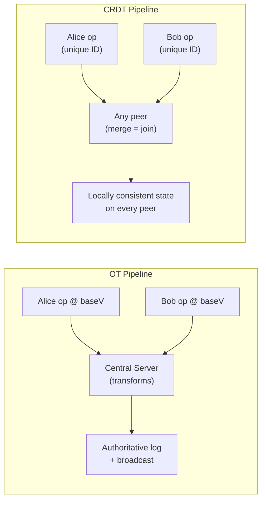

# Google Docs Deep Dive — OT vs CRDT

**Date:** 2026-04-29 | **Updated:** 2026-04-29
**Tags:** `system-design` `case-study` `google-docs` `deep-dive` `ot` `crdt` `collaboration`

## Table of Contents

- [Summary](#summary)
- [Overview](#overview)
- [OT Mechanics](#ot-mechanics)
- [CRDT Mechanics](#crdt-mechanics)
- [TP1 / TP2 Conditions](#tp1--tp2-conditions)
- [Real-World Choices](#real-world-choices)
- [Tombstone Garbage Collection](#tombstone-garbage-collection)
- [Memory Overhead](#memory-overhead)
- [Offline-First Writes](#offline-first-writes)
- [Benchmarks — Document Size, Latency, Memory](#benchmarks--document-size-latency-memory)
- [Anti-Patterns](#anti-patterns)
- [Related](#related)
- [References](#references)

## Summary

Operational Transformation (OT) and Conflict-Free Replicated Data Types (CRDT) are the two deeply-studied approaches to making concurrent edits on the same shared document converge to identical state on every replica. They solve the same problem with opposite philosophies. **OT** keeps operations small (offsets and lengths) and rewrites them against the authoritative log so that any concurrent pair commutes after transformation; this needs a central server in any practical system. **CRDT** makes operations carry enough metadata (globally unique IDs, causal context) so that the merge function is a pure mathematical join — independent of order, peer, or topology. Google Docs runs OT (Wave-derived). Yjs and Automerge run CRDT. Figma runs a centralized last-writer-wins variant that borrows ideas from both. The choice has cascading consequences for offline support, server architecture, network volume, memory footprint, and how badly garbage accumulates inside a long-lived document.

This deep-dive companions the parent [Design Google Docs](../design-google-docs.md) HLD with the math, the failure modes, and the operational numbers that don't fit in an HLD.

## Overview

The collaboration problem in one paragraph: Alice and Bob both have version V of a document. Alice inserts "X" at position 1; concurrently, Bob inserts "Y" at position 3. Both edits must end up in the document, and Alice's view must converge to the same final state as Bob's, no matter which order their respective machines learned about the other's edit. The question "what is position 3 *now* on Bob's view, given Alice's insert?" is the entire game.

**OT** answers it by saying: rewrite Bob's op against Alice's so it lands at position 4 instead of 3. Operations are *transformed*, not retained verbatim.

**CRDT** answers it by saying: don't use position 3 at all. Use a globally unique ID for the character to the left of Bob's caret. Insert his "Y" between two stable IDs. Set union does the rest.

Both work. Both have decades of production usage. Both have subtle traps. The differences appear most clearly along three axes:

| Axis | OT favors | CRDT favors |
|------|-----------|-------------|
| Topology | Centralized — server transforms against the authoritative log | Any topology, including peer-to-peer, including offline-first |
| Op metadata | Tiny (offsets, lengths, a base version) | Large (every char carries an ID; tombstones survive deletion) |
| Implementation pain | Transformation function correctness | Memory and network bloat; garbage collection |

The rest of this document drills into each axis with the formal math, the production-relevant numbers, and the choices real systems made.



## OT Mechanics

### The Transformation Function

OT is built around a function

```
T(opA, opB) = (opA', opB')
```

with the property that

```
apply(apply(s, opA), opB') == apply(apply(s, opB), opA')
```

for every state `s` and every concurrent pair `(opA, opB)` derived from the same base state. This is the **convergence property** at the heart of OT — informally, "transforming each op against the other and applying in either order produces the same state".

For a textual editor with two operation kinds (`insert(pos, text)` and `delete(pos, len)`), the four transformation cases are:

```
T(insert(p1, t1), insert(p2, t2)):
    if p1 < p2 or (p1 == p2 and tieBreak(idA, idB)):
        return (insert(p1, t1), insert(p2 + len(t1), t2))
    else:
        return (insert(p1 + len(t2), t1), insert(p2, t2))

T(insert(p1, t1), delete(p2, l2)):
    if p1 <= p2:
        return (insert(p1, t1), delete(p2 + len(t1), l2))
    else:
        return (insert(p1 - l2, t1), delete(p2, l2))   # if p1 < p2 + l2, see below

T(delete(p1, l1), insert(p2, t2)):
    if p2 <= p1:
        return (delete(p1 + len(t2), l1), insert(p2, t2))
    else:
        return (delete(p1, l1), insert(p2 - l1, t2))   # if p2 < p1 + l1, see below

T(delete(p1, l1), delete(p2, l2)):
    # split into non-overlap, overlap, and contained subcases — six total
    ...
```

The deletion-versus-insertion-into-a-deleted-range edge cases are the historical source of bugs. If Alice inserts "Z" at position 12 while Bob deletes positions 10–15 concurrently, what should happen to Z? Real OT systems pick a deterministic policy — Wave's policy preserves the insert and shrinks Bob's delete to skip the inserted character — but the logic is finicky and every transformation function publication has had errata.

### Why a Central Server is Required (in Practice)

The transformation function above respects **TP1**: for any pair `(opA, opB)`, `T(opA, opB)` produces convergent state. That is enough when there is a *linear* sequence of authoritative ops and clients only have to transform their pending edits against new ops appended to that sequence:

```
ServerLog: o1, o2, o3
Alice (at o1): pending = [a]
Bob   (at o1): pending = [b]

Alice sends a. Server transforms a against (o2, o3) → a'. Appends a'. Log: o1, o2, o3, a'.
Bob sends b. Server transforms b against (o2, o3, a') → b'. Appends b'. Log: o1, o2, o3, a', b'.

Bob receives a'; transforms his local pending [b] against [a'] to keep his local state consistent.
Alice receives b'; transforms her local pending [] against [b'] (no-op for empty pending).
```

The server is doing two jobs: linearizing concurrent submissions into a total order, and *picking the base state* (the prefix of the log) against which to transform incoming ops. Without a server, two clients can both transform op A against op B in *different orders* — and unless your transformation function satisfies the much stronger **TP2** property, the end states can diverge silently.

### Wave / Jupiter / Google Docs Lineage

The OT model that ships in Google Docs descends from the **Jupiter** collaboration system (Nichols et al., 1995, Xerox PARC) and from the open-source **Google Wave** implementation (2009). Jupiter introduced the simplification that, with a central server, you only need TP1 — the server is the canonical orderer, so every pair of ops is transformed in a known sequence. Wave generalized this to operations on rich JSON-like structures with attribute formatting, retain ranges, and nested document trees; the Wave whitepaper documents the operation primitives as `retain`, `insert`, `delete`, and `update-attributes`, composed into composite operations. The current Google Docs implementation in the Closure Library is widely understood to be substantially similar to Wave's, with a notable optimization: clients buffer pending operations into a single batch and only send the next batch once the previous batch has been acknowledged. This dramatically reduces transformation cost during network jitter.

### Intention Preservation

A well-known criticism of the textbook TP1-only OT model is that *converging* and *preserving the user's intention* are not the same thing. The textbook example: Alice and Bob both edit the substring "abc" to insert "X" between "a" and "b", concurrently. Both want "aXbc". TP1 gives convergence, but a naive transformation may produce "aXXbc" or even "aXbcX" depending on tie-break rules. The Sun & Ellis 1998 paper formalizes the **intention preservation problem** — the requirement that Alice's edit, after transformation, should produce a result that "looks like" what Alice intended, not just one that converges.

Real OT systems mitigate intention violations through:

- **Cursor-aware tie-breaking**: tie-break by user ID *and* by the local cursor's relationship to the insertion point.
- **Operation composition**: collapse runs of single-character inserts into a composite insert before transformation, so the unit of conflict resolution is "Alice's word" not "Alice's letter".
- **UX coping**: highlight just-edited regions with author-color-tinted cursors so users see the negotiation.

Intention is not a property the math guarantees. It is a UX promise the system aspires to.

## CRDT Mechanics

### The Core Idea — Operations That Commute

A CRDT replaces transformation with a merge function `m` such that

```
m(m(s, opA), opB) == m(m(s, opB), opA)   for all s, opA, opB
```

— i.e., the merge function is *commutative* and *associative*, so the final state is a function of the **set** of operations, not their order of arrival. This is the formal property that makes CRDTs **strong eventually consistent**: any two replicas that have observed the same set of ops are bit-identical.

For a sequence-typed CRDT (the kind a text editor needs), the merge function is essentially set union plus a deterministic tree walk. The trick is in how each character (or operation) gets a globally unique, totally orderable identifier — one that places it deterministically in the rendered sequence even when two clients concurrently insert at the "same" logical position.

### RGA — Replicated Growable Array

RGA (Roh, Jeon, Kim, Lee, 2011) treats the document as a tree where each character node references its **causal predecessor**: the character it was logically inserted after. Each insert carries:

- `id`: a globally unique, totally ordered identifier (e.g., Lamport clock + replica ID).
- `predecessorId`: the id of the character to the immediate left at insert time.
- `value`: the inserted character.
- A `tombstone` flag (set on delete; node retained for ordering).

Two clients concurrently inserting after the same predecessor produce two children. The renderer walks the tree depth-first, sorting siblings by descending `id` (later insertions first). Convergence is automatic: every replica has the same set of nodes and applies the same sort.

### Logoot

Logoot (Weiss, Urso, Molli, 2009) takes a different approach. Instead of a tree, it gives each character a **dense position identifier** — a sequence of integers chosen between the position IDs of its left and right neighbors at insert time. Two concurrent inserts at the "same" position pick different fractional position IDs (disambiguated by replica ID), so they sort deterministically.

The headline win of Logoot is that there are *no tombstones*: deletions remove the node entirely. The headline cost is **interleaving anomalies**: two clients each typing "hello" and "world" between the same two characters can produce "hweolrllod" depending on position-ID generation. Logoot is provably correct for convergence but UX-unfriendly for natural-language text.

### Yjs — YATA

Yjs uses **YATA** (Yet Another Transformation Approach, Nicolaescu et al., 2016), an RGA-derived sequence CRDT engineered for tiny op sizes and aggressive batching. Yjs's wire format encodes runs of consecutive inserts as a single struct with a starting Lamport clock and a length, so typing 50 characters in a burst transmits ~30 bytes total instead of 50 separate ops. It also provides:

- A separate **Awareness CRDT** for cursors, selections, and presence (ephemeral, not part of the doc state).
- Pluggable network providers (WebSocket, WebRTC, IPFS).
- Garbage collection for tombstones once the system has consensus that no offline peer needs them.

Yjs documents are remarkably small. A document of 100k characters with 50k edit operations clocks in around 200 KB on disk after GC, an order of magnitude smaller than a naive op log.

### Automerge

Automerge models JSON-shaped state (maps, lists, text, counters) as a CRDT with **op-id-based** addressing. Every change is a list of op records, each with `(actorId, seq, deps[])` — Lamport-style identifiers plus an explicit causal-context vector. The merge function unions the op set and replays in causal order. Automerge 2.0 rewrote the engine in Rust (2022) and brought document size and merge time down by ~10x compared to the JS-only 1.x line, finally making it viable for documents in the 100 KB range.

Automerge ships a **time-travel history**: every version of the document is reconstructible from the op set, with diffs and blame. This is git-like by design — Martin Kleppmann (Automerge co-author) has written extensively about local-first software, where the canonical doc lives on the user's device and syncs opportunistically when peers are reachable.

### Convergence Proof Sketch

For RGA-style sequence CRDTs, convergence is proved roughly as follows. Let `O` be the set of all operations ever produced. Each replica's state is a deterministic function `render(S)` of the subset `S ⊆ O` it has observed. We show:

1. **Idempotence of `apply`**: applying the same op twice has no effect (deduplicated via op IDs).
2. **Commutativity of `apply`**: `apply(apply(s, x), y) == apply(apply(s, y), x)` for any two distinct ops because the ordering of nodes in the tree is determined by op IDs, not by application order.
3. **Eventual delivery**: every op produced is eventually delivered to every replica (a network-layer assumption, not part of the CRDT itself).

Together: any two replicas that have received the same set of ops produce the same `render(S)`. This is **strong eventual consistency** — the replicas don't need a coordinator to agree, only to exchange ops.

The proof for Logoot, Yjs/YATA, and Automerge is structurally similar but uses different tie-breaking rules and different identifier schemes. Shapiro et al.'s 2011 INRIA technical report (RR-7506) remains the canonical reference for the full formal treatment of CRDT classes (state-based, op-based, delta-based) and the precise commutativity/idempotence/associativity requirements.

## TP1 / TP2 Conditions

The transformation function `T` in OT must satisfy at least one of two properties depending on the system topology.

### TP1 — Convergence Under Linear History

For every triple `(s, opA, opB)` where `opA` and `opB` are concurrent and derived from base state `s`:

```
apply(apply(s, opA), T(opB, opA)) == apply(apply(s, opB), T(opA, opB))
```

This says: after transforming each op against the other and applying them in either order, the result is the same. **TP1 is sufficient when a central server linearizes ops** — the server knows the canonical sequence, transforms incoming ops against the gap between the client's `baseVersion` and the current head, and clients only ever transform their pending ops against the server's authoritative tail.

TP1 is achievable for textual ops and for most rich-text variants, though edge cases (overlapping deletes, retain-with-attribute-change) are subtle.

### TP2 — Convergence Under Arbitrary Histories

For every quadruple `(s, opA, opB, opC)` where `opC` is concurrent with both `opA` and `opB`:

```
T(T(opC, opA), T(opB, opA))  ==  T(T(opC, opB), T(opA, opB))
```

This says: when an op is transformed twice (against `opA` then against the transformed `opB`, or vice versa), the result is independent of which path was taken. **TP2 is required when there is no central server** — each peer can transform ops in different orders, and TP2 guarantees the final transformed op is the same on every peer.

TP2 has been notoriously hard to satisfy. The first published OT algorithms (early 1990s) claimed TP2 but were later shown to violate it under specific concurrent op orderings; corrections were published, then those were shown to have their own bugs. By the mid-2000s, the consensus among researchers was that **TP2 is achievable but extraordinarily difficult to verify**, and that decentralized OT is therefore not worth the engineering investment for most products.

This is why, in practice:

- Google Docs, Office 365 (early), Etherpad, ShareDB → centralized OT, TP1 only.
- Yjs, Automerge, Riak Datatypes, Redis CRDT → CRDT, no transformation needed.
- Pure peer-to-peer OT systems → essentially nonexistent in production.

### Why Modern Systems Skip TP2

The energy that the research community spent trying to make TP2 work has shifted to CRDTs since the late 2000s. Joseph Gentle, who worked on the Google Wave OT engine, wrote a much-cited blog post titled "I was wrong. CRDTs are the future" — arguing that the pain of TP2 (and even TP1's edge cases) is sidestepped by switching to a model where operations commute by construction. The CRDT cost — metadata overhead, garbage collection — is in his framing a more *tractable* engineering problem than TP2 correctness.

## Real-World Choices

What well-known products actually picked, and why.

| Product | Approach | Notes |
|---------|----------|-------|
| **Google Docs / Slides / Sheets** | OT (Wave-derived) | Centralized server transforms; client-side batching; in production ~15 years; sub-second collaboration on docs with hundreds of editors |
| **Office 365 (Word / Excel co-authoring)** | OT historically; partially CRDT-influenced for newer surfaces | Microsoft has not published a definitive paper; Word desktop and Word Online use a centralized merge service |
| **Etherpad** | OT | Open-source pad editor; the codebase ships a textbook OT engine |
| **ShareDB / sharejs** | OT | Joseph Gentle's library; powers many smaller collaborative apps |
| **Figma** | Centralized LWW with client-ID disambiguation | Not a textbook OT or CRDT. Each property on each object converges via last-writer-wins on a centrally-assigned timestamp; new object IDs are unique by construction (client ID embedded). Documented in Evan Wallace's 2019 blog post |
| **Notion** | Centralized server + OT-flavored ops on a block tree | Notion has not published architectural details; behavior is consistent with centralized OT plus block-level conflict resolution |
| **Linear** | Custom CRDT-flavored sync engine | Linear's "sync engine" uses op-based replication with client-side optimistic updates; details public via their engineering podcast appearances |
| **Apple Notes (collaboration)** | CRDT (CloudKit-backed) | Apple uses a CRDT under CloudKit's "Shared CKDatabase". Public information is sparse but the convergence behavior is consistent with a CRDT |
| **Yjs-based apps** (Tldraw, JupyterLab Real-Time, BlockNote, many) | CRDT (YATA) | Network-agnostic; supports P2P, server-relay, and DB-backed providers |
| **Automerge-based apps** (PushPin, Trellis, several local-first apps) | CRDT | Local-first emphasis; offline-first by design |
| **Riak Datatypes / Redis CRDT** | CRDT (state-based for KV scenarios) | Not document editing — but CRDT counters, sets, and maps for distributed KV stores |

The split is not "OT good for some apps, CRDT good for others" — it is largely about *when the company built the product*. Google Docs predates the wave (pun intended) of practical CRDT work in the 2010s. Yjs (released ~2014) and Automerge (~2017) made CRDTs production-viable for documents at a time when nobody would have started a new collaborative editor on OT. Today, the choice for a green-field collaborative editor leans heavily CRDT — unless the team is willing to build and maintain a sophisticated centralized OT server, *and* their product never needs offline-first writes.

## Tombstone Garbage Collection

A defining cost of CRDTs is that **delete is not free** — the deleted character (or sub-tree, or list element) often must be retained as a *tombstone* so that the ordering of remaining elements is preserved for any peer that might still hold a reference to it.

### Why Tombstones Exist

Consider an RGA where Alice deletes character "X" while Bob, concurrently, inserts "Y" *after* "X". Bob's insert references "X" as its causal predecessor. If Alice's replica truly removed "X" from the data structure, Bob's insert would arrive with a dangling reference and the renderer would not know where to place "Y". The tombstone — a node marked deleted but still in the tree — preserves the position-graph so concurrent inserts that reference deleted predecessors still merge correctly.

### Garbage Collection Strategies

The system can reclaim a tombstone once it can prove that **no peer will ever produce a new op that references it**. There are several heuristics:

1. **Causal stability**: track which ops every replica has seen. Once an op is in the *causal past* of every replica's local state, no new op can reference predecessors older than it. All tombstones older than that horizon can be GC'd. This requires a vector clock or version vector across all replicas — expensive but precise.

2. **Time-bounded GC**: assume any peer offline for more than a threshold (say, 30 days) will perform a *reset sync* on reconnect — fetch the current snapshot wholesale rather than play back individual ops. Tombstones older than the threshold can be reclaimed unconditionally. This trades a small failure-mode (an offline peer beyond the threshold needs a fresh clone) for a much simpler GC.

3. **Snapshot-and-prune**: periodically write a snapshot of the rendered document plus a small recent op log. Tombstones whose ops are older than the snapshot horizon are dropped. Yjs takes this approach with its `Y.encodeStateAsUpdate` snapshot format.

4. **Server-coordinated GC**: in a server-mediated CRDT setup (very common), the server tracks per-client offsets and broadcasts "all clients are past version X" notifications. Tombstones older than X are GC'd in lockstep. This is operationally similar to Yjs's typical deployment.

### The Long-Lived Document Problem

CRDT documents that have been edited continuously for years can accumulate significant tombstone debt if GC is not run regularly. A 2023 Yjs benchmark (the "B4" sequential paste-and-edit benchmark from Kevin Jahns's published comparisons) showed:

- Without GC: a heavily-edited 100 KB document grows to several MB of internal state over thousands of edits.
- With aggressive GC (snapshot every 1000 ops): the same document stabilizes around 200 KB.

Yjs does this automatically when its `gc` option is enabled (default true in most providers). Automerge's Rust 2.0 engine added incremental GC in 2023 to the same effect.

OT systems do not have a tombstone problem — deletions remove characters outright — but they accrue **op log growth** instead, mitigated by the standard snapshot-and-trim pattern (see [Snapshot + Op-Log Compaction in the parent doc](../design-google-docs.md#snapshot--op-log-compaction)).

## Memory Overhead

The order of magnitude differences between OT and CRDT footprints, with the variability that real production deployments see.

### Per-Operation Wire Size

| System | Typical per-op wire size | Reason |
|--------|--------------------------|--------|
| OT (Google Docs / ShareDB) | 30–80 bytes | Op kind + offset + length + payload; client ID + base version |
| Yjs | 5–20 bytes (after compression) | Lamport clock encoded as varint; struct-runs collapse N consecutive inserts into one record |
| Automerge 1.x (JS) | 100–250 bytes | Verbose JSON structure with full causal-context vector per op |
| Automerge 2.x (Rust + columnar format) | 15–40 bytes | Rewrote the wire format using columnar compression (similar to Apache Arrow) |
| Logoot | 50–500 bytes | Dense position IDs grow as the document fills with concurrent inserts in the same region |

### Per-Document Memory

| System | 100k-char doc, 50k edits | Notes |
|--------|--------------------------|-------|
| OT log (uncompacted) | ~5–10 MB | Op log grows linearly; snapshot+trim required |
| OT (snapshot + tail) | ~200 KB snapshot + ~1 MB tail | Typical Google Docs steady state |
| Yjs (with GC) | ~200–400 KB | YATA struct-runs + tombstone GC |
| Yjs (without GC) | ~2–5 MB | Tombstones accumulate |
| Automerge 2.x | ~250–500 KB | Columnar format keeps history compact |
| Automerge 1.x | ~3–8 MB | Why the rewrite happened |

### Memory at Runtime — Server-Side

For the centralized server holding live document state in memory:

| Concern | OT | CRDT |
|---------|----|----|
| Doc state | Plain text/structured doc | Doc + op-id index + tombstones |
| Per-client buffer | Pending op queue (small) | Last-known-version vector (small) |
| Awareness | Side channel; not part of doc | Side channel (Yjs Awareness CRDT); same shape |
| Op log | Append-only; trimmed by snapshots | Same; ops stored as CRDT records |

The per-doc memory cost for an in-memory CRDT representation is typically 1.5–3x the equivalent OT representation, before GC. With aggressive GC and snapshot-pinning, the gap closes to ~1.2–1.5x.

## Offline-First Writes

This is where CRDTs unambiguously win.

### CRDT Offline

A client makes edits while offline. Each edit is appended to its local op log with a fresh `(clientId, clock)` ID. On reconnect:

1. Client and server (or peer) exchange "what version are you at?" handshakes — typically version vectors or sets of op IDs.
2. Each side sends the ops the other is missing.
3. Both sides apply ops in any order; the merge function does its job.
4. The client's UI snaps to the merged state. No transformation, no blocking.

A user can edit the same doc on three devices, all offline, for days. When any pair of devices comes online together, they exchange ops and converge. There is no central authority that has to "approve" the merge.

This is the **local-first** philosophy: the canonical document lives on the user's device, not on a server. Sync is opportunistic. Martin Kleppmann's local-first essays and the Automerge project are the canonical references.

### OT Offline

The same scenario in OT is much harder.

1. Client buffers ops locally, each tagged with the `baseVersion` it was generated against.
2. On reconnect, client sends "I am at baseVersion 4218; here are 73 ops".
3. Server has advanced to version 4719. It must transform each of the client's 73 ops against the *501 ops the client missed*.
4. That is roughly `O(N × M)` transformations where N is the client's pending count and M is the server's advance.
5. The server applies the transformed ops, assigns new versions, broadcasts to other clients, and acks the buffering client.
6. The client must then transform its *local pending state* (and its cursor positions, undo stack, etc.) the symmetric way.

For modest offline sessions — a few hundred ops on each side — this works. For *days* of offline editing, the transformation cost grows quadratically and the chance of an intention-violating merge grows in lockstep. Real OT systems set a threshold past which the client is forced to reload from a fresh snapshot, *losing* the offline edits as a separate "unmerged draft" the user must manually integrate. Google Docs degrades exactly this way: edit a long-offline doc on a flaky connection long enough and you eventually see "you've been offline too long, please reload" with the offline edits offered as a copy-paste-able diff.

### Numbers

| Scenario | OT cost | CRDT cost |
|----------|---------|-----------|
| 10 minutes offline, 100 ops both sides | Sub-second merge | Sub-second merge |
| 1 day offline, 5,000 ops both sides | Several seconds; visible UI lag; possible intention violations | Sub-second merge |
| 1 week offline, 50,000 ops both sides | Times out; "please reload"; offline edits become a separate draft | 1–5 second merge; clean convergence |
| 1 month offline | Does not work in practice | Works; some tombstone GC may be deferred |

CRDT is the design point for offline-first. OT is fundamentally a same-second collaboration model that *also* tolerates brief disconnects.

## Benchmarks — Document Size, Latency, Memory

Numbers vary by workload; treat the figures below as orders-of-magnitude. Sources: Kevin Jahns's Yjs benchmarks (B1–B4 standard suite), the Automerge 2.0 release post, and published OT performance characterizations from the Wave codebase.

### Sync Latency (Wire-to-Apply, Same Region)

| System | p50 | p99 |
|--------|-----|-----|
| OT (centralized, 1 RTT to server) | 30–60 ms | 150–250 ms |
| OT (offline catchup, 100 pending ops) | 80–200 ms | 500 ms+ |
| Yjs (server-relay, 1 RTT) | 30–60 ms | 150–250 ms |
| Yjs (P2P over WebRTC, 1 RTT) | 20–40 ms | 100–180 ms |
| Automerge 2.x (server-relay) | 40–80 ms | 200–350 ms |

OT and CRDT are roughly equivalent in same-region steady-state collaboration. The differences appear in pathological cases (long offline sessions, many concurrent editors) and in non-RTT-dominated paths (transformation cost vs merge cost).

### Memory Overhead Ratio (CRDT / OT)

Defined as `memory(CRDT representation) / memory(OT plain doc + tail of op log)` for the same logical document.

| Doc lifecycle | Ratio (Yjs with GC) | Ratio (Automerge 2.x) |
|---------------|---------------------|------------------------|
| Fresh doc, < 1k edits | 1.1–1.3x | 1.2–1.5x |
| Mature doc, 50k edits, GC enabled | 1.3–1.8x | 1.5–2.0x |
| Mature doc, 50k edits, no GC | 5–20x | 4–15x |

GC is doing significant load-bearing work in keeping CRDTs viable for long-lived documents.

### Document Size on the Wire

For initial sync of a 100 KB plain-text document (all editors fresh-loading):

| System | Initial sync size |
|--------|--------------------|
| OT (snapshot + last 100 ops) | ~110 KB |
| Yjs encodeStateAsUpdate | ~120–180 KB |
| Automerge 2.x save | ~150–250 KB |
| Automerge 1.x save | ~600 KB – 2 MB |

For *incremental* sync (deltas), Yjs and Automerge are competitive with OT; both are within 1.5x for typical workloads.

### Concurrent Editors

Latency with 100 concurrent typists in the same doc, sustained:

| System | Server CPU per doc | Wire volume per editor | Notes |
|--------|--------------------|-----------------------|-------|
| OT (Google Docs profile) | ~10–20% of one core | ~10–20 KB/s | Transformation is CPU-bound; batching helps |
| Yjs (server relay) | ~5–10% of one core | ~5–15 KB/s | Server is just a relay; clients do CRDT merge |
| Yjs (P2P mesh, 100 peers) | N/A (no server) | ~50–200 KB/s per peer | Mesh fan-out is quadratic; impractical past ~30 peers |

P2P CRDTs do not magically scale to large groups — fan-out cost is O(N²) on a full mesh. Production CRDT deployments at scale almost always use a server relay for fan-out, which makes the architectural picture converge with OT's: a single central node per doc, doing pub/sub on op messages.

### Cold Start (Open a Doc)

For a 100 KB doc, 50k historical edits, fresh tab:

| System | Cold start |
|--------|------------|
| OT | Snapshot fetch (200 KB) + last few KB of ops; ~100–200 ms |
| Yjs (encoded state) | Fetch encoded state (~250 KB); apply (~30–50 ms); ~150–300 ms total |
| Automerge 2.x | Fetch save (~250 KB); deserialize (~100–200 ms); ~300–500 ms total |
| Automerge 1.x | ~1.5 MB fetch; ~1–2 s deserialize | The reason Automerge 2.0 was rewritten |

## Anti-Patterns

Things that look reasonable but bite in production.

1. **Picking CRDT to "avoid the central server"** while still needing a central authority for ACL, persistence, and fan-out. You have not actually escaped the server; you have just moved its role from "transformer" to "relay + ACL gate". This can be the right choice — but the simplification is smaller than the marketing suggests.

2. **Doing OT without idempotency on `(clientId, seq)`.** A network retry double-applies an op. Every collaborative system needs idempotent op acceptance. This is true for CRDTs too, but CRDT op IDs already serve as the dedup key.

3. **Decentralized OT (TP2-style).** Decades of research papers, decades of bugs. If you are tempted, use a CRDT.

4. **Ignoring tombstone GC in CRDT deployments.** A document edited heavily for a year without GC can grow to tens of megabytes of internal state. The user-visible doc is still 100 KB; the rest is tombstone debt.

5. **Treating Logoot's "no tombstones" as a free lunch.** Logoot has interleaving anomalies that make natural-language text feel chaotic under heavy concurrency. The tombstone trade-off is in the data structure, not in the semantics.

6. **Snapshotting the OT op log as if it were the doc state.** The op log is a recording of edits; the doc state is a materialized projection. Confusing the two leads to schema mistakes (storing snapshots in the same table as ops, or vice versa) and to performance problems (replaying gigabytes of ops on cold start because no snapshot exists).

7. **Using OT offsets in long-lived comments / anchors.** Comments anchored to "offset 1234" break on the first edit. Anchor to op IDs (OT) or character IDs (CRDT). See the parent doc's [Comments and Suggestions](../design-google-docs.md#comments-and-suggestions) section.

8. **Writing your own CRDT from scratch for production.** Yjs and Automerge encode hundreds of person-years of careful edge-case work. Roll your own only as a learning exercise or if the published systems genuinely cannot meet your requirements (and even then, fork and modify rather than greenfield).

9. **Mixing CRDT and OT in the same document.** Each model's correctness depends on its operations meeting its model's properties (commutativity for CRDT, transformability for OT). Mixing creates a system whose convergence properties are guaranteed by neither model — you have invented a new model and you must prove it correct yourself.

10. **Skipping the awareness / presence split.** Putting cursors and selections through the durable op log floods the system with high-frequency, low-value writes. Yjs's separate Awareness CRDT and Google Docs' separate cursor channel are both responses to the same constraint.

11. **Assuming "CRDT means offline-first works automatically".** It does — for the *data*. The application logic still has to handle showing un-acked edits, surfacing merge results, reconciling user expectations of "saved" vs "synced". Local-first apps that treat sync as transparent often end up confusing users.

12. **Forgetting that CRDT garbage collection requires global coordination.** Causal-stability GC needs a vector clock across replicas. Time-bounded GC needs a clock-skew-tolerant horizon. Server-coordinated GC needs the server to know all replicas. None of these are free; pick the one that matches your topology.

## Related

- [Design Google Docs / Collaborative Editor](../design-google-docs.md) — the parent HLD this document deep-dives the OT-vs-CRDT subsection of
- [Time and Ordering in Distributed Systems](../../../data-consistency/time-and-ordering.md) — Lamport clocks, vector clocks, hybrid logical clocks; the formal foundation under both OT version assignment and CRDT op IDs
- [CQRS and Event Sourcing](../../../scalability/cqrs-and-event-sourcing.md) — the snapshot + op-log pattern is event sourcing applied to documents
- [Real-Time Channels — WebSocket and SSE patterns](../../../communication/real-time-channels.md) — the durable-vs-ephemeral channel split that both OT and CRDT systems rely on for cursors and presence
- [Quorum Reads/Writes and Tunable Consistency](../../../data-consistency/quorum-and-tunable-consistency.md) — replication-layer NWR sits underneath the per-doc sequencer in many production deployments

## References

### Operational Transformation

- ["Operational Transformation in Real-Time Group Editors: Issues, Algorithms, and Achievements" — Sun & Ellis, CSCW 1998](https://dl.acm.org/doi/10.1145/289444.289469) — canonical formalization of TP1, TP2, and intention preservation
- ["High-latency, Low-bandwidth Windowing in the Jupiter Collaboration System" — Nichols, Curtis, Dixon, Lamping, UIST 1995](https://dl.acm.org/doi/10.1145/215585.215706) — Jupiter introduces the centralized-OT simplification that only TP1 is needed
- [Google Wave Operational Transformation whitepaper (Apache mirror)](https://svn.apache.org/repos/asf/incubator/wave/whitepapers/operational-transform/operational-transform.html) — the reference implementation that Google Docs descended from
- [Operational transformation — Wikipedia](https://en.wikipedia.org/wiki/Operational_transformation) — broad survey with citations to the academic literature
- ["What's different about the new Google Docs: Making collaboration fast" — Google Drive Blog (2010)](https://drive.googleblog.com/2010/09/whats-different-about-new-google-docs.html) — Google's own writeup of the OT-based collaboration architecture
- [Google Wave operational-transform server reference](https://github.com/apache/incubator-retired-wave) — Apache-archived reference implementation

### CRDT

- ["A comprehensive study of Convergent and Commutative Replicated Data Types" — Shapiro, Preguiça, Baquero, Zawirski, INRIA Technical Report RR-7506 (2011)](https://hal.inria.fr/inria-00555588/document) — canonical CRDT survey; classifies state-based vs op-based vs delta-based and proves convergence properties
- ["RGA: Replicated Growable Array" — Roh, Jeon, Kim, Lee, JPDC 2011](https://www.sciencedirect.com/science/article/pii/S0743731510002716) — sequence CRDT with causal predecessor pointers
- ["Logoot: A Scalable Optimistic Replication Algorithm for Collaborative Editing on P2P Networks" — Weiss, Urso, Molli, ICDCS 2009](https://hal.inria.fr/inria-00432368/document) — dense position identifiers, tombstone-free deletes
- ["YATA: Yet Another Transformation Approach" — Nicolaescu, Jahns, Derntl, Klamma, OpenSym 2016](https://www.researchgate.net/publication/310212186_Near_Real-Time_Peer-to-Peer_Shared_Editing_on_Extensible_Data_Types) — the Yjs core algorithm
- [Yjs documentation](https://docs.yjs.dev) and [Yjs on GitHub](https://github.com/yjs/yjs) — production-quality YATA implementation with awareness, providers, and rich-text support
- [Automerge — homepage and docs](https://automerge.org/) and [Automerge 2.0 release post](https://automerge.org/blog/automerge-2/) — JSON-shaped CRDT with git-like history; Rust rewrite for performance
- ["CRDTs: The Hard Parts" — Martin Kleppmann talk (2020)](https://martin.kleppmann.com/2020/07/06/crdt-hard-parts-hydra.html) — definitive treatment of intention preservation, performance, and the boundary cases that bite in production
- ["I was wrong. CRDTs are the future" — Joseph Gentle (2018)](https://josephg.com/blog/crdts-are-the-future/) — the post-Wave reflection from a former Google OT engineer
- ["Local-first software" — Kleppmann, Wiggins, van Hardenberg, McGranaghan (2019)](https://www.inkandswitch.com/local-first/) — the local-first philosophy and the role of CRDTs in achieving it

### Production System Writeups

- ["How Figma's multiplayer technology works" — Evan Wallace, Figma Blog (2019)](https://www.figma.com/blog/how-figmas-multiplayer-technology-works/) — Figma's centralized LWW model; an explicit non-OT, non-textbook-CRDT approach
- ["Making multiplayer more reliable" — Figma Blog](https://www.figma.com/blog/making-multiplayer-more-reliable/) — operational lessons from Figma's collaboration server
- [Linear engineering podcast appearances on the Linear sync engine](https://linear.app/blog) — Linear's custom op-based replication
- [Notion engineering blog](https://www.notion.so/blog/topic/eng) — assorted writeups on the block-tree document model
- [Apple CloudKit documentation — Sharing and CKShare](https://developer.apple.com/documentation/cloudkit/shared_records) — the substrate for Apple Notes collaboration

### Benchmarks and Performance

- [Yjs benchmarks repository (Kevin Jahns)](https://github.com/dmonad/crdt-benchmarks) — B1–B4 standard suite comparing Yjs, Automerge, and a few other CRDTs across realistic workloads
- [Automerge performance — 2.0 release notes](https://automerge.org/blog/automerge-2/) — quantified the Rust rewrite's improvements over the JS 1.x line
- ["5000x faster CRDTs: An Adventure in Optimization" — Seph Gentle](https://josephg.com/blog/crdts-go-brrr/) — engineering deep-dive on making CRDT merging fast
