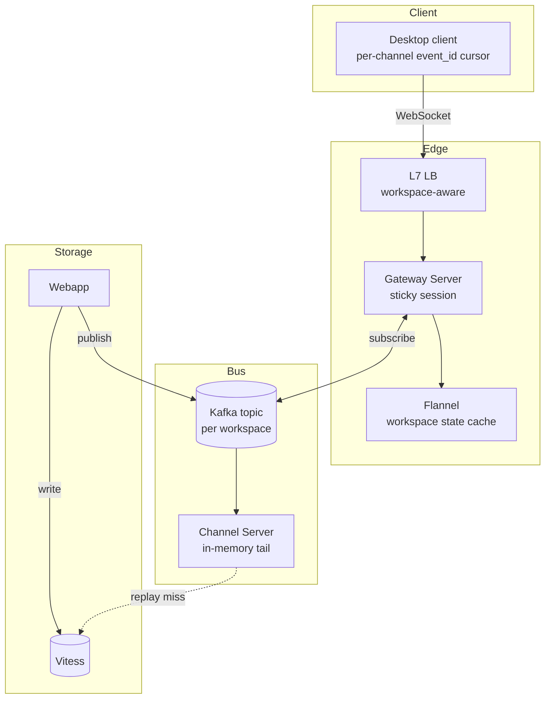

# Slack Deep Dive — Real-Time Event Bus Internals

**Date:** 2026-04-29 | **Updated:** 2026-04-29
**Tags:** `system-design` `case-study` `slack` `deep-dive` `websocket` `event-bus`

## Summary

Slack's "real-time" experience is not a single stream — it is a workspace-scoped event bus pumped through a sticky WebSocket gateway, with a per-workspace edge cache (Flannel) that resolves ACLs and hydrates state without touching the database on every event. The headline trade-offs are: (1) **sticky sessions** trap a user on one gateway pod for the lifetime of a connection, which simplifies fan-out but turns deploys and pod death into reconnect storms; (2) **per-channel total ordering** is the only ordering guarantee — there is no global Slack timeline, deliberately; (3) **Flannel** turns ACL filtering and state hydration into an O(1) cache lookup at the edge, which is the *only* reason a 100K-user workspace can boot the desktop client in seconds without melting Vitess; (4) **replay on reconnect** is cursor-driven (`event_id` per channel), not full-resync, which is what saves the backend during ISP-flap scenarios on mobile. The big lesson from Slack's RTM v2 redesign is that the original "fire all events to all clients" model did not survive workspace growth — modern Slack pushes filtering and subscription decisions to the edge and keeps the database out of the hot path. This doc unpacks each of those layers, the failure modes that shaped them, and the bandwidth optimizations that keep a desktop client from saturating a phone hotspot.

## Table of Contents

- [Summary](#summary)
- [Overview](#overview)
- [WebSocket Gateway](#websocket-gateway)
- [Workspace Event Bus](#workspace-event-bus)
- [Flannel Edge Cache](#flannel-edge-cache)
- [Event Types](#event-types)
- [Subscription Matrix](#subscription-matrix)
- [Replay and Reconciliation](#replay-and-reconciliation)
- [Bandwidth Optimization](#bandwidth-optimization)
- [Ordering Guarantees](#ordering-guarantees)
- [Operational Metrics](#operational-metrics)
- [Failure Modes](#failure-modes)
- [Anti-Patterns](#anti-patterns)
- [Related](#related)
- [References](#references)

## Overview

The parent design doc ([../design-slack.md](../design-slack.md)) frames the real-time event bus as the client-facing protocol that has to survive reconnects, ordering, and replay without hammering the database. This document zooms into the *how*. The actors:

- **Client** (desktop, mobile, web). Holds one WebSocket per workspace it is signed into. Persists the highest `event_id` it has seen per channel.
- **Gateway Server (GS).** Terminates TLS + WebSocket, authenticates, owns the per-socket subscription state, and applies last-mile filtering. Sticky to one workspace's bus partition.
- **Workspace Event Bus.** The fan-out spine — Kafka in production, with Redis Streams or in-memory ring buffers as second-tier caches. Partitioned per workspace, often per channel within hot workspaces.
- **Channel Server (CS).** In-memory tail of recent events per channel; the first replay source on reconnect.
- **Flannel.** Slack's edge cache for workspace metadata (channel list, membership, user directory). Lives in every region, eagerly invalidated on writes.
- **Webapp + Vitess.** The durable write path. Webapp commits the message and publishes to the bus; Vitess is only consulted on cache miss.



The key insight: **the Webapp does not push to clients**. It writes durably, publishes once, and is done. The real-time path is owned by the bus and the Gateway Server, and that decoupling is what lets a single message survive a slow mobile client without slowing the request handler.

## WebSocket Gateway

### Sticky sessions

A Slack client opens **one WebSocket per workspace it is signed into**, not one per channel. The Gateway Server pod that accepts the socket is sticky for the connection lifetime — there is no failover mid-connection because the GS holds the per-socket state (subscription set, send queue, RTT estimates, write watermark).

Stickiness is enforced at the L7 load balancer with a hash on `team_id` (workspace ID), not on `user_id`. Why workspace and not user?

- A workspace's events are partitioned together on the bus. Pinning a user to the same partition's consumer keeps consumption local.
- Two devices for the same user can land on different pods; that's fine, because each socket gets its own cursor and its own subscription matrix.
- It plays well with [cellular architecture](../design-slack.md#cells--regions) — a workspace's cell terminates its own sockets.

### Connection lifecycle

```text
1. Client GET /websocket?team=T012ABCDEF&...   (HTTP/1.1 Upgrade)
2. LB hashes team_id  → routes to GS pod in the workspace's cell.
3. GS validates session token, fetches user identity from auth.
4. GS pulls user → channels mapping from Flannel.
5. GS subscribes the user's send queue to the workspace's Kafka partition(s).
6. GS sends `hello` with workspace fixtures (rate limits, fast_reconnect_url).
7. Client sends `subscriptions_update` with current per-channel cursors.
8. GS replays missed events, then streams live.
```

The handshake is not free. It costs a TLS handshake, an auth lookup, a Flannel hydrate (`channels_for_user`), and a Kafka subscribe. Slack's measured budget is **sub-second p50, ~3s p99** for a cold reconnect on desktop; mobile cold starts are deliberately allowed to be slower because the cost is amortized over a long session.

### Why one WebSocket, not one per channel

A workspace power user can be in 200+ channels. A socket per channel would mean 200+ TLS sessions, 200+ TCP control blocks, 200+ keep-alives. The protocol multiplexes — each event carries `channel_id` and the client demuxes locally. RFC 6455's framing makes this cheap; per-message overhead is on the order of 2–14 bytes plus payload.

### Heartbeats and dead-socket detection

The GS runs an application-layer ping every 10 seconds (configurable). Clients respond with a pong; missing two consecutive pongs trips a `goodbye` and tears down the socket. This is necessary because middleboxes (NATs, corporate proxies) silently drop idle sockets without RST, and TCP keep-alive defaults are far too slow (2 hours on Linux without tuning).

WebSocket itself defines [RFC 6455](https://datatracker.ietf.org/doc/html/rfc6455) ping/pong control frames at the protocol layer. Slack uses application-layer pings on top of these because the RFC pings are not surfaced to client JavaScript in browsers — and the client needs to *see* a missed pong to drive UI state ("connection lost" indicator). The protocol-layer pings are still useful as the defense against intermediate proxy idle-timeouts.

### Per-pod sizing

A typical GS pod targets **50K–200K concurrent sockets** depending on hardware. The bounding factors are not file descriptors (those are cheap) but:

- Per-socket TLS state (~10–40 KB depending on cipher and resumption).
- Per-socket permessage-deflate dictionary (~32 KB by default).
- Per-socket subscription set + send queue (variable; a power user with 200 channels has a larger set).
- Heap pressure from event serialization buffers.

Slack tunes pods conservatively, leaving 30–40% headroom so a neighboring pod's death does not push survivors past their limits during the reconnect spike.

## Workspace Event Bus

### Topic layout

The bus is **partitioned by workspace**, not by user or channel. The default mental model:

```
topic: events.team.production
  partition key: team_id
  partitions: ~2048 (re-partitioned over time)
```

Each Webapp commit publishes to the partition determined by `hash(team_id) % partitions`. A Gateway Server consuming for a workspace subscribes to exactly the partition(s) holding that team's events.

For *elephant workspaces* (millions of messages/day), the workspace is sub-partitioned by `channel_id`. The GS then subscribes to multiple partitions for that single team, or in the most extreme cases the workspace gets its own dedicated topic. This is the same pattern WhatsApp uses for chatty groups; see [../whatsapp/connection-scaling.md](../whatsapp/connection-scaling.md) for the upstream design pressure.

### Why Kafka

- **Durable replay window.** A 24–72 hour retention gives reconnecting clients a long enough tail to recover from regional incidents without falling back to Vitess.
- **Per-partition total order.** Mapping partitions to channels (or workspaces) gives the ordering guarantee Slack's UI assumes.
- **Consumer group rebalancing** lets Slack add or remove GS pods without losing events — at the cost of brief consumption pauses, which Slack accepts.

### Why Redis Streams in the second tier

Kafka is excellent for durability but its per-message latency tail is in the tens of milliseconds and consumer-group rebalances are visible. For the **hottest tail** — events under ~5 minutes old — Slack pushes a Redis Streams mirror in the same cell. The GS consumes the Redis stream first; on miss (or on consumer lag), it falls back to Kafka. Redis Streams gives:

- Sub-millisecond add/read.
- `XREAD BLOCK` for cheap fan-out wakeups.
- Per-stream consumer groups (`XREADGROUP`) for the same load-balancing semantics Kafka provides.

This is the same "hot tier in front of durable tier" pattern the parent doc describes for messaging — see also the [event-driven architecture](../../../communication/event-driven-architecture.md) doc on durable vs ephemeral pub/sub.

### Publish path

```
Webapp
  ├─ INSERT message INTO vitess(channel_shard)
  ├─ XADD redis-stream:T012 * event=...      (cell-local hot tier)
  └─ produce kafka:events.team * event=...   (durable + cross-cell replication)
```

The two writes after the durable INSERT are fire-and-forget with retry. If Kafka is down, Redis Streams keeps the live experience working; if Redis is down, Kafka still feeds live consumers (with worse tail latency). If both are down, the Webapp returns success — the message is durably written — and clients will pick it up on next reconnect via Vitess fallback.

This is **outbox-pattern-ish** but Slack does not run a strict transactional outbox. The acceptance is that on the rare double-failure, a few events arrive only via reconnect replay rather than live push. That's a deliberate availability trade.

## Flannel Edge Cache

### What problem Flannel solves

The first thing a Slack client needs after connecting is **state**: the list of channels it can see, the members of each channel, the user directory, custom emoji, etc. For a 100K-user workspace, naive boot reads:

- channels visible to user: thousands of rows
- members per channel: tens of thousands of rows
- user profiles: 100K rows
- workspace settings, integrations, …

That cannot come from Vitess on every connection. Slack solved this with **Flannel**, an edge-cache service that holds workspace state in memory at every region and resolves boot/hydrate queries in O(channel-count) without going to the database.

Reference: Slack Engineering — [Flannel: An Application-Level Edge Cache to Make Slack Scale](https://slack.engineering/flannel-an-application-level-edge-cache-to-make-slack-scale/).

### Cache shape

```
flannel(per-region):
  by team_id:
    workspace_meta
    users[]                 # profiles, sorted, paginatable
    channels[]              # public + private user can see
    channel_members[]       # per-channel
    user_groups[]
    custom_emoji[]
    last_event_id_per_channel
```

Flannel is *not* a generic cache. It is **the materialized view of the workspace** as the client needs it. Reads are query-shaped (`channels_for_user(user_id)`, `members_of(channel_id, page)`). The Webapp pushes invalidations on every write that touches workspace state — a `member_joined_channel` event invalidates the relevant `channel_members` and `channels_for_user` entries before the event hits the bus.

### Why this matters for the event bus

The Gateway Server uses Flannel for two things on the hot path:

1. **Subscription resolution.** When the client says "subscribe to all my channels," the GS resolves that via `flannel.channels_for_user(user_id, team_id)` — a single in-process call.
2. **ACL filtering at the edge.** Every event arriving on the bus has a `channel_id`. The GS asks Flannel "is this user a member of this channel?" before forwarding. If Flannel says no, the event is dropped silently.

Without Flannel, the GS would hit Vitess for ACL checks and the bus would be I/O-bound on permissions. With Flannel, the check is a memory lookup.

### Cold-start risk

Flannel's value is also its operational risk: a cold Flannel cannot serve a reconnect storm. The [Jan 4, 2021 outage](https://slack.engineering/slacks-incident-on-2-22-22/) was, in part, a cache cold-start: scale-up triggered cache misses that cascaded into provisioning storms on the database. The mitigations:

- Pre-warm Flannel before traffic ramps (e.g., before EU work-day onset).
- Cap reconnect rate at the LB with `429 Too Many Requests` and exponential-jittered backoff hints.
- Decouple Flannel scaling from app scaling so Flannel can grow without waiting on the rest of the fleet.

## Event Types

The taxonomy is deliberately small. Adding event types is a contract decision that touches every client; Slack guards it carefully.

| Type | Carried fields | Bus partition |
|------|----------------|---------------|
| `message`, `message_changed`, `message_deleted` | `team_id`, `channel_id`, `ts` (event_id), `user`, `text`, `blocks`, `thread_ts?` | by channel |
| `reaction_added`, `reaction_removed` | `team_id`, `item.{channel,ts}`, `reaction`, `user` | by channel of `item` |
| `channel_created`, `channel_archived`, `channel_renamed`, `member_joined_channel`, `member_left_channel` | `team_id`, `channel`, `user?` | by workspace |
| `user_change`, `team_join`, `team_pref_change` | `team_id`, `user?`, `pref?` | by workspace |
| `user_typing` | `team_id`, `channel`, `user` | by channel, ephemeral |
| `presence_change` | `team_id`, `user`, `presence` | by workspace, ephemeral |
| `file_shared`, `file_public`, `file_deleted` | `team_id`, `file`, `channels[]` | by workspace |
| `dnd_updated`, `goodbye`, `reconnect_url` | per-socket | n/a |

Two distinctions are load-bearing:

- **Durable vs ephemeral.** `message` is durable on Kafka with full retention. `user_typing` and `presence_change` are *ephemeral*: they live only on Redis Streams, are coalesced aggressively, and are not replayed on reconnect. There is no point telling a client "someone was typing 30 seconds ago."
- **Per-channel vs per-workspace.** Per-channel events are sharded into channel-keyed substreams when the workspace is large enough; per-workspace events stay together. This matches the ordering guarantee (per-channel total order) — see [Ordering Guarantees](#ordering-guarantees).

### `event_id` semantics

For `message` events, the `event_id` is the message `ts` — a microsecond-precision timestamp formatted as `1714380123.123456`. It is **not** clock time; it is allocated by the Webapp at write time with strict monotonicity per channel (collisions resolved by incrementing the microseconds field). For non-message events, the `event_id` is a per-channel sequence allocated when the event is published to the bus.

Clients use `event_id` for two things:

1. **Cursor tracking** for replay (see [Replay and Reconciliation](#replay-and-reconciliation)).
2. **Idempotency** — if a `message` event arrives twice (rare but possible across reconnect boundaries), the client de-duplicates on `(channel_id, ts)`.

## Subscription Matrix

### What the client subscribes to

The desktop client builds a *subscription matrix* on connect and updates it as the user navigates:

```
subscriptions = {
  team_events:     ALL,                          # workspace-wide
  channel_events:  ALL_MEMBER_CHANNELS,          # message, reaction, etc.
  presence:        OPEN_DM_USERS + AT_MENTIONED, # not "everyone in workspace"
  typing:          ACTIVE_VIEW_CHANNEL,          # only the channel currently visible
  threads:         OPEN_THREAD_PARENTS,
}
```

The client sends `subscriptions_update` over the WebSocket whenever it changes (e.g., user switches channels, opens a thread). The Gateway Server keeps a per-socket *subscription set* and uses it as a final filter before serializing each event to the wire.

### ACL filtering at the edge

This is the rule that keeps Slack honest: **never trust the publisher, always re-check on the GS**. Even if the Webapp publishes a `message` to a private channel, the GS asks Flannel `is user X a member of channel C?` before sending. If membership changed *after* the event was published but *before* it reached the GS — for example, the user was just removed from the channel — the GS drops the event.

This double-check is not free, but Flannel makes it cheap: a memory lookup per event. The cost is paid once per event per recipient, not per database row.

### Subscribe-on-demand for noisy events

`presence_change` and `user_typing` would absolutely overwhelm the bus if every client received every event. The mitigations:

- **Presence is subscribe-on-demand.** The client requests presence for specific users it cares about (DM partners, recent collaborators). The GS upgrades subscription per user. Workspaces over a size threshold disable broad presence entirely.
- **Typing is view-scoped.** The client subscribes to typing only for the channel it is currently viewing, and unsubscribes when it switches away. The GS holds these subscriptions in a per-socket set and filters out everything else.

This is also where **debouncing** matters. A flapping ISP can produce hundreds of presence transitions per second. The GS coalesces consecutive transitions for the same user into a single delivery within a 500 ms window — see [Failure Modes — Presence storm](#failure-modes).

## Replay and Reconciliation

### The cursor-driven replay

Each client persists, per channel, the highest `event_id` it has acknowledged. On reconnect, the WebSocket handshake includes a `subscriptions_update` carrying:

```json
{
  "type": "subscriptions_update",
  "cursors": {
    "C012CHAN1": "1714380000.123456",
    "C034CHAN2": "1714379912.000001"
  }
}
```

The GS, for each `(channel, cursor)` tuple, attempts replay from three tiers in order:

1. **Channel Server in-memory tail.** Holds the most recent ~500–2000 events per channel. Covers short disconnects (Wi-Fi flap, client backgrounded for a few minutes). Sub-millisecond.
2. **Redis Streams.** Holds the last few hours. Covers app suspended overnight, devices that fell off the network for a while.
3. **Vitess.** The durable store. Covers anything older. The GS issues `SELECT * FROM messages WHERE channel_id = ? AND ts > ? ORDER BY ts LIMIT 1000`.

If the cursor is older than the oldest available record (very long disconnect), the GS gives up on replay for that channel and emits a `cache_invalid` directive: the client re-fetches the channel via the REST API, which is rate-limited and paginated. **A `cache_invalid` is normal** on long disconnects — the design assumption is that some client will fall too far behind, and that's not the bus's problem.

### Why not full resync?

A naive design replays the world on every reconnect. In a mobile-flap scenario (rapid disconnect/reconnect cycles) this is catastrophic — every flap triggers gigabytes of database reads. The cursor design caps replay cost at *exactly the missing window*, which for short disconnects is zero or near-zero.

This is the same lesson as WhatsApp's offline queues; see [../whatsapp/connection-scaling.md](../whatsapp/connection-scaling.md).

### Reconciliation for non-message state

Channel membership, user profiles, and workspace settings are **state**, not events. The client cannot replay state from the bus (that would be event-sourcing the world). Instead:

- The GS sends a Flannel-derived **delta** at reconnect time: "since your last `team_state_token`, here are the membership changes, profile updates, channel renames."
- The client applies the delta and stores the new `team_state_token`.
- If the token is too old (Flannel's invalidation window has rolled past it), the GS issues `cache_invalid` and the client refetches via REST.

This is the read side of the [Flannel Edge Cache](#flannel-edge-cache): the same cache that filters events also produces the delta payload at reconnect.

## Bandwidth Optimization

A desktop Slack with 200 channels open over a hotspot is a bandwidth-sensitive environment. The optimizations in order of impact:

### permessage-deflate

WebSocket compression per [RFC 7692](https://datatracker.ietf.org/doc/html/rfc7692). Negotiated at handshake; Slack has it on by default with a context takeover that reuses the deflate dictionary across messages. JSON event payloads compress 70–90% — `message` events with repeated keys benefit enormously.

The cost: per-socket compressor state (~32 KB by default for the dictionary, configurable). Across millions of sockets this is real memory; Slack tunes the LZ77 window to balance compression ratio against per-pod memory.

### Delta updates for state-y events

A `user_change` could carry the full profile blob (avatar, status, timezone, fields). It does not. The event payload includes only the fields that changed, plus a version stamp. The client merges; Flannel on the server side applies the same delta to its cache.

This is a nontrivial design choice — it means clients must handle missing fields gracefully and never assume "this event is the full record." The discipline pays off at scale.

### Batching

The Gateway Server flushes its per-socket send queue on a small timer (typically 10–25 ms) rather than per-event. Multiple events accumulated in the window are sent as a single WebSocket frame (server-to-client batching). For chatty channels, this drops syscall and TCP overhead substantially.

The trade-off is added latency. Slack tunes the timer per channel-class — `user_typing` is flushed almost immediately; `message` events tolerate the small delay because human perception threshold is ~100 ms.

### Backpressure

Each socket has a bounded send queue at the GS. If the queue exceeds a high-water mark (slow client, weak Wi-Fi), the GS:

1. Drops `user_typing` and `presence_change` first (ephemeral, no replay loss).
2. Coalesces consecutive `*_changed` events for the same entity.
3. If still over the mark, sends `cache_invalid` and tears down the socket — the client reconnects fresh.

The principle: **better a clean fresh-sync than an ever-growing backlog**. An infinite send queue is a memory leak in disguise.

## Ordering Guarantees

The contract is narrow and chosen carefully:

- **Per-channel total order: GUARANTEED.** Every client sees the same sequence of `message`, `reaction`, `member_joined_channel`, `channel_renamed` events for a given channel, in the same order. This is the only ordering users perceive directly.
- **Across-channel order: BEST-EFFORT.** A `message` in `#deploys` and a `message` in `#random` published one after the other can arrive at the client in either order. Clients must not assume otherwise.
- **Across-workspace order: NO GUARANTEE.** Multi-workspace clients see each workspace independently.
- **Ephemeral events (`user_typing`, `presence_change`): NO ORDER.** Coalescing and debouncing explicitly violate ordering for these.

### How per-channel order is enforced

The Webapp serializes message writes per channel (a per-channel monotonic `ts` allocator, often a per-channel-shard sequence in Vitess plus an in-memory monotonic counter). Kafka's per-partition order is then leveraged by **partitioning bus events by channel** within hot workspaces. The GS consumes a single partition per channel and emits in arrival order; the client trusts the arrival order.

Cross-partition ordering would require global sequencing — a single-writer bottleneck. Slack accepts the loose cross-channel order rather than centralize.

### Why not vector clocks or Lamport timestamps?

For a chat product, a single **per-channel** monotonic timestamp is enough. Vector clocks solve a problem (concurrent writes from multiple replicas) Slack doesn't have — channels are written through a single Webapp shard. The simpler design wins.

## Operational Metrics

The handful of metrics that actually steer operations:

| Metric | Definition | Alert level |
|--------|------------|-------------|
| `gs.connected_sockets` | Active WebSockets per pod | Capacity planning; alert at ~80% of pod limit |
| `gs.connect_p99_ms` | Time from TCP accept to live `hello` | > 5 s sustained → cold cache or auth degraded |
| `gs.event_send_lag_ms` | Time from bus publish to socket flush | p99 > 250 ms → bus or GS saturation |
| `gs.send_queue_depth_p99` | Per-socket queue at p99 | High and rising → slow clients accumulating |
| `gs.dropped_typing_per_sec` | Rate of dropped ephemeral events | Useful debug signal, not alert-driving |
| `bus.partition_lag` | Kafka consumer lag per partition | Sustained > 5000 → partition unavailable or slow consumer |
| `flannel.miss_rate` | Cache miss rate per region | Spike → cold start; pre-warm needed |
| `flannel.invalidation_lag_ms` | Time from Webapp write to Flannel invalidate | p99 > 100 ms → ACL stale, security risk |
| `replay.miss_to_vitess_rate` | Reconnect cursors falling past Redis | High → reconnect storm or undersized retention |
| `client.cache_invalid_rate` | Frequency of forcing client full resync | Spike → backend saturated, dropping slow clients |
| `gs.reconnect_rate` | Reconnects/sec across all pods | Spike → herd in progress |

The reconnect rate and the Vitess fall-through rate are the two early-warning metrics for the failure modes below.

## Failure Modes

### Gateway pod death

**Symptom.** A GS pod crashes (OOM, kernel, deploy). All sockets bound to it disconnect simultaneously — typically 50K–200K depending on pod sizing.

**Blast radius.** Every affected client immediately retries. If retries are not jittered, the LB sees a synchronized spike that hashes onto the workspace's other pods, which queue, which causes more clients to time out and retry. Cascading.

**Mitigations.**

- Client-side retry uses exponential backoff with jitter (RFC-style: `min(cap, base * 2^attempt) * random[0.5, 1.0]`). Without jitter you have not solved this problem; you have only deferred it.
- LB applies token-bucket admission per workspace (e.g., 5K reconnects/sec/workspace). Excess clients receive `429` with a `Retry-After`.
- Pods are sized to absorb reasonable spillover (typical loading 60–70% of max sockets, leaving headroom).
- Session resumption skips the full handshake when the client has a still-valid `fast_reconnect_url` in the previous `hello` payload.

### Partition unavailable

**Symptom.** A Kafka broker fails or a partition leader election stalls. Events for affected workspaces stop flowing on the bus.

**Blast radius.** Clients on those workspaces stop receiving live events but **stay connected** — the GS holds the socket and waits. Webapp writes still durably commit to Vitess; on bus recovery, replay closes the gap. If the partition is down longer than Redis Streams retention, recovery falls through to Vitess.

**Mitigations.**

- Multi-broker replication (Kafka `min.insync.replicas` ≥ 2).
- Per-cell partition isolation — a partition outage in cell A does not affect cell B.
- The Webapp's publish path treats Kafka as best-effort *for the live-push path only*; durability is owned by Vitess. So the worst case is "live push delayed, replay covers it on reconnect."

### Reconnect storm

**Symptom.** A network event (regional ISP issue, AWS partial outage, mass deploy) disconnects millions of clients. They all reconnect in ~30 seconds.

**Blast radius.** This is the worst pattern in the system. It cascades through:

1. LBs saturate on TCP accept rate.
2. GS pods exhaust connect throughput; auth service queues.
3. Flannel sees miss storm if any cache cells were cold; this fans out to Vitess.
4. Bus replay reads spike — clients with stale cursors hit the Redis-to-Vitess fall-through path.

**Mitigations.**

- LB-level admission control with `429` + `Retry-After` headers carrying jittered backoff hints.
- The `hello` payload includes `fast_reconnect_url` and `next_reconnect_after_ms` — clients honor these on subsequent reconnects.
- Pre-warming Flannel before known traffic ramps (workday onset, post-deploy).
- Per-workspace replay rate caps — a single workspace's storm cannot starve other workspaces.
- The "you fell behind" `cache_invalid` directive is a release valve: rather than serve every client a full replay, force the worst-behind clients to refetch via rate-limited REST.

The [Slack Jan 4, 2021 outage post-mortem](https://slack.engineering/slacks-outage-on-january-4th-2021/) is a textbook walkthrough of how this exact pattern played out and what was changed in response. Required reading.

### Flannel staleness

**Symptom.** A user is removed from a private channel, but the GS continues forwarding events to them for some seconds afterward.

**Blast radius.** This is a security-meaningful failure mode, not a performance one. A multi-hundred-millisecond invalidation lag is acceptable; multi-second is a bug.

**Mitigations.**

- Synchronous invalidation: the Webapp's membership write blocks on Flannel ack before responding to the API caller (kept under ~50 ms p99).
- Pessimistic re-check: high-sensitivity events (DM messages, private channel posts) include a `min_acl_version` the GS checks against Flannel before delivery.
- Periodic full-state reconciliation between Vitess and Flannel catches drift.

### Slow client memory bloat

**Symptom.** A handful of clients (slow phones, weak networks) have large GS-side send queues. Over thousands of such clients on one pod, the pod's memory creeps up.

**Mitigations.** Bounded queues with the drop ladder (`typing` → `presence` → coalesce → `cache_invalid` + disconnect). Per-pod memory caps trigger health-check failures and pod recycling before OOM.

### Threaded send path

The GS does not block its event-receive loop on socket writes. Each socket has its own writer that pulls from a per-socket bounded queue. The architecture looks like:

```
[Kafka consumer]  →  [demux by team_id]  →  [per-socket queue]  →  [writer task]  →  socket
                          │
                          └─→ [Flannel ACL filter] (drops events early)
```

This is what allows a slow client to back-pressure *itself* without blocking the consumer or other clients. When a writer cannot keep up, its queue fills, the drop ladder kicks in, and ultimately that socket is closed — but the rest of the pod's sockets are unaffected.

## RTM v2 Redesign

Slack's original public Real-Time Messaging API (`rtm.connect`) is the historical name for this whole system, and its first iteration delivered nearly every workspace event to every connected client of that workspace. That worked when workspaces were small. It melted at scale.

The redesign — sometimes called **RTM v2** internally, exposed externally as the [Events API](https://api.slack.com/apis/events-api) and the modern WebSocket flow used by Slack itself — pushed three changes:

1. **Edge-side filtering.** The Gateway Server uses Flannel to filter events per recipient. The bus stops being a "send everything to everyone" firehose.
2. **Subscribe-on-demand for ephemeral events.** Presence and typing are no longer broadcast wholesale; clients request what they need.
3. **Cursor-driven replay.** Reconnect no longer means "resync everything"; it means "give me what's newer than `event_id` X per channel."

For third-party apps, the Events API replaces the old fire-hose RTM with HTTP webhooks subscribed to specific event types — same shift, different transport. The API docs explicitly recommend Events API over RTM for new apps; RTM-style WebSockets remain for the Slack client itself.

## Anti-Patterns

- **One WebSocket per channel.** Burns TLS sessions and TCP control blocks for no benefit. Multiplex on one socket.
- **Server-pushed full state on every reconnect.** Without cursors you have no defense against reconnect storms. Cursor or die.
- **ACL check on the publisher only.** Membership can change between publish and deliver. Re-check at the edge against Flannel.
- **Global event ordering.** Forces a single-writer bottleneck. Slack survives at scale precisely because it does not promise this.
- **Treating `presence_change` and `user_typing` like `message`.** They are ephemeral, debounced, droppable. Routing them through Kafka with full retention wastes brokers.
- **Sticky sessions with no draining.** Deploys without graceful drain (slow rolling reconnect window, traffic shifting at the LB) cause synchronized reconnect spikes.
- **No `Retry-After` on `429`.** Without server-suggested backoff, clients all retry on the same schedule and synchronize. Always include jittered hints.
- **Joining `channel_membership` on the event hot path.** That's exactly what Flannel exists to avoid. If you are tempted to JOIN, you have lost.
- **Storing presence in a single global service.** It must shard by workspace. A central presence service is one workspace's bad day away from a global outage.
- **Pushing to client sockets from the Webapp request handler.** Couples message latency to the slowest mobile client. Always go through the bus.
- **No replay budget.** "Just fetch from Vitess" works at small scale. At large scale you need Redis Streams (or equivalent) as the second tier; otherwise reconnect storms saturate the database.

## Related

- [../design-slack.md](../design-slack.md) — parent design doc; section 8 is the source for this deep-dive.
- [../whatsapp/connection-scaling.md](../whatsapp/connection-scaling.md) — sister deep-dive on persistent-connection edge gateways and reconnect storm handling.
- [../../../communication/event-driven-architecture.md](../../../communication/event-driven-architecture.md) — pub/sub mechanics, durable vs ephemeral, choreography vs orchestration.
- [../../../communication/real-time-channels.md](../../../communication/real-time-channels.md) — long-poll vs WebSocket vs SSE, ordering, replay primitives.

## References

1. Slack Engineering — [Flannel: An Application-Level Edge Cache to Make Slack Scale](https://slack.engineering/flannel-an-application-level-edge-cache-to-make-slack-scale/) — canonical reference for the workspace edge cache.
2. Slack Engineering — [Slack's Outage on January 4th, 2021](https://slack.engineering/slacks-outage-on-january-4th-2021/) — reconnect-storm + cache-cold-start postmortem.
3. Slack Engineering — [The Query Strikes Again](https://slack.engineering/the-query-strikes-again/) — scatter-query failure mode and its fix.
4. Slack API — [Events API](https://api.slack.com/apis/events-api) — modern event-subscription model that replaces the original RTM fire-hose for third-party apps.
5. Slack API — [Real Time Messaging API](https://api.slack.com/rtm) — the historical RTM protocol; included for context on the v2 redesign.
6. IETF — [RFC 6455: The WebSocket Protocol](https://datatracker.ietf.org/doc/html/rfc6455) — framing, control frames, close handshake.
7. IETF — [RFC 7692: Compression Extensions for WebSocket (permessage-deflate)](https://datatracker.ietf.org/doc/html/rfc7692) — the per-message deflate negotiation Slack uses for bandwidth.
8. Apache Kafka — [Documentation](https://kafka.apache.org/documentation/) — partitioning, consumer groups, retention, in-sync replica semantics.
9. Apache Kafka — [Producer configuration reference](https://kafka.apache.org/documentation/#producerconfigs) — `acks`, `min.insync.replicas`, idempotence settings used in durable publish.
10. Redis — [Streams introduction](https://redis.io/docs/latest/develop/data-types/streams/) and [Streams commands](https://redis.io/docs/latest/commands/?group=stream) — `XADD`, `XREAD`, consumer groups for the hot tier.
11. Confluent — [Kafka design rationale](https://docs.confluent.io/kafka/design/index.html) — log structure, partition leadership, replication.
12. Martin Kleppmann — [Designing Data-Intensive Applications](https://dataintensive.net/) — chapters on stream processing, exactly-once semantics, and replication.
