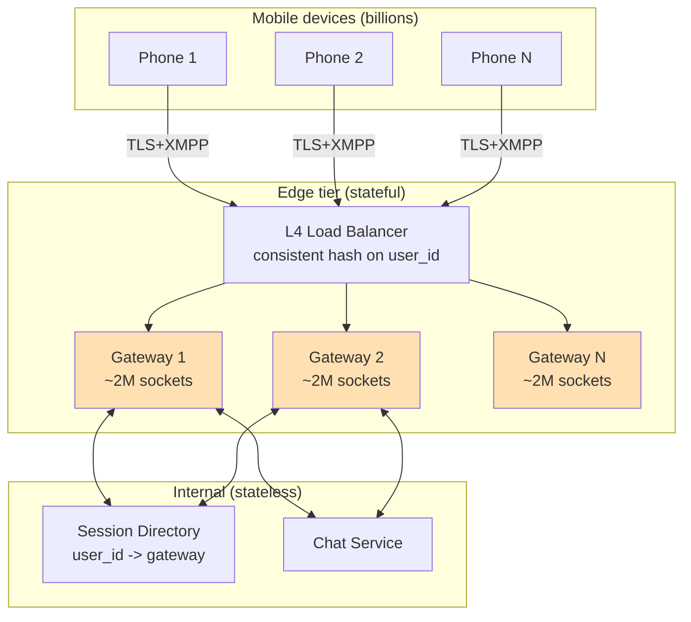

# WhatsApp Deep Dive — Connection Scaling

**Date:** 2026-04-27 | **Updated:** 2026-04-27
**Tags:** `system-design` `case-study` `whatsapp` `deep-dive` `websocket` `persistent-connections`

## Summary

The hardest tier in WhatsApp is the edge gateway — the box that holds a TLS-wrapped TCP socket open for hundreds of millions of phones, indefinitely. Everything else (chat service, fanout, storage) is stateless or horizontally trivial. The gateway is **stateful by definition**: a process must remember "this socket = this user, this device, this last-acked offset" for the entire conversation lifetime. WhatsApp famously crossed **2 million concurrent connections per FreeBSD host on Erlang** in 2012, and the design moves they used — lightweight processes per connection, custom binary XMPP, kernel tuning, sticky L4 load balancing — are still the playbook for any team operating a real persistent-connection fleet at scale. This doc unpacks why persistent connections are non-negotiable for chat, why WebSocket is _not_ what WhatsApp actually shipped, what the per-connection memory budget really looks like, how reconnect storms melt clusters, and the mobile-specific traps (NAT timeouts, IP migration, radio sleep) that don't show up in single-DC web demos.

## Table of Contents

- [Summary](#summary)
- [Overview](#overview)
- [Why Persistent Connections](#why-persistent-connections)
- [WebSocket vs Custom TCP](#websocket-vs-custom-tcp)
- [Erlang/BEAM and the C2M Problem](#erlangbeam-and-the-c2m-problem)
- [State Per Connection](#state-per-connection)
- [Load Balancing Persistent Connections](#load-balancing-persistent-connections)
- [User Sharding](#user-sharding)
- [Reconnect Storm](#reconnect-storm)
- [TLS Handshake Cost](#tls-handshake-cost)
- [Mobile-Specific Challenges](#mobile-specific-challenges)
- [Power Save](#power-save)
- [Connection Migration](#connection-migration)
- [Observability](#observability)
- [Anti-Patterns](#anti-patterns)
- [Related](#related)
- [References](#references)

## Overview

The WhatsApp edge gateway has one job: accept a long-lived encrypted socket from each device, terminate the framing protocol, authenticate the device, and pump messages between that socket and the internal chat service. It does not store messages, does not run business logic, does not encrypt content (clients do that). It is essentially a **socket multiplexer with auth and routing**.

Why is this so hard?

- One TCP socket per active device, held for **hours to days**.
- 2B+ users, with peaks where hundreds of millions are concurrently connected.
- File descriptors, kernel buffers, TLS session state, and per-user routing state all multiply by concurrent connections.
- Mobile devices migrate IPs, sleep their radios, and hit NAT timeouts every few minutes.
- A single DC failover can trigger **millions of reconnects in seconds** — the so-called **thundering herd at the edge**.

The headline number from the 2012 WhatsApp Engineering post — **2M concurrent connections on a single FreeBSD + Erlang host** — wasn't a stunt. It was the result of a deliberate stack: BEAM's lightweight processes, a custom binary protocol, kernel tuning, and a refusal to use heavyweight per-connection frameworks. That post is still the canonical reference for "what's actually possible per box" when you stop wasting memory and CPU.



## Why Persistent Connections

Why not just poll, or use webhooks, or run HTTP/2 server push? Because chat has three properties that all push the same direction:

**1. Push semantics.** The server must wake the client when a peer sends a message. Polling adds latency proportional to the polling interval (1s polling = 1s worst-case latency, plus N requests/second from every idle device on Earth). On 2B users, even a 60-second poll is ~33M req/s of pure overhead before any message exists.

**2. Bidirectional and low-latency.** A user typing in a group chat needs a sub-300ms round-trip for "Alice is typing…" indicators and read receipts. Long polling pays one full TCP+TLS reconnect per event in the worst case. WebSocket and raw TCP keep the round-trip at one-way RTT.

**3. Asymmetric traffic.** Most of the time the connection is idle. A device sends a message every few seconds when active, and zero for hours when sleeping. But **the server must be able to push at any instant**. Only a held-open connection gives you that without polling overhead.

The alternative — a fanout system that pushes via APNs/FCM only — is what WhatsApp falls back to when the client _isn't_ connected (see `../offline-delivery-and-push.md`). But APNs/FCM has multi-second delivery latency, opaque delivery guarantees, platform throttling, and no support for typing indicators or read receipts. Persistent connections are the foreground path; push is the wakeup-from-background path.

For a broader treatment of the channel-selection space, see `../../../communication/real-time-channels.md`.

## WebSocket vs Custom TCP

A common misconception: "WhatsApp uses WebSockets." It does not, at least not as the primary protocol. WhatsApp uses a **custom binary protocol derived from XMPP** (Extensible Messaging and Presence Protocol, RFC 6121), running over a raw TLS-wrapped TCP socket on a non-standard port (historically 5222/5223, the XMPP defaults). Web clients use WebSocket as a transport because browsers can't open arbitrary TCP, but the **payloads** are the same XMPP-derived binary frames either way.

Why not WebSocket-as-protocol everywhere?

| Concern | Custom binary XMPP | WebSocket framing |
|---|---|---|
| Frame overhead | 1–4 bytes header | 2–14 bytes per frame |
| Handshake | TCP+TLS only | TCP+TLS + HTTP Upgrade round-trip |
| Cellular friendliness | Tight binary, compressible | Heavier headers, mask bytes wasted on server-bound traffic |
| Multiplexing | Stream IDs in app protocol | One logical channel per socket (or use subprotocols) |
| Middlebox traversal | Sometimes blocked on weird ports | Excellent — looks like HTTP |

WhatsApp's mobile app ships with a static configuration of edge endpoints and falls back to ports 80/443 if 5222 is blocked, so middlebox traversal is solved without paying WebSocket framing tax on every message. Each saved byte matters when you multiply by 100B messages a day on metered cellular networks. The custom protocol is also **streaming-aware**: a single TCP connection multiplexes presence, typing, message, receipt, and control frames using XMPP stanza types, all without the per-frame header bloat.

That said, **for new systems in 2026, WebSocket is usually the right default.** You get browser support for free, libraries handle reconnect and heartbeat, and the framing overhead is dwarfed by TLS overhead for most apps. Don't invent a custom binary protocol unless you've actually measured that framing is the bottleneck. WhatsApp invented theirs in an era (2009–2012) when XMPP was the obvious starting point and binary serialization libraries (protobuf, FlatBuffers) weren't yet ubiquitous.

For the wire-level mechanics of WebSocket itself, see `../../../../networking/application-layer/websocket-and-sse.md`.

## Erlang/BEAM and the C2M Problem

The **C10K problem** (Dan Kegel, 1999) was: how do you handle 10,000 concurrent connections on one box? By 2012 the answer was solved (epoll/kqueue, async I/O). WhatsApp pushed the question to **C2M — two million concurrent connections per host** — and made it routine.

The stack that got them there:

- **FreeBSD 9.x** for tunable kernel networking (jails, kqueue, sysctl knobs for buffer sizes).
- **Erlang/OTP** running on the BEAM virtual machine.
- **Custom epoll-equivalent integration** using BEAM's native `gen_tcp` + asynchronous send queues.
- **One Erlang process per TCP connection.** Each process is ~2 KB of state at idle (vs ~8 KB minimum for a kernel thread on Linux).
- **Supervised crash isolation:** if one connection's process crashes, the supervisor restarts only that process; the other 1.99M sockets are unaffected.

Why BEAM specifically?

1. **Lightweight processes.** BEAM processes are not OS threads. They're cooperatively scheduled green threads with their own heap. You can spawn millions of them on one box. Each idle socket holds one process; a 2M-socket host has 2M processes.

2. **Selective receive and per-process mailboxes.** Each connection's process owns a mailbox. The chat service routes a `DELIVER` envelope to `pid_for(user_id)`, and BEAM hands it to that process which then writes to the socket. No shared queues, no locks.

3. **Hot code reload.** Deploying a new gateway version doesn't require draining sockets — BEAM can swap module code in place. This is the deepest reason WhatsApp could deploy frequently without forcing a global reconnect.

4. **Schedulers per core.** BEAM runs one scheduler thread per CPU core, each running a run-queue of green processes. epoll-style I/O multiplexing is hidden in the runtime. You don't write `select()` loops.

5. **Garbage collection per process.** Each green process has its own tiny heap. GC pauses are bounded to a single process's heap (kilobytes), not the whole VM. There's no "stop the world" for 2M sockets.

The 2012 WhatsApp post ("1 million is so 2011") explicitly discusses the patches they upstreamed to BEAM and FreeBSD to push past the next bottleneck — typically file descriptors, ephemeral ports, mbuf clusters, or BEAM scheduler contention.

For new systems in 2026 you can get similar concurrency from **Go** (goroutines), **Rust + Tokio**, or **Java + virtual threads (Project Loom)**. The numbers won't quite match BEAM's per-process memory floor, but they're within 2–3x for most workloads and the engineering ecosystem is deeper.

## State Per Connection

What does the server actually remember per connected device?

```text
ConnectionState {
    user_id          : 8 bytes
    device_id        : 8 bytes
    socket_fd        : 4 bytes (kernel)
    tls_session      : ~4 KB (cipher state, keys, session cache entry)
    tcp_buffers      : ~16 KB rcvbuf + ~16 KB sndbuf (kernel, tuned)
    auth_token_hash  : 32 bytes
    last_seen_ts     : 8 bytes
    last_heartbeat   : 8 bytes
    pending_msgs     : count + small queue (bounded ~100)
    inflight_acks    : map[seq -> ts], bounded
    flow_control     : send-window, recv-window
    process_overhead : ~2 KB (BEAM process struct)
}
Total: ~40 KB user-space + ~32 KB kernel buffers ≈ 72 KB / connection
```

At 2M connections: **~144 GB RAM** just for connection state. WhatsApp ran 96–128 GB hosts and spent significant effort minimizing this. A few key tricks:

- **Tunable TCP buffers per socket.** Default Linux `net.core.rmem_default` of 256 KB × 2M sockets = 512 GB. They tuned to ~16 KB and let the autoresizer grow under load.
- **TLS session cache externalized** so per-connection TLS state is just the live cipher context, not a full session record.
- **No per-connection logger or metrics object.** Aggregate counters at the gateway level; per-connection state gets only the bytes you'd lose sleep over without.
- **Pending message queue bounded.** Server doesn't hold unlimited undelivered messages in the gateway — it holds a small live buffer; long-term undelivered messages live in the chat service's persistent inbox.

**Heartbeat protocol.** App-layer heartbeat every ~30s (or longer in power-save). The gateway tracks `last_heartbeat`; if it misses two intervals, the connection is considered dead and reaped:

```text
# Heartbeat protocol (pseudocode, both directions)
loop:
    if now - last_send > HEARTBEAT_INTERVAL:
        send PING(seq)
        expect PONG(seq) within HEARTBEAT_TIMEOUT
        if PONG missed twice:
            close socket as half-open
            release ConnectionState
            notify session-directory: user_id offline

# Inbound:
on PING(seq):
    send PONG(seq)
    update last_seen_ts
on PONG(seq):
    cancel pending heartbeat-timeout for seq
```

Heartbeats serve three purposes: **(1)** keep NAT bindings alive (cellular NAT typically expires idle UDP/TCP after 30–300s), **(2)** detect half-open sockets (peer crashed, network partitioned), and **(3)** update last-seen for the presence service.

For the broader presence design (which sits next to connection scaling and consumes last-seen events), see `./presence-service.md` _(if present)_.

## Load Balancing Persistent Connections

A persistent-connection LB has fundamentally different needs from a stateless HTTP LB:

| Concern | Stateless HTTP LB | Persistent connection LB |
|---|---|---|
| Connection lifetime | ms to seconds | hours to days |
| Affinity | none needed | sticky to gateway preferred |
| Drain semantics | drop in-flight requests is OK | must signal clients to reconnect |
| Health checks | per-request | TCP connect + app-layer ping |
| Traffic shape | many short connections | few very long connections |

WhatsApp uses **L4 (TCP-level) load balancing**, not L7 (HTTP). At L4 the LB just terminates TCP, picks a backend by hashing the client's `(src_ip, src_port)` or a session token, and forwards the byte stream. It doesn't parse HTTP, doesn't terminate TLS (that happens on the gateway). This matters because:

- TLS termination at the gateway means the gateway sees the cleartext XMPP frames it needs to authenticate and route.
- Hashing on client IP+port means the same client lands on the same gateway across reconnects (if the IP didn't change).
- L4 is **dramatically cheaper** than L7 — no HTTP parser, no header manipulation. Modern L4 LBs (LVS, Cloudflare's Spectrum, AWS NLB) can push hundreds of Gbps per node.

**Sticky routing via consistent hashing.** When a gateway is added or removed, you don't want to remap every connection. Consistent hashing on `user_id` (or session token) means **only ~1/N of connections move** when one of N gateways changes. Implementations: Maglev (Google), Rendezvous hashing, or HRW.

**Connection draining on deploy.** When you deploy a new gateway version, you can't just SIGKILL the old process — you'd disconnect 2M users at once who'd all reconnect to the same other gateways and either melt them or trigger a reconnect storm.

Drain protocol:

```text
1. Mark gateway as DRAINING in service discovery.
2. LB stops sending new connections.
3. Gateway sends `RECONNECT(reason=deploy, backoff=jittered)` to each connected client over the existing socket. The client closes gracefully and reconnects after a randomized delay.
4. Wait for connection count to fall below threshold (e.g., 1000) or 10 minutes.
5. Force-close any laggards.
6. Restart with new code.
7. LB starts sending new connections again.
```

The randomized backoff is critical. Without it, all 2M clients reconnect within a 1-second window — see [Reconnect Storm](#reconnect-storm).

**nginx as a sticky LB (illustrative).** WhatsApp doesn't use nginx in this role, but for systems that do, here's the pattern:

```nginx
# /etc/nginx/nginx.conf — WebSocket sticky LB example
upstream chat_gateways {
    # ip_hash gives session affinity by client IP.
    # Use consistent hash on a header for explicit user-based stickiness:
    hash $http_x_user_id consistent;

    server gw1.internal:8443 max_fails=3 fail_timeout=10s;
    server gw2.internal:8443 max_fails=3 fail_timeout=10s;
    server gw3.internal:8443 max_fails=3 fail_timeout=10s;

    keepalive 32;
}

server {
    listen 443 ssl http2;

    # Long-lived connection support
    proxy_read_timeout 3600s;
    proxy_send_timeout 3600s;

    location /ws {
        proxy_pass http://chat_gateways;
        proxy_http_version 1.1;
        proxy_set_header Upgrade $http_upgrade;
        proxy_set_header Connection "upgrade";
        proxy_set_header Host $host;
        proxy_set_header X-Real-IP $remote_addr;

        # Disable buffering — important for streaming
        proxy_buffering off;
    }
}
```

Note the `proxy_read_timeout 3600s` — defaults of 60s will silently kill idle WS connections. Most production WebSocket outages "we deployed nginx and now everyone disconnects every minute" trace back to this single line.

For a wider treatment of LB strategies, see `../../../building-blocks/load-balancers.md`.

## User Sharding

Two routing problems live side by side:

**1. Client → gateway.** Done by the L4 LB via consistent hash on user_id. Goal: same user lands on same gateway across reconnects when possible.

**2. Internal service → user's gateway.** When the chat service receives a `DELIVER` for `user_id=X`, it needs to know which gateway X is currently connected to. This is the **session directory** — a distributed registry of `user_id -> gateway_id`.

Implementation choices:

- **Redis cluster** keyed by `user_id`, value is `gateway_id` + `device_id` + `connection_token`. TTL'd (~5 minutes) so dead entries self-clean. Updated on connect/disconnect.
- **Custom in-memory directory** with gossip-based replication. Lower latency than Redis but more operational complexity.
- **No directory at all** — broadcast `DELIVER` to all gateways and let the one with the matching socket handle it. Wasteful at scale; doesn't work past a few dozen gateways.

WhatsApp uses a custom session directory; details aren't fully public but the shape is "consistent-hashed Mnesia-like store" given the Erlang heritage.

**Failure modes:**

- **Stale entry.** Gateway crashed but directory still says `user_id=X is on gateway 17`. The chat service routes there, gets a connection-not-found error, falls back to push (APNs/FCM) and removes the entry. TTLs make this self-healing within minutes.
- **Race on reconnect.** User reconnects to a different gateway before the directory entry from the old gateway expires. Solution: gateway-2 writes "now I have user X" with a higher generation number than gateway-1's entry. Latest-write-wins on `(user_id, generation)`.

## Reconnect Storm

The most dangerous failure mode for a persistent-connection fleet.

**Trigger:** A datacenter or AZ goes offline. Or a bad deploy crashes a gateway pool. Or a network partition drops a million socket ends.

**What happens without mitigation:** All affected clients detect socket close (or heartbeat timeout) within ~30 seconds. They all retry immediately. The remaining gateways receive ~1M connection attempts in ~5 seconds. TLS handshakes alone (each ~10-50 ms of CPU) saturate the entire pool. New legitimate connections time out, triggering the same logic on more clients. Cascade.

**The math:** If you lose a datacenter holding 1M sockets and your remaining 5 datacenters can each accept 200K connections per second of new connection capacity (a generous assumption), the total absorb rate is 1M/sec — meaning the storm clears in ~1 second only if perfectly distributed. In reality TLS handshake CPU is the bottleneck and the cliff is closer to 50K/sec/DC, meaning a 4-second outage spawns a 20-second recovery storm.

**Mitigations:**

1. **Jittered exponential backoff on the client.** First reconnect after `random(0, 1s)`, then `random(0, 2s)`, then `random(0, 4s)`, capped at `random(0, 60s)`. The randomization is **the** key — without jitter, exponential backoff alone synchronizes to wall-clock seconds and stays bursty.

2. **Server-issued reconnect tokens with delay.** When a gateway is draining, it sends `RECONNECT(after=<jittered delay 0-300s>)`. Clients honor the delay, spreading reconnects over 5 minutes.

3. **LB-level connection rate limiting.** Cap new TLS handshakes per second per gateway. Excess clients get TCP RST and retry.

4. **TLS session resumption** (see next section) — drops handshake CPU 10x, makes the storm cheaper.

5. **Pre-warming.** When you bring up a new gateway pool, slowly ramp accept rate over minutes rather than opening to full capacity instantly.

```go
// Jittered exponential backoff (Go) — illustrative client logic
package main

import (
    "math/rand"
    "time"
)

const (
    baseDelay = 500 * time.Millisecond
    maxDelay  = 60 * time.Second
)

// nextBackoff returns a randomized delay for reconnect attempt n (0-indexed).
// Uses "Decorrelated Jitter" from AWS Architecture Blog — better than pure
// exponential because it avoids synchronized retries across clients.
func nextBackoff(prev time.Duration) time.Duration {
    if prev < baseDelay {
        prev = baseDelay
    }
    // delay = random(baseDelay, prev * 3), capped at maxDelay
    upper := prev * 3
    if upper > maxDelay {
        upper = maxDelay
    }
    delta := upper - baseDelay
    if delta <= 0 {
        return baseDelay
    }
    return baseDelay + time.Duration(rand.Int63n(int64(delta)))
}

func reconnectLoop(connect func() error) {
    var delay time.Duration
    for {
        if err := connect(); err == nil {
            delay = 0 // reset on success
            // ... block on connection; when it dies, we fall through
            continue
        }
        delay = nextBackoff(delay)
        time.Sleep(delay)
    }
}
```

Decorrelated jitter is what AWS recommends for client retries. It outperforms naive `delay = base * 2^n` plus a small random because it explicitly de-syncs clients that were perfectly synchronized by the same trigger event.

## TLS Handshake Cost

A full TLS 1.2 handshake costs **2 round-trips and ~10-50 ms of server CPU** (RSA or ECDHE math). At 50K new connections/sec, that's enough CPU to saturate dozens of cores doing nothing but key exchange.

**TLS 1.3 changes the picture:**

- **1-RTT handshake by default** — half the round-trips of TLS 1.2.
- **0-RTT mode (early data)** — client can send the first application data alongside the ClientHello when resuming a session. This is critical for mobile reconnect: a client that reconnected 5 minutes ago can re-establish the session and send its first heartbeat in the same flight.

```text
# TLS 1.3 0-RTT handshake (illustrative)
Client                                   Server
  |                                        |
  | ClientHello                            |
  | + key_share (ephemeral DH pub)         |
  | + pre_shared_key (PSK from earlier)    |
  | + early_data ext                       |
  | + early_data: "PING seq=1"             |  <-- 0-RTT data
  |--------------------------------------->|
  |                                        |
  |        ServerHello + key_share         |
  |        EncryptedExtensions             |
  |        Finished                        |
  |        application_data: "PONG seq=1"  |
  |<---------------------------------------|
  |                                        |
  | Finished                               |
  | application_data...                    |
  |--------------------------------------->|

Total: 1-RTT for new sessions, 0-RTT (immediate write) for resumed sessions.
```

**0-RTT caveats:**

- Data is **replayable** (an attacker who captured the early_data can replay it). Only safe for idempotent operations. For chat: a heartbeat or read-receipt is fine; a "send message" should not go in 0-RTT data because a replay would duplicate the send.
- Forward secrecy is reduced for 0-RTT data if the PSK is later compromised.

WhatsApp's mobile clients pin the certificate (no need to traverse the public CA chain on every reconnect) and use TLS 1.3 with session resumption. A reconnect after a brief network blip is essentially free server-side: the PSK lookup is a hash table hit, the early_data is an AEAD decrypt of one heartbeat frame.

**Certificate caching.** Mobile devices cache the server certificate chain across reconnects. There's no OCSP round-trip on the hot path. Cert rotation is handled with a background fetch.

**Session ticket vs PSK.** TLS 1.3 supports both stateless (NewSessionTicket) and stateful (server-cached PSK) resumption. Stateless lets the gateway forget about disconnected clients; the resumption secret is encrypted in a ticket the client carries. Stateful caches the secret server-side, smaller wire footprint but requires a shared cache across gateways for resumption to work after a reconnect to a different gateway. WhatsApp uses tickets (stateless) so resumption survives gateway changes.

## Mobile-Specific Challenges

A persistent connection from a phone is not the same beast as one from a laptop on Ethernet. Mobile-specific failure modes that don't show up in single-DC testing:

**1. IP address changes.** A phone moves from WiFi to cellular, or hands off between cell towers, or roams between carriers. Its public IP changes. The TCP connection is dead instantly — the kernel has no idea, and you only find out when the next packet times out.

Mitigation:

- Detect IP change at the OS level (iOS `NWPathMonitor`, Android `ConnectivityManager`) and proactively close + reconnect rather than wait for TCP timeout.
- Aggressive heartbeat (30-60s) so half-open detection is fast.
- **QUIC** solves this natively with **connection migration** — see [Connection Migration](#connection-migration).

**2. NAT timeouts.** Carrier-grade NAT (CGN) at the cellular ISP maps your private IP to a shared public IP. The mapping has a timeout — typically 60s for UDP, 5-30 minutes for TCP. If you're idle longer than that, your translation entry expires and your "live" socket is dead.

Mitigation: heartbeat **shorter than the NAT timeout**. WhatsApp's 30-60s heartbeat is calibrated for the most aggressive cellular NATs. Some carriers have been observed to expire idle TCP NAT entries in ~90 seconds, so 30-60s gives 2x headroom.

**3. Radio sleep / RRC state machine.** Cellular radios have a state machine: `IDLE → CELL_PCH → CELL_FACH → CELL_DCH`. Going from idle to active takes ~2 seconds and burns battery. Sending a heartbeat every 30 seconds keeps the radio active, drains battery, and shows up in app store reviews as "this app uses too much battery."

Mitigation: see [Power Save](#power-save).

**4. Lossy networks.** Cellular packet loss is highly bursty (you go under a bridge, packet loss spikes to 50%). Short TCP retransmit timeouts cause connection resets. Application-layer ack/retry is needed regardless of TCP — chat protocols always have their own message ack.

**5. Background restrictions.** iOS aggressively suspends background apps. Android Doze mode does the same. Your "persistent connection" can't actually persist while the app is backgrounded — the OS will kill the socket. WhatsApp's solution: when foreground, hold the connection; when background, hand off to APNs/FCM for wakeup notifications, and reconnect on app foreground.

This is why `../offline-delivery-and-push.md` matters so much — push isn't just a fallback for offline users, it's the primary delivery channel for backgrounded users on iOS/Android, which is most users most of the time.

## Power Save

The tension: heartbeats keep NAT bindings alive but burn battery. How do you minimize battery cost without losing the connection?

**Strategies:**

1. **Long heartbeat intervals when foregrounded but idle.** Stretch from 30s to 240s when the user hasn't typed in 5 minutes and there are no incoming messages.

2. **Heartbeat backoff with NAT probing.** Start at 30s. If two consecutive long-interval heartbeats succeed (e.g., 240s), the carrier's NAT timeout is at least 240s for this connection — keep using the long interval. If a long heartbeat times out, drop back to 30s and rebuild.

3. **Coalesce with system events.** Instead of waking the radio just for a heartbeat, piggyback on any other network activity the OS is doing (sync, location update). Sometimes this is automatic if the radio is already in `CELL_DCH`.

4. **Background = no persistent connection.** When the app is backgrounded, close the socket entirely and rely on APNs/FCM. Reconnect on foreground. This is dramatically more battery-efficient than holding a socket through Doze mode (which doesn't actually work anyway).

5. **Doze-aware scheduling on Android.** Use `JobScheduler` / `WorkManager` with `setRequiredNetworkType` and let the OS batch your reconnects with other apps' wakeups. You give up some latency control in exchange for not being on the "battery hog" list.

Battery is also a **trust signal** — if your app hits the iOS "Battery Usage" top 10, users uninstall. WhatsApp's reputation for being light on battery is a deliberate engineering investment, not an accident.

## Connection Migration

The gateway version is being deployed. Or the gateway pod is being rescheduled by Kubernetes. Or the user's IP changed. In all three cases, the existing TCP connection is dead. Reconnecting from scratch costs:

- TCP handshake (1 RTT)
- TLS handshake (1 RTT for resumed sessions, 2 RTT for new)
- App auth (1 RTT)
- Inbox catch-up (variable)

Total: 3–4 RTT plus whatever inbox sync takes. On a 200ms cellular RTT, that's 600-800ms of "no messages flowing."

**QUIC connection migration** (RFC 9000) eliminates the first three. QUIC packets carry a **connection ID** that's independent of the IP/port 4-tuple. When a client's IP changes:

1. Client sends a packet with the new source IP but the same connection ID.
2. Server validates the new path (sends a `PATH_CHALLENGE`, expects `PATH_RESPONSE`) to defeat reflection attacks.
3. Once validated, the connection continues on the new path.
4. **Zero application-layer disruption.** No re-handshake, no re-auth, no inbox sync.

This is huge for mobile. WiFi-to-cellular handoff that previously caused a 1-second message gap is now seamless. WhatsApp announced QUIC adoption for some platforms in 2023+; the case study should treat QUIC connection migration as the future, with TLS 1.3 + 0-RTT as the present.

**Server-side connection migration** (between gateway pods on deploy) is harder. The connection state lives in the old gateway's process memory. Two approaches:

- **Hand off the socket file descriptor** to a new process via `SCM_RIGHTS` or systemd socket activation. Works for in-place upgrades but not cross-host migration.
- **External state.** Persist the per-connection state to Redis or a similar store, then resurrect on a new pod with `state = redis.get(connection_id)`. Adds latency and complexity; rarely worth it. Most teams just accept reconnect during deploys and lean on jitter + draining to spread the cost.

WhatsApp's BEAM hot-code-reload handles the in-place upgrade case at the language level — module code swaps without disturbing per-process state — which is one of the deepest reasons they could deploy frequently without rolling sockets.

## Observability

What you measure on a long-lived-connection fleet is different from what you measure on stateless HTTP:

| Metric | Why it matters |
|---|---|
| **Concurrent connections per gateway** | Capacity planning. Watch for asymmetric load (consistent hashing dirty?). |
| **Connection age distribution (p50, p99)** | Healthy: hours. Unhealthy: short and uniform = something is forcibly closing connections. |
| **Connect rate / disconnect rate** | Flat is good. Spikes mean a bad deploy, network event, or storm. |
| **Reconnect rate per device** | Per-device reconnects > 5/hour is a battery and quality issue — investigate carrier or app bug. |
| **Idle vs active sockets** | Actively sending/receiving in last 60s vs holding-only. Power-save tuning input. |
| **Heartbeat miss rate** | Half-open detection. Should be <0.1%. |
| **TLS handshake CPU per second** | Capacity ceiling. If this is your bottleneck, look at session resumption hit rate. |
| **TLS resumption hit rate** | Should be >90% in steady state. <50% means session tickets aren't being honored or the cache is too small. |
| **0-RTT data rate** | Shows TLS 1.3 early-data uptake. Higher = lower reconnect latency. |
| **Send queue depth per connection** | Slow consumer detection. If a single connection's queue passes 1MB, kill it — it's a half-open or a malicious client. |
| **Protocol parse errors** | Spikes indicate a bad client release or an attack. Track per app version. |
| **NAT traversal failure rate** | Per-carrier breakdown helps tune heartbeat intervals. |
| **Connection migration events (QUIC)** | Frequency of IP changes per session. Feeds capacity planning. |
| **Drain duration** | Time to drain a gateway from start to socket count < threshold. |

The single most important number is **disconnect rate**. A healthy WhatsApp-style fleet has well under 1% of sockets disconnect per hour for non-app-driven reasons. If you're seeing 5%/hour, you've got a network problem, an LB timeout, or an OOM somewhere.

**Connection age histogram** is the second most important. Plot it as a distribution: in a healthy fleet you see a long tail of hours-to-days. If your p50 is "10 minutes" you're churning connections constantly — find out why.

**Per-app-version dashboards.** Mobile clients are heterogeneous. A bad release on Android 14 will create a disconnect storm only on that segment. Slice every metric by app version + OS version.

## Anti-Patterns

- **One thread per connection.** Even Linux threads are ~8 KB minimum and have scheduler overhead. At 100K connections you've already burned 800 MB of stack memory and the scheduler is thrashing. Use async I/O (epoll/kqueue) or green threads (BEAM, Go, Loom).
- **L7 load balancer for raw TCP.** You pay HTTP parsing CPU for nothing if your protocol isn't HTTP. Use L4 (LVS, NLB) and do your TLS termination at the gateway.
- **No heartbeat / relying on TCP keepalive.** TCP keepalive defaults are minutes long and not always honored by middleboxes. App-layer ping/pong is non-negotiable for mobile.
- **No jitter on reconnect.** Exponential backoff without randomization synchronizes clients to wall-clock seconds. The next outage after a Friday deploy will look identical to the last one — same shape, same timing, same cliff.
- **Holding unbounded send queue per connection.** One slow consumer (a backgrounded phone with a bad cellular link) accumulates messages until the gateway OOMs. Bound the queue; drop-oldest or close the connection past a limit.
- **Session directory without TTL.** Stale entries pile up forever. TTL everything.
- **Sticky LB with hard affinity.** When the assigned gateway dies, the LB keeps trying to route to it. Sticky should be **soft** — prefer the assigned host but fall through on failure.
- **Treating WebSocket like HTTP.** Each WS message is a frame, but the "request/response" mental model breaks down. There's no automatic correlation, no automatic retry, no idempotency. Build app-layer ack into your protocol.
- **Per-connection logger object.** Even 200 bytes per connection at 2M sockets is 400 MB of pure logging metadata. Aggregate.
- **TLS 1.2 at scale.** TLS 1.3 cuts handshake RTT in half and unlocks 0-RTT. There's no good reason to be on 1.2 in 2026 except legacy clients.
- **Forgetting that mobile is the dominant client.** A design that works in single-DC laptop testing breaks the moment a phone changes towers. Test on cellular. Test with packet loss. Test with airplane-mode toggles.
- **No drain procedure.** "We just SIGKILL the gateway and clients reconnect" — yes, all 2M of them, in the same second. Drain gracefully.
- **Per-connection timer stored in app heap.** 2M timers in a single VM heap = GC nightmare. Use timer wheels (kernel `timerfd`, BEAM's per-process timers, Go's runtime timer heap).

## Related

- `../design-whatsapp.md` — parent case study; this doc expands its Connection Scaling section.
- `../../../communication/real-time-channels.md` — channel-selection landscape across long polling, SSE, WebSocket, webhooks, WebRTC.
- `../../../building-blocks/load-balancers.md` — L4 vs L7, consistent hashing, draining patterns.
- `../offline-delivery-and-push.md` _(sibling deep-dive)_ — what happens when the persistent connection isn't there: APNs/FCM, queued delivery, store-and-forward.
- `../presence-service.md` _(sibling deep-dive)_ — how last-seen and online status are derived from the connection lifecycle events documented here.
- `../../../../networking/application-layer/websocket-and-sse.md` — wire-level mechanics of WebSocket framing and SSE chunked encoding.
- `../../../../networking/transport/tcp-deep-dive.md` _(if present)_ — TCP buffer tuning, keepalive, congestion control on lossy links.

## References

- WhatsApp Engineering Blog — [1 million is so 2011](https://blog.whatsapp.com/1-million-is-so-2011) — the canonical post on scaling Erlang/FreeBSD to 2M concurrent connections per host.
- IETF — [RFC 6455: The WebSocket Protocol](https://datatracker.ietf.org/doc/html/rfc6455) — wire format and handshake.
- IETF — [RFC 8446: The Transport Layer Security (TLS) Protocol Version 1.3](https://datatracker.ietf.org/doc/html/rfc8446) — 1-RTT handshake, 0-RTT early data, session resumption.
- IETF — [RFC 9000: QUIC: A UDP-Based Multiplexed and Secure Transport](https://datatracker.ietf.org/doc/html/rfc9000) — connection migration, transport-level multiplexing.
- IETF — [RFC 6121: Extensible Messaging and Presence Protocol (XMPP): Instant Messaging and Presence](https://datatracker.ietf.org/doc/html/rfc6121) — XMPP base protocol that WhatsApp's binary protocol derives from.
- Nginx Documentation — [WebSocket proxying](https://nginx.org/en/docs/http/websocket.html) — sticky LB and timeout configuration for long-lived upgrades.
- AWS Architecture Blog — [Exponential Backoff and Jitter](https://aws.amazon.com/blogs/architecture/exponential-backoff-and-jitter/) — decorrelated jitter algorithm for client retries.
- Erlang/OTP Documentation — [Designing for Scalability with Erlang/OTP](https://www.erlang.org/doc/design_principles/des_princ.html) — supervision trees, lightweight processes, hot code reload.
- Cloudflare Blog — [Even faster connection establishment with QUIC 0-RTT resumption](https://blog.cloudflare.com/even-faster-connection-establishment-with-quic-0-rtt-resumption/) — practical 0-RTT and connection migration measurements.
