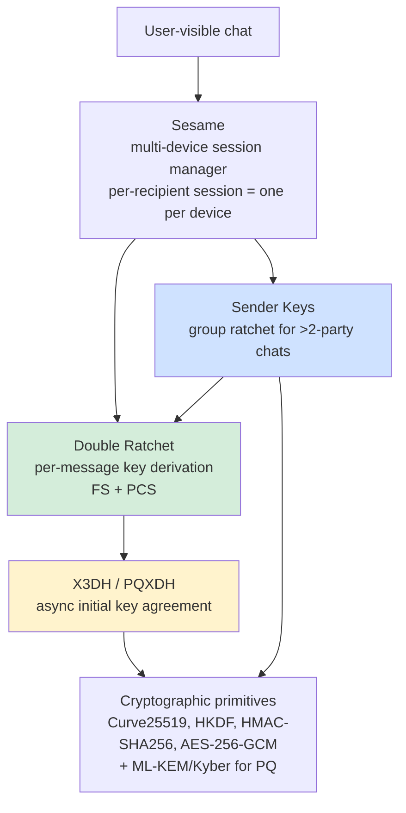
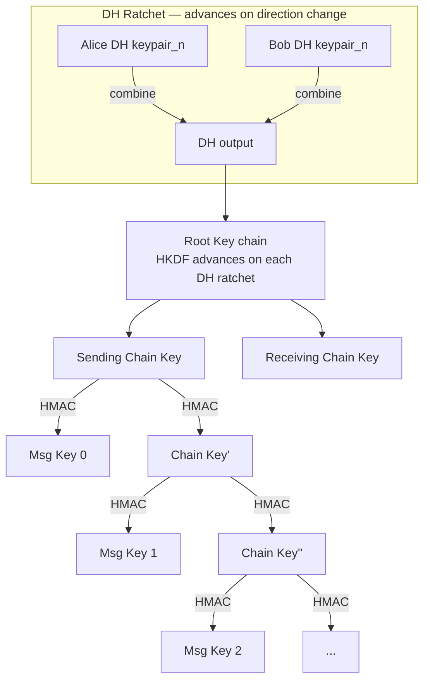
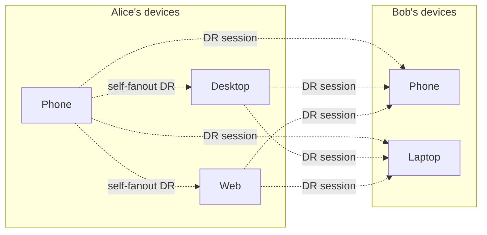

# WhatsApp Deep Dive — End-to-End Encryption

**Date:** 2026-04-27 | **Updated:** 2026-04-27
**Tags:** `system-design` `case-study` `whatsapp` `deep-dive` `e2e-encryption` `signal-protocol`

## Table of Contents

- [Summary](#summary)
- [Overview](#overview)
- [Signal Protocol Overview](#signal-protocol-overview)
- [X3DH — Initial Key Agreement](#x3dh--initial-key-agreement)
- [The Double Ratchet](#the-double-ratchet)
- [Sender Keys for Group Chats](#sender-keys-for-group-chats)
- [Sesame — Multi-Device Session Management](#sesame--multi-device-session-management)
- [Identity Verification — Safety Numbers and QR Codes](#identity-verification--safety-numbers-and-qr-codes)
- [Key Change Notifications](#key-change-notifications)
- [Backup Encryption](#backup-encryption)
- [Disappearing / Ephemeral Messages](#disappearing--ephemeral-messages)
- [Metadata Leakage — What E2EE Does NOT Hide](#metadata-leakage--what-e2ee-does-not-hide)
- [Quantum Resistance — PQXDH](#quantum-resistance--pqxdh)
- [Security Audits](#security-audits)
- [Anti-Patterns](#anti-patterns)
- [Related](#related)
- [References](#references)

## Summary

WhatsApp's end-to-end encryption is the **Signal Protocol** running at billions-of-users scale since April 2016. The protocol is a layered construction: **X3DH** does the initial asynchronous key agreement (a sender can establish a session with an offline recipient using a published prekey bundle), the **Double Ratchet** advances per-message keys with both a symmetric KDF chain and an asymmetric Diffie-Hellman ratchet (forward secrecy + post-compromise security), **Sender Keys** make group chats efficient (one ciphertext per message regardless of group size, after a pairwise key distribution), and **Sesame** manages sessions across a user's devices (phone + linked desktop/web). The server is the **prekey delivery agent and ciphertext relay** — never a key escrow, never a content reader. The cost of E2EE is paid in features: no server-side search, no server-side spam ranking, no offline content moderation, plus genuine operational complexity around device additions, key changes, and backup recovery. Metadata — who messages whom, when, and how much — is **not** encrypted by default and remains the single largest privacy gap. WhatsApp deployed **PQXDH** (post-quantum X3DH) in late 2024 to resist a future quantum adversary harvesting today's traffic.

## Overview

E2EE is famous for what it prevents: a server operator, a malicious insider, a nation-state with a court order to the operator, all unable to read user content. It is less famous for what it costs and what it leaks. This deep-dive sits under the [WhatsApp case study](../design-whatsapp.md) and expands the Signal Protocol section into the depth needed to actually argue about it in a system-design review.

The questions that matter when you adopt this design:

- **What does the server need to know?** Routing metadata (recipient device IDs, timestamps), prekey bundles, ciphertext blobs. Nothing else. WhatsApp has gone further with **Sealed Sender** to hide sender identity from the server on the wire.
- **What happens when a user installs on a new device, loses a device, or restores from backup?** Each event invalidates a session and triggers a key change. The UX must surface this; the server must not silently fix it.
- **What is the threat model for backups?** Default cloud backups (iCloud/Google Drive) historically broke E2EE because the backup itself was not E2EE. WhatsApp shipped **end-to-end encrypted backups** in 2021 with a user password or 64-digit key.
- **What about quantum?** "Harvest now, decrypt later" is real. Signal and WhatsApp deployed PQXDH to add post-quantum strength to the initial handshake; the Double Ratchet itself is being upgraded to a hybrid form (PQ3-style work in progress in the Signal community).
- **What does an audit prove?** That the protocol is sound — not that the implementation, the build pipeline, the device, the OS, the keyboard, and the cloud backup are sound.

## Signal Protocol Overview

The Signal Protocol (Open Whisper Systems, 2013, Trevor Perrin and Moxie Marlinspike) is a stack:



| Layer | Role | Spec |
|-------|------|------|
| **X3DH** | Asynchronous handshake. Establishes the initial root key between two identities, even if the recipient is offline. | [signal.org/docs/specifications/x3dh](https://signal.org/docs/specifications/x3dh/) |
| **Double Ratchet** | Per-message key derivation with two ratchets — symmetric KDF chain (every message advances) and DH ratchet (every reply round-trip rotates DH keys). | [signal.org/docs/specifications/doubleratchet](https://signal.org/docs/specifications/doubleratchet/) |
| **Sender Keys** | Group chat optimization. One symmetric chain per sender, distributed pairwise on first use, so each message is encrypted once and decrypted by N members. | [signal.org/docs/specifications/sendersender](https://signal.org/docs/specifications/sender/) (and the Signal Sender Key blog posts) |
| **Sesame** | Multi-device session management. Tracks a per-recipient set of devices, each with its own Double Ratchet session. Handles device add/remove and the resulting session resets. | [signal.org/docs/specifications/sesame](https://signal.org/docs/specifications/sesame/) |
| **PQXDH** | Post-quantum extension to X3DH. Adds an ML-KEM (Kyber) key encapsulation mechanism to the X3DH handshake so the initial shared secret is hybrid (classical + PQ). | [signal.org/docs/specifications/pqxdh](https://signal.org/docs/specifications/pqxdh/) |

The primitives in classical Signal/WhatsApp:

- **Curve25519** for ECDH (X25519 for key agreement).
- **Ed25519** for signatures (signed prekeys, identity assertions).
- **HKDF-SHA256** as the KDF.
- **HMAC-SHA256** for chain advancement and authentication.
- **AES-256-CBC + HMAC-SHA256** historically for the message envelope; modern variants and forks use AES-256-GCM. WhatsApp's payload uses AES-256 with a separate MAC; the 2016 white paper specifies AES-CBC + HMAC-SHA256 with encrypt-then-MAC.

## X3DH — Initial Key Agreement

X3DH ("Extended Triple Diffie-Hellman") is the asynchronous handshake. The problem it solves: Alice wants to send a message to Bob, but Bob is offline (his phone is in his pocket). We cannot do an interactive key exchange. The fix: Bob has **published in advance** a small bundle of public keys to the server, signed by his identity key. Alice fetches that bundle, performs three or four DH operations, derives a shared secret, and sends Bob an encrypted first message that includes enough information for Bob to reconstruct the secret when he comes online.

### Key Bundle Components

Each user, per device, publishes:

| Key | Lifetime | Purpose |
|-----|----------|---------|
| **Identity Key (IK)** | Long-lived (created at install) | Per-device long-term key. Used to sign the SPK and to mix into the X3DH derivation. Curve25519 for X25519, Ed25519-equivalent for signatures. |
| **Signed Prekey (SPK)** | Medium (rotated every few days to weeks) | Curve25519 public key signed by IK. Provides proof that the bundle came from the legitimate identity. |
| **One-time Prekeys (OPK)** | Single use | A batch of ~100 ephemeral Curve25519 public keys. The server hands out one per X3DH session and refuses to reuse. |
| **Last-resort Prekey** (optional) | Long if OPKs run out | A fallback if the server runs out of OPKs before the client replenishes. Reduces forward secrecy slightly because it can be reused. |

The server stores `(IK_pub, SPK_pub, signature, [OPK_pub_1...n])` in a KV store, indexed by user/device. When a sender requests a bundle, the server hands out one OPK and **deletes it** — first-write-wins guarantees one-time use.

### The Handshake

```mermaid
sequenceDiagram
    autonumber
    participant A as Alice (sender)
    participant S as WhatsApp Server
    participant B as Bob (recipient, offline)

    Note over B,S: At install / key replenishment
    B->>S: Upload(IK_B, SPK_B, sig_IK(SPK_B), [OPK_B_1...100])

    Note over A,S: Alice initiates a chat
    A->>S: GET prekey bundle for Bob/device_X
    S->>A: (IK_B, SPK_B, sig, OPK_B_k)
    S->>S: Delete OPK_B_k

    A->>A: Verify sig_IK_B(SPK_B)
    A->>A: Generate ephemeral key EK_A
    A->>A: Compute DH1 = DH(IK_A, SPK_B)<br/>DH2 = DH(EK_A, IK_B)<br/>DH3 = DH(EK_A, SPK_B)<br/>DH4 = DH(EK_A, OPK_B_k)
    A->>A: SK = HKDF(DH1 ‖ DH2 ‖ DH3 ‖ DH4)
    A->>A: Initialize Double Ratchet from SK

    A->>S: First message: { IK_A, EK_A, OPK_id_k, ciphertext_DR(msg) }
    S->>B: (when Bob comes online) deliver envelope

    B->>B: Look up OPK_B_k from local store
    B->>B: Compute the four DHs symmetrically
    B->>B: Derive same SK; init DR; decrypt
```

The four Diffie-Hellman computations bind:

- **DH1 = DH(IK_A, SPK_B):** authenticates Bob (his SPK is signed by his IK).
- **DH2 = DH(EK_A, IK_B):** authenticates Alice's commitment to Bob's identity.
- **DH3 = DH(EK_A, SPK_B):** core forward secrecy; ephemeral on Alice's side.
- **DH4 = DH(EK_A, OPK_B_k):** one-time forward secrecy; if Bob's long-term keys are later compromised, this DH cannot be re-derived because the OPK is destroyed.

Without DH4 (when OPKs are exhausted), the handshake still works but loses one layer of forward secrecy.

### Pseudocode — Building and Consuming an X3DH Bundle

```text
# Recipient side, at install time
function publishPrekeyBundle(server):
    IK = Curve25519.generateIdentity()        # long-lived, stored locally
    SPK = Curve25519.generate()
    sig = Ed25519.sign(IK.priv, SPK.pub)
    OPKs = [Curve25519.generate() for _ in range(100)]
    server.upload({
        identityKey: IK.pub,
        signedPrekey: { pub: SPK.pub, sig: sig, id: SPK.id, ts: now() },
        oneTimePrekeys: [{ pub: opk.pub, id: opk.id } for opk in OPKs],
    })

# Sender side, initiating a session
function initiateSession(server, recipientId):
    bundle = server.fetchBundle(recipientId)
    assert Ed25519.verify(bundle.identityKey, bundle.signedPrekey.pub, bundle.signedPrekey.sig)
    EK = Curve25519.generate()
    DH1 = X25519(IK_A.priv, bundle.signedPrekey.pub)
    DH2 = X25519(EK.priv, bundle.identityKey)
    DH3 = X25519(EK.priv, bundle.signedPrekey.pub)
    DH4 = X25519(EK.priv, bundle.oneTimePrekey.pub)   # may be absent
    SK  = HKDF(salt = 0x00..00, ikm = DH1 ‖ DH2 ‖ DH3 ‖ DH4, info = "WhatsApp X3DH")
    ratchet = DoubleRatchet.initSender(rootKey = SK, peerDH = bundle.signedPrekey.pub)
    return { ratchet, header: { IK_A.pub, EK.pub, opk_id: bundle.oneTimePrekey.id } }
```

Implementation note: WhatsApp's white paper ([whatsapp.com/security](https://www.whatsapp.com/security)) specifies the ordering and the labels in HKDF; do not implement this from a description. Use libsignal.

## The Double Ratchet

Once X3DH establishes a shared secret `SK`, the conversation is governed by the Double Ratchet. The core idea: **derive a fresh symmetric key for every single message**, with two independent mechanisms refreshing the secret material:

1. **Symmetric (chain) ratchet** — every message advances a chain key; the message key is derived from the chain key, then the chain key is replaced by a new chain key derived from itself. Past message keys are unrecoverable.
2. **Diffie-Hellman (asymmetric) ratchet** — every time the conversation direction flips (Alice sends, then Bob replies, or vice versa), each side generates a fresh DH keypair and mixes a new DH output into the root key. Past root keys are unrecoverable.

Together, they give:

- **Forward secrecy.** If today's keys are compromised, yesterday's messages are still safe.
- **Post-compromise security (self-healing).** If keys are compromised, **once both parties exchange a fresh DH ratchet**, future messages become safe again.



### Pseudocode — One Message Encrypt Step

```text
function encryptMessage(state, plaintext):
    # If we just received from peer, perform a DH ratchet step before sending.
    if state.needsDhRatchet:
        state.dhSelf = Curve25519.generate()
        dhOut = X25519(state.dhSelf.priv, state.dhPeer.pub)
        (state.rootKey, state.sendChainKey) = HKDF(state.rootKey, dhOut, info = "DR root")
        state.needsDhRatchet = false

    # Symmetric ratchet step
    msgKey = HMAC(state.sendChainKey, 0x01)
    state.sendChainKey = HMAC(state.sendChainKey, 0x02)  # advance
    state.sendCounter += 1

    # Encrypt — AES-GCM on modern variants; AES-CBC + HMAC encrypt-then-MAC in classic Signal/WhatsApp
    (encKey, authKey, iv) = HKDF(msgKey, info = "DR msg")
    ciphertext = AES_GCM.encrypt(encKey, iv, plaintext, aad = header)
    header = {
        dhSelfPub: state.dhSelf.pub,
        previousChainLen: state.previousSendChainLen,
        counter: state.sendCounter,
    }
    return { header, ciphertext }
```

### AES-GCM-SIV Envelope (Modernized Variant)

Classic Signal uses AES-256-CBC + HMAC-SHA256. Modern variants (and what most teams choose for new builds) use **AES-256-GCM** or **AES-GCM-SIV** for nonce-misuse resistance — relevant when message keys are derived deterministically from a chain and a counter, where a buggy implementation could plausibly reuse a key/nonce pair.

```text
function sealEnvelope(msgKey, header, plaintext):
    # 32 bytes for the AEAD key, 12 for the nonce, derived deterministically from msgKey
    okm = HKDF(salt = 0x00..00, ikm = msgKey, info = "DR-AES-GCM-SIV", length = 44)
    encKey = okm[0:32]
    nonce  = okm[32:44]                                  # deterministic — safe under SIV
    aad    = serialize(header)                           # binds header to ciphertext
    return AES_256_GCM_SIV.seal(encKey, nonce, plaintext, aad)
```

Trade-off: SIV is slower than vanilla GCM. Use it where deterministic nonces are unavoidable; otherwise random 96-bit nonces under GCM remain the standard answer (see [encryption-at-rest-and-in-transit.md](../../../security/encryption-at-rest-and-in-transit.md)).

### Out-of-Order Delivery and Skipped Keys

Messages can arrive out of order — Bob sends three messages while Alice is offline; Alice comes back and they arrive in `2, 1, 3` order. The receiver tracks **skipped message keys** in a small bounded store: for every key `i < counter` that has not yet been used, store `MK_i` so the message can be decrypted when it eventually arrives. There is a hard cap (typically 1000 or 2000) to prevent a malicious peer from forcing unbounded state growth.

When a DH ratchet step happens before all skipped messages on the previous chain have arrived, the receiver computes and stores **all remaining message keys on the old chain** (up to the cap), then moves to the new chain.

## Sender Keys for Group Chats

Pairwise Double Ratchet is wrong for groups. If Alice messages a 250-member group and the message must be encrypted once per recipient device, the sender uploads 250+ ciphertexts and the server fans out 250+ envelopes — bad for the sender's bandwidth and the server's queue size, especially on cellular networks.

The **Sender Keys** scheme ([Signal blog post on Private Group System & Sender Keys](https://signal.org/blog/private-groups/)) solves this with a hybrid approach:

1. **Pairwise distribution of a per-sender symmetric chain.** When Alice first sends to a group, she generates a symmetric chain key and signing key, and sends each member a copy **encrypted with the pairwise Double Ratchet session** (so distribution is itself E2EE).
2. **One ciphertext per group message.** Subsequent messages from Alice are encrypted once with the next message key from her chain, signed with her group signing key, and broadcast to the group. Each member decrypts with their copy of Alice's chain.
3. **Per-sender state, not group-wide.** Bob has his own chain, Carol has hers; each pair (sender, group) has independent state.

```mermaid
sequenceDiagram
    autonumber
    participant A as Alice
    participant B as Bob
    participant C as Carol
    participant S as Server

    Note over A: First send to a 3-member group
    A->>A: Generate Sender Key (chainKey_A, sigKey_A)
    A->>S: Pairwise DR ciphertext to Bob: SenderKeyDistributionMessage
    A->>S: Pairwise DR ciphertext to Carol: SenderKeyDistributionMessage
    S->>B: Deliver
    S->>C: Deliver
    B->>B: Store Alice's Sender Key
    C->>C: Store Alice's Sender Key

    Note over A: Subsequent group messages
    A->>A: msgKey = derive(chainKey_A); advance chainKey_A
    A->>A: ciphertext = AES_GCM(msgKey, plaintext); sig = Ed25519.sign(sigKey_A, ciphertext)
    A->>S: One envelope { sender: A, group: G, ciphertext, sig }
    S->>B: Fan out
    S->>C: Fan out
    B->>B: Verify sig with Alice's group sigKey; decrypt
    C->>C: Same
```

Properties:

- **Forward secrecy in groups** — the symmetric chain ratchets per message, so old keys do not decrypt future messages.
- **No DH ratchet in groups** — there is no notion of a "reply" in group context, so the asymmetric ratchet is dropped. Post-compromise security is weaker; a sender whose chain is leaked must explicitly **rotate** their Sender Key.
- **Membership changes force a rotation.** When a member leaves, every remaining sender generates a new Sender Key and redistributes pairwise. Otherwise the departed member's stored chain still decrypts future messages.

This is why a group "you removed Bob" event triggers a noticeable burst of background traffic — it's the Sender Key redistribution.

## Sesame — Multi-Device Session Management

A user has multiple devices: phone, laptop, desktop, web. Each is a separate cryptographic identity (separate IK, separate Double Ratchet sessions). The server tracks **device lists** per user. When you message "Alice" you are really messaging "all of Alice's currently-active devices."

Sesame ([signal.org/docs/specifications/sesame](https://signal.org/docs/specifications/sesame/)) is the bookkeeping layer. It defines:

- A **session record per (peer user, peer device)** — many sessions per recipient.
- An **active device list per user**, fetched from the server. The list itself is signed by a self-asserting mechanism (e.g., a primary device approves new device additions).
- **Stale-while-revalidate** semantics: send to the cached device list, refresh in the background; if the server reports a newly added device or a removal, perform the appropriate session reset.
- **Session reset rules** for when a device's identity key changes (re-install, OS reset, restored backup).



When Alice sends one logical message:

1. Her phone enumerates her cached **own** device list (desktop, web) and **Bob's** device list (phone, laptop).
2. Encrypts the message **once per destination device** (4 ciphertexts here: 2 of Bob's + 2 of her own non-phone devices, for read-state sync).
3. Hands the bundle of ciphertexts to the server, which fans out to each device's connection.

This is the operational reason WhatsApp **caps linked devices at 4** — sender-side encryption cost scales with `(num_recipient_devices + num_sender_devices - 1)` per message.

### Device-list Updates

When a new device is linked:

- Primary device generates a key bundle for the new device locally (or via a QR-driven device-to-device exchange).
- The new device's IK and signed prekey are uploaded to the server.
- The server publishes an updated device list. Other parties pull the new list and **start a new Double Ratchet session** with the new device on their next message.
- Optionally, a **device-add notification** is rendered in chat: "Alice's account was linked to a new device."

When a device is removed:

- Server marks the device inactive; future sends skip it.
- Other parties' next refresh of the device list drops the session.
- For groups, a Sender Key rotation is triggered to forward-secure against the removed device.

## Identity Verification — Safety Numbers and QR Codes

The server hands out prekey bundles. The server is **untrusted for content** but is **trusted, by default, for identity binding** — meaning that a malicious server could hand Alice a fake prekey bundle for "Bob" pointing to keys the server itself controls (a classic MitM). Defending against this requires **out-of-band identity verification**.

WhatsApp displays a **60-digit safety number** (Signal calls it the same; it is rendered as 12 groups of 5 digits) for each pairwise conversation. The number is a deterministic function of both parties' identity public keys.

### Safety Number Computation

```text
function safetyNumber(IK_self, IK_peer):
    # Iterate a hash 5200 times for slowdown (commitment to both keys)
    h = SHA512(version_bytes ‖ IK_self.pub ‖ self_id_string)
    for i in 0..5199: h = SHA512(h ‖ IK_self.pub)
    fingerprint_self = truncate(h, 30 bytes)

    h = SHA512(version_bytes ‖ IK_peer.pub ‖ peer_id_string)
    for i in 0..5199: h = SHA512(h ‖ IK_peer.pub)
    fingerprint_peer = truncate(h, 30 bytes)

    # Order-independent: lexicographically smaller comes first
    (a, b) = sorted([fingerprint_self, fingerprint_peer])
    encoded = base10_encode(a ‖ b)            # 60 decimal digits
    return groups_of_5(encoded)
```

(Actual algorithm in `libsignal-protocol-java` `NumericFingerprintGenerator`. The 5200-iteration count and the 60-digit length are constants from the implementation.)

UX patterns:

- **QR code scan** — Alice scans Bob's QR; the app compares the displayed number with the computed local number. A green check confirms.
- **Read aloud** — verify over a phone call or in person.
- **Trust on first use (TOFU)** — the default. WhatsApp treats the keys as good unless the user explicitly verifies; a key change is then surfaced as a warning.

The trade-off TOFU makes: the **server can MitM the very first message** without the user noticing, until they out-of-band verify. Explicit verification closes that window. Almost no users do this. WhatsApp's mitigations are the key-change notification and the public discoverability of the protocol (a server-side MitM at scale would be detectable by audit and by users on multiple devices comparing safety numbers).

## Key Change Notifications

When Bob's identity key changes — he reinstalled, switched phones, restored from a non-encrypted backup, or the server is misbehaving — Alice's app notices on her next send: the prekey bundle she gets has a new IK. The protocol must surface this.

WhatsApp's default behavior:

- **Render an in-chat notice**: "Bob's security code changed. Tap to learn more."
- **Re-establish a new X3DH session** with the new bundle. Past messages remain decryptable (they used the old session); future messages use the new one.
- **Optional: "Show security notifications" toggle** — when on, every key change is rendered. When off, the system silently re-establishes; the safety number changes but the user is not prompted.

The asymmetry here is interesting: silent re-establishment is **less secure but better UX** because most key changes are benign (legitimate device replacement). Loud notification is **more secure but creates alert fatigue**. WhatsApp's default historically has been loud only for verified contacts.

The recommended pattern in your own protocol design: **always log key changes, surface them by default, allow silencing, but never make silencing the default for verified contacts**.

## Backup Encryption

E2EE is undermined if the cloud backup is plaintext. Until 2021, WhatsApp's iCloud and Google Drive backups were **encrypted in transit and at rest by Apple/Google**, but the keys were held by Apple/Google — meaning a court order or a breach could expose chat history.

WhatsApp shipped **end-to-end encrypted backups** in October 2021. Two modes:

| Mode | Key derivation | UX |
|------|----------------|-----|
| **User password** | `key = HKDF(PBKDF2-HMAC-SHA512(password, salt, iterations))` — computed client-side | User chooses a password; lose it and the backup is unrecoverable |
| **64-digit encryption key** | Random 256-bit key, displayed for the user to write down | "Power user" mode; same recoverability constraint |

The encryption key never leaves the device. The encrypted backup blob lives in iCloud/Google Drive; only the user's device with the password (or 64-digit key) can decrypt it. Apple and Google see ciphertext.

The **HSM-backed Backup Key Vault**: WhatsApp Engineering has described a fleet of HSMs that participate in the key recovery flow when the user enrolls with a password (rather than a 64-digit key). The HSM enforces a rate-limited password-attempt counter (typically 10 wrong attempts → lock) so an attacker who steals the encrypted backup blob cannot offline-brute-force the password. ([WhatsApp Engineering, "How we built end-to-end encryption backups"](https://engineering.fb.com/2021/09/10/security/whatsapp-e2ee-backups/))

```text
# Pseudocode — encrypted backup envelope
function encryptBackup(plaintext_db, password):
    salt = random(32 bytes)
    backupKey = PBKDF2_HMAC_SHA512(password, salt, iterations = 600_000)
    # or HKDF from the 64-digit key for the alternative mode
    iv = random(12 bytes)
    ciphertext = AES_256_GCM.encrypt(backupKey, iv, plaintext_db, aad = "wa-backup-v1")
    return { salt, iv, ciphertext, mode: "password" }
```

(The exact KDF iterations and whether HKDF wraps PBKDF2 differ between modes; numbers above are illustrative — confirm against current WhatsApp specs.)

Operational caveat: **backup recovery is the most common way users lose chat history**. If they forget the password and chose the password mode, the data is gone. WhatsApp has a UX flow that warns, but the cryptographic guarantee is exactly the one users find painful.

## Disappearing / Ephemeral Messages

WhatsApp supports per-chat disappearing-message timers (24 hours, 7 days, 90 days). This is **not a cryptographic property** — it is an application-level deletion policy:

- **Client-enforced.** The sender's app and the recipient's app both run a timer; when it fires, they delete the message locally.
- **Server-side support is opportunistic.** The server includes the timer in the envelope metadata so the receiving client knows; the server may also enforce TTL on its undelivered queue.
- **No cryptographic erasure.** Once decrypted on a device, the plaintext is in the OS's page cache, possibly in a screenshot folder, possibly in a backup. The crypto cannot prevent the recipient from screenshotting or copying.

The metadata leak: **the timer setting itself is visible to the server** (it's in the envelope metadata), and the existence of a message is logged for delivery purposes. Disappearing messages reduce, but do not eliminate, persistent data.

A robust design treats disappearing messages as **plausible deniability + device hygiene**, not as a security control. Anything worth cryptographic erasure needs a different architecture (e.g., per-message keys destroyed on the sender side after a window — and even then, the plaintext lived on a device).

## Metadata Leakage — What E2EE Does NOT Hide

This is the **single most under-discussed property of E2EE messengers**. The Signal Protocol encrypts content. It does not, by itself, hide:

| Metadata | Visible to | Notes |
|----------|------------|-------|
| **Who messaged whom** | WhatsApp / Meta backend | Required for routing. Sealed Sender mitigates by hiding sender identity from the server in the wire envelope; the server only sees the recipient. |
| **When** | Backend | Timestamps drive delivery and ordering. Cannot be hidden without breaking real-time UX. |
| **Approximate message size** | Backend, network observer | Padding can blunt this; WhatsApp's protocol does not aggressively pad. |
| **Frequency / cadence** | Backend, network observer | "Alice and Bob exchanged 47 messages between 11pm and 12am" is visible in the audit logs. |
| **Group membership** | Backend | The server fans out, so it knows the recipient set. |
| **Online presence** | Backend | "Last seen" is a backend signal. |
| **IP address, device type, OS, app version** | Backend | Standard service metadata. |

The privacy gap that even a perfectly implemented E2EE messenger leaves is **the social graph and behavioral patterns**. Law enforcement requests under the EU's e-Evidence regime, US 18 USC § 2703(d) orders, and similar tooling globally focus on metadata precisely because content is unavailable.

Mitigations WhatsApp/Signal have shipped:

- **Sealed Sender** (Signal, October 2018): the outer envelope is encrypted to the recipient's identity key; the server only sees a recipient address. Sender identity is inside the encryption envelope. Defeats trivial server-side "who messaged whom" but not network-level traffic analysis.
- **Private Contact Discovery** (Signal): the contact-matching service runs in an Intel SGX enclave, attested to clients, so the server learns minimum information about a user's address book. WhatsApp does not currently use SGX-style contact discovery; it relies on phone-number-to-account mapping with operational policy.
- **Group privacy improvements** (Signal Private Groups): membership is encrypted at the server using anonymous credentials — a model WhatsApp has not fully adopted.

A design lesson: **if metadata privacy matters to your threat model, E2EE alone is not enough**. You need traffic mixing (Tor / mix networks), padding to fixed sizes, and randomized timing — all expensive features that few mainstream messengers have shipped.

## Quantum Resistance — PQXDH

A sufficiently large quantum computer running Shor's algorithm breaks Curve25519 (and all elliptic-curve and RSA-based public-key cryptography) by factoring the discrete log. The threat is not present today, but a "harvest now, decrypt later" adversary is plausible: capture today's ciphertext and X3DH handshakes, decrypt in 10–20 years when CRQC (cryptographically relevant quantum computer) becomes feasible.

The Signal Protocol response, deployed by Signal and adopted by WhatsApp in late 2024, is **PQXDH** ([signal.org/docs/specifications/pqxdh](https://signal.org/docs/specifications/pqxdh/)).

PQXDH augments X3DH with a **Post-Quantum Key Encapsulation Mechanism (KEM)**, specifically **ML-KEM-768** (formerly Kyber-768, NIST FIPS 203, August 2024).

```mermaid
sequenceDiagram
    autonumber
    participant A as Alice
    participant S as Server
    participant B as Bob

    Note over B: Bundle now includes a PQ-KEM public key
    B->>S: Upload(IK, SPK, OPK..., PQ_KEM_pub_signed_by_IK)

    A->>S: Fetch bundle
    A->>A: ECDH 1..4 (as in X3DH)
    A->>A: ss = ML-KEM-Encapsulate(PQ_KEM_pub) → (ct, K_pq)
    A->>A: SK = HKDF(DH1 ‖ DH2 ‖ DH3 ‖ DH4 ‖ K_pq)
    A->>S: First message includes ct (the KEM ciphertext)

    B->>B: K_pq = ML-KEM-Decapsulate(PQ_KEM_priv, ct)
    B->>B: Derive same SK; init DR
```

Properties:

- **Hybrid construction.** SK is derived from both classical ECDH outputs **and** a PQ KEM output. Either one being broken still leaves SK secure. This is critical: ML-KEM is much newer than Curve25519 and could have undiscovered weaknesses; the hybrid hedges.
- **Bundle size grows.** ML-KEM-768 public keys are ~1184 bytes vs Curve25519's 32 bytes. Manageable but real for prekey storage and handover bandwidth.
- **Only the handshake is post-quantum, not yet the Double Ratchet.** Once the conversation is going, the symmetric ratchet (HMAC chains) is already PQ-safe (symmetric crypto needs only key-doubling against Grover). The DH ratchet is still Curve25519. Signal has discussed extending the ratchet itself with ML-KEM (similar to Apple's iMessage PQ3); that work is in progress as of early 2026.

WhatsApp's deployment of PQXDH followed Signal's by months — both rolled it out in 2024. The transition was rolling: clients added PQ key bundles, and X3DH negotiation fell back to classical when one side did not yet support PQXDH. By early 2026 PQXDH is the default for new sessions on supported clients.

## Security Audits

The Signal Protocol's reputation rests on **public, peer-reviewed analysis**, not just on operator reputation. Key audits and analyses:

- **Cohn-Gordon, Cremers, Dowling, Garratt, Stebila (2017): "A Formal Security Analysis of the Signal Messaging Protocol"** — IEEE EuroS&P 2017 (and extended in J. Cryptology 2020). The first full formal security proof of the Signal Protocol's combined X3DH + Double Ratchet construction. Established forward secrecy and post-compromise security under standard assumptions ([eprint.iacr.org/2016/1013](https://eprint.iacr.org/2016/1013)). Result: the protocol is sound.
- **Alwen, Coretti, Dodis (2019): "The Double Ratchet: Security Notions, Proofs, and Modularization"** — Eurocrypt 2019. Cleaner abstractions and stronger security definitions; basis for variants and extensions.
- **NCC Group audits** on Signal app implementations and on libsignal.
- **WhatsApp's white paper** ([whatsapp.com/security](https://www.whatsapp.com/security)) — operator-published spec, not a formal proof, but reviewable.
- **PQXDH security analysis** — published with the spec; uses the Tamarin prover for formal verification.

What audits prove and what they do not:

- They prove the **protocol** is secure under specified assumptions (DH gap problem, SHA256 collision-resistance, etc.).
- They do **not** prove the **implementation** is secure (memory-safety bugs in libsignal, side channels on a specific device, OS-level compromise of the keychain).
- They do **not** prove the **operator** is honest about which build is shipped, whether the key server returns honest bundles, or whether device firmware leaks.
- Reproducible builds, public source, and out-of-band verification (safety numbers) are the operational mitigations.

Signal's source is open. WhatsApp's source is **not** open, though they license libsignal for the protocol layer. The implication: WhatsApp users trust **that Meta is faithfully executing the audited protocol**, supported by a long track record, public statements, security researchers who reverse-engineer builds, and the absence of reported deviations.

## Anti-Patterns

- **Implementing Signal from a description.** Use libsignal. The number of subtle ways to break X3DH or the Double Ratchet (nonce reuse, missing AAD, improper HKDF info strings, mishandled out-of-order messages) is vast.
- **Storing the unwrapped DEK / message key alongside the ciphertext.** Defeats the entire chain — see [encryption-at-rest-and-in-transit.md](../../../security/encryption-at-rest-and-in-transit.md) for the same anti-pattern in at-rest encryption.
- **Letting the server hand out prekeys without identity verification.** A trust-on-first-use design with no key-change notification is a server-controlled MitM.
- **Forgetting Sender Key rotation when a member leaves a group.** The departed member's stored Sender Key still decrypts subsequent messages. Rotate immediately.
- **Plaintext cloud backups.** "We have E2EE messaging" + "we back up the database to iCloud unencrypted" is, from the user's perspective, not E2EE.
- **Ignoring metadata.** Building "private messaging" without considering that the server logs `who → who, when` is shipping a privacy theater. Document it; do not pretend.
- **Cert pinning the prekey server with no rotation strategy.** If the prekey-server cert rotates and the mobile app pinned the old one, the entire user base loses the ability to fetch bundles — a global outage.
- **Disappearing messages presented as cryptographic erasure.** They are an application policy. The crypto cannot un-screenshot or un-backup a message that was decrypted on a device.
- **No quantum-readiness plan.** "We'll deal with PQ when it matters" — but harvest-now-decrypt-later means traffic captured today is at risk. Hybrid X3DH/PQXDH is shippable today.
- **Assuming an audit covers the implementation.** The 2017 Cohn-Gordon paper proves the protocol. It does not prove a specific app's build is bug-free; that requires implementation review, fuzzing, and reproducible-build verification.
- **Letting a "key changed" prompt train users to ignore it.** If you spam users every time a friend reinstalls, they will tap-through every warning, including the one that matters. Tune severity per user-verified status.

## Related

- [WhatsApp Case Study](../design-whatsapp.md) — the parent doc; this expands the §7 End-to-End Encryption section.
- [WhatsApp Media Handling](./media-handling.md) — sibling deep-dive; how E2EE composes with object-storage uploads, presigned URLs, and CDN reads via a per-media random key carried inside the chat envelope.
- [Encryption at Rest and in Transit](../../../security/encryption-at-rest-and-in-transit.md) — the broader encryption taxonomy; Signal sits at the "end-to-end" layer above TLS and at-rest encryption.
- [Authentication](../../../security/authentication.md) — sibling foundations doc; identity-key registration and device-link flows are an authentication problem before they are a key-agreement problem.

## References

- M. Marlinspike, T. Perrin, ["The X3DH Key Agreement Protocol"](https://signal.org/docs/specifications/x3dh/) — Signal Foundation, revision 1, November 2016. Canonical X3DH specification.
- T. Perrin, M. Marlinspike, ["The Double Ratchet Algorithm"](https://signal.org/docs/specifications/doubleratchet/) — Signal Foundation, revision 1, November 2016. Canonical Double Ratchet specification, including chain key derivation, DH ratchet, and skipped-message handling.
- M. Marlinspike, T. Perrin, ["The Sesame Algorithm: Session Management for Asynchronous Message Encryption"](https://signal.org/docs/specifications/sesame/) — Signal Foundation, revision 2, April 2017. Multi-device session management.
- E. Kret, R. Schneier, ["The PQXDH Key Agreement Protocol"](https://signal.org/docs/specifications/pqxdh/) — Signal Foundation, 2023, deployed 2023–2024. ML-KEM hybrid extension to X3DH for post-quantum harvest-now-decrypt-later resistance.
- WhatsApp, ["WhatsApp Encryption Overview"](https://www.whatsapp.com/security) — official white paper, last revised September 2023. Describes WhatsApp's specific deployment of X3DH, Double Ratchet, Sender Keys, and the encrypted-backup design.
- K. Cohn-Gordon, C. Cremers, B. Dowling, L. Garratt, D. Stebila, ["A Formal Security Analysis of the Signal Messaging Protocol"](https://eprint.iacr.org/2016/1013) — IEEE EuroS&P 2017; extended J. Cryptology 33(4) 2020. First full formal proof of forward secrecy and post-compromise security for the combined Signal handshake + ratchet.
- WhatsApp Engineering, ["Building end-to-end encrypted backups for WhatsApp"](https://engineering.fb.com/2021/09/10/security/whatsapp-e2ee-backups/) — September 2021. HSM-backed password-derived key flow for iCloud/Google Drive backups.
- NIST, ["FIPS 203: Module-Lattice-Based Key-Encapsulation Mechanism Standard"](https://csrc.nist.gov/pubs/fips/203/final) — August 2024. ML-KEM (formerly Kyber), the PQ KEM used in PQXDH.
- M. Marlinspike, ["Technology preview: Sealed sender for Signal"](https://signal.org/blog/sealed-sender/) — Signal blog, October 2018. The construction that hides sender identity from the server in the outer envelope; same pattern is used in WhatsApp.
