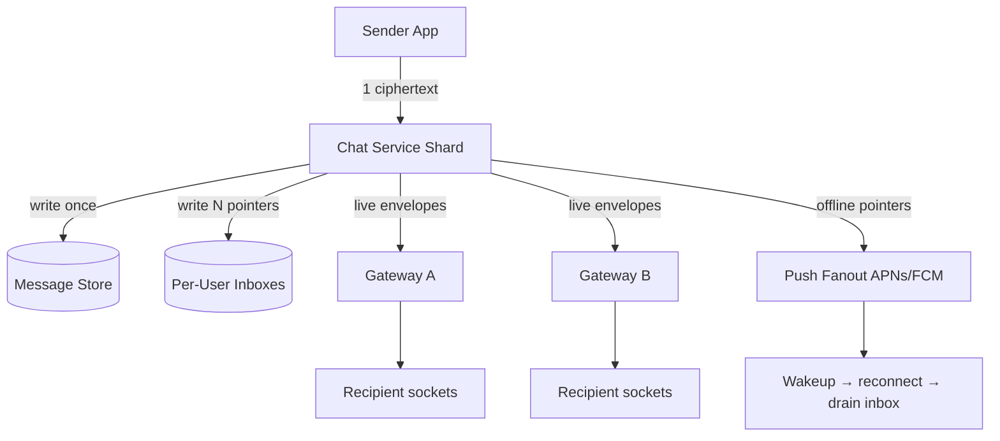

# WhatsApp Deep Dive — Group Chat Fanout

**Date:** 2026-04-27 | **Updated:** 2026-04-27
**Tags:** `system-design` `case-study` `whatsapp` `deep-dive` `fanout` `group-chat`

## Table of Contents

- [Summary](#summary)
- [Overview](#overview)
- [Fanout-on-Write vs Fanout-on-Read](#fanout-on-write-vs-fanout-on-read)
- [Per-User Mailbox Model](#per-user-mailbox-model)
- [Group Size Tiers](#group-size-tiers)
- [Communities and Channels](#communities-and-channels)
- [E2E Encryption with Sender Keys](#e2e-encryption-with-sender-keys)
- [Delivery Guarantees per Recipient](#delivery-guarantees-per-recipient)
- [Mentions, Replies, and Priority Lanes](#mentions-replies-and-priority-lanes)
- [Backpressure on Large Groups](#backpressure-on-large-groups)
- [Read Fanout for Receipts](#read-fanout-for-receipts)
- [Sharding the Fanout Work](#sharding-the-fanout-work)
- [Anti-Patterns](#anti-patterns)
- [Related](#related)
- [References](#references)

## Summary

Group chat fanout is the single most expensive code path in a messenger that scales past one-to-one chat. A 1024-member group makes the message arrive once at the server and leave 1024 times. Get the model wrong and you either pay N× storage for every message, melt the network when one chatty group goes wild, or break end-to-end encryption when you try to optimise. WhatsApp's answer is a hybrid: store the canonical ciphertext **once**, fan out **pointers** into per-user inboxes, encrypt **once per group** using Signal's Sender Keys, and aggregate read state instead of broadcasting it. This document expands the parent case study's [Group Chat Fanout subsection](../design-whatsapp.md#2-group-chat-fanout) into a full treatment covering the storage model, encryption interaction, delivery semantics, and the operational realities of groups that span sizes from 3 friends to 100,000-member Communities.

## Overview

A group message in WhatsApp travels through three distinct fanout layers. They are independent enough that you can reason about each on its own:

1. **Cryptographic fanout** — the sender's app turns one plaintext into one ciphertext using a *sender key* shared with the group; per-recipient pairwise encryption only happens for the (rare) sender-key-distribution message itself.
2. **Storage fanout** — the server writes the ciphertext blob once to durable storage, and writes one tiny pointer row per recipient into per-user inboxes.
3. **Delivery fanout** — for each currently-online recipient, the chat service hands the envelope to the recipient's edge gateway; for offline recipients, push wakeups are queued and the inbox pointer is the source of truth until they reconnect.



The trick is keeping these three fanouts **decoupled** so the cost of one large group does not blow up the others — you should be able to add 1000 recipients without re-encrypting, without rewriting the message blob, and without holding the sender's send-ack waiting on every recipient's socket.

## Fanout-on-Write vs Fanout-on-Read

The two canonical strategies, and why chat picks differently than feeds:

| Strategy | What you write | What you read | Cost shape |
|---|---|---|---|
| **Fanout-on-write** | One copy of the message per recipient at send time | Each recipient reads their own pre-materialised inbox | Write = O(N members), Read = O(1) |
| **Fanout-on-read** | One canonical message; recipients query on demand | Each recipient runs a query joining group → messages → delivery state | Write = O(1), Read = O(group size × queries) |

Twitter's home timeline famously uses **fanout-on-write** for most users (precompute every follower's timeline) and **fanout-on-read** for celebrity accounts (don't precompute 200 M timelines on every Lady Gaga tweet — pull her recent tweets in at read time and merge). That hybrid is right for a *feed*, where reads dominate and ordering across many sources must be merged.

Chat is different:

- **Reads dominate writes only weakly.** Most recipients read every message; there is no "you only see 5% of your follow graph" filter.
- **Recipients care about strict per-conversation ordering.** Pulling on read across hundreds of group messages and merging on the client is brittle.
- **Offline recipients must come back to a deterministic queue.** A "fanout-on-read" model would force the server to remember "what has each user not yet seen across N groups" which is just a per-user inbox under another name.

WhatsApp's resolution is the **hybrid we already named**: the message body is fanout-on-read (one row, queried by recipients via their pointers), the **inbox pointer is fanout-on-write** (one tiny row per recipient). You get O(N) writes proportional to recipients but each write is small and fixed-size, while the (large) ciphertext is written exactly once. See the parent doc's [server flow](../design-whatsapp.md#chat-service-and-data-store) for where this fits in.

## Per-User Mailbox Model

The per-user inbox is a separate logical table from the message log. Decoupling them is what lets you delete a recipient's inbox row when they ack without touching the canonical message.

```sql
-- Canonical message store: one row per group message.
-- Sharded by conversation_id (group_id for groups).
CREATE TABLE messages (
    conversation_id   BIGINT       NOT NULL,
    server_seq        BIGINT       NOT NULL,
    sender_id         BIGINT       NOT NULL,
    ciphertext        BYTEA        NOT NULL,         -- Sender Keys ciphertext
    content_hash      BYTEA        NOT NULL,         -- SHA-256, lets us dedupe retries
    media_blob_id     BYTEA,                         -- pointer to object store, optional
    created_at        TIMESTAMPTZ  NOT NULL,
    PRIMARY KEY (conversation_id, server_seq)
);

CREATE INDEX messages_by_hash
    ON messages (conversation_id, content_hash);

-- Per-recipient pointer. One row per (recipient, message).
-- Sharded by recipient_id so a user's inbox lives on one shard.
CREATE TABLE user_inbox (
    recipient_id      BIGINT       NOT NULL,
    conversation_id   BIGINT       NOT NULL,
    server_seq        BIGINT       NOT NULL,
    enqueued_at       TIMESTAMPTZ  NOT NULL,
    delivered_at      TIMESTAMPTZ,
    read_at           TIMESTAMPTZ,
    priority          SMALLINT     NOT NULL DEFAULT 0,  -- 0=normal, 10=mention, 20=reply-to-self
    attempt_count     SMALLINT     NOT NULL DEFAULT 0,
    PRIMARY KEY (recipient_id, conversation_id, server_seq)
);

CREATE INDEX user_inbox_undelivered
    ON user_inbox (recipient_id, enqueued_at)
    WHERE delivered_at IS NULL;
```

Three properties to notice:

1. **Content is shared, not copied.** `messages.ciphertext` exists once per group message regardless of group size. A 200 KB image ciphertext in a 1024-member group costs 200 KB on the message shard plus 1024 × ~40 B inbox pointer rows ≈ 40 KB total — not 200 MB.
2. **Inbox sharding follows the recipient, not the group.** When Bob reconnects, his app pulls "everything in `user_inbox` where `recipient_id = bob`" from a single shard. The chat-service shard that owns the *group* never has to coordinate with Bob's read path.
3. **Pointers carry routing/priority metadata, not content.** The `priority` field is what enables mention-priority delivery without a separate queue infrastructure (see [Mentions, Replies, and Priority Lanes](#mentions-replies-and-priority-lanes)).

This is the **content-addressed** shape — a recipient's inbox row is essentially `(conversation_id, server_seq) → resolve to ciphertext`. Deduping retries is trivial: an idempotent insert keyed on `(recipient_id, conversation_id, server_seq)` makes a redelivery a no-op.

## Group Size Tiers

The same code path does not work for a 3-person family group and a 1024-member professional community. Bin by tier:

| Tier | Size | Strategy |
|---|---|---|
| **Small** | ≤ 10 | Synchronous inbox writes, immediate live-fanout to every online socket, no rate limiting needed. |
| **Medium** | 10 – ~100 | Same path, but inbox writes batched per shard; live-fanout uses per-recipient gateway lookups in parallel via a worker pool. |
| **Large** | ~100 – 1024 (WhatsApp cap) | Async fanout job: chat service enqueues a fanout task; workers stream pointer writes and gateway pushes. Sender's ack returns as soon as the message is persisted, **not** when all 1024 pointers land. |
| **Broadcast / Community** | 1 K – 100 K+ | Different model entirely — see [Communities and Channels](#communities-and-channels). One-to-many push, often without per-recipient acks at the same fidelity. |

The 1024 cap on WhatsApp groups is not arbitrary. It is the size at which Sender Keys distribution and per-recipient ack tracking still fit a "real conversation" model where everyone can plausibly read every message. Past that, the human semantics break before the technical limits do — nobody actually reads a 5000-person chat as a chat — so the product separates Communities (announcement + threaded sub-groups) and Channels (broadcast).

For the **Large** tier the key change is *acknowledgment timing*: you do not block the sender on N gateway pushes. The message is durable as soon as `messages` and the *first* inbox pointers are written; the rest stream out asynchronously. If you tied sender-ack to "all 1024 pushed", a single offline recipient could stall every send.

## Communities and Channels

WhatsApp Communities (announcement-style super-group with linked sub-groups) and Channels (one-to-many broadcast, like Telegram channels) are deliberately not "just bigger groups". The semantic shifts are:

- **Asymmetric send rights.** Only the channel admin (or community announcement-group admin) can send. You can drop most of the contention you'd see in a 100K bidirectional chat — there is exactly one or a handful of senders.
- **No per-message read receipts.** Read receipts in a 50K-subscriber channel are meaningless to humans and ruinously expensive to compute. Channels show *aggregate view counts*, not per-recipient state.
- **Different encryption posture.** Channels (currently) use a different key-distribution model where new subscribers can decrypt newly-published messages without the publisher having to send pairwise SKDMs to everyone. Some Channel content is end-to-end encrypted with rotating channel keys; some is server-mediated. The exact posture changes — see [WhatsApp Security](https://www.whatsapp.com/security) for current claims.
- **Pull-heavy read path.** Subscribers fetch recent posts on demand more than they receive live pushes; the inbox pointer model is replaced or supplemented by a "channel feed" cursor.

The system-design takeaway: **don't try to use the same fanout pipeline for 1-on-1 chat, group chat, and 100K broadcast**. The product surfaces are different, the encryption model is different, and the read patterns are different. Three pipelines that share a transport substrate (gateways, push, queues) is healthier than one over-generalised pipeline.

## E2E Encryption with Sender Keys

This is the part most "build a chat app" tutorials get wrong. Naive E2E for groups looks like:

> For a group of N members, encrypt the message N times — once for each pairwise Double Ratchet session.

That works and is genuinely secure, but it is O(N) ciphertexts per message and O(N) network sends. For a 1024-member group with a 1 MB image, you would push 1 GB of (mostly redundant) ciphertext from the sender's phone. Not viable on cellular.

Signal's **Sender Keys** protocol replaces this with a one-time pairwise distribution and per-message symmetric encryption:

```text
First message in a new group (or after membership change):

  for each member M in group:
      sender → M: SenderKeyDistributionMessage (SKDM), encrypted pairwise
                  via the existing Double Ratchet session with M.
                  Body = (chain_key, signature_public_key)

Subsequent messages:

  sender derives next message_key from chain_key (KDF chain)
  ciphertext = AES-CBC-encrypt(plaintext, message_key)
  signature  = sign(ciphertext, signature_private_key)
  sender → server: one (ciphertext, signature) blob for the group.
  server fanouts the same blob to all members.

  Each recipient ratchets their copy of chain_key forward,
  derives the same message_key, decrypts, verifies signature.
```

```text
// Pseudocode — sender side
function sendGroupMessage(groupId, plaintext):
    state = senderKeyState[groupId]
    if state == null OR membersChangedSinceLastMessage(groupId):
        state = newSenderKey()
        for each member M in group(groupId):
            skdm = encryptPairwise(M, state.export())
            transport.send(M, skdm)
        senderKeyState[groupId] = state

    messageKey, nextChainKey = kdf(state.chainKey)
    state.chainKey = nextChainKey
    ciphertext = aesEncrypt(messageKey, plaintext)
    signature  = sign(state.signaturePrivateKey, ciphertext)
    transport.broadcast(groupId, ciphertext || signature)

// Pseudocode — recipient side
function onGroupCiphertext(groupId, sender, blob):
    state = receivedSenderKeys[groupId][sender]
    messageKey, nextChainKey = kdf(state.chainKey)
    state.chainKey = nextChainKey
    plaintext = aesDecrypt(messageKey, blob.ciphertext)
    require verify(state.signaturePublicKey, blob.ciphertext, blob.signature)
    return plaintext
```

What the **server** sees: one opaque ciphertext per group message, regardless of group size. The fanout pipeline is entirely independent of the encryption — it is moving an opaque blob and N small pointer rows. That is the property that lets WhatsApp publish "we cannot read your messages" while still supporting 1024-member groups.

What you give up:

- **Forward secrecy is per-chain, not per-message-pair.** If a recipient's chain key leaks, all *future* messages they decrypt with that chain are exposed until the sender rotates (typically on membership change). Pairwise Double Ratchet has finer-grained PCS; Sender Keys trades some of that for bandwidth.
- **Membership changes force a new sender key.** Adding or removing a member means the existing chain key cannot be reused (a removed member would still hold a valid copy). The sender's app generates a new sender key and SKDMs everyone again. This is why "leave group" and "remove member" can feel slightly heavyweight on flaky networks — there is a cryptographic event behind them.
- **No deniability between members.** Signatures on ciphertexts mean any group member can prove *to a third party* that another member sent a particular ciphertext. The pairwise Signal protocol has stronger deniability properties.

For depth see [Signal's Sesame spec](https://signal.org/docs/specifications/sesame/) (session management for group messaging) and the [original Sender Keys protocol description](https://signal.org/blog/private-groups/) on the Signal blog.

## Delivery Guarantees per Recipient

WhatsApp's contract per recipient is **at-least-once with idempotent client-side dedupe**. Concretely:

- The chat service guarantees the inbox pointer is durably written before sender-ack returns.
- The gateway may push the live envelope multiple times across retries and reconnects.
- The recipient's app dedupes by `(conversation_id, server_seq)`. A duplicate push is a no-op visually.
- The app sends a delivery ack `{conversation_id, server_seq}` once it has persisted the message locally. The ack flows back to the chat service, which marks `user_inbox.delivered_at`.
- "Read" is a separate ack the user's app sends when the message scrolls into the active view; it sets `read_at` and contributes to the read receipts aggregator (see [Read Fanout for Receipts](#read-fanout-for-receipts)).

```sql
-- Delivery state lives on the inbox pointer, not the message row.
-- Aggregates per group are computed by scanning recipient pointers.
SELECT
    server_seq,
    COUNT(*)                         AS members,
    COUNT(delivered_at)              AS delivered_count,
    COUNT(read_at)                   AS read_count
FROM user_inbox
WHERE conversation_id = :group_id
  AND server_seq      = :server_seq
GROUP BY server_seq;
```

**Dead-letter for chronic offline.** If a recipient has been offline for longer than the inbox TTL (typically 30 days), pointers older than the TTL are dropped and the user falls back to a *history sync* path on next login. The history sync is best-effort and may not include the dropped messages — large absences trade exhaustive history for bounded inbox storage. The decision is documented per-platform; senders cannot tell the difference, which is the right product choice (no "your friend will never see this" UX surprise).

**Retry policy.** The fanout worker retries gateway pushes with exponential backoff (≈ 1s, 4s, 15s, 60s, 5m, 30m) capped at the inbox TTL. Each retry increments `attempt_count` so you can alert on poison messages (`attempt_count > 100`) and route them out of the hot fanout queue.

## Mentions, Replies, and Priority Lanes

Not every group message is equal. An `@everyone` in a noisy group is the one that should still vibrate the phone even when "muted with notifications". The system handles this with a **priority field on the inbox pointer** and parallel delivery lanes — not separate queues, just selection criteria on the existing inbox.

```sql
-- Sender's app classifies the message and stamps priority.
-- Server validates (only @mentions of this recipient can claim priority for that recipient).

UPDATE user_inbox
SET    priority = 10                                -- 10 = mention of this user
WHERE  recipient_id    = :mentioned_user
  AND  conversation_id = :group_id
  AND  server_seq      = :server_seq;
```

Priority levels we use in practice:

| Priority | Meaning | Treatment |
|---|---|---|
| 0 | Normal group message | Standard delivery; honors mute settings |
| 10 | `@mention` of the recipient | Bypasses normal mute; uses high-importance push channel |
| 20 | Reply to a message the recipient sent | Bypasses mute below "muted forever"; threaded UI affordance |
| 30 | Admin announcement (Communities) | Always notifies; uses dedicated push category |

```text
// Pseudocode — fanout worker selecting work
loop:
    batch = fetch_inbox_pointers_to_fanout(
        order_by = (priority DESC, enqueued_at ASC),
        limit    = 500
    )
    parallel_for ptr in batch:
        gateway = routing_table.lookup(ptr.recipient_id)
        if gateway:
            gateway.push_envelope(ptr)
        else:
            push_fanout.enqueue(ptr)
        mark_attempted(ptr)
```

The selection ordering matters: because `priority DESC` comes first, mentions and replies leave the fanout shard ahead of plain messages from the same group, even when the plain messages were enqueued earlier. In a group blasting 50 messages a second, a `@you` cuts the line.

**Thread continuity** for replies uses the `quoted_server_seq` field stored alongside the ciphertext (encrypted, in plaintext metadata only what the server must route). The recipient's app reconstructs the thread visually; the server does not need to traverse threads to fanout — each reply is just another group message with extra metadata.

## Backpressure on Large Groups

A 1024-member group where 50 people are arguing in real time is a **distributed denial of service against your own infrastructure** if you do not push back. Mechanisms:

1. **Per-sender rate limit on group writes.** Token bucket: e.g. 30 messages / minute / (user, group) above which the chat service returns `429 SLOW_MODE`. The client shows a brief "you're sending too fast" hint. This is effectively *slow mode*.
2. **Per-group write rate limit.** A separate bucket per group regardless of sender — e.g. 200 messages / minute / group. Beyond this the chat service starts coalescing fanout work (see #4).
3. **Inbox-pointer write batching.** Rather than 1024 individual `INSERT`s, the fanout worker uses a multi-row insert per recipient-shard (e.g. 50 inboxes-per-shard → one batched insert per shard). Cuts shard write amplification by ~50×.
4. **Coalesced live-push when overloaded.** When a group is in "blast mode" (rate above threshold), the live-push lane stops pushing every message individually. Instead it pushes a single `INBOX_HAS_NEW` poke per recipient every ~500 ms, and the recipient's app pulls the inbox in a batch. Receipts and ordering are preserved because the inbox is the source of truth — only the push is coalesced.
5. **Admin tools.** Group admins can enable explicit slow mode (1 message per N seconds per member) or restrict sending to admins only (which converts the group to an announcement channel for the duration).

The principle: **the inbox is the source of truth, the live push is a hint**. As long as that holds, you can degrade the live-push lane under load (coalesce, drop, batch) without dropping messages.

## Read Fanout for Receipts

Read receipts are a *second* fanout problem layered on top of the message fanout. Naive implementation: when Alice reads a message, broadcast a `READ` event to every other member's socket. In a 1024-member group, Alice reading 10 messages turns into 10,240 socket pushes. Every member doing the same on the same morning is millions of pushes for purely cosmetic ticks.

The right model is **aggregation at the chat service**, not broadcast:

```sql
-- read_state stores the per-(recipient, group) high-water mark, NOT per-message reads.
CREATE TABLE read_state (
    recipient_id      BIGINT       NOT NULL,
    conversation_id   BIGINT       NOT NULL,
    last_read_seq     BIGINT       NOT NULL,
    updated_at        TIMESTAMPTZ  NOT NULL,
    PRIMARY KEY (recipient_id, conversation_id)
);

-- "Read by K of M" computed cheaply on demand for a given message:
SELECT COUNT(*) AS read_count
FROM read_state
WHERE conversation_id = :group_id
  AND last_read_seq  >= :server_seq;
```

The flow:

1. Recipient's app sends a single `READ_UP_TO {conversation_id, last_read_seq}` per group when they catch up (debounced, ~1s after the last visible message scrolls into view).
2. Chat service updates `read_state.last_read_seq` for that user (one row write, monotonic).
3. The sender's app, when rendering "read by 14 of 20", queries (via its own gateway) the aggregate: count of recipients in this group whose `last_read_seq` ≥ this message's seq. Cached for a few seconds.
4. Live `READ_UPDATE` events to the *sender only* (not all members) carry just the changed counts.

You go from O(group_size²) read-receipt traffic to O(group_size) reads-per-day plus O(1) aggregate queries on demand.

For 1-on-1 chats the same model degrades naturally — the aggregate is K=0 or 1, and the original "two ticks" UI is just `last_read_seq >= server_seq`.

For very large groups (admin announcements, Communities), even the aggregate is suppressed — you simply do not show "read by N of M" for groups above a configured size, both for performance and for the social UX (nobody wants their boss to see they read but didn't reply).

## Sharding the Fanout Work

Three sharding axes, each with different trade-offs:

| Axis | Pros | Cons |
|---|---|---|
| **By `group_id`** | Per-group state (sequence numbers, sender-key membership) lives in one place; no cross-shard coordination for ordering. | Hot groups (broadcast lists, viral channels) overload one shard. Recipient inboxes still need separate sharding. |
| **By `sender_id`** | Sender's outbound queue is on one shard; trivial to enforce per-sender rate limits. | Group ordering becomes hard — different senders in the same group write to different shards and you must reconcile via `server_seq` issued elsewhere. |
| **By `recipient_id`** | Each user's inbox lives on one shard; recipient reads are local. | Fanout writer must hit every recipient's shard for every message — write amplification scales with group size *across* shards. |

WhatsApp uses **all three at different layers**:

- The `messages` table and `next_seq` counter are sharded by `conversation_id` (group_id) — this is what gives you the strict per-group monotonic ordering ([§ Per-Conversation Ordering](../design-whatsapp.md#1-per-conversation-ordering) in the parent doc).
- The `user_inbox` is sharded by `recipient_id` — each user's inbox lives in one place so reconnect-and-drain is a single-shard scan.
- Sender-side rate limiting and outbox uses `sender_id` to keep limit state local.
- The fanout worker is the bridge: it reads the (group-sharded) message, then performs N writes against (recipient-sharded) inboxes. Hot groups are mitigated by **sub-sharding** the worker pool — a 1024-member group's fanout is split across (say) 16 worker tasks, each handling ~64 recipients in parallel.

Hot-group mitigation in production:

- **Detect** via per-shard write QPS metrics and per-group send rate.
- **Split** the fanout fan: instead of one worker iterating 1024 recipients sequentially, partition the recipient list by shard and dispatch in parallel.
- **Isolate** for repeat offenders: pin a chronically-hot group to a dedicated chat-service shard with its own fanout worker pool, away from normal traffic.

## Anti-Patterns

A few worth naming so they jump out in design review:

- **Per-recipient encryption for groups.** Re-encrypting the message N times for a 1024-member group. O(N) bandwidth, O(N) sender CPU, kills cellular UX. Use Sender Keys (or the platform's equivalent group ratchet) and encrypt once.
- **Storing the ciphertext N times.** Inserting one full message row per recipient. Turns a 200 KB image into 200 MB of duplicated storage in a 1024 group. The recipient pointer is a row of routing metadata, not a copy of the content.
- **Sender-ack tied to "all recipients delivered".** Sender's UI is held hostage by the slowest recipient's reconnect. Ack should fire on durable persistence (`messages` row + first batch of pointers), not on universal delivery.
- **Broadcasting per-recipient read receipts to every group member.** O(group_size²) traffic for cosmetic ticks. Aggregate at the server using per-user `last_read_seq` and stream summaries to the sender only.
- **Treating Channels like big group chats.** 50,000 read receipts, 50,000 typing indicators, 50,000 pairwise key sessions. Channels need a different protocol — broadcast key, no per-member receipts, pull-heavy reads.
- **No backpressure when a group goes wild.** A spammy 1024-member group eats your gateway pool's capacity. Per-sender and per-group rate limits are not optional; coalesced live-push under load saves the day.
- **Mention priority computed at delivery time on the recipient's device.** By the time the message reaches the device, the user has already not-been-notified. Stamp priority on the inbox pointer at fanout time so the high-importance push fires correctly even when the app is in the background.
- **Single-shard fanout worker.** Fanout for a 1024-member group running serially on one worker is a 30-second tail latency outlier. Parallelise across recipient-shards.
- **Forgetting the offline cohort.** Optimising the live path and ignoring that the inbox-pointer table is the actual durability boundary. If pointers are lost on a shard failure, every recipient's "missed messages" UI is broken. Inbox writes must be durable, replicated, and survive shard failover.
- **Cross-region synchronous fanout.** Forcing a sender in Singapore to wait on inbox-pointer writes in São Paulo. Cross-region inbox replication should be async (geo-replicated by recipient's home region), and the sender's ack only requires the local write.

## Related

- [../design-whatsapp.md](../design-whatsapp.md) — parent case study; this doc expands § 2 Group Chat Fanout
- [../../../communication/event-driven-architecture.md](../../../communication/event-driven-architecture.md) — pub/sub mechanics underpinning the fanout worker pool
- [../../social-media/design-facebook-news-feed.md](../../social-media/design-facebook-news-feed.md) — fanout-on-write vs fanout-on-read in the social-feed setting (where the trade-off lands differently)
- [../../../communication/real-time-channels.md](../../../communication/real-time-channels.md) — WebSocket gateway patterns the live-fanout lane is built on
- *(planned)* `whatsapp/sender-keys-and-key-rotation.md` — deeper treatment of group key management and the membership-change ratchet
- *(planned)* `whatsapp/offline-delivery-and-push-budgets.md` — APNs / FCM constraints, silent-push budgets, and history sync semantics

## References

1. Signal — [Sesame: session management for group messaging](https://signal.org/docs/specifications/sesame/) — the canonical specification for group sessions and Sender Keys distribution
2. Signal Foundation — [Private Groups blog post](https://signal.org/blog/private-groups/) — original public description of the Sender Keys protocol and the move from pairwise group encryption
3. WhatsApp — [Security white paper and overview](https://www.whatsapp.com/security) — official statements on E2E encryption, group encryption, and Communities/Channels posture
4. Twitter Engineering — [The Infrastructure Behind Twitter](https://blog.twitter.com/engineering/en_us/a/2017/the-infrastructure-behind-twitter-scale) and [Real-Time Delivery Architecture at Twitter](https://www.infoq.com/presentations/twitter-real-time-delivery/) — the canonical fanout-on-write vs fanout-on-read hybrid for celebrity feeds
5. Facebook Engineering — [Building Timeline: Scaling up to hold your life story](https://engineering.fb.com/2012/01/24/web/building-timeline-scaling-up-to-hold-your-life-story/) — News Feed fanout architecture and the per-user materialised view trade-offs
6. Discord Engineering — [How Discord Stores Trillions of Messages](https://discord.com/blog/how-discord-stores-trillions-of-messages) — content-addressed message storage and shard design lessons applicable to group chat
7. Moxie Marlinspike, Trevor Perrin — [The Double Ratchet Algorithm](https://signal.org/docs/specifications/doubleratchet/) — the pairwise primitive Sender Keys is layered on top of, and the baseline for understanding what group ratchets give up
8. Confluent — [Kafka log compaction documentation](https://docs.confluent.io/platform/current/installation/configuration/topic-configs.html#topicconfigs_cleanup.policy) — the substrate pattern many fanout pipelines (including delivery acks and read-state aggregation) sit on
