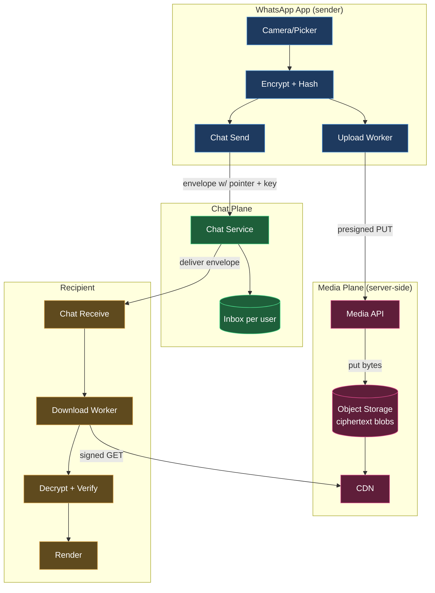
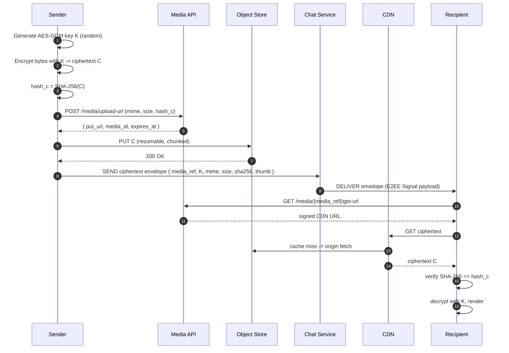
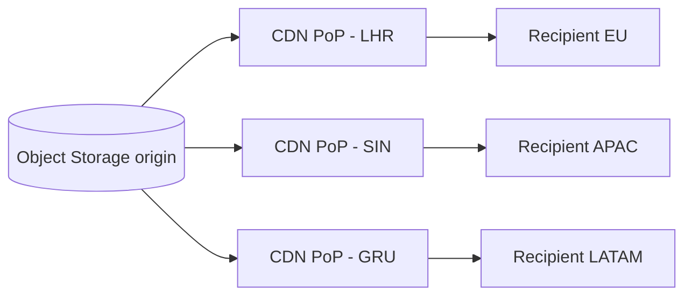

# WhatsApp Deep Dive — Media Handling

**Date:** 2026-04-27 | **Updated:** 2026-04-27
**Tags:** `system-design` `case-study` `whatsapp` `deep-dive` `media` `storage` `encryption`

## Table of Contents

- [Summary](#summary)
- [Overview — Why Media Is a Separate System](#overview--why-media-is-a-separate-system)
- [Media Flow at a Glance](#media-flow-at-a-glance)
- [Direct Upload to Object Storage](#direct-upload-to-object-storage)
- [End-to-End Encryption of Media](#end-to-end-encryption-of-media)
- [Chunking and Resumable Upload](#chunking-and-resumable-upload)
- [Thumbnails and Previews](#thumbnails-and-previews)
- [Compression and Transcoding — The E2E Tradeoff](#compression-and-transcoding--the-e2e-tradeoff)
- [Voice Notes — Opus, Bitrate, UX](#voice-notes--opus-bitrate-ux)
- [EXIF and Metadata Stripping](#exif-and-metadata-stripping)
- [Storage Tiering for Media](#storage-tiering-for-media)
- [CDN for Encrypted Blobs](#cdn-for-encrypted-blobs)
- [Auto-Download Policies](#auto-download-policies)
- [Forwarding and Content-Addressed Dedup](#forwarding-and-content-addressed-dedup)
- [Limits and Abuse — File Size, Type, Malware](#limits-and-abuse--file-size-type-malware)
- [Anti-Patterns](#anti-patterns)
- [Related](#related)
- [References](#references)

## Summary

WhatsApp's media path is a deliberately **separate plane** from the chat path. The chat service routes small encrypted envelopes; the media plane carries opaque ciphertext blobs through object storage and a CDN, never through chat servers. Three properties drive the entire design: **clients encrypt before upload** (server stores bytes it cannot decrypt), **clients upload directly to object storage via presigned URLs** (chat-app servers are never on the byte path), and the chat envelope only ships a **`{media_ref, key, mime, size, sha256}` pointer** to the recipient. Everything else — chunked uploads, thumbnails, compression, voice codecs, EXIF stripping, dedup, tiering, auto-download policies — is a consequence of these three rules, plus the practical reality that mobile networks drop, devices store gigabytes of conversation history, and bad actors will ship CSAM, malware, and copyright violations through any pipe you build.

The two hard constraints in tension throughout: **E2E encryption forbids the server from inspecting payloads**, while **operators still need cost control, abuse handling, and legal compliance**. WhatsApp keeps E2EE; Telegram chooses server-side transcoding for "cloud chats" and gives up E2EE for those. This doc walks the WhatsApp tradeoffs with specifics.

## Overview — Why Media Is a Separate System

A naive design would let users send images through the chat WebSocket, with the chat service forwarding bytes to the recipient's socket. That model breaks at every dimension that matters at WhatsApp scale.

| Concern | Why chat plane fails | Media plane solution |
|---|---|---|
| **Bandwidth** | A 50 MB video × N recipients × M devices saturates chat fleets. | Upload once to object storage; recipients pull from CDN. |
| **Latency** | Big payloads block small chat messages on the same socket. | Out-of-band media; chat envelope is bytes-of-pointer-only. |
| **Resumability** | WebSocket drops after 30 s mean restart from byte 0. | TUS / S3 multipart, byte-range resume. |
| **Caching** | Per-conversation chat sockets are user-specific; no fan-out cache. | CDN absorbs the read fan-out for popular forwards. |
| **Server liability** | Plaintext through chat = lawful intercept exposure. | Ciphertext only; key never on server. |
| **Cost** | Egress through app servers = expensive 9-figures bandwidth bill. | Egress is from CDN/object store with negotiated rates. |

The architectural rule: **the chat service is the routing plane for small ordered envelopes; the media plane is a stateless byte pipe with object storage at the back**. They share the user's identity (auth tokens issued to the chat session can mint media URLs) but nothing else.



## Media Flow at a Glance

The end-to-end happy path for a photo send. Every step is intentional; we'll unpack each below.



Notes on the flow:

- **The decryption key never leaves the chat envelope.** It rides inside the Signal-protocol ciphertext that the chat service merely routes. The media API does not see `K`.
- **The hash is committed before upload.** The sender's envelope binds `sha256(ciphertext)` so the recipient can detect any mid-path tampering before decrypting.
- **Two unrelated authorisations.** The sender's IAM-equivalent token mints `put_url`. The recipient's session mints `get-url`. Neither token grants both directions for the same blob.
- **Thumbnails are inline.** A small (sub-10 KB) preprocessed thumbnail is encrypted and embedded directly in the chat envelope so the message renders even before the full media downloads.

## Direct Upload to Object Storage

Bytes never transit the chat service. The media-upload server's only job is to **mint a presigned PUT URL**, record the row in the metadata DB, and step out of the way.

Why this matters at WhatsApp scale (rough order of magnitude — public talks suggest tens of billions of media items per day):

- A WhatsApp chat fleet sized for millions of small envelopes per second is **not** sized to proxy a 16 MB photo per user per hour. The request rate is fine, but the bandwidth is 4–5 orders of magnitude too high.
- A presigned URL externalises the upload to S3-class infrastructure, which is already engineered to absorb planet-scale ingest and egress.
- The chat fleet stays **stateless on the byte path** — a conscious decoupling that lets WhatsApp scale the chat service and media service independently.

See [object-and-blob-storage.md](../../../building-blocks/object-and-blob-storage.md) for the building-block view of presigned URLs. For WhatsApp-style usage, the relevant security posture:

- **Method-pinned**: PUT only; no LIST, no DELETE.
- **Key-pinned**: server picks the key under a tenant-scoped prefix; client cannot overwrite a sibling.
- **Type/size-pinned**: `Content-Type` and `Content-Length` are bound at signing.
- **Short expiry**: minutes, not days. Mobile clients refresh if they need to retry beyond expiry.
- **Logged**: every issuance has an audit row tying `media_id` to the requesting account/device.

```ts
// TypeScript — issuing a presigned PUT for a WhatsApp-style media upload.
import { S3Client, PutObjectCommand } from "@aws-sdk/client-s3";
import { getSignedUrl } from "@aws-sdk/s3-request-presigner";
import { randomUUID } from "node:crypto";

const s3 = new S3Client({ region: "us-east-1" });

interface UploadIntent {
  accountId: string;
  deviceId: string;
  mime: string;          // e.g. "application/octet-stream" — WhatsApp ships ciphertext as opaque bytes
  cipherSize: number;    // bytes after client-side encryption
  contentSha256: string; // hex of SHA-256(ciphertext) — bound for tamper detection
}

export async function presignMediaPut(intent: UploadIntent) {
  if (intent.cipherSize > 100 * 1024 * 1024) {
    throw new Error("use multipart/TUS path for >100 MiB");
  }
  const mediaId = randomUUID();
  const key = `media/${intent.accountId}/${mediaId}`;

  const cmd = new PutObjectCommand({
    Bucket: "wa-media-prod",
    Key: key,
    ContentType: "application/octet-stream",
    ContentLength: intent.cipherSize,
    ChecksumSHA256: intent.contentSha256, // S3 verifies the body matches at PUT time
    Metadata: {
      "wa-account": intent.accountId,
      "wa-device": intent.deviceId,
      "wa-media-id": mediaId,
    },
  });

  const url = await getSignedUrl(s3, cmd, { expiresIn: 300 });
  return { url, mediaId, key, expiresAt: Date.now() + 300_000 };
}
```

The pattern generalises: S3, GCS, Azure Blob, R2, MinIO, B2 all support presigned URLs with similar semantics. WhatsApp's actual storage is not public, but operates the same shape.

## End-to-End Encryption of Media

This is the design's load-bearing rule. The server stores **ciphertext blobs it cannot decrypt**.

### Per-blob random key

For each media item the sending client generates a fresh symmetric key (typically AES-256 with GCM or CBC-HMAC). The plaintext is encrypted before it leaves the device. The server only ever sees:

- The ciphertext (length = plaintext length, plus auth tag and IV).
- A SHA-256 of the ciphertext (bound by the upload contract, used for integrity).

The decryption key `K` and the IV travel inside the **Signal-protocol message envelope** — see [end-to-end-encryption.md](end-to-end-encryption.md) for the X3DH + Double Ratchet that protects the envelope itself. The chat server stores and forwards opaque envelopes; it cannot read `K`.

WhatsApp's published security white paper documents AES-256 in CBC mode with HMAC-SHA-256 for integrity over media; modern designs would use AES-GCM (AEAD) or ChaCha20-Poly1305 for the same thing in one pass. The principle is identical: **authenticated encryption, key never on server**.

### Why the server can still operate

Even without keys, the server can:

- **Charge** for storage by counting bytes per account.
- **Tier** to colder classes by age.
- **Cache** ciphertext at the CDN — bytes are bytes.
- **Detect tampering** at fetch time via the committed SHA-256.
- **Limit abuse** by file size, file count, account behaviour, and (for forwarded media) cleartext content-addressed dedup of *ciphertext* keyed by the sender's session.

What it cannot do:

- See the photo. Run face detection. Extract EXIF. Apply a watermark. Generate a server-side thumbnail. Apply a CSAM scanner that looks at pixels (Apple's NeuralHash approach proposed scanning before encryption, on-device, and was withdrawn).

This is the deliberate cost of E2EE — and the reason every safety-related operation in the WhatsApp pipeline runs on the **client** before encryption (thumbnail, compression, EXIF stripping) or on **metadata** (size, type, frequency, reports) on the server.

### Client-side AES-GCM (sketch)

```js
// Browser/JS — client-side AES-GCM encrypt before upload.
// (In production WhatsApp clients this happens in native code per-platform;
// the shape is identical: random key, fresh IV, AEAD, ship key in chat envelope.)

async function encryptMedia(plaintext /* Uint8Array */) {
  const key = await crypto.subtle.generateKey(
    { name: "AES-GCM", length: 256 },
    /* extractable */ true,
    ["encrypt", "decrypt"],
  );
  const iv = crypto.getRandomValues(new Uint8Array(12));

  const ciphertext = new Uint8Array(
    await crypto.subtle.encrypt(
      { name: "AES-GCM", iv, additionalData: new TextEncoder().encode("wa-media-v1") },
      key,
      plaintext,
    ),
  );

  // Export the raw key bytes — they will be wrapped in the Signal envelope.
  const rawKey = new Uint8Array(await crypto.subtle.exportKey("raw", key));

  // Hash the ciphertext for the upload contract and tamper detection.
  const sha256 = new Uint8Array(await crypto.subtle.digest("SHA-256", ciphertext));

  return { ciphertext, iv, rawKey, sha256 };
}
```

The matching decrypt at the recipient verifies the SHA-256 against the value committed in the envelope **before** attempting AEAD decryption — fail fast on tampered blobs and avoid wasting CPU on a doomed AEAD verify.

## Chunking and Resumable Upload

Mobile uploads die. Cell handover, walking into a tunnel, an LTE-to-Wi-Fi handoff, app suspension on a phone call — any of these will break a multi-megabyte HTTP PUT mid-flight. A 25 MB upload that has to restart from byte 0 every time is unusable.

Two reasonable mechanisms exist:

### S3 Multipart Upload

The S3 API breaks an object into 5 MiB – 5 GiB parts (up to 10,000 parts → 5 TiB max). Phases: `CreateMultipartUpload` → `UploadPart` × N → `CompleteMultipartUpload`. On disconnect, `ListParts` reports what made it; client re-uploads only the missing parts. See [object-and-blob-storage.md](../../../building-blocks/object-and-blob-storage.md#multipart-upload--chunking-parallelism-resumability) for protocol detail.

### TUS — Resumable Upload over HTTP

The [TUS protocol](https://tus.io/) is a small, language-neutral standard for resumable uploads built on PATCH with an `Upload-Offset` header. The client `HEAD`s the upload to discover the byte the server already has, then `PATCH`es from that offset. Servers and clients exist in every popular language.

```http
# 1. Create the upload
POST /files HTTP/1.1
Tus-Resumable: 1.0.0
Upload-Length: 26214400
Upload-Metadata: filename d2EtY2lwaGVydGV4dA==
                                    -> "wa-ciphertext"

# 2. Server responds with the upload URL
HTTP/1.1 201 Created
Location: /files/8f9c4a...
Tus-Resumable: 1.0.0

# 3. Client streams chunks
PATCH /files/8f9c4a... HTTP/1.1
Tus-Resumable: 1.0.0
Upload-Offset: 0
Content-Type: application/offset+octet-stream
Content-Length: 5242880
<5 MiB of ciphertext>

# 4. After a drop, client asks "where were we?"
HEAD /files/8f9c4a... HTTP/1.1
Tus-Resumable: 1.0.0

HTTP/1.1 200 OK
Upload-Offset: 10485760
Upload-Length: 26214400

# 5. Resume from byte 10485760 with the next PATCH.
```

What WhatsApp actually uses publicly isn't disclosed, but the operational shape is the same as TUS or S3-multipart: **byte-range resumable uploads with idempotent retries**. Every chunk includes its content range, the server tracks how much it has, and the client retries only what is missing.

```js
// Pseudocode — TUS-style resumable upload from a flaky mobile client.
async function tusUpload(ciphertext, endpoint) {
  const totalSize = ciphertext.byteLength;
  const chunkSize = 5 * 1024 * 1024;

  // (1) Create the upload — server returns a Location.
  const createRes = await fetch(endpoint, {
    method: "POST",
    headers: {
      "Tus-Resumable": "1.0.0",
      "Upload-Length": String(totalSize),
    },
  });
  const uploadUrl = createRes.headers.get("Location");

  let offset = 0;

  while (offset < totalSize) {
    try {
      // (2) Where does the server think we are?
      const head = await fetch(uploadUrl, {
        method: "HEAD",
        headers: { "Tus-Resumable": "1.0.0" },
      });
      offset = Number(head.headers.get("Upload-Offset"));

      // (3) Send the next chunk.
      const end = Math.min(offset + chunkSize, totalSize);
      const slice = ciphertext.slice(offset, end);

      const patch = await fetch(uploadUrl, {
        method: "PATCH",
        headers: {
          "Tus-Resumable": "1.0.0",
          "Upload-Offset": String(offset),
          "Content-Type": "application/offset+octet-stream",
          "Content-Length": String(slice.byteLength),
        },
        body: slice,
      });
      if (!patch.ok) throw new Error(`PATCH ${patch.status}`);
      offset = end;
    } catch (err) {
      // (4) Exponential backoff with jitter; the next loop iteration re-queries HEAD.
      await sleep(jitteredBackoff(offset));
    }
  }
}
```

Operational hygiene:

- **Abort incomplete uploads.** A lifecycle rule cleans up half-finished blobs after N days; otherwise they accumulate as dark cost. (See [object-and-blob-storage.md](../../../building-blocks/object-and-blob-storage.md#multipart-upload--chunking-parallelism-resumability).)
- **Cap concurrent parts.** A mobile client uploading 16 parts in parallel will saturate the user's uplink and increase failure rate. 2–4 in flight is usually right.
- **Verify the assembled hash.** After completion, the server should verify the assembled blob's SHA-256 matches what the client committed pre-upload. WhatsApp specifically commits the ciphertext hash in the chat envelope so the recipient can verify too.

## Thumbnails and Previews

The recipient should see *something* before the full image arrives. Three layered tiers exist in any mature messaging client.

| Tier | Size | Where it lives | When it shows |
|---|---|---|---|
| **Inline blurhash / placeholder** | 20–50 bytes (a hash that decodes to a tiny gradient image) | In the chat envelope itself | Instant on render |
| **Encrypted thumbnail blob** | 4–20 KB JPEG or WebP | Embedded in the envelope or as a sibling small blob | Immediately after envelope decrypts |
| **Full media** | up to file-size cap | Object storage, fetched lazily | After auto-download policy decides |

Critical constraint: **the server cannot generate a thumbnail because it cannot decrypt the original**. WhatsApp's solution is straightforward — **the sending client generates the thumbnail before encryption**, encrypts it (with the same key or a sibling key), and embeds it in the chat envelope. The recipient renders the thumbnail the moment the envelope arrives, and downloads the full media in the background.

```js
// Rough sketch — sender side.
async function buildEnvelope(plaintextImage) {
  // Decode, downscale to a thumbnail, JPEG-encode at low quality.
  const thumb = await downscaleAndEncode(plaintextImage, {
    maxDim: 200,
    quality: 50,
  });

  const fullKey = generateAesKey();
  const fullCiphertext = aesGcmEncrypt(plaintextImage, fullKey);
  const thumbCiphertext = aesGcmEncrypt(thumb, fullKey);

  return {
    media_ref: await uploadToObjectStore(fullCiphertext),
    key: fullKey,                       // wrapped in Signal envelope
    sha256: sha256(fullCiphertext),
    mime: "image/jpeg",
    size: fullCiphertext.byteLength,
    thumb_inline: thumbCiphertext,      // ≤ ~20 KB, ships with the envelope
    blurhash: blurhashEncode(plaintextImage), // optional, for instant placeholder
  };
}
```

For video, the same pattern applies — the sender generates a poster frame (often the first I-frame), thumbnail-sizes it, encrypts, and embeds. Some clients also embed a 1–2 second pre-roll loop for richer previews.

The blurhash trick (or its newer thumbhash variant) is worth calling out: it produces a compact base-encoded string that decodes to a smooth blurred placeholder, which fits inside the small E2E envelope without a separate fetch. The visual hierarchy is **blurhash → encrypted thumb → full media**, each step a perceptual upgrade.

## Compression and Transcoding — The E2E Tradeoff

Server-side video transcoding is the cleanest counter-example to E2EE. To re-encode H.264 → H.265 to cut bandwidth, the server must read the pixels — which it cannot do on a ciphertext blob.

WhatsApp's resolution: **all compression and transcoding happens on the sending client, before encryption**. Concretely:

- **Image**: downscale to a sane upper dimension (e.g. 1600 px on the long edge), JPEG-encode at quality 70–80, strip EXIF (see below), output ~200–500 KB for a typical photo.
- **Video**: re-encode to H.264 baseline or H.265 in a small profile, target ~1 Mbit/s for ≤ 720p, container in MP4 with `+faststart` so the moov atom lives at the start (cheap progressive playback).
- **Voice**: encode to Opus at 16–24 kbit/s mono (see next section).

The cost of doing this client-side:

- **CPU and battery** on the sender's device, especially on low-end Android. WhatsApp uses platform-native encoders (MediaCodec on Android, VideoToolbox on iOS) for hardware acceleration.
- **No re-quality for new clients.** If a 2018 phone uploads a 480p H.264 file, recipients in 2026 can't get a re-encoded HEVC version because nobody has the plaintext anymore.
- **No adaptive bitrate / HLS / DASH.** Server-side ABR requires multiple renditions, which require server-side transcoding, which requires plaintext. WhatsApp ships a single rendition.

### How Telegram trades it differently

Telegram has two chat modes:

- **Cloud chats (default).** Server-side encryption at rest, server has plaintext access. Telegram **transcodes server-side** — videos are re-encoded into multiple resolutions, animated stickers are converted, voice notes are transcoded into a streaming-friendly format. The price is that Telegram's servers can read the content. (Telegram describes this as MTProto with server-side keys.)
- **Secret chats (opt-in, per-device).** End-to-end encrypted via MTProto's E2E mode. **No transcoding**, single device, no cloud history.

WhatsApp chose E2EE-everywhere and accepted single-rendition compression. Telegram chose feature richness in cloud chats and accepted the metadata exposure. Signal made the same choice as WhatsApp and is even more conservative on metadata.

```bash
# Reference — what server-side transcoding looks like *if* you don't have E2EE.
# WhatsApp does NOT do this on the server. Telegram cloud chats (and YouTube, etc.) do.
# Run by the sender's client in the WhatsApp model.

ffmpeg -i input.mov \
  -c:v libx264 -preset medium -crf 23 \
  -profile:v baseline -level 3.1 \
  -pix_fmt yuv420p \
  -vf "scale=w=min(iw\,1280):h=-2" \
  -c:a aac -b:a 96k \
  -movflags +faststart \
  output.mp4
```

### Heuristics for client-side compression

- **Don't re-encode if the source is already small.** A 200 KB JPEG should pass through with EXIF stripped, not re-encoded (which costs quality).
- **Cap dimensions.** Phone cameras shoot 12 MP+; nobody needs that on a 6-inch screen.
- **Honour the user's "send original" toggle.** WhatsApp lets you send "original quality" by attaching as a document — bypasses lossy compression at the cost of size.
- **Watch HEIC.** iOS shoots HEIC by default; many recipients can't render it. Convert to JPEG on send.

## Voice Notes — Opus, Bitrate, UX

Voice messages are the most-used media type in WhatsApp by raw count. They have a tight latency budget (record-to-listenable) and an even tighter size budget (people send dozens per day on metered data).

### Codec — Opus

Voice notes are encoded with the [Opus codec (RFC 6716)](https://datatracker.ietf.org/doc/html/rfc6716). Opus is the right answer for chat voice for several reasons:

- **Bitrate range**: 6 to 510 kbit/s; voice notes typically run 16–24 kbit/s, mono, narrowband or wideband (8 / 16 kHz sample rate).
- **Modes**: SILK for speech, CELT for music, hybrid mode for transitions. For voice notes, SILK with WB or SWB is the sweet spot.
- **Latency**: 5–60 ms frame size; sub-second end-to-end is achievable.
- **Royalty-free, open standard**, with reference encoder/decoder maintained by Xiph.

A 30-second voice note at 24 kbit/s is ~90 KB — small enough to ship eagerly even on mobile data. The file itself is wrapped in an Ogg container (`.ogg`) or sometimes a small custom format.

### Push-to-talk UX

Independent of the codec, WhatsApp's UX choice is **press-and-hold to record, release to send**. This compresses the workflow into a single gesture and pairs naturally with chunked upload — the client can start uploading the first chunk while the user is still speaking. By the time the user releases, the head of the audio is already in flight, and end-to-end latency drops to a fraction of a second.

This pipeline pattern (start uploading before recording ends) is the audio version of HTTP/2 pipelining or HLS low-latency mode. It only works because the encoder produces a stream of small packets that don't depend on the file's tail (Opus packets are independently decodable in a flight; the container can tolerate truncation).

### Waveform preview

WhatsApp shows a small waveform under each voice note. That waveform is computed **client-side** from the plaintext audio before encryption (peak amplitude per N samples, typically downsampled to 50–100 bars), then encoded into a small byte array embedded in the chat envelope alongside the media reference. Same E2EE-friendly pattern as the image thumbnail.

### Transcripts

Recently rolled-out voice-message transcription runs **on-device**, not on the server, for the same E2EE reason. The transcript is generated locally on the recipient's device using a small ASR model bundled with the app, and stays on the device unless the user shares it.

## EXIF and Metadata Stripping

A JPEG straight out of a phone camera carries EXIF tags that include — at minimum — camera model, timestamp, lens settings, and very often **GPS coordinates** of where the photo was taken. Sending it raw is a privacy disaster: a casual selfie can geolocate someone's home to a 10-meter radius.

WhatsApp strips EXIF on the client before encryption. The technique is simple — re-encode the image without copying the metadata block, or surgically remove the EXIF segment from the JPEG container.

```python
# Python — server-side EXIF strip example for reference.
# WhatsApp does this on the client; the principle is identical.

from PIL import Image, ImageOps

def strip_exif(input_path: str, output_path: str) -> None:
    """Re-save the image without any EXIF/IPTC/XMP metadata."""
    with Image.open(input_path) as im:
        # ImageOps.exif_transpose applies the orientation tag *before* we drop it,
        # so the saved image is correctly rotated even after EXIF removal.
        rotated = ImageOps.exif_transpose(im)
        clean = Image.new(rotated.mode, rotated.size)
        clean.putdata(list(rotated.getdata()))
        clean.save(
            output_path,
            format="JPEG",
            quality=85,
            optimize=True,
            # Critically: do NOT pass exif=... and do NOT preserve icc_profile/iptc/xmp.
        )

# The same technique generalises to PNG (strip ancillary chunks like tEXt, iTXt, eXIf)
# and HEIC/HEIF (strip the metadata items).
```

Common pitfalls:

- **Don't forget orientation.** EXIF carries a rotation flag; if you strip without applying, the image saves sideways. `ImageOps.exif_transpose` (or equivalent) bakes the rotation into the pixels first.
- **PNG has metadata too.** `tEXt`, `iTXt`, `eXIf`, `pHYs` chunks. Most encoders don't write them by default but tools that copy them around (resize tools especially) sometimes preserve them.
- **HEIC/HEIF**, **TIFF**, **WebP** all have their own metadata containers. Strip per-format.
- **Video metadata** is just as leaky — MP4 `udta` boxes, MOV atoms, GPS in the `©xyz` atom on iPhone recordings. WhatsApp re-muxes through its encoder and discards.
- **Document attachments are different.** When WhatsApp sends a PDF or DOCX as a document (not a media), it doesn't strip embedded metadata — the user is shipping the source file deliberately.

## Storage Tiering for Media

WhatsApp does not promise infinite history. The (publicly disclosed) policy is roughly:

- **Hot storage (S3 Standard equivalent)**: media that's still pending delivery to at least one recipient and hasn't aged past the inbox TTL.
- **Aged out / deleted**: once delivered to all participants and beyond a retention window, the ciphertext is removed from the server. The clients carry the source of truth thereafter.

The tiering rules in practice:

| State | Storage class | Typical retention |
|---|---|---|
| Just uploaded, awaiting first delivery | Hot (S3 Standard) | minutes–hours |
| Delivered to some, awaiting offline recipients | Hot | up to inbox TTL (e.g. 30 days) |
| Delivered to all participants | (often deleted) or cold (IA) for a short tail | days |
| Backups (encrypted, opt-in) | Different system entirely | per user backup setting |

This is wildly different from a photo-sharing service like Instagram, which keeps everything hot forever because the *server* is the authoritative copy. WhatsApp's authoritative copy is the **device**, and the server is a transient store-and-forward buffer for ciphertext.

For the building-block view of why hot/IA/Glacier matter and what they cost, see [object-and-blob-storage.md](../../../building-blocks/object-and-blob-storage.md#lifecycle-policies--hot-infrequent-cold-archive).

The implication for backups: WhatsApp's "Chat Backup to iCloud / Google Drive" is a **separate** system that the client uploads to the user's own cloud account. It is encrypted (since 2021) end-to-end with a user-held key, and lives outside WhatsApp's media plane entirely. WhatsApp servers do not store conversation history at rest the way a typical SaaS does.

## CDN for Encrypted Blobs

The CDN's job is read fan-out. A photo forwarded to a 256-person group fans out to 256 device-recipients (and more, with multi-device). All of them want the same ciphertext blob. If they all hit the origin object store, you've serialised the world's biggest broadcast through one bucket.

The trick: **encrypted blobs cache fine**. From the CDN's point of view, the bytes are opaque and immutable — perfect cache keys. The CDN doesn't need to understand what's inside.



Operational properties:

- **Geo-distribution.** PoPs in user regions cut RTT from cross-continent to single-digit milliseconds for the TLS handshake and tens of ms for first byte.
- **Hot-content amortisation.** A viral forward (a news clip, a meme) hits the origin once per PoP, then serves from cache thereafter. Without the CDN, the same blob would be fetched once per recipient.
- **Signed URLs at the edge.** The CDN edge enforces signed-URL validation; expired URLs are rejected before hitting origin.
- **No content-aware caching.** The CDN can't apply image-resizing transforms, since the bytes are encrypted. Any "responsive image" behaviour has to happen on the client.
- **Cache key = full blob path.** No vary-on-content-type tricks — every variant is a distinct key.

WhatsApp publicly operates its own CDN (not just AWS CloudFront) — Meta's edge network sits in front of the media plane for the reasons above. For the building-block view of CDNs, see [cdn-and-edge.md](../../../../networking/infrastructure/cdn-and-edge.md) (referenced from [object-and-blob-storage.md](../../../building-blocks/object-and-blob-storage.md#related)).

## Auto-Download Policies

Mobile data is metered, expensive, and slow on the wrong network. The auto-download settings are a **client-side governance layer** sitting between the chat envelope and the media plane.

The matrix is roughly:

|  | Wi-Fi | Mobile data | Roaming |
|---|---|---|---|
| Photos | usually on | usually on | usually off |
| Audio | usually on | varies | usually off |
| Videos | usually off | off | off |
| Documents | usually off | off | off |

Each cell is user-configurable. Some clients allow **per-conversation overrides** — auto-download from your spouse but not from the meme group.

What this looks like in code: the chat client receives an envelope, decrypts it, sees the media reference + thumbnail, **renders the thumbnail immediately**, and only triggers the GET on the full media if the policy approves. If the user later taps the thumbnail, the download starts on demand.

```ts
// Pseudocode — client-side decision after envelope decrypt.
function shouldAutoDownload(media, ctx) {
  const policy = ctx.user.autoDownloadPolicy[media.kind]; // 'wifi' | 'cellular' | 'never'
  const network = ctx.network.kind;  // 'wifi' | 'cellular'
  const conversationOverride = ctx.user.autoDownloadOverride[ctx.conversationId];

  if (conversationOverride === "always") return true;
  if (conversationOverride === "never") return false;

  if (policy === "never") return false;
  if (policy === "wifi" && network !== "wifi") return false;
  if (policy === "cellular" && network !== "cellular" && network !== "wifi") return false;

  if (media.size > ctx.user.autoDownloadSizeCap) return false;
  if (ctx.network.roaming) return false;

  return true;
}
```

The deeper design point: **the chat plane is fully eager (small envelopes, always delivered), the media plane is lazy (large blobs, fetched on demand)**. The same architectural split that lets you scale the two planes independently is what gives the user fine-grained data control.

## Forwarding and Content-Addressed Dedup

A 30 MB video forwarded into 500 group chats should not reupload 500 times. Two related ideas address this.

### Fast forwarding via media reference

When a user forwards a media message, the client can ship the same envelope (with a fresh per-recipient Signal layer) that points at the **same `media_ref`**. The blob in object storage is reused. No re-upload, no re-encrypt of the body.

This works because every recipient already gets the decryption key in their envelope (encrypted to *their* Signal session), and the blob's identity is whatever the sender uploaded the first time. The chat-app server sees a new envelope referencing an existing blob — identical to a fresh send from the storage's perspective, but no body bytes flow.

The key property: the **decryption key for the blob is unchanged across forwards** (within the chain of forwards from a single original encryption). The Signal envelope wrapping it is fresh per recipient, so each recipient's copy of the key is unique on the wire.

### Content-addressed dedup of ciphertext

A complementary trick at the storage layer: the object's key is the SHA-256 of its ciphertext (`media/sha256:abcd...`). If two senders independently encrypt and upload identical ciphertext (rare — the random per-blob key makes this near-impossible in practice), the storage service deduplicates.

In WhatsApp's E2EE model, **identical plaintext does not produce identical ciphertext** because each upload uses a fresh key. So content-addressed dedup is only useful when the *exact same* upload is referenced again (the forwarding case above) — not as a cross-user dedup.

### "Forwarded" labels and frequency limits

Massively-forwarded media gets a "forwarded many times" badge — calculated client-side based on a forward counter that travels with the envelope (capped at a small number to bound metadata leakage). Beyond N forwards, WhatsApp also restricts further forwards to one chat at a time, slowing viral spread of misinformation. This is purely envelope metadata, not content inspection.

## Limits and Abuse — File Size, Type, Malware

E2EE restricts what the server can do about abuse. The remaining levers are blunt but real.

### File size cap

WhatsApp publicly enforces a **2 GB per file** cap (raised from 100 MB in 2022). The cap is enforced at multiple layers:

- **Client UI** refuses to attach files above the cap.
- **Media API** rejects presigned URLs above the cap (`ContentLength` is bound at signing time).
- **Object storage policy** rejects PUTs above the cap server-side as a defence in depth.

The cap is a tradeoff between user expectation (people want to send raw 4K video) and abuse cost (every uploaded byte is server-paid storage and egress).

### File-type allowlist

WhatsApp accepts a defined set of MIME types per category (image, video, audio, document). Document upload accepts a wide list (PDF, Office, common archives). Executable types (`.exe`, `.scr`, etc.) are blocked at the client UI.

The allowlist is **not security**; it's a usability and abuse-shape filter. Real malware ships as PDFs, Office docs with macros, or innocent-looking ZIPs. The allowlist just cuts off the laziest variants.

### Malware scanning under E2EE

Server-side malware scanning of payload bytes is **incompatible with E2EE**. The server holds ciphertext; ClamAV cannot scan ciphertext.

The defences that remain:

- **Client-side scanning** on the recipient's device (limited by device CPU and battery).
- **Hashing of *unencrypted* file metadata** like MIME type, file extension, file size — useful only as weak signals.
- **Reputation systems on the sender** — accounts that send abusive content get reported, banned, and rate-limited. The signal is "this account has been reported N times in the last hour", not "this content is malicious".
- **User reports.** Reporting a message ships the reported message + a few-message context to WhatsApp. This is *not* a backdoor — the user voluntarily exfiltrates content they already had access to. It's the sole channel by which WhatsApp can do post-hoc moderation under E2EE.

The deliberate tradeoff: WhatsApp accepts that some abuse is undetectable in transit, in exchange for the much larger user benefit of E2EE. Telegram's cloud chats and Slack/Teams don't have this problem because they're not E2EE — but they *do* have a server-side honeypot of every conversation.

### Rate limiting

The chat plane and media plane both rate-limit per account/device:

- Uploads per minute, per hour, per day.
- Total upload bytes per day.
- Forward count per message.
- Group sends per minute (separate from media specifically).

These limits are tuned to not bother regular users while catching mass-spam patterns. A hand-tuned "report+rate-limit" loop is much of WhatsApp's anti-abuse posture under E2EE.

## Anti-Patterns

| Anti-pattern | Why it hurts | Fix |
|---|---|---|
| **Proxying media bytes through chat servers** | Saturates the chat fleet's bandwidth, couples two scaling axes, kills the latency budget for chat envelopes. | Presigned URLs to object storage; chat plane stays envelope-only. |
| **Server-side transcoding under "E2EE"** | If the server can read pixels, it isn't E2EE. Either drop the marketing claim or move transcoding to the client. | Compress on the sender; accept single-rendition; document it honestly. |
| **Server-generated thumbnails for E2E media** | Server can't decrypt; either you weakened the encryption or the thumbnail is a guess. | Sender generates thumbnail before encryption; ship inline in the envelope. |
| **Skipping EXIF strip** | A casual selfie geolocates the user's home. | Client-side strip of EXIF/XMP/IPTC and equivalent video metadata before encryption. |
| **Forwarding by re-uploading bytes** | A viral forward becomes N parallel uploads instead of N envelopes referencing one blob. | Forward by media_ref; reuse the existing blob; rewrap the key in fresh per-recipient envelopes. |
| **Caching plaintext at the CDN** | Either E2EE is broken or the CDN holds keys it shouldn't. | Cache ciphertext only; let the CDN treat blobs as opaque. |
| **No abort-incomplete-upload lifecycle rule** | Half-finished mobile uploads accumulate forever as billable dark storage. | Lifecycle rule aborting incomplete uploads after 24–72 hours. |
| **Eager auto-download of all videos on cellular** | Burns user's data plan; users uninstall. | Default conservative policy (Wi-Fi only for video); per-conversation override. |
| **Using a single "media" prefix in object storage** | Hot prefix throttles. | Tenant- and time-partitioned keys; see [object-and-blob-storage.md](../../../building-blocks/object-and-blob-storage.md#throughput-and-hot-partitions). |
| **Trying to hash-scan for CSAM/malware on ciphertext** | Mathematically impossible. Suggesting it leaks misunderstanding of E2EE. | On-device classifiers; sender-reputation; user reports; legal channels. |
| **Storing the per-blob decryption key on the server** | Trivially defeats E2EE. | Key lives only in the chat envelope, encrypted to recipient's Signal session. |
| **Letting `media_ref` be a guessable monotonic ID** | Enables enumeration. | UUIDv4 or hash-based opaque IDs; presigned-URL tokens scoped per fetch. |
| **Forgetting to verify the committed SHA-256 on download** | Tampered or substituted blobs decrypt to garbage and crash the renderer. | Verify hash before AEAD decrypt; fail fast with a clear UI state. |

## Related

- [WhatsApp HLD — Design Doc](../design-whatsapp.md) — parent case study; this doc expands the Media Handling section.
- [WhatsApp Deep Dive — End-to-End Encryption](end-to-end-encryption.md) — Signal protocol details (sibling deep-dive).
- [WhatsApp Deep Dive — Group Chat Fanout](group-chat-fanout.md) — how forwards interact with the fanout layer.
- [WhatsApp Deep Dive — Offline Delivery and Push](offline-delivery-and-push.md) — how recipients see media after long offline periods.
- [Object and Blob Storage — S3-Style Systems, Chunking, Presigned URLs](../../../building-blocks/object-and-blob-storage.md) — building-block reference for everything the media plane runs on.
- [Encryption at Rest and in Transit](../../../security/encryption-at-rest-and-in-transit.md) — how the at-rest story differs when the server holds the key vs not.

## References

- [WhatsApp Encryption Overview — Technical White Paper](https://www.whatsapp.com/security) — official WhatsApp/Meta description of the Signal-protocol implementation, including the media-encryption section (random key, AES + HMAC, key in envelope).
- [Signal Protocol Documentation — Specifications](https://signal.org/docs/) — X3DH and Double Ratchet specs that protect the chat envelope (and therefore the media key).
- [TUS — Resumable Upload Protocol (1.0.0)](https://tus.io/protocols/resumable-upload) — open standard for HTTP-based resumable uploads, the conceptual cousin of S3 multipart.
- [Amazon S3 Multipart Upload Overview](https://docs.aws.amazon.com/AmazonS3/latest/userguide/mpuoverview.html) — part sizes, limits, lifecycle, abort behaviour for the chunked-upload pattern.
- [Amazon S3 — Using Presigned URLs](https://docs.aws.amazon.com/AmazonS3/latest/userguide/using-presigned-url.html) — signing process, scoping, security considerations.
- [RFC 6716 — Definition of the Opus Audio Codec](https://datatracker.ietf.org/doc/html/rfc6716) — IETF standard underlying voice notes.
- [Exif Version 2.32 (CIPA DC-008-2019)](https://www.cipa.jp/std/documents/download_e.html?DC-008-Translation-2019-E) — the EXIF specification; lists every tag including GPS, useful for understanding the privacy risk.
- [Telegram MTProto — End-to-End Encryption (Secret Chats)](https://core.telegram.org/api/end-to-end) — primary source for Telegram's E2EE-only-in-secret-chats split, useful contrast with WhatsApp's E2EE-everywhere.
- [Meta Engineering — How WhatsApp enables multi-device capability (2021)](https://engineering.fb.com/2021/07/14/security/whatsapp-multi-device/) — Meta's own write-up; touches the per-device encryption story that media keys ride on.
