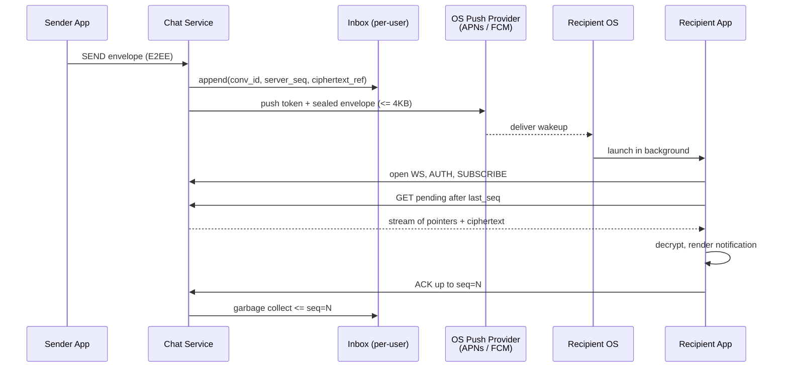
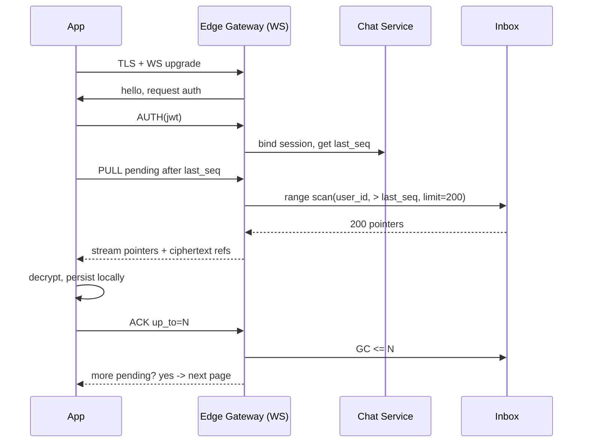

# WhatsApp Deep Dive — Offline Delivery and Push Notifications

**Date:** 2026-04-27 | **Updated:** 2026-04-27
**Tags:** `system-design` `case-study` `whatsapp` `deep-dive` `push` `offline`

## Table of Contents

- [Summary](#summary)
- [Overview](#overview)
- [Offline Mailbox per User](#offline-mailbox-per-user)
- [APNs — Apple Push Notification service](#apns--apple-push-notification-service)
- [FCM — Firebase Cloud Messaging](#fcm--firebase-cloud-messaging)
- [Quiet Hours and Do-Not-Disturb](#quiet-hours-and-do-not-disturb)
- [Reconnect Strategy](#reconnect-strategy)
- [Push as a Hint, Not a Message](#push-as-a-hint-not-a-message)
- [Battery and Bandwidth](#battery-and-bandwidth)
- [Notification Deduplication](#notification-deduplication)
- [Rate Limits and Throttling](#rate-limits-and-throttling)
- [Multi-Device Push](#multi-device-push)
- [VoIP Push](#voip-push)
- [E2E Encryption + Notifications](#e2e-encryption--notifications)
- [Anti-Patterns](#anti-patterns)
- [Related](#related)
- [References](#references)

## Summary

The parent case study summarises offline delivery in five lines: store-and-forward inbox, push wakes the app, app reconnects and drains. That summary hides nearly every operational decision worth making. This deep dive expands on what the **offline mailbox** actually is on disk, why **APNs and FCM are wakeup channels and not delivery channels** for an end-to-end encrypted product, how **VoIP push and CallKit** carve a different fast-path for incoming calls, and how **notification service extensions** let an E2EE client decrypt a sealed payload before the OS draws the banner. The unifying mental model: push is best-effort signalling on top of a durable inbox; the inbox is the source of truth and the connection is where actual content flows.

## Overview

Three time-separated facts have to line up cleanly:

1. **Sender online, recipient offline.** Sender's edge gateway accepts the envelope, persists it into the recipient's per-conversation inbox stream, and ACKs the sender. Recipient is unreachable on the persistent connection.
2. **Wakeup.** The chat service notices there is no live session for the recipient, hands an opaque "you have something" hint to the OS push provider (APNs for iOS, FCM for Android, sometimes both for desktop/web companion devices via web push).
3. **Reconnect and drain.** The OS wakes the app. The app opens (or reuses) its persistent connection, requests pending pointers from `last_seq + 1`, fetches and decrypts each envelope, ACKs, and updates `last_seq`. The server can then garbage-collect the inbox pointer.



The key insight is that **steps 1 and 3 are the durable path**. Step 2 — the push — is at-most-once, throttled by a third party, possibly silenced by the user or the OS, and may not arrive at all. WhatsApp tolerates that because the inbox is authoritative; the push is just there to shorten the time-to-reconnect.

For the broader real-time channel context (WebSocket vs SSE vs polling), see [`../../../communication/real-time-channels.md`](../../../communication/real-time-channels.md).

## Offline Mailbox per User

The "inbox" is a per-recipient durable queue of pointers, not a copy of message bytes. WhatsApp's design — like most large chat systems — separates **the message store** (immutable, conversation-keyed) from **the inbox stream** (per-user, pointer-only, garbage-collected aggressively).

### Shape of an inbox row

```text
inbox(user_id, server_seq) -> (conv_id, msg_seq, sender_id, kind, sealed_ref, ts)
```

- `user_id` — recipient. Inbox is sharded by this.
- `server_seq` — monotonically increasing per `user_id` only. This is what the client uses for "give me everything after N."
- `conv_id, msg_seq` — coordinates into the conversation-keyed message store.
- `sealed_ref` — for E2EE: handle to the small ciphertext blob, or inlined if tiny.
- `kind` — message, edit, delete, reaction, control.

Pointer rows are typically <200 bytes. Even a user offline a month with 50k messages waiting fits in low single-digit MB.

### Storage choice

Pick one with append-cheap, range-scan-cheap semantics keyed on `(user_id, server_seq)`:

- **Cassandra / ScyllaDB** with `PRIMARY KEY ((user_id), server_seq)`. Range scan from `server_seq > last_ack` is a single contiguous read.
- **DynamoDB** with `user_id` partition + `server_seq` sort. Same shape.
- **Custom log-structured store** (WhatsApp's heritage on Erlang/Mnesia) — same idea, hand-rolled.

Avoid relational stores for this hot path. The throughput is append-heavy and read-mostly-cold; B-tree index maintenance under that workload is wasted IO.

### Retention policy

WhatsApp documents a ~30-day retention for undelivered messages on its servers. Past that, the inbox pointer is dropped. Practical reasons:

- **Liability and storage cost.** Holding ciphertext indefinitely for users who never come back is a permanent linear cost.
- **Key rotation.** After enough time, the recipient's identity keys may have rotated. Sender's original ciphertext becomes undecryptable anyway.
- **Privacy.** Promising "30 days then gone" is a clearer story than "until we feel like it."

What happens at expiry:

1. A background sweeper reads pointers older than retention TTL.
2. For each, it deletes the inbox row and decrements a refcount on the underlying ciphertext blob in the message store.
3. If refcount hits zero (sender already cleaned up or no other recipient holds it), the blob is also deleted.
4. The recipient, when it eventually reconnects, simply does not see those messages. There is no "you missed N messages" indicator — that would leak metadata.

Group messages with N recipients use refcount-style fanout: one ciphertext blob (or one envelope per recipient if per-recipient encryption is required, as in Signal Protocol's pairwise sessions), N inbox pointers.

## APNs — Apple Push Notification service

APNs is Apple's push gateway. Every iOS/macOS/watchOS app that wants to receive pushes registers with APNs at startup, gets a **device token**, and sends that token to its app server. The app server then POSTs payloads to APNs over **HTTP/2** (the legacy binary protocol is deprecated). APNs delivers to the device when it can.

### Token registration flow

```text
App launches
  -> requests notification authorization (alert, sound, badge, critical)
  -> calls registerForRemoteNotifications
OS contacts APNs over its always-on push connection
  -> returns deviceToken (opaque, ~32–100 bytes)
App reports deviceToken + app version + locale to chat service
Chat service stores: (user_id, device_id, apns_token, env=prod|sandbox)
```

Tokens are **per-device, per-app, per-environment** (sandbox vs production differ). They rotate when the user reinstalls, restores from backup, or the OS regenerates them. The server must handle "token invalid" responses (HTTP 410) by removing the stale entry to avoid wasted requests.

### Payload size limits

- **Regular notifications:** 4 KB max payload.
- **VoIP pushes (PushKit):** 5 KB max payload.
- **Notification service extension–mutated payloads:** still 4 KB on the wire from server; the extension can fetch more bytes after wakeup.

The 4 KB ceiling is precisely what forces "push is a hint." For a 50-message group blast you cannot inline content — you fit a single sealed envelope (or just an ID) and let the client pull from the inbox.

### Priority levels

| `apns-priority` | Meaning | Battery impact |
|---|---|---|
| **10** | Send immediately. Wakes the device, delivers now. | High — wakes radio, may show alert. |
| **5** | Send considering power. Coalesce with other traffic, may delay during Low Power Mode. | Low — appropriate for silent updates. |
| **1** | Prioritize device power over delivery (newer header `apns-priority: 1`, used with background pushes). | Lowest. |

Use 10 for user-visible message banners. Use 5 for silent content-available pushes meant to refresh state without UI.

### Silent push for "fetch & display"

A silent push has `content-available: 1` in the `aps` dict and no `alert`/`sound`/`badge`. It wakes the app in the background for ~30s wall time, no visible UI. WhatsApp uses it sparingly — Apple budgets these (currently roughly 2–3 per hour per app, throttled by iOS heuristics) and silently drops excess. Overusing silent push gets your app classified as a "background hog" and pushes get deprioritised system-wide.

The pattern WhatsApp uses for E2EE is closer to **mutable-content** notifications: a visible push that the OS hands to a Notification Service Extension *before* drawing the banner, so the extension can decrypt and rewrite the title/body. See [E2E Encryption + Notifications](#e2e-encryption--notifications).

### Example payload

```json
{
  "aps": {
    "alert": {
      "title": "New message",
      "body": "Encrypted message"
    },
    "sound": "default",
    "badge": 1,
    "mutable-content": 1,
    "thread-id": "conv_8f1d2a"
  },
  "wa": {
    "msg_id": "01HXY7K9N4P0G3F2",
    "conv_id": "conv_8f1d2a",
    "sender": "u_4422",
    "sealed": "BASE64(ciphertext_envelope_for_pre_decrypt)",
    "ts": 1714232400123
  }
}
```

- `mutable-content: 1` triggers the Notification Service Extension on the device.
- `thread-id` lets iOS group all notifications from the same conversation under one stack.
- `wa.sealed` is a small ciphertext the extension can decrypt locally to produce a human-readable title/body without the server ever seeing plaintext.

Sent over HTTP/2 to `api.push.apple.com:443`:

```text
:method = POST
:path = /3/device/<deviceToken>
authorization = bearer <signed-jwt>
apns-topic = net.whatsapp.WhatsApp
apns-push-type = alert
apns-priority = 10
apns-expiration = 0          # let APNs decide; or unix-ts to expire
apns-collapse-id = msg_8f1d2a  # coalesce duplicates
apns-id = <uuid for traceability>
```

## FCM — Firebase Cloud Messaging

FCM is Google's equivalent for Android (and a cross-platform option). Same shape: device registers, gets a token, server POSTs to FCM, FCM delivers when it can.

### Tokens vs topics

- **Device tokens (registration tokens).** Per-app-install identifier. WhatsApp uses these — every push is targeted to a specific install.
- **Topics.** Pub/sub channels: any device subscribed to `topic/news_en` gets every message published to it. Useful for broadcast (sports scores, breaking news), but **not** what a chat app wants — fanout is server-controlled, you cannot easily target one user, and you cannot personalise payload.

Do not use topics for messaging. They are a fan-out tool, not a routing tool.

### Message types

FCM supports two payload kinds in the **HTTP v1 API**:

| Field | When the OS draws UI itself | When the app handles it |
|---|---|---|
| `notification` | Yes — system tray banner from server-provided title/body. | Only if the app is in foreground, in which case `onMessageReceived` runs. |
| `data` | No — payload is delivered to the app process; the app decides whether to draw a notification. | Always, foreground and background. |

For an E2EE app, you almost always want **`data`-only** messages. The reasons mirror APNs:

- The server cannot put plaintext title/body in `notification` — there is no plaintext.
- The app must run client-side code to decrypt and *then* call `NotificationCompat` to draw the banner.

Catch: on Android, when the app is killed and an FCM `data` message arrives, the system starts the app's `FirebaseMessagingService`, which has ~10 seconds to do work in `onMessageReceived` before being killed. If the work needs more time (e.g., fetching media), schedule a `WorkManager` job and let it complete asynchronously.

### Priority

- `"priority": "high"` — equivalent to APNs priority 10. Wakes the device, bypasses Doze where allowed (with restrictions on Android 6+).
- `"priority": "normal"` — coalesced, may be delayed up to ~minutes when device is idle.

For new-message notifications, `high` is correct. For best-effort state sync (read receipts arriving from another device), `normal` is more polite to the battery.

### HTTP v1 API

The legacy `/fcm/send` endpoint is retired. The current contract:

```text
POST https://fcm.googleapis.com/v1/projects/<project-id>/messages:send
Authorization: Bearer <oauth2-access-token>
Content-Type: application/json
```

```json
{
  "message": {
    "token": "<device_token>",
    "android": {
      "priority": "HIGH",
      "ttl": "60s",
      "collapse_key": "conv_8f1d2a"
    },
    "data": {
      "msg_id": "01HXY7K9N4P0G3F2",
      "conv_id": "conv_8f1d2a",
      "sealed": "BASE64(...)",
      "ts": "1714232400123"
    }
  }
}
```

OAuth2 tokens replace the legacy server-key model. Server-side you mint short-lived bearer tokens from a service account.

### Java / Kotlin server send

```kotlin
// Using firebase-admin SDK; pre-condition: FirebaseApp initialised once.
import com.google.firebase.messaging.AndroidConfig
import com.google.firebase.messaging.FirebaseMessaging
import com.google.firebase.messaging.Message

fun pushNewMessage(
    deviceToken: String,
    msgId: String,
    convId: String,
    sealedB64: String,
): String {
    val android = AndroidConfig.builder()
        .setPriority(AndroidConfig.Priority.HIGH)
        .setTtl(60_000)            // 60s; the inbox is authoritative anyway
        .setCollapseKey(convId)    // dedupe rapid bursts in one chat
        .build()

    val message = Message.builder()
        .setToken(deviceToken)
        .setAndroidConfig(android)
        .putData("msg_id", msgId)
        .putData("conv_id", convId)
        .putData("sealed", sealedB64)
        .putData("ts", System.currentTimeMillis().toString())
        .build()

    // Returns FCM message id; UnregisteredException -> drop token.
    return FirebaseMessaging.getInstance().send(message)
}
```

`UNREGISTERED`, `INVALID_ARGUMENT`, and `SENDER_ID_MISMATCH` from FCM are signals to remove the stored token.

## Quiet Hours and Do-Not-Disturb

There are two layers of "do not disturb" and they are independent:

1. **OS-level DnD.** iOS Focus modes, Android Do Not Disturb. The OS decides whether to show a banner, play a sound, vibrate, or override on critical/VIP rules. **Your server cannot see this state and should not try.** If the user has DnD on, the push still arrives — the OS just handles UI quietly.
2. **App-level quiet hours.** WhatsApp lets the user mute conversations or set per-conversation notification preferences. This is server-side knowledge: when a chat is muted, the server can choose to send a low-priority push (or none at all if the user wants total silence and is connected via another device).

A reasonable server policy:

```text
For each push attempt:
  if recipient.global_mute_until > now():
    drop push entirely (or send priority=normal silent if multi-device sync needed)
  if recipient.muted_conversations.contains(conv_id):
    set apns-priority=5, omit sound, omit badge increment
  if recipient.quiet_hours_active(local_now()):
    set apns-priority=5, omit sound
  else:
    apns-priority=10, default sound
```

Three subtle traps:

- **Don't suppress on the device alone.** If the server sends a high-priority alert during the user's stated quiet hours and relies on the app to silence it, the push has already woken the radio. Suppress server-side.
- **Time zones.** "Quiet hours 22:00–07:00" must be evaluated in the user's *current* local time, which means the device must report TZ on every push registration.
- **Critical alerts.** iOS lets specific notifications bypass DnD (`critical: 1` in `aps.sound`, requires entitlement). Messaging apps don't qualify; medical and emergency apps do. Don't try to bypass DnD for chat — App Review will reject it and users will hate it.

## Reconnect Strategy

When the device wakes (push arrived, user opens the app, network came back), the app must drain the inbox in order without reordering or loss. The contract on the wire:

```text
client -> server: HELLO {device_id, last_seq_acked: 1024}
server -> client: STREAM
                  PTR seq=1025 conv=8f1d2a msg=778 ref=...
                  PTR seq=1026 conv=8f1d2a msg=779 ref=...
                  ...
                  PTR seq=1310 conv=00aa11 msg=42  ref=...
                  EOS
client -> server: ACK up_to=1310
server: garbage-collect inbox <= 1310
```

### Pagination

Don't stream a 50,000-message backlog in one frame. Cap each batch (e.g., 200 pointers), let the client ACK, then send the next batch. Three reasons:

- The client has finite work-time on iOS (~30s background) before the OS suspends it again. Smaller batches make partial progress survivable.
- Server-side TCP buffers stay bounded.
- If the connection drops mid-drain, the client retries from `last_seq_acked` — at most one batch of work is repeated.

### Ordering guarantees

- **Per-conversation order is required.** Reordering messages inside one chat is user-visible and unacceptable.
- **Cross-conversation order is irrelevant.** It doesn't matter if conversation A's backlog drains before B's.

Practically that means the server can shard inbox drain by `conv_id` and parallelise — but within one conversation, send pointers in `(conv_id, msg_seq)` order.

### Backoff on reconnect

```text
attempt 1: 0 ms (immediate)
attempt 2: 500 ms + jitter
attempt 3: 2 s + jitter
attempt 4: 5 s + jitter
attempt 5+: exponential cap at 60 s, jittered
```

After every successful reconnect, reset the counter. Without jitter you get **thundering herds**: every device that lost its socket during a regional blip reconnects at the exact same second, hammering the edge tier.

### Reconnect-and-fetch flow



## Push as a Hint, Not a Message

This is the load-bearing principle of the entire design.

A naive system tries to **deliver content via push**: title and body in the APNs alert, body taken from the message text. That breaks for an E2EE app on three counts:

1. **The server has no plaintext.** The body field would have to be "New message" — useless for users who want to triage from the lock screen.
2. **Push is unreliable.** APNs and FCM both publicly say so; messages can be coalesced, dropped under load, or expire on the queue. If push is the only delivery path, missed pushes become missed messages.
3. **Push has hard size caps.** 4 KB on APNs and FCM. Real conversations include images, video previews, contact cards. None of that fits.

The model that works:

- The push payload says, in effect, "you have something new in conversation X, sequence ≥ N."
- The client uses that hint to wake up and drain the inbox over the persistent connection.
- If the push never arrives, the client still drains on its next reconnect (foreground launch, scheduled background fetch, network change). Worst case: latency increases, nothing is lost.

This view aligns with how the rest of WhatsApp is built: the inbox is durable; everything around it (push, presence, typing) is best-effort. See [`../../../communication/push-vs-pull-architecture.md`](../../../communication/push-vs-pull-architecture.md) for the broader push-vs-pull tradeoffs.

## Battery and Bandwidth

Every push wakes the radio. On a modern phone, a single radio wake can cost ~50–200 mAs depending on signal conditions. Multiplied by 100M users × 50 messages/day, naïve push fanout would be a measurable contributor to global battery drain.

Mitigations the server applies:

- **Coalesce by conversation.** Use APNs `apns-collapse-id` and FCM `collapse_key` to overwrite the prior unread push with the latest. The lock screen shows "12 messages from Alice" once, not twelve banners.
- **Summary notifications.** When N messages from M senders arrive in a window, send a single push: "12 new messages from 3 chats." The client reconciles per-chat counts after wakeup.
- **Smart grouping.** Group by conversation (`thread-id` on iOS, notification group on Android), then by app. iOS and Android both let you supply a summary banner that wraps individual ones.
- **TTL.** Set a short TTL (60–300s) on pushes. If the device is offline longer than that, the OS won't deliver a stale "new message" wakeup that will just be redundant once the app reconnects and pulls everything.
- **Backoff on flapping connections.** If the same user's socket is reconnecting every few seconds, suppress pushes to it — they're not needed, the device is online enough.

Mitigations the client applies:

- **Notification grouping.** Stack per-conversation banners.
- **Coalesce decryption work.** If three pushes arrive within 200ms, decrypt all three before drawing UI.
- **Network-aware fetch.** On metered connections, fetch text immediately but defer media pre-fetch. On Wi-Fi, fetch media previews opportunistically.

## Notification Deduplication

Two paths can deliver the same message: the persistent connection (when the app is in the foreground) and the push (when the OS handed the wakeup before the app could open its socket). Both paths must be safe to traverse.

Client-side dedupe rule:

```text
on receive(envelope, source):
    if local_seen.contains(envelope.msg_id):
        if source == push:
            suppress notification draw
        return
    local_seen.add(envelope.msg_id)
    decrypt, persist, draw notification
```

`local_seen` is a bounded LRU keyed by `msg_id` (the ULID/UUID assigned at send time). Server `server_seq` is per-recipient and not stable across senders, so it cannot dedupe; `msg_id` is globally unique.

Two failure modes the dedupe must handle:

- **Push arrives first, then connection drains the same envelope.** The connection path skips the duplicate.
- **Connection delivers first, then a delayed push arrives.** The notification service extension sees the `msg_id` is already locally read and either suppresses the banner or marks it read.

iOS gives an extra knob: `UNNotificationContent.threadIdentifier` plus `UNUserNotificationCenter.removeDeliveredNotifications(withIdentifiers:)` — the client can pull a specific banner off the lock screen if the user has already read the message on another device.

## Rate Limits and Throttling

APNs and FCM both enforce rate limits, and they are deliberately opaque about exact thresholds. What you can rely on:

- **APNs HTTP/2 stream caps.** A single TLS connection supports many concurrent streams (default `SETTINGS_MAX_CONCURRENT_STREAMS`, often 1000), and the provider expects you to keep the connection long-lived. Forcing a fresh TLS handshake per push is the fastest way to get throttled.
- **Per-device dedupe.** APNs collapses pushes with the same `apns-collapse-id`; only the latest is stored if the device is offline. FCM does the same with `collapse_key` (limited to ~4 distinct keys per device).
- **Silent push budgets.** Apple aggressively rate-limits `content-available` pushes — typically a few per hour, with the exact budget adjusted by user-app-engagement signals.
- **FCM topic fanout limit.** 1M tokens per topic; topic publish rate limits exist but aren't published numerically.

Server-side patterns when throttled:

```text
on push_send:
  result = apns.send(...)
  if result == 429 (TooManyRequests) or 503 (ShuttingDown):
      enqueue retry with exponential backoff (start 1s, cap 60s, jittered)
      track failure count per (app, region); if sustained, page on-call
  if result == 410 (Gone):
      delete token from store
  if result == 400 (BadRequest):
      log and drop; do not retry forever
```

The retry queue is itself bounded — drop the oldest pushes for a user if the queue exceeds a per-user cap, because the inbox will deliver them anyway on the next reconnect. Push is the hint; do not retry it forever.

## Multi-Device Push

WhatsApp now supports multi-device: one WhatsApp account, up to four linked companion devices (desktop, web, additional phones in some regions). When a message arrives, all linked devices need to receive it, but you don't want every device to chime when the user has already read the message on one of them.

### Fanout

Server side, the inbox is logically one queue per **account**, but the wakeup fan-out is one push per **device**:

```text
on new envelope for account A:
  inbox(A).append(envelope)
  for each device D in A.devices:
    if D.platform == iOS: send via APNs(D.apns_token)
    if D.platform == Android: send via FCM(D.fcm_token)
    if D.platform == Web/Desktop: send via Web Push or in-app WS
```

### Read suppression

When the user reads the message on device D1, D1 sends a `READ` event over the persistent connection. The server fans that READ out to D2, D3, D4 over their persistent connections — they update their local UI and clear the lock-screen banner.

Both platforms support programmatic notification removal:

- **iOS:** `UNUserNotificationCenter.current().removeDeliveredNotifications(withIdentifiers: [...])`. The notification service extension or app foreground code calls this when it learns the message is read elsewhere.
- **Android:** `NotificationManager.cancel(notificationId)` or `cancel(tag, id)`.

To make read-suppression work even when the secondary devices are in the background, the server sends a low-priority **content-available** push (iOS) or **data-only `priority: normal`** push (Android) carrying `{ "read": "msg_id_X" }`. The client extension wakes briefly, removes the banner, returns. This is exactly the place where silent push *is* the right tool — a tiny, infrequent state-sync hint.

### Apple's shared notification state APIs

Apple Watch and iPhone share notification state automatically: a notification handled on either device clears on both. You don't have to do anything for that pairing. Across an iPhone and an iPad, however, the OS only mirrors notifications when the iPhone is locked. For active read-suppression, app-level fanout via the server is still required.

## VoIP Push

Incoming calls have two requirements that regular push can't meet:

1. **Latency floor.** A regular push wakes the app for ~30s; if the user isn't actively using the device, the OS may delay or coalesce the push. A call ringing 5 seconds late is broken.
2. **System-level call UI.** Users expect a full-screen incoming call screen, even when the device is locked, plus integration with Bluetooth, AirPods, CarPlay, and the system call log.

iOS's solution is **PushKit (VoIP push)**:

- Separate token (`PKPushRegistry` with `.voIP`).
- Higher payload limit (5 KB).
- Bypasses the regular notification budget — VoIP pushes are delivered immediately, every time, with no battery throttling.
- **Mandatory CallKit reporting.** The app *must* report an incoming call to CallKit (`CXProvider.reportNewIncomingCall`) within the push handler, or iOS will kill the app and may revoke VoIP push privileges.

Concretely, when a VoIP push arrives:

```swift
func pushRegistry(
    _ registry: PKPushRegistry,
    didReceiveIncomingPushWith payload: PKPushPayload,
    for type: PKPushType,
    completion: @escaping () -> Void
) {
    guard type == .voIP,
          let callId = payload.dictionaryPayload["call_id"] as? String,
          let callerName = payload.dictionaryPayload["caller"] as? String
    else {
        completion(); return
    }

    let update = CXCallUpdate()
    update.remoteHandle = CXHandle(type: .generic, value: callerName)
    update.hasVideo = (payload.dictionaryPayload["video"] as? Bool) ?? false

    let uuid = UUID(uuidString: callId) ?? UUID()
    callProvider.reportNewIncomingCall(with: uuid, update: update) { error in
        // Must complete *before* returning from this handler.
        completion()
    }
}
```

If the push is for a call the user has already accepted on another device, the app calls `reportCall(with:endedAt:reason:)` immediately — the system shows nothing.

Android's parallel mechanism is **ConnectionService**: the app declares itself a connection service, registers with the telecom framework, and incoming-call data pushes (high-priority FCM data messages) call `placeIncomingCall` to surface the system call UI. On Android 10+ this is required; pre-Android 10, full-screen intent notifications were the bridge.

VoIP push abuse triggers regulatory and platform consequences: Apple requires VoIP pushes be used **only** for actual incoming calls. Sending background sync messages over PushKit (which some apps did pre-iOS 13) now causes iOS to kill the app and disable the entitlement. Don't.

## E2E Encryption + Notifications

The server has ciphertext only. The lock-screen banner needs plaintext. The bridge is **client-side decryption before display**.

### iOS Notification Service Extension (mutable-content)

When the server sends a push with `"mutable-content": 1`, iOS hands the payload to a small extension process bundled with the app *before* drawing the banner. The extension has up to 30 seconds to mutate the title/body, then iOS displays the result.

```swift
import UserNotifications

class NotificationService: UNNotificationServiceExtension {
    var contentHandler: ((UNNotificationContent) -> Void)?
    var bestAttempt: UNMutableNotificationContent?

    override func didReceive(
        _ request: UNNotificationRequest,
        withContentHandler contentHandler: @escaping (UNNotificationContent) -> Void
    ) {
        self.contentHandler = contentHandler
        guard let content = request.content.mutableCopy() as? UNMutableNotificationContent
        else { return }
        bestAttempt = content

        guard let sealedB64 = request.content.userInfo["sealed"] as? String,
              let sealed = Data(base64Encoded: sealedB64),
              let convId = request.content.userInfo["conv_id"] as? String
        else {
            contentHandler(content); return
        }

        // Read the recipient's identity key from the App Group keychain
        // (extension and app share storage via App Groups).
        do {
            let plaintext = try MessageCrypto.decrypt(envelope: sealed, conversation: convId)
            let preview = MessagePreview.render(plaintext: plaintext, conv: convId)
            content.title = preview.senderName
            content.body  = preview.bodySnippet
            content.threadIdentifier = convId
            contentHandler(content)
        } catch {
            // Fall back to generic body; never block the notification.
            content.title = "New message"
            content.body  = "Encrypted message"
            contentHandler(content)
        }
    }

    override func serviceExtensionTimeWillExpire() {
        // Time's up — deliver whatever we have.
        if let handler = contentHandler, let attempt = bestAttempt {
            handler(attempt)
        }
    }
}
```

Constraints:

- The extension runs in its own process with its own memory limit (~24 MB historically; check current docs).
- It has 30 seconds of wall time. Network calls inside the extension are allowed but discouraged — keep keys local in the App Group keychain so decryption is offline-only.
- If the extension throws or times out, iOS falls back to the original payload — that's why the server-provided `body` should be a sane generic ("Encrypted message") and never an empty string.

### Android side

Android does not need a separate extension — **all FCM `data` messages run through the app's `FirebaseMessagingService` already**. The service has the full app context, including local key material, and can decrypt before calling `NotificationCompat.Builder` to draw the banner.

```kotlin
class WaMessagingService : FirebaseMessagingService() {
    override fun onMessageReceived(remote: RemoteMessage) {
        val sealedB64 = remote.data["sealed"] ?: return
        val convId    = remote.data["conv_id"] ?: return
        val msgId     = remote.data["msg_id"]  ?: return

        // Dedupe against locally-known messages.
        if (LocalSeenStore.contains(msgId)) return

        val plaintext = try {
            MessageCrypto.decrypt(sealedB64.b64(), convId)
        } catch (t: Throwable) {
            null  // fall through to generic banner
        }

        val title = plaintext?.senderName ?: "New message"
        val body  = plaintext?.bodySnippet ?: "Encrypted message"

        val notif = NotificationCompat.Builder(this, CHANNEL_ID)
            .setContentTitle(title)
            .setContentText(body)
            .setSmallIcon(R.drawable.ic_msg)
            .setGroup("conv_$convId")
            .setAutoCancel(true)
            .build()

        NotificationManagerCompat.from(this).notify(msgId.hashCode(), notif)
    }
}
```

The constraint mirrors iOS: ~10 seconds of `onMessageReceived` time (high-priority pushes get a bit more). For long work, hand off to `WorkManager`.

### What never goes in the payload

Even with the extension pattern, defence in depth applies:

- **No raw plaintext** — the OS push provider sees the JSON.
- **No identifying metadata you don't already leak** — sender name in cleartext is a privacy regression. WhatsApp sends only opaque IDs and a ciphertext envelope.
- **No keys** — the sealed ciphertext must be decryptable only with material already on the device.

The `sealed` blob can be a Signal Protocol PreKey-message-style ciphertext with an embedded ratchet step, sized to fit the 4 KB cap. For payloads that won't fit, the push contains only `msg_id` and the client decrypts after pulling from the inbox.

## Anti-Patterns

- **Treating push as the delivery channel.** If the push is dropped, the message is "lost" until the app foregrounds. Push must be redundant with an inbox the client always drains.
- **Inlining message text in the APNs alert for an E2EE app.** Either you've leaked plaintext to the server (broken privacy promise) or the server doesn't have it and you're shipping garbage banners.
- **Using FCM topics for chat.** Topics are broadcast; chat is unicast. You'll either re-implement routing on the client or send everyone everyone else's metadata.
- **Sending a push every time a remote read receipt arrives.** Read receipts are state-sync, not user-visible events. Use silent/normal-priority pushes or fold them into the persistent connection only.
- **Forgetting to remove invalid tokens.** APNs 410 / FCM `UNREGISTERED` come with reason; if you keep firing pushes at dead tokens you waste budget and may earn rate-limit penalties.
- **Using VoIP push for non-call wakeups.** iOS will kill the app and revoke the entitlement.
- **No jittered reconnect backoff.** A fleet-wide reconnect storm after a regional incident will tank your edge tier.
- **Ignoring multi-device read state.** Clearing notifications on the device that read a message but leaving them stuck on a second device is the most common multi-device complaint.
- **Notification service extension with synchronous network calls.** The extension has 30 s; a slow network blocks the banner. Keep decryption strictly local.
- **Holding inbox pointers forever.** Storage cost grows linearly with inactive accounts; key rotation makes old ciphertext undecryptable anyway. Set a retention TTL.
- **Server-side over-suppression of pushes during quiet hours.** Useful, but if the user has another device active you must still deliver enough state for that device to reconcile.
- **Trying to detect OS-level DnD from the server.** You cannot. Suppress at the app/quiet-hours level instead.

## Related

- Parent case study: [`../design-whatsapp.md`](../design-whatsapp.md)
- Real-time channel taxonomy: [`../../../communication/real-time-channels.md`](../../../communication/real-time-channels.md)
- Push vs pull architecture: [`../../../communication/push-vs-pull-architecture.md`](../../../communication/push-vs-pull-architecture.md)

## References

1. Apple — User Notifications framework: https://developer.apple.com/documentation/usernotifications/
2. Apple — Sending Notification Requests to APNs (HTTP/2 contract, payload limits, headers): https://developer.apple.com/documentation/usernotifications/sending-notification-requests-to-apns
3. Apple — Modifying content in newly delivered notifications (Notification Service Extension): https://developer.apple.com/documentation/usernotifications/modifying-content-in-newly-delivered-notifications
4. Apple — PushKit / Voice over IP (VoIP) Best Practices: https://developer.apple.com/documentation/pushkit/responding-to-voip-notifications-from-pushkit
5. Apple — CallKit overview: https://developer.apple.com/documentation/callkit/
6. Firebase — Cloud Messaging concepts and architecture: https://firebase.google.com/docs/cloud-messaging
7. Firebase — Send messages with the FCM HTTP v1 API: https://firebase.google.com/docs/cloud-messaging/send-message
8. Android — `NotificationCompat` and notification channels: https://developer.android.com/develop/ui/views/notifications
9. Android — Telecom `ConnectionService` for VoIP calls: https://developer.android.com/reference/android/telecom/ConnectionService
10. WhatsApp — Security whitepaper (E2EE, sealed sender, message handling): https://www.whatsapp.com/security
