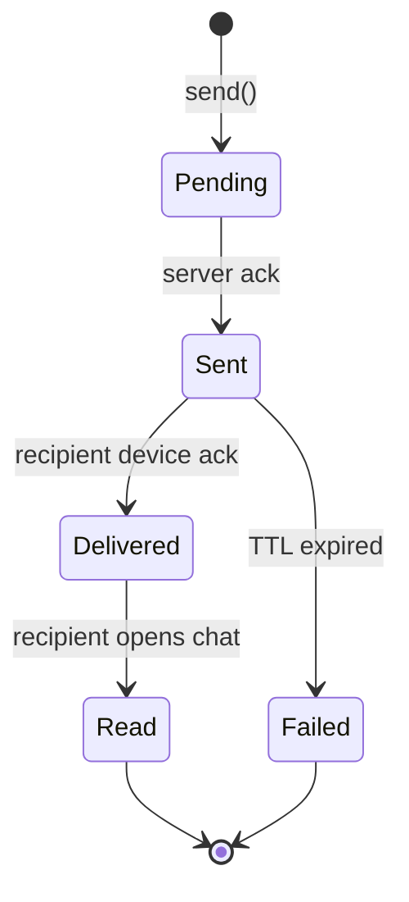
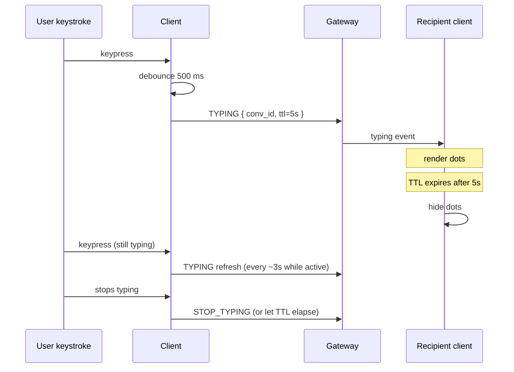

# WhatsApp Deep Dive — Read Receipts and Typing Indicators

**Date:** 2026-04-27 | **Updated:** 2026-04-27
**Tags:** `system-design` `case-study` `whatsapp` `deep-dive` `read-receipts` `typing-indicators`

## Table of Contents

- [Summary](#summary)
- [Overview](#overview)
- [The Three-Tier Signal — Sent, Delivered, Read](#the-three-tier-signal--sent-delivered-read)
- [Group-Chat Receipt Aggregation](#group-chat-receipt-aggregation)
- [Privacy Controls on Read Receipts](#privacy-controls-on-read-receipts)
- [Typing Indicator Semantics](#typing-indicator-semantics)
- [Network Cost of Receipts](#network-cost-of-receipts)
- [Out-of-Order Receipts](#out-of-order-receipts)
- [Reactions as Receipts](#reactions-as-receipts)
- [Storage of Receipt History](#storage-of-receipt-history)
- [Cross-Device Receipts](#cross-device-receipts)
- [Receipts and End-to-End Encryption](#receipts-and-end-to-end-encryption)
- [Anti-Patterns](#anti-patterns)
- [Related](#related)
- [References](#references)

## Summary

Read receipts and typing indicators look like cute UI flourishes, but at the WhatsApp scale of ~100 B messages per day they are a separate distributed-systems problem with their own write-rate, fanout, privacy, ordering, and cryptographic-metadata story. Every received message generates two ack events on its way back to the sender — `delivered` and `read` — which means the receipt path can carry **2× the traffic** of the message path itself. Group chats turn that into a fanout fan-in storm: M recipients × 2 receipts = 2M acks back to one author. Typing indicators are pure soft-state with their own debounce/TTL discipline, sized down to a few bytes per envelope. Privacy controls, cross-device propagation, reaction fanout, and the metadata leakage of "who-read-when" under E2E encryption are all subproblems most engineers underestimate when sketching a chat app on a whiteboard. This doc expands the parent case study's [Read Receipts and Typing Indicators subsection](../design-whatsapp.md#4-read-receipts-and-typing-indicators).

## Overview

The receipt path's job is to answer one question per message, per recipient: "what is the latest acknowledgement state I, the sender, have observed?" The state machine is small — three states for direct chats — but the operational surface is vast.



Each transition costs:

- A small WebSocket frame on the recipient's connection.
- A small frame back to the sender.
- An optional fanout to the sender's other devices (multi-device).
- An optional persisted state mutation (`participants.last_read_seq`).
- For groups, a roll-up step so the sender sees aggregate counts, not M individual notifications.

The design philosophy is "**receipts are soft state with one durable summary**." Per-receipt audit history is not kept; only the high-water mark per `(conversation_id, user_id)` is persisted. That single decision drops storage cost from O(messages × recipients) to O(participants) and makes receipt computation O(1).

## The Three-Tier Signal — Sent, Delivered, Read

WhatsApp's UI exposes three glyphs:

| Glyph | State | Trigger | Bandwidth path |
|---|---|---|---|
| Single grey check | Sent | Server has accepted and durably written the message | Sender ↔ chat service only |
| Double grey check | Delivered | Recipient's device has the message in its local store | Recipient device → chat service → sender |
| Double blue check | Read | Recipient has opened the conversation containing the message | Recipient device → chat service → sender |

### Semantic precision

- **Sent** is a *server-side* fact. It fires when the message has been durably persisted in the message log (the parent doc's "chat service writes (conversation_id, server_seq)"). The sender's own client moves from `Pending` to `Sent` when it receives the server ack.
- **Delivered** is a *recipient-device-side* fact. The recipient's client downloads the envelope, decrypts it (E2EE), writes it to the local SQLite store, and emits a `DELIVER` ack frame. Only then does the sender see the second check.
- **Read** is a *UI-side* fact. The recipient's client emits `READ` when the conversation is foregrounded *and* the message is on screen. WhatsApp historically fires "read" the moment the chat is opened (no scroll-into-view requirement), which is why reading the preview in a notification does not flip the receipt.

### Edge cases

- A device offline for days will skip directly from `Sent` to `Delivered+Read` once it reconnects and the user opens the chat. The two acks may arrive within milliseconds of each other.
- A platform-level "auto-download" on Wi-Fi can produce `Delivered` long before the user has the app open.
- Voice/video call events generate their own receipt taxonomy (ringing, missed, declined) that piggybacks on the same delivery channel but is rendered differently.

## Group-Chat Receipt Aggregation

A naive group implementation would deliver M individual receipts back to the author for every message — for a 256-person group, that's **2 × 256 = 512 ack frames per message**. Multiply by 100 B messages/day and the receipt path eclipses the message path.

WhatsApp aggregates instead. The author's device sees:

```text
Read by 8 of 12
```

…not twelve individual checkmarks. To produce that without flooding the author's connection, the chat service maintains an aggregation row keyed by `(conversation_id, server_seq)`:

```text
receipt_agg:{conv_id}:{server_seq} = {
  delivered: bitmap or counter,
  read:      bitmap or counter,
  total:     M
}
```

Two strategies compete:

- **Bitmap** — one bit per participant. O(M/8) bytes. Allows "show me who has read" detail when the author taps "info."
- **Counter only** — two integers. O(8) bytes. Cheaper and good enough for the aggregate label, but loses per-recipient detail.

Production systems usually keep a bitmap in Redis (for live UI) and persist only counters in the long-term store. The bitmap evicts after a few hours; "info → read by" then degrades to a count.

Updates are pushed to the author **at most once per N events** via a small batching window (e.g. 250 ms). The author sees the count climb in animated steps rather than per-recipient flicker.

For very large groups (community broadcast channels of 1024+), receipts are often **disabled entirely** — the aggregation cost outweighs the user value, and you get a one-way broadcast.

## Privacy Controls on Read Receipts

Read receipts are a **mutual-exclusion privacy control**. WhatsApp's classic rule:

> If you turn off read receipts, you also do not see other people's read receipts in 1:1 chats.

This is symmetric to prevent the asymmetric snooping pattern ("I see when you read me, but you don't see when I read you").

Notable behaviour:

- **Unilateral toggle on the receiver side.** Suppression is decided by the *recipient's* client at receipt-emit time. It either sends a `READ` ack or does not.
- **Group chats are exempt.** WhatsApp's product decision: in groups, read receipts cannot be disabled. The "read by N" aggregate is always visible to the sender, partly because aggregation already provides a small privacy cushion.
- **Per-conversation override** is not exposed in classic WhatsApp; some forks (and competitors like Telegram, Signal) offer per-chat granularity. The trade-off is UI complexity vs honesty about who has the per-conversation switch on.
- **Blue-tick suppression vs delivery suppression.** The grey "delivered" check is **not suppressible** — it's a network-level fact, not a privacy signal. Only the blue "read" upgrade is gated.
- **Last-seen and online-presence** controls are independent and orthogonal; presence is in the [presence-service deep dive](./presence-service.md).

The privacy logic lives at the recipient's edge gateway, not on the sender's side. The sender simply never receives a `READ` event; the UI then keeps showing double grey forever.

## Typing Indicator Semantics

Typing dots are pure soft state. They are **never persisted**, **never retried**, and **never queued for offline delivery**.

### Lifecycle



### Knobs

- **Debounce ~500 ms** — only emit `TYPING` after the user has been continuously typing for half a second. This cuts traffic from "every keystroke" to "once per typing burst."
- **TTL ~5 s** — the recipient auto-hides the indicator after 5 s without a refresh. This makes the system **self-healing**: if the sender's network drops, the recipient does not see a stuck "typing" state forever.
- **Refresh ~3 s** — while the user is still typing, the client re-emits before the TTL expires. Bandwidth budget: a few bytes every few seconds.
- **Stop on send** — when the user actually sends the message, the typing event becomes implicitly false; the explicit `STOP_TYPING` is optional.

### Group typing — first-typer suppression

Groups apply an additional rule: only the **first typer** is shown. If Alice is typing and Bob starts, Bob's typing indicator is suppressed at the gateway (or merged into "Alice and 1 other are typing"). This avoids the "5 dots flickering" antipattern in busy group chats.

```js
// Client-side debounce for typing indicator emission.
function createTypingEmitter(send, opts = {}) {
  const debounceMs = opts.debounceMs ?? 500;
  const refreshMs = opts.refreshMs ?? 3000;
  const ttlSec = opts.ttlSec ?? 5;

  let pending = null;
  let lastSent = 0;

  return function onKeystroke(convId) {
    if (pending) clearTimeout(pending);

    pending = setTimeout(() => {
      const now = Date.now();
      if (now - lastSent >= refreshMs) {
        send({ type: 'TYPING', conv_id: convId, ttl_sec: ttlSec });
        lastSent = now;
      }
    }, debounceMs);
  };
}
```

## Network Cost of Receipts

Every received message produces **two outbound ack frames**: `DELIVERED` and `READ`. For 1:1 chats the cost looks symmetric, but reasoning per direction:

- **Sender → server:** 1 message frame.
- **Server → recipient:** 1 envelope frame.
- **Recipient → server:** 2 ack frames (delivered, read).
- **Server → sender:** 2 receipt frames (delivered, read).

So the **receipt traffic equals 2× the message traffic** in the steady state. For groups of M:

- Sender → server: 1 frame.
- Server → recipients: M envelopes.
- Recipients → server: 2M acks.
- Server → sender: 2 aggregated update frames (after batching).

The fan-in step is what saves the author's device: 2M acks collapse into ~2 batched updates.

### Batching

Receipts are batched on **two seams**:

1. **Recipient batch** — the recipient's client groups acks for many messages into one frame: `READ { conv_id, up_to_seq: 4123 }`. This is why the schema is high-water-mark, not per-message: a single value covers an entire backlog.
2. **Server fan-in batch** — the chat service coalesces aggregate updates per conversation per author within a short window (e.g. 250 ms), so the author sees one update covering five recipients reading at once, not five frames.

### Sample receipt batch payload

```json
{
  "type": "RECEIPT_BATCH",
  "conv_id": "c_abc123",
  "from_user": "u_recipient",
  "events": [
    { "kind": "DELIVERED", "up_to_seq": 4120, "ts": 1730102045123 },
    { "kind": "READ",      "up_to_seq": 4118, "ts": 1730102047890 }
  ],
  "device_id": "d_phone_1"
}
```

The schema embeds *up-to* semantics: a single ack covers every prior `server_seq`. There is **no per-message receipt frame** unless an author explicitly requests granular detail (group "info → read by").

### Math sketch

A user receiving 100 messages per day across 50 conversations, with WhatsApp's ack format:

- Worst case (per-message acks): 200 ack frames/day per user.
- Realistic case (batched up-to): closer to 50–100 frames/day — one batched ack per conversation per session foreground.

Multiplied across 2 B users, the batching choice is the difference between 200 B and 4 T daily ack frames.

## Out-of-Order Receipts

Networks reorder; the receipt state machine must not panic. Two real out-of-order cases:

### Read before delivered

A device on flaky Wi-Fi opens the chat, locally renders messages from cache, and emits a `READ`. Then the `DELIVERED` ack races behind because the original delivery confirmation was queued in a slow upload pipe. The server may receive `READ { up_to_seq: 4120 }` before `DELIVERED { up_to_seq: 4120 }` for the same recipient.

**Resolution rule:** "read implies delivered." The chat service treats `READ` as monotonically dominating `DELIVERED`. If `READ.up_to_seq >= X`, then `DELIVERED.up_to_seq` is set to `max(current, X)`. The sender's UI thus jumps directly from "single check" to "double blue check" without ever showing "double grey," and that's fine — it reflects reality.

### Older receipt arrives after newer

A retried delivery ack from yesterday lands after today's read. The high-water-mark schema makes this trivial: only update if the incoming `up_to_seq` is greater. Stale acks are dropped.

```sql
UPDATE participants
SET last_delivered_seq = GREATEST(last_delivered_seq, $1),
    last_read_seq      = GREATEST(last_read_seq, $2),
    updated_at         = NOW()
WHERE conv_id = $3 AND user_id = $4;
```

`GREATEST(...)` plus per-row updates is idempotent and reorder-safe.

## Reactions as Receipts

Emoji reactions in WhatsApp follow the **same fanout pattern** as receipts: they are tiny per-message events broadcast back to the conversation participants. The aggregation choices mirror receipts:

- **Group display:** counts are aggregated. The UI shows "👍 4 ❤️ 2" rather than per-user emoji clouds.
- **Per-user resolution:** tap-and-hold opens the per-reactor list (same UX seam as "read by" in groups).
- **Bandwidth profile:** one event per (message, reactor, emoji). Reactions can be replaced (changing your reaction = remove + add) which doubles traffic per change.
- **Storage:** a `reactions` table keyed by `(conv_id, server_seq, user_id)` with a single emoji column. Updates are upserts.

The implementation lesson is that **reactions, receipts, and typing indicators all share the same transient-event highway**. They differ in TTL, persistence, and UI rendering, not in transport.

## Storage of Receipt History

The fundamental design choice: **summary, not audit**.

### What WhatsApp stores

```sql
CREATE TABLE participants (
  conv_id            UUID    NOT NULL,
  user_id            BIGINT  NOT NULL,
  last_delivered_seq BIGINT  NOT NULL DEFAULT 0,
  last_read_seq      BIGINT  NOT NULL DEFAULT 0,
  joined_at          TIMESTAMPTZ NOT NULL,
  updated_at         TIMESTAMPTZ NOT NULL,
  PRIMARY KEY (conv_id, user_id)
);
```

One row per `(conversation, participant)`. To compute "is this message read by Alice?" the sender's client compares `message.server_seq <= participants[alice].last_read_seq`. O(1) per participant.

### What WhatsApp does *not* store

A per-message audit trail (`delivered_at TIMESTAMPTZ`, `read_at TIMESTAMPTZ` for every recipient × every message) is **not** kept. That would be O(messages × recipients) — multiplied by 100 B messages/day, infeasible. The product cost: you cannot answer "when exactly was message #4118 read?" days later, only "what was the last seq the user read?" today.

Some compliance-targeted competitors (corporate Slack, regulated banking IM) do keep per-message audit, accepting the storage tax in exchange for legal traceability.

### Aggregation Lua (Redis-side)

For groups, the live aggregation lives in Redis, where a Lua script atomically updates the bitmap and counter:

```lua
-- KEYS[1] = receipt_agg:{conv_id}:{server_seq}
-- ARGV[1] = participant_index (0-based)
-- ARGV[2] = kind ("DELIVERED" or "READ")
-- ARGV[3] = total participants

-- Bitfield: bits 0..N-1 = delivered, bits N..2N-1 = read
local total = tonumber(ARGV[3])
local bit_offset = (ARGV[2] == "READ") and (total + tonumber(ARGV[1])) or tonumber(ARGV[1])

redis.call("SETBIT", KEYS[1], bit_offset, 1)
redis.call("EXPIRE", KEYS[1], 86400)

local delivered = redis.call("BITCOUNT", KEYS[1], 0, math.floor((total - 1) / 8))
local read_count
if ARGV[2] == "READ" then
  read_count = redis.call("BITCOUNT", KEYS[1], math.floor(total / 8), -1)
else
  read_count = -1
end

return { delivered, read_count }
```

The script is invoked per ack. The returned counts feed the batched update to the author's device.

## Cross-Device Receipts

WhatsApp's multi-device support (since 2021) means a user can be on phone, web, desktop, and tablet simultaneously. Reading on **one device must mark all devices as read**, otherwise the user opens their laptop and sees stale unread badges from messages they already read on their phone.

### The propagation rule

When device D₁ for user U emits `READ { conv_id, up_to_seq: X }`:

1. The chat service updates `participants.last_read_seq` for `(conv_id, U)` if X is greater.
2. The chat service fans the read event out to **U's other devices** (D₂, D₃, …) on their own WebSocket connections.
3. Each other device updates its local unread badge and dismisses any system notifications for messages ≤ X.

The fanout is **device-scoped**, not conversation-scoped. A read event traveling between an author and a recipient is one fanout; the read event traveling among the recipient's own devices is a separate fanout.

### How others handle it

- **Signal:** uses sealed-sender plus a "sync messages" channel — the device that emits a read sends a *sync transcript* to its own other devices, encrypted with a self-key. Receipts and reads propagate via the same channel.
- **iMessage:** uses Apple's IDS (Identity Service) — each Apple ID is a fanout group of all that user's devices. The "read" event is delivered to every device the user is signed in to. Apple's `MarkRead` API at the framework level intentionally synchronizes UNs across devices.
- **Matrix / Element:** read receipts are an explicit room event (`m.receipt`). Each device emits its own; the room sums them. The federation graph already knows about each device, so cross-device sync is implicit in the protocol.

### Failure mode

If a device is offline when the sync arrives, it will see the stale unread when it reconnects. The fix is usually a *catch-up* on reconnect: the client requests the latest `last_read_seq` for every conversation and reconciles its local badges.

## Receipts and End-to-End Encryption

Here is the uncomfortable truth: **receipts leak metadata even when content is encrypted.**

A passive observer of WhatsApp's transport can deduce:

- Alice messaged Bob at 14:02:13 (envelope size, not content).
- Bob's client acked delivered at 14:02:14.
- Bob's client acked read at 14:18:32.

That timing data answers questions content encryption cannot hide: "are they having a real-time conversation?", "what hours is Bob awake?", "did Bob read Alice's message before he replied to Carol?".

### What WhatsApp does

- **Receipts are encrypted-on-the-wire** but their *existence and timing* are visible to the chat service. WhatsApp explicitly chose not to make receipts as opaque as message bodies, partly because the server needs to route them.
- **Sealed-sender** mode (popularized by Signal, partially adopted by WhatsApp) hides the *sender* of a receipt from the server: the receipt is encrypted such that the server can route it to the right recipient inbox without learning who the recipient was reading from. This breaks the timing-correlation attack at the server but not at a global passive adversary.
- **Signed receipts.** The recipient's device **signs the receipt** with its identity key, so the server cannot forge "Bob read this" — only Bob's device can produce the signed `READ` event. This protects against a malicious server fabricating proof-of-read for legal or coercive purposes. The receipt payload is small but cryptographically bound to the recipient's device key.

### What gets leaked anyway

- **Online windows.** Every receipt is also a "Bob's device was online at this instant" beacon.
- **Conversation activity bursts.** Even without content, the rate of receipts on a conversation reveals when a heated exchange is happening.
- **Group membership inference.** A group with 12 read-receipt deliveries from 12 distinct device IDs leaks group size and likely member identity to a network-position adversary.

### Mitigations users have

- Disable read receipts → server can no longer publish `READ` events to the sender. The server still observes that the recipient's device decrypted the envelope (a `DELIVERED` ack remains).
- Disable last-seen → the presence-service signal is suppressed, but per-message delivery acks still leak online windows.

The honest framing: end-to-end encryption protects **what** was said. Receipts and presence inevitably leak **when** and **with whom**.

## Anti-Patterns

- **Per-message audit history.** Storing `delivered_at` and `read_at` for every (message, recipient) pair scales the receipt store with the message store. Use high-water marks unless legal compliance forces you otherwise.
- **Synchronous fanout of group receipts.** "On every recipient ack, push to author immediately" — produces 2M frames per group message. Always batch in a small server-side window (200–500 ms).
- **Persisting typing events.** Writing `TYPING` envelopes into the message log is the parent doc's named anti-pattern. They are pure soft-state; persist nothing, drop on reconnect.
- **No TTL on typing.** A stuck "typing…" indicator that never clears because the sender disconnected mid-keystroke is a recurring user-trust bug. Always TTL the rendered indicator on the recipient side, independent of explicit `STOP_TYPING`.
- **Forging "delivered" on the server.** Marking messages delivered as soon as they leave the chat service is tempting (no recipient ack needed!) but lies to the user. The grey check must reflect *recipient-device* state, not server-side dispatch.
- **Cross-device read sync via polling.** Phone marks read at 09:00; laptop polls "what's read?" every 60 s and lights up at 09:01. Push the read event to the user's other devices on the same fanout fabric used for messages.
- **Showing per-recipient checks in groups.** UI clutter that does not scale past ~5 participants. Aggregate into "read by N of M" and surface detail only on tap.
- **Treating reactions as messages.** A reaction is a *modifier* on an existing message, not a new message. Storing it as a message inflates conversation length, breaks unread counts, and produces noisy notifications.
- **Reusing the read receipt to trigger non-receipt logic.** Some apps use "read" as a side-channel signal ("when read, dispatch follow-up workflow"). It couples privacy controls (user disables receipts → workflow breaks) to business logic.
- **No replay protection on signed receipts.** A signed `READ` event without a timestamp or nonce can be replayed by a malicious client to "re-read" old messages and skew analytics. Include a timestamp inside the signed payload, with a server-side reject window.

## Related

- [`../design-whatsapp.md`](../design-whatsapp.md) — parent case study; receipts are subsection 4 of the architecture.
- [`./presence-service.md`](./presence-service.md) _(planned sibling)_ — last-seen, online state, and the gossip model that complements receipts.
- [`../../../communication/real-time-channels.md`](../../../communication/real-time-channels.md) — WebSocket transport patterns that carry receipt frames.
- [`../../communication/event-driven-architecture.md`](../../communication/event-driven-architecture.md) _(planned)_ — receipts as a low-stakes event stream contrasted with durable messages.

## References

- WhatsApp Security Whitepaper — [End-to-End Encryption (PDF)](https://www.whatsapp.com/security/WhatsApp-Security-Whitepaper.pdf) — sender keys, sealed sender, receipt structure.
- Signal Protocol — [Sesame: Session Management Across Devices](https://signal.org/docs/specifications/sesame/) — multi-device sync semantics that inform read-event fanout.
- Signal Blog — [Technology Preview: Sealed Sender for Signal](https://signal.org/blog/sealed-sender/) — how sender-anonymous receipts are constructed.
- Matrix Spec — [Receipts module (m.receipt)](https://spec.matrix.org/latest/client-server-api/#receipts) — explicit room-event read-receipt model with per-device IDs.
- Apple Developer — [Messages framework — `MSConversation`](https://developer.apple.com/documentation/messages/msconversation) — iMessage cross-device read sync surface.
- IETF Draft — [The IMAP MOVE Extension and Read-State Synchronization (RFC 6851)](https://datatracker.ietf.org/doc/html/rfc6851) — pre-mobile cross-device read-state precedent.
- High Scalability — [The WhatsApp Architecture Facebook Bought For $19 Billion](http://highscalability.com/blog/2014/2/26/the-whatsapp-architecture-facebook-bought-for-19-billion.html) — historical numbers on receipt volume vs message volume.
- Engineering at Meta — [Building scalable end-to-end encryption for groups](https://engineering.fb.com/2023/12/06/security/end-to-end-encryption-messenger-secure-storage/) — how Messenger/WhatsApp evolved E2EE while preserving receipt UX.
