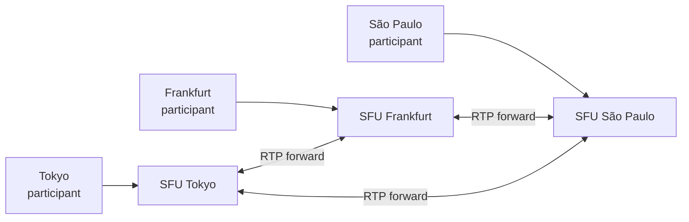

# Zoom Deep Dive — SFU vs MCU vs P2P

**Date:** 2026-04-29 | **Updated:** 2026-04-29
**Tags:** `system-design` `case-study` `zoom` `deep-dive` `webrtc` `sfu` `mcu`

## Table of Contents

- [Summary](#summary)
- [Overview — The Three Topologies](#overview--the-three-topologies)
- [P2P Mesh](#p2p-mesh)
- [MCU (Multipoint Control Unit)](#mcu-multipoint-control-unit)
- [SFU (Selective Forwarding Unit)](#sfu-selective-forwarding-unit)
- [Bandwidth Math at 5, 10, 25, 100 Participants](#bandwidth-math-at-5-10-25-100-participants)
- [CPU and Quality Trade-offs](#cpu-and-quality-trade-offs)
- [Industry Adoption — Why SFU Won After 2015](#industry-adoption--why-sfu-won-after-2015)
- [SFU Implementations](#sfu-implementations)
- [Zoom's Proprietary Stack — Rumor vs Verifiable](#zooms-proprietary-stack--rumor-vs-verifiable)
- [SFU Geographic Placement](#sfu-geographic-placement)
- [Simulcast and SVC on an SFU](#simulcast-and-svc-on-an-sfu)
- [Failure Modes](#failure-modes)
- [Typical SFU Memory and CPU Per Participant](#typical-sfu-memory-and-cpu-per-participant)
- [Anti-Patterns](#anti-patterns)
- [Related](#related)
- [References](#references)

## Summary

When you put N people in a video call, you have three classical options for moving pixels between them: each peer sends to every other peer (**P2P mesh**), all peers send to a server that decodes, mixes, re-encodes, and sends one composited stream back (**MCU**), or all peers send to a server that simply *forwards* encrypted packets to the right subscribers without decoding (**SFU**). The bandwidth math, the CPU math, and the operational economics all push the same direction past 3 participants: SFU dominates. RFC 7667 catalogues these topologies under the names "Point-to-Point", "Topo-Mixer" (MCU), and "Topo-Video-switch-MCU" / "Topo-PtP-Mix" (SFU-class). Vidyo (now Cisco) productized SFU in 2008; Janus (2014), mediasoup (2016), and LiveKit (2021) made it commodity; by ~2015 every serious conferencing product had moved off MCU.

This doc unpacks the bandwidth and CPU math at concrete participant counts (5, 10, 25, 100), explains why SFU beats both alternatives, and grounds the abstract claim in real implementations (Janus, mediasoup, LiveKit, Pion, Jitsi Videobridge, Zoom's MMR). It is the deep-dive companion to the [P2P vs MCU vs SFU subsection in design-zoom.md](../design-zoom.md#p2p-mesh-vs-mcu-vs-sfu).

## Overview — The Three Topologies

```mermaid
graph TB
    subgraph P2P[P2P Mesh - N peers, N*(N-1) streams total]
        A1[A] <--> B1[B]
        A1 <--> C1[C]
        A1 <--> D1[D]
        B1 <--> C1
        B1 <--> D1
        C1 <--> D1
    end

    subgraph MCU[MCU - decode, mix, re-encode]
        A2[A] -->|1 up| M[MCU<br/>decode N<br/>composite<br/>encode 1]
        B2[B] -->|1 up| M
        C2[C] -->|1 up| M
        D2[D] -->|1 up| M
        M -->|1 down| A2
        M -->|1 down| B2
        M -->|1 down| C2
        M -->|1 down| D2
    end

    subgraph SFU[SFU - forward only, no decode]
        A3[A] -->|1 up<br/>simulcast| S[SFU<br/>route packets<br/>per-receiver layer]
        B3[B] -->|1 up| S
        C3[C] -->|1 up| S
        D3[D] -->|1 up| S
        S -->|N-1 down| A3
        S -->|N-1 down| B3
        S -->|N-1 down| C3
        S -->|N-1 down| D3
    end

    style P2P fill:#ffebee
    style MCU fill:#fff3e0
    style SFU fill:#e8f5e9
```

The three differ on a single axis: **where does the work happen?**

| Topology | Encodes | Decodes | Server CPU | Per-receiver adapt | Latency |
|---|---|---|---|---|---|
| P2P Mesh | Publisher × (N-1) | Receiver × (N-1) | None | Per-stream by publisher | Lowest (no hop) |
| MCU | Publisher × 1, Server × 1 | Server × N, Receiver × 1 | Heavy (transcode) | Server picks composite | High (decode+encode hop) |
| SFU | Publisher × 1 (or simulcast 2-3) | Receiver × (N-1) selected | Light (packet forwarding) | Per-subscriber layer pick | Low (no transcode) |

RFC 7667 ("RTP Topologies") names the SFU-class pattern `Topo-Video-switch-MCU` or `Topo-PtP-Mix` depending on whether streams are switched or mixed at the server. The IETF terminology lags the industry — what everyone now calls an "SFU" is the switching variant.

## P2P Mesh

Every participant opens a direct WebRTC PeerConnection to every other participant. With N participants, the topology has N×(N-1)/2 edges and each peer maintains N-1 connections.

**Stream counts per peer:**
- Outbound encoded streams: **N-1** (one per other peer)
- Inbound decoded streams: **N-1**
- Encoder instances running: 1 source × (N-1) recipients = **N-1 encodes** if each is independently rate-adapted, or 1 encode if you broadcast the same bitstream to all (then you cannot per-receiver adapt)

**Bandwidth per peer at 720p (1.2 Mbps each direction):**
- Up: 1.2 × (N-1) Mbps
- Down: 1.2 × (N-1) Mbps

**The mesh wall.** At N=4 the publisher already sends 3 × 1.2 = 3.6 Mbps up. A typical home asymmetric DSL gives 5–10 Mbps up; saturation hits at N=5 or 6. CPU also scales: encoding a 720p stream consumes ~10–15% of a modern laptop core; running N-1 of them at once is a fan event.

**Where mesh actually wins:**
- **2-person calls** — direct P2P is the lowest-latency, lowest-cost path. WhatsApp 1:1 calls, FaceTime 1:1, Discord DM voice all use P2P with TURN fallback.
- **Privacy-first products** — no server sees the media. End-to-end encryption is structural rather than added.
- **Tiny groups (3–4) on fast networks** — Discord originally used P2P up to 5 participants before switching to SFU.

**Where mesh fails:**
- **Asymmetric uplinks.** Residential connections give 10× less up than down; mesh's N-1 fan-out hits this wall first.
- **Heterogeneous networks.** A 4G phone and a fiber desktop in the same mesh both run at the slowest peer's tolerance.
- **NAT traversal.** N×(N-1)/2 ICE negotiations × ~20% TURN fallback rate = real operational pain.
- **Recording and moderation.** No central place to capture or moderate the stream.

The math is simple: P2P mesh is a 2-3 person solution. The moment you cross 4, SFU is cheaper for every participant and every operator.

## MCU (Multipoint Control Unit)

The original telco answer. Every client sends one stream to a central server. The server **decodes all N streams**, **composites them into one frame** (gallery layout, picture-in-picture, side-by-side), **re-encodes the composite**, and sends a single stream back to each client. Audio is mixed similarly.

**Stream counts:**
- Per client: **1 up, 1 down** (beautifully simple from the client's view)
- Server: **N decode + N encode + 1 composite** per meeting

**The cost is in the codecs.** A 1080p H.264 decode is ~5% of a modern x86 core; an encode is 25–40%. For a 10-person meeting you need 10 decodes (~50%) + 10 encodes (~300% — three full cores) + composite + audio mix. A single MCU box realistically handles 5–20 active participants across all meetings.

**Hardware MCUs.** Polycom, Cisco TelePresence, Lifesize, and similar built dedicated boxes with H.264 ASICs or VPU silicon. These are still alive in regulated industries (healthcare, defense), where the gateway needs to bridge SIP/H.323 endpoints into modern systems.

**Why MCUs persist anywhere:**
1. **Single-stream clients.** SIP phones, set-top boxes, room systems that cannot decode N streams.
2. **Recording and broadcast.** A composite stream is what you want to ship to a CDN or write to disk — the recording bot in an SFU world is essentially a one-meeting MCU. (See [Recording in design-zoom.md](../design-zoom.md#recording).)
3. **Server-side compute on pixels.** Server-side virtual backgrounds, live captions baked into video, watermarking — all need decoded frames.

**Why MCUs lost the main battle:**
- **CPU cost.** ~10–50× more expensive per stream than SFU. At cloud prices, the difference is the difference between profitable and not.
- **Latency.** Decode → composite → encode adds ~80–150ms even with hardware acceleration. SFU adds ~5–20ms.
- **Quality cap.** Re-encoding always loses; the composite is at most as good as the worst input layer that survived.
- **No per-receiver adaptation without further re-encodes.** If three receivers want three different bitrates, you re-encode three times. Now you are running three MCUs in parallel.

The MCU is alive and well — but only as a *recording bot* or a *protocol gateway*, not as the primary media plane.

## SFU (Selective Forwarding Unit)

The SFU is a packet router. Each client uploads one (or a few simulcast) encoded streams. The SFU **does not decode** the media — it inspects RTP headers, decrypts (DTLS-SRTP), inspects again, re-encrypts under each subscriber's key, and forwards. Server CPU is dominated by SRTP crypto, packet shuffling, and RTCP feedback processing — all far cheaper than codec work.

**Stream counts:**
- Per client: **1 up (or 2-3 simulcast layers), N-1 down (or fewer if active-speaker only)**
- Server: forwards packets, no codec work

**What the SFU actually does (responsibilities):**

1. **DTLS handshake** — terminates the encrypted transport per peer, derives SRTP keys.
2. **SSRC / RID demux** — identifies which incoming packet belongs to which stream and which simulcast layer.
3. **Subscription routing** — maintains a fan-out table: "subscriber X receives publisher Y's layer Z."
4. **Layer selection** — picks the right simulcast or SVC layer per subscriber based on TWCC bandwidth estimation feedback.
5. **NACK retransmission** — keeps a small per-stream ring buffer (~200ms) and replies to receiver NACK requests without bothering the publisher.
6. **PLI/FIR forwarding** — keyframe requests from receivers go upstream to the publisher.
7. **Bandwidth estimation per subscriber** — TWCC (Transport-Wide Congestion Control) measures one-way delay variation, infers congestion, drives layer choice.
8. **Active-speaker detection** — reads the RFC 6464 audio level extension on incoming RTP, picks top-K speakers, drives gallery focus.

The SFU never sees a decoded frame. This is the defining property: pixels stay encrypted end-to-end-of-server-route, decoded only at the receiver. That's the cost-quality-latency triple win.

**Per-subscriber adaptation without re-encoding.** This is the single biggest reason SFU + simulcast beats everything else. The publisher uploads three layers (low/mid/high). Subscriber A on fiber gets `high`; subscriber B on hotel wifi gets `mid`; subscriber C on 4G gets `low`. The publisher encodes once. The SFU forwards three different packet streams. No transcoding. No quality loss beyond the original encoding. (See [Simulcast vs SVC in design-zoom.md](../design-zoom.md#simulcast-vs-svc).)

## Bandwidth Math at 5, 10, 25, 100 Participants

Concrete numbers. Assume 720p30 video at 1.2 Mbps + Opus audio at 32 kbps = ~1.23 Mbps per stream. Round to 1.25 Mbps for arithmetic.

### 5 Participants

| Topology | Per-peer up | Per-peer down | Server up (in) | Server down (out) | Server CPU |
|---|---|---|---|---|---|
| P2P Mesh | 4 × 1.25 = **5.0 Mbps** | 4 × 1.25 = **5.0 Mbps** | — | — | None |
| MCU | 1 × 1.25 = **1.25 Mbps** | 1 × 1.25 = **1.25 Mbps** | 5 × 1.25 = 6.25 Mbps | 5 × 1.25 = 6.25 Mbps | 5 dec + 5 enc + composite |
| SFU | 1 × 1.25 = **1.25 Mbps** | 4 × 1.25 = **5.0 Mbps** | 5 × 1.25 = 6.25 Mbps | 20 × 1.25 = 25 Mbps | Forwarding only |

At N=5, P2P mesh saturates the publisher uplink on most home connections. SFU is fine.

### 10 Participants

| Topology | Per-peer up | Per-peer down | Server up (in) | Server down (out) |
|---|---|---|---|---|
| P2P Mesh | 9 × 1.25 = **11.25 Mbps** | 9 × 1.25 = **11.25 Mbps** | — | — |
| MCU | **1.25 Mbps** | **1.25 Mbps** | 12.5 Mbps | 12.5 Mbps |
| SFU (full grid) | **1.25 Mbps** | 9 × 1.25 = **11.25 Mbps** | 12.5 Mbps | 90 × 1.25 = 112.5 Mbps |
| SFU + active-speaker (1 high + 8 thumb) | 1.25 + 0.25 = **1.5 Mbps** sim. | 1.2 + 8×0.15 = **2.4 Mbps** | 15 Mbps | 24 Mbps |

P2P mesh is dead at N=10 (~11 Mbps up exceeds most residential uplinks). SFU with simulcast + active-speaker lets each receiver pull a high layer for the speaker and thumbnails for the rest, dropping per-receiver bandwidth from 11.25 to ~2.4 Mbps.

### 25 Participants

| Topology | Per-peer up | Per-peer down |
|---|---|---|
| P2P Mesh | 24 × 1.25 = **30 Mbps** ❌ | **30 Mbps** ❌ |
| MCU | **1.25 Mbps** | **1.25 Mbps** |
| SFU (full grid 720p) | **1.25 Mbps** | 24 × 1.25 = **30 Mbps** ❌ |
| SFU active-speaker + thumbs | simulcast **~1.5 Mbps** | 1 high + 24 thumb @ 150 kbps = **~4.8 Mbps** |
| SFU + SVC + 1 high + 8 thumb visible | **~1.0 Mbps** (SVC) | **~2.4 Mbps** |

At N=25, the *receiver* side becomes the bottleneck on a full grid. The fix is layer policy: only render thumbnails for off-screen participants, and only at the layer the receiver can decode. This is what Zoom's "gallery view" actually does — it never sends 25 high-res streams to anyone.

### 100 Participants

| Topology | Per-peer up | Per-peer down | Server in | Server out |
|---|---|---|---|---|
| P2P Mesh | **120 Mbps** ❌ | **120 Mbps** ❌ | — | — |
| MCU | **1.25 Mbps** | **1.25 Mbps** | 125 Mbps | 125 Mbps |
| SFU active-speaker (1 high + ~9 visible thumbs + audio mix) | simulcast **1.5 Mbps** | 1.2 + 9×0.15 + 99×0.032 ≈ **5.7 Mbps** | 150 Mbps | 100 × 5.7 = **570 Mbps** |
| SFU SVC + 1 speaker + 9 thumbs + AS audio | **1.0 Mbps** | **~2.5 Mbps** | 100 Mbps | 250 Mbps |

At N=100 the SFU server is doing real work — 250–570 Mbps egress per meeting — but the *clients* are still fine on broadband. Audio adds up: 99 audio streams × 32 kbps = ~3 Mbps just for voice. SFUs forward only the **top-K loudest audio streams** (typically K=3) to keep this bounded. (See [Audio Pipeline in design-zoom.md](../design-zoom.md#audio-pipeline).)

### Summary Curve

```
Per-participant DOWN bandwidth (720p, full grid):
N    |  P2P Mesh  |  MCU       |  SFU full   |  SFU active+thumbs
-----|------------|------------|-------------|--------------------
5    |  5.0 Mbps  |  1.25 Mbps |  5.0 Mbps   |  ~2.0 Mbps
10   |  11.3 Mbps |  1.25 Mbps |  11.3 Mbps  |  ~2.4 Mbps
25   |  30.0 Mbps |  1.25 Mbps |  30.0 Mbps  |  ~3.5 Mbps
100  |  120 Mbps  |  1.25 Mbps |  124 Mbps   |  ~5.7 Mbps
```

MCU is the bandwidth winner per client at every N — but the server cost makes it impractical at scale. SFU with active-speaker layer policy beats MCU on cost and latency while keeping client bandwidth bounded.

## CPU and Quality Trade-offs

### CPU

| Operation | Cost on modern x86 core | Hardware-accelerated |
|---|---|---|
| H.264 1080p decode | ~5–10% | <1% (QSV, NVDEC) |
| H.264 1080p encode (real-time) | ~25–40% | ~3–5% (QSV, NVENC) |
| VP9 1080p encode | ~40–60% | Newer NVENC supports |
| AV1 1080p real-time encode | ~80%+ | Limited (NVENC AV1, AMD AMF) |
| Opus encode | <1% | N/A |
| SRTP encrypt/decrypt | <0.5% per stream | AES-NI on modern CPUs |
| RTP forwarding | <0.1% per stream | N/A |

The codec costs dwarf the routing costs by 1–2 orders of magnitude. This is exactly why SFU wins: it stays out of the codec path.

### Quality

- **MCU re-encoding** introduces *generation loss*. Each re-encode is lossy; the composite quality is bounded by the encoding pipeline. Even with high bitrates, you lose subtle color/motion fidelity.
- **SFU forwarding** is byte-exact: the receiver decodes the same encoded frames the publisher produced. Quality is bounded only by the publisher's encoder and the network.
- **P2P** has the same byte-exact guarantee as SFU but with a publisher-CPU constraint that often forces lower bitrates.

### Latency Budget (one-way, mouth-to-ear or glass-to-glass)

| Stage | P2P | SFU | MCU |
|---|---|---|---|
| Capture + encode | ~30 ms | ~30 ms | ~30 ms |
| Network up | ~10–50 ms | ~10–50 ms | ~10–50 ms |
| Server processing | — | ~5–20 ms | ~80–150 ms |
| Network down | ~10–50 ms | ~10–50 ms | ~10–50 ms |
| Jitter buffer + decode | ~30–80 ms | ~30–80 ms | ~30–80 ms |
| **Total typical** | **~100 ms** | **~110 ms** | **~190 ms** |

That ~80ms penalty is what made MCUs feel laggy compared to SFU systems. WebRTC interactive targets are <150ms; MCUs eat most of the budget on the server.

## Industry Adoption — Why SFU Won After 2015

A capsule history:

- **Pre-2008**: Polycom, Cisco TelePresence, Tandberg dominate with hardware MCUs. Conferencing is a room-systems business.
- **2008**: Vidyo introduces the first commercial SFU using H.264 SVC. Enterprise sales and proprietary clients.
- **2011**: WebRTC project starts (Google + Mozilla + Opera). Browser-native real-time media.
- **2013**: Jitsi Videobridge becomes the first widely-used open-source SFU. Java-based.
- **2014**: **Janus** released by Meetecho. C-based modular gateway.
- **2014**: **Pion** project starts in Go (later 2018 first stable release).
- **2015**: WebRTC 1.0 stabilization. Chrome ships VP9 simulcast.
- **2016**: **mediasoup** released. Node.js + native (later Rust) workers.
- **2016**: Cisco acquires Vidyo's patents. SFU is now the legitimized topology.
- **2018**: Galene, Ant Media, others. SFU is commodity.
- **2021**: **LiveKit** open-sources a Go SFU with horizontal scaling baked in.
- **2024**: WebRTC AV1 SVC ships in Chrome. SVC becomes practical for the long tail.

By 2025, **every major conferencing product runs an SFU** as its primary media plane: Zoom (proprietary MMR, behaves as SFU), Google Meet, Microsoft Teams, Webex (Cisco's post-Vidyo stack), Jitsi Meet, Daily, Whereby, Discord (group voice), Slack Huddles, Around, BlueJeans (now Verizon), GoToMeeting, RingCentral. MCUs survive only as recording bots and SIP/H.323 gateways.

## SFU Implementations

A working list of production-grade SFU stacks, with what makes each one distinctive.

### Janus

- **Language:** C
- **Repo:** github.com/meetecho/janus-gateway
- **Docs:** https://janus.conf.meetecho.com/docs/
- **Distinctive:** Plugin-based gateway. Core handles ICE (libnice), DTLS (OpenSSL), SRTP (libsrtp). Plugins implement room logic: `videoroom`, `streaming`, `sip`, `recordplay`, `audiobridge`. Use Janus when you want the lowest-level building blocks.

### mediasoup

- **Language:** TypeScript wrapper, C++ (and Rust) workers
- **Repo:** github.com/versatica/mediasoup
- **Docs:** https://mediasoup.org/documentation/v3/
- **Distinctive:** Not a server — a *library* you embed in your Node.js or Rust application. Compose `Workers`, `Routers`, `Transports`, `Producers`, `Consumers`. High performance via separate worker processes. Use mediasoup when you want SFU primitives inside your own app.

### LiveKit

- **Language:** Go
- **Repo:** github.com/livekit/livekit
- **Docs:** https://docs.livekit.io/
- **Distinctive:** "Batteries included" SFU server. Comes with a Redis-backed coordinator that distributes meetings across nodes, plus SDKs for every platform. Horizontal scaling is built in; cluster topology is part of the design. Their public engineering blog is one of the best resources on SFU internals.

### Pion

- **Language:** Go
- **Repo:** https://github.com/pion/webrtc
- **Distinctive:** A pure-Go WebRTC implementation rather than an SFU server, but the building blocks for an SFU are there. ION-SFU (github.com/pion/ion-sfu) and the Pion-based ecosystem (Galene, Ion-Cluster) ship full servers. Use Pion when you want to write a custom media server in Go without C++ baggage.

### Jitsi Videobridge

- **Language:** Java/Kotlin
- **Repo:** github.com/jitsi/jitsi-videobridge
- **Distinctive:** The original open-source SFU. Hardened by Jitsi Meet's public deployment. Integrates tightly with the Jitsi suite (Jicofo, Prosody, Jigasi).

### Ant Media Server, Galene, OpenVidu, MirrorFly

Other production SFUs with different niches: Ant Media for low-latency CDN+SFU hybrid, Galene for academic/lecture rooms, OpenVidu for opinionated full-stack conferencing.

### Mapping these to the deep dive

When the [parent doc](../design-zoom.md#the-selective-forwarding-unit) names "Janus, mediasoup, LiveKit" — those are the three reference points for the open SFU ecosystem. Pion is the Go primitive layer underneath several of them.

## Zoom's Proprietary Stack — Rumor vs Verifiable

Zoom is famously *not* WebRTC on its native clients. Separating what is documented from what is rumor:

### Verifiable

- **Custom UDP-based protocol** between native clients and Zoom's "Multimedia Routers" (MMRs). Confirmed by Zoom security whitepapers and reverse-engineering work; not RFC-standard WebRTC RTP.
- **Falls back to TCP/443 with TLS** when UDP is blocked. This is documented in Zoom's connectivity guides and visible in any corporate firewall that blocks UDP — Zoom still works.
- **Browser client uses WebRTC** (since 2020 expansion). The native macOS/Windows/Linux/iOS/Android clients use the proprietary stack; the in-browser client uses the standard WebRTC pipeline.
- **End-to-end encryption (optional)**, added in 2020 after the "Zoom is not E2EE" controversy. Uses public-key cryptography per meeting; trades off cloud recording, dial-in, and live transcription. Documented in Zoom's E2EE whitepaper.
- **Meeting Zones / MMRs.** Zoom organizes media servers into regional zones with a Zone Controller scheduling meetings. Architecture documented in Zoom's infrastructure whitepapers and CometChat's analysis.
- **Behavior at the protocol level is SFU-like.** Zoom's documentation, marketing material, and observable behavior all describe per-receiver layer adaptation, simulcast-style multi-layer publishing from the client, and no server-side composition for the live media plane (composition only happens for cloud recording).

### Rumor / unverified but plausible

- **Zoom uses SVC, specifically H.264-SVC.** Widely repeated in industry talks and reverse-engineering writeups. Fits with pre-AV1 era choices and explains some of Zoom's bandwidth-efficiency claims. Not officially confirmed in detail; the official position has been "we use multi-layer encoding."
- **Custom congestion control beyond TWCC.** Zoom's QoS papers reference proprietary algorithms; specifics are not public.
- **Faster bandwidth probing than WebRTC defaults.** Plausible given Zoom's perceived snappiness on flaky links, but no published benchmarks.

### What you should take away

The actionable lesson is not "build like Zoom." Zoom's stack is a 2010s engineering decision — they pre-date WebRTC's maturity and could not afford to wait. A 2026 startup should default to WebRTC and a battle-tested SFU. The reasons to deviate are narrow: you ship native clients on every platform *and* you have measured a specific WebRTC limit you cannot work around. That is rarely true.

## SFU Geographic Placement

The SFU's job in a global product is different from a single-region SFU; placement decisions become first-class.

### Three placement strategies

**1. One region per meeting.** Pick a region at meeting creation time (host's region or weighted centroid of expected participants). All clients connect to that region's SFU. Simple, but punishes geographically diverse meetings — a Tokyo participant in a Virginia-pinned meeting eats 150ms+ RTT.

**2. Per-participant nearest SFU + inter-SFU mesh.** Each participant connects to the closest SFU. SFUs in different regions form a mesh that forwards streams between them. Cross-region flows pay one extra hop, but client→SFU latency stays low.



This is what LiveKit calls "regional clusters with SFU-to-SFU forwarding" and what Zoom's MMR-mesh effectively does for cross-zone meetings.

**3. Anycast IP + edge termination.** A single anycast IP routes to the nearest PoP via BGP. The PoP terminates the connection and bridges into the meeting's SFU mesh. Lowest perceived latency, highest operational complexity. Cloudflare, Daily, and a few others use this.

### Practical rules

- **Co-locate TURN with SFU.** TURN-relaying through a distant region kills the latency budget. Run TURN in every SFU region.
- **Pin meetings to zones, not boxes.** A meeting survives a single SFU box failure if state is replicated to a sibling in the same zone.
- **Use BGP / GeoDNS for client-side region selection.** Latency-based routing beats geo-IP; geo-IP is sometimes wrong by a continent.
- **Honor data residency.** EU meetings stay in EU, India in India, China in China. Compliance, not just latency.
- **Pre-warm before peak.** Mondays 9am local in each region produce predictable spikes; over-provision ahead.

See also [Geographic SFU Placement in design-zoom.md](../design-zoom.md#geographic-sfu-placement) for Zoom's specific zone model.

## Simulcast and SVC on an SFU

This is what makes per-receiver adaptation work. Brief recap with the SFU-layer detail; full coverage lives in [design-zoom.md#simulcast-vs-svc](../design-zoom.md#simulcast-vs-svc).

**Simulcast.** Publisher encodes the same source at 3 quality levels (typically `f`/`h`/`q` for full/half/quarter) and uploads all three. The SFU forwards whichever one the subscriber can handle. Per-subscriber switching at keyframe boundaries. Works in every browser; supported by all major SFUs.

```
Publisher uplink (simulcast):
    [ q: 250 kbps ] [ h: 1 Mbps ] [ f: 2.5 Mbps ]   total ~3.75 Mbps

SFU per subscriber:
    Sub A on fiber       -> f
    Sub B on hotel wifi  -> h
    Sub C on 4G          -> q
```

**SVC (Scalable Video Coding).** Publisher encodes a single layered bitstream where each higher layer depends on lower ones. SFU "peels" layers off per subscriber. VP9 SVC reduces publisher uplink ~40–60% vs VP8 simulcast. AV1 SVC is the future but expensive today.

**SFU-side mechanics:**

- **Layer selection driver.** Per-subscriber TWCC bandwidth estimation feeds a layer-selection state machine. Drop layers under congestion, probe upward when steady.
- **Keyframe handling.** Simulcast layer switches need a keyframe in the target layer. The SFU requests one with PLI/FIR if not available. SVC switches are keyframe-free.
- **Forwarding cost asymmetry.** A simulcast publisher costs the SFU 3× bandwidth in (one for each layer); a SVC publisher costs roughly 1.4×. SVC is friendlier to the SFU's network budget.
- **Codec compatibility.** All your subscribers must support the codec. H.264 is the safe lowest-common-denominator; VP9 and AV1 require capability checks.

## Failure Modes

Where each topology breaks, and how a production SFU handles it.

### P2P Mesh failures

- **One peer's bad uplink degrades the whole mesh.** No fallback path; the bad peer's outbound to others suffers.
- **NAT traversal fails for K of N peers.** Symmetric NAT at one end blocks direct connection; you must fall back to TURN per peer pair, multiplying TURN bandwidth.
- **No moderation possible.** A noisy peer cannot be force-muted server-side because there is no server.

### MCU failures

- **Server CPU exhaustion.** A single overloaded MCU box drops *everyone* in its meetings, not just one stream.
- **Single point of failure at the server.** All-or-nothing.
- **Composite layout becomes a bottleneck.** Deciding how to lay out 25 tiles is server-side compute on every frame.

### SFU failures

- **SFU node failure.** A meeting on a failed SFU box is dead until the cluster routes it elsewhere. Mitigation: replicate meeting state to a sibling in the same zone, support fast re-attach via signaling.
- **Inter-SFU mesh partition.** If SFU-A and SFU-B can no longer forward to each other, the meeting splits into islands. Signaling needs to detect and degrade gracefully (e.g., demote far-region participants to receive-only via webinar path).
- **TWCC oscillation.** Bad bandwidth estimation flaps the layer choice; subscribers see resolution thrash. Mitigation: hysteresis on layer changes, minimum dwell time.
- **Publisher uplink saturation.** All three simulcast layers compete for the same uplink; if it saturates, the SFU sees lost packets on all layers. Mitigation: dynamic broadcast — drop the highest layer's encoder when no subscriber is watching it.
- **Receiver overwhelm.** Sending 49 thumbnails to a Chromebook melts it. Mitigation: per-client capability-aware layer policy at the SFU, downshift aggressively.
- **Keyframe storm.** A burst of new joiners triggers PLI requests; if the SFU forwards all of them, the publisher floods keyframes. Mitigation: PLI rate limiting / coalescing at the SFU.
- **Recording bot connection drop.** Recording silently fails. Mitigation: heartbeat the recording bot from a separate watchdog; alarm on missing heartbeats.
- **Cross-region forwarding partial failure.** Some flows go through, others don't. Mitigation: end-to-end stream health metrics per (publisher, subscriber) pair, not just per-SFU.

### Comparison

| Failure | P2P | MCU | SFU |
|---|---|---|---|
| One bad uplink | Hurts publisher's outbound to all peers | Hurts publisher's contribution | Hurts publisher; SFU adapts other receivers |
| Server box dies | N/A | Whole meeting dies | Meeting fails over to sibling node |
| Network partition | Some pairs fail | Whole meeting dies | Meeting splits; degrades to read-only |
| Receiver overload | Full mesh hurts each receiver | One stream, manageable | Per-receiver layer downshift |
| Moderation | No central control | Central control | Central control |

## Typical SFU Memory and CPU Per Participant

Order-of-magnitude numbers from production deployments (Janus, mediasoup, LiveKit, Pion-based stacks):

### Per-stream memory

- **NACK ring buffer**: ~200ms of RTP at 2.5 Mbps = ~62.5 KB. Round to **~1 MB per stream** including overhead, simulcast layers, RTCP state.
- **DTLS context per peer**: ~4–8 KB.
- **SRTP context per stream**: ~1 KB.
- **Subscription / fan-out tables**: O(subscribers × publishers), small per cell, bounded by meeting topology.

A 1000-stream SFU with full simulcast (3000 RTP streams) uses roughly **~3 GB RAM** for media state alone. Add ~2 GB for OS, runtime, signaling buffers — **~5–8 GB working set** per node.

### Per-stream CPU

On a 24-core x86 box:

- **Idle SFU baseline**: ~5% (housekeeping, stats, RTCP timers).
- **Per RTP stream forwarded**: ~0.05–0.1% per core × stream; dominated by SRTP encrypt/decrypt and packet write to socket.
- **Per RTCP processing**: ~0.01% per stream.
- **TWCC math per subscriber**: ~0.02% per subscriber.

A 1000-concurrent-stream SFU consumes roughly **40–60% of a 24-core box** at full bitrate (~1–2 Gbps forwarding). The remaining headroom absorbs traffic spikes and keyframe storms.

### Network

- **NIC**: 25 GbE is the modern minimum; 100 GbE for high-density PoPs.
- **Per box throughput ceiling**: ~3–10 Gbps depending on packet size and NIC offload.
- **Conntrack / firewall state**: avoid stateful firewalls in the data path; they add per-packet cost and limit connection rate.

### Scaling rules of thumb

- **One SFU box = up to ~1000 concurrent media streams**, ~1–3 Gbps egress.
- **One zone = ~50–200 SFU boxes** behind a coordinator.
- **One large meeting (1000 interactive participants) spans 5–10 SFU boxes** with inter-SFU forwarding.
- **One global product = 30+ zones**, 100k+ SFU instances at peak.

These are the numbers Zoom-class deployments live at. They scale linearly with concurrent participants — which is why SFUs are economically viable and MCUs aren't.

## Anti-Patterns

- **Reaching for an MCU "for simplicity."** The cost shows up on the next month's bill. Use SFU; let the recording bot be the only MCU.
- **Going P2P past 4 participants.** Publisher uplinks die. Move to SFU before the first launch, not after the first complaint.
- **Trusting client-reported bandwidth.** The SFU must run TWCC per subscriber; client REMB alone is too coarse.
- **One global SFU region.** Latency tax on everyone outside that region; on-prem inertia is not an excuse.
- **Hard-coupling SFU node identity to meeting identity.** Boxes will fail; meetings should survive a node failure with re-attach.
- **No simulcast or SVC.** A single-layer publish forces every subscriber to receive the same bitrate. Bandwidth-poor receivers drop. Always simulcast (or SVC) for >2-person meetings.
- **Forgetting active-speaker audio gating.** Forwarding 99 audio streams to every participant in a 100-person meeting is ~3 Mbps of voice overhead. Forward top-K (K=3) loudest only.
- **MCU-style server-side composition for live media.** Every server-side composite is an MCU in disguise. Composite at the receiver. Server-side composition is for *recording* only.
- **Treating WebRTC as opaque.** RTCP feedback (NACK, PLI, FIR, TWCC) is what makes the SFU work. Engineers who can't read an SDP and reason about RTP extensions will misdiagnose every other production issue.
- **Skipping TURN.** ~10–20% of clients will need it. No TURN means those clients silently fail to connect.
- **Conflating webinars with meetings.** SFU forwarding doesn't scale to 50k receivers; that's a CDN problem with HLS/LL-HLS. (See [Webinars vs Meetings in design-zoom.md](../design-zoom.md#webinars-vs-meetings).)

## Related

- [Design Zoom — parent doc](../design-zoom.md) — full Zoom architecture; this deep-dive expands one subsection.
- [Real-Time Channels — WebSocket, SSE, Polling, WebRTC](../../../communication/real-time-channels.md) — the channel taxonomy and where WebRTC fits.
- [Push vs Pull Architecture](../../../communication/push-vs-pull-architecture.md) — fan-out trade-offs that webinar broadcast paths exploit.
- [WebSocket and SSE — application-layer mechanics](../../../../networking/application-layer/websocket-and-sse.md) — the network-layer view of signaling channels.
- [Sync vs Async Communication](../../../communication/sync-vs-async-communication.md) — control-plane vs media-plane split.

## References

- [RFC 7667 — RTP Topologies](https://www.rfc-editor.org/rfc/rfc7667) — IETF taxonomy for point-to-point, MCU (`Topo-Mixer`), and SFU-class (`Topo-Video-switch-MCU`, `Topo-PtP-Mix`) topologies.
- [RFC 7478 — Web Real-Time Communication Use Cases and Requirements](https://www.rfc-editor.org/rfc/rfc7478) — the canonical use case and requirements document underlying WebRTC.
- [RFC 8829 — JSEP (JavaScript Session Establishment Protocol)](https://www.rfc-editor.org/rfc/rfc8829) — SDP offer/answer mechanics for WebRTC.
- [RFC 8835 — Transports for WebRTC](https://www.rfc-editor.org/rfc/rfc8835) — UDP/TCP/TLS transport requirements.
- [RFC 8888 — RTCP Feedback for Congestion Control](https://www.rfc-editor.org/rfc/rfc8888) — modern RTCP feedback (TWCC successor).
- [RFC 6464 — RTP Header Extension for Client-to-Mixer Audio Level](https://www.rfc-editor.org/rfc/rfc6464) — audio level extension used for active-speaker detection.
- [WebRTC.org — official project home](https://webrtc.org/) — implementation status, browser support, and architecture overview.
- [WebRTC Samples](https://webrtc.github.io/samples/) — canonical reference implementations.
- [mediasoup documentation — Overview](https://mediasoup.org/documentation/v3/mediasoup/overview/) — SFU architecture and primitives (Workers, Routers, Producers, Consumers).
- [mediasoup architecture diagrams](https://mediasoup.org/) — top-level architecture pages.
- [Janus WebRTC Server documentation](https://janus.conf.meetecho.com/docs/) — modular general-purpose WebRTC gateway and SFU.
- [Janus GitHub repository](https://github.com/meetecho/janus-gateway) — source and plugin ecosystem.
- [LiveKit](https://livekit.io/) — open-source SFU server homepage.
- [LiveKit SFU internals](https://docs.livekit.io/home/concepts/architecture/) — horizontally scalable SFU architecture.
- [LiveKit blog — An Introduction to WebRTC Simulcast](https://blog.livekit.io/an-introduction-to-webrtc-simulcast-6c5f1f6402eb/) — simulcast layers, encoding, and receiver selection.
- [LiveKit blog — Bringing Zoom's end-to-end optimizations to WebRTC](https://blog.livekit.io/livekit-one-dot-zero/) — StreamAllocator, dynamic broadcast, bandwidth estimation.
- [Pion WebRTC](https://github.com/pion/webrtc) — pure-Go WebRTC implementation.
- [ION-SFU](https://github.com/pion/ion-sfu) — Pion-based SFU server (archived but illustrative).
- [Jitsi Videobridge](https://github.com/jitsi/jitsi-videobridge) — open-source SFU.
- [Daily.co — Smooth Sailing With Simulcast](https://www.daily.co/blog/simulcast/) — production SFU and simulcast engineering at scale.
- [W3C — Scalable Video Coding (SVC) Extension for WebRTC](https://www.w3.org/TR/webrtc-svc/) — SVC API for WebRTC.
- [BlogGeek.me — SVC vs Simulcast in WebRTC](https://bloggeek.me/webrtcglossary/svc/) — SVC and simulcast comparison.
- [BlogGeek.me — SFU vs MCU](https://bloggeek.me/sfu-vs-mcu/) — industry analysis of the topology choice.
- [CometChat — A Study of Zoom's Video Conferencing Architecture](https://www.cometchat.com/blog/zoom-video-technology-architecture) — Zoom's MMR, Meeting Zones, UDP-first protocol.
- [Zoom — End-to-End Encryption Whitepaper](https://github.com/zoom/zoom-e2e-whitepaper) — Zoom's published E2EE design.
