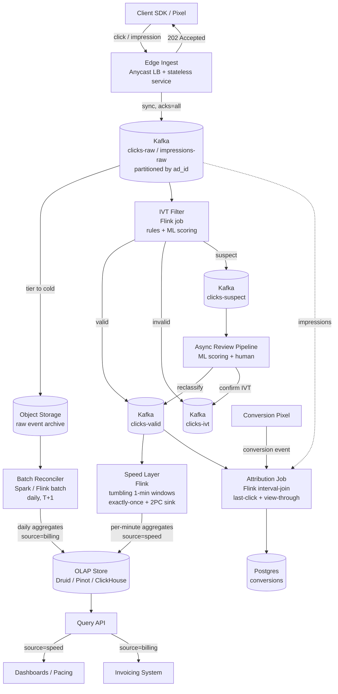

# Design an Ad Click Aggregator — Exactly-Once Streaming, Fraud Filtering, and Billing-Grade Accuracy

**Date:** 2026-04-25 | **Updated:** 2026-04-25
**Tags:** `system-design` `case-study` `ads` `streaming` `hard`

## Table of Contents

- [Summary](#summary)
- [Functional Requirements](#functional-requirements)
- [Non-Functional Requirements](#non-functional-requirements)
- [Capacity Estimation](#capacity-estimation)
- [API Design](#api-design)
- [Data Model](#data-model)
- [High-Level Design](#high-level-design)
- [Deep Dives](#deep-dives)
  - [1. Click Capture and Fraud / Invalid-Traffic Filtering](#1-click-capture-and-fraud--invalid-traffic-filtering)
  - [2. Attribution Windows — Last-Click vs View-Through](#2-attribution-windows--last-click-vs-view-through)
  - [3. Exactly-Once Aggregation with Flink + Kafka Two-Phase Commit](#3-exactly-once-aggregation-with-flink--kafka-two-phase-commit)
  - [4. Late-Arriving Events — Watermarks, Allowed Lateness, and Side Outputs](#4-late-arriving-events--watermarks-allowed-lateness-and-side-outputs)
  - [5. Lambda vs Kappa — Real-Time Speed Layer + Batch Reconciliation for Billing](#5-lambda-vs-kappa--real-time-speed-layer--batch-reconciliation-for-billing)
- [Bottlenecks & Trade-offs](#bottlenecks--trade-offs)
- [Anti-Patterns](#anti-patterns)
- [Related](#related)
- [References](#references)

## Summary

An ad click aggregator turns billions of raw click events per day into the per-ad, per-campaign, per-minute counts that drive **dashboards, pacing, optimization, and — most importantly — billing**. Get this wrong and you under-bill a publisher (lost revenue) or over-bill an advertiser (lawsuit, IAB/MRC audit failure, reputational damage). The constraints are unusually tight for a streaming system because money is involved.

Three forces shape the design:

1. **High write throughput.** Every ad impression and click must be captured at sub-100ms latency from edge to durable log. A Super Bowl spot can produce 100K+ clicks per second for a few minutes.
2. **Exactly-once accounting.** Double-counting one click and the advertiser is overcharged. Dropping one click and the publisher is underpaid. Neither is acceptable for billing — though approximate is fine for live dashboards.
3. **Fraud is the norm, not the exception.** Industry estimates put invalid traffic at 10–25% of raw clicks. The pipeline must filter Sophisticated Invalid Traffic (SIVT) before the events touch billing aggregates, ideally per IAB/MRC accreditation standards.

The realistic design separates fast and accurate:

- A **speed layer** (Flink on Kafka) emits per-minute aggregates within seconds, used for dashboards, pacing, and optimization. Approximate is acceptable here.
- A **batch reconciliation layer** (daily Spark or Flink batch over the same Kafka log replayed from S3/HDFS) produces the **system-of-record** numbers used for invoicing. Exactness is mandatory here.

Both layers consume the **same immutable event log** in Kafka and write distinguishable rows in the OLAP store (Druid / Pinot / ClickHouse). Billing is invoiced from the reconciled batch result, not the speed layer.

## Functional Requirements

| Requirement | Notes |
|---|---|
| **Capture click events** | `POST /v1/click` — sub-100ms p99, durable, idempotent on `click_id` |
| **Capture impression events** | `POST /v1/impression` — needed for view-through attribution and CTR |
| **Real-time per-minute counts** | Per-ad, per-campaign, per-publisher counts available within ~10 s of event time |
| **Attribution** | Conversions credited to the last qualifying click within the attribution window; view-through credit when no click exists |
| **Fraud / IVT filtering** | Filter General IVT (bots, datacenter IPs, duplicate clicks) before aggregation; route Sophisticated IVT to a separate review pipeline |
| **Billing-grade aggregates** | Daily reconciled, exactly-once counts used for invoicing |
| **Query API** | Range queries on (`ad_id`, `campaign_id`, `publisher_id`) over (minute, hour, day) granularity |
| **Replay / backfill** | Ability to recompute any historical window from the durable log if rules change |

Out of scope for this design:
- The bidding/auction system that decided to show the ad (separate RTB pipeline)
- Ad creative serving (CDN concern)
- Advertiser-facing reporting UI (consumer of this system, not part of it)
- Privacy compliance specifics (GDPR/CCPA cookie semantics — handled at the SDK boundary)

## Non-Functional Requirements

| NFR | Target |
|---|---|
| **Edge ingest latency p99** | < 100 ms from client to durable Kafka write |
| **Speed-layer freshness** | Per-minute aggregates visible within 10 seconds of event time for dashboards |
| **Billing aggregate accuracy** | Exactly-once: every valid click counted exactly once across the daily reconciled total |
| **Event durability** | Zero loss after Kafka `acks=all` to ISR; tolerate 1 broker AZ failure with no replay |
| **Sustained click throughput** | 1M events/sec aggregate (clicks + impressions); 5× burst headroom |
| **Late-event tolerance** | Accept events up to 1 hour late into per-minute windows; events later than 24 h go to a side output |
| **Query latency p99** | < 500 ms for dashboard reads on the OLAP store |
| **Availability** | 99.99% for ingest; 99.9% for query |
| **IVT filtering compliance** | Aligned with IAB Click Measurement Guidelines and MRC IVT accreditation expectations |

The phrase to internalize: **dashboards can lie a little; invoices cannot lie at all**. The architecture exists to honor that asymmetry.

## Capacity Estimation

### Baseline scale

- **Daily impressions:** 50 billion
- **Daily clicks:** 500 million (CTR ≈ 1%)
- **Aggregate event rate:** ~600K/sec average, ~3M/sec peak (impressions dominate)
- **Click rate:** ~6K/sec average, ~50K/sec peak

### Storage

| Stream | Event size | 1-day raw | 1-year raw |
|---|---|---|---|
| Impression | ~250 B (ad_id, user, device, geo, ts, context) | 50 B × 250 B ≈ **12.5 TB/day** | ~4.5 PB/year |
| Click | ~300 B (impression_id, click_id, geo, device, ts) | 500 M × 300 B ≈ **150 GB/day** | ~55 TB/year |
| Per-minute aggregate row | ~80 B | a few GB/day in OLAP | tens of TB/year |

Raw events live in Kafka for 7 days (replay window) and S3/object storage indefinitely (cold tier for batch reconciliation and backfill).

### Read vs write

- **Writes** dominate the ingest path (3M/sec peak).
- **Reads** are in the thousands/sec on the OLAP store, mostly served from pre-aggregated rollups.
- Read fan-in over per-minute rows of a campaign for "last 24 h" is at most 1,440 rows per dimension — trivial for Druid/Pinot/ClickHouse.

### Why these numbers matter

- **3M/sec sustained write** mandates a partitioned log (Kafka) with hundreds of partitions; a single SQL row insert per event is impossible.
- **150 GB/day click data × 365 days = 55 TB raw** — small enough to keep replayable in object storage cheaply; reconciliation cost stays bounded.
- **500M clicks/day at $0.50–$5 CPC** means daily billing volume is in the hundreds of millions of dollars. Even 0.01% counting error is catastrophic.

## API Design

### Edge ingest — click

```http
POST /v1/click
Content-Type: application/json
Idempotency-Key: <click_id_uuid>

{
  "click_id": "c_018f...",          // UUID; client-generated, idempotency key
  "impression_id": "i_018f...",     // links to the impression
  "ad_id": "ad_42",
  "campaign_id": "cmp_7",
  "publisher_id": "pub_9",
  "user_pseudo_id": "u_hash",
  "ts_client": "2026-04-25T10:31:02.451Z",
  "ip": "203.0.113.42",
  "user_agent": "...",
  "referrer": "https://...",
  "geo": {"country": "US", "region": "CA"}
}

202 Accepted
{
  "click_id": "c_018f...",
  "received_at": "2026-04-25T10:31:02.460Z",
  "redirect_url": "https://advertiser.example/landing?utm=..."
}
```

The response is **202** because the event has been durably enqueued, not because billing has accepted it. The client follows the `redirect_url` immediately; aggregation happens asynchronously.

### Query — aggregated counts

```http
GET /v1/metrics?ad_id=ad_42&from=2026-04-25T00:00Z&to=2026-04-25T23:59Z&granularity=minute&source=speed
GET /v1/metrics?ad_id=ad_42&from=2026-04-24&to=2026-04-24&granularity=day&source=billing

200 OK
{
  "ad_id": "ad_42",
  "granularity": "minute",
  "source": "speed",                 // "speed" | "billing"
  "as_of": "2026-04-25T10:31:30Z",
  "rows": [
    {"window_start": "2026-04-25T10:30:00Z", "valid_clicks": 1842, "ivt_filtered": 213, "impressions": 184219}
  ]
}
```

The `source` parameter is load-bearing. `speed` returns the Flink-emitted per-minute view (fast, approximate, may include late-arriving corrections). `billing` returns the daily-reconciled row (slow, exact, finalized once per day at T+1).

### Internal — replay / backfill

```http
POST /v1/admin/backfill
{
  "from": "2026-04-20T00:00Z",
  "to":   "2026-04-21T00:00Z",
  "reason": "IVT rule v2.3 deployed; reprocessing clicks with new bot signature",
  "target": "billing"
}
```

Backfill rewrites the billing rollups in place by replaying the immutable Kafka/S3 log through the new rule version. The speed-layer rows are not touched.

## Data Model

### Immutable raw event log (Kafka + S3 cold tier)

```text
topic: clicks-raw (partitions: 256, replication: 3, retention: 7d)
key:   ad_id      (so all events for an ad land on one partition → stateful aggregation)
value: ClickEvent (Avro/Protobuf)
```

Same shape for `impressions-raw`. Both topics tier to S3 / GCS via Kafka Connect or equivalent for indefinite retention.

### Curated event log (post-IVT)

```text
topic: clicks-valid    (events that passed IVT filter)
topic: clicks-ivt      (events flagged as invalid; reviewed offline)
topic: clicks-suspect  (sophisticated IVT candidates; held for ML scoring)
```

The split happens once. Downstream aggregators consume only `clicks-valid`. The other topics feed ML retraining and audit.

### Per-minute aggregate table (OLAP — Druid / Pinot / ClickHouse)

```sql
CREATE TABLE click_aggregates (
  window_start    TIMESTAMP NOT NULL,         -- minute bucket, UTC
  granularity     VARCHAR NOT NULL,           -- 'minute' | 'hour' | 'day'
  ad_id           BIGINT NOT NULL,
  campaign_id     BIGINT NOT NULL,
  publisher_id    BIGINT NOT NULL,
  source          VARCHAR NOT NULL,           -- 'speed' | 'billing'
  valid_clicks    BIGINT NOT NULL,
  ivt_filtered    BIGINT NOT NULL,
  impressions     BIGINT NOT NULL,
  spend_micros    BIGINT NOT NULL,            -- 1e-6 of currency unit
  finalized_at    TIMESTAMP,                  -- non-null once reconciled
  PRIMARY KEY (window_start, granularity, ad_id, source)
);
```

The composite primary key includes `source` so speed-layer and billing rows for the same minute coexist. Dashboards default to `source = 'speed'`; invoicing reads `source = 'billing'`.

### Attribution table (post-conversion join)

```sql
CREATE TABLE conversions (
  conversion_id    UUID PRIMARY KEY,
  user_pseudo_id   TEXT NOT NULL,
  conversion_ts    TIMESTAMPTZ NOT NULL,
  attributed_click_id     UUID,              -- last-click within window, may be NULL
  attributed_impression_id UUID,             -- view-through fallback, may be NULL
  attribution_model       TEXT NOT NULL,     -- 'last_click' | 'view_through'
  attribution_window_sec  INT NOT NULL       -- e.g. 604800 (7 days)
);
```

## High-Level Design



The flow on a click:

1. SDK fires `POST /v1/click` with a client-generated `click_id`.
2. Edge service validates schema, attaches server-side `ts_server` and `ip`, writes to Kafka `clicks-raw` with `acks=all`, returns `202` and the redirect URL.
3. IVT Flink job consumes `clicks-raw`, applies deterministic rules (datacenter IP list, duplicate-within-N-seconds, malformed user agent) and ML scoring, splits the stream into `clicks-valid` / `clicks-ivt` / `clicks-suspect`.
4. Speed-layer Flink job consumes `clicks-valid`, aggregates into per-minute tumbling windows keyed by `(ad_id, campaign_id, publisher_id)`, commits results to the OLAP store via two-phase commit on each Flink checkpoint.
5. At T+1, the batch reconciler reads the same day from S3 (raw) plus the latest IVT rules and rebuilds the daily aggregates with `source = 'billing'`. These rows are immutable once `finalized_at` is set.

The flow on a query:

1. Dashboards hit `source=speed` for live pacing.
2. Invoicing reads `source=billing` only.
3. Discrepancies between the two are expected and logged — they're the SLA on IVT detection.

## Deep Dives

### 1. Click Capture and Fraud / Invalid-Traffic Filtering

#### Click capture is "log first, decide later"

The edge ingest service does almost nothing synchronously. Validate the JSON shape, stamp server-side timestamp and IP, write to Kafka with `acks=all`, return 202. **Do not** call the IVT service in the request path — that coupling makes the click API as unreliable as the slowest dependency, and the redirect-to-landing-page must happen in tens of milliseconds.

This design choice is forced by the trade-off: a slow click endpoint costs the advertiser a conversion (user gives up). A wrong count is fixable at T+1. So we optimize for speed at ingest and correctness downstream.

#### Why filter before aggregation, not after

The naïve design counts every raw click and "subtracts fraud later." Two problems:

1. The speed-layer dashboards then show inflated numbers that pacing systems use to decide whether to keep spending. You overspend by the IVT percentage on a campaign — typically 10–25% per industry baselines.
2. Subtracting later requires a join across two large datasets to invalidate already-counted rows. This is expensive and errors compound.

Filter once, at the boundary between `clicks-raw` and `clicks-valid`. The IVT-flagged stream is preserved (separate topic) so audits, retraining, and reclassification stay possible.

#### What the IVT Flink job actually does

It applies layered rules of increasing cost:

| Layer | Latency | Examples | Action |
|---|---|---|---|
| **General IVT (cheap, deterministic)** | sub-ms | Datacenter IP, known bot UA, malformed click_id, duplicate `click_id` already seen | drop to `clicks-ivt` |
| **Behavioral (per-key state)** | ms | Same user_pseudo_id clicking the same ad >5× in 60 s; clicks faster than human reaction time after impression | drop to `clicks-ivt` |
| **Sophisticated IVT (ML scoring)** | tens of ms | Suspicious device fingerprint clusters, residential proxies, click farms | route to `clicks-suspect` for offline review |
| **Pass-through** | — | Anything that survives | emit to `clicks-valid` |

The duplicate check uses Flink keyed state with TTL (e.g., 24 h) on the `click_id` so the job is naturally idempotent against Kafka redelivery — a redelivered raw click finds itself in state and is dropped without affecting `clicks-valid`.

The Interactive Advertising Bureau's Click Measurement Guidelines and the MRC's Invalid Traffic Detection accreditation define the standard taxonomy (General IVT vs Sophisticated IVT). Aligning the job to those categories is what lets the platform claim measurement compliance to advertisers.

```java
// Sketch — Flink keyed-process function for duplicate suppression
public class DupSuppressFn extends KeyedProcessFunction<String, ClickEvent, ClickEvent> {
    private transient ValueState<Boolean> seen;

    @Override
    public void open(Configuration cfg) {
        StateTtlConfig ttl = StateTtlConfig.newBuilder(Time.hours(24))
            .setUpdateType(StateTtlConfig.UpdateType.OnCreateAndWrite)
            .build();
        ValueStateDescriptor<Boolean> desc = new ValueStateDescriptor<>("seen", Boolean.class);
        desc.enableTimeToLive(ttl);
        seen = getRuntimeContext().getState(desc);
    }

    @Override
    public void processElement(ClickEvent e, Context ctx, Collector<ClickEvent> out) throws Exception {
        if (seen.value() == null) {
            seen.update(true);
            out.collect(e);
        }
        // else: drop silently; downstream side-output captures count for monitoring
    }
}
```

### 2. Attribution Windows — Last-Click vs View-Through

Attribution is the join that says *which click (or impression) caused this conversion*. The attribution window is the time horizon in which a click or impression is eligible for credit.

Common defaults (industry baselines, configurable per advertiser):

| Model | Window | Used for |
|---|---|---|
| **Last-click** | 7 days for search; 1–30 days for display | Default credit; the last qualifying click before conversion wins |
| **View-through** | 1–24 hours typical (Meta default 1d), up to 30 days for display | Credit an impression with no click if no qualifying click exists in the click window |

Google Ads and Meta both default to last-click; view-through fills the gap when the user saw the ad, didn't click, and converted later — the impression still influenced the decision.

#### Implementation as a Flink interval join

```sql
-- Conceptual — Flink SQL interval join, last-click attribution
SELECT
  conv.conversion_id,
  conv.user_pseudo_id,
  conv.conversion_ts,
  click.click_id,
  click.ad_id,
  click.campaign_id
FROM conversions conv
LEFT JOIN clicks_valid click
  ON conv.user_pseudo_id = click.user_pseudo_id
 AND click.ts BETWEEN conv.conversion_ts - INTERVAL '7' DAY
                  AND conv.conversion_ts
QUALIFY ROW_NUMBER() OVER (
  PARTITION BY conv.conversion_id
  ORDER BY click.ts DESC
) = 1;
```

For view-through, the same query runs against `impressions_raw` with the shorter window and only fires when the click join produced no row. The result is one attribution decision per conversion: last-click wins; impression-only fallback if no click exists.

#### Trade-offs the attribution model imposes

- **Window length affects state size.** A 7-day click window means Flink keeps clicks keyed by `user_pseudo_id` in state for 7 days. At 500M clicks/day × 7 = 3.5B click rows in state. Use RocksDB-backed keyed state and consider sub-keying by user-id hash to shard hot users.
- **Late conversions.** A conversion arriving 3 days late must still find its click. Flink's allowed lateness is set generously on the conversion stream; the click stream is the bounded one.
- **Multi-touch attribution** (linear, time-decay) is a strict superset; it requires preserving all qualifying clicks per conversion, not just one. Same join shape, different aggregation.
- **Privacy frameworks** (iOS 14 ATT, GDPR consent) shorten or zero-out the window for opted-out users; the model must accept "no attribution possible" as a valid output.

### 3. Exactly-Once Aggregation with Flink + Kafka Two-Phase Commit

Billing requires that the daily reconciled count for an ad equals the number of valid clicks for that ad — exactly. Not "approximately." The mechanism is end-to-end exactly-once via Flink's `TwoPhaseCommitSinkFunction` (introduced in Flink 1.4) combined with Kafka transactional producers (Kafka 0.11+).

#### How the two-phase commit lifecycle works

1. **Pre-commit** — Flink's JobManager injects a checkpoint barrier into every source. Each operator snapshots its state. The Kafka sink begins a Kafka transaction and writes aggregated results to the output topic in `uncommitted` state.
2. **Commit** — Once all operators acknowledge the checkpoint, the JobManager triggers `notifyCheckpointComplete`. The Kafka sink commits the transaction, flipping the writes to `committed` so downstream `read_committed` consumers see them.
3. **Recovery** — If the job crashes between pre-commit and commit, on restart Flink restores from the last completed checkpoint; the in-flight Kafka transaction is aborted by the producer's transactional ID re-fencing. No duplicates, no lost data.

```text
Time →
┌────────┐  barrier   ┌────────┐  barrier   ┌────────┐
│ chk N  │ ─────────► │ chk N+1│ ─────────► │ chk N+2│
└────────┘            └────────┘            └────────┘
   │                     │                     │
   ▼                     ▼                     ▼
Kafka tx N         Kafka tx N+1          Kafka tx N+2
(committed)        (committed)           (committed)
                     ▲
              Crash here → Flink restarts from chk N
              tx N+1 is aborted by producer ID fencing
              Replay from chk N → re-produces tx N+1 deterministically
```

Uber's ad event processing (described in their engineering blog post and InfoQ summary) is the canonical real-world reference: Flink with Kafka source/sink, `read_committed` downstream consumer, and a stable event identifier (`click_id + source + minute_bucket`) used for idempotent insert into Pinot. The post-aggregation insert is itself idempotent because the OLAP row key is `(window_start, ad_id, source)`, so a re-applied transaction overwrites the same row with the same value.

#### What "exactly-once" actually guarantees

- **Within Flink:** every input record affects state exactly once.
- **Sink-to-sink:** results are committed to the next-stage Kafka topic exactly once *as observed by `read_committed` consumers*.
- **End-to-end into OLAP:** only if the OLAP insert is idempotent on the natural key — Druid `replace` semantics, Pinot upsert tables, ClickHouse `ReplacingMergeTree`. Otherwise, you're back to at-least-once at the final hop.

#### Cost of exactly-once

- **Latency floor.** Results are visible only on checkpoint completion. A 30-second checkpoint interval means dashboard freshness is 30 s + processing time. Tunable, but there is a floor below which checkpoints become wasteful.
- **State size.** Two-phase commit keeps unconfirmed transactions in producer memory; long checkpoint intervals + high throughput → larger transactional state.
- **Operational complexity.** Transactional Kafka producers, fencing, checkpoint storage on durable backend (S3 / HDFS) are all required. This is not "turn it on with one config flag."

#### Why we don't run exactly-once on the speed layer alone for billing

We do run exactly-once in the speed layer — it gets us 99.9%+ correct numbers within seconds. What it does not handle is **late-arriving events past the allowed lateness window** and **rule changes** (a new IVT signature deployed mid-day). Both are handled by the batch reconciler, which is allowed to take hours and produce the final invoice numbers from the immutable raw log.

### 4. Late-Arriving Events — Watermarks, Allowed Lateness, and Side Outputs

Mobile clients lose connectivity. Edge nodes flush buffers in batches. A click physically happens at 10:30:00 but lands in Kafka at 10:31:15. The minute window for `[10:30:00, 10:31:00)` has already closed in any naïve implementation. We need event-time semantics.

#### Watermarks

Flink uses watermarks to assert "no event with timestamp < W will arrive after this point." A watermark is a low-water-mark on event time, advanced based on observed event timestamps minus a bounded-out-of-orderness allowance.

```java
WatermarkStrategy<ClickEvent> strategy = WatermarkStrategy
    .<ClickEvent>forBoundedOutOfOrderness(Duration.ofSeconds(30))
    .withTimestampAssigner((event, ts) -> event.tsClient.toEpochMilli());
```

This says: "I expect events to be at most 30 seconds out of order. Once I've seen event time T, I'll emit watermark T - 30s." Per-minute tumbling windows close when the watermark crosses the window end.

#### Allowed lateness

A 30-second bound is fine for in-network jitter but useless for offline mobile users syncing an hour later. Set `allowedLateness` to extend the window's lifetime:

```java
clicks.keyBy(c -> c.adId)
      .window(TumblingEventTimeWindows.of(Time.minutes(1)))
      .allowedLateness(Time.hours(1))
      .sideOutputLateData(LATE_TAG)
      .aggregate(new ClickAggFn());
```

For `allowedLateness = 1 hour`:
- Window `[10:30, 10:31)` closes when watermark crosses 10:31:00.
- Window state is **retained** until watermark reaches 11:31:00.
- Events arriving in the grace period **trigger re-emission** of the window with the corrected aggregate.
- Events later than 1 hour go to a **side output** (`LATE_TAG`) for separate handling — typically routed back into the batch reconciler's input.

The OLAP layer must handle re-emission: each emission carries the same `(window_start, ad_id, source='speed')` key, so an upsert overwrites the prior approximate row with the updated one.

#### Tumbling vs sliding for ad metrics

| Window type | Use here |
|---|---|
| **Tumbling 1-minute** | Standard granularity for the rollup table; one event → one window |
| **Sliding 5-minute, 1-minute slide** | Pacing dashboards that need "rolling 5-minute CTR"; one event → up to 5 windows (memory cost is real) |
| **Session window** | Not used for click counts; would be used for "user session ad exposure" analyses |

Sliding windows duplicate elements across overlapping windows and consume more memory. Use them only where the rolling smoothing is genuinely required (pacing, anomaly detection); never for the per-minute rollup table itself.

### 5. Lambda vs Kappa — Real-Time Speed Layer + Batch Reconciliation for Billing

Lambda architecture splits the pipeline into a speed layer (low-latency, approximate) and a batch layer (high-latency, accurate). Kappa unifies both on a single streaming engine and replays from the log when reprocessing is needed.

For an ad click aggregator with hard billing requirements, the design is **closer to Lambda but built on Kappa-style infrastructure**:

| Layer | Engine | Latency | Output | Used by |
|---|---|---|---|---|
| **Speed** | Flink streaming on `clicks-valid` | seconds | `source='speed'` rows | Dashboards, pacing, optimization |
| **Batch reconciliation** | Spark / Flink batch over S3 raw log | T+1 (daily) | `source='billing'` rows, finalized | Invoicing, audits, advertiser reports |

Crucially, **both layers consume the same immutable raw log**, just at different cadences. There is no "duplicate codebase" problem if the IVT rules and aggregation logic are written once as a library and invoked by both. Some teams further unify by running the same Flink job in batch mode against bounded S3 input — a Kappa-flavored implementation of a Lambda topology.

#### Why have two layers at all?

| Concern | Speed layer | Batch reconciler |
|---|---|---|
| **Late events past 1 h** | Drops to side output | Picks them up; full day of data is available |
| **Rule version drift** | Locked to whatever was deployed at event time | Always replays with the latest rule version |
| **Backfills / corrections** | Cannot rewrite history cheaply | Designed for it |
| **Audit and replay** | State is ephemeral | Output is reproducible from S3 forever |

The speed layer's job is **freshness**. The batch reconciler's job is **truth**. Invoicing reads only truth.

#### Reconciliation discrepancies are signals, not bugs

When the speed layer's daily sum and the batch reconciler's daily sum disagree, the difference is informative:

- **Difference ≤ 0.1%:** late events past `allowedLateness`. Healthy.
- **Difference 1–5%:** IVT rule drift between speed and batch. Either fix the rule deployment or accept that batch is the system of record (it is).
- **Difference > 5%:** likely a streaming bug — checkpoint failure, partition skew, dropped records. Page the on-call.

The discrepancy is logged per-(ad_id, day) so it is itself a queryable metric in the OLAP store. This converts a hard correctness problem into a tractable monitoring problem.

## Bottlenecks & Trade-offs

| Component | Bottleneck | Mitigation |
|---|---|---|
| Edge ingest | Kafka producer p99 spikes during broker rebalance | Stateless edge service with regional Kafka clusters; cross-region async replication; tier raw to S3 cheaply |
| Kafka partitioning | Hot ads (Super Bowl) saturate one partition (single-partition write is sequential) | Sub-partition by `(ad_id, hash(user_pseudo_id) % N)`; aggregator merges sub-keys at the end of windowing |
| IVT job state | Per-`click_id` dedup state for 24 h × billions of clicks | RocksDB-backed keyed state, TTL'd; partition by `click_id` so state is local |
| Flink checkpointing | Long checkpoints block transaction commit, increasing latency | Tune checkpoint interval (15–60 s) vs latency target; use unaligned checkpoints in Flink 1.11+ for backpressure |
| Two-phase commit | Transactional producer overhead reduces throughput vs at-least-once | Accept the cost on the billing path; speed-layer dashboards can run a parallel at-least-once job if extreme freshness is needed |
| Attribution state | 7-day click state × 500M clicks/day = billions of rows in keyed state | RocksDB + incremental checkpoints; consider externalizing to a KV store for ultra-long windows |
| OLAP fan-in | Range query over 1,440 minute rows for a campaign-day | Pre-roll to hourly and daily granularities at write time; serve dashboards from the coarsest acceptable rollup |
| Reconciliation lag | T+1 invoice means 24+ hours between event and final number | Acceptable for billing — advertisers expect daily statements; intra-day pacing uses speed layer |
| Storage cost | PB-scale raw archive | S3 / GCS lifecycle policies: Standard for 30 days, IA for 90 days, Glacier beyond; cost is dominated by impressions, not clicks |
| Schema evolution | Click event shape changes break replays | Avro/Protobuf with strict backward compatibility; reconciler tolerates field-level schema migration |

The dominant trade-off is **freshness vs correctness**. We refuse to choose: dashboards see "fresh + approximate" via the speed layer; invoicing sees "delayed + exact" via batch. The architecture exists to honor both readers from one immutable log.

## Anti-Patterns

1. **Inserting clicks straight into a relational counter.** The familiar `UPDATE ad_metrics SET clicks = clicks + 1 WHERE ad_id = ?` pattern collapses on the same hot-row contention covered in the likes-counter design — except now lost or double-counted writes show up in the invoice. Always go through the durable log.

2. **At-least-once aggregation feeding billing.** "We'll just dedupe later" rarely survives contact with a viral ad. By the time you discover the duplicate counts, the speed-layer dashboards have been wrong for hours and pacing has overspent.

3. **Filtering IVT after aggregation.** The dashboards then reflect inflated numbers; pacing systems overspend on fraudulent ads. Filter once, at the boundary, and keep the IVT stream addressable for reclassification.

4. **Single Kafka partition per ad.** Looks neat, breaks on viral spend. Sub-partition by hash of user or impression and reduce on aggregate.

5. **Skipping watermarks / event-time.** Processing-time windowing puts the click into whichever minute Kafka delivered it — not the minute the user clicked. Reports will not reconcile against advertiser expectations.

6. **Allowed-lateness set to zero.** Mobile and offline scenarios produce events tens of minutes late. Dropping them silently understates the count; advertisers eventually notice via their own server-side conversion logs.

7. **No batch reconciliation; only speed layer.** Acceptable for dashboards; unacceptable for invoicing. Batch reconciliation also covers the case where IVT rules are updated retroactively.

8. **Reading the speed layer for billing.** The speed layer is approximate by design. The `source='billing'` rows exist for a reason; the API must enforce that invoicing reads only those.

9. **Storing raw clicks in the OLAP store.** Druid/Pinot/ClickHouse are query engines, not durable raw stores. Raw lives in Kafka and S3; OLAP holds aggregates only.

10. **Treating click and impression as the same shape.** Impressions are 100× the volume; they need their own topic, their own retention, their own aggregator. Mixing them in one stream wastes bandwidth and complicates schema evolution.

11. **Trusting client timestamps for billing.** `ts_client` is observable evidence of fraud (clock-skew, replay attacks). Use server-side `ts_server` for billing windows; keep `ts_client` for diagnostics only.

12. **Using sliding windows for the per-minute rollup.** Sliding windows duplicate events across overlapping windows. The rollup table has no need for that; tumbling windows are right.

## Related

- [Stream Processing](../../communication/stream-processing.md) — windowing, watermarks, exactly-once foundations applied here.
- [Idempotency and Exactly-Once](../../communication/idempotency-and-exactly-once.md) — the broader pattern; the click pipeline is one of its hardest applications.
- [Message Queues and Brokers](../../building-blocks/message-queues-and-brokers.md) — Kafka semantics, partitioning, transactional producers.
- [Designing a Likes Counting System](../social-media/design-likes-counting-system.md) — adjacent counting system; sharded counters and approximate aggregation overlap conceptually but the billing constraint here forbids approximation in the final hop.
- [Real-Time Leaderboard](../counting-ranking/design-realtime-leaderboard.md) — same Flink + Kafka backbone, different query shape.

## References

- [Real-Time Exactly-Once Ad Event Processing with Apache Flink, Kafka, and Pinot — Uber Engineering](https://www.uber.com/us/en/blog/real-time-exactly-once-ad-event-processing/) — production reference for ad event aggregation: Flink with `read_committed` Kafka consumer, two-phase commit Kafka sink, idempotent Pinot upserts, stable event identifiers for dedup.
- [An Overview of End-to-End Exactly-Once Processing in Apache Flink — Apache Flink blog](https://flink.apache.org/2018/02/28/an-overview-of-end-to-end-exactly-once-processing-in-apache-flink-with-apache-kafka-too/) — original announcement and explanation of `TwoPhaseCommitSinkFunction` (Flink 1.4) integrated with Kafka 0.11+ transactional producers.
- [Apache Flink Windows documentation](https://nightlies.apache.org/flink/flink-docs-stable/docs/dev/datastream/operators/windows/) — official semantics for tumbling, sliding, and session windows; allowed-lateness and side-output behavior.
- [Apache Flink Timely Stream Processing — Event Time and Watermarks](https://nightlies.apache.org/flink/flink-docs-stable/docs/concepts/time/) — official reference on event-time, watermark strategies, and `forBoundedOutOfOrderness`.
- [Flink Checkpointing documentation](https://nightlies.apache.org/flink/flink-docs-master/docs/dev/datastream/fault-tolerance/checkpointing/) — checkpoint barriers, state snapshots, and how recovery reconstructs exactly-once semantics.
- [Google Ads — About Invalid Traffic](https://support.google.com/google-ads/answer/11182074?hl=en) and [Google Ad Traffic Quality](https://www.google.com/ads/adtrafficquality/) — definitions of General IVT and Sophisticated IVT, MRC accreditation context, types of invalid traffic the filter must address.
- [IAB Click Measurement Guidelines (PDF)](https://www.iab.com/wp-content/uploads/2015/06/click-measurement-guidelines2009.pdf) — the canonical industry document on how clicks are counted and how invalid clicks are detected and excluded; the basis for advertiser-platform measurement contracts.
- [Adjust — What is an Attribution Window?](https://www.adjust.com/glossary/attribution-window/) and [Google Ads — About Conversion Windows](https://support.google.com/google-ads/answer/3123169?hl=en) — attribution-window semantics, click-through and view-through models, default values used by major platforms.
- [Lambda architecture — Wikipedia](https://en.wikipedia.org/wiki/Lambda_architecture) and [Kappa Architecture is Mainstream Replacing Lambda — Kai Waehner](https://www.kai-waehner.de/blog/2021/09/23/real-time-kappa-architecture-mainstream-replacing-batch-lambda/) — speed-vs-batch architectural lineage; Kappa as the modern unified approach when reprocessing-from-log replaces a separate batch system.
- [How to Build a Real-Time Advertising Platform with Apache Kafka and Flink — Kai Waehner](https://www.kai-waehner.de/blog/2023/09/15/how-to-build-a-real-time-advertising-platform-with-apache-kafka-and-flink/) — applied Kafka + Flink reference architecture for ad platforms covering ingest, fraud, attribution, and analytics.
