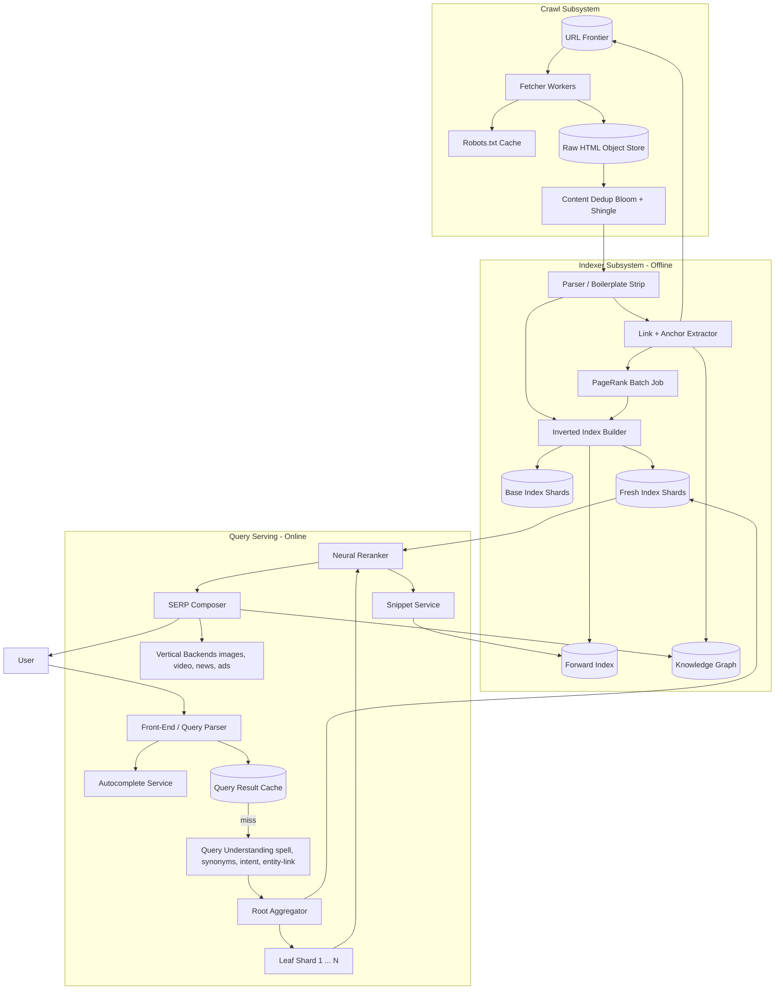
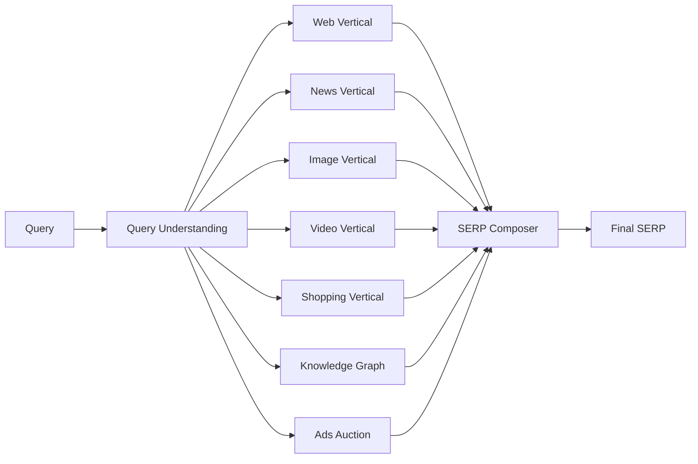

# Design Google Search — Crawl, Index, Rank, Serve in 200ms

**Date:** 2026-04-25 | **Updated:** 2026-04-25
**Tags:** `system-design` `case-study` `search` `ranking` `hard`
**LLD Twin:** [Simple Search Engine (LLD) — Inverted Index, Tokenizer, TF-IDF](../../../low-level-design/case-studies/data-structures/design-simple-search-engine.md) — class-level OOD with entities, relationships, and patterns.


## Table of Contents

- [Summary](#summary)
- [Functional Requirements](#functional-requirements)
- [Non-Functional Requirements](#non-functional-requirements)
- [Capacity Estimation](#capacity-estimation)
- [API Design](#api-design)
- [Data Model](#data-model)
- [High-Level Design](#high-level-design)
- [Deep Dives](#deep-dives)
  - [Web Crawling at Scale — Politeness, Dedup, Freshness](#web-crawling-at-scale--politeness-dedup-freshness)
  - [Inverted Index Sharding — Term-Partitioned vs Doc-Partitioned](#inverted-index-sharding--term-partitioned-vs-doc-partitioned)
  - [Query Serving and the Latency Budget](#query-serving-and-the-latency-budget)
  - [Ranking Signals — PageRank, BM25, Query Understanding](#ranking-signals--pagerank-bm25-query-understanding)
  - [Freshness vs Depth — Two Indexes, One Verdict](#freshness-vs-depth--two-indexes-one-verdict)
  - [Autocomplete and Query Rewriting](#autocomplete-and-query-rewriting)
  - [Federated Multi-Vertical Search and SERP Composition](#federated-multi-vertical-search-and-serp-composition)
- [Bottlenecks & Trade-offs](#bottlenecks--trade-offs)
- [Anti-Patterns](#anti-patterns)
- [Related](#related)
- [References](#references)

## Summary

Google Search has to read most of the public web, distill it into a query-ready index, and answer arbitrary natural-language queries against that index in under a quarter of a second. The system is three loosely-coupled subsystems — a continuous **crawl**, an offline **indexer**, and an online **query serving** stack — joined by an inverted index that is sharded across thousands of leaf servers. The hard parts are not any one component; they are the trade-offs that cut across all of them: term-partitioned vs doc-partitioned sharding, fresh-tier vs deep-tier indexes, two-stage retrieval-then-rerank with hundreds of signals, query understanding (spell correction, synonyms, intent, entity linking) that runs **before** the index is even touched, and SERP composition that federates web, images, video, news, knowledge-graph, and ads into one ranked page.

This case study designs that stack end-to-end with emphasis on the crawl pipeline, inverted index sharding, the 200ms query latency budget, ranking signals, and how freshness gets reconciled with depth.

## Functional Requirements

**Must-have (in scope):**
- **Web search** — given a free-text query, return a ranked list of web results (10/page) with title, URL, and snippet.
- **Autocomplete / query suggestions** — as the user types, show prefix-matched suggested completions.
- **Spell correction and query rewriting** — "Did you mean X?", silent rewrites for stemming/synonyms, near-duplicate query handling.
- **Snippets** — content excerpt highlighting matched query terms; pulled from the indexed page.
- **Freshness** — newly published pages appear in results within minutes for news queries; within hours/days for the long tail.
- **Verticals (federated search)** — web, images, videos, news, maps, shopping, knowledge graph. The SERP blends them.
- **Knowledge panel** — for entity-recognized queries ("barack obama"), show a structured panel from the knowledge graph.
- **Pagination** — page 2, 3, … of results.
- **Locale and language** — results respect the user's region and language preference.

**Out of scope (this design):**
- Ads auction and pacing (treated only as a slot in SERP composition).
- Personalization beyond locale/language/safe-search (in real Google it is limited; assume off here).
- Translation, voice search, image search by image (separate subsystems).
- Crawl of the deep web behind authentication.
- Anti-spam / web-spam classification details (touched as a ranking signal).

## Non-Functional Requirements

- **Query latency.** p50 ≤ 100 ms, p99 ≤ 300 ms end-to-end from query submit to SERP bytes-on-the-wire.
- **Throughput.** Tens of thousands of queries per second sustained; bursts higher around news events.
- **Index freshness.** A two-tier model — a real-time/near-real-time index for fresh content (minutes) and a base index rebuilt continuously over days.
- **Crawl scale.** Hundreds of billions of unique URLs known; tens of billions in the active index. Polite crawling — robots.txt obeyed, per-host rate limits, exponential backoff on 5xx.
- **Availability.** Search must degrade gracefully — if a leaf shard is unreachable, results from remaining shards still ship (with a quality penalty noted internally).
- **Consistency.** The index is **eventually consistent**. A page added now does not need to appear in this second's query, but should appear in this hour's. Updates flow shard-by-shard.
- **Durability.** Crawled pages and index segments are replicated across data centers. Loss of any single DC degrades latency, not correctness.
- **Geo-distribution.** Multiple super-regions; each holds a full index replica. Queries are served from the user's nearest region.
- **Cost.** Crawl bandwidth, index storage, and serving CPU all dominate. Cache hit rates on popular queries (~30–40% of traffic concentrates on a small head) are a primary cost lever.

## Capacity Estimation

Order-of-magnitude. The point is to size shards, fan-out, and storage budgets — not to predict the actual numbers.

**Web corpus**
- URLs known: ~10^11 (hundreds of billions).
- URLs in active index: ~10^10 (tens of billions of pages).
- Average HTML size after boilerplate stripping: ~50 KB.
- Raw text storage for active corpus: 10^10 × 50 KB ≈ **500 PB**, replicated.

**Crawl**
- Refresh rate must touch the active corpus at least once per ~7 days on average (long tail) and within minutes for news/high-PageRank hosts.
- Daily fetches: ~10^10 / 7 ≈ ~1.4B pages/day average ≈ ~16K pages/sec; peak much higher.
- Crawl egress at ~50 KB/page average ≈ ~70 TB/day fetched; gzip on the wire keeps actual bandwidth lower.

**Index size**
- Postings list per term: variable; common terms ("the") appear in nearly every doc; long tail terms appear in tens of docs.
- Compressed inverted index for 10^10 docs: ~10–20% of decompressed text → tens of petabytes, replicated.
- Per shard: ~10^7 docs (tens of millions) on commodity nodes; ~thousand-way doc-partitioned sharding is typical.

**Query traffic**
- QPS: ~10^5 queries/second sustained globally; ~10^10/day.
- Query length: average ~3–4 terms, long-tail up to ~10+ terms.
- Cache hit rate on result cache (head queries): ~30–40%.
- Cache hit rate on document cache (per-shard intermediate): high for stable corpora.

**Latency math**
- 200 ms total budget.
- Doc-partitioned fan-out to ~1000 leaves; each leaf must respond in <100 ms.
- Aggregator merges top-K from each leaf, runs the second-stage reranker on ~1000 candidates, hydrates snippets, composes the SERP.

**Autocomplete**
- Prefix-tree lookups must return in <50 ms p99 because they fire on every keystroke.
- Top suggestions from a prefix: 10.
- Suggestion corpus: hundreds of millions of unique queries with frequencies.

## API Design

The public surface is small; most of the complexity is behind it.

```http
# 1. Web search
GET /search?q=how+do+inverted+indexes+work&start=0&num=10&hl=en&gl=us&safe=active
Accept: text/html, application/json

200 OK
{
  "query": "how do inverted indexes work",
  "rewritten_query": "how do inverted indexes work",
  "spell_suggestion": null,
  "total_results_estimate": 4120000,
  "results": [
    {
      "rank": 1,
      "url": "https://en.wikipedia.org/wiki/Inverted_index",
      "title": "Inverted index - Wikipedia",
      "snippet": "In computer science, an <em>inverted index</em> ...",
      "displayed_url": "en.wikipedia.org > wiki > Inverted_index",
      "rich_features": { "knowledge_card_id": null, "site_links": [] }
    }
    // ...10 items
  ],
  "verticals": {
    "knowledge_panel": null,
    "news": [ /* up to N */ ],
    "images": [ /* up to N */ ],
    "videos": [ /* up to N */ ]
  },
  "ads": { "top": [ /* sponsored */ ], "bottom": [] },
  "next_start": 10
}
```

```http
# 2. Autocomplete (called per keystroke)
GET /complete?q=how+do+invert&hl=en&gl=us
200 OK
{
  "suggestions": [
    "how do inverted indexes work",
    "how do invertebrates breathe",
    "how do invert sugar",
    "how do invertebrate immune systems work"
  ]
}
```

```http
# 3. Vertical-specific search
GET /search?q=...&tbm=isch     # images
GET /search?q=...&tbm=nws      # news
GET /search?q=...&tbm=vid      # videos
```

```http
# 4. Click logging (analytics, not user-facing)
POST /v1/click
{ "query_id": "...", "result_url": "...", "rank": 1, "ts": ... }
202 Accepted
```

The query ID is opaque; the server uses it to join click logs back to the query for offline ranker training (learning-to-rank labels).

## Data Model

Three logically distinct stores: the **document store** (raw + parsed pages), the **inverted index** (term → postings), and the **knowledge graph** (entities + relations). All are built offline and shipped to serving fleets.

**Document store** (key: docid; columnar/wide-column; e.g., Bigtable-class)

```text
doc {
  doc_id: bytes (64-bit hash of canonical URL)
  url: string
  canonical_url: string             # after redirect + dedup
  fetch_ts: ts
  http_status: int
  content_type: string
  language: string
  raw_html_ref: object_storage_ref
  parsed_text: text                 # boilerplate-stripped
  title: text
  meta_description: text
  outlinks: [doc_id]                # for PageRank
  inlinks_count: int                # denormalized
  pagerank: float                   # batch-computed
  spam_score: float
  quality_score: float
  shingle_hash: bytes               # for near-duplicate detection
  last_modified: ts
  freshness_tier: enum(realtime|hourly|daily|weekly|long_tail)
}
```

**Inverted index** (the heart of the system; sharded — see deep dive)

```text
posting_list(term) -> [
  { doc_id, term_freq, positions: [int], field: enum(title|body|anchor|url),
    doc_static_score, ... }
]
```

Postings are compressed (delta-encoded doc_ids, varint TF, gap-coded positions). Each shard holds a slice of the corpus (doc-partitioned) and serves all terms over its slice.

**Forward index** (per-doc term map; used for snippet generation and per-doc feature lookup)

```text
forward(doc_id) -> {
  terms: [{term, positions, field}],
  features_v: vector,            # for second-stage neural reranker
  static_signals: { pagerank, quality, freshness, language, spam_score, ... }
}
```

**Knowledge graph** (entities + typed relations)

```text
entity {
  entity_id, name, aliases, type, description,
  attributes: {birth_date, ...},
  relations: [{type, target_entity_id}]
}
```

The KG powers entity recognition in queries and the knowledge panel on the SERP.

**Suggestion store** (for autocomplete; trie + frequency)

```text
suggestion {
  query_string,
  frequency,
  region, language,
  freshness_decay,
  trending_score
}
```

Stored as a per-region prefix tree (trie / FST) with truncated top-K children per node; updated continuously from the live query log.

**Crawl frontier** (URL queue + per-host metadata)

```text
url_record {
  url, host, last_fetch_ts, http_status_history,
  robots_disallowed: bool, crawl_delay_ms,
  importance_priority: float,    # PageRank-driven
  next_fetch_due_ts
}
```

The frontier is per-host queued so politeness is a property of dequeue order.

## High-Level Design



**Crawl path:**
1. URL frontier dequeues URLs respecting per-host politeness windows.
2. Fetcher checks robots.txt cache, performs HTTP fetch (HTTP/2, gzip).
3. Response stored as raw HTML in object storage; metadata to a wide-column store.
4. Dedup layer (Bloom filter + content-shingle hash) discards near-duplicates.
5. Outlinks discovered during parsing are pushed back into the frontier with priorities derived from the source page's PageRank.

**Indexer path (offline / continuous):**
1. Parser strips boilerplate, extracts text, title, meta, language.
2. Link extractor builds the link graph; anchor text is recorded per outlink (anchor text is a strong signal — it is what other pages call this page).
3. PageRank is computed in batch (e.g., a MapReduce/Pregel-style iterative job over the link graph). Static quality and spam scores are computed alongside.
4. Inverted index builder produces compressed postings, partitioned by document.
5. Output is shipped to serving fleets in two tiers — **fresh** (minutes) and **base** (continuous rolling rebuild).

**Query path (online, hot):**
1. Front-end parses request, checks the result cache by canonicalized query.
2. On miss, query understanding rewrites the query (spell correction, synonym expansion, entity linking, intent classification).
3. Root aggregator fans out the query to all doc-partitioned leaf shards in parallel; each leaf returns its local top-K.
4. The fresh tier is queried in parallel with the base tier; results are merged.
5. Top candidates from the union (a few hundred to a few thousand) are scored by the neural reranker using forward-index features.
6. Snippet service generates highlighted excerpts.
7. SERP composer interleaves web results with verticals (knowledge panel, news, images, video, ads) under a layout policy.
8. Result is cached and returned.

## Deep Dives

### Web Crawling at Scale — Politeness, Dedup, Freshness

The crawler must visit billions of pages without taking sites offline, avoid pulling the same content twice, and prioritize what actually matters.

**Politeness.** robots.txt is fetched and cached per host. The crawl-delay directive, plus an internal default (typically several seconds for low-priority hosts, sub-second for high-PageRank hosts), bounds per-host QPS. The frontier is **per-host queued**: a single dequeue thread per host ensures sequential fetches; many hosts are processed in parallel across the fleet. This was Mercator's design (Heydon and Najork, 1999) and remains the canonical pattern.

**Frontier prioritization.** Not all URLs are equal. A new page on a high-PageRank host (`nytimes.com`, `wikipedia.org`) gets crawled within minutes. A page on a low-traffic site may be revisited weekly. The priority function blends PageRank, change-rate history (how often this URL's content has actually changed), and host-level freshness budget.

**Content dedup.** Two layers:
- **URL canonicalization** — strip tracking params, normalize trailing slashes, follow rel=canonical, resolve redirect chains. Dedup at URL level removes the easy cases.
- **Content fingerprinting** — for the rest, compute a SimHash or shingle-based fingerprint of the document. Near-duplicates (mirrors, scrapers, syndicated content) collapse to a single canonical doc.
- **Bloom filters** at the frontier prevent re-enqueueing already-known URLs cheaply (memory-efficient probabilistic membership test). False positives are tolerable here — a page just doesn't get re-crawled this round; it will be picked up later.

**Crawl ethics.** robots.txt obedience is non-negotiable; bandwidth ramp-up uses adaptive throttling that backs off on 5xx; user-agent advertises identity and contact for site owners.

**Re-crawl scheduling.** A page's `next_fetch_due_ts` is set by an exponentially-weighted change-rate model. Pages that change frequently (news, forums) get short re-crawl intervals; static pages (academic papers, archived content) get long intervals.

### Inverted Index Sharding — Term-Partitioned vs Doc-Partitioned

This is the single most consequential design choice in the entire system. Two ways to split the index across N machines:

**Term-partitioned (a.k.a. global index, partitioned by keyword).**
Each shard owns a slice of the term vocabulary. The shard for "javascript" holds the entire posting list for that term; the shard for "kotlin" holds another. To answer `javascript kotlin`, the aggregator routes to two shards (one per term), retrieves both posting lists, intersects them at the aggregator, and ranks.

- **Pros:** Reads only the shards that hold the query terms. For short queries this can be much less work than fan-out-to-all.
- **Cons:** Skewed load — a shard holding "the", "and", "javascript" handles a huge fraction of queries. Posting list intersection across the network is bandwidth-heavy: long postings must cross the wire before being intersected. Adding a doc requires updates to many shards (one per term in the doc).

**Doc-partitioned (a.k.a. local index, partitioned by document).**
Each shard owns a disjoint slice of the document set and holds **its own complete inverted index over that slice**. The aggregator broadcasts every query to every shard; each shard intersects locally and returns top-K; the aggregator merges.

- **Pros:** Even load (assuming docs are randomly assigned to shards). Adding a doc is local to one shard. Posting-list intersection happens on the shard that owns the data — no cross-shard network IO during retrieval. Shard-local caching is highly effective.
- **Cons:** Every query touches every shard (or every shard in a tier). Fan-out is the bottleneck — at thousand-way fan-out, the aggregator's tail-latency depends on the slowest leaf.

**Industry consensus: doc-partitioned wins at web scale.** The published descriptions of Google's serving stack (Dean's various talks; the *Web Search for a Planet* paper) describe a deeply hierarchical doc-partitioned design with thousands of leaves per super-shard, with results combined at multiple aggregation tiers. The reasons are operational, not theoretical:

1. **Tail-latency control.** Doc-partitioned latency is governed by the slowest of N leaves. Standard tail-latency tooling — request hedging, backup requests after a percentile-tracked timeout, per-shard SLOs — applies cleanly. Term-partitioned latency depends on the bandwidth of the worst posting list to traverse, which can be enormous for stop-words.
2. **Even hardware utilization.** Random doc assignment evens load. Term partitioning produces hot shards forever.
3. **Index updates are local.** Adding a doc updates one shard.
4. **Failure isolation.** Losing a single shard removes ~1/N of the corpus from results — annoying but graceful. Losing a term shard removes a whole term's coverage, which is much worse.

Doc-partitioning's fan-out cost is mitigated by hierarchy: shards roll up to **super-shards**, super-shards roll up to a **root aggregator**. Each layer trims to top-K so the wire traffic is bounded.

In practice the system is **doc-partitioned across two tiers** — a fresh tier (small, fast-updating) and a base tier (large, slow-updating) — and queries fan out to both.

### Query Serving and the Latency Budget

Total budget: ~200 ms p50, ~300 ms p99, request to first SERP byte. Decomposition:

| Stage | Budget | Strategy |
|-------|--------|----------|
| Front-end + parse + cache check | 5–10 ms | Edge POP, in-memory result cache for head queries |
| Query understanding (spell, synonyms, intent, entity-link) | 10–20 ms | Pre-trained models, low-latency embedding lookup |
| Fan-out to leaves (root → super-shard → leaf) | 50–100 ms | Hedged requests, hierarchical aggregation |
| Per-leaf retrieval | 30–50 ms internal | Postings in RAM, SIMD-decoded, top-K heap |
| Neural reranker on top-N | 20–40 ms | GPU-served small transformer on a few hundred candidates |
| Snippet generation | 10–20 ms | Forward index lookup + highlight |
| SERP composition + vertical blends | 10–20 ms | Parallel vertical backends with per-call timeouts |

**Tail-latency tooling that makes this real:**
- **Hedged requests** — after the leaf-level p95 timeout, the aggregator sends a duplicate request to a replica and returns whichever responds first. Trims tail dramatically; costs ~5% extra load.
- **Tied requests** — both replicas start, the first to acknowledge cancels the other.
- **Cancellation propagation** — when the aggregator has its top-K, it cancels still-running leaf RPCs.
- **Co-location** — leaves are organized so that all replicas of one shard are spread across failure domains, but a query to one super-shard never crosses a WAN.
- **Postings in memory.** The hot index lives in RAM; SSD is the cold tier. Decoding is SIMD-friendly because postings are delta+varint encoded.

If a leaf fails to respond within budget, the aggregator returns results from the rest with an internal "missing shard" tag. Better partial than late.

### Ranking Signals — PageRank, BM25, Query Understanding

Modern web ranking is two-stage: a cheap **first-stage retrieval** scores postings during the leaf-level scan and returns the top-N (e.g., a few hundred to a thousand) per shard. A heavier **second-stage reranker** scores the merged candidate set with a neural model.

**First stage — BM25 + static signals.**
BM25 (Robertson and Walker, 1994) scores a doc-term match using term frequency (TF), inverse document frequency (IDF), and document length normalization. It is the workhorse retrieval function — fast to compute from postings and well-calibrated for short queries. Each leaf computes:

```text
score_first(d, q) = sum over q-terms t of BM25(d, t)
                  + w_pr * log(1 + pagerank(d))
                  + w_quality * quality_score(d)
                  - w_spam * spam_score(d)
                  + w_freshness * freshness_boost(d, query_intent)
                  + w_anchor * anchor_text_match(d, q)
```

**PageRank** (Brin and Page, 1998) is a static, query-independent score derived from the link graph: a page is important if important pages link to it. Computed in batch over the full graph; values are stored in the doc record and read at scoring time. PageRank alone ranks badly (it ignores the query), but as a prior over document quality it is invaluable. Real Google has long since augmented it with hundreds of additional quality signals — but PageRank-class link analysis is still in the mix.

**Anchor text** — the text other pages use to link to a doc — is one of the strongest signals because it's how the rest of the web describes a page. It is indexed alongside the doc's own body text.

**Second stage — learning-to-rank (LTR).**
The reranker is a learned model (gradient-boosted trees historically; transformer-based today) trained on click logs as relevance labels. Features include:

- All first-stage signals.
- Query embedding × doc embedding similarity (dual-encoder).
- Per-field BM25 (title vs body vs URL vs anchor).
- Click-through priors (per-query, per-doc).
- Freshness curves matched to detected query intent.
- Snippet-level signals (does the snippet actually answer the query?).
- Site-level signals (E-E-A-T-style aggregate quality, deduplication penalties).

The reranker scores a few hundred candidates and produces the final order.

**Query understanding** runs **before** retrieval and shapes both:

- **Spell correction.** "horse riding equiptment" → "horse riding equipment". Trained on query logs; common misspellings are silently corrected.
- **Synonym/stemming expansion.** "running shoes" also retrieves "runner shoe", "jogging sneaker".
- **Entity recognition.** "barack obama president" → entity = Barack_Obama (knowledge graph hit) + role intent. Triggers the knowledge panel.
- **Intent classification.** Navigational ("facebook login"), informational ("how do inverted indexes work"), transactional ("buy iphone 15"). Intent shapes both retrieval (e.g., transactional → favor product pages) and SERP composition (e.g., shopping carousel for transactional).
- **BERT-class semantic matching** (Pandu Nayak's 2019 announcement marked Google's adoption) — important for long natural-language queries where word-bag models miss the meaning.

### Freshness vs Depth — Two Indexes, One Verdict

The base index, rebuilt continuously over days, is too slow for news. A breaking story published 10 minutes ago must surface for "latest news on X" right now. The architectural answer is two indexes in parallel:

- **Base (deep) index.** Tens of billions of docs, all the postings, full quality signals (PageRank converges, spam classifier has run, link graph is settled). Rebuilt rolling — segment-by-segment over days. Query latency: low. Coverage: maximal. Freshness: hours-to-days behind the live web for most pages.
- **Fresh (real-time) index.** Tiny by comparison — millions to hundreds of millions of recently-changed docs. Updated in minutes. Less polished signals (no settled PageRank, less anchor text, lower-confidence quality scores). Query latency: low (small corpus).

Every query fans out to both. The aggregator merges, with the reranker normalizing scores across the two tiers.

**Why this works:** the corpus distribution is heavily skewed. Most queries do not need fresh content; the base index covers them. The minority that do (news queries, "latest", trending entities) get freshness from the fresh index. Two indexes are cheaper than rebuilding the base index every minute.

The boundary between tiers is not static — the indexer continuously promotes fresh-tier docs into the base index as they age and as their signals settle.

This is the same idea Google described in the *Caffeine* (2010) infrastructure update: continuous incremental indexing rather than batch reindexing. Pre-Caffeine the "freshness lag" of base index was days; post-Caffeine it shrank dramatically.

### Autocomplete and Query Rewriting

Autocomplete fires on every keystroke, so it's a different latency animal than full search.

**Storage.** A **per-region prefix tree** (trie) keyed by character with the top-K most-likely completions cached at each node. Equivalently, a finite-state transducer (FST) for compactness. The frequency on each suggestion is a blend of:
- All-time popularity in this region/language.
- Recent popularity (sliding window — captures trends).
- Personalization (off in this design except for region/language).
- Quality / safety filtering (suggestions go through a moderation classifier; sensitive completions are suppressed).

**Read path.** Single trie walk to the prefix node, return cached top-K. p99 budget: 50 ms. The trie is replicated per region and held in memory.

**Write path.** Live query log streams through Kafka, sliding-window aggregations bump suggestion frequencies, suggestions are inserted/promoted in the trie. For trending queries, the half-life on the recent-popularity term is short (hours, not days).

**Query rewriting** at search-time is a richer transformation — spelling correction, synonym expansion, query segmentation. It runs in the query understanding stage and produces a `rewritten_query` that is what actually hits the index. The original query is preserved for highlight/snippet purposes and for "showing results for X — search instead for original" UX.

### Federated Multi-Vertical Search and SERP Composition

A SERP is not a list — it's a layout. Web results, knowledge panel, news carousel, image strip, video block, shopping cards, ads. Each vertical is a separate retrieval system with its own corpus and ranker.



**Composition policy.** A learned model decides per-query which verticals to surface and where. Inputs include the intent classifier output and the score-distribution of each vertical's top result.

- "weather san francisco" → weather card on top, then web. News and shopping suppressed.
- "best running shoes" → shopping carousel mid-page, web below, no knowledge panel.
- "barack obama" → knowledge panel right rail, web center, news carousel below.

**Per-vertical timeouts.** Each vertical backend has its own SLO. If a vertical exceeds its timeout, the SERP composer drops it from the layout and ships without it. This is essential for the 200 ms total budget — a slow image backend cannot block web results.

**Ads** participate in the same composition with strict separation: ad slots are delineated and labeled. The ads ranker runs an auction on bid × predicted CTR × landing-page quality, independent of organic ranking.

**Snippet generation.** Once top-K web docs are chosen, the snippet service pulls forward-index entries, locates query-term matches in the document text, and selects a passage that maximizes term coverage and readability. Snippets are highlighted server-side.

The SERP composer is the system's last-mile latency-sensitive component. It runs a fixed-budget loop: collect what's ready, ship what fits, drop what's late.

## Bottlenecks & Trade-offs

- **Tail latency at thousand-way fan-out.** Doc-partitioning means every query touches every shard (per tier). The slowest leaf governs latency. Hedged requests, backup requests, and aggressive cancellation are the workhorse mitigations; they trade ~5–10% extra load for sharply lower p99.
- **Index size vs in-memory serving.** Posting lists are compressed aggressively (delta + varint + block-skip), but the active hot index still requires terabytes of RAM across the fleet. The trade-off is RAM cost vs SSD-fall-through latency.
- **Term-partitioned can outperform doc-partitioned for very short, common queries** in theory (touches fewer shards). It loses on operational properties: load balance, failure isolation, update locality. The operational case usually wins.
- **Freshness vs ranking quality.** Fresh-tier docs lack settled PageRank and anchor text. They can rank either too high (novelty) or too low (no signal). The reranker has to bridge.
- **Crawl coverage vs politeness.** Crawling faster surfaces fresher content but risks tripping rate limits or causing site outages. The frontier scheduler is a constant negotiation.
- **Near-duplicate suppression vs recall.** Aggressive shingle-based dedup collapses scrapers and mirrors but occasionally collapses a legitimate alternate source. Tunable threshold; conservative defaults.
- **Result cache hit rate vs personalization.** Caching the SERP for a (query, region, language) tuple is huge for cost; per-user personalization shatters cache locality. Many systems cache the candidate set (post-retrieval, pre-rerank) instead and rerank per request, splitting the difference.
- **Snippet correctness vs latency.** Better snippets need more text and more passages evaluated; the snippet service is on the critical path so it must bound its work per doc.
- **Federation timeouts vs SERP completeness.** A late vertical drops out. Users see a slightly-less-rich SERP rather than a slow one.
- **Query understanding errors compound.** A bad spell correction or wrong intent classification routes the query to the wrong corpus and the wrong layout. Confidence thresholds gate aggressive rewrites; "showing results for X / search instead" is the UX safety valve.
- **Knowledge graph coverage.** Entity linking only triggers panels for entities the KG knows. The KG is built from structured sources (Wikipedia, Wikidata, licensed feeds) and is continuously expanded.

## Anti-Patterns

- **Term-partitioning the index at web scale.** Looks elegant on a whiteboard; produces hot shards, network-heavy intersections, and update fan-out. Doc-partitioning won the operational war for a reason.
- **Single-tier indexing.** Trying to make one index serve both freshness (minutes) and depth (full corpus, settled signals) means you optimize for neither. The two-tier (fresh + base) design is the standard answer.
- **Synchronous full reindex.** Rebuilding the entire index in batch is fine — but blocking serving on it is not. Continuous incremental indexing (Caffeine-style) ships segments as they're built.
- **Crawling without a frontier scheduler.** Treating the crawl as a flat queue ignores per-host politeness and PageRank-based prioritization. The result is either slow (over-polite) or banned (impolite) — both bad.
- **No content dedup.** Without shingle-based fingerprinting, the index fills with mirrors and scrapers; relevance plummets.
- **PageRank-only ranking.** PageRank is query-independent — it's a prior. Ranking purely on PageRank produces a SERP that ignores what the user actually asked. BM25 (or a learned retrieval score) is required for the query-document match; PageRank is one signal among hundreds.
- **No tail-latency tooling.** A doc-partitioned fleet without hedged requests exhibits painful p99 because one slow leaf blocks the whole query. Hedging is not an optimization; at this scale it's table stakes.
- **Caching personalized SERPs.** If results depend on the user, query-keyed caches are useless and per-user caches don't scale. Cache before personalization (candidate set) or not at all.
- **Vertical backends without per-call timeouts.** A slow image vertical without a timeout will block the SERP. Each vertical needs its own budget and a graceful-drop policy.
- **Snippet generation in the leaves.** Snippet generation needs document text and is best done after the top-K is known, against the forward index, in a dedicated service. Making leaves do it duplicates work.
- **Treating autocomplete like search.** Autocomplete is a prefix problem on a curated suggestion set, not a relevance problem on the full corpus. Build a trie/FST; don't pay search-stack latency on every keystroke.

## Related

### Deep-Dive Companions

- [Web Crawling at Scale](google-search/web-crawling.md) — Googlebot, URL frontier, politeness, SimHash dedup, JS rendering
- [Inverted Index Sharding](google-search/inverted-index-sharding.md) — doc-partitioned, scatter-gather, compression, tiered indexes
- [Query Serving and Latency](google-search/query-serving-latency.md) — Tail at Scale, hedged requests, cache layers
- [Ranking Signals](google-search/ranking-signals.md) — PageRank, BM25, BERT/MUM, RankBrain, learn-to-rank
- [Freshness vs Depth](google-search/freshness-vs-depth.md) — Caffeine, instant indexing, sitemap hints, QDF
- [Autocomplete and Query Rewriting](google-search/autocomplete-and-rewriting.md) — trie, spell correction, query expansion
- [Federated SERP Composition](google-search/federated-serp.md) — verticals, OneBox, Knowledge Panel, AI Overviews

### Cross-References

- [Design Web Crawler](./design-web-crawler.md) — the upstream subsystem in detail.
- [Design Search Autocomplete](./design-search-autocomplete.md) — the autocomplete design in depth, including trie/FST and ranking.
- [Search Systems building block](../../building-blocks/search-systems.md) — inverted indexes, retrieval, ranking primitives.
- [Caching Layers building block](../../building-blocks/caching-layers.md) — result cache, document cache, postings memory tiering.
- [Sharding Strategies (Tier 3)](../../scalability/sharding-strategies.md) — term-partitioned vs doc-partitioned generalized; consistent hashing; rebalancing.
- [Bloom Filters (Tier 12)](../../data-structures/bloom-filters.md) — used in the crawl frontier to deduplicate URL enqueues memory-efficiently.

## References

- Brin, S. and Page, L. *The Anatomy of a Large-Scale Hypertextual Web Search Engine.* Stanford / WWW7, 1998. <http://infolab.stanford.edu/~backrub/google.html>
- Barroso, L. A., Dean, J., Hölzle, U. *Web Search for a Planet: The Google Cluster Architecture.* IEEE Micro, 2003. <https://research.google/pubs/web-search-for-a-planet-the-google-cluster-architecture/>
- Dean, J. *Challenges in Building Large-Scale Information Retrieval Systems.* WSDM 2009 keynote. <https://research.google/pubs/challenges-in-building-large-scale-information-retrieval-systems/>
- Heydon, A. and Najork, M. *Mercator: A Scalable, Extensible Web Crawler.* World Wide Web Journal, 1999. <https://www.cindoc.csic.es/cybermetrics/pdf/68.pdf>
- Robertson, S. and Walker, S. *Some Simple Effective Approximations to the 2-Poisson Model for Probabilistic Weighted Retrieval (BM25).* SIGIR 1994. Overview: <https://en.wikipedia.org/wiki/Okapi_BM25>
- Google Search Central. *How Search organizes information.* <https://www.google.com/search/howsearchworks/how-search-works/organizing-information/>
- Google Blog (Pandu Nayak). *Understanding searches better than ever before* (BERT in Search). 2019. <https://blog.google/products/search/search-language-understanding-bert/>
- Google Blog. *Our new search index: Caffeine.* 2010. <https://googleblog.blogspot.com/2010/06/our-new-search-index-caffeine.html>
- Dean, J. and Barroso, L. A. *The Tail at Scale.* Communications of the ACM, 2013. <https://research.google/pubs/the-tail-at-scale/>
- Manning, C. D., Raghavan, P., Schütze, H. *Introduction to Information Retrieval.* Cambridge University Press, 2008. Free online edition: <https://nlp.stanford.edu/IR-book/>
