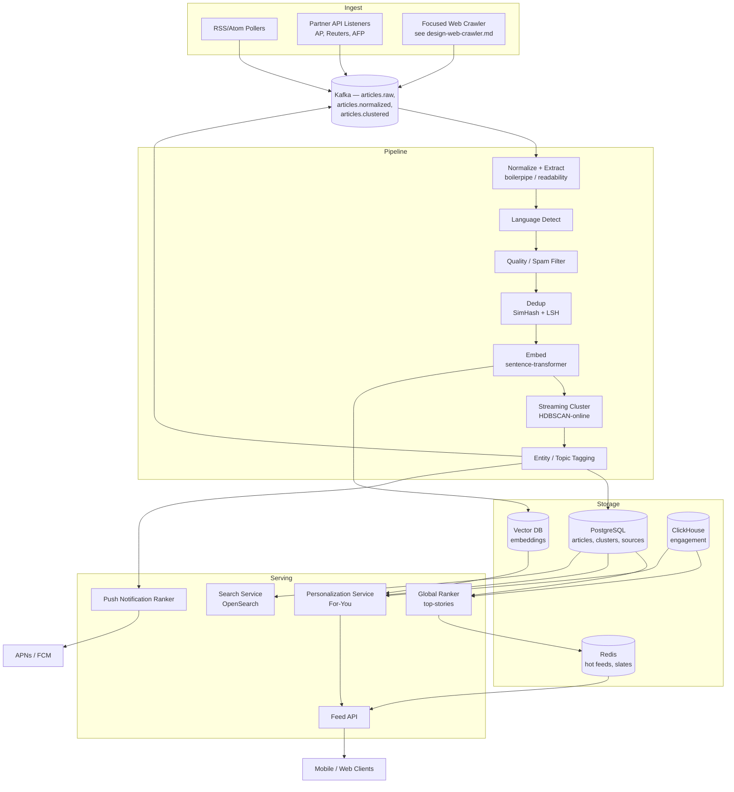

# Design a News Aggregator — Ingest, Dedup, Cluster, Rank, Personalize

**Date:** 2026-04-25 | **Updated:** 2026-04-25
**Tags:** `system-design` `case-study` `news-aggregator` `crawler` `ranking`

## Table of Contents

- [Summary](#summary)
- [Functional Requirements](#functional-requirements)
- [Non-Functional Requirements](#non-functional-requirements)
- [Capacity Estimation](#capacity-estimation)
- [API Design](#api-design)
- [Data Model](#data-model)
- [High-Level Design](#high-level-design)
- [Deep Dive 1 — Ingest Sources](#deep-dive-1--ingest-sources)
- [Deep Dive 2 — Near-Duplicate Detection](#deep-dive-2--near-duplicate-detection)
- [Deep Dive 3 — Topic Clustering](#deep-dive-3--topic-clustering)
- [Deep Dive 4 — Ranking Factors](#deep-dive-4--ranking-factors)
- [Deep Dive 5 — Personalization](#deep-dive-5--personalization)
- [Deep Dive 6 — Push Notification Ranking](#deep-dive-6--push-notification-ranking)
- [Deep Dive 7 — Source Authority and Bias Scoring](#deep-dive-7--source-authority-and-bias-scoring)
- [Deep Dive 8 — Anti-Spam and Low-Quality Filtering](#deep-dive-8--anti-spam-and-low-quality-filtering)
- [Deep Dive 9 — Multi-Language Support](#deep-dive-9--multi-language-support)
- [Bottlenecks and Trade-offs](#bottlenecks-and-trade-offs)
- [Anti-Patterns](#anti-patterns)
- [Related](#related)
- [References](#references)

## Summary

A news aggregator collects articles from thousands of publishers, removes near-duplicates that arise when many outlets cover the same wire story, clusters remaining articles into topical "stories," ranks those stories with a blend of recency, source authority, and engagement, then personalizes the feed per user and selectively sends push notifications for novel breaking events. The hard problems are (1) keeping freshness under one minute end-to-end, (2) deduplicating at internet scale without paying O(N²) similarity costs, (3) clustering streaming text where new articles continuously redefine cluster boundaries, and (4) personalizing without becoming an echo chamber or a notification spam factory.

This design is modeled on the published Google News architecture, BERTopic-style streaming clustering, and the SimHash + LSH near-duplicate pipeline that Google's web crawler uses. It reuses the [crawl pipeline](#deep-dive-1--ingest-sources) from `design-web-crawler.md` for non-feed sources and the [feed delivery patterns](../social-media/design-facebook-news-feed.md) for the per-user "For You" surface.

## Functional Requirements

| # | Requirement | Notes |
|---|-------------|-------|
| F1 | Collect articles from many sources | RSS/Atom feeds, partner APIs (AP, Reuters, AFP), focused web crawler for the long tail. |
| F2 | Deduplicate near-identical articles | Wire stories republished by 200 outlets must collapse into one canonical entry. |
| F3 | Cluster by topic / event | Group articles about the same real-world event ("Story Cluster") with a stable `cluster_id`. |
| F4 | Rank stories | Editorial-style "Top Stories" plus per-topic feeds (Tech, Business, Sports, Local). |
| F5 | Personalize "For You" | Mix global top stories with user affinity (topics followed, sources read, click history). |
| F6 | Push notifications | Send time-critical alerts for novel, high-importance stories — no spam. |
| F7 | Search | Free-text search across articles by keyword, entity, source, date range. |
| F8 | Read state | Mark-as-read, save-for-later, hide-source. |

Out of scope for this doc: comments, paywalls, video transcoding, in-app commerce.

## Non-Functional Requirements

| Property | Target |
|----------|--------|
| Freshness (publisher → user feed) | p95 < 60 s for partner feeds, < 5 min for crawled sites |
| Duplicate rate in user-visible feed | < 1% of impressions are near-duplicates of another already shown |
| Coverage | > 50,000 active sources across 30+ languages |
| Read-path latency (feed render) | p99 < 200 ms |
| Push notification false-positive rate | < 5% of pushes flagged "not interesting" |
| Availability | 99.95% for read path; 99.9% for ingest (lossless within 24 h replay) |
| Scalability | 5M articles/day at peak with linear scale-out per pipeline stage |

## Capacity Estimation

Order-of-magnitude sizing for a globally relevant aggregator.

**Sources and ingest volume**

- **Sources:** ~50,000 active publishers. ~80% via RSS/Atom polling, ~15% partner push APIs, ~5% direct crawl.
- **Articles/day:** 2–5M new articles. Use **3M/day** as the design point ⇒ ~35 articles/sec average, ~150 articles/sec peak.
- **Polling load:** 50K feeds × poll every 60 s = ~830 feed fetches/sec. With conditional `If-Modified-Since` / ETag, ~90% return 304 Not Modified.

**Storage**

- Average article: 5 KB title+body+metadata text, plus 1 KB embeddings (384-dim float16 ≈ 768 B + overhead).
- **Article store:** 3M/day × 6 KB = 18 GB/day raw ⇒ ~6.5 TB/year. Hot tier (last 30 days) ~540 GB.
- **Cluster index:** ~300K active clusters at any time (most articles join existing ones); stable working set < 5 GB.
- **User read state:** 100M users × ~50 read entries/day × 32 B = ~160 GB/day; TTL 90 days.
- **Embeddings:** 3M × 768 B = ~2.3 GB/day for vector search index.

**Dedup overhead**

- SimHash 64-bit fingerprint per article ⇒ 8 B × 3M = 24 MB/day fingerprint storage.
- LSH index keeps fingerprints from the last 7 days hot ⇒ ~21M fingerprints, ~170 MB in memory; lookups O(1) amortized via banded hash tables.
- Without LSH, naive O(N²) Hamming-distance comparison would be (21M)² ≈ 4.4×10¹⁴ ops — infeasible. LSH reduces this to ~thousands of candidates per query.

**Ranking and personalization**

- Top-stories candidate pool: ~5,000 active clusters re-ranked every 30 s globally.
- For You: per-user re-rank of top ~500 candidates, computed on read or via precomputed slates every 5–15 min. With 100M users, precompute ~100K users/sec sustained — feasible with 200 ranking workers at 500 RPS each.

## API Design

REST/JSON for the public surface. Internal pipeline uses gRPC + Kafka.

```http
GET /v1/top-stories?limit=20&country=US&lang=en
GET /v1/topics/{topic_id}/feed?cursor=...&limit=20
GET /v1/search?q=climate+policy&from=2026-04-20&to=2026-04-25&source=reuters
GET /v1/for-you?cursor=...&limit=20            # auth required
POST /v1/articles/{id}/read                    # mark read
POST /v1/articles/{id}/save                    # save for later
POST /v1/sources/{id}/hide                     # block a source for this user
GET  /v1/clusters/{cluster_id}                 # all articles in a story cluster

# Push subscription
POST /v1/devices                               # register device token
PATCH /v1/preferences                          # topics, languages, push prefs
```

**Response envelope** (uniform):

```json
{
  "data": [...],
  "next_cursor": "eyJ0cyI6MTcxNDA...",
  "served_at": "2026-04-25T14:02:11Z",
  "experiment_bucket": "ranker_v7_t02"
}
```

Cursors are opaque, encode `(rank_score, article_id)` for stable deep pagination. Never expose offset-based pagination — feed contents shift every few seconds.

## Data Model

PostgreSQL for normalized metadata + read state, an OLAP store (ClickHouse) for engagement signals, a vector DB (e.g., Milvus/pgvector) for embeddings, and Redis for hot top-stories and user feed slates.

```sql
-- Source registry
CREATE TABLE sources (
  source_id      BIGINT PRIMARY KEY,
  domain         TEXT UNIQUE NOT NULL,
  name           TEXT NOT NULL,
  feed_url       TEXT,                 -- RSS/Atom URL, NULL for crawl-only
  feed_type      TEXT CHECK (feed_type IN ('rss','atom','partner','crawl')),
  language       TEXT,                 -- BCP-47, e.g. 'en-US'
  country        TEXT,                 -- ISO-3166
  authority_score DOUBLE PRECISION,    -- 0..1, see Deep Dive 7
  bias_score     DOUBLE PRECISION,     -- -1 (left) .. +1 (right), 0 neutral
  is_active      BOOLEAN NOT NULL DEFAULT TRUE,
  last_polled_at TIMESTAMPTZ,
  etag           TEXT,
  last_modified  TIMESTAMPTZ
);

-- Article (canonical)
CREATE TABLE articles (
  article_id     BIGINT PRIMARY KEY,
  source_id      BIGINT NOT NULL REFERENCES sources,
  url            TEXT UNIQUE NOT NULL,
  canonical_url  TEXT,                 -- after rel="canonical" + redirect resolution
  title          TEXT NOT NULL,
  summary        TEXT,
  body_hash      BYTEA,                -- SHA-256 of normalized body (exact dup)
  simhash        BIGINT,               -- 64-bit Charikar fingerprint
  language       TEXT,
  published_at   TIMESTAMPTZ NOT NULL,
  ingested_at    TIMESTAMPTZ NOT NULL DEFAULT NOW(),
  cluster_id     BIGINT,               -- FK to clusters, may shift over time
  is_duplicate_of BIGINT,              -- FK to articles, NULL if canonical
  quality_score  DOUBLE PRECISION,     -- spam/quality classifier output
  embedding_id   BIGINT                -- pointer into vector store
);

CREATE INDEX articles_cluster_idx ON articles(cluster_id, published_at DESC);
CREATE INDEX articles_published_idx ON articles(published_at DESC) WHERE is_duplicate_of IS NULL;

-- Story cluster (event-level)
CREATE TABLE clusters (
  cluster_id     BIGINT PRIMARY KEY,
  centroid       VECTOR(384),          -- mean embedding (pgvector)
  topic_id       BIGINT,               -- coarse topic (tech/business/sports/...)
  first_seen_at  TIMESTAMPTZ NOT NULL,
  last_seen_at   TIMESTAMPTZ NOT NULL,
  article_count  INT NOT NULL,
  source_count   INT NOT NULL,         -- unique publishers — strong signal
  importance     DOUBLE PRECISION,
  representative_article_id BIGINT     -- best title/lead for the cluster
);

-- Coarse topics
CREATE TABLE topics (
  topic_id       BIGINT PRIMARY KEY,
  slug           TEXT UNIQUE NOT NULL, -- 'technology', 'sports.nba', ...
  parent_id      BIGINT REFERENCES topics
);

-- User preferences
CREATE TABLE user_preferences (
  user_id            BIGINT PRIMARY KEY,
  followed_topics    BIGINT[],
  blocked_sources    BIGINT[],
  preferred_languages TEXT[],
  push_enabled       BOOLEAN,
  push_quiet_hours   INT4RANGE,        -- e.g. [22, 7)
  push_topics        BIGINT[]
);

-- Read state (sharded by user_id)
CREATE TABLE read_state (
  user_id     BIGINT,
  article_id  BIGINT,
  state       TEXT,                    -- 'read','saved','hidden'
  ts          TIMESTAMPTZ NOT NULL,
  PRIMARY KEY (user_id, article_id)
);
```

Engagement events (impression, click, dwell time, share) flow into Kafka → ClickHouse for aggregate ranking signals; never into the OLTP store.

## High-Level Design



Stages are stateless workers reading from and writing to Kafka topics, so each can scale independently and replay on failure. The clustering stage is the only stateful one — see [Deep Dive 3](#deep-dive-3--topic-clustering).

## Deep Dive 1 — Ingest Sources

Three ingest paths cover the spectrum of source cooperation.

**1. RSS / Atom polling** is the dominant path. RSS 2.0 is a frozen Harvard-published spec; Atom 1.0 is IETF RFC 4287 and is stricter (mandatory `id`, `updated`, well-formed XML). A poller fleet treats them uniformly via a `feedparser`-style adapter that emits a normalized `RawArticle{url, title, summary, published_at, source_id}`.

Polling discipline:

- **Adaptive cadence.** Hot sources (NYT, BBC) polled every 30 s; long-tail polled every 5–15 min. Cadence is driven by the historical inter-arrival distribution per source.
- **Conditional GET.** Always send `If-None-Match` (ETag) and `If-Modified-Since`. ~90% of polls return 304 — bandwidth dominated by metadata.
- **Backoff.** 4xx/5xx triggers exponential backoff capped at 1 hr; persistent 410 marks the feed dead.
- **PubSubHubbub / WebSub.** When a publisher supports it, switch from polling to push — sub-second freshness with no polling cost.

**2. Partner APIs** (AP Media API, Reuters via Refinitiv Data Platform, AFP) deliver structured stories with rich metadata (topic codes, embargo times, datelines, IPTC subject codes). These are first-class: higher trust score, no extraction step, and they often arrive minutes ahead of the same wire story showing up in subscriber feeds.

**3. Focused crawler** for sources without a feed (local government press releases, specialty blogs). Reuse the architecture from [`design-web-crawler.md`](./design-web-crawler.md): URL frontier, politeness manager honoring robots.txt and crawl-delay, HTML fetcher, dedup at URL level. The crawler emits to the same `articles.raw` Kafka topic as the feed pollers — downstream stages don't care which path delivered the article.

After ingest, **normalization** runs Mozilla Readability / boilerpipe to strip nav/ads/comments and extract the main body. `rel="canonical"` resolution collapses syndicated copies on the same domain (e.g., AMP variants).

## Deep Dive 2 — Near-Duplicate Detection

A wire story from AP is republished verbatim — or with minor edits — by hundreds of outlets within minutes. The aggregator must collapse these into a single canonical article (or at least mark duplicates so the feed shows one).

**Three layers, cheap-to-expensive:**

1. **Exact dup.** SHA-256 of normalized body. Hits within 5–10% of cases (pure syndication). O(1) hash lookup in Redis.

2. **Near-dup via SimHash.** Charikar's 2002 algorithm produces a 64-bit fingerprint where Hamming distance correlates with cosine similarity of the underlying token vector. The pipeline:
   - Tokenize body → weighted features (token + tf-idf weight).
   - For each of 64 bit positions, sum `+weight` if the feature's hash bit is 1, `-weight` if 0.
   - Final fingerprint = sign of each accumulator.
   - Two articles with Hamming distance ≤ 3 are near-duplicates (Manku/Jain/Sarma 2007 found `k=3` works at web scale for 64-bit fingerprints).

3. **LSH for sub-linear lookup.** Naive comparison of a new fingerprint against 21M recent ones is O(N) per article and crushes throughput. LSH partitions the 64 bits into bands (e.g., 4 bands of 16 bits each); two fingerprints with Hamming distance ≤ 3 must collide on at least one band. The lookup becomes: for each band, hash → bucket → fetch ~handful of candidates → exact Hamming check. Sub-linear in practice, ~O(1) amortized.

LSH parameters trade recall vs. cost: more bands = higher recall but more candidate buckets to scan. The standard analysis from CS246 (Leskovec) shows that for `b` bands × `r` rows, the probability of two items with Jaccard similarity `s` becoming a candidate pair is `1 - (1 - s^r)^b` — an S-curve tunable to threshold near `s ≈ 0.85`.

**MinHash** is the alternative for set-based (Jaccard) similarity, used when comparing token bags rather than weighted vectors. SimHash is preferred for news because tf-idf weights matter — a shared headline "Breaking:" is less discriminating than a shared named entity.

When a duplicate is detected, set `is_duplicate_of` on the new article and increment the cluster's `source_count`. The original stays canonical; the duplicate is hidden from feeds but kept queryable for "X also reported by Y, Z".

## Deep Dive 3 — Topic Clustering

Dedup collapses near-identical wordings; **clustering** groups articles about the same event even when they're independently written. Five different reporters covering the same congressional vote produce different prose but should land in the same cluster.

**Pipeline:** sentence-transformer (e.g., `all-MiniLM-L6-v2`, 384-dim) embeds title + first ~200 words → optional UMAP to 5–20 dims for clustering speed → HDBSCAN-style density clustering.

**Why HDBSCAN over K-means or DBSCAN:**

- News clusters have **wildly varying densities** — a major breaking story has 500 articles in an hour; a niche policy story has 5 articles over a day. HDBSCAN handles variable density natively.
- No need to pick `k` in advance. Number of stories is unknown and time-varying.
- Built-in noise label for one-off articles that don't belong to any cluster.

**The streaming problem.** Classic HDBSCAN is batch — it sees all points at once. News arrives continuously, and new articles can either (a) join an existing cluster, (b) form a new cluster, or (c) merge two previously separate clusters as a "bridge" article makes their similarity obvious in retrospect.

A practical streaming approach:

1. **Fast path.** For each new article, find its k-nearest cluster centroids in the vector DB. If similarity to the nearest centroid > θ_join (e.g., 0.78), assign it to that cluster and update the centroid incrementally.
2. **Buffer + re-cluster.** Articles below threshold land in a "pending" buffer. Every N seconds (e.g., 30 s) or M articles, run HDBSCAN over the buffer + centroids of recent clusters. Promote new dense regions to clusters.
3. **Periodic merge pass.** Every few minutes, run pairwise centroid similarity between recent clusters; merge if similarity > θ_merge. When clusters merge, propagate the new `cluster_id` to all member articles via a Kafka compaction-style update — never break stable URLs the user has bookmarked.
4. **Decay.** Clusters older than 48 h with no new articles freeze: their centroids stay searchable but they no longer recruit new articles.

Cluster IDs are stable enough that a "Story Page" URL works for a few days. When clusters merge, the loser's ID redirects to the winner.

## Deep Dive 4 — Ranking Factors

Top-stories ranking blends signals into a score. Recompute every 30 s for the global pool, every 5 min per region/language.

| Signal | Weight class | Notes |
|--------|--------------|-------|
| **Recency decay** | High | `exp(-Δt / τ)`, τ ≈ 6 h for breaking, 24 h for evergreen. Older than 48 h ⇒ heavily damped. |
| **Source authority** | High | Per-source `authority_score` (Deep Dive 7). Capped — one prestigious source can't dominate. |
| **Cluster size / source diversity** | High | Cluster with articles from 50 distinct sources beats one with 50 articles from 2 sources. `log(distinct_source_count)` is the usual functional form. Google News explicitly uses "what individual stories are being featured across the board at various publications" as the dominant cluster-importance signal. |
| **Engagement** | Medium | CTR, dwell time, share rate from ClickHouse. Smoothed (Bayesian shrinkage to global mean) so brand-new clusters aren't punished for having no data. |
| **Topical match (per-feed)** | Medium | For tech/business/sports feeds, distance from the cluster's embedding to the topic centroid. |
| **Locality** | Medium | For local feeds, GeoIP + entity location matching. |
| **Originality bonus** | Low | Cluster's representative article shouldn't be a press-release reword — favor articles flagged as original reporting. |
| **Penalty: known low-quality** | Subtractive | Spam/clickbait classifier (Deep Dive 8). |

Score: `s = w_r · recency + w_a · authority + w_d · log(diversity) + w_e · engagement − w_q · low_quality`, with weights learned via offline LTR (LambdaMART or similar) trained on click logs and editorial labels.

## Deep Dive 5 — Personalization

Two-stage: **candidate generation** then **re-ranking**.

**Candidate generation (recall):**

- **Content-based:** user's affinity vector = average embedding of articles they've read in the last 30 days, weighted by recency. Nearest-neighbor search in the vector DB returns top-K clusters by cosine similarity.
- **Collaborative filtering:** matrix factorization or two-tower model over `(user, cluster)` engagement matrix. Captures "users who read X also read Y" without needing X and Y to be textually similar.
- **Editorial / global:** always blend in the global top-stories pool so the user sees what the world is talking about, not only what their bubble is.

Mix candidates with bandit-style exploration: 80% exploit (high-score), 20% explore (random sample biased to followed topics). This combats filter-bubble drift.

**Re-ranking (precision):** GBDT or transformer ranker over (user features × candidate features) producing a final score. Diversity is enforced post-rank: a determinantal point process (DPP) or simple "no two adjacent items from the same cluster/source" rule.

**Slate construction.** Precompute slates of ~500 candidates per active user every 5–15 min, cache in Redis keyed by `(user_id, slate_version)`. Read path just paginates through the cached slate — sub-200 ms feed render. Slate refresh is event-driven on (a) user activity, (b) a major breaking story landing, or (c) timer.

For inspiration on the per-user feed delivery mechanics — fanout-on-write vs fanout-on-read — see [`../social-media/design-facebook-news-feed.md`](../social-media/design-facebook-news-feed.md). News aggregator is closer to fanout-on-read with shared global pool, because content is global (not per-friend) and the same hot articles flow to millions.

## Deep Dive 6 — Push Notification Ranking

Push is a privileged channel — abuse it and the user disables notifications, permanently. The notification ranker is a **stricter** version of the feed ranker with novelty and importance gates.

Send a push only when **all** hold:

1. **Novelty.** The cluster has no prior push to this user (suppress further pushes from the same cluster for 24 h unless a major development triggers a "follow-up" push).
2. **Importance.** Cluster `importance` (computed from source diversity + velocity of new articles + entity prominence) above a threshold that adapts to time-of-day and global news volume.
3. **User affinity.** Either the user follows the topic, or the story is in the global "everyone should know" tier (rare — major disasters, election calls). Affinity threshold higher than feed-ranking threshold.
4. **Quiet hours.** Respect user-configured quiet hours and platform-level Do Not Disturb signals.
5. **Per-user rate cap.** Hard cap (e.g., 5/day) regardless of how much breaking news there is. When breaking news exceeds the cap, only the most important survives.

The decision is logged with features so a downstream model can learn from "push sent → user opened" vs. "push sent → user dismissed → 30 days later disabled notifications". Negative outcomes weight far more than positive ones in the loss function.

## Deep Dive 7 — Source Authority and Bias Scoring

Source authority is a per-source prior used in ranking. Inputs:

- **Domain age + crawl history** (heuristic, weak signal).
- **Outbound citation graph.** PageRank-style score over the publishers-citing-publishers graph.
- **Editorial label.** Manually maintained allow/deny list and tier system (T1: AP/Reuters/major dailies; T2: established regional; T3: blogs; T4: known low-quality).
- **Originality rate.** Fraction of articles that are first-to-publish in their cluster. High originality ⇒ source generates news rather than rewords it.
- **Engagement-corrected CTR.** CTR adjusted for placement bias.

Bias scoring is a separate, more politically sensitive axis. It's used not for filtering but for **diversity in clusters**: when showing a cluster's article list, surface articles from across the bias spectrum so the user sees how different outlets framed the same event. This is product policy more than ranking — wrong here means you ship a partisan product.

Both scores are recomputed nightly. Sources with sudden authority drops (e.g., due to a verified misinformation event) are flagged for editorial review.

## Deep Dive 8 — Anti-Spam and Low-Quality Filtering

Hostile and low-quality content takes many forms:

- **Content farms** scraping and slightly-rewording other publishers' work.
- **AI-generated junk** with factual errors and SEO-keyword stuffing.
- **Coordinated inauthentic behavior** — networks of fake "publishers" amplifying narratives.
- **Clickbait** — sensational headlines with payoff-free articles.

Defenses, layered:

- **Quality classifier** at the ingest stage: gradient-boosted model over readability metrics, headline-body coherence, ad density, presence of bylines, link-out diversity. Threshold determines whether the article reaches the feed at all.
- **Originality detector.** SimHash-based check: if > 70% of articles from this source are near-duplicates of earlier articles from other sources, the source is flagged as a content farm.
- **Coordinated behavior detection.** Graph analysis over publisher registration data, hosting infrastructure, content templates. Cluster of "publishers" sharing infra + content patterns ⇒ network suppression.
- **Human review queue.** Borderline cases route to editorial. The ML pipeline produces explanations, not just scores, to make review tractable.
- **Per-user controls.** "Hide source" and "Show fewer like this" feed back into the personalization model and into global authority scoring (with anti-brigading safeguards — a single source can't be downranked just because a coordinated group flagged it).

For the broader retrieval/ranking machinery these classifiers plug into, see [`../../building-blocks/search-systems.md`](../../building-blocks/search-systems.md).

## Deep Dive 9 — Multi-Language Support

Different problems show up at different layers:

- **Language detection** at ingest using `cld3` / `fastText`. Article gets a `language` tag. RSS often lies in `<language>` — trust the classifier.
- **Cross-lingual embeddings.** Use a multilingual sentence-transformer (e.g., `paraphrase-multilingual-mpnet-base-v2`) so a Spanish and English article about the same event land near each other in vector space. Optional: machine-translate titles to a pivot language for cluster representative selection.
- **Per-language ranker weights.** Recency decay, source authority distributions, and engagement priors differ by language/region. Train one global ranker but condition on language as a feature, or train per-region models if data volume allows.
- **Per-region top stories.** "Top Stories" is regional by default. Cross-region promotion only for genuinely global events (computed via cluster size across regions × an editorial threshold).
- **Right-to-left and CJK rendering** is a UI layer concern but worth surfacing — the data model must store original-script title separately from any romanized form.

## Bottlenecks and Trade-offs

| Concern | Trade-off |
|---------|-----------|
| **Freshness vs. dedup quality** | Detecting all near-duplicates needs a wide LSH window; that costs latency and memory. Choosing a 7-day window keeps p95 dedup latency under 50 ms but misses the rare duplicate of an article older than a week. Acceptable. |
| **Cluster stability vs. accuracy** | Aggressive merging produces cleaner story pages but risks merging two distinct events with overlapping vocabulary (e.g., two different shootings on the same day). Conservative merging keeps clusters distinct but fragments coverage. We err conservative and fix via editorial signals on top stories. |
| **Personalization vs. echo chamber** | Pure personalization narrows the feed. Always blending in global top stories costs some engagement metrics but protects long-term retention and product reputation. |
| **Global ranking vs. regional truth** | A globally optimal ranker can flatten local news. Region-conditioned ranking is mandatory; "global Top Stories" is curated, not algorithmic, for major events. |
| **Push relevance vs. push recall** | High thresholds mean some users miss stories they'd care about; low thresholds drive notification fatigue and opt-outs. The opt-out cost is asymmetric — recover from missing > recover from spamming. Default to high thresholds. |
| **Vector-DB cost vs. latency** | Storing embeddings for 6 months × 3M/day = ~540M vectors. HNSW index is fast but RAM-hungry. Tier hot (last 7 days, in-memory HNSW) vs cold (older, IVF on SSD with higher latency). |
| **Crawler politeness vs. coverage** | Aggressive crawling improves coverage of long-tail sources but risks bans and legal exposure. Default to conservative crawl-delay; partner agreements unlock higher rates. |
| **Embedding model freshness** | Re-embedding 540M articles when upgrading the model takes days of GPU. Strategy: dual-write during transition, re-embed cold tier opportunistically, gate cluster-merging across model versions. |

## Anti-Patterns

- **Treating dedup as exact-match only.** You'll show the same wire story 50 times. Always do near-duplicate detection.
- **Picking a fixed `k` for clustering.** News cluster count is a function of the day's events. K-means is the wrong tool; use density-based methods.
- **Doing pairwise similarity without LSH.** O(N²) does not scale. LSH or vector-NN-search is mandatory.
- **Push notifications driven by feed-ranking score.** Different objectives (engagement vs. importance/novelty/politeness). Build a separate model.
- **Personalization without an exploration budget.** The model never learns about new interests; the feed converges to a narrow strip. Always reserve 10–20% for exploration.
- **Trusting source-supplied metadata.** Publishers lie about `published_at`, language, and category to game ranking. Trust your own classifiers.
- **Synchronous pipeline across stages.** Ingest → dedup → cluster → rank as one synchronous chain means one stage's slowness stalls everything. Decouple via Kafka with backpressure on producers.
- **Mutable cluster IDs without redirect.** Re-clustering every few minutes and rewriting `cluster_id` in place breaks bookmarks, deep links, and analytics. Treat cluster merges as redirects, not rewrites.
- **Same authority score per source forever.** Quality drifts (editorial changes, ownership changes, network compromises). Recompute regularly.
- **No crawl budget.** A misconfigured crawler will get you blocked from major sites and possibly sued. Always honor robots.txt, crawl-delay, and partner contract terms.
- **Treating engagement signal as ground truth.** Outrage and clickbait engage. Optimize for engagement only and you'll ship a tabloid. Combine with authority and originality and let editorial guardrails override.
- **Single-language ranker on multilingual data.** Decay constants, click priors, and authority distributions all differ by language. One ranker for all languages produces systematic regional underperformance.

## Related

- [`design-web-crawler.md`](./design-web-crawler.md) — crawl pipeline reused for non-feed sources
- [`../social-media/design-facebook-news-feed.md`](../social-media/design-facebook-news-feed.md) — per-user feed delivery patterns and fanout strategies
- [`../../building-blocks/search-systems.md`](../../building-blocks/search-systems.md) — retrieval, ranking, and indexing primitives
- [`../../building-blocks/message-queues-and-brokers.md`](../../building-blocks/message-queues-and-brokers.md) — Kafka pipeline backbone
- [`../../building-blocks/caching-layers.md`](../../building-blocks/caching-layers.md) — Redis slate caching

## References

- [Charikar, "Similarity Estimation Techniques from Rounding Algorithms" (STOC 2002)](https://www.cs.princeton.edu/courses/archive/spr04/cos598B/bib/CharikarEstim.pdf) — original SimHash paper
- [Manku, Jain, Sarma, "Detecting Near-Duplicates for Web Crawling" (Google, WWW 2007)](https://research.google.com/pubs/archive/33026.pdf) — SimHash + LSH at web scale, k=3 for 64-bit fingerprints
- [Stanford CS246 — LSH lecture notes (Leskovec)](https://web.stanford.edu/class/cs246/slides/03-lsh.pdf) — MinHash, banded LSH, S-curve analysis
- [Stanford CS246 — LSH theory deck](http://snap.stanford.edu/class/cs246-2012/slides/04-lsh_theory.pdf) — formal treatment of locality-sensitive families
- [SimHash — Wikipedia](https://en.wikipedia.org/wiki/SimHash) — concise overview and references
- [Google News — Under the Hood (Search Engine Land)](https://searchengineland.com/google-news-ranking-stories-30424) — cluster ranking signals: source diversity, freshness, originality, locality
- ["How 9/11 Inspired Google News (and MapReduce)" — computerlab.io](https://computerlab.io/2017/09/10/how-911-inspired-google-news-map-reduce/) — origin of clustering-without-editors and MapReduce
- [Google News System Design Guide — systemdesignhandbook.com](https://www.systemdesignhandbook.com/guides/google-news-system-design/) — SimHash, Kafka ingest, story clusters
- [BERTopic documentation](https://bertopic.com/) — sentence-transformer + UMAP + HDBSCAN topic modeling pipeline
- ["Semantic-Driven Topic Modeling Using Transformer-Based Embeddings" (arXiv 2410.00134)](https://arxiv.org/html/2410.00134v1) — modern transformer + clustering survey
- [RSS 2.0 specification (Harvard Cyber)](https://cyber.harvard.edu/rss/rss.html) — frozen syndication spec
- [Atom 1.0 — IETF RFC 4287](https://www.rfc-editor.org/rfc/rfc4287) — XML feed standard
- [RSS 2.0 vs Atom 1.0 — intertwingly.net](https://www.intertwingly.net/wiki/pie/Rss20AndAtom10Compared) — practical comparison
- [Reuters / Refinitiv Data Platform News API](https://developers.lseg.com/en/api-catalog/refinitiv-data-platform/news-API) — partner news feed reference
- [Associated Press API Samples (GitHub)](https://github.com/TheAssociatedPress/APISamples) — AP Media API client examples
- [List of news media APIs — Wikipedia](https://en.wikipedia.org/wiki/List_of_news_media_APIs) — broader landscape
- [Apple News — software design refresh, 2025](https://www.apple.com/newsroom/2025/06/apple-introduces-a-delightful-and-elegant-new-software-design/) — Apple's product framing for the News surface; technical architecture is not public
