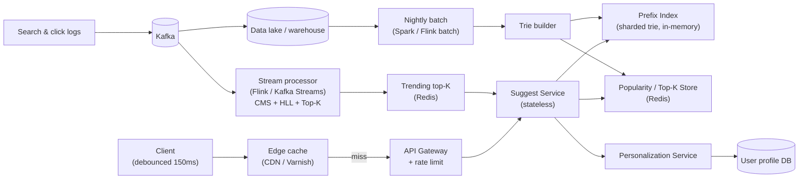
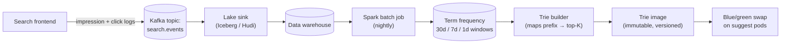

# Design Search Autocomplete — Tries, Top-K Precomputation, and Streaming Freshness

**Date:** 2026-04-25 | **Updated:** 2026-04-25
**Tags:** `system-design` `case-study` `autocomplete` `trie` `search`
**Difficulty:** Easy (HLD)

## Table of Contents

- [Summary](#summary)
- [Functional Requirements](#functional-requirements)
- [Non-Functional Requirements](#non-functional-requirements)
- [Capacity Estimation](#capacity-estimation)
- [API Design](#api-design)
- [Data Model](#data-model)
- [High-Level Design](#high-level-design)
- [Deep Dives](#deep-dives)
  - [Trie / Prefix Tree](#trie--prefix-tree)
  - [Inverted Index Alternative — Elasticsearch Completion Suggester](#inverted-index-alternative--elasticsearch-completion-suggester)
  - [Top-K Precomputation at Trie Nodes](#top-k-precomputation-at-trie-nodes)
  - [Frequency Aggregation Pipeline](#frequency-aggregation-pipeline)
  - [Real-Time Freshness — Streaming Sketches](#real-time-freshness--streaming-sketches)
  - [Personalization](#personalization)
  - [Typo Tolerance — Levenshtein Automaton & Did You Mean](#typo-tolerance--levenshtein-automaton--did-you-mean)
  - [Caching Strategy](#caching-strategy)
  - [Multi-Language and Emoji Support](#multi-language-and-emoji-support)
  - [A/B Testing Infrastructure](#ab-testing-infrastructure)
  - [Privacy](#privacy)
- [Bottlenecks & Trade-offs](#bottlenecks--trade-offs)
- [Anti-Patterns](#anti-patterns)
- [Related](#related)
- [References](#references)

## Summary

Search autocomplete (a.k.a. typeahead, suggest) returns a ranked list of likely completions for a partial query. The design problem is deceptively simple: every keystroke is a request, the user expects results before they finish typing, and "popular" is a constantly moving target. The canonical approach pairs a **trie with precomputed top-K completions at each node** and a **batch pipeline** that aggregates query logs nightly, optionally augmented by a **streaming layer** for trending queries. Most production systems (Google, Algolia, Twitter typeahead.js) end up with some variation of this shape, plus an aggressive edge cache because the prefix distribution is heavy-headed — a small set of prefixes accounts for the vast majority of traffic.

## Functional Requirements

| # | Requirement |
|---|-------------|
| F1 | As the user types, return suggestions for the current prefix |
| F2 | Return **top-K** (typically K=5–10) ranked by popularity |
| F3 | Tolerate small typos (1–2 edit distance) without blowing up latency |
| F4 | Personalize when a user is logged in (history, location, language) |
| F5 | Reflect freshness — trending queries surface within minutes, not days |
| F6 | Return suggestions in the language and script of the user's input |
| F7 | Support multi-word prefixes ("how to make pi" → "how to make pizza") |

Out of scope for this design: full search ranking, query understanding/NLU, semantic suggestions, voice input, instant answers/knowledge cards.

## Non-Functional Requirements

| # | Requirement | Target |
|---|-------------|--------|
| N1 | End-to-end latency | < 100ms p99 (client → suggestion render) |
| N2 | Service-side latency | < 20ms p99 |
| N3 | Availability | 99.95% |
| N4 | Cache hit rate at edge | > 90% for unauthenticated traffic |
| N5 | Cost per query | < $0.0000X (one or two orders of magnitude cheaper than a full search) |
| N6 | Throughput | Scale linearly with shards |
| N7 | Index freshness | Trending queries within 5–10 minutes; long-tail next day |

Latency drives every other decision. A keystroke-rate API at < 100ms means: **debounce on the client**, **edge-cache hot prefixes**, **precompute top-K**, and **never do a full search at type-time**.

## Capacity Estimation

Order-of-magnitude only — adjust to the product.

```text
DAU                     : 100M
Searches per user / day : 5
Keystrokes per search   : 15 (avg query length)
Debounce keeps requests : ~3-5 per typed query
                          (after 150-200ms keystroke debounce)
```

```text
Suggest QPS (avg)       : 100M × 5 × 4 / 86,400 ≈ 23,000 QPS
Suggest QPS (peak)      : 3-5× avg ≈ 70,000–115,000 QPS
Per-query payload       : ~1–2 KB JSON (10 suggestions × ~150 B)
Aggregate egress (peak) : ~115k × 2 KB ≈ 230 MB/s ≈ 1.8 Gbps
```

```text
Vocabulary size         : 100M unique queries (long tail)
Avg query length        : 20 chars
Trie nodes              : ~500M–1B (with shared prefixes)
RAM per node            : 50–100 B (children pointer map + top-K refs)
RAM for trie            : 25–100 GB → shard across 4–16 nodes
Top-K cache             : K=10, ~120 B per entry
                          → ~60–120 GB precomputed top-K data
```

The numbers say two things loudly:

1. The hot prefix set is **tiny** relative to the long tail. Edge caching is the single biggest cost lever.
2. The trie does not fit on one machine for any non-trivial vocabulary — design for **sharding by prefix** from day one.

## API Design

A single endpoint. Keep it boring.

```http
GET /v1/suggest?q=piz&limit=10&lang=en&country=US
Host: suggest.example.com
Authorization: Bearer <user-jwt>   # optional; enables personalization
X-Session-Id: <opaque-id>          # optional; for A/B test bucketing
```

```json
{
  "query": "piz",
  "suggestions": [
    { "text": "pizza near me",     "score": 0.94, "source": "popular" },
    { "text": "pizza hut",         "score": 0.91, "source": "popular" },
    { "text": "pizza dough recipe","score": 0.78, "source": "popular" },
    { "text": "pizzeria boston",   "score": 0.61, "source": "personalized" },
    { "text": "pizza oven",        "score": 0.58, "source": "trending"  }
  ],
  "experiment": "rank_v3_holdout",
  "took_ms": 7
}
```

Design notes:

- **GET, not POST** — must be cacheable by edge / CDN
- `q` is URL-encoded; cache key normalizes case, trims whitespace, NFC-normalizes Unicode
- `lang`, `country` are part of the cache key — completions differ per locale
- `Authorization` (when present) bypasses edge cache and routes to personalized path
- Return 200 with empty list for unknown prefixes — never 404 (browsers and CDNs treat 404 differently)

Rate limiting: per-IP and per-user token bucket, e.g. 50 req/sec sustained, 200 burst. See [`../../building-blocks/rate-limiters.md`](../../building-blocks/rate-limiters.md).

## Data Model

Three logical stores. They look very different at the implementation level.

**1. Term frequency table** (source of truth for popularity)

```text
term                       count_30d   last_seen_at
"pizza near me"            8,432,109   2026-04-25T14:02Z
"pizza hut"                4,217,883   2026-04-25T14:02Z
"pizza dough recipe"         312,447   2026-04-24T22:11Z
```

Stored in a columnar warehouse (BigQuery / Snowflake / Redshift) for the batch job; the trie loader reads from here.

**2. Prefix → top-K cache** (hot path)

```text
prefix       top_k (ordered list of term ids + scores)
"p"          [t_42, t_91, t_13, ...]
"pi"         [t_42, t_77, t_91, ...]
"piz"        [t_42, t_91, t_205, ...]
"pizz"       [t_42, t_91, t_311, ...]
```

Materialized into the trie nodes themselves (in-memory) and mirrored to Redis for warm-start and for the personalization service.

**3. User profile / history** (personalization)

```text
user_id   recent_queries        location   lang   embedding
u_123     ["pizza", "sushi"]    "BOS,US"   en     [0.12, ...]
```

Keyed lookup by `user_id`; merged with the global top-K at request time.

## High-Level Design



**Read path** (the < 100ms budget):

1. Client debounces keystrokes (150–200ms) and sends `GET /suggest?q=...`.
2. Edge cache (CDN / Varnish) serves the response if hot — for popular short prefixes, hit rate is >95%.
3. On miss, request hits the suggest service. The service:
   - Looks up `q` in its local trie shard (consistent hashing on prefix).
   - Reads the precomputed top-K at the node.
   - If user is authenticated, fans out in parallel to the personalization service.
   - Optionally merges in the trending top-K from the streaming layer.
   - Re-ranks (cheap linear combination), trims to `limit`, returns.

**Write path** (freshness):

- Search logs and click events stream into Kafka.
- A Flink job (or equivalent) maintains approximate top-K per prefix using **Count-Min Sketch + Heavy Hitters** for the last 5–60 minute window, written to a "trending" Redis cluster.
- Nightly, a Spark batch job aggregates 30-day windows from the warehouse, ranks, builds a fresh trie image, and ships it to suggest service nodes via a blue/green swap.

## Deep Dives

### Trie / Prefix Tree

A [trie](https://en.wikipedia.org/wiki/Trie) is the textbook data structure for prefix lookup. Each edge is a character; each node represents the prefix formed by the path from the root.

```text
              (root)
              /  |  \
             p   s   ...
             |
             i
            / \
           z   n
           |   |
           z   e
           |   |
           a   ...
```

**Pros:**

- Lookup is **O(P)** where P is prefix length — independent of vocabulary size.
- Prefixes share storage (the "pi" path serves "piz", "pizz", "pizza", ...).
- Range scans (all completions of a prefix) are a subtree traversal.

**Cons:**

- **Memory-hungry**. A naive `Map<char, Node>` per node burns 50–200 bytes overhead even for nodes with one child.
- Pointer-chasing kills cache locality.
- Updates are awkward — rebuilds are easier than in-place edits at scale.

**Production variants** ([Stanford CS166 lecture notes on tries](https://web.stanford.edu/class/cs166/lectures/13/Slides13.pdf)):

| Variant | Trade-off |
|---------|-----------|
| Array-mapped trie | Arrays of children indexed by char; fast, fat |
| HAMT / Patricia trie | Compress single-child chains; smaller, slightly slower |
| Ternary search tree | Lower memory, more comparisons per char |
| **DAWG** (directed acyclic word graph) | Share suffixes too; ~10x smaller for large vocabularies |
| **FST** (finite-state transducer) | Lucene's approach — DAWG with output values; tiny and fast |

For a 100M-term vocabulary, a plain trie is unworkable. **FSTs** (used by Lucene's `BlendedTermSuggester` and Elasticsearch's completion suggester) are the practical answer for read-mostly workloads.

### Inverted Index Alternative — Elasticsearch Completion Suggester

If you already run Elasticsearch / OpenSearch, the [completion suggester](https://www.elastic.co/guide/en/elasticsearch/reference/current/search-suggesters.html#completion-suggester) gives you 80% of this design out of the box.

```json
PUT autocomplete
{
  "mappings": {
    "properties": {
      "suggest": {
        "type": "completion",
        "analyzer": "simple",
        "preserve_separators": true,
        "preserve_position_increments": true,
        "max_input_length": 50
      }
    }
  }
}
```

```json
POST autocomplete/_search
{
  "suggest": {
    "pizza-suggest": {
      "prefix": "piz",
      "completion": {
        "field": "suggest",
        "size": 10,
        "fuzzy": { "fuzziness": "AUTO" }
      }
    }
  }
}
```

Under the hood this is an **FST** keyed on input strings with weights as outputs. Pros: zero infrastructure beyond Elasticsearch, built-in fuzzy via Levenshtein, natural sharding. Cons: per-shard FST memory cost, weight updates require a reindex of the field, and personalization is harder to bolt on cleanly.

A pragmatic split many teams adopt:

- **Elasticsearch completion suggester** for the long tail and infrequent prefixes.
- **In-memory custom trie / FST + Redis top-K** for the head — the prefixes that get 99% of traffic.

### Top-K Precomputation at Trie Nodes

The single biggest performance trick: at every trie node, store a **precomputed sorted list of the top-K completions in its subtree**. At query time you walk down to the node for the prefix and return its list directly — no subtree traversal, no scoring, no sort.

```text
node "piz" → [
  ("pizza near me",      score=0.94),
  ("pizza hut",          score=0.91),
  ("pizza dough recipe", score=0.78),
  ...K entries
]
```

Trade-off: **storage vs latency**. With K=10 and ~500M nodes you store 5B (term-id, score) pairs. Two mitigations:

1. Only materialize top-K at nodes that are reachable as a prefix endpoint by the client (i.e., character boundaries, not internal HAMT compression nodes).
2. For nodes very close to the root (1–3 characters), top-K is _the_ hot data — keep it; for very deep nodes, fall back to subtree scan since hits are rare.

Updates happen during the nightly rebuild — never live. This is what makes the read path so cheap.

### Frequency Aggregation Pipeline



Key design choices:

- **Log everything once, derive everything else.** The same Kafka topic feeds the warehouse, the streaming layer, and offline analytics.
- **Multiple windows.** Compute counts for 1d, 7d, 30d; combine with weights (e.g. recency-weighted score = 0.6·c30 + 0.3·c7 + 0.1·c1). This naturally handles seasonality and trending without a separate system.
- **Immutable trie images.** A build produces a binary blob at `s3://suggest-tries/<lang>/<version>.bin`. Suggest pods download, mmap, and atomically swap the pointer. Previous version stays warm for rollback.
- **CTR signal.** Pure search frequency over-weights queries that mis-fire. Use **clicks, not just impressions**, and ideally a quality signal (dwell time, conversion).

### Real-Time Freshness — Streaming Sketches

Batch alone misses the breaking-news case ("X just trended in the last 10 minutes"). Add a streaming layer that keeps approximate top-K for short windows.

**Count-Min Sketch (CMS)** ([Cormode & Muthukrishnan, 2005](http://dimacs.rutgers.edu/~graham/pubs/papers/cm-full.pdf)) approximates per-term frequency in sublinear space. Combined with a **heavy hitters** structure (Misra–Gries summary, Space-Saving algorithm), you get top-K without storing the full frequency table.

```python
# pseudo-code: per prefix, a 2D Count-Min Sketch + heavy hitters list
class TrendingTracker:
    def observe(self, prefix: str, term: str) -> None:
        self.cms[prefix].increment(term)
        est = self.cms[prefix].estimate(term)
        self.heavy_hitters[prefix].offer(term, est)

    def top_k(self, prefix: str, k: int) -> list[tuple[str, int]]:
        return self.heavy_hitters[prefix].top(k)
```

Memory: a CMS with ε=0.001, δ=0.01 needs ~3 KB per prefix. For 1M tracked prefixes that's a few GB — fits in one Flink job's state.

Run this in Flink with a **5-minute sliding window** keyed by (prefix, lang). Write top-K snapshots to Redis every 30s. The suggest service does a non-blocking lookup and merges streaming top-K with batch top-K with a small boost factor.

For HyperLogLog and Count-Min Sketch foundations, see [`../../data-structures/count-min-sketch-and-top-k.md`](../../data-structures/count-min-sketch-and-top-k.md) (planned).

### Personalization

Personalized completions are a re-rank, not a separate retrieval. The flow:

```text
1. Suggest service fetches global top-K (e.g. 50 candidates) from the trie.
2. In parallel: personalization service fetches user features
   - last N queries
   - approximate location (city/country)
   - language(s)
   - lightweight embedding (256-dim) for semantic affinity
3. A linear/logistic re-ranker scores each candidate:
   score = α·global_pop + β·history_match + γ·geo_match + δ·embed_sim
4. Trim to K, return.
```

Signals worth using:

- **Recent-history boost**: if the user just searched "italian restaurants", "pizza" gains a small bump.
- **Geo-aware**: "pizza near me" outranks "pizza dough recipe" for a logged-in mobile user.
- **Language detection** of the prefix itself ("pizz" — Latin script, default to English; "ピザ" — Japanese).

Do not let personalization _replace_ global retrieval — it should always re-rank a global candidate set, never bypass it. Otherwise cold-start users get nothing.

Personalized responses are **not** edge-cacheable. Route them past the CDN with `Cache-Control: private, no-store` and ensure the gateway sets the right Vary headers.

### Typo Tolerance — Levenshtein Automaton & Did You Mean

Two distinct features that are often confused:

| | Inline typo tolerance | "Did you mean" |
|--|------------------------|-----------------|
| When | Every keystroke | After a low-result search |
| Latency budget | Tight (< 20ms server) | Looser (< 200ms) |
| Edit distance | 1, sometimes 2 | Up to 2 with phonetic |
| Mechanism | Levenshtein automaton + trie/FST | Separate spell-correction model |

A [Levenshtein automaton](https://en.wikipedia.org/wiki/Levenshtein_automaton) ([Schulz & Mihov, 2002](https://doi.org/10.1007/s10032-002-0082-8)) is a finite-state machine that accepts exactly the strings within edit distance _k_ of a target. Intersecting that automaton with the trie/FST gives you all dictionary terms within distance _k_ of the query. Lucene implements this: `FuzzyQuery` runs in time proportional to results returned, not vocabulary size.

For Elasticsearch's completion suggester, `fuzzy: { fuzziness: "AUTO" }` enables this. AUTO means: 0 edits for short queries, 1 edit for medium, 2 for long.

For "did you mean" past the suggest box, use a separate model — n-gram language model or a small transformer trained on your query corpus. Out of scope here.

References worth reading: Murilo Cunha's ["Fuzzy autocomplete with Levenshtein automaton"](https://blog.notdot.net/2010/07/Damn-Cool-Algorithms-Levenshtein-Automata) and Lucene's [`LevenshteinAutomata.java`](https://github.com/apache/lucene/blob/main/lucene/core/src/java/org/apache/lucene/util/automaton/LevenshteinAutomata.java).

### Caching Strategy

Caching is the single biggest cost lever. The prefix distribution is heavy-headed:

```text
prefix length   request share
1–2 chars       ~60% of traffic
3–4 chars       ~25%
5+              ~15%
```

Layers:

1. **CDN / edge** (Cloudflare Workers, CloudFront, Fastly). Cache `/suggest?q=...&lang=...&country=...` for unauthenticated requests. TTL: 60s (short, but the hit rate is dominated by sub-second concurrency on the same prefix). Use **stale-while-revalidate** so a stale 60–300s response can be served while the origin is queried.
2. **Service-side LRU** (Caffeine in Java / lru-cache in Node). 100k–1M entries per pod; ~100 ns lookup.
3. **Redis** mirror of the top-K store. Survives suggest-pod restarts.

Cache key normalization:

```text
key = lower(NFC_normalize(trim(q))) + "|" + lang + "|" + country + "|" + experiment_bucket
```

Watch out for:

- **Cache stampede** on cold prefixes. Use request coalescing / single-flight at the gateway.
- **Authenticated traffic** must be uncacheable at the edge — mark with `Cache-Control: private`.
- **Experiment buckets** must be in the cache key, otherwise experiments are corrupted.

### Multi-Language and Emoji Support

Naive ASCII tokenization breaks for ~80% of the world's queries. Concrete decisions:

- **Unicode normalization**: NFC, lowercased per locale (Turkish dotless `i` is a real bug source).
- **Per-language tries.** Don't mix scripts in one structure; the prefix `pi` in English vs Italian has different top-K. Detect script from the prefix's first 1–2 characters; for ambiguous Latin prefixes use the user's `Accept-Language`.
- **CJK input methods** type romaji/pinyin first, then commit characters. Index both surface form _and_ romanized form; offer suggestions for both.
- **Emoji** are ordinary Unicode codepoints — they fit in the trie, but normalization (`☕️` ZWJ sequences) requires care. Most teams prefix-match on the first emoji codepoint and rank by frequency.
- **RTL scripts** (Arabic, Hebrew) — the storage is the same, but the UI must mirror; this is a frontend concern, not a service one.

### A/B Testing Infrastructure

Ranking changes need empirical validation. Bucket by stable user id (or session id for anonymous):

```text
bucket = hash(user_id, experiment_name) % 100
control:    bucket in [0, 49]   → ranking_v2
treatment:  bucket in [50, 99]  → ranking_v3
```

The suggest service accepts an `experiment_bucket` from the gateway, runs the corresponding ranker, and emits the bucket assignment in click logs. Standard metrics: **CTR @ 1, @ 3, @ 10**, **abandonment** (search box closed without selecting), **session-level success** (did the user end up at a satisfying result).

A/B infra is its own building block — do not roll your own (use [Eppo](https://www.geteppo.com/), [Optimizely](https://www.optimizely.com/), [Statsig](https://statsig.com/), or an internal equivalent). The ranker is a dial; the platform is the validation harness.

### Privacy

Autocomplete is a privacy hazard waiting to happen. Three concrete rules:

1. **Never suggest a query unless _many_ users have issued it.** A common threshold: a query must have been searched by at least N=1,000 distinct users (or some k-anonymity threshold) in the last 30d before it's eligible for the global trie. This prevents the "user typed their SSN once" failure mode.
2. **Never personalize across users.** A user's personalization data feeds only their own suggestions. There is no global learning loop that pulls per-user history into the global trie.
3. **PII filters.** Run a denylist + regex pass during the nightly build to strip queries that look like emails, phone numbers, credit cards, social security numbers, or addresses. Better to drop a few legitimate queries than leak one private one.

Google's autocomplete [policies](https://support.google.com/websearch/answer/7368877) document additional categories worth filtering (violent/sexual against named individuals, hate speech, dangerous misinformation). The exact list is product-specific; the architectural point is **the filter runs in the build pipeline, not at query time**.

## Bottlenecks & Trade-offs

| Concern | Trade-off |
|---------|-----------|
| **Trie memory** | Sharding adds operational complexity; FST/DAWG saves memory at the cost of build time. |
| **Top-K precompute storage** | Larger K = better recall, more storage and longer rebuilds. K=10–20 is the practical sweet spot. |
| **Nightly batch latency** | Trending queries miss for hours unless you also run streaming. Streaming adds infra and operational burden. |
| **Personalization vs cache hit rate** | Every personalized request bypasses the edge cache. Authenticated traffic is 5–10× more expensive per query. |
| **Fuzzy matching cost** | Levenshtein automaton with k=2 is ~2–5× slower than exact match. Default to k=1, escalate only for queries with low result counts. |
| **Freshness vs stability** | Surfacing trends fast also surfaces noise (one viral tweet can poison a prefix). Apply min-thresholds + smoothing. |
| **Index rebuild blast radius** | A bad nightly build poisons the entire prefix index. Always blue/green; always keep N-1 warm; always have a one-button rollback. |
| **Cross-region consistency** | Each region runs its own trie copy. Acceptable for autocomplete — eventual consistency on suggestion ranking is fine. |

## Anti-Patterns

- **Querying the full search engine on every keystroke.** This is the single most common failure mode. Suggest must be a separate, cheaper system.
- **Skipping the debounce on the client.** A 150–200ms keystroke debounce eliminates 60–70% of requests with no perceived latency cost.
- **Not caching at the edge.** The prefix distribution is heavy-headed. A CDN cache with even a 60s TTL eliminates most origin load.
- **Logging the prefix to "improve quality" without privacy filters.** Inevitably someone types a credit card number. Filter, hash, threshold.
- **Replacing global retrieval with personalized retrieval.** Cold-start users get nothing, fresh queries never surface, and your A/B numbers tank.
- **Streaming-only top-K with no batch backstop.** Streaming is approximate; over a long window the error compounds. Use batch as the truth, streaming as the trend overlay.
- **One giant trie on one machine.** Works in the demo, dies in prod. Shard by prefix from day one even if you only need one shard now.
- **Updating the live trie in place.** Concurrent updates with concurrent reads is a recipe for inconsistent results. Build offline, swap atomically.
- **Returning HTTP 404 for empty suggestions.** CDNs and clients treat 404 specially; return 200 with `[]`.
- **Treating typo tolerance as a search problem instead of a suggest problem.** Inline fuzzy is part of suggest; "did you mean" is a different system. Don't conflate.
- **Skipping locale in the cache key.** "pi" → "pizza" in English, "piano" in Italian. Wrong cache key = wrong language for half your users.

## Related

- [Search Systems — Building Block](../../building-blocks/search-systems.md) — inverted indices, ranking, full-text search infra
- [Caching Layers — Building Block](../../building-blocks/caching-layers.md) — CDN, Redis, single-flight, stale-while-revalidate
- [Rate Limiters — Building Block](../../building-blocks/rate-limiters.md) — per-IP/per-user buckets for keystroke-rate APIs
- [Count-Min Sketch and Top-K Streaming Algorithms](../../data-structures/count-min-sketch-and-top-k.md) — _planned_; foundations for the streaming-freshness layer
- [LLD: Design Search Autocomplete](../../../low-level-design/case-studies/data-structures/design-search-autocomplete.md) — _twin_; trie node layout, top-K materialization in code
- [Database — Indexing Strategies](../../../database/internals/indexing-strategies.md) — B-tree vs hash vs trie comparisons in the storage layer

## References

- [Trie — Wikipedia](https://en.wikipedia.org/wiki/Trie) — data structure overview, variants, complexity
- [Stanford CS166 — Tries and Suffix Trees](https://web.stanford.edu/class/cs166/lectures/13/Slides13.pdf) — lecture notes on production trie variants
- [Elasticsearch Completion Suggester](https://www.elastic.co/guide/en/elasticsearch/reference/current/search-suggesters.html#completion-suggester) — FST-backed suggest implementation
- [Lucene FST package](https://lucene.apache.org/core/9_0_0/core/org/apache/lucene/util/fst/package-summary.html) — finite-state transducer internals
- [Algolia — How Search As You Type Works](https://www.algolia.com/doc/guides/getting-started/how-algolia-works/in-depth/how-algolia-works/) — production suggest system design
- [Algolia Autocomplete docs](https://www.algolia.com/doc/ui-libraries/autocomplete/introduction/what-is-autocomplete/) — frontend + backend integration patterns
- [Twitter typeahead.js](https://twitter.github.io/typeahead.js/) — open-source client-side autocomplete library
- [Schulz & Mihov — Fast String Correction with Levenshtein Automata](https://doi.org/10.1007/s10032-002-0082-8) — foundational paper for fuzzy prefix search
- [Levenshtein Automaton — Wikipedia](https://en.wikipedia.org/wiki/Levenshtein_automaton) — accessible introduction
- [Cormode & Muthukrishnan — Count-Min Sketch](http://dimacs.rutgers.edu/~graham/pubs/papers/cm-full.pdf) — original CMS paper
- [Misra & Gries — Heavy Hitters](https://www.cs.utexas.edu/users/misra/scannedPdf.dir/FindRepeatedElements.pdf) — top-K streaming
- [Google — Autocomplete Policies](https://support.google.com/websearch/answer/7368877) — privacy and content policies for suggest systems
