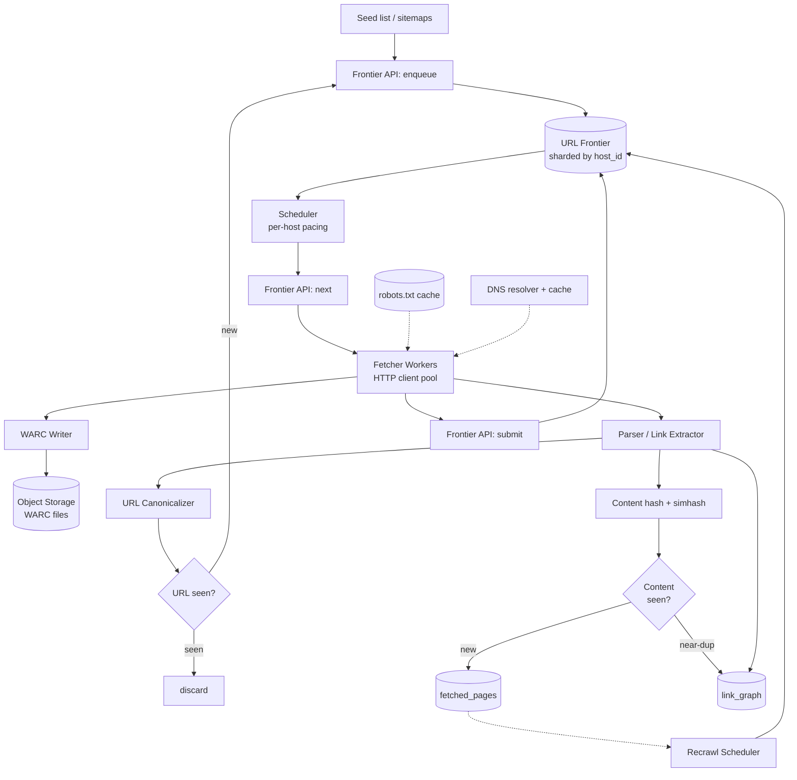

# Design a Web Crawler — Frontier, Politeness, and Distributed Fetch at Scale

**Date:** 2026-04-25 | **Updated:** 2026-04-25
**Tags:** `system-design` `case-study` `web-crawler` `distributed-systems` `frontier`

## Table of Contents

- [Summary](#summary)
- [Functional Requirements](#functional-requirements)
- [Non-Functional Requirements](#non-functional-requirements)
- [Capacity Estimation](#capacity-estimation)
- [API Design](#api-design)
- [Data Model](#data-model)
- [High-Level Design](#high-level-design)
- [Deep Dives](#deep-dives)
  - [URL Frontier](#url-frontier)
  - [Politeness — robots.txt and Crawl-Delay](#politeness--robotstxt-and-crawl-delay)
  - [Deduplication](#deduplication)
  - [Distributed Coordination](#distributed-coordination)
  - [DNS Resolution at Scale](#dns-resolution-at-scale)
  - [HTTP Fetcher Behavior](#http-fetcher-behavior)
  - [Content Storage and WARC](#content-storage-and-warc)
  - [Link Graph Storage](#link-graph-storage)
  - [Recrawl Strategy](#recrawl-strategy)
  - [JavaScript-Heavy Sites and Headless Browsers](#javascript-heavy-sites-and-headless-browsers)
  - [Anti-Bot Resistance and Cloudflare](#anti-bot-resistance-and-cloudflare)
  - [Crawler Trap Detection](#crawler-trap-detection)
- [Bottlenecks and Trade-offs](#bottlenecks-and-trade-offs)
- [Anti-Patterns](#anti-patterns)
- [Related](#related)
- [References](#references)

## Summary

A web crawler is a long-running distributed system that walks the link graph of the web — discovering URLs, fetching their content, extracting outbound links, deduplicating, storing, and scheduling future revisits. The hard parts are not "make HTTP requests fast." The hard parts are **politeness** (don't melt anyone's origin), **scale** (billions of URLs, terabytes of content, a frontier that doesn't fit in RAM), **dedup** (the same content lives at thousands of URLs), and **freshness** (knowing when to come back). This document walks through a senior-level HLD for a general-purpose crawler in the spirit of Mercator, Heritrix, and Common Crawl, with deep dives into each of the genuinely thorny components.

## Functional Requirements

The crawler must:

1. **Seed and discover URLs.** Start from a seed list and expand by extracting `<a href>`, `<link>`, sitemap, and feed URLs from fetched HTML/XML.
2. **Fetch URLs over HTTP/HTTPS.** Honor redirects, conditional GETs, gzip/brotli, and timeouts.
3. **Parse and extract.** Detect content type, parse HTML, extract outbound links, optionally extract structured text (titles, headings, body) and metadata.
4. **Deduplicate.** Both URL-level (canonical form already seen?) and content-level (same SHA-256 already stored? near-duplicate of an existing fingerprint?).
5. **Store fetched content.** Persist raw response bytes plus headers in an archival format (WARC) on object storage.
6. **Maintain a link graph.** For each fetched page, store the set of outbound URLs so downstream systems (PageRank, search index, news ranking) can consume it.
7. **Recrawl.** Revisit known URLs on a schedule informed by observed change rate and importance.

Out of scope for this design (handled by downstream systems): full-text indexing, search ranking, language detection, entity extraction. Those consume the crawler's WARC + link-graph output.

## Non-Functional Requirements

- **Politeness (hard requirement).** Respect `robots.txt` per RFC 9309. Honor `Crawl-delay` (where supplied) and our own per-host concurrency cap (typically 1–2 concurrent connections per registered domain). A crawler that gets a major site to block your IP range is worse than no crawler.
- **Scale.** 1B+ URLs in the active frontier; tens of billions known. Hundreds of millions of pages fetched per day. Storage in the petabyte range.
- **Distributed and horizontally scalable.** Adding fetcher workers should linearly increase throughput up to the politeness ceiling.
- **Fault-tolerant.** Worker death, queue partition loss, S3 throttling, and DNS outages must not lose URLs in flight or duplicate work catastrophically.
- **Deduplicated.** A crawl that fetches the same URL ten times because of a frontier bug burns money and trust.
- **Observable.** Per-host fetch rate, robots.txt cache hit rate, frontier depth per shard, parser error rate, dedup ratio, content-type mix.
- **Adaptive.** Back off automatically on 5xx/429 from a host. Slow down on `Retry-After`.

## Capacity Estimation

Target operating point: **1 billion URLs in the active frontier, fetching 200M pages/day** (a Common Crawl–scale monthly snapshot stretched out daily).

**Fetch throughput:**

- 200M pages/day ÷ 86,400 s/day ≈ **2,300 pages/second** sustained.
- Peak ~2× sustained = ~5,000 pages/second.
- Average page ~150 KB compressed → bandwidth ≈ 2,300 × 150 KB ≈ **350 MB/s ≈ 2.8 Gbps** sustained inbound.

**Worker count:**

- A single fetcher worker running ~500 concurrent HTTP connections, average page latency 500 ms ⇒ ~1,000 pages/sec/worker theoretical, ~300–500 realistic after parsing and DNS.
- Need ~10–20 fetcher workers for sustained throughput; provision 30–50 for headroom and per-host fan-out (you're throttled by per-host limits, not per-worker capacity).

**Frontier size:**

- 1B URLs × ~200 bytes per URL record (URL + metadata + priority) ≈ **200 GB**.
- Doesn't fit in any one machine's RAM. Must be sharded and disk-backed.

**Content storage (raw WARC):**

- 200M pages/day × 150 KB ≈ **30 TB/day raw**.
- One month ≈ **900 TB**. One year ≈ **11 PB**. Expect S3 / GCS / equivalent.
- WARC files batched at ~1 GB each ⇒ ~30,000 WARC files/day.

**Link graph:**

- ~50 outbound links per page × 200M pages/day = **10B edges/day**.
- Edge ≈ (src_url_id, dst_url_id) ≈ 16 bytes ⇒ ~160 GB/day, sharded by source URL.

**DNS:**

- Of those 200M fetches, perhaps 50–100M unique hosts/day (long tail). DNS cache must serve ~99% of lookups locally; cold lookups need a dedicated recursive resolver.

## API Design

The crawler is mostly an internal system. Public-facing surface is the WARC dataset and link graph. Internal control APIs:

```http
POST /frontier/enqueue
{
  "urls": ["https://example.com/foo", "https://example.com/bar"],
  "priority": 0.7,
  "source": "seed" | "extracted" | "sitemap" | "recrawl",
  "discovered_from": "https://example.com/index.html"
}
→ 202 Accepted { "accepted": 2, "rejected": 0 }
```

```http
GET /frontier/next?worker_id=fetcher-12&batch=100
→ 200 OK
{
  "urls": [
    {
      "url_id": "u_9f8a...",
      "url": "https://example.com/foo",
      "host_id": "h_ex_com",
      "lease_until": "2026-04-25T12:00:00Z",
      "etag": "\"abc123\"",
      "last_modified": "Wed, 21 Oct 2025 07:28:00 GMT"
    }
  ]
}
```

The lease is the contract: if the worker doesn't `submit` or `release` before `lease_until`, the URL becomes redeliverable to another worker.

```http
POST /frontier/submit
{
  "url_id": "u_9f8a...",
  "fetch_status": "ok" | "redirect" | "robots_disallow" | "http_error" | "timeout" | "dns_failure",
  "http_status": 200,
  "content_sha256": "ab12...",
  "warc_location": "s3://crawl-data/2026/04/25/CC-MAIN-...000123.warc.gz",
  "warc_offset": 8821334,
  "extracted_links": ["https://...", "https://..."],
  "fetch_latency_ms": 412,
  "content_type": "text/html",
  "content_length": 154322
}
→ 200 OK
```

```http
POST /robots/refresh
{ "host": "example.com" }
→ 200 OK
```

These three endpoints (`enqueue`, `next`, `submit`) plus a robots refresh hook are enough to run the system. Everything else (recrawl scheduling, dedup, link-graph writes) hangs off the `submit` event stream.

## Data Model

**`url_records`** — the canonical record per known URL. Sharded by `host_id` so a host's frontier lives on one shard.

| Field | Type | Notes |
|---|---|---|
| `url_id` | bytes(16) | first 128 bits of SHA-256(canonical URL) |
| `canonical_url` | string | normalized form |
| `host_id` | bytes(8) | hash of registered domain (eTLD+1) |
| `priority` | float | 0..1, higher = sooner |
| `state` | enum | `new`, `queued`, `in_flight`, `fetched`, `error`, `excluded` |
| `discovered_at` | timestamp | |
| `last_fetch_at` | timestamp | nullable |
| `last_status` | int | last HTTP status |
| `etag` | string | for conditional GET |
| `last_modified` | string | for conditional GET |
| `content_sha256` | bytes(32) | last fetched body hash |
| `next_recrawl_at` | timestamp | scheduled revisit |
| `fail_count` | int | for backoff |

**`host_buckets`** — per-host metadata feeding the frontier scheduler.

| Field | Type | Notes |
|---|---|---|
| `host_id` | bytes(8) | |
| `host` | string | "example.com" |
| `robots_txt` | bytes | cached body |
| `robots_fetched_at` | timestamp | TTL ~24h per RFC 9309 |
| `robots_expires_at` | timestamp | |
| `crawl_delay_ms` | int | from robots, else default |
| `next_eligible_at` | timestamp | not before this |
| `in_flight_count` | int | concurrency gate |
| `consecutive_5xx` | int | adaptive backoff |
| `observed_change_rate` | float | EWMA of detected changes |

**`fetched_pages`** — content-addressed pointers, not the bytes themselves.

| Field | Type | Notes |
|---|---|---|
| `content_sha256` | bytes(32) | primary key |
| `simhash_64` | bytes(8) | for near-dup |
| `warc_location` | string | S3 URI |
| `warc_offset` | int | byte offset within WARC |
| `warc_length` | int | record length |
| `first_seen_at` | timestamp | |
| `seen_count` | int | how many URLs hash to this content |

**`link_graph`** — sharded by `src_url_id`.

| Field | Type | Notes |
|---|---|---|
| `src_url_id` | bytes(16) | |
| `dst_url_id` | bytes(16) | |
| `anchor_text` | string | optional, truncated |
| `rel` | string | "nofollow", "ugc", etc. |
| `discovered_at` | timestamp | |

The bytes themselves live in WARC files in S3 (or equivalent). The DB stores only pointers. This is the same design shape Common Crawl uses.

## High-Level Design



The flow:

1. **Seeds** prime the frontier. New URLs discovered during parsing also flow back into the frontier through the same enqueue path.
2. The **Scheduler** picks URLs respecting per-host pacing and robots rules, hands batches to fetcher workers under a lease.
3. **Fetcher workers** do DNS, robots check, conditional GET, follow redirects, write the raw response to WARC, and pass content to the **Parser**.
4. The **Parser** extracts links, runs URL canonicalization + dedup, computes content SHA-256 + simhash, writes the link graph, and updates `fetched_pages`.
5. The fetcher **submits** the result, which closes the lease and updates `url_records` (next recrawl time, etag, fail count, etc.).
6. The **Recrawl Scheduler** periodically scans `url_records` and pushes due URLs back into the frontier.

The frontier is the heart. Everything else is plumbing around it.

## Deep Dives

### URL Frontier

The frontier is **not** a single FIFO queue. Mercator's two-level design is still the reference architecture and what Heritrix, Nutch, and StormCrawler all reimplement with variations:

- **Front queues (priority).** A small fixed number (e.g., 256) of FIFO queues, one per priority band. Important URLs (PageRank-weighted, freshness-driven, seed-derived) land in lower-numbered queues. The scheduler picks from a low-numbered queue with higher probability — a weighted round-robin or a discrete priority sampling.
- **Back queues (per-host politeness).** A larger number (e.g., tens of thousands) of FIFO queues, each pinned to a single host at a time. The invariant: at any moment, all URLs in a back queue share a host, and each host appears in at most one back queue. A heap keyed on `next_eligible_at` orders the back queues globally.

The pipeline: a URL flows from a front queue into a back queue. A worker asking for the "next URL" pops from the heap, takes the head of that back queue, and the back queue's `next_eligible_at` is advanced by `crawl_delay_ms`. When a back queue empties, it pulls the next URL from a front queue and may switch hosts (consulting a per-host map to maintain the one-host-per-back-queue invariant).

This separation is what makes politeness and importance independently tunable.

**Sharding.** With 1B URLs in the frontier, no single node holds it. Shard by `hash(host_id) mod N`. All URLs for the same host live on the same shard, which means:

- Per-host state (robots, crawl-delay, in-flight count, next-eligible time) is local to the shard. No cross-shard locking.
- A worker pulls from the shard whose hosts it owns. Workers and frontier shards can be co-scaled.

**Persistence.** Frontier state is too valuable to lose. Each shard writes to a local LSM (RocksDB-style) plus a WAL. On crash, replay the WAL. Periodically snapshot to S3 for disaster recovery.

### Politeness — robots.txt and Crawl-Delay

RFC 9309 (2022) is the formal spec. Key behaviors a crawler must implement:

- **Fetch `/robots.txt`** before the first fetch to a host, and refresh per the cache headers (or default 24h if absent). RFC 9309 says crawlers SHOULD cache and SHOULD NOT fetch on every request.
- **HTTP status semantics.**
  - `2xx` → parse and apply rules.
  - `4xx` (404 in particular) → treat as "fully allow" (no rules ⇒ free to crawl).
  - `5xx` or unreachable → treat as "fully disallow" until conditions clear. Don't silently allow on errors. This is a common crawler bug.
- **Group selection.** Match the most specific `User-agent` group; fall back to `*`. Don't merge groups.
- **Path matching.** `*` matches any sequence; `$` anchors end. Longest match wins, with `Allow` beating `Disallow` on a tie (Google's interpretation, and the spec is ambiguous enough that most crawlers follow Google here).
- **Crawl-delay.** Not in RFC 9309, but widely deployed. Honor it where present. Where absent, fall back to a per-host default (1–2 concurrent connections, 200–1000 ms between requests).

**Per-host concurrency cap.** Even with crawl-delay = 0, real crawlers cap concurrent connections per host at 1–2. Otherwise a politeness budget can be blown by a fast pipelining HTTP/2 client. The cap lives on the back-queue/host-bucket state.

**Adaptive backoff.** On consecutive 5xx or 429, double the per-host delay (capped). On `Retry-After`, honor it exactly. Googlebot does this and documents it explicitly.

### Deduplication

Three layers of dedup, each catching a different category of waste:

**1. URL canonicalization.** Before a URL enters the frontier, normalize it:

- Lowercase the scheme and host.
- Remove default ports (`:80` for http, `:443` for https).
- Decode unreserved percent-escapes; re-encode reserved ones consistently.
- Strip fragments (`#...`).
- Sort query parameters; strip known tracking params (`utm_*`, `fbclid`, `gclid`, session IDs).
- Resolve `..` and `.` in the path.
- Apply per-site rules where they're known (e.g., trailing slash policy, HTTPS upgrade).

Then `url_id = first128(SHA-256(canonical_url))`. A Bloom filter in front of `url_records` catches "definitely seen" cheaply; misses fall through to the DB.

**2. Content hash.** Compute `SHA-256(body)` after fetch. If it matches an existing `content_sha256` in `fetched_pages`, you have an exact duplicate — store a pointer, not the bytes. This catches mirror sites, syndicated content, identical cross-domain copies, and pages that two URLs (e.g., with/without trailing slash that escaped canonicalization) actually serve.

**3. Near-duplicate detection (simhash).** For each fetched page, compute a 64-bit simhash (Charikar's algorithm; Manku/Jain/Sarma described its use at Google scale in the 2007 WWW paper). Two pages whose simhashes differ in ≤ 3 bits out of 64 are near-duplicates — same article with different ads/headers/timestamps, same product page across two storefronts, etc. The classic technique: build a permuted-bit table to make 3-bit Hamming queries efficient over billions of fingerprints.

You don't drop near-duplicates from storage (downstream may still want them) but you flag them so search ranking and link-graph analysis can collapse clusters.

### Distributed Coordination

Host-based partitioning is the load-bearing decision. Hash the **registered domain** (eTLD+1, derived via the Public Suffix List), not the FQDN. Otherwise `a.example.com` and `b.example.com` land on different shards even though they share a robots.txt and an origin server.

Partitioning function:

```
shard_id = consistent_hash(eTLD+1) mod N_shards
```

Use **consistent hashing with virtual nodes** so adding/removing a frontier shard moves only ~1/N of the keyspace, not all of it. UbiCrawler used this exact approach (each agent owns a hash range, computed identically by all agents from a shared seed; agents can come and go without central coordination).

Each fetcher worker is pinned to a small set of shards. A worker reading from a shard it doesn't own is a bug.

**Cross-shard concerns:**

- **Newly extracted URLs** belong to whatever shard owns their host. The parser produces them on shard A, but routes them to shard B's enqueue endpoint. Use a Kafka topic partitioned by `host_id` as the routing layer.
- **DNS and robots.txt** caches can be either per-shard (simpler) or a separate service (less duplication). Per-shard is usually fine because the same host always lands on the same shard, so the cache stays warm exactly where it's needed.

### DNS Resolution at Scale

DNS at crawler scale is a service in its own right.

- A naive `getaddrinfo` per fetch hits the OS resolver, which serializes through `nscd`/`systemd-resolved` and chokes at a few thousand QPS.
- Run a **dedicated recursive resolver** (Unbound, BIND, or a custom async resolver). Common Crawl runs its own. Mercator was famous for finding its DNS layer was the bottleneck in 1999 and writing an async resolver to fix it.
- **Cache aggressively.** TTLs from authoritative servers are often too short (60s) for crawler economics. Many crawlers extend the effective cache to ~hours, accepting the risk of serving from stale records, since a missed update just means a few requests to the old IP.
- **Negative cache** NXDOMAIN — a host that doesn't exist will reappear in your frontier from extracted links forever; cache the failure.
- **Pre-resolve.** Before the fetcher even asks, the scheduler can warm the resolver for the next batch of hosts so DNS is never on the fetch hot path.

### HTTP Fetcher Behavior

A correct fetcher does several things people forget:

- **Conditional GET.** If you have a stored `ETag` or `Last-Modified` from a previous fetch, send `If-None-Match` / `If-Modified-Since`. A `304 Not Modified` is essentially free for the origin and for you — bandwidth saved, no parse needed, just bump `last_fetch_at` and re-schedule. This is the single biggest crawl-budget multiplier in practice.
- **HEAD vs GET.** HEAD looks tempting for "is this still here" checks, but most CDNs/origin servers don't actually optimize HEAD differently from GET, and you still pay TLS handshake + DNS. Conditional GET is almost always better.
- **Compression.** Always send `Accept-Encoding: gzip, br`. Saves 60–80% of bandwidth on HTML.
- **Connection reuse.** Keep-alive within a host's politeness window. HTTP/2 multiplexing helps here, but watch the per-host concurrency cap — multiple H2 streams on one connection still count as concurrent requests.
- **Timeouts.** Connect 5s, total 30s. Pages that don't respond in 30s are not worth your fetcher slot.
- **Body size cap.** Cap response body at, say, 10 MB. A 4 GB ISO file linked from an HTML page would happily eat your fetcher otherwise.
- **Redirects.** Follow up to N (5) hops, but record the chain. The final URL gets the content; the intermediate URLs get a redirect record so they're not refetched from scratch.

### Content Storage and WARC

**Content-addressed storage.** Body keyed by `SHA-256(body)`. Two URLs that resolve to identical bytes share one stored object. This is automatic dedup.

**WARC format (ISO 28500).** Common Crawl, Internet Archive's Heritrix, and most archival crawlers write WARC. A WARC file is a sequence of records, each with a header (`WARC-Type`, `WARC-Target-URI`, `WARC-Date`, `Content-Length`, etc.) and a body. Common record types:

- `request` — what we sent.
- `response` — what we got back, including HTTP headers + body.
- `metadata` — fetch metadata (latency, fetch chain, etc.).
- `revisit` — used when the body matches a previously-stored record; carries a pointer instead of duplicating bytes.

WARCs are **append-only, gzip-per-record** (so you can seek to any record without decompressing the whole file), and **sized at ~1 GB each** to balance S3 PUT cost against random-access seek cost. You write to a local WARC, rotate when full, then PUT to S3 / GCS. A small index of (URL → WARC URI + offset) lets you fetch a single record later.

**Why WARC over "just dump HTML to S3":** archival fidelity (the request/response pair lets you replay), tooling ecosystem (warcio, pywb, every Common Crawl downstream tool), and the `revisit` record type which is exactly the dedup primitive you'd build anyway.

See [`../../building-blocks/object-and-blob-storage.md`](../../building-blocks/object-and-blob-storage.md) for general object-storage patterns; the crawler is essentially an extreme case of "many small writes batched into large immutable objects."

### Link Graph Storage

10B edges/day is a lot. Sharded by `src_url_id`, an edge is ~16 bytes and writes are append-only. Options:

- **Columnar files in S3 (Parquet).** Append daily partitions, then a periodic compaction job rewrites them sorted by source for query efficiency. This is the Common Crawl pattern.
- **Distributed graph store (HBase, BigTable, Cassandra).** Row key = `src_url_id`, columns = `dst_url_id`s. Reads "all outbound links from this URL" are a single row. Used by Nutch's `crawldb` historically.
- **Adjacency list in compressed form (WebGraph framework — Boldi/Vigna).** For static analysis (PageRank, community detection), the WebGraph framework's compressed representation lets a billion-node graph fit in tens of GB.

The query patterns differ by consumer. PageRank wants the whole adjacency list; "what links to this URL" needs the *inverse* index (sharded by `dst_url_id`), built as a separate offline job.

### Recrawl Strategy

Naive: revisit every URL every N days. This wastes 90% of fetches on pages that haven't changed and misses pages that change hourly.

Better: **adaptive recrawl based on observed change rate**, weighted by importance.

- For each URL, maintain an EWMA of "did the content hash change since last fetch?" Pages whose hash never changes get exponentially longer recrawl intervals (capped at, say, 30 days). Pages that change every fetch get aggressive recrawl (down to a per-host floor of, say, 1 hour to stay polite).
- Weight by **importance**. PageRank-weighted URLs (or simpler: number of inbound links from other domains, fed back from the link graph) get more frequent crawls. The home page of a major news site might be 5 minutes; an obscure deep-archive page might be 90 days.
- **Sitemap signals.** `<lastmod>` in a sitemap is a hint, not gospel. Use it to nudge `next_recrawl_at` earlier when reported, but verify with conditional GET.
- **HTTP signals.** A `Cache-Control: max-age=300` is a hint that the publisher expects the page to change every 5 minutes. Use it as a lower bound, never an upper one.

This is the Googlebot pattern, documented in their crawl budget guidance: "URLs that are more popular on the Internet tend to be crawled more often to keep them fresher."

### JavaScript-Heavy Sites and Headless Browsers

Increasing fractions of the web render content client-side. A crawler that only does HTTP-level fetch sees `<div id="root"></div>` and nothing else.

Options, in increasing cost:

1. **Static fetch + parse.** The cheap default. Most pages still ship meaningful HTML for SEO reasons.
2. **Pre-rendered fetch via `?_escaped_fragment_=` or `Accept: text/html` with a special user-agent.** Some sites detect bots and serve pre-rendered HTML. Spotty.
3. **Headless Chrome / Playwright.** Execute the page, wait for network idle or a configured selector, snapshot the DOM. **10–50× more expensive** than a static fetch (CPU, memory, time). You cannot do this for every URL.

The standard pattern: **two-tier crawling.** A cheap static fetch first; if the resulting HTML is suspiciously empty (very low text-to-tag ratio, missing expected elements, has a known SPA framework signature), enqueue the URL into a separate, much smaller and slower headless-browser pool. Reserve the expensive lane for high-importance URLs only.

### Anti-Bot Resistance and Cloudflare

Cloudflare, Akamai Bot Manager, PerimeterX, and others present challenges that defeat naive crawlers:

- **JavaScript challenges** (CF "checking your browser"). Solvable only with headless browser + sometimes residential IPs.
- **TLS fingerprinting (JA3).** The TLS ClientHello of `requests` / `curl` is distinguishable from Chrome. Mitigations require `curl-impersonate` or similar.
- **Rate limits per IP.** Distribute fetch across an IP pool, but be careful: rotating IPs while crawling the same host is itself a bot signal.
- **CAPTCHA.** Generally unsolvable at scale. The pragmatic answer is: don't crawl what asks for one. Mark the host as `requires_interaction` and skip.

The honest engineering answer: **a general-purpose crawler should identify itself honestly with a descriptive `User-Agent` and a public contact URL** (Googlebot, Bingbot, CCBot all do this), respect robots.txt to the letter, and not try to defeat anti-bot systems. Sites that block your honest crawler are sites you don't get to crawl. Trying to evade is an arms race you will lose, and it taints the entire IP range for legitimate use.

### Crawler Trap Detection

A "trap" is a structure that generates infinite distinct URLs without distinct content. Examples:

- **Infinite calendars.** `/calendar?year=1789&month=3` and you can keep going forever in either direction.
- **Faceted navigation explosions.** `/products?color=red&size=L&sort=price&page=42&color=blue` — the parameter-order combinatorics are unbounded.
- **Session-ID URLs.** Every visit gets a new session in the URL path or query.
- **Symlink loops on file servers.** `dir/dir/dir/dir/...` ad infinitum.
- **Redirect loops.** Bug, not malice, but same effect.

Defenses:

- **Path depth cap.** URLs deeper than, say, 20 path segments are very likely traps.
- **Per-host URL count cap.** Cap the number of URLs you'll keep in the frontier per host. The 100,001st URL from `weirdcalendar.example.com` waits.
- **Identical-content detection.** If 100 consecutive URLs from the same host hash to the same content (or simhash within 3 bits), de-prioritize the host's path pattern.
- **Parameter dedup.** Treat URLs that differ only in tracking parameters as identical (covered by canonicalization, but worth flagging when canonicalization keeps reducing many URLs to one — that's a hint).
- **Redirect chain length cap.** Already covered by the fetcher's redirect cap (5).

Heritrix and Nutch both ship explicit trap-detection scopers. They're not optional at scale.

## Bottlenecks and Trade-offs

| Bottleneck | Symptom | Mitigation | Trade-off |
|---|---|---|---|
| Per-host politeness | High-priority host's queue can't drain fast enough | Negotiate higher rate with publisher; cap importance contribution per host | Risk of being blocked if you cheat |
| DNS resolution | Fetcher CPU idle, waiting on DNS | Dedicated recursive resolver, aggressive cache, pre-resolution | Stale records occasionally |
| Frontier shard hot spot | One host (e.g., wikipedia.org) dominates a shard | Split per-host queues across multiple "lanes" within a shard | More complex scheduler |
| WARC write amplification | Many small S3 PUTs | Batch into 1 GB WARC files locally before upload | Up to 1 GB of in-flight content lost on worker crash; mitigate with WAL |
| Recrawl freshness vs cost | Crawl budget always too small | Adaptive scheduling, importance weighting | Long-tail pages drift stale |
| JS-rendering cost | Headless pool always saturated | Strict gating; don't render unless needed | SPA-only sites under-covered |
| Dedup memory | Bloom filter / dedup index doesn't fit | Tier: hot in RAM (Bloom), warm on SSD (RocksDB), cold archived | False positive Bloom hits cost a DB lookup |
| Storage cost | Petabytes add up | WARC compression, dedup via revisit records, tiered storage (S3 IA / Glacier for old crawls) | Slower retrieval for old data |

The single biggest trade-off in practice: **politeness vs throughput**. Every single design decision in a crawler ultimately reduces to "how do we get more pages without being a jerk to origin servers."

## Anti-Patterns

- **Single global queue, no per-host pacing.** You will hammer one host while a million others sit idle. You will get banned. This is the default if you `import asyncio; await asyncio.gather(*[fetch(u) for u in urls])`.
- **Treating robots.txt as advisory.** Even one viral incident of a crawler ignoring `Disallow` poisons the well for everyone.
- **No URL canonicalization.** Same content gets fetched 50 times across query-parameter and slash-trailing variants. Frontier explodes; storage explodes; downstream signals are wrong.
- **Re-fetching unconditionally.** Skipping `If-None-Match`/`If-Modified-Since` doubles or triples your bandwidth bill and irritates publishers.
- **In-memory frontier for serious crawls.** A frontier that fits in RAM is a frontier that loses everything on a single crash. Disk-backed + WAL from day one.
- **Centralized coordination point.** A single scheduler service that workers ask "what's next?" individually doesn't scale past a few thousand QPS. Sharded local schedulers are the way.
- **Treating extraction and fetch as one process.** They have completely different scaling profiles. Extraction is CPU-bound (parsing, simhash, link extraction); fetch is I/O-bound. Combining them wastes one or the other.
- **No backoff on 5xx/429.** You'll keep hitting a struggling origin until it goes down entirely, at which point you'll keep hitting its error pages.
- **Trusting `Last-Modified` to skip parsing.** A 304 means "don't refetch the body"; it doesn't mean "no need to re-extract links if you already have the body." Be careful which step you skip.
- **Crawling with one IP.** Quickly rate-limited or blocked. Distribute across an IP pool, but stay honest about identity.
- **Ignoring crawler traps.** A single calendar trap can fill a frontier shard with garbage in hours.
- **Storing decompressed HTML in a hot DB.** Hot databases are for pointers and metadata. Bytes go to object storage in WARC.

## Related

- [`design-google-search.md`](design-google-search.md) — the consumer of this crawler's output; covers indexing, ranking, and serving.
- [`design-news-aggregator.md`](design-news-aggregator.md) — a focused (vertical) crawler with much tighter freshness requirements and a curated seed list.
- [`../../building-blocks/object-and-blob-storage.md`](../../building-blocks/object-and-blob-storage.md) — WARC files in S3 / GCS, lifecycle policies, and tiered storage.
- [`../../building-blocks/message-queues-and-brokers.md`](../../building-blocks/message-queues-and-brokers.md) — Kafka as the routing layer for cross-shard URL enqueues.
- [`../../building-blocks/rate-limiters.md`](../../building-blocks/rate-limiters.md) — token-bucket and leaky-bucket patterns for per-host politeness.
- [`../../scalability/sharding-strategies.md`](../../scalability/sharding-strategies.md) — consistent hashing and virtual nodes for frontier shard placement.

## References

- Heydon, A. and Najork, M. ["Mercator: A Scalable, Extensible Web Crawler."](https://www.cs.cornell.edu/courses/cs685/2002fa/mercator.pdf) *World Wide Web*, vol. 2, no. 4, 1999. The canonical reference; the front-queue/back-queue frontier design originates here.
- Boldi, P., Codenotti, B., Santini, M., and Vigna, S. ["UbiCrawler: A Scalable Fully Distributed Web Crawler."](https://citeseerx.ist.psu.edu/document?repid=rep1&type=pdf&doi=5af7118c651b42e86c769f57a2e0334f702efa9e) *Software: Practice and Experience*, 2004. Consistent-hashing-based decentralized assignment.
- Boldi, P., Marino, A., Santini, M., and Vigna, S. ["BUbiNG: Massive Crawling for the Masses."](https://arxiv.org/pdf/1601.06919) 2016. UbiCrawler's successor; covers modern HTTP/2, large frontier persistence.
- ["RFC 9309: Robots Exclusion Protocol."](https://www.rfc-editor.org/rfc/rfc9309.html) IETF, September 2022. The formal robots.txt specification.
- Apache Nutch project. [Nutch documentation](https://nutch.apache.org/) and [Nutch on GitHub](https://github.com/apache/nutch). Production open-source crawler; crawldb data model, segment-based processing.
- Internet Archive. [Heritrix3](https://github.com/internetarchive/heritrix3) and [Heritrix user manual](http://crawler.archive.org/articles/user_manual/intro.html). Per-host queue design, WARC integration, scope rules.
- Common Crawl. ["Navigating the WARC file format."](https://commoncrawl.org/blog/navigating-the-warc-file-format) Practical WARC, WAT, WET layout for petabyte-scale crawls.
- Common Crawl. [Get Started](https://commoncrawl.org/get-started). Dataset structure and access patterns for crawler output consumers.
- Manku, G. S., Jain, A., and Sarma, A. D. ["Detecting Near-Duplicates for Web Crawling."](https://research.google.com/pubs/archive/33026.pdf) WWW 2007. SimHash at Google scale; the bit-permutation lookup trick.
- Google Search Central. ["Crawl Budget Management."](https://developers.google.com/crawling/docs/crawl-budget) Adaptive crawl rate, importance weighting, server-health signals.
- Google Search Central. ["How Google Interprets the robots.txt Specification."](https://developers.google.com/crawling/docs/robots-txt/robots-txt-spec) Practical interpretation of RFC 9309 edge cases.
