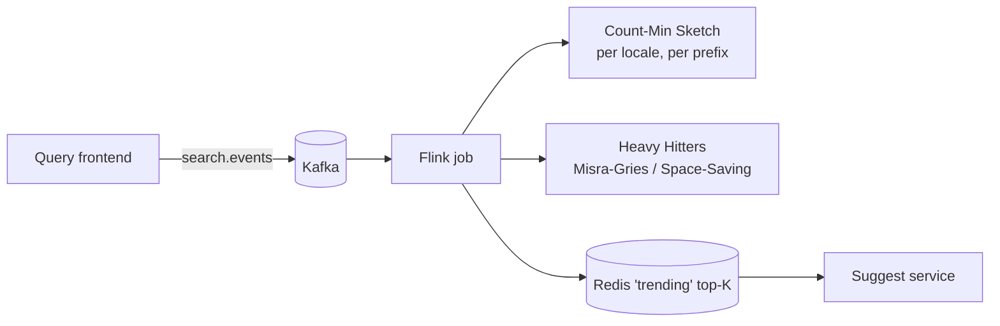

# Google Search Deep Dive — Autocomplete and Query Rewriting

**Date:** 2026-04-30 | **Updated:** 2026-04-30
**Tags:** `system-design` `case-study` `google-search` `deep-dive` `autocomplete` `query-rewriting`
**Parent:** [Design Google Search](../design-google-search.md) — Autocomplete section
**Sibling deep-dives:** [`ranking-signals.md`](./ranking-signals.md)
**Companion (generic):** [Design Search Autocomplete](../design-search-autocomplete.md)

## Table of Contents

- [Summary](#summary)
- [Overview](#overview)
- [Trie Autocomplete with Weighted Nodes](#trie-autocomplete-with-weighted-nodes)
- [Per-Keystroke Latency Budget](#per-keystroke-latency-budget)
- [Freshness — Trending Searches](#freshness--trending-searches)
- [Personalization](#personalization)
- [Safe-Search and Suggestion Filtering](#safe-search-and-suggestion-filtering)
- [Spell Correction — Edit Distance and Language Models](#spell-correction--edit-distance-and-language-models)
- [Query Expansion — Synonyms and Stemming](#query-expansion--synonyms-and-stemming)
- [Did You Mean](#did-you-mean)
- [Anti-Patterns](#anti-patterns)
- [Related](#related)
- [References](#references)

## Summary

Autocomplete and query rewriting are two superficially similar features that solve different problems and live in different parts of the Google Search stack. **Autocomplete** runs on every keystroke against a curated suggestion corpus — its job is to predict the query the user is *about* to type, with a hard sub-100 ms budget and no access to the full web index. **Query rewriting** runs once per submitted search, inside the query understanding stage, and silently transforms the query before retrieval — spell correction, synonym expansion, stemming, segmentation. The two systems share signals (query logs, language models, click data), but the data structures, latency budgets, freshness pipelines, and failure modes differ enough that they are designed independently.

This deep dive zooms into the architecture decisions that make both work at Google scale: **weighted tries / FSTs** with precomputed top-K, a **per-keystroke latency budget** that is dominated by network rather than CPU, a **streaming sketch layer** for trending freshness, **edit-distance-bounded** spell correction tied to a **noisy-channel language model**, and **query expansion** via curated synonym tables plus learned stemming. The architectural takeaway: do not let the search ranker do this work — it is too slow, too expensive, and trained on the wrong signal.

## Overview

The user types `piz`. What happens?

```text
keystroke 'p'  → debounce 150 ms → /complete?q=p
keystroke 'i'  → cancel inflight  → /complete?q=pi
keystroke 'z'  → cancel inflight  → /complete?q=piz
                                     ↓
                                CDN HIT (60–95% of traffic)
                                     ↓
                                 Suggest service
                                     ↓
                              Trie shard for prefix "p"
                                     ↓
                              Read precomputed top-K at node "piz"
                                     ↓
                       Optional: merge trending top-K from streaming layer
                                     ↓
                       Optional: re-rank with personalization signals
                                     ↓
                                 JSON response (~5–10 ms server-side)
```

Now the user presses Enter on `piza`. A different system takes over:

```text
"piza"  →  query understanding pipeline
                ├── tokenize / language detect
                ├── spell-correct  →  "pizza" (confidence 0.97)
                ├── stem / lemmatize
                ├── synonym expand →  {pizza, pie}
                ├── entity link    →  Pizza (Q177)
                ├── intent classify →  local-food
                └── rewritten_query →  "pizza"  (silent rewrite)
                       ↓
                Retrieve, rank, render SERP
                       ↓
                "Showing results for pizza — search instead for piza"
```

Both pipelines feed off the **query log** as their training signal, but they consume it differently:

| Aspect | Autocomplete | Query Rewriting |
|--------|--------------|-----------------|
| Trigger | Every keystroke | Once per submitted query |
| Latency budget (server) | < 20 ms p99 | 10–20 ms (part of 200 ms QU stage) |
| Data structure | Trie / FST with top-K | Confusion table + language model + synonym table |
| Freshness signal | Streaming sketches over 5–60 min | Daily/weekly retrains; curated synonym edits |
| Failure mode | Wrong prediction = silent miss | Wrong rewrite = wrong results page |
| Privacy threshold | k-anonymity (≥ N distinct users) | Same plus aggregate-only training |

The rest of this doc walks through the components and the design trade-offs at each layer.

## Trie Autocomplete with Weighted Nodes

The data structure that makes autocomplete cheap is a **weighted trie** — every node stores its prefix's top-K completions plus an aggregated weight. The weight is a blend of long-term popularity, recency, geography, and language. The point of pre-computing this is so the read path is a single trie walk plus a memcpy, never a subtree traversal.

```text
              (root)
              /  |  \
             p   s   ...
            top_k=[pizza, photos, paypal, ...]
             |
             i
            /|\
            ...
             z
             |
             z
            top_k=[pizza near me, pizza hut, pizza dough recipe, ...]
             |
             a
```

### Node Layout

A practical node layout for the in-memory image:

```text
struct Node {
    children: HashMap<char, NodeId>     // edge labels
    is_terminal: bool                    // is this a complete suggestion?
    top_k: [SuggestionId; K]             // precomputed, ordered
    top_k_scores: [f32; K]               // aligned with top_k
    aggregated_weight: f32               // sum of weights in subtree
    flags: u8                            // safe-search bits, locale bits
}
```

- `K = 10` is the practical sweet spot (Google's surfaced UI typically shows 4–8, but the suggest service overfetches for re-ranking headroom).
- `top_k` references suggestion IDs stored in a parallel string table; this avoids storing duplicate strings at every ancestor node.
- The flags byte encodes per-suggestion safe-search applicability (so a single trie image serves both safe and unsafe paths via masking).

### From Trie to FST

A naive trie for Google's vocabulary (hundreds of millions of unique queries across 100+ languages) is impractical — RAM-bound and slow to build. Production systems use a **finite-state transducer (FST)** that compresses both prefixes *and* suffixes via DAWG-like minimization. Lucene's [FST package](https://lucene.apache.org/core/9_0_0/core/org/apache/lucene/util/fst/package-summary.html) is the open-source reference; Google's internal equivalent has the same shape.

| Structure | Memory (relative) | Build time | Read latency | Notes |
|-----------|-------------------|------------|--------------|-------|
| Plain trie (HashMap children) | 1.0× | Fast | Fastest | Prototype only |
| Array-mapped trie | 0.7× | Fast | Fastest | Good for small alphabets |
| Patricia / radix trie | 0.4× | Medium | Fast | Compresses single-child chains |
| DAWG (suffix-shared) | 0.15× | Slow | Fast | ~6× smaller than plain trie |
| FST (DAWG with outputs) | 0.10× | Slow | Fast | Production choice; Lucene reference |

The trade-off is build time. FSTs require a sorted input and a minimization pass — minutes to hours for a hundred-million-entry vocabulary. This is why builds are **offline** and the live image is **immutable**: read-mostly, blue/green swapped.

### Weight Aggregation

The weight at a node is the score the ranker uses to pick top-K. A defensible blend:

```text
w(suggestion) = α · log(count_30d)
              + β · log(count_7d / count_30d_avg)   # recency lift
              + γ · click_through_rate
              + δ · regional_boost(region)
              + ε · safety_adjustment
```

- `α` dominates for stable head queries.
- `β` is a **z-score-like** recency lift — picks up trending queries without overwhelming long-tail.
- `γ` (CTR) prevents popular-but-unhelpful queries from dominating (impressions without clicks signal a ranker miss).
- `δ` and `ε` are cheap multiplicative adjustments computed at build time.

The output is a single scalar per (suggestion, locale) pair. The trie builder bubbles top-K up from leaves to root using a min-heap of size K per node — a single bottom-up pass.

## Per-Keystroke Latency Budget

The user types at roughly 200–400 ms per character. That sets the ceiling. Inside it, the autocomplete pipeline has to fit comfortably or feel laggy. A defensible target is **end-to-end < 100 ms p99**.

### Budget Breakdown

```text
client debounce          150 ms  (wall-clock; not on the budget)
DNS / TCP / TLS reuse      ~0 ms  (kept-alive HTTP/2)
network RTT (CDN)        20–40 ms  (region-local edge)
edge cache lookup           1 ms
[on miss]
  origin RTT             10–30 ms
  gateway + auth          1– 3 ms
  trie shard lookup     0.1– 1 ms
  top-K read            0.1– 0.5 ms
  personalization fan-out 5–10 ms (parallel)
  re-rank + serialize    1– 2 ms
JSON parse + render      5–15 ms
─────────────────────────────────
total p99                ~70–95 ms (cache miss, authenticated)
                         ~25–40 ms (cache hit, anonymous)
```

The budget is **dominated by network**, not CPU. This drives most of the architecture:

1. **Edge cache by default.** Anonymous traffic — the majority — never reaches origin. CDN hit rates >90% for 1–3 char prefixes are routine because the prefix distribution is heavy-headed.
2. **Connection reuse mandatory.** HTTP/2 or HTTP/3 with kept-alive sockets. A cold TLS handshake alone (50–100 ms) blows the budget.
3. **Region-local routing.** Anycast + GeoDNS to the nearest edge POP. Cross-continent autocomplete is unusable.
4. **Cancel inflight on new keystroke.** Browsers should `AbortController` the prior fetch when the user types again. Otherwise the response for `pi` may arrive after the response for `piz` and overwrite the UI.

### Throttling and Debouncing

- **Debounce** (delay-then-send) is the default: wait 150–200 ms after the last keystroke. For fast typists this collapses 5–10 keystrokes into 1 request.
- **Throttle** (rate-limit) is a fallback for slow, deliberate typists: never more than 5 req/sec.
- Both run on the client. The server should additionally rate-limit per-IP and per-user — see [`../../building-blocks/rate-limiters.md`](../../building-blocks/rate-limiters.md).

### Cache Key Hygiene

```text
key = lower(NFC(trim(q))) | lang | country | safe_search_bucket | experiment_bucket
```

Forgetting any of these is a real bug:

- Skip locale → "pi" returns Italian completions ("piano") to English users.
- Skip safe-search bucket → mixing safe and unsafe responses across users.
- Skip experiment bucket → A/B treatment groups corrupt each other's metrics.

Authenticated requests (with `Authorization`) bypass the edge entirely with `Cache-Control: private, no-store`.

## Freshness — Trending Searches

Batch alone is too slow. A nightly rebuild misses every breaking-news event for hours. The freshness layer is a **streaming sketch** running over the live query stream.



### Sketch Choice and Sizing

A [Count-Min Sketch](http://dimacs.rutgers.edu/~graham/pubs/papers/cm-full.pdf) (Cormode & Muthukrishnan, 2005) gives an unbiased over-estimate of per-term frequency in sublinear space. For ε=0.001, δ=0.01 the table is roughly `e/ε × ln(1/δ) ≈ 2718 × 5 = 13,590` cells — call it 13.6 KB per sketch at 4-byte counters.

To keep top-K compact, pair the sketch with a **Misra-Gries** (or **Space-Saving**) heavy-hitters structure of size `c·K` (typically `c=10`). For K=10, that's 100 (term, counter) entries per tracked prefix.

Tracking `~1M` distinct prefixes (1- to 4-character prefixes per locale, weighted by traffic) at this density costs `~1M × (13.6 KB + 1.6 KB) ≈ 15 GB` of Flink state — fits in one stateful job with RocksDB-backed state.

### Sliding Window

Two windows running in parallel:

| Window | Use |
|--------|-----|
| 5-minute tumbling | Detection of breaking-news spikes ("X just happened") |
| 60-minute sliding | Smoothing — survives noise, captures sustained trends |

Snapshots are flushed to Redis every 30 seconds. The suggest service does a non-blocking lookup; if the trending top-K is missing or stale (older than 5 min), it skips the merge.

### Merge Strategy

The suggest service combines the **batch top-K** (trie node) with the **trending top-K** (Redis) using a small additive boost:

```python
merged_score = batch_score + λ · trending_zscore
# λ = 0.2, capped so trending can promote but not flood
```

The cap matters. Without it, one viral tweet can poison a prefix for everyone. Production systems also enforce a **minimum count threshold** (the term must appear in ≥ N distinct sessions before it is eligible) and a **velocity ceiling** (no single term can rise more than M ranks per snapshot).

### Half-Life on Recency

Google's published explanation [How Google autocomplete predictions work](https://blog.google/products/search/how-google-autocomplete-works-search/) emphasizes "trending interest." The mechanism is an **exponentially-weighted moving average** with a short half-life (hours, not days) layered on the long-term popularity term. New events compound quickly; old events decay fast.

## Personalization

Personalization in autocomplete is a **re-rank**, not a retrieval. The flow:

```text
1. Suggest service walks the global trie shard → returns top-50 candidates.
2. In parallel: personalization service fetches user features:
     - last N queries (clicked + abandoned)
     - approximate location (city granularity, often opt-out)
     - language(s) from Accept-Language and account settings
     - device class (mobile vs desktop)
     - lightweight embedding for semantic affinity (256-dim)
3. Linear / logistic re-ranker scores each of the 50:
     score = α·global_pop + β·history_match + γ·geo_match + δ·embed_sim
4. Trim to K, return.
```

### Why Re-Rank, Not Retrieve

Two reasons:

1. **Cold-start.** A logged-out user, an incognito session, a fresh account — none have personalization signals. If retrieval depended on them, these users would see nothing. Re-rank means the candidate set is always populated.
2. **Privacy posture.** Personalization features are stored per-user and only feed *that* user's responses. They never enter the global trie. The trie is built from anonymized aggregate signals only.

### Geo-Aware Without Tracking

A common pattern: derive an approximate region (country + metro area) from IP geolocation at the edge. This is coarse enough to avoid identifying individuals but precise enough to localize completions ("pizza near me" outranks "pizza dough recipe" for a mobile user in Boston).

For logged-in users, the user's saved location preference takes precedence. Both signals respect the user's `Web & App Activity` setting — when off, no per-user history is consulted.

### Cache Implications

Personalized responses are uncacheable at the edge. Two operational consequences:

- Authenticated traffic is **5–10× more expensive per query** than anonymous. Capacity planning should treat them as distinct workloads.
- The gateway must set `Cache-Control: private, no-store` on personalized responses and the right `Vary: Authorization, Cookie` headers on the rest, otherwise a cache poisoning bug surfaces personalized data to anonymous users.

## Safe-Search and Suggestion Filtering

Autocomplete is a published surface — every prediction is the product, not just data. That means the filter pipeline is part of the **build**, not the request path.

### Build-Time Filters

```text
candidate set
   ↓
[1] k-anonymity threshold  (≥ N distinct users in 30d window)
   ↓
[2] PII regex pass          (email, phone, SSN, credit-card patterns)
   ↓
[3] Denylist                (curated by trust & safety teams)
   ↓
[4] Classifier ensemble:
       - hate speech
       - sexually explicit
       - violent content
       - dangerous activities (per Google's policy)
       - elections / health misinformation (sensitive verticals)
   ↓
[5] Per-locale review queues for borderline cases
   ↓
trie input
```

The exact category list is product-specific and evolves; Google's [autocomplete policies](https://support.google.com/websearch/answer/7368877) document the public-facing rules.

### k-Anonymity

The single most important rule: **a query is eligible for the global trie only if at least N distinct users have searched it** in the relevant window. N is typically in the thousands. This prevents the "user typed their SSN once" failure mode and prevents targeted suggestion poisoning by a single attacker.

### Runtime Bucketing

At request time, the suggest service applies the user's safe-search setting (off / moderate / strict) by masking the per-suggestion flags. The trie image carries one set of suggestions; runtime filters out the ones the user opted away from. This is cheap — a single bitmask AND per candidate.

### Reporting Loop

Users can flag a prediction. Reports stream into a moderation queue; a confirmed bad prediction goes onto the denylist within hours. The denylist is part of the trie build; emergency removals can also push directly to the suggest service as a runtime overlay (Bloom filter of banned suggestion IDs) for sub-build-cycle takedowns.

## Spell Correction — Edit Distance and Language Models

Spell correction lives in the **query understanding** stage, not in autocomplete. It runs once per submitted query, has a slightly looser latency budget (10–20 ms), and consumes *all* of the query, not just a prefix.

The classical formulation, well-covered in the [Stanford / Manning IR book Chapter 3 on dictionaries and spelling correction](https://nlp.stanford.edu/IR-book/html/htmledition/spelling-correction-1.html), is the **noisy-channel model**:

```text
argmax_w  P(w | q) = argmax_w  P(q | w) · P(w)
                              └────┬────┘ └───┬───┘
                          error model    language model
```

- `P(q | w)` is the **error model**: probability that the user typed `q` when they meant `w`. Trained on large query-correction logs (`q → q'` pairs where the user retyped after a no-results page).
- `P(w)` is the **language model**: probability that `w` is a real query. Trained on the query log.

### Candidate Generation — Edit Distance

The candidate set is generated by **bounded edit-distance lookup** in the dictionary. For interactive use the bound is small:

| Query length | Max edit distance |
|--------------|-------------------|
| 1–2 chars    | 0                 |
| 3–5 chars    | 1                 |
| 6+ chars     | 2                 |

This is exactly Elasticsearch's `fuzziness: AUTO`. The fast structure for the lookup is a **[Levenshtein automaton](https://en.wikipedia.org/wiki/Levenshtein_automaton)** ([Schulz & Mihov, 2002](https://doi.org/10.1007/s10032-002-0082-8)) intersected with the dictionary FST — running time proportional to the result set, not the dictionary size.

For multi-word queries, candidate generation is per-token with a global edit-distance budget, plus segmentation candidates ("ny times" ↔ "nytimes").

### Phonetic Backstop

Edit distance does not catch all errors. "Tsunami" / "sunami" share zero prefix and have edit distance 1 only because of the leading T. Add a **phonetic** candidate generator (Soundex, Metaphone, or Double Metaphone) as a parallel lane. Candidates from both lanes feed the same scoring step.

### Language Model

A practical setup:

- **Unigram + bigram + trigram** counts from the query log.
- **Stupid backoff** smoothing — fast and good enough; full Kneser-Ney is overkill at this scale.
- For neural augmentation, a small distilled transformer scores top-N candidates from the n-gram model. Compute budget: a few ms on CPU per query.

The language model is **per-locale**. English misspellings of Spanish words don't help anyone.

### Confidence and the Rewrite Threshold

The system computes a confidence score for the best correction. Three regimes:

| Confidence | UX |
|------------|-----|
| Very high (e.g. > 0.95) | Silent rewrite. Run the search on the corrected query; show "Showing results for X — search instead for Y". |
| Medium (0.7 – 0.95) | Run the search on the original query. Show "Did you mean X?" above the results. |
| Low (< 0.7) | No correction shown. |

The thresholds are per-locale and tuned via offline replay against a labelled set. Aggressive thresholds boost CTR but risk the "wrong correction" failure mode where the system silently rewrites a deliberate query.

## Query Expansion — Synonyms and Stemming

Spell correction fixes typos. **Query expansion** broadens the query so the retrieval stage matches more relevant documents — the user typed `running shoes`, the index also matches `runner shoe` and `jogging sneakers`. The Stanford / Manning IR book Chapter 9 on [relevance feedback and query expansion](https://nlp.stanford.edu/IR-book/html/htmledition/query-expansion-1.html) covers the academic background.

### Sources of Expansion Terms

| Source | Mechanism |
|--------|-----------|
| **Manual thesaurus** | Curated synonym table edited by linguists; high precision, low recall |
| **Stemming / lemmatization** | "running" → "run"; language-specific (Porter, Snowball, lemma dictionaries) |
| **Co-click expansion** | If users searching `q1` and `q2` click the same documents, treat as related |
| **Word embeddings** | Cosine similarity in word2vec / fastText space |
| **Pseudo-relevance feedback** | Top-N retrieved documents → frequent terms → expand query |
| **Translation-based** | "tshirt" ↔ "t-shirt" ↔ "tee shirt" mined from re-formulations |

Production systems blend several of these. The blend is **per-language** and **per-vertical** — synonym tables for shopping queries differ from medical queries.

### Stemming Trade-offs

Aggressive stemming (`Porter`, `Lovins`) collapses too many forms — `university` → `univers` matches `universe`, which is wrong. Modern systems prefer **lemmatization** with a part-of-speech tag: it's slower but more accurate. For high-traffic Latin-script languages, a light Snowball stemmer is the practical default; for morphologically rich languages (Russian, Finnish, Turkish, Arabic) full lemmatization matters more.

### Expansion at Query Time vs Index Time

Two valid strategies:

| Strategy | Pro | Con |
|----------|-----|-----|
| **Index-time expansion** (analyzer expands documents) | Fast at query time; simpler ranker | Index bloat; changing synonyms requires reindex |
| **Query-time expansion** (analyzer expands query) | Synonyms can be edited live; smaller index | Slower at query time; ranker must score expanded terms |

Google-scale production typically uses **index-time stemming** (cheap, stable, language-bound) plus **query-time synonym expansion** (cheap, editable, contextual). The query is rewritten into a disjunction:

```text
"running shoes" → (running OR run OR runner OR jogging) AND (shoes OR shoe OR sneakers)
```

with per-term weights so synonyms count for less than the original token.

### Boost Calibration

Synonyms are not equal. `tshirt ↔ t-shirt` is almost a unification (boost 0.95). `running ↔ jogging` is a softer relation (boost 0.6). `running ↔ runner` is a morphological variant (boost 0.85). Boosts are learned from co-click data and tuned with online A/B against engagement metrics.

### Failure Modes

- **Over-expansion.** "apple" → "fruit" → retrieves orchard content for a user looking for the company. Mitigation: entity-link the query first; suppress expansion when a strong entity is present.
- **Cross-sense bleed.** "bank" expands to both "river bank" and "financial institution." Mitigation: use the surrounding tokens to disambiguate, or keep expansion conservative.
- **Locale leakage.** Spanish synonyms applied to English queries. Mitigation: detect query language at the top of QU and lock the analyzer chain to that language.

## Did You Mean

"Did you mean" is the user-facing surface for spell correction *when confidence is medium*. It's a separate UX from autocomplete and from silent rewrite.

```text
[ user submits: "horse riding equiptment" ]
   ↓
QU spell-correction → "horse riding equipment"  (confidence 0.83)
   ↓
RUN search on ORIGINAL query (low result count or low quality)
   ↓
Render SERP for original
   +
Header: "Did you mean: horse riding equipment?"
```

Compare this with **silent rewrite** (high confidence) where the search runs on the *corrected* query and the SERP carries a "Showing results for X — search instead for Y" notice.

The distinction matters for trust:

- High-confidence silent rewrite saves the user a click but is wrong loudly when it misfires.
- Medium-confidence "Did you mean" is conservative — it costs a click but the user stays in control.

### When to Show

Show "Did you mean" when **all** of these hold:

1. The correction confidence is in the medium band.
2. The original query had low retrieval quality (few results, low click-through historically).
3. The corrected query has substantially better retrieval (a known query in the corpus, or significantly more matches).

Don't show it when the original query is itself a known query (suppresses the suggestion). Don't show it for navigational queries (suppresses for queries that are URL-like).

### Latency

"Did you mean" is computed in QU and rendered as part of the SERP. It does not add a round-trip — the candidate is computed in parallel with retrieval and dropped if not displayed.

## Anti-Patterns

- **Treating autocomplete like search.** Autocomplete is a prefix problem on a curated, weighted vocabulary. Hitting the full search stack on every keystroke costs orders of magnitude more and trains on the wrong signal.
- **Skipping client-side debounce.** A 150–200 ms debounce eliminates 60–70% of requests with no perceived latency cost. Servers without it serve typing noise, not user intent.
- **Updating the live trie in place.** Concurrent updates with concurrent reads under load is a recipe for inconsistent results and partial responses. Always build offline; always blue/green swap.
- **Cache key without locale.** "pi" expands to different completions in English and Italian. A missing locale field corrupts results for half the userbase.
- **Personalized retrieval instead of personalized re-rank.** Cold-start users get nothing, fresh queries never surface, and A/B numbers tank.
- **Streaming-only top-K with no batch backstop.** Sketches are approximate; over hours the error compounds. Use batch as truth, streaming as the trend overlay.
- **Aggressive silent rewrites.** A high-confidence threshold that's actually too low produces "wrong correction" complaints that erode trust. Calibrate against a held-out human-labelled set.
- **Logging raw prefixes for "improvement" without privacy filters.** Eventually a user types a credit card number into the search box. Filter, k-anonymize, threshold — at build time, not at query time.
- **Index-time synonym expansion that you cannot edit live.** A bad synonym entry will require a full reindex. Keep synonym editing on the query-time path.
- **Conflating `did you mean` with autocomplete.** They live in different services, use different signals, and have different latency budgets. One trie does not solve both.
- **Filtering at request time instead of build time.** Suggestion safety filters belong in the build pipeline so they apply uniformly. Runtime filters are an emergency tool, not the primary defense.
- **Skipping the cancel-on-keystroke discipline.** Out-of-order responses are visible bugs — `pi`'s response arrives after `piz`'s and overwrites the dropdown. Use `AbortController` aggressively.
- **One trie for all languages.** A shared trie mixes scripts, mixes top-K, and produces wrong language responses. Per-language tries with locale-aware routing.
- **Treating fuzzy autocomplete as fuzzy search.** Inline fuzzy at type-time is bounded edit distance against the suggestion FST. Fuzzy *search* is a different problem in the retrieval stage.

## Related

- [Design Google Search](../design-google-search.md) — parent case study with the full Google Search architecture
- [Design Search Autocomplete](../design-search-autocomplete.md) — generic autocomplete design (trie internals, top-K precompute, sketch layer)
- [Ranking Signals — Google Search Deep Dive](./ranking-signals.md) — companion deep-dive on ranking and how QU rewrites flow into retrieval
- [Search Systems — Building Block](../../../building-blocks/search-systems.md) — inverted indexes, FST internals, retrieval pipelines
- [Caching Layers — Building Block](../../../building-blocks/caching-layers.md) — CDN, single-flight, stale-while-revalidate
- [Rate Limiters — Building Block](../../../building-blocks/rate-limiters.md) — per-IP / per-user buckets for keystroke-rate APIs
- [Count-Min Sketch and Top-K Streaming Algorithms](../../../data-structures/count-min-sketch-and-top-k.md) — _planned_; foundations for the streaming-freshness layer
- [Database — Indexing Strategies](../../../../database/internals/indexing-strategies.md) — B-tree vs hash vs trie comparisons in the storage layer

## References

- [How Google autocomplete predictions work](https://support.google.com/websearch/answer/7368877) — Google Search Help; policies, safety filters, user controls
- [How Google autocomplete works in Search](https://blog.google/products/search/how-google-autocomplete-works-search/) — Google blog (Danny Sullivan, 2018) on prediction philosophy and quality controls
- [Google Search Central — Documentation](https://developers.google.com/search/docs) — official documentation portal for search behaviour and policies
- [Manning, Raghavan & Schütze — Introduction to Information Retrieval, Chapter 3: Spelling Correction](https://nlp.stanford.edu/IR-book/html/htmledition/spelling-correction-1.html) — edit distance, k-gram indexes, noisy-channel model
- [Manning, Raghavan & Schütze — Introduction to Information Retrieval, Chapter 9: Query Expansion](https://nlp.stanford.edu/IR-book/html/htmledition/query-expansion-1.html) — relevance feedback, thesaurus-based and automatic expansion
- [Manning, Raghavan & Schütze — Introduction to Information Retrieval, Chapter 2: Tokenization & Stemming](https://nlp.stanford.edu/IR-book/html/htmledition/stemming-and-lemmatization-1.html) — Porter stemmer, lemmatization, language-specific handling
- [Schulz & Mihov — Fast String Correction with Levenshtein Automata (IJDAR 2002)](https://doi.org/10.1007/s10032-002-0082-8) — foundational paper for fuzzy prefix search
- [Levenshtein Automaton — Wikipedia](https://en.wikipedia.org/wiki/Levenshtein_automaton) — accessible introduction to the automaton + dictionary intersection
- [Cormode & Muthukrishnan — Count-Min Sketch (2005)](http://dimacs.rutgers.edu/~graham/pubs/papers/cm-full.pdf) — sublinear-space frequency estimation paper
- [Misra & Gries — Finding Repeated Elements](https://www.cs.utexas.edu/users/misra/scannedPdf.dir/FindRepeatedElements.pdf) — heavy-hitters algorithm underpinning streaming top-K
- [Lucene FST package](https://lucene.apache.org/core/9_0_0/core/org/apache/lucene/util/fst/package-summary.html) — open-source finite-state transducer reference implementation
- [Elasticsearch Completion Suggester](https://www.elastic.co/guide/en/elasticsearch/reference/current/search-suggesters.html#completion-suggester) — FST-backed suggest with `fuzziness: AUTO`
- [Lucene `LevenshteinAutomata.java`](https://github.com/apache/lucene/blob/main/lucene/core/src/java/org/apache/lucene/util/automaton/LevenshteinAutomata.java) — reference implementation source
- [Trie — Wikipedia](https://en.wikipedia.org/wiki/Trie) — data structure overview, variants, complexity
- [Stanford CS166 — Tries and Suffix Trees](https://web.stanford.edu/class/cs166/lectures/13/Slides13.pdf) — lecture notes on production trie variants
