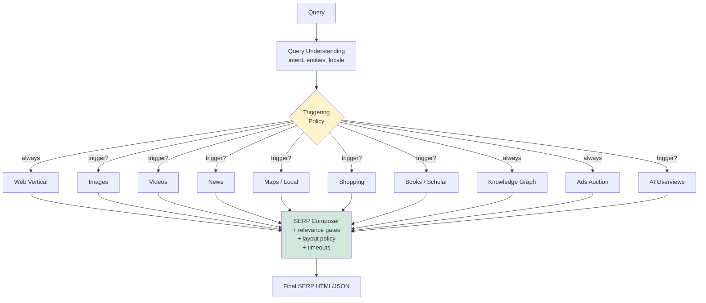
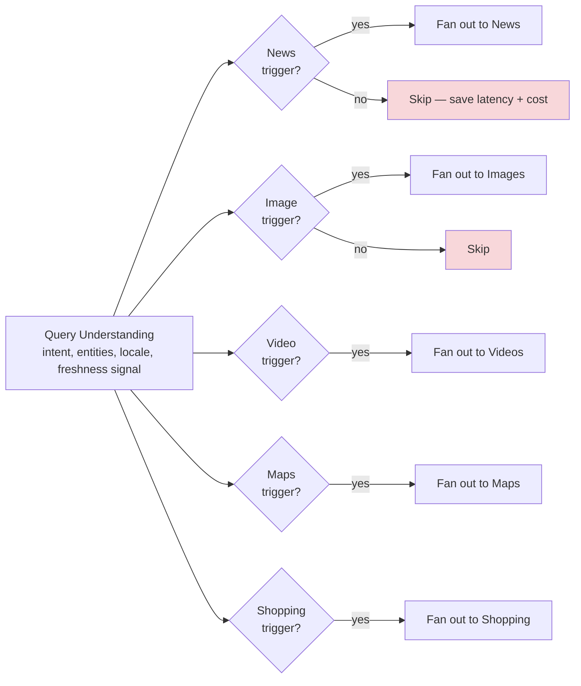
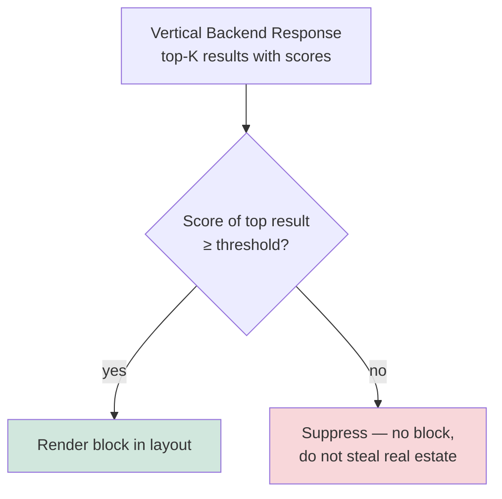
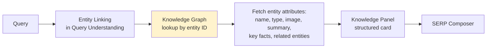
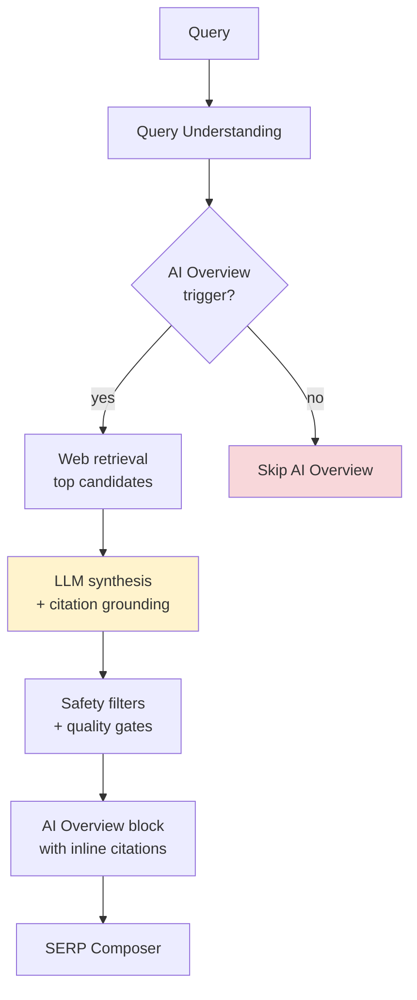

# Google Search Deep Dive — Federated SERP Composition

**Date:** 2026-04-30 | **Updated:** 2026-04-30
**Tags:** `system-design` `case-study` `google-search` `deep-dive` `federation` `serp`

## Table of Contents

- [Summary](#summary)
- [Why This Matters](#why-this-matters)
- [Overview — The SERP Is a Layout, Not a List](#overview--the-serp-is-a-layout-not-a-list)
- [Vertical Engines — Each Has Its Own Crawler, Index, Ranker](#vertical-engines--each-has-its-own-crawler-index-ranker)
  - [Web](#web)
  - [Images](#images)
  - [Videos](#videos)
  - [News](#news)
  - [Maps / Local](#maps--local)
  - [Shopping](#shopping)
  - [Books / Scholar](#books--scholar)
  - [Why Each Vertical Is Its Own Stack](#why-each-vertical-is-its-own-stack)
- [When to Inject — The Triggering Decision](#when-to-inject--the-triggering-decision)
- [Relevance Threshold — Per-Vertical Score Gates](#relevance-threshold--per-vertical-score-gates)
- [OneBox — Direct Answers and Featured Snippets](#onebox--direct-answers-and-featured-snippets)
- [Knowledge Panel — The Entity Card](#knowledge-panel--the-entity-card)
- [AI Overviews (2024) — Generative Composition on the SERP](#ai-overviews-2024--generative-composition-on-the-serp)
- [SERP Composition Latency — The Fixed-Budget Loop](#serp-composition-latency--the-fixed-budget-loop)
- [Anti-Patterns](#anti-patterns)
- [Related](#related)
- [References](#references)

## Summary

A Google SERP is not a ranked list of ten blue links — it is a **composed layout** that fuses up to a dozen independent retrieval systems into one page within a sub-300 ms budget. Each vertical (Web, Images, Videos, News, Maps, Shopping, Books) runs its own crawl, its own index, and its own ranker. The SERP composer's job is to **decide per query** which verticals deserve a slot, where on the page, with what visual treatment — then ship the page even if some verticals are late or empty. This document walks the federation problem end-to-end: vertical engines and why they're separate stacks, the triggering decision (when to inject), per-vertical relevance thresholds, the OneBox / featured-snippet / knowledge-panel hierarchy, the 2024 AI Overviews layer, and the fixed-budget composition loop that keeps a federated page snappy. The single hardest property to internalize: **the composer must be willing to ship an incomplete SERP** rather than a slow one, which means every vertical lives behind a timeout and a graceful-drop policy.

## Why This Matters

When a system-design candidate is asked "design Google Search," the federation problem is the part that almost everyone underplays. They draw an inverted index, talk about BM25 + PageRank, mention sharding and reranking, and stop. But the visible page on `google.com` is the output of a **federation orchestrator**, not the output of the web ranker. Every query exercises three distinct decisions:

1. **Which verticals to query.** Image search is expensive; you don't fan out to it for "barack obama age."
2. **Which verticals to display.** A vertical can return results and still be suppressed if its relevance score falls below the slot's gate.
3. **Where to put each block.** Top-of-page weather card, mid-page news carousel, right-rail knowledge panel, bottom-of-page video block — the layout itself is a learned decision.

Get any of those wrong and the system either ships a sluggish, busy SERP that frustrates users or a fast but bare SERP that misses obvious intent. The cost of "right-rail empty when it should have shown a knowledge panel" is a measurable user-experience regression, tracked and A/B-tested in production. The federation tier is also where new product surfaces (AI Overviews, shopping graph, generative product cards) plug in — they are mostly new vertical sources slotted into the existing composer.

## Overview — The SERP Is a Layout, Not a List

A useful mental model: the **query-understanding** stage produces a structured intent representation; the **federation** stage fans that intent out to N retrievers in parallel; the **composition** stage merges responses under a layout policy and ships the page.



Three properties of this picture matter and are easy to miss:

- **Web is always queried; everything else is conditional.** The web vertical is the floor of the SERP — even for "weather san francisco" you still get a thin web result block below the weather card. Every other vertical is gated.
- **Verticals are queried in parallel, not in sequence.** A serial federation that called Web → Images → News → Shopping would consume the entire latency budget on coordination overhead. Fan-out is mandatory.
- **The composer is allowed to drop late or low-confidence responses.** "We didn't get an image vertical response in 30 ms" is a normal operating condition, not an error. The page ships without the image block.

That last property — graceful degradation as the default — is what separates a federation-style page from a single-source page. Trying to show "everything we have" produces a slow page; shipping "what we have at deadline" produces a snappy page that occasionally loses a vertical block. Google's measured choice is the snappy one.

## Vertical Engines — Each Has Its Own Crawler, Index, Ranker

Each vertical has its own bounded context: separate crawl frontier, separate document model, separate ranking signals, separate freshness SLO. The shared substrate is mostly query understanding (intent, entities, language) and the federation contract — not the underlying retrieval.

### Web

The default vertical. Doc-partitioned across thousands of leaf shards. Two-tier (fresh + base). Hundreds of ranking signals. BM25 + PageRank + learned reranker (currently transformer-based via BERT/MUM in production). Drives the "ten blue links" backbone of the page. See [`../design-google-search.md`](../design-google-search.md) for the full retrieval-and-ranking walkthrough.

- **Index:** ~hundreds of billions of documents.
- **Freshness SLO:** seconds-to-minutes for the fresh tier (news-adjacent web pages); hours-to-days for base.
- **Ranking:** BM25 → first-pass retrieval → second-stage learned reranker over ~1k candidates.
- **Latency budget:** 80–120 ms p99 to return ~20 candidates with snippets.

### Images

Separate crawler that follows `` tags, image sitemaps, and direct image-URL discovery. Documents are not HTML pages — they're **image entities** with metadata: surrounding text, alt attributes, EXIF, perceptual hash, embedding vector, source page rank.

- **Index:** tens of billions of images, partitioned by image ID.
- **Ranking signals:** caption/alt text BM25, page authority of the host, perceptual-similarity-to-query (text-to-image embedding), face/safe-content classifiers.
- **Triggers:** queries with high image-intent ("logo of nike", "mount everest", "[celebrity] photos"), product queries (often blended into shopping), how-to queries with strong visual demand.
- **Latency budget:** 60–80 ms p99. Image retrieval can be expensive (vector search); the budget enforces a hard cap on candidate-set size.

### Videos

Aggregates from YouTube (the dominant source) plus crawled video URLs (Vimeo, news sites, embedded video on indexed pages). YouTube's own search infrastructure feeds the video vertical; non-YouTube videos go through the web crawler with video-specific extraction.

- **Index:** YouTube's catalog (tens of billions of videos) plus a much smaller crawled-video set.
- **Ranking signals:** title/description BM25, view count, watch time, channel authority, transcript matching (auto-captions), thumbnail relevance, freshness for news-adjacent video.
- **Triggers:** "how to ...", "tutorial", "[movie title] trailer", celebrity/musician queries, recipe queries.
- **Latency budget:** 50–80 ms p99.

### News

Separate crawler with **aggressive freshness** — News documents are indexed within minutes of publication, sometimes seconds for high-priority sources. Crawl frontier is biased toward whitelisted/qualifying news publishers.

- **Index:** millions of articles, with a sliding window (recent days/weeks at high resolution; older content flushed to a cold tier).
- **Ranking signals:** publish time, source authority (Google News uses publisher-quality signals), topical match, geographic relevance, "originality" classifiers (favoring original reporting over aggregators).
- **Triggers:** breaking-event queries, named-entity queries that are currently in the news, queries explicitly asking for news ("ukraine news"), queries whose top web results have very recent timestamps.
- **Latency budget:** 50–70 ms p99.

### Maps / Local

The Maps vertical is queried for any query with **geographic intent** — explicit ("coffee near me", "restaurants in austin") or implicit (a query for a business name where the user's location matches a known location of that entity). Backed by a places-and-POI graph, separate from the web crawler.

- **Index:** the Places database (hundreds of millions of POIs worldwide).
- **Ranking signals:** distance from user, business hours, review count and average rating, prominence (how well-known is this place), category match, freshness of business info.
- **Triggers:** explicit geographic terms, "near me", business categories, brand names with multiple physical locations.
- **Latency budget:** 60–100 ms p99 (often higher than web because place lookups can require geo-spatial joins).

### Shopping

Backed by the Merchant Center / Shopping Graph — a structured product index built from merchant feeds, structured-data markup on retailer sites (`schema.org/Product`), and crawled product pages. Each product entity has price, availability, brand, image, reviews aggregated across merchants.

- **Index:** billions of product offers across millions of merchants.
- **Ranking signals:** product-title BM25, brand/category match, price-to-market, merchant authority, in-stock signals, predicted CTR per product, ad bid (for sponsored shopping units).
- **Triggers:** transactional intent ("buy …", "best … under $100", explicit product names, brand+model queries).
- **Latency budget:** 60–90 ms p99. Often runs an integrated auction (organic shopping + sponsored shopping units).

### Books / Scholar

Niche verticals with their own crawl and index — books from Google's Library Project / publisher partners; scholarly papers from publisher partnerships and crawled academic sites.

- **Triggers:** book titles, author names, ISBN; academic queries with citation/scholarly intent ("[paper title]", "[author] et al", queries that match phrases prevalent in academic writing).
- **Latency budget:** 60–80 ms p99 — but these verticals fail the relevance threshold for most queries and rarely render.

### Why Each Vertical Is Its Own Stack

The recurring question: why not put all this in one giant index? Three structural reasons:

1. **Different document models.** A web page is HTML + outlinks; an image is binary + metadata; a place is a geo-located entity with hours and reviews; a product is a SKU with a price. Unifying them into one schema either flattens away the structure that makes each useful or produces a giant union schema that's worse than any single-vertical schema.
2. **Different freshness SLOs.** News needs minutes; web needs hours-to-days; Books and Scholar can be days-to-weeks. A single index optimized for the tightest SLO would burn money; a single index optimized for the loosest SLO would be useless for news.
3. **Different ranking signals.** Distance-from-user is critical for Maps and meaningless for Books. Watch-time matters for Videos and is undefined for Web. Trying to force one ranker to handle all of these produces an over-parameterized model that underperforms each vertical's specialized ranker.

The cost of separation is the federation problem this document is about. The benefit is that each vertical can evolve its own stack — its own crawler, its own indexer, its own ranker — without a release-train collision with every other vertical.

## When to Inject — The Triggering Decision

The composer does not query every vertical for every query. Each vertical has a **trigger model** that decides, based on the query-understanding output, whether the vertical should even be called. Trigger models are tiny, cheap classifiers that run before fan-out.



**Trigger features.** Common inputs to the trigger classifiers:

- **Intent class** — informational, navigational, transactional, local, news-seeking. Output of the intent classifier in query understanding.
- **Entity type** — does the query resolve to a person, place, product, event, work-of-art? Different entity types prefer different verticals.
- **Freshness signal** — does the query contain temporal terms ("today", "now", a date)? Are top web results suspiciously recent (a Google-internal "this is a breaking topic" detector)?
- **Geographic signal** — does the query contain place tokens, or is the user geo-located in a way that biases toward local results?
- **Modality demand** — does the query have visual or video demand? "How to tie a bow tie" has high video demand; "what is the GDP of france" does not.
- **Historical CTR per vertical** — for similar past queries, did users click on the image block, the news block, the shopping block?

**Triggering thresholds.** Each trigger has a confidence threshold. Below it, the vertical is skipped — no network call made. The thresholds are tuned per vertical and per surface (mobile vs desktop, country, locale). The cost calculus is honest:

- Calling a vertical when it will fail the relevance gate downstream is **wasted latency and wasted compute**.
- Skipping a vertical that would have produced a useful block is **a missed user value**.

The trigger model balances these. False positives (calling a vertical that ends up suppressed) are tolerated; false negatives (skipping a vertical that would have delighted the user) are weighted heavier in training because they're invisible at runtime — there's no "we missed a good vertical" signal at request time, only an offline counterfactual evaluation.

**Practical trigger examples.**

| Query | Triggered verticals | Skipped verticals | Reason |
|-------|---------------------|-------------------|--------|
| `weather san francisco` | OneBox (weather card), Web | Images, Videos, News, Maps, Shopping, Books | Weather is a direct-answer card; nothing else relevant |
| `barack obama` | KG (knowledge panel), Web, News, Images | Maps, Shopping, Books, Videos (low confidence) | Entity → KG; person → news + photos |
| `nike air max` | Shopping, Images, Web | News, Maps, Books, Videos | Transactional + product entity |
| `pizza near me` | Maps, Web | Images, Videos, News, Shopping, Books | Local intent dominant |
| `how to tie a tie` | Videos, Web, Images | News, Maps, Shopping, Books, KG | High video demand |
| `apple stock price` | OneBox (finance card), News, Web | Images, Videos, Maps, Shopping (Apple-the-company is not a buyable product) | Direct answer + recent news |
| `ukraine` | News, Web, KG, Images, Maps | Shopping, Books, Videos | High freshness signal + entity + country |

The composer turns this into a fan-out plan and dispatches.

## Relevance Threshold — Per-Vertical Score Gates

Triggering decides whether to call a vertical. **Gating** decides whether to display its results once they come back. Each vertical's top result has a relevance score; the composer enforces a **per-vertical, per-slot threshold** that the score must exceed for the block to render.



**Why a threshold matters.** A vertical might return results for any query because retrieval doesn't know when to give up — it'll always rank *something* highest. But "highest in this corpus" is not the same as "good enough for the user." A weak top-result for the image vertical on the query "rust borrow checker" is some random thumbnail that adds no value; rendering it consumes screen real estate and pushes web results down.

The gate is a learned threshold, calibrated against held-out human-rated relevance data and online click signals. The thresholds vary:

- **By vertical.** News has a higher bar than web — a marginal news result is worse than a marginal web result because users expect news to be *relevant and recent*.
- **By slot.** A right-rail knowledge panel can afford a lower confidence than a top-of-page OneBox, because the right rail is a quieter slot.
- **By query intent.** For queries with strong shopping intent, the shopping threshold drops (we expect shopping to win); for queries with no commerce signal, the threshold rises (don't show ads-by-stealth).
- **By surface.** Mobile thresholds are stricter than desktop because the screen is smaller — every non-relevant block costs more.

**The composition trade-off.** The composer balances:

- **Inclusion utility** — a relevant vertical block is high-value when right.
- **Inclusion cost** — every block pushes web results down and increases page weight.
- **Suppression risk** — a block that should have rendered but didn't is invisible to telemetry except via offline eval.

A useful framing: **"the composer's most important decision is what to drop, not what to add."** The default for each vertical is *off*; it must clear both the trigger and the gate to render.

## OneBox — Direct Answers and Featured Snippets

A **OneBox** is a direct-answer card at the top of the SERP that answers the query without requiring a click. It is the most aggressive form of vertical injection — it occupies the most valuable real estate (above the first web result) and signals to the user that Google believes it has *the* answer.

OneBox sources fall into two families:

**Structured OneBoxes — backed by curated data feeds.**

| Card | Source | Trigger |
|------|--------|---------|
| Weather | Weather data partner | "weather [city]", "weather today" |
| Calculator | Local computation | math expressions, unit conversions |
| Dictionary | Lexical database | "define X" |
| Time/Timezone | Internal time service | "time in tokyo" |
| Sports scores | Sports data feed | team/league queries |
| Stock quotes | Finance data feed | ticker symbols, "[company] stock" |
| Flight status | Airline feeds | flight numbers |
| Translations | Translate service | "translate X to Y" |

These are **non-statistical** — they hit a structured backend and render a templated card. The triggering is precise (entity + intent must match) and the answer is authoritative.

**Featured snippets — extracted from web pages.**

A featured snippet is an algorithmically chosen passage from a web page that directly answers a question, displayed above the regular web results. Unlike a structured OneBox, featured snippets:

- Source content from the open web (not a structured feed).
- Are produced by **passage extraction + ranking** — the system finds candidate passages across web docs, scores them for query-answering quality, picks one.
- **Cite** the source URL prominently (the snippet is a quote, not a synthesis).

The featured-snippet system is essentially a re-application of web ranking with a different objective: instead of "best document," it picks "best passage that answers the question." Quality bars are higher than for normal web results because the snippet is presented as the answer.

Triggering rules for featured snippets:

- Query must be question-shaped or have clear answer-seeking intent ("what is X", "how does Y work", "is Z true").
- The top web result must have a passage that scores above a confidence threshold for question-answering relevance.
- Topic must not be on a sensitive-topic list (medical, financial advice, breaking news) where a featured snippet could mislead — these have stricter gates or are suppressed.

**The "position zero" effect.** Because a featured snippet sits above the rest of the SERP, it's sometimes called "position zero." Its CTR can dwarf the first organic result for some queries — and conversely, when users get their answer in the snippet they don't click, which is a measurable change in publisher traffic and a known industry tension.

## Knowledge Panel — The Entity Card

A **knowledge panel** is the right-rail (desktop) or top-block (mobile) card that summarizes an entity — a person, place, organization, work-of-art, event. It is the visible surface of the **Knowledge Graph** introduced publicly in 2012 (see References).



**Triggering.** A knowledge panel renders when:

1. **Entity linking succeeded with high confidence.** The query-understanding stage resolves the query to a single Knowledge Graph entity ID. Ambiguous queries ("apple" — fruit or company?) require disambiguation; either by user-context (recent searches), by query expansion ("apple stock" → company), or by showing both as separate panels (rare).
2. **The KG has enough structured data** to populate a panel. New or thin entities may not have a summary, image, or key-facts table yet — the panel won't render even though the entity is recognized.
3. **The panel's relevance score** for this slot exceeds the gate (same logic as other verticals).

**Panel content.** Typical fields:

- **Name and type** ("Barack Obama — 44th President of the United States").
- **Hero image.** Pulled from licensed sources or Wikipedia/Wikimedia.
- **Short summary.** Often the lead paragraph of the corresponding Wikipedia article, attributed.
- **Key facts.** Born / Spouse / Children / Education / Books / Awards — each is a structured field on the KG entity.
- **Related entities.** "People also search for" — graph neighbors.
- **Source attribution.** Credited at the bottom of the panel (Wikipedia, Wikidata, licensed feeds).

**Why this is hard.** The KG is built from heterogeneous structured sources (Wikipedia, Wikidata, government feeds, licensed publisher data) and is continuously reconciled. A fact in the panel must be:

- Sourced (provenance tracked back to a feed).
- Reconciled (multiple sources may disagree; the KG must pick or surface the disagreement).
- Updated (a person's age changes daily; an org's CEO changes occasionally).
- Removed when wrong (factual errors are public and visible; the correction loop is real).

Knowledge panels are the **most visible failure surface** of the SERP — when they're wrong, they're wrong in a structured, citable, embarrassing way. The system has a higher operational bar than ranked web results, where "wrong-ish" is normal.

## AI Overviews (2024) — Generative Composition on the SERP

In 2024 Google rolled out **AI Overviews** (originally previewed as Search Generative Experience / SGE in 2023) — a generative-AI-produced summary that appears above the rest of the SERP for some queries, synthesizing an answer from multiple web sources with inline citations. From a federation perspective, AI Overviews are a **new vertical** with new properties.



**What's different from a regular vertical.**

- **Synthesis, not retrieval.** AI Overview takes web results and **generates** a summary, not just retrieves and reranks. The output is a paragraph or two of new text, citing sources inline.
- **Latency cost is much higher.** LLM inference adds hundreds of milliseconds per query — orders of magnitude more than a normal vertical. This forces architectural choices: only a subset of queries are eligible; results are aggressively cached; smaller distilled models are used for the live path.
- **Quality bar is much higher.** A wrong web result is a click-away problem. A wrong AI Overview is a quoted, citable mistake at the top of the page. Hallucinations are visible and shareable. The gate is therefore much stricter.
- **Citation grounding is mandatory.** Every claim in the AI Overview must be linkable back to a cited source — both for user trust and for legal/policy reasons. The synthesis prompt enforces this; outputs that fail grounding checks are suppressed.

**Triggering.** AI Overviews are not shown for every query. Eligibility depends on:

- **Query type.** Informational, multi-faceted ("how does X compare to Y", "what should I consider when …") queries benefit most. Navigational ("facebook login") and transactional ("buy iphone 15") queries do not.
- **Topical safety.** Sensitive topics — medical advice, legal advice, breaking news, politically contested facts — are gated more strictly or excluded.
- **Source quality.** If the top web candidates are low-authority, the system skips synthesis to avoid grounding on weak sources.
- **User opt-in / regional rollout.** AI Overviews are gated by region and (during early rollout) by user opt-in.

**The freshness problem.** LLMs trained on stale data are wrong about anything time-sensitive. AI Overviews work around this by **retrieving first, generating second** — the LLM is conditioned on the retrieved web passages, which are as fresh as the web index. This is a retrieval-augmented generation (RAG) shape, not a "ask the LLM directly" shape.

**Operational impact on the page.** When AI Overview renders, it pushes the rest of the SERP down. The block is visually distinct (often a colored background, citation badges, "AI Overview" label). The composer treats it as a high-priority block when present and skips it gracefully when absent.

## SERP Composition Latency — The Fixed-Budget Loop

Federation only works if it stays inside the page-load budget. The composer runs a **fixed-budget loop** — a hard wall-clock deadline at which the page must ship, even if some verticals haven't responded.

**Total budget.** Roughly 200 ms p50, 300 ms p99, query-arrival to first SERP byte. (See [`query-serving-latency.md`](./query-serving-latency.md) for the full breakdown.)

**Per-vertical budget.** Each vertical has its own SLO that's a slice of the total. Example:

| Stage | Budget |
|-------|--------|
| TLS + frontend handshake | already done by the time the query arrives at the composer |
| Query understanding | 5–10 ms |
| Trigger classification + fan-out kickoff | 1–3 ms |
| Web vertical (always queried) | 80–120 ms |
| Image / Video / News / Shopping (parallel) | 50–80 ms each |
| Maps (parallel) | 60–100 ms |
| KG lookup | 10–20 ms |
| AI Overview (when triggered) | 200–800 ms (often cached or skipped under tight budgets) |
| Ads auction | 30–50 ms |
| SERP composition + layout | 10–20 ms |
| Snippet finalization | 10–20 ms |
| Network response serialization | 5–10 ms |

The math works because **verticals run in parallel**, not in series. The total wall-clock time is `max(vertical_latencies) + composition_overhead`, not `sum(vertical_latencies)`.

**The fixed-budget loop, in pseudocode shape:**

```text
deadline = now() + total_budget
results = {}
fan_out_to_all_triggered_verticals(deadline)

while now() < deadline and pending_verticals:
    ready = collect_completed_responses(timeout=deadline - now())
    for vertical, response in ready:
        if response.score >= threshold[vertical, slot]:
            results[vertical] = response
        # else suppress silently

    pending_verticals -= ready

# At deadline: ship what we have
ship_serp(compose(results))
# Cancel still-pending verticals (don't waste backend cycles)
cancel_outstanding_requests()
```

**Hedged requests.** For verticals with high tail latency (notably the web vertical, with thousand-way fan-out at the leaf level), the composer issues a **backup request** if the primary hasn't responded after a threshold (e.g. 95th percentile of normal latency). Whichever returns first wins; the loser is cancelled. This trades ~5–10% extra backend load for a sharp drop in p99 latency. Hedging is mostly used inside the web vertical (across leaves) but is also applied at the composer level for slow verticals.

**Cancellation discipline.** When the composer ships, any vertical still in flight is **cancelled** at the network and backend level. Without cancellation, late responses keep doing work that nobody will see, which is pure cost. Cancellation propagation is non-trivial — every vertical backend must honor request cancellation cleanly.

**Cache layers.** Federation latency is also cushioned by caching at multiple levels:

- **Result-level cache.** The full SERP (or major blocks of it) for a `(query, region, language, surface)` tuple, for short TTLs. Personalized queries bypass.
- **Vertical-result cache.** Per-vertical responses keyed by (query, vertical, locale).
- **Trigger cache.** Trigger-classifier outputs for common queries.
- **Knowledge-panel cache.** Entity-keyed; panels are mostly static.
- **AI Overview cache.** Heavy. Generated overviews for popular informational queries are cached aggressively; cache misses are increasingly served from a model-output cache rather than re-running synthesis.

**Latency vs richness, the visible trade.** Pushing the deadline out by 50 ms would let more verticals participate and produce a richer page. Google's measured choice is a leaner, faster page — under 300 ms p99, with verticals dropping silently when late. This shows up in the user's experience as **occasionally "where did the news block go?"**, which is a far cheaper failure mode than a sluggish page.

**Worked example — what 250 ms looks like for "best running shoes for flat feet".**

To make the budget concrete, walk one query through the system:

1. **t = 0 ms.** Query arrives at the frontend (TLS already terminated).
2. **t = 5 ms.** Query understanding completes: intent = transactional + advice-seeking; entities = none confidently; product-category match = "running shoes"; modifier = "flat feet" (a known constraint vocabulary).
3. **t = 7 ms.** Trigger classifiers fire in parallel: Web (always), Shopping (transactional + product → high confidence trigger), Images (visual demand for products → triggered), Videos (medium confidence — review videos exist but lower priority), News (skipped — no freshness signal), Maps (skipped — no local intent), Books (skipped — no academic signal), AI Overview (advice-seeking informational shape → eligible, triggered).
4. **t = 8 ms.** Fan-out dispatched. All triggered verticals receive the query in parallel.
5. **t = 75 ms.** Shopping vertical returns top-12 product candidates with prices and merchant data. Score above gate → render shopping carousel mid-page.
6. **t = 90 ms.** Images vertical returns top-8 thumbnails. Score above gate → render image strip in row 4.
7. **t = 110 ms.** Web vertical returns top-20 organic results with snippets.
8. **t = 130 ms.** Videos vertical returns top-6. Score *below* gate (videos for this query are mostly low-quality reviews) → suppressed silently.
9. **t = 220 ms.** AI Overview synthesis still in flight. Composer's deadline is 240 ms.
10. **t = 240 ms.** AI Overview hasn't returned. Composer ships the page **without** the AI Overview block, cancels the in-flight LLM request.
11. **t = 248 ms.** First SERP byte on the wire.

The user sees: web results + shopping carousel + image strip + ads. They do **not** see: news, videos, maps, books, AI Overview. This is normal and correct. A subset of those (the AI Overview, in particular) might cache the synthesis for the next user with the same query, hitting their page in time.

The key takeaway: **federation is a deadline-driven assembly line, not a complete-the-render-tree-then-ship pipeline.** The composer's contract with the user is "I will ship a coherent page in time," not "I will ship every block I might have shipped." That contract is enforced by the deadline, the cancellation discipline, and the willingness to suppress.

**Mobile vs desktop budgets.** Mobile clients have tighter latency budgets — the browser is on a slower network, the screen is smaller, the user expectation for snappiness is higher. The composer often runs **stricter triggers and stricter gates on mobile**: fewer verticals are called, the gates are higher, the result is a tighter page that ships sooner. This is a per-surface configuration, not a separate code path.

**Personalization and locale.** Two more inputs to the composer that reshape federation:

- **Locale.** Verticals are locale-bound — the news vertical's index for `en-US` is different from `de-DE`; the shopping vertical's merchant set is country-specific; the maps vertical's POI database is global but the ranking is geo-anchored. The composer's fan-out routes to locale-specific backends.
- **Personalization.** Search history, signed-in profile signals, location, and device class affect both triggering (a user who never clicks shopping blocks gets fewer of them) and ranking inside each vertical. Personalization happens **inside each vertical's reranker** plus a final layout-level personalization pass; the federation contract doesn't change shape.

**Observability for the federation tier.** Operating a federated SERP requires a metrics surface that mirrors the federation contract:

- **Per-vertical render rate.** What fraction of triggered queries actually rendered each vertical's block? A sudden drop in news-block render rate signals either an upstream news-vertical problem or a gate misconfiguration.
- **Per-vertical timeout rate.** What fraction of vertical responses arrived after the composer's deadline? Climbing timeout rate is a leading indicator of a vertical's latency regression even before it bleeds into total page latency.
- **Per-vertical suppression rate.** What fraction of returned responses were dropped by the gate? A spike here indicates either a relevance-model regression in the vertical or a calibration drift in the gate.
- **Composition-level p50/p99.** The page-shipping latency, the metric the SLO is anchored on.
- **Cancellation accounting.** How many in-flight requests are cancelled per second? Sustained high cancellation rates indicate undertuned timeouts or excess fan-out.

A federation tier without these is a federation tier flying blind — the kind of system where a quiet failure (an entire vertical going dark) takes hours to detect because no single page is broken, only some blocks are missing.

## Anti-Patterns

These are the failure modes that turn a federated SERP system from a snappy, layered page into a slow, brittle, or visually-broken one.

- **Serial vertical fan-out.** Calling Web → wait → Images → wait → News → wait. Trivially burns the entire latency budget on coordination overhead. Every vertical must be dispatched in parallel from the same dispatch point, with timeouts measured against a shared deadline.
- **No per-vertical timeout.** A single slow vertical (Maps with a misbehaving geo backend, an Image vertical doing an expensive vector search) blocks the SERP. Every vertical needs an independent budget and a graceful-drop policy. Without that, the slowest vertical *defines* the page latency.
- **No relevance gate.** Triggering a vertical and then showing whatever it returns produces busy, irrelevant SERPs — empty news blocks for navigational queries, random thumbnails for academic queries. The gate is what keeps the page clean.
- **Sharing a single index across verticals.** Conflates document models, freshness SLOs, and ranking signals; produces an index that's bad for every vertical. Each vertical earns its own stack precisely because their requirements diverge.
- **Synchronous KG lookup blocking web results.** Knowledge panel rendering should never gate the web block. The web vertical must be able to ship without the KG response, and vice versa. They are independent.
- **OneBox without source provenance.** A direct-answer card without an authoritative source (or a clear "according to X") is a hallucination risk and a trust risk. Every OneBox must trace back to a structured feed or a cited web passage.
- **Featured snippet on sensitive topics without quality gates.** Medical, financial, legal, breaking-news topics need stricter gates. A featured snippet that confidently surfaces a fringe blog post on a medical question is an actively dangerous failure.
- **Knowledge panel without ground-truth feeds.** Generating panel content from web crawl alone (without Wikidata-style structured sources) produces brittle, scrape-derived panels that drift with the source page. Structured-data backbone is non-negotiable.
- **AI Overview ungrounded.** Generative summary without inline citations and grounding checks is a hallucination-shipping machine. Grounding is mandatory; ungrounded generation is a feature, not a default.
- **Cache the personalized SERP.** Caching a SERP keyed by `(query, region, language)` while it embeds per-user signals breaks personalization and leaks personalization across users. Either cache before personalization (the candidate set, the vertical responses) or skip the cache for personalized requests.
- **No cancellation when shipping.** When the composer ships the page, in-flight vertical requests must be cancelled. Otherwise the system does work that nobody will see, increasing backend load and warping latency metrics.
- **Triggering every vertical for every query.** Burns network and backend cycles on responses that will be suppressed by the gate. Trigger classifiers are cheap; using them is mandatory.
- **Verticals with no monitoring.** A vertical that silently breaks (returns 500s, returns empty) is invisible from the SERP — it just doesn't render. Without per-vertical health metrics (success rate, latency, render rate), the failure is undetectable until somebody notices a missing block in production.
- **Layout decided in client code.** The composer must produce the layout server-side. Pushing layout to the client means every device needs to re-implement the layout policy, mobile/desktop drift, and the page is render-blocked on layout decisions running in JS.

## Related

- [Design Google Search](../design-google-search.md) — the parent case study covering crawl, index, retrieval, ranking, and federation in one document.
- [Query Serving Latency](./query-serving-latency.md) — the latency-budget deep dive: where the 200–300 ms goes, hedged requests, tail-latency mitigation.
- [Design Web Crawler](../design-web-crawler.md) — the upstream subsystem feeding the web index (and indirectly several other vertical indexes).
- [Design News Aggregator](../design-news-aggregator.md) — the news vertical's own design, with publisher-feed handling and freshness machinery.
- [Search Systems building block](../../../building-blocks/search-systems.md) — inverted indexes, retrieval, ranking primitives shared across verticals.
- [Caching Layers building block](../../../building-blocks/caching-layers.md) — result cache, vertical-response cache, trigger cache.

## References

- Google Search Central. *How Search Works.* <https://www.google.com/search/howsearchworks/> — the canonical product-marketing-but-still-informative overview of the entire pipeline; the "Organizing Information" and "Ranking" subpages are most relevant for federation context.
- Google Blog. *Introducing the Knowledge Graph: things, not strings.* (Amit Singhal, May 2012). <https://blog.google/products/search/introducing-knowledge-graph-things-not/> — the public introduction of the KG; the conceptual founding document for entity-linking and the knowledge panel.
- Google Blog. *Generative AI in Search: Let Google do the searching for you.* (May 2024). <https://blog.google/products/search/generative-ai-google-search-may-2024/> — the AI Overviews launch announcement; describes triggering, citation, and the SGE-to-AIO transition.
- Google Blog. *Supercharging Search with generative AI.* (May 2023). <https://blog.google/products/search/generative-ai-search/> — the original SGE preview, with architectural hints about retrieval-augmented generation in Search.
- Google Blog (Pandu Nayak). *Understanding searches better than ever before* (BERT in Search). 2019. <https://blog.google/products/search/search-language-understanding-bert/> — query-understanding precursor for federation triggering.
- Google Blog. *MUM: A new AI milestone for understanding information.* 2021. <https://blog.google/products/search/introducing-mum/> — multimodal/multilingual model used in modern query understanding and cross-vertical signals.
- Barroso, L. A., Dean, J., Hölzle, U. *Web Search for a Planet: The Google Cluster Architecture.* IEEE Micro, 2003. <https://research.google/pubs/web-search-for-a-planet-the-google-cluster-architecture/> — original architectural paper; the fan-out and aggregation patterns that the federation tier still rests on.
- Dean, J. *Challenges in Building Large-Scale Information Retrieval Systems.* WSDM 2009 keynote. <https://research.google/pubs/challenges-in-building-large-scale-information-retrieval-systems/> — tail-latency, hedged requests, and the operational discipline that federation depends on.
- Dean, J. and Barroso, L. A. *The Tail at Scale.* Communications of the ACM, 2013. <https://research.google/pubs/the-tail-at-scale/> — the canonical paper on hedged requests and tail-latency mitigation; directly applicable to fixed-budget federation.
- Google Search Central documentation. *Featured snippets and your website.* <https://developers.google.com/search/docs/appearance/featured-snippets> — product/SEO documentation explaining featured-snippet eligibility and content requirements.
- Wikidata. *Wikidata as a structured-data source.* <https://www.wikidata.org/wiki/Wikidata:Main_Page> — the open structured-data graph that feeds knowledge panels and many entity-linking systems (including non-Google ones).
