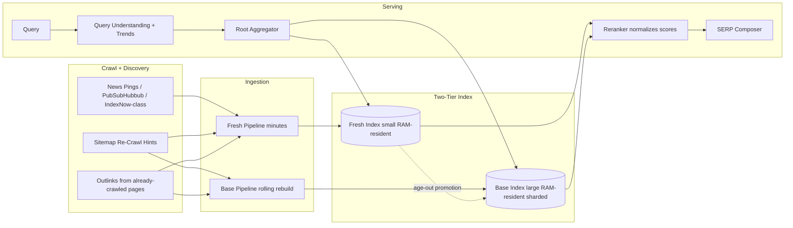
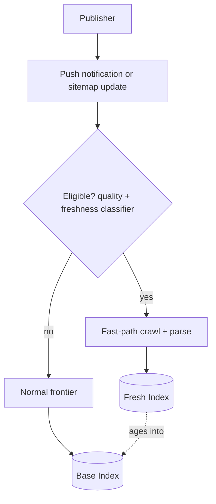

# Google Search Deep Dive — Freshness vs Depth (Two Indexes, One Verdict)

**Date:** 2026-04-30 | **Updated:** 2026-04-30
**Tags:** `system-design` `case-study` `google-search` `deep-dive` `freshness` `indexing`

## Table of Contents

- [Summary](#summary)
- [Overview](#overview)
- [Two-Tier Architecture](#two-tier-architecture)
- [Caffeine 2010 — Continuous Incremental Indexing](#caffeine-2010--continuous-incremental-indexing)
- [Instant Indexing for News](#instant-indexing-for-news)
- [Sitemap Hints and Re-Crawl Signals](#sitemap-hints-and-re-crawl-signals)
- [Merging at Query Time](#merging-at-query-time)
- [Trends Integration and Query-Side Freshness](#trends-integration-and-query-side-freshness)
- [Fresh vs Evergreen — Surfacing Decisions](#fresh-vs-evergreen--surfacing-decisions)
- [Anti-Patterns](#anti-patterns)
- [Related](#related)
- [References](#references)

## Summary

Google's index is not one index. It is at least two — a small, blazing-fast **fresh tier** that absorbs changes within minutes, and a large, signal-rich **base (deep) tier** that takes days to settle but contains everything. Every query fans out to both; the merge-and-rerank step at query time picks the verdict. This split is why a news headline published 90 seconds ago can outrank a 2014 evergreen explainer for "what happened in <event> today" without forcing the entire web index to be rebuilt every minute.

The architecture was publicly announced in 2010 as **Caffeine**, replacing the old multi-day batch indexing pipeline with a **continuous, incremental** design. Since then it has been augmented with instant-indexing pipelines for news and other high-priority sources, sitemap-driven re-crawl hints, and a separate freshness signal layer that interacts with query understanding (Google Trends, intent classification) to decide when fresh content actually deserves to win.

This deep dive expands the parent case study's [Freshness vs Depth section](../design-google-search.md#freshness-vs-depth--two-indexes-one-verdict) into the full design: the two-tier index data plane, the Caffeine ingestion pipeline, instant indexing for news, sitemap hints, query-time merging, the role of Trends, the surfacing policy that decides fresh-vs-evergreen, and the anti-patterns that wreck this design when copied carelessly.

## Overview

The mental model: **index freshness is a non-uniform good.** Most queries do not need fresh content; the long tail is timeless and the base index serves them perfectly. A small but high-value minority (news, sports, weather, breaking events, trending entities) needs minute-level freshness. A single index optimized for that minority is wasteful; a single index optimized for depth is too slow for news. Two indexes, queried in parallel, merged at query time, is the equilibrium.



Three forces govern the design:

1. **Latency of ingestion.** Time from "URL changed on the public web" to "URL is queryable in the index." Fresh tier targets minutes; base tier targets hours-to-days.
2. **Quality of signals.** PageRank, anchor text, click-through priors, and spam classification all need time to settle. Fresh-tier docs lack these. The reranker must compensate.
3. **Cost of storage and rebuild.** The base index is petabyte-scale, replicated across data centers, and continuously re-segmented. You cannot rebuild it every minute. The fresh tier is small enough that you can.

The two-tier design separates these forces. Fresh handles latency at the cost of signal quality; base handles signal quality at the cost of latency. The merge step closes the gap.

## Two-Tier Architecture

### Fresh tier

- **Size.** Millions to low hundreds of millions of recently-changed documents — orders of magnitude smaller than the base index.
- **Update latency.** Documents enter within minutes (sometimes seconds for high-priority sources).
- **Storage.** Entirely in RAM on the leaf shards. Compressed postings + forward index for snippet generation. SSD is a cold tier only for fall-through.
- **Signals.** Minimal. PageRank is approximated (anchors are scarce because few pages have linked yet); spam classification runs in a fast-path mode; quality scores are best-effort.
- **Lifetime.** Documents are evicted from fresh as they age out. The promotion path to base is continuous: as a doc accumulates anchor text, click-through history, and link-graph context, it migrates into base and is dropped from fresh.
- **Sharding.** Doc-partitioned the same way as base (see [inverted-index-sharding.md](./inverted-index-sharding.md)). The fan-out shape is identical so the aggregator's RPC pattern is uniform.

### Base (deep) tier

- **Size.** Tens of billions of documents in the active index, hundreds of billions discovered.
- **Update latency.** Continuous — segments are rebuilt and shipped on a rolling basis. A given segment is "fresh" minutes-to-hours after Caffeine; a given doc inside that segment may have been crawled hours-to-days ago.
- **Storage.** RAM-resident hot index, SSD warm tier, object storage cold tier. Tens of petabytes replicated across regions.
- **Signals.** Full. Settled PageRank, full anchor text aggregation, full quality and spam scoring, click-through priors, learning-to-rank features.
- **Sharding.** Doc-partitioned across thousands of leaves with hierarchical aggregation (super-shards → root). See the parent doc's deep dive on sharding.

### Why parallel, not serial

A common naive design is "check fresh first; if no good results, fall back to base." This is wrong. The base index has higher-quality signals; for most queries it produces better results than fresh even when fresh has matching docs. The right design is **parallel fan-out, single merge**:

```text
score_final(doc, query) =
  if doc in fresh_tier:
    rerank(fresh_features(doc), query) - freshness_tier_offset
  else:
    rerank(base_features(doc), query)
```

The reranker normalizes across tiers. A `freshness_tier_offset` (or, equivalently, a learned bias term in the reranker) prevents the small fresh corpus from dominating evergreen queries.

### Per-shard latency budget

Both tiers must respect the leaf-level latency budget (a few tens of milliseconds; see the parent doc for the full breakdown). Fresh leaves are easier — small corpus, hot in cache, often well under target. Base leaves carry the larger postings and rely on the standard tail-latency tools (hedged requests, backup requests, cancellation propagation). The aggregator does not block on the slower of the two; it merges what's ready inside the budget.

### Why both tiers are RAM-resident

A subtle but consequential design constraint: both tiers serve from RAM, not SSD. Postings list scans must be deterministic and fast; falling through to SSD for hot postings introduces tail-latency variance the aggregator cannot smooth out. The fresh tier is small enough that RAM is cheap; the base tier is large enough that the RAM bill is significant — but the alternative (SSD-served base) blows the latency budget. The compression scheme (delta + varint + block-skip) on postings is what makes the RAM bill survivable.

A practical consequence: rolling out a new index segment to the base tier means warming RAM on the destination leaves before traffic is shifted. Cold-start on a freshly-shipped segment otherwise produces a latency spike. The deployment system stages segments to standby leaves, warms them with mirrored traffic, then promotes them.

```mermaid
sequenceDiagram
  participant U as User
  participant FE as Front-End
  participant AGG as Root Aggregator
  participant FR as Fresh Leaves
  participant BS as Base Leaves
  participant RR as Reranker

  U->>FE: GET /search?q=...
  FE->>AGG: query (post-understanding)
  par Fan-out fresh
    AGG->>FR: scatter
    FR-->>AGG: top-K (fast)
  and Fan-out base
    AGG->>BS: scatter
    BS-->>AGG: top-K (slower; hedged)
  end
  AGG->>RR: union of candidates
  RR-->>AGG: final top-N
  AGG-->>FE: SERP
  FE-->>U: 200 OK
```

The user's wall-clock latency is `max(fresh_branch, base_branch) + merge + rerank`. In practice the base branch dominates; the fresh branch's marginal cost on the budget is small.

## Caffeine 2010 — Continuous Incremental Indexing

Before 2010 Google's web index was rebuilt in **batch layers**. The slowest layer (the deep base) took on the order of weeks to fully refresh; faster layers covered the rest. A page newly published on a low-PageRank site could wait days before becoming searchable. The architecture was a multi-stage MapReduce pipeline that recomputed a snapshot.

In June 2010 Google announced [**Caffeine**](https://googleblog.blogspot.com/2010/06/our-new-search-index-caffeine.html) — "our new search index." The post is short on internals but the published claim is "50 percent fresher results than our last index" with the headline change being **continuous incremental indexing rather than batch reindexing**. Pages become searchable as they are crawled and processed, not when the next batch ships.

### What Caffeine changed (what we can say from public sources)

- **Incremental updates.** Newly crawled pages flow into the index segment-by-segment, document-by-document, instead of waiting for a global rebuild.
- **Throughput.** "We add new information at a rate of hundreds of thousands of gigabytes" of indexing work per day, per Google's announcement.
- **Storage architecture.** Caffeine moved Google's web indexing onto an incremental processing system. The 2011 paper [Percolator](https://research.google/pubs/large-scale-incremental-processing-using-distributed-transactions-and-notifications/) (Peng & Dabek, OSDI 2010) describes Google's "Percolator" system — distributed transactions and notifications on top of Bigtable — and explicitly cites web search indexing (the Caffeine workload) as the motivating use case. Percolator gave Caffeine a way to do small, transactionally consistent writes to an enormous indexing graph rather than recomputing it.
- **Why it matters for freshness vs depth.** Caffeine collapses a category of latency. Pre-Caffeine, "fresh" had to be a wholly separate fast pipeline because the base was hopelessly slow. Post-Caffeine, the base itself is much fresher; the fresh tier exists for the *minute-level* corner of the latency curve, not as a workaround for a sleepy base.

### What Caffeine did not change

- The two-tier model still makes sense for news and breaking content. Even Caffeine's continuous base is not minute-level for arbitrary low-PageRank pages.
- Sharding stays doc-partitioned; the operational properties are the same.
- Ranking is unchanged at the architectural level — Caffeine is an indexing-pipeline rewrite, not a ranking change.

### Mental model — Caffeine as the inverse of MapReduce indexing

```text
Pre-Caffeine:
  crawl batch -> parse batch -> link-graph batch -> index batch -> ship snapshot
  cycle time: days to weeks

Post-Caffeine:
  crawl event -> parse event -> notify -> incremental index update -> visible in serving
  cycle time: minutes
```

Read Percolator's introduction for the canonical exposition: indexing is reframed as "small mutations on a giant table, with notifications driving downstream computation."

### Why MapReduce wasn't enough

MapReduce excels at "compute a function of the entire dataset"; web indexing was originally framed that way. The mismatch is that on the web, only a small fraction of the dataset changes between runs — but MapReduce's batch model recomputes everything anyway. Worse, the *next* run can only start when the current run finishes; freshness is bounded by the longest stage. As the web grew, the longest stage grew with it.

Percolator inverts this. The state of the index lives in Bigtable. A change to a single page (the crawler ingests a new version) triggers *observers* — small computations that read the changed row, update derived columns, and write back. Observers chain: the parser observer fires on raw HTML, then the link-extractor observer fires on parsed text, then the indexer observer fires on extracted features. Each step is a transaction. The system makes progress on the changed pages without recomputing anything else.

Caffeine isn't *just* Percolator — it's an indexing pipeline architected around incremental computation, of which Percolator is the substrate. The architectural lesson generalizes far beyond search: when the unit of change is much smaller than the dataset, batch reprocessing is wasteful, and incremental processing on a transactional store can radically shorten cycle times.

## Instant Indexing for News

Caffeine made the base much fresher. News still needed faster. The **instant-indexing pipeline** is a fast-path that bypasses the normal frontier scheduling and pushes recently-published news content into the fresh tier within seconds-to-minutes.

### Pull, push, and hybrid signals

The pipeline ingests freshness signals from multiple sources:

1. **Pull (crawl).** High-priority hosts (news domains, sites with strong publication signals) get aggressive re-crawl budgets. The frontier scheduler treats them differently — a single dequeue thread per host, but with sub-second crawl intervals during active news cycles.
2. **Push (notification).** Publishers can advertise URL changes via standardized push protocols:
   - **Sitemap pings** (`GET /ping?sitemap=...`) — a low-rent change notification.
   - **WebSub / PubSubHubbub** (W3C Recommendation; see references) — a publish-subscribe protocol where publishers POST update notifications to subscribed hubs that fan out to subscribers including search engines.
   - **News-specific protocols** — Google News supports specialized push integration for verified publishers.
3. **Hybrid (link-graph triggered).** When a high-PageRank page (e.g., a homepage of a major site) is recrawled and reveals new outlinks, those outlinks get fast-tracked into the frontier with elevated priority.

### Eligibility — not every URL gets fast-pathed

The fast path is not free. Two filters gate it:

- **Source quality.** The host must be on a quality whitelist (real publishers, not arbitrary spammers). New sites earn this status over time; spam tactics get filtered.
- **Content classifier.** A lightweight news/freshness classifier examines the page on fetch and decides whether it is genuinely time-sensitive. A new permalink for a 2014 article is not fast-pathed; today's news article is.



### Latency budget for instant indexing

The published behavior — and what site operators experimentally observe — is roughly:

| Stage | Typical latency |
|---|---|
| Publisher push → Google receives notification | seconds |
| Fetch + parse + classify | seconds |
| Fresh index update (visible in queries) | low minutes |
| Promotion to base index | hours-to-days |

The "low minutes" tier is the headline number news publishers care about. It's why a breaking-news article on a major outlet can rank for `latest <event>` queries within five minutes of publication.

### Operational gotchas

- **Pushed-but-not-crawled.** A push notification is not a fetch. The crawler still has to visit the URL, respect robots.txt, and parse the page. A misconfigured robots.txt blocks even fast-path crawling.
- **Canonicalization races.** A new article URL may not yet have its `rel=canonical` settled across mirrors. Aggressive dedup before settled canonicals can collapse the wrong version.
- **Fast-path spam.** Bad actors try to abuse instant indexing by pushing low-quality content. The eligibility filter is a moving target; abuse detection is a permanent task.
- **Edit-after-publish.** Publishers update articles minutes after publication (typo fixes, breaking-news additions). The fresh pipeline must re-fetch on a `lastmod` change; otherwise the index holds the v1 text while the live page is v3. News sitemaps with accurate timestamps drive this re-fetch.
- **Soft 404s and unpublished drafts.** Aggressive push pipelines sometimes ingest a URL that the publisher takes down minutes later (retracted article, accidental publish). The fresh pipeline must support fast removal — a delete signal flows through the same pipeline as updates.

## Sitemap Hints and Re-Crawl Signals

[Sitemaps](https://www.sitemaps.org/protocol.html) are the publisher's way of telling the crawler what to recrawl and how often. They are not a silver bullet — Google's [official sitemap docs](https://developers.google.com/search/docs/crawling-indexing/sitemaps/overview) explicitly say a sitemap is a *suggestion*, not a guarantee — but they materially improve discovery and re-crawl scheduling for two cases: large sites the crawler would otherwise sample, and recently-changed pages.

### What sitemaps actually contain

```xml
<urlset xmlns="http://www.sitemaps.org/schemas/sitemap/0.9">
  <url>
    <loc>https://example.com/articles/2026-04-30-launch</loc>
    <lastmod>2026-04-30T14:32:00Z</lastmod>
    <changefreq>daily</changefreq>     <!-- advisory only -->
    <priority>0.8</priority>            <!-- relative within site -->
  </url>
</urlset>
```

The fields that *actually* matter to the crawler:

- **`<loc>`** — the URL itself. Discovery only; doesn't make the crawler more eager.
- **`<lastmod>`** — when the content last changed. **This is the freshness signal that matters.** Google's sitemap docs explicitly call this out: a real, accurate `lastmod` makes Google more likely to recrawl the URL soon. A made-up `lastmod` (every URL claims it changed yesterday) trains Google to ignore the field for that site.
- **`<changefreq>` and `<priority>`** — Google has stated repeatedly these are largely ignored. They were specified in the protocol but are not load-bearing in practice.

### News sitemaps

For news content, Google supports a [News-specific sitemap extension](https://developers.google.com/search/docs/crawling-indexing/sitemaps/news-sitemap) with `<news:publication_date>`, `<news:title>`, etc. News sitemaps update aggressively (Google recommends updating within minutes of publication) and only contain articles published in the last two days. This is the pull-side mirror of the instant-indexing push channel — publishers maintain a minute-fresh sitemap, the crawler polls it aggressively.

### Sitemap hints feed the frontier scheduler

Inside Google's crawl frontier, a URL's `next_fetch_due_ts` is set by an exponentially-weighted change-rate model (see the parent case study's [crawler deep dive](./web-crawling.md)). Sitemap signals adjust this:

```text
next_fetch_due_ts(url) = current_estimate
  - boost_if_sitemap_lastmod_recent
  + penalty_if_sitemap_lastmod_lying
```

The *penalty* matters as much as the boost. Sites that lie about `lastmod` (every URL "changed" every day) are detected and the field is ignored for that domain. Honest sitemaps are amplified; dishonest ones are noise.

### Sitemap vs push

Sitemaps and push notifications are complementary:

| Signal | Best for | Latency | Reliability |
|---|---|---|---|
| Sitemap with accurate `<lastmod>` | Bulk re-crawl scheduling for medium-traffic sites | Hours | High (publisher-controlled) |
| News sitemap | Time-sensitive editorial content | Minutes | High |
| Push notification (WebSub) | Real-time updates from subscribed publishers | Seconds | Depends on hub |
| Frontier-driven recrawl | Default behavior for everything | Days | Always-on baseline |

Most large news sites use all four in layers.

## Merging at Query Time

The aggregator fans out to fresh and base in parallel. What comes back is two ranked lists with **incomparable scores** — fresh-leaf scores were computed against fresh-tier features (no settled PageRank, low confidence on quality), base-leaf scores against base-tier features. Naive concatenation is wrong; one tier will dominate by accident.

### Score normalization

Two viable strategies:

1. **Score calibration.** Each leaf reports a score on a scale calibrated against a reference distribution. The aggregator can compare them directly. Maintenance: the calibration must be re-trained as feature distributions drift.
2. **Per-tier rerank.** Treat fresh and base scores as untrusted ordinal rankings. Merge the union of candidates and rerun the second-stage neural reranker on the *merged* set with full features (fresh-tier and base-tier features both). The reranker learns the trade-off.

Production large-scale search leans on (2) because it is more robust: the reranker is the authoritative scoring function and the leaf-level scores are just a cheap candidate-selection heuristic. The reranker sees both a fresh-tier doc and a base-tier doc with the same query, has access to their respective feature sets (including a "tier" categorical feature), and produces a final score directly comparable across tiers.

### Rerank features that bridge the tiers

The reranker has features that are tier-aware:

- **Tier identity.** Categorical: `fresh | base`. Lets the model learn a tier prior.
- **Document age.** `now - first_indexed_ts`. Bridges the gap between "just-published" and "old."
- **Confidence in static signals.** `pagerank_confidence`, `anchor_text_confidence` — explicit measures of whether the fresh-tier signals are settled.
- **Query-side freshness intent.** From query understanding: is this query news-y, recent-event-y, or evergreen? (See the next section.)
- **Snippet-level recency.** Does the page itself mention a recent date? Was it just edited?

The reranker thereby learns: when query intent is fresh and the doc is fresh-tier, lean in; when intent is evergreen and the doc is fresh-tier with low static-signal confidence, penalize.

### Deduplication across tiers

A document may appear in both tiers during the promotion window. Deduplication at merge:

- **Canonical URL.** After redirect resolution and `rel=canonical`, the merged set is keyed by canonical URL. Duplicates are collapsed.
- **Prefer the higher-quality copy.** Usually the base-tier copy (more settled signals). Take its score, but use freshest fresh-tier metadata if relevant (e.g., latest `lastmod`).
- **Shingle-based fingerprint** as a second-level dedup for near-duplicates that differ in URL but not in content.

### Cancellation and partial merges

If the base branch exceeds its budget, the aggregator merges what it has. Returning the fresh-tier results alone for a news query is acceptable; returning the base-tier results alone for an evergreen query is acceptable. The reranker tags the result with a "missing tier" flag so the SERP composer can downgrade quality scoring (e.g., suppress vertical blends that depend on missing data).

### A concrete merge walk-through

Consider the query `mars rover latest update` issued at 14:32:

1. Query understanding flags freshness intent high (lexical cue `latest` + entity `Mars rover` has elevated trend score).
2. Aggregator fans out to fresh and base.
3. Fresh leaves return 60 candidates — articles published in the last 48 hours about NASA Mars missions.
4. Base leaves return 200 candidates — settled pages about Mars rovers (Wikipedia, NASA mission pages, year-old news archives).
5. Merge dedups by canonical URL — 240 unique candidates remain.
6. Reranker scores all 240 with a unified feature vector that includes tier identity, doc age, freshness intent, entity-graph match, and BM25-per-field.
7. Top 10 emerge: a mix of 7 fresh-tier news articles (from the last 48 hours) and 3 base-tier authoritative pages (NASA mission overview, Wikipedia, a long-form explainer).
8. SERP composer adds a top-stories carousel populated by the news vertical, drawing largely from the fresh-tier candidates.

The same query at 03:00 with no recent activity (low trend score, no fresh news) would invert the proportions: 8 base-tier authoritative pages, 2 fresh-tier filler if any, no top-stories carousel.

## Trends Integration and Query-Side Freshness

The merge logic above only works if the system *knows when freshness matters*. A user typing `bitcoin price` at 09:00 EDT on a regular Tuesday probably wants today's price (high freshness intent). The same user typing `gravitational waves explainer` wants depth (low freshness intent).

This decision happens in **query understanding**, before fan-out. The freshness intent classifier consumes:

- **Query lexical features.** Tokens like `latest`, `today`, `now`, `breaking`, `live`, year strings, `vs <year>`. Strong cues.
- **Entity recency.** If the query mentions an entity that was in the news in the last hours/days (linked to the knowledge graph + a news-event store), freshness intent rises.
- **[Google Trends](https://trends.google.com/) signal.** The query — or its rewritten form — has an associated *trend score*. A query whose volume has spiked in the last hour is implicitly news-y; a query at flat baseline volume is not.
- **Click-through priors on past identical queries.** If users who issued this query previously clicked on news results, freshness intent goes up; if they clicked on Wikipedia, it goes down.
- **Intent classifier.** A learned multi-label classifier produces `{informational, navigational, transactional, news, local, ...}`. The "news" or "fresh" labels feed downstream.

### How Trends fits

Google Trends is a public-facing analytics product, but the underlying *query volume time series* is computed inside Google as a side effect of serving. The serving stack consumes a near-real-time aggregation of "queries per hour, per region" and uses spike detection to inform freshness intent. The mechanism — broadly described in Google's own [QBST and click-feature modeling literature](https://research.google/pubs/) — runs on the same query-log streaming pipeline that powers autocomplete trending and the SERP "people also ask" boxes.

A simplified mental model:

```text
trend_score(query, t) = 
    z_score(volume(query, last_hour)
            relative to baseline(volume(query, last_30_days)))
```

If `trend_score` exceeds a threshold (e.g., 3σ over 30-day baseline), the query is treated as trending and freshness intent is elevated.

### Trending entities, not just trending queries

The trending signal is more useful at the *entity* level than the query level, because the same news event drives many query variants. If `Boeing 777-9 first flight` is trending, then `737 max news`, `boeing news today`, `<airline> 777` all inherit freshness intent because they share an entity-graph neighborhood with the trending event.

### Effect on the merge

When freshness intent is high:

- The reranker's tier-bias term shifts toward fresh-tier docs.
- The candidate budget for fresh leaves can be widened (return more candidates from fresh).
- News vertical blending in the SERP composer is enabled (top-stories carousel, news block).
- Snippet generation prefers the most recent text on the page.

When freshness intent is low:

- Fresh-tier docs are penalized unless they have unusually strong static signals.
- News vertical blending is suppressed.
- Evergreen sources (Wikipedia, well-established explainers) get their normal weight.

The freshness intent score is not binary; it's a real number that the reranker consumes as a feature. The system handles in-between queries (e.g., "tesla model y review" — somewhat fresh, also evergreen) gracefully.

### Mistakes the freshness classifier makes

- **Year-bound evergreen queries.** "Best laptops 2024" — looks evergreen lexically (no `today`, no `latest`) but the year is a freshness anchor. Modern classifiers handle this; older heuristics didn't.
- **Periodic events.** "Super Bowl winners" — sometimes evergreen, but fresh during the week of the game. The intent is time-of-year-dependent.
- **Polysemous entities.** "Apple" — fresh queries (today's stock price, today's product launch) and evergreen queries (the fruit, the company history) share the surface form. Disambiguation depends on full-query context.
- **Lagging trend detection.** A topic that becomes news *very* suddenly (a celebrity death, a flash crash) may not have a measurable trend signal until volume builds — sometimes 5–15 minutes after the event. During that window, freshness intent is under-detected. The mitigation is hard cutoffs at the news vertical (always show the news block when an entity has even a small volume spike for a known news category).
- **Stale trend signals.** A query that *was* trending yesterday but isn't today still has fresh-tier docs from yesterday's spike. The classifier must use *current* trend score, not historical, or it surfaces yesterday's news today.

## Fresh vs Evergreen — Surfacing Decisions

When does fresh content actually deserve to win? The system makes this call per-query, per-result, per-position. Three rough regimes:

### Regime 1 — News query (high freshness intent)

The user wants the latest. Fresh tier dominates. The SERP shows:

- Top-stories carousel (3–10 fresh news cards) at or near the top.
- A handful of organic web results, biased toward news domains and time-stamped articles.
- Knowledge panel only if the query maps to a known entity.

A 2014 evergreen explainer is suppressed unless it has uniquely strong signals (e.g., the canonical Wikipedia entry for the trending entity).

### Regime 2 — Evergreen query (low freshness intent)

The user wants depth. Base tier dominates. The SERP shows:

- Strong evergreen sources (Wikipedia, MDN, official documentation, well-cited explainers).
- Featured snippet from a long-form authoritative source if confidence is high.
- News vertical suppressed.
- Knowledge panel for entity queries.

A breaking-news article from this morning is *not* surfaced unless it materially answers the query better than evergreen sources, which is rare for evergreen intent.

### Regime 3 — QDF (Query Deserves Freshness) — the in-between

The phrase "query deserves freshness" comes from Amit Singhal's 2007 [Official Google Blog post](https://search.googleblog.com/2007/05/just-jump-in-and-search.html) (an older but historically important reference for the concept). The principle: certain queries earn freshness boosts because their natural answer is time-sensitive even when the query lexicon doesn't say so. The trend signal is what tips them over.

Examples:

- `bitcoin price` — base-tier historical data is always present, but the user almost certainly wants today's price. Freshness wins.
- `<sports team>` — same. During the season, fresh; in the off-season, partly evergreen.
- `<famous person>` — usually evergreen (knowledge panel + biography), but during a news cycle (a politician winning an election, an actor in a controversy), the fresh tier surges.

The decision is not made by the surfacing policy alone — it is the joint output of the freshness intent classifier, the trend signal, and the reranker's learned weights.

### Ranking outcomes for a fresh-tier doc

A fresh-tier doc on a high-freshness query needs to clear three bars:

1. **Eligibility bar.** Source quality, content classifier, no spam/policy violations.
2. **Retrieval bar.** Clear the leaf-level top-K with first-stage scoring (BM25 + light static signals).
3. **Rerank bar.** Win in the second-stage neural rerank, where its tier and freshness features are weighed against base-tier docs.

A fresh-tier doc on a low-freshness query has to clear all three bars *despite* the tier penalty. It usually doesn't, which is correct.

### When the reranker over-penalizes fresh

Sometimes the fresh tier has the only reasonable answer (truly novel events), but the reranker, lacking confident static signals, ranks it too low. The mitigations:

- **Vertical promotion.** Even if the organic web ranking buries the fresh result, the news vertical can surface it as a top-stories card. The user gets the freshness; the ranker doesn't have to bet the organic spot.
- **Confidence-thresholded boost.** If the freshness intent classifier is highly confident the query is news-y, the reranker's tier penalty is reduced.
- **Entity-driven boost.** If a trending entity matches the doc, the doc gets an entity-level boost that compensates for the tier penalty.

### When fresh wrongly beats evergreen

The opposite failure: a low-quality fresh-tier article (auto-generated, scraped, low expertise) outranks a high-quality evergreen explainer because the freshness signal swamped quality. Mitigations:

- **Quality classifier on the fast path.** Even instant indexing runs a quality gate. Low-quality fresh content is not indexed at all (or indexed without priority).
- **Tier-aware quality features in the reranker.** Fresh docs need higher quality-feature confidence to outrank settled base docs.
- **E-E-A-T-style reputation.** Site-level reputation aggregated over months penalizes fresh content from low-reputation domains.

Both failure modes are tunable; the trade-off curve is set by what fraction of queries the system gets "right" in each regime, measured against rater judgments.

## Anti-Patterns

- **Single-tier indexing.** Trying to make one index serve both freshness (minutes) and depth (full corpus, settled signals) means optimizing for neither. Either freshness suffers (you can't rebuild fast enough) or quality suffers (signals never settle). The two-tier design is not optional at web scale.
- **Serial fan-out (fresh-then-base).** "Check fresh first; if no good results, fall back to base" loses on most queries because base usually has better signals. Parallel fan-out + merge-and-rerank is the right shape.
- **Concatenating raw scores from two tiers.** Fresh-tier scores and base-tier scores are not on the same scale. Concatenating them lets one tier dominate by accident. Use a reranker that consumes both tiers' features and produces a unified score, or score-calibrate explicitly.
- **Trusting client-supplied `<lastmod>` blindly.** Every URL claiming it changed yesterday is a sign the publisher doesn't maintain the field honestly. Detect lying and downweight the field for that domain.
- **Crawling without sitemap awareness on large sites.** A 10M-page site relies on sitemaps for discovery; pure link-graph crawling under-covers it. Sitemaps + link-graph + push notifications layer.
- **Pushing notifications without quality gating.** Instant indexing without source whitelisting becomes a spam vector. The fast path needs a higher trust bar than the slow path.
- **No promotion path from fresh to base.** A doc enters fresh, never leaves, and the fresh tier accumulates forever. Eventually fresh becomes the size of base, defeating the design. Continuous promotion (and eviction from fresh) is required.
- **Freshness boost based purely on doc age.** "Newer is always better" surfaces low-quality recent garbage on evergreen queries. Freshness is per-query intent, not a doc property.
- **Ignoring trend signals.** Without `bitcoin price` knowing that bitcoin is trending right now, the system has no idea whether to favor fresh-tier results or settled base-tier reference pages. Trends (or any equivalent query-volume signal) is an essential input to query understanding.
- **News vertical with no per-call timeout.** If the news vertical is slow, the SERP composer must drop it and ship without — the same discipline as any vertical. A slow news backend cannot delay the whole SERP.
- **Fresh-tier docs in the SERP without a "published" timestamp.** Users can't tell why a result is appearing. Always show timestamps for time-sensitive results.
- **Caching SERPs across freshness regime changes.** A `bitcoin price` SERP cached at 09:00 should not be served at 10:30. The result cache key must include a freshness-window bucket for high-freshness queries; better yet, those queries are not cached at all (cache miss on every request, fast path is fast enough).
- **Promoting from fresh to base on age alone.** Promotion should be signal-driven (do we have settled PageRank? enough anchor text? click-through history?), not just clock-driven. An article that genuinely never accumulates link signals stays in fresh until it is evicted as cold.
- **Fast-path crawl ignoring `robots.txt`.** Even instant indexing must respect site policy. A push notification is a *suggestion to fetch*, not a permit to bypass robots.

## Related

- [Google Search design (parent)](../design-google-search.md) — the full case study, including the freshness section that this doc expands.
- [Web Crawling at Scale](./web-crawling.md) — the upstream subsystem; sitemap parsing, frontier scheduling, and re-crawl signals live there.
- [Inverted Index Sharding](./inverted-index-sharding.md) — how both the fresh and base tiers are sharded and queried; the merge-aggregator pattern lives here.
- [Search Systems building block](../../../building-blocks/search-systems.md) — generalized index design, retrieval, ranking primitives.
- [Caching Layers](../../../building-blocks/caching-layers.md) — result-cache invalidation policies for freshness-sensitive queries.

## References

- Google Blog — *Our new search index: Caffeine.* June 2010. <https://googleblog.blogspot.com/2010/06/our-new-search-index-caffeine.html>
- Peng, D. and Dabek, F. *Large-Scale Incremental Processing Using Distributed Transactions and Notifications (Percolator).* OSDI 2010. <https://research.google/pubs/large-scale-incremental-processing-using-distributed-transactions-and-notifications/>
- Singhal, A. *Just the Facts, Fast* / *Just jump in and search.* Official Google Blog, 2007 (origin of the "Query Deserves Freshness" framing). <https://search.googleblog.com/2007/05/just-jump-in-and-search.html>
- Google Search Central — *Sitemaps overview.* <https://developers.google.com/search/docs/crawling-indexing/sitemaps/overview>
- Google Search Central — *Build and submit a sitemap.* <https://developers.google.com/search/docs/crawling-indexing/sitemaps/build-sitemap>
- Google Search Central — *Create a Google News sitemap.* <https://developers.google.com/search/docs/crawling-indexing/sitemaps/news-sitemap>
- Google Search Central — *How Google Search organizes information.* <https://www.google.com/search/howsearchworks/how-search-works/organizing-information/>
- sitemaps.org — *Sitemaps XML format.* <https://www.sitemaps.org/protocol.html>
- W3C — *WebSub (formerly PubSubHubbub) Recommendation.* 2018. <https://www.w3.org/TR/websub/>
- Google Trends — public-facing search trend analytics. <https://trends.google.com/>
- Dean, J. *Challenges in Building Large-Scale Information Retrieval Systems.* WSDM 2009 keynote. <https://research.google/pubs/challenges-in-building-large-scale-information-retrieval-systems/>
- Dean, J. and Barroso, L. A. *The Tail at Scale.* Communications of the ACM, 2013. <https://research.google/pubs/the-tail-at-scale/>
- Manning, C. D., Raghavan, P., Schütze, H. *Introduction to Information Retrieval.* Cambridge University Press, 2008. Free online edition: <https://nlp.stanford.edu/IR-book/>
