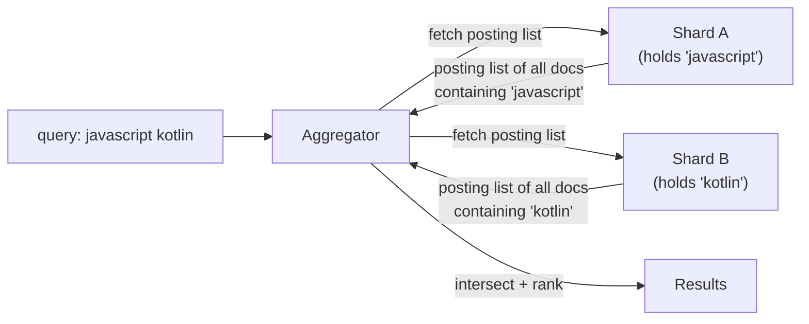
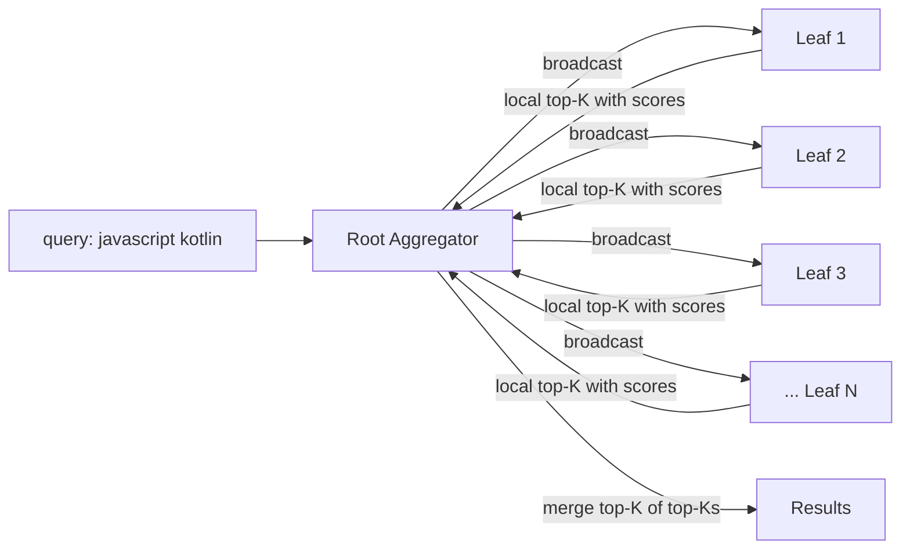
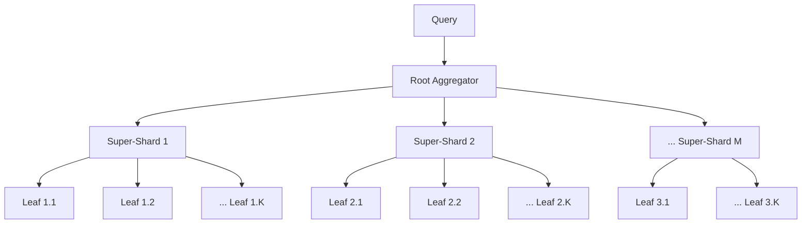
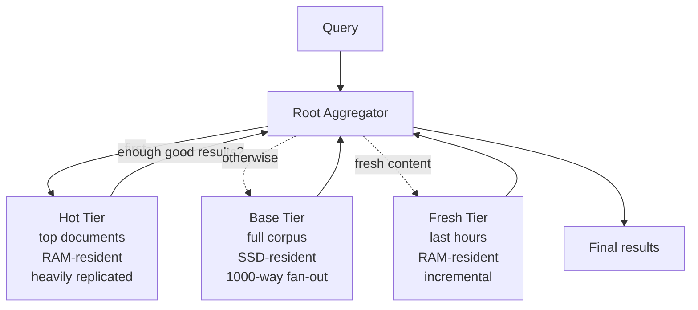

# Google Search Deep Dive — Inverted Index Sharding

**Date:** 2026-04-30 | **Updated:** 2026-04-30
**Tags:** `system-design` `case-study` `google-search` `deep-dive` `inverted-index` `sharding`

> Companion to [Design Google Search](../design-google-search.md), expanding the *Inverted Index Sharding — Term-Partitioned vs Doc-Partitioned* subsection.

## Table of Contents

- [Summary](#summary)
- [Overview](#overview)
- [Term-Partitioned vs Doc-Partitioned](#term-partitioned-vs-doc-partitioned)
  - [Term-Partitioned (Global Index)](#term-partitioned-global-index)
  - [Doc-Partitioned (Local Index)](#doc-partitioned-local-index)
  - [Side-by-Side Trade-offs](#side-by-side-trade-offs)
  - [Why Google Picked Doc-Partitioned](#why-google-picked-doc-partitioned)
- [Doc-Partitioned Architecture](#doc-partitioned-architecture)
  - [Hierarchy of Aggregators](#hierarchy-of-aggregators)
  - [Per-Leaf Shape](#per-leaf-shape)
- [Scatter-Gather and Query Latency Math](#scatter-gather-and-query-latency-math)
  - [The Tail-at-Scale Problem](#the-tail-at-scale-problem)
  - [Hedged and Backup Requests](#hedged-and-backup-requests)
- [Aggregation at the Root](#aggregation-at-the-root)
- [Replication for Availability](#replication-for-availability)
- [Rebalancing Strategy](#rebalancing-strategy)
- [Hot-Shard Mitigation](#hot-shard-mitigation)
- [Index Size Math (PB-scale)](#index-size-math-pb-scale)
- [Compression](#compression)
  - [Variable-Byte (VByte)](#variable-byte-vbyte)
  - [FOR-PFD / PForDelta](#for-pfd--pfordelta)
  - [Roaring Bitmaps](#roaring-bitmaps)
  - [Choosing an Encoding](#choosing-an-encoding)
- [Tiered Indexes](#tiered-indexes)
- [Anti-Patterns](#anti-patterns)
- [Related](#related)
- [References](#references)

## Summary


Web-scale search has exactly two sharding choices for an inverted index: split the **vocabulary** across machines (term-partitioned, also called *global* index) or split the **document collection** across machines (doc-partitioned, also called *local* index). On paper, term-partitioning looks attractive because a query touches only the shards holding its terms. In practice, it produces extreme load skew (the shard holding *the* sees every query), bandwidth-heavy cross-shard intersections, and write fan-out that scales with vocabulary breadth. Google, like virtually every web-scale search system since the original GFS/MapReduce era, runs a **doc-partitioned** index with thousands of leaf shards organized hierarchically under super-shards and a root aggregator. The query model is **scatter-gather**: every query is broadcast to every shard in a tier, each leaf returns its local top-*K*, and aggregators merge. Tail latency at thousand-way fan-out is the dominant operational problem and is fought with replication, hedged requests, request cancellation, and tiered indexes that cache hot documents separately. The compressed inverted index runs at tens of petabytes; the encodings (variable-byte, FOR-PFD/PForDelta, Roaring) and the layout choices around them determine whether a shard fits in RAM and whether the query stays inside the 200ms budget.

## Overview

The parent case study (`design-google-search.md`) treats the inverted index as a single building block sharded across thousands of leaves. This document opens that block.

The questions answered here:

1. **Why doc-partitioned and not term-partitioned?** What do the trade-offs actually look like on real hardware?
2. **What does scatter-gather cost in milliseconds?** Where is the tail?
3. **How does the system survive a slow or dead leaf?** Replication and hedging.
4. **How do you rebalance an index that is petabytes in size?** Without taking the system down.
5. **What kills you?** Hot shards from skewed routing, mismatched tiering, or pathological compression choices.
6. **How big is the index and what does the math say about RAM/SSD/disk?**
7. **Which compression scheme matters where?** VByte vs FOR-PFD vs Roaring.
8. **Why a separate top-100 / hot tier?** Tiered indexes.

The sharding generalities and TF-IDF/BM25 background are covered in [`../../../building-blocks/search-systems.md`](../../../building-blocks/search-systems.md). This doc assumes you've read that and the parent case study.

## Term-Partitioned vs Doc-Partitioned

### Term-Partitioned (Global Index)

Each shard owns a disjoint slice of the **vocabulary**. The shard for `javascript` holds the **entire** posting list for `javascript` regardless of where in the corpus the documents live. To answer `javascript kotlin`:

The vocabulary partition is typically by hash of term — `shard = hash(term) mod N` — though range partitioning by alphabet exists in some niche enterprise systems. Hash partitioning evens the *count* of terms per shard but does nothing for query traffic skew, because traffic is dominated by a few very common terms regardless of how their hashes fall.



The intersection and ranking happen at the aggregator, which means the **raw posting lists travel across the wire**. A common term's posting list can have hundreds of millions of doc IDs at web scale; even compressed, that is hundreds of megabytes per query. Multiply by query rate and the network melts.

Skew is intrinsic. Zipf's law says term frequency falls roughly as `1/rank`, so the top-100 terms cover a huge fraction of all query traffic. Whichever shard gets `the`, `a`, `is`, `to`, `of` becomes the bottleneck of the entire system, and there is no random reassignment that fixes it — those terms have to live somewhere.

There are partial mitigations — keep stop-word posting lists *only* for phrase queries, replicate hot-term shards heavily, segment the most popular postings into special "global" shards visible to every query node — but they all amount to "make this shard look more like several shards," which is the doc-partitioned model in disguise.

Updates fan out across vocabulary. Adding one new HTML document with 500 unique terms requires writing to up to 500 shards (one per term). Indexing throughput collapses, especially when those writes need to be coordinated for posting-list ordering. Bulk-update batching helps but doesn't eliminate the cross-shard coordination cost.

Memory locality is also poor: a shard sees a wildly heterogeneous mix of documents (every doc that happens to contain its assigned terms). Per-doc forward indexes — useful for ranking signals — would have to be replicated across every term shard whose terms appear in that document, multiplying storage. In practice, term-partitioned designs split the inverted index from the forward index, which means another network hop during ranking.

### Doc-Partitioned (Local Index)

Each shard owns a disjoint slice of the **document set**. Shard 0 holds doc IDs in `[0, 10M)`, shard 1 holds `[10M, 20M)`, etc. Each shard builds **its own complete local inverted index** over its slice. To answer `javascript kotlin`:



Each leaf intersects the posting lists locally — they are right there on the same disk, in the same memory-mapped file, behind the same skip list. Only the **top-K candidates** (a few hundred per leaf) travel back to the aggregator, not the raw postings. Network cost is bounded by `K × N_shards`, not by posting-list length.

Writes are local to one shard. Random doc-ID assignment evens the load. Failures are isolated: a dead shard removes a small slice of the corpus, not a whole vocabulary stripe.

### Side-by-Side Trade-offs

| Dimension | Term-Partitioned | Doc-Partitioned |
|---|---|---|
| Shards touched per query | Few (one per term) | Every shard in tier |
| Cross-shard wire traffic | Whole posting lists | Top-*K* lists only |
| Load balance | Highly skewed (Zipf) | Even (random doc IDs) |
| Index update locality | Fan-out across vocabulary | Local to one shard |
| Tail latency profile | Worst posting list dominates | Slowest leaf dominates |
| Failure blast radius | Whole-term outage | Slice of corpus |
| Retrieval-side ranking | Aggregator must score | Leaf scores locally |
| Per-shard cache effectiveness | Low (one shard sees one term) | High (shard sees same docs repeatedly) |
| Hot-shard mitigation | Hard (term distribution is fixed) | Easy (replication / sub-shard) |

### Why Google Picked Doc-Partitioned

The published descriptions — Jeffrey Dean's various talks, the *Web Search for a Planet* paper (Barroso, Dean, Hölzle, 2003) — describe a deeply hierarchical doc-partitioned design. The reasoning has aged well:

1. **Tail-latency tooling exists for the slowest-of-N problem.** Hedged requests, backup requests, per-shard SLO tracking, request cancellation — every standard technique applies. The slowest-bandwidth-posting-list problem of term-partitioning has no equivalent toolbox.
2. **Even hardware utilization with no operator effort.** Random doc assignment is the cheapest possible load balancer. No capacity planning per term.
3. **Index updates are local.** Crawl ingest writes to one shard. Crucial when you're indexing tens of millions of new documents per hour.
4. **Failure isolation.** A dead shard means partial recall; the aggregator can ship partial results with an internal "missing shard" tag. A dead term shard means the system silently returns wrong answers to any query containing that term.
5. **Co-location wins.** Doc-partitioned shards can be replicated and migrated as one unit. Term-partitioned would force the most popular postings onto the smallest fraction of nodes — exactly backwards.

Term-partitioning still appears in research and in some enterprise search deployments where the corpus is stable and queries are heavily skewed toward a known vocabulary, or where the network is so fast that posting lists *can* cross the wire. At web scale, with arbitrary natural-language queries and a corpus that grows by tens of millions of documents per day, it loses.

**Operationally, the case for term-partitioning collapses on three points**:

1. *Network bandwidth* — long posting lists must cross the wire to be intersected, and the bandwidth cost grows with corpus size.
2. *Hot shards* — Zipfian term distribution means a few shards always carry disproportionate load.
3. *Update fan-out* — adding a single document writes to many shards, breaking the indexing throughput budget.

Doc-partitioning trades these for one big problem — *fan-out tail latency* — for which the entire industry has standard tooling (hedging, replication, partial results, tiering). It's a problem you can engineer around. The term-partitioned problems are not.

## Doc-Partitioned Architecture

### Hierarchy of Aggregators

A flat fan-out from one root to thousands of leaves is operationally awful: a single root must hold thousands of in-flight RPCs, the network ingress to that one machine spikes hard on every query, and a root failure takes down the whole tier. The fix is **hierarchical aggregation**.



A super-shard is itself a small aggregator: it fans out to its leaves, each leaf returns top-*K*, the super-shard merges to a top-*K'*, and the root merges across super-shards. With 32 super-shards × 32 leaves = 1024 leaves, the root only fans out to 32 endpoints; each super-shard handles 32. The depth keeps any single point from becoming the choke.

### Per-Leaf Shape

A leaf owns a slice of the corpus — typically tens of millions of documents — and serves the **complete inverted index** over that slice plus per-doc metadata for snippet generation and ranking signals. A leaf typically holds:

- **Term dictionary** (FST or sorted block index, memory-mapped). Maps term → file offset of posting list.
- **Posting list file** (compressed, memory-mapped or held in RAM for hot terms).
- **Doc-values / forward index** for ranking signals (PageRank, freshness, click signals, language).
- **Snippet store** (compressed text fragments) for SERP rendering, often offloaded to a co-located doc server rather than the leaf itself.
- **Local result cache** keyed by query terms.

The leaf executes the full first-stage scoring locally: skip-list intersections over posting lists, BM25 + signal-weighted scoring, and a heap of size *K* to track local top results. It returns those *K* scored doc IDs (and enough metadata for the aggregator to ask the correct doc server for snippets).

**Skip-list intersection** is the primitive that makes posting list AND fast. A posting list stores periodic skip pointers — every 64 or 128 entries, a pointer to the next block of doc IDs and the file offset to jump to. Intersecting `A AND B` walks both lists; whenever one list's current doc ID falls behind the other, the algorithm can skip forward without decoding every intermediate block. For a long common-term list (`the`) intersected with a rare term (`octocat`), the algorithm walks the rare list and skips through the common list — total work proportional to the rare list's length, not the common list's. This is why query-time cost is dominated by the *rarest* term in the query, not the most common, and why removing stop words from posting lists is mostly a storage optimization, not a query-speed one.

**Segment immutability**. Within a leaf, the index lives as a set of immutable segments (Lucene-style). Updates are written to a new small segment; deletes are tombstones in a per-segment live-docs bitmap; periodic background merges combine small segments into larger ones. Readers see a snapshot of segments — they never observe a half-written file. This is exactly the same model as the [search systems building block](../../../building-blocks/search-systems.md) at the single-Lucene-index level, scaled up to many leaves.

**Index file shipping**. The output of the indexing pipeline is a directory tree of immutable segment files per shard, plus metadata. These files are uploaded to a distributed file system (Colossus internally; conceptually, see the [DFS / erasure coding building block](../../../building-blocks/distributed-file-systems-and-erasure-coding.md)) and pulled by leaf nodes during the rollover window. A leaf doesn't construct its index in place; it receives a pre-built file and memory-maps it. This separation — index *construction* (offline batch) from index *serving* (online leaf) — is fundamental to the design and is what lets the serving fleet stay simple while the indexing pipeline does the heavy lifting.

## Scatter-Gather and Query Latency Math

A round of scatter-gather looks like:

```text
t = 0          root receives query
t + 1ms        query understanding done (rewrites, parsing)
t + 2ms        root fans out to 32 super-shards
t + 12ms       super-shards fan out to ~32 leaves each
t + 60ms       leaves complete first-stage retrieval, return top-K
t + 80ms       super-shards merge, return top-K' to root
t + 90ms       root merges, sends candidate set to second-stage reranker
t + 150ms      reranker (neural / heavy features) returns
t + 180ms      SERP composer runs (snippets, knowledge panel, ads)
t + 200ms      response shipped
```

This is illustrative, not measured — the actual numbers are not public. The shape, however, is durable: **most of the budget is leaf-level work and reranking**, and most of the *variance* is in the leaves.

### The Tail-at-Scale Problem

If each leaf has p99 latency of 50ms, and a query fans out to 1000 leaves, the **probability that at least one leaf is in its tail is ~1 − 0.99¹⁰⁰⁰ ≈ 100%**. Without intervention, the slowest of N gets worse with N: the system's p50 starts looking like a single leaf's p99.5 or worse.

This is the *tail at scale* problem (Dean & Barroso, *The Tail at Scale*, CACM 2013). The mitigations are not optional at this size.

### Hedged and Backup Requests

**Hedged requests**. Send the request to one replica; if it doesn't return within a percentile-tracked threshold (say, the shard's p95), send a duplicate to a second replica and take whichever returns first. Cancel the slower one when the fast one wins. Cost: roughly `1 + (1 − p95)` replicas per request, i.e., ~5% extra load for a sharply lower tail.

**Backup requests with cross-server cancellation**. Send to two replicas immediately, cancel the loser. Higher load but tighter latency. Used selectively for the most latency-critical paths.

**Adaptive timeouts**. Each shard has a learned latency profile; the aggregator's timeout for that shard is, say, p95 + slack. If the shard misses, the aggregator either hedges or proceeds with partial results.

**Partial results.** The aggregator returns whatever it has at the deadline. A missing leaf means a small slice of the corpus is silently absent — measurable as a recall regression in offline eval, but invisible to most users.

**Co-scheduling and cross-server cancellation**. When a hedged duplicate is sent, the system has to ensure both replicas don't burn full CPU on the same query forever. RPC frameworks like gRPC support cancellation propagation; the loser's leaf-side handler observes a cancellation signal mid-computation and bails out. Without this, hedging triples the cluster's *useful* CPU spend.

**Synchronized interrupts**. A subtle trick: cluster-wide GC / kernel daemons / log rotation create correlated latency spikes (the "GC pause that hits every leaf in the same minute"). Synchronizing those events deliberately — running them in narrow scheduled windows, not staggered randomly — actually *reduces* user-visible tail latency, because a query that lands during the pause window can be retried at the next moment, instead of finding "one slow shard" on every query forever. This is counterintuitive and is one of the operational insights from *The Tail at Scale*.

**Per-shard SLO budgets.** Each leaf has a strict per-query latency budget — say, 30ms — enforced by the leaf itself. If first-stage scoring exceeds the budget, the leaf returns whatever it has so far (a partial top-*K*) rather than blocking the aggregator. The aggregator treats partial returns as a recall hint but not a hard error. Combined with hedging, this gives a smooth latency distribution even under load spikes.

**Critical-path isolation**. Anything not on the query critical path (background merges, cache repopulation, log shipping) runs in lower-priority schedulers so it cannot starve query CPU during a load spike. The OS-level priority enforcement (cgroups, isolation domains) matters as much as the application-level scheduling.

## Aggregation at the Root

Aggregation is mathematical: each leaf returns its local top-*K* by score; the aggregator merges into a global top-*K* using a heap. With *N* leaves each returning *K* candidates, the aggregator's work is `O(N × K × log K)` for the merge — small at *K* = 1000, *N* = 32 (super-shard level) or *N* = ~1000 (root with flat fan-out).

A subtlety: BM25's IDF (inverse document frequency) wants **global** statistics. Each leaf knows only its local document frequency. Two strategies:

1. **Pre-computed global IDFs.** Every leaf carries a copy of the global IDF table, refreshed when the index is rebuilt. Cheap at query time.
2. **Two-pass retrieval.** Leaves report their per-term local DFs in a first round-trip; the aggregator computes IDFs and asks the leaves to score. Doubles the round-trips. Almost never used at web scale.

Approach (1) is universal. The IDF table is rebuilt each indexing cycle and shipped with the index.

After merging, the aggregator passes the candidate set (typically a few hundred to a few thousand documents) to the **second-stage reranker**, which scores with heavier features (neural language models, click signals, personalization) and produces the final top-10. The reranker is described in detail in the parent case study; here it matters because it caps the *K* that leaves must produce — a large *K* means a heavier reranker bill, a small *K* loses recall.

**Score normalization across leaves.** A leaf's local top-*K* is computed in *that leaf's* score space. With pre-shipped global IDFs (strategy 1 above), the BM25 portion is comparable across leaves. But many ranking signals — PageRank, click weight, freshness — live in the forward index and are not corpus-relative; they are absolute per-doc numbers. The aggregator can therefore compare scores directly. The pitfall to watch is when a leaf carries a *different version* of the global IDF table (mid-rollout), in which case scores from different leaves silently drift. Index versioning at the leaf level is what prevents this; the aggregator refuses to merge results from leaves on incompatible index versions and treats them as missing.

**Result deduplication.** Multiple URLs can map to near-duplicate content (mirrors, syndicated articles, paginated sequences). Deduplication is conceptually a SERP-time concern, but it leans on per-doc fingerprints stored in the forward index of each leaf, which the aggregator uses to drop near-duplicates from the candidate set before the reranker.

## Replication for Availability

Every shard has multiple replicas (commonly 3+). Replication serves three purposes:

1. **Read throughput.** Queries can land on any replica.
2. **Availability.** A leaf failure removes one replica from rotation; the rest absorb load.
3. **Hedging / backup requests.** Need a second replica to send the duplicate to.

**Failure-domain placement**. Replicas are spread across racks, power domains, and (for some indexes) data centers. A correlated failure — power loss to a rack, a network partition between rows — should not take all replicas of any single shard down. Cluster managers like Borg / Kubernetes encode failure domains as constraints; the index manager places replicas to satisfy them.

**Geographic replication**. The query-serving stack runs in many regions. Each region holds a full copy of the index (or, for very large indexes, a copy of the *active* tier with cold tiers fetched on demand). Crawl and indexing happen centrally; the built index is shipped to regions and atomically promoted.

**Atomic version flip.** A new index version is shipped to a region as immutable files. The index manager flips the alias from `index_v1234` to `index_v1235` once enough replicas are warm. Old version is retained briefly in case of rollback. This is the same flip-an-alias pattern as the `_reindex` workflow in Elasticsearch (see [`../../../building-blocks/search-systems.md`](../../../building-blocks/search-systems.md)).

**Read-after-write within the freshness tier**. The base index changes through batch rebuilds (slow), but the freshness tier accepts incremental updates. Replication inside the freshness tier uses a different mechanism — typically a small Paxos / Raft group per fresh-shard for the metadata, with the actual posting deltas streamed to all replicas. This is a different consistency model than the base tier, and the leaves expose both indexes side by side; the aggregator queries both.

**Replica warm-up**. A new replica receiving a freshly-shipped index file is *cold*: page cache is empty, RAM-resident postings are not loaded. A query routed to a cold replica suffers a tail-latency spike. Index managers throttle traffic to cold replicas — say, 10% of normal QPS — until cache hit rates recover, then fully promote. This is one reason hedged requests matter even with healthy replicas: a cold replica is "healthy" by liveness checks but slow.

## Rebalancing Strategy

A petabyte-scale index does not allow free reshuffling. The strategies in practice:

**1. Plan for growth at index design.** Pick a doc-ID space (say, 64 bits) large enough that you never re-bucket. Hash documents into shards using `shard = hash(doc_id) mod N_shards` — but `N_shards` is a sizing decision that survives many index rebuilds. Common play: target ~10–50 GB per shard *now* with headroom for 2–3× corpus growth.

**2. Build, don't migrate.** A new index is built from scratch each indexing cycle (full or partial). If `N_shards` needs to change, the new index gets the new layout and the old one is retired when the new one is promoted. **There is no live "online resharding."** Index builds are offline batch jobs in the indexing pipeline.

**3. Consistent hashing for replicas, not for primary placement.** Within a shard, replicas can move between nodes via consistent hashing (rendezvous hashing or jump-consistent-hash) so that node failures don't trigger mass data movement. The shard *boundaries* are stable; the *placement* of each shard is fluid.

**4. Tier promotion / demotion.** Hot tiers (see [Tiered Indexes](#tiered-indexes)) move documents between tiers based on click signals and freshness. This is a per-document migration, not a shard-level rebalance.

**5. Sub-sharding hot shards.** When monitoring shows one shard taking disproportionate query CPU, split it into two without touching the rest. Doc-ID hashing makes this clean: shard 17 splits into 17a (`hash mod 2 == 0`) and 17b (`hash mod 2 == 1`). The aggregator's routing table changes; everything else is local.

**6. Index file format stability.** A petabyte index can't be re-encoded every release. The on-disk format is versioned with strong backward-compatibility guarantees: new readers must handle old segments. Lucene formalizes this with a per-segment codec version; Google's internal formats follow the same discipline. Format upgrades happen on the next *full* rebuild, not as a live migration.

The combination — stable hash, full rebuilds for global layout changes, local sub-sharding for hot spots — gives a cluster that can grow for years without downtime. The price is that a layout error compounds: choose `N_shards` too small and your shards bloat; choose too large and your fan-out factor and cluster-state cost go up. There's no painless do-over.

## Hot-Shard Mitigation

Even with random doc assignment, hot shards happen:

1. **Skewed query traffic per topic.** A breaking news event drives all queries to documents that cluster temporally — and the freshness tier may have those docs concentrated in a few shards.
2. **Skewed ranking signals.** Documents with high PageRank get re-fetched and re-snippeted disproportionately.
3. **Adversarial / bot traffic.** Crawler-targeting attacks can pump traffic toward predictable doc subsets.

The mitigation playbook:

| Technique | What It Does | Cost |
|---|---|---|
| Add replicas to hot shard | Spreads read load | Storage + RAM |
| Sub-shard hot shard | Halves the hot doc set per shard | One reindex of one shard |
| Per-shard rate limiting | Sheds traffic at the aggregator | Some queries get partial results |
| Hot-doc cache at aggregator | Skip the leaf for the top-N most-requested docs | Cache invalidation complexity |
| Tiered index promotion | Move hot docs to a small, heavily-replicated hot tier | Operational overhead |
| Better doc-ID hashing | Re-randomize on next full build | One indexing cycle |

The default first move is **add replicas** — it's cheap and reversible. Sub-sharding follows when replicas alone aren't enough. Tiering is the long-term answer for the highest-traffic documents.

**Detection matters as much as mitigation.** Hot shards are not always obvious from raw QPS metrics — a shard can be hot in *CPU per query* without being hot in request count, because the documents in that shard happen to score expensively (long position lists, many candidates above the threshold, etc.). Per-shard tracking has to include CPU-time-per-query and per-query memory bandwidth, not just RPS.

## Index Size Math (PB-scale)

A back-of-envelope to size storage. Numbers are illustrative; the point is the *shape*.

**Corpus assumptions:**

- 10¹⁰ web documents indexed (only a fraction of the crawled web).
- Average ~3 KB of useful text per document after boilerplate stripping.
- Total decompressed text: 10¹⁰ × 3 KB = **30 PB**.
- Average ~500 unique terms per document.
- Vocabulary size: ~10⁸ unique terms (English + multilingual + URLs + numbers + entities).

**Inverted index posting count:**

- Total postings = 10¹⁰ docs × 500 terms/doc = **5 × 10¹² postings**.
- Per-posting payload (uncompressed): doc_id (8B) + tf (4B) + positions (~10 B avg) ≈ 22 B.
- Uncompressed inverted index: 5 × 10¹² × 22 B ≈ **110 PB**.

**Compressed index:**

- Delta-encoded doc IDs + variable-byte / FOR-PFD: ~3–5× compression on doc IDs.
- Position compression (gap encoding): ~2–4×.
- Overall: 4–8× compression typical for a real Lucene-style index.
- Compressed inverted index: 110 PB / 6 ≈ **15–20 PB**.

**Per-shard sizing:**

- Doc-partitioned shards of 10⁷ docs each → 10¹⁰ / 10⁷ = **1000 shards** at the simplest layout.
- Per-shard compressed index: 15 PB / 1000 ≈ **15 GB** of inverted index.
- Plus forward index, doc values, snippet store: typical leaf carries 30–100 GB of total data.
- Replicated 3×: total cluster footprint ≈ 50–60 PB.

**RAM vs SSD vs disk:**

- Term dictionary (FST or sorted block index) is small relative to postings — a few hundred MB per shard. Memory-mapped, lives in page cache.
- Posting lists for hot terms (top thousands) are pinned in RAM.
- Cold terms (long-tail vocabulary) are SSD-resident, fetched on demand. Modern NVMe gives ~50 µs random reads; one or two seeks per posting list is acceptable.
- Cold tiers (low-PageRank, low-freshness docs) can live on spinning disk or even archive storage if access frequency is low enough.

The exact ratios shift over the years as RAM gets cheaper and SSDs get faster, but the **stratification — RAM → NVMe → SSD → disk** is permanent.

**One more practical constraint:** the term dictionary's *fanout* matters as much as its size. An FST with 10⁸ terms has very high branching at the root; navigating it during query time is a few hundred nanoseconds per term. Cache-line layout of the FST nodes determines whether term lookup is one cache miss or ten. Lucene's FST encoder packs nodes aggressively for cache locality; equivalent care goes into the corresponding Google internal data structure.

## Compression

Posting lists compress well because they are sequences of monotonically increasing integers (after sorting by doc ID) with small gaps. Three encoding families dominate.

### Variable-Byte (VByte)

Encode each integer as a sequence of bytes; use 7 bits for payload and 1 bit as a continuation flag.

- 0–127: 1 byte (high bit 0).
- 128–16383: 2 bytes (high bit 1 in first byte).
- And so on.

Pros: simple, byte-aligned (no bit-twiddling), CPU-cheap to decode. Pairs well with delta encoding: store gaps `d_i = doc_i − doc_{i-1}`, which are usually small.

Cons: not the densest. A delta of `5` still costs 1 byte (could fit in 3 bits).

VByte is the workhorse for general-purpose posting lists where decode speed matters more than absolute density. Lucene historically used it before moving to PFor-style schemes for the bulk path.

### FOR-PFD / PForDelta

**Frame-of-Reference (FOR)**: take a block of *N* integers, find the minimum, store the minimum once and the deltas in a fixed bit-width that fits the range.

**PForDelta (PFor)**: block-wise FOR with an exception path. For a block of 128 deltas, pick a bit width *b* (say, 5 bits) that fits **most** values; store outliers in an exception list with their positions. Decode is SIMD-friendly: unpack 128 fixed-width values in one shot, then patch exceptions.

Pros: very dense for typical Zipfian gap distributions, and SIMD decode is extremely fast. Modern variants (BitPacking, NewPFor, OptPFor, AFOR, SIMD-BP128) push hundreds of millions of integers per second per core.

Cons: more complex than VByte. Block size and bit-width choice matter; getting them wrong loses the density gains.

This is the family Lucene moved to (`PostingsFormat` / `PForUtil`) and the published Google-era IR papers describe variants of. For dense, long posting lists (common terms), FOR-PFD is the right answer.

### Roaring Bitmaps

Roaring is a hybrid bitmap representation: split the integer range into 16-bit chunks; for each chunk, choose the densest of (a) sorted array, (b) bitmap, (c) run-length encoding.

- Cardinality < 4096: array container.
- Cardinality ≥ 4096 with no long runs: bitmap container (8 KB fixed).
- Long runs: run container.

Pros: very fast set operations (intersection, union) with SIMD-accelerated bitmap AND. Excellent for **doc-ID sets with no payload** — filter postings, deletion bitmaps, "documents matching this geo-region", etc. Used in Lucene for the live-docs (deletion) map and increasingly for filter caches.

Cons: doesn't carry per-posting payloads (term frequencies, positions). Used as a complement to PFor-encoded full posting lists, not a replacement.

### Choosing an Encoding

| Posting kind | Best fit | Why |
|---|---|---|
| Short tail-term list (< 128 docs) | VByte / array | No block-amortization benefit; simple wins |
| Long common-term list | PForDelta | Dense, SIMD decode |
| Filter / deletion bitmap | Roaring | Fast bitwise ops, no payload |
| Position list (within a posting) | VByte / FOR | Small gaps, varies per doc |
| Doc values / numeric | Bit-packing | Fixed-width values, columnar scan |

Real engines layer these: a Lucene-style `PostingsFormat` uses block-based PFor for the doc-ID + frequency stream, VByte for in-block residuals, and Roaring for live-docs. The compression scheme is not one decision; it's a layout per stream.

**Decode speed dominates over compression ratio at query time.** A posting list that is 10% smaller but 2× slower to decode is a net loss because query CPU is the binding constraint. PForDelta's value over plain VByte is not denser bytes (it's only marginally denser) — it's that the SIMD-decoded block can produce 128 doc IDs into registers in a handful of cycles, whereas VByte's serial branch-on-continuation-bit decode is harder to vectorize. Modern Lucene benchmarks show ~5–10× decode throughput improvements from PFor variants over VByte for the dense common-term path.

**Block boundaries and skip lists**. Block-based encodings (PFor) interact with skip lists naturally: a skip pointer points to the start of a block, and intersection can advance block-by-block when one list is far ahead of the other. The block size (typically 128) is a trade-off: larger blocks compress better but make finer-grained skipping less effective. 128 is the empirical sweet spot for web-scale workloads.

**Compression of position lists**. Positions within a document are small integers (word offsets), gap-encoded, with delta-of-deltas to exploit the fact that consecutive query terms are often near each other. Position decoding is only triggered when the query needs phrase matching or proximity scoring; for many queries, position data can be skipped entirely. This is why a leaf can store positions on slower storage (SSD, even disk) without hurting most queries — only phrase queries pay the position-fetch cost.

## Tiered Indexes

A tiered index keeps the most-likely-relevant documents on the fastest path and falls back to deeper tiers only when needed.



**Hot tier (top documents).** A small index — say, the top 100M docs by PageRank or click weight — replicated heavily, RAM-resident, with very low fan-out. Most navigational queries (`facebook login`, `twitter`) hit this and return in tens of milliseconds without touching the deep base.

**Fresh tier.** Documents indexed in the last minutes/hours. Tiny in size, easy to update, fully RAM-resident. Lets news, social, and rapidly-changing pages appear quickly without forcing a full base-index rebuild. Documents migrate from fresh to base on the next batch indexing cycle.

**Base tier.** The full corpus, SSD-resident, doc-partitioned across thousands of leaves. Hit when the query needs depth (long-tail informational queries, rare-term queries, region-specific results).

**Cold tier.** Very low-PageRank or rarely-visited documents; possibly on disk; possibly indexed at lower fidelity (no positions, fewer signals). Hit only when the upper tiers don't have enough.

The aggregator's logic: query the hot and/or fresh tier first; if there are enough high-quality results above a quality threshold, return without going to the base. Otherwise, fan out to base.

The tiers are not just a latency win — they're a **cost** win. The hot tier sees the bulk of QPS, so concentrating compute and RAM there gives huge cost-per-query savings. The deep base sees a small fraction of traffic and can run on cheaper hardware.

This pattern shows up everywhere: Elasticsearch ILM with hot/warm/cold node roles is the same idea applied to logs and observability ([`../../../building-blocks/search-systems.md`](../../../building-blocks/search-systems.md)). The Google version is older and more aggressive.

**Tier promotion criteria.** Documents move between tiers based on observed signals: click-through rate from real query logs, PageRank, recency of update, query coverage (does this doc actually appear in top-K candidate sets often?). The promotion logic is a periodic batch job — usually daily — that re-partitions the doc set across tiers. The boundary is fuzzy and tunable; the trade-off is hot-tier size (smaller = faster, less recall) vs base-tier traffic (larger hot tier offloads more of base).

**Quality threshold for early termination.** When the aggregator queries the hot tier first, it needs a way to decide "are these results good enough?" The standard answer is a learned threshold on the top-K hot scores, calibrated against offline relevance judgments. If the top result's score exceeds a confidence threshold, return without going to base. If not, fan out to base in parallel and merge — paying both costs but ensuring quality. The fall-back fan-out is the common case for long-tail informational queries.

**Result caching at every tier.** Each tier keeps its own result cache keyed by query (or query + filter set). A repeated query for `weather san francisco` hits the hot tier, finds a cached result, and never touches a leaf. Cache TTL is short (minutes) for freshness-sensitive queries and longer (hours) for stable navigational queries. Cache key normalization — case folding, stop-word stripping for cache lookups, locale awareness — is non-trivial and is usually shared with the query-understanding stage.

**Per-leaf cache budget.** A leaf typically reserves 30–50% of its RAM for the OS page cache (mapped index files), 20–30% for in-process caches (decoded posting blocks, query result cache), and the rest for the JVM/process heap or working set. The split is workload-dependent: a leaf serving navigational queries benefits more from result cache; a leaf serving long-tail informational queries benefits more from posting block cache. This is tuned per leaf role.

**Cache invalidation on index roll**. When a new index version is promoted, all caches on the leaf are stale. A naive flush causes a thundering-herd cold-cache spike. The standard pattern is **incremental promotion**: hold the old index alongside the new one, gradually shift queries to the new index, let its cache warm, and only then retire the old. Memory cost is roughly 2× the index size during the rollover window.

## Anti-Patterns

1. **Term-partitioning a web-scale index.** Looks elegant on a whiteboard. Produces hot shards (Zipf), bandwidth-heavy intersections (long postings cross the wire), and write fan-out to many shards per document. Doc-partitioning won the operational war.
2. **Flat fan-out from a single root to thousands of leaves.** The root becomes the network choke point. Use a hierarchy of aggregators.
3. **Online resharding of a multi-PB index.** Don't. Build a new index with the new shard count and atomically swap. Plan for 2–3× growth headroom at every cycle.
4. **Compressing position streams with bitmaps.** Roaring is for sets, not for payload-carrying postings. Use PForDelta or VByte for position deltas; reserve Roaring for filters and live-docs.
5. **Per-leaf BM25 scoring with local IDFs.** Different leaves see different document frequencies for the same term, so the scores aren't comparable. Pre-compute global IDFs at index-build time and ship them with the index.
6. **Single replica per shard.** Loss of any one machine causes silent recall regression. Always replicate. Hedging needs a peer to hedge against.
7. **No partial-result handling.** A single slow leaf taking down a query is a fan-out trap. Either hedge or accept partial results with a "missing shard" tag.
8. **Top-K too low.** If leaves return *K* = 10, the second-stage reranker has no candidates to choose from and the final ordering collapses. *K* per leaf is typically a few hundred to a thousand.
9. **Top-K too high.** Wastes wire bandwidth and reranker CPU. Tune *K* against offline relevance metrics; bigger *K* has rapidly diminishing returns past the reranker's effective discrimination.
10. **No tiering.** Forcing every navigational query through a 1000-way fan-out wastes 99% of the cluster on work that a 50M-doc hot tier could answer in 10ms. Tiering is not optional at scale.
11. **Mixing fresh and base in one shard.** Fresh content needs frequent updates; base content is rebuilt in batch. Mixing them ruins the immutability of the base segments and the freshness of the fresh tier. Keep them in separate indexes / tiers, query both, merge.
12. **Forgetting that the index is a derived projection.** The crawl + parsed-doc store is the system of record. The inverted index is rebuildable. A bug in the indexer should never lose data — it should produce a bad index that gets rebuilt.
13. **Compressing for ratio, not for decode speed.** A 10% smaller posting list that takes 2× the CPU to decode is a query-time regression. Pick encodings where SIMD-friendly block decode dominates the decision.
14. **Putting position data on the hot path.** Positions are needed only for phrase / proximity queries. Storing them inline with the doc-ID + TF stream forces every term scan to skip past them. Lay them out in a separate file, fetched only when the query needs proximity.
15. **Replicating the freshness tier the same way as the base.** Fresh content has different update patterns (high write rate, small total size). Use a Paxos/Raft-style replication for fresh shards and bulk file shipping for the base.
16. **Promoting a new index without warm-up.** A region that suddenly serves on cold replicas spikes p99 catastrophically. Always pre-warm caches before flipping the routing alias.

**Cluster heterogeneity is the rule, not the exception.** A serving fleet over its lifetime accumulates multiple hardware generations: leaves on older CPUs are slower per-query but cheaper per-GB; newer NVMe gives lower posting-fetch latency. The aggregator's hedging and timeout logic *learns* per-replica latency distributions, so a slower-but-not-pathological leaf is treated correctly without manual tuning. Without this, hardware refresh cycles would force expensive lock-step upgrades.

**The design ages well because the constraints don't change.** Posting list compression, scatter-gather aggregation, hot-tier separation, and replication for tail tolerance are not artifacts of one era's hardware. RAM gets bigger, SSDs get faster, networks get fatter — but the *ratios* between them stay similar, and the algorithmic choices that minimize cross-tier traffic (decode close to data, ship only top-*K*, replicate hot data) remain optimal. The architectural design Barroso et al. described in 2003 is still recognizable in modern web search; the numbers changed, the shape didn't.

## Related

- [Design Google Search](../design-google-search.md) — parent case study; this doc expands the *Inverted Index Sharding* subsection.
- [Search Systems building block](../../../building-blocks/search-systems.md) — Lucene/Elasticsearch fundamentals: term dictionary, posting lists, segments, BM25, and the GIN tie-in.
- [Sharding Strategies (Tier 3)](../../../scalability/sharding-strategies.md) — generalized term- vs doc-partitioning, consistent hashing, rebalancing primitives.
- [Caching Layers](../../../building-blocks/caching-layers.md) — per-shard query cache and root-level result cache patterns.
- [Distributed File Systems and Erasure Coding](../../../building-blocks/distributed-file-systems-and-erasure-coding.md) — where the immutable index segments live and how they're shipped to regions.

## References

- Manning, Raghavan, Schütze — [*Introduction to Information Retrieval*](https://nlp.stanford.edu/IR-book/) (Cambridge, 2008). The standard textbook. Chapters 4–6 cover index construction and compression; Chapters 7–8 cover ranked retrieval and evaluation; Chapter 20 covers web crawling and distributed indexes.
- Barroso, Dean, Hölzle — [*Web Search for a Planet: The Google Cluster Architecture*](https://research.google/pubs/web-search-for-a-planet-the-google-cluster-architecture/) (IEEE Micro, 2003). The early architectural overview describing doc-partitioned sharding, hierarchical aggregation, and commodity-hardware design.
- Dean, Barroso — [*The Tail at Scale*](https://research.google/pubs/the-tail-at-scale/) (Communications of the ACM, 2013). The canonical paper on hedged requests, backup requests, and the slowest-of-N problem in scatter-gather systems.
- [Apache Lucene Documentation](https://lucene.apache.org/core/documentation.html) — `org.apache.lucene.codecs` for posting formats; `org.apache.lucene.index` for segment internals.
- [Lucene `PostingsFormat`](https://lucene.apache.org/core/9_9_0/core/org/apache/lucene/codecs/PostingsFormat.html) — the pluggable posting-list encoder API; default uses block-based PFor with VByte residuals.
- Lemire & Boytsov — [*Decoding Billions of Integers Per Second Through Vectorization*](https://arxiv.org/abs/1209.2137) (2015). The SIMD-BP128 / FastPFor work behind modern PForDelta variants.
- Chambi, Lemire, Kaser, Godin — [*Better bitmap performance with Roaring bitmaps*](https://arxiv.org/abs/1402.6407) (Software: Practice & Experience, 2016). The Roaring bitmap design and benchmarks.
- Zukowski, Héman, Nes, Boncz — [*Super-Scalar RAM-CPU Cache Compression*](https://homepages.cwi.nl/~boncz/papers/06-CWI-SSC-CPU-Cache.pdf) (ICDE, 2006). The PForDelta paper.
- Witten, Moffat, Bell — *Managing Gigabytes* (Morgan Kaufmann, 1999). Older but still the cleanest treatment of integer compression for IR.
- Croft, Metzler, Strohman — [*Search Engines: Information Retrieval in Practice*](https://ciir.cs.umass.edu/irbook/) (2015). Practitioner-oriented complement to Manning et al.
- [PostgreSQL GIN Documentation](https://www.postgresql.org/docs/current/gin.html) — for the small-scale baseline; same inverted-index concept inside a relational engine.
