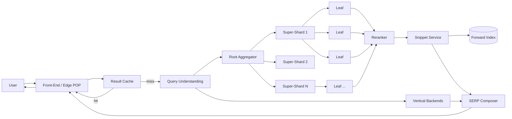
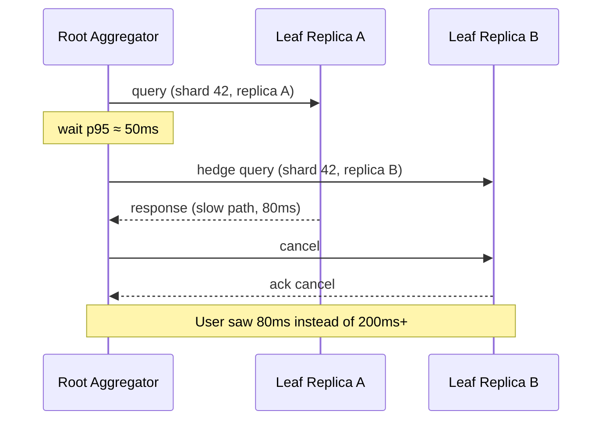
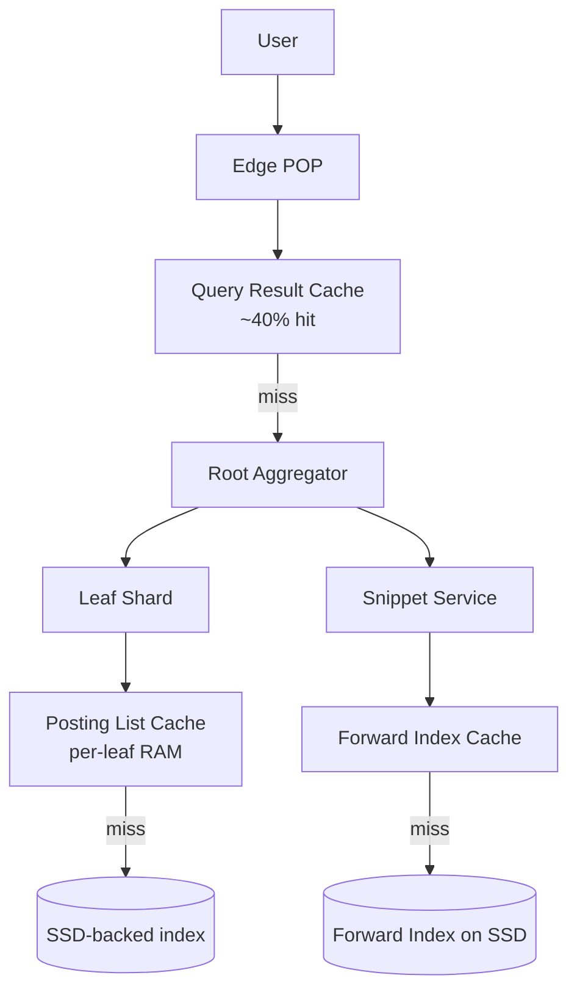

# Google Search Deep Dive — Query Serving and the Latency Budget

**Date:** 2026-04-30 | **Updated:** 2026-04-30
**Tags:** `system-design` `case-study` `google-search` `deep-dive` `latency` `performance`

## Table of Contents

- [Summary](#summary)
- [Overview — What "Sub-Second" Actually Buys You](#overview--what-sub-second-actually-buys-you)
- [The Latency Budget](#the-latency-budget)
- [Query Path Stages](#query-path-stages)
  - [1. Front-End and Cache Check](#1-front-end-and-cache-check)
  - [2. Query Understanding](#2-query-understanding)
  - [3. Retrieval — Fan-Out to Leaf Shards](#3-retrieval--fan-out-to-leaf-shards)
  - [4. Ranking — First Stage and Second Stage](#4-ranking--first-stage-and-second-stage)
  - [5. Composition — Snippets, Verticals, SERP](#5-composition--snippets-verticals-serp)
- [Per-Stage Latency Math](#per-stage-latency-math)
- [Tail Latency from Stragglers](#tail-latency-from-stragglers)
- [Hedged Requests, Tied Requests, Backup Requests](#hedged-requests-tied-requests-backup-requests)
- [Cache Layers](#cache-layers)
  - [Query Result Cache](#query-result-cache)
  - [Posting List Cache](#posting-list-cache)
  - [Forward Index Cache](#forward-index-cache)
  - [Cache Hierarchy and Invalidation](#cache-hierarchy-and-invalidation)
- [Storage Tier — RAM, SSD, and the Cost Curve](#storage-tier--ram-ssd-and-the-cost-curve)
- [The Tail at Scale Paper — Key Results](#the-tail-at-scale-paper--key-results)
- [Fanout Math](#fanout-math)
- [Per-User Ranking Signal Joins](#per-user-ranking-signal-joins)
- [Anti-Patterns](#anti-patterns)
- [Related](#related)
- [References](#references)

## Summary

A Google web search returns ten ranked results in roughly the time it takes a human to blink. Behind that single round-trip the system fans a query out to thousands of leaf servers, intersects compressed posting lists across tens of billions of documents, runs a learning-to-rank model over hundreds of candidates, generates highlighted snippets from a forward index, blends federated verticals (news, images, video, knowledge graph), and composes a SERP — all under a few hundred milliseconds. The hard part is not "do these things"; it is "do them at thousand-way fan-out, with one of the leaves stalling at any given moment, and never let the user wait." This deep dive expands the **Query Serving and the Latency Budget** subsection of the [Google Search case study](../design-google-search.md). It walks through the query path stage-by-stage, derives the per-stage budgets from a 200 ms p99 target, and grounds the discussion in the **fan-out tail amplification** result from Dean & Barroso's *The Tail at Scale* (CACM 2013) — the paper that named the problem and prescribed hedged requests as the canonical mitigation.

## Overview — What "Sub-Second" Actually Buys You

Sub-second latency is not a vanity metric. The product economics are sharp:

- **User abandonment.** Google's own studies (Brutlag, 2009) showed that adding 100–400 ms of artificial delay measurably reduced searches per user — and the effect persisted for weeks after the delay was removed. Search latency is not a one-time cost; users learn that a search engine is slow and search less.
- **Crawl-rank-serve coupling.** A slow serving stack constrains how many ranking signals you can compute online. If your reranker has 30 ms, it is a small transformer; if it has 5 ms, it is a linear model. The latency budget is the *capacity envelope* for ranking quality.
- **Fan-out economics.** A single user query touches thousands of CPUs across multiple data centers. The serving cost is roughly proportional to fan-out × per-leaf work. Cutting per-leaf work by 10 ms across 1000 leaves saves more aggregate compute than any reranker tweak.
- **Tail latency dominates user experience.** As shown in [performance-budgets-and-latency.md](../../../performance-observability/performance-budgets-and-latency.md), at fan-out 1000 the user-visible p50 is dominated by per-leaf p99.9. The system spends most of its engineering effort fighting this single phenomenon.

The 200 ms p50 / 300 ms p99 budget is not arbitrary. It is the longest latency that still feels instantaneous in the *Web Search for a Planet* era — fast enough that users do not perceive a wait, slow enough to actually run the work.

## The Latency Budget

End-to-end, from request hitting the front-end to first SERP byte on the wire:

| Target | Value |
|---|---|
| p50 end-to-end | ≤ 100 ms |
| p95 end-to-end | ≤ 200 ms |
| p99 end-to-end | ≤ 300 ms |
| p99.9 end-to-end | ≤ 500 ms (graceful degradation acceptable) |

Decomposed by stage (typical p50 contribution; p99 is roughly 2–3x):

| Stage | Budget (p50) | Budget (p99) | Notes |
|---|---|---|---|
| Front-end + parse + result-cache check | 5–10 ms | 15 ms | Edge POP terminates TLS; lookup keyed on canonicalized query |
| Query understanding (spell, synonyms, intent, entity link) | 10–20 ms | 30 ms | Pre-loaded models, embedding lookup, KG join |
| Fan-out scheduling (root → super-shard → leaf) | 5–10 ms | 15 ms | Mostly RPC dispatch, hedge scheduling |
| Per-leaf retrieval (postings scan + first-stage scoring) | 30–50 ms | 80 ms | Postings in RAM; SIMD-decoded; top-K heap per leaf |
| Hedged-request mitigation overhead | 0 ms (amortized) | -50 ms (improvement) | Fires on the slow tail; cuts p99 |
| Aggregation (root merge of per-shard top-Ks) | 5–10 ms | 15 ms | Heap-merge a thousand streams |
| Second-stage neural reranker | 20–40 ms | 60 ms | GPU/TPU-served small transformer on ~1000 candidates |
| Snippet generation | 10–20 ms | 30 ms | Forward index lookup + highlight |
| Vertical backends (news, images, KG, ads) in parallel | 30–50 ms | 80 ms | Each has its own SLO; late ones drop |
| SERP composition | 5–10 ms | 15 ms | Layout policy; HTML/JSON serialization |
| Network egress to user | varies | varies | Often dominated by client RTT, not server work |

The horizontal sum is more than 100 ms because **stages run in parallel where possible**. Verticals run concurrently with reranking; snippets are generated concurrently with vertical retrieval; the front-end starts streaming SERP HTML before all verticals finish. The critical path is roughly: front-end → query understanding → fan-out → per-leaf retrieval → reranker → snippet → SERP composition.

## Query Path Stages



### 1. Front-End and Cache Check

The front-end runs on edge POPs close to the user. Its job is parse-and-route: validate the query string, normalize casing/whitespace, strip tracking params, attach locale (`hl=en`, `gl=us`, `safe=...`). Then it checks the **result cache**.

- The cache key is `(canonicalized_query, locale, language, safe_search, vertical)`.
- A hit returns a fully-rendered SERP in <20 ms total. About 30–40% of Google's traffic hits the result cache because of head-query concentration (Zipf-distributed query frequencies).
- A miss falls through to query understanding.

### 2. Query Understanding

Before retrieval can run, the query must be transformed:

- **Spell correction.** "horse riding equiptment" → "horse riding equipment". Trained on the query-revision log (when users issue query A then B within seconds, B is a likely correction of A).
- **Synonym/stemming expansion.** "running shoes" can also retrieve "runner shoe", "jogging sneaker" — lower-weighted terms added to the index lookup.
- **Entity recognition.** "barack obama" matches a knowledge graph entity. Triggers the knowledge panel and changes ranking weights.
- **Intent classification.** Navigational, informational, transactional, local. Different intents weight the freshness signal, change the rerank features, and determine SERP layout.
- **Semantic embedding.** A BERT-class encoder produces a query vector for dual-encoder retrieval and reranking signals (Pandu Nayak's 2019 *Understanding searches better than ever before* announcement marks Google's adoption).

This stage runs on pre-loaded models with low-latency embedding lookups. It must finish in ~20 ms p99. The output is a `parsed_query` structure: rewritten terms, expansions, intent label, entity hits, query embedding.

### 3. Retrieval — Fan-Out to Leaf Shards

Retrieval is **doc-partitioned scatter-gather**. The root aggregator broadcasts the parsed query to all leaves in the relevant tier (fresh + base in parallel), each leaf intersects its local posting lists, scores candidates with a cheap first-stage function, and returns its local top-K (typically K = 1000 per leaf).

Hierarchy:

- **Root aggregator** receives the query.
- It dispatches to ~tens of **super-shard aggregators** (one per super-region or per index partition).
- Each super-shard dispatches to ~hundreds of **leaf shards** that hold the actual posting lists.
- Each leaf returns top-K to its super-shard.
- Super-shards merge to top-K' and return to root.
- Root produces the final candidate set (a few thousand) for reranking.

Why hierarchy: a flat 1000-way fan-out from a single root creates a wire-traffic spike at the root. Hierarchical aggregation trims top-K at every layer, bounding bytes-per-hop.

Per-leaf work in detail:

```text
for each query term t in parsed_query.terms:
    posting_list = leaf.postings[t]                # gzip-block-compressed
    decode_block(posting_list, query_position)     # SIMD varint decode

intersect posting lists by document id            # skip-list-accelerated

for each candidate doc d in intersection:
    score = bm25(d, q) + w_pr * pagerank(d)
                       + w_quality * quality(d)
                       - w_spam * spam(d)
                       + freshness_boost(d, intent)
                       + anchor_score(d, q)

heap.push((score, doc_id))                        # bounded heap of size K
```

The leaf returns a list of `(doc_id, first_stage_score, snippet_hint)`. No document text crosses the wire at this stage — only IDs and scores.

### 4. Ranking — First Stage and Second Stage

**First stage** is computed inside each leaf during the postings scan, as shown above. BM25 is the workhorse; PageRank, quality, spam, and freshness are static signals stored on each doc record.

**Second stage** runs at the root aggregator on the merged candidate set (a few hundred to a few thousand docs). The reranker is a learned model — historically gradient-boosted decision trees, today neural (transformer encoders that compare query embedding to doc embedding plus hand-engineered features). Inputs include:

- All first-stage signals.
- Per-field BM25 (title vs body vs URL vs anchor).
- Click-through priors (per-query, per-doc).
- Dual-encoder semantic similarity.
- Document-level features (E-E-A-T-style aggregate quality, dedup penalties, site-level signals).
- Snippet-level features (does the snippet actually answer the query?).

The reranker scores the candidate set and emits the final order. Latency budget: 20–40 ms p50, 60 ms p99 for ~1000 candidates. This is achievable because the model is small and runs on GPU/TPU pools that batch requests across multiple in-flight queries.

### 5. Composition — Snippets, Verticals, SERP

Once the top ~10 documents are picked, the snippet service runs in parallel:

- For each top doc, fetch the forward-index entry (full text, term positions, field offsets).
- Locate query-term matches in the document.
- Select a passage maximizing term coverage and readability.
- Highlight matched terms server-side.

In parallel, vertical backends (news, images, video, KG, ads) each receive the parsed query and return their own top-N results. Each has its own SLO; if a vertical times out, it is dropped from the SERP.

The SERP composer assembles the final layout: knowledge panel, web results, news carousel, image strip, ads. A learned policy decides which verticals to surface per query.

## Per-Stage Latency Math

Why these specific budgets? Reverse-engineered from the user-visible target.

Suppose user-visible p99 target = 300 ms. Strip ~30 ms for client-network and TLS termination. Strip ~30 ms for SERP rendering and serialization. That leaves ~240 ms for serving work.

Critical-path stages (sequential):

```
front-end + parse:        15 ms  p99
query understanding:      30 ms  p99
fan-out + retrieval:      80 ms  p99
aggregation:              15 ms  p99
reranker:                 60 ms  p99
snippet:                  30 ms  p99
SERP composition:         15 ms  p99
                        ------
                         245 ms  worst-case sum
```

But percentiles do not sum (see [performance-budgets-and-latency.md § Percentile Composition Is Not Additive](../../../performance-observability/performance-budgets-and-latency.md#percentile-composition-is-not-additive)). The sum-of-p99s is an upper bound; the actual p99 of the composition is lower because slow events rarely co-occur. Empirically the p99 lands around 250–300 ms.

The dominant single stage is **per-leaf retrieval**. It is the largest budget item because:

- Posting-list intersection over thousands of terms × hundreds of millions of postings is genuinely heavy work.
- It happens at thousand-way fan-out, so the user-visible latency is the **max** of N leaves, not the average.
- It is the hardest to parallelize within a leaf (each query is already on one leaf; further parallelism is across queries).

**Worked example — single-shard scoring loop, in detail:**

For a 4-term query on a leaf holding 10^7 docs:

```text
Term "machine":     posting list ~ 5,000,000 docs (compressed ~ 25 MB)
Term "learning":    posting list ~ 2,000,000 docs (compressed ~ 10 MB)
Term "production":  posting list ~ 800,000 docs   (compressed ~ 4 MB)
Term "guide":       posting list ~ 200,000 docs   (compressed ~ 1 MB)

Step 1: order by ascending size: guide < production < learning < machine
Step 2: walk "guide" (smallest); for each doc, probe the others
        — skip-list lookups in the larger posting lists
Step 3: each surviving doc scored with BM25 + static signals
Step 4: maintain a heap of top-K (K = 1000)

Time complexity: O(|smallest| × log K + total skip-list probes)
Wall-clock at 1 GHz scoring throughput per core: ~30 ms
```

The leaf returns the heap as `(doc_id, first_stage_score)` pairs. About 8 KB per leaf response for K = 1000.

At thousand-way fan-out, that is ~8 MB returned to the root per query — non-trivial but bounded. Hierarchical aggregation (super-shards trim to top-K' < K before passing up) reduces this further.

## Tail Latency from Stragglers

Per the [tail amplification math](../../../performance-observability/performance-budgets-and-latency.md#tail-amplification-at-fan-out-n):

> If each leaf has p99 = 100 ms, and the root waits for **all 1000 leaves**, the user-visible p99 is essentially 100 ms with probability `1 - 0.99^1000 ≈ 99.996%`. The user almost always sees the slow tail.

Where do the leaf-level stragglers come from? Dean & Barroso enumerate the typical sources:

1. **Shared resources.** CPU contention from co-tenant jobs, memory bandwidth saturation, network interface queue buildup.
2. **Daemons and background tasks.** Garbage collection on the JVM, log flushes, monitoring agents, kernel timer interrupts.
3. **Global resources.** Distributed file system metadata locks, cluster scheduler decisions.
4. **Maintenance activity.** Index updates being applied, log rotation, cache warming.
5. **Queueing.** Even a Poisson arrival process at 80% utilization produces 99th-percentile queue waits that are 5x the mean — the M/M/1 result.
6. **Power management.** Frequency scaling, C-state transitions, throttling.

The realization in *The Tail at Scale* is that these are **unavoidable**: any large-scale shared system has them, and engineering them out individually is asymptotically impossible. Instead, build the orchestration to be **tolerant** of tail outliers. The two main techniques:

- **Hedged requests** — issue a duplicate after the p95 has elapsed.
- **Tied requests** — issue both at once with mutual cancellation.

Both convert tail probability into an OR of two replicas: a 1% tail per replica becomes a 0.01% tail at the orchestrator level.

## Hedged Requests, Tied Requests, Backup Requests

(These are the same techniques surfaced in [performance-budgets-and-latency.md § Hedged Requests](../../../performance-observability/performance-budgets-and-latency.md#hedged-requests-and-tied-requests); here we focus on how Google Search applies them.)

### Hedged Requests in Search

For each leaf shard the root keeps a per-shard p95 latency estimate (sliding-window). When a query is dispatched to leaf replica A and the response has not arrived by p95, the root sends a duplicate to replica B. Whichever returns first wins; the other is canceled.

- **Cost:** 5–10% extra leaf load, since only the slow tail triggers the hedge.
- **Benefit:** user-visible p99 collapses toward p95 for that shard.
- **Idempotence:** required. Search retrieval is naturally idempotent — postings are read-only at serving time.
- **Cancellation propagation:** as soon as the root has top-K from enough shards (or from the winner of a hedge), it sends RPC-level cancellation to the loser. This is critical: without cancellation, hedging is just a 2x load multiplier.

### Tied Requests

For latency-critical paths, the root issues to **two replicas simultaneously** with the hint "your peer also has this; whoever starts processing first, tell the other to drop." The peer-to-peer cancellation eliminates queueing delay because the request is routed to whichever replica had the shortest queue.

- **Cost:** ~2x RPCs, but minimal extra CPU because cancellation usually beats processing start.
- **Benefit:** removes queueing delay from the tail entirely.
- Used in Google's BigTable client and several Spanner read paths; reasonable to assume similar use in search-leaf paths.

### Backup Requests with Cross-Server Cancellation

A more aggressive variant: issue to N replicas, take the first response, cancel the rest. Costly under load but powerful for low-volume, latency-critical paths. The published *Tail at Scale* numbers describe this technique reducing p99 by 30–40% in BigTable read latencies.



## Cache Layers

Caching is the single largest cost lever in the serving stack. The query distribution is heavily Zipfian — a small head of queries accounts for a large fraction of traffic. Three cache layers, each addressing a different reuse pattern.

### Query Result Cache

- **What it caches:** fully-rendered SERPs.
- **Key:** `(canonicalized_query, locale, language, safe_search, vertical)`.
- **Hit rate:** 30–40% on typical Google traffic.
- **TTL:** short for fresh-intent queries (minutes; trending news must update fast); long for stable queries (hours; "what is the speed of light" can cache for a day).
- **Invalidation:** time-based (TTL); occasionally event-based (a major news event triggers cache flush for affected queries).
- **Where it lives:** edge POPs and front-end fleets, in RAM. A few hundred GB across a region holds the entire head distribution.

The cache is **before** personalization. If results vary per user (signed-in, location-specific), the cache key would have to include user ID — which destroys the hit rate. Google sidesteps this by caching the unpersonalized result and applying minimal personalization (locale, language, safe-search) as part of the cache key, with personalization-heavy traffic going through a different path that does not benefit from the result cache.

### Posting List Cache

- **What it caches:** decoded blocks of posting lists.
- **Key:** `(term, shard_id, block_offset)`.
- **Where:** in-leaf RAM, alongside the on-disk index files.
- **Hit rate:** very high for common terms (the 100 most common English words are in the cache continuously). Lower for long-tail terms.
- **Why it matters:** posting-list decode is the per-leaf hot path. Caching avoids redoing the SIMD varint decode for popular terms.

For very common terms (stop-words like "the", "and", "a"), Google's index either omits them entirely (if they add no retrieval value) or stores them in a separate **frequent-term index** with aggressive compression and skip-list acceleration. This is a separate optimization from caching but addresses the same underlying skew.

### Forward Index Cache

- **What it caches:** forward-index entries (per-doc term lists, used for snippet generation and rerank features).
- **Key:** `doc_id`.
- **Hit rate:** modest for most queries (top-K docs vary per query) but high for navigational queries (`facebook.com` always returns the same top doc).

### Cache Hierarchy and Invalidation



Invalidation is mostly TTL-driven. The base index update cycle is days, so posting list caches are stable for hours. The fresh index update cycle is minutes; serving fleets receiving fresh-index segment updates explicitly invalidate cached postings for affected terms.

## Storage Tier — RAM, SSD, and the Cost Curve

The active hot index lives in **RAM**. Cold data spills to **SSD**. Tape and cold object storage hold archival corpus snapshots.

| Tier | Latency | Capacity per node | Cost per GB |
|---|---|---|---|
| L1/L2/L3 CPU cache | ns | MB | $$$$ |
| RAM (DDR4/5) | 100 ns | hundreds of GB | high |
| SSD (NVMe) | 100 µs | terabytes | medium |
| HDD | 10 ms | tens of TB | low |
| Cold object storage | 100s of ms | petabytes | very low |

The hot index is sized so that the working set fits in RAM across the leaf fleet. For a doc-partitioned design with ~1000 leaves and ~10^7 docs per leaf, each leaf holds a tens-of-GB shard in memory. SSD-backed pages serve as the second tier when RAM pressure forces evictions.

**The key economic constraint:** a posting-list scan in RAM is sub-millisecond; a posting-list scan from SSD is tens of milliseconds; a posting-list scan from HDD is hundreds of milliseconds. The latency budget effectively *requires* the active index in RAM. SSD is the cold-overflow tier, not the hot-serving tier.

This is why total fleet RAM is a primary cost driver and why posting-list compression matters so much: a 5x compression ratio is a 5x reduction in fleet size for the same coverage.

Compression techniques in posting lists:

- **Delta encoding** of doc IDs (sorted postings → small gaps → tiny varints).
- **Variable-length integers (varint)** for gaps and term frequencies.
- **Block compression** (e.g., FastPFOR, SIMD-BP128) — decode 128 ints per SIMD instruction.
- **Skip lists** for fast random access into long posting lists.
- **Quantized scores** in pre-computed scorelists (e.g., quantized BM25 or impact scores).

Modern open-source equivalents (PISA, Tantivy) implement these techniques and are useful references for the patterns Google has used internally for two decades.

## The Tail at Scale Paper — Key Results

Dean & Barroso's *The Tail at Scale* (CACM 2013) is the foundational paper for the entire field of tail-aware orchestration. The paper is short (~10 pages) and dense; the key results applicable to search:

1. **Tail amplification result.** "If a server typically responds in 10 ms but with 1% probability takes more than one second, and a user request must wait for all 100 servers in parallel to return, then 63% of user requests will take more than one second." [Direct quote, paraphrased earlier in [performance-budgets-and-latency.md](../../../performance-observability/performance-budgets-and-latency.md#tail-amplification-at-fan-out-n).]
2. **Why tails are unavoidable.** Daemon activity, GC, queueing under load, kernel scheduling, hardware variability. These are not engineering bugs to fix; they are statistical properties of large shared systems.
3. **Hedged requests.** Issue a duplicate after the p95 elapses. Costs ~5% extra load; cuts tail dramatically.
4. **Tied requests.** Issue both at once with peer cancellation. Eliminates queueing delay from the tail.
5. **Cross-replica cancellation** — the discipline that makes hedged/tied requests viable. Without cancellation, hedging just doubles load.
6. **Latency-induced probation.** A consistently slow replica is removed from the dispatch pool until it recovers. Prevents one bad node from poisoning every query.
7. **Micro-partitioning.** Splitting work into many small pieces (much smaller than the number of machines) so that the orchestrator can rebalance dynamically. A leaf shard is a micro-partition; a thousand of them across a thousand machines is the canonical setup.
8. **Selective replication.** Hot items (head queries, popular postings) get more replicas. Cold items get fewer.
9. **Backup requests with cross-server cancellation reduce BigTable read p99 by ~33%**. This is one of the few hard numbers in the paper and is widely cited.

The paper does not specifically describe Google Search latency mechanisms, but the techniques it describes are demonstrably applied across the Google serving stack.

## Fanout Math

How many machines does a single query actually touch?

Working assumptions:

- Active corpus: 10^10 docs.
- Per-leaf shard: 10^7 docs (tens of millions per machine).
- Total leaves per tier: 10^10 / 10^7 = 1000.
- Replication factor (for hedging and availability): 3.
- Total leaf machines: 1000 × 3 = 3000 leaves per region.
- Tiers: fresh + base, both queried in parallel.

Fanout per query (in one region, one tier):

```
1 root aggregator
  ├── ~10 super-shard aggregators
  │     ├── ~100 leaves per super-shard
  │     │     (each leaf may hedge to a 2nd replica → 1.05x effective)
  └── total leaves contacted ≈ 1000 (one replica per shard)
```

Plus parallel calls to vertical backends (news, images, video, KG, ads). Each vertical has its own (smaller) fan-out — news might be a few dozen leaves, images more.

So a single user query mobilizes on the order of **1000–2000 leaf processes** for a few tens of milliseconds each, plus the aggregation hierarchy, plus vertical backends. Total CPU-time per query: roughly 1000 leaves × 30 ms = 30 CPU-seconds. At 10^5 QPS, the steady-state CPU footprint is 10^5 × 30 = 3 × 10^6 CPU-seconds per second = 3 million cores busy continuously. This matches the rough order-of-magnitude footprint described in *Web Search for a Planet* (2003), scaled forward.

The fan-out is the reason hedged requests are mandatory:

- At fanout 1000 with per-leaf p99 = 50 ms, the user-visible p99 is essentially never below 50 ms.
- To achieve user-visible p99 ≤ 100 ms, you need per-leaf **p99.99** ≤ 100 ms.
- p99.99 requires either heroic GC engineering or hedged requests on the slow tail. Hedged requests are the cheaper path.

Plug numbers in: with hedged requests after p95, the user-visible p99 of a 1000-way fan-out is governed by `min(latency_A, latency_B)` for the slow shard, which is roughly the per-leaf p95² / p99 — a dramatic reduction.

**Why thousand-way and not, say, ten-way?**

The shard count is set by per-leaf working-set size. A single leaf process can hold ~10–50 GB of compressed posting lists in RAM (driven by per-machine RAM and per-process overhead). At 10^10 active docs and ~50 KB raw text per doc, the compressed index is ~50–100 TB. Divided into 10–50 GB shards: 1000–10,000 shards.

Going wider (more, smaller shards) reduces per-leaf work but worsens fan-out tail amplification. Going narrower (fewer, larger shards) reduces fan-out but increases per-leaf latency and concentrates failure blast-radius. ~1000 shards × ~50 GB each is a typical operating point, with hedged requests covering the tail. This number isn't fixed — it shifts as RAM density grows and as compression improves.

**A second knob: tier replication.**

Each shard is replicated 3x across failure domains. Three replicas serve three purposes:

1. **Availability** — losing a replica leaves two; losing a rack leaves replicas elsewhere.
2. **Hedging headroom** — hedged requests target a different replica from the original.
3. **Capacity** — at peak QPS, three replicas split traffic.

Replication factor 3 is conventional but not magic. Critical-tier indexes may be replicated more (5x); cold tail indexes less (2x).

## Per-User Ranking Signal Joins

Most ranking signals are **document-level static features** computed offline (PageRank, quality, spam, language). Some signals are **per-user and per-query dynamic** — they require an online join.

Examples:

- **Locale boost.** Pages in the user's region/language get a boost. This is a static feature lookup at scoring time.
- **Click-through priors.** For the (query, doc) pair, what fraction of users have clicked this result? Stored in a separate click-prior service keyed on (query_hash, doc_id). Fetched at rerank time.
- **Recency for trending entities.** "current weather" needs the most recent index segment, not the base index.
- **Personalization (limited).** In the published Google Search design, personalization is intentionally minimal — locale/language/safe-search. Heavy personalization shatters cache locality and is reserved for signed-in product surfaces.

These joins happen at the **reranker** stage, not at the leaf retrieval stage. The leaf returns a candidate set; the reranker enriches each candidate with per-user features pulled from the click-prior service, the user's locale, and any session signals. The reranker scores the enriched set and produces the final order.

The latency cost of the join: a click-prior service lookup keyed on (query_hash, doc_id) for ~1000 candidates is ~5 ms with a well-cached service. The reranker batches the lookups into a single RPC.

Why not push these signals into the leaves? Because they are **per-user**, and pushing user-keyed data to thousands of leaves would explode the data model. The aggregator pattern keeps user-keyed data on a small number of dedicated services and joins at rerank time when the candidate set is already trimmed to ~1000.

## Anti-Patterns

- **Sequential stage budgets that sum to the user-visible target.** If your budget says "front-end 20 ms + retrieval 100 ms + rerank 50 ms = 170 ms p99," you have already lost. Each stage's p99 individually is roughly that — but at the same time. Sum-of-p99s is an upper bound, not a forecast. Use parallelism (vertical backends concurrent with rerank, snippet concurrent with vertical fetches) and design with hedged requests in mind.
- **No hedged requests at thousand-way fan-out.** Without hedging, a 1% per-leaf slow probability becomes a 99% user-visible slow probability. This is not optional engineering; it is table stakes at this scale.
- **Cache the SERP per user.** Personalized caches don't scale (low hit rate) and unpersonalized caches mixed with personalized rendering produce subtle bugs. Cache before personalization (the candidate set) or not at all.
- **Linear-bucket histograms for latency telemetry.** Latency spans 9 orders of magnitude. Use HdrHistogram (see [performance-budgets-and-latency.md § HdrHistogram](../../../performance-observability/performance-budgets-and-latency.md#hdrhistogram--recording-latencies-without-lying)).
- **Closed-loop load testing.** Coordinated omission hides 4 orders of magnitude of tail latency. Use wrk2, k6 with constant-arrival-rate, or Vegeta.
- **Snippet generation in the leaves.** Leaves return doc IDs and scores; the forward index for snippet generation is a separate service. Pushing snippet work into leaves duplicates work and bloats per-leaf state.
- **Synchronous personalization on the critical path.** Per-user signals at the leaf level do not scale. Personalize at rerank time on the trimmed candidate set.
- **Vertical backends without per-call timeouts.** A slow image vertical without a timeout will block the SERP. Each vertical needs its own budget and a graceful-drop policy.
- **One-tier index that tries to serve both fresh and base.** The fresh tier has different update frequency, different signal completeness, and different latency profile. Two indexes are cheaper than rebuilding one index every minute.
- **Trusting the average leaf latency.** The average is not the user experience. The user experience is the **max** of fan-out latencies, which is dominated by per-leaf p99/p99.9. Optimize the tail, not the mean.
- **Ignoring cancellation propagation.** Hedged requests without cancellation are just a 2x load multiplier. Cancellation must actually free server resources, or hedging makes things worse under load.
- **Letting query understanding drift toward retrieval cost.** Query understanding budget is ~20 ms p99. If a new "smarter" query rewriter takes 50 ms, the entire downstream budget collapses. Treat query understanding as a hard budget item, not a free upgrade.

## Related

- [Design Google Search (parent case study)](../design-google-search.md) — the full system design this deep dive expands on.
- [Inverted Index Sharding — Term-Partitioned vs Doc-Partitioned](./inverted-index-sharding.md) — the sharding decision that makes thousand-way fan-out the operating point. Explains why doc-partitioning forces the latency techniques in this doc.
- [Performance Budgets and Latency](../../../performance-observability/performance-budgets-and-latency.md) — generalized treatment of percentiles, fan-out tail amplification, hedged requests, coordinated omission, and HdrHistogram. The Google Search context here is one application of that material.
- [Caching Layers building block](../../../building-blocks/caching-layers.md) — query result cache, posting list cache, forward index cache as instances of standard caching patterns.
- [Search Systems building block](../../../building-blocks/search-systems.md) — inverted indexes, retrieval, ranking primitives.
- [Sharding Strategies (Tier 3)](../../../scalability/sharding-strategies.md) — the scatter-gather pattern, doc-partitioned vs term-partitioned, hierarchical aggregation.

## References

- Jeffrey Dean and Luiz André Barroso. *The Tail at Scale.* Communications of the ACM, February 2013. <https://research.google/pubs/the-tail-at-scale/> — the canonical paper on tail amplification, hedged requests, and tied requests at Google scale.
- Luiz A. Barroso, Jeffrey Dean, Urs Hölzle. *Web Search for a Planet: The Google Cluster Architecture.* IEEE Micro, 2003. <https://research.google/pubs/web-search-for-a-planet-the-google-cluster-architecture/> — first public description of the doc-partitioned, fan-out search serving stack at Google.
- Jeffrey Dean. *Challenges in Building Large-Scale Information Retrieval Systems.* WSDM 2009 keynote. <https://research.google/pubs/challenges-in-building-large-scale-information-retrieval-systems/> — slides covering hierarchical serving, tail-latency mitigation, and the multi-tier index.
- Brutlag, Jake. *Speed Matters for Google Web Search.* Google internal study summary, 2009. <https://services.google.com/fh/files/blogs/google_delayexp.pdf> — the user-abandonment data behind why latency matters product-economically.
- Pandu Nayak. *Understanding searches better than ever before.* Google Blog, 2019. <https://blog.google/products/search/search-language-understanding-bert/> — Google's adoption of BERT-class semantic matching in Search.
- Google. *Our new search index: Caffeine.* Googleblog, 2010. <https://googleblog.blogspot.com/2010/06/our-new-search-index-caffeine.html> — the continuous-incremental-indexing infrastructure that decoupled freshness from full reindex cycles.
- Verma, Abhishek; Pedrosa, Luis; Korupolu, Madhukar; Oppenheimer, David; Tune, Eric; Wilkes, John. *Large-scale cluster management at Google with Borg.* EuroSys 2015. <https://research.google/pubs/large-scale-cluster-management-at-google-with-borg/> — the cluster manager that schedules search serving fleets; relevant for understanding co-tenancy as a tail-latency source.
- Burns, Brendan; Grant, Brian; Oppenheimer, David; Brewer, Eric; Wilkes, John. *Borg, Omega, and Kubernetes.* Communications of the ACM, 2016. <https://research.google/pubs/borg-omega-and-kubernetes/> — the lineage from Borg to Kubernetes; useful context for how serving fleets are scheduled and isolated.
- Robertson, S. and Walker, S. *Some Simple Effective Approximations to the 2-Poisson Model for Probabilistic Weighted Retrieval (BM25).* SIGIR 1994. Overview: <https://en.wikipedia.org/wiki/Okapi_BM25> — the first-stage retrieval scoring function used at the leaves.
- Brin, S. and Page, L. *The Anatomy of a Large-Scale Hypertextual Web Search Engine.* Stanford / WWW7, 1998. <http://infolab.stanford.edu/~backrub/google.html> — the original Google paper; describes the early serving architecture and PageRank.
- Manning, C. D., Raghavan, P., Schütze, H. *Introduction to Information Retrieval.* Cambridge University Press, 2008. <https://nlp.stanford.edu/IR-book/> — textbook treatment of inverted indexes, posting list compression, BM25, and tiered retrieval.
- Mallia, Antonio; Siedlaczek, Michał; Mackenzie, Joel; Suel, Torsten. *PISA: Performant Indexes and Search for Academia.* SIGIR 2019. <https://github.com/pisa-engine/pisa> — open-source modern posting-list compression and SIMD-decoded scoring; demonstrates the techniques described in this doc.
- Gil Tene. *How NOT to Measure Latency.* Strange Loop talk. <https://www.youtube.com/watch?v=lJ8ydIuPFeU> — the talk that named coordinated omission; essential viewing for any latency measurement work.
- HdrHistogram. <https://github.com/HdrHistogram/HdrHistogram> — the canonical implementation for recording latency without lying.
